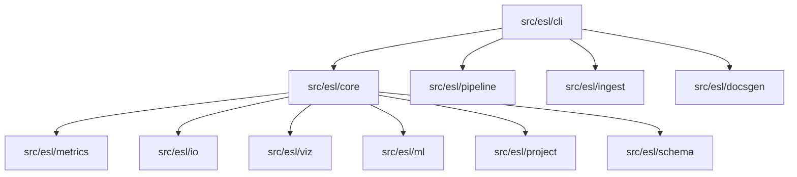
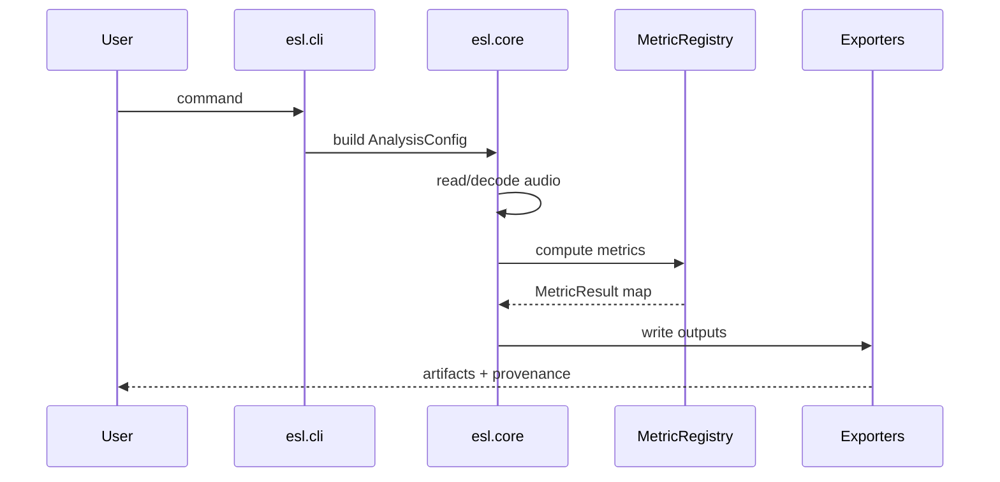
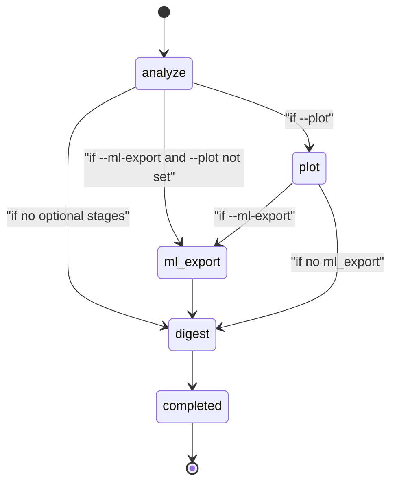
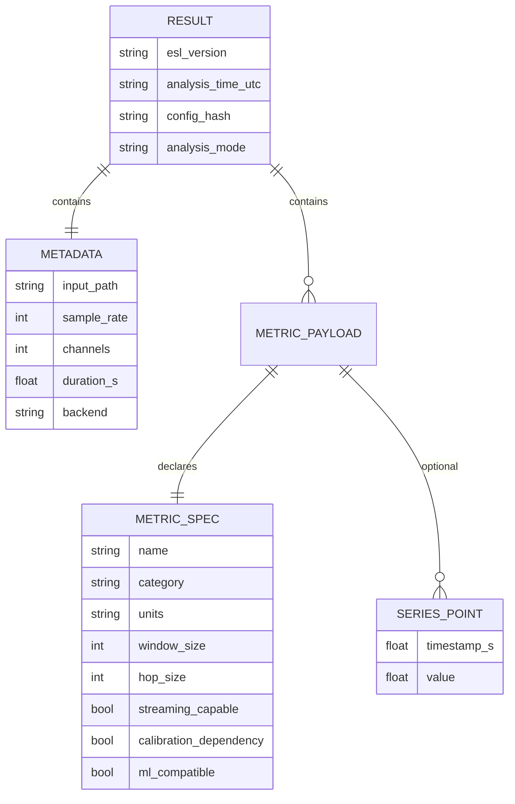
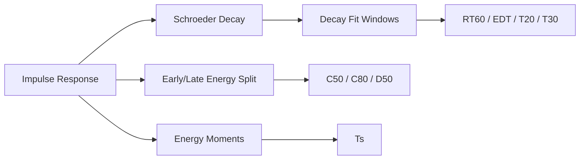
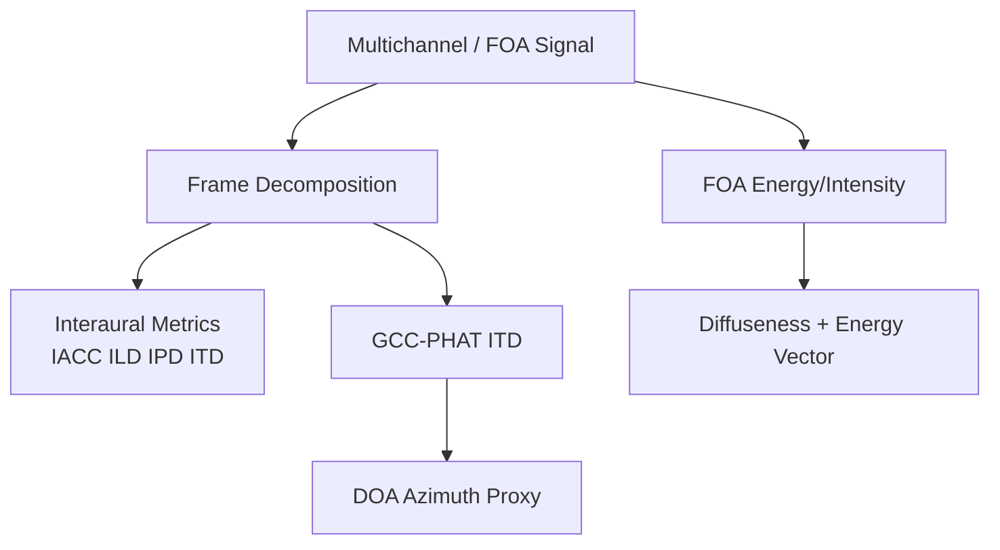
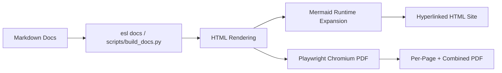
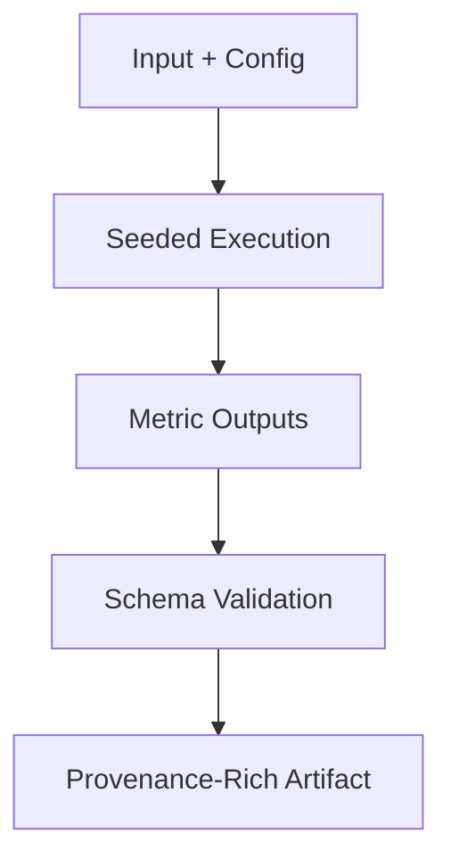

# ARCHITECTURE

See related docs:
- [`/Users/cleider/dev/ecoSignalLab/DESIGN.md`](/Users/cleider/dev/ecoSignalLab/DESIGN.md)
- [`/Users/cleider/dev/ecoSignalLab/docs/METRICS_REFERENCE.md`](/Users/cleider/dev/ecoSignalLab/docs/METRICS_REFERENCE.md)
- [`/Users/cleider/dev/ecoSignalLab/docs/ALGORITHM_INDEX.md`](/Users/cleider/dev/ecoSignalLab/docs/ALGORITHM_INDEX.md)
- [`/Users/cleider/dev/ecoSignalLab/docs/REFERENCES.md`](/Users/cleider/dev/ecoSignalLab/docs/REFERENCES.md)
- [`/Users/cleider/dev/ecoSignalLab/docs/ATTRIBUTION.md`](/Users/cleider/dev/ecoSignalLab/docs/ATTRIBUTION.md)

## Package Layout

- `src/esl/core`
  - analysis orchestration, audio I/O, calibration, context, config
- `src/esl/metrics`
  - metric contracts, helpers, built-ins, extended set, registry
- `src/esl/io`
  - export writers (`json`, `csv`, `parquet`, `hdf5`, `mat`, industrial CSV)
- `src/esl/viz`
  - static PNG and optional Plotly interactive plotting
- `src/esl/ml`
  - frame/clip feature export and optional anomaly scores
- `src/esl/ingest`
  - online ingestion connectors
- `src/esl/project`
  - project/variant index for design comparisons
- `src/esl/schema`
  - output schema definition
- `src/esl/pipeline`
  - staged CLI pipeline runner and status manifest
- `src/esl/cli`
  - command-line entrypoint
- `src/esl/docsgen`
  - Markdown -> hyperlink-rich HTML/PDF documentation builder

## Runtime Flow

1. CLI parses arguments into `AnalysisConfig`.
2. Audio loader decodes via `soundfile` or `ffmpeg` fallback.
3. `AnalysisContext` carries signal, calibration, and run config.
4. `MetricRegistry` computes selected plugins.
5. Result document assembled with provenance and metric specs.
6. Optional exports/plots/ML artifacts/project indexing are emitted.

## Staged Pipeline Flow

`esl pipeline run` executes explicit stages:
- `analyze`
- `plot` (optional)
- `ml_export` (optional)
- `digest`

Each run writes `pipeline_manifest.json` with per-stage status, timing, counts, and errors.

## Data Model

Top-level result:
- provenance (`esl_version`, `analysis_time_utc`, `config_hash`)
- metadata (input, decode backend, calibration assumptions)
- metrics map with series/summary/confidence/spec

## Architectural Acoustics Path

IR-style metrics (`rt60`, `edt`, `c50`, `c80`, `d50`, `t20`, `t30`, `ts`) are derived from energy decay via Schroeder integration with explicit confidence estimation.

## Spatial and Ambisonic Path

## Novelty + Similarity Path

## Documentation Build Path

## Reproducibility Guarantees

- Deterministic seed capture
- Config hashing
- Version stamping
- Assumption logging

## Citation and Attribution in Code

Algorithm references are embedded near implementations in:
- [`/Users/cleider/dev/ecoSignalLab/src/esl/metrics/helpers.py`](/Users/cleider/dev/ecoSignalLab/src/esl/metrics/helpers.py)
- [`/Users/cleider/dev/ecoSignalLab/src/esl/metrics/builtin.py`](/Users/cleider/dev/ecoSignalLab/src/esl/metrics/builtin.py)
- [`/Users/cleider/dev/ecoSignalLab/src/esl/metrics/extended.py`](/Users/cleider/dev/ecoSignalLab/src/esl/metrics/extended.py)
- [`/Users/cleider/dev/ecoSignalLab/src/esl/viz/plotting.py`](/Users/cleider/dev/ecoSignalLab/src/esl/viz/plotting.py)
- [`/Users/cleider/dev/ecoSignalLab/src/esl/ml/export.py`](/Users/cleider/dev/ecoSignalLab/src/esl/ml/export.py)

Open-source attribution details are maintained in [`/Users/cleider/dev/ecoSignalLab/docs/ATTRIBUTION.md`](/Users/cleider/dev/ecoSignalLab/docs/ATTRIBUTION.md).
