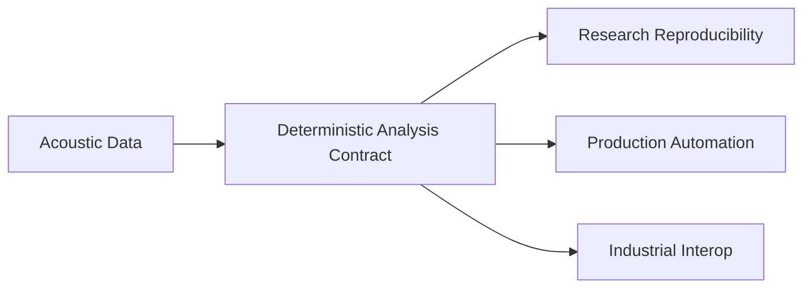
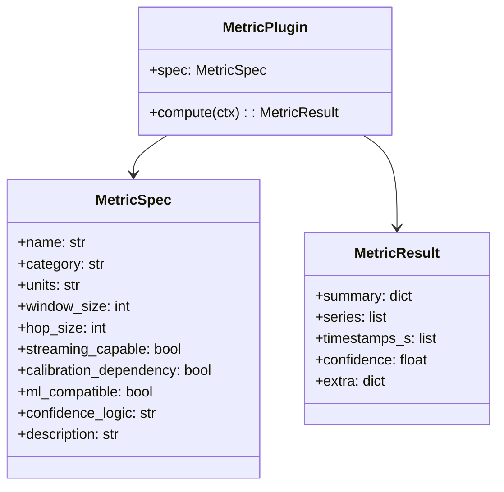
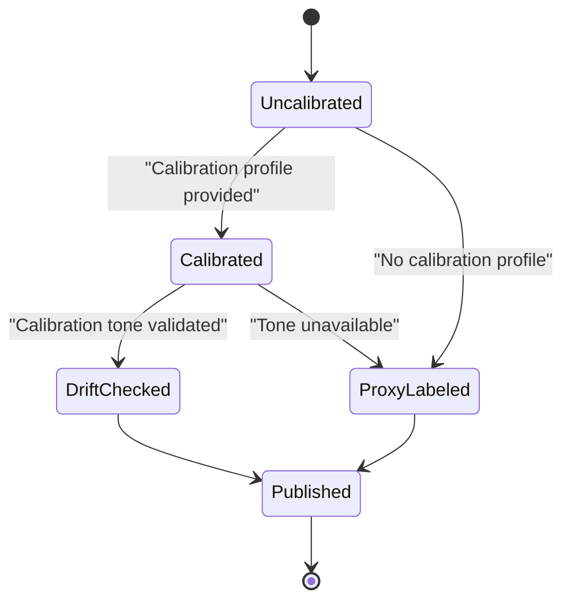
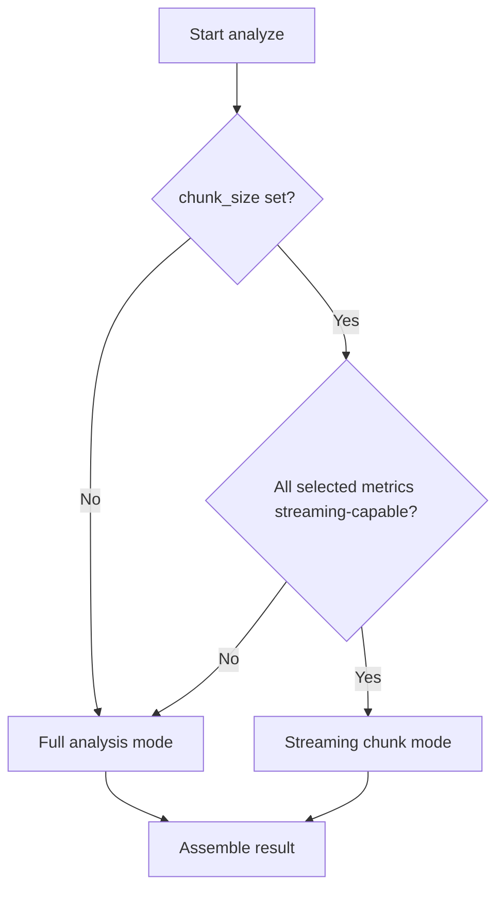
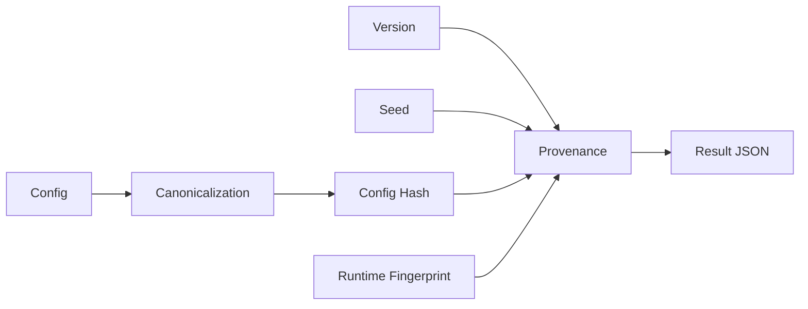
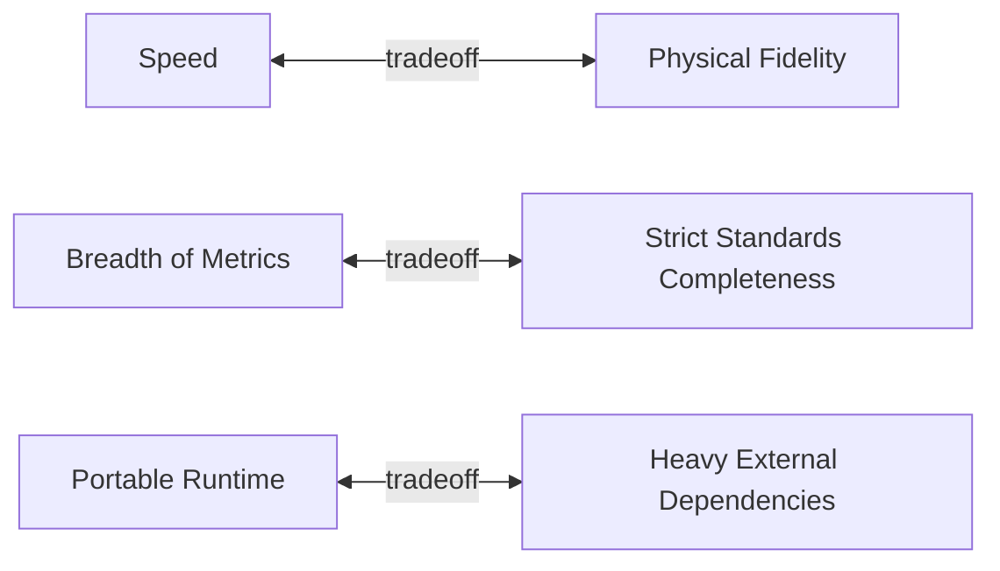
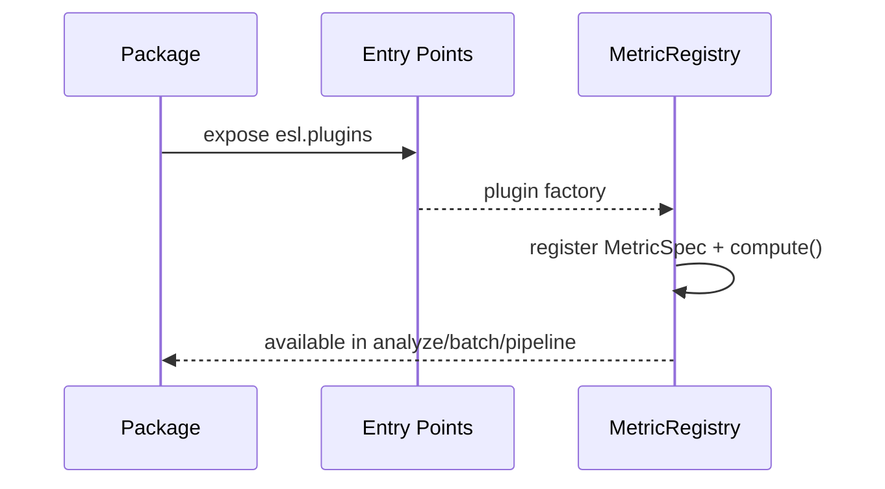

# DESIGN

`esl` is designed as a unified SDK where environmental acoustics, architectural acoustics, and ML pipelines share one reproducible analysis contract.

See also:
- [`/Users/cleider/dev/ecoSignalLab/ARCHITECTURE.md`](/Users/cleider/dev/ecoSignalLab/ARCHITECTURE.md)
- [`/Users/cleider/dev/ecoSignalLab/docs/METRICS_REFERENCE.md`](/Users/cleider/dev/ecoSignalLab/docs/METRICS_REFERENCE.md)
- [`/Users/cleider/dev/ecoSignalLab/docs/ALGORITHM_INDEX.md`](/Users/cleider/dev/ecoSignalLab/docs/ALGORITHM_INDEX.md)
- [`/Users/cleider/dev/ecoSignalLab/docs/REFERENCES.md`](/Users/cleider/dev/ecoSignalLab/docs/REFERENCES.md)
- [`/Users/cleider/dev/ecoSignalLab/docs/ATTRIBUTION.md`](/Users/cleider/dev/ecoSignalLab/docs/ATTRIBUTION.md)

## Product Intent

- One deterministic analysis contract across DSP, ecoacoustics, architectural acoustics, and ML.
- CLI-first operation for production and reproducible research.
- Explicit handling of calibration and assumptions.

## Design Principles

1. Multi-channel first
- Internal arrays are sample-major and channel-preserving: `[samples, channels]`.

2. Calibration-aware semantics
- Metrics can run without calibration, but outputs explicitly mark proxy vs calibrated SPL semantics.

3. Plugin contracts over ad hoc functions
- Each metric declares name, units, window, hop, streaming capability, calibration dependency, confidence logic, and ML compatibility.

4. Deterministic defaults
- Seed defaults to `42` and is persisted in provenance metadata.

5. Export interoperability
- Analysis output is schema-governed and exportable to scientific and industrial formats.

6. CLI-first orchestration
- Staged pipelines (`analyze`, `plot`, `ml_export`, `digest`) are first-class.
- GUI is optional, not required.

## Confidence and Calibration Semantics

## Processing Mode Decision

## Reproducibility DAG

## Tradeoffs in v0.1.x

- Broad codec support depends on local [`ffmpeg`](https://ffmpeg.org/) availability.
- SOFA support is focused on IR extraction paths, not full SOFA convention processing.
- Streaming mode prioritizes streaming-capable metrics; mixed sets fallback to full mode.
- Some advanced metrics are explicitly marked as proxies when full geometry/hardware metadata is unavailable.

## Extension Model

External plugins can be exposed through the `esl.plugins` Python entry-point group and are auto-registered when importable.

## Algorithm Citation Policy

- Core references are centralized in [`/Users/cleider/dev/ecoSignalLab/docs/REFERENCES.md`](/Users/cleider/dev/ecoSignalLab/docs/REFERENCES.md).
- Code-level references are embedded near implementations in:
  - [`/Users/cleider/dev/ecoSignalLab/src/esl/metrics/helpers.py`](/Users/cleider/dev/ecoSignalLab/src/esl/metrics/helpers.py)
  - [`/Users/cleider/dev/ecoSignalLab/src/esl/metrics/builtin.py`](/Users/cleider/dev/ecoSignalLab/src/esl/metrics/builtin.py)
  - [`/Users/cleider/dev/ecoSignalLab/src/esl/metrics/extended.py`](/Users/cleider/dev/ecoSignalLab/src/esl/metrics/extended.py)
  - [`/Users/cleider/dev/ecoSignalLab/src/esl/viz/plotting.py`](/Users/cleider/dev/ecoSignalLab/src/esl/viz/plotting.py)
- Open-source attribution and license notes are tracked in [`/Users/cleider/dev/ecoSignalLab/docs/ATTRIBUTION.md`](/Users/cleider/dev/ecoSignalLab/docs/ATTRIBUTION.md).
