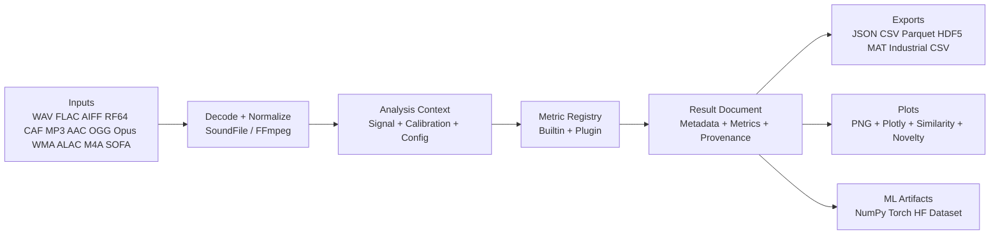
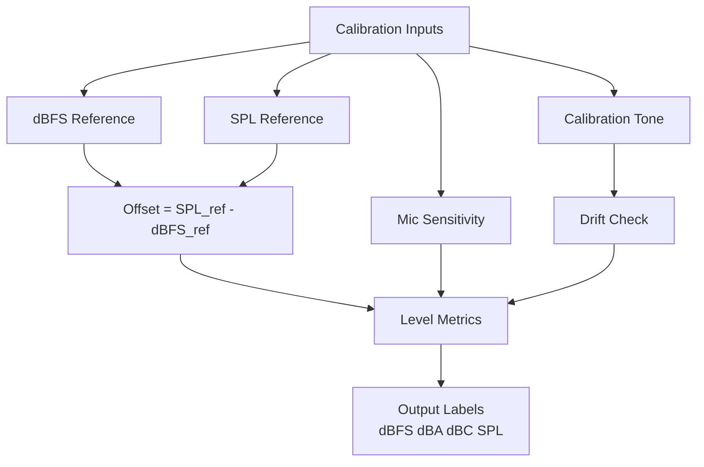
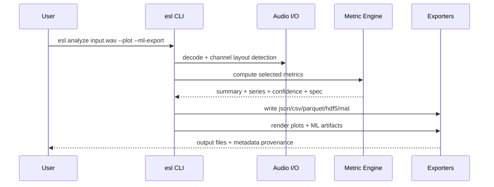
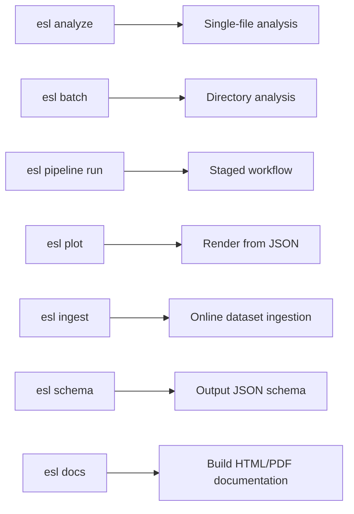
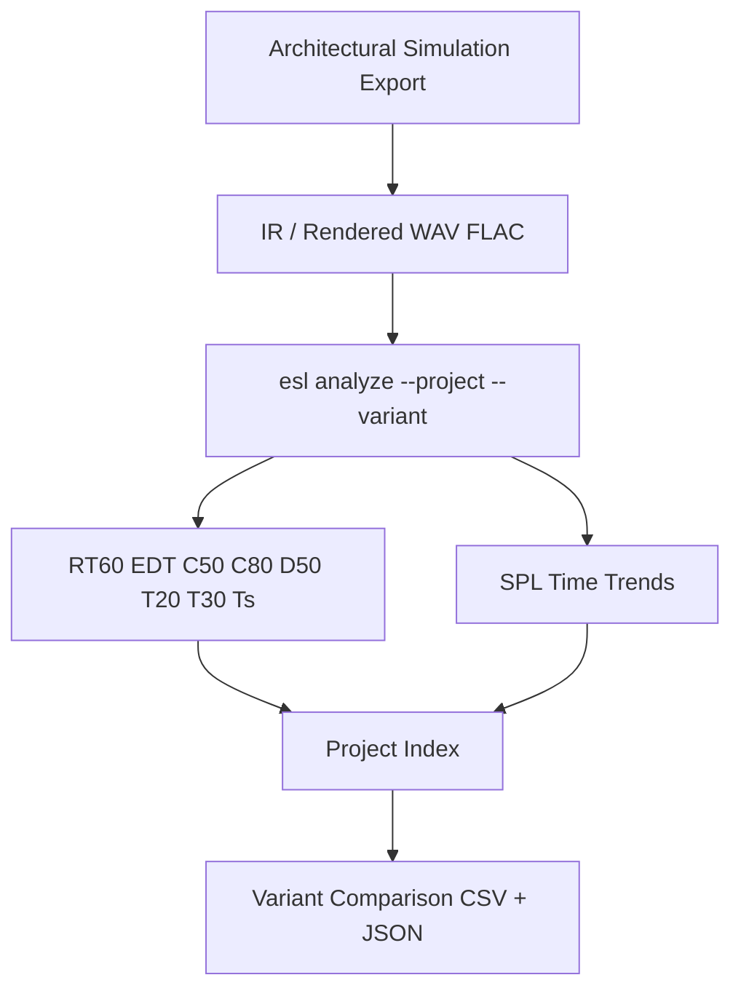
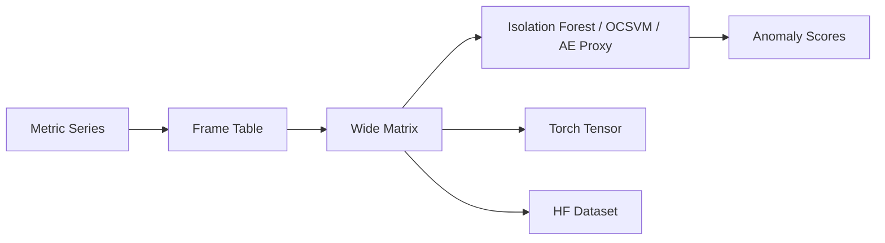
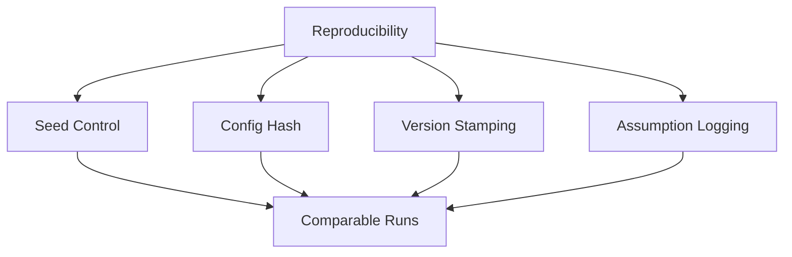
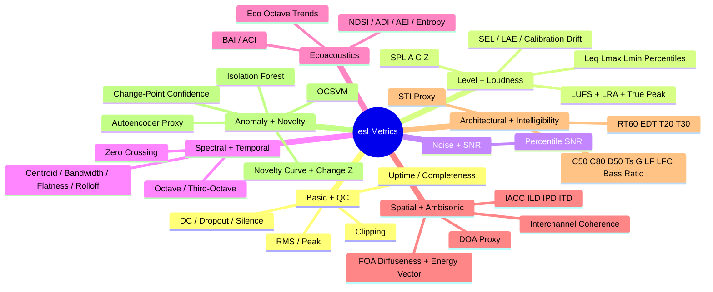

# ecoSignalLab (`esl`)

`esl` is an open-source, production-oriented acoustic analytics SDK for environmental, architectural, and industrial audio workflows.

Core goals:
- Multi-channel native (`1..N`) with ambisonic-compatible handling
- Calibration-aware (`dBFS <-> SPL`, `dBA`, `dBC`, `dBZ`)
- ML-ready feature export (NumPy, PyTorch, Hugging Face)
- Architectural simulation compatible (IR metrics and project variants)
- Industrial measurement interoperability (HEAD/APx/SoundCheck CSV mappings)
- Reproducible by default (seed, config hash, version stamping)
- Plugin-extensible metric engine

See:
- [`DESIGN.md`](DESIGN.md)
- [`ARCHITECTURE.md`](ARCHITECTURE.md)
- [`CHANGELOG.md`](CHANGELOG.md)
- [`docs/METRICS_REFERENCE.md`](docs/METRICS_REFERENCE.md)
- [`docs/SCHEMA.md`](docs/SCHEMA.md)
- [`docs/ML_FEATURES.md`](docs/ML_FEATURES.md)
- [`docs/NOVELTY_ANOMALY.md`](docs/NOVELTY_ANOMALY.md)
- [`docs/PHASE1_ECOSYSTEM_GAP_ANALYSIS.md`](docs/PHASE1_ECOSYSTEM_GAP_ANALYSIS.md)
- [`docs/REFERENCES.md`](docs/REFERENCES.md)
- [`docs/ATTRIBUTION.md`](docs/ATTRIBUTION.md)

## System Visuals
















## Installation

```bash
python -m venv .venv
source .venv/bin/activate
pip install -e .
```

Optional extras:

```bash
pip install -e .[dev,ml,plot,io,docs]
```

System dependencies:
- [FFmpeg](https://ffmpeg.org/) / `ffprobe` on `PATH` for compressed audio decode
- `playwright` browser install for PDF docs generation:

```bash
python -m playwright install chromium
```

## CLI

### Analyze one file

```bash
esl analyze file.wav \
  --json output.json \
  --csv output.csv \
  --parquet output.parquet \
  --hdf5 output.h5 \
  --calibration calibration.yaml \
  --verbosity 2 \
  --debug 1 \
  --plot \
  --show \
  --ml-export \
  --project restaurant_design \
  --variant designA
```

### Batch mode

```bash
esl batch input_dir --out out_dir --csv --parquet --hdf5
```

### Staged pipeline mode (CLI-first)

```bash
esl pipeline run input_dir --out out_dir --plot --interactive --show --ml-export
esl pipeline status --manifest out_dir/pipeline_manifest.json
```

Pipeline mode persists:
- `pipeline_manifest.json` (stage status, timing, counts, errors)
- `pipeline_analysis_index.json` (analysis artifact index)
- `pipeline_digest.csv` and `pipeline_digest.json` (dataset-level summary)

### Plot from existing JSON

```bash
esl plot results.json --out plots --interactive
```

Plot controls:
- `--metrics spl_a_db,snr_db,novelty_curve`
- `--no-spectral` (skip spectrogram/mel/log/waterfall/LTSA suite)
- `--similarity-matrix` (generate self-similarity matrix plot)
- `--novelty-matrix` (generate Foote-style novelty matrix plot)
- `--show --show-limit 12` (spawn generated plots via system viewer/browser)

### Ingest datasets

```bash
esl ingest --source freesound --query "restaurant ambience" --limit 50 --out ingest_data
```

```bash
esl ingest --source huggingface --query "speechcolab/gigaspeech" --limit 10 --out ingest_data
```

### Build documentation (HTML + PDF)

```bash
esl docs --root . --out docs/build --formats html,pdf
```

Equivalent script entry:

```bash
python scripts/build_docs.py --out docs/build --formats html,pdf
```

### Print JSON schema

```bash
esl schema
```

## Input format support

Native (`soundfile`):
- WAV
- FLAC
- AIFF/AIF
- RF64
- CAF

Compressed (`ffmpeg` fallback):
- MP3
- AAC
- OGG
- Opus
- WMA
- ALAC
- M4A

Spatial:
- Ambisonic-compatible multichannel WAV workflows
- SOFA IR import (HDF5-based, first measurement decode)

Large files:
- Chunked mode via `--chunk-size`.

## Built-in metric families

`esl` ships **74 built-in metrics** by default.



See full definitions in [`docs/METRICS_REFERENCE.md`](docs/METRICS_REFERENCE.md), including mathematical equations, plain-English interpretation, and citation links.

## Reproducibility

Each run emits:
- `schema_version`
- `config_hash` (SHA-256 over canonicalized config)
- `pipeline_hash` (config + metric list + window/hop + library versions)
- `esl_version`
- UTC timestamp
- local timestamp
- seed value
- runtime fingerprint (python/platform/hostname)
- channel layout hint
- decoder provenance (`decoder_used`, ffmpeg version, ffprobe stream summary when available)
- resolved config snapshot + metric catalog/version
- per-channel and aggregate channel summaries with validity flags
- calibration assumptions

## Recent Quality Updates

- Internal/project docs now use repository-relative hyperlinks (no local filesystem paths).
- JSON schema hardened with `schema_version`, `pipeline_hash`, metric catalog versioning, and decoder provenance.
- CLI `schema` command now reports schema version and can write the current schema artifact.
- Canonical ML `FrameTable` contract added for tabular (`CSV/Parquet`) and tensor (`NumPy/Torch`) export semantics.
- Golden metric tests added for basic level metrics, loudness sanity, IR RT/EDT fit quality, NDSI sign behavior, and multichannel aggregation semantics.

## Calibration model

Calibration file supports:
- `dbfs_reference`
- `spl_reference_db`
- `mic_sensitivity_mv_pa`
- `weighting`: `A|C|Z`
- `calibration_tone_file`

Example: [`examples/calibration.yaml`](examples/calibration.yaml)

## Project mode

Project/variant analysis for design comparison:

```bash
esl analyze A.wav --project restaurant_design --variant A --out-dir out
esl analyze B.wav --project restaurant_design --variant B --out-dir out
esl project compare --project restaurant_design --root out --baseline A
```

Outputs:
- `out/projects/restaurant_design/index.json`
- `out/projects/restaurant_design/comparison.csv`
- `out/projects/restaurant_design/comparison_report.json`
- `out/projects/restaurant_design/comparison_deltas.csv`

## Documentation

- System design: [`DESIGN.md`](DESIGN.md)
- Architecture: [`ARCHITECTURE.md`](ARCHITECTURE.md)
- Metrics reference: [`docs/METRICS_REFERENCE.md`](docs/METRICS_REFERENCE.md)
- Output schema contract: [`docs/SCHEMA.md`](docs/SCHEMA.md)
- ML FrameTable contract: [`docs/ML_FEATURES.md`](docs/ML_FEATURES.md)
- Novelty/anomaly semantics: [`docs/NOVELTY_ANOMALY.md`](docs/NOVELTY_ANOMALY.md)
- Algorithm index: [`docs/ALGORITHM_INDEX.md`](docs/ALGORITHM_INDEX.md)
- Ecosystem gap analysis: [`docs/PHASE1_ECOSYSTEM_GAP_ANALYSIS.md`](docs/PHASE1_ECOSYSTEM_GAP_ANALYSIS.md)
- Documentation automation: [`docs/DOCS_AUTOMATION.md`](docs/DOCS_AUTOMATION.md)
- References: [`docs/REFERENCES.md`](docs/REFERENCES.md)
- Attribution: [`docs/ATTRIBUTION.md`](docs/ATTRIBUTION.md)

## License

MIT. See [`LICENSE`](LICENSE).
