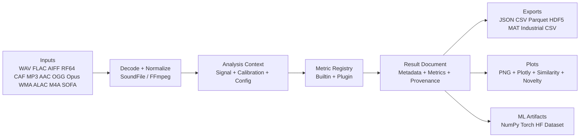
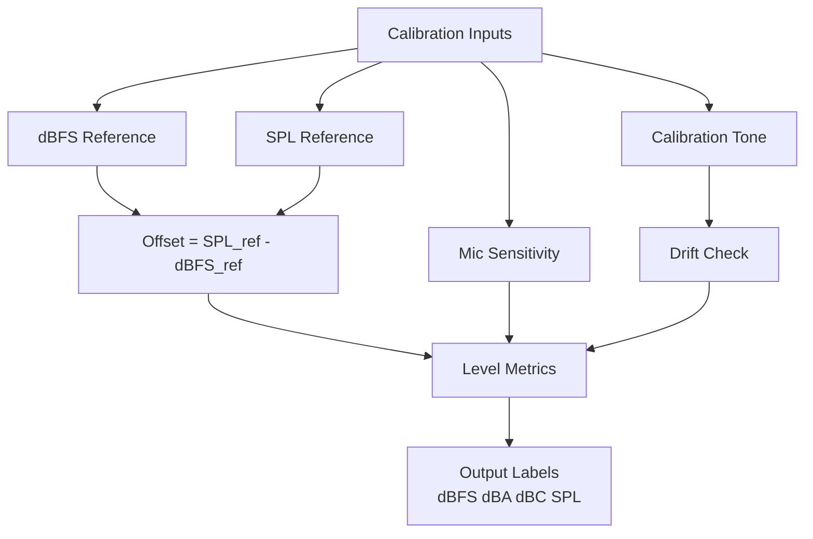
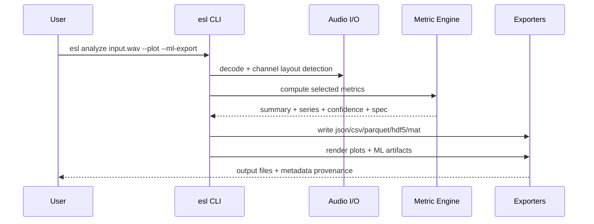
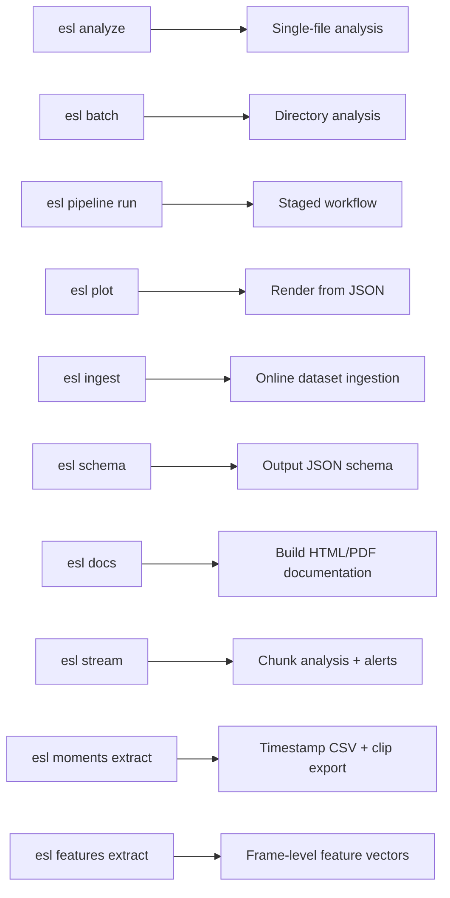
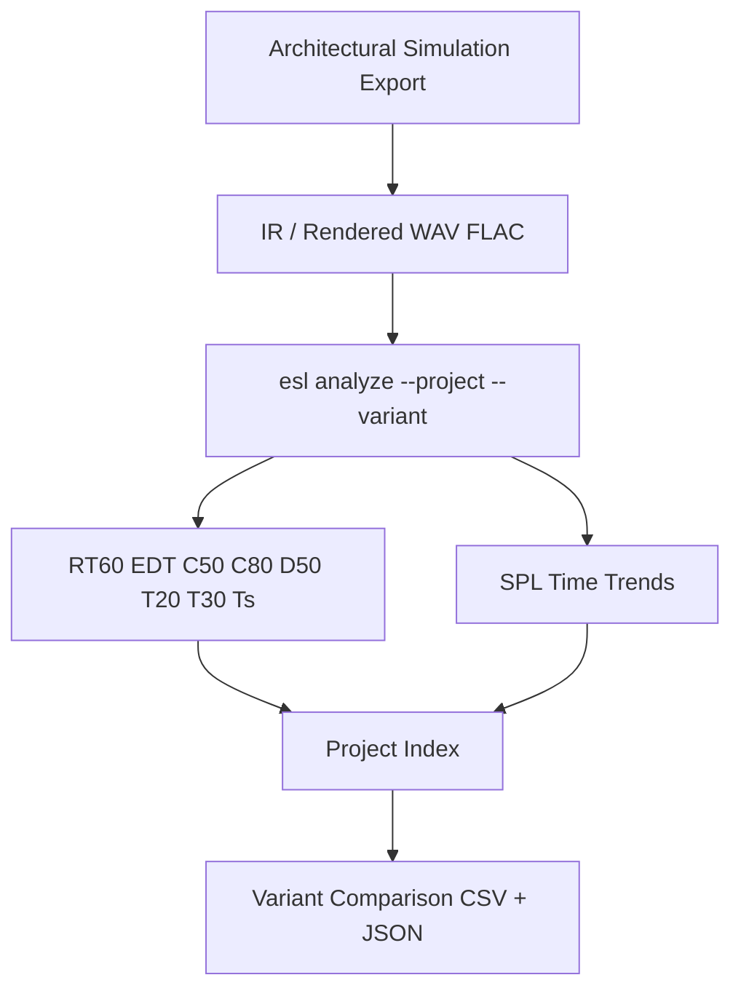
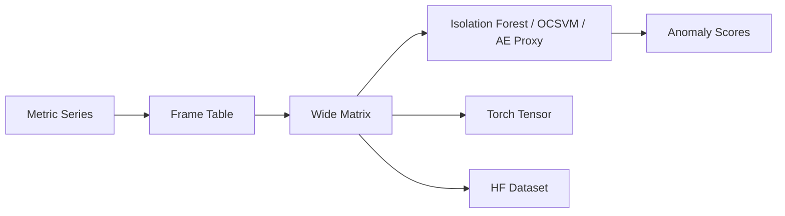
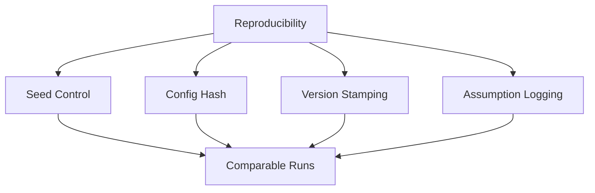
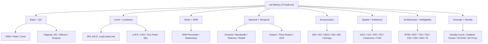

# ecoSignalLab (`esl`)

`esl` is an open-source, production-oriented acoustic analytics SDK for environmental, architectural, and industrial audio workflows.

Do you want to stretch out your audio file? Or make it confirm do a different note? You came to the right place.

`pvx is a Python toolkit for high-quality time and pitch processing using a phase-vocoder/short-time Fourier transform (STFT) core.`

That line is intentionally preserved verbatim as a style anchor; `esl` is the environmental/architectural acoustics sibling focused on measurement, calibration, and analysis at scale.

## New Here? Start Fast

If you just downloaded this and want one immediate win, run this to stretch a WAV file to **2x duration** (slower, pitch-preserving):

```bash
ffmpeg -i input.wav -filter:a "atempo=0.5" output_2x.wav
```

No ceremony, no giant config, just a result.

## What this is

- A CLI-first, production-grade SDK for environmental and architectural acoustic analysis.
- A multi-channel, calibration-aware metric engine with reproducible outputs and provenance capture.
- An ML-ready acoustic intelligence toolkit with tabular/tensor exports and anomaly/novelty tooling.
- A plugin-extensible open-source platform for research and industrial interoperability.

## What this is not

- Not a DAW or audio editor for recording/mixing/mastering workflows.
- Not a GUI-first desktop app (interactive plotting is supported; full GUI is optional).
- Not a black-box vendor suite with opaque assumptions or locked data formats.
- Not a substitute for formal compliance certification measurements without calibrated hardware/protocols.

## Field Notes (With Mild Professional Snark)

- If your thresholds fire on every chunk, you did not build a detector; you built a very expensive clip copier.
- If your calibration file is missing, `esl` will still run, but your SPL claims are now a creative writing exercise.
- If you compare variants with different assumptions and call the delta “ground truth,” statistics lawyers will find you.
- If you skip provenance, future-you becomes forensics-you.

## What Can I Do with vfX?

- Analyze single files with calibrated, multi-channel metrics and full provenance output.
- Run batch analysis over large datasets and export JSON/CSV/Parquet/HDF5/MAT.
- Generate static and interactive plots, including similarity and novelty matrix views.
- Build ML-ready frame tables and tensors for PyTorch/HuggingFace workflows.
- Compare architectural design variants (`--project` / `--variant`) with delta reports.
- Ingest online datasets (Freesound/HuggingFace), auto-analyze, and summarize.
- Run regression validation across datasets to catch metric drifts.

Typical flow:

```bash
esl analyze file.wav --json out.json --plot --ml-export
esl batch input_dir --out out_dir --csv --parquet --hdf5
esl project compare --project restaurant_design --root out_dir --baseline A
esl validate input_dir --out validation_out --rules rules.json
```

Core goals:
- Multi-channel native (`1..N`) with ambisonic-compatible handling
- Calibration-aware (`dBFS <-> SPL`, `dBA`, `dBC`, `dBZ`)
- ML-ready feature export (NumPy, PyTorch, Hugging Face)
- Architectural simulation compatible (IR metrics and project variants)
- Industrial measurement interoperability (HEAD/APx/SoundCheck CSV mappings)
- Reproducible by default (seed, config hash, version stamping)
- Plugin-extensible metric engine

See:
- [`DESIGN.md`](DESIGN.md)
- [`ARCHITECTURE.md`](ARCHITECTURE.md)
- [`CHANGELOG.md`](CHANGELOG.md)
- [`docs/METRICS_REFERENCE.md`](docs/METRICS_REFERENCE.md)
- [`docs/SCHEMA.md`](docs/SCHEMA.md)
- [`docs/ML_FEATURES.md`](docs/ML_FEATURES.md)
- [`docs/NOVELTY_ANOMALY.md`](docs/NOVELTY_ANOMALY.md)
- [`docs/MOMENTS_EXTRACTION.md`](docs/MOMENTS_EXTRACTION.md)
- [`docs/VALIDATION.md`](docs/VALIDATION.md)
- [`docs/RELEASE.md`](docs/RELEASE.md)
- [`docs/PHASE1_ECOSYSTEM_GAP_ANALYSIS.md`](docs/PHASE1_ECOSYSTEM_GAP_ANALYSIS.md)
- [`docs/REFERENCES.md`](docs/REFERENCES.md)
- [`docs/ATTRIBUTION.md`](docs/ATTRIBUTION.md)

## System Visuals
















## Installation

```bash
python -m venv .venv
source .venv/bin/activate
pip install -e .
```

Optional extras:

```bash
pip install -e .[dev,ml,plot,io,docs]
pip install -e .[features]   # librosa-rich feature vectors/similarity
```

System dependencies:
- [FFmpeg](https://ffmpeg.org/) / `ffprobe` on `PATH` for compressed audio decode
- `playwright` browser install for PDF docs generation:

```bash
python -m playwright install chromium
```

## CLI

### Analyze one file

```bash
esl analyze file.wav \
  --json output.json \
  --csv output.csv \
  --parquet output.parquet \
  --hdf5 output.h5 \
  --calibration calibration.yaml \
  --verbosity 2 \
  --debug 1 \
  --plot \
  --show \
  --ml-export \
  --project restaurant_design \
  --variant designA
```

### Multi-resolution profile analyze

```bash
esl analyze file.wav \
  --profile configs/multi_resolution.json \
  --out-dir out_profiles \
  --json out_profiles/file_profile.json
```

Profile file example:

```json
{
  "profiles": [
    {"name": "short", "frame_size": 1024, "hop_size": 256, "metrics": ["rms_dbfs", "snr_db"]},
    {"name": "long", "frame_size": 4096, "hop_size": 1024, "metrics": ["rms_dbfs", "snr_db", "rt60_s"]}
  ]
}
```

### Batch mode

```bash
esl batch input_dir --out out_dir --csv --parquet --hdf5
```

### Validation mode (regression harness)

```bash
esl validate input_dir --out validation_out --rules rules.json
```

Outputs:
- `validation_out/validation_report.json`
- `validation_out/validation_summary.csv`

### Staged pipeline mode (CLI-first)

```bash
esl pipeline run input_dir --out out_dir --plot --interactive --show --ml-export
esl pipeline status --manifest out_dir/pipeline_manifest.json
```

Pipeline mode persists:
- `pipeline_manifest.json` (stage status, timing, counts, errors)
- `pipeline_analysis_index.json` (analysis artifact index)
- `pipeline_digest.csv` and `pipeline_digest.json` (dataset-level summary)

### Streaming chunk analysis + alerts

```bash
esl stream input.wav \
  --out stream_out \
  --chunk-size 131072 \
  --metrics spl_a_db,ndsi,novelty_curve \
  --rules rules/stream_alerts.yaml
```

### Spatial analyze + beam map

```bash
esl spatial analyze multichannel.wav \
  --array-config configs/arrays/stereo_pair.json \
  --beam-map \
  --out-dir spatial_out
```

### Calibration drift check

```bash
esl calibrate check \
  --tone calib/1k_94db.wav \
  --dbfs-reference -20.0 \
  --max-drift-db 1.0 \
  --history calib/history.csv \
  --out calib/check_report.json
```

### Interesting moments extraction (clips + timestamp CSV)

```bash
esl moments extract input_24h.wav \
  --out out/moments \
  --rules rules_24h.yaml \
  --metrics novelty_curve,spectral_change_detection,isolation_forest_score,spl_a_db \
  --chunk-size 2880000 \
  --sample-rate 96000 \
  --top-k 12 \
  --rank-metric novelty_curve \
  --event-window 8 \
  --merge-gap 2
```

Selection controls:
- `--single` for the single most novel (or highest-ranked) moment
- `--top-k N` for a few highest-ranked moments
- `--all` for all detected moments
- `--window-before S` and `--window-after S` for explicit clip windowing around each event

### Plot from existing JSON

```bash
esl plot results.json --out plots --interactive
```

Plot controls:
- `--metrics spl_a_db,snr_db,novelty_curve`
- `--no-spectral` (skip spectrogram/mel/log/waterfall/LTSA suite)
- `--similarity-matrix` (generate self-similarity matrix plot)
- `--novelty-matrix` (generate Foote-style novelty matrix plot)
- `--sim-feature-set auto|core|librosa|all` (feature backend for similarity/novelty)
- `--feature-vectors vectors.npz` (drive similarity/novelty from external vectors)
- `--show --show-limit 12` (spawn generated plots via system viewer/browser)

### Extract feature vectors (for similarity/anomaly workflows)

```bash
esl features extract input.wav \
  --out vectors.npz \
  --feature-set all \
  --frame-size 1024 \
  --hop-size 256 \
  --meta-json vectors_meta.json
```

### Ingest datasets

```bash
esl ingest --source freesound --query "restaurant ambience" --limit 50 --out ingest_data
```

```bash
esl ingest --source huggingface --query "speechcolab/gigaspeech" --limit 10 --out ingest_data
```

### Build documentation (HTML + PDF)

```bash
esl docs --root . --out docs/build --formats html,pdf
```

Equivalent script entry:

```bash
python scripts/build_docs.py --out docs/build --formats html,pdf
```

Docs rendering guarantees:
- Mermaid diagrams are rendered in HTML/PDF.
- If a page has no Mermaid block, an auto-generated visual outline is inserted.
- TeX math is rendered via MathJax in generated HTML/PDF (`$...$`, `$$...$$`, `\\(...\\)`, `\\[...\\]`).

### Print JSON schema

```bash
esl schema
```

## Input format support

Native (`soundfile`):
- WAV
- FLAC
- AIFF/AIF
- RF64
- CAF

Compressed (`ffmpeg` fallback):
- MP3
- AAC
- OGG
- Opus
- WMA
- ALAC
- M4A

Spatial:
- Ambisonic-compatible multichannel WAV workflows
- SOFA IR import (HDF5-based, first measurement decode)

Large files:
- Chunked mode via `--chunk-size`.

## Built-in metric families

`esl` ships **74 built-in metrics** by default.



See full definitions in [`docs/METRICS_REFERENCE.md`](docs/METRICS_REFERENCE.md), including mathematical equations, plain-English interpretation, and citation links.

## Reproducibility

Each run emits:
- `schema_version`
- `config_hash` (SHA-256 over canonicalized config)
- `pipeline_hash` (config + metric list + window/hop + library versions)
- `esl_version`
- UTC timestamp
- local timestamp
- seed value
- runtime fingerprint (python/platform/hostname)
- channel layout hint
- decoder provenance (`decoder_used`, ffmpeg version, ffprobe stream summary when available)
- resolved config snapshot + metric catalog/version
- per-channel and aggregate channel summaries with validity flags
- calibration assumptions

## Recent Quality Updates

- Internal/project docs now use repository-relative hyperlinks (no local filesystem paths).
- JSON schema hardened with `schema_version`, `pipeline_hash`, metric catalog versioning, and decoder provenance.
- CLI `schema` command now reports schema version and can write the current schema artifact.
- Canonical ML `FrameTable` contract added for tabular (`CSV/Parquet`) and tensor (`NumPy/Torch`) export semantics.
- Golden metric tests added for basic level metrics, loudness sanity, IR RT/EDT fit quality, NDSI sign behavior, and multichannel aggregation semantics.

## Calibration model

Calibration file supports:
- `dbfs_reference`
- `spl_reference_db`
- `mic_sensitivity_mv_pa`
- `weighting`: `A|C|Z`
- `calibration_tone_file`

Example: [`examples/calibration.yaml`](examples/calibration.yaml)

## Project mode

Project/variant analysis for design comparison:

```bash
esl analyze A.wav --project restaurant_design --variant A --out-dir out
esl analyze B.wav --project restaurant_design --variant B --out-dir out
esl project compare --project restaurant_design --root out --baseline A
```

Outputs:
- `out/projects/restaurant_design/index.json`
- `out/projects/restaurant_design/comparison.csv`
- `out/projects/restaurant_design/comparison_report.json`
- `out/projects/restaurant_design/comparison_deltas.csv`

## Documentation

- System design: [`DESIGN.md`](DESIGN.md)
- Architecture: [`ARCHITECTURE.md`](ARCHITECTURE.md)
- Metrics reference: [`docs/METRICS_REFERENCE.md`](docs/METRICS_REFERENCE.md)
- Output schema contract: [`docs/SCHEMA.md`](docs/SCHEMA.md)
- ML FrameTable contract: [`docs/ML_FEATURES.md`](docs/ML_FEATURES.md)
- Novelty/anomaly semantics: [`docs/NOVELTY_ANOMALY.md`](docs/NOVELTY_ANOMALY.md)
  - Includes committed novelty plot example set: [`docs/examples/novelty_plot_set/`](docs/examples/novelty_plot_set)
- Moments extraction workflow: [`docs/MOMENTS_EXTRACTION.md`](docs/MOMENTS_EXTRACTION.md)
- Validation harness: [`docs/VALIDATION.md`](docs/VALIDATION.md)
- Release process: [`docs/RELEASE.md`](docs/RELEASE.md)
- Algorithm index: [`docs/ALGORITHM_INDEX.md`](docs/ALGORITHM_INDEX.md)
- Ecosystem gap analysis: [`docs/PHASE1_ECOSYSTEM_GAP_ANALYSIS.md`](docs/PHASE1_ECOSYSTEM_GAP_ANALYSIS.md)
- Documentation automation: [`docs/DOCS_AUTOMATION.md`](docs/DOCS_AUTOMATION.md)
- References: [`docs/REFERENCES.md`](docs/REFERENCES.md)
- Attribution: [`docs/ATTRIBUTION.md`](docs/ATTRIBUTION.md)

## License

MIT. See [`LICENSE`](LICENSE).
