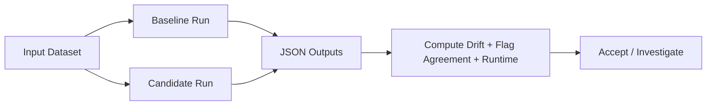

# Analysis Comparison (Real-Input KPIs)

Quick links: [Docs Index](INDEX.md) | [Getting Started](GETTING_STARTED.md) | [Task Recipes](TASK_RECIPES.md) | [Troubleshooting](TROUBLESHOOTING.md) | [Schema](SCHEMA.md) | [Metrics](METRICS_REFERENCE.md) | [References](REFERENCES.md)

This page explains how to compare `esl` analysis runs using numerical KPIs on the same input set.

Scope:
- evaluate metric stability, validity-flag behavior, and runtime/performance between configurations or versions
- confirm reproducibility when changing decoder backends, metric sets, or window/hop settings

## Quick Run

Generate baseline and candidate outputs:

```bash
esl analyze input.wav --out-dir out/baseline --json out/baseline/input.json --plot
esl analyze input.wav --out-dir out/candidate --json out/candidate/input.json --plot --debug 1
```

For directory-level checks:

```bash
esl validate input_dir --out out/validation --rules rules.json
```

Outputs:
- `out/baseline/input.json`
- `out/candidate/input.json`
- `out/validation/summary.json`
- `out/validation/report.csv`

## KPI Definitions

### Metric drift (%)

Formula:

```text
delta_m_pct = 100 * (m_cand - m_base) / (abs(m_base) + eps)
```

where:
- `m_base` is a baseline metric value
- `m_cand` is a candidate metric value
- `eps` is a very small stabilizer constant (for divide-by-zero safety)

Plain English: values near 0% indicate stable behavior across runs.

### Flag disagreement rate

Formula:

```text
r_flag = (1 / K) * sum_{k=1..K} I( f_base[k] != f_cand[k] )
```

where:
- `K` is number of compared flags
- `I(condition)` is 1 if condition is true, else 0
- `f_base[k]` and `f_cand[k]` are baseline/candidate boolean flags
- flag examples include `clipping`, `dc_offset`, `ir_detected`

Plain English: lower is better; high disagreement means behavior changed.

### Runtime factor

Formula:

```text
rtf = t_runtime / t_audio
```

where:
- `t_runtime` is wall-clock runtime
- `t_audio` is source audio duration

Plain English: lower is faster; `RTF < 1` means faster than real time.

### Schema compatibility score

Formula:

```text
s_schema = n_present / n_required
```

where required fields come from the active schema version contract.

Plain English: `1.0` means the output satisfies the full required structure.

## Comparison Flow



## Related Docs

- [`GETTING_STARTED.md`](GETTING_STARTED.md)
- [`TASK_RECIPES.md`](TASK_RECIPES.md)
- [`VALIDATION.md`](VALIDATION.md)
- [`SCHEMA.md`](SCHEMA.md)
