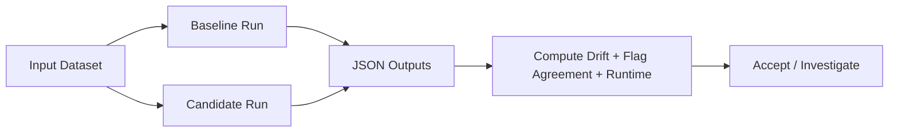

# Analysis Comparison (Real-Input KPIs)

This page explains how to compare `esl` analysis runs using numerical KPIs on the same input set.

Scope:
- evaluate metric stability, validity-flag behavior, and runtime/performance between configurations or versions
- confirm reproducibility when changing decoder backends, metric sets, or window/hop settings

## Quick Run

Generate baseline and candidate outputs:

```bash
esl analyze input.wav --out-dir out/baseline --json out/baseline/input.json --plot
esl analyze input.wav --out-dir out/candidate --json out/candidate/input.json --plot --debug 1
```

For directory-level checks:

```bash
esl validate input_dir --out out/validation --rules rules.json
```

Outputs:
- `out/baseline/input.json`
- `out/candidate/input.json`
- `out/validation/summary.json`
- `out/validation/report.csv`

## KPI Definitions

### Metric drift (%)

$$
\Delta m_{\%}=100\cdot\frac{m_{\mathrm{cand}}-m_{\mathrm{base}}}{|m_{\mathrm{base}}|+\varepsilon}
$$

where \(m_{\mathrm{base}}\) is a baseline metric and \(m_{\mathrm{cand}}\) is the candidate metric.

Plain English: values near 0% indicate stable behavior across runs.

### Flag disagreement rate

$$
r_{\mathrm{flag}}=\frac{1}{K}\sum_{k=1}^{K}\mathbf{1}\left(f^{(k)}_{\mathrm{base}}\ne f^{(k)}_{\mathrm{cand}}\right)
$$

where \(f^{(k)}\) are boolean validity flags (`clipping`, `dc_offset`, `ir_detected`, etc.).

Plain English: lower is better; high disagreement means behavior changed.

### Runtime factor

$$
\mathrm{RTF}=\frac{t_{\mathrm{runtime}}}{t_{\mathrm{audio}}}
$$

where \(t_{\mathrm{runtime}}\) is wall-clock analysis time and \(t_{\mathrm{audio}}\) is input duration.

Plain English: lower is faster; `RTF < 1` means faster than real time.

### Schema compatibility score

$$
s_{\mathrm{schema}}=\frac{N_{\mathrm{required\ fields\ present}}}{N_{\mathrm{required\ fields}}}
$$

where required fields come from the active schema version contract.

Plain English: `1.0` means the output satisfies the full required structure.

## Comparison Flow



## Related Docs

- [`GETTING_STARTED.md`](GETTING_STARTED.md)
- [`TASK_RECIPES.md`](TASK_RECIPES.md)
- [`VALIDATION.md`](VALIDATION.md)
- [`SCHEMA.md`](SCHEMA.md)
