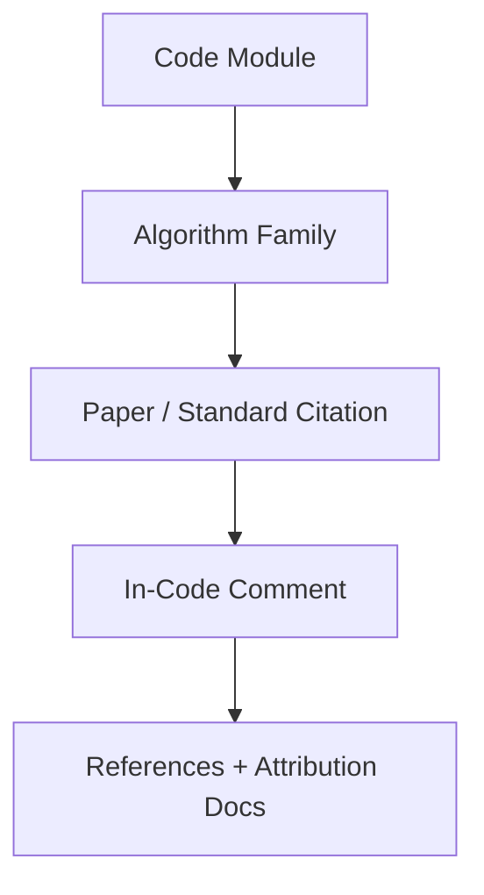

# Algorithm Index

This index maps `esl` code paths to algorithm families and citation anchors.

Primary bibliography: [`/Users/cleider/dev/ecoSignalLab/docs/REFERENCES.md`](/Users/cleider/dev/ecoSignalLab/docs/REFERENCES.md)

## Coverage Map

| Code Path | Algorithm Family | References |
|---|---|---|
| [`/Users/cleider/dev/ecoSignalLab/src/esl/metrics/helpers.py`](/Users/cleider/dev/ecoSignalLab/src/esl/metrics/helpers.py) | STFT, spectral flux novelty, Schroeder decay, RT regression | [D1], [N4], [A1], [S3], [S4] |
| [`/Users/cleider/dev/ecoSignalLab/src/esl/metrics/builtin.py`](/Users/cleider/dev/ecoSignalLab/src/esl/metrics/builtin.py) | Core spectral/temporal/architectural metrics | [D1], [N4], [S3], [S4], [A1] |
| [`/Users/cleider/dev/ecoSignalLab/src/esl/metrics/extended.py`](/Users/cleider/dev/ecoSignalLab/src/esl/metrics/extended.py) | Loudness (LUFS/LRA), ecoacoustic indices, spatial cues, anomaly models | [S1], [S2], [E1], [E2], [E3], [P1], [M1], [M2], [M3] |
| [`/Users/cleider/dev/ecoSignalLab/src/esl/viz/plotting.py`](/Users/cleider/dev/ecoSignalLab/src/esl/viz/plotting.py) | Similarity matrix, Foote novelty matrix, mel spectrograms | [D1], [D3], [N1], [N2], [N3] |
| [`/Users/cleider/dev/ecoSignalLab/src/esl/ml/export.py`](/Users/cleider/dev/ecoSignalLab/src/esl/ml/export.py) | Isolation Forest anomaly scoring | [M1], [M3] |
| [`/Users/cleider/dev/ecoSignalLab/src/esl/core/audio.py`](/Users/cleider/dev/ecoSignalLab/src/esl/core/audio.py) | Polyphase resampling for sample-rate conversion | [D2] |

## Attribution Cross-Link

For OSS-specific implementation inspiration and licensing context, see:
- [`/Users/cleider/dev/ecoSignalLab/docs/ATTRIBUTION.md`](/Users/cleider/dev/ecoSignalLab/docs/ATTRIBUTION.md)

## Visual Traceability

