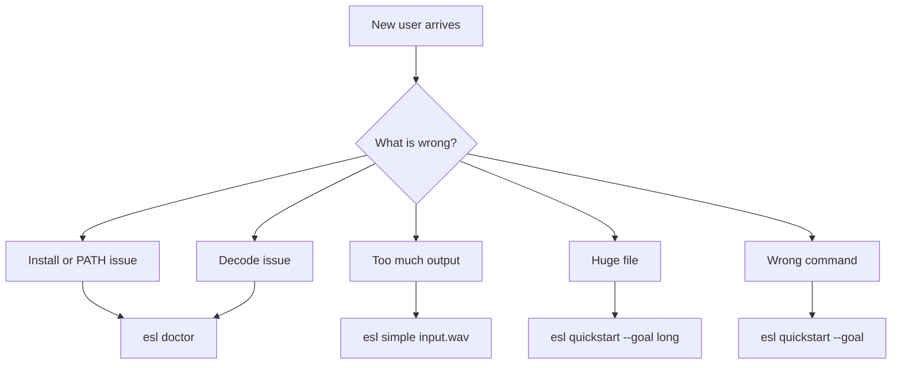

# Announcement FAQ

Quick links: [Docs Index](INDEX.md) | [Getting Started](GETTING_STARTED.md) | [Task Recipes](TASK_RECIPES.md) | [Troubleshooting](TROUBLESHOOTING.md) | [Schema](SCHEMA.md) | [Metrics](METRICS_REFERENCE.md) | [References](REFERENCES.md)

This page is for launch day.

If someone posts a predictable complaint, point them to the exact command here.

## Top 5 complaints we expect

### 1) "`esl` is not installed correctly."

What changed in code:
- `esl doctor`
- `scripts/easy/00_doctor.sh`

What to tell them to run:

```bash
esl doctor
```

Fallback if the shell cannot find `esl`:

```bash
.venv/bin/python -m esl doctor
```

### 2) "My MP3/M4A/WMA file does not decode."

What changed in code:
- `esl doctor input.mp3` now reports FFmpeg/ffprobe readiness before analysis.

What to tell them to run:

```bash
esl doctor input.mp3
```

If `ffmpeg` or `ffprobe` are missing, install FFmpeg and rerun the same command.

### 3) "I only want the main facts, not a giant JSON blob."

What changed in code:
- `esl simple input.wav`
- `scripts/easy/18_simple_summary.sh`

What to tell them to run:

```bash
esl simple input.wav
```

This prints a compact summary:
- duration
- channels
- sample rate
- RMS
- peak
- A-weighted level
- SNR
- clipping state

### 4) "My file is huge. I do not know safe settings."

What changed in code:
- `esl doctor input_24h.wav` now inspects file size, duration, channel count, and layout.
- Human-readable chunk flags already exist: `--chunk-seconds`, `--chunk-minutes`, `--chunk-hours`, `--chunk-days`.

What to tell them to run:

```bash
esl doctor input_24h.wav
esl quickstart --goal long --input input_24h.wav
```

### 5) "I do not know which command I should use."

What changed in code:
- `esl quickstart --goal ...`

What to tell them to run:

```bash
esl quickstart --goal analyze
esl quickstart --goal moments
esl quickstart --goal features
esl quickstart --goal long
```

## Launch-day routing



## The shortest public answer

If you need one single line for the announcement thread, use this:

```bash
esl doctor input.wav
```

That command tells the user whether the environment is ready and what they should run next.

## Related Docs

- [Getting Started](GETTING_STARTED.md)
- [Task Recipes](TASK_RECIPES.md)
- [Troubleshooting](TROUBLESHOOTING.md)
- [RF64 and Large Files](RF64_AND_LARGE_FILES.md)
- [Easy Scripts](../scripts/easy/README.md)
