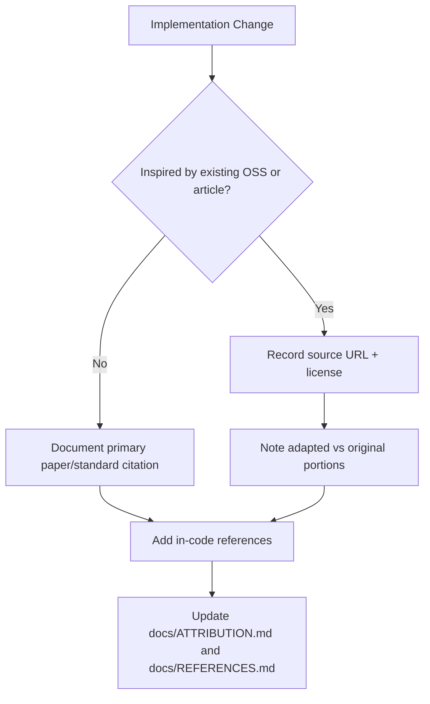

# Attribution and Open-Source Usage

This file tracks algorithmic inspiration, adapted implementation patterns, and third-party code context for `esl`.

Principle: `esl` does not intentionally copy uncredited code. Where implementation details are inspired by prior work, we document the source and licensing context here.
Operational extraction workflow reference: [`docs/MOMENTS_EXTRACTION.md`](MOMENTS_EXTRACTION.md)

## Attributed Implementations and Inspirations

| `esl` Location | Algorithm / Component | Source / Project | License | Attribution Notes |
|---|---|---|---|---|
| `src/esl/metrics/extended.py` | BS.1770-style K-weighting coefficient pattern | [pyloudnorm](https://github.com/csteinmetz1/pyloudnorm), ITU-R BS.1770 | MIT (pyloudnorm), ITU spec | Coefficient values and loudness gating conventions are implementation-aligned with public references. esl integration/orchestration code is original. |
| `src/esl/viz/plotting.py` | Foote-style novelty kernel and novelty curve pipeline | [Foote 2000](https://dl.acm.org/doi/10.1145/336597.336612), [FMP notebooks](https://www.audiolabs-erlangen.de/resources/MIR/FMP/C4/C4S4_NoveltySegmentation.html) | Academic publications / educational resources | Re-implemented from published algorithm descriptions and educational formulations; not a direct code copy. |
| `src/esl/metrics/helpers.py` | STFT-based features and spectral flux novelty | SciPy STFT docs, Dixon (2006) | BSD-3-Clause (SciPy docs/project) | Uses canonical DSP formulas implemented with SciPy APIs. |
| `src/esl/viz/feature_vectors.py` | librosa-backed frame feature extraction (MFCC/chroma/contrast/tonnetz/etc.) | [librosa documentation](https://librosa.org/doc/latest/index.html), classic MIR feature literature | ISC (librosa), academic publications | Uses public librosa APIs and standard feature definitions; integration/combination logic in esl is original. |
| `src/esl/core/moments.py` | Alert-window merging + ffmpeg/soundfile clip export | ffmpeg docs, soundfile docs, novelty-detection literature context | LGPL/GPL distribution dependent (ffmpeg binary), BSD-3-Clause (soundfile) | Uses subprocess integration and file I/O APIs; no vendored third-party extraction code. |
| `src/esl/metrics/extended.py` | GCC-PHAT ITD estimation | Knapp & Carter (1976), common open implementations | Academic publication | Implemented from standard published method. |
| `src/esl/ml/export.py` and `src/esl/metrics/extended.py` | Isolation Forest and One-Class SVM | scikit-learn estimators | BSD-3-Clause | Uses scikit-learn public APIs, no vendored model code. |
| `src/esl/docsgen/builder.py` | Mermaid rendering + browser PDF conversion | Mermaid docs, Playwright docs | MIT (Mermaid), Apache-2.0 (Playwright) | Uses documented runtime APIs; no vendored third-party runtime code. |

## Third-Party Runtime Dependencies

`esl` relies on mature OSS libraries for numerical and workflow infrastructure:

- [NumPy](https://numpy.org/) — BSD-3-Clause
- [SciPy](https://scipy.org/) — BSD-3-Clause
- [pandas](https://pandas.pydata.org/) — BSD-3-Clause
- [soundfile](https://python-soundfile.readthedocs.io/) — BSD-3-Clause
- [matplotlib](https://matplotlib.org/) — PSF-based matplotlib license
- [h5py](https://www.h5py.org/) — BSD-3-Clause
- [requests](https://requests.readthedocs.io/) — Apache-2.0
- [scikit-learn](https://scikit-learn.org/) (optional) — BSD-3-Clause
- [PyTorch](https://pytorch.org/) (optional) — BSD-style
- [datasets](https://huggingface.co/docs/datasets) (optional) — Apache-2.0
- [Playwright](https://playwright.dev/python/docs/intro) (docs optional) — Apache-2.0
- [Markdown](https://python-markdown.github.io/) — BSD-style
- [librosa](https://librosa.org/) (feature extraction optional) — ISC

## Contributor Checklist

Before merging algorithmic changes:

1. Add paper/standard citations in code comments near the algorithm.
2. Add or update citation entries in `docs/REFERENCES.md`.
3. If code structure was adapted from another project, add an entry in this file with source URL and license.
4. Verify no third-party code is copied without explicit license compatibility and attribution.

## Compliance Statement

If attribution is missing for any implementation, treat it as a bug and patch documentation/code comments before release.

## Attribution Review Flow

