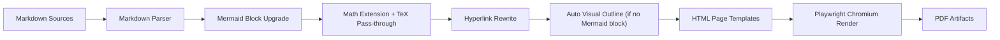
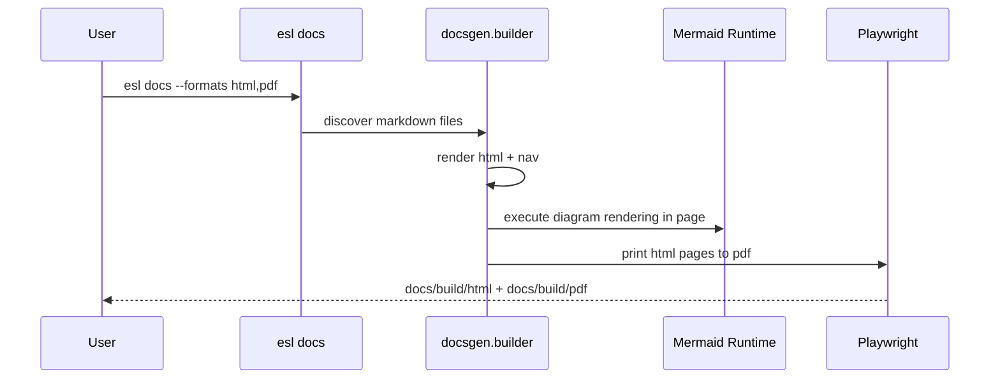

# Documentation Automation

`esl` provides a built-in docs generator for hyperlink-rich HTML and browser-rendered PDF output.

## Commands

CLI command:

```bash
esl docs --root . --out docs/build --formats html,pdf
```

Script wrapper:

```bash
python scripts/build_docs.py --root . --out docs/build --formats html,pdf
```

## Output Layout

- HTML: `docs/build/html/*.html`
- PDF: `docs/build/pdf/*.pdf`
- Combined outputs:
  - `docs/build/html/ecoSignalLab_docs.html`
  - `docs/build/pdf/ecoSignalLab_docs.pdf`

## Build Pipeline





## Dependencies

Install docs extras:

```bash
pip install -e .[docs]
```

Install Chromium runtime for Playwright:

```bash
python -m playwright install chromium
```

## CI / Release Integration

- CI validates HTML docs generation on each push/PR:
  - [`.github/workflows/ci.yml`](../.github/workflows/ci.yml)
- Tag releases (`v*`) build HTML+PDF docs and publish release artifacts:
  - [`.github/workflows/release.yml`](../.github/workflows/release.yml)
- Maintainer runbook:
  - [`docs/RELEASE.md`](RELEASE.md)

## Hyperlink and Citation Expectations

- All documentation files should cross-link to related docs and source files where useful.
- Workflow docs should link to the interesting-moments extraction guide:
  - [`docs/MOMENTS_EXTRACTION.md`](MOMENTS_EXTRACTION.md)
- Generated docs render:
  - Mermaid diagrams (explicit blocks and auto-generated visual outlines for pages without Mermaid)
  - TeX math via MathJax (`$...$`, `$$...$$`, `\\(...\\)`, `\\[...\\]`)
- Algorithm-heavy sections should include links to:
  - [`docs/REFERENCES.md`](REFERENCES.md)
  - [`docs/ATTRIBUTION.md`](ATTRIBUTION.md)

## Relevant Source Files

- Builder implementation: [`src/esl/docsgen/builder.py`](../src/esl/docsgen/builder.py)
- CLI wiring: [`src/esl/cli/main.py`](../src/esl/cli/main.py)
- Script wrapper: [`scripts/build_docs.py`](../scripts/build_docs.py)
