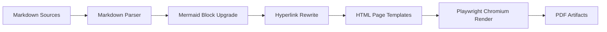
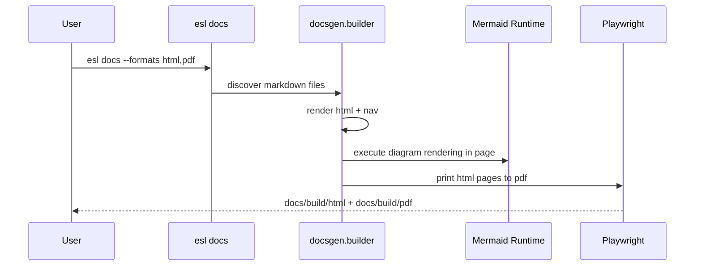

# Documentation Automation

`esl` provides a built-in docs generator for hyperlink-rich HTML and browser-rendered PDF output.

## Commands

CLI command:

```bash
esl docs --root . --out docs/build --formats html,pdf
```

Script wrapper:

```bash
python scripts/build_docs.py --root . --out docs/build --formats html,pdf
```

## Output Layout

- HTML: `docs/build/html/*.html`
- PDF: `docs/build/pdf/*.pdf`
- Combined outputs:
  - `docs/build/html/ecoSignalLab_docs.html`
  - `docs/build/pdf/ecoSignalLab_docs.pdf`

## Build Pipeline





## Dependencies

Install docs extras:

```bash
pip install -e .[docs]
```

Install Chromium runtime for Playwright:

```bash
python -m playwright install chromium
```

## Hyperlink and Citation Expectations

- All documentation files should cross-link to related docs and source files where useful.
- Algorithm-heavy sections should include links to:
  - [`/Users/cleider/dev/ecoSignalLab/docs/REFERENCES.md`](/Users/cleider/dev/ecoSignalLab/docs/REFERENCES.md)
  - [`/Users/cleider/dev/ecoSignalLab/docs/ATTRIBUTION.md`](/Users/cleider/dev/ecoSignalLab/docs/ATTRIBUTION.md)

## Relevant Source Files

- Builder implementation: [`/Users/cleider/dev/ecoSignalLab/src/esl/docsgen/builder.py`](/Users/cleider/dev/ecoSignalLab/src/esl/docsgen/builder.py)
- CLI wiring: [`/Users/cleider/dev/ecoSignalLab/src/esl/cli/main.py`](/Users/cleider/dev/ecoSignalLab/src/esl/cli/main.py)
- Script wrapper: [`/Users/cleider/dev/ecoSignalLab/scripts/build_docs.py`](/Users/cleider/dev/ecoSignalLab/scripts/build_docs.py)
