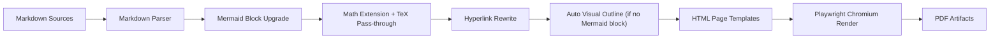
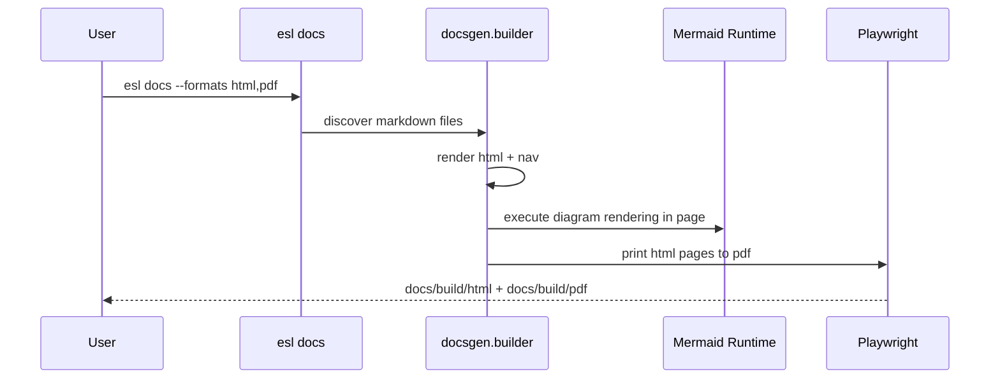

# Documentation Automation

Quick links: [Docs Index](INDEX.md) | [Getting Started](GETTING_STARTED.md) | [Task Recipes](TASK_RECIPES.md) | [Troubleshooting](TROUBLESHOOTING.md) | [Schema](SCHEMA.md) | [Metrics](METRICS_REFERENCE.md) | [References](REFERENCES.md)

`esl` provides a built-in docs generator for hyperlink-rich HTML and browser-rendered PDF output.

## Commands

CLI command:

```bash
esl docs --root . --out docs/build --formats html,pdf
```

Script wrapper:

```bash
python scripts/build_docs.py --root . --out docs/build --formats html,pdf
```

Dedicated user guide:

```bash
python scripts/generate_user_guide.py
```

This renders the curated [`USERGUIDE.md`](USERGUIDE.md) manual and writes the
top-level `USERGUIDE.pdf`, following the same reproducible HTML-to-PDF pipeline.

Textbook:

```bash
python scripts/generate_textbook.py
```

This writes a curated, source-controlled [`TEXTBOOK.md`](TEXTBOOK.md) from the
maintained technical chapters and renders the top-level `TEXTBOOK.pdf`.

### Print Master

`TEXTBOOK.pdf` is the ready-to-print US Letter (8.5 x 11 in) textbook master.
It uses the TeX Gyre Schola book face, a 0.9 in binding-safe horizontal margin,
black print text, a clean unnumbered title page, running title/edition headers,
and centered folios. It has no
bleed, crop marks, or printer imposition: provide the single-page PDF to a
printer or print-on-demand service that performs its own binding and imposition.
Hyperlinks remain active in compatible PDF readers.

## Output Layout

- HTML: `docs/build/html/*.html`
- PDF: `docs/build/pdf/*.pdf`
- Combined outputs:
  - `docs/build/html/ecoSignalLab_docs.html`
  - `docs/build/pdf/ecoSignalLab_docs.pdf`

## Build Pipeline


```mermaid
flowchart LR
    A["Markdown Sources"] --> B["Markdown Parser"]
    B --> C["Mermaid Block Upgrade"]
    C --> D["Math Extension + TeX Pass-through"]
    D --> E["Hyperlink Rewrite"]
    E --> F["Auto Visual Outline (if no Mermaid block)"]
    F --> G["HTML Page Templates"]
    G --> H["Playwright Chromium Render"]
    H --> I["PDF Artifacts"]
```


```mermaid
sequenceDiagram
    participant U as User
    participant CLI as esl docs
    participant B as docsgen.builder
    participant M as Mermaid Runtime
    participant P as Playwright
    U->>CLI: esl docs --formats html,pdf
    CLI->>B: discover markdown files
    B->>B: render html + nav
    B->>M: execute diagram rendering in page
    B->>P: print html pages to pdf
    P-->>U: docs/build/html + docs/build/pdf
```

## Dependencies

Install docs extras:

```bash
pip install -e .[docs]
```

Install Chromium runtime for Playwright:

```bash
python -m playwright install chromium
```

## CI / Release Integration

- CI validates HTML docs generation on each push/PR:
  - [`.github/workflows/ci.yml`](../.github/workflows/ci.yml)
- Tag releases (`v*`) build HTML+PDF docs and publish release artifacts:
  - [`.github/workflows/release.yml`](../.github/workflows/release.yml)
- Maintainer runbook:
  - [`docs/RELEASE.md`](RELEASE.md)

## Hyperlink and Citation Expectations

- All documentation files should cross-link to related docs and source files where useful.
- Workflow docs should link to the interesting-moments extraction guide:
  - [`docs/MOMENTS_EXTRACTION.md`](MOMENTS_EXTRACTION.md)
- Generated docs render:
  - Mermaid diagrams (explicit blocks and auto-generated visual outlines for pages without Mermaid)
  - TeX math via MathJax using GitHub-friendly `$...$` and `$$...$$` delimiters
- Equation writing style:
  - every displayed equation should include a `where ...` statement immediately after it
  - every equation should include a plain-English interpretation line
- Algorithm-heavy sections should include links to:
  - [`docs/REFERENCES.md`](REFERENCES.md)
  - [`docs/ATTRIBUTION.md`](ATTRIBUTION.md)

## Relevant Source Files

- Builder implementation: [`src/esl/docsgen/builder.py`](../src/esl/docsgen/builder.py)
- CLI wiring: [`src/esl/cli/main.py`](../src/esl/cli/main.py)
- Script wrapper: [`scripts/build_docs.py`](../scripts/build_docs.py)
