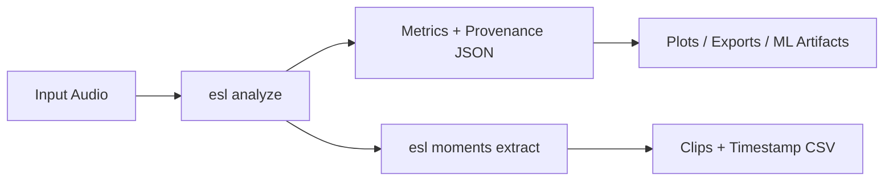

# Getting Started

This page is for first-time users who want fast results with minimal setup.

Positioning:
- `esl` is a true multichannel and Atmos-aware/capable phase-vocoder workflow toolkit.

## 1) Install

```bash
python -m venv .venv
source .venv/bin/activate
pip install -e .
```

Optional extras:

```bash
pip install -e .[dev,ml,plot,io,docs,features]
```

## 2) Quick command set

Print first-step commands:

```bash
esl quickstart
```

Or run these directly:

```bash
# Analyze one file
esl analyze input.wav --out-dir out --json out/input.json --plot

# Extract one most-interesting moment
esl moments extract input.wav --out out/moments --single --rank-metric novelty_curve --event-window 8

# Export feature vectors for ML
esl features extract input.wav --out out/vectors.npz --feature-set all --meta-json out/vectors_meta.json
```

Or use copy-paste helper scripts:

```bash
bash scripts/easy/01_stretch_2x.sh input.wav
bash scripts/easy/02_analyze_and_plot.sh input.wav out
bash scripts/easy/03_extract_single_moment.sh input.wav out/moments
bash scripts/easy/05_generate_signal_graphs.sh docs/examples/signal_window_guide
```

Expected outputs:
- `out/input.json`
- `out/input_plots/`
- `out/moments/moments.csv`
- `out/moments/clips/moment_0001.wav`
- `out/vectors.npz`

## 3) If you want 2x time-stretch quickly

```bash
ffmpeg -i input.wav -filter:a "atempo=0.5" output_2x.wav
```

## 4) Common issues

- `zsh: command not found: esl`
  - Activate your environment: `source .venv/bin/activate`
  - Or run module form: `.venv/bin/python -m esl --help`
- Compressed decode fails (`mp3/aac/ogg/...`)
  - Install FFmpeg and ensure `ffprobe` is on `PATH`.
- Empty/weak moments extraction output
  - Lower thresholds in rules or start with `--single --rank-metric novelty_curve`.
  - See full fixes in [`TROUBLESHOOTING.md`](TROUBLESHOOTING.md)

## 5) Mental model



## Related Docs

- [`../README.md`](../README.md)
- [`TASK_RECIPES.md`](TASK_RECIPES.md)
- [`TROUBLESHOOTING.md`](TROUBLESHOOTING.md)
- [`GLOSSARY.md`](GLOSSARY.md)
- [`MOMENTS_EXTRACTION.md`](MOMENTS_EXTRACTION.md)
- [`ML_FEATURES.md`](ML_FEATURES.md)
- [`SCHEMA.md`](SCHEMA.md)
- [`../scripts/easy/README.md`](../scripts/easy/README.md)
- [`ALGORITHM_COMPARISON.md`](ALGORITHM_COMPARISON.md)
- [`SIGNAL_WINDOWS_VISUAL_GUIDE.md`](SIGNAL_WINDOWS_VISUAL_GUIDE.md)
