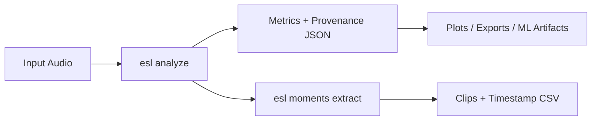

# Getting Started

Quick links: [Docs Index](INDEX.md) | [Getting Started](GETTING_STARTED.md) | [Task Recipes](TASK_RECIPES.md) | [Troubleshooting](TROUBLESHOOTING.md) | [Schema](SCHEMA.md) | [Metrics](METRICS_REFERENCE.md) | [References](REFERENCES.md)

This page is for first-time users who want fast results with minimal setup.

Positioning:
- `esl` is a true multichannel and Atmos-aware/capable acoustic analysis workflow toolkit.

## 1) Install

```bash
python -m venv .venv
source .venv/bin/activate
pip install -e .
```

Install helper (includes man pages):

```bash
bash scripts/install.sh
```

Optional extras:

```bash
pip install -e .[dev,ml,plot,io,docs,features]
```

## 2) Quick command set

Print first-step commands:

```bash
esl quickstart
```

Or run these directly:

```bash
# Check your environment and input file first
esl doctor input.wav

# Print a compact human-readable summary
esl simple input.wav

# Analyze one file
esl analyze input.wav --out-dir out --json out/input.json --plot --device auto

# Extract one most-interesting moment
esl moments extract input.wav --out out/moments --single --rank-metric novelty_curve --event-window 8

# Export feature vectors for ML
esl features extract input.wav --out out/vectors.npz --feature-set all --meta-json out/vectors_meta.json

# Optional: benchmark compute backend
esl benchmark device --device auto --frames 16384 --features 256 --iters 20
```

Or use copy-paste helper scripts:

```bash
bash scripts/easy/02_analyze_and_plot.sh input.wav out
bash scripts/easy/03_extract_single_moment.sh input.wav out/moments
bash scripts/easy/08_batch_full_exports.sh input_dir out_batch
bash scripts/easy/09_similarity_search.sh query.wav corpus_dir out/similarity 10
bash scripts/easy/10_analyze_with_calibration.sh input.wav examples/calibration.yaml out_calibrated
bash scripts/easy/05_generate_signal_graphs.sh docs/examples/signal_window_guide
```

Full script catalog:
- [`../scripts/easy/README.md`](../scripts/easy/README.md)

Expected outputs:
- `out/input.json`
- `out/input_plots/`
- `out/moments/moments.csv`
- `out/moments/clips/moment_0001.wav`
- `out/vectors.npz`

## 3) Common issues

- `zsh: command not found: esl`
  - Start with: `.venv/bin/python -m esl doctor`
  - Activate your environment: `source .venv/bin/activate`
  - Or run module form: `.venv/bin/python -m esl --help`
- Compressed decode fails (`mp3/aac/ogg/...`)
  - Start with: `esl doctor input.mp3`
  - Install FFmpeg and ensure `ffprobe` is on `PATH`.
- Very large WAV inputs fail or truncate near 4 GB
  - Start with: `esl doctor input_24h.wav`
  - Use RF64 and follow [`RF64_AND_LARGE_FILES.md`](RF64_AND_LARGE_FILES.md).
  - For long scans, prefer: `esl analyze input_24h.wav --out-dir out --chunk-hours 1 --streamable-only --summary-only --frame-table-csv out/frame_table.csv --checkpoint-dir out/checkpoints --resume`
- A deployment already has hourly/daily files
  - Start with: `esl shard index archive_dir --out out/archive_manifest.json`
  - Then run: `esl shard analyze out/archive_manifest.json --out out/shard_analysis --chunk-hours 1 --streamable-only --summary-only --frame-table-dir out/frame_tables --checkpoint-dir out/checkpoints --resume`
- Empty/weak moments extraction output
  - Lower thresholds in rules or start with `--single --rank-metric novelty_curve`.
  - See full fixes in [`TROUBLESHOOTING.md`](TROUBLESHOOTING.md)

## 4) Mental model


```mermaid
flowchart LR
    A["Input Audio"] --> B["esl analyze"]
    B --> C["Metrics + Provenance JSON"]
    C --> D["Plots / Exports / ML Artifacts"]
    B --> E["esl moments extract"]
    E --> F["Clips + Timestamp CSV"]
```

## Related Docs

- [`../README.md`](../README.md)
- [`MANPAGES.md`](MANPAGES.md)
- [`TASK_RECIPES.md`](TASK_RECIPES.md)
- [`TROUBLESHOOTING.md`](TROUBLESHOOTING.md)
- [`ANNOUNCEMENT_FAQ.md`](ANNOUNCEMENT_FAQ.md)
- [`GLOSSARY.md`](GLOSSARY.md)
- [`MOMENTS_EXTRACTION.md`](MOMENTS_EXTRACTION.md)
- [`ML_FEATURES.md`](ML_FEATURES.md)
- [`SCHEMA.md`](SCHEMA.md)
- [`RF64_AND_LARGE_FILES.md`](RF64_AND_LARGE_FILES.md)
- [`../scripts/easy/README.md`](../scripts/easy/README.md)
- [`ALGORITHM_COMPARISON.md`](ALGORITHM_COMPARISON.md)
- [`SIGNAL_WINDOWS_VISUAL_GUIDE.md`](SIGNAL_WINDOWS_VISUAL_GUIDE.md)
