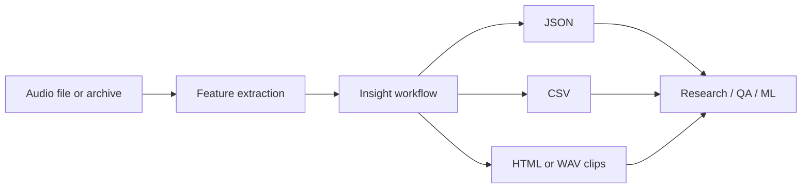
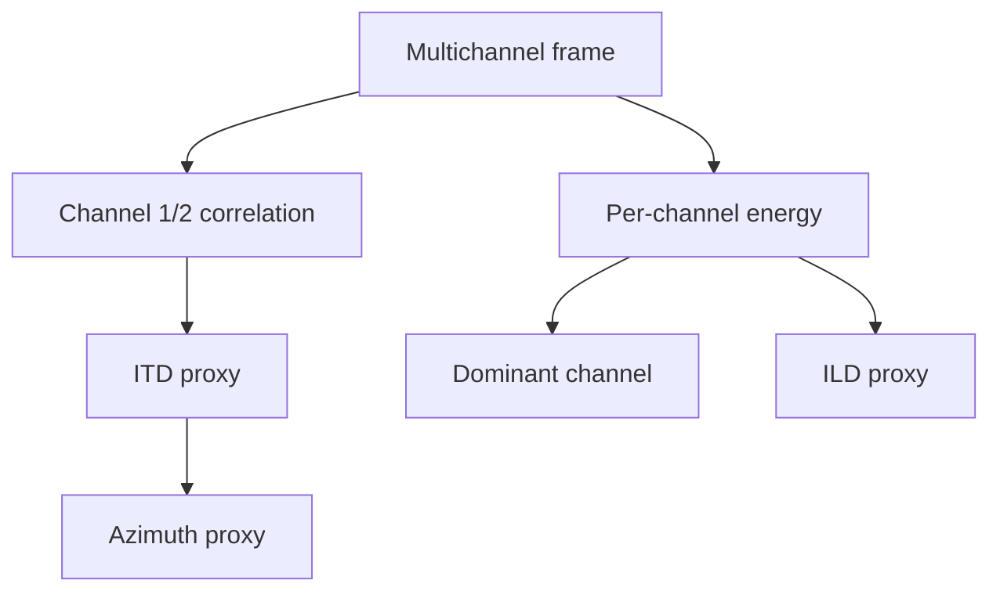
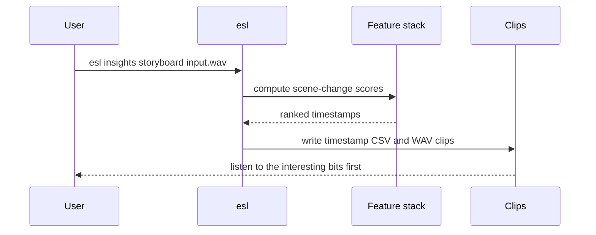

# Soundscape Insights

Quick links: [Docs Index](INDEX.md) | [Task Recipes](TASK_RECIPES.md) | [Metrics](METRICS_REFERENCE.md) | [Similarity Search](SIMILARITY_SEARCH.md) | [Shard Workflows](SHARD_WORKFLOWS.md)

`esl insights` is a set of CLI-first workflows for turning audio analysis into decisions.

Plain English: if `esl analyze` gives you the ingredients, `esl insights` makes the sandwich. A reasonably annotated sandwich. With a CSV.

These commands are transparent baseline methods. They are useful immediately, but they are not magic compliance instruments, ecological truth machines, or a substitute for study design.



## Command Map

| Goal | Command |
|---|---|
| Find acoustic scene changes | `esl insights scene input.wav --out out/scene` |
| Estimate calmness / chaos / diversity | `esl insights calmness input.wav --out out/calmness.json` |
| Track multichannel spatial behavior | `esl insights spatial input.wav --out out/spatial` |
| Estimate band occupancy | `esl insights occupancy input.wav --out out/occupancy` |
| Compare archive drift | `esl insights drift baseline.json candidate.json --out drift.json` |
| Retrieve similar examples | `esl insights retrieve query.wav corpus --out out/retrieve` |
| Build clip-level embeddings | `esl insights embeddings corpus --out out/embeddings --device auto` |
| Generate an HTML report | `esl insights report analysis.json --out out/report` |
| Compare simulation vs field | `esl insights simulation-compare sim.json field.json --out compare.json` |
| Build an acoustic storyboard | `esl insights storyboard input.wav --out out/story --clips 12 --window 5` |

## 1. Acoustic Scene Change Maps

```bash
esl insights scene input.wav \
  --out out/scene \
  --feature-set all \
  --frame-size 2048 \
  --hop-size 512 \
  --threshold-z 1.5
```

What it does:

- extracts frame-level features
- z-scores each feature column
- computes adjacent-frame feature distance
- peak-picks likely scene changes

Math:

```math
\tilde{\mathbf{x}}_t =
\frac{\mathbf{x}_t - \boldsymbol{\mu}}{\boldsymbol{\sigma} + \epsilon}
```

where:

- `\mathbf{x}_t` is the feature vector at frame `t`
- `\boldsymbol{\mu}` is the feature-wise mean
- `\boldsymbol{\sigma}` is the feature-wise standard deviation
- `\epsilon` prevents division by zero

```math
n_t = \lVert \tilde{\mathbf{x}}_t - \tilde{\mathbf{x}}_{t-1} \rVert_2
```

where:

- `n_t` is the scene-change score
- large values mean “this frame sounds unlike the previous frame”

Outputs:

- `scene_changes.json`
- `scene_changes.csv`

## 2. Archive-Scale Calmness / Chaos / Diversity

```bash
esl insights calmness input.wav --out out/calmness.json
```

Plain English:

- calmness goes up when level and spectrum are stable
- chaos goes up when level and spectrum jump around
- diversity goes up when spectral energy is broadly distributed

Math:

```math
C = \frac{1}{1 + \alpha \sigma(L_{\mathrm{dBFS}}) + \beta \overline{|F_t|}}
```

where:

- `C` is the calmness score
- `L_{\mathrm{dBFS}}` is frame RMS level in dBFS
- `F_t` is normalized spectral flux
- `\alpha` and `\beta` are fixed normalizing constants in the baseline implementation

```math
H = -\frac{\sum_i p_i \log_2(p_i + \epsilon)}{\log_2(N)}
```

where:

- `H` is spectral diversity
- `p_i` is the normalized energy in band `i`
- `N` is the number of bands

## 3. Spatial Event Localization Timelines

```bash
esl insights spatial ambisonic_or_multichannel.wav --out out/spatial
```

What it reports:

- dominant channel per frame
- total energy per frame
- interchannel coherence for channels 1 and 2
- interaural level difference proxy
- interaural time difference proxy
- simple azimuth proxy



Math:

```math
\rho_{12} =
\frac{\mathbf{x}_1^\top \mathbf{x}_2}
{\lVert \mathbf{x}_1 \rVert_2 \lVert \mathbf{x}_2 \rVert_2 + \epsilon}
```

where:

- `\rho_{12}` is interchannel coherence
- `\mathbf{x}_1` and `\mathbf{x}_2` are mean-centered channel frames

This is a proxy, not a full array-localization solver. For serious localization, use calibrated geometry through `esl spatial analyze` when available.

## 4. Bioacoustic Occupancy Maps

```bash
esl insights occupancy input.wav \
  --out out/occupancy \
  --bands anthro:20-1000,bio:2000-8000 \
  --threshold-ratio 0.2
```

Plain English: for each time frame, `esl` asks “how much of the energy lives in this band?” If the ratio crosses the threshold, that band is counted as occupied.

```math
O_{b,t} =
\mathbb{1}\left[
\frac{\sum_{f \in b} P(f,t)}
{\sum_f P(f,t) + \epsilon}
\ge \tau
\right]
```

where:

- `O_{b,t}` is occupancy for band `b` at time `t`
- `P(f,t)` is STFT power
- `\tau` is `--threshold-ratio`

## 5. Cross-Archive Drift Detection

```bash
esl insights drift baseline/shard_analysis_report.json \
  new/shard_analysis_report.json \
  --out out/drift.json
```

This compares common metric means between two reports.

```math
d_m =
\frac{x_{m,\mathrm{candidate}} - x_{m,\mathrm{baseline}}}
{\max(|x_{m,\mathrm{candidate}}|, |x_{m,\mathrm{baseline}}|, 1)}
```

where:

- `d_m` is normalized drift for metric `m`
- the denominator prevents tiny metrics from exploding numerically

Use this when a sensor deployment, habitat, room design, or factory line might have changed.

## 6. Query-By-Example Event Retrieval

```bash
esl insights retrieve query.wav corpus_dir \
  --out out/retrieve \
  --top-k 10 \
  --feature-set all \
  --distance cosine
```

This wraps the same similarity machinery documented in [`SIMILARITY_SEARCH.md`](SIMILARITY_SEARCH.md).

Modes:

- `--mode feature`: compare aggregated feature vectors
- `--mode metric`: compare one metric
- `--mode metrics`: compare several metric means

Distance:

```math
D_{\cos}(\mathbf{a}, \mathbf{b}) =
1 -
\frac{\mathbf{a}^\top \mathbf{b}}
{\lVert \mathbf{a} \rVert_2 \lVert \mathbf{b} \rVert_2 + \epsilon}
```

where:

- `D_{\cos}` is cosine distance
- smaller means more similar

## 7. Self-Supervised Embedding Baseline

```bash
esl insights embeddings corpus_dir \
  --out out/embeddings \
  --feature-set all \
  --device auto
```

Outputs:

- `embeddings.npz`
- `embeddings.csv`
- `embeddings_manifest.json`

The baseline embedding is:

```math
\mathbf{z} =
[\operatorname{mean}_t(\mathbf{x}_t),\operatorname{std}_t(\mathbf{x}_t)]
```

where:

- `\mathbf{x}_t` is the frame feature vector
- `\mathbf{z}` is a clip-level embedding

`--device auto|cpu|cuda|mps` records CUDA / Apple Metal availability for downstream tensor workflows. Feature extraction itself remains CPU-first in this transparent baseline; the exported tensors are ready for PyTorch, CUDA, and MPS training pipelines.

## 8. Soundscape Report Generator

```bash
esl analyze input.wav --out-dir out --json out/input.json
esl insights report out/input.json --out out/report
```

Outputs:

- `soundscape_report.html`
- `soundscape_report.json`

The HTML report includes a Mermaid workflow diagram. It is intentionally simple so it can be attached to lab notes, client emails, or “please explain this weird swamp recording” folders.

## 9. Simulation-vs-Field Comparison

```bash
esl insights simulation-compare simulated.json measured.json --out out/sim_vs_field.json
```

This compares common metric means, prioritizing:

- `rt60_s`
- `edt_s`
- `c50_db`
- `c80_db`
- `d50`
- `spl_a_db`
- `rms_dbfs`
- `snr_db`

Math:

```math
\Delta_m = x_{m,\mathrm{measured}} - x_{m,\mathrm{simulated}}
```

where:

- `\Delta_m` is the field-minus-simulation difference for metric `m`

## 10. Acoustic Storyboarding

```bash
esl insights storyboard input.wav \
  --out out/storyboard \
  --clips 12 \
  --window 5 \
  --feature-set all
```

Plain English: build a contact sheet for your ears. `esl` finds high-change moments, writes a timestamp table, and optionally writes short WAV clips around each moment.

Outputs:

- `storyboard.json`
- `storyboard.csv`
- `clips/story_*.wav`



## Long Files

For multi-hour, multi-day, multi-year, or politely unhinged ten-year files, use shard workflows first:

```bash
esl shard index archive_dir --out manifest.json
esl shard analyze manifest.json --out out/shards --summary-only --streamable-only
esl shard moments manifest.json --out out/moments --top-k 33 --window-before 20 --window-after 40
```

Then use `esl insights drift`, `esl insights retrieve`, or `esl insights report` on the resulting reports.

For archive-native summaries that never decode the whole archive again:

```bash
esl shard insights summary manifest.json --out out/archive_summary
esl shard insights scene out/shards/shard_analysis_report.json --out out/archive_scene
esl shard insights calmness out/shards/shard_analysis_report.json --out out/archive_calmness.json
esl shard insights report out/shards/shard_analysis_report.json --out out/archive_report
```

Plain English: `esl insights` is for a file; `esl shard insights` is for the whole archive book, using the table of contents and per-chapter notes.

Do not load a decade into memory just because a command exists. That is not courage. That is a cry for help from your RAM.
