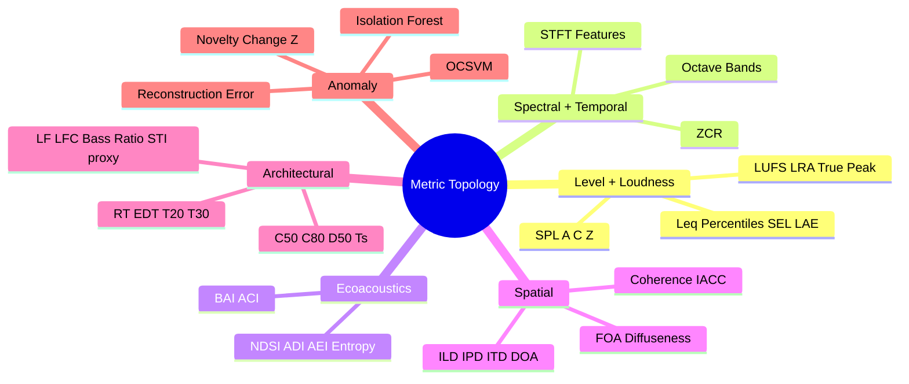
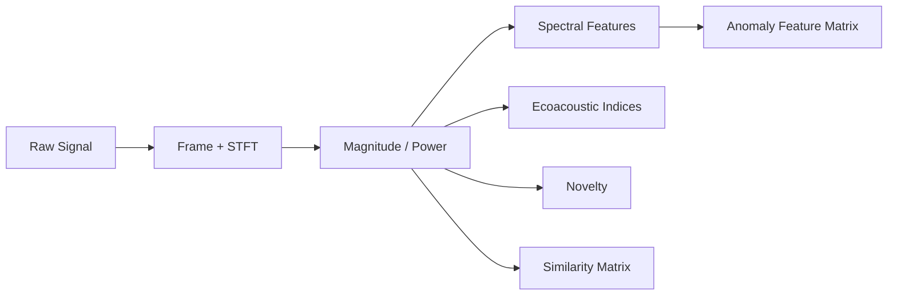
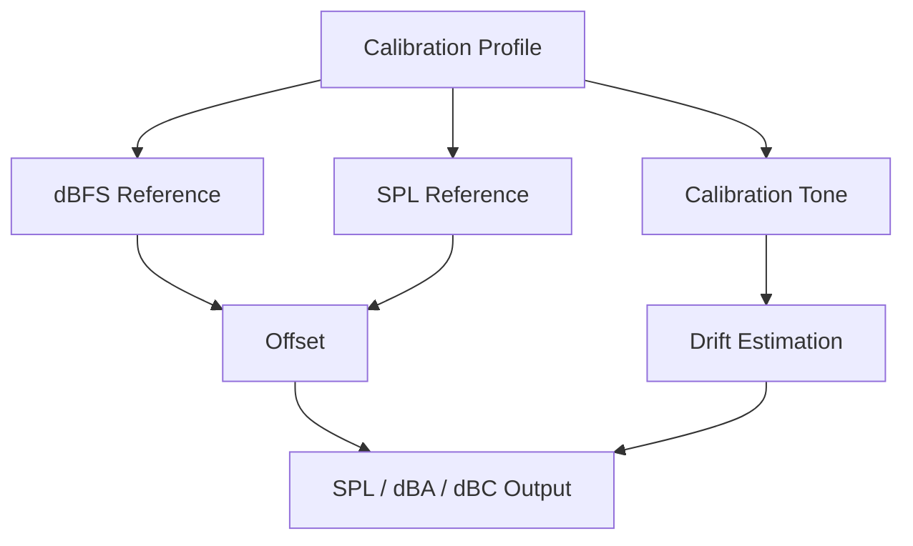
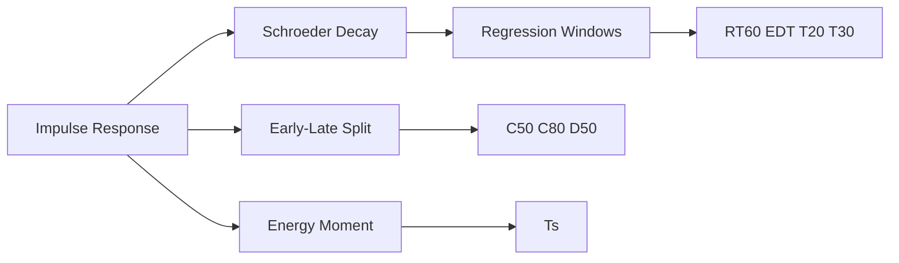
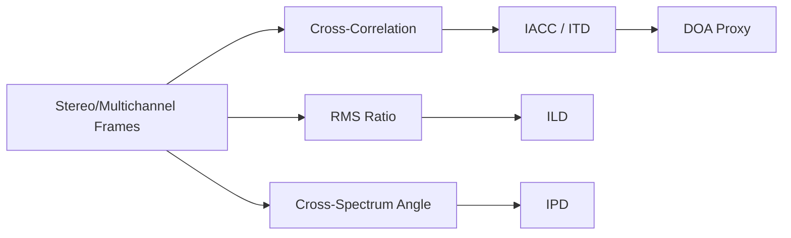
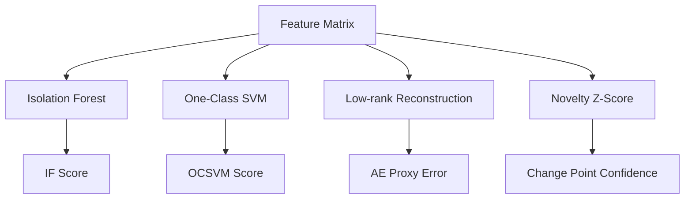
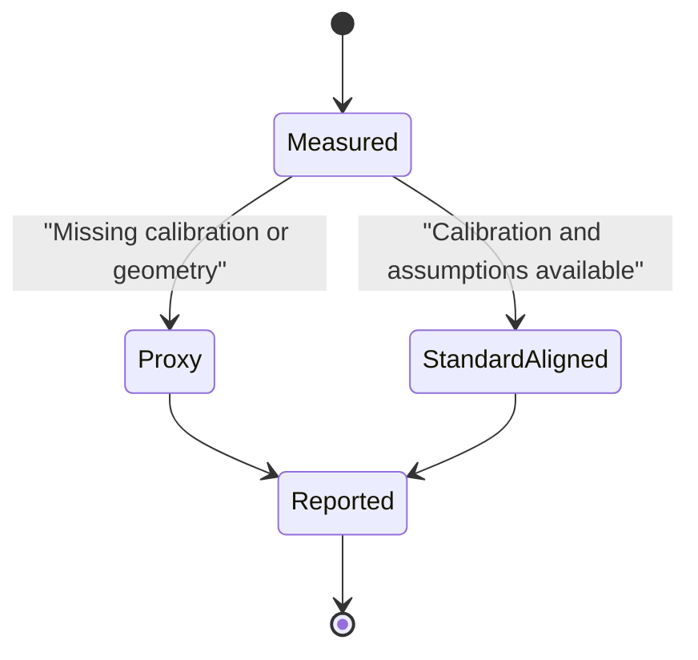

# esl Metrics Reference

This document defines every built-in metric currently registered by default in `esl`.

Scope:
- 74 built-in metrics (core + extended)
- Mathematical definition (implementation-aligned)
- Plain-English interpretation

## Notation

- `x_c[n]`: sample `n` in channel `c`
- `C`: number of channels
- `F_k`: frame `k` (windowed sample block)
- `N_k`: number of samples in frame `k`
- `RMS(F_k) = sqrt((1/(N_k*C)) * sum_{n,c} x_{k,c}[n]^2)`
- `dB(v) = 20*log10(max(|v|, eps))`
- `dB_power(p) = 10*log10(max(p, eps))`
- `L_SPL = L_dBFS + (spl_reference_db - dbfs_reference)` when calibration is provided
- `M(f,t)`: magnitude spectrogram
- `P(f,t) = M(f,t)^2`: power spectrogram
- `eps`: small positive constant for numerical stability

All formulas below reflect current `esl` implementation, including metrics labeled as "proxy".

## Basic + Quality Control Metrics

| Metric ID | Units | Mathematical definition | Plain English |
|---|---:|---|---|
| `rms_dbfs` | dBFS | `L_k = dB(RMS(F_k))` | Average signal level per frame on a full-scale digital reference. |
| `peak_dbfs` | dBFS | `L_k = dB(max_{n,c} |x_{k,c}[n]|)` | Peak sample level per frame in dBFS. |
| `lpeak_dbfs` | dBFS | `L = dB(max_{n,c} |x_c[n]|)` | Highest sample peak over the entire clip. |
| `clipping_ratio` | ratio | `mean( 1[|x_c[n]| >= 0.999] )` over all samples/channels | Fraction of samples at/near digital clipping. |
| `clipping_event_count` | count | Number of rising edges in clip mask `any_c 1[|x_c[n]|>=0.999]` | Number of distinct clipping bursts (not just clipped sample count). |
| `dc_offset` | linear | `mean_{n,c}(x_c[n])` | Constant bias in waveform baseline. |
| `dropout_ratio` | ratio | Fraction of frames where `RMS(F_k)<1e-4` and `mean(|F_k|)<1e-4` | Share of frames likely affected by data dropouts or sensor failure. |
| `silence_ratio` | ratio | Fraction of frames where `mean(|F_k|)<1e-4` | Share of near-silent frames. |
| `uptime_ratio` | ratio | `1 - dropout_ratio` | Estimated fraction of time sensor/audio path was active. |
| `completeness_ratio` | ratio | `clip(uptime_ratio * finite_sample_ratio, 0, 1)` | Proxy for overall usable data completeness. |
| `diurnal_coverage_ratio` | ratio | Parsed-hour coverage over 24 h, else `clip(duration_s/86400,0,1)` | Proxy for how much of the day-night cycle is represented. |
| `site_comparability_score` | ratio | `clip(0.4*has_cal + 0.2*sr_score + 0.2*layout_score + 0.2*clip_score,0,1)` | Composite score indicating how comparable this file is across sites/campaigns. |

## Level + Loudness Metrics

| Metric ID | Units | Mathematical definition | Plain English |
|---|---:|---|---|
| `crest_factor_db` | dB | `CF_k = dB( peak(F_k) / RMS(F_k) )` | Per-frame transientness or peakiness. |
| `spl_z_db` | dB | `L_k = dB(RMS_Z(F_k))`, calibrated via `dbfs_to_spl` when calibration exists | Z-weighted broadband level track; SPL-calibrated when calibration is provided. |
| `spl_a_db` | dBA | `L_k = dB(RMS_A(F_k))`, then optional calibration offset | A-weighted level track emphasizing human hearing sensitivity. |
| `spl_c_db` | dBC | `L_k = dB(RMS_C(F_k))`, then optional calibration offset | C-weighted level track preserving more low-frequency content. |
| `leq_db` | dB | `Leq = 10*log10( mean_k(10^(L_k/10)) )` from Z-weighted frame levels | Energy-equivalent constant sound level across the full interval. |
| `lmax_db` | dB | `max_k L_k` from Z-weighted frame levels | Maximum short-term level during the clip. |
| `lmin_db` | dB | `min_k L_k` from Z-weighted frame levels | Minimum short-term level during the clip. |
| `l10_db` | dB | `percentile(L_k, 90)` | Level exceeded 10% of the time (high-level indicator). |
| `l50_db` | dB | `percentile(L_k, 50)` | Median level. |
| `l90_db` | dB | `percentile(L_k, 10)` | Level exceeded 90% of the time (noise-floor proxy). |
| `l95_db` | dB | `percentile(L_k, 5)` | Very conservative noise-floor proxy. |
| `sel_db` | dB | `SEL = Leq + 10*log10(duration_s)` from Z-weighted `Leq` | Time-normalized event sound exposure level. |
| `lae_db` | dBA | `LAE = Leq_A + 10*log10(duration_s)` | A-weighted sound exposure level. |
| `integrated_lufs` | LUFS | ITU-style gated loudness: `L_m = -0.691 + 10*log10(E_m)` with absolute gate `>-70 LUFS` and relative gate `>= L_ungated-10` | Program loudness estimate for whole clip with loudness gating. |
| `short_term_lufs` | LUFS | Same loudness equation on 3 s blocks (0.1 s hop) | 3-second loudness trajectory. |
| `momentary_lufs` | LUFS | Same loudness equation on 0.4 s blocks (0.1 s hop) | Fast loudness trajectory for short events/transients. |
| `loudness_range_lu` | LU | `LRA = percentile(L_short,95) - percentile(L_short,10)` after gate `>-70` | Loudness variability range over time. |
| `true_peak_dbfs` | dBFS | `dB(max |resample_poly(x_c, oversample=4)| )` across channels | Inter-sample peak estimate beyond native sample grid. |
| `calibration_drift_db` | dB | `measured_tone_dbfs - dbfs_reference` using optional calibration tone file | Difference between expected and observed calibration reference level. |

## Noise + SNR Metrics

| Metric ID | Units | Mathematical definition | Plain English |
|---|---:|---|---|
| `snr_db` | dB | `percentile(level_dbfs,90) - percentile(level_dbfs,10)` (replicated across frames) | Robust SNR proxy using level percentiles instead of explicit noise-only segments. |

## Spectral Metrics

| Metric ID | Units | Mathematical definition | Plain English |
|---|---:|---|---|
| `spectral_centroid_hz` | Hz | `sum_f f*M(f,t) / sum_f M(f,t)` | Spectral center-of-mass over time; higher values imply brighter spectra. |
| `spectral_bandwidth_hz` | Hz | `sqrt( sum_f ((f-centroid_t)^2 * M(f,t)) / sum_f M(f,t) )` | Spectral spread around centroid. |
| `spectral_flatness` | ratio | `exp(mean_f(log(M(f,t)))) / mean_f(M(f,t))` | Tonal vs noise-like character; high flatness is more noise-like. |
| `spectral_rolloff_hz` | Hz | Smallest `f_r` where cumulative `P(f,t)` reaches `0.85 * total_power_t` | Frequency below which 85% of spectral energy lies. |
| `octave_band_level_db` | dB | For each octave band `b`: `Leq_b = 10*log10(mean_t(P_b(t)))` | Mean level per octave band (ISO-style center bands). |
| `third_octave_band_level_db` | dB | For each 1/3-octave band `b`: `Leq_b = 10*log10(mean_t(P_b(t)))` | Mean level per third-octave band for detailed spectral diagnostics. |

## Temporal Metrics

| Metric ID | Units | Mathematical definition | Plain English |
|---|---:|---|---|
| `zero_crossing_rate` | ratio | `ZCR_k = (1/N_k) * sum_n 1[sign(x[n]) != sign(x[n-1])]` on mono-mixed frame | Rate of waveform polarity changes; tracks noisiness/percussiveness. |

## Ecoacoustics Metrics

| Metric ID | Units | Mathematical definition | Plain English |
|---|---:|---|---|
| `bioacoustic_index` | a.u. | `sum_{f in [2,8]kHz} M(f,t)` per frame | High-frequency biophony activity proxy (birds/insects dominant ranges). |
| `acoustic_complexity_index` | ratio | `ACI_t = sum_f |M(f,t)-M(f,t-1)| / sum_f M(f,t)` | Spectro-temporal activity complexity proxy. |
| `ndsi` | ratio | `(E_bio - E_anthro) / (E_bio + E_anthro + eps)`, with anthro `[1,2]kHz`, bio `[2,11]kHz` (Nyquist-limited) | Balance between biophony and anthropophony. |
| `adi` | ratio | Normalized Shannon entropy over 1 kHz eco bins in `[1,10]kHz`: `-sum_i q_i log(q_i) / log(K)` | Diversity of acoustic energy across eco-frequency bins. |
| `aei` | ratio | Simpson-evenness style proxy: `(1/sum_i q_i^2)/K` | Evenness of acoustic energy distribution across eco bins. |
| `acoustic_entropy` | ratio | `H = Hf * Ht`, where `Hf` is normalized spectral entropy and `Ht` normalized envelope-histogram entropy | Composite entropy of both spectral and temporal structure. |
| `eco_octave_trends` | dB/s | For each octave band `b`, slope `a_b` from linear fit `L_b(t) = a_b*t + b0` | Rate of increase/decrease per octave band over time. |

## Spatial + Ambisonic Metrics

| Metric ID | Units | Mathematical definition | Plain English |
|---|---:|---|---|
| `interchannel_coherence` | ratio | Mean adjacent-channel Pearson correlation per frame | Similarity/coherence among channels. |
| `iacc` | ratio | `max_{|tau|<=1ms} |corr_norm(L,R,tau)|` per frame | Interaural cross-correlation proxy for spaciousness/localization cues. |
| `ild_db` | dB | `20*log10(RMS(L)/RMS(R))` per frame | Interaural level difference proxy. |
| `ipd_rad` | rad | `angle(sum_f L(f) * conj(R(f)))` per frame | Interaural phase difference proxy. |
| `itd_s` | s | `tau_hat` from GCC-PHAT maximizing correlation within `+/-1 ms` | Interaural time delay proxy. |
| `doa_azimuth_proxy_deg` | deg | `az = asin( clip(c*mean_itd/d, -1,1) ) * 180/pi`, with `d=0.2 m` | Stereo baseline direction-of-arrival azimuth proxy. |
| `ambisonic_diffuseness` | ratio | `D = clip(1 - ||i||/E, 0,1)`, `i=[<wx>,<wy>,<wz>]`, `E=<w^2+x^2+y^2+z^2>` | FOA diffuseness proxy from energy/intensity relation. |
| `ambisonic_energy_vector_azimuth_deg` | deg | `atan2(<wy>, <wx>) * 180/pi` | FOA energy-vector azimuth. |
| `ambisonic_energy_vector_elevation_deg` | deg | `atan2(<wz>, sqrt(<wx>^2+<wy>^2)) * 180/pi` | FOA energy-vector elevation. |

## Architectural Acoustics + Intelligibility Metrics

| Metric ID | Units | Mathematical definition | Plain English |
|---|---:|---|---|
| `rt60_s` | s | From Schroeder decay slope `a` on `[-5,-35] dB`: `RT60 = -60/a` | Reverberation time extrapolated from decay slope. |
| `edt_s` | s | From slope `a` on `[0,-10] dB`: `EDT = -60/a` | Early decay time emphasizing initial reverberant impression. |
| `t20_s` | s | From slope `a` on `[-5,-25] dB`: `T20 = -60/a` | T20 reverberation estimate. |
| `t30_s` | s | From slope `a` on `[-5,-35] dB`: `T30 = -60/a` | T30 reverberation estimate. |
| `c50_db` | dB | `10*log10(E_0-50ms / E_50ms-inf)` | Speech clarity metric (early-to-late energy ratio). |
| `c80_db` | dB | `10*log10(E_0-80ms / E_80ms-inf)` | Music clarity metric (early-to-late energy ratio). |
| `d50` | ratio | `E_0-50ms / E_total` | Speech definition ratio. |
| `ts_ms` | ms | `1000 * (sum_n t_n*e_n)/(sum_n e_n)` | Energy center time of impulse response. |
| `g_strength_db` | dB | `10*log10(E_total/eps)` (proxy reference) | Room strength proxy from total IR energy. |
| `lf_ratio` | ratio | `E_lateral(5-80ms) / E_total(5-80ms)` using non-reference channels as lateral proxy | Early lateral energy fraction proxy. |
| `lfc_ratio` | ratio | `LF * mean(|corr(ref, lateral_c)|)` in 5-80 ms | Correlation-weighted lateral fraction proxy. |
| `bass_ratio` | ratio | `(RT125 + RT250)/(RT500 + RT1000)` using bandpass RT estimates | Relative low-frequency reverberance proxy. |
| `sti_proxy` | ratio | `clip( sigmoid((C50-2)/2) * sigmoid((SNR-6)/4) * exp(-max(T30-0.6,0)/1.8), 0,1 )` | Speech intelligibility proxy from clarity, SNR, and decay behavior. |

## Anomaly + Novelty Metrics

| Metric ID | Units | Mathematical definition | Plain English |
|---|---:|---|---|
| `novelty_curve` | a.u. | `N(t) = sum_f max(M(f,t)-M(f,t-1), 0)` | Positive spectral-flux novelty over time. |
| `spectral_change_detection` | zscore | `Z(t) = (N(t)-mean(N))/std(N)` | Standardized novelty for threshold-based change detection. |
| `isolation_forest_score` | score | `-decision_function(X_t)` from Isolation Forest; fallback `||z_t||_2` | Frame-wise anomaly score from unsupervised isolation modeling. |
| `ocsvm_score` | score | `-decision_function(X_t)` from One-Class SVM; fallback `||z_t||_2` | Frame-wise anomaly score from one-class boundary modeling. |
| `autoencoder_recon_error` | mse | PCA/SVD low-rank proxy: `err_t = mean((X_t - Xhat_t)^2)` on normalized features | Reconstruction-error proxy compatible with autoencoder workflows. |
| `change_point_confidence` | ratio | Peak-prominence mapping on novelty z-score: `conf = clip(max_prominence/8,0,1)` | Confidence that salient acoustic change points exist. |

## Implementation Notes

- Many architectural/spatial metrics are explicitly marked as proxies when full geometry, microphone directivity, or standards-calibrated workflows are unavailable.
- Calibration-dependent metrics are still emitted without calibration, but values are interpreted as dBFS-derived proxies unless calibration metadata is provided.
- Metric IDs are stable API surface for JSON/CSV/Parquet/HDF5/ML exports.

## Visual Metric Topology

Cross-reference details:
- Core bibliography: [`/Users/cleider/dev/ecoSignalLab/docs/REFERENCES.md`](/Users/cleider/dev/ecoSignalLab/docs/REFERENCES.md)
- Open-source attribution: [`/Users/cleider/dev/ecoSignalLab/docs/ATTRIBUTION.md`](/Users/cleider/dev/ecoSignalLab/docs/ATTRIBUTION.md)

## Citation Coverage Matrix

- STFT, spectral descriptors, and novelty: see [D1], [N1], [N3], [N4] in [`/Users/cleider/dev/ecoSignalLab/docs/REFERENCES.md`](/Users/cleider/dev/ecoSignalLab/docs/REFERENCES.md)
- Loudness / true-peak: see [S1], [S2]
- Room acoustics: see [S3], [S4], [A1]
- Spatial delay estimation: see [P1]
- Ecoacoustic index families: see [E1], [E2], [E3]
- Anomaly detection models: see [M1], [M2], [M3]

## Open-Source Attribution Pointers

- K-weighting implementation context and attribution notes: [`/Users/cleider/dev/ecoSignalLab/src/esl/metrics/extended.py`](/Users/cleider/dev/ecoSignalLab/src/esl/metrics/extended.py)
- Novelty/similarity algorithm attribution notes: [`/Users/cleider/dev/ecoSignalLab/src/esl/viz/plotting.py`](/Users/cleider/dev/ecoSignalLab/src/esl/viz/plotting.py)
- Full attribution log: [`/Users/cleider/dev/ecoSignalLab/docs/ATTRIBUTION.md`](/Users/cleider/dev/ecoSignalLab/docs/ATTRIBUTION.md)
