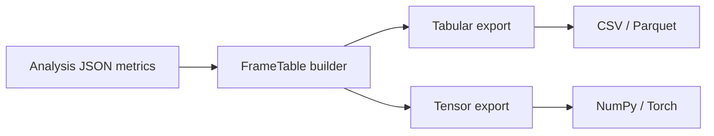

# esl ML Features and FrameTable Contract

This document defines the canonical ML-facing feature contract in `esl`.

- Code: `src/esl/ml/export.py`
- Contract version: `FRAMETABLE_VERSION = 1.0.0`

## FrameTable

`FrameTable` is the canonical intermediate representation for frame-wise features:

- `timestamps_s`: `[frames]`
- `feature_names`: `[features]`
- `values`: `[frames, features]`
- `channel_labels`: default `["mix"]`
- `metadata`: frame/hop, naming rules, tensor layout, source provenance

$$
\mathbf{X}\in\mathbb{R}^{F\times K}
$$

where \(F\) is number of frames and \(K\) is number of feature columns in `values`.

Plain English: FrameTable stores one feature row per time frame.

## Feature Naming Rules

- Aggregate frame features: `metric_id`
- Reserved channel-specific suffix form: `metric_id__chN` (for future per-channel frame feature columns)
- Deterministic ordering: lexicographic sort on feature names

## Tensor Layout

Canonical tensor export layout:
- `[channels, frames, features]`

Current default mode:
- `aggregate_mixdown`: one channel labeled `mix`
- shape: `[1, F, K]`

Optional future mode:
- `replicated_aggregate`: aggregate frame features repeated to source channel count for channel-axis model compatibility

$$
\mathbf{T}\in\mathbb{R}^{C\times F\times K}
$$

where \(C\) is channels, \(F\) is frames, and \(K\) is features.

Plain English: deep models get a channel-major tensor while tabular pipelines keep the frame table.

Snark note: if your model input shape is “whatever NumPy gave me,” reproducibility is already gone.

## Export Modes

Tabular exports (classical ML):
- `<prefix>_frame_table.csv` (wide, one row per timestamp)
- `<prefix>_frame_table.parquet` (optional; pandas/pyarrow runtime)
- `<prefix>_frame_features.csv` (legacy long-form table, preserved for compatibility)

Tensor exports (DL workflows):
- `<prefix>_frame_features.npy` (`[frames, features]`, legacy compatible)
- `<prefix>_frame_tensor.npy` (`[channels, frames, features]`, canonical)
- optional `.pt` tensors when PyTorch is available

Clip-level vector:
- `<prefix>_clip_features.npy`

Metadata:
- `<prefix>_ml_metadata.json` includes column names, timestamps, tensor layout, tensor shape, seed, config/pipeline hash, and `esl_version`.

## HuggingFace and Anomaly Exports

- HuggingFace dataset export is optional (`datasets` dependency).
- Isolation Forest anomaly score export is optional (`scikit-learn` dependency).
- Anomaly CSV: `<prefix>_anomaly_scores.csv`

## Related Docs

- [`METRICS_REFERENCE.md`](METRICS_REFERENCE.md)
- [`NOVELTY_ANOMALY.md`](NOVELTY_ANOMALY.md)
- [`SCHEMA.md`](SCHEMA.md)
- [`MOMENTS_EXTRACTION.md`](MOMENTS_EXTRACTION.md)
