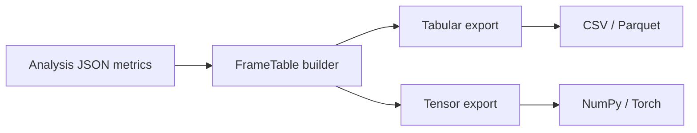

# esl ML Features and FrameTable Contract

Quick links: [Docs Index](INDEX.md) | [Getting Started](GETTING_STARTED.md) | [Task Recipes](TASK_RECIPES.md) | [Troubleshooting](TROUBLESHOOTING.md) | [Schema](SCHEMA.md) | [Metrics](METRICS_REFERENCE.md) | [References](REFERENCES.md)

This document defines the canonical ML-facing feature contract in `esl`.

- Code: `src/esl/ml/export.py`
- Contract version: `FRAMETABLE_VERSION = 1.0.0`

## FrameTable

`FrameTable` is the canonical intermediate representation for frame-wise features:

- `timestamps_s`: `[frames]`
- `feature_names`: `[features]`
- `values`: `[frames, features]`
- `channel_labels`: default `["mix"]`
- `metadata`: frame/hop, naming rules, tensor layout, source provenance

$$
\mathbf{X}\in\mathbb{R}^{F\times K}
$$

where \(F\) is number of frames and \(K\) is number of feature columns in `values`.

Plain English: FrameTable stores one feature row per time frame.


```mermaid
flowchart LR
    A["Analysis JSON metrics"] --> B["FrameTable builder"]
    B --> C["Tabular export"]
    B --> D["Tensor export"]
    C --> E["CSV / Parquet"]
    D --> F["NumPy / Torch"]
```

## Feature Naming Rules

- Aggregate frame features: `metric_id`
- Reserved channel-specific suffix form: `metric_id__chN` (for future per-channel frame feature columns)
- Deterministic ordering: lexicographic sort on feature names

## Tensor Layout

Canonical tensor export layout:
- `[channels, frames, features]`

Current default mode:
- `aggregate_mixdown`: one channel labeled `mix`
- shape: `[1, F, K]`

Optional future mode:
- `replicated_aggregate`: aggregate frame features repeated to source channel count for channel-axis model compatibility

$$
\mathbf{T}\in\mathbb{R}^{C\times F\times K}
$$

where \(C\) is channels, \(F\) is frames, and \(K\) is features.

Plain English: deep models get a channel-major tensor while tabular pipelines keep the frame table.

Snark note: if your model input shape is “whatever NumPy gave me,” reproducibility is already gone.

## Export Modes

Tabular exports (classical ML):
- `<prefix>_frame_table.csv` (wide, one row per timestamp)
- `<prefix>_frame_table.parquet` (optional; pandas/pyarrow runtime)
- `<prefix>_frame_features.csv` (legacy long-form table, preserved for compatibility)
- `<prefix>_frame_table.h5` (appendable HDF5 variant for long-running jobs)

Out-of-core tabular export for very long files:
- `esl analyze ... --chunk-* --summary-only --frame-table-csv out/frame_table.csv`
- this writes the canonical FrameTable incrementally during chunked analysis
- the sidecar metadata file is `out/frame_table.csv.meta.json`
- `esl analyze ... --frame-table-parquet-dir out/frame_table.parquet`
  - writes an appendable Parquet dataset directory with `part-*.parquet`
- `esl analyze ... --frame-table-hdf5 out/frame_table.h5`
  - writes a resizable HDF5 FrameTable with feature names stored in file metadata

Plain English: for multi-day or multi-year material, the CSV sidecar is the first-class product; the JSON summary is just the compact report.

Tensor exports (DL workflows):
- `<prefix>_frame_features.npy` (`[frames, features]`, legacy compatible)
- `<prefix>_frame_tensor.npy` (`[channels, frames, features]`, canonical)
- optional `.pt` tensors when PyTorch is available

Clip-level vector:
- `<prefix>_clip_features.npy`

Metadata:
- `<prefix>_ml_metadata.json` includes column names, timestamps, tensor layout, tensor shape, seed, config/pipeline hash, and `esl_version`.
- `compute_device` metadata includes requested/resolved device and CUDA/MPS availability.
- `<prefix>_dataset_manifest.json` is a single-sample ML manifest that points at the exported artifacts.

## Dataset Manifests

If you already exported many `*_ml_metadata.json` files, you can build one deterministic dataset manifest:

```bash
esl features manifest ml_exports_root \
  --out out/dataset_manifest.json \
  --split-ratios 0.8,0.1,0.1
```

Where:

- \(N\) is the number of discovered samples
- samples are sorted deterministically by path
- split assignment is applied over that sorted order

Plain English: the same folder produces the same manifest and the same train/val/test assignment every time.

## Long-Duration Note

For very large recordings, prefer this sequence:

1. `esl analyze ... --summary-only --frame-table-csv ...`
2. optionally emit `--frame-table-parquet-dir` and/or `--frame-table-hdf5`
3. load the FrameTable artifact with pandas/Polars/h5py
4. derive downstream tensor batches only after filtering or batching

Why:
- frame-wise rows can be appended safely during chunked analysis
- JSON time-series fields are a bad container for multi-million-frame runs
- tensor materialization should happen after filtering or batching, not during the first pass

## Device Selection (CPU/CUDA/MPS)

`esl analyze` and `esl batch` expose:
- `--device auto|cpu|cuda|mps`

Resolution policy:
- `auto`: prefer CUDA, then MPS, else CPU.
- explicit unavailable accelerators can fail in strict mode for benchmark commands.

Device sanity benchmark:

```bash
esl benchmark device --device auto --frames 16384 --features 256 --iters 20
```

## HuggingFace and Anomaly Exports

- HuggingFace dataset export is optional (`datasets` dependency).
- Isolation Forest anomaly score export is optional (`scikit-learn` dependency).
- Anomaly CSV: `<prefix>_anomaly_scores.csv`

## Related Docs

- [`METRICS_REFERENCE.md`](METRICS_REFERENCE.md)
- [`NOVELTY_ANOMALY.md`](NOVELTY_ANOMALY.md)
- [`SCHEMA.md`](SCHEMA.md)
- [`MOMENTS_EXTRACTION.md`](MOMENTS_EXTRACTION.md)
