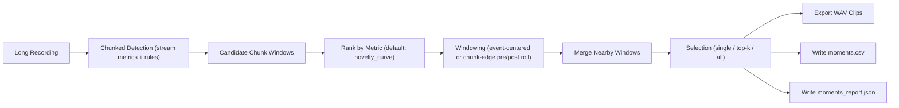

# Moments Extraction

`esl` can detect interesting acoustic moments in long recordings and export:
- timestamped moments CSV
- per-moment WAV clips
- extraction report JSON

This is designed for long-form monitoring data, including multichannel and ambisonic B-format WAV.

## Command

```bash
esl moments extract input_24h.wav \
  --out out/moments \
  --rules rules_24h.yaml \
  --metrics novelty_curve,spectral_change_detection,isolation_forest_score,spl_a_db \
  --chunk-size 2880000 \
  --sample-rate 96000 \
  --top-k 12 \
  --rank-metric novelty_curve \
  --event-window 8 \
  --merge-gap 2
```

Selection modes:
- `--single`: export only the highest-ranked moment
- `--top-k N`: export the top `N` ranked moments
- `--all`: export all detected moments (default behavior)

Ranking:
- `--rank-metric novelty_curve` (default) ranks moments by per-chunk novelty score.
- You can rank by any emitted chunk metric mean, for example `spectral_change_detection` or `spl_a_db`.

Snark note: if your `rank_metric` is random, your highlights are random. That is not “discovery,” that is sampling.

### Ranking and Window Equations

$$
s_i = m_i
$$

where \(s_i\) is ranking score for candidate chunk \(i\), and \(m_i\) is that chunk’s value for the selected ranking metric.

Plain English: each candidate chunk \(i\) receives a ranking score \(s_i\) equal to its selected rank metric value \(m_i\) (for example `novelty_curve` mean).

$$
i^* = \arg\max_i s_i
$$

where \(i^*\) is index of highest-ranked candidate.

Plain English: `--single` picks the one chunk with highest score.

$$
\mathcal{I}_K = \mathrm{TopK}\left(\{s_i\}, K\right)
$$

where \(K\) is requested number of moments and \(\mathcal{I}_K\) is retained index set.

Plain English: `--top-k K` keeps the \(K\) highest-scoring moments.

$$
t_c = \frac{t_{\text{start}} + t_{\text{end}}}{2}
$$

where \(t_c\) is event center time and \(t_{\text{start}}, t_{\text{end}}\) are source chunk boundaries.

Plain English: event center is midpoint of the source chunk.

$$
t_{\text{clip,start}} = \max(0, t_c - w_b), \quad
t_{\text{clip,end}} = \min(T, t_c + w_a)
$$

where \(w_b\) is pre-window duration, \(w_a\) is post-window duration, and \(T\) is full recording duration.

Plain English: `--window-before` (\(w_b\)) and `--window-after` (\(w_a\)) define the extracted clip around each event center, bounded to file duration \(T\).

$$
\text{clip duration} = t_{\text{clip,end}} - t_{\text{clip,start}}
$$

where clip duration is zero-clamped implicitly by bounded start/end logic.

Plain English: if your window exceeds file bounds, `esl` trims safely instead of writing nonsense timestamps.

## Detection Rules

Rules file uses the same threshold shape as `esl stream`:

```yaml
metric_thresholds:
  novelty_curve:
    min: 0.30
  spectral_change_detection:
    min: 2.5
  isolation_forest_score:
    min: 1.8
  spl_a_db:
    min: 55.0
```

## Output Artifacts

- `moments.csv`
- `moments_report.json`
- `clips/moment_0001.wav`, `clips/moment_0002.wav`, ...

### `moments.csv` columns

- `clip_id`
- `start_s`
- `end_s`
- `start_hms`
- `end_hms`
- `duration_s`
- `alerts`
- `metrics` (semicolon-separated)
- `chunk_indices` (semicolon-separated)
- `rank_metric`
- `rank_score`
- `event_center_s`
- `wav_path`

## Workflow



## Precomputed Detection Path

If you already ran `esl stream`, reuse that report:

```bash
esl moments extract input_24h.wav \
  --out out/moments \
  --stream-report out/stream/stream_report.json
```

## Single Most Novel Moment Example

```bash
esl moments extract input_24h.wav \
  --out out/moments_single \
  --stream-report out/stream/stream_report.json \
  --single \
  --rank-metric novelty_curve \
  --window-before 4 \
  --window-after 6 \
  --merge-gap 0
```

## Ambisonic / Multichannel Notes

- Channel count is preserved in exported clips.
- Clip sample rate defaults to input sample rate unless `--sample-rate` is set.
- For PCM WAV input, exported codec is selected from input subtype where possible (`PCM_24` -> `pcm_s24le`).

## Suggested Defaults for 24h @ 96k

- `--chunk-size 2880000` (30 s chunks)
- `--top-k 20`
- `--rank-metric novelty_curve`
- `--event-window 8` (or `--window-before 4 --window-after 6` for asymmetric clips)
- `--merge-gap 2`
- start with 3-5 detection metrics, then tune thresholds per site.

## Related Docs

- [`README.md`](../README.md)
- [`NOVELTY_ANOMALY.md`](NOVELTY_ANOMALY.md)
- [`METRICS_REFERENCE.md`](METRICS_REFERENCE.md)
- [`SCHEMA.md`](SCHEMA.md)
