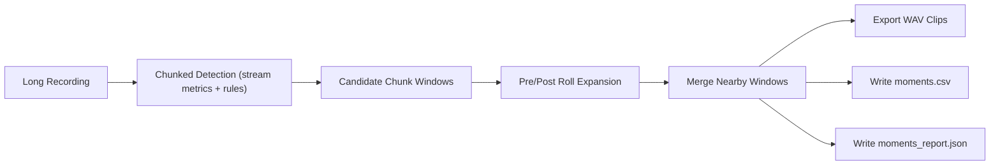

# Moments Extraction

`esl` can detect interesting acoustic moments in long recordings and export:
- timestamped moments CSV
- per-moment WAV clips
- extraction report JSON

This is designed for long-form monitoring data, including multichannel and ambisonic B-format WAV.

## Command

```bash
esl moments extract input_24h.wav \
  --out out/moments \
  --rules rules_24h.yaml \
  --metrics novelty_curve,spectral_change_detection,isolation_forest_score,spl_a_db \
  --chunk-size 2880000 \
  --sample-rate 96000 \
  --pre-roll 3 \
  --post-roll 3 \
  --merge-gap 2
```

## Detection Rules

Rules file uses the same threshold shape as `esl stream`:

```yaml
metric_thresholds:
  novelty_curve:
    min: 0.30
  spectral_change_detection:
    min: 2.5
  isolation_forest_score:
    min: 1.8
  spl_a_db:
    min: 55.0
```

## Output Artifacts

- `moments.csv`
- `moments_report.json`
- `clips/moment_0001.wav`, `clips/moment_0002.wav`, ...

### `moments.csv` columns

- `clip_id`
- `start_s`
- `end_s`
- `start_hms`
- `end_hms`
- `duration_s`
- `alerts`
- `metrics` (semicolon-separated)
- `chunk_indices` (semicolon-separated)
- `wav_path`

## Workflow



## Precomputed Detection Path

If you already ran `esl stream`, reuse that report:

```bash
esl moments extract input_24h.wav \
  --out out/moments \
  --stream-report out/stream/stream_report.json
```

## Ambisonic / Multichannel Notes

- Channel count is preserved in exported clips.
- Clip sample rate defaults to input sample rate unless `--sample-rate` is set.
- For PCM WAV input, exported codec is selected from input subtype where possible (`PCM_24` -> `pcm_s24le`).

## Suggested Defaults for 24h @ 96k

- `--chunk-size 2880000` (30 s chunks)
- `--pre-roll 3 --post-roll 3`
- `--merge-gap 2`
- start with 3-5 detection metrics, then tune thresholds per site.

## Related Docs

- [`README.md`](../README.md)
- [`NOVELTY_ANOMALY.md`](NOVELTY_ANOMALY.md)
- [`METRICS_REFERENCE.md`](METRICS_REFERENCE.md)
- [`SCHEMA.md`](SCHEMA.md)
