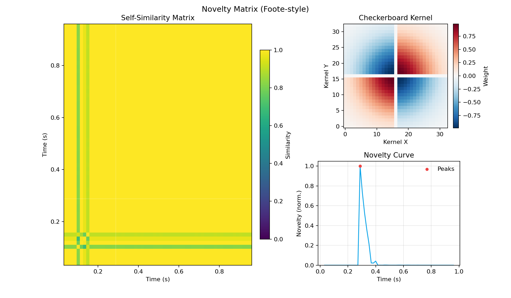
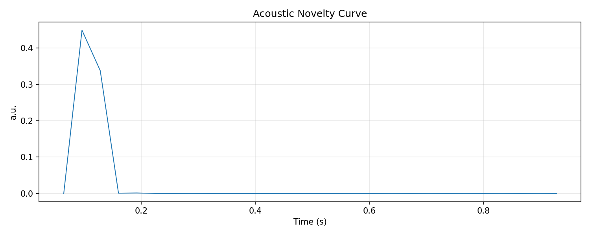

# Novelty and Anomaly Semantics

This document specifies the exact novelty/anomaly methods implemented in `esl`, including defaults and peak-picking behavior.

Primary code paths:
- `src/esl/metrics/builtin.py`
- `src/esl/metrics/extended.py`
- `src/esl/viz/plotting.py`

## Novelty Curve Metric (`novelty_curve`)

Method:
- Compute STFT magnitude `M(f,t)` from mono downmix.
- Positive spectral flux:
  - `N(t) = sum_f max(M(f,t) - M(f,t-1), 0)`

Implementation details:
- Frame params: `frame_size=2048`, `hop_size=512`
- No explicit temporal smoothing
- Units: arbitrary (`a.u.`)

## Spectral Change Detection (`spectral_change_detection`)

Method:
- Start from novelty curve `N(t)`.
- Z-score normalization:
  - `Z(t) = (N(t) - mean(N)) / (std(N) + eps)`

Event extraction:
- Default event candidate threshold in implementation: `Z(t) > 2.5`
- Output:
  - metric series is `Z(t)`
  - `extra.event_frame_indices` stores detected frame indices

Snark note: if you tune the threshold until everything is an event, you did not discover novelty, you discovered volume.

### Rendered Math (with interpretation)

$$
N(t)=\sum_f \max\!\left(M(f,t)-M(f,t-1),0\right)
$$

where \(M(f,t)\) is magnitude spectrogram energy at frequency bin \(f\) and frame \(t\).

Plain English: this novelty curve increases when new spectral components appear.

$$
Z(t)=\frac{N(t)-\mu_N}{\sigma_N+\varepsilon}
$$

where \(\mu_N\) is novelty mean, \(\sigma_N\) is novelty standard deviation, and \(\varepsilon\) is numerical stabilizer.

Plain English: z-scoring puts novelty on a normalized scale so thresholding is more stable.

$$
\mathcal{N}(i)=\sum_{u=-L}^{L}\sum_{v=-L}^{L} S(i+u,i+v)\,K(u,v)
$$

where \(S\) is self-similarity matrix, \(K\) is checkerboard kernel, \(L\) is half-kernel width, and \(i\) is diagonal frame index.

Plain English: Foote novelty is a checkerboard-kernel contrast around the self-similarity matrix diagonal.

$$
\hat{\mathcal{N}}(i)=\frac{\max(\mathcal{N}(i),0)}{\max_j \max(\mathcal{N}(j),0)+\varepsilon}
$$

where \(\hat{\mathcal{N}}(i)\) is normalized novelty and \(j\) indexes all frames.

Plain English: half-wave rectification and normalization produce a bounded \([0,1]\) novelty profile.

## Similarity Matrix Plot

Method:
- Frame-level feature vectors `X[t,:]` are extracted from mono downmix.
- Default `feature_set=auto`:
  - uses librosa-rich features when available (`log-mel`, MFCC(+delta,+delta2), chroma, spectral contrast, tonnetz, spectral and temporal descriptors)
  - falls back to built-in scipy core feature stack when librosa is unavailable
- You can force `feature_set`:
  - `core`, `librosa`, `all`, or `auto`
- Optional external feature vectors can be provided (`.npz`, `.npy`, `.csv`) and used directly.
- Per-frame centering + L2 normalization.
- Cosine self-similarity:
  - `S = X * X^T`, clipped to `[0,1]`

$$
S_{ij}=\frac{x_i^\top x_j}{\|x_i\|_2\|x_j\|_2+\varepsilon}
$$

where \(x_i\) and \(x_j\) are feature vectors for frames \(i\) and \(j\), and \(S_{ij}\) is cosine similarity.

Plain English: entries near 1 mean frames look alike in feature space; entries near 0 mean they do not.

CLI:
- `esl analyze ... --similarity-matrix --plot`
- `esl plot results.json --similarity-matrix`
- `esl plot results.json --similarity-matrix --sim-feature-set all`
- `esl plot results.json --similarity-matrix --feature-vectors vectors.npz`

## Novelty Matrix Plot (Foote-style)

Method:
1. Compute self-similarity matrix `S`.
2. Build Gaussian checkerboard kernel `K` of size `(2L+1)^2`:
   - default `kernel_size=32` => `L=16` target (bounded by matrix size)
   - default `kernel_sigma_scale=0.5`
3. Novelty by diagonal convolution:
   - `novelty[i] = sum( S_local * K )`
4. Half-wave rectification + max normalization to `[0,1]`.
5. Peak picking (`scipy.signal.find_peaks`) with:
   - `distance = max(1, L//2)`
   - `prominence = 0.08` when non-zero novelty exists

$$
\mathcal{P}=\left\{i \mid \hat{\mathcal{N}}(i)\ \text{is a local maximum and passes prominence/distance constraints}\right\}
$$

where \(\mathcal{P}\) is selected event index set from peak picking constraints.

Plain English: not every bump is an event; peaks must be both separated and prominent enough.


CLI:
- `esl analyze input.wav --plot --novelty-matrix`
- `esl plot results.json --novelty-matrix`
- `esl plot results.json --novelty-matrix --sim-feature-set librosa`
- `esl plot results.json --novelty-matrix --feature-vectors vectors.csv`

## Committed Example Plot Set

The repository includes a generated novelty plot set example at:
- [`docs/examples/novelty_plot_set/`](examples/novelty_plot_set)

Generation command used:

```bash
esl plot examples/sample_run/output/demo_stereo.json \
  --out docs/examples/novelty_plot_set \
  --audio examples/sample_run/input/demo_stereo.wav \
  --no-spectral \
  --novelty-matrix
```

Artifacts:
- [`novelty_matrix.png`](examples/novelty_plot_set/novelty_matrix.png)
- [`novelty_curve.png`](examples/novelty_plot_set/novelty_curve.png)
- [`spl_a_over_time.png`](examples/novelty_plot_set/spl_a_over_time.png)
- [`snr_over_time.png`](examples/novelty_plot_set/snr_over_time.png)
- [`rt60_decay_curve.png`](examples/novelty_plot_set/rt60_decay_curve.png)

Preview:




## Model-Based Anomaly Metrics

- `isolation_forest_score`
  - Uses frame feature matrix from spectral descriptors.
  - Score semantics: larger score => more anomalous.
  - Fallback behavior: z-score L2 norm when model dependency unavailable.

- `ocsvm_score`
  - One-Class SVM score with same “higher = more anomalous” semantics.
  - Fallback behavior mirrors `isolation_forest_score`.

- `autoencoder_recon_error`
  - Low-rank PCA/SVD reconstruction proxy.
  - Frame-wise MSE residual as anomaly score.

- `change_point_confidence`
  - Uses novelty z-score peak structure.
  - Confidence maps peak prominence to `[0,1]`.

## Confidence and Interpretation

- Novelty and change metrics are relative descriptors; absolute thresholds are dataset-dependent.
- Model-based scores are unsupervised and should be calibrated against site/domain baselines.
- Use `metadata.validity_flags` and per-metric `confidence` together for gating.

## Related Docs

- [`METRICS_REFERENCE.md`](METRICS_REFERENCE.md)
- [`ML_FEATURES.md`](ML_FEATURES.md)
- [`MOMENTS_EXTRACTION.md`](MOMENTS_EXTRACTION.md)
- [`SCHEMA.md`](SCHEMA.md)
- [`REFERENCES.md`](REFERENCES.md)
