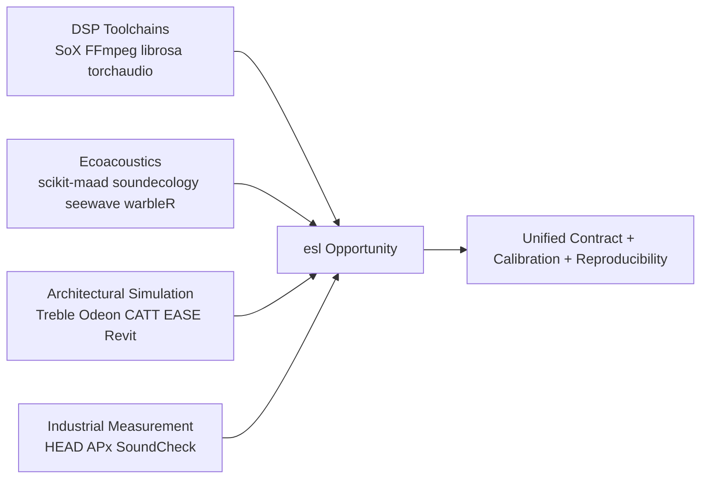
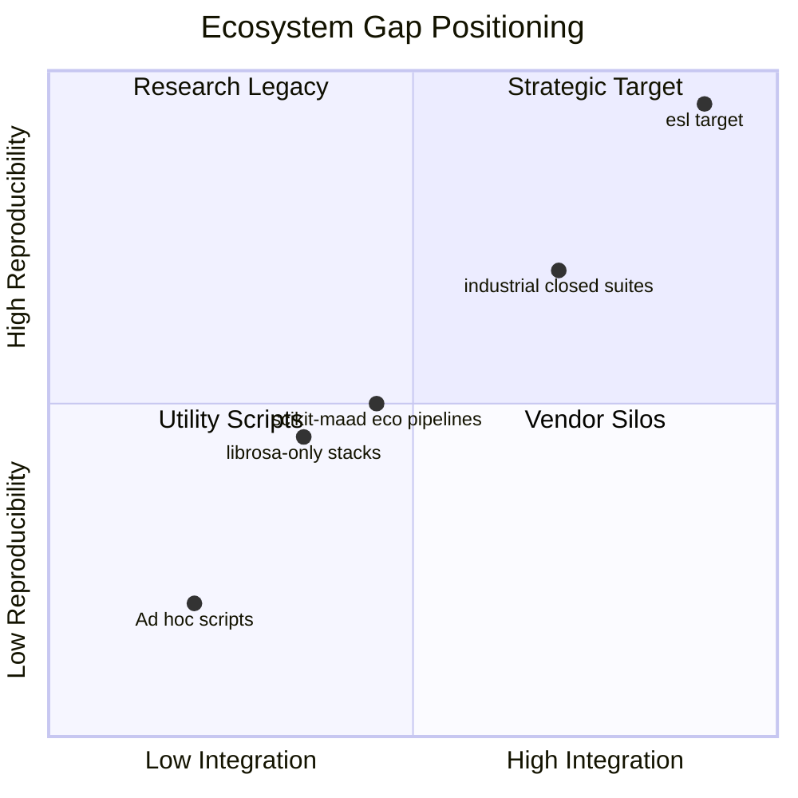
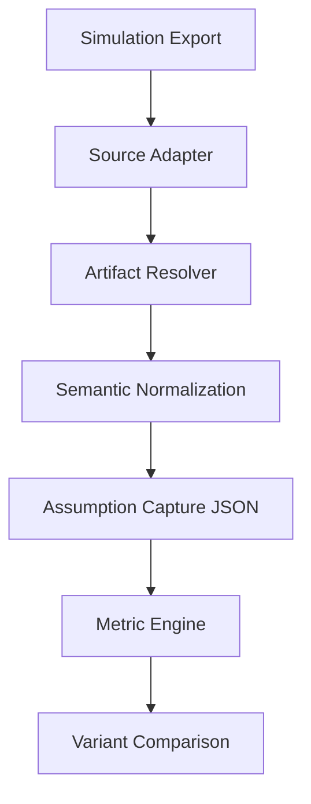
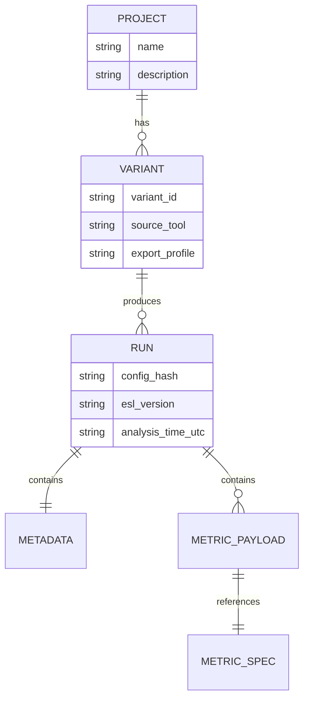
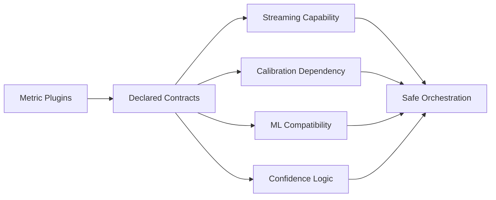

# ecoSignalLab (esl) Phase 1: Ecosystem and Gap Analysis

Date: 2026-02-18

This document delivers:
- A) Comparative matrix
- B) Ranked gap analysis
- C) Differentiation strategy
- D) Stable metric taxonomy
- E) JSON schema proposal
- F) Simulation ingestion architecture
- G) ML integration plan

## A) Comparative Matrix

Legend:
- Multi-channel: `Yes` / `Partial` / `No`
- Calibration (dBFS<->SPL): `Native` / `Partial` / `No`
- Simulation import: `Native` / `Indirect` / `No`
- ML readiness: `High` / `Medium` / `Low`
- JSON schema quality: `High` / `Medium` / `Low`
- Batch support: `High` / `Medium` / `Low`
- Reproducibility: `High` / `Medium` / `Low`

| Stack | Language | License | Multi-channel | Calibration | Simulation import | ML readiness | JSON schema quality | Batch support | Reproducibility | Notes |
|---|---|---|---|---|---|---|---|---|---|---|
| SoX | C/CLI | GPL/LGPL | Yes | No | No | Low | Low | High | Medium | Strong conversion/effects toolchain, weak semantics. |
| FFmpeg/ffprobe | C/CLI/libs | LGPL/GPL options | Yes | No | No | Medium | Medium | High | Medium | Best-in-class codec and probing interoperability. |
| librosa | Python | ISC | Partial | No | No | High | Low | Medium | Medium | Feature-rich research DSP; multi-channel caveats remain. |
| torchaudio | Python/C++ | BSD-2-Clause | Yes | No | No | High | Medium | Medium | High | Strong tensor pipelines and dataset hooks; in maintenance mode. |
| Essentia | C++/Python | AGPL/commercial | Partial | Partial | No | Medium | Low | Medium | Medium | Powerful MIR descriptors; licensing friction for some deployments. |
| aubio | C/Python | GPL-3.0 | Partial | No | No | Medium | Low | Medium | Medium | Lightweight event/pitch tracking; narrower coverage. |
| pyAudioAnalysis | Python | Apache-2.0 | Partial | No | No | Medium | Low | Medium | Medium | Practical ML/audio toolkit, not calibration-centric. |
| pyloudnorm | Python | MIT | Yes | Partial | No | Medium | Low | Medium | High | Accurate loudness core; narrower metric breadth. |
| acoustics (python-acoustics) | Python | BSD-3-Clause | Partial | Partial | Indirect | Medium | Low | Low | Medium | Useful acoustics formulas; project archived (2024-02-07). |
| scikit-maad | Python | BSD-3-Clause | Partial | Native (SPL features) | No | Medium | Low | High | Medium | Strong ecoacoustic metrics and dataset scanning. |
| soundecology (R) | R | GPL-3 | Partial | Partial | No | Low | Low | Medium | Medium | Ecoacoustic indices with smaller integration surface. |
| seewave (R) | R | GPL (>=2) | Partial | Partial | No | Low | Low | Medium | Medium | Broad classic bioacoustics signal toolkit. |
| warbleR (R) | R | GPL (>=2) | Partial | Partial | No | Medium | Low | High | Medium | Bioacoustics workflow and batch-oriented analysis. |
| HF Datasets + audio | Python | Apache-2.0 | Yes | No | Indirect | High | High | High | High | Dataset-native ML plumbing and metadata patterns. |
| PyOD (anomaly) | Python | BSD-2-Clause | N/A | N/A | N/A | High | Medium | High | High | Broad anomaly algorithms for feature vectors. |
| Revit exports (via DWG/workflow) | Proprietary | Commercial | N/A | N/A | Indirect | Low | Medium | Medium | Medium | Primarily geometry/BIM handoff rather than acoustics-native IR exports. |
| AutoCAD outputs (DWG) | Proprietary | Commercial | N/A | N/A | Indirect | Low | Medium | High | High | Strong geometry exchange, not acoustic metrics-native. |
| Treble exports | Proprietary + SDK | Commercial | Yes | Partial | Native | High | Medium | High | High | Direct mono/spatial IR export + acoustic parameter retrieval. |
| ODEON exports | Proprietary | Commercial | Yes | Partial | Native | Medium | Medium | High | Medium | Can load external IR WAV and compute room parameters. |
| CATT-Acoustic exports | Proprietary | Commercial | Yes | Partial | Native | Medium | Medium | High | Medium | IR/measures export incl. WAV/MAT; B-format and binaural workflows. |
| EASE exports | Proprietary | Commercial | Yes | Partial | Native/Indirect | Medium | Medium | High | Medium | Strong model interoperability (EASE4/5, DWG, speaker data flows). |
| HEAD Acoustics suite | Proprietary | Commercial | Yes | Native | Indirect | Medium | Medium | High | High | Industrial workflow with batch and structured exports. |
| Audio Precision APx | Proprietary | Commercial | Yes | Native | No | Medium | Medium | High | High | Mature automation API + CSV/Excel/MATLAB report exports. |
| Listen SoundCheck | Proprietary | Commercial | Yes | Native | Indirect | Medium | Medium | High | High | Strong sequence automation, metadata, and integration hooks. |

## B) Ranked Gap Analysis

1. Calibration-aware cross-library standardization
- Gap: Most open stacks calculate in dBFS and do not preserve end-to-end calibration assumptions.
- Impact: Hard to compare studies, especially environmental and regulatory workflows.

2. Architectural simulation interoperability
- Gap: Simulation tools export useful artifacts, but open Python stacks lack first-class ingest + provenance conventions.
- Impact: Engineering teams rely on brittle ad hoc scripts.

3. Unified multi-channel + ambisonic-native metrics
- Gap: Partial multi-channel support across many libraries; ambisonic handling is fragmented.
- Impact: Spatial design and immersive analytics are under-served.

4. Reproducibility metadata and config hashing
- Gap: Few toolchains emit stable run metadata, config hashes, and deterministic provenance by default.
- Impact: Weak traceability in production and research audit trails.

5. Plugin-level metric contracts
- Gap: Existing stacks expose functions, not strict metric capability descriptors.
- Impact: Hard to validate streaming/calibration/ML compatibility at orchestration time.

6. Native anomaly workflows for acoustic intelligence
- Gap: Anomaly detection is often externalized to generic ML stacks without acoustic priors.
- Impact: Longer integration cycles and inconsistent outputs.

7. Industrial interop mapping transparency
- Gap: Vendor systems export data, but cross-tool mappings (windowing, weighting, definitions) are rarely standardized in open workflows.
- Impact: Data handoff errors and interpretation drift.

8. Dataset ingestion + immediate analysis loop
- Gap: Ingestion pipelines and DSP pipelines are often separate systems.
- Impact: Slower iteration and fragmented metadata.

9. JSON schema governance for acoustic analytics
- Gap: Most tools emit ad hoc structures or none at all.
- Impact: Poor contract stability across teams.

10. End-to-end CLI ergonomics for acoustics
- Gap: Existing stacks require orchestration glue (shell scripts/notebooks).
- Impact: Increased operational complexity and onboarding cost.

## C) Differentiation Strategy

esl should win on integrated capability, not single-metric novelty:

1. Multi-channel-first core (1..N) with ambisonic awareness
- Every metric declares channel behavior and spatial assumptions.

2. Calibration as a first-class artifact
- Persist calibration profile with every run and label outputs explicitly (`dBFS`, `dBA`, `dBC`, `SPL`).

3. Simulation-native ingestion
- Treat Treble/Odeon/CATT/EASE/Revit/AutoCAD outputs as a supported source class, not edge cases.

4. Contracted metric plugins
- Metric metadata declares streaming support, calibration dependencies, confidence logic, and ML compatibility.

5. Reproducibility defaults
- Deterministic seeds, config hashing, version stamping, and machine-readable assumptions.

6. Industrial and ML dual interoperability
- Export to scientific formats (Parquet/HDF5/MAT) and industry-facing CSV mappings in one run.

7. Project mode for design comparison
- First-class variant analytics for architectural decisions (`--project`, `--variant`).

## D) Stable Metric Taxonomy

### 1) Basic
- `rms_dbfs`
- `peak_dbfs`

### 2) Level & Loudness
- `spl_z_db`
- `spl_a_db`
- `spl_c_db`
- `crest_factor_db`

### 3) Noise & SNR
- `snr_db`

### 4) Spectral
- `spectral_centroid_hz`
- `spectral_bandwidth_hz`
- `spectral_flatness`
- `spectral_rolloff_hz`

### 5) Temporal
- `zero_crossing_rate`

### 6) Ecoacoustics
- `bioacoustic_index`
- `acoustic_complexity_index`

### 7) Spatial
- `interchannel_coherence`

### 8) Architectural Acoustics
- `rt60_s`
- `edt_s`
- `c50_db`
- `c80_db`
- `d50`

### 9) Anomaly / Novelty
- `novelty_curve`
- `spectral_change_detection`

Taxonomy stability rules:
- Metric IDs are immutable once released.
- Units are mandatory and versioned through schema.
- Any breaking definition update requires major schema bump.

## E) JSON Schema Proposal

esl output schema principles:

1. Top-level provenance
- `esl_version`, `analysis_time_utc`, `config_hash`, `analysis_mode`.

2. Metadata block
- Input origin and decode backend.
- Sampling parameters.
- Calibration profile and assumptions.

3. Metric payload per metric ID
- `summary` statistics.
- optional `series` + `timestamps_s`.
- `confidence`.
- embedded metric `spec` contract:
  - category, units, window/hop, streaming, calibration dependency, ML compatibility.

4. Forward compatibility
- Unknown metrics are allowed via open object maps.
- Consumers can validate by required contract fields.

Canonical schema source in this repository:
- `src/esl/schema/spec.py`

## F) Simulation Ingestion Architecture

### Inputs
- Geometry/CAD handoff: DWG and related model exports.
- Acoustic responses: WAV/FLAC mono, multichannel, ambisonic.
- Tool-native bundles/archives (if available).

### Normalized ingest pipeline
1. Source adapter
- Parse source metadata (tool, version, export options, design variant).

2. Artifact resolver
- Discover audio responses (IRs, rendered signals) and structured tables.

3. Semantic normalization
- Normalize channel layout tags, receiver/source IDs, coordinate references.

4. Provenance capture
- Persist simulation assumptions in JSON (`simulation_assumptions`).

5. Analysis dispatch
- Run architectural metrics + level trends + comparison deltas.

6. Variant comparison
- Merge runs in project index for A/B/C decision reporting.

### Adapter strategy
- `adapter_treble`: native IR + parameter retrieval.
- `adapter_odeon`: measured/simulated IR WAV ingest.
- `adapter_catt`: WAV/MAT exports ingest.
- `adapter_ease`: model/data export ingest.
- `adapter_revit_autocad`: geometry/context ingest + linked acoustic file resolution.

## G) ML Integration Plan

### 1. Feature products
- Frame-level matrix (time indexed).
- Clip-level vector (summary statistics).
- Optional anomaly score vector.

### 2. Data interfaces
- NumPy (`.npy`)
- PyTorch tensors (`.pt`)
- Hugging Face dataset export directory
- Tabular CSV/Parquet

### 3. Built-in anomaly path
- Acoustic novelty curve
- Spectral change detection
- Optional Isolation Forest over frame features
- Autoencoder-ready export (no hard framework lock-in)

### 4. Reproducibility
- Seed captured in output.
- Config hash attached to every artifact.
- Version stamps in metadata.

### 5. Governance
- Training/evaluation splits defined outside analysis core but referenced by hash and manifest.
- Dataset ingestion metadata persisted with license/terms notes.

## References

- SoX project page and license listing: https://sourceforge.net/projects/sox/
- FFmpeg license/legal: https://ffmpeg.org/legal.html
- librosa multi-channel docs: https://librosa.org/doc/latest/multichannel.html
- torchaudio docs and maintenance note: https://docs.pytorch.org/audio/stable/torchaudio.html
- Essentia licensing: https://essentia.upf.edu/licensing_information.html
- aubio project and tools: https://github.com/aubio/aubio
- pyAudioAnalysis: https://github.com/tyiannak/pyAudioAnalysis
- pyloudnorm: https://github.com/csteinmetz1/pyloudnorm
- python-acoustics archive and license: https://github.com/python-acoustics/python-acoustics
- scikit-maad: https://github.com/scikit-maad/scikit-maad
- soundecology CRAN: https://cran.r-project.org/package=soundecology
- seewave CRAN: https://cran.r-project.org/package=seewave
- warbleR CRAN: https://cran.r-project.org/package=warbleR
- Hugging Face Datasets audio loading: https://huggingface.co/docs/datasets/en/audio_load
- Freesound API docs: https://freesound.org/docs/api/
- PyOD license/project: https://github.com/yzhao062/pyod
- Treble result export and IR retrieval: https://docs.treble.tech/treble-sdk/results/get-and-export-data
- Treble download formats: https://docs.treble.tech/user-guide/results/Downloading%20and%20saving%20results
- ODEON load and analyze external IR WAVs: https://odeon.dk/learn/video-tutorials/load-ir/
- ODEON IR support page: https://odeon.dk/downloads/impulse-responses/
- CATT TUCT export formats and IR handling: https://www.catt.se/TUCT/TUCToverview.html
- CATT auralization capabilities: https://www.catt.se/auralization.htm
- EASE import/export interoperability: https://www.afmg.eu/en/ease
- EASE DWG and Revit workflow mention: https://www.afmg.eu/en/ease-5-full-3d-model-import-autocad-rhino-and-sketchup
- HEAD Batch Processor formats: https://www.head-acoustics.com/products/analysis-software/batch-processor/
- HEAD Companion exports: https://www.head-acoustics.com/products/analysis-software/head-companion
- APx automation API: https://www.ap.com/analyzers-accessories/apx-overview/automation
- APx export/report formats: https://www.ap.com/analyzers-accessories/apx511
- APx manual (recent): https://www.ap.com/fileadmin-ap/technical-library/APx500_Users_Manual_v9-1-0.pdf
- SoundCheck release and features: https://support.listeninc.com/hc/en-us/articles/204661080-Latest-SoundCheck-Release
- SoundCheck test sequence automation: https://www.listeninc.com/products/soundcheck-software/soundcheck-features-and-functionality/soundcheck-test-sequences/
- SoundCheck Python/TCP integration: https://support.listeninc.com/hc/en-us/articles/115002735086-Can-SoundCheck-be-Externally-Controlled-Using-a-Python-Script
- SoundCheck specs/export integration: https://www.listeninc.com/products/soundcheck-software/specs/soundcheck-technical-specifications/

## Visual Synthesis

Reference set:
- [`/Users/cleider/dev/ecoSignalLab/docs/REFERENCES.md`](/Users/cleider/dev/ecoSignalLab/docs/REFERENCES.md)
- [`/Users/cleider/dev/ecoSignalLab/docs/ATTRIBUTION.md`](/Users/cleider/dev/ecoSignalLab/docs/ATTRIBUTION.md)

## Hyperlinked Deliverables

- Comparative matrix and gap ranking: this document
- Stable taxonomy and formulas: [`/Users/cleider/dev/ecoSignalLab/docs/METRICS_REFERENCE.md`](/Users/cleider/dev/ecoSignalLab/docs/METRICS_REFERENCE.md)
- System-level design rationale: [`/Users/cleider/dev/ecoSignalLab/DESIGN.md`](/Users/cleider/dev/ecoSignalLab/DESIGN.md)
- Runtime and module architecture: [`/Users/cleider/dev/ecoSignalLab/ARCHITECTURE.md`](/Users/cleider/dev/ecoSignalLab/ARCHITECTURE.md)
