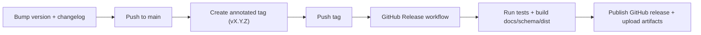

# Release Process

This runbook describes how to cut an `esl` release and publish build artifacts (wheel/sdist, docs HTML/PDF, schema JSON).

## Preconditions

- Working tree is clean.
- `CHANGELOG.md` has updated release notes.
- `pyproject.toml` and `src/esl/version.py` contain the target version.
- Docs links are current, including workflow references like [`docs/MOMENTS_EXTRACTION.md`](MOMENTS_EXTRACTION.md).
- Tests pass locally:

```bash
.venv/bin/pytest -q
```

## Release Flow



## Commands

1. Verify version consistency:

```bash
python - <<'PY'
import tomllib
from pathlib import Path
from esl import __version__
py = tomllib.loads(Path("pyproject.toml").read_text(encoding="utf-8"))
print("pyproject:", py["project"]["version"])
print("runtime:", __version__)
PY
```

2. Create and push a tag:

```bash
git tag -a v0.2.0 -m "ecoSignalLab v0.2.0"
git push origin v0.2.0
```

3. Monitor GitHub workflow:
- [`Release`](../.github/workflows/release.yml)

## Workflow Outputs

The release workflow publishes:

- `dist/*.whl`
- `dist/*.tar.gz` (sdist)
- `docs-build-html.tar.gz`
- `docs-build-pdf.tar.gz`
- `docs/schema/analysis-output-<schema_version>.json`

## Notes

- The workflow checks that `vX.Y.Z` tag matches package runtime version.
- PDF generation requires Playwright Chromium in CI.
- For manual smoke without a tag, run `workflow_dispatch` from GitHub Actions.
