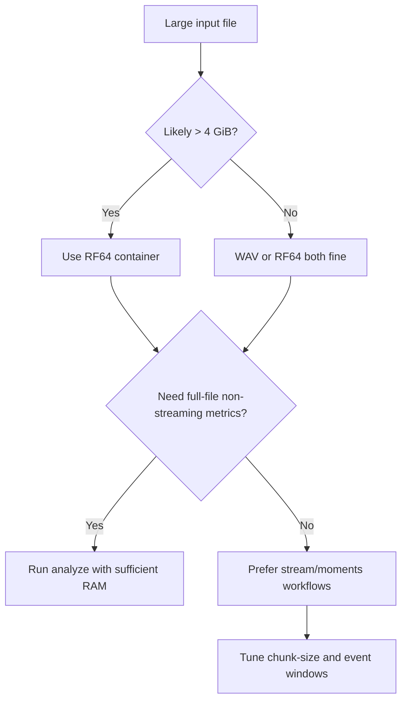

# RF64 and Large Files in `esl`

This guide explains what RF64 is, why it matters, and how to run `esl` safely on very large recordings.

## Short answer

- Classic WAV (RIFF/WAV) has a practical container limit near 4 GB.
- RF64 is a WAV-family extension that lifts this limit for very large files.
- `esl` supports RF64 in native decode paths.

If your recording can exceed 4 GiB, use RF64 from the start.

## What is RF64?

RF64 is an extension of RIFF/WAV standardized in broadcast workflows (EBU Tech 3306; see [S6 in `REFERENCES.md`](REFERENCES.md#standards)).  
It keeps the familiar WAV model (PCM/floating-point samples + channel metadata) but replaces 32-bit size constraints with 64-bit-capable bookkeeping (`ds64` chunk).

Plain English: RF64 is "WAV for huge files."

## Why regular WAV runs out of room

Classic RIFF/WAV stores major chunk sizes as unsigned 32-bit values.

The largest representable byte count is:

$$
B_{\max} = 2^{32} - 1
$$

where \(B_{\max}\) is the maximum storable byte length in the classic 32-bit fields.

For uncompressed PCM-like data, data rate is:

$$
R = f_s \cdot C \cdot \frac{b}{8}
$$

where:
- \(f_s\) is sample rate in Hz
- \(C\) is number of channels
- \(b\) is bits per sample
- \(R\) is bytes per second

Approximate maximum duration for classic WAV:

$$
T_{\max} \approx \frac{2^{32}-1}{f_s \cdot C \cdot b/8}
$$

where \(T_{\max}\) is seconds before hitting the RIFF size ceiling.

## Practical duration examples for classic WAV

| Format | Bytes/sec | Max duration (approx) |
|---|---:|---:|
| 48 kHz, stereo, 16-bit PCM | 192,000 | 6.21 h |
| 96 kHz, 4 ch, 24-bit PCM | 1,152,000 | 1.04 h |
| 96 kHz, 16 ch, 24-bit PCM | 4,608,000 | 15.5 min |
| 96 kHz, 4 ch, float32 | 1,536,000 | 46.6 min |

Takeaway: high-rate multichannel capture can overflow classic WAV quickly.

## How big are day-scale files?

File-size estimator:

$$
B \approx T \cdot f_s \cdot C \cdot \frac{b}{8}
$$

where:
- \(B\) is bytes
- \(T\) is duration in seconds
- \(f_s\), \(C\), \(b\) as above

Examples for 24 hours:

| Recording | Approx size |
|---|---:|
| 24 h, 96 kHz, 4 ch, 24-bit PCM | 92.70 GiB |
| 24 h, 96 kHz, 4 ch, float32 | 123.60 GiB |
| 24 h, 96 kHz, 16 ch, 24-bit PCM | 370.79 GiB |

These are recording-file sizes, not full analysis memory usage.

## How `esl` handles RF64

`esl` native decode supports:
- WAV
- RF64
- FLAC
- AIFF/AIF
- CAF

Compressed formats use FFmpeg fallback when needed.

You can confirm the decode path in output JSON:
- `metadata.format_name`
- `metadata.backend`
- `metadata.decoder.decoder_used`
- `metadata.decoder.ffprobe` (when FFmpeg path is used)

See [`SCHEMA.md`](SCHEMA.md) for field definitions.

## Convert and verify RF64

Convert an existing file to RF64 with FFmpeg:

```bash
ffmpeg -i input.wav -c:a pcm_s24le -rf64 always output_rf64.wav
```

Inspect container/stream metadata:

```bash
ffprobe -hide_banner -show_format -show_streams output_rf64.wav
```

Note: RF64 files often keep `.wav` extension. The difference is in the container header/chunks, not the filename suffix.

## Large-file strategy in `esl`

Use this command-level decision flow:



### Command patterns

Single-file analysis (full report):

```bash
esl analyze long_capture.wav --out-dir out --json out/long_capture.json --plot
```

Streaming-style monitoring with alerts:

```bash
esl stream long_capture.wav \
  --out stream_out \
  --chunk-size 2880000 \
  --metrics novelty_curve,spl_a_db,ndsi \
  --rules rules/stream_alerts.yaml
```

Interesting moment extraction:

```bash
esl moments extract long_capture.wav \
  --out out/moments \
  --single \
  --rank-metric novelty_curve \
  --event-window 12 \
  --chunk-size 2880000
```

## Choosing `--chunk-size`

Chunk duration:

$$
T_{\text{chunk}} = \frac{N_{\text{chunk}}}{f_s}
$$

where:
- \(N_{\text{chunk}}\) is `--chunk-size` in samples
- \(f_s\) is sample rate

Chunk memory (raw sample matrix only):

$$
M_{\text{chunk}} \approx N_{\text{chunk}} \cdot C \cdot s
$$

where:
- \(C\) is channels
- \(s\) is bytes/sample (4 for float32)

Example at 96 kHz, 4 channels, float32:
- `--chunk-size 960000` is 10 s chunks
- Raw sample matrix is about \(960000 \cdot 4 \cdot 4 = 15{,}360{,}000\) bytes (~14.65 MiB/chunk)

## Operational notes

- Some metrics are intentionally non-streaming for correctness.  
- Very long files may still be constrained by RAM and runtime depending on metric set and workflow.
- For early exploration on massive recordings, start with:
  - smaller selected metric lists
  - chunked commands
  - moments extraction before full metric sweeps

## Troubleshooting checklist for large files

1. File is near/over 4 GiB and stored as classic WAV:
   - re-export or convert to RF64.
2. Decode fails on compressed sources:
   - check `ffmpeg` and `ffprobe` on `PATH`.
3. Memory pressure:
   - reduce metric set
   - use chunked workflows first
   - lower sample rate if acceptable for your use case

## Related Docs

- [`../README.md`](../README.md)
- [`GETTING_STARTED.md`](GETTING_STARTED.md)
- [`SCHEMA.md`](SCHEMA.md)
- [`MOMENTS_EXTRACTION.md`](MOMENTS_EXTRACTION.md)
- [`METRICS_REFERENCE.md`](METRICS_REFERENCE.md)
- [`REFERENCES.md`](REFERENCES.md)
