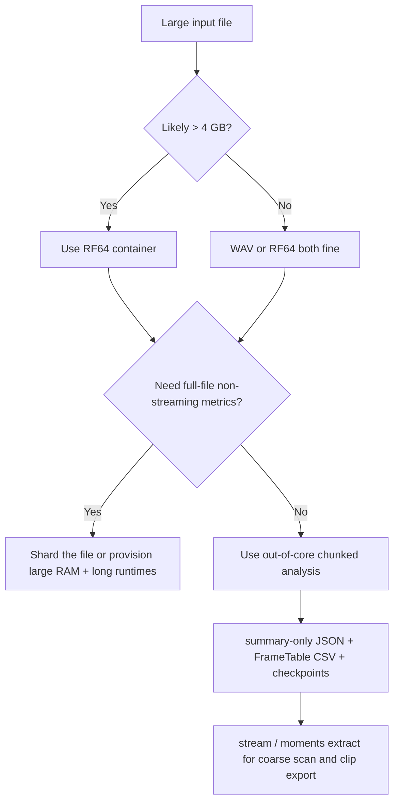
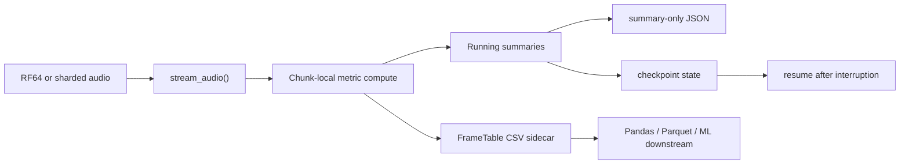

# RF64 and Large Files in `esl`

Quick links: [Docs Index](INDEX.md) | [Getting Started](GETTING_STARTED.md) | [Task Recipes](TASK_RECIPES.md) | [Troubleshooting](TROUBLESHOOTING.md) | [Schema](SCHEMA.md) | [Metrics](METRICS_REFERENCE.md) | [References](REFERENCES.md)

This guide explains what RF64 is, why it matters, and how to run `esl` safely on very large recordings.

## Short answer

- Classic WAV (RIFF/WAV) has a practical container limit near 4 GB.
- RF64 is a WAV-family extension that lifts this limit for very large files.
- `esl` supports RF64 in native decode paths.

If your recording can exceed 4 GB, use RF64 from the start.

## What is RF64?

RF64 is an extension of RIFF/WAV standardized in broadcast workflows (EBU Tech 3306; see [S6 in `REFERENCES.md`](REFERENCES.md#standards)).  
It keeps the familiar WAV model (PCM/floating-point samples + channel metadata) but replaces 32-bit size constraints with 64-bit-capable bookkeeping (`ds64` chunk).

Plain English: RF64 is "WAV for huge files."

## Why regular WAV runs out of room

Classic RIFF/WAV stores major chunk sizes as unsigned 32-bit values.

The largest representable byte count is:

$$
B_{\max} = 2^{32} - 1
$$

where \(B_{\max}\) is the maximum storable byte length in the classic 32-bit fields.

For uncompressed PCM-like data, data rate is:

$$
R = f_s \cdot C \cdot \frac{b}{8}
$$

where:
- \(f_s\) is sample rate in Hz
- \(C\) is number of channels
- \(b\) is bits per sample
- \(R\) is bytes per second

Approximate maximum duration for classic WAV:

$$
T_{\max} \approx \frac{2^{32}-1}{f_s \cdot C \cdot b/8}
$$

where \(T_{\max}\) is seconds before hitting the RIFF size ceiling.

## Practical duration examples for classic WAV

| Format | Bytes/sec | Max duration (approx) |
|---|---:|---:|
| 48 kHz, stereo, 16-bit PCM | 192,000 | 6.21 h |
| 96 kHz, 4 ch, 24-bit PCM | 1,152,000 | 1.04 h |
| 96 kHz, 16 ch, 24-bit PCM | 4,608,000 | 15.5 min |
| 96 kHz, 4 ch, float32 | 1,536,000 | 46.6 min |

Takeaway: high-rate multichannel capture can overflow classic WAV quickly.

## How big are day-scale files?

File-size estimator:

$$
B \approx T \cdot f_s \cdot C \cdot \frac{b}{8}
$$

where:
- \(B\) is bytes
- \(T\) is duration in seconds
- \(f_s\), \(C\), \(b\) as above

Examples for 24 hours:

Deterministic size model (uncompressed PCM / float PCM) is the equation above.

For compressed formats:

$$
B_{\text{mp3-cbr}} \approx T \cdot \frac{\text{bitrate}_{\text{bps}}}{8}
$$

where `bitrate_bps` is target CBR bit rate in bits/second.

$$
B_{\text{flac}} \approx \rho \cdot B_{\text{wav}}
$$

where \(\rho\) is compression ratio versus equivalent PCM WAV (content-dependent; rough field range often \(0.35\) to \(0.75\)).

### 24 h WAV/RF64 matrix (sorted by nominal data rate, then sample rate)

| Container/Codec | Sample rate | Channels | Depth | Nominal data rate | 24 h size (approx) | Notes |
|---|---:|---:|---:|---:|---:|---|
| WAV (PCM) | 48 kHz | 2 | 16-bit | 1.536 Mb/s | 15.45 GB | Exceeds classic WAV 4 GB; use RF64 for safety. |
| WAV (PCM) | 48 kHz | 2 | 24-bit | 2.304 Mb/s | 23.17 GB | RF64 strongly recommended. |
| WAV (PCM) | 48 kHz | 2 | 32-bit | 3.072 Mb/s | 30.90 GB | RF64 strongly recommended. |
| WAV (PCM) | 96 kHz | 2 | 24-bit | 4.608 Mb/s | 46.35 GB | RF64 required in practice for 24 h capture. |
| WAV (PCM) | 96 kHz | 4 | 24-bit | 9.216 Mb/s | 92.70 GB | Common multichannel field/simulation export case. |
| WAV (PCM) | 192 kHz | 2 | 24-bit | 9.216 Mb/s | 92.70 GB | Same byte rate as 96 kHz/4 ch/24-bit. |
| WAV (float) | 96 kHz | 4 | 32-bit | 12.288 Mb/s | 123.60 GB | Float render workflows; RF64 recommended. |
| WAV (PCM) | 96 kHz | 8 | 24-bit | 18.432 Mb/s | 185.39 GB | Immersive/multi-array workflows. |
| WAV (PCM) | 96 kHz | 16 | 24-bit | 36.864 Mb/s | 370.79 GB | Large-array / ambisonic render workflows. |
| WAV (PCM) | 192 kHz | 8 | 24-bit | 36.864 Mb/s | 370.79 GB | Very high-rate multichannel capture. |
| WAV (float) | 96 kHz | 16 | 32-bit | 49.152 Mb/s | 494.38 GB | Extreme-size sessions; stream/chunk strongly advised. |

### 24 h FLAC matrix (estimated range; sorted by source data rate)

| Container/Codec | Source equivalent | Compression ratio (\(\rho\)) | Nominal data-rate range | 24 h size range (approx) | Notes |
|---|---|---:|---:|---:|---|
| FLAC | 48 kHz, 2 ch, 16-bit PCM | 0.35 to 0.75 | 0.538 to 1.152 Mb/s | 5.41 to 11.59 GB | Lossless, smaller than WAV, still often >4 GB. |
| FLAC | 48 kHz, 2 ch, 24-bit PCM | 0.35 to 0.75 | 0.806 to 1.728 Mb/s | 8.11 to 17.38 GB | Good archive format for long recordings. |
| FLAC | 96 kHz, 4 ch, 24-bit PCM | 0.35 to 0.75 | 3.226 to 6.912 Mb/s | 32.44 to 69.52 GB | Compression depends strongly on scene complexity/noise floor. |
| FLAC | 96 kHz, 16 ch, 24-bit PCM | 0.35 to 0.75 | 12.902 to 27.648 Mb/s | 129.78 to 278.09 GB | Still very large; prefer chunked analysis strategy. |

### 24 h MP3 CBR matrix (sorted by bit rate)

| Container/Codec | Bit rate (CBR) | 24 h size (approx) | Notes |
|---|---:|---:|---|
| MP3 (CBR) | 96 kb/s | 0.97 GB | Compact monitoring/audio preview use. |
| MP3 (CBR) | 128 kb/s | 1.29 GB | Speech/low-bandwidth archive tradeoff. |
| MP3 (CBR) | 160 kb/s | 1.61 GB | Mid-quality lossy. |
| MP3 (CBR) | 192 kb/s | 1.93 GB | Common lossy distribution setting. |
| MP3 (CBR) | 256 kb/s | 2.57 GB | Higher-quality lossy, still compact. |
| MP3 (CBR) | 320 kb/s | 3.22 GB | Highest common CBR preset. |

These are recording-file size estimates, not full analysis memory usage.

Practical guidance:
- Use WAV/RF64 or FLAC for measurement-quality and calibration-sensitive workflows.
- Use MP3 only when lossy compression side-effects are acceptable for your use case.

## What about a 2-year file?

Suppose you really mean:
- `96 kHz`
- `32-bit float`
- `2 years`

Then

$$
T = 2 \cdot 365 \cdot 24 \cdot 3600 = 63{,}072{,}000 \text{ s}
$$

and

$$
B = T \cdot f_s \cdot C \cdot \frac{32}{8}
$$

where:
- \(B\) is bytes
- \(T\) is duration in seconds
- \(f_s\) is sample rate
- \(C\) is channels

Mono is:

$$
B = 63{,}072{,}000 \cdot 96{,}000 \cdot 1 \cdot 4
= 24{,}219{,}648{,}000{,}000
$$

which is about `24.22 TB`.

Scaling by channels:

| Channels | Approx size |
|---:|---:|
| 1 | 24.22 TB |
| 2 | 48.44 TB |
| 4 | 96.88 TB |
| 8 | 193.76 TB |
| 16 | 387.51 TB |

This means:
- classic WAV is impossible in practice
- RF64 is the minimum sane single-file container
- hourly or daily sharding is often a better operational choice than one giant file

Sequential read time for a mono `24.22 TB` file:

| Sustained read rate | One full pass |
|---:|---:|
| 200 MB/s | 33.6 h |
| 500 MB/s | 13.5 h |
| 1 GB/s | 6.7 h |

Plain English: you do not want a hidden full-file read anywhere in the pipeline.

## How `esl` handles RF64

`esl` native decode supports:
- WAV
- RF64
- FLAC
- AIFF/AIF
- CAF

Compressed formats use FFmpeg fallback when needed.

You can confirm the decode path in output JSON:
- `metadata.format_name`
- `metadata.backend`
- `metadata.decoder.decoder_used`
- `metadata.decoder.ffprobe` (when FFmpeg path is used)

See [`SCHEMA.md`](SCHEMA.md) for field definitions.

## Convert and verify RF64

Convert an existing file to RF64 with FFmpeg:

```bash
ffmpeg -i input.wav -c:a pcm_s24le -rf64 always output_rf64.wav
```

Inspect container/stream metadata:

```bash
ffprobe -hide_banner -show_format -show_streams output_rf64.wav
```

Note: RF64 files often keep `.wav` extension. The difference is in the container header/chunks, not the filename suffix.

## Large-file strategy in `esl`

Use this command-level decision flow:



### What `esl` does now

For chunked `analyze` runs, `esl` now supports:
- out-of-core chunk iteration without materializing the whole signal
- resumable checkpoints via `--checkpoint-dir` and `--resume`
- disk-backed frame export via `--frame-table-csv`
- `--summary-only` to omit giant in-JSON frame series
- `--streamable-only` to avoid accidentally requesting full-context metrics

Why the flags matter:
- `--summary-only`: keep JSON bounded
- `--frame-table-csv`: write frame-wise rows incrementally to disk
- `--checkpoint-dir`: persist progress during long scans
- `--resume`: continue after interruption
- `--streamable-only`: keep analysis in the out-of-core path

If you request a non-streaming metric with `--chunk-*`, `esl analyze` now stops and tells you why unless you explicitly pass `--allow-full-read`.

### Command patterns

Single-file analysis (full report):

```bash
esl analyze long_capture.wav --out-dir out --json out/long_capture.json --plot
```

Streaming-style monitoring with alerts:

```bash
esl stream long_capture.wav \
  --out stream_out \
  --chunk-minutes 0.5 \
  --metrics novelty_curve,spl_a_db,ndsi \
  --rules rules/stream_alerts.yaml
```

Interesting moment extraction:

```bash
esl moments extract long_capture.wav \
  --out out/moments \
  --single \
  --rank-metric novelty_curve \
  --event-window 12 \
  --chunk-minutes 0.5
```

True long-duration first pass:

```bash
esl analyze two_year_capture.wav \
  --out-dir out \
  --chunk-hours 1 \
  --streamable-only \
  --summary-only \
  --frame-table-csv out/two_year_frame_table.csv \
  --checkpoint-dir out/checkpoints \
  --resume
```

Why this command is structured this way:
- `--chunk-hours 1`: one-hour blocks keep memory bounded
- `--streamable-only`: avoids full-context metrics
- `--summary-only`: JSON stays small enough to be useful
- `--frame-table-csv`: preserves frame-wise outputs for downstream ML/statistics
- `--checkpoint-dir` + `--resume`: long jobs survive interruptions

Find only the most novel moment first:

```bash
esl moments extract two_year_capture.wav \
  --out out/moments \
  --single \
  --rank-metric novelty_curve \
  --chunk-hours 1 \
  --event-window 30
```

This is often the right first question:
"Where are the interesting parts?" not "Can I compute every metric on 24.22 TB right now?"

## Choosing `--chunk-size`

Chunk duration:

$$
T_{\text{chunk}} = \frac{N_{\text{chunk}}}{f_s}
$$

where:
- \(N_{\text{chunk}}\) is `--chunk-size` in samples
- \(f_s\) is sample rate

Chunk memory (raw sample matrix only):

$$
M_{\text{chunk}} \approx N_{\text{chunk}} \cdot C \cdot s
$$

where:
- \(C\) is channels
- \(s\) is bytes/sample (4 for float32)

Example at 96 kHz, 4 channels, float32:
- `--chunk-size 960000` is 10 s chunks
- Raw sample matrix is about \(960000 \cdot 4 \cdot 4 = 15{,}360{,}000\) bytes (~14.65 MiB/chunk)

Alternative (human-readable chunk flags):
- `--chunk-seconds 10`
- `--chunk-minutes 0.5`
- `--chunk-hours 1`
- `--chunk-days 1`
- only one duration chunk flag can be set at once

## Out-of-core architecture in plain English



The important idea is that `esl` now separates:
- full-context metrics that genuinely need the whole signal
- chunk-safe metrics that can be accumulated online

That separation is what makes multi-day and multi-year first-pass analysis practical.

## Operational notes

- Some metrics are intentionally non-streaming for correctness.
- Chunked `analyze` is now strict about that distinction unless you pass `--allow-full-read`.
- Very long files may still be constrained by RAM and runtime depending on metric set and workflow.
- For early exploration on massive recordings, start with:
  - smaller selected metric lists
  - chunked commands
  - moments extraction before full metric sweeps
  - sharded archives when operationally possible

## Troubleshooting checklist for large files

1. File is near/over 4 GB and stored as classic WAV:
   - re-export or convert to RF64.
2. Decode fails on compressed sources:
   - check `ffmpeg` and `ffprobe` on `PATH`.
3. Memory pressure:
   - reduce metric set
   - use chunked workflows first
   - lower sample rate if acceptable for your use case

## Related Docs

- [`../README.md`](../README.md)
- [`GETTING_STARTED.md`](GETTING_STARTED.md)
- [`SCHEMA.md`](SCHEMA.md)
- [`MOMENTS_EXTRACTION.md`](MOMENTS_EXTRACTION.md)
- [`METRICS_REFERENCE.md`](METRICS_REFERENCE.md)
- [`REFERENCES.md`](REFERENCES.md)
