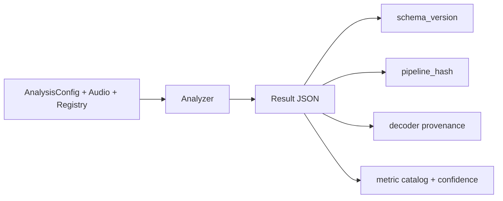

# esl Output Schema

This document defines the JSON output contract for `esl analyze`, including schema versioning and provenance fields.

- Canonical source: `src/esl/schema/spec.py`
- Published artifact: `docs/schema/analysis-output-0.2.0.json`
- CLI access: `esl schema` or `esl schema --out docs/schema/analysis-output-0.2.0.json`

## Versioning Rules

- `schema_version` is a semantic string (`major.minor.patch`).
- `major` changes break backward compatibility.
- `minor` adds optional fields or additive structures.
- `patch` clarifies constraints without changing meaning.
- Every output JSON includes `schema_version` and must validate against the matching schema document.



## Top-Level Contract

Required top-level fields:
- `schema_version`
- `esl_version`
- `analysis_time_utc`
- `config_hash`
- `pipeline_hash`
- `metadata`
- `metrics`

Additional provenance:
- `metric_catalog.version` and selected metrics
- `library_versions`

## Provenance Fields

`pipeline_hash` includes a deterministic hash of:
- resolved config snapshot
- metric list
- window/hop parameters
- runtime library versions

`metadata.decoder` includes:
- `decoder_used`: `soundfile`, `ffmpeg`, or `h5py` (SOFA)
- `ffmpeg_version`: string when FFmpeg decode is used
- `ffprobe`: stream summary (`codec_name`, `codec_type`, `channel_layout`, `sample_rate`, `channels`, `duration_s`)

`metadata.channel_metrics` includes:
- per-channel summaries (`ch1`, `ch2`, ...)
- aggregate summaries
- aggregation rule formulas

`metadata.validity_flags` includes:
- clipping and clipping ratio
- DC offset checks
- calibration usage
- IR detection and IR fit quality flags
- SNR confidence and low-confidence indicator

## Metrics Node Contract

For each metric ID:
- `units`
- `summary` (`mean`, `std`, `min`, `max`, `p50`, `p95`)
- optional `series`
- optional `timestamps_s`
- `confidence` in `[0,1]`
- optional `extra`
- `spec` (stable metric contract: category, window/hop, streamability, calibration dependency, confidence logic)

For metric definitions and formulas, see [`METRICS_REFERENCE.md`](METRICS_REFERENCE.md).

## Example Structure

```json
{
  "schema_version": "0.2.0",
  "esl_version": "0.2.0",
  "pipeline_hash": "sha256...",
  "metadata": {
    "decoder": {
      "decoder_used": "ffmpeg",
      "ffmpeg_version": "ffmpeg version ...",
      "ffprobe": {
        "codec_name": "mp3",
        "channel_layout": "stereo",
        "sample_rate": 44100,
        "duration_s": 31.24
      }
    },
    "config_snapshot": {},
    "resolved_metric_list": [],
    "metric_catalog_version": "esl-metrics-1.0.0",
    "channel_metrics": {},
    "validity_flags": {}
  },
  "metrics": {}
}
```

## Moments Extraction Artifacts

`esl moments extract` emits additional operational artifacts that are not part of the
`esl analyze` JSON schema contract:

- `moments_report.json` (extraction run metadata, selected windows, clip export summary)
- `moments.csv` (timestamped moment table)
- `clips/moment_XXXX.wav` (exported segments)

Notable `moments_report.json` fields:
- `selection_mode` (`all` | `single` | `top_k`)
- `top_k`
- `rank_metric` (default: `novelty_curve`)
- `event_window_s`, `window_before_s`, `window_after_s`
- `windows_candidates`, `windows_selected`, `clips_written`

Notable `moments.csv` fields:
- `rank_metric`, `rank_score`, `event_center_s`

See [`MOMENTS_EXTRACTION.md`](MOMENTS_EXTRACTION.md) for field-level definitions.

## Related Docs

- [`METRICS_REFERENCE.md`](METRICS_REFERENCE.md)
- [`ML_FEATURES.md`](ML_FEATURES.md)
- [`NOVELTY_ANOMALY.md`](NOVELTY_ANOMALY.md)
- [`MOMENTS_EXTRACTION.md`](MOMENTS_EXTRACTION.md)
- [`REFERENCES.md`](REFERENCES.md)
