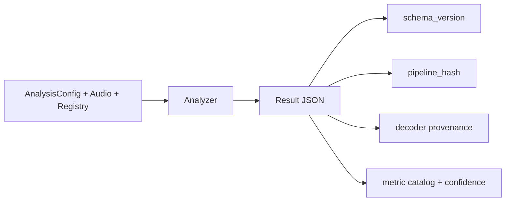

# esl Output Schema

Quick links: [Docs Index](INDEX.md) | [Getting Started](GETTING_STARTED.md) | [Task Recipes](TASK_RECIPES.md) | [Troubleshooting](TROUBLESHOOTING.md) | [Schema](SCHEMA.md) | [Metrics](METRICS_REFERENCE.md) | [References](REFERENCES.md)

This document defines the JSON output contract for `esl analyze`, including schema versioning and provenance fields.

- Canonical source: `src/esl/schema/spec.py`
- Published artifact: `docs/schema/analysis-output-0.2.0.json`
- CLI access: `esl schema` or `esl schema --out docs/schema/analysis-output-0.2.0.json`

## Versioning Rules

- `schema_version` is a semantic string (`major.minor.patch`).
- `major` changes break backward compatibility.
- `minor` adds optional fields or additive structures.
- `patch` clarifies constraints without changing meaning.
- Every output JSON includes `schema_version` and must validate against the matching schema document.


```mermaid
flowchart LR
    A["AnalysisConfig + Audio + Registry"] --> B["Analyzer"]
    B --> C["Result JSON"]
    C --> D["schema_version"]
    C --> E["pipeline_hash"]
    C --> F["decoder provenance"]
    C --> G["metric catalog + confidence"]
```

## Top-Level Contract

Required top-level fields:
- `schema_version`
- `esl_version`
- `analysis_time_utc`
- `config_hash`
- `pipeline_hash`
- `metadata`
- `metrics`

Additional provenance:
- `metric_catalog.version` and selected metrics
- `library_versions`
- optional `artifacts` for large-file sidecars such as `frame_table_csv` and checkpoint JSON
- optional `artifacts` for large-file sidecars such as `frame_table_csv`, `frame_table_parquet_dir`, `frame_table_hdf5`, and checkpoint JSON

## Provenance Fields

`pipeline_hash` includes a deterministic hash of:
- resolved config snapshot
- metric list
- window/hop parameters
- runtime library versions

$$
\text{pipeline\_hash} = H\left(\text{config\_snapshot} \,\|\, \text{metric\_list} \,\|\, \text{window/hop} \,\|\, \text{library\_versions}\right)
$$

where $H(\cdot)$ is deterministic digest function and $\|$ denotes canonical concatenation/serialization order.

Plain English: same config and same environment should produce the same pipeline hash; if it changes, something operational changed.

Snark note: “I think we used the same settings” is not a provenance strategy.

`metadata.decoder` includes:
- `decoder_used`: `soundfile`, `ffmpeg`, or `h5py` (SOFA)
- `ffmpeg_version`: string when FFmpeg decode is used
- `ffprobe`: stream summary (`codec_name`, `codec_type`, `channel_layout`, `sample_rate`, `channels`, `duration_s`)

`metadata` also includes source-format fields useful for large-file diagnostics:
- `format_name`: decoded container/format label (for example `WAV`, `RF64`, `FLAC`)
- `subtype`: sample encoding subtype when available (`PCM_24`, `FLOAT`, etc.)
- `backend`: primary decode backend (`soundfile`, `ffmpeg`, or `h5py`)
- `compute_device`: requested/resolved compute backend metadata (`cpu|cuda|mps`)
- `spatial_metadata`: structured layout metadata including channel labels and Ambisonics hints when detected
  - Ambisonics metadata now includes stronger convention hints such as:
    - `component_order`
    - `normalization`
    - `format_hint`
    - `convention_confidence`
    - `standards_profile`
    - `normalization_scale`
    - `channel_map`
    - `warnings`
- `analysis_strategy`: whether the run was out-of-core, whether frame series were omitted from JSON, the summary method, checkpoint directory, and frame-table sidecars

Ambisonics metadata contract:

```json
{
  "layout_family": "ambisonic",
  "layout_hint": "ambisonic_higher_order",
  "channel_labels": ["Y_0_0", "Y_1_-1", "Y_1_0"],
  "ambisonics": {
    "order": 2,
    "component_order": "ACN",
    "normalization": "N3D",
    "standards_profile": "ambix_acn_n3d",
    "normalization_scale": "orthonormal",
    "channels_expected": 9,
    "complete_set": true,
    "channel_map": [
      {"index": 0, "label": "Y_0_0", "degree_l": 0, "order_m": 0, "acn": 0}
    ],
    "warnings": []
  }
}
```

Where:
- `component_order` identifies the channel ordering convention, such as `ACN` or `FuMa`.
- `normalization` identifies spherical-harmonic normalization, such as `SN3D`, `N3D`, or `maxN`.
- `standards_profile` is the combined convention profile, for example `ambix_acn_sn3d`.
- `channel_map` gives per-channel spherical-harmonic indices when `ACN` is detected.
- `warnings` reports incomplete or ambiguous Ambisonics assumptions.

Plain English: `esl` does not silently pretend every four-channel file is the same creature. If the filename or decoder hints indicate Ambisonics, the JSON records what convention it inferred and how confident that inference is.

An explicit JSON/YAML sidecar can override the inferred spatial interpretation.
It is recorded as `metadata.spatial_metadata.provenance` with `source: sidecar`,
the absolute sidecar path, and the overridden fields. Decoder-observed channel
count remains immutable; the sidecar is an interpretation contract, not a way to
invent channels.

Shard manifests have a separate `calendar` node. Its `timeline_mode` is either
`archive_relative` or `absolute`. In absolute mode, manifest and shard-report
rows additionally expose `start_time_utc`/`end_time_utc` and optional local-time
display fields. Dataset manifests created by `esl shard dataset` retain those
same timeline fields alongside FrameTable artifact locations.

For RF64 container guidance and 4 GB WAV limits, see [`RF64_AND_LARGE_FILES.md`](RF64_AND_LARGE_FILES.md).

`metadata.channel_metrics` includes:
- per-channel summaries (`ch1`, `ch2`, ...)
- aggregate summaries
- aggregation rule formulas

`metadata.validity_flags` includes:
- clipping and clipping ratio
- DC offset checks
- calibration usage
- IR detection and IR fit quality flags
- SNR confidence and low-confidence indicator

For long runs, `metadata.analysis_strategy` is especially important:
- `out_of_core`
- `summary_statistics`
- `store_series_in_json`
- `max_series_points`
- `frame_table_csv`
- `frame_table_parquet_dir`
- `frame_table_hdf5`
- `checkpoint_dir`
- `resume`

`metadata.calibration` may include:
- `dbfs_reference`, `spl_reference_db`, `weighting`
- `mic_sensitivity_mv_pa`
- `preamp_gain_db`
- `adc_full_scale_vrms`
- `calibration_tone_file`

Precision pressure-chain conversion (`Pa <-> dBFS`) is available when
`mic_sensitivity_mv_pa`, `preamp_gain_db`, and `adc_full_scale_vrms` are all present.

## Metrics Node Contract

For each metric ID:
- `units`
- `summary` (`mean`, `std`, `min`, `max`, `p50`, `p95`)
- optional `series`
- optional `timestamps_s`
- `confidence` in `[0,1]`
- optional `extra`
- `spec` (stable metric contract: category, window/hop, streamability, calibration dependency, confidence logic)

For metric definitions and formulas, see [`METRICS_REFERENCE.md`](METRICS_REFERENCE.md).

## Example Structure

```json
{
  "schema_version": "0.2.0",
  "esl_version": "0.2.0",
  "pipeline_hash": "sha256...",
  "metadata": {
    "decoder": {
      "decoder_used": "ffmpeg",
      "ffmpeg_version": "ffmpeg version ...",
      "ffprobe": {
        "codec_name": "mp3",
        "channel_layout": "stereo",
        "sample_rate": 44100,
        "duration_s": 31.24
      }
    },
    "config_snapshot": {},
    "resolved_metric_list": [],
    "metric_catalog_version": "esl-metrics-1.0.0",
    "channel_metrics": {},
    "validity_flags": {}
  },
  "metrics": {}
}
```

## Moments Extraction Artifacts

`esl moments extract` emits additional operational artifacts that are not part of the
`esl analyze` JSON schema contract:

- `moments_report.json` (extraction run metadata, selected windows, clip export summary)
- `moments.csv` (timestamped moment table)
- `clips/moment_XXXX.wav` (exported segments)

Notable `moments_report.json` fields:
- `selection_mode` (`all` | `single` | `top_k`)
- `top_k`
- `rank_metric` (default: `novelty_curve`)
- `event_window_s`, `window_before_s`, `window_after_s`
- `windows_candidates`, `windows_selected`, `clips_written`

## Large-File Sidecars

When chunked `analyze` is used with large files, the main JSON may intentionally stay compact while sidecars hold long-form data.

Typical sidecars:
- `artifacts.frame_table_csv`
- `artifacts.frame_table_metadata_json`
- `artifacts.frame_table_parquet_dir`
- `artifacts.frame_table_parquet_metadata_json`
- `artifacts.frame_table_hdf5`
- `artifacts.checkpoint_state_json`

Where:
- `frame_table_csv` is the disk-backed frame-wise feature table
- `frame_table_metadata_json` records column order, frame/hop, and tensor conventions
- `frame_table_parquet_dir` is an appendable Parquet dataset directory (`part-*.parquet`)
- `frame_table_hdf5` is a resizable HDF5 FrameTable file
- `checkpoint_state_json` stores resumable out-of-core analysis state

Notable `moments.csv` fields:
- `rank_metric`, `rank_score`, `event_center_s`

See [`MOMENTS_EXTRACTION.md`](MOMENTS_EXTRACTION.md) for field-level definitions.

## Related Docs

- [`METRICS_REFERENCE.md`](METRICS_REFERENCE.md)
- [`ML_FEATURES.md`](ML_FEATURES.md)
- [`NOVELTY_ANOMALY.md`](NOVELTY_ANOMALY.md)
- [`MOMENTS_EXTRACTION.md`](MOMENTS_EXTRACTION.md)
- [`RF64_AND_LARGE_FILES.md`](RF64_AND_LARGE_FILES.md)
- [`REFERENCES.md`](REFERENCES.md)
