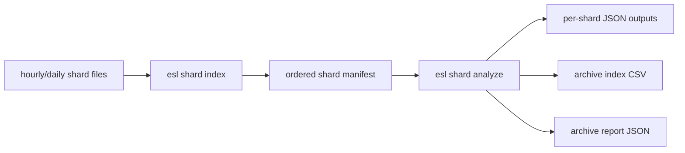
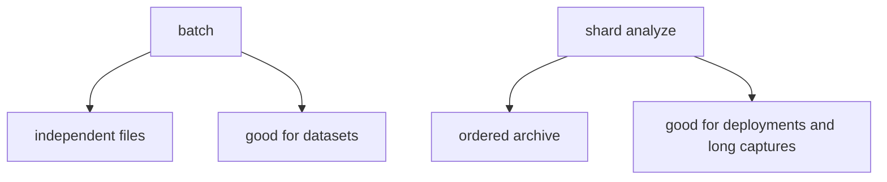

# Shard Workflows

Quick links: [Docs Index](INDEX.md) | [Getting Started](GETTING_STARTED.md) | [Task Recipes](TASK_RECIPES.md) | [Troubleshooting](TROUBLESHOOTING.md) | [Schema](SCHEMA.md) | [Metrics](METRICS_REFERENCE.md) | [References](REFERENCES.md)

This guide explains how to treat a long archive as an ordered manifest of shard files instead of one giant monolith.

Plain English: if your deployment already produces `hourly` or `daily` files, that is not a nuisance. That is the sane operating model.

## Why shards matter

For very large archives:
- storage is easier to manage
- corruption risk is localized
- reprocessing is resumable
- full-file assumptions are easier to avoid
- timeline semantics can still be preserved with a manifest



## Command 1: Build a shard manifest

```bash
esl shard index archive_dir --out out/archive_manifest.json
```

What this does:
- scans the directory for supported audio files
- orders them by path by default
- probes metadata for each shard
- assigns cumulative `start_s` and `end_s` offsets across the archive

If file names are already lexically ordered by time, default path ordering is correct.

If you want filesystem time ordering instead:

```bash
esl shard index archive_dir --out out/archive_manifest.json --order-by mtime
```

## Manifest structure

Each manifest item includes:
- `shard_index`
- `path`
- `relative_path`
- `start_s`
- `end_s`
- `duration_s`
- `sample_rate`
- `channels`
- `format_name`
- `size_bytes`

Where:
- `start_s` is archive-relative start time
- `end_s` is archive-relative end time

This is what lets a sharded archive behave like one logical timeline.

## Command 2: Analyze the manifest as one archive

```bash
esl shard analyze out/archive_manifest.json \
  --out out/shard_analysis \
  --chunk-hours 1 \
  --streamable-only \
  --summary-only \
  --frame-table-dir out/frame_tables \
  --frame-table-parquet-dir out/frame_tables_parquet \
  --frame-table-hdf5-dir out/frame_tables_hdf5 \
  --checkpoint-dir out/checkpoints \
  --resume
```

What this does:
- analyzes each shard in manifest order
- preserves per-shard outputs
- writes an archive-level CSV index
- writes an archive-level report with weighted metric means
- supports per-shard resumable checkpoints
- can emit appendable per-shard FrameTable CSV, Parquet-dataset, and HDF5 artifacts

Artifacts:
- `out/shard_analysis/shards/.../*.json`
- `out/shard_analysis/shard_analysis_index.csv`
- `out/shard_analysis/shard_analysis_report.json`

## Why this is different from `batch`

`batch` treats files as a folder of unrelated inputs.

`shard analyze` treats files as:
- one ordered archive
- one cumulative timeline
- one archive report



## Ten-year archive pattern

Suppose you have:
- `archive/2017/01/*.rf64`
- `archive/2017/02/*.rf64`
- ...

Then the recommended workflow is:

```bash
esl shard index archive --out out/ten_year_manifest.json

esl shard analyze out/ten_year_manifest.json \
  --out out/ten_year_analysis \
  --chunk-hours 1 \
  --streamable-only \
  --summary-only \
  --frame-table-dir out/ten_year_frame_tables \
  --frame-table-parquet-dir out/ten_year_frame_tables_parquet \
  --frame-table-hdf5-dir out/ten_year_frame_tables_hdf5 \
  --checkpoint-dir out/ten_year_checkpoints \
  --resume
```

Where:
- the manifest is the canonical archive map
- per-shard JSON files preserve local provenance
- the archive index/report provide the cross-shard view

## Archive-level summary semantics

`shard_analysis_report.json` includes weighted metric means:

$$
\mu_{\text{archive}} = \frac{\sum_i \mu_i T_i}{\sum_i T_i}
$$

where:
- \(\mu_i\) is a shard-level metric mean
- \(T_i\) is shard duration

Plain English: longer shards contribute proportionally more to the archive-level average.

## Recommended settings

For long deployments:
- use `--streamable-only`
- use `--summary-only`
- use `--frame-table-dir` if you want downstream frame-wise ML/statistics
- add `--frame-table-parquet-dir` when you want appendable Parquet datasets
- add `--frame-table-hdf5-dir` when you want a resizable HDF5 FrameTable per shard
- use `--checkpoint-dir --resume`
- avoid `--allow-full-read` unless you intentionally want per-shard full-context metrics

## Archive-Level Moments

Use `shard moments` when you want one ranked event list across the whole manifest timeline:

```bash
esl shard moments out/ten_year_manifest.json \
  --out out/ten_year_moments \
  --top-k 33 \
  --rank-metric novelty_curve \
  --rank-scope downmix \
  --window-before 30 \
  --window-after 90
```

This writes:
- `out/ten_year_moments/moments.csv`
- `out/ten_year_moments/archive_moments_report.json`
- `out/ten_year_moments/clips/moment_*.wav`

If you want ranking driven by the strongest source channel instead of the downmix:

```bash
esl shard moments out/ten_year_manifest.json \
  --out out/ten_year_moments_per_channel \
  --top-k 33 \
  --rank-metric novelty_curve \
  --rank-scope per_channel_max \
  --window-before 30 \
  --window-after 90
```

## Related docs

- [RF64 and Large Files](RF64_AND_LARGE_FILES.md)
- [Task Recipes](TASK_RECIPES.md)
- [Schema](SCHEMA.md)
- [ML Features](ML_FEATURES.md)
