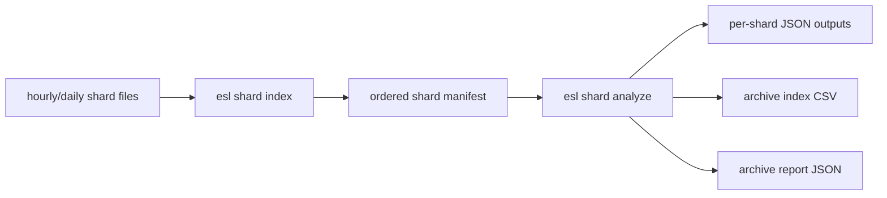
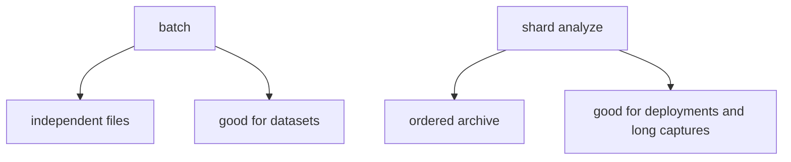
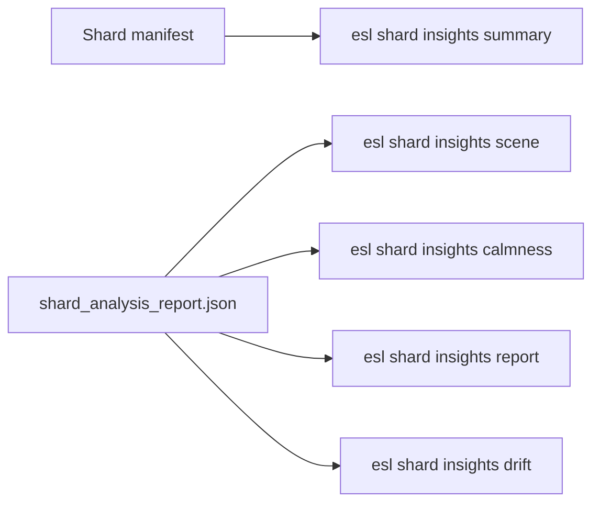
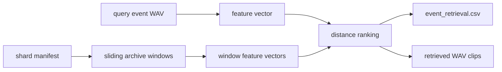

# Shard Workflows

Quick links: [Docs Index](INDEX.md) | [Getting Started](GETTING_STARTED.md) | [Task Recipes](TASK_RECIPES.md) | [Troubleshooting](TROUBLESHOOTING.md) | [Schema](SCHEMA.md) | [Metrics](METRICS_REFERENCE.md) | [References](REFERENCES.md)

This guide explains how to treat a long archive as an ordered manifest of shard files instead of one giant monolith.

Plain English: if your deployment already produces `hourly` or `daily` files, that is not a nuisance. That is the sane operating model.

## What is a shard?

A shard is one smaller file that belongs to a larger archive.

Example:

- one hour per file
- one day per file
- one recorder uptime segment per file

So:

- shard = one piece
- manifest = the ordered list of pieces
- archive = the whole timeline

Where:

- \(s_i\) is shard \(i\)
- \(t_i^{start}\) is that shard's archive-relative start time
- \(t_i^{end}\) is that shard's archive-relative end time

Plain English: the manifest is what lets a folder of small files behave like one long recording without forcing you to store or process one absurdly large file.

## Why shards matter

For very large archives:
- storage is easier to manage
- corruption risk is localized
- reprocessing is resumable
- full-file assumptions are easier to avoid
- timeline semantics can still be preserved with a manifest



## Command 1: Build a shard manifest

```bash
esl shard index archive_dir --out out/archive_manifest.json
```

What this does:
- scans the directory for supported audio files
- orders them by path by default
- probes metadata for each shard
- assigns cumulative `start_s` and `end_s` offsets across the archive

If file names are already lexically ordered by time, default path ordering is correct.

If you want filesystem time ordering instead:

```bash
esl shard index archive_dir --out out/archive_manifest.json --order-by mtime
```

## Manifest structure

Each manifest item includes:
- `shard_index`
- `path`
- `relative_path`
- `start_s`
- `end_s`
- `duration_s`
- `sample_rate`
- `channels`
- `format_name`
- `size_bytes`

Where:
- `start_s` is archive-relative start time
- `end_s` is archive-relative end time

This is what lets a sharded archive behave like one logical timeline.

## Command 2: Analyze the manifest as one archive

```bash
esl shard analyze out/archive_manifest.json \
  --out out/shard_analysis \
  --chunk-hours 1 \
  --streamable-only \
  --summary-only \
  --frame-table-dir out/frame_tables \
  --frame-table-parquet-dir out/frame_tables_parquet \
  --frame-table-hdf5-dir out/frame_tables_hdf5 \
  --checkpoint-dir out/checkpoints \
  --resume
```

What this does:
- analyzes each shard in manifest order
- preserves per-shard outputs
- writes an archive-level CSV index
- writes an archive-level report with weighted metric means
- supports per-shard resumable checkpoints
- can emit appendable per-shard FrameTable CSV, Parquet-dataset, and HDF5 artifacts

Artifacts:
- `out/shard_analysis/shards/.../*.json`
- `out/shard_analysis/shard_analysis_index.csv`
- `out/shard_analysis/shard_analysis_report.json`

## Why this is different from `batch`

`batch` treats files as a folder of unrelated inputs.

`shard analyze` treats files as:
- one ordered archive
- one cumulative timeline
- one archive report



## Ten-year archive pattern

Suppose you have:
- `archive/2017/01/*.rf64`
- `archive/2017/02/*.rf64`
- ...

Then the recommended workflow is:

```bash
esl shard index archive --out out/ten_year_manifest.json

esl shard analyze out/ten_year_manifest.json \
  --out out/ten_year_analysis \
  --chunk-hours 1 \
  --streamable-only \
  --summary-only \
  --frame-table-dir out/ten_year_frame_tables \
  --frame-table-parquet-dir out/ten_year_frame_tables_parquet \
  --frame-table-hdf5-dir out/ten_year_frame_tables_hdf5 \
  --checkpoint-dir out/ten_year_checkpoints \
  --resume
```

Where:
- the manifest is the canonical archive map
- per-shard JSON files preserve local provenance
- the archive index/report provide the cross-shard view

## Archive-level summary semantics

`shard_analysis_report.json` includes weighted metric means:

$$
\mu_{\text{archive}} = \frac{\sum_i \mu_i T_i}{\sum_i T_i}
$$

where:
- \(\mu_i\) is a shard-level metric mean
- \(T_i\) is shard duration

Plain English: longer shards contribute proportionally more to the archive-level average.

## Recommended settings

For long deployments:
- use `--streamable-only`
- use `--summary-only`
- use `--frame-table-dir` if you want downstream frame-wise ML/statistics
- add `--frame-table-parquet-dir` when you want appendable Parquet datasets
- add `--frame-table-hdf5-dir` when you want a resizable HDF5 FrameTable per shard
- use `--checkpoint-dir --resume`
- avoid `--allow-full-read` unless you intentionally want per-shard full-context metrics

## Archive-Level Moments

Use `shard moments` when you want one ranked event list across the whole manifest timeline:

```bash
esl shard moments out/ten_year_manifest.json \
  --out out/ten_year_moments \
  --top-k 33 \
  --rank-metric novelty_curve \
  --rank-scope downmix \
  --window-before 30 \
  --window-after 90
```

This writes:
- `out/ten_year_moments/moments.csv`
- `out/ten_year_moments/archive_moments_report.json`
- `out/ten_year_moments/clips/moment_*.wav`

If you want ranking driven by the strongest source channel instead of the downmix:

```bash
esl shard moments out/ten_year_manifest.json \
  --out out/ten_year_moments_per_channel \
  --top-k 33 \
  --rank-metric novelty_curve \
  --rank-scope per_channel_max \
  --window-before 30 \
  --window-after 90
```

## Archive-Level Similarity Search

Use `shard similar` when you want to ask:

- which shard sounds most like this query clip?
- which day/hour in my archive matches a known reference sound?
- which deployment period is closest to a target acoustic state?

Quick start:

```bash
esl shard similar out/ten_year_manifest.json query.wav \
  --out out/shard_similarity \
  --top-k 5 \
  --json out/shard_similarity/query_shard_similarity.json \
  --csv out/shard_similarity/query_shard_similarity.csv
```

This writes:

- `out/shard_similarity/query_shard_similarity.json`
- `out/shard_similarity/query_shard_similarity.csv`

What gets ranked:

- each manifest item is treated as one candidate shard
- the query file is compared against each shard
- results preserve archive timeline metadata:
  - `shard_index`
  - `relative_path`
  - `archive_start_s`
  - `archive_end_s`

Plain English: this tells you which shard is most like your query, and also where that shard sits in the full archive timeline.

## Archive-Level Insights

Use `shard insights` when you want summaries from a manifest or `shard_analysis_report.json` without decoding the archive audio again.

Quick manifest summary:

```bash
esl shard insights summary out/ten_year_manifest.json \
  --out out/shard_insights/summary
```

Outputs:
- `out/shard_insights/summary/shard_insights_summary.json`
- `out/shard_insights/summary/shard_timeline.csv`

Shard-to-shard scene changes from existing analysis:

```bash
esl shard insights scene out/ten_year_analysis/shard_analysis_report.json \
  --out out/shard_insights/scene \
  --metrics rms_dbfs,novelty_curve,ndsi \
  --threshold-z 1.5
```

Archive calmness / chaos / diversity from shard metric means:

```bash
esl shard insights calmness out/ten_year_analysis/shard_analysis_report.json \
  --out out/shard_insights/calmness.json
```

HTML report:

```bash
esl shard insights report out/ten_year_analysis/shard_analysis_report.json \
  --out out/shard_insights/report
```

Drift between two deployments or time periods:

```bash
esl shard insights drift baseline/shard_analysis_report.json \
  candidate/shard_analysis_report.json \
  --out out/shard_insights/drift.json
```



Math for shard scene changes:

$$
n_i = \lVert z(\mathbf{m}_i) - z(\mathbf{m}_{i-1}) \rVert_2
$$

where:
- \(n_i\) is the change score at shard boundary \(i\)
- \(\mathbf{m}_i\) is the selected vector of shard-level metric means
- \(z(\cdot)\) means feature-wise z-scoring across shards

Plain English: `esl` compares each shard's summary metrics to the previous shard. Large jumps become candidate archive scene changes.

### Feature mode

```bash
esl shard similar out/ten_year_manifest.json query.wav \
  --out out/shard_similarity \
  --mode feature \
  --feature-set all \
  --distance cosine \
  --top-k 10
```

### Single-metric mode

```bash
esl shard similar out/ten_year_manifest.json query.wav \
  --out out/shard_similarity_metric \
  --mode metric \
  --metric rms_dbfs \
  --top-k 10
```

### Multi-metric mode

```bash
esl shard similar out/ten_year_manifest.json query.wav \
  --out out/shard_similarity_metrics \
  --mode metrics \
  --metrics rms_dbfs,snr_db,spl_a_db,ndsi \
  --distance euclidean \
  --normalize \
  --top-k 10
```

Useful options:

- `--max-shards N`
- `--include-query`
- `--frame-size`, `--hop-size`
- `--frame-seconds`, `--hop-seconds`
- `--sample-rate`
- `--calibration` for metric modes
- `--spatial-mode off|append|only`
- `--spatial-metrics ...`
- `--spatial-weight 0.5`

Where:

- \(x_q\) is the query vector
- \(x_i\) is shard \(i\)'s vector
- \(d(x_q, x_i)\) is the chosen distance

Plain English: smaller distance means “more like the query.”

If you enable spatial retrieval:

```bash
esl shard similar out/ten_year_manifest.json query.wav \
  --out out/shard_similarity_spatial \
  --top-k 10 \
  --mode feature \
  --spatial-mode append \
  --spatial-metrics interchannel_coherence,iacc,ild_db,itd_s,doa_azimuth_proxy_deg \
  --spatial-weight 0.7
```

Where:

- \(d_f\) is the base feature distance
- \(d_s\) is the spatial-metric distance
- \(w\) is `--spatial-weight`

\[
d = (1-w)d_f + wd_s
\]

Plain English: with `append`, `esl` blends ordinary timbral similarity with spatial-scene similarity.

## Archive-Level Event Retrieval

Use `shard retrieve` when the question is more precise than `shard similar`:

- not “which shard sounds like this?”
- but “where inside this archive does this event happen?”

Quick start:

```bash
esl shard retrieve out/ten_year_manifest.json query_event.wav \
  --out out/shard_retrieval \
  --top-k 10 \
  --window-seconds 8 \
  --window-hop-seconds 2 \
  --json out/shard_retrieval/event_retrieval.json \
  --csv out/shard_retrieval/event_retrieval.csv
```

This writes:

- `out/shard_retrieval/event_retrieval.json`
- `out/shard_retrieval/event_retrieval.csv`
- `out/shard_retrieval/retrieved_clips/retrieved_*.wav`

Plain English: `shard retrieve` slides a fixed-duration window through every manifest shard, compares each window to the query clip, and exports the best matching windows as timestamped rows and optional WAV clips.

Where:

- \(x_q\) is the aggregate feature vector for the query clip
- \(x_{i,j}\) is the aggregate feature vector for window \(j\) in shard \(i\)
- \(d(x_q, x_{i,j})\) is the chosen distance
- lower \(d\) means a stronger match

\[
\operatorname{rank}(i,j) = \operatorname{argsort}_{i,j}\ d(x_q, x_{i,j})
\]

Useful options:

- `--top-k N` selects how many moments to report
- `--window-seconds S` controls clip duration and candidate-window length
- `--window-hop-seconds S` controls how densely the archive is searched
- `--feature-set core|auto|librosa|all` controls feature richness
- `--distance cosine|euclidean|manhattan` controls similarity math
- `--no-clips` writes only JSON/CSV
- `--max-shards N` limits the search for smoke tests

Good defaults:

```bash
esl shard retrieve manifest.json query.wav \
  --out out/retrieve \
  --top-k 33 \
  --window-seconds 10 \
  --window-hop-seconds 5 \
  --feature-set core
```

Why `core` by default? It is deterministic, light, and friendly to giant archives. Use `--feature-set all` when you want richer librosa-backed descriptors and have the compute budget for it.



## Archive Plots

After `esl shard analyze`, you can render archive-scale overview PNGs:

```bash
esl shard plot out/shard_analysis/shard_analysis_report.json \
  --out out/archive_plots
```

This writes plots such as:

- `archive_duration_timeline.png`
- `archive_metric_rms_dbfs.png`
- `archive_metric_ndsi.png`

Plain English: this gives you a bird's-eye view of how the archive changes over time.

## Related docs

- [RF64 and Large Files](RF64_AND_LARGE_FILES.md)
- [Task Recipes](TASK_RECIPES.md)
- [Schema](SCHEMA.md)
- [ML Features](ML_FEATURES.md)
- [Similarity Search](SIMILARITY_SEARCH.md)
