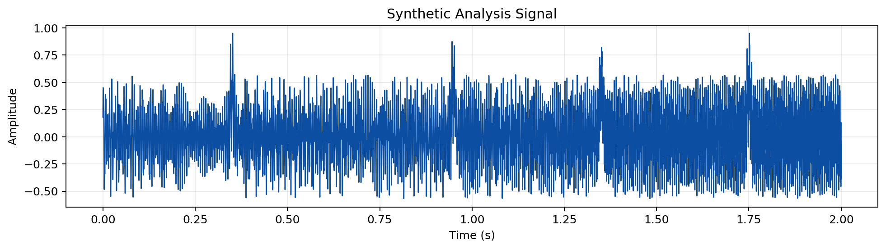
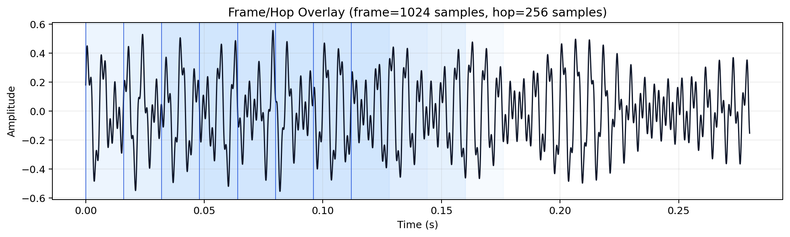
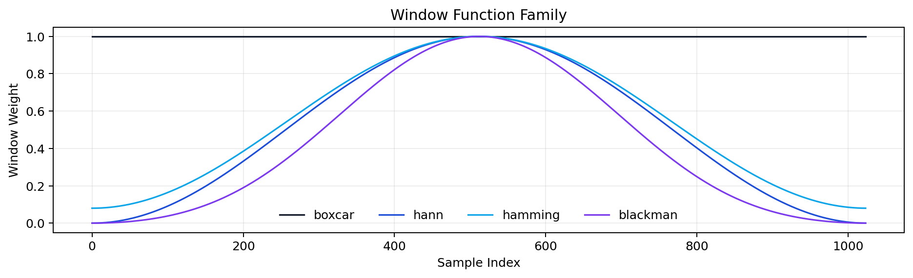
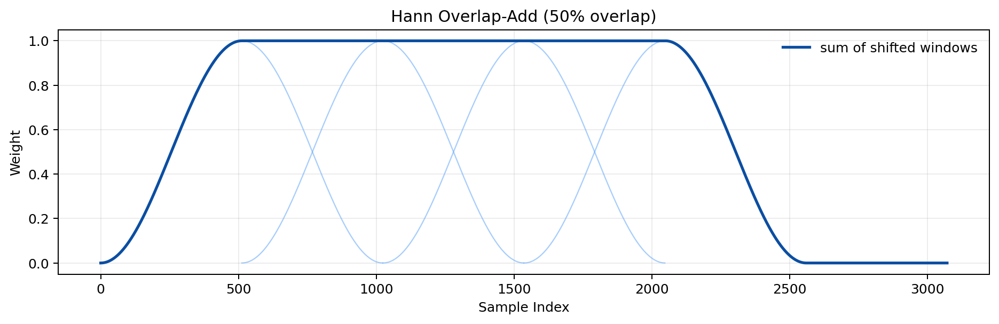
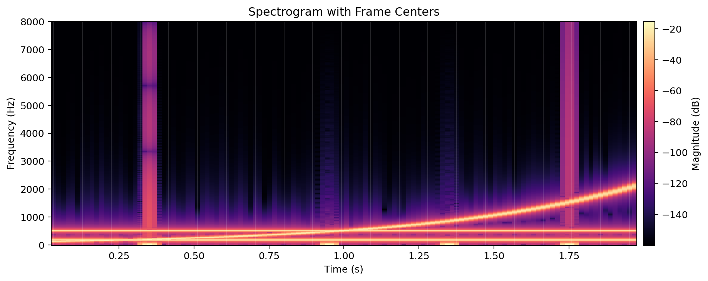
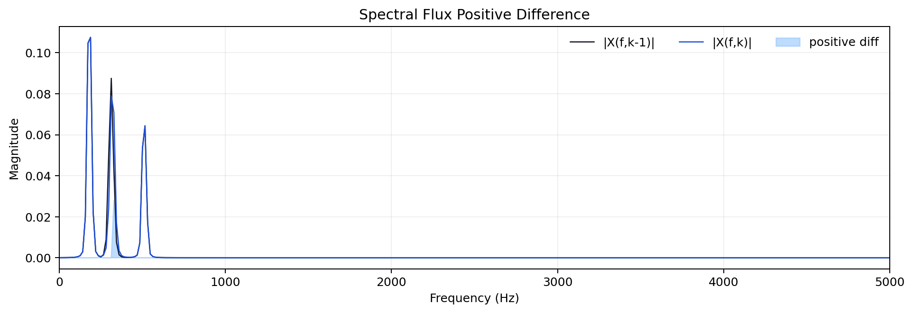
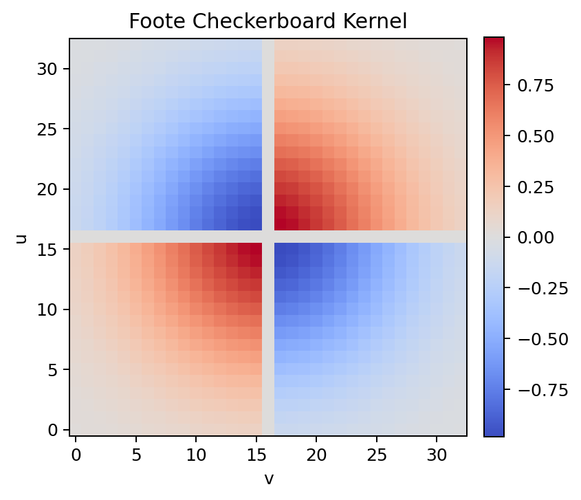
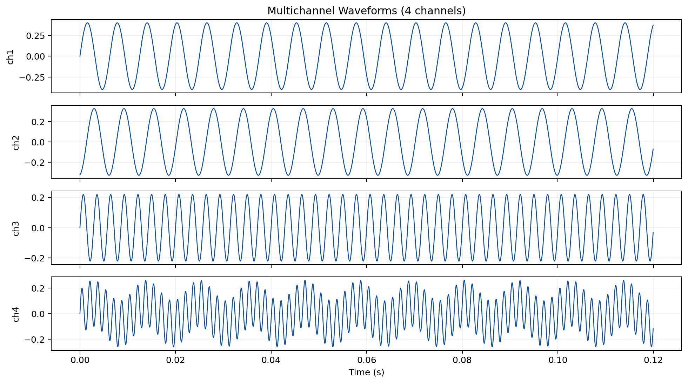
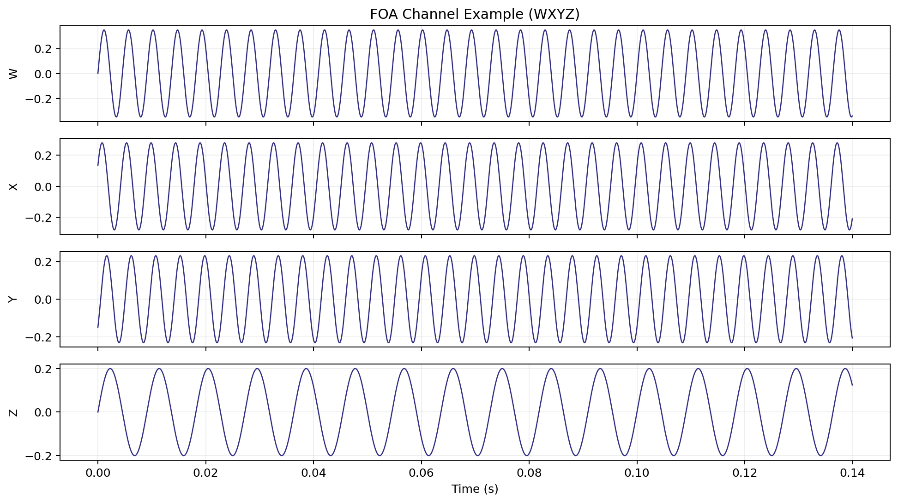
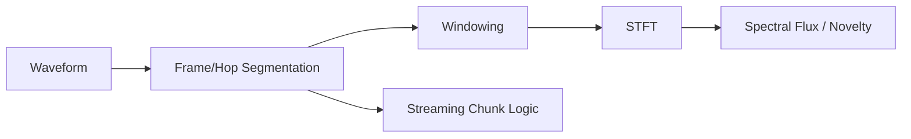

# Signal and Window Visual Guide

This guide provides generated graphs for core DSP concepts used across `esl`.

Generation script:
- [`../scripts/generate_signal_window_graphs.py`](../scripts/generate_signal_window_graphs.py)

Regenerate all images:

```bash
python scripts/generate_signal_window_graphs.py --out docs/examples/signal_window_guide
```

## Why these plots matter

- They show how frame-based processing sees your signal.
- They visualize windowing and overlap-add behavior.
- They connect waveform, STFT, novelty, and streaming chunk logic in one place.

## Core equations

$$
n_k = kH
$$

where \(n_k\) is start index of frame \(k\), and \(H\) is hop size.

Plain English: each new frame starts \(H\) samples after the previous one.

$$
x_k[n] = x[n_k+n]\cdot w[n], \quad 0\le n < N
$$

where \(x_k[n]\) is windowed frame sample, \(x[\cdot]\) is original signal, \(w[n]\) is window, and \(N\) is frame size.

Plain English: each frame is a chunk of signal multiplied by a taper window.

$$
\hat{x}[n] = \sum_k x_k[n-kH]
$$

where \(\hat{x}[n]\) is overlap-added reconstruction from shifted frames.

Plain English: shifted windowed frames are added together to reconstruct the signal path.

$$
\mathcal{F}(k) = \sum_f \max\left(|X(f,k)| - |X(f,k-1)|, 0\right)
$$

where \(\mathcal{F}(k)\) is positive spectral flux at frame \(k\).

Plain English: novelty rises when new spectral energy appears.

## Visual pack

### 1) Signal waveform



### 2) Frame/hop overlay on waveform



### 3) Window family



### 4) Hann overlap-add behavior (50% overlap)



### 5) Spectrogram with frame centers



### 6) Spectral flux positive difference



### 7) Foote checkerboard kernel



### 8) Multichannel waveforms



### 9) FOA channel example (WXYZ)



### 10) Chunk-vs-frame timeline


## Processing relationship



## Related Docs

- [`METRICS_REFERENCE.md`](METRICS_REFERENCE.md)
- [`NOVELTY_ANOMALY.md`](NOVELTY_ANOMALY.md)
- [`MOMENTS_EXTRACTION.md`](MOMENTS_EXTRACTION.md)
- [`GETTING_STARTED.md`](GETTING_STARTED.md)
