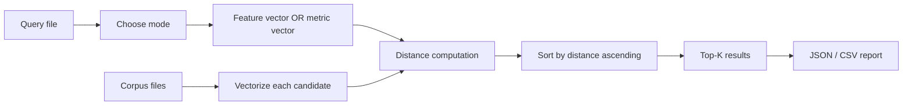

# Similarity Search

`esl similar` finds the most similar files in a folder given one input query file.

## Quick Start (Default)

```bash
esl similar query.wav corpus_dir --top-k 5 --json out/similarity.json --csv out/similarity.csv
```

Default behavior:
- `--mode auto` (uses feature-based similarity)
- `--distance cosine`
- `--feature-set auto`

## Modes

- `--mode feature`:
  - compares clip-level vectors derived from frame features.
- `--mode metric`:
  - compares one metric by absolute difference.
  - choose metric with `--metric <metric_id>`.
- `--mode metrics`:
  - compares multiple metrics as a vector distance.
  - choose metric list with `--metrics a,b,c`.

## Choose “similar in terms of what”

### 1) Feature similarity (default)

```bash
esl similar query.wav corpus_dir \
  --mode feature \
  --feature-set all \
  --distance cosine \
  --top-k 10
```

### 2) Single metric similarity

```bash
esl similar query.wav corpus_dir \
  --mode metric \
  --metric rms_dbfs \
  --top-k 10
```

### 3) Multi-metric similarity

```bash
esl similar query.wav corpus_dir \
  --mode metrics \
  --metrics rms_dbfs,snr_db,spl_a_db,novelty_curve \
  --distance euclidean \
  --normalize \
  --top-k 10
```

## Distance functions

- `--distance cosine`
- `--distance euclidean`
- `--distance manhattan`

For vectors \(x\) and \(y\):

$$
d_{\text{cos}} = 1 - \frac{x \cdot y}{\|x\|_2 \|y\|_2}
$$

$$
d_{\text{euc}} = \|x-y\|_2
$$

$$
d_{\text{man}} = \|x-y\|_1
$$

where:
- \(d\) is distance (smaller is more similar)
- \(x, y\) are either feature-derived vectors or metric-mean vectors

For `--mode metric`, distance is absolute metric difference:

$$
d = |m_{\text{candidate}} - m_{\text{query}}|
$$

where \(m\) is the selected metric mean.

## Useful options

- `--top-k N`: number of matches returned
- `--include-self`: allow query file to appear in result set if it is in corpus
- `--no-recursive`: scan only the top level of `corpus_dir`
- `--max-files N`: cap candidate scan size
- `--sample-rate N`: normalize analysis SR across files
- `--frame-size`, `--hop-size`: feature framing controls
- `--calibration profile.yaml`: apply calibration in metric-based modes
- `--verbosity 0..3`, `--debug 0..2`

## Output

- JSON report (`--json`, default `<out-dir>/<query_stem>_similarity.json`)
- Optional CSV ranking (`--csv`)

JSON fields include:
- `mode_requested`, `mode_used`
- `candidates_scanned`
- `results` (rank, path, distance, similarity, details)
- `skipped` entries with reasons

## Workflow



## Related Docs

- [`TASK_RECIPES.md`](TASK_RECIPES.md)
- [`ML_FEATURES.md`](ML_FEATURES.md)
- [`METRICS_REFERENCE.md`](METRICS_REFERENCE.md)
- [`SCHEMA.md`](SCHEMA.md)
