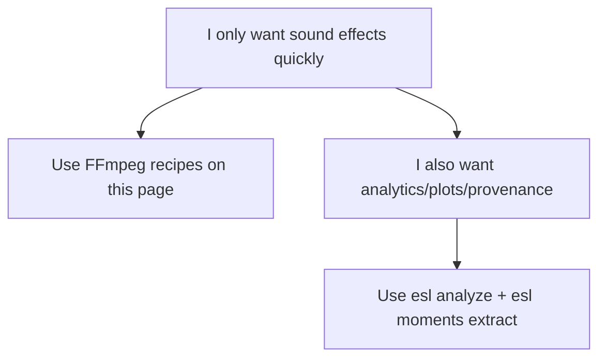

# Task Recipes (Beginner)

If you have an audio file and want it to sound different, start here.

Use `input.wav` as your source and copy/paste exactly.

## Recipe 1: Make it 2x slower (pitch preserved)

```bash
ffmpeg -i input.wav -filter:a "atempo=0.5" output_2x.wav
```

What this does:
- slows playback to 50% speed
- keeps pitch close to original

Expected output:
- `output_2x.wav`

## Recipe 2: Make it faster (pitch preserved)

```bash
ffmpeg -i input.wav -filter:a "atempo=1.5" output_fast.wav
```

What this does:
- speeds up playback by 1.5x
- keeps pitch close to original

Expected output:
- `output_fast.wav`

## Recipe 3: Raise pitch (simple semitone shift)

```bash
ffmpeg -i input.wav -filter:a "asetrate=44100*1.122462,aresample=44100" output_pitch_up_2st.wav
```

What this does:
- raises pitch by about 2 semitones
- also changes duration slightly (simple method)

Expected output:
- `output_pitch_up_2st.wav`

## Recipe 4: Lower pitch (simple semitone shift)

```bash
ffmpeg -i input.wav -filter:a "asetrate=44100/1.122462,aresample=44100" output_pitch_down_2st.wav
```

What this does:
- lowers pitch by about 2 semitones
- also changes duration slightly (simple method)

Expected output:
- `output_pitch_down_2st.wav`

## Recipe 5: Find the single most interesting moment (with `esl`)

```bash
esl moments extract input.wav \
  --out out/moments \
  --single \
  --rank-metric novelty_curve \
  --event-window 8
```

What this does:
- scans the file for novelty
- extracts one top-ranked moment as a clip

Expected outputs:
- `out/moments/moments.csv`
- `out/moments/moments_report.json`
- `out/moments/clips/moment_0001.wav`

## Recipe 6: See what changed (plots)

```bash
esl analyze input.wav --out-dir out --json out/input.json --plot
```

What this does:
- computes metrics
- writes plots so you can inspect spectral/level changes

Expected outputs:
- `out/input.json`
- `out/input_plots/`

## Recipe 7: Generate DSP signal/window reference graphs

```bash
bash scripts/easy/05_generate_signal_graphs.sh docs/examples/signal_window_guide
```

What this does:
- creates waveform, frame/hop, window family, overlap-add, spectrogram, novelty-kernel, and multichannel/FOA figures

Expected output folder:
- `docs/examples/signal_window_guide/`

See full walkthrough:
- [`SIGNAL_WINDOWS_VISUAL_GUIDE.md`](SIGNAL_WINDOWS_VISUAL_GUIDE.md)

## Which tool should I use?



## Related Docs

- [`GETTING_STARTED.md`](GETTING_STARTED.md)
- [`TROUBLESHOOTING.md`](TROUBLESHOOTING.md)
- [`GLOSSARY.md`](GLOSSARY.md)
- [`MOMENTS_EXTRACTION.md`](MOMENTS_EXTRACTION.md)
