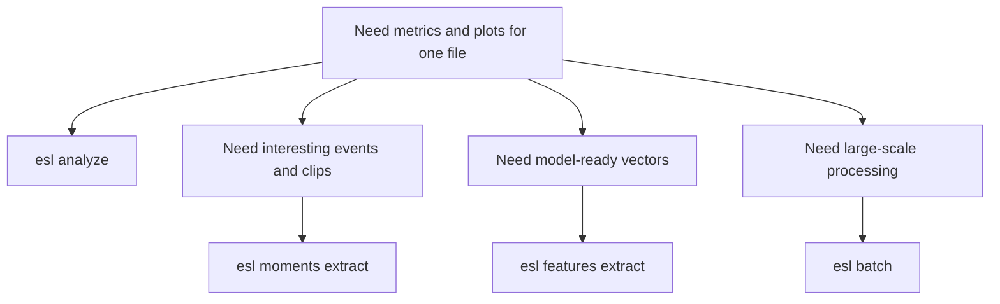

# Task Recipes (Beginner)

Quick links: [Docs Index](INDEX.md) | [Getting Started](GETTING_STARTED.md) | [Task Recipes](TASK_RECIPES.md) | [Troubleshooting](TROUBLESHOOTING.md) | [Schema](SCHEMA.md) | [Metrics](METRICS_REFERENCE.md) | [References](REFERENCES.md)

If you have an audio file and want to understand it, start here.

Use `input.wav` as your source and copy/paste exactly.

Need one-command helpers instead of typing long flags?
- [`../scripts/easy/README.md`](../scripts/easy/README.md)

## Recipe Index (By Goal)

- [Recipe 1: Analyze one file and generate plots](#recipe-1-analyze-one-file-and-generate-plots)
- [Recipe 2: Extract the single most novel moment](#recipe-2-extract-the-single-most-novel-moment)
- [Recipe 3: Extract top-k moments instead of one](#recipe-3-extract-top-k-moments-instead-of-one)
- [Recipe 4: Export ML-ready features](#recipe-4-export-ml-ready-features)
- [Recipe 5: Batch analyze a folder](#recipe-5-batch-analyze-a-folder)
- [Recipe 6: Compare architectural variants](#recipe-6-compare-architectural-variants)
- [Recipe 7: Generate DSP signal/window reference graphs](#recipe-7-generate-dsp-signalwindow-reference-graphs)
- [Recipe 8: Find the most similar files in a folder](#recipe-8-find-the-most-similar-files-in-a-folder)
- [Recipe 8B: Find the most similar shard in a long archive](#recipe-8b-find-the-most-similar-shard-in-a-long-archive)
- [Recipe 9: Use minute/hour/day window flags](#recipe-9-use-minutehourday-window-flags)
- [Recipe 10: Check your setup and file before analysis](#recipe-10-check-your-setup-and-file-before-analysis)
- [Recipe 11: Print a quick human-readable summary](#recipe-11-print-a-quick-human-readable-summary)
- [Recipe 12: Safely scan a huge multi-day or multi-year file](#recipe-12-safely-scan-a-huge-multi-day-or-multi-year-file)
- [Recipe 13: Build and analyze a shard manifest](#recipe-13-build-and-analyze-a-shard-manifest)
- [Recipe 13B: Plot archive-scale shard timelines](#recipe-13b-plot-archive-scale-shard-timelines)
- [Recipe 14: Find the top 33 most novel moments in a ten-year, 8-channel file](#recipe-14-find-the-top-33-most-novel-moments-in-a-ten-year-8-channel-file)
- [Recipe 15: Verify calibration math with a built-in reference fixture](#recipe-15-verify-calibration-math-with-a-built-in-reference-fixture)

## Recipe Index by Device Type

- Phone/laptop built-in mic (single/dual channel):
  - [Recipe 1](#recipe-1-analyze-one-file-and-generate-plots), [Recipe 2](#recipe-2-extract-the-single-most-novel-moment), [Recipe 4](#recipe-4-export-ml-ready-features)
- USB stereo interface / handheld stereo recorder:
  - [Recipe 1](#recipe-1-analyze-one-file-and-generate-plots), [Recipe 5](#recipe-5-batch-analyze-a-folder), [Recipe 8](#recipe-8-find-the-most-similar-files-in-a-folder)
- Ambisonic B-format recorder (FOA, multichannel WAV/RF64):
  - [Recipe 1](#recipe-1-analyze-one-file-and-generate-plots), [Recipe 3](#recipe-3-extract-top-k-moments-instead-of-one), [Recipe 5](#recipe-5-batch-analyze-a-folder), [RF64 guide](RF64_AND_LARGE_FILES.md)
- Multichannel array / Atmos-capable workflow:
  - [Recipe 5](#recipe-5-batch-analyze-a-folder), [Recipe 6](#recipe-6-compare-architectural-variants), [Schema contract](SCHEMA.md)
- Remote sensor node / long-duration monitor:
  - [Recipe 2](#recipe-2-extract-the-single-most-novel-moment), [Recipe 3](#recipe-3-extract-top-k-moments-instead-of-one), [Recipe 14](#recipe-14-find-the-top-33-most-novel-moments-in-a-ten-year-8-channel-file), [Moments workflow](MOMENTS_EXTRACTION.md), [RF64 guide](RF64_AND_LARGE_FILES.md)

## Recipe Index by Input Format

- Uncompressed (`WAV`, `RF64`, `FLAC`, `AIFF`, `CAF`):
  - [Recipe 1](#recipe-1-analyze-one-file-and-generate-plots), [Recipe 5](#recipe-5-batch-analyze-a-folder), [RF64 guide](RF64_AND_LARGE_FILES.md)
- Compressed (`MP3`, `AAC`, `OGG`, `Opus`, `M4A`, `WMA`, `ALAC`):
  - [Recipe 1](#recipe-1-analyze-one-file-and-generate-plots), [Recipe 8](#recipe-8-find-the-most-similar-files-in-a-folder), [Troubleshooting decode issues](TROUBLESHOOTING.md#ffmpeg-decode-errors-for-mp3aacogg)

## Recipe 1: Analyze one file and generate plots

```bash
esl analyze input.wav --out-dir out --json out/input.json --plot
```

What this does:
- computes core and extended acoustic metrics
- writes schema-stable JSON plus plots

Expected outputs:
- `out/input.json`
- `out/input_plots/`

## Recipe 2: Extract the single most novel moment

```bash
esl moments extract input.wav \
  --out out/moments \
  --single \
  --rank-metric novelty_curve \
  --event-window 8
```

What this does:
- scans for novelty peaks
- exports one top-ranked event plus timestamp table

Expected outputs:
- `out/moments/moments.csv`
- `out/moments/moments_report.json`
- `out/moments/clips/moment_0001.wav`

Choose clip window behavior:

- Symmetric window around event center:
  - `--event-window 8` gives roughly 4 s before + 4 s after.
- Asymmetric window around event center:
  - `--window-before 3 --window-after 7` gives 3 s before + 7 s after.
- If you set `--window-before/--window-after`, those are used directly.
- If you do not set either, `--event-window` (when provided) is used.
- If neither is set, default chunk-edge rolls (`--pre-roll/--post-roll`) are used.

Example (single most novel event, custom before/after):

```bash
esl moments extract input.wav \
  --out out/moments \
  --single \
  --rank-metric novelty_curve \
  --window-before 5 \
  --window-after 9
```

## Recipe 3: Extract top-k moments instead of one

```bash
esl moments extract input.wav \
  --out out/moments_top5 \
  --top-k 5 \
  --rank-metric novelty_curve \
  --event-window 10
```

What this does:
- extracts multiple high-interest events
- keeps per-event timestamps and ranks

Expected outputs:
- `out/moments_top5/moments.csv`
- `out/moments_top5/clips/moment_*.wav`

Choose clip window behavior:

- Symmetric window around each selected event center:
  - `--event-window 10` gives roughly 5 s before + 5 s after.
- Asymmetric window around each selected event center:
  - `--window-before 4 --window-after 9` gives 4 s before + 9 s after.
- If you set `--window-before/--window-after`, those are used directly.
- If you do not set either, `--event-window` (when provided) is used.
- If neither is set, default chunk-edge rolls (`--pre-roll/--post-roll`) are used.

Example (top-5 novel events, custom before/after):

```bash
esl moments extract input.wav \
  --out out/moments_top5 \
  --top-k 5 \
  --rank-metric novelty_curve \
  --window-before 4 \
  --window-after 9
```

## Recipe 4: Export ML-ready features

```bash
esl features extract input.wav \
  --out out/features.npz \
  --feature-set all \
  --meta-json out/features_meta.json
```

What this does:
- exports frame-wise features for modeling
- stores frame metadata and layout contract

Expected outputs:
- `out/features.npz`
- `out/features_meta.json`

## Recipe 5: Batch analyze a folder

```bash
esl batch input_dir \
  --out out_batch \
  --metrics rms_dbfs,snr_db,novelty_curve,spl_a_db \
  --report-metrics snr_db,spl_a_db,novelty_curve \
  --csv --parquet --hdf5 --mat \
  --plot
```

What this does:
- processes all supported audio files in a directory
- writes machine-readable outputs for each file
- controls what is computed via `--metrics`
- controls what summary columns appear in `batch_index.csv` via `--report-metrics`

Expected outputs:
- `out_batch/**/*.json`
- `out_batch/**/*.csv`
- `out_batch/**/*.parquet`
- `out_batch/**/*.h5`
- `out_batch/**/*.mat`
- `out_batch/**/_plots/`

How to specify what to report:

- `--metrics` controls the analysis metric set (what gets computed).
- `--report-metrics` controls which metric means are written as columns in `out_batch/batch_index.csv`.
- Output format switches control artifact types:
  - `--csv`, `--parquet`, `--hdf5`, `--mat`
- JSON is always written per analyzed file in batch mode.

## Recipe 6: Compare architectural variants

```bash
esl analyze A.wav --project restaurant_design --variant A --out-dir out
esl analyze B.wav --project restaurant_design --variant B --out-dir out
esl project compare --project restaurant_design --root out --baseline A
```

What this does:
- stores variant analysis results in a shared project context
- computes deltas for room/level/novelty metrics

Expected outputs:
- `out/projects/restaurant_design/comparison.csv`
- `out/projects/restaurant_design/comparison_report.json`

## Recipe 7: Generate DSP signal/window reference graphs

```bash
bash scripts/easy/05_generate_signal_graphs.sh docs/examples/signal_window_guide
```

What this does:
- creates waveform, frame/hop, window family, overlap-add, spectrogram, novelty-kernel, and multichannel/FOA figures

Expected output folder:
- `docs/examples/signal_window_guide/`

See full walkthrough:
- [`SIGNAL_WINDOWS_VISUAL_GUIDE.md`](SIGNAL_WINDOWS_VISUAL_GUIDE.md)

## Recipe 8: Find the most similar files in a folder

```bash
esl similar query.wav corpus_dir \
  --top-k 5 \
  --json out/similarity.json \
  --csv out/similarity.csv
```

What this does:
- analyzes a corpus folder relative to one query file
- ranks candidates by similarity
- writes machine-readable ranking outputs

How to specify what “similar” means:

- default (`--mode auto`) uses feature similarity
- single metric:
  - `--mode metric --metric rms_dbfs`
- multi-metric:
  - `--mode metrics --metrics rms_dbfs,snr_db,spl_a_db,novelty_curve`
- choose distance:
  - `--distance cosine|euclidean|manhattan`

Many useful options:

- `--feature-set auto|core|librosa|all`
- `--sample-rate`, `--frame-size`, `--hop-size`
- `--include-self`, `--no-recursive`, `--max-files`
- `--calibration` (metric modes)
- `--verbosity 0..3`, `--debug 0..2`

Expected outputs:
- `out/similarity.json`
- `out/similarity.csv`

## Recipe 8B: Find the most similar shard in a long archive

```bash
esl shard similar out/archive_manifest.json query.wav \
  --out out/shard_similarity \
  --top-k 5 \
  --json out/shard_similarity/query_shard_similarity.json \
  --csv out/shard_similarity/query_shard_similarity.csv
```

What this does:
- compares one query file against each shard in a manifest
- ranks the archive shards by similarity
- preserves archive timeline metadata in the results

How to specify what “similar” means:

- default (`--mode auto`) uses feature similarity
- single metric:
  - `--mode metric --metric rms_dbfs`
- multi-metric:
  - `--mode metrics --metrics rms_dbfs,snr_db,spl_a_db,ndsi`
- choose distance:
  - `--distance cosine|euclidean|manhattan`

Useful options:

- `--feature-set auto|core|librosa|all`
- `--frame-size`, `--hop-size`
- `--frame-seconds`, `--hop-seconds`
- `--sample-rate`
- `--max-shards`
- `--include-query`
- `--calibration` (metric modes)

Expected outputs:
- `out/shard_similarity/query_shard_similarity.json`
- `out/shard_similarity/query_shard_similarity.csv`

## Recipe 9: Use minute/hour/day window flags

```bash
esl analyze input_24h.wav \
  --out-dir out \
  --frame-seconds 1.0 \
  --hop-seconds 0.5 \
  --chunk-minutes 10 \
  --metrics rms_dbfs,spl_a_db,novelty_curve
```

What this does:
- avoids manual sample conversion
- keeps framing readable for long recordings

Rules:
- duration flags override sample-count flags
- only one of `--chunk-seconds|--chunk-minutes|--chunk-hours|--chunk-days` can be set at once

## Recipe 10: Check your setup and file before analysis

```bash
esl doctor input.wav
```

What this does:
- checks core environment readiness
- reports FFmpeg/ffprobe availability
- inspects the input file without running a full analysis
- prints the next command you should probably run

Expected output:
- status
- dependency readiness
- input format / duration / channels / sample rate / size
- recommended next commands

## Recipe 11: Print a quick human-readable summary

```bash
esl simple input.wav
```

What this does:
- prints the main facts without making you parse a large JSON document
- works well as a first look before a full `analyze` run

Expected output:
- duration
- channels
- sample rate
- RMS
- peak
- A-weighted level
- SNR
- clipping state

## Recipe 12: Safely scan a huge multi-day or multi-year file

```bash
esl analyze input_very_long.wav \
  --out-dir out \
  --chunk-hours 1 \
  --streamable-only \
  --summary-only \
  --frame-table-csv out/frame_table.csv \
  --checkpoint-dir out/checkpoints \
  --resume
```

What this does:
- keeps analysis out-of-core
- avoids hidden full-file loads for non-streaming metrics
- writes a compact JSON summary
- writes a disk-backed FrameTable CSV for frame-wise rows
- lets you resume after interruption

When to use this:
- day-scale recordings
- sensor deployments
- RF64 archives
- giant multichannel render exports

Related follow-up:

```bash
esl moments extract input_very_long.wav \
  --out out/moments \
  --single \
  --rank-metric novelty_curve \
  --chunk-hours 1 \
  --event-window 30
```

That second command answers:
"Where is the most interesting moment?" before you spend time on a bigger sweep.

## Recipe 13: Build and analyze a shard manifest

```bash
esl shard index archive_dir --out out/archive_manifest.json

esl shard analyze out/archive_manifest.json \
  --out out/shard_analysis \
  --chunk-hours 1 \
  --streamable-only \
  --summary-only \
  --frame-table-dir out/frame_tables \
  --checkpoint-dir out/checkpoints \
  --resume
```

What this does:
- treats a folder of hourly/daily shard files as one logical archive
- creates a cumulative timeline manifest
- analyzes shards in order
- writes an archive-level CSV index and report

Use this when:
- the archive is already split into files
- you want ten-year scale analysis without pretending it is one normal WAV

See the full guide:
- [`SHARD_WORKFLOWS.md`](SHARD_WORKFLOWS.md)

## Recipe 13B: Plot archive-scale shard timelines

```bash
esl shard plot out/shard_analysis/shard_analysis_report.json \
  --out out/archive_plots
```

What this does:
- reads the archive-level shard report
- plots shard durations over archive time
- plots each selected report metric over archive time

Expected outputs:
- `out/archive_plots/archive_duration_timeline.png`
- `out/archive_plots/archive_metric_*.png`

## Recipe 14: Find the top 33 most novel moments in a ten-year, 8-channel file

First, fix the file-format wording:
- "`32-bit float 24-bit`" is contradictory
- choose either `32-bit float` or `24-bit PCM`

For a truly giant file, use a two-pass workflow.

Pass 1:

```bash
esl stream ten_year_8ch_capture.rf64 \
  --out out/ten_year_stream \
  --metrics novelty_curve,spectral_change_detection,spl_a_db,ndsi \
  --frame-seconds 1 \
  --hop-seconds 1 \
  --chunk-hours 6 \
  --checkpoint-dir out/ten_year_stream/checkpoints \
  --resume
```

Pass 2:

```bash
esl moments extract ten_year_8ch_capture.rf64 \
  --out out/ten_year_moments \
  --stream-report out/ten_year_stream/stream_report.json \
  --top-k 33 \
  --rank-metric novelty_curve \
  --window-before 30 \
  --window-after 90 \
  --merge-gap 0
```

What this does:
- scans the archive in bounded-memory chunks
- resumes safely after interruption
- ranks chunks directly by `novelty_curve`
- exports `33` timestamped clips while preserving all `8` channels

Expected outputs:
- `out/ten_year_stream/stream_report.json`
- `out/ten_year_stream/stream_chunks.jsonl`
- `out/ten_year_moments/moments.csv`
- `out/ten_year_moments/moments_report.json`
- `out/ten_year_moments/clips/moment_0001.wav` through `moment_0033.wav`

Notes:
- use `RF64` or `CAF`, not classic RIFF/WAV
- novelty ranking uses the mono channel-mean downmix
- the exported clips keep the source channel count
- `--merge-gap 0` matters if you want 33 distinct selections instead of merged neighboring windows

## Recipe 15: Verify calibration math with a built-in reference fixture

```bash
esl calibrate verify \
  --fixture sine_1khz_minus20dbfs \
  --out out/calibration_verify.json
```

What this does:
- synthesizes a deterministic software reference tone
- checks measured RMS against the known expected dBFS value
- writes a compact verification report

Optional:

```bash
esl calibrate verify \
  --fixture sine_1khz_minus20dbfs \
  --calibration examples/calibration.yaml \
  --write-tone out/reference_tone.wav \
  --out out/calibration_verify.json
```

Other fixtures:

- `sine_250hz_minus20dbfs`
- `sine_4khz_minus20dbfs`
- `sine_1khz_minus12dbfs`
- `sine_1khz_minus20dbfs_precision_chain`

## Which command should I use?


```mermaid
flowchart TD
    A["Need metrics and plots for one file"] --> B["esl analyze"]
    A --> C["Need interesting events and clips"]
    C --> D["esl moments extract"]
    A --> E["Need model-ready vectors"]
    E --> F["esl features extract"]
    A --> G["Need large-scale processing"]
    G --> H["esl batch"]
```

## Related Docs

- [`GETTING_STARTED.md`](GETTING_STARTED.md)
- [`TROUBLESHOOTING.md`](TROUBLESHOOTING.md)
- [`GLOSSARY.md`](GLOSSARY.md)
- [`MOMENTS_EXTRACTION.md`](MOMENTS_EXTRACTION.md)
- [`SIMILARITY_SEARCH.md`](SIMILARITY_SEARCH.md)
