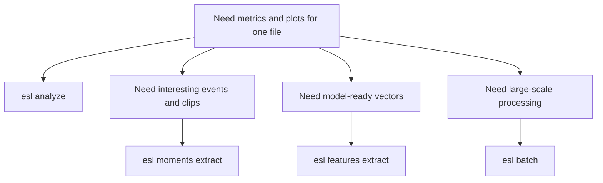

# Task Recipes (Beginner)

If you have an audio file and want to understand it, start here.

Use `input.wav` as your source and copy/paste exactly.

## Recipe 1: Analyze one file and generate plots

```bash
esl analyze input.wav --out-dir out --json out/input.json --plot
```

What this does:
- computes core and extended acoustic metrics
- writes schema-stable JSON plus plots

Expected outputs:
- `out/input.json`
- `out/input_plots/`

## Recipe 2: Extract the single most novel moment

```bash
esl moments extract input.wav \
  --out out/moments \
  --single \
  --rank-metric novelty_curve \
  --event-window 8
```

What this does:
- scans for novelty peaks
- exports one top-ranked event plus timestamp table

Expected outputs:
- `out/moments/moments.csv`
- `out/moments/moments_report.json`
- `out/moments/clips/moment_0001.wav`

## Recipe 3: Extract top-k moments instead of one

```bash
esl moments extract input.wav \
  --out out/moments_top5 \
  --top-k 5 \
  --rank-metric novelty_curve \
  --event-window 10
```

What this does:
- extracts multiple high-interest events
- keeps per-event timestamps and ranks

Expected outputs:
- `out/moments_top5/moments.csv`
- `out/moments_top5/clips/moment_*.wav`

## Recipe 4: Export ML-ready features

```bash
esl features extract input.wav \
  --out out/features.npz \
  --feature-set all \
  --meta-json out/features_meta.json
```

What this does:
- exports frame-wise features for modeling
- stores frame metadata and layout contract

Expected outputs:
- `out/features.npz`
- `out/features_meta.json`

## Recipe 5: Batch analyze a folder

```bash
esl batch input_dir --out out_batch --json --csv --parquet --plot
```

What this does:
- processes all supported audio files in a directory
- writes machine-readable outputs for each file

Expected outputs:
- `out_batch/**/*.json`
- `out_batch/**/*.csv`
- `out_batch/**/*.parquet`
- `out_batch/**/_plots/`

## Recipe 6: Compare architectural variants

```bash
esl analyze A.wav --project restaurant_design --variant A --out-dir out
esl analyze B.wav --project restaurant_design --variant B --out-dir out
esl project compare --project restaurant_design --root out --baseline A
```

What this does:
- stores variant analysis results in a shared project context
- computes deltas for room/level/novelty metrics

Expected outputs:
- `out/projects/restaurant_design/comparison.csv`
- `out/projects/restaurant_design/comparison_report.json`

## Recipe 7: Generate DSP signal/window reference graphs

```bash
bash scripts/easy/05_generate_signal_graphs.sh docs/examples/signal_window_guide
```

What this does:
- creates waveform, frame/hop, window family, overlap-add, spectrogram, novelty-kernel, and multichannel/FOA figures

Expected output folder:
- `docs/examples/signal_window_guide/`

See full walkthrough:
- [`SIGNAL_WINDOWS_VISUAL_GUIDE.md`](SIGNAL_WINDOWS_VISUAL_GUIDE.md)

## Which command should I use?


```mermaid
flowchart TD
    A["Need metrics and plots for one file"] --> B["esl analyze"]
    A --> C["Need interesting events and clips"]
    C --> D["esl moments extract"]
    A --> E["Need model-ready vectors"]
    E --> F["esl features extract"]
    A --> G["Need large-scale processing"]
    G --> H["esl batch"]
```

## Related Docs

- [`GETTING_STARTED.md`](GETTING_STARTED.md)
- [`TROUBLESHOOTING.md`](TROUBLESHOOTING.md)
- [`GLOSSARY.md`](GLOSSARY.md)
- [`MOMENTS_EXTRACTION.md`](MOMENTS_EXTRACTION.md)
