<section class="textbook-title-page">

<h1>ecoSignalLab</h1>
<h2>Environmental, Architectural, and Long-Archive Acoustic Analysis</h2>
<h3>A Practical Textbook and Reproducible Laboratory Companion for <code>esl</code></h3>
<p><strong>Edition 0.2.0</strong></p>
<p>Colby Leider and ecoSignalLab contributors</p>
<p>Licensed under the <a href="../LICENSE">MIT License</a>.</p>
<p>This textbook is generated from version-controlled documentation. Its claims, algorithms, source links, and laboratory workflows are intended to be inspectable rather than ornamental.</p>
</section>

---

# Preface

This is a working textbook for people who need to make defensible statements about sound. It begins with one file and a few commands, then expands into calibration, multichannel semantics, event review, long archives, spatial metadata, architectural impulse responses, ML exports, and validation. It is not a promise that a metric can answer every question. It is a guide to recording what the metric actually did.

The shortest route through the book is Part I, one event-analysis chapter from Part II, and the laboratory appendix. The rigorous route is all of it, including the parts where the data tell you that your first interpretation was too confident. Those parts are not bugs.

## Intended Readers

- New users with an audio file and a practical question.
- Researchers who need reproducible acoustic features and exports.
- Engineers working with multichannel, calibrated, or room-simulation material.
- Instructors looking for short laboratory assignments with concrete artifacts.

## Conventions Used in This Book

- Commands are shown in code blocks and are intended to be copied, then adapted to real file paths.
- A displayed equation is followed by a `where` statement and a plain-English interpretation when the source chapter supplies one.
- Figure labels use **chapter-figure** notation. For example, Figure 4-2 is the second figure in Chapter 4.
- A calibrated result is not interchangeable with dBFS. Read the units and provenance before comparing values.

<div class="textbook-page-start" aria-hidden="true"></div>

## Table of Contents

- [Introduction](#introduction)
- [Part I: Foundations and First Measurements](#part-1)
    - [Chapter 1: Orientation and First Workflows](#chapter-1-orientation-and-first-workflows)
    - [Chapter 2: Signals, Frames, Windows, and Chunks](#chapter-2-signals-frames-windows-and-chunks)
    - [Chapter 3: Metric Families and Measurement Contracts](#chapter-3-metric-families-and-measurement-contracts)
- [Part II: Events, Change, and Similarity](#part-2)
    - [Chapter 4: Novelty, Boundaries, and Anomaly Scores](#chapter-4-novelty-boundaries-and-anomaly-scores)
    - [Chapter 5: Moments Extraction and Reviewable Event Clips](#chapter-5-moments-extraction-and-reviewable-event-clips)
    - [Chapter 6: Query by Example and Distance Functions](#chapter-6-query-by-example-and-distance-functions)
- [Part III: Long Archives, Spatial Audio, and Field Operations](#part-3)
    - [Chapter 7: RF64 and Out-of-Core Analysis](#chapter-7-rf64-and-out-of-core-analysis)
    - [Chapter 8: Shard Manifests and Archive-Scale Retrieval](#chapter-8-shard-manifests-and-archive-scale-retrieval)
    - [Chapter 9: Archive Insights and Soundscape Reporting](#chapter-9-archive-insights-and-soundscape-reporting)
- [Part IV: ML, Schema, Validation, and Scientific Practice](#part-4)
    - [Chapter 10: FrameTables, Tensors, and Dataset Manifests](#chapter-10-frametables-tensors-and-dataset-manifests)
    - [Chapter 11: Schema, Provenance, and Calibration Contracts](#chapter-11-schema-provenance-and-calibration-contracts)
    - [Chapter 12: Validation and Regression Practice](#chapter-12-validation-and-regression-practice)
    - [Chapter 13: References, Attribution, and Further Study](#chapter-13-references-attribution-and-further-study)
- [Homework and Laboratory Assignments](#homework-and-laboratory-assignments)
- [Appendix: A First Laboratory Session](#appendix-a-first-laboratory-session)
- [Appendix: Attribution and Source Map](#appendix-attribution-and-source-map)
- [Colophon](#colophon)

<div class="textbook-page-start" aria-hidden="true"></div>

## Table of Figures

| Figure | Description |
| --- | --- |
| [Figure 2-1](#figure-2-1) | Signal waveform |
| [Figure 2-2](#figure-2-2) | Frame hop overlay |
| [Figure 2-3](#figure-2-3) | Window family |
| [Figure 2-4](#figure-2-4) | Overlap add |
| [Figure 2-5](#figure-2-5) | Spectrogram frames |
| [Figure 2-6](#figure-2-6) | Spectral flux |
| [Figure 2-7](#figure-2-7) | Checkerboard kernel |
| [Figure 2-8](#figure-2-8) | Multichannel waveforms |
| [Figure 2-9](#figure-2-9) | FOA WXYZ |
| [Figure 2-10](#figure-2-10) | Chunk frame timeline |
| [Figure 4-1](#figure-4-1) | Novelty matrix example |
| [Figure 4-2](#figure-4-2) | Novelty curve example |

<div class="textbook-page-start" aria-hidden="true"></div>

## How to Use This Book

Quick links: [README](../README.md) | [User Guide](USERGUIDE.md) | [Docs Index](INDEX.md) | [References](REFERENCES.md)

This textbook starts with a friendly working manual, then moves into the
maintained technical chapters that define methods, assumptions, data
contracts, and references. Read Part I before running a new workflow.
Use Parts II and III when investigating events or large archives. Use Part
IV before training models, publishing measurements, or handing a project
to another analyst.

Every chapter is generated from source-controlled documentation. That keeps
the textbook aligned with the codebase rather than becoming a handsome but
historically inaccurate fossil.

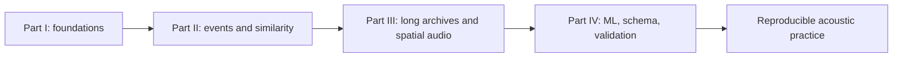

## A Note on Claims

`esl` can compute a broad set of metrics. The meaning of a metric depends on
the signal, calibration, windowing, channel convention, and study design.
A number becomes evidence only after those conditions are stated. The book
therefore preserves warnings, confidence fields, formulas, and citations
instead of treating a command-line result as a verdict.

---

# Introduction

## Sound Is Easy to Hear and Difficult to Measure Well

Most audio work begins with an ordinary sentence: *something happened in this recording; can we find it, describe it, compare it, or explain why it matters?* The sentence may concern a frog chorus, a factory floor, a classroom, a concert, a room simulation, a monitoring deployment, or a decade of archive files. The question sounds simple because hearing is fast. The evidence problem is not. An audio file is a sequence of numbers produced by a chain of physical and technical events, and every link in that chain can affect the meaning of a later result.

A source excites air or a structure. A microphone or sensor responds with some sensitivity, directionality, noise floor, and saturation behavior. A recorder applies gain, timing, conversion, encoding, and storage. A decoder turns stored bytes into samples. An analyst then chooses channels, windows, features, normalizations, thresholds, plots, and words. Each stage can be appropriate. Each stage can also change what a later result means. This book treats that chain as part of the subject rather than as an inconvenience before the interesting part.

The aim is deliberately practical: make a result that a second person can inspect. That means more than a number or a colorful spectrogram. It means an artifact connected to its source, settings, units, uncertainty, and intended use. A good analysis should help you decide what to listen to next, what to compare, which assumption needs checking, or what can be said honestly about the recording in front of you. It should not make a dramatic conclusion feel inevitable merely because software printed it with many decimal places.

## Begin with Listening, Then State the Question

Listening is not an embarrassing preliminary step that sophisticated analysis eventually eliminates. It is how a human notices whether a feature aligns with the event, source, boundary, defect, or quality that prompted the analysis. A novelty peak might be a useful call, a door slam, wind across a microphone, a gain switch, or a file boundary. A high level might be a source change, a distance change, a calibration mistake, or clipping. A clean diagonal block in a similarity matrix might represent musical form, repetition, a steady machine, or a repeated analysis artifact. The computation narrows review; it does not replace the need to inspect evidence.

The first discipline is to change a vague request into a testable question. Instead of asking whether a recording is interesting, ask whether there are time intervals with unusually large spectral change under a stated feature, normalization, and kernel scale. Instead of asking whether a room sounds better, ask how two simulated impulse responses differ in decay fit, clarity, or early-to-late energy under declared source and receiver conditions. Instead of asking whether an archive is calmer, define the level, event rate, band, or proxy being summarized and the time interval to which it applies.

The smaller question is not a weaker question. It creates a place where the answer can be checked. It also creates a place where the answer stops. A well-bounded result may support a claim about selected recordings, a selected representation, and a selected comparison. It normally does not, without more evidence, support a claim about every listener, every season, every room, every species, or every source of a similar-looking pattern.

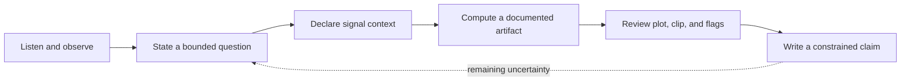

Plain English: analysis is a loop. A result should improve the next question, not close the investigation by force of formatting.

## The Measurement Chain Is Part of the Result

Before using equations, it helps to name what they are for. The following model does not describe every acoustic process in detail. It is an accounting model: it reminds us that the object we compute is a function of recorded samples and of the conditions under which those samples became evidence.

$$
\mathcal{R} = \mathcal{A}(x; \theta, \kappa, \pi)
$$

where `R` is a reported result, `x` is the decoded sample sequence, `A` is the analysis procedure, `theta` is the resolved configuration such as window and hop, `kappa` is physical and recording context such as calibration and channel metadata, and `pi` is provenance such as decoder and library versions. Plain English: the same samples can yield different useful results when the analytical question changes, but those changes must be visible.

This is why the distinction between dBFS and SPL matters. dBFS describes a digital relationship to full scale in the decoded signal. It can be useful for quality control, comparison within a stable digital system, and many feature workflows. SPL and weighted levels require a defensible physical reference. A calibration statement is not a decoration attached after analysis; it is the bridge between a digital sample value and a physical-level interpretation. When the bridge is missing, `esl` should say so plainly rather than pretending the file contains a sound-level meter certificate.

Likewise, a file with four or eight channels is not automatically a spatial recording in a known convention. Multichannel audio can mean independent microphones, a multitrack recorder, a binaural render, a surround bed, or an Ambisonic signal with a named channel order and normalization. Preserving the channels is the safe default. Aggregating them is a stated analytical choice. The chapters ahead repeatedly ask a simple question: does this value belong to a channel, a downmix, a spatial transform, a frame, a clip, a day, or an archive? The answer determines what comparison is valid.

## The Same Toolkit Serves Different Acoustic Questions

Environmental acoustics, architectural acoustics, industrial measurement, and machine-learning preparation share a surprising amount of infrastructure. All need reliable decoding, explicit time bases, stable feature names, measured or declared units, plots, and records that survive a handoff. They do not share all interpretations. A feature becomes ecological through a study design and a validated relationship to an environmental question, not because it was calculated outdoors. A room metric becomes architectural evidence through source, receiver, bandwidth, fit, and simulation or measurement assumptions, not because the filename contains the word `room`.

This textbook moves across domains while resisting false equivalence. An archive researcher may use novelty and similarity to select clips for human annotation. A consultant may compare impulse-response variants with RT60, EDT, C50, C80, and D50. A production engineer may audit clipping, DC offset, calibration state, and spectral change. An ML practitioner may export a FrameTable or tensor and build a dataset manifest that prevents adjacent audio from leaking across train and evaluation splits. The computations may overlap; the evidence needed to support a decision does not.

The common practice is provenance. Keep the input identifier, command or configuration, decoder information, channel interpretation, calibration state, metric list, output artifact, and review note together. This package is more valuable than a screenshot because it gives a collaborator a way to reproduce, question, improve, or reject the analysis without guessing what happened in a terminal several months ago. See [Schema](SCHEMA.md), [Metrics Reference](METRICS_REFERENCE.md), and [Validation](VALIDATION.md) for the contracts behind this practice.

## Scale Changes the Workflow, Not the Duty of Care

One short WAV can be inspected by eye and ear. A 24-hour multichannel RF64 file cannot be treated as an array you casually load into memory. A decade-long archive cannot be treated as a single spectrogram or a single similarity matrix. At larger scales, the workflow must become chunked, sharded, resumable, and selective. The result is not less rigorous. It is rigorous in a different way: it records shard boundaries, archive clocks, summary intervals, rank policies, and the cost of the calculation.

This changes what finding the interesting parts means. You do not ask a computer to know what is interesting in the human sense. You specify a reproducible candidate policy: top novelty events under a given representation, level changes over a threshold, intervals similar to a query, or deviations from a documented baseline. `esl moments extract` can export a bounded review set with a CSV of timestamps and WAV clips that include requested pre-event and post-event context. The final judgment remains reviewable because the selection rule and the original archive context travel with the clips.

Large scale also makes storage and time visible. Sample rate, bit depth, channel count, duration, compression, feature density, and plot choice all have costs. Use GB consistently when planning storage. Estimate before a long job begins. Choose summary intervals that match the decision. Retain enough raw data and provenance for a challenge or a rerun. The chapters on [RF64](RF64_AND_LARGE_FILES.md), [shards](SHARD_WORKFLOWS.md), manifests, and archive insights turn these principles into operational workflows.

## Models, Metrics, and Plots Are Not Oracles

It is tempting to treat a named metric as a complete interpretation. A metric is more modest: a defined transformation from a signal and its settings to a value, series, matrix, or rank. Some metrics are standards-aligned under specified conditions. Some are research features. Some are explicitly proxies. All need a reader to ask what was measured, at what time scale, in what units, over which channels, and against which reference.

The same caution applies to machine learning. A tensor layout is not a model. A model score is not a ground-truth label. Similarity in a feature space is not identity of source or cause. A dataset split is not valid merely because it is random; adjacent shards from the same deployment can make a model appear better than it will be on a new place or time. The ML chapters provide stable FrameTable, tensor, and manifest contracts precisely so that these assumptions can be inspected instead of buried in notebook state.

Visualization is part of the safeguard. A plot can reveal a bad channel, a windowing mistake, a quantization boundary, an implausible fit, or a rank driven by a narrow artifact. Use a plot to test whether a number resembles its claimed mechanism. Use listening to test whether an extracted event contains the phenomenon you care about. Use an independent observation, annotation, calibration check, or controlled fixture when the conclusion matters beyond a first-pass screen.

## How to Read the Rest of This Book

Part I establishes the working vocabulary: files, channels, levels, windows, metrics, and reproducible first runs. Do not rush past it. Those choices shape every later plot and export. Part II develops event candidates, novelty, similarity, and reviewable clips. It is the practical route from a long file to a small set of moments someone can inspect. Part III addresses the realities of scale and spatial context: RF64, shard manifests, archive reports, and metadata that should not be guessed. Part IV connects features to datasets, provenance to schema, calibration to physical interpretation, and validation to a release or research handoff.

The laboratory assignments turn every topic into a controlled evidence exercise. Work through them with a small legal-to-share recording or a synthetic fixture before asking a large, irreplaceable archive to carry the burden of your first experiment. Read the high-level explanation. Study the equation or diagram. Note the `where` statement and units. Run the smallest command that creates a real artifact. Inspect the artifact. Record one assumption and one alternative explanation. Then proceed.

The first part begins with a deliberately modest promise: take one file, learn what it is, make one result whose method you can explain, and keep enough record to do it again. That is how a durable acoustic practice starts.

---

<a id="part-1"></a>

# Part I: Foundations and First Measurements

# Chapter 1: Orientation and First Workflows

**Maintained source chapter:** [`docs/USERGUIDE.md`](USERGUIDE.md)

## Learning Objectives

- Identify the smallest complete esl workflow for a new file.
- Distinguish digital level, calibrated level, and analysis provenance.
- Choose an appropriate first output product for a practical question.

## Why This Chapter Matters

Orientation and First Workflows is not a collection of commands to memorize. It establishes the measurement choices that make a later result interpretable: the representation of the audio, the time scale, the channel policy, the units, and the provenance that allows another person to inspect the work. Treat those choices as part of the result rather than backstage detail.

As you read, connect each method to a concrete decision you expect to make with an audio file. Ask what the method observes, what it deliberately ignores, and which assumption would change the conclusion. The aim is not to produce an impressive number quickly; it is to make a claim that survives a second look.

## Reading Strategy

Read the formulas, tables, and diagrams together. A formula defines a quantity; a table specifies units and aggregation; a diagram shows where the calculation fits in the workflow. When the chapter provides a command, run it on a small known file first, preserve the output JSON, and compare the visible plot with what you hear. That small loop is more valuable than a large unreviewed batch run.

## Chapter Text

Quick links: [README](../README.md) | [Docs Index](INDEX.md) | [Getting Started](GETTING_STARTED.md) | [Task Recipes](TASK_RECIPES.md) | [Metrics](METRICS_REFERENCE.md) | [Troubleshooting](TROUBLESHOOTING.md)

`ecoSignalLab` (`esl`) is for answering a practical question: *what happened in
this audio, when did it happen, and how sure are we?* It is a command-line
toolkit for environmental audio, room and impulse-response work, long-duration
recordings, multichannel material, calibration-aware measurements, and
ML-ready exports.

This is the friendly manual. It gets you from one audio file to useful answers
without requiring an acoustics degree, while leaving the rigorous details one
click away when you need them.

## 1. The Smallest Useful Start

Install and inspect your environment:

```bash
python3 -m pip install --user pipx
pipx install "ecosignallab[io,plot,features]"
esl doctor
```

Analyze a file and make plots:

```bash
esl analyze input.wav --out-dir out --json out/input.json --plot
```

This creates a JSON record of results and provenance, plus plots under
`out/input_plots/`. If the command says `esl: command not found`, use the module
form while you finish installation:

```bash
python -m esl --help
```

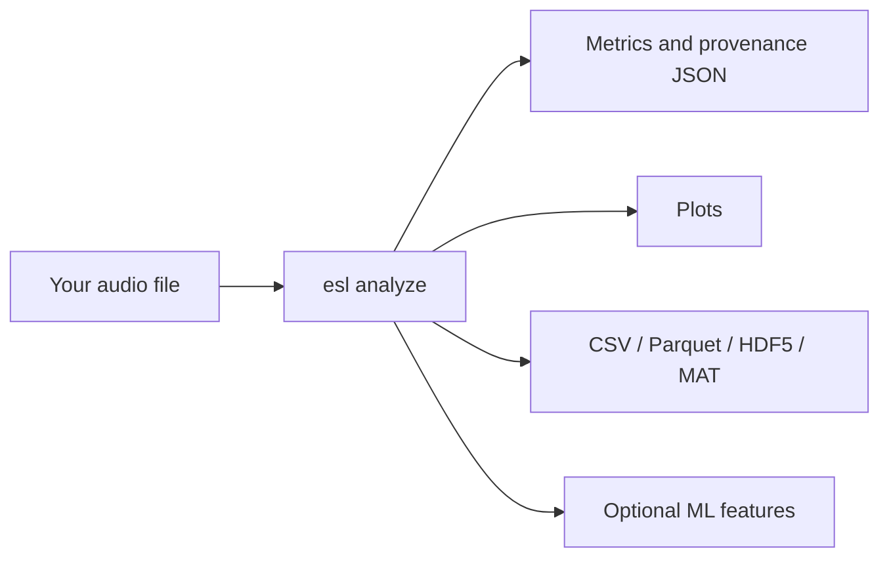

Plain English: one command can give you a readable report now and structured
data later. You do not need to decide your entire research program before
looking at the first graph.

## 2. What This Is and Is Not

### The short version

`esl` is a command-line toolkit for making a durable, inspectable statement
about an audio recording. It can answer questions such as: *when did the
recording change? which interval is worth listening to? how does this room
response decay? which files resemble this example? what did the recorder,
decoder, calibration profile, and analysis configuration contribute to this
number?* It is designed to return both a convenient answer and the context
needed to challenge that answer later.

It is not a black box that converts a WAV file into truth. Audio analysis is a
chain of choices: microphone, placement, gain, format, decoder, channel order,
window, feature, normalization, threshold, aggregation, and interpretation.
`esl` makes those choices explicit wherever it can. That is the point. A
smaller result with stated assumptions is more useful than a dramatic result
with no path back to the audio.

### What `esl` is

#### A reproducible measurement workbench

Use `esl` when you need an analysis result that can travel with its method.
`esl analyze` records resolved configuration, selected metrics, library
versions, decoder provenance, channel information, validity flags, calibration
state, and a `pipeline_hash`. The JSON is not merely an export format. It is a
compact measurement record that tells a collaborator what was actually run.

For a simple file, that may feel excessive. For a set of recordings collected
over months, a room-simulation comparison, or an ML training corpus, it is the
difference between a result that can be checked and one that can only be
remembered. The first useful habit is therefore simple: keep the command,
configuration, output JSON, and source identifier together.

#### A multichannel-first audio analysis toolkit

`esl` accepts one channel through larger arrays without silently treating every
recording as mono. It preserves per-channel results, labels aggregate values,
and exposes the downmix or pooling policy used by a metric. This matters when a
bird call is visible only on one microphone, when an array has a failed channel,
when left and right differ, or when an architectural render carries separate
receiver signals.

For Ambisonics and spatial material, `esl` can use declared metadata such as
channel order, normalization, and labels. It can also use a sidecar when a
filename is not enough. It does not infer a spatial convention from optimism.
If the recording says four channels but does not say whether they are ACN/SN3D,
FuMa, WXYZ, or something else, the correct response is to retain the
uncertainty until you supply defensible metadata.

#### A tool for finding, reviewing, and exporting moments

Long recordings are usually not hard because they contain too little sound.
They are hard because they contain too much unreviewed sound. `esl moments
extract` converts a ranking policy into timestamped candidate clips and a CSV
review record. You can request one candidate with `--single`, a shortlist with
`--top-k`, or all detected candidates. You can set pre-event and post-event
context so the exported WAV does not begin in the middle of the thing you need
to understand.

Novelty, level, spectral change, or an anomaly score can prioritize review. A
score is not a label. The highest-ranked clip may be a bird phrase, a door,
wind on a microphone, a gain change, or the beginning of a useful question.
`esl` helps make that review bounded and reproducible; it does not remove the
need to listen, inspect a plot, or record a human decision.

#### A bridge between acoustic domains

The same recording can matter to different people for different reasons. An
ecologist may need a band-energy contrast and a time series. An acoustic
consultant may need an impulse-response decay estimate, clarity values, and
variant comparison. An engineer may need clipping, level, spectral features,
and a CSV suitable for a measurement workflow. An ML practitioner may need a
FrameTable, a tensor layout, and a dataset manifest that does not leak adjacent
audio between train and evaluation splits.

`esl` provides a common analysis substrate for those workflows while keeping
their assumptions visible. A metric does not become ecological merely because
it was calculated outdoors, architectural merely because the file was called
`room.wav`, or ML-ready merely because it was saved as an array. The surrounding
metadata and validation practice determine what the value can support.

#### A long-archive and batch-processing tool

`esl` is designed to stream, chunk, shard, and summarize audio that cannot be
comfortably loaded as one giant array. A multi-day RF64 file, a directory of
daily recordings, or a calendar-aware shard manifest can be processed as an
ordered archive. This lets you find candidate moments, make trends, retrieve
similar intervals, and write appendable feature data without pretending that
years of audio belong in RAM.

Large-file support is not a promise that every operation is cheap. A full
self-similarity matrix grows rapidly with the number of frames, and dense
feature output can be larger than expected. `esl` exposes chunk and shard
controls so you can choose an appropriate time scale and storage strategy. Read
[RF64 and Large Files](RF64_AND_LARGE_FILES.md) before starting an analysis
whose duration is measured in days, years, or alarming quantities of GB.

#### A transparent, inspectable implementation

An audio-analysis tool earns trust by showing its work. For that reason, `esl`
tries to put the ordinary but decisive details in the result: which decoder
opened the file, which channel count and sample rate it observed, which metric
versions ran, whether calibration was applied, which validity flags were
raised, and which resolved settings formed the `pipeline_hash`. A result should
remain intelligible after the terminal scrollback is gone and after the person
who ran the command has moved on to another project.

That does not mean every number is equally certain. A clipped signal can still
have a peak value, but the clipping flag matters. An SNR estimate can still be
useful, but it should travel with its confidence and method. An impulse-response
fit can still report RT60, but its fit quality and detection state tell you
whether that value deserves weight. `esl` is designed to preserve these
distinctions in the data model rather than hiding them behind a single,
overconfident summary score.

Open source is part of this contract, not a decorative label. You can inspect
metric implementations, tests, formulas, attribution, and cited methods in the
repository. You can also decide that a metric's assumptions do not match your
question and select another one. The toolkit is intended to make disagreement
productive: compare configurations, rerun a fixture, examine a plot, and say
precisely where two workflows differ.

#### A command-line tool with optional visual evidence

The command line is the primary interface because a command can be copied into
a lab notebook, a shell script, a batch job, or a methods section. It also
means `esl` does not require an account, a browser tab, a remote control plane,
or an always-running graphical application before you can inspect one WAV.
Commands produce files that remain yours: JSON, CSV, Parquet, HDF5, MAT, WAV
clips, and static or interactive plots.

That command-line choice is not a demand that users stare at text all day.
Plots are evidence, not an afterthought. Spectrograms, level trends, novelty
curves, similarity matrices, decay curves, and batch exports support the
question that comes after a number: *does this claim look plausible in the
audio itself?* Run with plotting options, open the generated artifact, and
listen to the corresponding interval. A plot can expose a bad channel, a
decoder surprise, a gain step, or a meaningless threshold much faster than a
column of decimals.

The interface therefore favors a simple progression. Type one command for a
first answer. Add an output directory when you need durable artifacts. Add a
calibration file, channel metadata sidecar, shards, or ML export only when the
question demands them. The beginner path and the research path should share a
method, not require two unrelated products.

#### A composable SDK, not a locked analysis service

`esl` is meant to work inside a wider practice. A field team can use it after a
deployment. A consultant can use it after a room simulator exports receiver
signals. A researcher can call its Python APIs from a notebook. A data engineer
can build a scheduled batch workflow around its manifests and appendable
FrameTables. The same output contract is intended to support all of those
uses, so a quick command-line inspection does not paint a project into a corner
when it grows.

This also means the toolkit should be conservative about ownership. It does not
claim your recordings, prescribe a cloud platform, or insist that every
workflow use its database. It aims to interoperate through documented files,
schemas, and explicit metadata. If another tool is better at annotation,
curation, statistical modeling, listening, or reporting, use that tool and
retain the `esl` provenance beside the handoff. A healthy pipeline is usually a
chain of specialized tools, not one application pretending to be all of them.

The practical payoff is freedom to begin with a single file and still retain a
route to batch processing, peer review, or model training. The discipline is
the same at every scale: preserve the source identity, declare the
configuration, retain the output, and state what the result does and does not
mean.

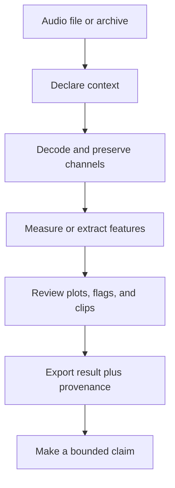

Plain English: `esl` is built to move from an audio file to a reviewable
analysis package, not from an audio file to an unexplained verdict.

### What `esl` is not

#### Not an audio editor or a digital audio workstation

`esl` analyzes, exports, and extracts clips. It is not intended to replace a
DAW, waveform editor, non-linear video editor, or live performance tool. Use a
dedicated editor when your primary job is arranging, cutting by hand, mixing,
restoring a performance, or producing a finished soundtrack. Use `esl` when
your primary job is measuring, ranking, comparing, documenting, or preparing
audio for a reproducible downstream workflow.

This boundary is useful rather than limiting. A DAW is excellent at helping a
person shape sound. `esl` is excellent at helping a person state what an
analysis did to sound. You can use both: export a candidate clip with `esl`,
review it in an editor, then place the human annotation back beside the CSV and
provenance record.

#### Not a replacement for field instrumentation or a measurement protocol

`esl` can report dBFS from decoded samples without a physical calibration. SPL,
dBA, dBC, and pressure-chain results require a documented calibration model.
Entering `0 dBFS = 94 dBA` is an assumption supplied by a user; it is not a
property discovered inside an arbitrary recording. Microphone sensitivity,
preamp gain, ADC range, weighting, reference tone, recorder gain state, and
deployment practice all matter when a result will be interpreted as a physical
level.

Use a calibrated sound level meter, calibrator, microphone documentation, and a
field or laboratory procedure when the question requires them. `esl` can carry
the resulting assumptions and help verify a calibration tone workflow. It
cannot repair an unknown microphone position, recover a gain setting that was
never recorded, or turn clipped audio into a compliant measurement.

#### Not a universal sound recognizer

`esl` can produce features, similarity rankings, novelty curves, anomaly
scores, and model-ready tensors. None of those automatically names a source.
To recognize species, machines, instruments, spoken words, or acoustic events,
you need an appropriate model, representative labeled data, a stated
evaluation split, and a validation protocol that matches the deployment.

Similarity is especially easy to overread. A query result means that one file
is close to another under the selected representation and distance function. It
does not mean the recordings share a source, cause, location, or ecological
meaning. Use the ranking to reduce review time, then listen and inspect the
evidence. See [Similarity Search](SIMILARITY_SEARCH.md) and
[ML Features](ML_FEATURES.md) for the contracts behind those outputs.

#### Not a standards-certification engine

Some `esl` metrics are implementation-aligned measurements, some are research
features, and some are explicitly labeled proxies. A proxy can be useful for
comparison, screening, and hypothesis generation without being a certified
substitute for a regulated procedure. RT60, clarity, loudness, and soundscape
metrics all depend on signal conditions, definitions, bandwidth, fit range,
calibration, and standards context.

If a project requires compliance, legal defensibility, occupational exposure
assessment, building-code sign-off, or a standards-specific procedure, identify
the governing standard and use a complete validated workflow. `esl` can be one
component of that workflow when its output, inputs, and limitations match the
requirement. It should not be presented as a certificate generator because it
printed a number with three decimal places.

#### Not a substitute for human interpretation

Plots can reveal structure, and metrics can make comparisons repeatable, but
they do not know your study question. A novelty peak does not know whether it
is scientifically important. An NDSI value does not know whether a local band
choice makes ecological sense. A room metric does not know which listener,
source, or use case matters. A model score does not know whether its labels
were biased or its evaluation split leaked time-adjacent audio.

Use `esl` to make the numerical and procedural part of a decision explicit.
Then bring listening, domain knowledge, field notes, drawings, annotations,
ground truth, and skeptical review to the interpretation. The right outcome is
often a narrower claim, a better next measurement, or an honest statement that
the current audio cannot answer the question alone.

### A practical decision guide

Choose `esl` when you can complete the sentence: “I have this audio, I want to
measure or compare this property, and I am willing to retain the assumptions
that make the result interpretable.” Start with `esl simple` or `esl analyze`
for one file; use `esl moments extract` for reviewable candidate clips; use
`esl similar` for retrieval; use `esl shard` for ordered archives; and use the
FrameTable export when the next stage is ML.

Pause before using `esl` alone when the sentence is instead: “I need a legal
certificate,” “I need to know the species without labels,” “I need to repair a
bad recording,” “I need to mix this album,” or “I need a physical measurement
but know nothing about the recording chain.” Those are different problems.
They may still use audio analysis, but they require other instruments, tools,
evidence, or people.

When a result depends on calibration, decoder choice, channel convention, or a
proxy assumption, `esl` records that context in the output JSON. See
[Schema](SCHEMA.md) for the exact contract and [Metrics Reference](METRICS_REFERENCE.md)
for what each metric declares about units, aggregation, calibration, and
streamability.

## 3. Five Things You Can Do Today

### Analyze one recording

```bash
esl simple forest_morning.wav
esl analyze forest_morning.wav --out-dir out --plot --ml-export
```

Use `simple` when you want a short answer. Use `analyze` when you want durable
JSON, plots, and exports.

### Find the single most interesting moment

```bash
esl moments extract forest_morning.wav \
  --out out/moments --single --rank-metric novelty_curve --event-window 12
```

The output includes a clipped WAV and a CSV row with its timestamp. Change
`--event-window`, or use `--window-before` and `--window-after`, to decide how
much context travels with the event.

### Find several unusual moments

```bash
esl moments extract forest_morning.wav \
  --out out/top_moments --top-k 20 --rank-metric novelty_curve \
  --window-before 5 --window-after 15
```

### Find files that sound like a query

```bash
esl similar query_frog_call.wav recordings/ \
  --out out/similar --top-k 10 --feature-set all
```

### Make similarity and novelty plots

```bash
esl analyze input.wav --out-dir out --plot --similarity-matrix --novelty-matrix
```

For exact terminology and defaults, see [Novelty and Anomaly](NOVELTY_ANOMALY.md)
and [Similarity Search](SIMILARITY_SEARCH.md).

## 4. Read the Results Without Guessing

The analysis JSON contains four ideas:

- `metadata`: the file, decoder, channel layout, calibration, device, and
  assumptions
- `metrics`: values, time series, units, confidence, and metric definitions
- `artifacts`: paths to larger sidecars such as FrameTables
- `pipeline_hash`: a compact fingerprint of the resolved configuration,
  metrics, and runtime library versions

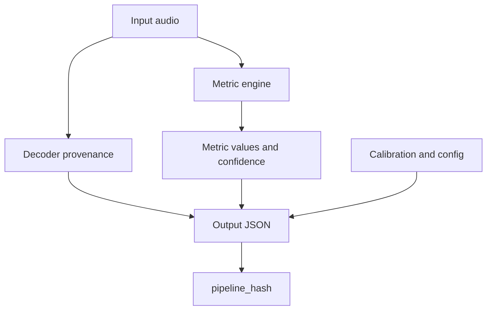

`pipeline_hash` is built deterministically from the resolved configuration,
metric list, window/hop settings, and library versions:

$$
H = \operatorname{hash}(C, M, W, L)
$$

where $C$ is the resolved configuration, $M$ is the selected metric list, $W$
is the frame/hop configuration, and $L$ is the library-version map.

Plain English: if the hash changes, something important about the processing
recipe changed. “I think we used the same settings” is not a reproducibility
method.

### Units matter

- `dBFS`: level relative to digital full scale; this needs no physical
  calibration.
- `SPL`, `dBA`, `dBC`: physical or weighted acoustic levels; these need an
  explicit calibration assumption.
- `ratio`, `Hz`, `s`, `ms`, `deg`: feature units, not sound-pressure levels.

Do not compare `dBFS` from two unrelated recorders as though it were a field
measurement. Calibrate first.

## 5. Calibration: From Digital Samples to Useful Level Data

The minimum calibration mapping is simple:

```yaml
dbfs_reference: 0.0
spl_reference_db: 94.0
weighting: A
```

Then run:

```bash
esl analyze recorder.wav --calibration calibration.yaml --out-dir out --json out/analysis.json
```

For a pressure-chain conversion, add microphone sensitivity, preamp gain, and
ADC full-scale voltage. Validate the setup with a known tone:

```bash
esl calibrate check calibration_tone.wav --calibration calibration.yaml --out out/calibration_check.json
esl calibrate verify
```

The basic mapping is:

$$
L_{\mathrm{SPL}} = L_{\mathrm{dBFS}} + \left(L_{\mathrm{ref}} - L_{\mathrm{dBFS,ref}}\right)
$$

where $L_{\mathrm{ref}}$ is the known physical reference level and
$L_{\mathrm{dBFS,ref}}$ is its measured digital level.

Plain English: calibration establishes the offset between what the recorder
stores and what the microphone experienced. Keep the profile with the project.

Read [Schema](SCHEMA.md) and [Metrics Reference](METRICS_REFERENCE.md) before
claiming a calibrated result in a report or publication.

## 6. Multi-Channel, Ambisonics, and Spatial Metadata

`esl` preserves channels rather than silently forcing a downmix. Outputs state
how aggregate values were made, and spatial metrics declare their assumptions.

For an Ambisonics or array recording whose filename is not enough to identify
the convention, use a sidecar:

```json
{
  "layout_family": "ambisonic",
  "layout_hint": "ambisonic_b_format",
  "channel_labels": ["W", "Y", "Z", "X"],
  "ambisonics": {
    "order": 1,
    "component_order": "ACN",
    "normalization": "SN3D"
  }
}
```

```bash
esl analyze field_array.wav --spatial-metadata-sidecar field_array.spatial.json
```

The sidecar can clarify channel labels, Ambisonics order, channel order,
normalization, layout, and geometry. It cannot change the number of channels
the decoder actually found. That is intentional.

For terminology and full sidecar behavior, see [Shard Workflows](SHARD_WORKFLOWS.md#spatial-and-ambisonics-sidecars).

## 7. Architectural and Impulse-Response Work

For an impulse response, request the architectural metrics explicitly:

```bash
esl analyze room_ir.wav --out-dir out --json out/room_ir.json \
  --metrics rt60_s,edt_s,clarity_c50_db,clarity_c80_db,definition_d50
```

Typical questions:

- How long does sound persist? Use `rt60_s` and `edt_s`.
- Is speech likely to retain early energy? Use `clarity_c50_db` and `definition_d50`.
- Is music detail likely to remain distinct? Use `clarity_c80_db`.

The decay model is commonly summarized as:

$$
E(t) \approx E_0 10^{-3t/T_{60}}
$$

where $E(t)$ is decay energy at time $t$, $E_0$ is initial energy, and $T_{60}$
is the 60 dB decay time.

Plain English: the metric estimates how quickly a room response fades. Inspect
the fit quality and validity flags, especially if the tail has weak SNR.

See [Metrics Reference](METRICS_REFERENCE.md#architectural-acoustics-metrics)
for definitions and limitations.

## 8. Long Files, RF64, and Shards

Do not load a multi-day or multi-year recording just because the filename ends
in `.wav`. Use chunking for one large file:

```bash
esl analyze daylong.rf64 --out-dir out \
  --chunk-hours 1 --streamable-only --summary-only \
  --frame-table-csv out/frame_table.csv \
  --checkpoint-dir out/checkpoints --resume
```

If the deployment already produces hourly or daily files, make a shard manifest:

```bash
esl shard index archive/ --out out/archive_manifest.json \
  --calendar-start 2026-01-01T00:00:00Z \
  --calendar-timezone America/New_York

esl shard analyze out/archive_manifest.json --out out/archive_analysis \
  --chunk-hours 1 --streamable-only --summary-only \
  --frame-table-dir out/frame_tables --resume
```

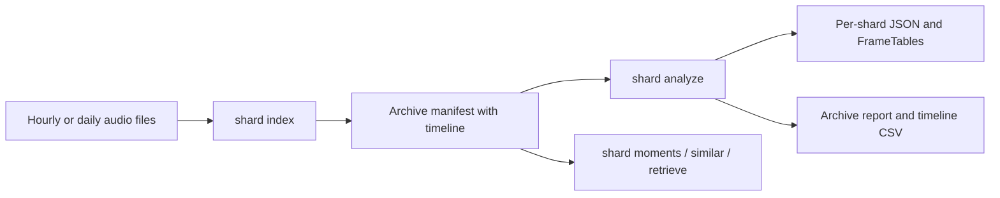

Use `esl shard moments` to find the most novel events across the full archive,
and `esl shard retrieve` to find query-like time windows. For a representative
performance check before a huge spatial query, run:

```bash
esl shard profile-retrieve out/archive_manifest.json query.wav \
  --out out/spatial_profile --max-shards 100 --spatial-mode append
```

Read [RF64 and Large Files](RF64_AND_LARGE_FILES.md) and
[Shard Workflows](SHARD_WORKFLOWS.md) before planning a multi-year run.

## 9. FrameTables and ML Exports

Use `--ml-export` for a single analysis product, or FrameTable sidecars for
long runs:

```bash
esl analyze input.wav --out-dir out --ml-export

esl shard dataset out/archive_analysis/shard_analysis_report.json \
  --out out/archive_dataset_manifest.json --split-ratios 0.8,0.1,0.1
```

The canonical tensor layout is:

$$
\mathbf{T} \in \mathbb{R}^{C \times F \times K}
$$

where $C$ is channel count, $F$ is frame count, and $K$ is the number of
feature columns.

Plain English: tabular exports give classical ML one row per frame; tensor
exports give deep-learning systems a declared channel, frame, feature layout.
Do not infer array axes from whatever shape happened to arrive in NumPy.

See [ML Features](ML_FEATURES.md) for naming rules, split semantics, and large
archive guidance.

## 10. Input Formats, Decoders, and Preparing Audio

### What files can `esl` open?

Native decoding through SoundFile covers WAV, RF64, FLAC, AIFF/AIF, and CAF.
When a format needs it, `esl` uses FFmpeg/FFprobe for MP3, AAC, OGG, Opus, WMA,
ALAC, M4A, and related container variants. SOFA impulse responses are supported
when the required HDF5 dependency is installed.

| You have | Recommended action | Important note |
| --- | --- | --- |
| ordinary WAV or FLAC | run `esl analyze` directly | SoundFile is normally used |
| MP3, AAC, M4A, or Opus | run `esl doctor input.ext` first | install FFmpeg if decoding fails |
| a WAV approaching 4 GB | use RF64 for future captures | classic RIFF WAV has a size limit |
| many hours in separate files | make a shard manifest | do not concatenate just to analyze |
| SOFA spatial IR | run analysis with the SOFA file | inspect channel and spatial metadata |

Use this before a difficult first run:

```bash
esl doctor input.wav
```

The doctor output tells you the available decoder path, sample rate, channels,
duration, file size, and common long-file risks. Its purpose is not to judge
your audio. It is to stop a 12-hour analysis from failing 11 hours and 58
minutes in because FFmpeg was missing.

### Sample rate, bit depth, and channels

Sample rate tells you the time grid; bit depth or floating point encoding tells
you how samples are represented. Channel count tells you how many simultaneous
signals exist. They are different facts, and confusing them makes troubleshooting
unnecessarily theatrical.

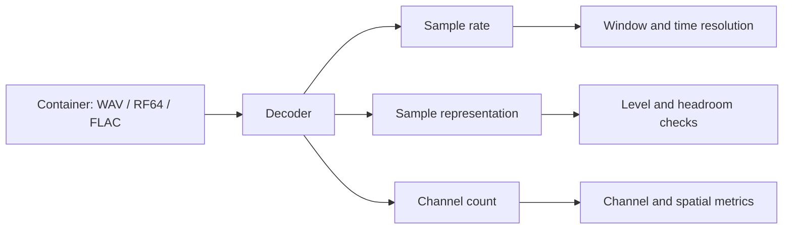

`esl` stores decoder provenance in output JSON. If a compressed file passes
through FFmpeg, the result records the FFmpeg version and FFprobe stream summary.
That is useful when two machines disagree about an awkward legacy file.

### Resampling deliberately

Use `--sample-rate` only when you want a target processing rate:

```bash
esl analyze input_96k.wav --sample-rate 48000 --out-dir out --plot
```

Resampling can save storage and processing time, but it removes information
above the new Nyquist frequency. If ultrasonic content, high-frequency insect
calls, or source localization cues matter, select the rate as a scientific
decision, not a convenience flag.

## 11. Metrics: Ask a Small Question First

The metric catalog is intentionally broad. Start with the question, then choose
the metric family instead of collecting every number because storage is cheap.

| Question | Useful first metrics | What they describe |
| --- | --- | --- |
| Is the file loud or clipped? | `rms_dbfs`, `peak_dbfs`, `crest_factor`, `dc_offset` | digital level, headroom, and signal-health clues |
| Is there useful signal above background? | `snr_db`, `noise_floor_dbfs` | a level contrast estimate and confidence |
| What frequencies dominate? | spectral centroid, bandwidth, rolloff, flatness | spectral balance and texture |
| Is something changing? | `novelty_curve`, spectral flux, change detection | frame-to-frame difference |
| Is an ecosystem soundscape diverse? | NDSI and ecoacoustic indices | band-energy balance and temporal structure |
| Does a room response decay well? | RT60, EDT, C50, C80, D50 | reflection and decay behavior |
| Does a multichannel scene differ spatially? | IACC, ILD, ITD, coherence | channel relationship proxies |

For the authoritative definition, formula, units, aggregation rule, calibration
dependency, and streamability of every metric, use [Metrics Reference](METRICS_REFERENCE.md).

### A reliable level example

For a sample sequence $x[n]$ with $N$ samples, RMS is:

$$
x_{\mathrm{RMS}} = \sqrt{\frac{1}{N}\sum_{n=0}^{N-1}x[n]^2}
$$

where $x[n]$ is the sample at index $n$ and $N$ is the number of samples in the
measurement window.

The corresponding dBFS value is:

$$
L_{\mathrm{RMS,dBFS}} = 20\log_{10}\left(\max\left(x_{\mathrm{RMS}}, \epsilon\right)\right)
$$

where $\epsilon$ is a very small positive floor that keeps silence finite.

Plain English: RMS is a stable estimate of average signal strength. Peak tells
you the tallest instant. Crest factor compares the two. None of them becomes SPL
until you supply a physical calibration relationship.

### Confidence and validity flags are not decoration

Some metrics can be uncertain because the signal is too quiet, the tail is too
short, a fit is poor, or a required calibration assumption is missing. Check:

- `metadata.validity_flags`
- each metric's `confidence`
- warnings in `metadata.warnings`
- IR fit-quality details for room metrics

If a metric has a low confidence, do not discard it automatically. Use it as a
signal to inspect the waveform, spectrogram, SNR, and assumptions before making
a claim.

## 12. Windows, Hops, and Time Resolution

Most time-varying features are calculated on overlapping frames. `--frame-size`
controls how much audio each calculation sees; `--hop-size` controls how often
the calculation moves forward.

```bash
esl analyze input.wav --frame-size 4096 --hop-size 1024 --out-dir out
```

At sample rate $f_s$, frame duration and hop duration are:

$$
T_{\mathrm{frame}} = \frac{N_{\mathrm{frame}}}{f_s}, \qquad
T_{\mathrm{hop}} = \frac{N_{\mathrm{hop}}}{f_s}
$$

where $N_{\mathrm{frame}}$ and $N_{\mathrm{hop}}$ are frame and hop sizes in
samples, and $f_s$ is sample rate in Hz.

Plain English: a longer frame gives more frequency detail but blurs rapid events;
a shorter frame tracks quicker changes but gives coarser frequency detail.

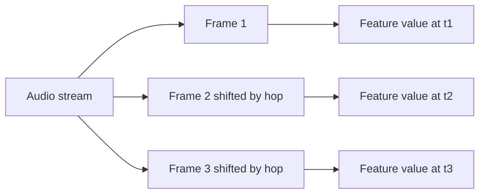

Practical starting points:

| Material | Frame / hop starting point | Why |
| --- | --- | --- |
| speech, general soundscape | 2048 / 512 samples | balanced default |
| transient-rich events | 1024 / 256 samples | quicker time response |
| slow level trends | 4096 / 1024 samples | smoother summaries |
| very long archive reporting | chunks in minutes or hours, frames in samples | memory-safe processing with normal feature resolution |

For minute-, hour-, or day-scale analysis chunks, use `--chunk-minutes`,
`--chunk-hours`, or `--chunk-days`. A chunk is a memory-management unit; it is
not necessarily the same thing as a feature frame. See [Signal and Window Visual Guide](SIGNAL_WINDOWS_VISUAL_GUIDE.md).

## 13. Novelty, Anomaly, and Interesting Moments

Novelty is a measure of change relative to nearby audio. It is not a universal
definition of importance. A quiet rare bird call can be important and have a
modest novelty score; a slammed door can be very novel and scientifically boring.
The right workflow combines ranking with listening and context.

### The standard first pass

```bash
esl analyze input.wav --out-dir out --plot --novelty-matrix
esl moments extract input.wav --out out/moments --top-k 10 --rank-metric novelty_curve
```

The novelty curve begins with a feature representation, compares nearby frames,
rectifies or normalizes the result, and can use peak picking to nominate events.

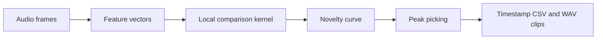

A simple spectral-change form is:

$$
v[t] = \sum_k \max\left(0, X[k,t] - X[k,t-1]\right)
$$

where $X[k,t]$ is a nonnegative feature value at frequency or feature index $k$
and frame $t$.

Plain English: this counts positive upward changes from one frame to the next.
Different novelty methods use richer features and kernels, but the intuition is
the same: find moments that differ from their local neighborhood.

### Similarity matrix versus novelty matrix

- A similarity matrix compares every selected frame to every other selected
  frame. Repeated scenes become blocks or diagonal patterns.
- A novelty matrix applies a local contrast operation to self-similarity,
  emphasizing boundaries between sections or acoustic states.

Use a similarity matrix when you ask “when does this sound recur?” Use a novelty
matrix when you ask “where does the scene change?” Read [Novelty and Anomaly](NOVELTY_ANOMALY.md)
for kernel, normalization, and peak-picking defaults.

### Do not over-interpret an anomaly score

An anomaly or isolation-forest score is a ranking signal, not a species label,
incident report, or causal explanation. Export the scores, inspect the selected
clips, and preserve the configuration hash so another analyst can reproduce the
candidate list.

## 14. Plots That Help You Decide What to Do Next

Use `--plot` for static PNGs. Use `--interactive` when a Plotly output helps you
inspect a long time series. Add `--show` only when you want the operating system
to open generated files automatically.

```bash
esl analyze input.wav --out-dir out --plot --interactive \
  --plot-metrics rms_dbfs,spl_a_db,novelty_curve,snr_db
```

| Plot | Good first question | What to look for |
| --- | --- | --- |
| waveform | is there clipping or silence? | flat tops, DC drift, recording gaps |
| spectrogram | what occupies the spectrum over time? | bands, impulses, periodic calls, machinery |
| mel spectrogram | what changes perceptually? | broad energy patterns and repeated texture |
| LTSA | what dominates over a long period? | persistent tonal or broadband energy |
| SPL/dBFS over time | when did level change? | activity cycles and obvious artifacts |
| SNR over time | when is analysis trustworthy? | low-confidence segments |
| novelty curve | where should I listen? | isolated peaks and sustained transitions |
| RT60 decay | is an IR fit plausible? | usable decay range and fit quality |

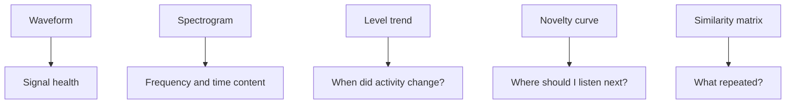

When a graph surprises you, export the surrounding audio rather than adjusting
parameters until the graph agrees with your expectation. The audio is allowed
to have the last word.

## 15. Batch Analysis, Projects, and Design Variants

Use `batch` for independent files such as a corpus. Use `shard analyze` for
ordered pieces of one deployment. This distinction matters because an archive
has a timeline and a corpus does not.

```bash
esl batch recordings/ --out out/batch --csv --parquet --hdf5 --plot
```

For architectural design variants or a named study, retain context with project
and variant values:

```bash
esl analyze restaurant_design_A.wav --project restaurant_design --variant A --out-dir out/A
esl analyze restaurant_design_B.wav --project restaurant_design --variant B --out-dir out/B
esl project compare --project restaurant_design --root out --baseline A
```

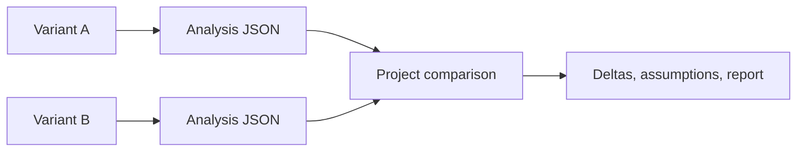

Keep every variant's source audio, calibration profile, metrics, and window
settings aligned. A difference between A and B is only useful if the workflow
behind the difference stayed comparable.

## 16. Interoperability and Export Choices

`esl` can emit JSON, CSV, Parquet, HDF5, MATLAB `.mat`, and compatibility-style
CSV outputs for measurement workflows. Choose the file type based on how it will
be used next.

| Format | Choose it when | Avoid it when |
| --- | --- | --- |
| JSON | provenance, nested metadata, a single analysis report | you need millions of frame rows |
| CSV | a person needs to inspect or import a small table | data types or scale matter |
| Parquet | analytics, dataframes, long FrameTables | the recipient only has a spreadsheet |
| HDF5 | appendable numeric arrays and scientific tooling | a plain-text review is needed |
| MAT | MATLAB workflows | a language-neutral archive is required |

Example:

```bash
esl analyze input.wav --out-dir out \
  --json out/analysis.json --csv out/summary.csv \
  --parquet out/summary.parquet --hdf5 out/analysis.h5 --mat out/analysis.mat
```

The output schema records weighting curves, level definitions, configuration,
and provenance. Compatibility CSV is an exchange starting point, not a claim
that every vendor application has identical hidden assumptions. Document your
window duration, weighting, calibration mapping, and channel aggregation when
cross-checking with another system.

## 17. Environmental Acoustic Monitoring Workflows

Environmental audio projects are strongest when they treat recordings as
measurements with context, not just files with evocative names. Keep a small
deployment record beside the audio that states:

- recorder model, microphone, gain, and channel mapping
- site identifier and coordinates at the precision appropriate for the project
- deployment start/end time and time zone
- sample rate, bit depth, and recording schedule
- calibration method and reference tone details
- weather, maintenance, and known disturbances

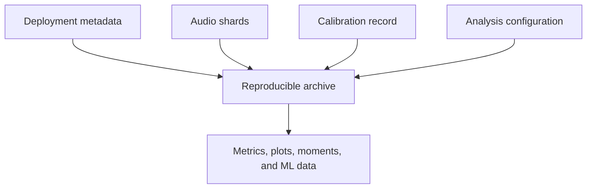

### A practical field workflow

```bash
# 1. Index an hourly or daily deployment with a real archive clock.
esl shard index deployment_audio/ --out out/manifest.json \
  --calendar-start 2026-04-01T00:00:00Z --calendar-timezone America/New_York

# 2. Run a streaming-safe archive pass with FrameTable sidecars.
esl shard analyze out/manifest.json --out out/analysis \
  --chunk-hours 1 --streamable-only --summary-only \
  --frame-table-parquet-dir out/frame_tables --checkpoint-dir out/checkpoints --resume

# 3. Find candidate moments for listening and annotation.
esl shard moments out/manifest.json --out out/moments --top-k 50 \
  --rank-metric novelty_curve --window-before 10 --window-after 20

# 4. Summarize archive-level change and calmness proxies.
esl shard insights scene out/analysis/shard_analysis_report.json --out out/scene
esl shard insights calmness out/analysis/shard_analysis_report.json --out out/calmness.json
```

Use ecoacoustic indices as *summaries to compare with context*, not as a
substitute for listening or annotation. An index can reveal a seasonal shift,
equipment fault, human disturbance, or microphone wind artifact. It cannot
decide which of those stories is true by itself.

### Diversity, calmness, and soundscape change

`esl` provides soundscape-oriented features and archive insights that can help
organize large deployments. Their most defensible use is comparative:

- compare a site to itself across time with the same capture chain
- compare treatment and control only after aligning calibration and schedule
- use visual trends to choose intervals for listening or annotation
- report the metric version, time scale, and exclusions

For a categorical frame-energy distribution $p_i$, entropy-style diversity has
the familiar form:

$$
H = -\sum_i p_i \log(p_i)
$$

where $p_i$ is the normalized share of energy or observations in category $i$.

Plain English: diversity measures how evenly a representation is spread. It does
not mean “ecosystem health” unless the study validates that relationship in its
own setting. See [Metrics Reference](METRICS_REFERENCE.md) and [References](REFERENCES.md).

## 18. Reproducibility, Review, and Research Handoff

Every serious analysis should be reviewable by someone who was not present when
you ran it, including future you. `esl` writes the materials needed for that
handoff directly into its outputs.

| Keep | Why it matters |
| --- | --- |
| original audio or immutable archive reference | lets others verify the source |
| analysis JSON | preserves metrics, metadata, warnings, and confidence |
| calibration profile | explains physical-level mapping |
| configuration and pipeline hash | identifies the exact processing recipe |
| FrameTable sidecars | supports later statistics and ML without rerunning audio |
| moments CSV and clips | makes candidate event review auditable |
| README or lab notebook | explains the study question and exclusions |

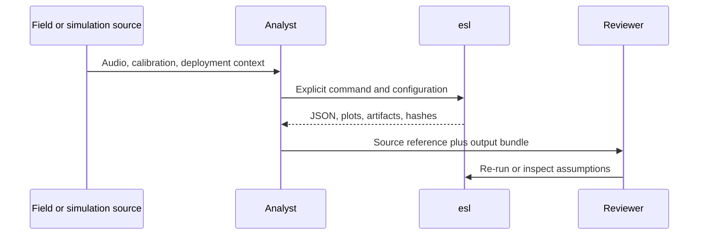

### Deterministic defaults are necessary, not sufficient

Fixed seeds and configuration hashes prevent accidental drift. They do not
repair an unclear question, a bad microphone placement, or a train/test split
that lets near-identical time periods leak into both sides. Good reproducibility
combines deterministic software with an explicit study design.

For ML work, consider holding out sites, devices, or time blocks rather than
randomly shuffling adjacent frames. The correct split follows the claim you want
to make. A model tested on another minute of the same recorder day is answering
a much easier question than a model tested on another season or site.

## 19. Common Workflows

| Goal | Start here |
| --- | --- |
| “What is in this file?” | `esl simple input.wav` |
| “Make a full report and plots.” | `esl analyze input.wav --out-dir out --plot` |
| “Find the weirdest bit.” | `esl moments extract input.wav --out out/moments --single` |
| “Find 33 unusual archive events.” | `esl shard moments manifest.json --out out/moments --top-k 33` |
| “Find recordings like this one.” | `esl similar query.wav corpus/ --out out/similar` |
| “Find matching moments inside an archive.” | `esl shard retrieve manifest.json query.wav --out out/retrieve` |
| “Export ML-ready data.” | `esl analyze input.wav --out-dir out --ml-export` |
| “Work safely on a huge file.” | `esl analyze input.rf64 --chunk-hours 1 --streamable-only --summary-only` |

More examples live in [Task Recipes](TASK_RECIPES.md) and the
[easy-script catalog](../scripts/easy/README.md).

## 20. When Something Goes Wrong

Start with the smallest diagnostic that can tell you something useful:

```bash
esl doctor input.wav
esl schema
esl --help
```

Common fixes:

- Compressed formats fail: install FFmpeg and make sure `ffprobe` is on `PATH`.
- `esl` is not found: activate your environment or run `python -m esl`.
- Huge file work fails: use RF64 where appropriate, chunking, FrameTable
  sidecars, checkpoints, and shards.
- SPL looks suspicious: check the calibration reference and verify a known tone.
- Spatial result looks wrong: supply a sidecar; do not rely on a filename guess.
- ML output is enormous: keep frame data as appendable CSV/Parquet/HDF5 and
  batch it downstream.

The full [Troubleshooting Guide](TROUBLESHOOTING.md) is deliberately more
detailed. Audio has many ways to be politely uncooperative.

## 21. Where to Go Next

- [Getting Started](GETTING_STARTED.md): first commands and common failure modes
- [Task Recipes](TASK_RECIPES.md): copy-paste workflows by goal
- [Metrics Reference](METRICS_REFERENCE.md): formulas, units, and assumptions
- [Novelty and Anomaly](NOVELTY_ANOMALY.md): novelty curves and matrices
- [Moments Extraction](MOMENTS_EXTRACTION.md): event selection and clips
- [Similarity Search](SIMILARITY_SEARCH.md): file and feature-vector comparison
- [Shard Workflows](SHARD_WORKFLOWS.md): long archives and calendar timelines
- [ML Features](ML_FEATURES.md): FrameTable and tensor contracts
- [References](REFERENCES.md): papers, standards, and implementation context

The detailed documentation is there when you need it. The first command is
still just:

```bash
esl analyze input.wav --out-dir out --plot
```

## Appendix: One-Page Command Card

Use this as the "I know what I want, just remind me of the command" page.

| Need | Command |
| --- | --- |
| Check installation or a file | `esl doctor [input.wav]` |
| Get a short summary | `esl simple input.wav` |
| Analyze and plot | `esl analyze input.wav --out-dir out --plot` |
| Extract one novel event | `esl moments extract input.wav --out out/moments --single` |
| Extract several events | `esl moments extract input.wav --out out/moments --top-k 20` |
| Compare a query to a folder | `esl similar query.wav corpus/ --out out/similar` |
| Index an archive folder | `esl shard index archive/ --out out/manifest.json` |
| Analyze a shard archive | `esl shard analyze out/manifest.json --out out/archive_analysis` |
| Find archive moments | `esl shard moments out/manifest.json --out out/moments --top-k 33` |
| Export ML features | `esl analyze input.wav --out-dir out --ml-export` |
| Check calibration | `esl calibrate check tone.wav --calibration calibration.yaml --out out/check.json` |
| View the output schema | `esl schema` |

If you want the exact flags, run `esl <command> --help`. If you want an
explanation of a result, start with the corresponding linked chapter above.

## Extended Study Dossier

This dossier slows the chapter down on purpose. The maintained chapter above defines the software contract, formulas, commands, and citations. The pages below develop the habits that determine whether those tools produce evidence: asking a bounded question, preserving conditions, looking for failure modes, and writing a conclusion that does not outrun its data. Read one lens at a time while working with a real but manageable example.

Before the formal model below, note that it is a conceptual accounting device rather than a new metric. It states that an analytical claim depends jointly on the audio, chosen method, context, and review. Leaving one term undocumented does not make it disappear; it makes the result harder to interpret later.

$$
\mathcal{C} = \mathcal{I}(x; \theta, \kappa, \pi, r)
$$

where `C` is a bounded claim, `x` is the decoded audio, `theta` is the resolved analysis configuration, `kappa` is the recorded context such as calibration and channel metadata, `pi` is the provenance record, and `r` is the human or automated review procedure. Plain English: the same waveform can support different, equally valid statements when the question and the recorded method differ.

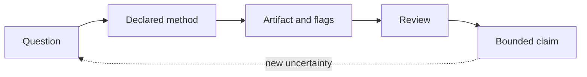

### The question before the command

In Chapter 1, **Orientation and First Workflows**, begin with a new recording whose history and intended use are only partly known. The practical discipline for this lens is to state the decision the analysis is supposed to support before selecting a metric or option. This is not paperwork added after the signal processing is complete. It decides which result can be compared, which output deserves review, and which conclusion would be too strong. The chapter's learning objectives are to Identify the smallest complete esl workflow for a new file.; Distinguish digital level, calibrated level, and analysis provenance.; Choose an appropriate first output product for a practical question.. For this pass, concentrate on one objective: Identify the smallest complete esl workflow for a new file.

Work with an example small enough to inspect from end to end. Write down the input identifier, the time interval, the channel policy, the configuration, and the expected shape of a useful result before you run the command. Then retain the unedited output and compare it with one visual or listening observation. The comparison should be literal at first: a peak at a timestamp, a changed rank, a decay slope, a missing field, or a stable block in a matrix. Literal observations are easier to audit than immediate stories about cause, quality, species, listener experience, or design success.

Next, make one controlled challenge to the first result. Change a parameter only when the chapter's method makes that change meaningful, or select a second documented interval, channel, file, or simulation variant. Ask what stayed stable, what moved, and whether the difference is larger than a plotting, framing, decoding, or calibration uncertainty. A result that changes is not automatically wrong; it may be telling you that the question has a scale, representation, or data-quality dependency that belongs in the final report.

Finally, write a two-part note. The first sentence states what the artifact shows under the recorded conditions. The second states one thing it does not establish and the next piece of evidence that would reduce that uncertainty. This habit turns every chapter into a reusable analytical protocol instead of a collection of software features. It also gives a collaborator a precise place to disagree productively: the input, configuration, interpretation, or required validation step rather than the vague claim that a number 'looks wrong.'

### The observed object

In Chapter 1, **Orientation and First Workflows**, begin with a new recording whose history and intended use are only partly known. The practical discipline for this lens is to separate the decoded sample sequence from the physical scene, source, or event it may represent. This is not paperwork added after the signal processing is complete. It decides which result can be compared, which output deserves review, and which conclusion would be too strong. The chapter's learning objectives are to Identify the smallest complete esl workflow for a new file.; Distinguish digital level, calibrated level, and analysis provenance.; Choose an appropriate first output product for a practical question.. For this pass, concentrate on one objective: Distinguish digital level, calibrated level, and analysis provenance.

Work with an example small enough to inspect from end to end. Write down the input identifier, the time interval, the channel policy, the configuration, and the expected shape of a useful result before you run the command. Then retain the unedited output and compare it with one visual or listening observation. The comparison should be literal at first: a peak at a timestamp, a changed rank, a decay slope, a missing field, or a stable block in a matrix. Literal observations are easier to audit than immediate stories about cause, quality, species, listener experience, or design success.

Next, make one controlled challenge to the first result. Change a parameter only when the chapter's method makes that change meaningful, or select a second documented interval, channel, file, or simulation variant. Ask what stayed stable, what moved, and whether the difference is larger than a plotting, framing, decoding, or calibration uncertainty. A result that changes is not automatically wrong; it may be telling you that the question has a scale, representation, or data-quality dependency that belongs in the final report.

Finally, write a two-part note. The first sentence states what the artifact shows under the recorded conditions. The second states one thing it does not establish and the next piece of evidence that would reduce that uncertainty. This habit turns every chapter into a reusable analytical protocol instead of a collection of software features. It also gives a collaborator a precise place to disagree productively: the input, configuration, interpretation, or required validation step rather than the vague claim that a number 'looks wrong.'

### Time scale

In Chapter 1, **Orientation and First Workflows**, begin with a new recording whose history and intended use are only partly known. The practical discipline for this lens is to choose a duration, frame, hop, chunk, or review interval that matches the phenomenon under study. This is not paperwork added after the signal processing is complete. It decides which result can be compared, which output deserves review, and which conclusion would be too strong. The chapter's learning objectives are to Identify the smallest complete esl workflow for a new file.; Distinguish digital level, calibrated level, and analysis provenance.; Choose an appropriate first output product for a practical question.. For this pass, concentrate on one objective: Choose an appropriate first output product for a practical question.

Work with an example small enough to inspect from end to end. Write down the input identifier, the time interval, the channel policy, the configuration, and the expected shape of a useful result before you run the command. Then retain the unedited output and compare it with one visual or listening observation. The comparison should be literal at first: a peak at a timestamp, a changed rank, a decay slope, a missing field, or a stable block in a matrix. Literal observations are easier to audit than immediate stories about cause, quality, species, listener experience, or design success.

Next, make one controlled challenge to the first result. Change a parameter only when the chapter's method makes that change meaningful, or select a second documented interval, channel, file, or simulation variant. Ask what stayed stable, what moved, and whether the difference is larger than a plotting, framing, decoding, or calibration uncertainty. A result that changes is not automatically wrong; it may be telling you that the question has a scale, representation, or data-quality dependency that belongs in the final report.

Finally, write a two-part note. The first sentence states what the artifact shows under the recorded conditions. The second states one thing it does not establish and the next piece of evidence that would reduce that uncertainty. This habit turns every chapter into a reusable analytical protocol instead of a collection of software features. It also gives a collaborator a precise place to disagree productively: the input, configuration, interpretation, or required validation step rather than the vague claim that a number 'looks wrong.'

### Channel semantics

In Chapter 1, **Orientation and First Workflows**, begin with a new recording whose history and intended use are only partly known. The practical discipline for this lens is to record whether the observation belongs to one channel, an aggregate, a downmix, or a spatial convention. This is not paperwork added after the signal processing is complete. It decides which result can be compared, which output deserves review, and which conclusion would be too strong. The chapter's learning objectives are to Identify the smallest complete esl workflow for a new file.; Distinguish digital level, calibrated level, and analysis provenance.; Choose an appropriate first output product for a practical question.. For this pass, concentrate on one objective: Identify the smallest complete esl workflow for a new file.

Work with an example small enough to inspect from end to end. Write down the input identifier, the time interval, the channel policy, the configuration, and the expected shape of a useful result before you run the command. Then retain the unedited output and compare it with one visual or listening observation. The comparison should be literal at first: a peak at a timestamp, a changed rank, a decay slope, a missing field, or a stable block in a matrix. Literal observations are easier to audit than immediate stories about cause, quality, species, listener experience, or design success.

Next, make one controlled challenge to the first result. Change a parameter only when the chapter's method makes that change meaningful, or select a second documented interval, channel, file, or simulation variant. Ask what stayed stable, what moved, and whether the difference is larger than a plotting, framing, decoding, or calibration uncertainty. A result that changes is not automatically wrong; it may be telling you that the question has a scale, representation, or data-quality dependency that belongs in the final report.

Finally, write a two-part note. The first sentence states what the artifact shows under the recorded conditions. The second states one thing it does not establish and the next piece of evidence that would reduce that uncertainty. This habit turns every chapter into a reusable analytical protocol instead of a collection of software features. It also gives a collaborator a precise place to disagree productively: the input, configuration, interpretation, or required validation step rather than the vague claim that a number 'looks wrong.'

### Units and references

In Chapter 1, **Orientation and First Workflows**, begin with a new recording whose history and intended use are only partly known. The practical discipline for this lens is to name the unit, reference quantity, calibration state, and any conversion that makes a value interpretable. This is not paperwork added after the signal processing is complete. It decides which result can be compared, which output deserves review, and which conclusion would be too strong. The chapter's learning objectives are to Identify the smallest complete esl workflow for a new file.; Distinguish digital level, calibrated level, and analysis provenance.; Choose an appropriate first output product for a practical question.. For this pass, concentrate on one objective: Distinguish digital level, calibrated level, and analysis provenance.

Work with an example small enough to inspect from end to end. Write down the input identifier, the time interval, the channel policy, the configuration, and the expected shape of a useful result before you run the command. Then retain the unedited output and compare it with one visual or listening observation. The comparison should be literal at first: a peak at a timestamp, a changed rank, a decay slope, a missing field, or a stable block in a matrix. Literal observations are easier to audit than immediate stories about cause, quality, species, listener experience, or design success.

Next, make one controlled challenge to the first result. Change a parameter only when the chapter's method makes that change meaningful, or select a second documented interval, channel, file, or simulation variant. Ask what stayed stable, what moved, and whether the difference is larger than a plotting, framing, decoding, or calibration uncertainty. A result that changes is not automatically wrong; it may be telling you that the question has a scale, representation, or data-quality dependency that belongs in the final report.

Finally, write a two-part note. The first sentence states what the artifact shows under the recorded conditions. The second states one thing it does not establish and the next piece of evidence that would reduce that uncertainty. This habit turns every chapter into a reusable analytical protocol instead of a collection of software features. It also gives a collaborator a precise place to disagree productively: the input, configuration, interpretation, or required validation step rather than the vague claim that a number 'looks wrong.'

### Preprocessing as a method

In Chapter 1, **Orientation and First Workflows**, begin with a new recording whose history and intended use are only partly known. The practical discipline for this lens is to treat decoding, resampling, filtering, normalization, and segmentation as visible analytical choices. This is not paperwork added after the signal processing is complete. It decides which result can be compared, which output deserves review, and which conclusion would be too strong. The chapter's learning objectives are to Identify the smallest complete esl workflow for a new file.; Distinguish digital level, calibrated level, and analysis provenance.; Choose an appropriate first output product for a practical question.. For this pass, concentrate on one objective: Choose an appropriate first output product for a practical question.

Work with an example small enough to inspect from end to end. Write down the input identifier, the time interval, the channel policy, the configuration, and the expected shape of a useful result before you run the command. Then retain the unedited output and compare it with one visual or listening observation. The comparison should be literal at first: a peak at a timestamp, a changed rank, a decay slope, a missing field, or a stable block in a matrix. Literal observations are easier to audit than immediate stories about cause, quality, species, listener experience, or design success.

Next, make one controlled challenge to the first result. Change a parameter only when the chapter's method makes that change meaningful, or select a second documented interval, channel, file, or simulation variant. Ask what stayed stable, what moved, and whether the difference is larger than a plotting, framing, decoding, or calibration uncertainty. A result that changes is not automatically wrong; it may be telling you that the question has a scale, representation, or data-quality dependency that belongs in the final report.

Finally, write a two-part note. The first sentence states what the artifact shows under the recorded conditions. The second states one thing it does not establish and the next piece of evidence that would reduce that uncertainty. This habit turns every chapter into a reusable analytical protocol instead of a collection of software features. It also gives a collaborator a precise place to disagree productively: the input, configuration, interpretation, or required validation step rather than the vague claim that a number 'looks wrong.'

### Parameter sensitivity

In Chapter 1, **Orientation and First Workflows**, begin with a new recording whose history and intended use are only partly known. The practical discipline for this lens is to test whether a conclusion survives a reasonable change in one important parameter. This is not paperwork added after the signal processing is complete. It decides which result can be compared, which output deserves review, and which conclusion would be too strong. The chapter's learning objectives are to Identify the smallest complete esl workflow for a new file.; Distinguish digital level, calibrated level, and analysis provenance.; Choose an appropriate first output product for a practical question.. For this pass, concentrate on one objective: Identify the smallest complete esl workflow for a new file.

Work with an example small enough to inspect from end to end. Write down the input identifier, the time interval, the channel policy, the configuration, and the expected shape of a useful result before you run the command. Then retain the unedited output and compare it with one visual or listening observation. The comparison should be literal at first: a peak at a timestamp, a changed rank, a decay slope, a missing field, or a stable block in a matrix. Literal observations are easier to audit than immediate stories about cause, quality, species, listener experience, or design success.

Next, make one controlled challenge to the first result. Change a parameter only when the chapter's method makes that change meaningful, or select a second documented interval, channel, file, or simulation variant. Ask what stayed stable, what moved, and whether the difference is larger than a plotting, framing, decoding, or calibration uncertainty. A result that changes is not automatically wrong; it may be telling you that the question has a scale, representation, or data-quality dependency that belongs in the final report.

Finally, write a two-part note. The first sentence states what the artifact shows under the recorded conditions. The second states one thing it does not establish and the next piece of evidence that would reduce that uncertainty. This habit turns every chapter into a reusable analytical protocol instead of a collection of software features. It also gives a collaborator a precise place to disagree productively: the input, configuration, interpretation, or required validation step rather than the vague claim that a number 'looks wrong.'

### The visual check

In Chapter 1, **Orientation and First Workflows**, begin with a new recording whose history and intended use are only partly known. The practical discipline for this lens is to compare the numerical output with a plot and, when appropriate, a bounded listening review. This is not paperwork added after the signal processing is complete. It decides which result can be compared, which output deserves review, and which conclusion would be too strong. The chapter's learning objectives are to Identify the smallest complete esl workflow for a new file.; Distinguish digital level, calibrated level, and analysis provenance.; Choose an appropriate first output product for a practical question.. For this pass, concentrate on one objective: Distinguish digital level, calibrated level, and analysis provenance.

Work with an example small enough to inspect from end to end. Write down the input identifier, the time interval, the channel policy, the configuration, and the expected shape of a useful result before you run the command. Then retain the unedited output and compare it with one visual or listening observation. The comparison should be literal at first: a peak at a timestamp, a changed rank, a decay slope, a missing field, or a stable block in a matrix. Literal observations are easier to audit than immediate stories about cause, quality, species, listener experience, or design success.

Next, make one controlled challenge to the first result. Change a parameter only when the chapter's method makes that change meaningful, or select a second documented interval, channel, file, or simulation variant. Ask what stayed stable, what moved, and whether the difference is larger than a plotting, framing, decoding, or calibration uncertainty. A result that changes is not automatically wrong; it may be telling you that the question has a scale, representation, or data-quality dependency that belongs in the final report.

Finally, write a two-part note. The first sentence states what the artifact shows under the recorded conditions. The second states one thing it does not establish and the next piece of evidence that would reduce that uncertainty. This habit turns every chapter into a reusable analytical protocol instead of a collection of software features. It also gives a collaborator a precise place to disagree productively: the input, configuration, interpretation, or required validation step rather than the vague claim that a number 'looks wrong.'

### The alternative explanation

In Chapter 1, **Orientation and First Workflows**, begin with a new recording whose history and intended use are only partly known. The practical discipline for this lens is to identify a plausible artifact, confound, or data-quality issue that could mimic the pattern. This is not paperwork added after the signal processing is complete. It decides which result can be compared, which output deserves review, and which conclusion would be too strong. The chapter's learning objectives are to Identify the smallest complete esl workflow for a new file.; Distinguish digital level, calibrated level, and analysis provenance.; Choose an appropriate first output product for a practical question.. For this pass, concentrate on one objective: Choose an appropriate first output product for a practical question.

Work with an example small enough to inspect from end to end. Write down the input identifier, the time interval, the channel policy, the configuration, and the expected shape of a useful result before you run the command. Then retain the unedited output and compare it with one visual or listening observation. The comparison should be literal at first: a peak at a timestamp, a changed rank, a decay slope, a missing field, or a stable block in a matrix. Literal observations are easier to audit than immediate stories about cause, quality, species, listener experience, or design success.

Next, make one controlled challenge to the first result. Change a parameter only when the chapter's method makes that change meaningful, or select a second documented interval, channel, file, or simulation variant. Ask what stayed stable, what moved, and whether the difference is larger than a plotting, framing, decoding, or calibration uncertainty. A result that changes is not automatically wrong; it may be telling you that the question has a scale, representation, or data-quality dependency that belongs in the final report.

Finally, write a two-part note. The first sentence states what the artifact shows under the recorded conditions. The second states one thing it does not establish and the next piece of evidence that would reduce that uncertainty. This habit turns every chapter into a reusable analytical protocol instead of a collection of software features. It also gives a collaborator a precise place to disagree productively: the input, configuration, interpretation, or required validation step rather than the vague claim that a number 'looks wrong.'

### Validity and confidence

In Chapter 1, **Orientation and First Workflows**, begin with a new recording whose history and intended use are only partly known. The practical discipline for this lens is to read flags, fit quality, uncertainty, and missing context before elevating a value into a claim. This is not paperwork added after the signal processing is complete. It decides which result can be compared, which output deserves review, and which conclusion would be too strong. The chapter's learning objectives are to Identify the smallest complete esl workflow for a new file.; Distinguish digital level, calibrated level, and analysis provenance.; Choose an appropriate first output product for a practical question.. For this pass, concentrate on one objective: Identify the smallest complete esl workflow for a new file.

Work with an example small enough to inspect from end to end. Write down the input identifier, the time interval, the channel policy, the configuration, and the expected shape of a useful result before you run the command. Then retain the unedited output and compare it with one visual or listening observation. The comparison should be literal at first: a peak at a timestamp, a changed rank, a decay slope, a missing field, or a stable block in a matrix. Literal observations are easier to audit than immediate stories about cause, quality, species, listener experience, or design success.

Next, make one controlled challenge to the first result. Change a parameter only when the chapter's method makes that change meaningful, or select a second documented interval, channel, file, or simulation variant. Ask what stayed stable, what moved, and whether the difference is larger than a plotting, framing, decoding, or calibration uncertainty. A result that changes is not automatically wrong; it may be telling you that the question has a scale, representation, or data-quality dependency that belongs in the final report.

Finally, write a two-part note. The first sentence states what the artifact shows under the recorded conditions. The second states one thing it does not establish and the next piece of evidence that would reduce that uncertainty. This habit turns every chapter into a reusable analytical protocol instead of a collection of software features. It also gives a collaborator a precise place to disagree productively: the input, configuration, interpretation, or required validation step rather than the vague claim that a number 'looks wrong.'

### The comparison set

In Chapter 1, **Orientation and First Workflows**, begin with a new recording whose history and intended use are only partly known. The practical discipline for this lens is to define what is held constant and what is allowed to differ when two results are compared. This is not paperwork added after the signal processing is complete. It decides which result can be compared, which output deserves review, and which conclusion would be too strong. The chapter's learning objectives are to Identify the smallest complete esl workflow for a new file.; Distinguish digital level, calibrated level, and analysis provenance.; Choose an appropriate first output product for a practical question.. For this pass, concentrate on one objective: Distinguish digital level, calibrated level, and analysis provenance.

Work with an example small enough to inspect from end to end. Write down the input identifier, the time interval, the channel policy, the configuration, and the expected shape of a useful result before you run the command. Then retain the unedited output and compare it with one visual or listening observation. The comparison should be literal at first: a peak at a timestamp, a changed rank, a decay slope, a missing field, or a stable block in a matrix. Literal observations are easier to audit than immediate stories about cause, quality, species, listener experience, or design success.

Next, make one controlled challenge to the first result. Change a parameter only when the chapter's method makes that change meaningful, or select a second documented interval, channel, file, or simulation variant. Ask what stayed stable, what moved, and whether the difference is larger than a plotting, framing, decoding, or calibration uncertainty. A result that changes is not automatically wrong; it may be telling you that the question has a scale, representation, or data-quality dependency that belongs in the final report.

Finally, write a two-part note. The first sentence states what the artifact shows under the recorded conditions. The second states one thing it does not establish and the next piece of evidence that would reduce that uncertainty. This habit turns every chapter into a reusable analytical protocol instead of a collection of software features. It also gives a collaborator a precise place to disagree productively: the input, configuration, interpretation, or required validation step rather than the vague claim that a number 'looks wrong.'

### The audit trail

In Chapter 1, **Orientation and First Workflows**, begin with a new recording whose history and intended use are only partly known. The practical discipline for this lens is to retain commands, resolved configuration, versions, inputs, and output identifiers together. This is not paperwork added after the signal processing is complete. It decides which result can be compared, which output deserves review, and which conclusion would be too strong. The chapter's learning objectives are to Identify the smallest complete esl workflow for a new file.; Distinguish digital level, calibrated level, and analysis provenance.; Choose an appropriate first output product for a practical question.. For this pass, concentrate on one objective: Choose an appropriate first output product for a practical question.

Work with an example small enough to inspect from end to end. Write down the input identifier, the time interval, the channel policy, the configuration, and the expected shape of a useful result before you run the command. Then retain the unedited output and compare it with one visual or listening observation. The comparison should be literal at first: a peak at a timestamp, a changed rank, a decay slope, a missing field, or a stable block in a matrix. Literal observations are easier to audit than immediate stories about cause, quality, species, listener experience, or design success.

Next, make one controlled challenge to the first result. Change a parameter only when the chapter's method makes that change meaningful, or select a second documented interval, channel, file, or simulation variant. Ask what stayed stable, what moved, and whether the difference is larger than a plotting, framing, decoding, or calibration uncertainty. A result that changes is not automatically wrong; it may be telling you that the question has a scale, representation, or data-quality dependency that belongs in the final report.

Finally, write a two-part note. The first sentence states what the artifact shows under the recorded conditions. The second states one thing it does not establish and the next piece of evidence that would reduce that uncertainty. This habit turns every chapter into a reusable analytical protocol instead of a collection of software features. It also gives a collaborator a precise place to disagree productively: the input, configuration, interpretation, or required validation step rather than the vague claim that a number 'looks wrong.'

### The human review loop

In Chapter 1, **Orientation and First Workflows**, begin with a new recording whose history and intended use are only partly known. The practical discipline for this lens is to give a listener, analyst, or domain expert a concrete artifact and a stated question to inspect. This is not paperwork added after the signal processing is complete. It decides which result can be compared, which output deserves review, and which conclusion would be too strong. The chapter's learning objectives are to Identify the smallest complete esl workflow for a new file.; Distinguish digital level, calibrated level, and analysis provenance.; Choose an appropriate first output product for a practical question.. For this pass, concentrate on one objective: Identify the smallest complete esl workflow for a new file.

Work with an example small enough to inspect from end to end. Write down the input identifier, the time interval, the channel policy, the configuration, and the expected shape of a useful result before you run the command. Then retain the unedited output and compare it with one visual or listening observation. The comparison should be literal at first: a peak at a timestamp, a changed rank, a decay slope, a missing field, or a stable block in a matrix. Literal observations are easier to audit than immediate stories about cause, quality, species, listener experience, or design success.

Next, make one controlled challenge to the first result. Change a parameter only when the chapter's method makes that change meaningful, or select a second documented interval, channel, file, or simulation variant. Ask what stayed stable, what moved, and whether the difference is larger than a plotting, framing, decoding, or calibration uncertainty. A result that changes is not automatically wrong; it may be telling you that the question has a scale, representation, or data-quality dependency that belongs in the final report.

Finally, write a two-part note. The first sentence states what the artifact shows under the recorded conditions. The second states one thing it does not establish and the next piece of evidence that would reduce that uncertainty. This habit turns every chapter into a reusable analytical protocol instead of a collection of software features. It also gives a collaborator a precise place to disagree productively: the input, configuration, interpretation, or required validation step rather than the vague claim that a number 'looks wrong.'

### Scale and cost

In Chapter 1, **Orientation and First Workflows**, begin with a new recording whose history and intended use are only partly known. The practical discipline for this lens is to estimate memory, storage, runtime, and review burden before committing to a large workflow. This is not paperwork added after the signal processing is complete. It decides which result can be compared, which output deserves review, and which conclusion would be too strong. The chapter's learning objectives are to Identify the smallest complete esl workflow for a new file.; Distinguish digital level, calibrated level, and analysis provenance.; Choose an appropriate first output product for a practical question.. For this pass, concentrate on one objective: Distinguish digital level, calibrated level, and analysis provenance.

Work with an example small enough to inspect from end to end. Write down the input identifier, the time interval, the channel policy, the configuration, and the expected shape of a useful result before you run the command. Then retain the unedited output and compare it with one visual or listening observation. The comparison should be literal at first: a peak at a timestamp, a changed rank, a decay slope, a missing field, or a stable block in a matrix. Literal observations are easier to audit than immediate stories about cause, quality, species, listener experience, or design success.

Next, make one controlled challenge to the first result. Change a parameter only when the chapter's method makes that change meaningful, or select a second documented interval, channel, file, or simulation variant. Ask what stayed stable, what moved, and whether the difference is larger than a plotting, framing, decoding, or calibration uncertainty. A result that changes is not automatically wrong; it may be telling you that the question has a scale, representation, or data-quality dependency that belongs in the final report.

Finally, write a two-part note. The first sentence states what the artifact shows under the recorded conditions. The second states one thing it does not establish and the next piece of evidence that would reduce that uncertainty. This habit turns every chapter into a reusable analytical protocol instead of a collection of software features. It also gives a collaborator a precise place to disagree productively: the input, configuration, interpretation, or required validation step rather than the vague claim that a number 'looks wrong.'

### Interoperability

In Chapter 1, **Orientation and First Workflows**, begin with a new recording whose history and intended use are only partly known. The practical discipline for this lens is to preserve enough schema, metadata, and naming information for a handoff to another tool or collaborator. This is not paperwork added after the signal processing is complete. It decides which result can be compared, which output deserves review, and which conclusion would be too strong. The chapter's learning objectives are to Identify the smallest complete esl workflow for a new file.; Distinguish digital level, calibrated level, and analysis provenance.; Choose an appropriate first output product for a practical question.. For this pass, concentrate on one objective: Choose an appropriate first output product for a practical question.

Work with an example small enough to inspect from end to end. Write down the input identifier, the time interval, the channel policy, the configuration, and the expected shape of a useful result before you run the command. Then retain the unedited output and compare it with one visual or listening observation. The comparison should be literal at first: a peak at a timestamp, a changed rank, a decay slope, a missing field, or a stable block in a matrix. Literal observations are easier to audit than immediate stories about cause, quality, species, listener experience, or design success.

Next, make one controlled challenge to the first result. Change a parameter only when the chapter's method makes that change meaningful, or select a second documented interval, channel, file, or simulation variant. Ask what stayed stable, what moved, and whether the difference is larger than a plotting, framing, decoding, or calibration uncertainty. A result that changes is not automatically wrong; it may be telling you that the question has a scale, representation, or data-quality dependency that belongs in the final report.

Finally, write a two-part note. The first sentence states what the artifact shows under the recorded conditions. The second states one thing it does not establish and the next piece of evidence that would reduce that uncertainty. This habit turns every chapter into a reusable analytical protocol instead of a collection of software features. It also gives a collaborator a precise place to disagree productively: the input, configuration, interpretation, or required validation step rather than the vague claim that a number 'looks wrong.'

### Ethics and access

In Chapter 1, **Orientation and First Workflows**, begin with a new recording whose history and intended use are only partly known. The practical discipline for this lens is to consider permissions, sensitive locations, speech, cultural material, and the difference between analysis and surveillance. This is not paperwork added after the signal processing is complete. It decides which result can be compared, which output deserves review, and which conclusion would be too strong. The chapter's learning objectives are to Identify the smallest complete esl workflow for a new file.; Distinguish digital level, calibrated level, and analysis provenance.; Choose an appropriate first output product for a practical question.. For this pass, concentrate on one objective: Identify the smallest complete esl workflow for a new file.

Work with an example small enough to inspect from end to end. Write down the input identifier, the time interval, the channel policy, the configuration, and the expected shape of a useful result before you run the command. Then retain the unedited output and compare it with one visual or listening observation. The comparison should be literal at first: a peak at a timestamp, a changed rank, a decay slope, a missing field, or a stable block in a matrix. Literal observations are easier to audit than immediate stories about cause, quality, species, listener experience, or design success.

Next, make one controlled challenge to the first result. Change a parameter only when the chapter's method makes that change meaningful, or select a second documented interval, channel, file, or simulation variant. Ask what stayed stable, what moved, and whether the difference is larger than a plotting, framing, decoding, or calibration uncertainty. A result that changes is not automatically wrong; it may be telling you that the question has a scale, representation, or data-quality dependency that belongs in the final report.

Finally, write a two-part note. The first sentence states what the artifact shows under the recorded conditions. The second states one thing it does not establish and the next piece of evidence that would reduce that uncertainty. This habit turns every chapter into a reusable analytical protocol instead of a collection of software features. It also gives a collaborator a precise place to disagree productively: the input, configuration, interpretation, or required validation step rather than the vague claim that a number 'looks wrong.'

### Failure as evidence

In Chapter 1, **Orientation and First Workflows**, begin with a new recording whose history and intended use are only partly known. The practical discipline for this lens is to keep a failed decode, invalid fit, clipped channel, or unexpected rank when it teaches something about the method. This is not paperwork added after the signal processing is complete. It decides which result can be compared, which output deserves review, and which conclusion would be too strong. The chapter's learning objectives are to Identify the smallest complete esl workflow for a new file.; Distinguish digital level, calibrated level, and analysis provenance.; Choose an appropriate first output product for a practical question.. For this pass, concentrate on one objective: Distinguish digital level, calibrated level, and analysis provenance.

Work with an example small enough to inspect from end to end. Write down the input identifier, the time interval, the channel policy, the configuration, and the expected shape of a useful result before you run the command. Then retain the unedited output and compare it with one visual or listening observation. The comparison should be literal at first: a peak at a timestamp, a changed rank, a decay slope, a missing field, or a stable block in a matrix. Literal observations are easier to audit than immediate stories about cause, quality, species, listener experience, or design success.

Next, make one controlled challenge to the first result. Change a parameter only when the chapter's method makes that change meaningful, or select a second documented interval, channel, file, or simulation variant. Ask what stayed stable, what moved, and whether the difference is larger than a plotting, framing, decoding, or calibration uncertainty. A result that changes is not automatically wrong; it may be telling you that the question has a scale, representation, or data-quality dependency that belongs in the final report.

Finally, write a two-part note. The first sentence states what the artifact shows under the recorded conditions. The second states one thing it does not establish and the next piece of evidence that would reduce that uncertainty. This habit turns every chapter into a reusable analytical protocol instead of a collection of software features. It also gives a collaborator a precise place to disagree productively: the input, configuration, interpretation, or required validation step rather than the vague claim that a number 'looks wrong.'

### A bounded conclusion

In Chapter 1, **Orientation and First Workflows**, begin with a new recording whose history and intended use are only partly known. The practical discipline for this lens is to write the smallest claim that the observed artifact, method record, and review actually support. This is not paperwork added after the signal processing is complete. It decides which result can be compared, which output deserves review, and which conclusion would be too strong. The chapter's learning objectives are to Identify the smallest complete esl workflow for a new file.; Distinguish digital level, calibrated level, and analysis provenance.; Choose an appropriate first output product for a practical question.. For this pass, concentrate on one objective: Choose an appropriate first output product for a practical question.

Work with an example small enough to inspect from end to end. Write down the input identifier, the time interval, the channel policy, the configuration, and the expected shape of a useful result before you run the command. Then retain the unedited output and compare it with one visual or listening observation. The comparison should be literal at first: a peak at a timestamp, a changed rank, a decay slope, a missing field, or a stable block in a matrix. Literal observations are easier to audit than immediate stories about cause, quality, species, listener experience, or design success.

Next, make one controlled challenge to the first result. Change a parameter only when the chapter's method makes that change meaningful, or select a second documented interval, channel, file, or simulation variant. Ask what stayed stable, what moved, and whether the difference is larger than a plotting, framing, decoding, or calibration uncertainty. A result that changes is not automatically wrong; it may be telling you that the question has a scale, representation, or data-quality dependency that belongs in the final report.

Finally, write a two-part note. The first sentence states what the artifact shows under the recorded conditions. The second states one thing it does not establish and the next piece of evidence that would reduce that uncertainty. This habit turns every chapter into a reusable analytical protocol instead of a collection of software features. It also gives a collaborator a precise place to disagree productively: the input, configuration, interpretation, or required validation step rather than the vague claim that a number 'looks wrong.'

### Replication

In Chapter 1, **Orientation and First Workflows**, begin with a new recording whose history and intended use are only partly known. The practical discipline for this lens is to make a second run possible without relying on memory, undocumented defaults, or a private graphical state. This is not paperwork added after the signal processing is complete. It decides which result can be compared, which output deserves review, and which conclusion would be too strong. The chapter's learning objectives are to Identify the smallest complete esl workflow for a new file.; Distinguish digital level, calibrated level, and analysis provenance.; Choose an appropriate first output product for a practical question.. For this pass, concentrate on one objective: Identify the smallest complete esl workflow for a new file.

Work with an example small enough to inspect from end to end. Write down the input identifier, the time interval, the channel policy, the configuration, and the expected shape of a useful result before you run the command. Then retain the unedited output and compare it with one visual or listening observation. The comparison should be literal at first: a peak at a timestamp, a changed rank, a decay slope, a missing field, or a stable block in a matrix. Literal observations are easier to audit than immediate stories about cause, quality, species, listener experience, or design success.

Next, make one controlled challenge to the first result. Change a parameter only when the chapter's method makes that change meaningful, or select a second documented interval, channel, file, or simulation variant. Ask what stayed stable, what moved, and whether the difference is larger than a plotting, framing, decoding, or calibration uncertainty. A result that changes is not automatically wrong; it may be telling you that the question has a scale, representation, or data-quality dependency that belongs in the final report.

Finally, write a two-part note. The first sentence states what the artifact shows under the recorded conditions. The second states one thing it does not establish and the next piece of evidence that would reduce that uncertainty. This habit turns every chapter into a reusable analytical protocol instead of a collection of software features. It also gives a collaborator a precise place to disagree productively: the input, configuration, interpretation, or required validation step rather than the vague claim that a number 'looks wrong.'

### The next measurement

In Chapter 1, **Orientation and First Workflows**, begin with a new recording whose history and intended use are only partly known. The practical discipline for this lens is to turn remaining uncertainty into a practical follow-up recording, calibration check, annotation, or comparison. This is not paperwork added after the signal processing is complete. It decides which result can be compared, which output deserves review, and which conclusion would be too strong. The chapter's learning objectives are to Identify the smallest complete esl workflow for a new file.; Distinguish digital level, calibrated level, and analysis provenance.; Choose an appropriate first output product for a practical question.. For this pass, concentrate on one objective: Distinguish digital level, calibrated level, and analysis provenance.

Work with an example small enough to inspect from end to end. Write down the input identifier, the time interval, the channel policy, the configuration, and the expected shape of a useful result before you run the command. Then retain the unedited output and compare it with one visual or listening observation. The comparison should be literal at first: a peak at a timestamp, a changed rank, a decay slope, a missing field, or a stable block in a matrix. Literal observations are easier to audit than immediate stories about cause, quality, species, listener experience, or design success.

Next, make one controlled challenge to the first result. Change a parameter only when the chapter's method makes that change meaningful, or select a second documented interval, channel, file, or simulation variant. Ask what stayed stable, what moved, and whether the difference is larger than a plotting, framing, decoding, or calibration uncertainty. A result that changes is not automatically wrong; it may be telling you that the question has a scale, representation, or data-quality dependency that belongs in the final report.

Finally, write a two-part note. The first sentence states what the artifact shows under the recorded conditions. The second states one thing it does not establish and the next piece of evidence that would reduce that uncertainty. This habit turns every chapter into a reusable analytical protocol instead of a collection of software features. It also gives a collaborator a precise place to disagree productively: the input, configuration, interpretation, or required validation step rather than the vague claim that a number 'looks wrong.'

### Stakeholders and use

In Chapter 1, **Orientation and First Workflows**, begin with a new recording whose history and intended use are only partly known. The practical discipline for this lens is to identify who will act on the result and what decision, design, or research question it is meant to inform. This is not paperwork added after the signal processing is complete. It decides which result can be compared, which output deserves review, and which conclusion would be too strong. The chapter's learning objectives are to Identify the smallest complete esl workflow for a new file.; Distinguish digital level, calibrated level, and analysis provenance.; Choose an appropriate first output product for a practical question.. For this pass, concentrate on one objective: Choose an appropriate first output product for a practical question.

Work with an example small enough to inspect from end to end. Write down the input identifier, the time interval, the channel policy, the configuration, and the expected shape of a useful result before you run the command. Then retain the unedited output and compare it with one visual or listening observation. The comparison should be literal at first: a peak at a timestamp, a changed rank, a decay slope, a missing field, or a stable block in a matrix. Literal observations are easier to audit than immediate stories about cause, quality, species, listener experience, or design success.

Next, make one controlled challenge to the first result. Change a parameter only when the chapter's method makes that change meaningful, or select a second documented interval, channel, file, or simulation variant. Ask what stayed stable, what moved, and whether the difference is larger than a plotting, framing, decoding, or calibration uncertainty. A result that changes is not automatically wrong; it may be telling you that the question has a scale, representation, or data-quality dependency that belongs in the final report.

Finally, write a two-part note. The first sentence states what the artifact shows under the recorded conditions. The second states one thing it does not establish and the next piece of evidence that would reduce that uncertainty. This habit turns every chapter into a reusable analytical protocol instead of a collection of software features. It also gives a collaborator a precise place to disagree productively: the input, configuration, interpretation, or required validation step rather than the vague claim that a number 'looks wrong.'

### Acoustic scene versus recording

In Chapter 1, **Orientation and First Workflows**, begin with a new recording whose history and intended use are only partly known. The practical discipline for this lens is to separate properties of the measured waveform from inferences about a place, source, listener, or system. This is not paperwork added after the signal processing is complete. It decides which result can be compared, which output deserves review, and which conclusion would be too strong. The chapter's learning objectives are to Identify the smallest complete esl workflow for a new file.; Distinguish digital level, calibrated level, and analysis provenance.; Choose an appropriate first output product for a practical question.. For this pass, concentrate on one objective: Identify the smallest complete esl workflow for a new file.

Work with an example small enough to inspect from end to end. Write down the input identifier, the time interval, the channel policy, the configuration, and the expected shape of a useful result before you run the command. Then retain the unedited output and compare it with one visual or listening observation. The comparison should be literal at first: a peak at a timestamp, a changed rank, a decay slope, a missing field, or a stable block in a matrix. Literal observations are easier to audit than immediate stories about cause, quality, species, listener experience, or design success.

Next, make one controlled challenge to the first result. Change a parameter only when the chapter's method makes that change meaningful, or select a second documented interval, channel, file, or simulation variant. Ask what stayed stable, what moved, and whether the difference is larger than a plotting, framing, decoding, or calibration uncertainty. A result that changes is not automatically wrong; it may be telling you that the question has a scale, representation, or data-quality dependency that belongs in the final report.

Finally, write a two-part note. The first sentence states what the artifact shows under the recorded conditions. The second states one thing it does not establish and the next piece of evidence that would reduce that uncertainty. This habit turns every chapter into a reusable analytical protocol instead of a collection of software features. It also gives a collaborator a precise place to disagree productively: the input, configuration, interpretation, or required validation step rather than the vague claim that a number 'looks wrong.'

### Instrumentation boundary

In Chapter 1, **Orientation and First Workflows**, begin with a new recording whose history and intended use are only partly known. The practical discipline for this lens is to document microphone, recorder, placement, gain, timing, and deployment facts that software cannot infer. This is not paperwork added after the signal processing is complete. It decides which result can be compared, which output deserves review, and which conclusion would be too strong. The chapter's learning objectives are to Identify the smallest complete esl workflow for a new file.; Distinguish digital level, calibrated level, and analysis provenance.; Choose an appropriate first output product for a practical question.. For this pass, concentrate on one objective: Distinguish digital level, calibrated level, and analysis provenance.

Work with an example small enough to inspect from end to end. Write down the input identifier, the time interval, the channel policy, the configuration, and the expected shape of a useful result before you run the command. Then retain the unedited output and compare it with one visual or listening observation. The comparison should be literal at first: a peak at a timestamp, a changed rank, a decay slope, a missing field, or a stable block in a matrix. Literal observations are easier to audit than immediate stories about cause, quality, species, listener experience, or design success.

Next, make one controlled challenge to the first result. Change a parameter only when the chapter's method makes that change meaningful, or select a second documented interval, channel, file, or simulation variant. Ask what stayed stable, what moved, and whether the difference is larger than a plotting, framing, decoding, or calibration uncertainty. A result that changes is not automatically wrong; it may be telling you that the question has a scale, representation, or data-quality dependency that belongs in the final report.

Finally, write a two-part note. The first sentence states what the artifact shows under the recorded conditions. The second states one thing it does not establish and the next piece of evidence that would reduce that uncertainty. This habit turns every chapter into a reusable analytical protocol instead of a collection of software features. It also gives a collaborator a precise place to disagree productively: the input, configuration, interpretation, or required validation step rather than the vague claim that a number 'looks wrong.'

### Reference baseline

In Chapter 1, **Orientation and First Workflows**, begin with a new recording whose history and intended use are only partly known. The practical discipline for this lens is to define a known interval, fixture, variant, or population against which change or similarity is judged. This is not paperwork added after the signal processing is complete. It decides which result can be compared, which output deserves review, and which conclusion would be too strong. The chapter's learning objectives are to Identify the smallest complete esl workflow for a new file.; Distinguish digital level, calibrated level, and analysis provenance.; Choose an appropriate first output product for a practical question.. For this pass, concentrate on one objective: Choose an appropriate first output product for a practical question.

Work with an example small enough to inspect from end to end. Write down the input identifier, the time interval, the channel policy, the configuration, and the expected shape of a useful result before you run the command. Then retain the unedited output and compare it with one visual or listening observation. The comparison should be literal at first: a peak at a timestamp, a changed rank, a decay slope, a missing field, or a stable block in a matrix. Literal observations are easier to audit than immediate stories about cause, quality, species, listener experience, or design success.

Next, make one controlled challenge to the first result. Change a parameter only when the chapter's method makes that change meaningful, or select a second documented interval, channel, file, or simulation variant. Ask what stayed stable, what moved, and whether the difference is larger than a plotting, framing, decoding, or calibration uncertainty. A result that changes is not automatically wrong; it may be telling you that the question has a scale, representation, or data-quality dependency that belongs in the final report.

Finally, write a two-part note. The first sentence states what the artifact shows under the recorded conditions. The second states one thing it does not establish and the next piece of evidence that would reduce that uncertainty. This habit turns every chapter into a reusable analytical protocol instead of a collection of software features. It also gives a collaborator a precise place to disagree productively: the input, configuration, interpretation, or required validation step rather than the vague claim that a number 'looks wrong.'

### Sampling and selection

In Chapter 1, **Orientation and First Workflows**, begin with a new recording whose history and intended use are only partly known. The practical discipline for this lens is to record how the chosen files or intervals entered the analysis and which material was excluded. This is not paperwork added after the signal processing is complete. It decides which result can be compared, which output deserves review, and which conclusion would be too strong. The chapter's learning objectives are to Identify the smallest complete esl workflow for a new file.; Distinguish digital level, calibrated level, and analysis provenance.; Choose an appropriate first output product for a practical question.. For this pass, concentrate on one objective: Identify the smallest complete esl workflow for a new file.

Work with an example small enough to inspect from end to end. Write down the input identifier, the time interval, the channel policy, the configuration, and the expected shape of a useful result before you run the command. Then retain the unedited output and compare it with one visual or listening observation. The comparison should be literal at first: a peak at a timestamp, a changed rank, a decay slope, a missing field, or a stable block in a matrix. Literal observations are easier to audit than immediate stories about cause, quality, species, listener experience, or design success.

Next, make one controlled challenge to the first result. Change a parameter only when the chapter's method makes that change meaningful, or select a second documented interval, channel, file, or simulation variant. Ask what stayed stable, what moved, and whether the difference is larger than a plotting, framing, decoding, or calibration uncertainty. A result that changes is not automatically wrong; it may be telling you that the question has a scale, representation, or data-quality dependency that belongs in the final report.

Finally, write a two-part note. The first sentence states what the artifact shows under the recorded conditions. The second states one thing it does not establish and the next piece of evidence that would reduce that uncertainty. This habit turns every chapter into a reusable analytical protocol instead of a collection of software features. It also gives a collaborator a precise place to disagree productively: the input, configuration, interpretation, or required validation step rather than the vague claim that a number 'looks wrong.'

### Feature representation

In Chapter 1, **Orientation and First Workflows**, begin with a new recording whose history and intended use are only partly known. The practical discipline for this lens is to explain what the selected representation emphasizes, compresses, or ignores before interpreting a score. This is not paperwork added after the signal processing is complete. It decides which result can be compared, which output deserves review, and which conclusion would be too strong. The chapter's learning objectives are to Identify the smallest complete esl workflow for a new file.; Distinguish digital level, calibrated level, and analysis provenance.; Choose an appropriate first output product for a practical question.. For this pass, concentrate on one objective: Distinguish digital level, calibrated level, and analysis provenance.

Work with an example small enough to inspect from end to end. Write down the input identifier, the time interval, the channel policy, the configuration, and the expected shape of a useful result before you run the command. Then retain the unedited output and compare it with one visual or listening observation. The comparison should be literal at first: a peak at a timestamp, a changed rank, a decay slope, a missing field, or a stable block in a matrix. Literal observations are easier to audit than immediate stories about cause, quality, species, listener experience, or design success.

Next, make one controlled challenge to the first result. Change a parameter only when the chapter's method makes that change meaningful, or select a second documented interval, channel, file, or simulation variant. Ask what stayed stable, what moved, and whether the difference is larger than a plotting, framing, decoding, or calibration uncertainty. A result that changes is not automatically wrong; it may be telling you that the question has a scale, representation, or data-quality dependency that belongs in the final report.

Finally, write a two-part note. The first sentence states what the artifact shows under the recorded conditions. The second states one thing it does not establish and the next piece of evidence that would reduce that uncertainty. This habit turns every chapter into a reusable analytical protocol instead of a collection of software features. It also gives a collaborator a precise place to disagree productively: the input, configuration, interpretation, or required validation step rather than the vague claim that a number 'looks wrong.'

### Normalization policy

In Chapter 1, **Orientation and First Workflows**, begin with a new recording whose history and intended use are only partly known. The practical discipline for this lens is to state whether values are normalized across frames, channels, files, or a corpus and how that changes comparison. This is not paperwork added after the signal processing is complete. It decides which result can be compared, which output deserves review, and which conclusion would be too strong. The chapter's learning objectives are to Identify the smallest complete esl workflow for a new file.; Distinguish digital level, calibrated level, and analysis provenance.; Choose an appropriate first output product for a practical question.. For this pass, concentrate on one objective: Choose an appropriate first output product for a practical question.

Work with an example small enough to inspect from end to end. Write down the input identifier, the time interval, the channel policy, the configuration, and the expected shape of a useful result before you run the command. Then retain the unedited output and compare it with one visual or listening observation. The comparison should be literal at first: a peak at a timestamp, a changed rank, a decay slope, a missing field, or a stable block in a matrix. Literal observations are easier to audit than immediate stories about cause, quality, species, listener experience, or design success.

Next, make one controlled challenge to the first result. Change a parameter only when the chapter's method makes that change meaningful, or select a second documented interval, channel, file, or simulation variant. Ask what stayed stable, what moved, and whether the difference is larger than a plotting, framing, decoding, or calibration uncertainty. A result that changes is not automatically wrong; it may be telling you that the question has a scale, representation, or data-quality dependency that belongs in the final report.

Finally, write a two-part note. The first sentence states what the artifact shows under the recorded conditions. The second states one thing it does not establish and the next piece of evidence that would reduce that uncertainty. This habit turns every chapter into a reusable analytical protocol instead of a collection of software features. It also gives a collaborator a precise place to disagree productively: the input, configuration, interpretation, or required validation step rather than the vague claim that a number 'looks wrong.'

### Aggregation hierarchy

In Chapter 1, **Orientation and First Workflows**, begin with a new recording whose history and intended use are only partly known. The practical discipline for this lens is to track the path from samples to frames, clips, channels, shards, days, or projects without losing level of meaning. This is not paperwork added after the signal processing is complete. It decides which result can be compared, which output deserves review, and which conclusion would be too strong. The chapter's learning objectives are to Identify the smallest complete esl workflow for a new file.; Distinguish digital level, calibrated level, and analysis provenance.; Choose an appropriate first output product for a practical question.. For this pass, concentrate on one objective: Identify the smallest complete esl workflow for a new file.

Work with an example small enough to inspect from end to end. Write down the input identifier, the time interval, the channel policy, the configuration, and the expected shape of a useful result before you run the command. Then retain the unedited output and compare it with one visual or listening observation. The comparison should be literal at first: a peak at a timestamp, a changed rank, a decay slope, a missing field, or a stable block in a matrix. Literal observations are easier to audit than immediate stories about cause, quality, species, listener experience, or design success.

Next, make one controlled challenge to the first result. Change a parameter only when the chapter's method makes that change meaningful, or select a second documented interval, channel, file, or simulation variant. Ask what stayed stable, what moved, and whether the difference is larger than a plotting, framing, decoding, or calibration uncertainty. A result that changes is not automatically wrong; it may be telling you that the question has a scale, representation, or data-quality dependency that belongs in the final report.

Finally, write a two-part note. The first sentence states what the artifact shows under the recorded conditions. The second states one thing it does not establish and the next piece of evidence that would reduce that uncertainty. This habit turns every chapter into a reusable analytical protocol instead of a collection of software features. It also gives a collaborator a precise place to disagree productively: the input, configuration, interpretation, or required validation step rather than the vague claim that a number 'looks wrong.'

### Thresholds and ranking

In Chapter 1, **Orientation and First Workflows**, begin with a new recording whose history and intended use are only partly known. The practical discipline for this lens is to treat cutoffs, peaks, top-k lists, and exclusion rules as declared decision policies rather than discoveries. This is not paperwork added after the signal processing is complete. It decides which result can be compared, which output deserves review, and which conclusion would be too strong. The chapter's learning objectives are to Identify the smallest complete esl workflow for a new file.; Distinguish digital level, calibrated level, and analysis provenance.; Choose an appropriate first output product for a practical question.. For this pass, concentrate on one objective: Distinguish digital level, calibrated level, and analysis provenance.

Work with an example small enough to inspect from end to end. Write down the input identifier, the time interval, the channel policy, the configuration, and the expected shape of a useful result before you run the command. Then retain the unedited output and compare it with one visual or listening observation. The comparison should be literal at first: a peak at a timestamp, a changed rank, a decay slope, a missing field, or a stable block in a matrix. Literal observations are easier to audit than immediate stories about cause, quality, species, listener experience, or design success.

Next, make one controlled challenge to the first result. Change a parameter only when the chapter's method makes that change meaningful, or select a second documented interval, channel, file, or simulation variant. Ask what stayed stable, what moved, and whether the difference is larger than a plotting, framing, decoding, or calibration uncertainty. A result that changes is not automatically wrong; it may be telling you that the question has a scale, representation, or data-quality dependency that belongs in the final report.

Finally, write a two-part note. The first sentence states what the artifact shows under the recorded conditions. The second states one thing it does not establish and the next piece of evidence that would reduce that uncertainty. This habit turns every chapter into a reusable analytical protocol instead of a collection of software features. It also gives a collaborator a precise place to disagree productively: the input, configuration, interpretation, or required validation step rather than the vague claim that a number 'looks wrong.'

### Missingness and gaps

In Chapter 1, **Orientation and First Workflows**, begin with a new recording whose history and intended use are only partly known. The practical discipline for this lens is to preserve absent channels, incomplete files, clock gaps, decode failures, and unavailable calibration as information. This is not paperwork added after the signal processing is complete. It decides which result can be compared, which output deserves review, and which conclusion would be too strong. The chapter's learning objectives are to Identify the smallest complete esl workflow for a new file.; Distinguish digital level, calibrated level, and analysis provenance.; Choose an appropriate first output product for a practical question.. For this pass, concentrate on one objective: Choose an appropriate first output product for a practical question.

Work with an example small enough to inspect from end to end. Write down the input identifier, the time interval, the channel policy, the configuration, and the expected shape of a useful result before you run the command. Then retain the unedited output and compare it with one visual or listening observation. The comparison should be literal at first: a peak at a timestamp, a changed rank, a decay slope, a missing field, or a stable block in a matrix. Literal observations are easier to audit than immediate stories about cause, quality, species, listener experience, or design success.

Next, make one controlled challenge to the first result. Change a parameter only when the chapter's method makes that change meaningful, or select a second documented interval, channel, file, or simulation variant. Ask what stayed stable, what moved, and whether the difference is larger than a plotting, framing, decoding, or calibration uncertainty. A result that changes is not automatically wrong; it may be telling you that the question has a scale, representation, or data-quality dependency that belongs in the final report.

Finally, write a two-part note. The first sentence states what the artifact shows under the recorded conditions. The second states one thing it does not establish and the next piece of evidence that would reduce that uncertainty. This habit turns every chapter into a reusable analytical protocol instead of a collection of software features. It also gives a collaborator a precise place to disagree productively: the input, configuration, interpretation, or required validation step rather than the vague claim that a number 'looks wrong.'

### Outliers and rare events

In Chapter 1, **Orientation and First Workflows**, begin with a new recording whose history and intended use are only partly known. The practical discipline for this lens is to distinguish a valuable rare observation from a transient artifact, configuration change, or data-entry mistake. This is not paperwork added after the signal processing is complete. It decides which result can be compared, which output deserves review, and which conclusion would be too strong. The chapter's learning objectives are to Identify the smallest complete esl workflow for a new file.; Distinguish digital level, calibrated level, and analysis provenance.; Choose an appropriate first output product for a practical question.. For this pass, concentrate on one objective: Identify the smallest complete esl workflow for a new file.

Work with an example small enough to inspect from end to end. Write down the input identifier, the time interval, the channel policy, the configuration, and the expected shape of a useful result before you run the command. Then retain the unedited output and compare it with one visual or listening observation. The comparison should be literal at first: a peak at a timestamp, a changed rank, a decay slope, a missing field, or a stable block in a matrix. Literal observations are easier to audit than immediate stories about cause, quality, species, listener experience, or design success.

Next, make one controlled challenge to the first result. Change a parameter only when the chapter's method makes that change meaningful, or select a second documented interval, channel, file, or simulation variant. Ask what stayed stable, what moved, and whether the difference is larger than a plotting, framing, decoding, or calibration uncertainty. A result that changes is not automatically wrong; it may be telling you that the question has a scale, representation, or data-quality dependency that belongs in the final report.

Finally, write a two-part note. The first sentence states what the artifact shows under the recorded conditions. The second states one thing it does not establish and the next piece of evidence that would reduce that uncertainty. This habit turns every chapter into a reusable analytical protocol instead of a collection of software features. It also gives a collaborator a precise place to disagree productively: the input, configuration, interpretation, or required validation step rather than the vague claim that a number 'looks wrong.'

### Model boundaries

In Chapter 1, **Orientation and First Workflows**, begin with a new recording whose history and intended use are only partly known. The practical discipline for this lens is to separate an implementation-aligned measurement, a research feature, and a proxy from a certified result. This is not paperwork added after the signal processing is complete. It decides which result can be compared, which output deserves review, and which conclusion would be too strong. The chapter's learning objectives are to Identify the smallest complete esl workflow for a new file.; Distinguish digital level, calibrated level, and analysis provenance.; Choose an appropriate first output product for a practical question.. For this pass, concentrate on one objective: Distinguish digital level, calibrated level, and analysis provenance.

Work with an example small enough to inspect from end to end. Write down the input identifier, the time interval, the channel policy, the configuration, and the expected shape of a useful result before you run the command. Then retain the unedited output and compare it with one visual or listening observation. The comparison should be literal at first: a peak at a timestamp, a changed rank, a decay slope, a missing field, or a stable block in a matrix. Literal observations are easier to audit than immediate stories about cause, quality, species, listener experience, or design success.

Next, make one controlled challenge to the first result. Change a parameter only when the chapter's method makes that change meaningful, or select a second documented interval, channel, file, or simulation variant. Ask what stayed stable, what moved, and whether the difference is larger than a plotting, framing, decoding, or calibration uncertainty. A result that changes is not automatically wrong; it may be telling you that the question has a scale, representation, or data-quality dependency that belongs in the final report.

Finally, write a two-part note. The first sentence states what the artifact shows under the recorded conditions. The second states one thing it does not establish and the next piece of evidence that would reduce that uncertainty. This habit turns every chapter into a reusable analytical protocol instead of a collection of software features. It also gives a collaborator a precise place to disagree productively: the input, configuration, interpretation, or required validation step rather than the vague claim that a number 'looks wrong.'

### Independent evidence

In Chapter 1, **Orientation and First Workflows**, begin with a new recording whose history and intended use are only partly known. The practical discipline for this lens is to seek field notes, labels, simulations, repeated measurements, or external observations that can challenge the output. This is not paperwork added after the signal processing is complete. It decides which result can be compared, which output deserves review, and which conclusion would be too strong. The chapter's learning objectives are to Identify the smallest complete esl workflow for a new file.; Distinguish digital level, calibrated level, and analysis provenance.; Choose an appropriate first output product for a practical question.. For this pass, concentrate on one objective: Choose an appropriate first output product for a practical question.

Work with an example small enough to inspect from end to end. Write down the input identifier, the time interval, the channel policy, the configuration, and the expected shape of a useful result before you run the command. Then retain the unedited output and compare it with one visual or listening observation. The comparison should be literal at first: a peak at a timestamp, a changed rank, a decay slope, a missing field, or a stable block in a matrix. Literal observations are easier to audit than immediate stories about cause, quality, species, listener experience, or design success.

Next, make one controlled challenge to the first result. Change a parameter only when the chapter's method makes that change meaningful, or select a second documented interval, channel, file, or simulation variant. Ask what stayed stable, what moved, and whether the difference is larger than a plotting, framing, decoding, or calibration uncertainty. A result that changes is not automatically wrong; it may be telling you that the question has a scale, representation, or data-quality dependency that belongs in the final report.

Finally, write a two-part note. The first sentence states what the artifact shows under the recorded conditions. The second states one thing it does not establish and the next piece of evidence that would reduce that uncertainty. This habit turns every chapter into a reusable analytical protocol instead of a collection of software features. It also gives a collaborator a precise place to disagree productively: the input, configuration, interpretation, or required validation step rather than the vague claim that a number 'looks wrong.'

### Version changes

In Chapter 1, **Orientation and First Workflows**, begin with a new recording whose history and intended use are only partly known. The practical discipline for this lens is to compare results across software, library, model, or configuration versions before treating a trend as signal change. This is not paperwork added after the signal processing is complete. It decides which result can be compared, which output deserves review, and which conclusion would be too strong. The chapter's learning objectives are to Identify the smallest complete esl workflow for a new file.; Distinguish digital level, calibrated level, and analysis provenance.; Choose an appropriate first output product for a practical question.. For this pass, concentrate on one objective: Identify the smallest complete esl workflow for a new file.

Work with an example small enough to inspect from end to end. Write down the input identifier, the time interval, the channel policy, the configuration, and the expected shape of a useful result before you run the command. Then retain the unedited output and compare it with one visual or listening observation. The comparison should be literal at first: a peak at a timestamp, a changed rank, a decay slope, a missing field, or a stable block in a matrix. Literal observations are easier to audit than immediate stories about cause, quality, species, listener experience, or design success.

Next, make one controlled challenge to the first result. Change a parameter only when the chapter's method makes that change meaningful, or select a second documented interval, channel, file, or simulation variant. Ask what stayed stable, what moved, and whether the difference is larger than a plotting, framing, decoding, or calibration uncertainty. A result that changes is not automatically wrong; it may be telling you that the question has a scale, representation, or data-quality dependency that belongs in the final report.

Finally, write a two-part note. The first sentence states what the artifact shows under the recorded conditions. The second states one thing it does not establish and the next piece of evidence that would reduce that uncertainty. This habit turns every chapter into a reusable analytical protocol instead of a collection of software features. It also gives a collaborator a precise place to disagree productively: the input, configuration, interpretation, or required validation step rather than the vague claim that a number 'looks wrong.'

### Storage and retention

In Chapter 1, **Orientation and First Workflows**, begin with a new recording whose history and intended use are only partly known. The practical discipline for this lens is to plan which raw audio, intermediate features, plots, and provenance records must be retained for later review. This is not paperwork added after the signal processing is complete. It decides which result can be compared, which output deserves review, and which conclusion would be too strong. The chapter's learning objectives are to Identify the smallest complete esl workflow for a new file.; Distinguish digital level, calibrated level, and analysis provenance.; Choose an appropriate first output product for a practical question.. For this pass, concentrate on one objective: Distinguish digital level, calibrated level, and analysis provenance.

Work with an example small enough to inspect from end to end. Write down the input identifier, the time interval, the channel policy, the configuration, and the expected shape of a useful result before you run the command. Then retain the unedited output and compare it with one visual or listening observation. The comparison should be literal at first: a peak at a timestamp, a changed rank, a decay slope, a missing field, or a stable block in a matrix. Literal observations are easier to audit than immediate stories about cause, quality, species, listener experience, or design success.

Next, make one controlled challenge to the first result. Change a parameter only when the chapter's method makes that change meaningful, or select a second documented interval, channel, file, or simulation variant. Ask what stayed stable, what moved, and whether the difference is larger than a plotting, framing, decoding, or calibration uncertainty. A result that changes is not automatically wrong; it may be telling you that the question has a scale, representation, or data-quality dependency that belongs in the final report.

Finally, write a two-part note. The first sentence states what the artifact shows under the recorded conditions. The second states one thing it does not establish and the next piece of evidence that would reduce that uncertainty. This habit turns every chapter into a reusable analytical protocol instead of a collection of software features. It also gives a collaborator a precise place to disagree productively: the input, configuration, interpretation, or required validation step rather than the vague claim that a number 'looks wrong.'

### Collaboration protocol

In Chapter 1, **Orientation and First Workflows**, begin with a new recording whose history and intended use are only partly known. The practical discipline for this lens is to make channel names, time bases, vocabulary, review labels, and expected deliverables legible to another analyst. This is not paperwork added after the signal processing is complete. It decides which result can be compared, which output deserves review, and which conclusion would be too strong. The chapter's learning objectives are to Identify the smallest complete esl workflow for a new file.; Distinguish digital level, calibrated level, and analysis provenance.; Choose an appropriate first output product for a practical question.. For this pass, concentrate on one objective: Choose an appropriate first output product for a practical question.

Work with an example small enough to inspect from end to end. Write down the input identifier, the time interval, the channel policy, the configuration, and the expected shape of a useful result before you run the command. Then retain the unedited output and compare it with one visual or listening observation. The comparison should be literal at first: a peak at a timestamp, a changed rank, a decay slope, a missing field, or a stable block in a matrix. Literal observations are easier to audit than immediate stories about cause, quality, species, listener experience, or design success.

Next, make one controlled challenge to the first result. Change a parameter only when the chapter's method makes that change meaningful, or select a second documented interval, channel, file, or simulation variant. Ask what stayed stable, what moved, and whether the difference is larger than a plotting, framing, decoding, or calibration uncertainty. A result that changes is not automatically wrong; it may be telling you that the question has a scale, representation, or data-quality dependency that belongs in the final report.

Finally, write a two-part note. The first sentence states what the artifact shows under the recorded conditions. The second states one thing it does not establish and the next piece of evidence that would reduce that uncertainty. This habit turns every chapter into a reusable analytical protocol instead of a collection of software features. It also gives a collaborator a precise place to disagree productively: the input, configuration, interpretation, or required validation step rather than the vague claim that a number 'looks wrong.'

### Privacy and consent

In Chapter 1, **Orientation and First Workflows**, begin with a new recording whose history and intended use are only partly known. The practical discipline for this lens is to consider whether speech, location, cultural material, or sensitive wildlife data requires access controls or redaction. This is not paperwork added after the signal processing is complete. It decides which result can be compared, which output deserves review, and which conclusion would be too strong. The chapter's learning objectives are to Identify the smallest complete esl workflow for a new file.; Distinguish digital level, calibrated level, and analysis provenance.; Choose an appropriate first output product for a practical question.. For this pass, concentrate on one objective: Identify the smallest complete esl workflow for a new file.

Work with an example small enough to inspect from end to end. Write down the input identifier, the time interval, the channel policy, the configuration, and the expected shape of a useful result before you run the command. Then retain the unedited output and compare it with one visual or listening observation. The comparison should be literal at first: a peak at a timestamp, a changed rank, a decay slope, a missing field, or a stable block in a matrix. Literal observations are easier to audit than immediate stories about cause, quality, species, listener experience, or design success.

Next, make one controlled challenge to the first result. Change a parameter only when the chapter's method makes that change meaningful, or select a second documented interval, channel, file, or simulation variant. Ask what stayed stable, what moved, and whether the difference is larger than a plotting, framing, decoding, or calibration uncertainty. A result that changes is not automatically wrong; it may be telling you that the question has a scale, representation, or data-quality dependency that belongs in the final report.

Finally, write a two-part note. The first sentence states what the artifact shows under the recorded conditions. The second states one thing it does not establish and the next piece of evidence that would reduce that uncertainty. This habit turns every chapter into a reusable analytical protocol instead of a collection of software features. It also gives a collaborator a precise place to disagree productively: the input, configuration, interpretation, or required validation step rather than the vague claim that a number 'looks wrong.'

### Communication

In Chapter 1, **Orientation and First Workflows**, begin with a new recording whose history and intended use are only partly known. The practical discipline for this lens is to choose a table, plot, clip, methods paragraph, or uncertainty statement that matches the audience without hiding caveats. This is not paperwork added after the signal processing is complete. It decides which result can be compared, which output deserves review, and which conclusion would be too strong. The chapter's learning objectives are to Identify the smallest complete esl workflow for a new file.; Distinguish digital level, calibrated level, and analysis provenance.; Choose an appropriate first output product for a practical question.. For this pass, concentrate on one objective: Distinguish digital level, calibrated level, and analysis provenance.

Work with an example small enough to inspect from end to end. Write down the input identifier, the time interval, the channel policy, the configuration, and the expected shape of a useful result before you run the command. Then retain the unedited output and compare it with one visual or listening observation. The comparison should be literal at first: a peak at a timestamp, a changed rank, a decay slope, a missing field, or a stable block in a matrix. Literal observations are easier to audit than immediate stories about cause, quality, species, listener experience, or design success.

Next, make one controlled challenge to the first result. Change a parameter only when the chapter's method makes that change meaningful, or select a second documented interval, channel, file, or simulation variant. Ask what stayed stable, what moved, and whether the difference is larger than a plotting, framing, decoding, or calibration uncertainty. A result that changes is not automatically wrong; it may be telling you that the question has a scale, representation, or data-quality dependency that belongs in the final report.

Finally, write a two-part note. The first sentence states what the artifact shows under the recorded conditions. The second states one thing it does not establish and the next piece of evidence that would reduce that uncertainty. This habit turns every chapter into a reusable analytical protocol instead of a collection of software features. It also gives a collaborator a precise place to disagree productively: the input, configuration, interpretation, or required validation step rather than the vague claim that a number 'looks wrong.'

### Decision reversibility

In Chapter 1, **Orientation and First Workflows**, begin with a new recording whose history and intended use are only partly known. The practical discipline for this lens is to prefer a workflow that permits review, reranking, re-extraction, and correction when later evidence changes the picture. This is not paperwork added after the signal processing is complete. It decides which result can be compared, which output deserves review, and which conclusion would be too strong. The chapter's learning objectives are to Identify the smallest complete esl workflow for a new file.; Distinguish digital level, calibrated level, and analysis provenance.; Choose an appropriate first output product for a practical question.. For this pass, concentrate on one objective: Choose an appropriate first output product for a practical question.

Work with an example small enough to inspect from end to end. Write down the input identifier, the time interval, the channel policy, the configuration, and the expected shape of a useful result before you run the command. Then retain the unedited output and compare it with one visual or listening observation. The comparison should be literal at first: a peak at a timestamp, a changed rank, a decay slope, a missing field, or a stable block in a matrix. Literal observations are easier to audit than immediate stories about cause, quality, species, listener experience, or design success.

Next, make one controlled challenge to the first result. Change a parameter only when the chapter's method makes that change meaningful, or select a second documented interval, channel, file, or simulation variant. Ask what stayed stable, what moved, and whether the difference is larger than a plotting, framing, decoding, or calibration uncertainty. A result that changes is not automatically wrong; it may be telling you that the question has a scale, representation, or data-quality dependency that belongs in the final report.

Finally, write a two-part note. The first sentence states what the artifact shows under the recorded conditions. The second states one thing it does not establish and the next piece of evidence that would reduce that uncertainty. This habit turns every chapter into a reusable analytical protocol instead of a collection of software features. It also gives a collaborator a precise place to disagree productively: the input, configuration, interpretation, or required validation step rather than the vague claim that a number 'looks wrong.'

### Long-term stewardship

In Chapter 1, **Orientation and First Workflows**, begin with a new recording whose history and intended use are only partly known. The practical discipline for this lens is to prepare outputs so that a future analyst can understand their provenance even after hardware, accounts, and personnel change. This is not paperwork added after the signal processing is complete. It decides which result can be compared, which output deserves review, and which conclusion would be too strong. The chapter's learning objectives are to Identify the smallest complete esl workflow for a new file.; Distinguish digital level, calibrated level, and analysis provenance.; Choose an appropriate first output product for a practical question.. For this pass, concentrate on one objective: Identify the smallest complete esl workflow for a new file.

Work with an example small enough to inspect from end to end. Write down the input identifier, the time interval, the channel policy, the configuration, and the expected shape of a useful result before you run the command. Then retain the unedited output and compare it with one visual or listening observation. The comparison should be literal at first: a peak at a timestamp, a changed rank, a decay slope, a missing field, or a stable block in a matrix. Literal observations are easier to audit than immediate stories about cause, quality, species, listener experience, or design success.

Next, make one controlled challenge to the first result. Change a parameter only when the chapter's method makes that change meaningful, or select a second documented interval, channel, file, or simulation variant. Ask what stayed stable, what moved, and whether the difference is larger than a plotting, framing, decoding, or calibration uncertainty. A result that changes is not automatically wrong; it may be telling you that the question has a scale, representation, or data-quality dependency that belongs in the final report.

Finally, write a two-part note. The first sentence states what the artifact shows under the recorded conditions. The second states one thing it does not establish and the next piece of evidence that would reduce that uncertainty. This habit turns every chapter into a reusable analytical protocol instead of a collection of software features. It also gives a collaborator a precise place to disagree productively: the input, configuration, interpretation, or required validation step rather than the vague claim that a number 'looks wrong.'

## Check Your Understanding

1. Demonstrate that you can: Identify the smallest complete esl workflow for a new file.
2. Demonstrate that you can: Distinguish digital level, calibrated level, and analysis provenance.
3. Demonstrate that you can: Choose an appropriate first output product for a practical question.

## Practice Prompt

Choose a small, legal-to-share recording or a documented project artifact. Apply one workflow from this chapter, preserve its command and output JSON, then write down one assumption that could change the interpretation. This is deliberately less glamorous than a demo and much closer to real acoustic practice.

---

# Chapter 2: Signals, Frames, Windows, and Chunks

**Maintained source chapter:** [`docs/SIGNAL_WINDOWS_VISUAL_GUIDE.md`](SIGNAL_WINDOWS_VISUAL_GUIDE.md)

## Learning Objectives

- Relate frame and hop sizes to time and frequency resolution.
- Explain why chunks manage memory while frames define features.
- Recognize common windowing and overlap concepts in esl outputs.

## Why This Chapter Matters

Signals, Frames, Windows, and Chunks is not a collection of commands to memorize. It establishes the measurement choices that make a later result interpretable: the representation of the audio, the time scale, the channel policy, the units, and the provenance that allows another person to inspect the work. Treat those choices as part of the result rather than backstage detail.

As you read, connect each method to a concrete decision you expect to make with an audio file. Ask what the method observes, what it deliberately ignores, and which assumption would change the conclusion. The aim is not to produce an impressive number quickly; it is to make a claim that survives a second look.

## Reading Strategy

Read the formulas, tables, and diagrams together. A formula defines a quantity; a table specifies units and aggregation; a diagram shows where the calculation fits in the workflow. When the chapter provides a command, run it on a small known file first, preserve the output JSON, and compare the visible plot with what you hear. That small loop is more valuable than a large unreviewed batch run.

## Chapter Text

Quick links: [Docs Index](INDEX.md) | [Getting Started](GETTING_STARTED.md) | [Task Recipes](TASK_RECIPES.md) | [Troubleshooting](TROUBLESHOOTING.md) | [Schema](SCHEMA.md) | [Metrics](METRICS_REFERENCE.md) | [References](REFERENCES.md)

This guide provides generated graphs for core DSP concepts used across `esl`.

Generation script:
- [`../scripts/generate_signal_window_graphs.py`](../scripts/generate_signal_window_graphs.py)

Regenerate all images:

```bash
python scripts/generate_signal_window_graphs.py --out docs/examples/signal_window_guide
```

## Why these plots matter

- They show how frame-based processing sees your signal.
- They visualize windowing and overlap-add behavior.
- They connect waveform, STFT, novelty, and streaming chunk logic in one place.

## Core equations

$$
n_k = kH
$$

where $n_k$ is start index of frame $k$, and $H$ is hop size.

Plain English: each new frame starts $H$ samples after the previous one.

$$
x_k[n] = x[n_k+n]\cdot w[n], \quad 0\le n < N
$$

where $x_k[n]$ is windowed frame sample, $x[\cdot]$ is original signal, $w[n]$ is window, and $N$ is frame size.

Plain English: each frame is a chunk of signal multiplied by a taper window.

$$
\hat{x}[n] = \sum_k x_k[n-kH]
$$

where $\hat{x}[n]$ is overlap-added reconstruction from shifted frames.

Plain English: shifted windowed frames are added together to reconstruct the signal path.

$$
\mathcal{F}(k) = \sum_f \max\left(|X(f,k)| - |X(f,k-1)|, 0\right)
$$

where $\mathcal{F}(k)$ is positive spectral flux at frame $k$.

Plain English: novelty rises when new spectral energy appears.

## Visual pack

### 1) Signal waveform

<figure id="figure-2-1" class="textbook-figure">
  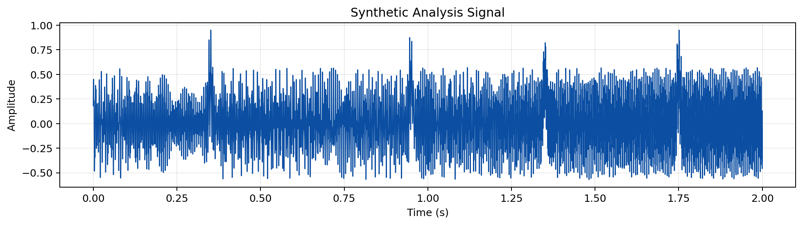
  <figcaption><strong>Figure 2-1.</strong> Signal waveform</figcaption>
</figure>
### 2) Frame/hop overlay on waveform

<figure id="figure-2-2" class="textbook-figure">
  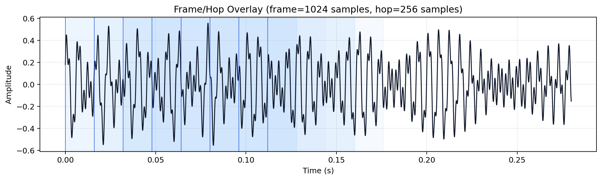
  <figcaption><strong>Figure 2-2.</strong> Frame hop overlay</figcaption>
</figure>
### 3) Window family

<figure id="figure-2-3" class="textbook-figure">
  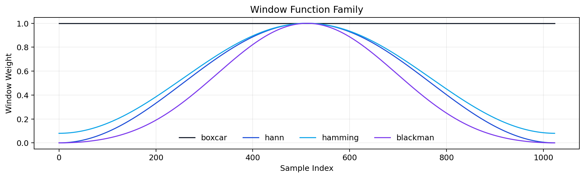
  <figcaption><strong>Figure 2-3.</strong> Window family</figcaption>
</figure>
### 4) Hann overlap-add behavior (50% overlap)

<figure id="figure-2-4" class="textbook-figure">
  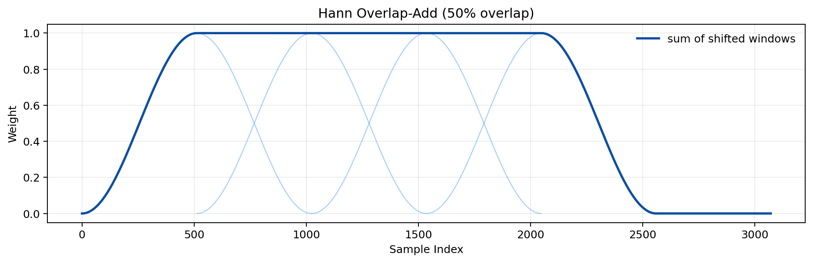
  <figcaption><strong>Figure 2-4.</strong> Overlap add</figcaption>
</figure>
### 5) Spectrogram with frame centers

<figure id="figure-2-5" class="textbook-figure">
  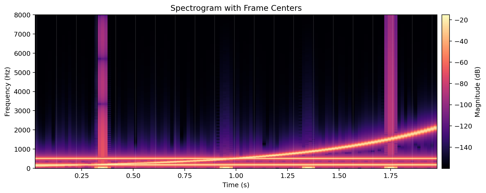
  <figcaption><strong>Figure 2-5.</strong> Spectrogram frames</figcaption>
</figure>
### 6) Spectral flux positive difference

<figure id="figure-2-6" class="textbook-figure">
  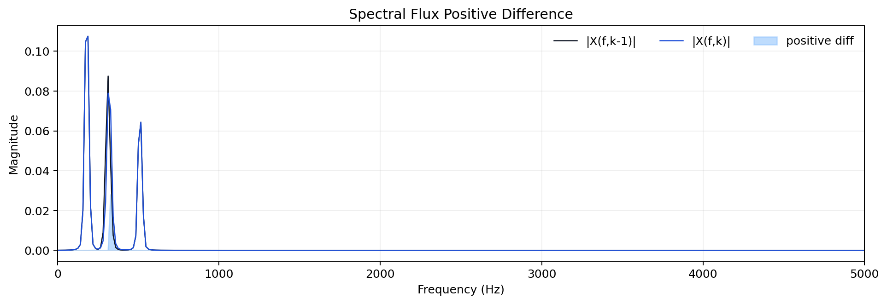
  <figcaption><strong>Figure 2-6.</strong> Spectral flux</figcaption>
</figure>
### 7) Foote checkerboard kernel

<figure id="figure-2-7" class="textbook-figure">
  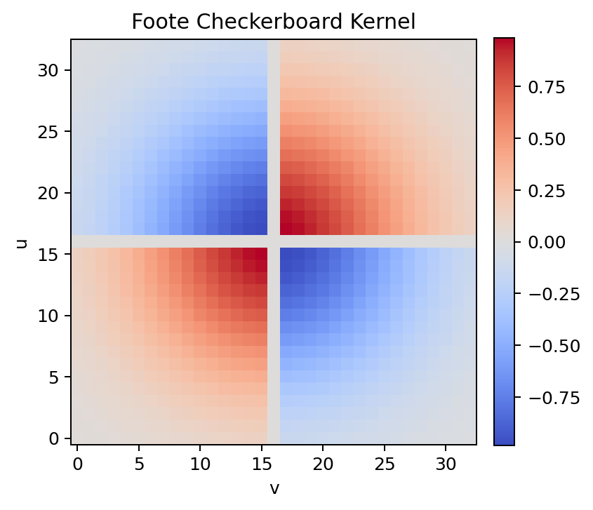
  <figcaption><strong>Figure 2-7.</strong> Checkerboard kernel</figcaption>
</figure>
### 8) Multichannel waveforms

<figure id="figure-2-8" class="textbook-figure">
  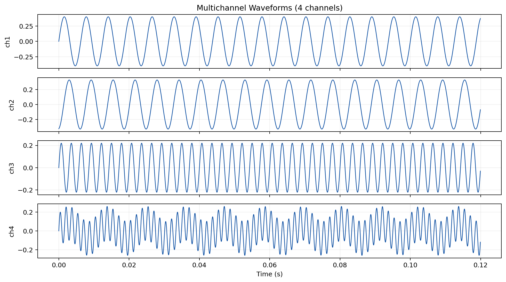
  <figcaption><strong>Figure 2-8.</strong> Multichannel waveforms</figcaption>
</figure>
### 9) FOA channel example (WXYZ)

<figure id="figure-2-9" class="textbook-figure">
  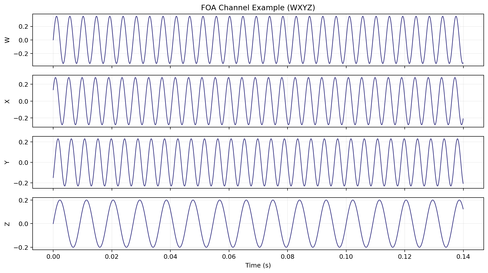
  <figcaption><strong>Figure 2-9.</strong> FOA WXYZ</figcaption>
</figure>
### 10) Chunk-vs-frame timeline

<figure id="figure-2-10" class="textbook-figure">
  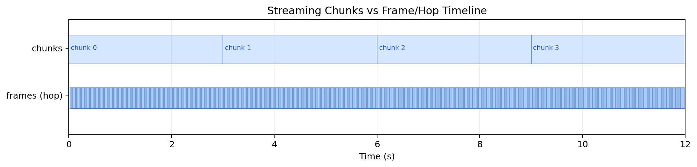
  <figcaption><strong>Figure 2-10.</strong> Chunk frame timeline</figcaption>
</figure>
## Processing relationship

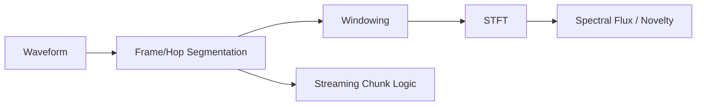

## Related Docs

- [`METRICS_REFERENCE.md`](METRICS_REFERENCE.md)
- [`NOVELTY_ANOMALY.md`](NOVELTY_ANOMALY.md)
- [`MOMENTS_EXTRACTION.md`](MOMENTS_EXTRACTION.md)
- [`GETTING_STARTED.md`](GETTING_STARTED.md)

## Extended Study Dossier

This dossier slows the chapter down on purpose. The maintained chapter above defines the software contract, formulas, commands, and citations. The pages below develop the habits that determine whether those tools produce evidence: asking a bounded question, preserving conditions, looking for failure modes, and writing a conclusion that does not outrun its data. Read one lens at a time while working with a real but manageable example.

Before the formal model below, note that it is a conceptual accounting device rather than a new metric. It states that an analytical claim depends jointly on the audio, chosen method, context, and review. Leaving one term undocumented does not make it disappear; it makes the result harder to interpret later.

$$
\mathcal{C} = \mathcal{I}(x; \theta, \kappa, \pi, r)
$$

where `C` is a bounded claim, `x` is the decoded audio, `theta` is the resolved analysis configuration, `kappa` is the recorded context such as calibration and channel metadata, `pi` is the provenance record, and `r` is the human or automated review procedure. Plain English: the same waveform can support different, equally valid statements when the question and the recorded method differ.


### The question before the command

In Chapter 2, **Signals, Frames, Windows, and Chunks**, begin with a signal whose time scale, frame boundaries, and spectral resolution must be chosen deliberately. The practical discipline for this lens is to state the decision the analysis is supposed to support before selecting a metric or option. This is not paperwork added after the signal processing is complete. It decides which result can be compared, which output deserves review, and which conclusion would be too strong. The chapter's learning objectives are to Relate frame and hop sizes to time and frequency resolution.; Explain why chunks manage memory while frames define features.; Recognize common windowing and overlap concepts in esl outputs.. For this pass, concentrate on one objective: Relate frame and hop sizes to time and frequency resolution.

Work with an example small enough to inspect from end to end. Write down the input identifier, the time interval, the channel policy, the configuration, and the expected shape of a useful result before you run the command. Then retain the unedited output and compare it with one visual or listening observation. The comparison should be literal at first: a peak at a timestamp, a changed rank, a decay slope, a missing field, or a stable block in a matrix. Literal observations are easier to audit than immediate stories about cause, quality, species, listener experience, or design success.

Next, make one controlled challenge to the first result. Change a parameter only when the chapter's method makes that change meaningful, or select a second documented interval, channel, file, or simulation variant. Ask what stayed stable, what moved, and whether the difference is larger than a plotting, framing, decoding, or calibration uncertainty. A result that changes is not automatically wrong; it may be telling you that the question has a scale, representation, or data-quality dependency that belongs in the final report.

Finally, write a two-part note. The first sentence states what the artifact shows under the recorded conditions. The second states one thing it does not establish and the next piece of evidence that would reduce that uncertainty. This habit turns every chapter into a reusable analytical protocol instead of a collection of software features. It also gives a collaborator a precise place to disagree productively: the input, configuration, interpretation, or required validation step rather than the vague claim that a number 'looks wrong.'

### The observed object

In Chapter 2, **Signals, Frames, Windows, and Chunks**, begin with a signal whose time scale, frame boundaries, and spectral resolution must be chosen deliberately. The practical discipline for this lens is to separate the decoded sample sequence from the physical scene, source, or event it may represent. This is not paperwork added after the signal processing is complete. It decides which result can be compared, which output deserves review, and which conclusion would be too strong. The chapter's learning objectives are to Relate frame and hop sizes to time and frequency resolution.; Explain why chunks manage memory while frames define features.; Recognize common windowing and overlap concepts in esl outputs.. For this pass, concentrate on one objective: Explain why chunks manage memory while frames define features.

Work with an example small enough to inspect from end to end. Write down the input identifier, the time interval, the channel policy, the configuration, and the expected shape of a useful result before you run the command. Then retain the unedited output and compare it with one visual or listening observation. The comparison should be literal at first: a peak at a timestamp, a changed rank, a decay slope, a missing field, or a stable block in a matrix. Literal observations are easier to audit than immediate stories about cause, quality, species, listener experience, or design success.

Next, make one controlled challenge to the first result. Change a parameter only when the chapter's method makes that change meaningful, or select a second documented interval, channel, file, or simulation variant. Ask what stayed stable, what moved, and whether the difference is larger than a plotting, framing, decoding, or calibration uncertainty. A result that changes is not automatically wrong; it may be telling you that the question has a scale, representation, or data-quality dependency that belongs in the final report.

Finally, write a two-part note. The first sentence states what the artifact shows under the recorded conditions. The second states one thing it does not establish and the next piece of evidence that would reduce that uncertainty. This habit turns every chapter into a reusable analytical protocol instead of a collection of software features. It also gives a collaborator a precise place to disagree productively: the input, configuration, interpretation, or required validation step rather than the vague claim that a number 'looks wrong.'

### Time scale

In Chapter 2, **Signals, Frames, Windows, and Chunks**, begin with a signal whose time scale, frame boundaries, and spectral resolution must be chosen deliberately. The practical discipline for this lens is to choose a duration, frame, hop, chunk, or review interval that matches the phenomenon under study. This is not paperwork added after the signal processing is complete. It decides which result can be compared, which output deserves review, and which conclusion would be too strong. The chapter's learning objectives are to Relate frame and hop sizes to time and frequency resolution.; Explain why chunks manage memory while frames define features.; Recognize common windowing and overlap concepts in esl outputs.. For this pass, concentrate on one objective: Recognize common windowing and overlap concepts in esl outputs.

Work with an example small enough to inspect from end to end. Write down the input identifier, the time interval, the channel policy, the configuration, and the expected shape of a useful result before you run the command. Then retain the unedited output and compare it with one visual or listening observation. The comparison should be literal at first: a peak at a timestamp, a changed rank, a decay slope, a missing field, or a stable block in a matrix. Literal observations are easier to audit than immediate stories about cause, quality, species, listener experience, or design success.

Next, make one controlled challenge to the first result. Change a parameter only when the chapter's method makes that change meaningful, or select a second documented interval, channel, file, or simulation variant. Ask what stayed stable, what moved, and whether the difference is larger than a plotting, framing, decoding, or calibration uncertainty. A result that changes is not automatically wrong; it may be telling you that the question has a scale, representation, or data-quality dependency that belongs in the final report.

Finally, write a two-part note. The first sentence states what the artifact shows under the recorded conditions. The second states one thing it does not establish and the next piece of evidence that would reduce that uncertainty. This habit turns every chapter into a reusable analytical protocol instead of a collection of software features. It also gives a collaborator a precise place to disagree productively: the input, configuration, interpretation, or required validation step rather than the vague claim that a number 'looks wrong.'

### Channel semantics

In Chapter 2, **Signals, Frames, Windows, and Chunks**, begin with a signal whose time scale, frame boundaries, and spectral resolution must be chosen deliberately. The practical discipline for this lens is to record whether the observation belongs to one channel, an aggregate, a downmix, or a spatial convention. This is not paperwork added after the signal processing is complete. It decides which result can be compared, which output deserves review, and which conclusion would be too strong. The chapter's learning objectives are to Relate frame and hop sizes to time and frequency resolution.; Explain why chunks manage memory while frames define features.; Recognize common windowing and overlap concepts in esl outputs.. For this pass, concentrate on one objective: Relate frame and hop sizes to time and frequency resolution.

Work with an example small enough to inspect from end to end. Write down the input identifier, the time interval, the channel policy, the configuration, and the expected shape of a useful result before you run the command. Then retain the unedited output and compare it with one visual or listening observation. The comparison should be literal at first: a peak at a timestamp, a changed rank, a decay slope, a missing field, or a stable block in a matrix. Literal observations are easier to audit than immediate stories about cause, quality, species, listener experience, or design success.

Next, make one controlled challenge to the first result. Change a parameter only when the chapter's method makes that change meaningful, or select a second documented interval, channel, file, or simulation variant. Ask what stayed stable, what moved, and whether the difference is larger than a plotting, framing, decoding, or calibration uncertainty. A result that changes is not automatically wrong; it may be telling you that the question has a scale, representation, or data-quality dependency that belongs in the final report.

Finally, write a two-part note. The first sentence states what the artifact shows under the recorded conditions. The second states one thing it does not establish and the next piece of evidence that would reduce that uncertainty. This habit turns every chapter into a reusable analytical protocol instead of a collection of software features. It also gives a collaborator a precise place to disagree productively: the input, configuration, interpretation, or required validation step rather than the vague claim that a number 'looks wrong.'

### Units and references

In Chapter 2, **Signals, Frames, Windows, and Chunks**, begin with a signal whose time scale, frame boundaries, and spectral resolution must be chosen deliberately. The practical discipline for this lens is to name the unit, reference quantity, calibration state, and any conversion that makes a value interpretable. This is not paperwork added after the signal processing is complete. It decides which result can be compared, which output deserves review, and which conclusion would be too strong. The chapter's learning objectives are to Relate frame and hop sizes to time and frequency resolution.; Explain why chunks manage memory while frames define features.; Recognize common windowing and overlap concepts in esl outputs.. For this pass, concentrate on one objective: Explain why chunks manage memory while frames define features.

Work with an example small enough to inspect from end to end. Write down the input identifier, the time interval, the channel policy, the configuration, and the expected shape of a useful result before you run the command. Then retain the unedited output and compare it with one visual or listening observation. The comparison should be literal at first: a peak at a timestamp, a changed rank, a decay slope, a missing field, or a stable block in a matrix. Literal observations are easier to audit than immediate stories about cause, quality, species, listener experience, or design success.

Next, make one controlled challenge to the first result. Change a parameter only when the chapter's method makes that change meaningful, or select a second documented interval, channel, file, or simulation variant. Ask what stayed stable, what moved, and whether the difference is larger than a plotting, framing, decoding, or calibration uncertainty. A result that changes is not automatically wrong; it may be telling you that the question has a scale, representation, or data-quality dependency that belongs in the final report.

Finally, write a two-part note. The first sentence states what the artifact shows under the recorded conditions. The second states one thing it does not establish and the next piece of evidence that would reduce that uncertainty. This habit turns every chapter into a reusable analytical protocol instead of a collection of software features. It also gives a collaborator a precise place to disagree productively: the input, configuration, interpretation, or required validation step rather than the vague claim that a number 'looks wrong.'

### Preprocessing as a method

In Chapter 2, **Signals, Frames, Windows, and Chunks**, begin with a signal whose time scale, frame boundaries, and spectral resolution must be chosen deliberately. The practical discipline for this lens is to treat decoding, resampling, filtering, normalization, and segmentation as visible analytical choices. This is not paperwork added after the signal processing is complete. It decides which result can be compared, which output deserves review, and which conclusion would be too strong. The chapter's learning objectives are to Relate frame and hop sizes to time and frequency resolution.; Explain why chunks manage memory while frames define features.; Recognize common windowing and overlap concepts in esl outputs.. For this pass, concentrate on one objective: Recognize common windowing and overlap concepts in esl outputs.

Work with an example small enough to inspect from end to end. Write down the input identifier, the time interval, the channel policy, the configuration, and the expected shape of a useful result before you run the command. Then retain the unedited output and compare it with one visual or listening observation. The comparison should be literal at first: a peak at a timestamp, a changed rank, a decay slope, a missing field, or a stable block in a matrix. Literal observations are easier to audit than immediate stories about cause, quality, species, listener experience, or design success.

Next, make one controlled challenge to the first result. Change a parameter only when the chapter's method makes that change meaningful, or select a second documented interval, channel, file, or simulation variant. Ask what stayed stable, what moved, and whether the difference is larger than a plotting, framing, decoding, or calibration uncertainty. A result that changes is not automatically wrong; it may be telling you that the question has a scale, representation, or data-quality dependency that belongs in the final report.

Finally, write a two-part note. The first sentence states what the artifact shows under the recorded conditions. The second states one thing it does not establish and the next piece of evidence that would reduce that uncertainty. This habit turns every chapter into a reusable analytical protocol instead of a collection of software features. It also gives a collaborator a precise place to disagree productively: the input, configuration, interpretation, or required validation step rather than the vague claim that a number 'looks wrong.'

### Parameter sensitivity

In Chapter 2, **Signals, Frames, Windows, and Chunks**, begin with a signal whose time scale, frame boundaries, and spectral resolution must be chosen deliberately. The practical discipline for this lens is to test whether a conclusion survives a reasonable change in one important parameter. This is not paperwork added after the signal processing is complete. It decides which result can be compared, which output deserves review, and which conclusion would be too strong. The chapter's learning objectives are to Relate frame and hop sizes to time and frequency resolution.; Explain why chunks manage memory while frames define features.; Recognize common windowing and overlap concepts in esl outputs.. For this pass, concentrate on one objective: Relate frame and hop sizes to time and frequency resolution.

Work with an example small enough to inspect from end to end. Write down the input identifier, the time interval, the channel policy, the configuration, and the expected shape of a useful result before you run the command. Then retain the unedited output and compare it with one visual or listening observation. The comparison should be literal at first: a peak at a timestamp, a changed rank, a decay slope, a missing field, or a stable block in a matrix. Literal observations are easier to audit than immediate stories about cause, quality, species, listener experience, or design success.

Next, make one controlled challenge to the first result. Change a parameter only when the chapter's method makes that change meaningful, or select a second documented interval, channel, file, or simulation variant. Ask what stayed stable, what moved, and whether the difference is larger than a plotting, framing, decoding, or calibration uncertainty. A result that changes is not automatically wrong; it may be telling you that the question has a scale, representation, or data-quality dependency that belongs in the final report.

Finally, write a two-part note. The first sentence states what the artifact shows under the recorded conditions. The second states one thing it does not establish and the next piece of evidence that would reduce that uncertainty. This habit turns every chapter into a reusable analytical protocol instead of a collection of software features. It also gives a collaborator a precise place to disagree productively: the input, configuration, interpretation, or required validation step rather than the vague claim that a number 'looks wrong.'

### The visual check

In Chapter 2, **Signals, Frames, Windows, and Chunks**, begin with a signal whose time scale, frame boundaries, and spectral resolution must be chosen deliberately. The practical discipline for this lens is to compare the numerical output with a plot and, when appropriate, a bounded listening review. This is not paperwork added after the signal processing is complete. It decides which result can be compared, which output deserves review, and which conclusion would be too strong. The chapter's learning objectives are to Relate frame and hop sizes to time and frequency resolution.; Explain why chunks manage memory while frames define features.; Recognize common windowing and overlap concepts in esl outputs.. For this pass, concentrate on one objective: Explain why chunks manage memory while frames define features.

Work with an example small enough to inspect from end to end. Write down the input identifier, the time interval, the channel policy, the configuration, and the expected shape of a useful result before you run the command. Then retain the unedited output and compare it with one visual or listening observation. The comparison should be literal at first: a peak at a timestamp, a changed rank, a decay slope, a missing field, or a stable block in a matrix. Literal observations are easier to audit than immediate stories about cause, quality, species, listener experience, or design success.

Next, make one controlled challenge to the first result. Change a parameter only when the chapter's method makes that change meaningful, or select a second documented interval, channel, file, or simulation variant. Ask what stayed stable, what moved, and whether the difference is larger than a plotting, framing, decoding, or calibration uncertainty. A result that changes is not automatically wrong; it may be telling you that the question has a scale, representation, or data-quality dependency that belongs in the final report.

Finally, write a two-part note. The first sentence states what the artifact shows under the recorded conditions. The second states one thing it does not establish and the next piece of evidence that would reduce that uncertainty. This habit turns every chapter into a reusable analytical protocol instead of a collection of software features. It also gives a collaborator a precise place to disagree productively: the input, configuration, interpretation, or required validation step rather than the vague claim that a number 'looks wrong.'

### The alternative explanation

In Chapter 2, **Signals, Frames, Windows, and Chunks**, begin with a signal whose time scale, frame boundaries, and spectral resolution must be chosen deliberately. The practical discipline for this lens is to identify a plausible artifact, confound, or data-quality issue that could mimic the pattern. This is not paperwork added after the signal processing is complete. It decides which result can be compared, which output deserves review, and which conclusion would be too strong. The chapter's learning objectives are to Relate frame and hop sizes to time and frequency resolution.; Explain why chunks manage memory while frames define features.; Recognize common windowing and overlap concepts in esl outputs.. For this pass, concentrate on one objective: Recognize common windowing and overlap concepts in esl outputs.

Work with an example small enough to inspect from end to end. Write down the input identifier, the time interval, the channel policy, the configuration, and the expected shape of a useful result before you run the command. Then retain the unedited output and compare it with one visual or listening observation. The comparison should be literal at first: a peak at a timestamp, a changed rank, a decay slope, a missing field, or a stable block in a matrix. Literal observations are easier to audit than immediate stories about cause, quality, species, listener experience, or design success.

Next, make one controlled challenge to the first result. Change a parameter only when the chapter's method makes that change meaningful, or select a second documented interval, channel, file, or simulation variant. Ask what stayed stable, what moved, and whether the difference is larger than a plotting, framing, decoding, or calibration uncertainty. A result that changes is not automatically wrong; it may be telling you that the question has a scale, representation, or data-quality dependency that belongs in the final report.

Finally, write a two-part note. The first sentence states what the artifact shows under the recorded conditions. The second states one thing it does not establish and the next piece of evidence that would reduce that uncertainty. This habit turns every chapter into a reusable analytical protocol instead of a collection of software features. It also gives a collaborator a precise place to disagree productively: the input, configuration, interpretation, or required validation step rather than the vague claim that a number 'looks wrong.'

### Validity and confidence

In Chapter 2, **Signals, Frames, Windows, and Chunks**, begin with a signal whose time scale, frame boundaries, and spectral resolution must be chosen deliberately. The practical discipline for this lens is to read flags, fit quality, uncertainty, and missing context before elevating a value into a claim. This is not paperwork added after the signal processing is complete. It decides which result can be compared, which output deserves review, and which conclusion would be too strong. The chapter's learning objectives are to Relate frame and hop sizes to time and frequency resolution.; Explain why chunks manage memory while frames define features.; Recognize common windowing and overlap concepts in esl outputs.. For this pass, concentrate on one objective: Relate frame and hop sizes to time and frequency resolution.

Work with an example small enough to inspect from end to end. Write down the input identifier, the time interval, the channel policy, the configuration, and the expected shape of a useful result before you run the command. Then retain the unedited output and compare it with one visual or listening observation. The comparison should be literal at first: a peak at a timestamp, a changed rank, a decay slope, a missing field, or a stable block in a matrix. Literal observations are easier to audit than immediate stories about cause, quality, species, listener experience, or design success.

Next, make one controlled challenge to the first result. Change a parameter only when the chapter's method makes that change meaningful, or select a second documented interval, channel, file, or simulation variant. Ask what stayed stable, what moved, and whether the difference is larger than a plotting, framing, decoding, or calibration uncertainty. A result that changes is not automatically wrong; it may be telling you that the question has a scale, representation, or data-quality dependency that belongs in the final report.

Finally, write a two-part note. The first sentence states what the artifact shows under the recorded conditions. The second states one thing it does not establish and the next piece of evidence that would reduce that uncertainty. This habit turns every chapter into a reusable analytical protocol instead of a collection of software features. It also gives a collaborator a precise place to disagree productively: the input, configuration, interpretation, or required validation step rather than the vague claim that a number 'looks wrong.'

### The comparison set

In Chapter 2, **Signals, Frames, Windows, and Chunks**, begin with a signal whose time scale, frame boundaries, and spectral resolution must be chosen deliberately. The practical discipline for this lens is to define what is held constant and what is allowed to differ when two results are compared. This is not paperwork added after the signal processing is complete. It decides which result can be compared, which output deserves review, and which conclusion would be too strong. The chapter's learning objectives are to Relate frame and hop sizes to time and frequency resolution.; Explain why chunks manage memory while frames define features.; Recognize common windowing and overlap concepts in esl outputs.. For this pass, concentrate on one objective: Explain why chunks manage memory while frames define features.

Work with an example small enough to inspect from end to end. Write down the input identifier, the time interval, the channel policy, the configuration, and the expected shape of a useful result before you run the command. Then retain the unedited output and compare it with one visual or listening observation. The comparison should be literal at first: a peak at a timestamp, a changed rank, a decay slope, a missing field, or a stable block in a matrix. Literal observations are easier to audit than immediate stories about cause, quality, species, listener experience, or design success.

Next, make one controlled challenge to the first result. Change a parameter only when the chapter's method makes that change meaningful, or select a second documented interval, channel, file, or simulation variant. Ask what stayed stable, what moved, and whether the difference is larger than a plotting, framing, decoding, or calibration uncertainty. A result that changes is not automatically wrong; it may be telling you that the question has a scale, representation, or data-quality dependency that belongs in the final report.

Finally, write a two-part note. The first sentence states what the artifact shows under the recorded conditions. The second states one thing it does not establish and the next piece of evidence that would reduce that uncertainty. This habit turns every chapter into a reusable analytical protocol instead of a collection of software features. It also gives a collaborator a precise place to disagree productively: the input, configuration, interpretation, or required validation step rather than the vague claim that a number 'looks wrong.'

### The audit trail

In Chapter 2, **Signals, Frames, Windows, and Chunks**, begin with a signal whose time scale, frame boundaries, and spectral resolution must be chosen deliberately. The practical discipline for this lens is to retain commands, resolved configuration, versions, inputs, and output identifiers together. This is not paperwork added after the signal processing is complete. It decides which result can be compared, which output deserves review, and which conclusion would be too strong. The chapter's learning objectives are to Relate frame and hop sizes to time and frequency resolution.; Explain why chunks manage memory while frames define features.; Recognize common windowing and overlap concepts in esl outputs.. For this pass, concentrate on one objective: Recognize common windowing and overlap concepts in esl outputs.

Work with an example small enough to inspect from end to end. Write down the input identifier, the time interval, the channel policy, the configuration, and the expected shape of a useful result before you run the command. Then retain the unedited output and compare it with one visual or listening observation. The comparison should be literal at first: a peak at a timestamp, a changed rank, a decay slope, a missing field, or a stable block in a matrix. Literal observations are easier to audit than immediate stories about cause, quality, species, listener experience, or design success.

Next, make one controlled challenge to the first result. Change a parameter only when the chapter's method makes that change meaningful, or select a second documented interval, channel, file, or simulation variant. Ask what stayed stable, what moved, and whether the difference is larger than a plotting, framing, decoding, or calibration uncertainty. A result that changes is not automatically wrong; it may be telling you that the question has a scale, representation, or data-quality dependency that belongs in the final report.

Finally, write a two-part note. The first sentence states what the artifact shows under the recorded conditions. The second states one thing it does not establish and the next piece of evidence that would reduce that uncertainty. This habit turns every chapter into a reusable analytical protocol instead of a collection of software features. It also gives a collaborator a precise place to disagree productively: the input, configuration, interpretation, or required validation step rather than the vague claim that a number 'looks wrong.'

### The human review loop

In Chapter 2, **Signals, Frames, Windows, and Chunks**, begin with a signal whose time scale, frame boundaries, and spectral resolution must be chosen deliberately. The practical discipline for this lens is to give a listener, analyst, or domain expert a concrete artifact and a stated question to inspect. This is not paperwork added after the signal processing is complete. It decides which result can be compared, which output deserves review, and which conclusion would be too strong. The chapter's learning objectives are to Relate frame and hop sizes to time and frequency resolution.; Explain why chunks manage memory while frames define features.; Recognize common windowing and overlap concepts in esl outputs.. For this pass, concentrate on one objective: Relate frame and hop sizes to time and frequency resolution.

Work with an example small enough to inspect from end to end. Write down the input identifier, the time interval, the channel policy, the configuration, and the expected shape of a useful result before you run the command. Then retain the unedited output and compare it with one visual or listening observation. The comparison should be literal at first: a peak at a timestamp, a changed rank, a decay slope, a missing field, or a stable block in a matrix. Literal observations are easier to audit than immediate stories about cause, quality, species, listener experience, or design success.

Next, make one controlled challenge to the first result. Change a parameter only when the chapter's method makes that change meaningful, or select a second documented interval, channel, file, or simulation variant. Ask what stayed stable, what moved, and whether the difference is larger than a plotting, framing, decoding, or calibration uncertainty. A result that changes is not automatically wrong; it may be telling you that the question has a scale, representation, or data-quality dependency that belongs in the final report.

Finally, write a two-part note. The first sentence states what the artifact shows under the recorded conditions. The second states one thing it does not establish and the next piece of evidence that would reduce that uncertainty. This habit turns every chapter into a reusable analytical protocol instead of a collection of software features. It also gives a collaborator a precise place to disagree productively: the input, configuration, interpretation, or required validation step rather than the vague claim that a number 'looks wrong.'

### Scale and cost

In Chapter 2, **Signals, Frames, Windows, and Chunks**, begin with a signal whose time scale, frame boundaries, and spectral resolution must be chosen deliberately. The practical discipline for this lens is to estimate memory, storage, runtime, and review burden before committing to a large workflow. This is not paperwork added after the signal processing is complete. It decides which result can be compared, which output deserves review, and which conclusion would be too strong. The chapter's learning objectives are to Relate frame and hop sizes to time and frequency resolution.; Explain why chunks manage memory while frames define features.; Recognize common windowing and overlap concepts in esl outputs.. For this pass, concentrate on one objective: Explain why chunks manage memory while frames define features.

Work with an example small enough to inspect from end to end. Write down the input identifier, the time interval, the channel policy, the configuration, and the expected shape of a useful result before you run the command. Then retain the unedited output and compare it with one visual or listening observation. The comparison should be literal at first: a peak at a timestamp, a changed rank, a decay slope, a missing field, or a stable block in a matrix. Literal observations are easier to audit than immediate stories about cause, quality, species, listener experience, or design success.

Next, make one controlled challenge to the first result. Change a parameter only when the chapter's method makes that change meaningful, or select a second documented interval, channel, file, or simulation variant. Ask what stayed stable, what moved, and whether the difference is larger than a plotting, framing, decoding, or calibration uncertainty. A result that changes is not automatically wrong; it may be telling you that the question has a scale, representation, or data-quality dependency that belongs in the final report.

Finally, write a two-part note. The first sentence states what the artifact shows under the recorded conditions. The second states one thing it does not establish and the next piece of evidence that would reduce that uncertainty. This habit turns every chapter into a reusable analytical protocol instead of a collection of software features. It also gives a collaborator a precise place to disagree productively: the input, configuration, interpretation, or required validation step rather than the vague claim that a number 'looks wrong.'

### Interoperability

In Chapter 2, **Signals, Frames, Windows, and Chunks**, begin with a signal whose time scale, frame boundaries, and spectral resolution must be chosen deliberately. The practical discipline for this lens is to preserve enough schema, metadata, and naming information for a handoff to another tool or collaborator. This is not paperwork added after the signal processing is complete. It decides which result can be compared, which output deserves review, and which conclusion would be too strong. The chapter's learning objectives are to Relate frame and hop sizes to time and frequency resolution.; Explain why chunks manage memory while frames define features.; Recognize common windowing and overlap concepts in esl outputs.. For this pass, concentrate on one objective: Recognize common windowing and overlap concepts in esl outputs.

Work with an example small enough to inspect from end to end. Write down the input identifier, the time interval, the channel policy, the configuration, and the expected shape of a useful result before you run the command. Then retain the unedited output and compare it with one visual or listening observation. The comparison should be literal at first: a peak at a timestamp, a changed rank, a decay slope, a missing field, or a stable block in a matrix. Literal observations are easier to audit than immediate stories about cause, quality, species, listener experience, or design success.

Next, make one controlled challenge to the first result. Change a parameter only when the chapter's method makes that change meaningful, or select a second documented interval, channel, file, or simulation variant. Ask what stayed stable, what moved, and whether the difference is larger than a plotting, framing, decoding, or calibration uncertainty. A result that changes is not automatically wrong; it may be telling you that the question has a scale, representation, or data-quality dependency that belongs in the final report.

Finally, write a two-part note. The first sentence states what the artifact shows under the recorded conditions. The second states one thing it does not establish and the next piece of evidence that would reduce that uncertainty. This habit turns every chapter into a reusable analytical protocol instead of a collection of software features. It also gives a collaborator a precise place to disagree productively: the input, configuration, interpretation, or required validation step rather than the vague claim that a number 'looks wrong.'

### Ethics and access

In Chapter 2, **Signals, Frames, Windows, and Chunks**, begin with a signal whose time scale, frame boundaries, and spectral resolution must be chosen deliberately. The practical discipline for this lens is to consider permissions, sensitive locations, speech, cultural material, and the difference between analysis and surveillance. This is not paperwork added after the signal processing is complete. It decides which result can be compared, which output deserves review, and which conclusion would be too strong. The chapter's learning objectives are to Relate frame and hop sizes to time and frequency resolution.; Explain why chunks manage memory while frames define features.; Recognize common windowing and overlap concepts in esl outputs.. For this pass, concentrate on one objective: Relate frame and hop sizes to time and frequency resolution.

Work with an example small enough to inspect from end to end. Write down the input identifier, the time interval, the channel policy, the configuration, and the expected shape of a useful result before you run the command. Then retain the unedited output and compare it with one visual or listening observation. The comparison should be literal at first: a peak at a timestamp, a changed rank, a decay slope, a missing field, or a stable block in a matrix. Literal observations are easier to audit than immediate stories about cause, quality, species, listener experience, or design success.

Next, make one controlled challenge to the first result. Change a parameter only when the chapter's method makes that change meaningful, or select a second documented interval, channel, file, or simulation variant. Ask what stayed stable, what moved, and whether the difference is larger than a plotting, framing, decoding, or calibration uncertainty. A result that changes is not automatically wrong; it may be telling you that the question has a scale, representation, or data-quality dependency that belongs in the final report.

Finally, write a two-part note. The first sentence states what the artifact shows under the recorded conditions. The second states one thing it does not establish and the next piece of evidence that would reduce that uncertainty. This habit turns every chapter into a reusable analytical protocol instead of a collection of software features. It also gives a collaborator a precise place to disagree productively: the input, configuration, interpretation, or required validation step rather than the vague claim that a number 'looks wrong.'

### Failure as evidence

In Chapter 2, **Signals, Frames, Windows, and Chunks**, begin with a signal whose time scale, frame boundaries, and spectral resolution must be chosen deliberately. The practical discipline for this lens is to keep a failed decode, invalid fit, clipped channel, or unexpected rank when it teaches something about the method. This is not paperwork added after the signal processing is complete. It decides which result can be compared, which output deserves review, and which conclusion would be too strong. The chapter's learning objectives are to Relate frame and hop sizes to time and frequency resolution.; Explain why chunks manage memory while frames define features.; Recognize common windowing and overlap concepts in esl outputs.. For this pass, concentrate on one objective: Explain why chunks manage memory while frames define features.

Work with an example small enough to inspect from end to end. Write down the input identifier, the time interval, the channel policy, the configuration, and the expected shape of a useful result before you run the command. Then retain the unedited output and compare it with one visual or listening observation. The comparison should be literal at first: a peak at a timestamp, a changed rank, a decay slope, a missing field, or a stable block in a matrix. Literal observations are easier to audit than immediate stories about cause, quality, species, listener experience, or design success.

Next, make one controlled challenge to the first result. Change a parameter only when the chapter's method makes that change meaningful, or select a second documented interval, channel, file, or simulation variant. Ask what stayed stable, what moved, and whether the difference is larger than a plotting, framing, decoding, or calibration uncertainty. A result that changes is not automatically wrong; it may be telling you that the question has a scale, representation, or data-quality dependency that belongs in the final report.

Finally, write a two-part note. The first sentence states what the artifact shows under the recorded conditions. The second states one thing it does not establish and the next piece of evidence that would reduce that uncertainty. This habit turns every chapter into a reusable analytical protocol instead of a collection of software features. It also gives a collaborator a precise place to disagree productively: the input, configuration, interpretation, or required validation step rather than the vague claim that a number 'looks wrong.'

### A bounded conclusion

In Chapter 2, **Signals, Frames, Windows, and Chunks**, begin with a signal whose time scale, frame boundaries, and spectral resolution must be chosen deliberately. The practical discipline for this lens is to write the smallest claim that the observed artifact, method record, and review actually support. This is not paperwork added after the signal processing is complete. It decides which result can be compared, which output deserves review, and which conclusion would be too strong. The chapter's learning objectives are to Relate frame and hop sizes to time and frequency resolution.; Explain why chunks manage memory while frames define features.; Recognize common windowing and overlap concepts in esl outputs.. For this pass, concentrate on one objective: Recognize common windowing and overlap concepts in esl outputs.

Work with an example small enough to inspect from end to end. Write down the input identifier, the time interval, the channel policy, the configuration, and the expected shape of a useful result before you run the command. Then retain the unedited output and compare it with one visual or listening observation. The comparison should be literal at first: a peak at a timestamp, a changed rank, a decay slope, a missing field, or a stable block in a matrix. Literal observations are easier to audit than immediate stories about cause, quality, species, listener experience, or design success.

Next, make one controlled challenge to the first result. Change a parameter only when the chapter's method makes that change meaningful, or select a second documented interval, channel, file, or simulation variant. Ask what stayed stable, what moved, and whether the difference is larger than a plotting, framing, decoding, or calibration uncertainty. A result that changes is not automatically wrong; it may be telling you that the question has a scale, representation, or data-quality dependency that belongs in the final report.

Finally, write a two-part note. The first sentence states what the artifact shows under the recorded conditions. The second states one thing it does not establish and the next piece of evidence that would reduce that uncertainty. This habit turns every chapter into a reusable analytical protocol instead of a collection of software features. It also gives a collaborator a precise place to disagree productively: the input, configuration, interpretation, or required validation step rather than the vague claim that a number 'looks wrong.'

### Replication

In Chapter 2, **Signals, Frames, Windows, and Chunks**, begin with a signal whose time scale, frame boundaries, and spectral resolution must be chosen deliberately. The practical discipline for this lens is to make a second run possible without relying on memory, undocumented defaults, or a private graphical state. This is not paperwork added after the signal processing is complete. It decides which result can be compared, which output deserves review, and which conclusion would be too strong. The chapter's learning objectives are to Relate frame and hop sizes to time and frequency resolution.; Explain why chunks manage memory while frames define features.; Recognize common windowing and overlap concepts in esl outputs.. For this pass, concentrate on one objective: Relate frame and hop sizes to time and frequency resolution.

Work with an example small enough to inspect from end to end. Write down the input identifier, the time interval, the channel policy, the configuration, and the expected shape of a useful result before you run the command. Then retain the unedited output and compare it with one visual or listening observation. The comparison should be literal at first: a peak at a timestamp, a changed rank, a decay slope, a missing field, or a stable block in a matrix. Literal observations are easier to audit than immediate stories about cause, quality, species, listener experience, or design success.

Next, make one controlled challenge to the first result. Change a parameter only when the chapter's method makes that change meaningful, or select a second documented interval, channel, file, or simulation variant. Ask what stayed stable, what moved, and whether the difference is larger than a plotting, framing, decoding, or calibration uncertainty. A result that changes is not automatically wrong; it may be telling you that the question has a scale, representation, or data-quality dependency that belongs in the final report.

Finally, write a two-part note. The first sentence states what the artifact shows under the recorded conditions. The second states one thing it does not establish and the next piece of evidence that would reduce that uncertainty. This habit turns every chapter into a reusable analytical protocol instead of a collection of software features. It also gives a collaborator a precise place to disagree productively: the input, configuration, interpretation, or required validation step rather than the vague claim that a number 'looks wrong.'

### The next measurement

In Chapter 2, **Signals, Frames, Windows, and Chunks**, begin with a signal whose time scale, frame boundaries, and spectral resolution must be chosen deliberately. The practical discipline for this lens is to turn remaining uncertainty into a practical follow-up recording, calibration check, annotation, or comparison. This is not paperwork added after the signal processing is complete. It decides which result can be compared, which output deserves review, and which conclusion would be too strong. The chapter's learning objectives are to Relate frame and hop sizes to time and frequency resolution.; Explain why chunks manage memory while frames define features.; Recognize common windowing and overlap concepts in esl outputs.. For this pass, concentrate on one objective: Explain why chunks manage memory while frames define features.

Work with an example small enough to inspect from end to end. Write down the input identifier, the time interval, the channel policy, the configuration, and the expected shape of a useful result before you run the command. Then retain the unedited output and compare it with one visual or listening observation. The comparison should be literal at first: a peak at a timestamp, a changed rank, a decay slope, a missing field, or a stable block in a matrix. Literal observations are easier to audit than immediate stories about cause, quality, species, listener experience, or design success.

Next, make one controlled challenge to the first result. Change a parameter only when the chapter's method makes that change meaningful, or select a second documented interval, channel, file, or simulation variant. Ask what stayed stable, what moved, and whether the difference is larger than a plotting, framing, decoding, or calibration uncertainty. A result that changes is not automatically wrong; it may be telling you that the question has a scale, representation, or data-quality dependency that belongs in the final report.

Finally, write a two-part note. The first sentence states what the artifact shows under the recorded conditions. The second states one thing it does not establish and the next piece of evidence that would reduce that uncertainty. This habit turns every chapter into a reusable analytical protocol instead of a collection of software features. It also gives a collaborator a precise place to disagree productively: the input, configuration, interpretation, or required validation step rather than the vague claim that a number 'looks wrong.'

### Stakeholders and use

In Chapter 2, **Signals, Frames, Windows, and Chunks**, begin with a signal whose time scale, frame boundaries, and spectral resolution must be chosen deliberately. The practical discipline for this lens is to identify who will act on the result and what decision, design, or research question it is meant to inform. This is not paperwork added after the signal processing is complete. It decides which result can be compared, which output deserves review, and which conclusion would be too strong. The chapter's learning objectives are to Relate frame and hop sizes to time and frequency resolution.; Explain why chunks manage memory while frames define features.; Recognize common windowing and overlap concepts in esl outputs.. For this pass, concentrate on one objective: Recognize common windowing and overlap concepts in esl outputs.

Work with an example small enough to inspect from end to end. Write down the input identifier, the time interval, the channel policy, the configuration, and the expected shape of a useful result before you run the command. Then retain the unedited output and compare it with one visual or listening observation. The comparison should be literal at first: a peak at a timestamp, a changed rank, a decay slope, a missing field, or a stable block in a matrix. Literal observations are easier to audit than immediate stories about cause, quality, species, listener experience, or design success.

Next, make one controlled challenge to the first result. Change a parameter only when the chapter's method makes that change meaningful, or select a second documented interval, channel, file, or simulation variant. Ask what stayed stable, what moved, and whether the difference is larger than a plotting, framing, decoding, or calibration uncertainty. A result that changes is not automatically wrong; it may be telling you that the question has a scale, representation, or data-quality dependency that belongs in the final report.

Finally, write a two-part note. The first sentence states what the artifact shows under the recorded conditions. The second states one thing it does not establish and the next piece of evidence that would reduce that uncertainty. This habit turns every chapter into a reusable analytical protocol instead of a collection of software features. It also gives a collaborator a precise place to disagree productively: the input, configuration, interpretation, or required validation step rather than the vague claim that a number 'looks wrong.'

### Acoustic scene versus recording

In Chapter 2, **Signals, Frames, Windows, and Chunks**, begin with a signal whose time scale, frame boundaries, and spectral resolution must be chosen deliberately. The practical discipline for this lens is to separate properties of the measured waveform from inferences about a place, source, listener, or system. This is not paperwork added after the signal processing is complete. It decides which result can be compared, which output deserves review, and which conclusion would be too strong. The chapter's learning objectives are to Relate frame and hop sizes to time and frequency resolution.; Explain why chunks manage memory while frames define features.; Recognize common windowing and overlap concepts in esl outputs.. For this pass, concentrate on one objective: Relate frame and hop sizes to time and frequency resolution.

Work with an example small enough to inspect from end to end. Write down the input identifier, the time interval, the channel policy, the configuration, and the expected shape of a useful result before you run the command. Then retain the unedited output and compare it with one visual or listening observation. The comparison should be literal at first: a peak at a timestamp, a changed rank, a decay slope, a missing field, or a stable block in a matrix. Literal observations are easier to audit than immediate stories about cause, quality, species, listener experience, or design success.

Next, make one controlled challenge to the first result. Change a parameter only when the chapter's method makes that change meaningful, or select a second documented interval, channel, file, or simulation variant. Ask what stayed stable, what moved, and whether the difference is larger than a plotting, framing, decoding, or calibration uncertainty. A result that changes is not automatically wrong; it may be telling you that the question has a scale, representation, or data-quality dependency that belongs in the final report.

Finally, write a two-part note. The first sentence states what the artifact shows under the recorded conditions. The second states one thing it does not establish and the next piece of evidence that would reduce that uncertainty. This habit turns every chapter into a reusable analytical protocol instead of a collection of software features. It also gives a collaborator a precise place to disagree productively: the input, configuration, interpretation, or required validation step rather than the vague claim that a number 'looks wrong.'

### Instrumentation boundary

In Chapter 2, **Signals, Frames, Windows, and Chunks**, begin with a signal whose time scale, frame boundaries, and spectral resolution must be chosen deliberately. The practical discipline for this lens is to document microphone, recorder, placement, gain, timing, and deployment facts that software cannot infer. This is not paperwork added after the signal processing is complete. It decides which result can be compared, which output deserves review, and which conclusion would be too strong. The chapter's learning objectives are to Relate frame and hop sizes to time and frequency resolution.; Explain why chunks manage memory while frames define features.; Recognize common windowing and overlap concepts in esl outputs.. For this pass, concentrate on one objective: Explain why chunks manage memory while frames define features.

Work with an example small enough to inspect from end to end. Write down the input identifier, the time interval, the channel policy, the configuration, and the expected shape of a useful result before you run the command. Then retain the unedited output and compare it with one visual or listening observation. The comparison should be literal at first: a peak at a timestamp, a changed rank, a decay slope, a missing field, or a stable block in a matrix. Literal observations are easier to audit than immediate stories about cause, quality, species, listener experience, or design success.

Next, make one controlled challenge to the first result. Change a parameter only when the chapter's method makes that change meaningful, or select a second documented interval, channel, file, or simulation variant. Ask what stayed stable, what moved, and whether the difference is larger than a plotting, framing, decoding, or calibration uncertainty. A result that changes is not automatically wrong; it may be telling you that the question has a scale, representation, or data-quality dependency that belongs in the final report.

Finally, write a two-part note. The first sentence states what the artifact shows under the recorded conditions. The second states one thing it does not establish and the next piece of evidence that would reduce that uncertainty. This habit turns every chapter into a reusable analytical protocol instead of a collection of software features. It also gives a collaborator a precise place to disagree productively: the input, configuration, interpretation, or required validation step rather than the vague claim that a number 'looks wrong.'

### Reference baseline

In Chapter 2, **Signals, Frames, Windows, and Chunks**, begin with a signal whose time scale, frame boundaries, and spectral resolution must be chosen deliberately. The practical discipline for this lens is to define a known interval, fixture, variant, or population against which change or similarity is judged. This is not paperwork added after the signal processing is complete. It decides which result can be compared, which output deserves review, and which conclusion would be too strong. The chapter's learning objectives are to Relate frame and hop sizes to time and frequency resolution.; Explain why chunks manage memory while frames define features.; Recognize common windowing and overlap concepts in esl outputs.. For this pass, concentrate on one objective: Recognize common windowing and overlap concepts in esl outputs.

Work with an example small enough to inspect from end to end. Write down the input identifier, the time interval, the channel policy, the configuration, and the expected shape of a useful result before you run the command. Then retain the unedited output and compare it with one visual or listening observation. The comparison should be literal at first: a peak at a timestamp, a changed rank, a decay slope, a missing field, or a stable block in a matrix. Literal observations are easier to audit than immediate stories about cause, quality, species, listener experience, or design success.

Next, make one controlled challenge to the first result. Change a parameter only when the chapter's method makes that change meaningful, or select a second documented interval, channel, file, or simulation variant. Ask what stayed stable, what moved, and whether the difference is larger than a plotting, framing, decoding, or calibration uncertainty. A result that changes is not automatically wrong; it may be telling you that the question has a scale, representation, or data-quality dependency that belongs in the final report.

Finally, write a two-part note. The first sentence states what the artifact shows under the recorded conditions. The second states one thing it does not establish and the next piece of evidence that would reduce that uncertainty. This habit turns every chapter into a reusable analytical protocol instead of a collection of software features. It also gives a collaborator a precise place to disagree productively: the input, configuration, interpretation, or required validation step rather than the vague claim that a number 'looks wrong.'

### Sampling and selection

In Chapter 2, **Signals, Frames, Windows, and Chunks**, begin with a signal whose time scale, frame boundaries, and spectral resolution must be chosen deliberately. The practical discipline for this lens is to record how the chosen files or intervals entered the analysis and which material was excluded. This is not paperwork added after the signal processing is complete. It decides which result can be compared, which output deserves review, and which conclusion would be too strong. The chapter's learning objectives are to Relate frame and hop sizes to time and frequency resolution.; Explain why chunks manage memory while frames define features.; Recognize common windowing and overlap concepts in esl outputs.. For this pass, concentrate on one objective: Relate frame and hop sizes to time and frequency resolution.

Work with an example small enough to inspect from end to end. Write down the input identifier, the time interval, the channel policy, the configuration, and the expected shape of a useful result before you run the command. Then retain the unedited output and compare it with one visual or listening observation. The comparison should be literal at first: a peak at a timestamp, a changed rank, a decay slope, a missing field, or a stable block in a matrix. Literal observations are easier to audit than immediate stories about cause, quality, species, listener experience, or design success.

Next, make one controlled challenge to the first result. Change a parameter only when the chapter's method makes that change meaningful, or select a second documented interval, channel, file, or simulation variant. Ask what stayed stable, what moved, and whether the difference is larger than a plotting, framing, decoding, or calibration uncertainty. A result that changes is not automatically wrong; it may be telling you that the question has a scale, representation, or data-quality dependency that belongs in the final report.

Finally, write a two-part note. The first sentence states what the artifact shows under the recorded conditions. The second states one thing it does not establish and the next piece of evidence that would reduce that uncertainty. This habit turns every chapter into a reusable analytical protocol instead of a collection of software features. It also gives a collaborator a precise place to disagree productively: the input, configuration, interpretation, or required validation step rather than the vague claim that a number 'looks wrong.'

### Feature representation

In Chapter 2, **Signals, Frames, Windows, and Chunks**, begin with a signal whose time scale, frame boundaries, and spectral resolution must be chosen deliberately. The practical discipline for this lens is to explain what the selected representation emphasizes, compresses, or ignores before interpreting a score. This is not paperwork added after the signal processing is complete. It decides which result can be compared, which output deserves review, and which conclusion would be too strong. The chapter's learning objectives are to Relate frame and hop sizes to time and frequency resolution.; Explain why chunks manage memory while frames define features.; Recognize common windowing and overlap concepts in esl outputs.. For this pass, concentrate on one objective: Explain why chunks manage memory while frames define features.

Work with an example small enough to inspect from end to end. Write down the input identifier, the time interval, the channel policy, the configuration, and the expected shape of a useful result before you run the command. Then retain the unedited output and compare it with one visual or listening observation. The comparison should be literal at first: a peak at a timestamp, a changed rank, a decay slope, a missing field, or a stable block in a matrix. Literal observations are easier to audit than immediate stories about cause, quality, species, listener experience, or design success.

Next, make one controlled challenge to the first result. Change a parameter only when the chapter's method makes that change meaningful, or select a second documented interval, channel, file, or simulation variant. Ask what stayed stable, what moved, and whether the difference is larger than a plotting, framing, decoding, or calibration uncertainty. A result that changes is not automatically wrong; it may be telling you that the question has a scale, representation, or data-quality dependency that belongs in the final report.

Finally, write a two-part note. The first sentence states what the artifact shows under the recorded conditions. The second states one thing it does not establish and the next piece of evidence that would reduce that uncertainty. This habit turns every chapter into a reusable analytical protocol instead of a collection of software features. It also gives a collaborator a precise place to disagree productively: the input, configuration, interpretation, or required validation step rather than the vague claim that a number 'looks wrong.'

### Normalization policy

In Chapter 2, **Signals, Frames, Windows, and Chunks**, begin with a signal whose time scale, frame boundaries, and spectral resolution must be chosen deliberately. The practical discipline for this lens is to state whether values are normalized across frames, channels, files, or a corpus and how that changes comparison. This is not paperwork added after the signal processing is complete. It decides which result can be compared, which output deserves review, and which conclusion would be too strong. The chapter's learning objectives are to Relate frame and hop sizes to time and frequency resolution.; Explain why chunks manage memory while frames define features.; Recognize common windowing and overlap concepts in esl outputs.. For this pass, concentrate on one objective: Recognize common windowing and overlap concepts in esl outputs.

Work with an example small enough to inspect from end to end. Write down the input identifier, the time interval, the channel policy, the configuration, and the expected shape of a useful result before you run the command. Then retain the unedited output and compare it with one visual or listening observation. The comparison should be literal at first: a peak at a timestamp, a changed rank, a decay slope, a missing field, or a stable block in a matrix. Literal observations are easier to audit than immediate stories about cause, quality, species, listener experience, or design success.

Next, make one controlled challenge to the first result. Change a parameter only when the chapter's method makes that change meaningful, or select a second documented interval, channel, file, or simulation variant. Ask what stayed stable, what moved, and whether the difference is larger than a plotting, framing, decoding, or calibration uncertainty. A result that changes is not automatically wrong; it may be telling you that the question has a scale, representation, or data-quality dependency that belongs in the final report.

Finally, write a two-part note. The first sentence states what the artifact shows under the recorded conditions. The second states one thing it does not establish and the next piece of evidence that would reduce that uncertainty. This habit turns every chapter into a reusable analytical protocol instead of a collection of software features. It also gives a collaborator a precise place to disagree productively: the input, configuration, interpretation, or required validation step rather than the vague claim that a number 'looks wrong.'

### Aggregation hierarchy

In Chapter 2, **Signals, Frames, Windows, and Chunks**, begin with a signal whose time scale, frame boundaries, and spectral resolution must be chosen deliberately. The practical discipline for this lens is to track the path from samples to frames, clips, channels, shards, days, or projects without losing level of meaning. This is not paperwork added after the signal processing is complete. It decides which result can be compared, which output deserves review, and which conclusion would be too strong. The chapter's learning objectives are to Relate frame and hop sizes to time and frequency resolution.; Explain why chunks manage memory while frames define features.; Recognize common windowing and overlap concepts in esl outputs.. For this pass, concentrate on one objective: Relate frame and hop sizes to time and frequency resolution.

Work with an example small enough to inspect from end to end. Write down the input identifier, the time interval, the channel policy, the configuration, and the expected shape of a useful result before you run the command. Then retain the unedited output and compare it with one visual or listening observation. The comparison should be literal at first: a peak at a timestamp, a changed rank, a decay slope, a missing field, or a stable block in a matrix. Literal observations are easier to audit than immediate stories about cause, quality, species, listener experience, or design success.

Next, make one controlled challenge to the first result. Change a parameter only when the chapter's method makes that change meaningful, or select a second documented interval, channel, file, or simulation variant. Ask what stayed stable, what moved, and whether the difference is larger than a plotting, framing, decoding, or calibration uncertainty. A result that changes is not automatically wrong; it may be telling you that the question has a scale, representation, or data-quality dependency that belongs in the final report.

Finally, write a two-part note. The first sentence states what the artifact shows under the recorded conditions. The second states one thing it does not establish and the next piece of evidence that would reduce that uncertainty. This habit turns every chapter into a reusable analytical protocol instead of a collection of software features. It also gives a collaborator a precise place to disagree productively: the input, configuration, interpretation, or required validation step rather than the vague claim that a number 'looks wrong.'

### Thresholds and ranking

In Chapter 2, **Signals, Frames, Windows, and Chunks**, begin with a signal whose time scale, frame boundaries, and spectral resolution must be chosen deliberately. The practical discipline for this lens is to treat cutoffs, peaks, top-k lists, and exclusion rules as declared decision policies rather than discoveries. This is not paperwork added after the signal processing is complete. It decides which result can be compared, which output deserves review, and which conclusion would be too strong. The chapter's learning objectives are to Relate frame and hop sizes to time and frequency resolution.; Explain why chunks manage memory while frames define features.; Recognize common windowing and overlap concepts in esl outputs.. For this pass, concentrate on one objective: Explain why chunks manage memory while frames define features.

Work with an example small enough to inspect from end to end. Write down the input identifier, the time interval, the channel policy, the configuration, and the expected shape of a useful result before you run the command. Then retain the unedited output and compare it with one visual or listening observation. The comparison should be literal at first: a peak at a timestamp, a changed rank, a decay slope, a missing field, or a stable block in a matrix. Literal observations are easier to audit than immediate stories about cause, quality, species, listener experience, or design success.

Next, make one controlled challenge to the first result. Change a parameter only when the chapter's method makes that change meaningful, or select a second documented interval, channel, file, or simulation variant. Ask what stayed stable, what moved, and whether the difference is larger than a plotting, framing, decoding, or calibration uncertainty. A result that changes is not automatically wrong; it may be telling you that the question has a scale, representation, or data-quality dependency that belongs in the final report.

Finally, write a two-part note. The first sentence states what the artifact shows under the recorded conditions. The second states one thing it does not establish and the next piece of evidence that would reduce that uncertainty. This habit turns every chapter into a reusable analytical protocol instead of a collection of software features. It also gives a collaborator a precise place to disagree productively: the input, configuration, interpretation, or required validation step rather than the vague claim that a number 'looks wrong.'

### Missingness and gaps

In Chapter 2, **Signals, Frames, Windows, and Chunks**, begin with a signal whose time scale, frame boundaries, and spectral resolution must be chosen deliberately. The practical discipline for this lens is to preserve absent channels, incomplete files, clock gaps, decode failures, and unavailable calibration as information. This is not paperwork added after the signal processing is complete. It decides which result can be compared, which output deserves review, and which conclusion would be too strong. The chapter's learning objectives are to Relate frame and hop sizes to time and frequency resolution.; Explain why chunks manage memory while frames define features.; Recognize common windowing and overlap concepts in esl outputs.. For this pass, concentrate on one objective: Recognize common windowing and overlap concepts in esl outputs.

Work with an example small enough to inspect from end to end. Write down the input identifier, the time interval, the channel policy, the configuration, and the expected shape of a useful result before you run the command. Then retain the unedited output and compare it with one visual or listening observation. The comparison should be literal at first: a peak at a timestamp, a changed rank, a decay slope, a missing field, or a stable block in a matrix. Literal observations are easier to audit than immediate stories about cause, quality, species, listener experience, or design success.

Next, make one controlled challenge to the first result. Change a parameter only when the chapter's method makes that change meaningful, or select a second documented interval, channel, file, or simulation variant. Ask what stayed stable, what moved, and whether the difference is larger than a plotting, framing, decoding, or calibration uncertainty. A result that changes is not automatically wrong; it may be telling you that the question has a scale, representation, or data-quality dependency that belongs in the final report.

Finally, write a two-part note. The first sentence states what the artifact shows under the recorded conditions. The second states one thing it does not establish and the next piece of evidence that would reduce that uncertainty. This habit turns every chapter into a reusable analytical protocol instead of a collection of software features. It also gives a collaborator a precise place to disagree productively: the input, configuration, interpretation, or required validation step rather than the vague claim that a number 'looks wrong.'

### Outliers and rare events

In Chapter 2, **Signals, Frames, Windows, and Chunks**, begin with a signal whose time scale, frame boundaries, and spectral resolution must be chosen deliberately. The practical discipline for this lens is to distinguish a valuable rare observation from a transient artifact, configuration change, or data-entry mistake. This is not paperwork added after the signal processing is complete. It decides which result can be compared, which output deserves review, and which conclusion would be too strong. The chapter's learning objectives are to Relate frame and hop sizes to time and frequency resolution.; Explain why chunks manage memory while frames define features.; Recognize common windowing and overlap concepts in esl outputs.. For this pass, concentrate on one objective: Relate frame and hop sizes to time and frequency resolution.

Work with an example small enough to inspect from end to end. Write down the input identifier, the time interval, the channel policy, the configuration, and the expected shape of a useful result before you run the command. Then retain the unedited output and compare it with one visual or listening observation. The comparison should be literal at first: a peak at a timestamp, a changed rank, a decay slope, a missing field, or a stable block in a matrix. Literal observations are easier to audit than immediate stories about cause, quality, species, listener experience, or design success.

Next, make one controlled challenge to the first result. Change a parameter only when the chapter's method makes that change meaningful, or select a second documented interval, channel, file, or simulation variant. Ask what stayed stable, what moved, and whether the difference is larger than a plotting, framing, decoding, or calibration uncertainty. A result that changes is not automatically wrong; it may be telling you that the question has a scale, representation, or data-quality dependency that belongs in the final report.

Finally, write a two-part note. The first sentence states what the artifact shows under the recorded conditions. The second states one thing it does not establish and the next piece of evidence that would reduce that uncertainty. This habit turns every chapter into a reusable analytical protocol instead of a collection of software features. It also gives a collaborator a precise place to disagree productively: the input, configuration, interpretation, or required validation step rather than the vague claim that a number 'looks wrong.'

### Model boundaries

In Chapter 2, **Signals, Frames, Windows, and Chunks**, begin with a signal whose time scale, frame boundaries, and spectral resolution must be chosen deliberately. The practical discipline for this lens is to separate an implementation-aligned measurement, a research feature, and a proxy from a certified result. This is not paperwork added after the signal processing is complete. It decides which result can be compared, which output deserves review, and which conclusion would be too strong. The chapter's learning objectives are to Relate frame and hop sizes to time and frequency resolution.; Explain why chunks manage memory while frames define features.; Recognize common windowing and overlap concepts in esl outputs.. For this pass, concentrate on one objective: Explain why chunks manage memory while frames define features.

Work with an example small enough to inspect from end to end. Write down the input identifier, the time interval, the channel policy, the configuration, and the expected shape of a useful result before you run the command. Then retain the unedited output and compare it with one visual or listening observation. The comparison should be literal at first: a peak at a timestamp, a changed rank, a decay slope, a missing field, or a stable block in a matrix. Literal observations are easier to audit than immediate stories about cause, quality, species, listener experience, or design success.

Next, make one controlled challenge to the first result. Change a parameter only when the chapter's method makes that change meaningful, or select a second documented interval, channel, file, or simulation variant. Ask what stayed stable, what moved, and whether the difference is larger than a plotting, framing, decoding, or calibration uncertainty. A result that changes is not automatically wrong; it may be telling you that the question has a scale, representation, or data-quality dependency that belongs in the final report.

Finally, write a two-part note. The first sentence states what the artifact shows under the recorded conditions. The second states one thing it does not establish and the next piece of evidence that would reduce that uncertainty. This habit turns every chapter into a reusable analytical protocol instead of a collection of software features. It also gives a collaborator a precise place to disagree productively: the input, configuration, interpretation, or required validation step rather than the vague claim that a number 'looks wrong.'

### Independent evidence

In Chapter 2, **Signals, Frames, Windows, and Chunks**, begin with a signal whose time scale, frame boundaries, and spectral resolution must be chosen deliberately. The practical discipline for this lens is to seek field notes, labels, simulations, repeated measurements, or external observations that can challenge the output. This is not paperwork added after the signal processing is complete. It decides which result can be compared, which output deserves review, and which conclusion would be too strong. The chapter's learning objectives are to Relate frame and hop sizes to time and frequency resolution.; Explain why chunks manage memory while frames define features.; Recognize common windowing and overlap concepts in esl outputs.. For this pass, concentrate on one objective: Recognize common windowing and overlap concepts in esl outputs.

Work with an example small enough to inspect from end to end. Write down the input identifier, the time interval, the channel policy, the configuration, and the expected shape of a useful result before you run the command. Then retain the unedited output and compare it with one visual or listening observation. The comparison should be literal at first: a peak at a timestamp, a changed rank, a decay slope, a missing field, or a stable block in a matrix. Literal observations are easier to audit than immediate stories about cause, quality, species, listener experience, or design success.

Next, make one controlled challenge to the first result. Change a parameter only when the chapter's method makes that change meaningful, or select a second documented interval, channel, file, or simulation variant. Ask what stayed stable, what moved, and whether the difference is larger than a plotting, framing, decoding, or calibration uncertainty. A result that changes is not automatically wrong; it may be telling you that the question has a scale, representation, or data-quality dependency that belongs in the final report.

Finally, write a two-part note. The first sentence states what the artifact shows under the recorded conditions. The second states one thing it does not establish and the next piece of evidence that would reduce that uncertainty. This habit turns every chapter into a reusable analytical protocol instead of a collection of software features. It also gives a collaborator a precise place to disagree productively: the input, configuration, interpretation, or required validation step rather than the vague claim that a number 'looks wrong.'

### Version changes

In Chapter 2, **Signals, Frames, Windows, and Chunks**, begin with a signal whose time scale, frame boundaries, and spectral resolution must be chosen deliberately. The practical discipline for this lens is to compare results across software, library, model, or configuration versions before treating a trend as signal change. This is not paperwork added after the signal processing is complete. It decides which result can be compared, which output deserves review, and which conclusion would be too strong. The chapter's learning objectives are to Relate frame and hop sizes to time and frequency resolution.; Explain why chunks manage memory while frames define features.; Recognize common windowing and overlap concepts in esl outputs.. For this pass, concentrate on one objective: Relate frame and hop sizes to time and frequency resolution.

Work with an example small enough to inspect from end to end. Write down the input identifier, the time interval, the channel policy, the configuration, and the expected shape of a useful result before you run the command. Then retain the unedited output and compare it with one visual or listening observation. The comparison should be literal at first: a peak at a timestamp, a changed rank, a decay slope, a missing field, or a stable block in a matrix. Literal observations are easier to audit than immediate stories about cause, quality, species, listener experience, or design success.

Next, make one controlled challenge to the first result. Change a parameter only when the chapter's method makes that change meaningful, or select a second documented interval, channel, file, or simulation variant. Ask what stayed stable, what moved, and whether the difference is larger than a plotting, framing, decoding, or calibration uncertainty. A result that changes is not automatically wrong; it may be telling you that the question has a scale, representation, or data-quality dependency that belongs in the final report.

Finally, write a two-part note. The first sentence states what the artifact shows under the recorded conditions. The second states one thing it does not establish and the next piece of evidence that would reduce that uncertainty. This habit turns every chapter into a reusable analytical protocol instead of a collection of software features. It also gives a collaborator a precise place to disagree productively: the input, configuration, interpretation, or required validation step rather than the vague claim that a number 'looks wrong.'

### Storage and retention

In Chapter 2, **Signals, Frames, Windows, and Chunks**, begin with a signal whose time scale, frame boundaries, and spectral resolution must be chosen deliberately. The practical discipline for this lens is to plan which raw audio, intermediate features, plots, and provenance records must be retained for later review. This is not paperwork added after the signal processing is complete. It decides which result can be compared, which output deserves review, and which conclusion would be too strong. The chapter's learning objectives are to Relate frame and hop sizes to time and frequency resolution.; Explain why chunks manage memory while frames define features.; Recognize common windowing and overlap concepts in esl outputs.. For this pass, concentrate on one objective: Explain why chunks manage memory while frames define features.

Work with an example small enough to inspect from end to end. Write down the input identifier, the time interval, the channel policy, the configuration, and the expected shape of a useful result before you run the command. Then retain the unedited output and compare it with one visual or listening observation. The comparison should be literal at first: a peak at a timestamp, a changed rank, a decay slope, a missing field, or a stable block in a matrix. Literal observations are easier to audit than immediate stories about cause, quality, species, listener experience, or design success.

Next, make one controlled challenge to the first result. Change a parameter only when the chapter's method makes that change meaningful, or select a second documented interval, channel, file, or simulation variant. Ask what stayed stable, what moved, and whether the difference is larger than a plotting, framing, decoding, or calibration uncertainty. A result that changes is not automatically wrong; it may be telling you that the question has a scale, representation, or data-quality dependency that belongs in the final report.

Finally, write a two-part note. The first sentence states what the artifact shows under the recorded conditions. The second states one thing it does not establish and the next piece of evidence that would reduce that uncertainty. This habit turns every chapter into a reusable analytical protocol instead of a collection of software features. It also gives a collaborator a precise place to disagree productively: the input, configuration, interpretation, or required validation step rather than the vague claim that a number 'looks wrong.'

### Collaboration protocol

In Chapter 2, **Signals, Frames, Windows, and Chunks**, begin with a signal whose time scale, frame boundaries, and spectral resolution must be chosen deliberately. The practical discipline for this lens is to make channel names, time bases, vocabulary, review labels, and expected deliverables legible to another analyst. This is not paperwork added after the signal processing is complete. It decides which result can be compared, which output deserves review, and which conclusion would be too strong. The chapter's learning objectives are to Relate frame and hop sizes to time and frequency resolution.; Explain why chunks manage memory while frames define features.; Recognize common windowing and overlap concepts in esl outputs.. For this pass, concentrate on one objective: Recognize common windowing and overlap concepts in esl outputs.

Work with an example small enough to inspect from end to end. Write down the input identifier, the time interval, the channel policy, the configuration, and the expected shape of a useful result before you run the command. Then retain the unedited output and compare it with one visual or listening observation. The comparison should be literal at first: a peak at a timestamp, a changed rank, a decay slope, a missing field, or a stable block in a matrix. Literal observations are easier to audit than immediate stories about cause, quality, species, listener experience, or design success.

Next, make one controlled challenge to the first result. Change a parameter only when the chapter's method makes that change meaningful, or select a second documented interval, channel, file, or simulation variant. Ask what stayed stable, what moved, and whether the difference is larger than a plotting, framing, decoding, or calibration uncertainty. A result that changes is not automatically wrong; it may be telling you that the question has a scale, representation, or data-quality dependency that belongs in the final report.

Finally, write a two-part note. The first sentence states what the artifact shows under the recorded conditions. The second states one thing it does not establish and the next piece of evidence that would reduce that uncertainty. This habit turns every chapter into a reusable analytical protocol instead of a collection of software features. It also gives a collaborator a precise place to disagree productively: the input, configuration, interpretation, or required validation step rather than the vague claim that a number 'looks wrong.'

### Privacy and consent

In Chapter 2, **Signals, Frames, Windows, and Chunks**, begin with a signal whose time scale, frame boundaries, and spectral resolution must be chosen deliberately. The practical discipline for this lens is to consider whether speech, location, cultural material, or sensitive wildlife data requires access controls or redaction. This is not paperwork added after the signal processing is complete. It decides which result can be compared, which output deserves review, and which conclusion would be too strong. The chapter's learning objectives are to Relate frame and hop sizes to time and frequency resolution.; Explain why chunks manage memory while frames define features.; Recognize common windowing and overlap concepts in esl outputs.. For this pass, concentrate on one objective: Relate frame and hop sizes to time and frequency resolution.

Work with an example small enough to inspect from end to end. Write down the input identifier, the time interval, the channel policy, the configuration, and the expected shape of a useful result before you run the command. Then retain the unedited output and compare it with one visual or listening observation. The comparison should be literal at first: a peak at a timestamp, a changed rank, a decay slope, a missing field, or a stable block in a matrix. Literal observations are easier to audit than immediate stories about cause, quality, species, listener experience, or design success.

Next, make one controlled challenge to the first result. Change a parameter only when the chapter's method makes that change meaningful, or select a second documented interval, channel, file, or simulation variant. Ask what stayed stable, what moved, and whether the difference is larger than a plotting, framing, decoding, or calibration uncertainty. A result that changes is not automatically wrong; it may be telling you that the question has a scale, representation, or data-quality dependency that belongs in the final report.

Finally, write a two-part note. The first sentence states what the artifact shows under the recorded conditions. The second states one thing it does not establish and the next piece of evidence that would reduce that uncertainty. This habit turns every chapter into a reusable analytical protocol instead of a collection of software features. It also gives a collaborator a precise place to disagree productively: the input, configuration, interpretation, or required validation step rather than the vague claim that a number 'looks wrong.'

### Communication

In Chapter 2, **Signals, Frames, Windows, and Chunks**, begin with a signal whose time scale, frame boundaries, and spectral resolution must be chosen deliberately. The practical discipline for this lens is to choose a table, plot, clip, methods paragraph, or uncertainty statement that matches the audience without hiding caveats. This is not paperwork added after the signal processing is complete. It decides which result can be compared, which output deserves review, and which conclusion would be too strong. The chapter's learning objectives are to Relate frame and hop sizes to time and frequency resolution.; Explain why chunks manage memory while frames define features.; Recognize common windowing and overlap concepts in esl outputs.. For this pass, concentrate on one objective: Explain why chunks manage memory while frames define features.

Work with an example small enough to inspect from end to end. Write down the input identifier, the time interval, the channel policy, the configuration, and the expected shape of a useful result before you run the command. Then retain the unedited output and compare it with one visual or listening observation. The comparison should be literal at first: a peak at a timestamp, a changed rank, a decay slope, a missing field, or a stable block in a matrix. Literal observations are easier to audit than immediate stories about cause, quality, species, listener experience, or design success.

Next, make one controlled challenge to the first result. Change a parameter only when the chapter's method makes that change meaningful, or select a second documented interval, channel, file, or simulation variant. Ask what stayed stable, what moved, and whether the difference is larger than a plotting, framing, decoding, or calibration uncertainty. A result that changes is not automatically wrong; it may be telling you that the question has a scale, representation, or data-quality dependency that belongs in the final report.

Finally, write a two-part note. The first sentence states what the artifact shows under the recorded conditions. The second states one thing it does not establish and the next piece of evidence that would reduce that uncertainty. This habit turns every chapter into a reusable analytical protocol instead of a collection of software features. It also gives a collaborator a precise place to disagree productively: the input, configuration, interpretation, or required validation step rather than the vague claim that a number 'looks wrong.'

### Decision reversibility

In Chapter 2, **Signals, Frames, Windows, and Chunks**, begin with a signal whose time scale, frame boundaries, and spectral resolution must be chosen deliberately. The practical discipline for this lens is to prefer a workflow that permits review, reranking, re-extraction, and correction when later evidence changes the picture. This is not paperwork added after the signal processing is complete. It decides which result can be compared, which output deserves review, and which conclusion would be too strong. The chapter's learning objectives are to Relate frame and hop sizes to time and frequency resolution.; Explain why chunks manage memory while frames define features.; Recognize common windowing and overlap concepts in esl outputs.. For this pass, concentrate on one objective: Recognize common windowing and overlap concepts in esl outputs.

Work with an example small enough to inspect from end to end. Write down the input identifier, the time interval, the channel policy, the configuration, and the expected shape of a useful result before you run the command. Then retain the unedited output and compare it with one visual or listening observation. The comparison should be literal at first: a peak at a timestamp, a changed rank, a decay slope, a missing field, or a stable block in a matrix. Literal observations are easier to audit than immediate stories about cause, quality, species, listener experience, or design success.

Next, make one controlled challenge to the first result. Change a parameter only when the chapter's method makes that change meaningful, or select a second documented interval, channel, file, or simulation variant. Ask what stayed stable, what moved, and whether the difference is larger than a plotting, framing, decoding, or calibration uncertainty. A result that changes is not automatically wrong; it may be telling you that the question has a scale, representation, or data-quality dependency that belongs in the final report.

Finally, write a two-part note. The first sentence states what the artifact shows under the recorded conditions. The second states one thing it does not establish and the next piece of evidence that would reduce that uncertainty. This habit turns every chapter into a reusable analytical protocol instead of a collection of software features. It also gives a collaborator a precise place to disagree productively: the input, configuration, interpretation, or required validation step rather than the vague claim that a number 'looks wrong.'

### Long-term stewardship

In Chapter 2, **Signals, Frames, Windows, and Chunks**, begin with a signal whose time scale, frame boundaries, and spectral resolution must be chosen deliberately. The practical discipline for this lens is to prepare outputs so that a future analyst can understand their provenance even after hardware, accounts, and personnel change. This is not paperwork added after the signal processing is complete. It decides which result can be compared, which output deserves review, and which conclusion would be too strong. The chapter's learning objectives are to Relate frame and hop sizes to time and frequency resolution.; Explain why chunks manage memory while frames define features.; Recognize common windowing and overlap concepts in esl outputs.. For this pass, concentrate on one objective: Relate frame and hop sizes to time and frequency resolution.

Work with an example small enough to inspect from end to end. Write down the input identifier, the time interval, the channel policy, the configuration, and the expected shape of a useful result before you run the command. Then retain the unedited output and compare it with one visual or listening observation. The comparison should be literal at first: a peak at a timestamp, a changed rank, a decay slope, a missing field, or a stable block in a matrix. Literal observations are easier to audit than immediate stories about cause, quality, species, listener experience, or design success.

Next, make one controlled challenge to the first result. Change a parameter only when the chapter's method makes that change meaningful, or select a second documented interval, channel, file, or simulation variant. Ask what stayed stable, what moved, and whether the difference is larger than a plotting, framing, decoding, or calibration uncertainty. A result that changes is not automatically wrong; it may be telling you that the question has a scale, representation, or data-quality dependency that belongs in the final report.

Finally, write a two-part note. The first sentence states what the artifact shows under the recorded conditions. The second states one thing it does not establish and the next piece of evidence that would reduce that uncertainty. This habit turns every chapter into a reusable analytical protocol instead of a collection of software features. It also gives a collaborator a precise place to disagree productively: the input, configuration, interpretation, or required validation step rather than the vague claim that a number 'looks wrong.'

## Check Your Understanding

1. Demonstrate that you can: Relate frame and hop sizes to time and frequency resolution.
2. Demonstrate that you can: Explain why chunks manage memory while frames define features.
3. Demonstrate that you can: Recognize common windowing and overlap concepts in esl outputs.

## Practice Prompt

Choose a small, legal-to-share recording or a documented project artifact. Apply one workflow from this chapter, preserve its command and output JSON, then write down one assumption that could change the interpretation. This is deliberately less glamorous than a demo and much closer to real acoustic practice.

---

# Chapter 3: Metric Families and Measurement Contracts

**Maintained source chapter:** [`docs/METRICS_REFERENCE.md`](METRICS_REFERENCE.md)

## Learning Objectives

- Select metrics from a stated question rather than by accumulation.
- Interpret units, aggregation semantics, confidence, and streamability.
- Locate mathematical definitions and algorithm references for every metric.

## Why This Chapter Matters

Metric Families and Measurement Contracts is not a collection of commands to memorize. It establishes the measurement choices that make a later result interpretable: the representation of the audio, the time scale, the channel policy, the units, and the provenance that allows another person to inspect the work. Treat those choices as part of the result rather than backstage detail.

As you read, connect each method to a concrete decision you expect to make with an audio file. Ask what the method observes, what it deliberately ignores, and which assumption would change the conclusion. The aim is not to produce an impressive number quickly; it is to make a claim that survives a second look.

## Reading Strategy

Read the formulas, tables, and diagrams together. A formula defines a quantity; a table specifies units and aggregation; a diagram shows where the calculation fits in the workflow. When the chapter provides a command, run it on a small known file first, preserve the output JSON, and compare the visible plot with what you hear. That small loop is more valuable than a large unreviewed batch run.

## Chapter Text

Quick links: [Docs Index](INDEX.md) | [Getting Started](GETTING_STARTED.md) | [Task Recipes](TASK_RECIPES.md) | [Troubleshooting](TROUBLESHOOTING.md) | [Schema](SCHEMA.md) | [Metrics](METRICS_REFERENCE.md) | [References](REFERENCES.md)

This document defines every built-in metric currently registered by default in `esl`.

Scope:
- 74 built-in metrics (core + extended)
- Mathematical definition (implementation-aligned)
- Plain-English interpretation
- Operational extraction workflow: [`docs/MOMENTS_EXTRACTION.md`](MOMENTS_EXTRACTION.md)

## Notation

- $x_c[n]$: sample $n$ from channel $c$.
- $C$: number of channels.
- $F_k$: frame $k$, a windowed sample block.
- $N_k$: number of samples in frame $k$.
- $M(f,t)$: magnitude spectrogram at frequency bin $f$ and frame $t$.
- $P(f,t) = M(f,t)^2$: power spectrogram. Squaring magnitude makes energy-like
  quantities additive across bins and time.
- $\varepsilon$: a small positive numerical floor. It prevents undefined
  logarithms and divisions at silence; it is not a measured acoustic level.

The reference RMS definition is:

$$
\operatorname{RMS}(F_k) =
\sqrt{\frac{1}{N_k C}\sum_{c=1}^{C}\sum_{n=0}^{N_k-1}x_{k,c}[n]^2}
$$

where $x_{k,c}[n]$ is sample $n$ in channel $c$ of frame $k$. The two sums pool
samples and channels; the denominator converts total squared amplitude into an
average before taking the square root. The aggregation rule for a particular
metric can intentionally differ from this reference definition, so read the
metric contract table rather than assuming every feature pools channels.

Digital amplitude and power use logarithmic mappings:

$$
\operatorname{dB}(v) = 20\log_{10}\left(\max\left(|v|, \varepsilon\right)\right)
$$

$$
\operatorname{dB}_{\mathrm{power}}(p) =
10\log_{10}\left(\max\left(p, \varepsilon\right)\right)
$$

where $v$ is an amplitude-like quantity and $p$ is a power-like quantity. The
factor is 20 for amplitudes because power is proportional to amplitude squared;
it is 10 when the input is already power. Mixing those two conventions is a
reliable way to obtain a confident-looking wrong answer.

When an explicit calibration profile is provided, the basic dBFS-to-SPL mapping
is:

$$
L_{\mathrm{SPL}} = L_{\mathrm{dBFS}} +
\left(L_{\mathrm{SPL,ref}} - L_{\mathrm{dBFS,ref}}\right)
$$

where $L_{\mathrm{SPL,ref}}$ is the known physical reference level and
$L_{\mathrm{dBFS,ref}}$ is the matching recorded level. The configuration keys
that supply this information are `spl_reference_db` and `dbfs_reference`.

The optional precision pressure-chain operations `pa_to_dbfs` and `dbfs_to_pa`
require the exact configuration keys `mic_sensitivity_mv_pa`, `preamp_gain_db`,
and `adc_full_scale_vrms`. Those names are code because they are inputs you
must spell exactly; the acoustic quantities they describe remain mathematics.

All formulas below reflect current `esl` implementation, including metrics labeled as "proxy".

## Rendered Equation Companion

These equations are rendered in generated HTML/PDF docs and each has a plain-English interpretation.

Snark note: formulas do not make a pipeline “scientific” by themselves; assumptions and calibration do.

### How to read the equations in this reference

Each displayed equation answers a deliberately narrow question. It defines a
quantity, not an interpretation of the world. Read the symbol after the equals
sign as the calculation, then read the `where` statement as the data contract:
which samples, frames, bands, channels, or calibration constants are allowed to
enter the result. A matching unit is part of that contract. A result in `dBFS`
is a digital level; it does not become `dBA` or SPL because the number happens
to be large and confidently formatted.

For frame metrics, changing frame size changes the question. A 20 ms RMS value
describes local amplitude; a 10-minute aggregate describes a much slower
summary. Neither is automatically wrong, but they should not be compared as if
they had observed the same temporal detail. For multichannel inputs, consult
the aggregation column before interpreting an apparent difference: some
metrics pool channels, some operate on a downmix, and spatial metrics use only
the channel relationships they explicitly declare.

Every equation should lead to a practical check. Before reporting a scalar,
inspect its units, validity flags, confidence fields, window/hop settings,
channel policy, and calibration provenance. The equation tells `esl` what to
compute. Those companion fields tell you whether the computed value supports
the claim you want to make.

### 1) Frame Energy and RMS

$$
E_k = \sum_{c=1}^{C} \sum_{n=0}^{N_k-1} x_{k,c}[n]^2
$$

$$
\mathrm{RMS}(F_k) = \sqrt{\frac{1}{N_k C}\sum_{c=1}^{C}\sum_{n=0}^{N_k-1} x_{k,c}[n]^2}
$$

where $E_k$ is frame energy, $x_{k,c}[n]$ is sample $n$ in channel $c$, $N_k$ is samples per frame, and $C$ is channel count.

Plain English: frame energy is total squared amplitude; RMS is the energy-normalized average amplitude.

Use this to compare signal strength only when windows and channel policy match.
Doubling the window duration doubles unnormalized energy for a stationary
signal, while RMS remains comparable because it divides by the number of
samples. Silence and near-silence need special care later when converted to
decibels.

### 2) dBFS Mapping

$$
L_{\mathrm{dBFS},k} = 20\log_{10}\big(\max(\mathrm{RMS}(F_k), \varepsilon)\big)
$$

where $L_{\mathrm{dBFS},k}$ is frame level in full-scale decibels and $\varepsilon$ avoids log singularities.

Plain English: RMS is mapped to logarithmic decibels relative to full scale.

The `max` operation is a numerical floor, not a claim that silent audio has a
physical level. It prevents an undefined logarithm at zero. Treat very low
values as below the digital measurement floor, and do not attach an SPL unit
unless the calibration mapping is present in the output provenance.

### 3) Calibrated SPL Mapping

$$
L_{\mathrm{SPL},k} = L_{\mathrm{dBFS},k} + \left(L_{\mathrm{SPL,ref}} - L_{\mathrm{dBFS,ref}}\right)
$$

where $L_{\mathrm{SPL,ref}}$ is physical reference SPL and $L_{\mathrm{dBFS,ref}}$ is the corresponding digital reference.

Plain English: calibrated SPL is a fixed offset from digital dBFS, derived from calibration reference points.

This offset model assumes the recording chain behaved linearly between the
reference measurement and the analysed signal. A changed gain setting, a
different microphone, clipping, or a calibration tone recorded through a
different path invalidates that assumption. The result should therefore travel
with the profile and its verification status, not as an orphaned number in a
spreadsheet.

### 4) Equivalent Continuous Level (Leq)

$$
L_{\mathrm{eq}} = 10\log_{10}\left(\frac{1}{T}\int_0^T \frac{p^2(t)}{p_0^2}\,dt\right)
$$

where $p(t)$ is sound pressure, $p_0$ is reference pressure, and $T$ is analysis duration.

Plain English: Leq is the single steady level carrying the same acoustic energy as the varying signal.

Leq is energy-weighted: a short loud interval can dominate a long quiet one.
That is useful for exposure and acoustic-energy questions, but it can hide
temporal structure. Pair it with a level-over-time plot when the timing of
events matters, and state the integration interval whenever two Leq values are
compared.

### 5) Spectral Centroid

$$
f_c(t) = \frac{\sum_f f \cdot M(f,t)}{\sum_f M(f,t) + \varepsilon}
$$

where $M(f,t)$ is magnitude at frequency bin $f$ and frame $t$, and $f_c(t)$ is centroid frequency.

Plain English: spectral centroid tracks where the spectrum is centered in frequency (perceptual brightness proxy).

Centroid is not a pitch detector. A high centroid can result from broadband
noise, harmonics, a recording-chain change, or a genuinely brighter source.
Use it as a compact spectral-shape descriptor and inspect a spectrogram before
turning a centroid shift into a musical, ecological, or mechanical diagnosis.

### 6) Spectral Flux Novelty

$$
N(t) = \sum_f \max\left(M(f,t)-M(f,t-1), 0\right)
$$

where $N(t)$ is novelty at frame $t$, driven only by positive spectral changes.

Plain English: novelty rises when new spectral energy appears between successive frames.

Flux responds to change, not importance. A door click, a gain step, and a new
bird phrase can all produce a peak. Its time resolution is determined by the
hop; its sensitivity is determined by the feature representation and any
normalization. Use peak timestamps as review candidates, then listen or inspect
the corresponding clip before assigning an event label.

### 7) NDSI

$$
\mathrm{NDSI} = \frac{E_{\mathrm{bio}} - E_{\mathrm{anthro}}}{E_{\mathrm{bio}} + E_{\mathrm{anthro}} + \varepsilon}
$$

where $E_{\mathrm{bio}}$ is biological-band energy and $E_{\mathrm{anthro}}$ is anthropogenic-band energy.

Plain English: NDSI is positive when biological-band energy dominates and negative when anthropogenic-band energy dominates.

The sign is a band-energy contrast, not a biodiversity verdict. Set the bands,
sample rate, weighting, and channel policy in the analysis record. Wind,
insects, machinery outside the chosen band, and an inappropriate Nyquist limit
can all make the ratio misleading while the arithmetic remains perfectly
correct.

### 8) Clarity (C50/C80)

$$
C_T = 10\log_{10}\left(\frac{\int_0^T h^2(t)\,dt}{\int_T^\infty h^2(t)\,dt + \varepsilon}\right), \quad T\in\{50\text{ms},80\text{ms}\}
$$

where $h(t)$ is impulse response and $T$ sets the early/late split boundary.

Plain English: clarity compares early arriving energy to late reverberant energy.

The 50 ms and 80 ms boundaries are conventions tied to speech- and
music-oriented use, not universal quality scores. Results depend on impulse
response alignment, noise floor, and the selected integration region. Compare
variants only when source, receiver, band treatment, and analysis assumptions
are held constant.

### 9) Definition (D50)

$$
D_{50} = \frac{\int_0^{50\text{ms}} h^2(t)\,dt}{\int_0^\infty h^2(t)\,dt + \varepsilon}
$$

where numerator is early IR energy and denominator is total IR energy.

Plain English: D50 is the fraction of energy arriving in the first 50 ms.

D50 is bounded in principle between zero and one, which makes its direction
easy to read: larger values mean more early energy. It is nevertheless an
impulse-response property under stated conditions, not proof that a listener
will understand every word in every source/receiver arrangement.

### 10) Reverberation Time Regression

$$
RT60 \approx -\frac{60}{m}
$$

where $m$ is decay slope (dB/s) from linear regression of Schroeder decay in the selected fitting window.

Plain English: steeper decay slope implies shorter reverberation time.

The regression is only as credible as its fit range. `esl` reports fit-quality
and validity information because a weak tail, background noise, or a non-linear
decay can make one slope a poor summary. Read RT60 alongside EDT, the selected
decay range, and the reported fit quality rather than treating a single decimal
place as precision.

## Metric Contract Matrix

This matrix is the stable, ML-facing contract for every built-in metric ID.
Definitions are anchored to the equation tables by category.

| Metric ID | Units | Window/Hop | Streamable | Cal. Dep. | Aggregation semantics | Definition |
|---|---:|---|---:|---:|---|---|
| `acoustic_complexity_index` | ratio | `2048/512` | no | no | Mono downmix (channel mean) before analysis. | [Ecoacoustics](#ecoacoustics-metrics) |
| `acoustic_entropy` | ratio | `2048/512` | no | no | Mono downmix (channel mean) before analysis. | [Ecoacoustics](#ecoacoustics-metrics) |
| `adi` | ratio | `2048/512` | no | no | Mono downmix (channel mean) before analysis. | [Ecoacoustics](#ecoacoustics-metrics) |
| `aei` | ratio | `2048/512` | no | no | Mono downmix (channel mean) before analysis. | [Ecoacoustics](#ecoacoustics-metrics) |
| `ambisonic_diffuseness` | ratio | `0/0` | no | no | First four channels interpreted as FOA WXYZ. | [Spatial](#spatial-ambisonic-metrics) |
| `ambisonic_energy_vector_azimuth_deg` | deg | `0/0` | no | no | First four channels interpreted as FOA WXYZ. | [Spatial](#spatial-ambisonic-metrics) |
| `ambisonic_energy_vector_elevation_deg` | deg | `0/0` | no | no | First four channels interpreted as FOA WXYZ. | [Spatial](#spatial-ambisonic-metrics) |
| `autoencoder_recon_error` | mse | `2048/512` | no | no | Mono downmix (channel mean) before analysis. | [Anomaly / Novelty](#anomaly-novelty-metrics) |
| `bass_ratio` | ratio | `0/0` | no | no | Mono downmix (channel mean) before analysis. | [Architectural Acoustics](#architectural-acoustics-intelligibility-metrics) |
| `bioacoustic_index` | a.u. | `2048/512` | no | no | Mono downmix (channel mean) before analysis. | [Ecoacoustics](#ecoacoustics-metrics) |
| `c50_db` | dB | `0/0` | no | no | Mono downmix (channel mean) before analysis. | [Architectural Acoustics](#architectural-acoustics-intelligibility-metrics) |
| `c80_db` | dB | `0/0` | no | no | Mono downmix (channel mean) before analysis. | [Architectural Acoustics](#architectural-acoustics-intelligibility-metrics) |
| `calibration_drift_db` | dB | `0/0` | no | yes | Frame-level features aggregate channels jointly. | [Level & Loudness](#level-loudness-metrics) |
| `change_point_confidence` | ratio | `2048/512` | yes | no | Mono downmix (channel mean) before analysis. | [Anomaly / Novelty](#anomaly-novelty-metrics) |
| `clipping_event_count` | count | `0/0` | yes | no | All samples over all channels in one pool. | [Basic](#basic-quality-control-metrics) |
| `clipping_ratio` | ratio | `0/0` | yes | no | All samples over all channels in one pool. | [Basic](#basic-quality-control-metrics) |
| `completeness_ratio` | ratio | `2048/512` | yes | no | Frame-level features aggregate channels jointly. | [Basic](#basic-quality-control-metrics) |
| `crest_factor_db` | dB | `2048/512` | yes | no | Frame-level features aggregate channels jointly. | [Level & Loudness](#level-loudness-metrics) |
| `d50` | ratio | `0/0` | no | no | Mono downmix (channel mean) before analysis. | [Architectural Acoustics](#architectural-acoustics-intelligibility-metrics) |
| `dc_offset` | linear | `0/0` | yes | no | All samples over all channels in one pool. | [Basic](#basic-quality-control-metrics) |
| `diurnal_coverage_ratio` | ratio | `0/0` | no | no | Frame-level features aggregate channels jointly. | [Basic](#basic-quality-control-metrics) |
| `doa_azimuth_proxy_deg` | deg | `2048/512` | yes | no | First two channels (L/R pair); mono duplicates ch1. | [Spatial](#spatial-ambisonic-metrics) |
| `dropout_ratio` | ratio | `2048/512` | yes | no | Frame-level features aggregate channels jointly. | [Basic](#basic-quality-control-metrics) |
| `eco_octave_trends` | dB/s | `2048/512` | no | no | Mono downmix (channel mean) before analysis. | [Ecoacoustics](#ecoacoustics-metrics) |
| `edt_s` | s | `0/0` | no | no | Mono downmix (channel mean) before analysis. | [Architectural Acoustics](#architectural-acoustics-intelligibility-metrics) |
| `g_strength_db` | dB | `0/0` | no | no | Mono downmix (channel mean) before analysis. | [Architectural Acoustics](#architectural-acoustics-intelligibility-metrics) |
| `iacc` | ratio | `2048/512` | yes | no | First two channels (L/R pair); mono duplicates ch1. | [Spatial](#spatial-ambisonic-metrics) |
| `ild_db` | dB | `2048/512` | yes | no | First two channels (L/R pair); mono duplicates ch1. | [Spatial](#spatial-ambisonic-metrics) |
| `integrated_lufs` | LUFS | `0/0` | no | no | Multichannel loudness combines per-channel powers equally. | [Level & Loudness](#level-loudness-metrics) |
| `interchannel_coherence` | ratio | `2048/512` | yes | no | Mean adjacent-channel correlation per frame. | [Spatial](#spatial-ambisonic-metrics) |
| `ipd_rad` | rad | `2048/512` | yes | no | First two channels (L/R pair); mono duplicates ch1. | [Spatial](#spatial-ambisonic-metrics) |
| `isolation_forest_score` | score | `2048/512` | no | no | Mono downmix (channel mean) before analysis. | [Anomaly / Novelty](#anomaly-novelty-metrics) |
| `itd_s` | s | `2048/512` | yes | no | First two channels (L/R pair); mono duplicates ch1. | [Spatial](#spatial-ambisonic-metrics) |
| `l10_db` | dB | `2048/512` | yes | yes | Frame-level features aggregate channels jointly. | [Level & Loudness](#level-loudness-metrics) |
| `l50_db` | dB | `2048/512` | yes | yes | Frame-level features aggregate channels jointly. | [Level & Loudness](#level-loudness-metrics) |
| `l90_db` | dB | `2048/512` | yes | yes | Frame-level features aggregate channels jointly. | [Level & Loudness](#level-loudness-metrics) |
| `l95_db` | dB | `2048/512` | yes | yes | Frame-level features aggregate channels jointly. | [Level & Loudness](#level-loudness-metrics) |
| `lae_db` | dBA | `2048/512` | yes | yes | Frame-level features aggregate channels jointly. | [Level & Loudness](#level-loudness-metrics) |
| `leq_db` | dB | `2048/512` | yes | yes | Frame-level features aggregate channels jointly. | [Level & Loudness](#level-loudness-metrics) |
| `lf_ratio` | ratio | `0/0` | no | no | Mono downmix (channel mean) before analysis. | [Architectural Acoustics](#architectural-acoustics-intelligibility-metrics) |
| `lfc_ratio` | ratio | `0/0` | no | no | Mono downmix (channel mean) before analysis. | [Architectural Acoustics](#architectural-acoustics-intelligibility-metrics) |
| `lmax_db` | dB | `2048/512` | yes | yes | Frame-level features aggregate channels jointly. | [Level & Loudness](#level-loudness-metrics) |
| `lmin_db` | dB | `2048/512` | yes | yes | Frame-level features aggregate channels jointly. | [Level & Loudness](#level-loudness-metrics) |
| `loudness_range_lu` | LU | `0/0` | no | no | Multichannel loudness combines per-channel powers equally. | [Level & Loudness](#level-loudness-metrics) |
| `lpeak_dbfs` | dBFS | `0/0` | yes | no | All samples over all channels in one pool. | [Level & Loudness](#level-loudness-metrics) |
| `momentary_lufs` | LUFS | `0/0` | no | no | Multichannel loudness combines per-channel powers equally. | [Level & Loudness](#level-loudness-metrics) |
| `ndsi` | ratio | `2048/512` | no | no | Mono downmix (channel mean) before analysis. | [Ecoacoustics](#ecoacoustics-metrics) |
| `novelty_curve` | a.u. | `2048/512` | yes | no | Mono downmix (channel mean) before analysis. | [Anomaly / Novelty](#anomaly-novelty-metrics) |
| `ocsvm_score` | score | `2048/512` | no | no | Mono downmix (channel mean) before analysis. | [Anomaly / Novelty](#anomaly-novelty-metrics) |
| `octave_band_level_db` | dB | `2048/512` | no | no | Mono downmix (channel mean) before analysis. | [Spectral](#spectral-metrics) |
| `peak_dbfs` | dBFS | `2048/512` | yes | no | Frame-level features aggregate channels jointly. | [Basic](#basic-quality-control-metrics) |
| `rms_dbfs` | dBFS | `2048/512` | yes | no | Frame-level features aggregate channels jointly. | [Basic](#basic-quality-control-metrics) |
| `rt60_s` | s | `0/0` | no | no | Mono downmix (channel mean) before analysis. | [Architectural Acoustics](#architectural-acoustics-intelligibility-metrics) |
| `sel_db` | dB | `2048/512` | yes | yes | Frame-level features aggregate channels jointly. | [Level & Loudness](#level-loudness-metrics) |
| `short_term_lufs` | LUFS | `0/0` | no | no | Multichannel loudness combines per-channel powers equally. | [Level & Loudness](#level-loudness-metrics) |
| `silence_ratio` | ratio | `2048/512` | yes | no | Frame-level features aggregate channels jointly. | [Basic](#basic-quality-control-metrics) |
| `site_comparability_score` | ratio | `0/0` | no | yes | Frame-level features aggregate channels jointly. | [Basic](#basic-quality-control-metrics) |
| `snr_db` | dB | `2048/512` | yes | no | Frame-level features aggregate channels jointly. | [Noise & SNR](#noise-snr-metrics) |
| `spectral_bandwidth_hz` | Hz | `2048/512` | yes | no | Mono downmix (channel mean) before analysis. | [Spectral](#spectral-metrics) |
| `spectral_centroid_hz` | Hz | `2048/512` | yes | no | Mono downmix (channel mean) before analysis. | [Spectral](#spectral-metrics) |
| `spectral_change_detection` | zscore | `2048/512` | yes | no | Mono downmix (channel mean) before analysis. | [Anomaly / Novelty](#anomaly-novelty-metrics) |
| `spectral_flatness` | ratio | `2048/512` | yes | no | Mono downmix (channel mean) before analysis. | [Spectral](#spectral-metrics) |
| `spectral_rolloff_hz` | Hz | `2048/512` | yes | no | Mono downmix (channel mean) before analysis. | [Spectral](#spectral-metrics) |
| `spl_a_db` | dBA | `2048/512` | no | yes | Frame-level features aggregate channels jointly. | [Level & Loudness](#level-loudness-metrics) |
| `spl_c_db` | dBC | `2048/512` | no | yes | Frame-level features aggregate channels jointly. | [Level & Loudness](#level-loudness-metrics) |
| `spl_z_db` | dB | `2048/512` | yes | yes | Frame-level features aggregate channels jointly. | [Level & Loudness](#level-loudness-metrics) |
| `sti_proxy` | ratio | `2048/512` | no | no | Mono downmix (channel mean) before analysis. | [Architectural Acoustics](#architectural-acoustics-intelligibility-metrics) |
| `t20_s` | s | `0/0` | no | no | Mono downmix (channel mean) before analysis. | [Architectural Acoustics](#architectural-acoustics-intelligibility-metrics) |
| `t30_s` | s | `0/0` | no | no | Mono downmix (channel mean) before analysis. | [Architectural Acoustics](#architectural-acoustics-intelligibility-metrics) |
| `third_octave_band_level_db` | dB | `2048/512` | no | no | Mono downmix (channel mean) before analysis. | [Spectral](#spectral-metrics) |
| `true_peak_dbfs` | dBFS | `0/0` | no | no | Multichannel loudness combines per-channel powers equally. | [Level & Loudness](#level-loudness-metrics) |
| `ts_ms` | ms | `0/0` | no | no | Mono downmix (channel mean) before analysis. | [Architectural Acoustics](#architectural-acoustics-intelligibility-metrics) |
| `uptime_ratio` | ratio | `2048/512` | yes | no | Frame-level features aggregate channels jointly. | [Basic](#basic-quality-control-metrics) |
| `zero_crossing_rate` | ratio | `2048/512` | yes | no | Mono downmix (channel mean) before analysis. | [Temporal](#temporal-metrics) |

## Streaming Semantics

- `streaming_capable = yes`: metric can be merged from chunk-local computations in `chunk_size` mode.
- `streaming_capable = no`: `esl` falls back to full-file analysis for correctness.
- Architectural, many ecoacoustic, and model-based anomaly metrics are intentionally non-streaming.

## Basic + Quality Control Metrics

| Metric ID | Units | Mathematical definition | Plain English |
|---|---:|---|---|
| `rms_dbfs` | dBFS | `L_k = dB(RMS(F_k))` | Average signal level per frame on a full-scale digital reference. |
| `peak_dbfs` | dBFS | `L_k = dB(max_{n,c} |x_{k,c}[n]|)` | Peak sample level per frame in dBFS. |
| `lpeak_dbfs` | dBFS | `L = dB(max_{n,c} |x_c[n]|)` | Highest sample peak over the entire clip. |
| `clipping_ratio` | ratio | `mean( 1[|x_c[n]| >= 0.999] )` over all samples/channels | Fraction of samples at/near digital clipping. |
| `clipping_event_count` | count | Number of rising edges in clip mask `any_c 1[|x_c[n]|>=0.999]` | Number of distinct clipping bursts (not just clipped sample count). |
| `dc_offset` | linear | `mean_{n,c}(x_c[n])` | Constant bias in waveform baseline. |
| `dropout_ratio` | ratio | Fraction of frames where `RMS(F_k)<1e-4` and `mean(|F_k|)<1e-4` | Share of frames likely affected by data dropouts or sensor failure. |
| `silence_ratio` | ratio | Fraction of frames where `mean(|F_k|)<1e-4` | Share of near-silent frames. |
| `uptime_ratio` | ratio | `1 - dropout_ratio` | Estimated fraction of time sensor/audio path was active. |
| `completeness_ratio` | ratio | `clip(uptime_ratio * finite_sample_ratio, 0, 1)` | Proxy for overall usable data completeness. |
| `diurnal_coverage_ratio` | ratio | Parsed-hour coverage over 24 h, else `clip(duration_s/86400,0,1)` | Proxy for how much of the day-night cycle is represented. |
| `site_comparability_score` | ratio | `clip(0.4*has_cal + 0.2*sr_score + 0.2*layout_score + 0.2*clip_score,0,1)` | Composite score indicating how comparable this file is across sites/campaigns. |

## Level + Loudness Metrics

| Metric ID | Units | Mathematical definition | Plain English |
|---|---:|---|---|
| `crest_factor_db` | dB | `CF_k = dB( peak(F_k) / RMS(F_k) )` | Per-frame transientness or peakiness. |
| `spl_z_db` | dB | `L_k = dB(RMS_Z(F_k))`, calibrated via `dbfs_to_spl` when calibration exists | Z-weighted broadband level track; SPL-calibrated when calibration is provided. |
| `spl_a_db` | dBA | `L_k = dB(RMS_A(F_k))`, then optional calibration offset | A-weighted level track emphasizing human hearing sensitivity. |
| `spl_c_db` | dBC | `L_k = dB(RMS_C(F_k))`, then optional calibration offset | C-weighted level track preserving more low-frequency content. |
| `leq_db` | dB | `Leq = 10*log10( mean_k(10^(L_k/10)) )` from Z-weighted frame levels | Energy-equivalent constant sound level across the full interval. |
| `lmax_db` | dB | `max_k L_k` from Z-weighted frame levels | Maximum short-term level during the clip. |
| `lmin_db` | dB | `min_k L_k` from Z-weighted frame levels | Minimum short-term level during the clip. |
| `l10_db` | dB | `percentile(L_k, 90)` | Level exceeded 10% of the time (high-level indicator). |
| `l50_db` | dB | `percentile(L_k, 50)` | Median level. |
| `l90_db` | dB | `percentile(L_k, 10)` | Level exceeded 90% of the time (noise-floor proxy). |
| `l95_db` | dB | `percentile(L_k, 5)` | Very conservative noise-floor proxy. |
| `sel_db` | dB | `SEL = Leq + 10*log10(duration_s)` from Z-weighted `Leq` | Time-normalized event sound exposure level. |
| `lae_db` | dBA | `LAE = Leq_A + 10*log10(duration_s)` | A-weighted sound exposure level. |
| `integrated_lufs` | LUFS | ITU-style gated loudness: `L_m = -0.691 + 10*log10(E_m)` with absolute gate `>-70 LUFS` and relative gate `>= L_ungated-10` | Program loudness estimate for whole clip with loudness gating. |
| `short_term_lufs` | LUFS | Same loudness equation on 3 s blocks (0.1 s hop) | 3-second loudness trajectory. |
| `momentary_lufs` | LUFS | Same loudness equation on 0.4 s blocks (0.1 s hop) | Fast loudness trajectory for short events/transients. |
| `loudness_range_lu` | LU | `LRA = percentile(L_short,95) - percentile(L_short,10)` after gate `>-70` | Loudness variability range over time. |
| `true_peak_dbfs` | dBFS | `dB(max |resample_poly(x_c, oversample=4)| )` across channels | Inter-sample peak estimate beyond native sample grid. |
| `calibration_drift_db` | dB | `measured_tone_dbfs - dbfs_reference` using optional calibration tone file | Difference between expected and observed calibration reference level. |

## Noise + SNR Metrics

| Metric ID | Units | Mathematical definition | Plain English |
|---|---:|---|---|
| `snr_db` | dB | `percentile(level_dbfs,90) - percentile(level_dbfs,10)` (replicated across frames) | Robust SNR proxy using level percentiles instead of explicit noise-only segments. |

## Spectral Metrics

| Metric ID | Units | Mathematical definition | Plain English |
|---|---:|---|---|
| `spectral_centroid_hz` | Hz | `sum_f f*M(f,t) / sum_f M(f,t)` | Spectral center-of-mass over time; higher values imply brighter spectra. |
| `spectral_bandwidth_hz` | Hz | `sqrt( sum_f ((f-centroid_t)^2 * M(f,t)) / sum_f M(f,t) )` | Spectral spread around centroid. |
| `spectral_flatness` | ratio | `exp(mean_f(log(M(f,t)))) / mean_f(M(f,t))` | Tonal vs noise-like character; high flatness is more noise-like. |
| `spectral_rolloff_hz` | Hz | Smallest `f_r` where cumulative `P(f,t)` reaches `0.85 * total_power_t` | Frequency below which 85% of spectral energy lies. |
| `octave_band_level_db` | dB | For each octave band `b`: `Leq_b = 10*log10(mean_t(P_b(t)))` | Mean level per octave band (ISO-style center bands). |
| `third_octave_band_level_db` | dB | For each 1/3-octave band `b`: `Leq_b = 10*log10(mean_t(P_b(t)))` | Mean level per third-octave band for detailed spectral diagnostics. |

## Temporal Metrics

| Metric ID | Units | Mathematical definition | Plain English |
|---|---:|---|---|
| `zero_crossing_rate` | ratio | `ZCR_k = (1/N_k) * sum_n 1[sign(x[n]) != sign(x[n-1])]` on mono-mixed frame | Rate of waveform polarity changes; tracks noisiness/percussiveness. |

## Ecoacoustics Metrics

| Metric ID | Units | Mathematical definition | Plain English |
|---|---:|---|---|
| `bioacoustic_index` | a.u. | `sum_{f in [2,8]kHz} M(f,t)` per frame | High-frequency biophony activity proxy (birds/insects dominant ranges). |
| `acoustic_complexity_index` | ratio | `ACI_t = sum_f |M(f,t)-M(f,t-1)| / sum_f M(f,t)` | Spectro-temporal activity complexity proxy. |
| `ndsi` | ratio | `(E_bio - E_anthro) / (E_bio + E_anthro + eps)`, with anthro `[1,2]kHz`, bio `[2,11]kHz` (Nyquist-limited) | Balance between biophony and anthropophony. |
| `adi` | ratio | Normalized Shannon entropy over 1 kHz eco bins in `[1,10]kHz`: `-sum_i q_i log(q_i) / log(K)` | Diversity of acoustic energy across eco-frequency bins. |
| `aei` | ratio | Simpson-evenness style proxy: `(1/sum_i q_i^2)/K` | Evenness of acoustic energy distribution across eco bins. |
| `acoustic_entropy` | ratio | `H = Hf * Ht`, where `Hf` is normalized spectral entropy and `Ht` normalized envelope-histogram entropy | Composite entropy of both spectral and temporal structure. |
| `eco_octave_trends` | dB/s | For each octave band `b`, slope `a_b` from linear fit `L_b(t) = a_b*t + b0` | Rate of increase/decrease per octave band over time. |

## Spatial + Ambisonic Metrics

| Metric ID | Units | Mathematical definition | Plain English |
|---|---:|---|---|
| `interchannel_coherence` | ratio | Mean adjacent-channel Pearson correlation per frame | Similarity/coherence among channels. |
| `iacc` | ratio | `max_{|tau|<=1ms} |corr_norm(L,R,tau)|` per frame | Interaural cross-correlation proxy for spaciousness/localization cues. |
| `ild_db` | dB | `20*log10(RMS(L)/RMS(R))` per frame | Interaural level difference proxy. |
| `ipd_rad` | rad | `angle(sum_f L(f) * conj(R(f)))` per frame | Interaural phase difference proxy. |
| `itd_s` | s | `tau_hat` from GCC-PHAT maximizing correlation within `+/-1 ms` | Interaural time delay proxy. |
| `doa_azimuth_proxy_deg` | deg | `az = asin( clip(c*mean_itd/d, -1,1) ) * 180/pi`, with `d=0.2 m` | Stereo baseline direction-of-arrival azimuth proxy. |
| `ambisonic_diffuseness` | ratio | `D = clip(1 - ||i||/E, 0,1)`, `i=[<wx>,<wy>,<wz>]`, `E=<w^2+x^2+y^2+z^2>` | FOA diffuseness proxy from energy/intensity relation. |
| `ambisonic_energy_vector_azimuth_deg` | deg | `atan2(<wy>, <wx>) * 180/pi` | FOA energy-vector azimuth. |
| `ambisonic_energy_vector_elevation_deg` | deg | `atan2(<wz>, sqrt(<wx>^2+<wy>^2)) * 180/pi` | FOA energy-vector elevation. |

## Architectural Acoustics + Intelligibility Metrics

| Metric ID | Units | Mathematical definition | Plain English |
|---|---:|---|---|
| `rt60_s` | s | From Schroeder decay slope `a` on `[-5,-35] dB`: `RT60 = -60/a` | Reverberation time extrapolated from decay slope. |
| `edt_s` | s | From slope `a` on `[0,-10] dB`: `EDT = -60/a` | Early decay time emphasizing initial reverberant impression. |
| `t20_s` | s | From slope `a` on `[-5,-25] dB`: `T20 = -60/a` | T20 reverberation estimate. |
| `t30_s` | s | From slope `a` on `[-5,-35] dB`: `T30 = -60/a` | T30 reverberation estimate. |
| `c50_db` | dB | `10*log10(E_0-50ms / E_50ms-inf)` | Speech clarity metric (early-to-late energy ratio). |
| `c80_db` | dB | `10*log10(E_0-80ms / E_80ms-inf)` | Music clarity metric (early-to-late energy ratio). |
| `d50` | ratio | `E_0-50ms / E_total` | Speech definition ratio. |
| `ts_ms` | ms | `1000 * (sum_n t_n*e_n)/(sum_n e_n)` | Energy center time of impulse response. |
| `g_strength_db` | dB | `10*log10(E_total/eps)` (proxy reference) | Room strength proxy from total IR energy. |
| `lf_ratio` | ratio | `E_lateral(5-80ms) / E_total(5-80ms)` using non-reference channels as lateral proxy | Early lateral energy fraction proxy. |
| `lfc_ratio` | ratio | `LF * mean(|corr(ref, lateral_c)|)` in 5-80 ms | Correlation-weighted lateral fraction proxy. |
| `bass_ratio` | ratio | `(RT125 + RT250)/(RT500 + RT1000)` using bandpass RT estimates | Relative low-frequency reverberance proxy. |
| `sti_proxy` | ratio | `clip( sigmoid((C50-2)/2) * sigmoid((SNR-6)/4) * exp(-max(T30-0.6,0)/1.8), 0,1 )` | Speech intelligibility proxy from clarity, SNR, and decay behavior. |

## Anomaly + Novelty Metrics

| Metric ID | Units | Mathematical definition | Plain English |
|---|---:|---|---|
| `novelty_curve` | a.u. | `N(t) = sum_f max(M(f,t)-M(f,t-1), 0)` | Positive spectral-flux novelty over time. |
| `spectral_change_detection` | zscore | `Z(t) = (N(t)-mean(N))/std(N)` | Standardized novelty for threshold-based change detection. |
| `isolation_forest_score` | score | `-decision_function(X_t)` from Isolation Forest; fallback `||z_t||_2` | Frame-wise anomaly score from unsupervised isolation modeling. |
| `ocsvm_score` | score | `-decision_function(X_t)` from One-Class SVM; fallback `||z_t||_2` | Frame-wise anomaly score from one-class boundary modeling. |
| `autoencoder_recon_error` | mse | PCA/SVD low-rank proxy: `err_t = mean((X_t - Xhat_t)^2)` on normalized features | Reconstruction-error proxy compatible with autoencoder workflows. |
| `change_point_confidence` | ratio | Peak-prominence mapping on novelty z-score: `conf = clip(max_prominence/8,0,1)` | Confidence that salient acoustic change points exist. |

## Implementation Notes

- Many architectural/spatial metrics are explicitly marked as proxies when full geometry, microphone directivity, or standards-calibrated workflows are unavailable.
- Calibration-dependent metrics are still emitted without calibration, but values are interpreted as dBFS-derived proxies unless calibration metadata is provided.
- Metric IDs are stable API surface for JSON/CSV/Parquet/HDF5/ML exports.

## Visual Metric Topology

Cross-reference details:
- Core bibliography: [`docs/REFERENCES.md`](REFERENCES.md)
- Open-source attribution: [`docs/ATTRIBUTION.md`](ATTRIBUTION.md)

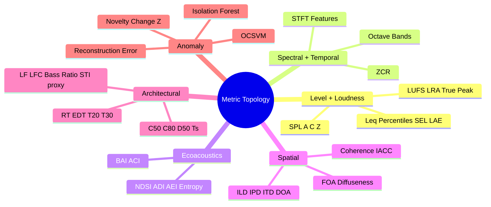

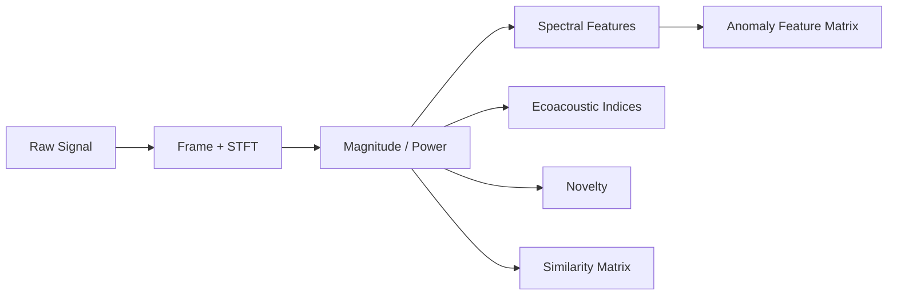

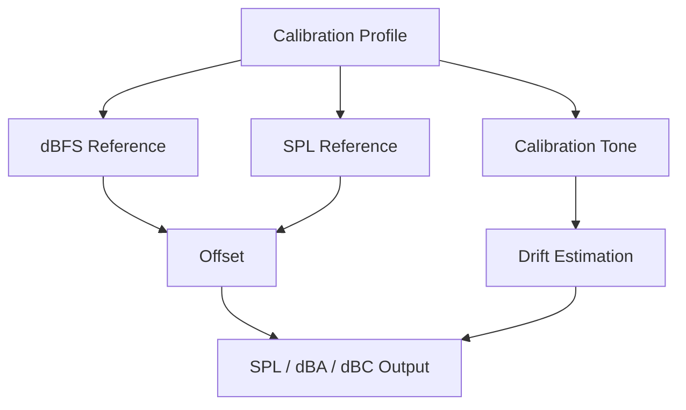

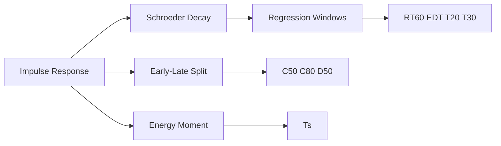

```mermaid
flowchart LR
    A["Stereo/Multichannel Frames"] --> B["Cross-Correlation"]
    B --> C["IACC / ITD"]
    A --> D["RMS Ratio"]
    D --> E["ILD"]
    A --> F["Cross-Spectrum Angle"]
    F --> G["IPD"]
    C --> H["DOA Proxy"]
```

```mermaid
flowchart TD
    A["Feature Matrix"] --> B["Isolation Forest"]
    A --> C["One-Class SVM"]
    A --> D["Low-rank Reconstruction"]
    B --> E["IF Score"]
    C --> F["OCSVM Score"]
    D --> G["AE Proxy Error"]
    A --> H["Novelty Z-Score"]
    H --> I["Change Point Confidence"]
```

```mermaid
stateDiagram-v2
    [*] --> Measured
    Measured --> Proxy: "Missing calibration or geometry"
    Measured --> StandardAligned: "Calibration and assumptions available"
    Proxy --> Reported
    StandardAligned --> Reported
    Reported --> [*]
```

## Citation Coverage Matrix

- STFT, spectral descriptors, and novelty: see [D1], [N1], [N3], [N4] in [`docs/REFERENCES.md`](REFERENCES.md)
- Loudness / true-peak: see [S1], [S2]
- Room acoustics: see [S3], [S4], [A1]
- Spatial delay estimation: see [P1]
- Ecoacoustic index families: see [E1], [E2], [E3]
- Anomaly detection models: see [M1], [M2], [M3]

## Open-Source Attribution Pointers

- K-weighting implementation context and attribution notes: [`src/esl/metrics/extended.py`](../src/esl/metrics/extended.py)
- Novelty/similarity algorithm attribution notes: [`src/esl/viz/plotting.py`](../src/esl/viz/plotting.py)
- Full attribution log: [`docs/ATTRIBUTION.md`](ATTRIBUTION.md)

## Related Workflows

- Interesting moments extraction (clip export + timestamp CSV): [`docs/MOMENTS_EXTRACTION.md`](MOMENTS_EXTRACTION.md)

## Extended Study Dossier

This dossier slows the chapter down on purpose. The maintained chapter above defines the software contract, formulas, commands, and citations. The pages below develop the habits that determine whether those tools produce evidence: asking a bounded question, preserving conditions, looking for failure modes, and writing a conclusion that does not outrun its data. Read one lens at a time while working with a real but manageable example.

Before the formal model below, note that it is a conceptual accounting device rather than a new metric. It states that an analytical claim depends jointly on the audio, chosen method, context, and review. Leaving one term undocumented does not make it disappear; it makes the result harder to interpret later.

$$
\mathcal{C} = \mathcal{I}(x; \theta, \kappa, \pi, r)
$$

where `C` is a bounded claim, `x` is the decoded audio, `theta` is the resolved analysis configuration, `kappa` is the recorded context such as calibration and channel metadata, `pi` is the provenance record, and `r` is the human or automated review procedure. Plain English: the same waveform can support different, equally valid statements when the question and the recorded method differ.

```mermaid
flowchart LR
    A["Question"] --> B["Declared method"]
    B --> C["Artifact and flags"]
    C --> D["Review"]
    D --> E["Bounded claim"]
    E -. "new uncertainty" .-> A
```

### The question before the command

In Chapter 3, **Metric Families and Measurement Contracts**, begin with a metric report in which units, aggregation rules, and confidence determine whether values can be compared. The practical discipline for this lens is to state the decision the analysis is supposed to support before selecting a metric or option. This is not paperwork added after the signal processing is complete. It decides which result can be compared, which output deserves review, and which conclusion would be too strong. The chapter's learning objectives are to Select metrics from a stated question rather than by accumulation.; Interpret units, aggregation semantics, confidence, and streamability.; Locate mathematical definitions and algorithm references for every metric.. For this pass, concentrate on one objective: Select metrics from a stated question rather than by accumulation.

Work with an example small enough to inspect from end to end. Write down the input identifier, the time interval, the channel policy, the configuration, and the expected shape of a useful result before you run the command. Then retain the unedited output and compare it with one visual or listening observation. The comparison should be literal at first: a peak at a timestamp, a changed rank, a decay slope, a missing field, or a stable block in a matrix. Literal observations are easier to audit than immediate stories about cause, quality, species, listener experience, or design success.

Next, make one controlled challenge to the first result. Change a parameter only when the chapter's method makes that change meaningful, or select a second documented interval, channel, file, or simulation variant. Ask what stayed stable, what moved, and whether the difference is larger than a plotting, framing, decoding, or calibration uncertainty. A result that changes is not automatically wrong; it may be telling you that the question has a scale, representation, or data-quality dependency that belongs in the final report.

Finally, write a two-part note. The first sentence states what the artifact shows under the recorded conditions. The second states one thing it does not establish and the next piece of evidence that would reduce that uncertainty. This habit turns every chapter into a reusable analytical protocol instead of a collection of software features. It also gives a collaborator a precise place to disagree productively: the input, configuration, interpretation, or required validation step rather than the vague claim that a number 'looks wrong.'

### The observed object

In Chapter 3, **Metric Families and Measurement Contracts**, begin with a metric report in which units, aggregation rules, and confidence determine whether values can be compared. The practical discipline for this lens is to separate the decoded sample sequence from the physical scene, source, or event it may represent. This is not paperwork added after the signal processing is complete. It decides which result can be compared, which output deserves review, and which conclusion would be too strong. The chapter's learning objectives are to Select metrics from a stated question rather than by accumulation.; Interpret units, aggregation semantics, confidence, and streamability.; Locate mathematical definitions and algorithm references for every metric.. For this pass, concentrate on one objective: Interpret units, aggregation semantics, confidence, and streamability.

Work with an example small enough to inspect from end to end. Write down the input identifier, the time interval, the channel policy, the configuration, and the expected shape of a useful result before you run the command. Then retain the unedited output and compare it with one visual or listening observation. The comparison should be literal at first: a peak at a timestamp, a changed rank, a decay slope, a missing field, or a stable block in a matrix. Literal observations are easier to audit than immediate stories about cause, quality, species, listener experience, or design success.

Next, make one controlled challenge to the first result. Change a parameter only when the chapter's method makes that change meaningful, or select a second documented interval, channel, file, or simulation variant. Ask what stayed stable, what moved, and whether the difference is larger than a plotting, framing, decoding, or calibration uncertainty. A result that changes is not automatically wrong; it may be telling you that the question has a scale, representation, or data-quality dependency that belongs in the final report.

Finally, write a two-part note. The first sentence states what the artifact shows under the recorded conditions. The second states one thing it does not establish and the next piece of evidence that would reduce that uncertainty. This habit turns every chapter into a reusable analytical protocol instead of a collection of software features. It also gives a collaborator a precise place to disagree productively: the input, configuration, interpretation, or required validation step rather than the vague claim that a number 'looks wrong.'

### Time scale

In Chapter 3, **Metric Families and Measurement Contracts**, begin with a metric report in which units, aggregation rules, and confidence determine whether values can be compared. The practical discipline for this lens is to choose a duration, frame, hop, chunk, or review interval that matches the phenomenon under study. This is not paperwork added after the signal processing is complete. It decides which result can be compared, which output deserves review, and which conclusion would be too strong. The chapter's learning objectives are to Select metrics from a stated question rather than by accumulation.; Interpret units, aggregation semantics, confidence, and streamability.; Locate mathematical definitions and algorithm references for every metric.. For this pass, concentrate on one objective: Locate mathematical definitions and algorithm references for every metric.

Work with an example small enough to inspect from end to end. Write down the input identifier, the time interval, the channel policy, the configuration, and the expected shape of a useful result before you run the command. Then retain the unedited output and compare it with one visual or listening observation. The comparison should be literal at first: a peak at a timestamp, a changed rank, a decay slope, a missing field, or a stable block in a matrix. Literal observations are easier to audit than immediate stories about cause, quality, species, listener experience, or design success.

Next, make one controlled challenge to the first result. Change a parameter only when the chapter's method makes that change meaningful, or select a second documented interval, channel, file, or simulation variant. Ask what stayed stable, what moved, and whether the difference is larger than a plotting, framing, decoding, or calibration uncertainty. A result that changes is not automatically wrong; it may be telling you that the question has a scale, representation, or data-quality dependency that belongs in the final report.

Finally, write a two-part note. The first sentence states what the artifact shows under the recorded conditions. The second states one thing it does not establish and the next piece of evidence that would reduce that uncertainty. This habit turns every chapter into a reusable analytical protocol instead of a collection of software features. It also gives a collaborator a precise place to disagree productively: the input, configuration, interpretation, or required validation step rather than the vague claim that a number 'looks wrong.'

### Channel semantics

In Chapter 3, **Metric Families and Measurement Contracts**, begin with a metric report in which units, aggregation rules, and confidence determine whether values can be compared. The practical discipline for this lens is to record whether the observation belongs to one channel, an aggregate, a downmix, or a spatial convention. This is not paperwork added after the signal processing is complete. It decides which result can be compared, which output deserves review, and which conclusion would be too strong. The chapter's learning objectives are to Select metrics from a stated question rather than by accumulation.; Interpret units, aggregation semantics, confidence, and streamability.; Locate mathematical definitions and algorithm references for every metric.. For this pass, concentrate on one objective: Select metrics from a stated question rather than by accumulation.

Work with an example small enough to inspect from end to end. Write down the input identifier, the time interval, the channel policy, the configuration, and the expected shape of a useful result before you run the command. Then retain the unedited output and compare it with one visual or listening observation. The comparison should be literal at first: a peak at a timestamp, a changed rank, a decay slope, a missing field, or a stable block in a matrix. Literal observations are easier to audit than immediate stories about cause, quality, species, listener experience, or design success.

Next, make one controlled challenge to the first result. Change a parameter only when the chapter's method makes that change meaningful, or select a second documented interval, channel, file, or simulation variant. Ask what stayed stable, what moved, and whether the difference is larger than a plotting, framing, decoding, or calibration uncertainty. A result that changes is not automatically wrong; it may be telling you that the question has a scale, representation, or data-quality dependency that belongs in the final report.

Finally, write a two-part note. The first sentence states what the artifact shows under the recorded conditions. The second states one thing it does not establish and the next piece of evidence that would reduce that uncertainty. This habit turns every chapter into a reusable analytical protocol instead of a collection of software features. It also gives a collaborator a precise place to disagree productively: the input, configuration, interpretation, or required validation step rather than the vague claim that a number 'looks wrong.'

### Units and references

In Chapter 3, **Metric Families and Measurement Contracts**, begin with a metric report in which units, aggregation rules, and confidence determine whether values can be compared. The practical discipline for this lens is to name the unit, reference quantity, calibration state, and any conversion that makes a value interpretable. This is not paperwork added after the signal processing is complete. It decides which result can be compared, which output deserves review, and which conclusion would be too strong. The chapter's learning objectives are to Select metrics from a stated question rather than by accumulation.; Interpret units, aggregation semantics, confidence, and streamability.; Locate mathematical definitions and algorithm references for every metric.. For this pass, concentrate on one objective: Interpret units, aggregation semantics, confidence, and streamability.

Work with an example small enough to inspect from end to end. Write down the input identifier, the time interval, the channel policy, the configuration, and the expected shape of a useful result before you run the command. Then retain the unedited output and compare it with one visual or listening observation. The comparison should be literal at first: a peak at a timestamp, a changed rank, a decay slope, a missing field, or a stable block in a matrix. Literal observations are easier to audit than immediate stories about cause, quality, species, listener experience, or design success.

Next, make one controlled challenge to the first result. Change a parameter only when the chapter's method makes that change meaningful, or select a second documented interval, channel, file, or simulation variant. Ask what stayed stable, what moved, and whether the difference is larger than a plotting, framing, decoding, or calibration uncertainty. A result that changes is not automatically wrong; it may be telling you that the question has a scale, representation, or data-quality dependency that belongs in the final report.

Finally, write a two-part note. The first sentence states what the artifact shows under the recorded conditions. The second states one thing it does not establish and the next piece of evidence that would reduce that uncertainty. This habit turns every chapter into a reusable analytical protocol instead of a collection of software features. It also gives a collaborator a precise place to disagree productively: the input, configuration, interpretation, or required validation step rather than the vague claim that a number 'looks wrong.'

### Preprocessing as a method

In Chapter 3, **Metric Families and Measurement Contracts**, begin with a metric report in which units, aggregation rules, and confidence determine whether values can be compared. The practical discipline for this lens is to treat decoding, resampling, filtering, normalization, and segmentation as visible analytical choices. This is not paperwork added after the signal processing is complete. It decides which result can be compared, which output deserves review, and which conclusion would be too strong. The chapter's learning objectives are to Select metrics from a stated question rather than by accumulation.; Interpret units, aggregation semantics, confidence, and streamability.; Locate mathematical definitions and algorithm references for every metric.. For this pass, concentrate on one objective: Locate mathematical definitions and algorithm references for every metric.

Work with an example small enough to inspect from end to end. Write down the input identifier, the time interval, the channel policy, the configuration, and the expected shape of a useful result before you run the command. Then retain the unedited output and compare it with one visual or listening observation. The comparison should be literal at first: a peak at a timestamp, a changed rank, a decay slope, a missing field, or a stable block in a matrix. Literal observations are easier to audit than immediate stories about cause, quality, species, listener experience, or design success.

Next, make one controlled challenge to the first result. Change a parameter only when the chapter's method makes that change meaningful, or select a second documented interval, channel, file, or simulation variant. Ask what stayed stable, what moved, and whether the difference is larger than a plotting, framing, decoding, or calibration uncertainty. A result that changes is not automatically wrong; it may be telling you that the question has a scale, representation, or data-quality dependency that belongs in the final report.

Finally, write a two-part note. The first sentence states what the artifact shows under the recorded conditions. The second states one thing it does not establish and the next piece of evidence that would reduce that uncertainty. This habit turns every chapter into a reusable analytical protocol instead of a collection of software features. It also gives a collaborator a precise place to disagree productively: the input, configuration, interpretation, or required validation step rather than the vague claim that a number 'looks wrong.'

### Parameter sensitivity

In Chapter 3, **Metric Families and Measurement Contracts**, begin with a metric report in which units, aggregation rules, and confidence determine whether values can be compared. The practical discipline for this lens is to test whether a conclusion survives a reasonable change in one important parameter. This is not paperwork added after the signal processing is complete. It decides which result can be compared, which output deserves review, and which conclusion would be too strong. The chapter's learning objectives are to Select metrics from a stated question rather than by accumulation.; Interpret units, aggregation semantics, confidence, and streamability.; Locate mathematical definitions and algorithm references for every metric.. For this pass, concentrate on one objective: Select metrics from a stated question rather than by accumulation.

Work with an example small enough to inspect from end to end. Write down the input identifier, the time interval, the channel policy, the configuration, and the expected shape of a useful result before you run the command. Then retain the unedited output and compare it with one visual or listening observation. The comparison should be literal at first: a peak at a timestamp, a changed rank, a decay slope, a missing field, or a stable block in a matrix. Literal observations are easier to audit than immediate stories about cause, quality, species, listener experience, or design success.

Next, make one controlled challenge to the first result. Change a parameter only when the chapter's method makes that change meaningful, or select a second documented interval, channel, file, or simulation variant. Ask what stayed stable, what moved, and whether the difference is larger than a plotting, framing, decoding, or calibration uncertainty. A result that changes is not automatically wrong; it may be telling you that the question has a scale, representation, or data-quality dependency that belongs in the final report.

Finally, write a two-part note. The first sentence states what the artifact shows under the recorded conditions. The second states one thing it does not establish and the next piece of evidence that would reduce that uncertainty. This habit turns every chapter into a reusable analytical protocol instead of a collection of software features. It also gives a collaborator a precise place to disagree productively: the input, configuration, interpretation, or required validation step rather than the vague claim that a number 'looks wrong.'

### The visual check

In Chapter 3, **Metric Families and Measurement Contracts**, begin with a metric report in which units, aggregation rules, and confidence determine whether values can be compared. The practical discipline for this lens is to compare the numerical output with a plot and, when appropriate, a bounded listening review. This is not paperwork added after the signal processing is complete. It decides which result can be compared, which output deserves review, and which conclusion would be too strong. The chapter's learning objectives are to Select metrics from a stated question rather than by accumulation.; Interpret units, aggregation semantics, confidence, and streamability.; Locate mathematical definitions and algorithm references for every metric.. For this pass, concentrate on one objective: Interpret units, aggregation semantics, confidence, and streamability.

Work with an example small enough to inspect from end to end. Write down the input identifier, the time interval, the channel policy, the configuration, and the expected shape of a useful result before you run the command. Then retain the unedited output and compare it with one visual or listening observation. The comparison should be literal at first: a peak at a timestamp, a changed rank, a decay slope, a missing field, or a stable block in a matrix. Literal observations are easier to audit than immediate stories about cause, quality, species, listener experience, or design success.

Next, make one controlled challenge to the first result. Change a parameter only when the chapter's method makes that change meaningful, or select a second documented interval, channel, file, or simulation variant. Ask what stayed stable, what moved, and whether the difference is larger than a plotting, framing, decoding, or calibration uncertainty. A result that changes is not automatically wrong; it may be telling you that the question has a scale, representation, or data-quality dependency that belongs in the final report.

Finally, write a two-part note. The first sentence states what the artifact shows under the recorded conditions. The second states one thing it does not establish and the next piece of evidence that would reduce that uncertainty. This habit turns every chapter into a reusable analytical protocol instead of a collection of software features. It also gives a collaborator a precise place to disagree productively: the input, configuration, interpretation, or required validation step rather than the vague claim that a number 'looks wrong.'

### The alternative explanation

In Chapter 3, **Metric Families and Measurement Contracts**, begin with a metric report in which units, aggregation rules, and confidence determine whether values can be compared. The practical discipline for this lens is to identify a plausible artifact, confound, or data-quality issue that could mimic the pattern. This is not paperwork added after the signal processing is complete. It decides which result can be compared, which output deserves review, and which conclusion would be too strong. The chapter's learning objectives are to Select metrics from a stated question rather than by accumulation.; Interpret units, aggregation semantics, confidence, and streamability.; Locate mathematical definitions and algorithm references for every metric.. For this pass, concentrate on one objective: Locate mathematical definitions and algorithm references for every metric.

Work with an example small enough to inspect from end to end. Write down the input identifier, the time interval, the channel policy, the configuration, and the expected shape of a useful result before you run the command. Then retain the unedited output and compare it with one visual or listening observation. The comparison should be literal at first: a peak at a timestamp, a changed rank, a decay slope, a missing field, or a stable block in a matrix. Literal observations are easier to audit than immediate stories about cause, quality, species, listener experience, or design success.

Next, make one controlled challenge to the first result. Change a parameter only when the chapter's method makes that change meaningful, or select a second documented interval, channel, file, or simulation variant. Ask what stayed stable, what moved, and whether the difference is larger than a plotting, framing, decoding, or calibration uncertainty. A result that changes is not automatically wrong; it may be telling you that the question has a scale, representation, or data-quality dependency that belongs in the final report.

Finally, write a two-part note. The first sentence states what the artifact shows under the recorded conditions. The second states one thing it does not establish and the next piece of evidence that would reduce that uncertainty. This habit turns every chapter into a reusable analytical protocol instead of a collection of software features. It also gives a collaborator a precise place to disagree productively: the input, configuration, interpretation, or required validation step rather than the vague claim that a number 'looks wrong.'

### Validity and confidence

In Chapter 3, **Metric Families and Measurement Contracts**, begin with a metric report in which units, aggregation rules, and confidence determine whether values can be compared. The practical discipline for this lens is to read flags, fit quality, uncertainty, and missing context before elevating a value into a claim. This is not paperwork added after the signal processing is complete. It decides which result can be compared, which output deserves review, and which conclusion would be too strong. The chapter's learning objectives are to Select metrics from a stated question rather than by accumulation.; Interpret units, aggregation semantics, confidence, and streamability.; Locate mathematical definitions and algorithm references for every metric.. For this pass, concentrate on one objective: Select metrics from a stated question rather than by accumulation.

Work with an example small enough to inspect from end to end. Write down the input identifier, the time interval, the channel policy, the configuration, and the expected shape of a useful result before you run the command. Then retain the unedited output and compare it with one visual or listening observation. The comparison should be literal at first: a peak at a timestamp, a changed rank, a decay slope, a missing field, or a stable block in a matrix. Literal observations are easier to audit than immediate stories about cause, quality, species, listener experience, or design success.

Next, make one controlled challenge to the first result. Change a parameter only when the chapter's method makes that change meaningful, or select a second documented interval, channel, file, or simulation variant. Ask what stayed stable, what moved, and whether the difference is larger than a plotting, framing, decoding, or calibration uncertainty. A result that changes is not automatically wrong; it may be telling you that the question has a scale, representation, or data-quality dependency that belongs in the final report.

Finally, write a two-part note. The first sentence states what the artifact shows under the recorded conditions. The second states one thing it does not establish and the next piece of evidence that would reduce that uncertainty. This habit turns every chapter into a reusable analytical protocol instead of a collection of software features. It also gives a collaborator a precise place to disagree productively: the input, configuration, interpretation, or required validation step rather than the vague claim that a number 'looks wrong.'

### The comparison set

In Chapter 3, **Metric Families and Measurement Contracts**, begin with a metric report in which units, aggregation rules, and confidence determine whether values can be compared. The practical discipline for this lens is to define what is held constant and what is allowed to differ when two results are compared. This is not paperwork added after the signal processing is complete. It decides which result can be compared, which output deserves review, and which conclusion would be too strong. The chapter's learning objectives are to Select metrics from a stated question rather than by accumulation.; Interpret units, aggregation semantics, confidence, and streamability.; Locate mathematical definitions and algorithm references for every metric.. For this pass, concentrate on one objective: Interpret units, aggregation semantics, confidence, and streamability.

Work with an example small enough to inspect from end to end. Write down the input identifier, the time interval, the channel policy, the configuration, and the expected shape of a useful result before you run the command. Then retain the unedited output and compare it with one visual or listening observation. The comparison should be literal at first: a peak at a timestamp, a changed rank, a decay slope, a missing field, or a stable block in a matrix. Literal observations are easier to audit than immediate stories about cause, quality, species, listener experience, or design success.

Next, make one controlled challenge to the first result. Change a parameter only when the chapter's method makes that change meaningful, or select a second documented interval, channel, file, or simulation variant. Ask what stayed stable, what moved, and whether the difference is larger than a plotting, framing, decoding, or calibration uncertainty. A result that changes is not automatically wrong; it may be telling you that the question has a scale, representation, or data-quality dependency that belongs in the final report.

Finally, write a two-part note. The first sentence states what the artifact shows under the recorded conditions. The second states one thing it does not establish and the next piece of evidence that would reduce that uncertainty. This habit turns every chapter into a reusable analytical protocol instead of a collection of software features. It also gives a collaborator a precise place to disagree productively: the input, configuration, interpretation, or required validation step rather than the vague claim that a number 'looks wrong.'

### The audit trail

In Chapter 3, **Metric Families and Measurement Contracts**, begin with a metric report in which units, aggregation rules, and confidence determine whether values can be compared. The practical discipline for this lens is to retain commands, resolved configuration, versions, inputs, and output identifiers together. This is not paperwork added after the signal processing is complete. It decides which result can be compared, which output deserves review, and which conclusion would be too strong. The chapter's learning objectives are to Select metrics from a stated question rather than by accumulation.; Interpret units, aggregation semantics, confidence, and streamability.; Locate mathematical definitions and algorithm references for every metric.. For this pass, concentrate on one objective: Locate mathematical definitions and algorithm references for every metric.

Work with an example small enough to inspect from end to end. Write down the input identifier, the time interval, the channel policy, the configuration, and the expected shape of a useful result before you run the command. Then retain the unedited output and compare it with one visual or listening observation. The comparison should be literal at first: a peak at a timestamp, a changed rank, a decay slope, a missing field, or a stable block in a matrix. Literal observations are easier to audit than immediate stories about cause, quality, species, listener experience, or design success.

Next, make one controlled challenge to the first result. Change a parameter only when the chapter's method makes that change meaningful, or select a second documented interval, channel, file, or simulation variant. Ask what stayed stable, what moved, and whether the difference is larger than a plotting, framing, decoding, or calibration uncertainty. A result that changes is not automatically wrong; it may be telling you that the question has a scale, representation, or data-quality dependency that belongs in the final report.

Finally, write a two-part note. The first sentence states what the artifact shows under the recorded conditions. The second states one thing it does not establish and the next piece of evidence that would reduce that uncertainty. This habit turns every chapter into a reusable analytical protocol instead of a collection of software features. It also gives a collaborator a precise place to disagree productively: the input, configuration, interpretation, or required validation step rather than the vague claim that a number 'looks wrong.'

### The human review loop

In Chapter 3, **Metric Families and Measurement Contracts**, begin with a metric report in which units, aggregation rules, and confidence determine whether values can be compared. The practical discipline for this lens is to give a listener, analyst, or domain expert a concrete artifact and a stated question to inspect. This is not paperwork added after the signal processing is complete. It decides which result can be compared, which output deserves review, and which conclusion would be too strong. The chapter's learning objectives are to Select metrics from a stated question rather than by accumulation.; Interpret units, aggregation semantics, confidence, and streamability.; Locate mathematical definitions and algorithm references for every metric.. For this pass, concentrate on one objective: Select metrics from a stated question rather than by accumulation.

Work with an example small enough to inspect from end to end. Write down the input identifier, the time interval, the channel policy, the configuration, and the expected shape of a useful result before you run the command. Then retain the unedited output and compare it with one visual or listening observation. The comparison should be literal at first: a peak at a timestamp, a changed rank, a decay slope, a missing field, or a stable block in a matrix. Literal observations are easier to audit than immediate stories about cause, quality, species, listener experience, or design success.

Next, make one controlled challenge to the first result. Change a parameter only when the chapter's method makes that change meaningful, or select a second documented interval, channel, file, or simulation variant. Ask what stayed stable, what moved, and whether the difference is larger than a plotting, framing, decoding, or calibration uncertainty. A result that changes is not automatically wrong; it may be telling you that the question has a scale, representation, or data-quality dependency that belongs in the final report.

Finally, write a two-part note. The first sentence states what the artifact shows under the recorded conditions. The second states one thing it does not establish and the next piece of evidence that would reduce that uncertainty. This habit turns every chapter into a reusable analytical protocol instead of a collection of software features. It also gives a collaborator a precise place to disagree productively: the input, configuration, interpretation, or required validation step rather than the vague claim that a number 'looks wrong.'

### Scale and cost

In Chapter 3, **Metric Families and Measurement Contracts**, begin with a metric report in which units, aggregation rules, and confidence determine whether values can be compared. The practical discipline for this lens is to estimate memory, storage, runtime, and review burden before committing to a large workflow. This is not paperwork added after the signal processing is complete. It decides which result can be compared, which output deserves review, and which conclusion would be too strong. The chapter's learning objectives are to Select metrics from a stated question rather than by accumulation.; Interpret units, aggregation semantics, confidence, and streamability.; Locate mathematical definitions and algorithm references for every metric.. For this pass, concentrate on one objective: Interpret units, aggregation semantics, confidence, and streamability.

Work with an example small enough to inspect from end to end. Write down the input identifier, the time interval, the channel policy, the configuration, and the expected shape of a useful result before you run the command. Then retain the unedited output and compare it with one visual or listening observation. The comparison should be literal at first: a peak at a timestamp, a changed rank, a decay slope, a missing field, or a stable block in a matrix. Literal observations are easier to audit than immediate stories about cause, quality, species, listener experience, or design success.

Next, make one controlled challenge to the first result. Change a parameter only when the chapter's method makes that change meaningful, or select a second documented interval, channel, file, or simulation variant. Ask what stayed stable, what moved, and whether the difference is larger than a plotting, framing, decoding, or calibration uncertainty. A result that changes is not automatically wrong; it may be telling you that the question has a scale, representation, or data-quality dependency that belongs in the final report.

Finally, write a two-part note. The first sentence states what the artifact shows under the recorded conditions. The second states one thing it does not establish and the next piece of evidence that would reduce that uncertainty. This habit turns every chapter into a reusable analytical protocol instead of a collection of software features. It also gives a collaborator a precise place to disagree productively: the input, configuration, interpretation, or required validation step rather than the vague claim that a number 'looks wrong.'

### Interoperability

In Chapter 3, **Metric Families and Measurement Contracts**, begin with a metric report in which units, aggregation rules, and confidence determine whether values can be compared. The practical discipline for this lens is to preserve enough schema, metadata, and naming information for a handoff to another tool or collaborator. This is not paperwork added after the signal processing is complete. It decides which result can be compared, which output deserves review, and which conclusion would be too strong. The chapter's learning objectives are to Select metrics from a stated question rather than by accumulation.; Interpret units, aggregation semantics, confidence, and streamability.; Locate mathematical definitions and algorithm references for every metric.. For this pass, concentrate on one objective: Locate mathematical definitions and algorithm references for every metric.

Work with an example small enough to inspect from end to end. Write down the input identifier, the time interval, the channel policy, the configuration, and the expected shape of a useful result before you run the command. Then retain the unedited output and compare it with one visual or listening observation. The comparison should be literal at first: a peak at a timestamp, a changed rank, a decay slope, a missing field, or a stable block in a matrix. Literal observations are easier to audit than immediate stories about cause, quality, species, listener experience, or design success.

Next, make one controlled challenge to the first result. Change a parameter only when the chapter's method makes that change meaningful, or select a second documented interval, channel, file, or simulation variant. Ask what stayed stable, what moved, and whether the difference is larger than a plotting, framing, decoding, or calibration uncertainty. A result that changes is not automatically wrong; it may be telling you that the question has a scale, representation, or data-quality dependency that belongs in the final report.

Finally, write a two-part note. The first sentence states what the artifact shows under the recorded conditions. The second states one thing it does not establish and the next piece of evidence that would reduce that uncertainty. This habit turns every chapter into a reusable analytical protocol instead of a collection of software features. It also gives a collaborator a precise place to disagree productively: the input, configuration, interpretation, or required validation step rather than the vague claim that a number 'looks wrong.'

### Ethics and access

In Chapter 3, **Metric Families and Measurement Contracts**, begin with a metric report in which units, aggregation rules, and confidence determine whether values can be compared. The practical discipline for this lens is to consider permissions, sensitive locations, speech, cultural material, and the difference between analysis and surveillance. This is not paperwork added after the signal processing is complete. It decides which result can be compared, which output deserves review, and which conclusion would be too strong. The chapter's learning objectives are to Select metrics from a stated question rather than by accumulation.; Interpret units, aggregation semantics, confidence, and streamability.; Locate mathematical definitions and algorithm references for every metric.. For this pass, concentrate on one objective: Select metrics from a stated question rather than by accumulation.

Work with an example small enough to inspect from end to end. Write down the input identifier, the time interval, the channel policy, the configuration, and the expected shape of a useful result before you run the command. Then retain the unedited output and compare it with one visual or listening observation. The comparison should be literal at first: a peak at a timestamp, a changed rank, a decay slope, a missing field, or a stable block in a matrix. Literal observations are easier to audit than immediate stories about cause, quality, species, listener experience, or design success.

Next, make one controlled challenge to the first result. Change a parameter only when the chapter's method makes that change meaningful, or select a second documented interval, channel, file, or simulation variant. Ask what stayed stable, what moved, and whether the difference is larger than a plotting, framing, decoding, or calibration uncertainty. A result that changes is not automatically wrong; it may be telling you that the question has a scale, representation, or data-quality dependency that belongs in the final report.

Finally, write a two-part note. The first sentence states what the artifact shows under the recorded conditions. The second states one thing it does not establish and the next piece of evidence that would reduce that uncertainty. This habit turns every chapter into a reusable analytical protocol instead of a collection of software features. It also gives a collaborator a precise place to disagree productively: the input, configuration, interpretation, or required validation step rather than the vague claim that a number 'looks wrong.'

### Failure as evidence

In Chapter 3, **Metric Families and Measurement Contracts**, begin with a metric report in which units, aggregation rules, and confidence determine whether values can be compared. The practical discipline for this lens is to keep a failed decode, invalid fit, clipped channel, or unexpected rank when it teaches something about the method. This is not paperwork added after the signal processing is complete. It decides which result can be compared, which output deserves review, and which conclusion would be too strong. The chapter's learning objectives are to Select metrics from a stated question rather than by accumulation.; Interpret units, aggregation semantics, confidence, and streamability.; Locate mathematical definitions and algorithm references for every metric.. For this pass, concentrate on one objective: Interpret units, aggregation semantics, confidence, and streamability.

Work with an example small enough to inspect from end to end. Write down the input identifier, the time interval, the channel policy, the configuration, and the expected shape of a useful result before you run the command. Then retain the unedited output and compare it with one visual or listening observation. The comparison should be literal at first: a peak at a timestamp, a changed rank, a decay slope, a missing field, or a stable block in a matrix. Literal observations are easier to audit than immediate stories about cause, quality, species, listener experience, or design success.

Next, make one controlled challenge to the first result. Change a parameter only when the chapter's method makes that change meaningful, or select a second documented interval, channel, file, or simulation variant. Ask what stayed stable, what moved, and whether the difference is larger than a plotting, framing, decoding, or calibration uncertainty. A result that changes is not automatically wrong; it may be telling you that the question has a scale, representation, or data-quality dependency that belongs in the final report.

Finally, write a two-part note. The first sentence states what the artifact shows under the recorded conditions. The second states one thing it does not establish and the next piece of evidence that would reduce that uncertainty. This habit turns every chapter into a reusable analytical protocol instead of a collection of software features. It also gives a collaborator a precise place to disagree productively: the input, configuration, interpretation, or required validation step rather than the vague claim that a number 'looks wrong.'

### A bounded conclusion

In Chapter 3, **Metric Families and Measurement Contracts**, begin with a metric report in which units, aggregation rules, and confidence determine whether values can be compared. The practical discipline for this lens is to write the smallest claim that the observed artifact, method record, and review actually support. This is not paperwork added after the signal processing is complete. It decides which result can be compared, which output deserves review, and which conclusion would be too strong. The chapter's learning objectives are to Select metrics from a stated question rather than by accumulation.; Interpret units, aggregation semantics, confidence, and streamability.; Locate mathematical definitions and algorithm references for every metric.. For this pass, concentrate on one objective: Locate mathematical definitions and algorithm references for every metric.

Work with an example small enough to inspect from end to end. Write down the input identifier, the time interval, the channel policy, the configuration, and the expected shape of a useful result before you run the command. Then retain the unedited output and compare it with one visual or listening observation. The comparison should be literal at first: a peak at a timestamp, a changed rank, a decay slope, a missing field, or a stable block in a matrix. Literal observations are easier to audit than immediate stories about cause, quality, species, listener experience, or design success.

Next, make one controlled challenge to the first result. Change a parameter only when the chapter's method makes that change meaningful, or select a second documented interval, channel, file, or simulation variant. Ask what stayed stable, what moved, and whether the difference is larger than a plotting, framing, decoding, or calibration uncertainty. A result that changes is not automatically wrong; it may be telling you that the question has a scale, representation, or data-quality dependency that belongs in the final report.

Finally, write a two-part note. The first sentence states what the artifact shows under the recorded conditions. The second states one thing it does not establish and the next piece of evidence that would reduce that uncertainty. This habit turns every chapter into a reusable analytical protocol instead of a collection of software features. It also gives a collaborator a precise place to disagree productively: the input, configuration, interpretation, or required validation step rather than the vague claim that a number 'looks wrong.'

### Replication

In Chapter 3, **Metric Families and Measurement Contracts**, begin with a metric report in which units, aggregation rules, and confidence determine whether values can be compared. The practical discipline for this lens is to make a second run possible without relying on memory, undocumented defaults, or a private graphical state. This is not paperwork added after the signal processing is complete. It decides which result can be compared, which output deserves review, and which conclusion would be too strong. The chapter's learning objectives are to Select metrics from a stated question rather than by accumulation.; Interpret units, aggregation semantics, confidence, and streamability.; Locate mathematical definitions and algorithm references for every metric.. For this pass, concentrate on one objective: Select metrics from a stated question rather than by accumulation.

Work with an example small enough to inspect from end to end. Write down the input identifier, the time interval, the channel policy, the configuration, and the expected shape of a useful result before you run the command. Then retain the unedited output and compare it with one visual or listening observation. The comparison should be literal at first: a peak at a timestamp, a changed rank, a decay slope, a missing field, or a stable block in a matrix. Literal observations are easier to audit than immediate stories about cause, quality, species, listener experience, or design success.

Next, make one controlled challenge to the first result. Change a parameter only when the chapter's method makes that change meaningful, or select a second documented interval, channel, file, or simulation variant. Ask what stayed stable, what moved, and whether the difference is larger than a plotting, framing, decoding, or calibration uncertainty. A result that changes is not automatically wrong; it may be telling you that the question has a scale, representation, or data-quality dependency that belongs in the final report.

Finally, write a two-part note. The first sentence states what the artifact shows under the recorded conditions. The second states one thing it does not establish and the next piece of evidence that would reduce that uncertainty. This habit turns every chapter into a reusable analytical protocol instead of a collection of software features. It also gives a collaborator a precise place to disagree productively: the input, configuration, interpretation, or required validation step rather than the vague claim that a number 'looks wrong.'

### The next measurement

In Chapter 3, **Metric Families and Measurement Contracts**, begin with a metric report in which units, aggregation rules, and confidence determine whether values can be compared. The practical discipline for this lens is to turn remaining uncertainty into a practical follow-up recording, calibration check, annotation, or comparison. This is not paperwork added after the signal processing is complete. It decides which result can be compared, which output deserves review, and which conclusion would be too strong. The chapter's learning objectives are to Select metrics from a stated question rather than by accumulation.; Interpret units, aggregation semantics, confidence, and streamability.; Locate mathematical definitions and algorithm references for every metric.. For this pass, concentrate on one objective: Interpret units, aggregation semantics, confidence, and streamability.

Work with an example small enough to inspect from end to end. Write down the input identifier, the time interval, the channel policy, the configuration, and the expected shape of a useful result before you run the command. Then retain the unedited output and compare it with one visual or listening observation. The comparison should be literal at first: a peak at a timestamp, a changed rank, a decay slope, a missing field, or a stable block in a matrix. Literal observations are easier to audit than immediate stories about cause, quality, species, listener experience, or design success.

Next, make one controlled challenge to the first result. Change a parameter only when the chapter's method makes that change meaningful, or select a second documented interval, channel, file, or simulation variant. Ask what stayed stable, what moved, and whether the difference is larger than a plotting, framing, decoding, or calibration uncertainty. A result that changes is not automatically wrong; it may be telling you that the question has a scale, representation, or data-quality dependency that belongs in the final report.

Finally, write a two-part note. The first sentence states what the artifact shows under the recorded conditions. The second states one thing it does not establish and the next piece of evidence that would reduce that uncertainty. This habit turns every chapter into a reusable analytical protocol instead of a collection of software features. It also gives a collaborator a precise place to disagree productively: the input, configuration, interpretation, or required validation step rather than the vague claim that a number 'looks wrong.'

### Stakeholders and use

In Chapter 3, **Metric Families and Measurement Contracts**, begin with a metric report in which units, aggregation rules, and confidence determine whether values can be compared. The practical discipline for this lens is to identify who will act on the result and what decision, design, or research question it is meant to inform. This is not paperwork added after the signal processing is complete. It decides which result can be compared, which output deserves review, and which conclusion would be too strong. The chapter's learning objectives are to Select metrics from a stated question rather than by accumulation.; Interpret units, aggregation semantics, confidence, and streamability.; Locate mathematical definitions and algorithm references for every metric.. For this pass, concentrate on one objective: Locate mathematical definitions and algorithm references for every metric.

Work with an example small enough to inspect from end to end. Write down the input identifier, the time interval, the channel policy, the configuration, and the expected shape of a useful result before you run the command. Then retain the unedited output and compare it with one visual or listening observation. The comparison should be literal at first: a peak at a timestamp, a changed rank, a decay slope, a missing field, or a stable block in a matrix. Literal observations are easier to audit than immediate stories about cause, quality, species, listener experience, or design success.

Next, make one controlled challenge to the first result. Change a parameter only when the chapter's method makes that change meaningful, or select a second documented interval, channel, file, or simulation variant. Ask what stayed stable, what moved, and whether the difference is larger than a plotting, framing, decoding, or calibration uncertainty. A result that changes is not automatically wrong; it may be telling you that the question has a scale, representation, or data-quality dependency that belongs in the final report.

Finally, write a two-part note. The first sentence states what the artifact shows under the recorded conditions. The second states one thing it does not establish and the next piece of evidence that would reduce that uncertainty. This habit turns every chapter into a reusable analytical protocol instead of a collection of software features. It also gives a collaborator a precise place to disagree productively: the input, configuration, interpretation, or required validation step rather than the vague claim that a number 'looks wrong.'

### Acoustic scene versus recording

In Chapter 3, **Metric Families and Measurement Contracts**, begin with a metric report in which units, aggregation rules, and confidence determine whether values can be compared. The practical discipline for this lens is to separate properties of the measured waveform from inferences about a place, source, listener, or system. This is not paperwork added after the signal processing is complete. It decides which result can be compared, which output deserves review, and which conclusion would be too strong. The chapter's learning objectives are to Select metrics from a stated question rather than by accumulation.; Interpret units, aggregation semantics, confidence, and streamability.; Locate mathematical definitions and algorithm references for every metric.. For this pass, concentrate on one objective: Select metrics from a stated question rather than by accumulation.

Work with an example small enough to inspect from end to end. Write down the input identifier, the time interval, the channel policy, the configuration, and the expected shape of a useful result before you run the command. Then retain the unedited output and compare it with one visual or listening observation. The comparison should be literal at first: a peak at a timestamp, a changed rank, a decay slope, a missing field, or a stable block in a matrix. Literal observations are easier to audit than immediate stories about cause, quality, species, listener experience, or design success.

Next, make one controlled challenge to the first result. Change a parameter only when the chapter's method makes that change meaningful, or select a second documented interval, channel, file, or simulation variant. Ask what stayed stable, what moved, and whether the difference is larger than a plotting, framing, decoding, or calibration uncertainty. A result that changes is not automatically wrong; it may be telling you that the question has a scale, representation, or data-quality dependency that belongs in the final report.

Finally, write a two-part note. The first sentence states what the artifact shows under the recorded conditions. The second states one thing it does not establish and the next piece of evidence that would reduce that uncertainty. This habit turns every chapter into a reusable analytical protocol instead of a collection of software features. It also gives a collaborator a precise place to disagree productively: the input, configuration, interpretation, or required validation step rather than the vague claim that a number 'looks wrong.'

### Instrumentation boundary

In Chapter 3, **Metric Families and Measurement Contracts**, begin with a metric report in which units, aggregation rules, and confidence determine whether values can be compared. The practical discipline for this lens is to document microphone, recorder, placement, gain, timing, and deployment facts that software cannot infer. This is not paperwork added after the signal processing is complete. It decides which result can be compared, which output deserves review, and which conclusion would be too strong. The chapter's learning objectives are to Select metrics from a stated question rather than by accumulation.; Interpret units, aggregation semantics, confidence, and streamability.; Locate mathematical definitions and algorithm references for every metric.. For this pass, concentrate on one objective: Interpret units, aggregation semantics, confidence, and streamability.

Work with an example small enough to inspect from end to end. Write down the input identifier, the time interval, the channel policy, the configuration, and the expected shape of a useful result before you run the command. Then retain the unedited output and compare it with one visual or listening observation. The comparison should be literal at first: a peak at a timestamp, a changed rank, a decay slope, a missing field, or a stable block in a matrix. Literal observations are easier to audit than immediate stories about cause, quality, species, listener experience, or design success.

Next, make one controlled challenge to the first result. Change a parameter only when the chapter's method makes that change meaningful, or select a second documented interval, channel, file, or simulation variant. Ask what stayed stable, what moved, and whether the difference is larger than a plotting, framing, decoding, or calibration uncertainty. A result that changes is not automatically wrong; it may be telling you that the question has a scale, representation, or data-quality dependency that belongs in the final report.

Finally, write a two-part note. The first sentence states what the artifact shows under the recorded conditions. The second states one thing it does not establish and the next piece of evidence that would reduce that uncertainty. This habit turns every chapter into a reusable analytical protocol instead of a collection of software features. It also gives a collaborator a precise place to disagree productively: the input, configuration, interpretation, or required validation step rather than the vague claim that a number 'looks wrong.'

### Reference baseline

In Chapter 3, **Metric Families and Measurement Contracts**, begin with a metric report in which units, aggregation rules, and confidence determine whether values can be compared. The practical discipline for this lens is to define a known interval, fixture, variant, or population against which change or similarity is judged. This is not paperwork added after the signal processing is complete. It decides which result can be compared, which output deserves review, and which conclusion would be too strong. The chapter's learning objectives are to Select metrics from a stated question rather than by accumulation.; Interpret units, aggregation semantics, confidence, and streamability.; Locate mathematical definitions and algorithm references for every metric.. For this pass, concentrate on one objective: Locate mathematical definitions and algorithm references for every metric.

Work with an example small enough to inspect from end to end. Write down the input identifier, the time interval, the channel policy, the configuration, and the expected shape of a useful result before you run the command. Then retain the unedited output and compare it with one visual or listening observation. The comparison should be literal at first: a peak at a timestamp, a changed rank, a decay slope, a missing field, or a stable block in a matrix. Literal observations are easier to audit than immediate stories about cause, quality, species, listener experience, or design success.

Next, make one controlled challenge to the first result. Change a parameter only when the chapter's method makes that change meaningful, or select a second documented interval, channel, file, or simulation variant. Ask what stayed stable, what moved, and whether the difference is larger than a plotting, framing, decoding, or calibration uncertainty. A result that changes is not automatically wrong; it may be telling you that the question has a scale, representation, or data-quality dependency that belongs in the final report.

Finally, write a two-part note. The first sentence states what the artifact shows under the recorded conditions. The second states one thing it does not establish and the next piece of evidence that would reduce that uncertainty. This habit turns every chapter into a reusable analytical protocol instead of a collection of software features. It also gives a collaborator a precise place to disagree productively: the input, configuration, interpretation, or required validation step rather than the vague claim that a number 'looks wrong.'

### Sampling and selection

In Chapter 3, **Metric Families and Measurement Contracts**, begin with a metric report in which units, aggregation rules, and confidence determine whether values can be compared. The practical discipline for this lens is to record how the chosen files or intervals entered the analysis and which material was excluded. This is not paperwork added after the signal processing is complete. It decides which result can be compared, which output deserves review, and which conclusion would be too strong. The chapter's learning objectives are to Select metrics from a stated question rather than by accumulation.; Interpret units, aggregation semantics, confidence, and streamability.; Locate mathematical definitions and algorithm references for every metric.. For this pass, concentrate on one objective: Select metrics from a stated question rather than by accumulation.

Work with an example small enough to inspect from end to end. Write down the input identifier, the time interval, the channel policy, the configuration, and the expected shape of a useful result before you run the command. Then retain the unedited output and compare it with one visual or listening observation. The comparison should be literal at first: a peak at a timestamp, a changed rank, a decay slope, a missing field, or a stable block in a matrix. Literal observations are easier to audit than immediate stories about cause, quality, species, listener experience, or design success.

Next, make one controlled challenge to the first result. Change a parameter only when the chapter's method makes that change meaningful, or select a second documented interval, channel, file, or simulation variant. Ask what stayed stable, what moved, and whether the difference is larger than a plotting, framing, decoding, or calibration uncertainty. A result that changes is not automatically wrong; it may be telling you that the question has a scale, representation, or data-quality dependency that belongs in the final report.

Finally, write a two-part note. The first sentence states what the artifact shows under the recorded conditions. The second states one thing it does not establish and the next piece of evidence that would reduce that uncertainty. This habit turns every chapter into a reusable analytical protocol instead of a collection of software features. It also gives a collaborator a precise place to disagree productively: the input, configuration, interpretation, or required validation step rather than the vague claim that a number 'looks wrong.'

### Feature representation

In Chapter 3, **Metric Families and Measurement Contracts**, begin with a metric report in which units, aggregation rules, and confidence determine whether values can be compared. The practical discipline for this lens is to explain what the selected representation emphasizes, compresses, or ignores before interpreting a score. This is not paperwork added after the signal processing is complete. It decides which result can be compared, which output deserves review, and which conclusion would be too strong. The chapter's learning objectives are to Select metrics from a stated question rather than by accumulation.; Interpret units, aggregation semantics, confidence, and streamability.; Locate mathematical definitions and algorithm references for every metric.. For this pass, concentrate on one objective: Interpret units, aggregation semantics, confidence, and streamability.

Work with an example small enough to inspect from end to end. Write down the input identifier, the time interval, the channel policy, the configuration, and the expected shape of a useful result before you run the command. Then retain the unedited output and compare it with one visual or listening observation. The comparison should be literal at first: a peak at a timestamp, a changed rank, a decay slope, a missing field, or a stable block in a matrix. Literal observations are easier to audit than immediate stories about cause, quality, species, listener experience, or design success.

Next, make one controlled challenge to the first result. Change a parameter only when the chapter's method makes that change meaningful, or select a second documented interval, channel, file, or simulation variant. Ask what stayed stable, what moved, and whether the difference is larger than a plotting, framing, decoding, or calibration uncertainty. A result that changes is not automatically wrong; it may be telling you that the question has a scale, representation, or data-quality dependency that belongs in the final report.

Finally, write a two-part note. The first sentence states what the artifact shows under the recorded conditions. The second states one thing it does not establish and the next piece of evidence that would reduce that uncertainty. This habit turns every chapter into a reusable analytical protocol instead of a collection of software features. It also gives a collaborator a precise place to disagree productively: the input, configuration, interpretation, or required validation step rather than the vague claim that a number 'looks wrong.'

### Normalization policy

In Chapter 3, **Metric Families and Measurement Contracts**, begin with a metric report in which units, aggregation rules, and confidence determine whether values can be compared. The practical discipline for this lens is to state whether values are normalized across frames, channels, files, or a corpus and how that changes comparison. This is not paperwork added after the signal processing is complete. It decides which result can be compared, which output deserves review, and which conclusion would be too strong. The chapter's learning objectives are to Select metrics from a stated question rather than by accumulation.; Interpret units, aggregation semantics, confidence, and streamability.; Locate mathematical definitions and algorithm references for every metric.. For this pass, concentrate on one objective: Locate mathematical definitions and algorithm references for every metric.

Work with an example small enough to inspect from end to end. Write down the input identifier, the time interval, the channel policy, the configuration, and the expected shape of a useful result before you run the command. Then retain the unedited output and compare it with one visual or listening observation. The comparison should be literal at first: a peak at a timestamp, a changed rank, a decay slope, a missing field, or a stable block in a matrix. Literal observations are easier to audit than immediate stories about cause, quality, species, listener experience, or design success.

Next, make one controlled challenge to the first result. Change a parameter only when the chapter's method makes that change meaningful, or select a second documented interval, channel, file, or simulation variant. Ask what stayed stable, what moved, and whether the difference is larger than a plotting, framing, decoding, or calibration uncertainty. A result that changes is not automatically wrong; it may be telling you that the question has a scale, representation, or data-quality dependency that belongs in the final report.

Finally, write a two-part note. The first sentence states what the artifact shows under the recorded conditions. The second states one thing it does not establish and the next piece of evidence that would reduce that uncertainty. This habit turns every chapter into a reusable analytical protocol instead of a collection of software features. It also gives a collaborator a precise place to disagree productively: the input, configuration, interpretation, or required validation step rather than the vague claim that a number 'looks wrong.'

### Aggregation hierarchy

In Chapter 3, **Metric Families and Measurement Contracts**, begin with a metric report in which units, aggregation rules, and confidence determine whether values can be compared. The practical discipline for this lens is to track the path from samples to frames, clips, channels, shards, days, or projects without losing level of meaning. This is not paperwork added after the signal processing is complete. It decides which result can be compared, which output deserves review, and which conclusion would be too strong. The chapter's learning objectives are to Select metrics from a stated question rather than by accumulation.; Interpret units, aggregation semantics, confidence, and streamability.; Locate mathematical definitions and algorithm references for every metric.. For this pass, concentrate on one objective: Select metrics from a stated question rather than by accumulation.

Work with an example small enough to inspect from end to end. Write down the input identifier, the time interval, the channel policy, the configuration, and the expected shape of a useful result before you run the command. Then retain the unedited output and compare it with one visual or listening observation. The comparison should be literal at first: a peak at a timestamp, a changed rank, a decay slope, a missing field, or a stable block in a matrix. Literal observations are easier to audit than immediate stories about cause, quality, species, listener experience, or design success.

Next, make one controlled challenge to the first result. Change a parameter only when the chapter's method makes that change meaningful, or select a second documented interval, channel, file, or simulation variant. Ask what stayed stable, what moved, and whether the difference is larger than a plotting, framing, decoding, or calibration uncertainty. A result that changes is not automatically wrong; it may be telling you that the question has a scale, representation, or data-quality dependency that belongs in the final report.

Finally, write a two-part note. The first sentence states what the artifact shows under the recorded conditions. The second states one thing it does not establish and the next piece of evidence that would reduce that uncertainty. This habit turns every chapter into a reusable analytical protocol instead of a collection of software features. It also gives a collaborator a precise place to disagree productively: the input, configuration, interpretation, or required validation step rather than the vague claim that a number 'looks wrong.'

### Thresholds and ranking

In Chapter 3, **Metric Families and Measurement Contracts**, begin with a metric report in which units, aggregation rules, and confidence determine whether values can be compared. The practical discipline for this lens is to treat cutoffs, peaks, top-k lists, and exclusion rules as declared decision policies rather than discoveries. This is not paperwork added after the signal processing is complete. It decides which result can be compared, which output deserves review, and which conclusion would be too strong. The chapter's learning objectives are to Select metrics from a stated question rather than by accumulation.; Interpret units, aggregation semantics, confidence, and streamability.; Locate mathematical definitions and algorithm references for every metric.. For this pass, concentrate on one objective: Interpret units, aggregation semantics, confidence, and streamability.

Work with an example small enough to inspect from end to end. Write down the input identifier, the time interval, the channel policy, the configuration, and the expected shape of a useful result before you run the command. Then retain the unedited output and compare it with one visual or listening observation. The comparison should be literal at first: a peak at a timestamp, a changed rank, a decay slope, a missing field, or a stable block in a matrix. Literal observations are easier to audit than immediate stories about cause, quality, species, listener experience, or design success.

Next, make one controlled challenge to the first result. Change a parameter only when the chapter's method makes that change meaningful, or select a second documented interval, channel, file, or simulation variant. Ask what stayed stable, what moved, and whether the difference is larger than a plotting, framing, decoding, or calibration uncertainty. A result that changes is not automatically wrong; it may be telling you that the question has a scale, representation, or data-quality dependency that belongs in the final report.

Finally, write a two-part note. The first sentence states what the artifact shows under the recorded conditions. The second states one thing it does not establish and the next piece of evidence that would reduce that uncertainty. This habit turns every chapter into a reusable analytical protocol instead of a collection of software features. It also gives a collaborator a precise place to disagree productively: the input, configuration, interpretation, or required validation step rather than the vague claim that a number 'looks wrong.'

### Missingness and gaps

In Chapter 3, **Metric Families and Measurement Contracts**, begin with a metric report in which units, aggregation rules, and confidence determine whether values can be compared. The practical discipline for this lens is to preserve absent channels, incomplete files, clock gaps, decode failures, and unavailable calibration as information. This is not paperwork added after the signal processing is complete. It decides which result can be compared, which output deserves review, and which conclusion would be too strong. The chapter's learning objectives are to Select metrics from a stated question rather than by accumulation.; Interpret units, aggregation semantics, confidence, and streamability.; Locate mathematical definitions and algorithm references for every metric.. For this pass, concentrate on one objective: Locate mathematical definitions and algorithm references for every metric.

Work with an example small enough to inspect from end to end. Write down the input identifier, the time interval, the channel policy, the configuration, and the expected shape of a useful result before you run the command. Then retain the unedited output and compare it with one visual or listening observation. The comparison should be literal at first: a peak at a timestamp, a changed rank, a decay slope, a missing field, or a stable block in a matrix. Literal observations are easier to audit than immediate stories about cause, quality, species, listener experience, or design success.

Next, make one controlled challenge to the first result. Change a parameter only when the chapter's method makes that change meaningful, or select a second documented interval, channel, file, or simulation variant. Ask what stayed stable, what moved, and whether the difference is larger than a plotting, framing, decoding, or calibration uncertainty. A result that changes is not automatically wrong; it may be telling you that the question has a scale, representation, or data-quality dependency that belongs in the final report.

Finally, write a two-part note. The first sentence states what the artifact shows under the recorded conditions. The second states one thing it does not establish and the next piece of evidence that would reduce that uncertainty. This habit turns every chapter into a reusable analytical protocol instead of a collection of software features. It also gives a collaborator a precise place to disagree productively: the input, configuration, interpretation, or required validation step rather than the vague claim that a number 'looks wrong.'

### Outliers and rare events

In Chapter 3, **Metric Families and Measurement Contracts**, begin with a metric report in which units, aggregation rules, and confidence determine whether values can be compared. The practical discipline for this lens is to distinguish a valuable rare observation from a transient artifact, configuration change, or data-entry mistake. This is not paperwork added after the signal processing is complete. It decides which result can be compared, which output deserves review, and which conclusion would be too strong. The chapter's learning objectives are to Select metrics from a stated question rather than by accumulation.; Interpret units, aggregation semantics, confidence, and streamability.; Locate mathematical definitions and algorithm references for every metric.. For this pass, concentrate on one objective: Select metrics from a stated question rather than by accumulation.

Work with an example small enough to inspect from end to end. Write down the input identifier, the time interval, the channel policy, the configuration, and the expected shape of a useful result before you run the command. Then retain the unedited output and compare it with one visual or listening observation. The comparison should be literal at first: a peak at a timestamp, a changed rank, a decay slope, a missing field, or a stable block in a matrix. Literal observations are easier to audit than immediate stories about cause, quality, species, listener experience, or design success.

Next, make one controlled challenge to the first result. Change a parameter only when the chapter's method makes that change meaningful, or select a second documented interval, channel, file, or simulation variant. Ask what stayed stable, what moved, and whether the difference is larger than a plotting, framing, decoding, or calibration uncertainty. A result that changes is not automatically wrong; it may be telling you that the question has a scale, representation, or data-quality dependency that belongs in the final report.

Finally, write a two-part note. The first sentence states what the artifact shows under the recorded conditions. The second states one thing it does not establish and the next piece of evidence that would reduce that uncertainty. This habit turns every chapter into a reusable analytical protocol instead of a collection of software features. It also gives a collaborator a precise place to disagree productively: the input, configuration, interpretation, or required validation step rather than the vague claim that a number 'looks wrong.'

### Model boundaries

In Chapter 3, **Metric Families and Measurement Contracts**, begin with a metric report in which units, aggregation rules, and confidence determine whether values can be compared. The practical discipline for this lens is to separate an implementation-aligned measurement, a research feature, and a proxy from a certified result. This is not paperwork added after the signal processing is complete. It decides which result can be compared, which output deserves review, and which conclusion would be too strong. The chapter's learning objectives are to Select metrics from a stated question rather than by accumulation.; Interpret units, aggregation semantics, confidence, and streamability.; Locate mathematical definitions and algorithm references for every metric.. For this pass, concentrate on one objective: Interpret units, aggregation semantics, confidence, and streamability.

Work with an example small enough to inspect from end to end. Write down the input identifier, the time interval, the channel policy, the configuration, and the expected shape of a useful result before you run the command. Then retain the unedited output and compare it with one visual or listening observation. The comparison should be literal at first: a peak at a timestamp, a changed rank, a decay slope, a missing field, or a stable block in a matrix. Literal observations are easier to audit than immediate stories about cause, quality, species, listener experience, or design success.

Next, make one controlled challenge to the first result. Change a parameter only when the chapter's method makes that change meaningful, or select a second documented interval, channel, file, or simulation variant. Ask what stayed stable, what moved, and whether the difference is larger than a plotting, framing, decoding, or calibration uncertainty. A result that changes is not automatically wrong; it may be telling you that the question has a scale, representation, or data-quality dependency that belongs in the final report.

Finally, write a two-part note. The first sentence states what the artifact shows under the recorded conditions. The second states one thing it does not establish and the next piece of evidence that would reduce that uncertainty. This habit turns every chapter into a reusable analytical protocol instead of a collection of software features. It also gives a collaborator a precise place to disagree productively: the input, configuration, interpretation, or required validation step rather than the vague claim that a number 'looks wrong.'

### Independent evidence

In Chapter 3, **Metric Families and Measurement Contracts**, begin with a metric report in which units, aggregation rules, and confidence determine whether values can be compared. The practical discipline for this lens is to seek field notes, labels, simulations, repeated measurements, or external observations that can challenge the output. This is not paperwork added after the signal processing is complete. It decides which result can be compared, which output deserves review, and which conclusion would be too strong. The chapter's learning objectives are to Select metrics from a stated question rather than by accumulation.; Interpret units, aggregation semantics, confidence, and streamability.; Locate mathematical definitions and algorithm references for every metric.. For this pass, concentrate on one objective: Locate mathematical definitions and algorithm references for every metric.

Work with an example small enough to inspect from end to end. Write down the input identifier, the time interval, the channel policy, the configuration, and the expected shape of a useful result before you run the command. Then retain the unedited output and compare it with one visual or listening observation. The comparison should be literal at first: a peak at a timestamp, a changed rank, a decay slope, a missing field, or a stable block in a matrix. Literal observations are easier to audit than immediate stories about cause, quality, species, listener experience, or design success.

Next, make one controlled challenge to the first result. Change a parameter only when the chapter's method makes that change meaningful, or select a second documented interval, channel, file, or simulation variant. Ask what stayed stable, what moved, and whether the difference is larger than a plotting, framing, decoding, or calibration uncertainty. A result that changes is not automatically wrong; it may be telling you that the question has a scale, representation, or data-quality dependency that belongs in the final report.

Finally, write a two-part note. The first sentence states what the artifact shows under the recorded conditions. The second states one thing it does not establish and the next piece of evidence that would reduce that uncertainty. This habit turns every chapter into a reusable analytical protocol instead of a collection of software features. It also gives a collaborator a precise place to disagree productively: the input, configuration, interpretation, or required validation step rather than the vague claim that a number 'looks wrong.'

### Version changes

In Chapter 3, **Metric Families and Measurement Contracts**, begin with a metric report in which units, aggregation rules, and confidence determine whether values can be compared. The practical discipline for this lens is to compare results across software, library, model, or configuration versions before treating a trend as signal change. This is not paperwork added after the signal processing is complete. It decides which result can be compared, which output deserves review, and which conclusion would be too strong. The chapter's learning objectives are to Select metrics from a stated question rather than by accumulation.; Interpret units, aggregation semantics, confidence, and streamability.; Locate mathematical definitions and algorithm references for every metric.. For this pass, concentrate on one objective: Select metrics from a stated question rather than by accumulation.

Work with an example small enough to inspect from end to end. Write down the input identifier, the time interval, the channel policy, the configuration, and the expected shape of a useful result before you run the command. Then retain the unedited output and compare it with one visual or listening observation. The comparison should be literal at first: a peak at a timestamp, a changed rank, a decay slope, a missing field, or a stable block in a matrix. Literal observations are easier to audit than immediate stories about cause, quality, species, listener experience, or design success.

Next, make one controlled challenge to the first result. Change a parameter only when the chapter's method makes that change meaningful, or select a second documented interval, channel, file, or simulation variant. Ask what stayed stable, what moved, and whether the difference is larger than a plotting, framing, decoding, or calibration uncertainty. A result that changes is not automatically wrong; it may be telling you that the question has a scale, representation, or data-quality dependency that belongs in the final report.

Finally, write a two-part note. The first sentence states what the artifact shows under the recorded conditions. The second states one thing it does not establish and the next piece of evidence that would reduce that uncertainty. This habit turns every chapter into a reusable analytical protocol instead of a collection of software features. It also gives a collaborator a precise place to disagree productively: the input, configuration, interpretation, or required validation step rather than the vague claim that a number 'looks wrong.'

### Storage and retention

In Chapter 3, **Metric Families and Measurement Contracts**, begin with a metric report in which units, aggregation rules, and confidence determine whether values can be compared. The practical discipline for this lens is to plan which raw audio, intermediate features, plots, and provenance records must be retained for later review. This is not paperwork added after the signal processing is complete. It decides which result can be compared, which output deserves review, and which conclusion would be too strong. The chapter's learning objectives are to Select metrics from a stated question rather than by accumulation.; Interpret units, aggregation semantics, confidence, and streamability.; Locate mathematical definitions and algorithm references for every metric.. For this pass, concentrate on one objective: Interpret units, aggregation semantics, confidence, and streamability.

Work with an example small enough to inspect from end to end. Write down the input identifier, the time interval, the channel policy, the configuration, and the expected shape of a useful result before you run the command. Then retain the unedited output and compare it with one visual or listening observation. The comparison should be literal at first: a peak at a timestamp, a changed rank, a decay slope, a missing field, or a stable block in a matrix. Literal observations are easier to audit than immediate stories about cause, quality, species, listener experience, or design success.

Next, make one controlled challenge to the first result. Change a parameter only when the chapter's method makes that change meaningful, or select a second documented interval, channel, file, or simulation variant. Ask what stayed stable, what moved, and whether the difference is larger than a plotting, framing, decoding, or calibration uncertainty. A result that changes is not automatically wrong; it may be telling you that the question has a scale, representation, or data-quality dependency that belongs in the final report.

Finally, write a two-part note. The first sentence states what the artifact shows under the recorded conditions. The second states one thing it does not establish and the next piece of evidence that would reduce that uncertainty. This habit turns every chapter into a reusable analytical protocol instead of a collection of software features. It also gives a collaborator a precise place to disagree productively: the input, configuration, interpretation, or required validation step rather than the vague claim that a number 'looks wrong.'

### Collaboration protocol

In Chapter 3, **Metric Families and Measurement Contracts**, begin with a metric report in which units, aggregation rules, and confidence determine whether values can be compared. The practical discipline for this lens is to make channel names, time bases, vocabulary, review labels, and expected deliverables legible to another analyst. This is not paperwork added after the signal processing is complete. It decides which result can be compared, which output deserves review, and which conclusion would be too strong. The chapter's learning objectives are to Select metrics from a stated question rather than by accumulation.; Interpret units, aggregation semantics, confidence, and streamability.; Locate mathematical definitions and algorithm references for every metric.. For this pass, concentrate on one objective: Locate mathematical definitions and algorithm references for every metric.

Work with an example small enough to inspect from end to end. Write down the input identifier, the time interval, the channel policy, the configuration, and the expected shape of a useful result before you run the command. Then retain the unedited output and compare it with one visual or listening observation. The comparison should be literal at first: a peak at a timestamp, a changed rank, a decay slope, a missing field, or a stable block in a matrix. Literal observations are easier to audit than immediate stories about cause, quality, species, listener experience, or design success.

Next, make one controlled challenge to the first result. Change a parameter only when the chapter's method makes that change meaningful, or select a second documented interval, channel, file, or simulation variant. Ask what stayed stable, what moved, and whether the difference is larger than a plotting, framing, decoding, or calibration uncertainty. A result that changes is not automatically wrong; it may be telling you that the question has a scale, representation, or data-quality dependency that belongs in the final report.

Finally, write a two-part note. The first sentence states what the artifact shows under the recorded conditions. The second states one thing it does not establish and the next piece of evidence that would reduce that uncertainty. This habit turns every chapter into a reusable analytical protocol instead of a collection of software features. It also gives a collaborator a precise place to disagree productively: the input, configuration, interpretation, or required validation step rather than the vague claim that a number 'looks wrong.'

### Privacy and consent

In Chapter 3, **Metric Families and Measurement Contracts**, begin with a metric report in which units, aggregation rules, and confidence determine whether values can be compared. The practical discipline for this lens is to consider whether speech, location, cultural material, or sensitive wildlife data requires access controls or redaction. This is not paperwork added after the signal processing is complete. It decides which result can be compared, which output deserves review, and which conclusion would be too strong. The chapter's learning objectives are to Select metrics from a stated question rather than by accumulation.; Interpret units, aggregation semantics, confidence, and streamability.; Locate mathematical definitions and algorithm references for every metric.. For this pass, concentrate on one objective: Select metrics from a stated question rather than by accumulation.

Work with an example small enough to inspect from end to end. Write down the input identifier, the time interval, the channel policy, the configuration, and the expected shape of a useful result before you run the command. Then retain the unedited output and compare it with one visual or listening observation. The comparison should be literal at first: a peak at a timestamp, a changed rank, a decay slope, a missing field, or a stable block in a matrix. Literal observations are easier to audit than immediate stories about cause, quality, species, listener experience, or design success.

Next, make one controlled challenge to the first result. Change a parameter only when the chapter's method makes that change meaningful, or select a second documented interval, channel, file, or simulation variant. Ask what stayed stable, what moved, and whether the difference is larger than a plotting, framing, decoding, or calibration uncertainty. A result that changes is not automatically wrong; it may be telling you that the question has a scale, representation, or data-quality dependency that belongs in the final report.

Finally, write a two-part note. The first sentence states what the artifact shows under the recorded conditions. The second states one thing it does not establish and the next piece of evidence that would reduce that uncertainty. This habit turns every chapter into a reusable analytical protocol instead of a collection of software features. It also gives a collaborator a precise place to disagree productively: the input, configuration, interpretation, or required validation step rather than the vague claim that a number 'looks wrong.'

### Communication

In Chapter 3, **Metric Families and Measurement Contracts**, begin with a metric report in which units, aggregation rules, and confidence determine whether values can be compared. The practical discipline for this lens is to choose a table, plot, clip, methods paragraph, or uncertainty statement that matches the audience without hiding caveats. This is not paperwork added after the signal processing is complete. It decides which result can be compared, which output deserves review, and which conclusion would be too strong. The chapter's learning objectives are to Select metrics from a stated question rather than by accumulation.; Interpret units, aggregation semantics, confidence, and streamability.; Locate mathematical definitions and algorithm references for every metric.. For this pass, concentrate on one objective: Interpret units, aggregation semantics, confidence, and streamability.

Work with an example small enough to inspect from end to end. Write down the input identifier, the time interval, the channel policy, the configuration, and the expected shape of a useful result before you run the command. Then retain the unedited output and compare it with one visual or listening observation. The comparison should be literal at first: a peak at a timestamp, a changed rank, a decay slope, a missing field, or a stable block in a matrix. Literal observations are easier to audit than immediate stories about cause, quality, species, listener experience, or design success.

Next, make one controlled challenge to the first result. Change a parameter only when the chapter's method makes that change meaningful, or select a second documented interval, channel, file, or simulation variant. Ask what stayed stable, what moved, and whether the difference is larger than a plotting, framing, decoding, or calibration uncertainty. A result that changes is not automatically wrong; it may be telling you that the question has a scale, representation, or data-quality dependency that belongs in the final report.

Finally, write a two-part note. The first sentence states what the artifact shows under the recorded conditions. The second states one thing it does not establish and the next piece of evidence that would reduce that uncertainty. This habit turns every chapter into a reusable analytical protocol instead of a collection of software features. It also gives a collaborator a precise place to disagree productively: the input, configuration, interpretation, or required validation step rather than the vague claim that a number 'looks wrong.'

### Decision reversibility

In Chapter 3, **Metric Families and Measurement Contracts**, begin with a metric report in which units, aggregation rules, and confidence determine whether values can be compared. The practical discipline for this lens is to prefer a workflow that permits review, reranking, re-extraction, and correction when later evidence changes the picture. This is not paperwork added after the signal processing is complete. It decides which result can be compared, which output deserves review, and which conclusion would be too strong. The chapter's learning objectives are to Select metrics from a stated question rather than by accumulation.; Interpret units, aggregation semantics, confidence, and streamability.; Locate mathematical definitions and algorithm references for every metric.. For this pass, concentrate on one objective: Locate mathematical definitions and algorithm references for every metric.

Work with an example small enough to inspect from end to end. Write down the input identifier, the time interval, the channel policy, the configuration, and the expected shape of a useful result before you run the command. Then retain the unedited output and compare it with one visual or listening observation. The comparison should be literal at first: a peak at a timestamp, a changed rank, a decay slope, a missing field, or a stable block in a matrix. Literal observations are easier to audit than immediate stories about cause, quality, species, listener experience, or design success.

Next, make one controlled challenge to the first result. Change a parameter only when the chapter's method makes that change meaningful, or select a second documented interval, channel, file, or simulation variant. Ask what stayed stable, what moved, and whether the difference is larger than a plotting, framing, decoding, or calibration uncertainty. A result that changes is not automatically wrong; it may be telling you that the question has a scale, representation, or data-quality dependency that belongs in the final report.

Finally, write a two-part note. The first sentence states what the artifact shows under the recorded conditions. The second states one thing it does not establish and the next piece of evidence that would reduce that uncertainty. This habit turns every chapter into a reusable analytical protocol instead of a collection of software features. It also gives a collaborator a precise place to disagree productively: the input, configuration, interpretation, or required validation step rather than the vague claim that a number 'looks wrong.'

### Long-term stewardship

In Chapter 3, **Metric Families and Measurement Contracts**, begin with a metric report in which units, aggregation rules, and confidence determine whether values can be compared. The practical discipline for this lens is to prepare outputs so that a future analyst can understand their provenance even after hardware, accounts, and personnel change. This is not paperwork added after the signal processing is complete. It decides which result can be compared, which output deserves review, and which conclusion would be too strong. The chapter's learning objectives are to Select metrics from a stated question rather than by accumulation.; Interpret units, aggregation semantics, confidence, and streamability.; Locate mathematical definitions and algorithm references for every metric.. For this pass, concentrate on one objective: Select metrics from a stated question rather than by accumulation.

Work with an example small enough to inspect from end to end. Write down the input identifier, the time interval, the channel policy, the configuration, and the expected shape of a useful result before you run the command. Then retain the unedited output and compare it with one visual or listening observation. The comparison should be literal at first: a peak at a timestamp, a changed rank, a decay slope, a missing field, or a stable block in a matrix. Literal observations are easier to audit than immediate stories about cause, quality, species, listener experience, or design success.

Next, make one controlled challenge to the first result. Change a parameter only when the chapter's method makes that change meaningful, or select a second documented interval, channel, file, or simulation variant. Ask what stayed stable, what moved, and whether the difference is larger than a plotting, framing, decoding, or calibration uncertainty. A result that changes is not automatically wrong; it may be telling you that the question has a scale, representation, or data-quality dependency that belongs in the final report.

Finally, write a two-part note. The first sentence states what the artifact shows under the recorded conditions. The second states one thing it does not establish and the next piece of evidence that would reduce that uncertainty. This habit turns every chapter into a reusable analytical protocol instead of a collection of software features. It also gives a collaborator a precise place to disagree productively: the input, configuration, interpretation, or required validation step rather than the vague claim that a number 'looks wrong.'

## Check Your Understanding

1. Demonstrate that you can: Select metrics from a stated question rather than by accumulation.
2. Demonstrate that you can: Interpret units, aggregation semantics, confidence, and streamability.
3. Demonstrate that you can: Locate mathematical definitions and algorithm references for every metric.

## Practice Prompt

Choose a small, legal-to-share recording or a documented project artifact. Apply one workflow from this chapter, preserve its command and output JSON, then write down one assumption that could change the interpretation. This is deliberately less glamorous than a demo and much closer to real acoustic practice.

---

---

<a id="part-2"></a>

# Part II: Events, Change, and Similarity

# Chapter 4: Novelty, Boundaries, and Anomaly Scores

**Maintained source chapter:** [`docs/NOVELTY_ANOMALY.md`](NOVELTY_ANOMALY.md)

## Learning Objectives

- Explain the distinction between novelty, anomaly, and importance.
- Choose between a similarity matrix and a novelty matrix.
- Use candidate scores as a listening and review workflow.

## Why This Chapter Matters

Novelty, Boundaries, and Anomaly Scores is not a collection of commands to memorize. It establishes the measurement choices that make a later result interpretable: the representation of the audio, the time scale, the channel policy, the units, and the provenance that allows another person to inspect the work. Treat those choices as part of the result rather than backstage detail.

As you read, connect each method to a concrete decision you expect to make with an audio file. Ask what the method observes, what it deliberately ignores, and which assumption would change the conclusion. The aim is not to produce an impressive number quickly; it is to make a claim that survives a second look.

## Reading Strategy

Read the formulas, tables, and diagrams together. A formula defines a quantity; a table specifies units and aggregation; a diagram shows where the calculation fits in the workflow. When the chapter provides a command, run it on a small known file first, preserve the output JSON, and compare the visible plot with what you hear. That small loop is more valuable than a large unreviewed batch run.

## Chapter Text

Quick links: [Docs Index](INDEX.md) | [Getting Started](GETTING_STARTED.md) | [Task Recipes](TASK_RECIPES.md) | [Troubleshooting](TROUBLESHOOTING.md) | [Schema](SCHEMA.md) | [Metrics](METRICS_REFERENCE.md) | [References](REFERENCES.md)

This document specifies the exact novelty/anomaly methods implemented in `esl`, including defaults and peak-picking behavior.

Primary code paths:
- `src/esl/metrics/builtin.py`
- `src/esl/metrics/extended.py`
- `src/esl/viz/plotting.py`

## Novelty Curve Metric (`novelty_curve`)

Method:
- Compute STFT magnitude `M(f,t)` from mono downmix.
- Positive spectral flux:
  - `N(t) = sum_f max(M(f,t) - M(f,t-1), 0)`

Implementation details:
- Frame params: `frame_size=2048`, `hop_size=512`
- No explicit temporal smoothing
- Units: arbitrary (`a.u.`)

## Spectral Change Detection (`spectral_change_detection`)

Method:
- Start from novelty curve `N(t)`.
- Z-score normalization:
  - `Z(t) = (N(t) - mean(N)) / (std(N) + eps)`

Event extraction:
- Default event candidate threshold in implementation: `Z(t) > 2.5`
- Output:
  - metric series is `Z(t)`
  - `extra.event_frame_indices` stores detected frame indices

Snark note: if you tune the threshold until everything is an event, you did not discover novelty, you discovered volume.

### Rendered Math (with interpretation)

$$
N(t)=\sum_f \max\left(M(f,t)-M(f,t-1),0\right)
$$

where $M(f,t)$ is magnitude spectrogram energy at frequency bin $f$ and frame $t$.

Plain English: this novelty curve increases when new spectral components appear.

The subtraction is directional: energy that disappears does not contribute to
this particular positive-flux score. That choice makes onsets and arrivals easy
to find, but it means offsets, fades, and a spectral simplification can be
underrepresented. Frame size controls frequency resolution; hop size controls
the timestamp spacing. State both when comparing novelty curves from different
analyses.

$$
Z(t)=\frac{N(t)-\mu_N}{\sigma_N+\varepsilon}
$$

where $\mu_N$ is novelty mean, $\sigma_N$ is novelty standard deviation, and $\varepsilon$ is numerical stabilizer.

Plain English: z-scoring puts novelty on a normalized scale so thresholding is more stable.

The normalization baseline is the analysed clip or chunk, not a universal
acoustic normal. A score of `3` means roughly three local standard deviations
above that baseline. It does not mean that the sound is three times more
interesting, alarming, rare, or ecologically important. Archive-scale work
should use a documented baseline strategy rather than quietly normalizing every
day in isolation.

$$
\mathcal{N}(i)=\sum_{u=-L}^{L}\sum_{v=-L}^{L} S(i+u,i+v)\,K(u,v)
$$

where $S$ is self-similarity matrix, $K$ is checkerboard kernel, $L$ is half-kernel width, and $i$ is diagonal frame index.

Plain English: Foote novelty is a checkerboard-kernel contrast around the self-similarity matrix diagonal.

The checkerboard looks for a boundary between two internally similar regions.
A strong score is therefore evidence for structural change in the chosen
features, not direct evidence for a named source. Repetition, a scene change,
a new texture, and a processing artefact can all create the same geometry.
Inspect the matrix and the audio around each selected peak.

$$
\hat{\mathcal{N}}(i)=\frac{\max(\mathcal{N}(i),0)}{\max_j \max(\mathcal{N}(j),0)+\varepsilon}
$$

where $\hat{\mathcal{N}}(i)$ is normalized novelty and $j$ indexes all frames.

Plain English: half-wave rectification and normalization produce a bounded $[0,1]$ novelty profile.

## Similarity Matrix Plot

Method:
- Frame-level feature vectors `X[t,:]` are extracted from mono downmix.
- Default `feature_set=auto`:
  - uses librosa-rich features when available (`log-mel`, MFCC(+delta,+delta2), chroma, spectral contrast, tonnetz, spectral and temporal descriptors)
  - falls back to built-in scipy core feature stack when librosa is unavailable
- You can force `feature_set`:
  - `core`, `librosa`, `all`, or `auto`
- Optional external feature vectors can be provided (`.npz`, `.npy`, `.csv`) and used directly.
- Per-frame centering + L2 normalization.
- Cosine self-similarity:
  - `S = X * X^T`, clipped to `[0,1]`

$$
S_{ij}=\frac{x_i^\top x_j}{\|x_i\|_2\|x_j\|_2+\varepsilon}
$$

where $x_i$ and $x_j$ are feature vectors for frames $i$ and $j$, and $S_{ij}$ is cosine similarity.

Plain English: entries near 1 mean frames look alike in feature space; entries near 0 mean they do not.

Cosine similarity focuses on vector direction after normalization. It therefore
emphasizes feature shape more than overall magnitude. That is often desirable
for pattern recurrence, but it can deliberately suppress a loudness change.
Choose a metric-based search or include level features when amplitude itself is
part of what “similar” should mean.

CLI:
- `esl analyze ... --similarity-matrix --plot`
- `esl plot results.json --similarity-matrix`
- `esl plot results.json --similarity-matrix --sim-feature-set all`
- `esl plot results.json --similarity-matrix --feature-vectors vectors.npz`

## Novelty Matrix Plot (Foote-style)

Method:
1. Compute self-similarity matrix `S`.
2. Build Gaussian checkerboard kernel `K` of size `(2L+1)^2`:
   - default `kernel_size=32` => `L=16` target (bounded by matrix size)
   - default `kernel_sigma_scale=0.5`
3. Novelty by diagonal convolution:
   - `novelty[i] = sum( S_local * K )`
4. Half-wave rectification + max normalization to `[0,1]`.
5. Peak picking (`scipy.signal.find_peaks`) with:
   - `distance = max(1, L//2)`
   - `prominence = 0.08` when non-zero novelty exists

$$
\mathcal{P}=\left\{i \mid \hat{\mathcal{N}}(i)\ \text{is a local maximum and passes prominence/distance constraints}\right\}
$$

where $\mathcal{P}$ is selected event index set from peak picking constraints.

Plain English: not every bump is an event; peaks must be both separated and prominent enough.

Peak picking is a policy layer, not part of the acoustic measurement. Distance
prevents neighboring frames from becoming duplicate events; prominence rejects
small ripples relative to the local curve. Record both defaults or overrides in
the output configuration. If a threshold must be tuned for one file, validate
it on separate material before using it as a general detector.

```mermaid
flowchart LR
    A["Log-mel features"] --> B["Self-similarity matrix S"]
    B --> C["Checkerboard kernel K"]
    B --> D["Diagonal convolution with K"]
    C --> D
    D --> E["Novelty curve"]
    E --> F["Peak picking"]
```

CLI:
- `esl analyze input.wav --plot --novelty-matrix`
- `esl plot results.json --novelty-matrix`
- `esl plot results.json --novelty-matrix --sim-feature-set librosa`
- `esl plot results.json --novelty-matrix --feature-vectors vectors.csv`

## Committed Example Plot Set

The repository includes a generated novelty plot set example at:
- [`docs/examples/novelty_plot_set/`](examples/novelty_plot_set)

Generation command used:

```bash
esl plot examples/sample_run/output/demo_stereo.json \
  --out docs/examples/novelty_plot_set \
  --audio examples/sample_run/input/demo_stereo.wav \
  --no-spectral \
  --novelty-matrix
```

Artifacts:
- [`novelty_matrix.png`](examples/novelty_plot_set/novelty_matrix.png)
- [`novelty_curve.png`](examples/novelty_plot_set/novelty_curve.png)
- [`spl_a_over_time.png`](examples/novelty_plot_set/spl_a_over_time.png)
- [`snr_over_time.png`](examples/novelty_plot_set/snr_over_time.png)
- [`rt60_decay_curve.png`](examples/novelty_plot_set/rt60_decay_curve.png)

Preview:

<figure id="figure-4-1" class="textbook-figure">
  
  <figcaption><strong>Figure 4-1.</strong> Novelty matrix example</figcaption>
</figure>
<figure id="figure-4-2" class="textbook-figure">
  
  <figcaption><strong>Figure 4-2.</strong> Novelty curve example</figcaption>
</figure>
## Model-Based Anomaly Metrics

- `isolation_forest_score`
  - Uses frame feature matrix from spectral descriptors.
  - Score semantics: larger score => more anomalous.
  - Fallback behavior: z-score L2 norm when model dependency unavailable.

- `ocsvm_score`
  - One-Class SVM score with same “higher = more anomalous” semantics.
  - Fallback behavior mirrors `isolation_forest_score`.

- `autoencoder_recon_error`
  - Low-rank PCA/SVD reconstruction proxy.
  - Frame-wise MSE residual as anomaly score.

- `change_point_confidence`
  - Uses novelty z-score peak structure.
  - Confidence maps peak prominence to `[0,1]`.

## Confidence and Interpretation

- Novelty and change metrics are relative descriptors; absolute thresholds are dataset-dependent.
- Model-based scores are unsupervised and should be calibrated against site/domain baselines.
- Use `metadata.validity_flags` and per-metric `confidence` together for gating.

## Related Docs

- [`METRICS_REFERENCE.md`](METRICS_REFERENCE.md)
- [`ML_FEATURES.md`](ML_FEATURES.md)
- [`MOMENTS_EXTRACTION.md`](MOMENTS_EXTRACTION.md)
- [`SCHEMA.md`](SCHEMA.md)
- [`REFERENCES.md`](REFERENCES.md)

## Extended Study Dossier

This dossier slows the chapter down on purpose. The maintained chapter above defines the software contract, formulas, commands, and citations. The pages below develop the habits that determine whether those tools produce evidence: asking a bounded question, preserving conditions, looking for failure modes, and writing a conclusion that does not outrun its data. Read one lens at a time while working with a real but manageable example.

Before the formal model below, note that it is a conceptual accounting device rather than a new metric. It states that an analytical claim depends jointly on the audio, chosen method, context, and review. Leaving one term undocumented does not make it disappear; it makes the result harder to interpret later.

$$
\mathcal{C} = \mathcal{I}(x; \theta, \kappa, \pi, r)
$$

where `C` is a bounded claim, `x` is the decoded audio, `theta` is the resolved analysis configuration, `kappa` is the recorded context such as calibration and channel metadata, `pi` is the provenance record, and `r` is the human or automated review procedure. Plain English: the same waveform can support different, equally valid statements when the question and the recorded method differ.

```mermaid
flowchart LR
    A["Question"] --> B["Declared method"]
    B --> C["Artifact and flags"]
    C --> D["Review"]
    D --> E["Bounded claim"]
    E -. "new uncertainty" .-> A
```

### The question before the command

In Chapter 4, **Novelty, Boundaries, and Anomaly Scores**, begin with a score that marks change in a recording without claiming that the change is important. The practical discipline for this lens is to state the decision the analysis is supposed to support before selecting a metric or option. This is not paperwork added after the signal processing is complete. It decides which result can be compared, which output deserves review, and which conclusion would be too strong. The chapter's learning objectives are to Explain the distinction between novelty, anomaly, and importance.; Choose between a similarity matrix and a novelty matrix.; Use candidate scores as a listening and review workflow.. For this pass, concentrate on one objective: Explain the distinction between novelty, anomaly, and importance.

Work with an example small enough to inspect from end to end. Write down the input identifier, the time interval, the channel policy, the configuration, and the expected shape of a useful result before you run the command. Then retain the unedited output and compare it with one visual or listening observation. The comparison should be literal at first: a peak at a timestamp, a changed rank, a decay slope, a missing field, or a stable block in a matrix. Literal observations are easier to audit than immediate stories about cause, quality, species, listener experience, or design success.

Next, make one controlled challenge to the first result. Change a parameter only when the chapter's method makes that change meaningful, or select a second documented interval, channel, file, or simulation variant. Ask what stayed stable, what moved, and whether the difference is larger than a plotting, framing, decoding, or calibration uncertainty. A result that changes is not automatically wrong; it may be telling you that the question has a scale, representation, or data-quality dependency that belongs in the final report.

Finally, write a two-part note. The first sentence states what the artifact shows under the recorded conditions. The second states one thing it does not establish and the next piece of evidence that would reduce that uncertainty. This habit turns every chapter into a reusable analytical protocol instead of a collection of software features. It also gives a collaborator a precise place to disagree productively: the input, configuration, interpretation, or required validation step rather than the vague claim that a number 'looks wrong.'

### The observed object

In Chapter 4, **Novelty, Boundaries, and Anomaly Scores**, begin with a score that marks change in a recording without claiming that the change is important. The practical discipline for this lens is to separate the decoded sample sequence from the physical scene, source, or event it may represent. This is not paperwork added after the signal processing is complete. It decides which result can be compared, which output deserves review, and which conclusion would be too strong. The chapter's learning objectives are to Explain the distinction between novelty, anomaly, and importance.; Choose between a similarity matrix and a novelty matrix.; Use candidate scores as a listening and review workflow.. For this pass, concentrate on one objective: Choose between a similarity matrix and a novelty matrix.

Work with an example small enough to inspect from end to end. Write down the input identifier, the time interval, the channel policy, the configuration, and the expected shape of a useful result before you run the command. Then retain the unedited output and compare it with one visual or listening observation. The comparison should be literal at first: a peak at a timestamp, a changed rank, a decay slope, a missing field, or a stable block in a matrix. Literal observations are easier to audit than immediate stories about cause, quality, species, listener experience, or design success.

Next, make one controlled challenge to the first result. Change a parameter only when the chapter's method makes that change meaningful, or select a second documented interval, channel, file, or simulation variant. Ask what stayed stable, what moved, and whether the difference is larger than a plotting, framing, decoding, or calibration uncertainty. A result that changes is not automatically wrong; it may be telling you that the question has a scale, representation, or data-quality dependency that belongs in the final report.

Finally, write a two-part note. The first sentence states what the artifact shows under the recorded conditions. The second states one thing it does not establish and the next piece of evidence that would reduce that uncertainty. This habit turns every chapter into a reusable analytical protocol instead of a collection of software features. It also gives a collaborator a precise place to disagree productively: the input, configuration, interpretation, or required validation step rather than the vague claim that a number 'looks wrong.'

### Time scale

In Chapter 4, **Novelty, Boundaries, and Anomaly Scores**, begin with a score that marks change in a recording without claiming that the change is important. The practical discipline for this lens is to choose a duration, frame, hop, chunk, or review interval that matches the phenomenon under study. This is not paperwork added after the signal processing is complete. It decides which result can be compared, which output deserves review, and which conclusion would be too strong. The chapter's learning objectives are to Explain the distinction between novelty, anomaly, and importance.; Choose between a similarity matrix and a novelty matrix.; Use candidate scores as a listening and review workflow.. For this pass, concentrate on one objective: Use candidate scores as a listening and review workflow.

Work with an example small enough to inspect from end to end. Write down the input identifier, the time interval, the channel policy, the configuration, and the expected shape of a useful result before you run the command. Then retain the unedited output and compare it with one visual or listening observation. The comparison should be literal at first: a peak at a timestamp, a changed rank, a decay slope, a missing field, or a stable block in a matrix. Literal observations are easier to audit than immediate stories about cause, quality, species, listener experience, or design success.

Next, make one controlled challenge to the first result. Change a parameter only when the chapter's method makes that change meaningful, or select a second documented interval, channel, file, or simulation variant. Ask what stayed stable, what moved, and whether the difference is larger than a plotting, framing, decoding, or calibration uncertainty. A result that changes is not automatically wrong; it may be telling you that the question has a scale, representation, or data-quality dependency that belongs in the final report.

Finally, write a two-part note. The first sentence states what the artifact shows under the recorded conditions. The second states one thing it does not establish and the next piece of evidence that would reduce that uncertainty. This habit turns every chapter into a reusable analytical protocol instead of a collection of software features. It also gives a collaborator a precise place to disagree productively: the input, configuration, interpretation, or required validation step rather than the vague claim that a number 'looks wrong.'

### Channel semantics

In Chapter 4, **Novelty, Boundaries, and Anomaly Scores**, begin with a score that marks change in a recording without claiming that the change is important. The practical discipline for this lens is to record whether the observation belongs to one channel, an aggregate, a downmix, or a spatial convention. This is not paperwork added after the signal processing is complete. It decides which result can be compared, which output deserves review, and which conclusion would be too strong. The chapter's learning objectives are to Explain the distinction between novelty, anomaly, and importance.; Choose between a similarity matrix and a novelty matrix.; Use candidate scores as a listening and review workflow.. For this pass, concentrate on one objective: Explain the distinction between novelty, anomaly, and importance.

Work with an example small enough to inspect from end to end. Write down the input identifier, the time interval, the channel policy, the configuration, and the expected shape of a useful result before you run the command. Then retain the unedited output and compare it with one visual or listening observation. The comparison should be literal at first: a peak at a timestamp, a changed rank, a decay slope, a missing field, or a stable block in a matrix. Literal observations are easier to audit than immediate stories about cause, quality, species, listener experience, or design success.

Next, make one controlled challenge to the first result. Change a parameter only when the chapter's method makes that change meaningful, or select a second documented interval, channel, file, or simulation variant. Ask what stayed stable, what moved, and whether the difference is larger than a plotting, framing, decoding, or calibration uncertainty. A result that changes is not automatically wrong; it may be telling you that the question has a scale, representation, or data-quality dependency that belongs in the final report.

Finally, write a two-part note. The first sentence states what the artifact shows under the recorded conditions. The second states one thing it does not establish and the next piece of evidence that would reduce that uncertainty. This habit turns every chapter into a reusable analytical protocol instead of a collection of software features. It also gives a collaborator a precise place to disagree productively: the input, configuration, interpretation, or required validation step rather than the vague claim that a number 'looks wrong.'

### Units and references

In Chapter 4, **Novelty, Boundaries, and Anomaly Scores**, begin with a score that marks change in a recording without claiming that the change is important. The practical discipline for this lens is to name the unit, reference quantity, calibration state, and any conversion that makes a value interpretable. This is not paperwork added after the signal processing is complete. It decides which result can be compared, which output deserves review, and which conclusion would be too strong. The chapter's learning objectives are to Explain the distinction between novelty, anomaly, and importance.; Choose between a similarity matrix and a novelty matrix.; Use candidate scores as a listening and review workflow.. For this pass, concentrate on one objective: Choose between a similarity matrix and a novelty matrix.

Work with an example small enough to inspect from end to end. Write down the input identifier, the time interval, the channel policy, the configuration, and the expected shape of a useful result before you run the command. Then retain the unedited output and compare it with one visual or listening observation. The comparison should be literal at first: a peak at a timestamp, a changed rank, a decay slope, a missing field, or a stable block in a matrix. Literal observations are easier to audit than immediate stories about cause, quality, species, listener experience, or design success.

Next, make one controlled challenge to the first result. Change a parameter only when the chapter's method makes that change meaningful, or select a second documented interval, channel, file, or simulation variant. Ask what stayed stable, what moved, and whether the difference is larger than a plotting, framing, decoding, or calibration uncertainty. A result that changes is not automatically wrong; it may be telling you that the question has a scale, representation, or data-quality dependency that belongs in the final report.

Finally, write a two-part note. The first sentence states what the artifact shows under the recorded conditions. The second states one thing it does not establish and the next piece of evidence that would reduce that uncertainty. This habit turns every chapter into a reusable analytical protocol instead of a collection of software features. It also gives a collaborator a precise place to disagree productively: the input, configuration, interpretation, or required validation step rather than the vague claim that a number 'looks wrong.'

### Preprocessing as a method

In Chapter 4, **Novelty, Boundaries, and Anomaly Scores**, begin with a score that marks change in a recording without claiming that the change is important. The practical discipline for this lens is to treat decoding, resampling, filtering, normalization, and segmentation as visible analytical choices. This is not paperwork added after the signal processing is complete. It decides which result can be compared, which output deserves review, and which conclusion would be too strong. The chapter's learning objectives are to Explain the distinction between novelty, anomaly, and importance.; Choose between a similarity matrix and a novelty matrix.; Use candidate scores as a listening and review workflow.. For this pass, concentrate on one objective: Use candidate scores as a listening and review workflow.

Work with an example small enough to inspect from end to end. Write down the input identifier, the time interval, the channel policy, the configuration, and the expected shape of a useful result before you run the command. Then retain the unedited output and compare it with one visual or listening observation. The comparison should be literal at first: a peak at a timestamp, a changed rank, a decay slope, a missing field, or a stable block in a matrix. Literal observations are easier to audit than immediate stories about cause, quality, species, listener experience, or design success.

Next, make one controlled challenge to the first result. Change a parameter only when the chapter's method makes that change meaningful, or select a second documented interval, channel, file, or simulation variant. Ask what stayed stable, what moved, and whether the difference is larger than a plotting, framing, decoding, or calibration uncertainty. A result that changes is not automatically wrong; it may be telling you that the question has a scale, representation, or data-quality dependency that belongs in the final report.

Finally, write a two-part note. The first sentence states what the artifact shows under the recorded conditions. The second states one thing it does not establish and the next piece of evidence that would reduce that uncertainty. This habit turns every chapter into a reusable analytical protocol instead of a collection of software features. It also gives a collaborator a precise place to disagree productively: the input, configuration, interpretation, or required validation step rather than the vague claim that a number 'looks wrong.'

### Parameter sensitivity

In Chapter 4, **Novelty, Boundaries, and Anomaly Scores**, begin with a score that marks change in a recording without claiming that the change is important. The practical discipline for this lens is to test whether a conclusion survives a reasonable change in one important parameter. This is not paperwork added after the signal processing is complete. It decides which result can be compared, which output deserves review, and which conclusion would be too strong. The chapter's learning objectives are to Explain the distinction between novelty, anomaly, and importance.; Choose between a similarity matrix and a novelty matrix.; Use candidate scores as a listening and review workflow.. For this pass, concentrate on one objective: Explain the distinction between novelty, anomaly, and importance.

Work with an example small enough to inspect from end to end. Write down the input identifier, the time interval, the channel policy, the configuration, and the expected shape of a useful result before you run the command. Then retain the unedited output and compare it with one visual or listening observation. The comparison should be literal at first: a peak at a timestamp, a changed rank, a decay slope, a missing field, or a stable block in a matrix. Literal observations are easier to audit than immediate stories about cause, quality, species, listener experience, or design success.

Next, make one controlled challenge to the first result. Change a parameter only when the chapter's method makes that change meaningful, or select a second documented interval, channel, file, or simulation variant. Ask what stayed stable, what moved, and whether the difference is larger than a plotting, framing, decoding, or calibration uncertainty. A result that changes is not automatically wrong; it may be telling you that the question has a scale, representation, or data-quality dependency that belongs in the final report.

Finally, write a two-part note. The first sentence states what the artifact shows under the recorded conditions. The second states one thing it does not establish and the next piece of evidence that would reduce that uncertainty. This habit turns every chapter into a reusable analytical protocol instead of a collection of software features. It also gives a collaborator a precise place to disagree productively: the input, configuration, interpretation, or required validation step rather than the vague claim that a number 'looks wrong.'

### The visual check

In Chapter 4, **Novelty, Boundaries, and Anomaly Scores**, begin with a score that marks change in a recording without claiming that the change is important. The practical discipline for this lens is to compare the numerical output with a plot and, when appropriate, a bounded listening review. This is not paperwork added after the signal processing is complete. It decides which result can be compared, which output deserves review, and which conclusion would be too strong. The chapter's learning objectives are to Explain the distinction between novelty, anomaly, and importance.; Choose between a similarity matrix and a novelty matrix.; Use candidate scores as a listening and review workflow.. For this pass, concentrate on one objective: Choose between a similarity matrix and a novelty matrix.

Work with an example small enough to inspect from end to end. Write down the input identifier, the time interval, the channel policy, the configuration, and the expected shape of a useful result before you run the command. Then retain the unedited output and compare it with one visual or listening observation. The comparison should be literal at first: a peak at a timestamp, a changed rank, a decay slope, a missing field, or a stable block in a matrix. Literal observations are easier to audit than immediate stories about cause, quality, species, listener experience, or design success.

Next, make one controlled challenge to the first result. Change a parameter only when the chapter's method makes that change meaningful, or select a second documented interval, channel, file, or simulation variant. Ask what stayed stable, what moved, and whether the difference is larger than a plotting, framing, decoding, or calibration uncertainty. A result that changes is not automatically wrong; it may be telling you that the question has a scale, representation, or data-quality dependency that belongs in the final report.

Finally, write a two-part note. The first sentence states what the artifact shows under the recorded conditions. The second states one thing it does not establish and the next piece of evidence that would reduce that uncertainty. This habit turns every chapter into a reusable analytical protocol instead of a collection of software features. It also gives a collaborator a precise place to disagree productively: the input, configuration, interpretation, or required validation step rather than the vague claim that a number 'looks wrong.'

### The alternative explanation

In Chapter 4, **Novelty, Boundaries, and Anomaly Scores**, begin with a score that marks change in a recording without claiming that the change is important. The practical discipline for this lens is to identify a plausible artifact, confound, or data-quality issue that could mimic the pattern. This is not paperwork added after the signal processing is complete. It decides which result can be compared, which output deserves review, and which conclusion would be too strong. The chapter's learning objectives are to Explain the distinction between novelty, anomaly, and importance.; Choose between a similarity matrix and a novelty matrix.; Use candidate scores as a listening and review workflow.. For this pass, concentrate on one objective: Use candidate scores as a listening and review workflow.

Work with an example small enough to inspect from end to end. Write down the input identifier, the time interval, the channel policy, the configuration, and the expected shape of a useful result before you run the command. Then retain the unedited output and compare it with one visual or listening observation. The comparison should be literal at first: a peak at a timestamp, a changed rank, a decay slope, a missing field, or a stable block in a matrix. Literal observations are easier to audit than immediate stories about cause, quality, species, listener experience, or design success.

Next, make one controlled challenge to the first result. Change a parameter only when the chapter's method makes that change meaningful, or select a second documented interval, channel, file, or simulation variant. Ask what stayed stable, what moved, and whether the difference is larger than a plotting, framing, decoding, or calibration uncertainty. A result that changes is not automatically wrong; it may be telling you that the question has a scale, representation, or data-quality dependency that belongs in the final report.

Finally, write a two-part note. The first sentence states what the artifact shows under the recorded conditions. The second states one thing it does not establish and the next piece of evidence that would reduce that uncertainty. This habit turns every chapter into a reusable analytical protocol instead of a collection of software features. It also gives a collaborator a precise place to disagree productively: the input, configuration, interpretation, or required validation step rather than the vague claim that a number 'looks wrong.'

### Validity and confidence

In Chapter 4, **Novelty, Boundaries, and Anomaly Scores**, begin with a score that marks change in a recording without claiming that the change is important. The practical discipline for this lens is to read flags, fit quality, uncertainty, and missing context before elevating a value into a claim. This is not paperwork added after the signal processing is complete. It decides which result can be compared, which output deserves review, and which conclusion would be too strong. The chapter's learning objectives are to Explain the distinction between novelty, anomaly, and importance.; Choose between a similarity matrix and a novelty matrix.; Use candidate scores as a listening and review workflow.. For this pass, concentrate on one objective: Explain the distinction between novelty, anomaly, and importance.

Work with an example small enough to inspect from end to end. Write down the input identifier, the time interval, the channel policy, the configuration, and the expected shape of a useful result before you run the command. Then retain the unedited output and compare it with one visual or listening observation. The comparison should be literal at first: a peak at a timestamp, a changed rank, a decay slope, a missing field, or a stable block in a matrix. Literal observations are easier to audit than immediate stories about cause, quality, species, listener experience, or design success.

Next, make one controlled challenge to the first result. Change a parameter only when the chapter's method makes that change meaningful, or select a second documented interval, channel, file, or simulation variant. Ask what stayed stable, what moved, and whether the difference is larger than a plotting, framing, decoding, or calibration uncertainty. A result that changes is not automatically wrong; it may be telling you that the question has a scale, representation, or data-quality dependency that belongs in the final report.

Finally, write a two-part note. The first sentence states what the artifact shows under the recorded conditions. The second states one thing it does not establish and the next piece of evidence that would reduce that uncertainty. This habit turns every chapter into a reusable analytical protocol instead of a collection of software features. It also gives a collaborator a precise place to disagree productively: the input, configuration, interpretation, or required validation step rather than the vague claim that a number 'looks wrong.'

### The comparison set

In Chapter 4, **Novelty, Boundaries, and Anomaly Scores**, begin with a score that marks change in a recording without claiming that the change is important. The practical discipline for this lens is to define what is held constant and what is allowed to differ when two results are compared. This is not paperwork added after the signal processing is complete. It decides which result can be compared, which output deserves review, and which conclusion would be too strong. The chapter's learning objectives are to Explain the distinction between novelty, anomaly, and importance.; Choose between a similarity matrix and a novelty matrix.; Use candidate scores as a listening and review workflow.. For this pass, concentrate on one objective: Choose between a similarity matrix and a novelty matrix.

Work with an example small enough to inspect from end to end. Write down the input identifier, the time interval, the channel policy, the configuration, and the expected shape of a useful result before you run the command. Then retain the unedited output and compare it with one visual or listening observation. The comparison should be literal at first: a peak at a timestamp, a changed rank, a decay slope, a missing field, or a stable block in a matrix. Literal observations are easier to audit than immediate stories about cause, quality, species, listener experience, or design success.

Next, make one controlled challenge to the first result. Change a parameter only when the chapter's method makes that change meaningful, or select a second documented interval, channel, file, or simulation variant. Ask what stayed stable, what moved, and whether the difference is larger than a plotting, framing, decoding, or calibration uncertainty. A result that changes is not automatically wrong; it may be telling you that the question has a scale, representation, or data-quality dependency that belongs in the final report.

Finally, write a two-part note. The first sentence states what the artifact shows under the recorded conditions. The second states one thing it does not establish and the next piece of evidence that would reduce that uncertainty. This habit turns every chapter into a reusable analytical protocol instead of a collection of software features. It also gives a collaborator a precise place to disagree productively: the input, configuration, interpretation, or required validation step rather than the vague claim that a number 'looks wrong.'

### The audit trail

In Chapter 4, **Novelty, Boundaries, and Anomaly Scores**, begin with a score that marks change in a recording without claiming that the change is important. The practical discipline for this lens is to retain commands, resolved configuration, versions, inputs, and output identifiers together. This is not paperwork added after the signal processing is complete. It decides which result can be compared, which output deserves review, and which conclusion would be too strong. The chapter's learning objectives are to Explain the distinction between novelty, anomaly, and importance.; Choose between a similarity matrix and a novelty matrix.; Use candidate scores as a listening and review workflow.. For this pass, concentrate on one objective: Use candidate scores as a listening and review workflow.

Work with an example small enough to inspect from end to end. Write down the input identifier, the time interval, the channel policy, the configuration, and the expected shape of a useful result before you run the command. Then retain the unedited output and compare it with one visual or listening observation. The comparison should be literal at first: a peak at a timestamp, a changed rank, a decay slope, a missing field, or a stable block in a matrix. Literal observations are easier to audit than immediate stories about cause, quality, species, listener experience, or design success.

Next, make one controlled challenge to the first result. Change a parameter only when the chapter's method makes that change meaningful, or select a second documented interval, channel, file, or simulation variant. Ask what stayed stable, what moved, and whether the difference is larger than a plotting, framing, decoding, or calibration uncertainty. A result that changes is not automatically wrong; it may be telling you that the question has a scale, representation, or data-quality dependency that belongs in the final report.

Finally, write a two-part note. The first sentence states what the artifact shows under the recorded conditions. The second states one thing it does not establish and the next piece of evidence that would reduce that uncertainty. This habit turns every chapter into a reusable analytical protocol instead of a collection of software features. It also gives a collaborator a precise place to disagree productively: the input, configuration, interpretation, or required validation step rather than the vague claim that a number 'looks wrong.'

### The human review loop

In Chapter 4, **Novelty, Boundaries, and Anomaly Scores**, begin with a score that marks change in a recording without claiming that the change is important. The practical discipline for this lens is to give a listener, analyst, or domain expert a concrete artifact and a stated question to inspect. This is not paperwork added after the signal processing is complete. It decides which result can be compared, which output deserves review, and which conclusion would be too strong. The chapter's learning objectives are to Explain the distinction between novelty, anomaly, and importance.; Choose between a similarity matrix and a novelty matrix.; Use candidate scores as a listening and review workflow.. For this pass, concentrate on one objective: Explain the distinction between novelty, anomaly, and importance.

Work with an example small enough to inspect from end to end. Write down the input identifier, the time interval, the channel policy, the configuration, and the expected shape of a useful result before you run the command. Then retain the unedited output and compare it with one visual or listening observation. The comparison should be literal at first: a peak at a timestamp, a changed rank, a decay slope, a missing field, or a stable block in a matrix. Literal observations are easier to audit than immediate stories about cause, quality, species, listener experience, or design success.

Next, make one controlled challenge to the first result. Change a parameter only when the chapter's method makes that change meaningful, or select a second documented interval, channel, file, or simulation variant. Ask what stayed stable, what moved, and whether the difference is larger than a plotting, framing, decoding, or calibration uncertainty. A result that changes is not automatically wrong; it may be telling you that the question has a scale, representation, or data-quality dependency that belongs in the final report.

Finally, write a two-part note. The first sentence states what the artifact shows under the recorded conditions. The second states one thing it does not establish and the next piece of evidence that would reduce that uncertainty. This habit turns every chapter into a reusable analytical protocol instead of a collection of software features. It also gives a collaborator a precise place to disagree productively: the input, configuration, interpretation, or required validation step rather than the vague claim that a number 'looks wrong.'

### Scale and cost

In Chapter 4, **Novelty, Boundaries, and Anomaly Scores**, begin with a score that marks change in a recording without claiming that the change is important. The practical discipline for this lens is to estimate memory, storage, runtime, and review burden before committing to a large workflow. This is not paperwork added after the signal processing is complete. It decides which result can be compared, which output deserves review, and which conclusion would be too strong. The chapter's learning objectives are to Explain the distinction between novelty, anomaly, and importance.; Choose between a similarity matrix and a novelty matrix.; Use candidate scores as a listening and review workflow.. For this pass, concentrate on one objective: Choose between a similarity matrix and a novelty matrix.

Work with an example small enough to inspect from end to end. Write down the input identifier, the time interval, the channel policy, the configuration, and the expected shape of a useful result before you run the command. Then retain the unedited output and compare it with one visual or listening observation. The comparison should be literal at first: a peak at a timestamp, a changed rank, a decay slope, a missing field, or a stable block in a matrix. Literal observations are easier to audit than immediate stories about cause, quality, species, listener experience, or design success.

Next, make one controlled challenge to the first result. Change a parameter only when the chapter's method makes that change meaningful, or select a second documented interval, channel, file, or simulation variant. Ask what stayed stable, what moved, and whether the difference is larger than a plotting, framing, decoding, or calibration uncertainty. A result that changes is not automatically wrong; it may be telling you that the question has a scale, representation, or data-quality dependency that belongs in the final report.

Finally, write a two-part note. The first sentence states what the artifact shows under the recorded conditions. The second states one thing it does not establish and the next piece of evidence that would reduce that uncertainty. This habit turns every chapter into a reusable analytical protocol instead of a collection of software features. It also gives a collaborator a precise place to disagree productively: the input, configuration, interpretation, or required validation step rather than the vague claim that a number 'looks wrong.'

### Interoperability

In Chapter 4, **Novelty, Boundaries, and Anomaly Scores**, begin with a score that marks change in a recording without claiming that the change is important. The practical discipline for this lens is to preserve enough schema, metadata, and naming information for a handoff to another tool or collaborator. This is not paperwork added after the signal processing is complete. It decides which result can be compared, which output deserves review, and which conclusion would be too strong. The chapter's learning objectives are to Explain the distinction between novelty, anomaly, and importance.; Choose between a similarity matrix and a novelty matrix.; Use candidate scores as a listening and review workflow.. For this pass, concentrate on one objective: Use candidate scores as a listening and review workflow.

Work with an example small enough to inspect from end to end. Write down the input identifier, the time interval, the channel policy, the configuration, and the expected shape of a useful result before you run the command. Then retain the unedited output and compare it with one visual or listening observation. The comparison should be literal at first: a peak at a timestamp, a changed rank, a decay slope, a missing field, or a stable block in a matrix. Literal observations are easier to audit than immediate stories about cause, quality, species, listener experience, or design success.

Next, make one controlled challenge to the first result. Change a parameter only when the chapter's method makes that change meaningful, or select a second documented interval, channel, file, or simulation variant. Ask what stayed stable, what moved, and whether the difference is larger than a plotting, framing, decoding, or calibration uncertainty. A result that changes is not automatically wrong; it may be telling you that the question has a scale, representation, or data-quality dependency that belongs in the final report.

Finally, write a two-part note. The first sentence states what the artifact shows under the recorded conditions. The second states one thing it does not establish and the next piece of evidence that would reduce that uncertainty. This habit turns every chapter into a reusable analytical protocol instead of a collection of software features. It also gives a collaborator a precise place to disagree productively: the input, configuration, interpretation, or required validation step rather than the vague claim that a number 'looks wrong.'

### Ethics and access

In Chapter 4, **Novelty, Boundaries, and Anomaly Scores**, begin with a score that marks change in a recording without claiming that the change is important. The practical discipline for this lens is to consider permissions, sensitive locations, speech, cultural material, and the difference between analysis and surveillance. This is not paperwork added after the signal processing is complete. It decides which result can be compared, which output deserves review, and which conclusion would be too strong. The chapter's learning objectives are to Explain the distinction between novelty, anomaly, and importance.; Choose between a similarity matrix and a novelty matrix.; Use candidate scores as a listening and review workflow.. For this pass, concentrate on one objective: Explain the distinction between novelty, anomaly, and importance.

Work with an example small enough to inspect from end to end. Write down the input identifier, the time interval, the channel policy, the configuration, and the expected shape of a useful result before you run the command. Then retain the unedited output and compare it with one visual or listening observation. The comparison should be literal at first: a peak at a timestamp, a changed rank, a decay slope, a missing field, or a stable block in a matrix. Literal observations are easier to audit than immediate stories about cause, quality, species, listener experience, or design success.

Next, make one controlled challenge to the first result. Change a parameter only when the chapter's method makes that change meaningful, or select a second documented interval, channel, file, or simulation variant. Ask what stayed stable, what moved, and whether the difference is larger than a plotting, framing, decoding, or calibration uncertainty. A result that changes is not automatically wrong; it may be telling you that the question has a scale, representation, or data-quality dependency that belongs in the final report.

Finally, write a two-part note. The first sentence states what the artifact shows under the recorded conditions. The second states one thing it does not establish and the next piece of evidence that would reduce that uncertainty. This habit turns every chapter into a reusable analytical protocol instead of a collection of software features. It also gives a collaborator a precise place to disagree productively: the input, configuration, interpretation, or required validation step rather than the vague claim that a number 'looks wrong.'

### Failure as evidence

In Chapter 4, **Novelty, Boundaries, and Anomaly Scores**, begin with a score that marks change in a recording without claiming that the change is important. The practical discipline for this lens is to keep a failed decode, invalid fit, clipped channel, or unexpected rank when it teaches something about the method. This is not paperwork added after the signal processing is complete. It decides which result can be compared, which output deserves review, and which conclusion would be too strong. The chapter's learning objectives are to Explain the distinction between novelty, anomaly, and importance.; Choose between a similarity matrix and a novelty matrix.; Use candidate scores as a listening and review workflow.. For this pass, concentrate on one objective: Choose between a similarity matrix and a novelty matrix.

Work with an example small enough to inspect from end to end. Write down the input identifier, the time interval, the channel policy, the configuration, and the expected shape of a useful result before you run the command. Then retain the unedited output and compare it with one visual or listening observation. The comparison should be literal at first: a peak at a timestamp, a changed rank, a decay slope, a missing field, or a stable block in a matrix. Literal observations are easier to audit than immediate stories about cause, quality, species, listener experience, or design success.

Next, make one controlled challenge to the first result. Change a parameter only when the chapter's method makes that change meaningful, or select a second documented interval, channel, file, or simulation variant. Ask what stayed stable, what moved, and whether the difference is larger than a plotting, framing, decoding, or calibration uncertainty. A result that changes is not automatically wrong; it may be telling you that the question has a scale, representation, or data-quality dependency that belongs in the final report.

Finally, write a two-part note. The first sentence states what the artifact shows under the recorded conditions. The second states one thing it does not establish and the next piece of evidence that would reduce that uncertainty. This habit turns every chapter into a reusable analytical protocol instead of a collection of software features. It also gives a collaborator a precise place to disagree productively: the input, configuration, interpretation, or required validation step rather than the vague claim that a number 'looks wrong.'

### A bounded conclusion

In Chapter 4, **Novelty, Boundaries, and Anomaly Scores**, begin with a score that marks change in a recording without claiming that the change is important. The practical discipline for this lens is to write the smallest claim that the observed artifact, method record, and review actually support. This is not paperwork added after the signal processing is complete. It decides which result can be compared, which output deserves review, and which conclusion would be too strong. The chapter's learning objectives are to Explain the distinction between novelty, anomaly, and importance.; Choose between a similarity matrix and a novelty matrix.; Use candidate scores as a listening and review workflow.. For this pass, concentrate on one objective: Use candidate scores as a listening and review workflow.

Work with an example small enough to inspect from end to end. Write down the input identifier, the time interval, the channel policy, the configuration, and the expected shape of a useful result before you run the command. Then retain the unedited output and compare it with one visual or listening observation. The comparison should be literal at first: a peak at a timestamp, a changed rank, a decay slope, a missing field, or a stable block in a matrix. Literal observations are easier to audit than immediate stories about cause, quality, species, listener experience, or design success.

Next, make one controlled challenge to the first result. Change a parameter only when the chapter's method makes that change meaningful, or select a second documented interval, channel, file, or simulation variant. Ask what stayed stable, what moved, and whether the difference is larger than a plotting, framing, decoding, or calibration uncertainty. A result that changes is not automatically wrong; it may be telling you that the question has a scale, representation, or data-quality dependency that belongs in the final report.

Finally, write a two-part note. The first sentence states what the artifact shows under the recorded conditions. The second states one thing it does not establish and the next piece of evidence that would reduce that uncertainty. This habit turns every chapter into a reusable analytical protocol instead of a collection of software features. It also gives a collaborator a precise place to disagree productively: the input, configuration, interpretation, or required validation step rather than the vague claim that a number 'looks wrong.'

### Replication

In Chapter 4, **Novelty, Boundaries, and Anomaly Scores**, begin with a score that marks change in a recording without claiming that the change is important. The practical discipline for this lens is to make a second run possible without relying on memory, undocumented defaults, or a private graphical state. This is not paperwork added after the signal processing is complete. It decides which result can be compared, which output deserves review, and which conclusion would be too strong. The chapter's learning objectives are to Explain the distinction between novelty, anomaly, and importance.; Choose between a similarity matrix and a novelty matrix.; Use candidate scores as a listening and review workflow.. For this pass, concentrate on one objective: Explain the distinction between novelty, anomaly, and importance.

Work with an example small enough to inspect from end to end. Write down the input identifier, the time interval, the channel policy, the configuration, and the expected shape of a useful result before you run the command. Then retain the unedited output and compare it with one visual or listening observation. The comparison should be literal at first: a peak at a timestamp, a changed rank, a decay slope, a missing field, or a stable block in a matrix. Literal observations are easier to audit than immediate stories about cause, quality, species, listener experience, or design success.

Next, make one controlled challenge to the first result. Change a parameter only when the chapter's method makes that change meaningful, or select a second documented interval, channel, file, or simulation variant. Ask what stayed stable, what moved, and whether the difference is larger than a plotting, framing, decoding, or calibration uncertainty. A result that changes is not automatically wrong; it may be telling you that the question has a scale, representation, or data-quality dependency that belongs in the final report.

Finally, write a two-part note. The first sentence states what the artifact shows under the recorded conditions. The second states one thing it does not establish and the next piece of evidence that would reduce that uncertainty. This habit turns every chapter into a reusable analytical protocol instead of a collection of software features. It also gives a collaborator a precise place to disagree productively: the input, configuration, interpretation, or required validation step rather than the vague claim that a number 'looks wrong.'

### The next measurement

In Chapter 4, **Novelty, Boundaries, and Anomaly Scores**, begin with a score that marks change in a recording without claiming that the change is important. The practical discipline for this lens is to turn remaining uncertainty into a practical follow-up recording, calibration check, annotation, or comparison. This is not paperwork added after the signal processing is complete. It decides which result can be compared, which output deserves review, and which conclusion would be too strong. The chapter's learning objectives are to Explain the distinction between novelty, anomaly, and importance.; Choose between a similarity matrix and a novelty matrix.; Use candidate scores as a listening and review workflow.. For this pass, concentrate on one objective: Choose between a similarity matrix and a novelty matrix.

Work with an example small enough to inspect from end to end. Write down the input identifier, the time interval, the channel policy, the configuration, and the expected shape of a useful result before you run the command. Then retain the unedited output and compare it with one visual or listening observation. The comparison should be literal at first: a peak at a timestamp, a changed rank, a decay slope, a missing field, or a stable block in a matrix. Literal observations are easier to audit than immediate stories about cause, quality, species, listener experience, or design success.

Next, make one controlled challenge to the first result. Change a parameter only when the chapter's method makes that change meaningful, or select a second documented interval, channel, file, or simulation variant. Ask what stayed stable, what moved, and whether the difference is larger than a plotting, framing, decoding, or calibration uncertainty. A result that changes is not automatically wrong; it may be telling you that the question has a scale, representation, or data-quality dependency that belongs in the final report.

Finally, write a two-part note. The first sentence states what the artifact shows under the recorded conditions. The second states one thing it does not establish and the next piece of evidence that would reduce that uncertainty. This habit turns every chapter into a reusable analytical protocol instead of a collection of software features. It also gives a collaborator a precise place to disagree productively: the input, configuration, interpretation, or required validation step rather than the vague claim that a number 'looks wrong.'

### Stakeholders and use

In Chapter 4, **Novelty, Boundaries, and Anomaly Scores**, begin with a score that marks change in a recording without claiming that the change is important. The practical discipline for this lens is to identify who will act on the result and what decision, design, or research question it is meant to inform. This is not paperwork added after the signal processing is complete. It decides which result can be compared, which output deserves review, and which conclusion would be too strong. The chapter's learning objectives are to Explain the distinction between novelty, anomaly, and importance.; Choose between a similarity matrix and a novelty matrix.; Use candidate scores as a listening and review workflow.. For this pass, concentrate on one objective: Use candidate scores as a listening and review workflow.

Work with an example small enough to inspect from end to end. Write down the input identifier, the time interval, the channel policy, the configuration, and the expected shape of a useful result before you run the command. Then retain the unedited output and compare it with one visual or listening observation. The comparison should be literal at first: a peak at a timestamp, a changed rank, a decay slope, a missing field, or a stable block in a matrix. Literal observations are easier to audit than immediate stories about cause, quality, species, listener experience, or design success.

Next, make one controlled challenge to the first result. Change a parameter only when the chapter's method makes that change meaningful, or select a second documented interval, channel, file, or simulation variant. Ask what stayed stable, what moved, and whether the difference is larger than a plotting, framing, decoding, or calibration uncertainty. A result that changes is not automatically wrong; it may be telling you that the question has a scale, representation, or data-quality dependency that belongs in the final report.

Finally, write a two-part note. The first sentence states what the artifact shows under the recorded conditions. The second states one thing it does not establish and the next piece of evidence that would reduce that uncertainty. This habit turns every chapter into a reusable analytical protocol instead of a collection of software features. It also gives a collaborator a precise place to disagree productively: the input, configuration, interpretation, or required validation step rather than the vague claim that a number 'looks wrong.'

### Acoustic scene versus recording

In Chapter 4, **Novelty, Boundaries, and Anomaly Scores**, begin with a score that marks change in a recording without claiming that the change is important. The practical discipline for this lens is to separate properties of the measured waveform from inferences about a place, source, listener, or system. This is not paperwork added after the signal processing is complete. It decides which result can be compared, which output deserves review, and which conclusion would be too strong. The chapter's learning objectives are to Explain the distinction between novelty, anomaly, and importance.; Choose between a similarity matrix and a novelty matrix.; Use candidate scores as a listening and review workflow.. For this pass, concentrate on one objective: Explain the distinction between novelty, anomaly, and importance.

Work with an example small enough to inspect from end to end. Write down the input identifier, the time interval, the channel policy, the configuration, and the expected shape of a useful result before you run the command. Then retain the unedited output and compare it with one visual or listening observation. The comparison should be literal at first: a peak at a timestamp, a changed rank, a decay slope, a missing field, or a stable block in a matrix. Literal observations are easier to audit than immediate stories about cause, quality, species, listener experience, or design success.

Next, make one controlled challenge to the first result. Change a parameter only when the chapter's method makes that change meaningful, or select a second documented interval, channel, file, or simulation variant. Ask what stayed stable, what moved, and whether the difference is larger than a plotting, framing, decoding, or calibration uncertainty. A result that changes is not automatically wrong; it may be telling you that the question has a scale, representation, or data-quality dependency that belongs in the final report.

Finally, write a two-part note. The first sentence states what the artifact shows under the recorded conditions. The second states one thing it does not establish and the next piece of evidence that would reduce that uncertainty. This habit turns every chapter into a reusable analytical protocol instead of a collection of software features. It also gives a collaborator a precise place to disagree productively: the input, configuration, interpretation, or required validation step rather than the vague claim that a number 'looks wrong.'

### Instrumentation boundary

In Chapter 4, **Novelty, Boundaries, and Anomaly Scores**, begin with a score that marks change in a recording without claiming that the change is important. The practical discipline for this lens is to document microphone, recorder, placement, gain, timing, and deployment facts that software cannot infer. This is not paperwork added after the signal processing is complete. It decides which result can be compared, which output deserves review, and which conclusion would be too strong. The chapter's learning objectives are to Explain the distinction between novelty, anomaly, and importance.; Choose between a similarity matrix and a novelty matrix.; Use candidate scores as a listening and review workflow.. For this pass, concentrate on one objective: Choose between a similarity matrix and a novelty matrix.

Work with an example small enough to inspect from end to end. Write down the input identifier, the time interval, the channel policy, the configuration, and the expected shape of a useful result before you run the command. Then retain the unedited output and compare it with one visual or listening observation. The comparison should be literal at first: a peak at a timestamp, a changed rank, a decay slope, a missing field, or a stable block in a matrix. Literal observations are easier to audit than immediate stories about cause, quality, species, listener experience, or design success.

Next, make one controlled challenge to the first result. Change a parameter only when the chapter's method makes that change meaningful, or select a second documented interval, channel, file, or simulation variant. Ask what stayed stable, what moved, and whether the difference is larger than a plotting, framing, decoding, or calibration uncertainty. A result that changes is not automatically wrong; it may be telling you that the question has a scale, representation, or data-quality dependency that belongs in the final report.

Finally, write a two-part note. The first sentence states what the artifact shows under the recorded conditions. The second states one thing it does not establish and the next piece of evidence that would reduce that uncertainty. This habit turns every chapter into a reusable analytical protocol instead of a collection of software features. It also gives a collaborator a precise place to disagree productively: the input, configuration, interpretation, or required validation step rather than the vague claim that a number 'looks wrong.'

### Reference baseline

In Chapter 4, **Novelty, Boundaries, and Anomaly Scores**, begin with a score that marks change in a recording without claiming that the change is important. The practical discipline for this lens is to define a known interval, fixture, variant, or population against which change or similarity is judged. This is not paperwork added after the signal processing is complete. It decides which result can be compared, which output deserves review, and which conclusion would be too strong. The chapter's learning objectives are to Explain the distinction between novelty, anomaly, and importance.; Choose between a similarity matrix and a novelty matrix.; Use candidate scores as a listening and review workflow.. For this pass, concentrate on one objective: Use candidate scores as a listening and review workflow.

Work with an example small enough to inspect from end to end. Write down the input identifier, the time interval, the channel policy, the configuration, and the expected shape of a useful result before you run the command. Then retain the unedited output and compare it with one visual or listening observation. The comparison should be literal at first: a peak at a timestamp, a changed rank, a decay slope, a missing field, or a stable block in a matrix. Literal observations are easier to audit than immediate stories about cause, quality, species, listener experience, or design success.

Next, make one controlled challenge to the first result. Change a parameter only when the chapter's method makes that change meaningful, or select a second documented interval, channel, file, or simulation variant. Ask what stayed stable, what moved, and whether the difference is larger than a plotting, framing, decoding, or calibration uncertainty. A result that changes is not automatically wrong; it may be telling you that the question has a scale, representation, or data-quality dependency that belongs in the final report.

Finally, write a two-part note. The first sentence states what the artifact shows under the recorded conditions. The second states one thing it does not establish and the next piece of evidence that would reduce that uncertainty. This habit turns every chapter into a reusable analytical protocol instead of a collection of software features. It also gives a collaborator a precise place to disagree productively: the input, configuration, interpretation, or required validation step rather than the vague claim that a number 'looks wrong.'

### Sampling and selection

In Chapter 4, **Novelty, Boundaries, and Anomaly Scores**, begin with a score that marks change in a recording without claiming that the change is important. The practical discipline for this lens is to record how the chosen files or intervals entered the analysis and which material was excluded. This is not paperwork added after the signal processing is complete. It decides which result can be compared, which output deserves review, and which conclusion would be too strong. The chapter's learning objectives are to Explain the distinction between novelty, anomaly, and importance.; Choose between a similarity matrix and a novelty matrix.; Use candidate scores as a listening and review workflow.. For this pass, concentrate on one objective: Explain the distinction between novelty, anomaly, and importance.

Work with an example small enough to inspect from end to end. Write down the input identifier, the time interval, the channel policy, the configuration, and the expected shape of a useful result before you run the command. Then retain the unedited output and compare it with one visual or listening observation. The comparison should be literal at first: a peak at a timestamp, a changed rank, a decay slope, a missing field, or a stable block in a matrix. Literal observations are easier to audit than immediate stories about cause, quality, species, listener experience, or design success.

Next, make one controlled challenge to the first result. Change a parameter only when the chapter's method makes that change meaningful, or select a second documented interval, channel, file, or simulation variant. Ask what stayed stable, what moved, and whether the difference is larger than a plotting, framing, decoding, or calibration uncertainty. A result that changes is not automatically wrong; it may be telling you that the question has a scale, representation, or data-quality dependency that belongs in the final report.

Finally, write a two-part note. The first sentence states what the artifact shows under the recorded conditions. The second states one thing it does not establish and the next piece of evidence that would reduce that uncertainty. This habit turns every chapter into a reusable analytical protocol instead of a collection of software features. It also gives a collaborator a precise place to disagree productively: the input, configuration, interpretation, or required validation step rather than the vague claim that a number 'looks wrong.'

### Feature representation

In Chapter 4, **Novelty, Boundaries, and Anomaly Scores**, begin with a score that marks change in a recording without claiming that the change is important. The practical discipline for this lens is to explain what the selected representation emphasizes, compresses, or ignores before interpreting a score. This is not paperwork added after the signal processing is complete. It decides which result can be compared, which output deserves review, and which conclusion would be too strong. The chapter's learning objectives are to Explain the distinction between novelty, anomaly, and importance.; Choose between a similarity matrix and a novelty matrix.; Use candidate scores as a listening and review workflow.. For this pass, concentrate on one objective: Choose between a similarity matrix and a novelty matrix.

Work with an example small enough to inspect from end to end. Write down the input identifier, the time interval, the channel policy, the configuration, and the expected shape of a useful result before you run the command. Then retain the unedited output and compare it with one visual or listening observation. The comparison should be literal at first: a peak at a timestamp, a changed rank, a decay slope, a missing field, or a stable block in a matrix. Literal observations are easier to audit than immediate stories about cause, quality, species, listener experience, or design success.

Next, make one controlled challenge to the first result. Change a parameter only when the chapter's method makes that change meaningful, or select a second documented interval, channel, file, or simulation variant. Ask what stayed stable, what moved, and whether the difference is larger than a plotting, framing, decoding, or calibration uncertainty. A result that changes is not automatically wrong; it may be telling you that the question has a scale, representation, or data-quality dependency that belongs in the final report.

Finally, write a two-part note. The first sentence states what the artifact shows under the recorded conditions. The second states one thing it does not establish and the next piece of evidence that would reduce that uncertainty. This habit turns every chapter into a reusable analytical protocol instead of a collection of software features. It also gives a collaborator a precise place to disagree productively: the input, configuration, interpretation, or required validation step rather than the vague claim that a number 'looks wrong.'

### Normalization policy

In Chapter 4, **Novelty, Boundaries, and Anomaly Scores**, begin with a score that marks change in a recording without claiming that the change is important. The practical discipline for this lens is to state whether values are normalized across frames, channels, files, or a corpus and how that changes comparison. This is not paperwork added after the signal processing is complete. It decides which result can be compared, which output deserves review, and which conclusion would be too strong. The chapter's learning objectives are to Explain the distinction between novelty, anomaly, and importance.; Choose between a similarity matrix and a novelty matrix.; Use candidate scores as a listening and review workflow.. For this pass, concentrate on one objective: Use candidate scores as a listening and review workflow.

Work with an example small enough to inspect from end to end. Write down the input identifier, the time interval, the channel policy, the configuration, and the expected shape of a useful result before you run the command. Then retain the unedited output and compare it with one visual or listening observation. The comparison should be literal at first: a peak at a timestamp, a changed rank, a decay slope, a missing field, or a stable block in a matrix. Literal observations are easier to audit than immediate stories about cause, quality, species, listener experience, or design success.

Next, make one controlled challenge to the first result. Change a parameter only when the chapter's method makes that change meaningful, or select a second documented interval, channel, file, or simulation variant. Ask what stayed stable, what moved, and whether the difference is larger than a plotting, framing, decoding, or calibration uncertainty. A result that changes is not automatically wrong; it may be telling you that the question has a scale, representation, or data-quality dependency that belongs in the final report.

Finally, write a two-part note. The first sentence states what the artifact shows under the recorded conditions. The second states one thing it does not establish and the next piece of evidence that would reduce that uncertainty. This habit turns every chapter into a reusable analytical protocol instead of a collection of software features. It also gives a collaborator a precise place to disagree productively: the input, configuration, interpretation, or required validation step rather than the vague claim that a number 'looks wrong.'

### Aggregation hierarchy

In Chapter 4, **Novelty, Boundaries, and Anomaly Scores**, begin with a score that marks change in a recording without claiming that the change is important. The practical discipline for this lens is to track the path from samples to frames, clips, channels, shards, days, or projects without losing level of meaning. This is not paperwork added after the signal processing is complete. It decides which result can be compared, which output deserves review, and which conclusion would be too strong. The chapter's learning objectives are to Explain the distinction between novelty, anomaly, and importance.; Choose between a similarity matrix and a novelty matrix.; Use candidate scores as a listening and review workflow.. For this pass, concentrate on one objective: Explain the distinction between novelty, anomaly, and importance.

Work with an example small enough to inspect from end to end. Write down the input identifier, the time interval, the channel policy, the configuration, and the expected shape of a useful result before you run the command. Then retain the unedited output and compare it with one visual or listening observation. The comparison should be literal at first: a peak at a timestamp, a changed rank, a decay slope, a missing field, or a stable block in a matrix. Literal observations are easier to audit than immediate stories about cause, quality, species, listener experience, or design success.

Next, make one controlled challenge to the first result. Change a parameter only when the chapter's method makes that change meaningful, or select a second documented interval, channel, file, or simulation variant. Ask what stayed stable, what moved, and whether the difference is larger than a plotting, framing, decoding, or calibration uncertainty. A result that changes is not automatically wrong; it may be telling you that the question has a scale, representation, or data-quality dependency that belongs in the final report.

Finally, write a two-part note. The first sentence states what the artifact shows under the recorded conditions. The second states one thing it does not establish and the next piece of evidence that would reduce that uncertainty. This habit turns every chapter into a reusable analytical protocol instead of a collection of software features. It also gives a collaborator a precise place to disagree productively: the input, configuration, interpretation, or required validation step rather than the vague claim that a number 'looks wrong.'

### Thresholds and ranking

In Chapter 4, **Novelty, Boundaries, and Anomaly Scores**, begin with a score that marks change in a recording without claiming that the change is important. The practical discipline for this lens is to treat cutoffs, peaks, top-k lists, and exclusion rules as declared decision policies rather than discoveries. This is not paperwork added after the signal processing is complete. It decides which result can be compared, which output deserves review, and which conclusion would be too strong. The chapter's learning objectives are to Explain the distinction between novelty, anomaly, and importance.; Choose between a similarity matrix and a novelty matrix.; Use candidate scores as a listening and review workflow.. For this pass, concentrate on one objective: Choose between a similarity matrix and a novelty matrix.

Work with an example small enough to inspect from end to end. Write down the input identifier, the time interval, the channel policy, the configuration, and the expected shape of a useful result before you run the command. Then retain the unedited output and compare it with one visual or listening observation. The comparison should be literal at first: a peak at a timestamp, a changed rank, a decay slope, a missing field, or a stable block in a matrix. Literal observations are easier to audit than immediate stories about cause, quality, species, listener experience, or design success.

Next, make one controlled challenge to the first result. Change a parameter only when the chapter's method makes that change meaningful, or select a second documented interval, channel, file, or simulation variant. Ask what stayed stable, what moved, and whether the difference is larger than a plotting, framing, decoding, or calibration uncertainty. A result that changes is not automatically wrong; it may be telling you that the question has a scale, representation, or data-quality dependency that belongs in the final report.

Finally, write a two-part note. The first sentence states what the artifact shows under the recorded conditions. The second states one thing it does not establish and the next piece of evidence that would reduce that uncertainty. This habit turns every chapter into a reusable analytical protocol instead of a collection of software features. It also gives a collaborator a precise place to disagree productively: the input, configuration, interpretation, or required validation step rather than the vague claim that a number 'looks wrong.'

### Missingness and gaps

In Chapter 4, **Novelty, Boundaries, and Anomaly Scores**, begin with a score that marks change in a recording without claiming that the change is important. The practical discipline for this lens is to preserve absent channels, incomplete files, clock gaps, decode failures, and unavailable calibration as information. This is not paperwork added after the signal processing is complete. It decides which result can be compared, which output deserves review, and which conclusion would be too strong. The chapter's learning objectives are to Explain the distinction between novelty, anomaly, and importance.; Choose between a similarity matrix and a novelty matrix.; Use candidate scores as a listening and review workflow.. For this pass, concentrate on one objective: Use candidate scores as a listening and review workflow.

Work with an example small enough to inspect from end to end. Write down the input identifier, the time interval, the channel policy, the configuration, and the expected shape of a useful result before you run the command. Then retain the unedited output and compare it with one visual or listening observation. The comparison should be literal at first: a peak at a timestamp, a changed rank, a decay slope, a missing field, or a stable block in a matrix. Literal observations are easier to audit than immediate stories about cause, quality, species, listener experience, or design success.

Next, make one controlled challenge to the first result. Change a parameter only when the chapter's method makes that change meaningful, or select a second documented interval, channel, file, or simulation variant. Ask what stayed stable, what moved, and whether the difference is larger than a plotting, framing, decoding, or calibration uncertainty. A result that changes is not automatically wrong; it may be telling you that the question has a scale, representation, or data-quality dependency that belongs in the final report.

Finally, write a two-part note. The first sentence states what the artifact shows under the recorded conditions. The second states one thing it does not establish and the next piece of evidence that would reduce that uncertainty. This habit turns every chapter into a reusable analytical protocol instead of a collection of software features. It also gives a collaborator a precise place to disagree productively: the input, configuration, interpretation, or required validation step rather than the vague claim that a number 'looks wrong.'

### Outliers and rare events

In Chapter 4, **Novelty, Boundaries, and Anomaly Scores**, begin with a score that marks change in a recording without claiming that the change is important. The practical discipline for this lens is to distinguish a valuable rare observation from a transient artifact, configuration change, or data-entry mistake. This is not paperwork added after the signal processing is complete. It decides which result can be compared, which output deserves review, and which conclusion would be too strong. The chapter's learning objectives are to Explain the distinction between novelty, anomaly, and importance.; Choose between a similarity matrix and a novelty matrix.; Use candidate scores as a listening and review workflow.. For this pass, concentrate on one objective: Explain the distinction between novelty, anomaly, and importance.

Work with an example small enough to inspect from end to end. Write down the input identifier, the time interval, the channel policy, the configuration, and the expected shape of a useful result before you run the command. Then retain the unedited output and compare it with one visual or listening observation. The comparison should be literal at first: a peak at a timestamp, a changed rank, a decay slope, a missing field, or a stable block in a matrix. Literal observations are easier to audit than immediate stories about cause, quality, species, listener experience, or design success.

Next, make one controlled challenge to the first result. Change a parameter only when the chapter's method makes that change meaningful, or select a second documented interval, channel, file, or simulation variant. Ask what stayed stable, what moved, and whether the difference is larger than a plotting, framing, decoding, or calibration uncertainty. A result that changes is not automatically wrong; it may be telling you that the question has a scale, representation, or data-quality dependency that belongs in the final report.

Finally, write a two-part note. The first sentence states what the artifact shows under the recorded conditions. The second states one thing it does not establish and the next piece of evidence that would reduce that uncertainty. This habit turns every chapter into a reusable analytical protocol instead of a collection of software features. It also gives a collaborator a precise place to disagree productively: the input, configuration, interpretation, or required validation step rather than the vague claim that a number 'looks wrong.'

### Model boundaries

In Chapter 4, **Novelty, Boundaries, and Anomaly Scores**, begin with a score that marks change in a recording without claiming that the change is important. The practical discipline for this lens is to separate an implementation-aligned measurement, a research feature, and a proxy from a certified result. This is not paperwork added after the signal processing is complete. It decides which result can be compared, which output deserves review, and which conclusion would be too strong. The chapter's learning objectives are to Explain the distinction between novelty, anomaly, and importance.; Choose between a similarity matrix and a novelty matrix.; Use candidate scores as a listening and review workflow.. For this pass, concentrate on one objective: Choose between a similarity matrix and a novelty matrix.

Work with an example small enough to inspect from end to end. Write down the input identifier, the time interval, the channel policy, the configuration, and the expected shape of a useful result before you run the command. Then retain the unedited output and compare it with one visual or listening observation. The comparison should be literal at first: a peak at a timestamp, a changed rank, a decay slope, a missing field, or a stable block in a matrix. Literal observations are easier to audit than immediate stories about cause, quality, species, listener experience, or design success.

Next, make one controlled challenge to the first result. Change a parameter only when the chapter's method makes that change meaningful, or select a second documented interval, channel, file, or simulation variant. Ask what stayed stable, what moved, and whether the difference is larger than a plotting, framing, decoding, or calibration uncertainty. A result that changes is not automatically wrong; it may be telling you that the question has a scale, representation, or data-quality dependency that belongs in the final report.

Finally, write a two-part note. The first sentence states what the artifact shows under the recorded conditions. The second states one thing it does not establish and the next piece of evidence that would reduce that uncertainty. This habit turns every chapter into a reusable analytical protocol instead of a collection of software features. It also gives a collaborator a precise place to disagree productively: the input, configuration, interpretation, or required validation step rather than the vague claim that a number 'looks wrong.'

### Independent evidence

In Chapter 4, **Novelty, Boundaries, and Anomaly Scores**, begin with a score that marks change in a recording without claiming that the change is important. The practical discipline for this lens is to seek field notes, labels, simulations, repeated measurements, or external observations that can challenge the output. This is not paperwork added after the signal processing is complete. It decides which result can be compared, which output deserves review, and which conclusion would be too strong. The chapter's learning objectives are to Explain the distinction between novelty, anomaly, and importance.; Choose between a similarity matrix and a novelty matrix.; Use candidate scores as a listening and review workflow.. For this pass, concentrate on one objective: Use candidate scores as a listening and review workflow.

Work with an example small enough to inspect from end to end. Write down the input identifier, the time interval, the channel policy, the configuration, and the expected shape of a useful result before you run the command. Then retain the unedited output and compare it with one visual or listening observation. The comparison should be literal at first: a peak at a timestamp, a changed rank, a decay slope, a missing field, or a stable block in a matrix. Literal observations are easier to audit than immediate stories about cause, quality, species, listener experience, or design success.

Next, make one controlled challenge to the first result. Change a parameter only when the chapter's method makes that change meaningful, or select a second documented interval, channel, file, or simulation variant. Ask what stayed stable, what moved, and whether the difference is larger than a plotting, framing, decoding, or calibration uncertainty. A result that changes is not automatically wrong; it may be telling you that the question has a scale, representation, or data-quality dependency that belongs in the final report.

Finally, write a two-part note. The first sentence states what the artifact shows under the recorded conditions. The second states one thing it does not establish and the next piece of evidence that would reduce that uncertainty. This habit turns every chapter into a reusable analytical protocol instead of a collection of software features. It also gives a collaborator a precise place to disagree productively: the input, configuration, interpretation, or required validation step rather than the vague claim that a number 'looks wrong.'

### Version changes

In Chapter 4, **Novelty, Boundaries, and Anomaly Scores**, begin with a score that marks change in a recording without claiming that the change is important. The practical discipline for this lens is to compare results across software, library, model, or configuration versions before treating a trend as signal change. This is not paperwork added after the signal processing is complete. It decides which result can be compared, which output deserves review, and which conclusion would be too strong. The chapter's learning objectives are to Explain the distinction between novelty, anomaly, and importance.; Choose between a similarity matrix and a novelty matrix.; Use candidate scores as a listening and review workflow.. For this pass, concentrate on one objective: Explain the distinction between novelty, anomaly, and importance.

Work with an example small enough to inspect from end to end. Write down the input identifier, the time interval, the channel policy, the configuration, and the expected shape of a useful result before you run the command. Then retain the unedited output and compare it with one visual or listening observation. The comparison should be literal at first: a peak at a timestamp, a changed rank, a decay slope, a missing field, or a stable block in a matrix. Literal observations are easier to audit than immediate stories about cause, quality, species, listener experience, or design success.

Next, make one controlled challenge to the first result. Change a parameter only when the chapter's method makes that change meaningful, or select a second documented interval, channel, file, or simulation variant. Ask what stayed stable, what moved, and whether the difference is larger than a plotting, framing, decoding, or calibration uncertainty. A result that changes is not automatically wrong; it may be telling you that the question has a scale, representation, or data-quality dependency that belongs in the final report.

Finally, write a two-part note. The first sentence states what the artifact shows under the recorded conditions. The second states one thing it does not establish and the next piece of evidence that would reduce that uncertainty. This habit turns every chapter into a reusable analytical protocol instead of a collection of software features. It also gives a collaborator a precise place to disagree productively: the input, configuration, interpretation, or required validation step rather than the vague claim that a number 'looks wrong.'

### Storage and retention

In Chapter 4, **Novelty, Boundaries, and Anomaly Scores**, begin with a score that marks change in a recording without claiming that the change is important. The practical discipline for this lens is to plan which raw audio, intermediate features, plots, and provenance records must be retained for later review. This is not paperwork added after the signal processing is complete. It decides which result can be compared, which output deserves review, and which conclusion would be too strong. The chapter's learning objectives are to Explain the distinction between novelty, anomaly, and importance.; Choose between a similarity matrix and a novelty matrix.; Use candidate scores as a listening and review workflow.. For this pass, concentrate on one objective: Choose between a similarity matrix and a novelty matrix.

Work with an example small enough to inspect from end to end. Write down the input identifier, the time interval, the channel policy, the configuration, and the expected shape of a useful result before you run the command. Then retain the unedited output and compare it with one visual or listening observation. The comparison should be literal at first: a peak at a timestamp, a changed rank, a decay slope, a missing field, or a stable block in a matrix. Literal observations are easier to audit than immediate stories about cause, quality, species, listener experience, or design success.

Next, make one controlled challenge to the first result. Change a parameter only when the chapter's method makes that change meaningful, or select a second documented interval, channel, file, or simulation variant. Ask what stayed stable, what moved, and whether the difference is larger than a plotting, framing, decoding, or calibration uncertainty. A result that changes is not automatically wrong; it may be telling you that the question has a scale, representation, or data-quality dependency that belongs in the final report.

Finally, write a two-part note. The first sentence states what the artifact shows under the recorded conditions. The second states one thing it does not establish and the next piece of evidence that would reduce that uncertainty. This habit turns every chapter into a reusable analytical protocol instead of a collection of software features. It also gives a collaborator a precise place to disagree productively: the input, configuration, interpretation, or required validation step rather than the vague claim that a number 'looks wrong.'

### Collaboration protocol

In Chapter 4, **Novelty, Boundaries, and Anomaly Scores**, begin with a score that marks change in a recording without claiming that the change is important. The practical discipline for this lens is to make channel names, time bases, vocabulary, review labels, and expected deliverables legible to another analyst. This is not paperwork added after the signal processing is complete. It decides which result can be compared, which output deserves review, and which conclusion would be too strong. The chapter's learning objectives are to Explain the distinction between novelty, anomaly, and importance.; Choose between a similarity matrix and a novelty matrix.; Use candidate scores as a listening and review workflow.. For this pass, concentrate on one objective: Use candidate scores as a listening and review workflow.

Work with an example small enough to inspect from end to end. Write down the input identifier, the time interval, the channel policy, the configuration, and the expected shape of a useful result before you run the command. Then retain the unedited output and compare it with one visual or listening observation. The comparison should be literal at first: a peak at a timestamp, a changed rank, a decay slope, a missing field, or a stable block in a matrix. Literal observations are easier to audit than immediate stories about cause, quality, species, listener experience, or design success.

Next, make one controlled challenge to the first result. Change a parameter only when the chapter's method makes that change meaningful, or select a second documented interval, channel, file, or simulation variant. Ask what stayed stable, what moved, and whether the difference is larger than a plotting, framing, decoding, or calibration uncertainty. A result that changes is not automatically wrong; it may be telling you that the question has a scale, representation, or data-quality dependency that belongs in the final report.

Finally, write a two-part note. The first sentence states what the artifact shows under the recorded conditions. The second states one thing it does not establish and the next piece of evidence that would reduce that uncertainty. This habit turns every chapter into a reusable analytical protocol instead of a collection of software features. It also gives a collaborator a precise place to disagree productively: the input, configuration, interpretation, or required validation step rather than the vague claim that a number 'looks wrong.'

### Privacy and consent

In Chapter 4, **Novelty, Boundaries, and Anomaly Scores**, begin with a score that marks change in a recording without claiming that the change is important. The practical discipline for this lens is to consider whether speech, location, cultural material, or sensitive wildlife data requires access controls or redaction. This is not paperwork added after the signal processing is complete. It decides which result can be compared, which output deserves review, and which conclusion would be too strong. The chapter's learning objectives are to Explain the distinction between novelty, anomaly, and importance.; Choose between a similarity matrix and a novelty matrix.; Use candidate scores as a listening and review workflow.. For this pass, concentrate on one objective: Explain the distinction between novelty, anomaly, and importance.

Work with an example small enough to inspect from end to end. Write down the input identifier, the time interval, the channel policy, the configuration, and the expected shape of a useful result before you run the command. Then retain the unedited output and compare it with one visual or listening observation. The comparison should be literal at first: a peak at a timestamp, a changed rank, a decay slope, a missing field, or a stable block in a matrix. Literal observations are easier to audit than immediate stories about cause, quality, species, listener experience, or design success.

Next, make one controlled challenge to the first result. Change a parameter only when the chapter's method makes that change meaningful, or select a second documented interval, channel, file, or simulation variant. Ask what stayed stable, what moved, and whether the difference is larger than a plotting, framing, decoding, or calibration uncertainty. A result that changes is not automatically wrong; it may be telling you that the question has a scale, representation, or data-quality dependency that belongs in the final report.

Finally, write a two-part note. The first sentence states what the artifact shows under the recorded conditions. The second states one thing it does not establish and the next piece of evidence that would reduce that uncertainty. This habit turns every chapter into a reusable analytical protocol instead of a collection of software features. It also gives a collaborator a precise place to disagree productively: the input, configuration, interpretation, or required validation step rather than the vague claim that a number 'looks wrong.'

### Communication

In Chapter 4, **Novelty, Boundaries, and Anomaly Scores**, begin with a score that marks change in a recording without claiming that the change is important. The practical discipline for this lens is to choose a table, plot, clip, methods paragraph, or uncertainty statement that matches the audience without hiding caveats. This is not paperwork added after the signal processing is complete. It decides which result can be compared, which output deserves review, and which conclusion would be too strong. The chapter's learning objectives are to Explain the distinction between novelty, anomaly, and importance.; Choose between a similarity matrix and a novelty matrix.; Use candidate scores as a listening and review workflow.. For this pass, concentrate on one objective: Choose between a similarity matrix and a novelty matrix.

Work with an example small enough to inspect from end to end. Write down the input identifier, the time interval, the channel policy, the configuration, and the expected shape of a useful result before you run the command. Then retain the unedited output and compare it with one visual or listening observation. The comparison should be literal at first: a peak at a timestamp, a changed rank, a decay slope, a missing field, or a stable block in a matrix. Literal observations are easier to audit than immediate stories about cause, quality, species, listener experience, or design success.

Next, make one controlled challenge to the first result. Change a parameter only when the chapter's method makes that change meaningful, or select a second documented interval, channel, file, or simulation variant. Ask what stayed stable, what moved, and whether the difference is larger than a plotting, framing, decoding, or calibration uncertainty. A result that changes is not automatically wrong; it may be telling you that the question has a scale, representation, or data-quality dependency that belongs in the final report.

Finally, write a two-part note. The first sentence states what the artifact shows under the recorded conditions. The second states one thing it does not establish and the next piece of evidence that would reduce that uncertainty. This habit turns every chapter into a reusable analytical protocol instead of a collection of software features. It also gives a collaborator a precise place to disagree productively: the input, configuration, interpretation, or required validation step rather than the vague claim that a number 'looks wrong.'

### Decision reversibility

In Chapter 4, **Novelty, Boundaries, and Anomaly Scores**, begin with a score that marks change in a recording without claiming that the change is important. The practical discipline for this lens is to prefer a workflow that permits review, reranking, re-extraction, and correction when later evidence changes the picture. This is not paperwork added after the signal processing is complete. It decides which result can be compared, which output deserves review, and which conclusion would be too strong. The chapter's learning objectives are to Explain the distinction between novelty, anomaly, and importance.; Choose between a similarity matrix and a novelty matrix.; Use candidate scores as a listening and review workflow.. For this pass, concentrate on one objective: Use candidate scores as a listening and review workflow.

Work with an example small enough to inspect from end to end. Write down the input identifier, the time interval, the channel policy, the configuration, and the expected shape of a useful result before you run the command. Then retain the unedited output and compare it with one visual or listening observation. The comparison should be literal at first: a peak at a timestamp, a changed rank, a decay slope, a missing field, or a stable block in a matrix. Literal observations are easier to audit than immediate stories about cause, quality, species, listener experience, or design success.

Next, make one controlled challenge to the first result. Change a parameter only when the chapter's method makes that change meaningful, or select a second documented interval, channel, file, or simulation variant. Ask what stayed stable, what moved, and whether the difference is larger than a plotting, framing, decoding, or calibration uncertainty. A result that changes is not automatically wrong; it may be telling you that the question has a scale, representation, or data-quality dependency that belongs in the final report.

Finally, write a two-part note. The first sentence states what the artifact shows under the recorded conditions. The second states one thing it does not establish and the next piece of evidence that would reduce that uncertainty. This habit turns every chapter into a reusable analytical protocol instead of a collection of software features. It also gives a collaborator a precise place to disagree productively: the input, configuration, interpretation, or required validation step rather than the vague claim that a number 'looks wrong.'

### Long-term stewardship

In Chapter 4, **Novelty, Boundaries, and Anomaly Scores**, begin with a score that marks change in a recording without claiming that the change is important. The practical discipline for this lens is to prepare outputs so that a future analyst can understand their provenance even after hardware, accounts, and personnel change. This is not paperwork added after the signal processing is complete. It decides which result can be compared, which output deserves review, and which conclusion would be too strong. The chapter's learning objectives are to Explain the distinction between novelty, anomaly, and importance.; Choose between a similarity matrix and a novelty matrix.; Use candidate scores as a listening and review workflow.. For this pass, concentrate on one objective: Explain the distinction between novelty, anomaly, and importance.

Work with an example small enough to inspect from end to end. Write down the input identifier, the time interval, the channel policy, the configuration, and the expected shape of a useful result before you run the command. Then retain the unedited output and compare it with one visual or listening observation. The comparison should be literal at first: a peak at a timestamp, a changed rank, a decay slope, a missing field, or a stable block in a matrix. Literal observations are easier to audit than immediate stories about cause, quality, species, listener experience, or design success.

Next, make one controlled challenge to the first result. Change a parameter only when the chapter's method makes that change meaningful, or select a second documented interval, channel, file, or simulation variant. Ask what stayed stable, what moved, and whether the difference is larger than a plotting, framing, decoding, or calibration uncertainty. A result that changes is not automatically wrong; it may be telling you that the question has a scale, representation, or data-quality dependency that belongs in the final report.

Finally, write a two-part note. The first sentence states what the artifact shows under the recorded conditions. The second states one thing it does not establish and the next piece of evidence that would reduce that uncertainty. This habit turns every chapter into a reusable analytical protocol instead of a collection of software features. It also gives a collaborator a precise place to disagree productively: the input, configuration, interpretation, or required validation step rather than the vague claim that a number 'looks wrong.'

## Check Your Understanding

1. Demonstrate that you can: Explain the distinction between novelty, anomaly, and importance.
2. Demonstrate that you can: Choose between a similarity matrix and a novelty matrix.
3. Demonstrate that you can: Use candidate scores as a listening and review workflow.

## Practice Prompt

Choose a small, legal-to-share recording or a documented project artifact. Apply one workflow from this chapter, preserve its command and output JSON, then write down one assumption that could change the interpretation. This is deliberately less glamorous than a demo and much closer to real acoustic practice.

---

# Chapter 5: Moments Extraction and Reviewable Event Clips

**Maintained source chapter:** [`docs/MOMENTS_EXTRACTION.md`](MOMENTS_EXTRACTION.md)

## Learning Objectives

- Extract the single most novel event or a ranked set of events.
- Control pre-event and post-event listening context.
- Interpret per-channel and downmix ranking choices.

## Why This Chapter Matters

Moments Extraction and Reviewable Event Clips is not a collection of commands to memorize. It establishes the measurement choices that make a later result interpretable: the representation of the audio, the time scale, the channel policy, the units, and the provenance that allows another person to inspect the work. Treat those choices as part of the result rather than backstage detail.

As you read, connect each method to a concrete decision you expect to make with an audio file. Ask what the method observes, what it deliberately ignores, and which assumption would change the conclusion. The aim is not to produce an impressive number quickly; it is to make a claim that survives a second look.

## Reading Strategy

Read the formulas, tables, and diagrams together. A formula defines a quantity; a table specifies units and aggregation; a diagram shows where the calculation fits in the workflow. When the chapter provides a command, run it on a small known file first, preserve the output JSON, and compare the visible plot with what you hear. That small loop is more valuable than a large unreviewed batch run.

## Chapter Text

Quick links: [Docs Index](INDEX.md) | [Getting Started](GETTING_STARTED.md) | [Task Recipes](TASK_RECIPES.md) | [Troubleshooting](TROUBLESHOOTING.md) | [Schema](SCHEMA.md) | [Metrics](METRICS_REFERENCE.md) | [References](REFERENCES.md)

`esl` can detect interesting acoustic moments in long recordings and export:
- timestamped moments CSV
- per-moment WAV clips
- extraction report JSON

This is designed for long-form monitoring data, including multichannel and ambisonic B-format WAV.

## Command

```bash
esl moments extract input_24h.wav \
  --out out/moments \
  --rules rules_24h.yaml \
  --metrics novelty_curve,spectral_change_detection,isolation_forest_score,spl_a_db \
  --chunk-size 2880000 \
  --sample-rate 96000 \
  --top-k 12 \
  --rank-metric novelty_curve \
  --event-window 8 \
  --merge-gap 2
```

Selection modes:
- `--single`: export only the highest-ranked moment
- `--top-k N`: export the top `N` ranked moments
- `--all`: export all detected moments (default behavior)

Ranking:
- `--rank-metric novelty_curve` (default) ranks moments by per-chunk novelty score.
- You can rank by any emitted chunk metric mean, for example `spectral_change_detection` or `spl_a_db`.
- If you do not provide threshold rules, `esl` still forms candidates from chunks that have a valid `--rank-metric` value.
- `--rank-scope downmix` (default) preserves the historical mono downmix ranking behavior.
- `--rank-scope per_channel_max` reranks each candidate window by the strongest channel.
- `--rank-scope per_channel_mean` reranks each candidate window by mean channel score.

Snark note: if your `rank_metric` is random, your highlights are random. That is not “discovery,” that is sampling.

### Ranking and Window Equations

$$
s_i = m_i
$$

where $s_i$ is ranking score for candidate chunk $i$, and $m_i$ is that chunk’s value for the selected ranking metric.

Plain English: each candidate chunk $i$ receives a ranking score $s_i$ equal to its selected rank metric value $m_i$ (for example `novelty_curve` mean).

$$
i^* = \arg\max_i s_i
$$

where $i^*$ is index of highest-ranked candidate.

Plain English: `--single` picks the one chunk with highest score.

$$
\mathcal{I}_K = \mathrm{TopK}\left(\{s_i\}, K\right)
$$

where $K$ is requested number of moments and $\mathcal{I}_K$ is retained index set.

Plain English: `--top-k K` keeps the $K$ highest-scoring moments.

$$
t_c = \frac{t_{\text{start}} + t_{\text{end}}}{2}
$$

where $t_c$ is event center time and $t_{\text{start}}, t_{\text{end}}$ are source chunk boundaries.

Plain English: event center is midpoint of the source chunk.

$$
t_{\text{clip,start}} = \max(0, t_c - w_b), \quad
t_{\text{clip,end}} = \min(T, t_c + w_a)
$$

where $w_b$ is pre-window duration, $w_a$ is post-window duration, and $T$ is full recording duration.

Plain English: `--window-before` ($w_b$) and `--window-after` ($w_a$) define the extracted clip around each event center, bounded to file duration $T$.

$$
\text{clip duration} = t_{\text{clip,end}} - t_{\text{clip,start}}
$$

where clip duration is zero-clamped implicitly by bounded start/end logic.

Plain English: if your window exceeds file bounds, `esl` trims safely instead of writing nonsense timestamps.

### Ranking is not segmentation

The candidate chunk is a practical analysis unit, not a claim that the acoustic
event begins and ends at the chunk boundary. A high novelty score tells you
that the selected representation changed within that chunk; a high SPL score
tells you that the chunk was energetic. The exported window deliberately gives
you context before and after the candidate center so you can decide whether the
interesting moment is an onset, a sustained source, a transition, or an
artefact.

Choose `--single` when the job is triage and one review clip is useful. Choose
`--top-k` when a human can review a fixed shortlist. Choose `--all` only when a
downstream process can handle every candidate and the threshold policy has been
validated. More clips are not automatically more evidence; they can be more
duplicates of the same event when the merge gap is too small.

## Detection Rules

Rules file uses the same threshold shape as `esl stream`:

```yaml
metric_thresholds:
  novelty_curve:
    min: 0.30
  spectral_change_detection:
    min: 2.5
  isolation_forest_score:
    min: 1.8
  spl_a_db:
    min: 55.0
```

## Output Artifacts

- `moments.csv`
- `moments_report.json`
- `clips/moment_0001.wav`, `clips/moment_0002.wav`, ...

### `moments.csv` columns

- `clip_id`
- `start_s`
- `end_s`
- `start_hms`
- `end_hms`
- `duration_s`
- `alerts`
- `metrics` (semicolon-separated)
- `chunk_indices` (semicolon-separated)
- `rank_metric`
- `rank_score`
- `event_center_s`
- `wav_path`

## Workflow

```mermaid
flowchart LR
    A["Long Recording"] --> B["Chunked Detection (stream metrics + rules)"]
    B --> C["Candidate Chunk Windows"]
    C --> D["Rank by Metric (default: novelty_curve)"]
    D --> E["Windowing (event-centered or chunk-edge pre/post roll)"]
    E --> F["Merge Nearby Windows"]
    F --> G["Selection (single / top-k / all)"]
    G --> H["Export WAV Clips"]
    G --> I["Write moments.csv"]
    G --> J["Write moments_report.json"]
```

## Precomputed Detection Path

If you already ran `esl stream`, reuse that report:

```bash
esl moments extract input_24h.wav \
  --out out/moments \
  --stream-report out/stream/stream_report.json
```

## Single Most Novel Moment Example

```bash
esl moments extract input_24h.wav \
  --out out/moments_single \
  --stream-report out/stream/stream_report.json \
  --single \
  --rank-metric novelty_curve \
  --window-before 4 \
  --window-after 6 \
  --merge-gap 0
```

## Ten-Year, 8-Channel, Top-33 Workflow

First, one naming correction: "`32-bit float 24-bit`" is not one WAV subtype.

Pick one:
- `32-bit float` (`FLOAT` / `pcm_f32le`)
- `24-bit PCM` (`PCM_24` / `pcm_s24le`)

At `96 kHz`, `8` channels, and `10` years of continuous audio, the storage scale is severe:

$$
B = T \cdot f_s \cdot C \cdot b
$$

where $T$ is duration in seconds, $f_s$ is sample rate, $C$ is channel count, and $b$ is bytes per sample.

For `float32`:

$$
T = 10 \cdot 365 \cdot 24 \cdot 3600 = 315{,}360{,}000 \text{ s}
$$

$$
B = 315{,}360{,}000 \cdot 96{,}000 \cdot 8 \cdot 4 = 968{,}785{,}920{,}000{,}000 \text{ bytes}
$$

That is about `968.79 TB`.

Plain English: use `RF64` or `CAF`, and prefer a two-pass workflow so the expensive scan is resumable.

### Pass 1: Build a resumable novelty scan

```bash
esl stream ten_year_8ch_capture.rf64 \
  --out out/ten_year_stream \
  --metrics novelty_curve,spectral_change_detection,spl_a_db,ndsi \
  --frame-seconds 1 \
  --hop-seconds 1 \
  --chunk-hours 6 \
  --checkpoint-dir out/ten_year_stream/checkpoints \
  --resume
```

What this does:
- streams the file in bounded-memory chunks
- writes `stream_chunks.jsonl` instead of keeping years of chunk data in RAM
- stores resumable state under `out/ten_year_stream/checkpoints`

### Pass 2: Export the top 33 most novel clips

```bash
esl moments extract ten_year_8ch_capture.rf64 \
  --out out/ten_year_moments \
  --stream-report out/ten_year_stream/stream_report.json \
  --top-k 33 \
  --rank-metric novelty_curve \
  --window-before 30 \
  --window-after 90 \
  --merge-gap 0
```

Why these flags:
- `--top-k 33`: keep the 33 highest-ranked candidate moments
- `--rank-metric novelty_curve`: rank by spectral-flux novelty
- `--window-before 30 --window-after 90`: export a 2-minute clip centered asymmetrically around each event
- `--merge-gap 0`: do not merge adjacent candidate chunks if you truly want 33 separate ranked selections

Output artifacts:
- `out/ten_year_moments/moments.csv`
- `out/ten_year_moments/moments_report.json`
- `out/ten_year_moments/clips/moment_0001.wav` ... `moment_0033.wav`

Important multichannel note:
- novelty ranking is computed from the stable mono downmix (channel mean)
- exported clips preserve the original channel count

Plain English: ranking is global and stable, but the clips still come back as 8-channel audio.

## Per-Channel Ranking Example

```bash
esl moments extract array_capture.wav \
  --out out/moments_per_channel \
  --top-k 12 \
  --rank-metric novelty_curve \
  --rank-scope per_channel_max \
  --window-before 5 \
  --window-after 7
```

Use this when:
- one microphone or one array channel carries the event more strongly than the rest
- you want ranking to follow the strongest channel instead of the downmix

Tradeoff:
- this reranks candidate windows from source audio and is more expensive than plain downmix ranking

## Ambisonic / Multichannel Notes

- Channel count is preserved in exported clips.
- Clip sample rate defaults to input sample rate unless `--sample-rate` is set.
- For PCM WAV input, exported codec is selected from input subtype where possible (`PCM_24` -> `pcm_s24le`).
- Analysis JSON includes `metadata.spatial_metadata` with Ambisonics convention hints when detected.
- Ambisonic hints include `component_order`, `normalization`, `standards_profile`, `channel_map`, and `warnings`.

Plain English: if your recorder names files with tokens like `ambix`, `acn`, `sn3d`, `n3d`, `fuma`, or `bformat`, `esl` records the inferred convention instead of leaving future-you to play “which WXYZ did I mean?” at 2 a.m.

## Suggested Defaults for 24h @ 96k

- `--chunk-size 2880000` (30 s chunks)
- `--top-k 20`
- `--rank-metric novelty_curve`
- `--event-window 8` (or `--window-before 4 --window-after 6` for asymmetric clips)
- `--merge-gap 2`
- start with 3-5 detection metrics, then tune thresholds per site.

## Related Docs

- [`README.md`](../README.md)
- [`NOVELTY_ANOMALY.md`](NOVELTY_ANOMALY.md)
- [`METRICS_REFERENCE.md`](METRICS_REFERENCE.md)
- [`SCHEMA.md`](SCHEMA.md)

## Extended Study Dossier

This dossier slows the chapter down on purpose. The maintained chapter above defines the software contract, formulas, commands, and citations. The pages below develop the habits that determine whether those tools produce evidence: asking a bounded question, preserving conditions, looking for failure modes, and writing a conclusion that does not outrun its data. Read one lens at a time while working with a real but manageable example.

Before the formal model below, note that it is a conceptual accounting device rather than a new metric. It states that an analytical claim depends jointly on the audio, chosen method, context, and review. Leaving one term undocumented does not make it disappear; it makes the result harder to interpret later.

$$
\mathcal{C} = \mathcal{I}(x; \theta, \kappa, \pi, r)
$$

where `C` is a bounded claim, `x` is the decoded audio, `theta` is the resolved analysis configuration, `kappa` is the recorded context such as calibration and channel metadata, `pi` is the provenance record, and `r` is the human or automated review procedure. Plain English: the same waveform can support different, equally valid statements when the question and the recorded method differ.

```mermaid
flowchart LR
    A["Question"] --> B["Declared method"]
    B --> C["Artifact and flags"]
    C --> D["Review"]
    D --> E["Bounded claim"]
    E -. "new uncertainty" .-> A
```

### The question before the command

In Chapter 5, **Moments Extraction and Reviewable Event Clips**, begin with a ranked event clip that must be reviewed with enough context to understand its cause. The practical discipline for this lens is to state the decision the analysis is supposed to support before selecting a metric or option. This is not paperwork added after the signal processing is complete. It decides which result can be compared, which output deserves review, and which conclusion would be too strong. The chapter's learning objectives are to Extract the single most novel event or a ranked set of events.; Control pre-event and post-event listening context.; Interpret per-channel and downmix ranking choices.. For this pass, concentrate on one objective: Extract the single most novel event or a ranked set of events.

Work with an example small enough to inspect from end to end. Write down the input identifier, the time interval, the channel policy, the configuration, and the expected shape of a useful result before you run the command. Then retain the unedited output and compare it with one visual or listening observation. The comparison should be literal at first: a peak at a timestamp, a changed rank, a decay slope, a missing field, or a stable block in a matrix. Literal observations are easier to audit than immediate stories about cause, quality, species, listener experience, or design success.

Next, make one controlled challenge to the first result. Change a parameter only when the chapter's method makes that change meaningful, or select a second documented interval, channel, file, or simulation variant. Ask what stayed stable, what moved, and whether the difference is larger than a plotting, framing, decoding, or calibration uncertainty. A result that changes is not automatically wrong; it may be telling you that the question has a scale, representation, or data-quality dependency that belongs in the final report.

Finally, write a two-part note. The first sentence states what the artifact shows under the recorded conditions. The second states one thing it does not establish and the next piece of evidence that would reduce that uncertainty. This habit turns every chapter into a reusable analytical protocol instead of a collection of software features. It also gives a collaborator a precise place to disagree productively: the input, configuration, interpretation, or required validation step rather than the vague claim that a number 'looks wrong.'

### The observed object

In Chapter 5, **Moments Extraction and Reviewable Event Clips**, begin with a ranked event clip that must be reviewed with enough context to understand its cause. The practical discipline for this lens is to separate the decoded sample sequence from the physical scene, source, or event it may represent. This is not paperwork added after the signal processing is complete. It decides which result can be compared, which output deserves review, and which conclusion would be too strong. The chapter's learning objectives are to Extract the single most novel event or a ranked set of events.; Control pre-event and post-event listening context.; Interpret per-channel and downmix ranking choices.. For this pass, concentrate on one objective: Control pre-event and post-event listening context.

Work with an example small enough to inspect from end to end. Write down the input identifier, the time interval, the channel policy, the configuration, and the expected shape of a useful result before you run the command. Then retain the unedited output and compare it with one visual or listening observation. The comparison should be literal at first: a peak at a timestamp, a changed rank, a decay slope, a missing field, or a stable block in a matrix. Literal observations are easier to audit than immediate stories about cause, quality, species, listener experience, or design success.

Next, make one controlled challenge to the first result. Change a parameter only when the chapter's method makes that change meaningful, or select a second documented interval, channel, file, or simulation variant. Ask what stayed stable, what moved, and whether the difference is larger than a plotting, framing, decoding, or calibration uncertainty. A result that changes is not automatically wrong; it may be telling you that the question has a scale, representation, or data-quality dependency that belongs in the final report.

Finally, write a two-part note. The first sentence states what the artifact shows under the recorded conditions. The second states one thing it does not establish and the next piece of evidence that would reduce that uncertainty. This habit turns every chapter into a reusable analytical protocol instead of a collection of software features. It also gives a collaborator a precise place to disagree productively: the input, configuration, interpretation, or required validation step rather than the vague claim that a number 'looks wrong.'

### Time scale

In Chapter 5, **Moments Extraction and Reviewable Event Clips**, begin with a ranked event clip that must be reviewed with enough context to understand its cause. The practical discipline for this lens is to choose a duration, frame, hop, chunk, or review interval that matches the phenomenon under study. This is not paperwork added after the signal processing is complete. It decides which result can be compared, which output deserves review, and which conclusion would be too strong. The chapter's learning objectives are to Extract the single most novel event or a ranked set of events.; Control pre-event and post-event listening context.; Interpret per-channel and downmix ranking choices.. For this pass, concentrate on one objective: Interpret per-channel and downmix ranking choices.

Work with an example small enough to inspect from end to end. Write down the input identifier, the time interval, the channel policy, the configuration, and the expected shape of a useful result before you run the command. Then retain the unedited output and compare it with one visual or listening observation. The comparison should be literal at first: a peak at a timestamp, a changed rank, a decay slope, a missing field, or a stable block in a matrix. Literal observations are easier to audit than immediate stories about cause, quality, species, listener experience, or design success.

Next, make one controlled challenge to the first result. Change a parameter only when the chapter's method makes that change meaningful, or select a second documented interval, channel, file, or simulation variant. Ask what stayed stable, what moved, and whether the difference is larger than a plotting, framing, decoding, or calibration uncertainty. A result that changes is not automatically wrong; it may be telling you that the question has a scale, representation, or data-quality dependency that belongs in the final report.

Finally, write a two-part note. The first sentence states what the artifact shows under the recorded conditions. The second states one thing it does not establish and the next piece of evidence that would reduce that uncertainty. This habit turns every chapter into a reusable analytical protocol instead of a collection of software features. It also gives a collaborator a precise place to disagree productively: the input, configuration, interpretation, or required validation step rather than the vague claim that a number 'looks wrong.'

### Channel semantics

In Chapter 5, **Moments Extraction and Reviewable Event Clips**, begin with a ranked event clip that must be reviewed with enough context to understand its cause. The practical discipline for this lens is to record whether the observation belongs to one channel, an aggregate, a downmix, or a spatial convention. This is not paperwork added after the signal processing is complete. It decides which result can be compared, which output deserves review, and which conclusion would be too strong. The chapter's learning objectives are to Extract the single most novel event or a ranked set of events.; Control pre-event and post-event listening context.; Interpret per-channel and downmix ranking choices.. For this pass, concentrate on one objective: Extract the single most novel event or a ranked set of events.

Work with an example small enough to inspect from end to end. Write down the input identifier, the time interval, the channel policy, the configuration, and the expected shape of a useful result before you run the command. Then retain the unedited output and compare it with one visual or listening observation. The comparison should be literal at first: a peak at a timestamp, a changed rank, a decay slope, a missing field, or a stable block in a matrix. Literal observations are easier to audit than immediate stories about cause, quality, species, listener experience, or design success.

Next, make one controlled challenge to the first result. Change a parameter only when the chapter's method makes that change meaningful, or select a second documented interval, channel, file, or simulation variant. Ask what stayed stable, what moved, and whether the difference is larger than a plotting, framing, decoding, or calibration uncertainty. A result that changes is not automatically wrong; it may be telling you that the question has a scale, representation, or data-quality dependency that belongs in the final report.

Finally, write a two-part note. The first sentence states what the artifact shows under the recorded conditions. The second states one thing it does not establish and the next piece of evidence that would reduce that uncertainty. This habit turns every chapter into a reusable analytical protocol instead of a collection of software features. It also gives a collaborator a precise place to disagree productively: the input, configuration, interpretation, or required validation step rather than the vague claim that a number 'looks wrong.'

### Units and references

In Chapter 5, **Moments Extraction and Reviewable Event Clips**, begin with a ranked event clip that must be reviewed with enough context to understand its cause. The practical discipline for this lens is to name the unit, reference quantity, calibration state, and any conversion that makes a value interpretable. This is not paperwork added after the signal processing is complete. It decides which result can be compared, which output deserves review, and which conclusion would be too strong. The chapter's learning objectives are to Extract the single most novel event or a ranked set of events.; Control pre-event and post-event listening context.; Interpret per-channel and downmix ranking choices.. For this pass, concentrate on one objective: Control pre-event and post-event listening context.

Work with an example small enough to inspect from end to end. Write down the input identifier, the time interval, the channel policy, the configuration, and the expected shape of a useful result before you run the command. Then retain the unedited output and compare it with one visual or listening observation. The comparison should be literal at first: a peak at a timestamp, a changed rank, a decay slope, a missing field, or a stable block in a matrix. Literal observations are easier to audit than immediate stories about cause, quality, species, listener experience, or design success.

Next, make one controlled challenge to the first result. Change a parameter only when the chapter's method makes that change meaningful, or select a second documented interval, channel, file, or simulation variant. Ask what stayed stable, what moved, and whether the difference is larger than a plotting, framing, decoding, or calibration uncertainty. A result that changes is not automatically wrong; it may be telling you that the question has a scale, representation, or data-quality dependency that belongs in the final report.

Finally, write a two-part note. The first sentence states what the artifact shows under the recorded conditions. The second states one thing it does not establish and the next piece of evidence that would reduce that uncertainty. This habit turns every chapter into a reusable analytical protocol instead of a collection of software features. It also gives a collaborator a precise place to disagree productively: the input, configuration, interpretation, or required validation step rather than the vague claim that a number 'looks wrong.'

### Preprocessing as a method

In Chapter 5, **Moments Extraction and Reviewable Event Clips**, begin with a ranked event clip that must be reviewed with enough context to understand its cause. The practical discipline for this lens is to treat decoding, resampling, filtering, normalization, and segmentation as visible analytical choices. This is not paperwork added after the signal processing is complete. It decides which result can be compared, which output deserves review, and which conclusion would be too strong. The chapter's learning objectives are to Extract the single most novel event or a ranked set of events.; Control pre-event and post-event listening context.; Interpret per-channel and downmix ranking choices.. For this pass, concentrate on one objective: Interpret per-channel and downmix ranking choices.

Work with an example small enough to inspect from end to end. Write down the input identifier, the time interval, the channel policy, the configuration, and the expected shape of a useful result before you run the command. Then retain the unedited output and compare it with one visual or listening observation. The comparison should be literal at first: a peak at a timestamp, a changed rank, a decay slope, a missing field, or a stable block in a matrix. Literal observations are easier to audit than immediate stories about cause, quality, species, listener experience, or design success.

Next, make one controlled challenge to the first result. Change a parameter only when the chapter's method makes that change meaningful, or select a second documented interval, channel, file, or simulation variant. Ask what stayed stable, what moved, and whether the difference is larger than a plotting, framing, decoding, or calibration uncertainty. A result that changes is not automatically wrong; it may be telling you that the question has a scale, representation, or data-quality dependency that belongs in the final report.

Finally, write a two-part note. The first sentence states what the artifact shows under the recorded conditions. The second states one thing it does not establish and the next piece of evidence that would reduce that uncertainty. This habit turns every chapter into a reusable analytical protocol instead of a collection of software features. It also gives a collaborator a precise place to disagree productively: the input, configuration, interpretation, or required validation step rather than the vague claim that a number 'looks wrong.'

### Parameter sensitivity

In Chapter 5, **Moments Extraction and Reviewable Event Clips**, begin with a ranked event clip that must be reviewed with enough context to understand its cause. The practical discipline for this lens is to test whether a conclusion survives a reasonable change in one important parameter. This is not paperwork added after the signal processing is complete. It decides which result can be compared, which output deserves review, and which conclusion would be too strong. The chapter's learning objectives are to Extract the single most novel event or a ranked set of events.; Control pre-event and post-event listening context.; Interpret per-channel and downmix ranking choices.. For this pass, concentrate on one objective: Extract the single most novel event or a ranked set of events.

Work with an example small enough to inspect from end to end. Write down the input identifier, the time interval, the channel policy, the configuration, and the expected shape of a useful result before you run the command. Then retain the unedited output and compare it with one visual or listening observation. The comparison should be literal at first: a peak at a timestamp, a changed rank, a decay slope, a missing field, or a stable block in a matrix. Literal observations are easier to audit than immediate stories about cause, quality, species, listener experience, or design success.

Next, make one controlled challenge to the first result. Change a parameter only when the chapter's method makes that change meaningful, or select a second documented interval, channel, file, or simulation variant. Ask what stayed stable, what moved, and whether the difference is larger than a plotting, framing, decoding, or calibration uncertainty. A result that changes is not automatically wrong; it may be telling you that the question has a scale, representation, or data-quality dependency that belongs in the final report.

Finally, write a two-part note. The first sentence states what the artifact shows under the recorded conditions. The second states one thing it does not establish and the next piece of evidence that would reduce that uncertainty. This habit turns every chapter into a reusable analytical protocol instead of a collection of software features. It also gives a collaborator a precise place to disagree productively: the input, configuration, interpretation, or required validation step rather than the vague claim that a number 'looks wrong.'

### The visual check

In Chapter 5, **Moments Extraction and Reviewable Event Clips**, begin with a ranked event clip that must be reviewed with enough context to understand its cause. The practical discipline for this lens is to compare the numerical output with a plot and, when appropriate, a bounded listening review. This is not paperwork added after the signal processing is complete. It decides which result can be compared, which output deserves review, and which conclusion would be too strong. The chapter's learning objectives are to Extract the single most novel event or a ranked set of events.; Control pre-event and post-event listening context.; Interpret per-channel and downmix ranking choices.. For this pass, concentrate on one objective: Control pre-event and post-event listening context.

Work with an example small enough to inspect from end to end. Write down the input identifier, the time interval, the channel policy, the configuration, and the expected shape of a useful result before you run the command. Then retain the unedited output and compare it with one visual or listening observation. The comparison should be literal at first: a peak at a timestamp, a changed rank, a decay slope, a missing field, or a stable block in a matrix. Literal observations are easier to audit than immediate stories about cause, quality, species, listener experience, or design success.

Next, make one controlled challenge to the first result. Change a parameter only when the chapter's method makes that change meaningful, or select a second documented interval, channel, file, or simulation variant. Ask what stayed stable, what moved, and whether the difference is larger than a plotting, framing, decoding, or calibration uncertainty. A result that changes is not automatically wrong; it may be telling you that the question has a scale, representation, or data-quality dependency that belongs in the final report.

Finally, write a two-part note. The first sentence states what the artifact shows under the recorded conditions. The second states one thing it does not establish and the next piece of evidence that would reduce that uncertainty. This habit turns every chapter into a reusable analytical protocol instead of a collection of software features. It also gives a collaborator a precise place to disagree productively: the input, configuration, interpretation, or required validation step rather than the vague claim that a number 'looks wrong.'

### The alternative explanation

In Chapter 5, **Moments Extraction and Reviewable Event Clips**, begin with a ranked event clip that must be reviewed with enough context to understand its cause. The practical discipline for this lens is to identify a plausible artifact, confound, or data-quality issue that could mimic the pattern. This is not paperwork added after the signal processing is complete. It decides which result can be compared, which output deserves review, and which conclusion would be too strong. The chapter's learning objectives are to Extract the single most novel event or a ranked set of events.; Control pre-event and post-event listening context.; Interpret per-channel and downmix ranking choices.. For this pass, concentrate on one objective: Interpret per-channel and downmix ranking choices.

Work with an example small enough to inspect from end to end. Write down the input identifier, the time interval, the channel policy, the configuration, and the expected shape of a useful result before you run the command. Then retain the unedited output and compare it with one visual or listening observation. The comparison should be literal at first: a peak at a timestamp, a changed rank, a decay slope, a missing field, or a stable block in a matrix. Literal observations are easier to audit than immediate stories about cause, quality, species, listener experience, or design success.

Next, make one controlled challenge to the first result. Change a parameter only when the chapter's method makes that change meaningful, or select a second documented interval, channel, file, or simulation variant. Ask what stayed stable, what moved, and whether the difference is larger than a plotting, framing, decoding, or calibration uncertainty. A result that changes is not automatically wrong; it may be telling you that the question has a scale, representation, or data-quality dependency that belongs in the final report.

Finally, write a two-part note. The first sentence states what the artifact shows under the recorded conditions. The second states one thing it does not establish and the next piece of evidence that would reduce that uncertainty. This habit turns every chapter into a reusable analytical protocol instead of a collection of software features. It also gives a collaborator a precise place to disagree productively: the input, configuration, interpretation, or required validation step rather than the vague claim that a number 'looks wrong.'

### Validity and confidence

In Chapter 5, **Moments Extraction and Reviewable Event Clips**, begin with a ranked event clip that must be reviewed with enough context to understand its cause. The practical discipline for this lens is to read flags, fit quality, uncertainty, and missing context before elevating a value into a claim. This is not paperwork added after the signal processing is complete. It decides which result can be compared, which output deserves review, and which conclusion would be too strong. The chapter's learning objectives are to Extract the single most novel event or a ranked set of events.; Control pre-event and post-event listening context.; Interpret per-channel and downmix ranking choices.. For this pass, concentrate on one objective: Extract the single most novel event or a ranked set of events.

Work with an example small enough to inspect from end to end. Write down the input identifier, the time interval, the channel policy, the configuration, and the expected shape of a useful result before you run the command. Then retain the unedited output and compare it with one visual or listening observation. The comparison should be literal at first: a peak at a timestamp, a changed rank, a decay slope, a missing field, or a stable block in a matrix. Literal observations are easier to audit than immediate stories about cause, quality, species, listener experience, or design success.

Next, make one controlled challenge to the first result. Change a parameter only when the chapter's method makes that change meaningful, or select a second documented interval, channel, file, or simulation variant. Ask what stayed stable, what moved, and whether the difference is larger than a plotting, framing, decoding, or calibration uncertainty. A result that changes is not automatically wrong; it may be telling you that the question has a scale, representation, or data-quality dependency that belongs in the final report.

Finally, write a two-part note. The first sentence states what the artifact shows under the recorded conditions. The second states one thing it does not establish and the next piece of evidence that would reduce that uncertainty. This habit turns every chapter into a reusable analytical protocol instead of a collection of software features. It also gives a collaborator a precise place to disagree productively: the input, configuration, interpretation, or required validation step rather than the vague claim that a number 'looks wrong.'

### The comparison set

In Chapter 5, **Moments Extraction and Reviewable Event Clips**, begin with a ranked event clip that must be reviewed with enough context to understand its cause. The practical discipline for this lens is to define what is held constant and what is allowed to differ when two results are compared. This is not paperwork added after the signal processing is complete. It decides which result can be compared, which output deserves review, and which conclusion would be too strong. The chapter's learning objectives are to Extract the single most novel event or a ranked set of events.; Control pre-event and post-event listening context.; Interpret per-channel and downmix ranking choices.. For this pass, concentrate on one objective: Control pre-event and post-event listening context.

Work with an example small enough to inspect from end to end. Write down the input identifier, the time interval, the channel policy, the configuration, and the expected shape of a useful result before you run the command. Then retain the unedited output and compare it with one visual or listening observation. The comparison should be literal at first: a peak at a timestamp, a changed rank, a decay slope, a missing field, or a stable block in a matrix. Literal observations are easier to audit than immediate stories about cause, quality, species, listener experience, or design success.

Next, make one controlled challenge to the first result. Change a parameter only when the chapter's method makes that change meaningful, or select a second documented interval, channel, file, or simulation variant. Ask what stayed stable, what moved, and whether the difference is larger than a plotting, framing, decoding, or calibration uncertainty. A result that changes is not automatically wrong; it may be telling you that the question has a scale, representation, or data-quality dependency that belongs in the final report.

Finally, write a two-part note. The first sentence states what the artifact shows under the recorded conditions. The second states one thing it does not establish and the next piece of evidence that would reduce that uncertainty. This habit turns every chapter into a reusable analytical protocol instead of a collection of software features. It also gives a collaborator a precise place to disagree productively: the input, configuration, interpretation, or required validation step rather than the vague claim that a number 'looks wrong.'

### The audit trail

In Chapter 5, **Moments Extraction and Reviewable Event Clips**, begin with a ranked event clip that must be reviewed with enough context to understand its cause. The practical discipline for this lens is to retain commands, resolved configuration, versions, inputs, and output identifiers together. This is not paperwork added after the signal processing is complete. It decides which result can be compared, which output deserves review, and which conclusion would be too strong. The chapter's learning objectives are to Extract the single most novel event or a ranked set of events.; Control pre-event and post-event listening context.; Interpret per-channel and downmix ranking choices.. For this pass, concentrate on one objective: Interpret per-channel and downmix ranking choices.

Work with an example small enough to inspect from end to end. Write down the input identifier, the time interval, the channel policy, the configuration, and the expected shape of a useful result before you run the command. Then retain the unedited output and compare it with one visual or listening observation. The comparison should be literal at first: a peak at a timestamp, a changed rank, a decay slope, a missing field, or a stable block in a matrix. Literal observations are easier to audit than immediate stories about cause, quality, species, listener experience, or design success.

Next, make one controlled challenge to the first result. Change a parameter only when the chapter's method makes that change meaningful, or select a second documented interval, channel, file, or simulation variant. Ask what stayed stable, what moved, and whether the difference is larger than a plotting, framing, decoding, or calibration uncertainty. A result that changes is not automatically wrong; it may be telling you that the question has a scale, representation, or data-quality dependency that belongs in the final report.

Finally, write a two-part note. The first sentence states what the artifact shows under the recorded conditions. The second states one thing it does not establish and the next piece of evidence that would reduce that uncertainty. This habit turns every chapter into a reusable analytical protocol instead of a collection of software features. It also gives a collaborator a precise place to disagree productively: the input, configuration, interpretation, or required validation step rather than the vague claim that a number 'looks wrong.'

### The human review loop

In Chapter 5, **Moments Extraction and Reviewable Event Clips**, begin with a ranked event clip that must be reviewed with enough context to understand its cause. The practical discipline for this lens is to give a listener, analyst, or domain expert a concrete artifact and a stated question to inspect. This is not paperwork added after the signal processing is complete. It decides which result can be compared, which output deserves review, and which conclusion would be too strong. The chapter's learning objectives are to Extract the single most novel event or a ranked set of events.; Control pre-event and post-event listening context.; Interpret per-channel and downmix ranking choices.. For this pass, concentrate on one objective: Extract the single most novel event or a ranked set of events.

Work with an example small enough to inspect from end to end. Write down the input identifier, the time interval, the channel policy, the configuration, and the expected shape of a useful result before you run the command. Then retain the unedited output and compare it with one visual or listening observation. The comparison should be literal at first: a peak at a timestamp, a changed rank, a decay slope, a missing field, or a stable block in a matrix. Literal observations are easier to audit than immediate stories about cause, quality, species, listener experience, or design success.

Next, make one controlled challenge to the first result. Change a parameter only when the chapter's method makes that change meaningful, or select a second documented interval, channel, file, or simulation variant. Ask what stayed stable, what moved, and whether the difference is larger than a plotting, framing, decoding, or calibration uncertainty. A result that changes is not automatically wrong; it may be telling you that the question has a scale, representation, or data-quality dependency that belongs in the final report.

Finally, write a two-part note. The first sentence states what the artifact shows under the recorded conditions. The second states one thing it does not establish and the next piece of evidence that would reduce that uncertainty. This habit turns every chapter into a reusable analytical protocol instead of a collection of software features. It also gives a collaborator a precise place to disagree productively: the input, configuration, interpretation, or required validation step rather than the vague claim that a number 'looks wrong.'

### Scale and cost

In Chapter 5, **Moments Extraction and Reviewable Event Clips**, begin with a ranked event clip that must be reviewed with enough context to understand its cause. The practical discipline for this lens is to estimate memory, storage, runtime, and review burden before committing to a large workflow. This is not paperwork added after the signal processing is complete. It decides which result can be compared, which output deserves review, and which conclusion would be too strong. The chapter's learning objectives are to Extract the single most novel event or a ranked set of events.; Control pre-event and post-event listening context.; Interpret per-channel and downmix ranking choices.. For this pass, concentrate on one objective: Control pre-event and post-event listening context.

Work with an example small enough to inspect from end to end. Write down the input identifier, the time interval, the channel policy, the configuration, and the expected shape of a useful result before you run the command. Then retain the unedited output and compare it with one visual or listening observation. The comparison should be literal at first: a peak at a timestamp, a changed rank, a decay slope, a missing field, or a stable block in a matrix. Literal observations are easier to audit than immediate stories about cause, quality, species, listener experience, or design success.

Next, make one controlled challenge to the first result. Change a parameter only when the chapter's method makes that change meaningful, or select a second documented interval, channel, file, or simulation variant. Ask what stayed stable, what moved, and whether the difference is larger than a plotting, framing, decoding, or calibration uncertainty. A result that changes is not automatically wrong; it may be telling you that the question has a scale, representation, or data-quality dependency that belongs in the final report.

Finally, write a two-part note. The first sentence states what the artifact shows under the recorded conditions. The second states one thing it does not establish and the next piece of evidence that would reduce that uncertainty. This habit turns every chapter into a reusable analytical protocol instead of a collection of software features. It also gives a collaborator a precise place to disagree productively: the input, configuration, interpretation, or required validation step rather than the vague claim that a number 'looks wrong.'

### Interoperability

In Chapter 5, **Moments Extraction and Reviewable Event Clips**, begin with a ranked event clip that must be reviewed with enough context to understand its cause. The practical discipline for this lens is to preserve enough schema, metadata, and naming information for a handoff to another tool or collaborator. This is not paperwork added after the signal processing is complete. It decides which result can be compared, which output deserves review, and which conclusion would be too strong. The chapter's learning objectives are to Extract the single most novel event or a ranked set of events.; Control pre-event and post-event listening context.; Interpret per-channel and downmix ranking choices.. For this pass, concentrate on one objective: Interpret per-channel and downmix ranking choices.

Work with an example small enough to inspect from end to end. Write down the input identifier, the time interval, the channel policy, the configuration, and the expected shape of a useful result before you run the command. Then retain the unedited output and compare it with one visual or listening observation. The comparison should be literal at first: a peak at a timestamp, a changed rank, a decay slope, a missing field, or a stable block in a matrix. Literal observations are easier to audit than immediate stories about cause, quality, species, listener experience, or design success.

Next, make one controlled challenge to the first result. Change a parameter only when the chapter's method makes that change meaningful, or select a second documented interval, channel, file, or simulation variant. Ask what stayed stable, what moved, and whether the difference is larger than a plotting, framing, decoding, or calibration uncertainty. A result that changes is not automatically wrong; it may be telling you that the question has a scale, representation, or data-quality dependency that belongs in the final report.

Finally, write a two-part note. The first sentence states what the artifact shows under the recorded conditions. The second states one thing it does not establish and the next piece of evidence that would reduce that uncertainty. This habit turns every chapter into a reusable analytical protocol instead of a collection of software features. It also gives a collaborator a precise place to disagree productively: the input, configuration, interpretation, or required validation step rather than the vague claim that a number 'looks wrong.'

### Ethics and access

In Chapter 5, **Moments Extraction and Reviewable Event Clips**, begin with a ranked event clip that must be reviewed with enough context to understand its cause. The practical discipline for this lens is to consider permissions, sensitive locations, speech, cultural material, and the difference between analysis and surveillance. This is not paperwork added after the signal processing is complete. It decides which result can be compared, which output deserves review, and which conclusion would be too strong. The chapter's learning objectives are to Extract the single most novel event or a ranked set of events.; Control pre-event and post-event listening context.; Interpret per-channel and downmix ranking choices.. For this pass, concentrate on one objective: Extract the single most novel event or a ranked set of events.

Work with an example small enough to inspect from end to end. Write down the input identifier, the time interval, the channel policy, the configuration, and the expected shape of a useful result before you run the command. Then retain the unedited output and compare it with one visual or listening observation. The comparison should be literal at first: a peak at a timestamp, a changed rank, a decay slope, a missing field, or a stable block in a matrix. Literal observations are easier to audit than immediate stories about cause, quality, species, listener experience, or design success.

Next, make one controlled challenge to the first result. Change a parameter only when the chapter's method makes that change meaningful, or select a second documented interval, channel, file, or simulation variant. Ask what stayed stable, what moved, and whether the difference is larger than a plotting, framing, decoding, or calibration uncertainty. A result that changes is not automatically wrong; it may be telling you that the question has a scale, representation, or data-quality dependency that belongs in the final report.

Finally, write a two-part note. The first sentence states what the artifact shows under the recorded conditions. The second states one thing it does not establish and the next piece of evidence that would reduce that uncertainty. This habit turns every chapter into a reusable analytical protocol instead of a collection of software features. It also gives a collaborator a precise place to disagree productively: the input, configuration, interpretation, or required validation step rather than the vague claim that a number 'looks wrong.'

### Failure as evidence

In Chapter 5, **Moments Extraction and Reviewable Event Clips**, begin with a ranked event clip that must be reviewed with enough context to understand its cause. The practical discipline for this lens is to keep a failed decode, invalid fit, clipped channel, or unexpected rank when it teaches something about the method. This is not paperwork added after the signal processing is complete. It decides which result can be compared, which output deserves review, and which conclusion would be too strong. The chapter's learning objectives are to Extract the single most novel event or a ranked set of events.; Control pre-event and post-event listening context.; Interpret per-channel and downmix ranking choices.. For this pass, concentrate on one objective: Control pre-event and post-event listening context.

Work with an example small enough to inspect from end to end. Write down the input identifier, the time interval, the channel policy, the configuration, and the expected shape of a useful result before you run the command. Then retain the unedited output and compare it with one visual or listening observation. The comparison should be literal at first: a peak at a timestamp, a changed rank, a decay slope, a missing field, or a stable block in a matrix. Literal observations are easier to audit than immediate stories about cause, quality, species, listener experience, or design success.

Next, make one controlled challenge to the first result. Change a parameter only when the chapter's method makes that change meaningful, or select a second documented interval, channel, file, or simulation variant. Ask what stayed stable, what moved, and whether the difference is larger than a plotting, framing, decoding, or calibration uncertainty. A result that changes is not automatically wrong; it may be telling you that the question has a scale, representation, or data-quality dependency that belongs in the final report.

Finally, write a two-part note. The first sentence states what the artifact shows under the recorded conditions. The second states one thing it does not establish and the next piece of evidence that would reduce that uncertainty. This habit turns every chapter into a reusable analytical protocol instead of a collection of software features. It also gives a collaborator a precise place to disagree productively: the input, configuration, interpretation, or required validation step rather than the vague claim that a number 'looks wrong.'

### A bounded conclusion

In Chapter 5, **Moments Extraction and Reviewable Event Clips**, begin with a ranked event clip that must be reviewed with enough context to understand its cause. The practical discipline for this lens is to write the smallest claim that the observed artifact, method record, and review actually support. This is not paperwork added after the signal processing is complete. It decides which result can be compared, which output deserves review, and which conclusion would be too strong. The chapter's learning objectives are to Extract the single most novel event or a ranked set of events.; Control pre-event and post-event listening context.; Interpret per-channel and downmix ranking choices.. For this pass, concentrate on one objective: Interpret per-channel and downmix ranking choices.

Work with an example small enough to inspect from end to end. Write down the input identifier, the time interval, the channel policy, the configuration, and the expected shape of a useful result before you run the command. Then retain the unedited output and compare it with one visual or listening observation. The comparison should be literal at first: a peak at a timestamp, a changed rank, a decay slope, a missing field, or a stable block in a matrix. Literal observations are easier to audit than immediate stories about cause, quality, species, listener experience, or design success.

Next, make one controlled challenge to the first result. Change a parameter only when the chapter's method makes that change meaningful, or select a second documented interval, channel, file, or simulation variant. Ask what stayed stable, what moved, and whether the difference is larger than a plotting, framing, decoding, or calibration uncertainty. A result that changes is not automatically wrong; it may be telling you that the question has a scale, representation, or data-quality dependency that belongs in the final report.

Finally, write a two-part note. The first sentence states what the artifact shows under the recorded conditions. The second states one thing it does not establish and the next piece of evidence that would reduce that uncertainty. This habit turns every chapter into a reusable analytical protocol instead of a collection of software features. It also gives a collaborator a precise place to disagree productively: the input, configuration, interpretation, or required validation step rather than the vague claim that a number 'looks wrong.'

### Replication

In Chapter 5, **Moments Extraction and Reviewable Event Clips**, begin with a ranked event clip that must be reviewed with enough context to understand its cause. The practical discipline for this lens is to make a second run possible without relying on memory, undocumented defaults, or a private graphical state. This is not paperwork added after the signal processing is complete. It decides which result can be compared, which output deserves review, and which conclusion would be too strong. The chapter's learning objectives are to Extract the single most novel event or a ranked set of events.; Control pre-event and post-event listening context.; Interpret per-channel and downmix ranking choices.. For this pass, concentrate on one objective: Extract the single most novel event or a ranked set of events.

Work with an example small enough to inspect from end to end. Write down the input identifier, the time interval, the channel policy, the configuration, and the expected shape of a useful result before you run the command. Then retain the unedited output and compare it with one visual or listening observation. The comparison should be literal at first: a peak at a timestamp, a changed rank, a decay slope, a missing field, or a stable block in a matrix. Literal observations are easier to audit than immediate stories about cause, quality, species, listener experience, or design success.

Next, make one controlled challenge to the first result. Change a parameter only when the chapter's method makes that change meaningful, or select a second documented interval, channel, file, or simulation variant. Ask what stayed stable, what moved, and whether the difference is larger than a plotting, framing, decoding, or calibration uncertainty. A result that changes is not automatically wrong; it may be telling you that the question has a scale, representation, or data-quality dependency that belongs in the final report.

Finally, write a two-part note. The first sentence states what the artifact shows under the recorded conditions. The second states one thing it does not establish and the next piece of evidence that would reduce that uncertainty. This habit turns every chapter into a reusable analytical protocol instead of a collection of software features. It also gives a collaborator a precise place to disagree productively: the input, configuration, interpretation, or required validation step rather than the vague claim that a number 'looks wrong.'

### The next measurement

In Chapter 5, **Moments Extraction and Reviewable Event Clips**, begin with a ranked event clip that must be reviewed with enough context to understand its cause. The practical discipline for this lens is to turn remaining uncertainty into a practical follow-up recording, calibration check, annotation, or comparison. This is not paperwork added after the signal processing is complete. It decides which result can be compared, which output deserves review, and which conclusion would be too strong. The chapter's learning objectives are to Extract the single most novel event or a ranked set of events.; Control pre-event and post-event listening context.; Interpret per-channel and downmix ranking choices.. For this pass, concentrate on one objective: Control pre-event and post-event listening context.

Work with an example small enough to inspect from end to end. Write down the input identifier, the time interval, the channel policy, the configuration, and the expected shape of a useful result before you run the command. Then retain the unedited output and compare it with one visual or listening observation. The comparison should be literal at first: a peak at a timestamp, a changed rank, a decay slope, a missing field, or a stable block in a matrix. Literal observations are easier to audit than immediate stories about cause, quality, species, listener experience, or design success.

Next, make one controlled challenge to the first result. Change a parameter only when the chapter's method makes that change meaningful, or select a second documented interval, channel, file, or simulation variant. Ask what stayed stable, what moved, and whether the difference is larger than a plotting, framing, decoding, or calibration uncertainty. A result that changes is not automatically wrong; it may be telling you that the question has a scale, representation, or data-quality dependency that belongs in the final report.

Finally, write a two-part note. The first sentence states what the artifact shows under the recorded conditions. The second states one thing it does not establish and the next piece of evidence that would reduce that uncertainty. This habit turns every chapter into a reusable analytical protocol instead of a collection of software features. It also gives a collaborator a precise place to disagree productively: the input, configuration, interpretation, or required validation step rather than the vague claim that a number 'looks wrong.'

### Stakeholders and use

In Chapter 5, **Moments Extraction and Reviewable Event Clips**, begin with a ranked event clip that must be reviewed with enough context to understand its cause. The practical discipline for this lens is to identify who will act on the result and what decision, design, or research question it is meant to inform. This is not paperwork added after the signal processing is complete. It decides which result can be compared, which output deserves review, and which conclusion would be too strong. The chapter's learning objectives are to Extract the single most novel event or a ranked set of events.; Control pre-event and post-event listening context.; Interpret per-channel and downmix ranking choices.. For this pass, concentrate on one objective: Interpret per-channel and downmix ranking choices.

Work with an example small enough to inspect from end to end. Write down the input identifier, the time interval, the channel policy, the configuration, and the expected shape of a useful result before you run the command. Then retain the unedited output and compare it with one visual or listening observation. The comparison should be literal at first: a peak at a timestamp, a changed rank, a decay slope, a missing field, or a stable block in a matrix. Literal observations are easier to audit than immediate stories about cause, quality, species, listener experience, or design success.

Next, make one controlled challenge to the first result. Change a parameter only when the chapter's method makes that change meaningful, or select a second documented interval, channel, file, or simulation variant. Ask what stayed stable, what moved, and whether the difference is larger than a plotting, framing, decoding, or calibration uncertainty. A result that changes is not automatically wrong; it may be telling you that the question has a scale, representation, or data-quality dependency that belongs in the final report.

Finally, write a two-part note. The first sentence states what the artifact shows under the recorded conditions. The second states one thing it does not establish and the next piece of evidence that would reduce that uncertainty. This habit turns every chapter into a reusable analytical protocol instead of a collection of software features. It also gives a collaborator a precise place to disagree productively: the input, configuration, interpretation, or required validation step rather than the vague claim that a number 'looks wrong.'

### Acoustic scene versus recording

In Chapter 5, **Moments Extraction and Reviewable Event Clips**, begin with a ranked event clip that must be reviewed with enough context to understand its cause. The practical discipline for this lens is to separate properties of the measured waveform from inferences about a place, source, listener, or system. This is not paperwork added after the signal processing is complete. It decides which result can be compared, which output deserves review, and which conclusion would be too strong. The chapter's learning objectives are to Extract the single most novel event or a ranked set of events.; Control pre-event and post-event listening context.; Interpret per-channel and downmix ranking choices.. For this pass, concentrate on one objective: Extract the single most novel event or a ranked set of events.

Work with an example small enough to inspect from end to end. Write down the input identifier, the time interval, the channel policy, the configuration, and the expected shape of a useful result before you run the command. Then retain the unedited output and compare it with one visual or listening observation. The comparison should be literal at first: a peak at a timestamp, a changed rank, a decay slope, a missing field, or a stable block in a matrix. Literal observations are easier to audit than immediate stories about cause, quality, species, listener experience, or design success.

Next, make one controlled challenge to the first result. Change a parameter only when the chapter's method makes that change meaningful, or select a second documented interval, channel, file, or simulation variant. Ask what stayed stable, what moved, and whether the difference is larger than a plotting, framing, decoding, or calibration uncertainty. A result that changes is not automatically wrong; it may be telling you that the question has a scale, representation, or data-quality dependency that belongs in the final report.

Finally, write a two-part note. The first sentence states what the artifact shows under the recorded conditions. The second states one thing it does not establish and the next piece of evidence that would reduce that uncertainty. This habit turns every chapter into a reusable analytical protocol instead of a collection of software features. It also gives a collaborator a precise place to disagree productively: the input, configuration, interpretation, or required validation step rather than the vague claim that a number 'looks wrong.'

### Instrumentation boundary

In Chapter 5, **Moments Extraction and Reviewable Event Clips**, begin with a ranked event clip that must be reviewed with enough context to understand its cause. The practical discipline for this lens is to document microphone, recorder, placement, gain, timing, and deployment facts that software cannot infer. This is not paperwork added after the signal processing is complete. It decides which result can be compared, which output deserves review, and which conclusion would be too strong. The chapter's learning objectives are to Extract the single most novel event or a ranked set of events.; Control pre-event and post-event listening context.; Interpret per-channel and downmix ranking choices.. For this pass, concentrate on one objective: Control pre-event and post-event listening context.

Work with an example small enough to inspect from end to end. Write down the input identifier, the time interval, the channel policy, the configuration, and the expected shape of a useful result before you run the command. Then retain the unedited output and compare it with one visual or listening observation. The comparison should be literal at first: a peak at a timestamp, a changed rank, a decay slope, a missing field, or a stable block in a matrix. Literal observations are easier to audit than immediate stories about cause, quality, species, listener experience, or design success.

Next, make one controlled challenge to the first result. Change a parameter only when the chapter's method makes that change meaningful, or select a second documented interval, channel, file, or simulation variant. Ask what stayed stable, what moved, and whether the difference is larger than a plotting, framing, decoding, or calibration uncertainty. A result that changes is not automatically wrong; it may be telling you that the question has a scale, representation, or data-quality dependency that belongs in the final report.

Finally, write a two-part note. The first sentence states what the artifact shows under the recorded conditions. The second states one thing it does not establish and the next piece of evidence that would reduce that uncertainty. This habit turns every chapter into a reusable analytical protocol instead of a collection of software features. It also gives a collaborator a precise place to disagree productively: the input, configuration, interpretation, or required validation step rather than the vague claim that a number 'looks wrong.'

### Reference baseline

In Chapter 5, **Moments Extraction and Reviewable Event Clips**, begin with a ranked event clip that must be reviewed with enough context to understand its cause. The practical discipline for this lens is to define a known interval, fixture, variant, or population against which change or similarity is judged. This is not paperwork added after the signal processing is complete. It decides which result can be compared, which output deserves review, and which conclusion would be too strong. The chapter's learning objectives are to Extract the single most novel event or a ranked set of events.; Control pre-event and post-event listening context.; Interpret per-channel and downmix ranking choices.. For this pass, concentrate on one objective: Interpret per-channel and downmix ranking choices.

Work with an example small enough to inspect from end to end. Write down the input identifier, the time interval, the channel policy, the configuration, and the expected shape of a useful result before you run the command. Then retain the unedited output and compare it with one visual or listening observation. The comparison should be literal at first: a peak at a timestamp, a changed rank, a decay slope, a missing field, or a stable block in a matrix. Literal observations are easier to audit than immediate stories about cause, quality, species, listener experience, or design success.

Next, make one controlled challenge to the first result. Change a parameter only when the chapter's method makes that change meaningful, or select a second documented interval, channel, file, or simulation variant. Ask what stayed stable, what moved, and whether the difference is larger than a plotting, framing, decoding, or calibration uncertainty. A result that changes is not automatically wrong; it may be telling you that the question has a scale, representation, or data-quality dependency that belongs in the final report.

Finally, write a two-part note. The first sentence states what the artifact shows under the recorded conditions. The second states one thing it does not establish and the next piece of evidence that would reduce that uncertainty. This habit turns every chapter into a reusable analytical protocol instead of a collection of software features. It also gives a collaborator a precise place to disagree productively: the input, configuration, interpretation, or required validation step rather than the vague claim that a number 'looks wrong.'

### Sampling and selection

In Chapter 5, **Moments Extraction and Reviewable Event Clips**, begin with a ranked event clip that must be reviewed with enough context to understand its cause. The practical discipline for this lens is to record how the chosen files or intervals entered the analysis and which material was excluded. This is not paperwork added after the signal processing is complete. It decides which result can be compared, which output deserves review, and which conclusion would be too strong. The chapter's learning objectives are to Extract the single most novel event or a ranked set of events.; Control pre-event and post-event listening context.; Interpret per-channel and downmix ranking choices.. For this pass, concentrate on one objective: Extract the single most novel event or a ranked set of events.

Work with an example small enough to inspect from end to end. Write down the input identifier, the time interval, the channel policy, the configuration, and the expected shape of a useful result before you run the command. Then retain the unedited output and compare it with one visual or listening observation. The comparison should be literal at first: a peak at a timestamp, a changed rank, a decay slope, a missing field, or a stable block in a matrix. Literal observations are easier to audit than immediate stories about cause, quality, species, listener experience, or design success.

Next, make one controlled challenge to the first result. Change a parameter only when the chapter's method makes that change meaningful, or select a second documented interval, channel, file, or simulation variant. Ask what stayed stable, what moved, and whether the difference is larger than a plotting, framing, decoding, or calibration uncertainty. A result that changes is not automatically wrong; it may be telling you that the question has a scale, representation, or data-quality dependency that belongs in the final report.

Finally, write a two-part note. The first sentence states what the artifact shows under the recorded conditions. The second states one thing it does not establish and the next piece of evidence that would reduce that uncertainty. This habit turns every chapter into a reusable analytical protocol instead of a collection of software features. It also gives a collaborator a precise place to disagree productively: the input, configuration, interpretation, or required validation step rather than the vague claim that a number 'looks wrong.'

### Feature representation

In Chapter 5, **Moments Extraction and Reviewable Event Clips**, begin with a ranked event clip that must be reviewed with enough context to understand its cause. The practical discipline for this lens is to explain what the selected representation emphasizes, compresses, or ignores before interpreting a score. This is not paperwork added after the signal processing is complete. It decides which result can be compared, which output deserves review, and which conclusion would be too strong. The chapter's learning objectives are to Extract the single most novel event or a ranked set of events.; Control pre-event and post-event listening context.; Interpret per-channel and downmix ranking choices.. For this pass, concentrate on one objective: Control pre-event and post-event listening context.

Work with an example small enough to inspect from end to end. Write down the input identifier, the time interval, the channel policy, the configuration, and the expected shape of a useful result before you run the command. Then retain the unedited output and compare it with one visual or listening observation. The comparison should be literal at first: a peak at a timestamp, a changed rank, a decay slope, a missing field, or a stable block in a matrix. Literal observations are easier to audit than immediate stories about cause, quality, species, listener experience, or design success.

Next, make one controlled challenge to the first result. Change a parameter only when the chapter's method makes that change meaningful, or select a second documented interval, channel, file, or simulation variant. Ask what stayed stable, what moved, and whether the difference is larger than a plotting, framing, decoding, or calibration uncertainty. A result that changes is not automatically wrong; it may be telling you that the question has a scale, representation, or data-quality dependency that belongs in the final report.

Finally, write a two-part note. The first sentence states what the artifact shows under the recorded conditions. The second states one thing it does not establish and the next piece of evidence that would reduce that uncertainty. This habit turns every chapter into a reusable analytical protocol instead of a collection of software features. It also gives a collaborator a precise place to disagree productively: the input, configuration, interpretation, or required validation step rather than the vague claim that a number 'looks wrong.'

### Normalization policy

In Chapter 5, **Moments Extraction and Reviewable Event Clips**, begin with a ranked event clip that must be reviewed with enough context to understand its cause. The practical discipline for this lens is to state whether values are normalized across frames, channels, files, or a corpus and how that changes comparison. This is not paperwork added after the signal processing is complete. It decides which result can be compared, which output deserves review, and which conclusion would be too strong. The chapter's learning objectives are to Extract the single most novel event or a ranked set of events.; Control pre-event and post-event listening context.; Interpret per-channel and downmix ranking choices.. For this pass, concentrate on one objective: Interpret per-channel and downmix ranking choices.

Work with an example small enough to inspect from end to end. Write down the input identifier, the time interval, the channel policy, the configuration, and the expected shape of a useful result before you run the command. Then retain the unedited output and compare it with one visual or listening observation. The comparison should be literal at first: a peak at a timestamp, a changed rank, a decay slope, a missing field, or a stable block in a matrix. Literal observations are easier to audit than immediate stories about cause, quality, species, listener experience, or design success.

Next, make one controlled challenge to the first result. Change a parameter only when the chapter's method makes that change meaningful, or select a second documented interval, channel, file, or simulation variant. Ask what stayed stable, what moved, and whether the difference is larger than a plotting, framing, decoding, or calibration uncertainty. A result that changes is not automatically wrong; it may be telling you that the question has a scale, representation, or data-quality dependency that belongs in the final report.

Finally, write a two-part note. The first sentence states what the artifact shows under the recorded conditions. The second states one thing it does not establish and the next piece of evidence that would reduce that uncertainty. This habit turns every chapter into a reusable analytical protocol instead of a collection of software features. It also gives a collaborator a precise place to disagree productively: the input, configuration, interpretation, or required validation step rather than the vague claim that a number 'looks wrong.'

### Aggregation hierarchy

In Chapter 5, **Moments Extraction and Reviewable Event Clips**, begin with a ranked event clip that must be reviewed with enough context to understand its cause. The practical discipline for this lens is to track the path from samples to frames, clips, channels, shards, days, or projects without losing level of meaning. This is not paperwork added after the signal processing is complete. It decides which result can be compared, which output deserves review, and which conclusion would be too strong. The chapter's learning objectives are to Extract the single most novel event or a ranked set of events.; Control pre-event and post-event listening context.; Interpret per-channel and downmix ranking choices.. For this pass, concentrate on one objective: Extract the single most novel event or a ranked set of events.

Work with an example small enough to inspect from end to end. Write down the input identifier, the time interval, the channel policy, the configuration, and the expected shape of a useful result before you run the command. Then retain the unedited output and compare it with one visual or listening observation. The comparison should be literal at first: a peak at a timestamp, a changed rank, a decay slope, a missing field, or a stable block in a matrix. Literal observations are easier to audit than immediate stories about cause, quality, species, listener experience, or design success.

Next, make one controlled challenge to the first result. Change a parameter only when the chapter's method makes that change meaningful, or select a second documented interval, channel, file, or simulation variant. Ask what stayed stable, what moved, and whether the difference is larger than a plotting, framing, decoding, or calibration uncertainty. A result that changes is not automatically wrong; it may be telling you that the question has a scale, representation, or data-quality dependency that belongs in the final report.

Finally, write a two-part note. The first sentence states what the artifact shows under the recorded conditions. The second states one thing it does not establish and the next piece of evidence that would reduce that uncertainty. This habit turns every chapter into a reusable analytical protocol instead of a collection of software features. It also gives a collaborator a precise place to disagree productively: the input, configuration, interpretation, or required validation step rather than the vague claim that a number 'looks wrong.'

### Thresholds and ranking

In Chapter 5, **Moments Extraction and Reviewable Event Clips**, begin with a ranked event clip that must be reviewed with enough context to understand its cause. The practical discipline for this lens is to treat cutoffs, peaks, top-k lists, and exclusion rules as declared decision policies rather than discoveries. This is not paperwork added after the signal processing is complete. It decides which result can be compared, which output deserves review, and which conclusion would be too strong. The chapter's learning objectives are to Extract the single most novel event or a ranked set of events.; Control pre-event and post-event listening context.; Interpret per-channel and downmix ranking choices.. For this pass, concentrate on one objective: Control pre-event and post-event listening context.

Work with an example small enough to inspect from end to end. Write down the input identifier, the time interval, the channel policy, the configuration, and the expected shape of a useful result before you run the command. Then retain the unedited output and compare it with one visual or listening observation. The comparison should be literal at first: a peak at a timestamp, a changed rank, a decay slope, a missing field, or a stable block in a matrix. Literal observations are easier to audit than immediate stories about cause, quality, species, listener experience, or design success.

Next, make one controlled challenge to the first result. Change a parameter only when the chapter's method makes that change meaningful, or select a second documented interval, channel, file, or simulation variant. Ask what stayed stable, what moved, and whether the difference is larger than a plotting, framing, decoding, or calibration uncertainty. A result that changes is not automatically wrong; it may be telling you that the question has a scale, representation, or data-quality dependency that belongs in the final report.

Finally, write a two-part note. The first sentence states what the artifact shows under the recorded conditions. The second states one thing it does not establish and the next piece of evidence that would reduce that uncertainty. This habit turns every chapter into a reusable analytical protocol instead of a collection of software features. It also gives a collaborator a precise place to disagree productively: the input, configuration, interpretation, or required validation step rather than the vague claim that a number 'looks wrong.'

### Missingness and gaps

In Chapter 5, **Moments Extraction and Reviewable Event Clips**, begin with a ranked event clip that must be reviewed with enough context to understand its cause. The practical discipline for this lens is to preserve absent channels, incomplete files, clock gaps, decode failures, and unavailable calibration as information. This is not paperwork added after the signal processing is complete. It decides which result can be compared, which output deserves review, and which conclusion would be too strong. The chapter's learning objectives are to Extract the single most novel event or a ranked set of events.; Control pre-event and post-event listening context.; Interpret per-channel and downmix ranking choices.. For this pass, concentrate on one objective: Interpret per-channel and downmix ranking choices.

Work with an example small enough to inspect from end to end. Write down the input identifier, the time interval, the channel policy, the configuration, and the expected shape of a useful result before you run the command. Then retain the unedited output and compare it with one visual or listening observation. The comparison should be literal at first: a peak at a timestamp, a changed rank, a decay slope, a missing field, or a stable block in a matrix. Literal observations are easier to audit than immediate stories about cause, quality, species, listener experience, or design success.

Next, make one controlled challenge to the first result. Change a parameter only when the chapter's method makes that change meaningful, or select a second documented interval, channel, file, or simulation variant. Ask what stayed stable, what moved, and whether the difference is larger than a plotting, framing, decoding, or calibration uncertainty. A result that changes is not automatically wrong; it may be telling you that the question has a scale, representation, or data-quality dependency that belongs in the final report.

Finally, write a two-part note. The first sentence states what the artifact shows under the recorded conditions. The second states one thing it does not establish and the next piece of evidence that would reduce that uncertainty. This habit turns every chapter into a reusable analytical protocol instead of a collection of software features. It also gives a collaborator a precise place to disagree productively: the input, configuration, interpretation, or required validation step rather than the vague claim that a number 'looks wrong.'

### Outliers and rare events

In Chapter 5, **Moments Extraction and Reviewable Event Clips**, begin with a ranked event clip that must be reviewed with enough context to understand its cause. The practical discipline for this lens is to distinguish a valuable rare observation from a transient artifact, configuration change, or data-entry mistake. This is not paperwork added after the signal processing is complete. It decides which result can be compared, which output deserves review, and which conclusion would be too strong. The chapter's learning objectives are to Extract the single most novel event or a ranked set of events.; Control pre-event and post-event listening context.; Interpret per-channel and downmix ranking choices.. For this pass, concentrate on one objective: Extract the single most novel event or a ranked set of events.

Work with an example small enough to inspect from end to end. Write down the input identifier, the time interval, the channel policy, the configuration, and the expected shape of a useful result before you run the command. Then retain the unedited output and compare it with one visual or listening observation. The comparison should be literal at first: a peak at a timestamp, a changed rank, a decay slope, a missing field, or a stable block in a matrix. Literal observations are easier to audit than immediate stories about cause, quality, species, listener experience, or design success.

Next, make one controlled challenge to the first result. Change a parameter only when the chapter's method makes that change meaningful, or select a second documented interval, channel, file, or simulation variant. Ask what stayed stable, what moved, and whether the difference is larger than a plotting, framing, decoding, or calibration uncertainty. A result that changes is not automatically wrong; it may be telling you that the question has a scale, representation, or data-quality dependency that belongs in the final report.

Finally, write a two-part note. The first sentence states what the artifact shows under the recorded conditions. The second states one thing it does not establish and the next piece of evidence that would reduce that uncertainty. This habit turns every chapter into a reusable analytical protocol instead of a collection of software features. It also gives a collaborator a precise place to disagree productively: the input, configuration, interpretation, or required validation step rather than the vague claim that a number 'looks wrong.'

### Model boundaries

In Chapter 5, **Moments Extraction and Reviewable Event Clips**, begin with a ranked event clip that must be reviewed with enough context to understand its cause. The practical discipline for this lens is to separate an implementation-aligned measurement, a research feature, and a proxy from a certified result. This is not paperwork added after the signal processing is complete. It decides which result can be compared, which output deserves review, and which conclusion would be too strong. The chapter's learning objectives are to Extract the single most novel event or a ranked set of events.; Control pre-event and post-event listening context.; Interpret per-channel and downmix ranking choices.. For this pass, concentrate on one objective: Control pre-event and post-event listening context.

Work with an example small enough to inspect from end to end. Write down the input identifier, the time interval, the channel policy, the configuration, and the expected shape of a useful result before you run the command. Then retain the unedited output and compare it with one visual or listening observation. The comparison should be literal at first: a peak at a timestamp, a changed rank, a decay slope, a missing field, or a stable block in a matrix. Literal observations are easier to audit than immediate stories about cause, quality, species, listener experience, or design success.

Next, make one controlled challenge to the first result. Change a parameter only when the chapter's method makes that change meaningful, or select a second documented interval, channel, file, or simulation variant. Ask what stayed stable, what moved, and whether the difference is larger than a plotting, framing, decoding, or calibration uncertainty. A result that changes is not automatically wrong; it may be telling you that the question has a scale, representation, or data-quality dependency that belongs in the final report.

Finally, write a two-part note. The first sentence states what the artifact shows under the recorded conditions. The second states one thing it does not establish and the next piece of evidence that would reduce that uncertainty. This habit turns every chapter into a reusable analytical protocol instead of a collection of software features. It also gives a collaborator a precise place to disagree productively: the input, configuration, interpretation, or required validation step rather than the vague claim that a number 'looks wrong.'

### Independent evidence

In Chapter 5, **Moments Extraction and Reviewable Event Clips**, begin with a ranked event clip that must be reviewed with enough context to understand its cause. The practical discipline for this lens is to seek field notes, labels, simulations, repeated measurements, or external observations that can challenge the output. This is not paperwork added after the signal processing is complete. It decides which result can be compared, which output deserves review, and which conclusion would be too strong. The chapter's learning objectives are to Extract the single most novel event or a ranked set of events.; Control pre-event and post-event listening context.; Interpret per-channel and downmix ranking choices.. For this pass, concentrate on one objective: Interpret per-channel and downmix ranking choices.

Work with an example small enough to inspect from end to end. Write down the input identifier, the time interval, the channel policy, the configuration, and the expected shape of a useful result before you run the command. Then retain the unedited output and compare it with one visual or listening observation. The comparison should be literal at first: a peak at a timestamp, a changed rank, a decay slope, a missing field, or a stable block in a matrix. Literal observations are easier to audit than immediate stories about cause, quality, species, listener experience, or design success.

Next, make one controlled challenge to the first result. Change a parameter only when the chapter's method makes that change meaningful, or select a second documented interval, channel, file, or simulation variant. Ask what stayed stable, what moved, and whether the difference is larger than a plotting, framing, decoding, or calibration uncertainty. A result that changes is not automatically wrong; it may be telling you that the question has a scale, representation, or data-quality dependency that belongs in the final report.

Finally, write a two-part note. The first sentence states what the artifact shows under the recorded conditions. The second states one thing it does not establish and the next piece of evidence that would reduce that uncertainty. This habit turns every chapter into a reusable analytical protocol instead of a collection of software features. It also gives a collaborator a precise place to disagree productively: the input, configuration, interpretation, or required validation step rather than the vague claim that a number 'looks wrong.'

### Version changes

In Chapter 5, **Moments Extraction and Reviewable Event Clips**, begin with a ranked event clip that must be reviewed with enough context to understand its cause. The practical discipline for this lens is to compare results across software, library, model, or configuration versions before treating a trend as signal change. This is not paperwork added after the signal processing is complete. It decides which result can be compared, which output deserves review, and which conclusion would be too strong. The chapter's learning objectives are to Extract the single most novel event or a ranked set of events.; Control pre-event and post-event listening context.; Interpret per-channel and downmix ranking choices.. For this pass, concentrate on one objective: Extract the single most novel event or a ranked set of events.

Work with an example small enough to inspect from end to end. Write down the input identifier, the time interval, the channel policy, the configuration, and the expected shape of a useful result before you run the command. Then retain the unedited output and compare it with one visual or listening observation. The comparison should be literal at first: a peak at a timestamp, a changed rank, a decay slope, a missing field, or a stable block in a matrix. Literal observations are easier to audit than immediate stories about cause, quality, species, listener experience, or design success.

Next, make one controlled challenge to the first result. Change a parameter only when the chapter's method makes that change meaningful, or select a second documented interval, channel, file, or simulation variant. Ask what stayed stable, what moved, and whether the difference is larger than a plotting, framing, decoding, or calibration uncertainty. A result that changes is not automatically wrong; it may be telling you that the question has a scale, representation, or data-quality dependency that belongs in the final report.

Finally, write a two-part note. The first sentence states what the artifact shows under the recorded conditions. The second states one thing it does not establish and the next piece of evidence that would reduce that uncertainty. This habit turns every chapter into a reusable analytical protocol instead of a collection of software features. It also gives a collaborator a precise place to disagree productively: the input, configuration, interpretation, or required validation step rather than the vague claim that a number 'looks wrong.'

### Storage and retention

In Chapter 5, **Moments Extraction and Reviewable Event Clips**, begin with a ranked event clip that must be reviewed with enough context to understand its cause. The practical discipline for this lens is to plan which raw audio, intermediate features, plots, and provenance records must be retained for later review. This is not paperwork added after the signal processing is complete. It decides which result can be compared, which output deserves review, and which conclusion would be too strong. The chapter's learning objectives are to Extract the single most novel event or a ranked set of events.; Control pre-event and post-event listening context.; Interpret per-channel and downmix ranking choices.. For this pass, concentrate on one objective: Control pre-event and post-event listening context.

Work with an example small enough to inspect from end to end. Write down the input identifier, the time interval, the channel policy, the configuration, and the expected shape of a useful result before you run the command. Then retain the unedited output and compare it with one visual or listening observation. The comparison should be literal at first: a peak at a timestamp, a changed rank, a decay slope, a missing field, or a stable block in a matrix. Literal observations are easier to audit than immediate stories about cause, quality, species, listener experience, or design success.

Next, make one controlled challenge to the first result. Change a parameter only when the chapter's method makes that change meaningful, or select a second documented interval, channel, file, or simulation variant. Ask what stayed stable, what moved, and whether the difference is larger than a plotting, framing, decoding, or calibration uncertainty. A result that changes is not automatically wrong; it may be telling you that the question has a scale, representation, or data-quality dependency that belongs in the final report.

Finally, write a two-part note. The first sentence states what the artifact shows under the recorded conditions. The second states one thing it does not establish and the next piece of evidence that would reduce that uncertainty. This habit turns every chapter into a reusable analytical protocol instead of a collection of software features. It also gives a collaborator a precise place to disagree productively: the input, configuration, interpretation, or required validation step rather than the vague claim that a number 'looks wrong.'

### Collaboration protocol

In Chapter 5, **Moments Extraction and Reviewable Event Clips**, begin with a ranked event clip that must be reviewed with enough context to understand its cause. The practical discipline for this lens is to make channel names, time bases, vocabulary, review labels, and expected deliverables legible to another analyst. This is not paperwork added after the signal processing is complete. It decides which result can be compared, which output deserves review, and which conclusion would be too strong. The chapter's learning objectives are to Extract the single most novel event or a ranked set of events.; Control pre-event and post-event listening context.; Interpret per-channel and downmix ranking choices.. For this pass, concentrate on one objective: Interpret per-channel and downmix ranking choices.

Work with an example small enough to inspect from end to end. Write down the input identifier, the time interval, the channel policy, the configuration, and the expected shape of a useful result before you run the command. Then retain the unedited output and compare it with one visual or listening observation. The comparison should be literal at first: a peak at a timestamp, a changed rank, a decay slope, a missing field, or a stable block in a matrix. Literal observations are easier to audit than immediate stories about cause, quality, species, listener experience, or design success.

Next, make one controlled challenge to the first result. Change a parameter only when the chapter's method makes that change meaningful, or select a second documented interval, channel, file, or simulation variant. Ask what stayed stable, what moved, and whether the difference is larger than a plotting, framing, decoding, or calibration uncertainty. A result that changes is not automatically wrong; it may be telling you that the question has a scale, representation, or data-quality dependency that belongs in the final report.

Finally, write a two-part note. The first sentence states what the artifact shows under the recorded conditions. The second states one thing it does not establish and the next piece of evidence that would reduce that uncertainty. This habit turns every chapter into a reusable analytical protocol instead of a collection of software features. It also gives a collaborator a precise place to disagree productively: the input, configuration, interpretation, or required validation step rather than the vague claim that a number 'looks wrong.'

### Privacy and consent

In Chapter 5, **Moments Extraction and Reviewable Event Clips**, begin with a ranked event clip that must be reviewed with enough context to understand its cause. The practical discipline for this lens is to consider whether speech, location, cultural material, or sensitive wildlife data requires access controls or redaction. This is not paperwork added after the signal processing is complete. It decides which result can be compared, which output deserves review, and which conclusion would be too strong. The chapter's learning objectives are to Extract the single most novel event or a ranked set of events.; Control pre-event and post-event listening context.; Interpret per-channel and downmix ranking choices.. For this pass, concentrate on one objective: Extract the single most novel event or a ranked set of events.

Work with an example small enough to inspect from end to end. Write down the input identifier, the time interval, the channel policy, the configuration, and the expected shape of a useful result before you run the command. Then retain the unedited output and compare it with one visual or listening observation. The comparison should be literal at first: a peak at a timestamp, a changed rank, a decay slope, a missing field, or a stable block in a matrix. Literal observations are easier to audit than immediate stories about cause, quality, species, listener experience, or design success.

Next, make one controlled challenge to the first result. Change a parameter only when the chapter's method makes that change meaningful, or select a second documented interval, channel, file, or simulation variant. Ask what stayed stable, what moved, and whether the difference is larger than a plotting, framing, decoding, or calibration uncertainty. A result that changes is not automatically wrong; it may be telling you that the question has a scale, representation, or data-quality dependency that belongs in the final report.

Finally, write a two-part note. The first sentence states what the artifact shows under the recorded conditions. The second states one thing it does not establish and the next piece of evidence that would reduce that uncertainty. This habit turns every chapter into a reusable analytical protocol instead of a collection of software features. It also gives a collaborator a precise place to disagree productively: the input, configuration, interpretation, or required validation step rather than the vague claim that a number 'looks wrong.'

### Communication

In Chapter 5, **Moments Extraction and Reviewable Event Clips**, begin with a ranked event clip that must be reviewed with enough context to understand its cause. The practical discipline for this lens is to choose a table, plot, clip, methods paragraph, or uncertainty statement that matches the audience without hiding caveats. This is not paperwork added after the signal processing is complete. It decides which result can be compared, which output deserves review, and which conclusion would be too strong. The chapter's learning objectives are to Extract the single most novel event or a ranked set of events.; Control pre-event and post-event listening context.; Interpret per-channel and downmix ranking choices.. For this pass, concentrate on one objective: Control pre-event and post-event listening context.

Work with an example small enough to inspect from end to end. Write down the input identifier, the time interval, the channel policy, the configuration, and the expected shape of a useful result before you run the command. Then retain the unedited output and compare it with one visual or listening observation. The comparison should be literal at first: a peak at a timestamp, a changed rank, a decay slope, a missing field, or a stable block in a matrix. Literal observations are easier to audit than immediate stories about cause, quality, species, listener experience, or design success.

Next, make one controlled challenge to the first result. Change a parameter only when the chapter's method makes that change meaningful, or select a second documented interval, channel, file, or simulation variant. Ask what stayed stable, what moved, and whether the difference is larger than a plotting, framing, decoding, or calibration uncertainty. A result that changes is not automatically wrong; it may be telling you that the question has a scale, representation, or data-quality dependency that belongs in the final report.

Finally, write a two-part note. The first sentence states what the artifact shows under the recorded conditions. The second states one thing it does not establish and the next piece of evidence that would reduce that uncertainty. This habit turns every chapter into a reusable analytical protocol instead of a collection of software features. It also gives a collaborator a precise place to disagree productively: the input, configuration, interpretation, or required validation step rather than the vague claim that a number 'looks wrong.'

### Decision reversibility

In Chapter 5, **Moments Extraction and Reviewable Event Clips**, begin with a ranked event clip that must be reviewed with enough context to understand its cause. The practical discipline for this lens is to prefer a workflow that permits review, reranking, re-extraction, and correction when later evidence changes the picture. This is not paperwork added after the signal processing is complete. It decides which result can be compared, which output deserves review, and which conclusion would be too strong. The chapter's learning objectives are to Extract the single most novel event or a ranked set of events.; Control pre-event and post-event listening context.; Interpret per-channel and downmix ranking choices.. For this pass, concentrate on one objective: Interpret per-channel and downmix ranking choices.

Work with an example small enough to inspect from end to end. Write down the input identifier, the time interval, the channel policy, the configuration, and the expected shape of a useful result before you run the command. Then retain the unedited output and compare it with one visual or listening observation. The comparison should be literal at first: a peak at a timestamp, a changed rank, a decay slope, a missing field, or a stable block in a matrix. Literal observations are easier to audit than immediate stories about cause, quality, species, listener experience, or design success.

Next, make one controlled challenge to the first result. Change a parameter only when the chapter's method makes that change meaningful, or select a second documented interval, channel, file, or simulation variant. Ask what stayed stable, what moved, and whether the difference is larger than a plotting, framing, decoding, or calibration uncertainty. A result that changes is not automatically wrong; it may be telling you that the question has a scale, representation, or data-quality dependency that belongs in the final report.

Finally, write a two-part note. The first sentence states what the artifact shows under the recorded conditions. The second states one thing it does not establish and the next piece of evidence that would reduce that uncertainty. This habit turns every chapter into a reusable analytical protocol instead of a collection of software features. It also gives a collaborator a precise place to disagree productively: the input, configuration, interpretation, or required validation step rather than the vague claim that a number 'looks wrong.'

### Long-term stewardship

In Chapter 5, **Moments Extraction and Reviewable Event Clips**, begin with a ranked event clip that must be reviewed with enough context to understand its cause. The practical discipline for this lens is to prepare outputs so that a future analyst can understand their provenance even after hardware, accounts, and personnel change. This is not paperwork added after the signal processing is complete. It decides which result can be compared, which output deserves review, and which conclusion would be too strong. The chapter's learning objectives are to Extract the single most novel event or a ranked set of events.; Control pre-event and post-event listening context.; Interpret per-channel and downmix ranking choices.. For this pass, concentrate on one objective: Extract the single most novel event or a ranked set of events.

Work with an example small enough to inspect from end to end. Write down the input identifier, the time interval, the channel policy, the configuration, and the expected shape of a useful result before you run the command. Then retain the unedited output and compare it with one visual or listening observation. The comparison should be literal at first: a peak at a timestamp, a changed rank, a decay slope, a missing field, or a stable block in a matrix. Literal observations are easier to audit than immediate stories about cause, quality, species, listener experience, or design success.

Next, make one controlled challenge to the first result. Change a parameter only when the chapter's method makes that change meaningful, or select a second documented interval, channel, file, or simulation variant. Ask what stayed stable, what moved, and whether the difference is larger than a plotting, framing, decoding, or calibration uncertainty. A result that changes is not automatically wrong; it may be telling you that the question has a scale, representation, or data-quality dependency that belongs in the final report.

Finally, write a two-part note. The first sentence states what the artifact shows under the recorded conditions. The second states one thing it does not establish and the next piece of evidence that would reduce that uncertainty. This habit turns every chapter into a reusable analytical protocol instead of a collection of software features. It also gives a collaborator a precise place to disagree productively: the input, configuration, interpretation, or required validation step rather than the vague claim that a number 'looks wrong.'

## Check Your Understanding

1. Demonstrate that you can: Extract the single most novel event or a ranked set of events.
2. Demonstrate that you can: Control pre-event and post-event listening context.
3. Demonstrate that you can: Interpret per-channel and downmix ranking choices.

## Practice Prompt

Choose a small, legal-to-share recording or a documented project artifact. Apply one workflow from this chapter, preserve its command and output JSON, then write down one assumption that could change the interpretation. This is deliberately less glamorous than a demo and much closer to real acoustic practice.

---

# Chapter 6: Query by Example and Distance Functions

**Maintained source chapter:** [`docs/SIMILARITY_SEARCH.md`](SIMILARITY_SEARCH.md)

## Learning Objectives

- Choose a feature, metric, or multi-metric similarity mode.
- Understand cosine, Euclidean, and Manhattan distance behavior.
- Read ranked search results without confusing similarity with identity.

## Why This Chapter Matters

Query by Example and Distance Functions is not a collection of commands to memorize. It establishes the measurement choices that make a later result interpretable: the representation of the audio, the time scale, the channel policy, the units, and the provenance that allows another person to inspect the work. Treat those choices as part of the result rather than backstage detail.

As you read, connect each method to a concrete decision you expect to make with an audio file. Ask what the method observes, what it deliberately ignores, and which assumption would change the conclusion. The aim is not to produce an impressive number quickly; it is to make a claim that survives a second look.

## Reading Strategy

Read the formulas, tables, and diagrams together. A formula defines a quantity; a table specifies units and aggregation; a diagram shows where the calculation fits in the workflow. When the chapter provides a command, run it on a small known file first, preserve the output JSON, and compare the visible plot with what you hear. That small loop is more valuable than a large unreviewed batch run.

## Chapter Text

Quick links: [Docs Index](INDEX.md) | [Getting Started](GETTING_STARTED.md) | [Task Recipes](TASK_RECIPES.md) | [Troubleshooting](TROUBLESHOOTING.md) | [Schema](SCHEMA.md) | [Metrics](METRICS_REFERENCE.md) | [References](REFERENCES.md)

`esl similar` finds the most similar files in a folder given one input query file.

If your corpus is a long archive represented by a shard manifest, use [`esl shard similar`](SHARD_WORKFLOWS.md#archive-level-similarity-search) instead.

## Quick Start (Default)

```bash
esl similar query.wav corpus_dir --top-k 5 --json out/similarity.json --csv out/similarity.csv
```

Default behavior:
- `--mode auto` (uses feature-based similarity)
- `--distance cosine`
- `--feature-set auto`

## Modes

- `--mode feature`:
  - compares clip-level vectors derived from frame features.
- `--mode metric`:
  - compares one metric by absolute difference.
  - choose metric with `--metric <metric_id>`.
- `--mode metrics`:
  - compares multiple metrics as a vector distance.
  - choose metric list with `--metrics a,b,c`.

## Choose “similar in terms of what”

### 1) Feature similarity (default)

```bash
esl similar query.wav corpus_dir \
  --mode feature \
  --feature-set all \
  --distance cosine \
  --top-k 10
```

### 2) Single metric similarity

```bash
esl similar query.wav corpus_dir \
  --mode metric \
  --metric rms_dbfs \
  --top-k 10
```

### 3) Multi-metric similarity

```bash
esl similar query.wav corpus_dir \
  --mode metrics \
  --metrics rms_dbfs,snr_db,spl_a_db,novelty_curve \
  --distance euclidean \
  --normalize \
  --top-k 10
```

## Distance functions

- `--distance cosine`
- `--distance euclidean`
- `--distance manhattan`

For vectors $x$ and $y$:

$$
d_{\text{cos}} = 1 - \frac{x \cdot y}{\|x\|_2 \|y\|_2}
$$

$$
d_{\text{euc}} = \|x-y\|_2
$$

$$
d_{\text{man}} = \|x-y\|_1
$$

where:
- $d$ is distance (smaller is more similar)
- $x, y$ are either feature-derived vectors or metric-mean vectors

For `--mode metric`, distance is absolute metric difference:

$$
d = |m_{\text{candidate}} - m_{\text{query}}|
$$

where $m$ is the selected metric mean.

## What a distance can and cannot mean

Distance is a ranking device. It answers “which candidate is closest under this
representation and this normalization?” It does not answer “which recording is
the same source,” “which sound is most meaningful,” or “which room is best.”
Those are separate claims that need listening, annotations, controlled
conditions, or domain-specific criteria.

Cosine distance is a sensible default for high-dimensional feature vectors
because it compares their direction after normalization. Euclidean and
Manhattan distance retain different sensitivity to coordinate differences and
feature scale. If one feature has a much larger numeric range than another,
that feature can dominate both distances; use `--normalize` for multi-metric
comparisons when equal influence is intended. Keep the query and corpus sample
rate, feature set, frame/hop, channel policy, and calibration treatment aligned.

Read the returned `details` and provenance rather than relying only on rank.
Two candidates separated by a tiny distance difference are effectively tied at
the resolution of the chosen representation. Use the top results as a review
set, then listen and inspect plots. The ranking saves time; it does not replace
judgment.

## Useful options

- `--top-k N`: number of matches returned
- `--include-self`: allow query file to appear in result set if it is in corpus
- `--no-recursive`: scan only the top level of `corpus_dir`
- `--max-files N`: cap candidate scan size
- `--sample-rate N`: normalize analysis SR across files
- `--frame-size`, `--hop-size`: feature framing controls
- `--calibration profile.yaml`: apply calibration in metric-based modes
- `--verbosity 0..3`, `--debug 0..2`

## Output

- JSON report (`--json`, default `<out-dir>/<query_stem>_similarity.json`)
- Optional CSV ranking (`--csv`)

JSON fields include:
- `mode_requested`, `mode_used`
- `candidates_scanned`
- `results` (rank, path, distance, similarity, details)
- `skipped` entries with reasons

## Workflow

```mermaid
flowchart LR
    A["Query file"] --> B["Choose mode"]
    B --> C["Feature vector OR metric vector"]
    D["Corpus files"] --> E["Vectorize each candidate"]
    C --> F["Distance computation"]
    E --> F
    F --> G["Sort by distance ascending"]
    G --> H["Top-K results"]
    H --> I["JSON / CSV report"]
```

## Related Docs

- [`TASK_RECIPES.md`](TASK_RECIPES.md)
- [`ML_FEATURES.md`](ML_FEATURES.md)
- [`METRICS_REFERENCE.md`](METRICS_REFERENCE.md)
- [`SCHEMA.md`](SCHEMA.md)

## Extended Study Dossier

This dossier slows the chapter down on purpose. The maintained chapter above defines the software contract, formulas, commands, and citations. The pages below develop the habits that determine whether those tools produce evidence: asking a bounded question, preserving conditions, looking for failure modes, and writing a conclusion that does not outrun its data. Read one lens at a time while working with a real but manageable example.

Before the formal model below, note that it is a conceptual accounting device rather than a new metric. It states that an analytical claim depends jointly on the audio, chosen method, context, and review. Leaving one term undocumented does not make it disappear; it makes the result harder to interpret later.

$$
\mathcal{C} = \mathcal{I}(x; \theta, \kappa, \pi, r)
$$

where `C` is a bounded claim, `x` is the decoded audio, `theta` is the resolved analysis configuration, `kappa` is the recorded context such as calibration and channel metadata, `pi` is the provenance record, and `r` is the human or automated review procedure. Plain English: the same waveform can support different, equally valid statements when the question and the recorded method differ.

```mermaid
flowchart LR
    A["Question"] --> B["Declared method"]
    B --> C["Artifact and flags"]
    C --> D["Review"]
    D --> E["Bounded claim"]
    E -. "new uncertainty" .-> A
```

### The question before the command

In Chapter 6, **Query by Example and Distance Functions**, begin with a query-by-example result whose rank depends on the feature representation and distance geometry. The practical discipline for this lens is to state the decision the analysis is supposed to support before selecting a metric or option. This is not paperwork added after the signal processing is complete. It decides which result can be compared, which output deserves review, and which conclusion would be too strong. The chapter's learning objectives are to Choose a feature, metric, or multi-metric similarity mode.; Understand cosine, Euclidean, and Manhattan distance behavior.; Read ranked search results without confusing similarity with identity.. For this pass, concentrate on one objective: Choose a feature, metric, or multi-metric similarity mode.

Work with an example small enough to inspect from end to end. Write down the input identifier, the time interval, the channel policy, the configuration, and the expected shape of a useful result before you run the command. Then retain the unedited output and compare it with one visual or listening observation. The comparison should be literal at first: a peak at a timestamp, a changed rank, a decay slope, a missing field, or a stable block in a matrix. Literal observations are easier to audit than immediate stories about cause, quality, species, listener experience, or design success.

Next, make one controlled challenge to the first result. Change a parameter only when the chapter's method makes that change meaningful, or select a second documented interval, channel, file, or simulation variant. Ask what stayed stable, what moved, and whether the difference is larger than a plotting, framing, decoding, or calibration uncertainty. A result that changes is not automatically wrong; it may be telling you that the question has a scale, representation, or data-quality dependency that belongs in the final report.

Finally, write a two-part note. The first sentence states what the artifact shows under the recorded conditions. The second states one thing it does not establish and the next piece of evidence that would reduce that uncertainty. This habit turns every chapter into a reusable analytical protocol instead of a collection of software features. It also gives a collaborator a precise place to disagree productively: the input, configuration, interpretation, or required validation step rather than the vague claim that a number 'looks wrong.'

### The observed object

In Chapter 6, **Query by Example and Distance Functions**, begin with a query-by-example result whose rank depends on the feature representation and distance geometry. The practical discipline for this lens is to separate the decoded sample sequence from the physical scene, source, or event it may represent. This is not paperwork added after the signal processing is complete. It decides which result can be compared, which output deserves review, and which conclusion would be too strong. The chapter's learning objectives are to Choose a feature, metric, or multi-metric similarity mode.; Understand cosine, Euclidean, and Manhattan distance behavior.; Read ranked search results without confusing similarity with identity.. For this pass, concentrate on one objective: Understand cosine, Euclidean, and Manhattan distance behavior.

Work with an example small enough to inspect from end to end. Write down the input identifier, the time interval, the channel policy, the configuration, and the expected shape of a useful result before you run the command. Then retain the unedited output and compare it with one visual or listening observation. The comparison should be literal at first: a peak at a timestamp, a changed rank, a decay slope, a missing field, or a stable block in a matrix. Literal observations are easier to audit than immediate stories about cause, quality, species, listener experience, or design success.

Next, make one controlled challenge to the first result. Change a parameter only when the chapter's method makes that change meaningful, or select a second documented interval, channel, file, or simulation variant. Ask what stayed stable, what moved, and whether the difference is larger than a plotting, framing, decoding, or calibration uncertainty. A result that changes is not automatically wrong; it may be telling you that the question has a scale, representation, or data-quality dependency that belongs in the final report.

Finally, write a two-part note. The first sentence states what the artifact shows under the recorded conditions. The second states one thing it does not establish and the next piece of evidence that would reduce that uncertainty. This habit turns every chapter into a reusable analytical protocol instead of a collection of software features. It also gives a collaborator a precise place to disagree productively: the input, configuration, interpretation, or required validation step rather than the vague claim that a number 'looks wrong.'

### Time scale

In Chapter 6, **Query by Example and Distance Functions**, begin with a query-by-example result whose rank depends on the feature representation and distance geometry. The practical discipline for this lens is to choose a duration, frame, hop, chunk, or review interval that matches the phenomenon under study. This is not paperwork added after the signal processing is complete. It decides which result can be compared, which output deserves review, and which conclusion would be too strong. The chapter's learning objectives are to Choose a feature, metric, or multi-metric similarity mode.; Understand cosine, Euclidean, and Manhattan distance behavior.; Read ranked search results without confusing similarity with identity.. For this pass, concentrate on one objective: Read ranked search results without confusing similarity with identity.

Work with an example small enough to inspect from end to end. Write down the input identifier, the time interval, the channel policy, the configuration, and the expected shape of a useful result before you run the command. Then retain the unedited output and compare it with one visual or listening observation. The comparison should be literal at first: a peak at a timestamp, a changed rank, a decay slope, a missing field, or a stable block in a matrix. Literal observations are easier to audit than immediate stories about cause, quality, species, listener experience, or design success.

Next, make one controlled challenge to the first result. Change a parameter only when the chapter's method makes that change meaningful, or select a second documented interval, channel, file, or simulation variant. Ask what stayed stable, what moved, and whether the difference is larger than a plotting, framing, decoding, or calibration uncertainty. A result that changes is not automatically wrong; it may be telling you that the question has a scale, representation, or data-quality dependency that belongs in the final report.

Finally, write a two-part note. The first sentence states what the artifact shows under the recorded conditions. The second states one thing it does not establish and the next piece of evidence that would reduce that uncertainty. This habit turns every chapter into a reusable analytical protocol instead of a collection of software features. It also gives a collaborator a precise place to disagree productively: the input, configuration, interpretation, or required validation step rather than the vague claim that a number 'looks wrong.'

### Channel semantics

In Chapter 6, **Query by Example and Distance Functions**, begin with a query-by-example result whose rank depends on the feature representation and distance geometry. The practical discipline for this lens is to record whether the observation belongs to one channel, an aggregate, a downmix, or a spatial convention. This is not paperwork added after the signal processing is complete. It decides which result can be compared, which output deserves review, and which conclusion would be too strong. The chapter's learning objectives are to Choose a feature, metric, or multi-metric similarity mode.; Understand cosine, Euclidean, and Manhattan distance behavior.; Read ranked search results without confusing similarity with identity.. For this pass, concentrate on one objective: Choose a feature, metric, or multi-metric similarity mode.

Work with an example small enough to inspect from end to end. Write down the input identifier, the time interval, the channel policy, the configuration, and the expected shape of a useful result before you run the command. Then retain the unedited output and compare it with one visual or listening observation. The comparison should be literal at first: a peak at a timestamp, a changed rank, a decay slope, a missing field, or a stable block in a matrix. Literal observations are easier to audit than immediate stories about cause, quality, species, listener experience, or design success.

Next, make one controlled challenge to the first result. Change a parameter only when the chapter's method makes that change meaningful, or select a second documented interval, channel, file, or simulation variant. Ask what stayed stable, what moved, and whether the difference is larger than a plotting, framing, decoding, or calibration uncertainty. A result that changes is not automatically wrong; it may be telling you that the question has a scale, representation, or data-quality dependency that belongs in the final report.

Finally, write a two-part note. The first sentence states what the artifact shows under the recorded conditions. The second states one thing it does not establish and the next piece of evidence that would reduce that uncertainty. This habit turns every chapter into a reusable analytical protocol instead of a collection of software features. It also gives a collaborator a precise place to disagree productively: the input, configuration, interpretation, or required validation step rather than the vague claim that a number 'looks wrong.'

### Units and references

In Chapter 6, **Query by Example and Distance Functions**, begin with a query-by-example result whose rank depends on the feature representation and distance geometry. The practical discipline for this lens is to name the unit, reference quantity, calibration state, and any conversion that makes a value interpretable. This is not paperwork added after the signal processing is complete. It decides which result can be compared, which output deserves review, and which conclusion would be too strong. The chapter's learning objectives are to Choose a feature, metric, or multi-metric similarity mode.; Understand cosine, Euclidean, and Manhattan distance behavior.; Read ranked search results without confusing similarity with identity.. For this pass, concentrate on one objective: Understand cosine, Euclidean, and Manhattan distance behavior.

Work with an example small enough to inspect from end to end. Write down the input identifier, the time interval, the channel policy, the configuration, and the expected shape of a useful result before you run the command. Then retain the unedited output and compare it with one visual or listening observation. The comparison should be literal at first: a peak at a timestamp, a changed rank, a decay slope, a missing field, or a stable block in a matrix. Literal observations are easier to audit than immediate stories about cause, quality, species, listener experience, or design success.

Next, make one controlled challenge to the first result. Change a parameter only when the chapter's method makes that change meaningful, or select a second documented interval, channel, file, or simulation variant. Ask what stayed stable, what moved, and whether the difference is larger than a plotting, framing, decoding, or calibration uncertainty. A result that changes is not automatically wrong; it may be telling you that the question has a scale, representation, or data-quality dependency that belongs in the final report.

Finally, write a two-part note. The first sentence states what the artifact shows under the recorded conditions. The second states one thing it does not establish and the next piece of evidence that would reduce that uncertainty. This habit turns every chapter into a reusable analytical protocol instead of a collection of software features. It also gives a collaborator a precise place to disagree productively: the input, configuration, interpretation, or required validation step rather than the vague claim that a number 'looks wrong.'

### Preprocessing as a method

In Chapter 6, **Query by Example and Distance Functions**, begin with a query-by-example result whose rank depends on the feature representation and distance geometry. The practical discipline for this lens is to treat decoding, resampling, filtering, normalization, and segmentation as visible analytical choices. This is not paperwork added after the signal processing is complete. It decides which result can be compared, which output deserves review, and which conclusion would be too strong. The chapter's learning objectives are to Choose a feature, metric, or multi-metric similarity mode.; Understand cosine, Euclidean, and Manhattan distance behavior.; Read ranked search results without confusing similarity with identity.. For this pass, concentrate on one objective: Read ranked search results without confusing similarity with identity.

Work with an example small enough to inspect from end to end. Write down the input identifier, the time interval, the channel policy, the configuration, and the expected shape of a useful result before you run the command. Then retain the unedited output and compare it with one visual or listening observation. The comparison should be literal at first: a peak at a timestamp, a changed rank, a decay slope, a missing field, or a stable block in a matrix. Literal observations are easier to audit than immediate stories about cause, quality, species, listener experience, or design success.

Next, make one controlled challenge to the first result. Change a parameter only when the chapter's method makes that change meaningful, or select a second documented interval, channel, file, or simulation variant. Ask what stayed stable, what moved, and whether the difference is larger than a plotting, framing, decoding, or calibration uncertainty. A result that changes is not automatically wrong; it may be telling you that the question has a scale, representation, or data-quality dependency that belongs in the final report.

Finally, write a two-part note. The first sentence states what the artifact shows under the recorded conditions. The second states one thing it does not establish and the next piece of evidence that would reduce that uncertainty. This habit turns every chapter into a reusable analytical protocol instead of a collection of software features. It also gives a collaborator a precise place to disagree productively: the input, configuration, interpretation, or required validation step rather than the vague claim that a number 'looks wrong.'

### Parameter sensitivity

In Chapter 6, **Query by Example and Distance Functions**, begin with a query-by-example result whose rank depends on the feature representation and distance geometry. The practical discipline for this lens is to test whether a conclusion survives a reasonable change in one important parameter. This is not paperwork added after the signal processing is complete. It decides which result can be compared, which output deserves review, and which conclusion would be too strong. The chapter's learning objectives are to Choose a feature, metric, or multi-metric similarity mode.; Understand cosine, Euclidean, and Manhattan distance behavior.; Read ranked search results without confusing similarity with identity.. For this pass, concentrate on one objective: Choose a feature, metric, or multi-metric similarity mode.

Work with an example small enough to inspect from end to end. Write down the input identifier, the time interval, the channel policy, the configuration, and the expected shape of a useful result before you run the command. Then retain the unedited output and compare it with one visual or listening observation. The comparison should be literal at first: a peak at a timestamp, a changed rank, a decay slope, a missing field, or a stable block in a matrix. Literal observations are easier to audit than immediate stories about cause, quality, species, listener experience, or design success.

Next, make one controlled challenge to the first result. Change a parameter only when the chapter's method makes that change meaningful, or select a second documented interval, channel, file, or simulation variant. Ask what stayed stable, what moved, and whether the difference is larger than a plotting, framing, decoding, or calibration uncertainty. A result that changes is not automatically wrong; it may be telling you that the question has a scale, representation, or data-quality dependency that belongs in the final report.

Finally, write a two-part note. The first sentence states what the artifact shows under the recorded conditions. The second states one thing it does not establish and the next piece of evidence that would reduce that uncertainty. This habit turns every chapter into a reusable analytical protocol instead of a collection of software features. It also gives a collaborator a precise place to disagree productively: the input, configuration, interpretation, or required validation step rather than the vague claim that a number 'looks wrong.'

### The visual check

In Chapter 6, **Query by Example and Distance Functions**, begin with a query-by-example result whose rank depends on the feature representation and distance geometry. The practical discipline for this lens is to compare the numerical output with a plot and, when appropriate, a bounded listening review. This is not paperwork added after the signal processing is complete. It decides which result can be compared, which output deserves review, and which conclusion would be too strong. The chapter's learning objectives are to Choose a feature, metric, or multi-metric similarity mode.; Understand cosine, Euclidean, and Manhattan distance behavior.; Read ranked search results without confusing similarity with identity.. For this pass, concentrate on one objective: Understand cosine, Euclidean, and Manhattan distance behavior.

Work with an example small enough to inspect from end to end. Write down the input identifier, the time interval, the channel policy, the configuration, and the expected shape of a useful result before you run the command. Then retain the unedited output and compare it with one visual or listening observation. The comparison should be literal at first: a peak at a timestamp, a changed rank, a decay slope, a missing field, or a stable block in a matrix. Literal observations are easier to audit than immediate stories about cause, quality, species, listener experience, or design success.

Next, make one controlled challenge to the first result. Change a parameter only when the chapter's method makes that change meaningful, or select a second documented interval, channel, file, or simulation variant. Ask what stayed stable, what moved, and whether the difference is larger than a plotting, framing, decoding, or calibration uncertainty. A result that changes is not automatically wrong; it may be telling you that the question has a scale, representation, or data-quality dependency that belongs in the final report.

Finally, write a two-part note. The first sentence states what the artifact shows under the recorded conditions. The second states one thing it does not establish and the next piece of evidence that would reduce that uncertainty. This habit turns every chapter into a reusable analytical protocol instead of a collection of software features. It also gives a collaborator a precise place to disagree productively: the input, configuration, interpretation, or required validation step rather than the vague claim that a number 'looks wrong.'

### The alternative explanation

In Chapter 6, **Query by Example and Distance Functions**, begin with a query-by-example result whose rank depends on the feature representation and distance geometry. The practical discipline for this lens is to identify a plausible artifact, confound, or data-quality issue that could mimic the pattern. This is not paperwork added after the signal processing is complete. It decides which result can be compared, which output deserves review, and which conclusion would be too strong. The chapter's learning objectives are to Choose a feature, metric, or multi-metric similarity mode.; Understand cosine, Euclidean, and Manhattan distance behavior.; Read ranked search results without confusing similarity with identity.. For this pass, concentrate on one objective: Read ranked search results without confusing similarity with identity.

Work with an example small enough to inspect from end to end. Write down the input identifier, the time interval, the channel policy, the configuration, and the expected shape of a useful result before you run the command. Then retain the unedited output and compare it with one visual or listening observation. The comparison should be literal at first: a peak at a timestamp, a changed rank, a decay slope, a missing field, or a stable block in a matrix. Literal observations are easier to audit than immediate stories about cause, quality, species, listener experience, or design success.

Next, make one controlled challenge to the first result. Change a parameter only when the chapter's method makes that change meaningful, or select a second documented interval, channel, file, or simulation variant. Ask what stayed stable, what moved, and whether the difference is larger than a plotting, framing, decoding, or calibration uncertainty. A result that changes is not automatically wrong; it may be telling you that the question has a scale, representation, or data-quality dependency that belongs in the final report.

Finally, write a two-part note. The first sentence states what the artifact shows under the recorded conditions. The second states one thing it does not establish and the next piece of evidence that would reduce that uncertainty. This habit turns every chapter into a reusable analytical protocol instead of a collection of software features. It also gives a collaborator a precise place to disagree productively: the input, configuration, interpretation, or required validation step rather than the vague claim that a number 'looks wrong.'

### Validity and confidence

In Chapter 6, **Query by Example and Distance Functions**, begin with a query-by-example result whose rank depends on the feature representation and distance geometry. The practical discipline for this lens is to read flags, fit quality, uncertainty, and missing context before elevating a value into a claim. This is not paperwork added after the signal processing is complete. It decides which result can be compared, which output deserves review, and which conclusion would be too strong. The chapter's learning objectives are to Choose a feature, metric, or multi-metric similarity mode.; Understand cosine, Euclidean, and Manhattan distance behavior.; Read ranked search results without confusing similarity with identity.. For this pass, concentrate on one objective: Choose a feature, metric, or multi-metric similarity mode.

Work with an example small enough to inspect from end to end. Write down the input identifier, the time interval, the channel policy, the configuration, and the expected shape of a useful result before you run the command. Then retain the unedited output and compare it with one visual or listening observation. The comparison should be literal at first: a peak at a timestamp, a changed rank, a decay slope, a missing field, or a stable block in a matrix. Literal observations are easier to audit than immediate stories about cause, quality, species, listener experience, or design success.

Next, make one controlled challenge to the first result. Change a parameter only when the chapter's method makes that change meaningful, or select a second documented interval, channel, file, or simulation variant. Ask what stayed stable, what moved, and whether the difference is larger than a plotting, framing, decoding, or calibration uncertainty. A result that changes is not automatically wrong; it may be telling you that the question has a scale, representation, or data-quality dependency that belongs in the final report.

Finally, write a two-part note. The first sentence states what the artifact shows under the recorded conditions. The second states one thing it does not establish and the next piece of evidence that would reduce that uncertainty. This habit turns every chapter into a reusable analytical protocol instead of a collection of software features. It also gives a collaborator a precise place to disagree productively: the input, configuration, interpretation, or required validation step rather than the vague claim that a number 'looks wrong.'

### The comparison set

In Chapter 6, **Query by Example and Distance Functions**, begin with a query-by-example result whose rank depends on the feature representation and distance geometry. The practical discipline for this lens is to define what is held constant and what is allowed to differ when two results are compared. This is not paperwork added after the signal processing is complete. It decides which result can be compared, which output deserves review, and which conclusion would be too strong. The chapter's learning objectives are to Choose a feature, metric, or multi-metric similarity mode.; Understand cosine, Euclidean, and Manhattan distance behavior.; Read ranked search results without confusing similarity with identity.. For this pass, concentrate on one objective: Understand cosine, Euclidean, and Manhattan distance behavior.

Work with an example small enough to inspect from end to end. Write down the input identifier, the time interval, the channel policy, the configuration, and the expected shape of a useful result before you run the command. Then retain the unedited output and compare it with one visual or listening observation. The comparison should be literal at first: a peak at a timestamp, a changed rank, a decay slope, a missing field, or a stable block in a matrix. Literal observations are easier to audit than immediate stories about cause, quality, species, listener experience, or design success.

Next, make one controlled challenge to the first result. Change a parameter only when the chapter's method makes that change meaningful, or select a second documented interval, channel, file, or simulation variant. Ask what stayed stable, what moved, and whether the difference is larger than a plotting, framing, decoding, or calibration uncertainty. A result that changes is not automatically wrong; it may be telling you that the question has a scale, representation, or data-quality dependency that belongs in the final report.

Finally, write a two-part note. The first sentence states what the artifact shows under the recorded conditions. The second states one thing it does not establish and the next piece of evidence that would reduce that uncertainty. This habit turns every chapter into a reusable analytical protocol instead of a collection of software features. It also gives a collaborator a precise place to disagree productively: the input, configuration, interpretation, or required validation step rather than the vague claim that a number 'looks wrong.'

### The audit trail

In Chapter 6, **Query by Example and Distance Functions**, begin with a query-by-example result whose rank depends on the feature representation and distance geometry. The practical discipline for this lens is to retain commands, resolved configuration, versions, inputs, and output identifiers together. This is not paperwork added after the signal processing is complete. It decides which result can be compared, which output deserves review, and which conclusion would be too strong. The chapter's learning objectives are to Choose a feature, metric, or multi-metric similarity mode.; Understand cosine, Euclidean, and Manhattan distance behavior.; Read ranked search results without confusing similarity with identity.. For this pass, concentrate on one objective: Read ranked search results without confusing similarity with identity.

Work with an example small enough to inspect from end to end. Write down the input identifier, the time interval, the channel policy, the configuration, and the expected shape of a useful result before you run the command. Then retain the unedited output and compare it with one visual or listening observation. The comparison should be literal at first: a peak at a timestamp, a changed rank, a decay slope, a missing field, or a stable block in a matrix. Literal observations are easier to audit than immediate stories about cause, quality, species, listener experience, or design success.

Next, make one controlled challenge to the first result. Change a parameter only when the chapter's method makes that change meaningful, or select a second documented interval, channel, file, or simulation variant. Ask what stayed stable, what moved, and whether the difference is larger than a plotting, framing, decoding, or calibration uncertainty. A result that changes is not automatically wrong; it may be telling you that the question has a scale, representation, or data-quality dependency that belongs in the final report.

Finally, write a two-part note. The first sentence states what the artifact shows under the recorded conditions. The second states one thing it does not establish and the next piece of evidence that would reduce that uncertainty. This habit turns every chapter into a reusable analytical protocol instead of a collection of software features. It also gives a collaborator a precise place to disagree productively: the input, configuration, interpretation, or required validation step rather than the vague claim that a number 'looks wrong.'

### The human review loop

In Chapter 6, **Query by Example and Distance Functions**, begin with a query-by-example result whose rank depends on the feature representation and distance geometry. The practical discipline for this lens is to give a listener, analyst, or domain expert a concrete artifact and a stated question to inspect. This is not paperwork added after the signal processing is complete. It decides which result can be compared, which output deserves review, and which conclusion would be too strong. The chapter's learning objectives are to Choose a feature, metric, or multi-metric similarity mode.; Understand cosine, Euclidean, and Manhattan distance behavior.; Read ranked search results without confusing similarity with identity.. For this pass, concentrate on one objective: Choose a feature, metric, or multi-metric similarity mode.

Work with an example small enough to inspect from end to end. Write down the input identifier, the time interval, the channel policy, the configuration, and the expected shape of a useful result before you run the command. Then retain the unedited output and compare it with one visual or listening observation. The comparison should be literal at first: a peak at a timestamp, a changed rank, a decay slope, a missing field, or a stable block in a matrix. Literal observations are easier to audit than immediate stories about cause, quality, species, listener experience, or design success.

Next, make one controlled challenge to the first result. Change a parameter only when the chapter's method makes that change meaningful, or select a second documented interval, channel, file, or simulation variant. Ask what stayed stable, what moved, and whether the difference is larger than a plotting, framing, decoding, or calibration uncertainty. A result that changes is not automatically wrong; it may be telling you that the question has a scale, representation, or data-quality dependency that belongs in the final report.

Finally, write a two-part note. The first sentence states what the artifact shows under the recorded conditions. The second states one thing it does not establish and the next piece of evidence that would reduce that uncertainty. This habit turns every chapter into a reusable analytical protocol instead of a collection of software features. It also gives a collaborator a precise place to disagree productively: the input, configuration, interpretation, or required validation step rather than the vague claim that a number 'looks wrong.'

### Scale and cost

In Chapter 6, **Query by Example and Distance Functions**, begin with a query-by-example result whose rank depends on the feature representation and distance geometry. The practical discipline for this lens is to estimate memory, storage, runtime, and review burden before committing to a large workflow. This is not paperwork added after the signal processing is complete. It decides which result can be compared, which output deserves review, and which conclusion would be too strong. The chapter's learning objectives are to Choose a feature, metric, or multi-metric similarity mode.; Understand cosine, Euclidean, and Manhattan distance behavior.; Read ranked search results without confusing similarity with identity.. For this pass, concentrate on one objective: Understand cosine, Euclidean, and Manhattan distance behavior.

Work with an example small enough to inspect from end to end. Write down the input identifier, the time interval, the channel policy, the configuration, and the expected shape of a useful result before you run the command. Then retain the unedited output and compare it with one visual or listening observation. The comparison should be literal at first: a peak at a timestamp, a changed rank, a decay slope, a missing field, or a stable block in a matrix. Literal observations are easier to audit than immediate stories about cause, quality, species, listener experience, or design success.

Next, make one controlled challenge to the first result. Change a parameter only when the chapter's method makes that change meaningful, or select a second documented interval, channel, file, or simulation variant. Ask what stayed stable, what moved, and whether the difference is larger than a plotting, framing, decoding, or calibration uncertainty. A result that changes is not automatically wrong; it may be telling you that the question has a scale, representation, or data-quality dependency that belongs in the final report.

Finally, write a two-part note. The first sentence states what the artifact shows under the recorded conditions. The second states one thing it does not establish and the next piece of evidence that would reduce that uncertainty. This habit turns every chapter into a reusable analytical protocol instead of a collection of software features. It also gives a collaborator a precise place to disagree productively: the input, configuration, interpretation, or required validation step rather than the vague claim that a number 'looks wrong.'

### Interoperability

In Chapter 6, **Query by Example and Distance Functions**, begin with a query-by-example result whose rank depends on the feature representation and distance geometry. The practical discipline for this lens is to preserve enough schema, metadata, and naming information for a handoff to another tool or collaborator. This is not paperwork added after the signal processing is complete. It decides which result can be compared, which output deserves review, and which conclusion would be too strong. The chapter's learning objectives are to Choose a feature, metric, or multi-metric similarity mode.; Understand cosine, Euclidean, and Manhattan distance behavior.; Read ranked search results without confusing similarity with identity.. For this pass, concentrate on one objective: Read ranked search results without confusing similarity with identity.

Work with an example small enough to inspect from end to end. Write down the input identifier, the time interval, the channel policy, the configuration, and the expected shape of a useful result before you run the command. Then retain the unedited output and compare it with one visual or listening observation. The comparison should be literal at first: a peak at a timestamp, a changed rank, a decay slope, a missing field, or a stable block in a matrix. Literal observations are easier to audit than immediate stories about cause, quality, species, listener experience, or design success.

Next, make one controlled challenge to the first result. Change a parameter only when the chapter's method makes that change meaningful, or select a second documented interval, channel, file, or simulation variant. Ask what stayed stable, what moved, and whether the difference is larger than a plotting, framing, decoding, or calibration uncertainty. A result that changes is not automatically wrong; it may be telling you that the question has a scale, representation, or data-quality dependency that belongs in the final report.

Finally, write a two-part note. The first sentence states what the artifact shows under the recorded conditions. The second states one thing it does not establish and the next piece of evidence that would reduce that uncertainty. This habit turns every chapter into a reusable analytical protocol instead of a collection of software features. It also gives a collaborator a precise place to disagree productively: the input, configuration, interpretation, or required validation step rather than the vague claim that a number 'looks wrong.'

### Ethics and access

In Chapter 6, **Query by Example and Distance Functions**, begin with a query-by-example result whose rank depends on the feature representation and distance geometry. The practical discipline for this lens is to consider permissions, sensitive locations, speech, cultural material, and the difference between analysis and surveillance. This is not paperwork added after the signal processing is complete. It decides which result can be compared, which output deserves review, and which conclusion would be too strong. The chapter's learning objectives are to Choose a feature, metric, or multi-metric similarity mode.; Understand cosine, Euclidean, and Manhattan distance behavior.; Read ranked search results without confusing similarity with identity.. For this pass, concentrate on one objective: Choose a feature, metric, or multi-metric similarity mode.

Work with an example small enough to inspect from end to end. Write down the input identifier, the time interval, the channel policy, the configuration, and the expected shape of a useful result before you run the command. Then retain the unedited output and compare it with one visual or listening observation. The comparison should be literal at first: a peak at a timestamp, a changed rank, a decay slope, a missing field, or a stable block in a matrix. Literal observations are easier to audit than immediate stories about cause, quality, species, listener experience, or design success.

Next, make one controlled challenge to the first result. Change a parameter only when the chapter's method makes that change meaningful, or select a second documented interval, channel, file, or simulation variant. Ask what stayed stable, what moved, and whether the difference is larger than a plotting, framing, decoding, or calibration uncertainty. A result that changes is not automatically wrong; it may be telling you that the question has a scale, representation, or data-quality dependency that belongs in the final report.

Finally, write a two-part note. The first sentence states what the artifact shows under the recorded conditions. The second states one thing it does not establish and the next piece of evidence that would reduce that uncertainty. This habit turns every chapter into a reusable analytical protocol instead of a collection of software features. It also gives a collaborator a precise place to disagree productively: the input, configuration, interpretation, or required validation step rather than the vague claim that a number 'looks wrong.'

### Failure as evidence

In Chapter 6, **Query by Example and Distance Functions**, begin with a query-by-example result whose rank depends on the feature representation and distance geometry. The practical discipline for this lens is to keep a failed decode, invalid fit, clipped channel, or unexpected rank when it teaches something about the method. This is not paperwork added after the signal processing is complete. It decides which result can be compared, which output deserves review, and which conclusion would be too strong. The chapter's learning objectives are to Choose a feature, metric, or multi-metric similarity mode.; Understand cosine, Euclidean, and Manhattan distance behavior.; Read ranked search results without confusing similarity with identity.. For this pass, concentrate on one objective: Understand cosine, Euclidean, and Manhattan distance behavior.

Work with an example small enough to inspect from end to end. Write down the input identifier, the time interval, the channel policy, the configuration, and the expected shape of a useful result before you run the command. Then retain the unedited output and compare it with one visual or listening observation. The comparison should be literal at first: a peak at a timestamp, a changed rank, a decay slope, a missing field, or a stable block in a matrix. Literal observations are easier to audit than immediate stories about cause, quality, species, listener experience, or design success.

Next, make one controlled challenge to the first result. Change a parameter only when the chapter's method makes that change meaningful, or select a second documented interval, channel, file, or simulation variant. Ask what stayed stable, what moved, and whether the difference is larger than a plotting, framing, decoding, or calibration uncertainty. A result that changes is not automatically wrong; it may be telling you that the question has a scale, representation, or data-quality dependency that belongs in the final report.

Finally, write a two-part note. The first sentence states what the artifact shows under the recorded conditions. The second states one thing it does not establish and the next piece of evidence that would reduce that uncertainty. This habit turns every chapter into a reusable analytical protocol instead of a collection of software features. It also gives a collaborator a precise place to disagree productively: the input, configuration, interpretation, or required validation step rather than the vague claim that a number 'looks wrong.'

### A bounded conclusion

In Chapter 6, **Query by Example and Distance Functions**, begin with a query-by-example result whose rank depends on the feature representation and distance geometry. The practical discipline for this lens is to write the smallest claim that the observed artifact, method record, and review actually support. This is not paperwork added after the signal processing is complete. It decides which result can be compared, which output deserves review, and which conclusion would be too strong. The chapter's learning objectives are to Choose a feature, metric, or multi-metric similarity mode.; Understand cosine, Euclidean, and Manhattan distance behavior.; Read ranked search results without confusing similarity with identity.. For this pass, concentrate on one objective: Read ranked search results without confusing similarity with identity.

Work with an example small enough to inspect from end to end. Write down the input identifier, the time interval, the channel policy, the configuration, and the expected shape of a useful result before you run the command. Then retain the unedited output and compare it with one visual or listening observation. The comparison should be literal at first: a peak at a timestamp, a changed rank, a decay slope, a missing field, or a stable block in a matrix. Literal observations are easier to audit than immediate stories about cause, quality, species, listener experience, or design success.

Next, make one controlled challenge to the first result. Change a parameter only when the chapter's method makes that change meaningful, or select a second documented interval, channel, file, or simulation variant. Ask what stayed stable, what moved, and whether the difference is larger than a plotting, framing, decoding, or calibration uncertainty. A result that changes is not automatically wrong; it may be telling you that the question has a scale, representation, or data-quality dependency that belongs in the final report.

Finally, write a two-part note. The first sentence states what the artifact shows under the recorded conditions. The second states one thing it does not establish and the next piece of evidence that would reduce that uncertainty. This habit turns every chapter into a reusable analytical protocol instead of a collection of software features. It also gives a collaborator a precise place to disagree productively: the input, configuration, interpretation, or required validation step rather than the vague claim that a number 'looks wrong.'

### Replication

In Chapter 6, **Query by Example and Distance Functions**, begin with a query-by-example result whose rank depends on the feature representation and distance geometry. The practical discipline for this lens is to make a second run possible without relying on memory, undocumented defaults, or a private graphical state. This is not paperwork added after the signal processing is complete. It decides which result can be compared, which output deserves review, and which conclusion would be too strong. The chapter's learning objectives are to Choose a feature, metric, or multi-metric similarity mode.; Understand cosine, Euclidean, and Manhattan distance behavior.; Read ranked search results without confusing similarity with identity.. For this pass, concentrate on one objective: Choose a feature, metric, or multi-metric similarity mode.

Work with an example small enough to inspect from end to end. Write down the input identifier, the time interval, the channel policy, the configuration, and the expected shape of a useful result before you run the command. Then retain the unedited output and compare it with one visual or listening observation. The comparison should be literal at first: a peak at a timestamp, a changed rank, a decay slope, a missing field, or a stable block in a matrix. Literal observations are easier to audit than immediate stories about cause, quality, species, listener experience, or design success.

Next, make one controlled challenge to the first result. Change a parameter only when the chapter's method makes that change meaningful, or select a second documented interval, channel, file, or simulation variant. Ask what stayed stable, what moved, and whether the difference is larger than a plotting, framing, decoding, or calibration uncertainty. A result that changes is not automatically wrong; it may be telling you that the question has a scale, representation, or data-quality dependency that belongs in the final report.

Finally, write a two-part note. The first sentence states what the artifact shows under the recorded conditions. The second states one thing it does not establish and the next piece of evidence that would reduce that uncertainty. This habit turns every chapter into a reusable analytical protocol instead of a collection of software features. It also gives a collaborator a precise place to disagree productively: the input, configuration, interpretation, or required validation step rather than the vague claim that a number 'looks wrong.'

### The next measurement

In Chapter 6, **Query by Example and Distance Functions**, begin with a query-by-example result whose rank depends on the feature representation and distance geometry. The practical discipline for this lens is to turn remaining uncertainty into a practical follow-up recording, calibration check, annotation, or comparison. This is not paperwork added after the signal processing is complete. It decides which result can be compared, which output deserves review, and which conclusion would be too strong. The chapter's learning objectives are to Choose a feature, metric, or multi-metric similarity mode.; Understand cosine, Euclidean, and Manhattan distance behavior.; Read ranked search results without confusing similarity with identity.. For this pass, concentrate on one objective: Understand cosine, Euclidean, and Manhattan distance behavior.

Work with an example small enough to inspect from end to end. Write down the input identifier, the time interval, the channel policy, the configuration, and the expected shape of a useful result before you run the command. Then retain the unedited output and compare it with one visual or listening observation. The comparison should be literal at first: a peak at a timestamp, a changed rank, a decay slope, a missing field, or a stable block in a matrix. Literal observations are easier to audit than immediate stories about cause, quality, species, listener experience, or design success.

Next, make one controlled challenge to the first result. Change a parameter only when the chapter's method makes that change meaningful, or select a second documented interval, channel, file, or simulation variant. Ask what stayed stable, what moved, and whether the difference is larger than a plotting, framing, decoding, or calibration uncertainty. A result that changes is not automatically wrong; it may be telling you that the question has a scale, representation, or data-quality dependency that belongs in the final report.

Finally, write a two-part note. The first sentence states what the artifact shows under the recorded conditions. The second states one thing it does not establish and the next piece of evidence that would reduce that uncertainty. This habit turns every chapter into a reusable analytical protocol instead of a collection of software features. It also gives a collaborator a precise place to disagree productively: the input, configuration, interpretation, or required validation step rather than the vague claim that a number 'looks wrong.'

### Stakeholders and use

In Chapter 6, **Query by Example and Distance Functions**, begin with a query-by-example result whose rank depends on the feature representation and distance geometry. The practical discipline for this lens is to identify who will act on the result and what decision, design, or research question it is meant to inform. This is not paperwork added after the signal processing is complete. It decides which result can be compared, which output deserves review, and which conclusion would be too strong. The chapter's learning objectives are to Choose a feature, metric, or multi-metric similarity mode.; Understand cosine, Euclidean, and Manhattan distance behavior.; Read ranked search results without confusing similarity with identity.. For this pass, concentrate on one objective: Read ranked search results without confusing similarity with identity.

Work with an example small enough to inspect from end to end. Write down the input identifier, the time interval, the channel policy, the configuration, and the expected shape of a useful result before you run the command. Then retain the unedited output and compare it with one visual or listening observation. The comparison should be literal at first: a peak at a timestamp, a changed rank, a decay slope, a missing field, or a stable block in a matrix. Literal observations are easier to audit than immediate stories about cause, quality, species, listener experience, or design success.

Next, make one controlled challenge to the first result. Change a parameter only when the chapter's method makes that change meaningful, or select a second documented interval, channel, file, or simulation variant. Ask what stayed stable, what moved, and whether the difference is larger than a plotting, framing, decoding, or calibration uncertainty. A result that changes is not automatically wrong; it may be telling you that the question has a scale, representation, or data-quality dependency that belongs in the final report.

Finally, write a two-part note. The first sentence states what the artifact shows under the recorded conditions. The second states one thing it does not establish and the next piece of evidence that would reduce that uncertainty. This habit turns every chapter into a reusable analytical protocol instead of a collection of software features. It also gives a collaborator a precise place to disagree productively: the input, configuration, interpretation, or required validation step rather than the vague claim that a number 'looks wrong.'

### Acoustic scene versus recording

In Chapter 6, **Query by Example and Distance Functions**, begin with a query-by-example result whose rank depends on the feature representation and distance geometry. The practical discipline for this lens is to separate properties of the measured waveform from inferences about a place, source, listener, or system. This is not paperwork added after the signal processing is complete. It decides which result can be compared, which output deserves review, and which conclusion would be too strong. The chapter's learning objectives are to Choose a feature, metric, or multi-metric similarity mode.; Understand cosine, Euclidean, and Manhattan distance behavior.; Read ranked search results without confusing similarity with identity.. For this pass, concentrate on one objective: Choose a feature, metric, or multi-metric similarity mode.

Work with an example small enough to inspect from end to end. Write down the input identifier, the time interval, the channel policy, the configuration, and the expected shape of a useful result before you run the command. Then retain the unedited output and compare it with one visual or listening observation. The comparison should be literal at first: a peak at a timestamp, a changed rank, a decay slope, a missing field, or a stable block in a matrix. Literal observations are easier to audit than immediate stories about cause, quality, species, listener experience, or design success.

Next, make one controlled challenge to the first result. Change a parameter only when the chapter's method makes that change meaningful, or select a second documented interval, channel, file, or simulation variant. Ask what stayed stable, what moved, and whether the difference is larger than a plotting, framing, decoding, or calibration uncertainty. A result that changes is not automatically wrong; it may be telling you that the question has a scale, representation, or data-quality dependency that belongs in the final report.

Finally, write a two-part note. The first sentence states what the artifact shows under the recorded conditions. The second states one thing it does not establish and the next piece of evidence that would reduce that uncertainty. This habit turns every chapter into a reusable analytical protocol instead of a collection of software features. It also gives a collaborator a precise place to disagree productively: the input, configuration, interpretation, or required validation step rather than the vague claim that a number 'looks wrong.'

### Instrumentation boundary

In Chapter 6, **Query by Example and Distance Functions**, begin with a query-by-example result whose rank depends on the feature representation and distance geometry. The practical discipline for this lens is to document microphone, recorder, placement, gain, timing, and deployment facts that software cannot infer. This is not paperwork added after the signal processing is complete. It decides which result can be compared, which output deserves review, and which conclusion would be too strong. The chapter's learning objectives are to Choose a feature, metric, or multi-metric similarity mode.; Understand cosine, Euclidean, and Manhattan distance behavior.; Read ranked search results without confusing similarity with identity.. For this pass, concentrate on one objective: Understand cosine, Euclidean, and Manhattan distance behavior.

Work with an example small enough to inspect from end to end. Write down the input identifier, the time interval, the channel policy, the configuration, and the expected shape of a useful result before you run the command. Then retain the unedited output and compare it with one visual or listening observation. The comparison should be literal at first: a peak at a timestamp, a changed rank, a decay slope, a missing field, or a stable block in a matrix. Literal observations are easier to audit than immediate stories about cause, quality, species, listener experience, or design success.

Next, make one controlled challenge to the first result. Change a parameter only when the chapter's method makes that change meaningful, or select a second documented interval, channel, file, or simulation variant. Ask what stayed stable, what moved, and whether the difference is larger than a plotting, framing, decoding, or calibration uncertainty. A result that changes is not automatically wrong; it may be telling you that the question has a scale, representation, or data-quality dependency that belongs in the final report.

Finally, write a two-part note. The first sentence states what the artifact shows under the recorded conditions. The second states one thing it does not establish and the next piece of evidence that would reduce that uncertainty. This habit turns every chapter into a reusable analytical protocol instead of a collection of software features. It also gives a collaborator a precise place to disagree productively: the input, configuration, interpretation, or required validation step rather than the vague claim that a number 'looks wrong.'

### Reference baseline

In Chapter 6, **Query by Example and Distance Functions**, begin with a query-by-example result whose rank depends on the feature representation and distance geometry. The practical discipline for this lens is to define a known interval, fixture, variant, or population against which change or similarity is judged. This is not paperwork added after the signal processing is complete. It decides which result can be compared, which output deserves review, and which conclusion would be too strong. The chapter's learning objectives are to Choose a feature, metric, or multi-metric similarity mode.; Understand cosine, Euclidean, and Manhattan distance behavior.; Read ranked search results without confusing similarity with identity.. For this pass, concentrate on one objective: Read ranked search results without confusing similarity with identity.

Work with an example small enough to inspect from end to end. Write down the input identifier, the time interval, the channel policy, the configuration, and the expected shape of a useful result before you run the command. Then retain the unedited output and compare it with one visual or listening observation. The comparison should be literal at first: a peak at a timestamp, a changed rank, a decay slope, a missing field, or a stable block in a matrix. Literal observations are easier to audit than immediate stories about cause, quality, species, listener experience, or design success.

Next, make one controlled challenge to the first result. Change a parameter only when the chapter's method makes that change meaningful, or select a second documented interval, channel, file, or simulation variant. Ask what stayed stable, what moved, and whether the difference is larger than a plotting, framing, decoding, or calibration uncertainty. A result that changes is not automatically wrong; it may be telling you that the question has a scale, representation, or data-quality dependency that belongs in the final report.

Finally, write a two-part note. The first sentence states what the artifact shows under the recorded conditions. The second states one thing it does not establish and the next piece of evidence that would reduce that uncertainty. This habit turns every chapter into a reusable analytical protocol instead of a collection of software features. It also gives a collaborator a precise place to disagree productively: the input, configuration, interpretation, or required validation step rather than the vague claim that a number 'looks wrong.'

### Sampling and selection

In Chapter 6, **Query by Example and Distance Functions**, begin with a query-by-example result whose rank depends on the feature representation and distance geometry. The practical discipline for this lens is to record how the chosen files or intervals entered the analysis and which material was excluded. This is not paperwork added after the signal processing is complete. It decides which result can be compared, which output deserves review, and which conclusion would be too strong. The chapter's learning objectives are to Choose a feature, metric, or multi-metric similarity mode.; Understand cosine, Euclidean, and Manhattan distance behavior.; Read ranked search results without confusing similarity with identity.. For this pass, concentrate on one objective: Choose a feature, metric, or multi-metric similarity mode.

Work with an example small enough to inspect from end to end. Write down the input identifier, the time interval, the channel policy, the configuration, and the expected shape of a useful result before you run the command. Then retain the unedited output and compare it with one visual or listening observation. The comparison should be literal at first: a peak at a timestamp, a changed rank, a decay slope, a missing field, or a stable block in a matrix. Literal observations are easier to audit than immediate stories about cause, quality, species, listener experience, or design success.

Next, make one controlled challenge to the first result. Change a parameter only when the chapter's method makes that change meaningful, or select a second documented interval, channel, file, or simulation variant. Ask what stayed stable, what moved, and whether the difference is larger than a plotting, framing, decoding, or calibration uncertainty. A result that changes is not automatically wrong; it may be telling you that the question has a scale, representation, or data-quality dependency that belongs in the final report.

Finally, write a two-part note. The first sentence states what the artifact shows under the recorded conditions. The second states one thing it does not establish and the next piece of evidence that would reduce that uncertainty. This habit turns every chapter into a reusable analytical protocol instead of a collection of software features. It also gives a collaborator a precise place to disagree productively: the input, configuration, interpretation, or required validation step rather than the vague claim that a number 'looks wrong.'

### Feature representation

In Chapter 6, **Query by Example and Distance Functions**, begin with a query-by-example result whose rank depends on the feature representation and distance geometry. The practical discipline for this lens is to explain what the selected representation emphasizes, compresses, or ignores before interpreting a score. This is not paperwork added after the signal processing is complete. It decides which result can be compared, which output deserves review, and which conclusion would be too strong. The chapter's learning objectives are to Choose a feature, metric, or multi-metric similarity mode.; Understand cosine, Euclidean, and Manhattan distance behavior.; Read ranked search results without confusing similarity with identity.. For this pass, concentrate on one objective: Understand cosine, Euclidean, and Manhattan distance behavior.

Work with an example small enough to inspect from end to end. Write down the input identifier, the time interval, the channel policy, the configuration, and the expected shape of a useful result before you run the command. Then retain the unedited output and compare it with one visual or listening observation. The comparison should be literal at first: a peak at a timestamp, a changed rank, a decay slope, a missing field, or a stable block in a matrix. Literal observations are easier to audit than immediate stories about cause, quality, species, listener experience, or design success.

Next, make one controlled challenge to the first result. Change a parameter only when the chapter's method makes that change meaningful, or select a second documented interval, channel, file, or simulation variant. Ask what stayed stable, what moved, and whether the difference is larger than a plotting, framing, decoding, or calibration uncertainty. A result that changes is not automatically wrong; it may be telling you that the question has a scale, representation, or data-quality dependency that belongs in the final report.

Finally, write a two-part note. The first sentence states what the artifact shows under the recorded conditions. The second states one thing it does not establish and the next piece of evidence that would reduce that uncertainty. This habit turns every chapter into a reusable analytical protocol instead of a collection of software features. It also gives a collaborator a precise place to disagree productively: the input, configuration, interpretation, or required validation step rather than the vague claim that a number 'looks wrong.'

### Normalization policy

In Chapter 6, **Query by Example and Distance Functions**, begin with a query-by-example result whose rank depends on the feature representation and distance geometry. The practical discipline for this lens is to state whether values are normalized across frames, channels, files, or a corpus and how that changes comparison. This is not paperwork added after the signal processing is complete. It decides which result can be compared, which output deserves review, and which conclusion would be too strong. The chapter's learning objectives are to Choose a feature, metric, or multi-metric similarity mode.; Understand cosine, Euclidean, and Manhattan distance behavior.; Read ranked search results without confusing similarity with identity.. For this pass, concentrate on one objective: Read ranked search results without confusing similarity with identity.

Work with an example small enough to inspect from end to end. Write down the input identifier, the time interval, the channel policy, the configuration, and the expected shape of a useful result before you run the command. Then retain the unedited output and compare it with one visual or listening observation. The comparison should be literal at first: a peak at a timestamp, a changed rank, a decay slope, a missing field, or a stable block in a matrix. Literal observations are easier to audit than immediate stories about cause, quality, species, listener experience, or design success.

Next, make one controlled challenge to the first result. Change a parameter only when the chapter's method makes that change meaningful, or select a second documented interval, channel, file, or simulation variant. Ask what stayed stable, what moved, and whether the difference is larger than a plotting, framing, decoding, or calibration uncertainty. A result that changes is not automatically wrong; it may be telling you that the question has a scale, representation, or data-quality dependency that belongs in the final report.

Finally, write a two-part note. The first sentence states what the artifact shows under the recorded conditions. The second states one thing it does not establish and the next piece of evidence that would reduce that uncertainty. This habit turns every chapter into a reusable analytical protocol instead of a collection of software features. It also gives a collaborator a precise place to disagree productively: the input, configuration, interpretation, or required validation step rather than the vague claim that a number 'looks wrong.'

### Aggregation hierarchy

In Chapter 6, **Query by Example and Distance Functions**, begin with a query-by-example result whose rank depends on the feature representation and distance geometry. The practical discipline for this lens is to track the path from samples to frames, clips, channels, shards, days, or projects without losing level of meaning. This is not paperwork added after the signal processing is complete. It decides which result can be compared, which output deserves review, and which conclusion would be too strong. The chapter's learning objectives are to Choose a feature, metric, or multi-metric similarity mode.; Understand cosine, Euclidean, and Manhattan distance behavior.; Read ranked search results without confusing similarity with identity.. For this pass, concentrate on one objective: Choose a feature, metric, or multi-metric similarity mode.

Work with an example small enough to inspect from end to end. Write down the input identifier, the time interval, the channel policy, the configuration, and the expected shape of a useful result before you run the command. Then retain the unedited output and compare it with one visual or listening observation. The comparison should be literal at first: a peak at a timestamp, a changed rank, a decay slope, a missing field, or a stable block in a matrix. Literal observations are easier to audit than immediate stories about cause, quality, species, listener experience, or design success.

Next, make one controlled challenge to the first result. Change a parameter only when the chapter's method makes that change meaningful, or select a second documented interval, channel, file, or simulation variant. Ask what stayed stable, what moved, and whether the difference is larger than a plotting, framing, decoding, or calibration uncertainty. A result that changes is not automatically wrong; it may be telling you that the question has a scale, representation, or data-quality dependency that belongs in the final report.

Finally, write a two-part note. The first sentence states what the artifact shows under the recorded conditions. The second states one thing it does not establish and the next piece of evidence that would reduce that uncertainty. This habit turns every chapter into a reusable analytical protocol instead of a collection of software features. It also gives a collaborator a precise place to disagree productively: the input, configuration, interpretation, or required validation step rather than the vague claim that a number 'looks wrong.'

### Thresholds and ranking

In Chapter 6, **Query by Example and Distance Functions**, begin with a query-by-example result whose rank depends on the feature representation and distance geometry. The practical discipline for this lens is to treat cutoffs, peaks, top-k lists, and exclusion rules as declared decision policies rather than discoveries. This is not paperwork added after the signal processing is complete. It decides which result can be compared, which output deserves review, and which conclusion would be too strong. The chapter's learning objectives are to Choose a feature, metric, or multi-metric similarity mode.; Understand cosine, Euclidean, and Manhattan distance behavior.; Read ranked search results without confusing similarity with identity.. For this pass, concentrate on one objective: Understand cosine, Euclidean, and Manhattan distance behavior.

Work with an example small enough to inspect from end to end. Write down the input identifier, the time interval, the channel policy, the configuration, and the expected shape of a useful result before you run the command. Then retain the unedited output and compare it with one visual or listening observation. The comparison should be literal at first: a peak at a timestamp, a changed rank, a decay slope, a missing field, or a stable block in a matrix. Literal observations are easier to audit than immediate stories about cause, quality, species, listener experience, or design success.

Next, make one controlled challenge to the first result. Change a parameter only when the chapter's method makes that change meaningful, or select a second documented interval, channel, file, or simulation variant. Ask what stayed stable, what moved, and whether the difference is larger than a plotting, framing, decoding, or calibration uncertainty. A result that changes is not automatically wrong; it may be telling you that the question has a scale, representation, or data-quality dependency that belongs in the final report.

Finally, write a two-part note. The first sentence states what the artifact shows under the recorded conditions. The second states one thing it does not establish and the next piece of evidence that would reduce that uncertainty. This habit turns every chapter into a reusable analytical protocol instead of a collection of software features. It also gives a collaborator a precise place to disagree productively: the input, configuration, interpretation, or required validation step rather than the vague claim that a number 'looks wrong.'

### Missingness and gaps

In Chapter 6, **Query by Example and Distance Functions**, begin with a query-by-example result whose rank depends on the feature representation and distance geometry. The practical discipline for this lens is to preserve absent channels, incomplete files, clock gaps, decode failures, and unavailable calibration as information. This is not paperwork added after the signal processing is complete. It decides which result can be compared, which output deserves review, and which conclusion would be too strong. The chapter's learning objectives are to Choose a feature, metric, or multi-metric similarity mode.; Understand cosine, Euclidean, and Manhattan distance behavior.; Read ranked search results without confusing similarity with identity.. For this pass, concentrate on one objective: Read ranked search results without confusing similarity with identity.

Work with an example small enough to inspect from end to end. Write down the input identifier, the time interval, the channel policy, the configuration, and the expected shape of a useful result before you run the command. Then retain the unedited output and compare it with one visual or listening observation. The comparison should be literal at first: a peak at a timestamp, a changed rank, a decay slope, a missing field, or a stable block in a matrix. Literal observations are easier to audit than immediate stories about cause, quality, species, listener experience, or design success.

Next, make one controlled challenge to the first result. Change a parameter only when the chapter's method makes that change meaningful, or select a second documented interval, channel, file, or simulation variant. Ask what stayed stable, what moved, and whether the difference is larger than a plotting, framing, decoding, or calibration uncertainty. A result that changes is not automatically wrong; it may be telling you that the question has a scale, representation, or data-quality dependency that belongs in the final report.

Finally, write a two-part note. The first sentence states what the artifact shows under the recorded conditions. The second states one thing it does not establish and the next piece of evidence that would reduce that uncertainty. This habit turns every chapter into a reusable analytical protocol instead of a collection of software features. It also gives a collaborator a precise place to disagree productively: the input, configuration, interpretation, or required validation step rather than the vague claim that a number 'looks wrong.'

### Outliers and rare events

In Chapter 6, **Query by Example and Distance Functions**, begin with a query-by-example result whose rank depends on the feature representation and distance geometry. The practical discipline for this lens is to distinguish a valuable rare observation from a transient artifact, configuration change, or data-entry mistake. This is not paperwork added after the signal processing is complete. It decides which result can be compared, which output deserves review, and which conclusion would be too strong. The chapter's learning objectives are to Choose a feature, metric, or multi-metric similarity mode.; Understand cosine, Euclidean, and Manhattan distance behavior.; Read ranked search results without confusing similarity with identity.. For this pass, concentrate on one objective: Choose a feature, metric, or multi-metric similarity mode.

Work with an example small enough to inspect from end to end. Write down the input identifier, the time interval, the channel policy, the configuration, and the expected shape of a useful result before you run the command. Then retain the unedited output and compare it with one visual or listening observation. The comparison should be literal at first: a peak at a timestamp, a changed rank, a decay slope, a missing field, or a stable block in a matrix. Literal observations are easier to audit than immediate stories about cause, quality, species, listener experience, or design success.

Next, make one controlled challenge to the first result. Change a parameter only when the chapter's method makes that change meaningful, or select a second documented interval, channel, file, or simulation variant. Ask what stayed stable, what moved, and whether the difference is larger than a plotting, framing, decoding, or calibration uncertainty. A result that changes is not automatically wrong; it may be telling you that the question has a scale, representation, or data-quality dependency that belongs in the final report.

Finally, write a two-part note. The first sentence states what the artifact shows under the recorded conditions. The second states one thing it does not establish and the next piece of evidence that would reduce that uncertainty. This habit turns every chapter into a reusable analytical protocol instead of a collection of software features. It also gives a collaborator a precise place to disagree productively: the input, configuration, interpretation, or required validation step rather than the vague claim that a number 'looks wrong.'

### Model boundaries

In Chapter 6, **Query by Example and Distance Functions**, begin with a query-by-example result whose rank depends on the feature representation and distance geometry. The practical discipline for this lens is to separate an implementation-aligned measurement, a research feature, and a proxy from a certified result. This is not paperwork added after the signal processing is complete. It decides which result can be compared, which output deserves review, and which conclusion would be too strong. The chapter's learning objectives are to Choose a feature, metric, or multi-metric similarity mode.; Understand cosine, Euclidean, and Manhattan distance behavior.; Read ranked search results without confusing similarity with identity.. For this pass, concentrate on one objective: Understand cosine, Euclidean, and Manhattan distance behavior.

Work with an example small enough to inspect from end to end. Write down the input identifier, the time interval, the channel policy, the configuration, and the expected shape of a useful result before you run the command. Then retain the unedited output and compare it with one visual or listening observation. The comparison should be literal at first: a peak at a timestamp, a changed rank, a decay slope, a missing field, or a stable block in a matrix. Literal observations are easier to audit than immediate stories about cause, quality, species, listener experience, or design success.

Next, make one controlled challenge to the first result. Change a parameter only when the chapter's method makes that change meaningful, or select a second documented interval, channel, file, or simulation variant. Ask what stayed stable, what moved, and whether the difference is larger than a plotting, framing, decoding, or calibration uncertainty. A result that changes is not automatically wrong; it may be telling you that the question has a scale, representation, or data-quality dependency that belongs in the final report.

Finally, write a two-part note. The first sentence states what the artifact shows under the recorded conditions. The second states one thing it does not establish and the next piece of evidence that would reduce that uncertainty. This habit turns every chapter into a reusable analytical protocol instead of a collection of software features. It also gives a collaborator a precise place to disagree productively: the input, configuration, interpretation, or required validation step rather than the vague claim that a number 'looks wrong.'

### Independent evidence

In Chapter 6, **Query by Example and Distance Functions**, begin with a query-by-example result whose rank depends on the feature representation and distance geometry. The practical discipline for this lens is to seek field notes, labels, simulations, repeated measurements, or external observations that can challenge the output. This is not paperwork added after the signal processing is complete. It decides which result can be compared, which output deserves review, and which conclusion would be too strong. The chapter's learning objectives are to Choose a feature, metric, or multi-metric similarity mode.; Understand cosine, Euclidean, and Manhattan distance behavior.; Read ranked search results without confusing similarity with identity.. For this pass, concentrate on one objective: Read ranked search results without confusing similarity with identity.

Work with an example small enough to inspect from end to end. Write down the input identifier, the time interval, the channel policy, the configuration, and the expected shape of a useful result before you run the command. Then retain the unedited output and compare it with one visual or listening observation. The comparison should be literal at first: a peak at a timestamp, a changed rank, a decay slope, a missing field, or a stable block in a matrix. Literal observations are easier to audit than immediate stories about cause, quality, species, listener experience, or design success.

Next, make one controlled challenge to the first result. Change a parameter only when the chapter's method makes that change meaningful, or select a second documented interval, channel, file, or simulation variant. Ask what stayed stable, what moved, and whether the difference is larger than a plotting, framing, decoding, or calibration uncertainty. A result that changes is not automatically wrong; it may be telling you that the question has a scale, representation, or data-quality dependency that belongs in the final report.

Finally, write a two-part note. The first sentence states what the artifact shows under the recorded conditions. The second states one thing it does not establish and the next piece of evidence that would reduce that uncertainty. This habit turns every chapter into a reusable analytical protocol instead of a collection of software features. It also gives a collaborator a precise place to disagree productively: the input, configuration, interpretation, or required validation step rather than the vague claim that a number 'looks wrong.'

### Version changes

In Chapter 6, **Query by Example and Distance Functions**, begin with a query-by-example result whose rank depends on the feature representation and distance geometry. The practical discipline for this lens is to compare results across software, library, model, or configuration versions before treating a trend as signal change. This is not paperwork added after the signal processing is complete. It decides which result can be compared, which output deserves review, and which conclusion would be too strong. The chapter's learning objectives are to Choose a feature, metric, or multi-metric similarity mode.; Understand cosine, Euclidean, and Manhattan distance behavior.; Read ranked search results without confusing similarity with identity.. For this pass, concentrate on one objective: Choose a feature, metric, or multi-metric similarity mode.

Work with an example small enough to inspect from end to end. Write down the input identifier, the time interval, the channel policy, the configuration, and the expected shape of a useful result before you run the command. Then retain the unedited output and compare it with one visual or listening observation. The comparison should be literal at first: a peak at a timestamp, a changed rank, a decay slope, a missing field, or a stable block in a matrix. Literal observations are easier to audit than immediate stories about cause, quality, species, listener experience, or design success.

Next, make one controlled challenge to the first result. Change a parameter only when the chapter's method makes that change meaningful, or select a second documented interval, channel, file, or simulation variant. Ask what stayed stable, what moved, and whether the difference is larger than a plotting, framing, decoding, or calibration uncertainty. A result that changes is not automatically wrong; it may be telling you that the question has a scale, representation, or data-quality dependency that belongs in the final report.

Finally, write a two-part note. The first sentence states what the artifact shows under the recorded conditions. The second states one thing it does not establish and the next piece of evidence that would reduce that uncertainty. This habit turns every chapter into a reusable analytical protocol instead of a collection of software features. It also gives a collaborator a precise place to disagree productively: the input, configuration, interpretation, or required validation step rather than the vague claim that a number 'looks wrong.'

### Storage and retention

In Chapter 6, **Query by Example and Distance Functions**, begin with a query-by-example result whose rank depends on the feature representation and distance geometry. The practical discipline for this lens is to plan which raw audio, intermediate features, plots, and provenance records must be retained for later review. This is not paperwork added after the signal processing is complete. It decides which result can be compared, which output deserves review, and which conclusion would be too strong. The chapter's learning objectives are to Choose a feature, metric, or multi-metric similarity mode.; Understand cosine, Euclidean, and Manhattan distance behavior.; Read ranked search results without confusing similarity with identity.. For this pass, concentrate on one objective: Understand cosine, Euclidean, and Manhattan distance behavior.

Work with an example small enough to inspect from end to end. Write down the input identifier, the time interval, the channel policy, the configuration, and the expected shape of a useful result before you run the command. Then retain the unedited output and compare it with one visual or listening observation. The comparison should be literal at first: a peak at a timestamp, a changed rank, a decay slope, a missing field, or a stable block in a matrix. Literal observations are easier to audit than immediate stories about cause, quality, species, listener experience, or design success.

Next, make one controlled challenge to the first result. Change a parameter only when the chapter's method makes that change meaningful, or select a second documented interval, channel, file, or simulation variant. Ask what stayed stable, what moved, and whether the difference is larger than a plotting, framing, decoding, or calibration uncertainty. A result that changes is not automatically wrong; it may be telling you that the question has a scale, representation, or data-quality dependency that belongs in the final report.

Finally, write a two-part note. The first sentence states what the artifact shows under the recorded conditions. The second states one thing it does not establish and the next piece of evidence that would reduce that uncertainty. This habit turns every chapter into a reusable analytical protocol instead of a collection of software features. It also gives a collaborator a precise place to disagree productively: the input, configuration, interpretation, or required validation step rather than the vague claim that a number 'looks wrong.'

### Collaboration protocol

In Chapter 6, **Query by Example and Distance Functions**, begin with a query-by-example result whose rank depends on the feature representation and distance geometry. The practical discipline for this lens is to make channel names, time bases, vocabulary, review labels, and expected deliverables legible to another analyst. This is not paperwork added after the signal processing is complete. It decides which result can be compared, which output deserves review, and which conclusion would be too strong. The chapter's learning objectives are to Choose a feature, metric, or multi-metric similarity mode.; Understand cosine, Euclidean, and Manhattan distance behavior.; Read ranked search results without confusing similarity with identity.. For this pass, concentrate on one objective: Read ranked search results without confusing similarity with identity.

Work with an example small enough to inspect from end to end. Write down the input identifier, the time interval, the channel policy, the configuration, and the expected shape of a useful result before you run the command. Then retain the unedited output and compare it with one visual or listening observation. The comparison should be literal at first: a peak at a timestamp, a changed rank, a decay slope, a missing field, or a stable block in a matrix. Literal observations are easier to audit than immediate stories about cause, quality, species, listener experience, or design success.

Next, make one controlled challenge to the first result. Change a parameter only when the chapter's method makes that change meaningful, or select a second documented interval, channel, file, or simulation variant. Ask what stayed stable, what moved, and whether the difference is larger than a plotting, framing, decoding, or calibration uncertainty. A result that changes is not automatically wrong; it may be telling you that the question has a scale, representation, or data-quality dependency that belongs in the final report.

Finally, write a two-part note. The first sentence states what the artifact shows under the recorded conditions. The second states one thing it does not establish and the next piece of evidence that would reduce that uncertainty. This habit turns every chapter into a reusable analytical protocol instead of a collection of software features. It also gives a collaborator a precise place to disagree productively: the input, configuration, interpretation, or required validation step rather than the vague claim that a number 'looks wrong.'

### Privacy and consent

In Chapter 6, **Query by Example and Distance Functions**, begin with a query-by-example result whose rank depends on the feature representation and distance geometry. The practical discipline for this lens is to consider whether speech, location, cultural material, or sensitive wildlife data requires access controls or redaction. This is not paperwork added after the signal processing is complete. It decides which result can be compared, which output deserves review, and which conclusion would be too strong. The chapter's learning objectives are to Choose a feature, metric, or multi-metric similarity mode.; Understand cosine, Euclidean, and Manhattan distance behavior.; Read ranked search results without confusing similarity with identity.. For this pass, concentrate on one objective: Choose a feature, metric, or multi-metric similarity mode.

Work with an example small enough to inspect from end to end. Write down the input identifier, the time interval, the channel policy, the configuration, and the expected shape of a useful result before you run the command. Then retain the unedited output and compare it with one visual or listening observation. The comparison should be literal at first: a peak at a timestamp, a changed rank, a decay slope, a missing field, or a stable block in a matrix. Literal observations are easier to audit than immediate stories about cause, quality, species, listener experience, or design success.

Next, make one controlled challenge to the first result. Change a parameter only when the chapter's method makes that change meaningful, or select a second documented interval, channel, file, or simulation variant. Ask what stayed stable, what moved, and whether the difference is larger than a plotting, framing, decoding, or calibration uncertainty. A result that changes is not automatically wrong; it may be telling you that the question has a scale, representation, or data-quality dependency that belongs in the final report.

Finally, write a two-part note. The first sentence states what the artifact shows under the recorded conditions. The second states one thing it does not establish and the next piece of evidence that would reduce that uncertainty. This habit turns every chapter into a reusable analytical protocol instead of a collection of software features. It also gives a collaborator a precise place to disagree productively: the input, configuration, interpretation, or required validation step rather than the vague claim that a number 'looks wrong.'

### Communication

In Chapter 6, **Query by Example and Distance Functions**, begin with a query-by-example result whose rank depends on the feature representation and distance geometry. The practical discipline for this lens is to choose a table, plot, clip, methods paragraph, or uncertainty statement that matches the audience without hiding caveats. This is not paperwork added after the signal processing is complete. It decides which result can be compared, which output deserves review, and which conclusion would be too strong. The chapter's learning objectives are to Choose a feature, metric, or multi-metric similarity mode.; Understand cosine, Euclidean, and Manhattan distance behavior.; Read ranked search results without confusing similarity with identity.. For this pass, concentrate on one objective: Understand cosine, Euclidean, and Manhattan distance behavior.

Work with an example small enough to inspect from end to end. Write down the input identifier, the time interval, the channel policy, the configuration, and the expected shape of a useful result before you run the command. Then retain the unedited output and compare it with one visual or listening observation. The comparison should be literal at first: a peak at a timestamp, a changed rank, a decay slope, a missing field, or a stable block in a matrix. Literal observations are easier to audit than immediate stories about cause, quality, species, listener experience, or design success.

Next, make one controlled challenge to the first result. Change a parameter only when the chapter's method makes that change meaningful, or select a second documented interval, channel, file, or simulation variant. Ask what stayed stable, what moved, and whether the difference is larger than a plotting, framing, decoding, or calibration uncertainty. A result that changes is not automatically wrong; it may be telling you that the question has a scale, representation, or data-quality dependency that belongs in the final report.

Finally, write a two-part note. The first sentence states what the artifact shows under the recorded conditions. The second states one thing it does not establish and the next piece of evidence that would reduce that uncertainty. This habit turns every chapter into a reusable analytical protocol instead of a collection of software features. It also gives a collaborator a precise place to disagree productively: the input, configuration, interpretation, or required validation step rather than the vague claim that a number 'looks wrong.'

### Decision reversibility

In Chapter 6, **Query by Example and Distance Functions**, begin with a query-by-example result whose rank depends on the feature representation and distance geometry. The practical discipline for this lens is to prefer a workflow that permits review, reranking, re-extraction, and correction when later evidence changes the picture. This is not paperwork added after the signal processing is complete. It decides which result can be compared, which output deserves review, and which conclusion would be too strong. The chapter's learning objectives are to Choose a feature, metric, or multi-metric similarity mode.; Understand cosine, Euclidean, and Manhattan distance behavior.; Read ranked search results without confusing similarity with identity.. For this pass, concentrate on one objective: Read ranked search results without confusing similarity with identity.

Work with an example small enough to inspect from end to end. Write down the input identifier, the time interval, the channel policy, the configuration, and the expected shape of a useful result before you run the command. Then retain the unedited output and compare it with one visual or listening observation. The comparison should be literal at first: a peak at a timestamp, a changed rank, a decay slope, a missing field, or a stable block in a matrix. Literal observations are easier to audit than immediate stories about cause, quality, species, listener experience, or design success.

Next, make one controlled challenge to the first result. Change a parameter only when the chapter's method makes that change meaningful, or select a second documented interval, channel, file, or simulation variant. Ask what stayed stable, what moved, and whether the difference is larger than a plotting, framing, decoding, or calibration uncertainty. A result that changes is not automatically wrong; it may be telling you that the question has a scale, representation, or data-quality dependency that belongs in the final report.

Finally, write a two-part note. The first sentence states what the artifact shows under the recorded conditions. The second states one thing it does not establish and the next piece of evidence that would reduce that uncertainty. This habit turns every chapter into a reusable analytical protocol instead of a collection of software features. It also gives a collaborator a precise place to disagree productively: the input, configuration, interpretation, or required validation step rather than the vague claim that a number 'looks wrong.'

### Long-term stewardship

In Chapter 6, **Query by Example and Distance Functions**, begin with a query-by-example result whose rank depends on the feature representation and distance geometry. The practical discipline for this lens is to prepare outputs so that a future analyst can understand their provenance even after hardware, accounts, and personnel change. This is not paperwork added after the signal processing is complete. It decides which result can be compared, which output deserves review, and which conclusion would be too strong. The chapter's learning objectives are to Choose a feature, metric, or multi-metric similarity mode.; Understand cosine, Euclidean, and Manhattan distance behavior.; Read ranked search results without confusing similarity with identity.. For this pass, concentrate on one objective: Choose a feature, metric, or multi-metric similarity mode.

Work with an example small enough to inspect from end to end. Write down the input identifier, the time interval, the channel policy, the configuration, and the expected shape of a useful result before you run the command. Then retain the unedited output and compare it with one visual or listening observation. The comparison should be literal at first: a peak at a timestamp, a changed rank, a decay slope, a missing field, or a stable block in a matrix. Literal observations are easier to audit than immediate stories about cause, quality, species, listener experience, or design success.

Next, make one controlled challenge to the first result. Change a parameter only when the chapter's method makes that change meaningful, or select a second documented interval, channel, file, or simulation variant. Ask what stayed stable, what moved, and whether the difference is larger than a plotting, framing, decoding, or calibration uncertainty. A result that changes is not automatically wrong; it may be telling you that the question has a scale, representation, or data-quality dependency that belongs in the final report.

Finally, write a two-part note. The first sentence states what the artifact shows under the recorded conditions. The second states one thing it does not establish and the next piece of evidence that would reduce that uncertainty. This habit turns every chapter into a reusable analytical protocol instead of a collection of software features. It also gives a collaborator a precise place to disagree productively: the input, configuration, interpretation, or required validation step rather than the vague claim that a number 'looks wrong.'

## Check Your Understanding

1. Demonstrate that you can: Choose a feature, metric, or multi-metric similarity mode.
2. Demonstrate that you can: Understand cosine, Euclidean, and Manhattan distance behavior.
3. Demonstrate that you can: Read ranked search results without confusing similarity with identity.

## Practice Prompt

Choose a small, legal-to-share recording or a documented project artifact. Apply one workflow from this chapter, preserve its command and output JSON, then write down one assumption that could change the interpretation. This is deliberately less glamorous than a demo and much closer to real acoustic practice.

---

---

<a id="part-3"></a>

# Part III: Long Archives, Spatial Audio, and Field Operations

# Chapter 7: RF64 and Out-of-Core Analysis

**Maintained source chapter:** [`docs/RF64_AND_LARGE_FILES.md`](RF64_AND_LARGE_FILES.md)

## Learning Objectives

- Recognize when classic WAV limits require RF64 or sharding.
- Plan chunked analysis without assuming an entire recording fits in RAM.
- Estimate storage and operational implications of long recordings.

## Why This Chapter Matters

RF64 and Out-of-Core Analysis is not a collection of commands to memorize. It establishes the measurement choices that make a later result interpretable: the representation of the audio, the time scale, the channel policy, the units, and the provenance that allows another person to inspect the work. Treat those choices as part of the result rather than backstage detail.

As you read, connect each method to a concrete decision you expect to make with an audio file. Ask what the method observes, what it deliberately ignores, and which assumption would change the conclusion. The aim is not to produce an impressive number quickly; it is to make a claim that survives a second look.

## Reading Strategy

Read the formulas, tables, and diagrams together. A formula defines a quantity; a table specifies units and aggregation; a diagram shows where the calculation fits in the workflow. When the chapter provides a command, run it on a small known file first, preserve the output JSON, and compare the visible plot with what you hear. That small loop is more valuable than a large unreviewed batch run.

## Chapter Text

Quick links: [Docs Index](INDEX.md) | [Getting Started](GETTING_STARTED.md) | [Task Recipes](TASK_RECIPES.md) | [Troubleshooting](TROUBLESHOOTING.md) | [Schema](SCHEMA.md) | [Metrics](METRICS_REFERENCE.md) | [References](REFERENCES.md)

This guide explains what RF64 is, why it matters, and how to run `esl` safely on very large recordings.

## Short answer

- Classic WAV (RIFF/WAV) has a practical container limit near 4 GB.
- RF64 is a WAV-family extension that lifts this limit for very large files.
- `esl` supports RF64 in native decode paths.

If your recording can exceed 4 GB, use RF64 from the start.

## What is RF64?

RF64 is an extension of RIFF/WAV standardized in broadcast workflows (EBU Tech 3306; see [S6 in `REFERENCES.md`](REFERENCES.md#standards)).  
It keeps the familiar WAV model (PCM/floating-point samples + channel metadata) but replaces 32-bit size constraints with 64-bit-capable bookkeeping (`ds64` chunk).

Plain English: RF64 is "WAV for huge files."

## Why regular WAV runs out of room

Classic RIFF/WAV stores major chunk sizes as unsigned 32-bit values.

The largest representable byte count is:

$$
B_{\mathrm{max}} = 2^{32} - 1
$$

where $B_{\mathrm{max}}$ is the maximum storable byte length in the classic 32-bit fields.

For uncompressed PCM-like data, data rate is:

$$
R = f_s \cdot C \cdot \frac{b}{8}
$$

where:
- $f_s$ is sample rate in Hz
- $C$ is number of channels
- $b$ is bits per sample
- $R$ is bytes per second

Approximate maximum duration for classic WAV:

$$
T_{\mathrm{max}} \approx \frac{2^{32}-1}{f_s \cdot C \cdot b/8}
$$

where $T_{\mathrm{max}}$ is seconds before hitting the RIFF size ceiling.

The byte calculation is deliberately boring because storage limits are
indifferent to artistic intent. Use bytes per sample, not bits per sample, in
the final multiplication: 24-bit PCM uses three bytes per sample and float32
uses four. The result is an approximate payload limit because real containers
also contain headers and metadata. Treat a file projected near 4 GB as an RF64
case rather than trying to land exactly on the cliff edge.

## Practical duration examples for classic WAV

| Format | Bytes/sec | Max duration (approx) |
|---|---:|---:|
| 48 kHz, stereo, 16-bit PCM | 192,000 | 6.21 h |
| 96 kHz, 4 ch, 24-bit PCM | 1,152,000 | 1.04 h |
| 96 kHz, 16 ch, 24-bit PCM | 4,608,000 | 15.5 min |
| 96 kHz, 4 ch, float32 | 1,536,000 | 46.6 min |

Takeaway: high-rate multichannel capture can overflow classic WAV quickly.

## How big are day-scale files?

File-size estimator:

$$
B \approx T \cdot f_s \cdot C \cdot \frac{b}{8}
$$

where:
- $B$ is bytes
- $T$ is duration in seconds
- $f_s$, $C$, $b$ as above

Examples for 24 hours:

Deterministic size model (uncompressed PCM / float PCM) is the equation above.

For compressed formats:

$$
B_{\text{mp3-cbr}} \approx T \cdot \frac{\text{bitrate}_{\text{bps}}}{8}
$$

where `bitrate_bps` is target CBR bit rate in bits/second.

$$
B_{\text{flac}} \approx \rho \cdot B_{\text{wav}}
$$

where $\rho$ is compression ratio versus equivalent PCM WAV (content-dependent; rough field range often $0.35$ to $0.75$).

### 24 h WAV/RF64 matrix (sorted by nominal data rate, then sample rate)

| Container/Codec | Sample rate | Channels | Depth | Nominal data rate | 24 h size (approx) | Notes |
|---|---:|---:|---:|---:|---:|---|
| WAV (PCM) | 48 kHz | 2 | 16-bit | 1.536 Mb/s | 15.45 GB | Exceeds classic WAV 4 GB; use RF64 for safety. |
| WAV (PCM) | 48 kHz | 2 | 24-bit | 2.304 Mb/s | 23.17 GB | RF64 strongly recommended. |
| WAV (PCM) | 48 kHz | 2 | 32-bit | 3.072 Mb/s | 30.90 GB | RF64 strongly recommended. |
| WAV (PCM) | 96 kHz | 2 | 24-bit | 4.608 Mb/s | 46.35 GB | RF64 required in practice for 24 h capture. |
| WAV (PCM) | 96 kHz | 4 | 24-bit | 9.216 Mb/s | 92.70 GB | Common multichannel field/simulation export case. |
| WAV (PCM) | 192 kHz | 2 | 24-bit | 9.216 Mb/s | 92.70 GB | Same byte rate as 96 kHz/4 ch/24-bit. |
| WAV (float) | 96 kHz | 4 | 32-bit | 12.288 Mb/s | 123.60 GB | Float render workflows; RF64 recommended. |
| WAV (PCM) | 96 kHz | 8 | 24-bit | 18.432 Mb/s | 185.39 GB | Immersive/multi-array workflows. |
| WAV (PCM) | 96 kHz | 16 | 24-bit | 36.864 Mb/s | 370.79 GB | Large-array / ambisonic render workflows. |
| WAV (PCM) | 192 kHz | 8 | 24-bit | 36.864 Mb/s | 370.79 GB | Very high-rate multichannel capture. |
| WAV (float) | 96 kHz | 16 | 32-bit | 49.152 Mb/s | 494.38 GB | Extreme-size sessions; stream/chunk strongly advised. |

### 24 h FLAC matrix (estimated range; sorted by source data rate)

| Container/Codec | Source equivalent | Compression ratio rho | Nominal data-rate range | 24 h size range (approx) | Notes |
|---|---|---:|---:|---:|---|
| FLAC | 48 kHz, 2 ch, 16-bit PCM | 0.35 to 0.75 | 0.538 to 1.152 Mb/s | 5.41 to 11.59 GB | Lossless, smaller than WAV, still often >4 GB. |
| FLAC | 48 kHz, 2 ch, 24-bit PCM | 0.35 to 0.75 | 0.806 to 1.728 Mb/s | 8.11 to 17.38 GB | Good archive format for long recordings. |
| FLAC | 96 kHz, 4 ch, 24-bit PCM | 0.35 to 0.75 | 3.226 to 6.912 Mb/s | 32.44 to 69.52 GB | Compression depends strongly on scene complexity/noise floor. |
| FLAC | 96 kHz, 16 ch, 24-bit PCM | 0.35 to 0.75 | 12.902 to 27.648 Mb/s | 129.78 to 278.09 GB | Still very large; prefer chunked analysis strategy. |

### 24 h MP3 CBR matrix (sorted by bit rate)

| Container/Codec | Bit rate (CBR) | 24 h size (approx) | Notes |
|---|---:|---:|---|
| MP3 (CBR) | 96 kb/s | 0.97 GB | Compact monitoring/audio preview use. |
| MP3 (CBR) | 128 kb/s | 1.29 GB | Speech/low-bandwidth archive tradeoff. |
| MP3 (CBR) | 160 kb/s | 1.61 GB | Mid-quality lossy. |
| MP3 (CBR) | 192 kb/s | 1.93 GB | Common lossy distribution setting. |
| MP3 (CBR) | 256 kb/s | 2.57 GB | Higher-quality lossy, still compact. |
| MP3 (CBR) | 320 kb/s | 3.22 GB | Highest common CBR preset. |

These are recording-file size estimates, not full analysis memory usage.

File size and processing memory answer different questions. Chunked `esl`
analysis reads a bounded sample block, produces intermediate feature data, and
releases decoded audio before moving on. A 200 GB RF64 recording can therefore
be analysable on a machine with far less RAM, provided the chosen chunk size,
feature set, plot resolution, and output writer are bounded. Conversely, a
small compressed file can still be expensive if a workflow expands it to dense
frame-level arrays or a full self-similarity matrix.

Practical guidance:
- Use WAV/RF64 or FLAC for measurement-quality and calibration-sensitive workflows.
- Use MP3 only when lossy compression side-effects are acceptable for your use case.

## What about a 2-year file?

Suppose you really mean:
- `96 kHz`
- `32-bit float`
- `2 years`

Then

$$
T = 2 \cdot 365 \cdot 24 \cdot 3600 = 63{,}072{,}000 \text{ s}
$$

and

$$
B = T \cdot f_s \cdot C \cdot \frac{32}{8}
$$

where:
- $B$ is bytes
- $T$ is duration in seconds
- $f_s$ is sample rate
- $C$ is channels

Mono is:

$$
B = 63{,}072{,}000 \cdot 96{,}000 \cdot 1 \cdot 4
= 24{,}219{,}648{,}000{,}000
$$

which is about `24.22 TB`.

Scaling by channels:

| Channels | Approx size |
|---:|---:|
| 1 | 24.22 TB |
| 2 | 48.44 TB |
| 4 | 96.88 TB |
| 8 | 193.76 TB |
| 16 | 387.51 TB |

This means:
- classic WAV is impossible in practice
- RF64 is the minimum sane single-file container
- hourly or daily sharding is often a better operational choice than one giant file

Sequential read time for a mono `24.22 TB` file:

| Sustained read rate | One full pass |
|---:|---:|
| 200 MB/s | 33.6 h |
| 500 MB/s | 13.5 h |
| 1 GB/s | 6.7 h |

Plain English: you do not want a hidden full-file read anywhere in the pipeline.

## How `esl` handles RF64

`esl` native decode supports:
- WAV
- RF64
- FLAC
- AIFF/AIF
- CAF

Compressed formats use FFmpeg fallback when needed.

You can confirm the decode path in output JSON:
- `metadata.format_name`
- `metadata.backend`
- `metadata.decoder.decoder_used`
- `metadata.decoder.ffprobe` (when FFmpeg path is used)

See [`SCHEMA.md`](SCHEMA.md) for field definitions.

## Convert and verify RF64

Convert an existing file to RF64 with FFmpeg:

```bash
ffmpeg -i input.wav -c:a pcm_s24le -rf64 always output_rf64.wav
```

Inspect container/stream metadata:

```bash
ffprobe -hide_banner -show_format -show_streams output_rf64.wav
```

Note: RF64 files often keep `.wav` extension. The difference is in the container header/chunks, not the filename suffix.

## Large-file strategy in `esl`

Use this command-level decision flow:

```mermaid
flowchart TD
    A["Large input file"] --> B{"Likely > 4 GB?"}
    B -->|Yes| C["Use RF64 container"]
    B -->|No| D["WAV or RF64 both fine"]
    C --> E{"Need full-file non-streaming metrics?"}
    D --> E
    E -->|Yes| F["Shard the file or provision large RAM + long runtimes"]
    E -->|No| G["Use out-of-core chunked analysis"]
    G --> H["summary-only JSON + FrameTable CSV + checkpoints"]
    H --> I["stream / moments extract for coarse scan and clip export"]
```

### What `esl` does now

For chunked `analyze` runs, `esl` now supports:
- out-of-core chunk iteration without materializing the whole signal
- resumable checkpoints via `--checkpoint-dir` and `--resume`
- disk-backed frame export via `--frame-table-csv`
- `--summary-only` to omit giant in-JSON frame series
- `--streamable-only` to avoid accidentally requesting full-context metrics

Why the flags matter:
- `--summary-only`: keep JSON bounded
- `--frame-table-csv`: write frame-wise rows incrementally to disk
- `--checkpoint-dir`: persist progress during long scans
- `--resume`: continue after interruption
- `--streamable-only`: keep analysis in the out-of-core path

If you request a non-streaming metric with `--chunk-*`, `esl analyze` now stops and tells you why unless you explicitly pass `--allow-full-read`.

### Command patterns

Single-file analysis (full report):

```bash
esl analyze long_capture.wav --out-dir out --json out/long_capture.json --plot
```

Streaming-style monitoring with alerts:

```bash
esl stream long_capture.wav \
  --out stream_out \
  --chunk-minutes 0.5 \
  --metrics novelty_curve,spl_a_db,ndsi \
  --rules rules/stream_alerts.yaml
```

Interesting moment extraction:

```bash
esl moments extract long_capture.wav \
  --out out/moments \
  --single \
  --rank-metric novelty_curve \
  --event-window 12 \
  --chunk-minutes 0.5
```

True long-duration first pass:

```bash
esl analyze two_year_capture.wav \
  --out-dir out \
  --chunk-hours 1 \
  --streamable-only \
  --summary-only \
  --frame-table-csv out/two_year_frame_table.csv \
  --checkpoint-dir out/checkpoints \
  --resume
```

Why this command is structured this way:
- `--chunk-hours 1`: one-hour blocks keep memory bounded
- `--streamable-only`: avoids full-context metrics
- `--summary-only`: JSON stays small enough to be useful
- `--frame-table-csv`: preserves frame-wise outputs for downstream ML/statistics
- `--checkpoint-dir` + `--resume`: long jobs survive interruptions

Find only the most novel moment first:

```bash
esl moments extract two_year_capture.wav \
  --out out/moments \
  --single \
  --rank-metric novelty_curve \
  --chunk-hours 1 \
  --event-window 30
```

This is often the right first question:
"Where are the interesting parts?" not "Can I compute every metric on 24.22 TB right now?"

If your archive is already split into hourly or daily files, stop using a single-file mental model and switch to [`SHARD_WORKFLOWS.md`](SHARD_WORKFLOWS.md).

## Ten-Year, 8-Channel Novelty Mining

If the question is:
"Can `esl` find the top 33 most novel moments in a ten-year, 8-channel file?"

The answer is yes, with the correct constraints:
- the container must be `RF64` or `CAF` rather than classic RIFF/WAV
- the workflow should be out-of-core and resumable
- novelty ranking is computed on the mono channel-mean downmix
- extracted clips preserve all original channels

One file-format correction first:
- "`32-bit float 24-bit`" is contradictory
- pick either `32-bit float` or `24-bit PCM`

At `96 kHz`, `8` channels, and `10` years of continuous recording:

$$
B = T \cdot f_s \cdot C \cdot b
$$

where:
- $T = 315{,}360{,}000$ s
- $f_s = 96{,}000$ Hz
- $C = 8$
- $b = 4$ bytes/sample for `float32`

$$
B = 315{,}360{,}000 \cdot 96{,}000 \cdot 8 \cdot 4 = 968{,}785{,}920{,}000{,}000
$$

That is about `968.79 TB` for `float32`.

If you were actually using `24-bit PCM`, the same recording would be about `726.59 TB`.

### Recommended two-pass command sequence

Pass 1: scan the archive and write disk-backed chunk metrics.

```bash
esl stream ten_year_8ch_capture.rf64 \
  --out out/ten_year_stream \
  --metrics novelty_curve,spectral_change_detection,spl_a_db,ndsi \
  --frame-seconds 1 \
  --hop-seconds 1 \
  --chunk-hours 6 \
  --checkpoint-dir out/ten_year_stream/checkpoints \
  --resume
```

Pass 2: cut the top 33 novelty-ranked moments.

```bash
esl moments extract ten_year_8ch_capture.rf64 \
  --out out/ten_year_moments \
  --stream-report out/ten_year_stream/stream_report.json \
  --top-k 33 \
  --rank-metric novelty_curve \
  --window-before 30 \
  --window-after 90 \
  --merge-gap 0
```

Why this works:
- `stream` is resumable and keeps chunk details in `stream_chunks.jsonl`
- `moments extract` reads the existing stream report instead of re-running the scan
- `--merge-gap 0` prevents adjacent high-novelty chunks from collapsing into fewer than 33 outputs

If you want exactly one clip instead:

```bash
esl moments extract ten_year_8ch_capture.rf64 \
  --out out/ten_year_moment \
  --stream-report out/ten_year_stream/stream_report.json \
  --single \
  --rank-metric novelty_curve \
  --window-before 30 \
  --window-after 90 \
  --merge-gap 0
```

If you skip rules entirely, `esl` now uses the `--rank-metric` values themselves as candidates. That is usually the right default for first-pass novelty mining.

## Choosing `--chunk-size`

Chunk duration:

$$
T_{\text{chunk}} = \frac{N_{\text{chunk}}}{f_s}
$$

where:
- $N_{\text{chunk}}$ is `--chunk-size` in samples
- $f_s$ is sample rate

Chunk memory (raw sample matrix only):

$$
M_{\text{chunk}} \approx N_{\text{chunk}} \cdot C \cdot s
$$

where:
- $C$ is channels
- $s$ is bytes/sample (4 for float32)

Example at 96 kHz, 4 channels, float32:
- `--chunk-size 960000` is 10 s chunks
- Raw sample matrix is about $960000 \cdot 4 \cdot 4 = 15{,}360{,}000$ bytes (~14.65 MiB/chunk)

Alternative (human-readable chunk flags):
- `--chunk-seconds 10`
- `--chunk-minutes 0.5`
- `--chunk-hours 1`
- `--chunk-days 1`
- only one duration chunk flag can be set at once

## Out-of-core architecture in plain English

```mermaid
flowchart LR
    A["RF64 or sharded audio"] --> B["stream_audio()"]
    B --> C["Chunk-local metric compute"]
    C --> D["Running summaries"]
    C --> E["FrameTable CSV sidecar"]
    D --> F["summary-only JSON"]
    D --> G["checkpoint state"]
    E --> H["Pandas / Parquet / ML downstream"]
    G --> I["resume after interruption"]
```

The important idea is that `esl` now separates:
- full-context metrics that genuinely need the whole signal
- chunk-safe metrics that can be accumulated online

That separation is what makes multi-day and multi-year first-pass analysis practical.

## Operational notes

- Some metrics are intentionally non-streaming for correctness.
- Chunked `analyze` is now strict about that distinction unless you pass `--allow-full-read`.
- Very long files may still be constrained by RAM and runtime depending on metric set and workflow.
- For early exploration on massive recordings, start with:
  - smaller selected metric lists
  - chunked commands
  - moments extraction before full metric sweeps
  - sharded archives when operationally possible

## Troubleshooting checklist for large files

1. File is near/over 4 GB and stored as classic WAV:
   - re-export or convert to RF64.
2. Decode fails on compressed sources:
   - check `ffmpeg` and `ffprobe` on `PATH`.
3. Memory pressure:
   - reduce metric set
   - use chunked workflows first
   - lower sample rate if acceptable for your use case

## Related Docs

- [`../README.md`](../README.md)
- [`GETTING_STARTED.md`](GETTING_STARTED.md)
- [`SCHEMA.md`](SCHEMA.md)
- [`MOMENTS_EXTRACTION.md`](MOMENTS_EXTRACTION.md)
- [`METRICS_REFERENCE.md`](METRICS_REFERENCE.md)
- [`SHARD_WORKFLOWS.md`](SHARD_WORKFLOWS.md)
- [`REFERENCES.md`](REFERENCES.md)

## Extended Study Dossier

This dossier slows the chapter down on purpose. The maintained chapter above defines the software contract, formulas, commands, and citations. The pages below develop the habits that determine whether those tools produce evidence: asking a bounded question, preserving conditions, looking for failure modes, and writing a conclusion that does not outrun its data. Read one lens at a time while working with a real but manageable example.

Before the formal model below, note that it is a conceptual accounting device rather than a new metric. It states that an analytical claim depends jointly on the audio, chosen method, context, and review. Leaving one term undocumented does not make it disappear; it makes the result harder to interpret later.

$$
\mathcal{C} = \mathcal{I}(x; \theta, \kappa, \pi, r)
$$

where `C` is a bounded claim, `x` is the decoded audio, `theta` is the resolved analysis configuration, `kappa` is the recorded context such as calibration and channel metadata, `pi` is the provenance record, and `r` is the human or automated review procedure. Plain English: the same waveform can support different, equally valid statements when the question and the recorded method differ.

```mermaid
flowchart LR
    A["Question"] --> B["Declared method"]
    B --> C["Artifact and flags"]
    C --> D["Review"]
    D --> E["Bounded claim"]
    E -. "new uncertainty" .-> A
```

### The question before the command

In Chapter 7, **RF64 and Out-of-Core Analysis**, begin with a long file whose storage, decoder behavior, and processing strategy cannot be treated as incidental. The practical discipline for this lens is to state the decision the analysis is supposed to support before selecting a metric or option. This is not paperwork added after the signal processing is complete. It decides which result can be compared, which output deserves review, and which conclusion would be too strong. The chapter's learning objectives are to Recognize when classic WAV limits require RF64 or sharding.; Plan chunked analysis without assuming an entire recording fits in RAM.; Estimate storage and operational implications of long recordings.. For this pass, concentrate on one objective: Recognize when classic WAV limits require RF64 or sharding.

Work with an example small enough to inspect from end to end. Write down the input identifier, the time interval, the channel policy, the configuration, and the expected shape of a useful result before you run the command. Then retain the unedited output and compare it with one visual or listening observation. The comparison should be literal at first: a peak at a timestamp, a changed rank, a decay slope, a missing field, or a stable block in a matrix. Literal observations are easier to audit than immediate stories about cause, quality, species, listener experience, or design success.

Next, make one controlled challenge to the first result. Change a parameter only when the chapter's method makes that change meaningful, or select a second documented interval, channel, file, or simulation variant. Ask what stayed stable, what moved, and whether the difference is larger than a plotting, framing, decoding, or calibration uncertainty. A result that changes is not automatically wrong; it may be telling you that the question has a scale, representation, or data-quality dependency that belongs in the final report.

Finally, write a two-part note. The first sentence states what the artifact shows under the recorded conditions. The second states one thing it does not establish and the next piece of evidence that would reduce that uncertainty. This habit turns every chapter into a reusable analytical protocol instead of a collection of software features. It also gives a collaborator a precise place to disagree productively: the input, configuration, interpretation, or required validation step rather than the vague claim that a number 'looks wrong.'

### The observed object

In Chapter 7, **RF64 and Out-of-Core Analysis**, begin with a long file whose storage, decoder behavior, and processing strategy cannot be treated as incidental. The practical discipline for this lens is to separate the decoded sample sequence from the physical scene, source, or event it may represent. This is not paperwork added after the signal processing is complete. It decides which result can be compared, which output deserves review, and which conclusion would be too strong. The chapter's learning objectives are to Recognize when classic WAV limits require RF64 or sharding.; Plan chunked analysis without assuming an entire recording fits in RAM.; Estimate storage and operational implications of long recordings.. For this pass, concentrate on one objective: Plan chunked analysis without assuming an entire recording fits in RAM.

Work with an example small enough to inspect from end to end. Write down the input identifier, the time interval, the channel policy, the configuration, and the expected shape of a useful result before you run the command. Then retain the unedited output and compare it with one visual or listening observation. The comparison should be literal at first: a peak at a timestamp, a changed rank, a decay slope, a missing field, or a stable block in a matrix. Literal observations are easier to audit than immediate stories about cause, quality, species, listener experience, or design success.

Next, make one controlled challenge to the first result. Change a parameter only when the chapter's method makes that change meaningful, or select a second documented interval, channel, file, or simulation variant. Ask what stayed stable, what moved, and whether the difference is larger than a plotting, framing, decoding, or calibration uncertainty. A result that changes is not automatically wrong; it may be telling you that the question has a scale, representation, or data-quality dependency that belongs in the final report.

Finally, write a two-part note. The first sentence states what the artifact shows under the recorded conditions. The second states one thing it does not establish and the next piece of evidence that would reduce that uncertainty. This habit turns every chapter into a reusable analytical protocol instead of a collection of software features. It also gives a collaborator a precise place to disagree productively: the input, configuration, interpretation, or required validation step rather than the vague claim that a number 'looks wrong.'

### Time scale

In Chapter 7, **RF64 and Out-of-Core Analysis**, begin with a long file whose storage, decoder behavior, and processing strategy cannot be treated as incidental. The practical discipline for this lens is to choose a duration, frame, hop, chunk, or review interval that matches the phenomenon under study. This is not paperwork added after the signal processing is complete. It decides which result can be compared, which output deserves review, and which conclusion would be too strong. The chapter's learning objectives are to Recognize when classic WAV limits require RF64 or sharding.; Plan chunked analysis without assuming an entire recording fits in RAM.; Estimate storage and operational implications of long recordings.. For this pass, concentrate on one objective: Estimate storage and operational implications of long recordings.

Work with an example small enough to inspect from end to end. Write down the input identifier, the time interval, the channel policy, the configuration, and the expected shape of a useful result before you run the command. Then retain the unedited output and compare it with one visual or listening observation. The comparison should be literal at first: a peak at a timestamp, a changed rank, a decay slope, a missing field, or a stable block in a matrix. Literal observations are easier to audit than immediate stories about cause, quality, species, listener experience, or design success.

Next, make one controlled challenge to the first result. Change a parameter only when the chapter's method makes that change meaningful, or select a second documented interval, channel, file, or simulation variant. Ask what stayed stable, what moved, and whether the difference is larger than a plotting, framing, decoding, or calibration uncertainty. A result that changes is not automatically wrong; it may be telling you that the question has a scale, representation, or data-quality dependency that belongs in the final report.

Finally, write a two-part note. The first sentence states what the artifact shows under the recorded conditions. The second states one thing it does not establish and the next piece of evidence that would reduce that uncertainty. This habit turns every chapter into a reusable analytical protocol instead of a collection of software features. It also gives a collaborator a precise place to disagree productively: the input, configuration, interpretation, or required validation step rather than the vague claim that a number 'looks wrong.'

### Channel semantics

In Chapter 7, **RF64 and Out-of-Core Analysis**, begin with a long file whose storage, decoder behavior, and processing strategy cannot be treated as incidental. The practical discipline for this lens is to record whether the observation belongs to one channel, an aggregate, a downmix, or a spatial convention. This is not paperwork added after the signal processing is complete. It decides which result can be compared, which output deserves review, and which conclusion would be too strong. The chapter's learning objectives are to Recognize when classic WAV limits require RF64 or sharding.; Plan chunked analysis without assuming an entire recording fits in RAM.; Estimate storage and operational implications of long recordings.. For this pass, concentrate on one objective: Recognize when classic WAV limits require RF64 or sharding.

Work with an example small enough to inspect from end to end. Write down the input identifier, the time interval, the channel policy, the configuration, and the expected shape of a useful result before you run the command. Then retain the unedited output and compare it with one visual or listening observation. The comparison should be literal at first: a peak at a timestamp, a changed rank, a decay slope, a missing field, or a stable block in a matrix. Literal observations are easier to audit than immediate stories about cause, quality, species, listener experience, or design success.

Next, make one controlled challenge to the first result. Change a parameter only when the chapter's method makes that change meaningful, or select a second documented interval, channel, file, or simulation variant. Ask what stayed stable, what moved, and whether the difference is larger than a plotting, framing, decoding, or calibration uncertainty. A result that changes is not automatically wrong; it may be telling you that the question has a scale, representation, or data-quality dependency that belongs in the final report.

Finally, write a two-part note. The first sentence states what the artifact shows under the recorded conditions. The second states one thing it does not establish and the next piece of evidence that would reduce that uncertainty. This habit turns every chapter into a reusable analytical protocol instead of a collection of software features. It also gives a collaborator a precise place to disagree productively: the input, configuration, interpretation, or required validation step rather than the vague claim that a number 'looks wrong.'

### Units and references

In Chapter 7, **RF64 and Out-of-Core Analysis**, begin with a long file whose storage, decoder behavior, and processing strategy cannot be treated as incidental. The practical discipline for this lens is to name the unit, reference quantity, calibration state, and any conversion that makes a value interpretable. This is not paperwork added after the signal processing is complete. It decides which result can be compared, which output deserves review, and which conclusion would be too strong. The chapter's learning objectives are to Recognize when classic WAV limits require RF64 or sharding.; Plan chunked analysis without assuming an entire recording fits in RAM.; Estimate storage and operational implications of long recordings.. For this pass, concentrate on one objective: Plan chunked analysis without assuming an entire recording fits in RAM.

Work with an example small enough to inspect from end to end. Write down the input identifier, the time interval, the channel policy, the configuration, and the expected shape of a useful result before you run the command. Then retain the unedited output and compare it with one visual or listening observation. The comparison should be literal at first: a peak at a timestamp, a changed rank, a decay slope, a missing field, or a stable block in a matrix. Literal observations are easier to audit than immediate stories about cause, quality, species, listener experience, or design success.

Next, make one controlled challenge to the first result. Change a parameter only when the chapter's method makes that change meaningful, or select a second documented interval, channel, file, or simulation variant. Ask what stayed stable, what moved, and whether the difference is larger than a plotting, framing, decoding, or calibration uncertainty. A result that changes is not automatically wrong; it may be telling you that the question has a scale, representation, or data-quality dependency that belongs in the final report.

Finally, write a two-part note. The first sentence states what the artifact shows under the recorded conditions. The second states one thing it does not establish and the next piece of evidence that would reduce that uncertainty. This habit turns every chapter into a reusable analytical protocol instead of a collection of software features. It also gives a collaborator a precise place to disagree productively: the input, configuration, interpretation, or required validation step rather than the vague claim that a number 'looks wrong.'

### Preprocessing as a method

In Chapter 7, **RF64 and Out-of-Core Analysis**, begin with a long file whose storage, decoder behavior, and processing strategy cannot be treated as incidental. The practical discipline for this lens is to treat decoding, resampling, filtering, normalization, and segmentation as visible analytical choices. This is not paperwork added after the signal processing is complete. It decides which result can be compared, which output deserves review, and which conclusion would be too strong. The chapter's learning objectives are to Recognize when classic WAV limits require RF64 or sharding.; Plan chunked analysis without assuming an entire recording fits in RAM.; Estimate storage and operational implications of long recordings.. For this pass, concentrate on one objective: Estimate storage and operational implications of long recordings.

Work with an example small enough to inspect from end to end. Write down the input identifier, the time interval, the channel policy, the configuration, and the expected shape of a useful result before you run the command. Then retain the unedited output and compare it with one visual or listening observation. The comparison should be literal at first: a peak at a timestamp, a changed rank, a decay slope, a missing field, or a stable block in a matrix. Literal observations are easier to audit than immediate stories about cause, quality, species, listener experience, or design success.

Next, make one controlled challenge to the first result. Change a parameter only when the chapter's method makes that change meaningful, or select a second documented interval, channel, file, or simulation variant. Ask what stayed stable, what moved, and whether the difference is larger than a plotting, framing, decoding, or calibration uncertainty. A result that changes is not automatically wrong; it may be telling you that the question has a scale, representation, or data-quality dependency that belongs in the final report.

Finally, write a two-part note. The first sentence states what the artifact shows under the recorded conditions. The second states one thing it does not establish and the next piece of evidence that would reduce that uncertainty. This habit turns every chapter into a reusable analytical protocol instead of a collection of software features. It also gives a collaborator a precise place to disagree productively: the input, configuration, interpretation, or required validation step rather than the vague claim that a number 'looks wrong.'

### Parameter sensitivity

In Chapter 7, **RF64 and Out-of-Core Analysis**, begin with a long file whose storage, decoder behavior, and processing strategy cannot be treated as incidental. The practical discipline for this lens is to test whether a conclusion survives a reasonable change in one important parameter. This is not paperwork added after the signal processing is complete. It decides which result can be compared, which output deserves review, and which conclusion would be too strong. The chapter's learning objectives are to Recognize when classic WAV limits require RF64 or sharding.; Plan chunked analysis without assuming an entire recording fits in RAM.; Estimate storage and operational implications of long recordings.. For this pass, concentrate on one objective: Recognize when classic WAV limits require RF64 or sharding.

Work with an example small enough to inspect from end to end. Write down the input identifier, the time interval, the channel policy, the configuration, and the expected shape of a useful result before you run the command. Then retain the unedited output and compare it with one visual or listening observation. The comparison should be literal at first: a peak at a timestamp, a changed rank, a decay slope, a missing field, or a stable block in a matrix. Literal observations are easier to audit than immediate stories about cause, quality, species, listener experience, or design success.

Next, make one controlled challenge to the first result. Change a parameter only when the chapter's method makes that change meaningful, or select a second documented interval, channel, file, or simulation variant. Ask what stayed stable, what moved, and whether the difference is larger than a plotting, framing, decoding, or calibration uncertainty. A result that changes is not automatically wrong; it may be telling you that the question has a scale, representation, or data-quality dependency that belongs in the final report.

Finally, write a two-part note. The first sentence states what the artifact shows under the recorded conditions. The second states one thing it does not establish and the next piece of evidence that would reduce that uncertainty. This habit turns every chapter into a reusable analytical protocol instead of a collection of software features. It also gives a collaborator a precise place to disagree productively: the input, configuration, interpretation, or required validation step rather than the vague claim that a number 'looks wrong.'

### The visual check

In Chapter 7, **RF64 and Out-of-Core Analysis**, begin with a long file whose storage, decoder behavior, and processing strategy cannot be treated as incidental. The practical discipline for this lens is to compare the numerical output with a plot and, when appropriate, a bounded listening review. This is not paperwork added after the signal processing is complete. It decides which result can be compared, which output deserves review, and which conclusion would be too strong. The chapter's learning objectives are to Recognize when classic WAV limits require RF64 or sharding.; Plan chunked analysis without assuming an entire recording fits in RAM.; Estimate storage and operational implications of long recordings.. For this pass, concentrate on one objective: Plan chunked analysis without assuming an entire recording fits in RAM.

Work with an example small enough to inspect from end to end. Write down the input identifier, the time interval, the channel policy, the configuration, and the expected shape of a useful result before you run the command. Then retain the unedited output and compare it with one visual or listening observation. The comparison should be literal at first: a peak at a timestamp, a changed rank, a decay slope, a missing field, or a stable block in a matrix. Literal observations are easier to audit than immediate stories about cause, quality, species, listener experience, or design success.

Next, make one controlled challenge to the first result. Change a parameter only when the chapter's method makes that change meaningful, or select a second documented interval, channel, file, or simulation variant. Ask what stayed stable, what moved, and whether the difference is larger than a plotting, framing, decoding, or calibration uncertainty. A result that changes is not automatically wrong; it may be telling you that the question has a scale, representation, or data-quality dependency that belongs in the final report.

Finally, write a two-part note. The first sentence states what the artifact shows under the recorded conditions. The second states one thing it does not establish and the next piece of evidence that would reduce that uncertainty. This habit turns every chapter into a reusable analytical protocol instead of a collection of software features. It also gives a collaborator a precise place to disagree productively: the input, configuration, interpretation, or required validation step rather than the vague claim that a number 'looks wrong.'

### The alternative explanation

In Chapter 7, **RF64 and Out-of-Core Analysis**, begin with a long file whose storage, decoder behavior, and processing strategy cannot be treated as incidental. The practical discipline for this lens is to identify a plausible artifact, confound, or data-quality issue that could mimic the pattern. This is not paperwork added after the signal processing is complete. It decides which result can be compared, which output deserves review, and which conclusion would be too strong. The chapter's learning objectives are to Recognize when classic WAV limits require RF64 or sharding.; Plan chunked analysis without assuming an entire recording fits in RAM.; Estimate storage and operational implications of long recordings.. For this pass, concentrate on one objective: Estimate storage and operational implications of long recordings.

Work with an example small enough to inspect from end to end. Write down the input identifier, the time interval, the channel policy, the configuration, and the expected shape of a useful result before you run the command. Then retain the unedited output and compare it with one visual or listening observation. The comparison should be literal at first: a peak at a timestamp, a changed rank, a decay slope, a missing field, or a stable block in a matrix. Literal observations are easier to audit than immediate stories about cause, quality, species, listener experience, or design success.

Next, make one controlled challenge to the first result. Change a parameter only when the chapter's method makes that change meaningful, or select a second documented interval, channel, file, or simulation variant. Ask what stayed stable, what moved, and whether the difference is larger than a plotting, framing, decoding, or calibration uncertainty. A result that changes is not automatically wrong; it may be telling you that the question has a scale, representation, or data-quality dependency that belongs in the final report.

Finally, write a two-part note. The first sentence states what the artifact shows under the recorded conditions. The second states one thing it does not establish and the next piece of evidence that would reduce that uncertainty. This habit turns every chapter into a reusable analytical protocol instead of a collection of software features. It also gives a collaborator a precise place to disagree productively: the input, configuration, interpretation, or required validation step rather than the vague claim that a number 'looks wrong.'

### Validity and confidence

In Chapter 7, **RF64 and Out-of-Core Analysis**, begin with a long file whose storage, decoder behavior, and processing strategy cannot be treated as incidental. The practical discipline for this lens is to read flags, fit quality, uncertainty, and missing context before elevating a value into a claim. This is not paperwork added after the signal processing is complete. It decides which result can be compared, which output deserves review, and which conclusion would be too strong. The chapter's learning objectives are to Recognize when classic WAV limits require RF64 or sharding.; Plan chunked analysis without assuming an entire recording fits in RAM.; Estimate storage and operational implications of long recordings.. For this pass, concentrate on one objective: Recognize when classic WAV limits require RF64 or sharding.

Work with an example small enough to inspect from end to end. Write down the input identifier, the time interval, the channel policy, the configuration, and the expected shape of a useful result before you run the command. Then retain the unedited output and compare it with one visual or listening observation. The comparison should be literal at first: a peak at a timestamp, a changed rank, a decay slope, a missing field, or a stable block in a matrix. Literal observations are easier to audit than immediate stories about cause, quality, species, listener experience, or design success.

Next, make one controlled challenge to the first result. Change a parameter only when the chapter's method makes that change meaningful, or select a second documented interval, channel, file, or simulation variant. Ask what stayed stable, what moved, and whether the difference is larger than a plotting, framing, decoding, or calibration uncertainty. A result that changes is not automatically wrong; it may be telling you that the question has a scale, representation, or data-quality dependency that belongs in the final report.

Finally, write a two-part note. The first sentence states what the artifact shows under the recorded conditions. The second states one thing it does not establish and the next piece of evidence that would reduce that uncertainty. This habit turns every chapter into a reusable analytical protocol instead of a collection of software features. It also gives a collaborator a precise place to disagree productively: the input, configuration, interpretation, or required validation step rather than the vague claim that a number 'looks wrong.'

### The comparison set

In Chapter 7, **RF64 and Out-of-Core Analysis**, begin with a long file whose storage, decoder behavior, and processing strategy cannot be treated as incidental. The practical discipline for this lens is to define what is held constant and what is allowed to differ when two results are compared. This is not paperwork added after the signal processing is complete. It decides which result can be compared, which output deserves review, and which conclusion would be too strong. The chapter's learning objectives are to Recognize when classic WAV limits require RF64 or sharding.; Plan chunked analysis without assuming an entire recording fits in RAM.; Estimate storage and operational implications of long recordings.. For this pass, concentrate on one objective: Plan chunked analysis without assuming an entire recording fits in RAM.

Work with an example small enough to inspect from end to end. Write down the input identifier, the time interval, the channel policy, the configuration, and the expected shape of a useful result before you run the command. Then retain the unedited output and compare it with one visual or listening observation. The comparison should be literal at first: a peak at a timestamp, a changed rank, a decay slope, a missing field, or a stable block in a matrix. Literal observations are easier to audit than immediate stories about cause, quality, species, listener experience, or design success.

Next, make one controlled challenge to the first result. Change a parameter only when the chapter's method makes that change meaningful, or select a second documented interval, channel, file, or simulation variant. Ask what stayed stable, what moved, and whether the difference is larger than a plotting, framing, decoding, or calibration uncertainty. A result that changes is not automatically wrong; it may be telling you that the question has a scale, representation, or data-quality dependency that belongs in the final report.

Finally, write a two-part note. The first sentence states what the artifact shows under the recorded conditions. The second states one thing it does not establish and the next piece of evidence that would reduce that uncertainty. This habit turns every chapter into a reusable analytical protocol instead of a collection of software features. It also gives a collaborator a precise place to disagree productively: the input, configuration, interpretation, or required validation step rather than the vague claim that a number 'looks wrong.'

### The audit trail

In Chapter 7, **RF64 and Out-of-Core Analysis**, begin with a long file whose storage, decoder behavior, and processing strategy cannot be treated as incidental. The practical discipline for this lens is to retain commands, resolved configuration, versions, inputs, and output identifiers together. This is not paperwork added after the signal processing is complete. It decides which result can be compared, which output deserves review, and which conclusion would be too strong. The chapter's learning objectives are to Recognize when classic WAV limits require RF64 or sharding.; Plan chunked analysis without assuming an entire recording fits in RAM.; Estimate storage and operational implications of long recordings.. For this pass, concentrate on one objective: Estimate storage and operational implications of long recordings.

Work with an example small enough to inspect from end to end. Write down the input identifier, the time interval, the channel policy, the configuration, and the expected shape of a useful result before you run the command. Then retain the unedited output and compare it with one visual or listening observation. The comparison should be literal at first: a peak at a timestamp, a changed rank, a decay slope, a missing field, or a stable block in a matrix. Literal observations are easier to audit than immediate stories about cause, quality, species, listener experience, or design success.

Next, make one controlled challenge to the first result. Change a parameter only when the chapter's method makes that change meaningful, or select a second documented interval, channel, file, or simulation variant. Ask what stayed stable, what moved, and whether the difference is larger than a plotting, framing, decoding, or calibration uncertainty. A result that changes is not automatically wrong; it may be telling you that the question has a scale, representation, or data-quality dependency that belongs in the final report.

Finally, write a two-part note. The first sentence states what the artifact shows under the recorded conditions. The second states one thing it does not establish and the next piece of evidence that would reduce that uncertainty. This habit turns every chapter into a reusable analytical protocol instead of a collection of software features. It also gives a collaborator a precise place to disagree productively: the input, configuration, interpretation, or required validation step rather than the vague claim that a number 'looks wrong.'

### The human review loop

In Chapter 7, **RF64 and Out-of-Core Analysis**, begin with a long file whose storage, decoder behavior, and processing strategy cannot be treated as incidental. The practical discipline for this lens is to give a listener, analyst, or domain expert a concrete artifact and a stated question to inspect. This is not paperwork added after the signal processing is complete. It decides which result can be compared, which output deserves review, and which conclusion would be too strong. The chapter's learning objectives are to Recognize when classic WAV limits require RF64 or sharding.; Plan chunked analysis without assuming an entire recording fits in RAM.; Estimate storage and operational implications of long recordings.. For this pass, concentrate on one objective: Recognize when classic WAV limits require RF64 or sharding.

Work with an example small enough to inspect from end to end. Write down the input identifier, the time interval, the channel policy, the configuration, and the expected shape of a useful result before you run the command. Then retain the unedited output and compare it with one visual or listening observation. The comparison should be literal at first: a peak at a timestamp, a changed rank, a decay slope, a missing field, or a stable block in a matrix. Literal observations are easier to audit than immediate stories about cause, quality, species, listener experience, or design success.

Next, make one controlled challenge to the first result. Change a parameter only when the chapter's method makes that change meaningful, or select a second documented interval, channel, file, or simulation variant. Ask what stayed stable, what moved, and whether the difference is larger than a plotting, framing, decoding, or calibration uncertainty. A result that changes is not automatically wrong; it may be telling you that the question has a scale, representation, or data-quality dependency that belongs in the final report.

Finally, write a two-part note. The first sentence states what the artifact shows under the recorded conditions. The second states one thing it does not establish and the next piece of evidence that would reduce that uncertainty. This habit turns every chapter into a reusable analytical protocol instead of a collection of software features. It also gives a collaborator a precise place to disagree productively: the input, configuration, interpretation, or required validation step rather than the vague claim that a number 'looks wrong.'

### Scale and cost

In Chapter 7, **RF64 and Out-of-Core Analysis**, begin with a long file whose storage, decoder behavior, and processing strategy cannot be treated as incidental. The practical discipline for this lens is to estimate memory, storage, runtime, and review burden before committing to a large workflow. This is not paperwork added after the signal processing is complete. It decides which result can be compared, which output deserves review, and which conclusion would be too strong. The chapter's learning objectives are to Recognize when classic WAV limits require RF64 or sharding.; Plan chunked analysis without assuming an entire recording fits in RAM.; Estimate storage and operational implications of long recordings.. For this pass, concentrate on one objective: Plan chunked analysis without assuming an entire recording fits in RAM.

Work with an example small enough to inspect from end to end. Write down the input identifier, the time interval, the channel policy, the configuration, and the expected shape of a useful result before you run the command. Then retain the unedited output and compare it with one visual or listening observation. The comparison should be literal at first: a peak at a timestamp, a changed rank, a decay slope, a missing field, or a stable block in a matrix. Literal observations are easier to audit than immediate stories about cause, quality, species, listener experience, or design success.

Next, make one controlled challenge to the first result. Change a parameter only when the chapter's method makes that change meaningful, or select a second documented interval, channel, file, or simulation variant. Ask what stayed stable, what moved, and whether the difference is larger than a plotting, framing, decoding, or calibration uncertainty. A result that changes is not automatically wrong; it may be telling you that the question has a scale, representation, or data-quality dependency that belongs in the final report.

Finally, write a two-part note. The first sentence states what the artifact shows under the recorded conditions. The second states one thing it does not establish and the next piece of evidence that would reduce that uncertainty. This habit turns every chapter into a reusable analytical protocol instead of a collection of software features. It also gives a collaborator a precise place to disagree productively: the input, configuration, interpretation, or required validation step rather than the vague claim that a number 'looks wrong.'

### Interoperability

In Chapter 7, **RF64 and Out-of-Core Analysis**, begin with a long file whose storage, decoder behavior, and processing strategy cannot be treated as incidental. The practical discipline for this lens is to preserve enough schema, metadata, and naming information for a handoff to another tool or collaborator. This is not paperwork added after the signal processing is complete. It decides which result can be compared, which output deserves review, and which conclusion would be too strong. The chapter's learning objectives are to Recognize when classic WAV limits require RF64 or sharding.; Plan chunked analysis without assuming an entire recording fits in RAM.; Estimate storage and operational implications of long recordings.. For this pass, concentrate on one objective: Estimate storage and operational implications of long recordings.

Work with an example small enough to inspect from end to end. Write down the input identifier, the time interval, the channel policy, the configuration, and the expected shape of a useful result before you run the command. Then retain the unedited output and compare it with one visual or listening observation. The comparison should be literal at first: a peak at a timestamp, a changed rank, a decay slope, a missing field, or a stable block in a matrix. Literal observations are easier to audit than immediate stories about cause, quality, species, listener experience, or design success.

Next, make one controlled challenge to the first result. Change a parameter only when the chapter's method makes that change meaningful, or select a second documented interval, channel, file, or simulation variant. Ask what stayed stable, what moved, and whether the difference is larger than a plotting, framing, decoding, or calibration uncertainty. A result that changes is not automatically wrong; it may be telling you that the question has a scale, representation, or data-quality dependency that belongs in the final report.

Finally, write a two-part note. The first sentence states what the artifact shows under the recorded conditions. The second states one thing it does not establish and the next piece of evidence that would reduce that uncertainty. This habit turns every chapter into a reusable analytical protocol instead of a collection of software features. It also gives a collaborator a precise place to disagree productively: the input, configuration, interpretation, or required validation step rather than the vague claim that a number 'looks wrong.'

### Ethics and access

In Chapter 7, **RF64 and Out-of-Core Analysis**, begin with a long file whose storage, decoder behavior, and processing strategy cannot be treated as incidental. The practical discipline for this lens is to consider permissions, sensitive locations, speech, cultural material, and the difference between analysis and surveillance. This is not paperwork added after the signal processing is complete. It decides which result can be compared, which output deserves review, and which conclusion would be too strong. The chapter's learning objectives are to Recognize when classic WAV limits require RF64 or sharding.; Plan chunked analysis without assuming an entire recording fits in RAM.; Estimate storage and operational implications of long recordings.. For this pass, concentrate on one objective: Recognize when classic WAV limits require RF64 or sharding.

Work with an example small enough to inspect from end to end. Write down the input identifier, the time interval, the channel policy, the configuration, and the expected shape of a useful result before you run the command. Then retain the unedited output and compare it with one visual or listening observation. The comparison should be literal at first: a peak at a timestamp, a changed rank, a decay slope, a missing field, or a stable block in a matrix. Literal observations are easier to audit than immediate stories about cause, quality, species, listener experience, or design success.

Next, make one controlled challenge to the first result. Change a parameter only when the chapter's method makes that change meaningful, or select a second documented interval, channel, file, or simulation variant. Ask what stayed stable, what moved, and whether the difference is larger than a plotting, framing, decoding, or calibration uncertainty. A result that changes is not automatically wrong; it may be telling you that the question has a scale, representation, or data-quality dependency that belongs in the final report.

Finally, write a two-part note. The first sentence states what the artifact shows under the recorded conditions. The second states one thing it does not establish and the next piece of evidence that would reduce that uncertainty. This habit turns every chapter into a reusable analytical protocol instead of a collection of software features. It also gives a collaborator a precise place to disagree productively: the input, configuration, interpretation, or required validation step rather than the vague claim that a number 'looks wrong.'

### Failure as evidence

In Chapter 7, **RF64 and Out-of-Core Analysis**, begin with a long file whose storage, decoder behavior, and processing strategy cannot be treated as incidental. The practical discipline for this lens is to keep a failed decode, invalid fit, clipped channel, or unexpected rank when it teaches something about the method. This is not paperwork added after the signal processing is complete. It decides which result can be compared, which output deserves review, and which conclusion would be too strong. The chapter's learning objectives are to Recognize when classic WAV limits require RF64 or sharding.; Plan chunked analysis without assuming an entire recording fits in RAM.; Estimate storage and operational implications of long recordings.. For this pass, concentrate on one objective: Plan chunked analysis without assuming an entire recording fits in RAM.

Work with an example small enough to inspect from end to end. Write down the input identifier, the time interval, the channel policy, the configuration, and the expected shape of a useful result before you run the command. Then retain the unedited output and compare it with one visual or listening observation. The comparison should be literal at first: a peak at a timestamp, a changed rank, a decay slope, a missing field, or a stable block in a matrix. Literal observations are easier to audit than immediate stories about cause, quality, species, listener experience, or design success.

Next, make one controlled challenge to the first result. Change a parameter only when the chapter's method makes that change meaningful, or select a second documented interval, channel, file, or simulation variant. Ask what stayed stable, what moved, and whether the difference is larger than a plotting, framing, decoding, or calibration uncertainty. A result that changes is not automatically wrong; it may be telling you that the question has a scale, representation, or data-quality dependency that belongs in the final report.

Finally, write a two-part note. The first sentence states what the artifact shows under the recorded conditions. The second states one thing it does not establish and the next piece of evidence that would reduce that uncertainty. This habit turns every chapter into a reusable analytical protocol instead of a collection of software features. It also gives a collaborator a precise place to disagree productively: the input, configuration, interpretation, or required validation step rather than the vague claim that a number 'looks wrong.'

### A bounded conclusion

In Chapter 7, **RF64 and Out-of-Core Analysis**, begin with a long file whose storage, decoder behavior, and processing strategy cannot be treated as incidental. The practical discipline for this lens is to write the smallest claim that the observed artifact, method record, and review actually support. This is not paperwork added after the signal processing is complete. It decides which result can be compared, which output deserves review, and which conclusion would be too strong. The chapter's learning objectives are to Recognize when classic WAV limits require RF64 or sharding.; Plan chunked analysis without assuming an entire recording fits in RAM.; Estimate storage and operational implications of long recordings.. For this pass, concentrate on one objective: Estimate storage and operational implications of long recordings.

Work with an example small enough to inspect from end to end. Write down the input identifier, the time interval, the channel policy, the configuration, and the expected shape of a useful result before you run the command. Then retain the unedited output and compare it with one visual or listening observation. The comparison should be literal at first: a peak at a timestamp, a changed rank, a decay slope, a missing field, or a stable block in a matrix. Literal observations are easier to audit than immediate stories about cause, quality, species, listener experience, or design success.

Next, make one controlled challenge to the first result. Change a parameter only when the chapter's method makes that change meaningful, or select a second documented interval, channel, file, or simulation variant. Ask what stayed stable, what moved, and whether the difference is larger than a plotting, framing, decoding, or calibration uncertainty. A result that changes is not automatically wrong; it may be telling you that the question has a scale, representation, or data-quality dependency that belongs in the final report.

Finally, write a two-part note. The first sentence states what the artifact shows under the recorded conditions. The second states one thing it does not establish and the next piece of evidence that would reduce that uncertainty. This habit turns every chapter into a reusable analytical protocol instead of a collection of software features. It also gives a collaborator a precise place to disagree productively: the input, configuration, interpretation, or required validation step rather than the vague claim that a number 'looks wrong.'

### Replication

In Chapter 7, **RF64 and Out-of-Core Analysis**, begin with a long file whose storage, decoder behavior, and processing strategy cannot be treated as incidental. The practical discipline for this lens is to make a second run possible without relying on memory, undocumented defaults, or a private graphical state. This is not paperwork added after the signal processing is complete. It decides which result can be compared, which output deserves review, and which conclusion would be too strong. The chapter's learning objectives are to Recognize when classic WAV limits require RF64 or sharding.; Plan chunked analysis without assuming an entire recording fits in RAM.; Estimate storage and operational implications of long recordings.. For this pass, concentrate on one objective: Recognize when classic WAV limits require RF64 or sharding.

Work with an example small enough to inspect from end to end. Write down the input identifier, the time interval, the channel policy, the configuration, and the expected shape of a useful result before you run the command. Then retain the unedited output and compare it with one visual or listening observation. The comparison should be literal at first: a peak at a timestamp, a changed rank, a decay slope, a missing field, or a stable block in a matrix. Literal observations are easier to audit than immediate stories about cause, quality, species, listener experience, or design success.

Next, make one controlled challenge to the first result. Change a parameter only when the chapter's method makes that change meaningful, or select a second documented interval, channel, file, or simulation variant. Ask what stayed stable, what moved, and whether the difference is larger than a plotting, framing, decoding, or calibration uncertainty. A result that changes is not automatically wrong; it may be telling you that the question has a scale, representation, or data-quality dependency that belongs in the final report.

Finally, write a two-part note. The first sentence states what the artifact shows under the recorded conditions. The second states one thing it does not establish and the next piece of evidence that would reduce that uncertainty. This habit turns every chapter into a reusable analytical protocol instead of a collection of software features. It also gives a collaborator a precise place to disagree productively: the input, configuration, interpretation, or required validation step rather than the vague claim that a number 'looks wrong.'

### The next measurement

In Chapter 7, **RF64 and Out-of-Core Analysis**, begin with a long file whose storage, decoder behavior, and processing strategy cannot be treated as incidental. The practical discipline for this lens is to turn remaining uncertainty into a practical follow-up recording, calibration check, annotation, or comparison. This is not paperwork added after the signal processing is complete. It decides which result can be compared, which output deserves review, and which conclusion would be too strong. The chapter's learning objectives are to Recognize when classic WAV limits require RF64 or sharding.; Plan chunked analysis without assuming an entire recording fits in RAM.; Estimate storage and operational implications of long recordings.. For this pass, concentrate on one objective: Plan chunked analysis without assuming an entire recording fits in RAM.

Work with an example small enough to inspect from end to end. Write down the input identifier, the time interval, the channel policy, the configuration, and the expected shape of a useful result before you run the command. Then retain the unedited output and compare it with one visual or listening observation. The comparison should be literal at first: a peak at a timestamp, a changed rank, a decay slope, a missing field, or a stable block in a matrix. Literal observations are easier to audit than immediate stories about cause, quality, species, listener experience, or design success.

Next, make one controlled challenge to the first result. Change a parameter only when the chapter's method makes that change meaningful, or select a second documented interval, channel, file, or simulation variant. Ask what stayed stable, what moved, and whether the difference is larger than a plotting, framing, decoding, or calibration uncertainty. A result that changes is not automatically wrong; it may be telling you that the question has a scale, representation, or data-quality dependency that belongs in the final report.

Finally, write a two-part note. The first sentence states what the artifact shows under the recorded conditions. The second states one thing it does not establish and the next piece of evidence that would reduce that uncertainty. This habit turns every chapter into a reusable analytical protocol instead of a collection of software features. It also gives a collaborator a precise place to disagree productively: the input, configuration, interpretation, or required validation step rather than the vague claim that a number 'looks wrong.'

### Stakeholders and use

In Chapter 7, **RF64 and Out-of-Core Analysis**, begin with a long file whose storage, decoder behavior, and processing strategy cannot be treated as incidental. The practical discipline for this lens is to identify who will act on the result and what decision, design, or research question it is meant to inform. This is not paperwork added after the signal processing is complete. It decides which result can be compared, which output deserves review, and which conclusion would be too strong. The chapter's learning objectives are to Recognize when classic WAV limits require RF64 or sharding.; Plan chunked analysis without assuming an entire recording fits in RAM.; Estimate storage and operational implications of long recordings.. For this pass, concentrate on one objective: Estimate storage and operational implications of long recordings.

Work with an example small enough to inspect from end to end. Write down the input identifier, the time interval, the channel policy, the configuration, and the expected shape of a useful result before you run the command. Then retain the unedited output and compare it with one visual or listening observation. The comparison should be literal at first: a peak at a timestamp, a changed rank, a decay slope, a missing field, or a stable block in a matrix. Literal observations are easier to audit than immediate stories about cause, quality, species, listener experience, or design success.

Next, make one controlled challenge to the first result. Change a parameter only when the chapter's method makes that change meaningful, or select a second documented interval, channel, file, or simulation variant. Ask what stayed stable, what moved, and whether the difference is larger than a plotting, framing, decoding, or calibration uncertainty. A result that changes is not automatically wrong; it may be telling you that the question has a scale, representation, or data-quality dependency that belongs in the final report.

Finally, write a two-part note. The first sentence states what the artifact shows under the recorded conditions. The second states one thing it does not establish and the next piece of evidence that would reduce that uncertainty. This habit turns every chapter into a reusable analytical protocol instead of a collection of software features. It also gives a collaborator a precise place to disagree productively: the input, configuration, interpretation, or required validation step rather than the vague claim that a number 'looks wrong.'

### Acoustic scene versus recording

In Chapter 7, **RF64 and Out-of-Core Analysis**, begin with a long file whose storage, decoder behavior, and processing strategy cannot be treated as incidental. The practical discipline for this lens is to separate properties of the measured waveform from inferences about a place, source, listener, or system. This is not paperwork added after the signal processing is complete. It decides which result can be compared, which output deserves review, and which conclusion would be too strong. The chapter's learning objectives are to Recognize when classic WAV limits require RF64 or sharding.; Plan chunked analysis without assuming an entire recording fits in RAM.; Estimate storage and operational implications of long recordings.. For this pass, concentrate on one objective: Recognize when classic WAV limits require RF64 or sharding.

Work with an example small enough to inspect from end to end. Write down the input identifier, the time interval, the channel policy, the configuration, and the expected shape of a useful result before you run the command. Then retain the unedited output and compare it with one visual or listening observation. The comparison should be literal at first: a peak at a timestamp, a changed rank, a decay slope, a missing field, or a stable block in a matrix. Literal observations are easier to audit than immediate stories about cause, quality, species, listener experience, or design success.

Next, make one controlled challenge to the first result. Change a parameter only when the chapter's method makes that change meaningful, or select a second documented interval, channel, file, or simulation variant. Ask what stayed stable, what moved, and whether the difference is larger than a plotting, framing, decoding, or calibration uncertainty. A result that changes is not automatically wrong; it may be telling you that the question has a scale, representation, or data-quality dependency that belongs in the final report.

Finally, write a two-part note. The first sentence states what the artifact shows under the recorded conditions. The second states one thing it does not establish and the next piece of evidence that would reduce that uncertainty. This habit turns every chapter into a reusable analytical protocol instead of a collection of software features. It also gives a collaborator a precise place to disagree productively: the input, configuration, interpretation, or required validation step rather than the vague claim that a number 'looks wrong.'

### Instrumentation boundary

In Chapter 7, **RF64 and Out-of-Core Analysis**, begin with a long file whose storage, decoder behavior, and processing strategy cannot be treated as incidental. The practical discipline for this lens is to document microphone, recorder, placement, gain, timing, and deployment facts that software cannot infer. This is not paperwork added after the signal processing is complete. It decides which result can be compared, which output deserves review, and which conclusion would be too strong. The chapter's learning objectives are to Recognize when classic WAV limits require RF64 or sharding.; Plan chunked analysis without assuming an entire recording fits in RAM.; Estimate storage and operational implications of long recordings.. For this pass, concentrate on one objective: Plan chunked analysis without assuming an entire recording fits in RAM.

Work with an example small enough to inspect from end to end. Write down the input identifier, the time interval, the channel policy, the configuration, and the expected shape of a useful result before you run the command. Then retain the unedited output and compare it with one visual or listening observation. The comparison should be literal at first: a peak at a timestamp, a changed rank, a decay slope, a missing field, or a stable block in a matrix. Literal observations are easier to audit than immediate stories about cause, quality, species, listener experience, or design success.

Next, make one controlled challenge to the first result. Change a parameter only when the chapter's method makes that change meaningful, or select a second documented interval, channel, file, or simulation variant. Ask what stayed stable, what moved, and whether the difference is larger than a plotting, framing, decoding, or calibration uncertainty. A result that changes is not automatically wrong; it may be telling you that the question has a scale, representation, or data-quality dependency that belongs in the final report.

Finally, write a two-part note. The first sentence states what the artifact shows under the recorded conditions. The second states one thing it does not establish and the next piece of evidence that would reduce that uncertainty. This habit turns every chapter into a reusable analytical protocol instead of a collection of software features. It also gives a collaborator a precise place to disagree productively: the input, configuration, interpretation, or required validation step rather than the vague claim that a number 'looks wrong.'

### Reference baseline

In Chapter 7, **RF64 and Out-of-Core Analysis**, begin with a long file whose storage, decoder behavior, and processing strategy cannot be treated as incidental. The practical discipline for this lens is to define a known interval, fixture, variant, or population against which change or similarity is judged. This is not paperwork added after the signal processing is complete. It decides which result can be compared, which output deserves review, and which conclusion would be too strong. The chapter's learning objectives are to Recognize when classic WAV limits require RF64 or sharding.; Plan chunked analysis without assuming an entire recording fits in RAM.; Estimate storage and operational implications of long recordings.. For this pass, concentrate on one objective: Estimate storage and operational implications of long recordings.

Work with an example small enough to inspect from end to end. Write down the input identifier, the time interval, the channel policy, the configuration, and the expected shape of a useful result before you run the command. Then retain the unedited output and compare it with one visual or listening observation. The comparison should be literal at first: a peak at a timestamp, a changed rank, a decay slope, a missing field, or a stable block in a matrix. Literal observations are easier to audit than immediate stories about cause, quality, species, listener experience, or design success.

Next, make one controlled challenge to the first result. Change a parameter only when the chapter's method makes that change meaningful, or select a second documented interval, channel, file, or simulation variant. Ask what stayed stable, what moved, and whether the difference is larger than a plotting, framing, decoding, or calibration uncertainty. A result that changes is not automatically wrong; it may be telling you that the question has a scale, representation, or data-quality dependency that belongs in the final report.

Finally, write a two-part note. The first sentence states what the artifact shows under the recorded conditions. The second states one thing it does not establish and the next piece of evidence that would reduce that uncertainty. This habit turns every chapter into a reusable analytical protocol instead of a collection of software features. It also gives a collaborator a precise place to disagree productively: the input, configuration, interpretation, or required validation step rather than the vague claim that a number 'looks wrong.'

### Sampling and selection

In Chapter 7, **RF64 and Out-of-Core Analysis**, begin with a long file whose storage, decoder behavior, and processing strategy cannot be treated as incidental. The practical discipline for this lens is to record how the chosen files or intervals entered the analysis and which material was excluded. This is not paperwork added after the signal processing is complete. It decides which result can be compared, which output deserves review, and which conclusion would be too strong. The chapter's learning objectives are to Recognize when classic WAV limits require RF64 or sharding.; Plan chunked analysis without assuming an entire recording fits in RAM.; Estimate storage and operational implications of long recordings.. For this pass, concentrate on one objective: Recognize when classic WAV limits require RF64 or sharding.

Work with an example small enough to inspect from end to end. Write down the input identifier, the time interval, the channel policy, the configuration, and the expected shape of a useful result before you run the command. Then retain the unedited output and compare it with one visual or listening observation. The comparison should be literal at first: a peak at a timestamp, a changed rank, a decay slope, a missing field, or a stable block in a matrix. Literal observations are easier to audit than immediate stories about cause, quality, species, listener experience, or design success.

Next, make one controlled challenge to the first result. Change a parameter only when the chapter's method makes that change meaningful, or select a second documented interval, channel, file, or simulation variant. Ask what stayed stable, what moved, and whether the difference is larger than a plotting, framing, decoding, or calibration uncertainty. A result that changes is not automatically wrong; it may be telling you that the question has a scale, representation, or data-quality dependency that belongs in the final report.

Finally, write a two-part note. The first sentence states what the artifact shows under the recorded conditions. The second states one thing it does not establish and the next piece of evidence that would reduce that uncertainty. This habit turns every chapter into a reusable analytical protocol instead of a collection of software features. It also gives a collaborator a precise place to disagree productively: the input, configuration, interpretation, or required validation step rather than the vague claim that a number 'looks wrong.'

### Feature representation

In Chapter 7, **RF64 and Out-of-Core Analysis**, begin with a long file whose storage, decoder behavior, and processing strategy cannot be treated as incidental. The practical discipline for this lens is to explain what the selected representation emphasizes, compresses, or ignores before interpreting a score. This is not paperwork added after the signal processing is complete. It decides which result can be compared, which output deserves review, and which conclusion would be too strong. The chapter's learning objectives are to Recognize when classic WAV limits require RF64 or sharding.; Plan chunked analysis without assuming an entire recording fits in RAM.; Estimate storage and operational implications of long recordings.. For this pass, concentrate on one objective: Plan chunked analysis without assuming an entire recording fits in RAM.

Work with an example small enough to inspect from end to end. Write down the input identifier, the time interval, the channel policy, the configuration, and the expected shape of a useful result before you run the command. Then retain the unedited output and compare it with one visual or listening observation. The comparison should be literal at first: a peak at a timestamp, a changed rank, a decay slope, a missing field, or a stable block in a matrix. Literal observations are easier to audit than immediate stories about cause, quality, species, listener experience, or design success.

Next, make one controlled challenge to the first result. Change a parameter only when the chapter's method makes that change meaningful, or select a second documented interval, channel, file, or simulation variant. Ask what stayed stable, what moved, and whether the difference is larger than a plotting, framing, decoding, or calibration uncertainty. A result that changes is not automatically wrong; it may be telling you that the question has a scale, representation, or data-quality dependency that belongs in the final report.

Finally, write a two-part note. The first sentence states what the artifact shows under the recorded conditions. The second states one thing it does not establish and the next piece of evidence that would reduce that uncertainty. This habit turns every chapter into a reusable analytical protocol instead of a collection of software features. It also gives a collaborator a precise place to disagree productively: the input, configuration, interpretation, or required validation step rather than the vague claim that a number 'looks wrong.'

### Normalization policy

In Chapter 7, **RF64 and Out-of-Core Analysis**, begin with a long file whose storage, decoder behavior, and processing strategy cannot be treated as incidental. The practical discipline for this lens is to state whether values are normalized across frames, channels, files, or a corpus and how that changes comparison. This is not paperwork added after the signal processing is complete. It decides which result can be compared, which output deserves review, and which conclusion would be too strong. The chapter's learning objectives are to Recognize when classic WAV limits require RF64 or sharding.; Plan chunked analysis without assuming an entire recording fits in RAM.; Estimate storage and operational implications of long recordings.. For this pass, concentrate on one objective: Estimate storage and operational implications of long recordings.

Work with an example small enough to inspect from end to end. Write down the input identifier, the time interval, the channel policy, the configuration, and the expected shape of a useful result before you run the command. Then retain the unedited output and compare it with one visual or listening observation. The comparison should be literal at first: a peak at a timestamp, a changed rank, a decay slope, a missing field, or a stable block in a matrix. Literal observations are easier to audit than immediate stories about cause, quality, species, listener experience, or design success.

Next, make one controlled challenge to the first result. Change a parameter only when the chapter's method makes that change meaningful, or select a second documented interval, channel, file, or simulation variant. Ask what stayed stable, what moved, and whether the difference is larger than a plotting, framing, decoding, or calibration uncertainty. A result that changes is not automatically wrong; it may be telling you that the question has a scale, representation, or data-quality dependency that belongs in the final report.

Finally, write a two-part note. The first sentence states what the artifact shows under the recorded conditions. The second states one thing it does not establish and the next piece of evidence that would reduce that uncertainty. This habit turns every chapter into a reusable analytical protocol instead of a collection of software features. It also gives a collaborator a precise place to disagree productively: the input, configuration, interpretation, or required validation step rather than the vague claim that a number 'looks wrong.'

### Aggregation hierarchy

In Chapter 7, **RF64 and Out-of-Core Analysis**, begin with a long file whose storage, decoder behavior, and processing strategy cannot be treated as incidental. The practical discipline for this lens is to track the path from samples to frames, clips, channels, shards, days, or projects without losing level of meaning. This is not paperwork added after the signal processing is complete. It decides which result can be compared, which output deserves review, and which conclusion would be too strong. The chapter's learning objectives are to Recognize when classic WAV limits require RF64 or sharding.; Plan chunked analysis without assuming an entire recording fits in RAM.; Estimate storage and operational implications of long recordings.. For this pass, concentrate on one objective: Recognize when classic WAV limits require RF64 or sharding.

Work with an example small enough to inspect from end to end. Write down the input identifier, the time interval, the channel policy, the configuration, and the expected shape of a useful result before you run the command. Then retain the unedited output and compare it with one visual or listening observation. The comparison should be literal at first: a peak at a timestamp, a changed rank, a decay slope, a missing field, or a stable block in a matrix. Literal observations are easier to audit than immediate stories about cause, quality, species, listener experience, or design success.

Next, make one controlled challenge to the first result. Change a parameter only when the chapter's method makes that change meaningful, or select a second documented interval, channel, file, or simulation variant. Ask what stayed stable, what moved, and whether the difference is larger than a plotting, framing, decoding, or calibration uncertainty. A result that changes is not automatically wrong; it may be telling you that the question has a scale, representation, or data-quality dependency that belongs in the final report.

Finally, write a two-part note. The first sentence states what the artifact shows under the recorded conditions. The second states one thing it does not establish and the next piece of evidence that would reduce that uncertainty. This habit turns every chapter into a reusable analytical protocol instead of a collection of software features. It also gives a collaborator a precise place to disagree productively: the input, configuration, interpretation, or required validation step rather than the vague claim that a number 'looks wrong.'

### Thresholds and ranking

In Chapter 7, **RF64 and Out-of-Core Analysis**, begin with a long file whose storage, decoder behavior, and processing strategy cannot be treated as incidental. The practical discipline for this lens is to treat cutoffs, peaks, top-k lists, and exclusion rules as declared decision policies rather than discoveries. This is not paperwork added after the signal processing is complete. It decides which result can be compared, which output deserves review, and which conclusion would be too strong. The chapter's learning objectives are to Recognize when classic WAV limits require RF64 or sharding.; Plan chunked analysis without assuming an entire recording fits in RAM.; Estimate storage and operational implications of long recordings.. For this pass, concentrate on one objective: Plan chunked analysis without assuming an entire recording fits in RAM.

Work with an example small enough to inspect from end to end. Write down the input identifier, the time interval, the channel policy, the configuration, and the expected shape of a useful result before you run the command. Then retain the unedited output and compare it with one visual or listening observation. The comparison should be literal at first: a peak at a timestamp, a changed rank, a decay slope, a missing field, or a stable block in a matrix. Literal observations are easier to audit than immediate stories about cause, quality, species, listener experience, or design success.

Next, make one controlled challenge to the first result. Change a parameter only when the chapter's method makes that change meaningful, or select a second documented interval, channel, file, or simulation variant. Ask what stayed stable, what moved, and whether the difference is larger than a plotting, framing, decoding, or calibration uncertainty. A result that changes is not automatically wrong; it may be telling you that the question has a scale, representation, or data-quality dependency that belongs in the final report.

Finally, write a two-part note. The first sentence states what the artifact shows under the recorded conditions. The second states one thing it does not establish and the next piece of evidence that would reduce that uncertainty. This habit turns every chapter into a reusable analytical protocol instead of a collection of software features. It also gives a collaborator a precise place to disagree productively: the input, configuration, interpretation, or required validation step rather than the vague claim that a number 'looks wrong.'

### Missingness and gaps

In Chapter 7, **RF64 and Out-of-Core Analysis**, begin with a long file whose storage, decoder behavior, and processing strategy cannot be treated as incidental. The practical discipline for this lens is to preserve absent channels, incomplete files, clock gaps, decode failures, and unavailable calibration as information. This is not paperwork added after the signal processing is complete. It decides which result can be compared, which output deserves review, and which conclusion would be too strong. The chapter's learning objectives are to Recognize when classic WAV limits require RF64 or sharding.; Plan chunked analysis without assuming an entire recording fits in RAM.; Estimate storage and operational implications of long recordings.. For this pass, concentrate on one objective: Estimate storage and operational implications of long recordings.

Work with an example small enough to inspect from end to end. Write down the input identifier, the time interval, the channel policy, the configuration, and the expected shape of a useful result before you run the command. Then retain the unedited output and compare it with one visual or listening observation. The comparison should be literal at first: a peak at a timestamp, a changed rank, a decay slope, a missing field, or a stable block in a matrix. Literal observations are easier to audit than immediate stories about cause, quality, species, listener experience, or design success.

Next, make one controlled challenge to the first result. Change a parameter only when the chapter's method makes that change meaningful, or select a second documented interval, channel, file, or simulation variant. Ask what stayed stable, what moved, and whether the difference is larger than a plotting, framing, decoding, or calibration uncertainty. A result that changes is not automatically wrong; it may be telling you that the question has a scale, representation, or data-quality dependency that belongs in the final report.

Finally, write a two-part note. The first sentence states what the artifact shows under the recorded conditions. The second states one thing it does not establish and the next piece of evidence that would reduce that uncertainty. This habit turns every chapter into a reusable analytical protocol instead of a collection of software features. It also gives a collaborator a precise place to disagree productively: the input, configuration, interpretation, or required validation step rather than the vague claim that a number 'looks wrong.'

### Outliers and rare events

In Chapter 7, **RF64 and Out-of-Core Analysis**, begin with a long file whose storage, decoder behavior, and processing strategy cannot be treated as incidental. The practical discipline for this lens is to distinguish a valuable rare observation from a transient artifact, configuration change, or data-entry mistake. This is not paperwork added after the signal processing is complete. It decides which result can be compared, which output deserves review, and which conclusion would be too strong. The chapter's learning objectives are to Recognize when classic WAV limits require RF64 or sharding.; Plan chunked analysis without assuming an entire recording fits in RAM.; Estimate storage and operational implications of long recordings.. For this pass, concentrate on one objective: Recognize when classic WAV limits require RF64 or sharding.

Work with an example small enough to inspect from end to end. Write down the input identifier, the time interval, the channel policy, the configuration, and the expected shape of a useful result before you run the command. Then retain the unedited output and compare it with one visual or listening observation. The comparison should be literal at first: a peak at a timestamp, a changed rank, a decay slope, a missing field, or a stable block in a matrix. Literal observations are easier to audit than immediate stories about cause, quality, species, listener experience, or design success.

Next, make one controlled challenge to the first result. Change a parameter only when the chapter's method makes that change meaningful, or select a second documented interval, channel, file, or simulation variant. Ask what stayed stable, what moved, and whether the difference is larger than a plotting, framing, decoding, or calibration uncertainty. A result that changes is not automatically wrong; it may be telling you that the question has a scale, representation, or data-quality dependency that belongs in the final report.

Finally, write a two-part note. The first sentence states what the artifact shows under the recorded conditions. The second states one thing it does not establish and the next piece of evidence that would reduce that uncertainty. This habit turns every chapter into a reusable analytical protocol instead of a collection of software features. It also gives a collaborator a precise place to disagree productively: the input, configuration, interpretation, or required validation step rather than the vague claim that a number 'looks wrong.'

### Model boundaries

In Chapter 7, **RF64 and Out-of-Core Analysis**, begin with a long file whose storage, decoder behavior, and processing strategy cannot be treated as incidental. The practical discipline for this lens is to separate an implementation-aligned measurement, a research feature, and a proxy from a certified result. This is not paperwork added after the signal processing is complete. It decides which result can be compared, which output deserves review, and which conclusion would be too strong. The chapter's learning objectives are to Recognize when classic WAV limits require RF64 or sharding.; Plan chunked analysis without assuming an entire recording fits in RAM.; Estimate storage and operational implications of long recordings.. For this pass, concentrate on one objective: Plan chunked analysis without assuming an entire recording fits in RAM.

Work with an example small enough to inspect from end to end. Write down the input identifier, the time interval, the channel policy, the configuration, and the expected shape of a useful result before you run the command. Then retain the unedited output and compare it with one visual or listening observation. The comparison should be literal at first: a peak at a timestamp, a changed rank, a decay slope, a missing field, or a stable block in a matrix. Literal observations are easier to audit than immediate stories about cause, quality, species, listener experience, or design success.

Next, make one controlled challenge to the first result. Change a parameter only when the chapter's method makes that change meaningful, or select a second documented interval, channel, file, or simulation variant. Ask what stayed stable, what moved, and whether the difference is larger than a plotting, framing, decoding, or calibration uncertainty. A result that changes is not automatically wrong; it may be telling you that the question has a scale, representation, or data-quality dependency that belongs in the final report.

Finally, write a two-part note. The first sentence states what the artifact shows under the recorded conditions. The second states one thing it does not establish and the next piece of evidence that would reduce that uncertainty. This habit turns every chapter into a reusable analytical protocol instead of a collection of software features. It also gives a collaborator a precise place to disagree productively: the input, configuration, interpretation, or required validation step rather than the vague claim that a number 'looks wrong.'

### Independent evidence

In Chapter 7, **RF64 and Out-of-Core Analysis**, begin with a long file whose storage, decoder behavior, and processing strategy cannot be treated as incidental. The practical discipline for this lens is to seek field notes, labels, simulations, repeated measurements, or external observations that can challenge the output. This is not paperwork added after the signal processing is complete. It decides which result can be compared, which output deserves review, and which conclusion would be too strong. The chapter's learning objectives are to Recognize when classic WAV limits require RF64 or sharding.; Plan chunked analysis without assuming an entire recording fits in RAM.; Estimate storage and operational implications of long recordings.. For this pass, concentrate on one objective: Estimate storage and operational implications of long recordings.

Work with an example small enough to inspect from end to end. Write down the input identifier, the time interval, the channel policy, the configuration, and the expected shape of a useful result before you run the command. Then retain the unedited output and compare it with one visual or listening observation. The comparison should be literal at first: a peak at a timestamp, a changed rank, a decay slope, a missing field, or a stable block in a matrix. Literal observations are easier to audit than immediate stories about cause, quality, species, listener experience, or design success.

Next, make one controlled challenge to the first result. Change a parameter only when the chapter's method makes that change meaningful, or select a second documented interval, channel, file, or simulation variant. Ask what stayed stable, what moved, and whether the difference is larger than a plotting, framing, decoding, or calibration uncertainty. A result that changes is not automatically wrong; it may be telling you that the question has a scale, representation, or data-quality dependency that belongs in the final report.

Finally, write a two-part note. The first sentence states what the artifact shows under the recorded conditions. The second states one thing it does not establish and the next piece of evidence that would reduce that uncertainty. This habit turns every chapter into a reusable analytical protocol instead of a collection of software features. It also gives a collaborator a precise place to disagree productively: the input, configuration, interpretation, or required validation step rather than the vague claim that a number 'looks wrong.'

### Version changes

In Chapter 7, **RF64 and Out-of-Core Analysis**, begin with a long file whose storage, decoder behavior, and processing strategy cannot be treated as incidental. The practical discipline for this lens is to compare results across software, library, model, or configuration versions before treating a trend as signal change. This is not paperwork added after the signal processing is complete. It decides which result can be compared, which output deserves review, and which conclusion would be too strong. The chapter's learning objectives are to Recognize when classic WAV limits require RF64 or sharding.; Plan chunked analysis without assuming an entire recording fits in RAM.; Estimate storage and operational implications of long recordings.. For this pass, concentrate on one objective: Recognize when classic WAV limits require RF64 or sharding.

Work with an example small enough to inspect from end to end. Write down the input identifier, the time interval, the channel policy, the configuration, and the expected shape of a useful result before you run the command. Then retain the unedited output and compare it with one visual or listening observation. The comparison should be literal at first: a peak at a timestamp, a changed rank, a decay slope, a missing field, or a stable block in a matrix. Literal observations are easier to audit than immediate stories about cause, quality, species, listener experience, or design success.

Next, make one controlled challenge to the first result. Change a parameter only when the chapter's method makes that change meaningful, or select a second documented interval, channel, file, or simulation variant. Ask what stayed stable, what moved, and whether the difference is larger than a plotting, framing, decoding, or calibration uncertainty. A result that changes is not automatically wrong; it may be telling you that the question has a scale, representation, or data-quality dependency that belongs in the final report.

Finally, write a two-part note. The first sentence states what the artifact shows under the recorded conditions. The second states one thing it does not establish and the next piece of evidence that would reduce that uncertainty. This habit turns every chapter into a reusable analytical protocol instead of a collection of software features. It also gives a collaborator a precise place to disagree productively: the input, configuration, interpretation, or required validation step rather than the vague claim that a number 'looks wrong.'

### Storage and retention

In Chapter 7, **RF64 and Out-of-Core Analysis**, begin with a long file whose storage, decoder behavior, and processing strategy cannot be treated as incidental. The practical discipline for this lens is to plan which raw audio, intermediate features, plots, and provenance records must be retained for later review. This is not paperwork added after the signal processing is complete. It decides which result can be compared, which output deserves review, and which conclusion would be too strong. The chapter's learning objectives are to Recognize when classic WAV limits require RF64 or sharding.; Plan chunked analysis without assuming an entire recording fits in RAM.; Estimate storage and operational implications of long recordings.. For this pass, concentrate on one objective: Plan chunked analysis without assuming an entire recording fits in RAM.

Work with an example small enough to inspect from end to end. Write down the input identifier, the time interval, the channel policy, the configuration, and the expected shape of a useful result before you run the command. Then retain the unedited output and compare it with one visual or listening observation. The comparison should be literal at first: a peak at a timestamp, a changed rank, a decay slope, a missing field, or a stable block in a matrix. Literal observations are easier to audit than immediate stories about cause, quality, species, listener experience, or design success.

Next, make one controlled challenge to the first result. Change a parameter only when the chapter's method makes that change meaningful, or select a second documented interval, channel, file, or simulation variant. Ask what stayed stable, what moved, and whether the difference is larger than a plotting, framing, decoding, or calibration uncertainty. A result that changes is not automatically wrong; it may be telling you that the question has a scale, representation, or data-quality dependency that belongs in the final report.

Finally, write a two-part note. The first sentence states what the artifact shows under the recorded conditions. The second states one thing it does not establish and the next piece of evidence that would reduce that uncertainty. This habit turns every chapter into a reusable analytical protocol instead of a collection of software features. It also gives a collaborator a precise place to disagree productively: the input, configuration, interpretation, or required validation step rather than the vague claim that a number 'looks wrong.'

### Collaboration protocol

In Chapter 7, **RF64 and Out-of-Core Analysis**, begin with a long file whose storage, decoder behavior, and processing strategy cannot be treated as incidental. The practical discipline for this lens is to make channel names, time bases, vocabulary, review labels, and expected deliverables legible to another analyst. This is not paperwork added after the signal processing is complete. It decides which result can be compared, which output deserves review, and which conclusion would be too strong. The chapter's learning objectives are to Recognize when classic WAV limits require RF64 or sharding.; Plan chunked analysis without assuming an entire recording fits in RAM.; Estimate storage and operational implications of long recordings.. For this pass, concentrate on one objective: Estimate storage and operational implications of long recordings.

Work with an example small enough to inspect from end to end. Write down the input identifier, the time interval, the channel policy, the configuration, and the expected shape of a useful result before you run the command. Then retain the unedited output and compare it with one visual or listening observation. The comparison should be literal at first: a peak at a timestamp, a changed rank, a decay slope, a missing field, or a stable block in a matrix. Literal observations are easier to audit than immediate stories about cause, quality, species, listener experience, or design success.

Next, make one controlled challenge to the first result. Change a parameter only when the chapter's method makes that change meaningful, or select a second documented interval, channel, file, or simulation variant. Ask what stayed stable, what moved, and whether the difference is larger than a plotting, framing, decoding, or calibration uncertainty. A result that changes is not automatically wrong; it may be telling you that the question has a scale, representation, or data-quality dependency that belongs in the final report.

Finally, write a two-part note. The first sentence states what the artifact shows under the recorded conditions. The second states one thing it does not establish and the next piece of evidence that would reduce that uncertainty. This habit turns every chapter into a reusable analytical protocol instead of a collection of software features. It also gives a collaborator a precise place to disagree productively: the input, configuration, interpretation, or required validation step rather than the vague claim that a number 'looks wrong.'

### Privacy and consent

In Chapter 7, **RF64 and Out-of-Core Analysis**, begin with a long file whose storage, decoder behavior, and processing strategy cannot be treated as incidental. The practical discipline for this lens is to consider whether speech, location, cultural material, or sensitive wildlife data requires access controls or redaction. This is not paperwork added after the signal processing is complete. It decides which result can be compared, which output deserves review, and which conclusion would be too strong. The chapter's learning objectives are to Recognize when classic WAV limits require RF64 or sharding.; Plan chunked analysis without assuming an entire recording fits in RAM.; Estimate storage and operational implications of long recordings.. For this pass, concentrate on one objective: Recognize when classic WAV limits require RF64 or sharding.

Work with an example small enough to inspect from end to end. Write down the input identifier, the time interval, the channel policy, the configuration, and the expected shape of a useful result before you run the command. Then retain the unedited output and compare it with one visual or listening observation. The comparison should be literal at first: a peak at a timestamp, a changed rank, a decay slope, a missing field, or a stable block in a matrix. Literal observations are easier to audit than immediate stories about cause, quality, species, listener experience, or design success.

Next, make one controlled challenge to the first result. Change a parameter only when the chapter's method makes that change meaningful, or select a second documented interval, channel, file, or simulation variant. Ask what stayed stable, what moved, and whether the difference is larger than a plotting, framing, decoding, or calibration uncertainty. A result that changes is not automatically wrong; it may be telling you that the question has a scale, representation, or data-quality dependency that belongs in the final report.

Finally, write a two-part note. The first sentence states what the artifact shows under the recorded conditions. The second states one thing it does not establish and the next piece of evidence that would reduce that uncertainty. This habit turns every chapter into a reusable analytical protocol instead of a collection of software features. It also gives a collaborator a precise place to disagree productively: the input, configuration, interpretation, or required validation step rather than the vague claim that a number 'looks wrong.'

### Communication

In Chapter 7, **RF64 and Out-of-Core Analysis**, begin with a long file whose storage, decoder behavior, and processing strategy cannot be treated as incidental. The practical discipline for this lens is to choose a table, plot, clip, methods paragraph, or uncertainty statement that matches the audience without hiding caveats. This is not paperwork added after the signal processing is complete. It decides which result can be compared, which output deserves review, and which conclusion would be too strong. The chapter's learning objectives are to Recognize when classic WAV limits require RF64 or sharding.; Plan chunked analysis without assuming an entire recording fits in RAM.; Estimate storage and operational implications of long recordings.. For this pass, concentrate on one objective: Plan chunked analysis without assuming an entire recording fits in RAM.

Work with an example small enough to inspect from end to end. Write down the input identifier, the time interval, the channel policy, the configuration, and the expected shape of a useful result before you run the command. Then retain the unedited output and compare it with one visual or listening observation. The comparison should be literal at first: a peak at a timestamp, a changed rank, a decay slope, a missing field, or a stable block in a matrix. Literal observations are easier to audit than immediate stories about cause, quality, species, listener experience, or design success.

Next, make one controlled challenge to the first result. Change a parameter only when the chapter's method makes that change meaningful, or select a second documented interval, channel, file, or simulation variant. Ask what stayed stable, what moved, and whether the difference is larger than a plotting, framing, decoding, or calibration uncertainty. A result that changes is not automatically wrong; it may be telling you that the question has a scale, representation, or data-quality dependency that belongs in the final report.

Finally, write a two-part note. The first sentence states what the artifact shows under the recorded conditions. The second states one thing it does not establish and the next piece of evidence that would reduce that uncertainty. This habit turns every chapter into a reusable analytical protocol instead of a collection of software features. It also gives a collaborator a precise place to disagree productively: the input, configuration, interpretation, or required validation step rather than the vague claim that a number 'looks wrong.'

### Decision reversibility

In Chapter 7, **RF64 and Out-of-Core Analysis**, begin with a long file whose storage, decoder behavior, and processing strategy cannot be treated as incidental. The practical discipline for this lens is to prefer a workflow that permits review, reranking, re-extraction, and correction when later evidence changes the picture. This is not paperwork added after the signal processing is complete. It decides which result can be compared, which output deserves review, and which conclusion would be too strong. The chapter's learning objectives are to Recognize when classic WAV limits require RF64 or sharding.; Plan chunked analysis without assuming an entire recording fits in RAM.; Estimate storage and operational implications of long recordings.. For this pass, concentrate on one objective: Estimate storage and operational implications of long recordings.

Work with an example small enough to inspect from end to end. Write down the input identifier, the time interval, the channel policy, the configuration, and the expected shape of a useful result before you run the command. Then retain the unedited output and compare it with one visual or listening observation. The comparison should be literal at first: a peak at a timestamp, a changed rank, a decay slope, a missing field, or a stable block in a matrix. Literal observations are easier to audit than immediate stories about cause, quality, species, listener experience, or design success.

Next, make one controlled challenge to the first result. Change a parameter only when the chapter's method makes that change meaningful, or select a second documented interval, channel, file, or simulation variant. Ask what stayed stable, what moved, and whether the difference is larger than a plotting, framing, decoding, or calibration uncertainty. A result that changes is not automatically wrong; it may be telling you that the question has a scale, representation, or data-quality dependency that belongs in the final report.

Finally, write a two-part note. The first sentence states what the artifact shows under the recorded conditions. The second states one thing it does not establish and the next piece of evidence that would reduce that uncertainty. This habit turns every chapter into a reusable analytical protocol instead of a collection of software features. It also gives a collaborator a precise place to disagree productively: the input, configuration, interpretation, or required validation step rather than the vague claim that a number 'looks wrong.'

### Long-term stewardship

In Chapter 7, **RF64 and Out-of-Core Analysis**, begin with a long file whose storage, decoder behavior, and processing strategy cannot be treated as incidental. The practical discipline for this lens is to prepare outputs so that a future analyst can understand their provenance even after hardware, accounts, and personnel change. This is not paperwork added after the signal processing is complete. It decides which result can be compared, which output deserves review, and which conclusion would be too strong. The chapter's learning objectives are to Recognize when classic WAV limits require RF64 or sharding.; Plan chunked analysis without assuming an entire recording fits in RAM.; Estimate storage and operational implications of long recordings.. For this pass, concentrate on one objective: Recognize when classic WAV limits require RF64 or sharding.

Work with an example small enough to inspect from end to end. Write down the input identifier, the time interval, the channel policy, the configuration, and the expected shape of a useful result before you run the command. Then retain the unedited output and compare it with one visual or listening observation. The comparison should be literal at first: a peak at a timestamp, a changed rank, a decay slope, a missing field, or a stable block in a matrix. Literal observations are easier to audit than immediate stories about cause, quality, species, listener experience, or design success.

Next, make one controlled challenge to the first result. Change a parameter only when the chapter's method makes that change meaningful, or select a second documented interval, channel, file, or simulation variant. Ask what stayed stable, what moved, and whether the difference is larger than a plotting, framing, decoding, or calibration uncertainty. A result that changes is not automatically wrong; it may be telling you that the question has a scale, representation, or data-quality dependency that belongs in the final report.

Finally, write a two-part note. The first sentence states what the artifact shows under the recorded conditions. The second states one thing it does not establish and the next piece of evidence that would reduce that uncertainty. This habit turns every chapter into a reusable analytical protocol instead of a collection of software features. It also gives a collaborator a precise place to disagree productively: the input, configuration, interpretation, or required validation step rather than the vague claim that a number 'looks wrong.'

## Check Your Understanding

1. Demonstrate that you can: Recognize when classic WAV limits require RF64 or sharding.
2. Demonstrate that you can: Plan chunked analysis without assuming an entire recording fits in RAM.
3. Demonstrate that you can: Estimate storage and operational implications of long recordings.

## Practice Prompt

Choose a small, legal-to-share recording or a documented project artifact. Apply one workflow from this chapter, preserve its command and output JSON, then write down one assumption that could change the interpretation. This is deliberately less glamorous than a demo and much closer to real acoustic practice.

---

# Chapter 8: Shard Manifests and Archive-Scale Retrieval

**Maintained source chapter:** [`docs/SHARD_WORKFLOWS.md`](SHARD_WORKFLOWS.md)

## Learning Objectives

- Build an ordered archive manifest with relative and absolute time.
- Run resumable archive analysis and find novel or query-like moments.
- Use spatial metadata sidecars and profile spatial retrieval cost.

## Why This Chapter Matters

Shard Manifests and Archive-Scale Retrieval is not a collection of commands to memorize. It establishes the measurement choices that make a later result interpretable: the representation of the audio, the time scale, the channel policy, the units, and the provenance that allows another person to inspect the work. Treat those choices as part of the result rather than backstage detail.

As you read, connect each method to a concrete decision you expect to make with an audio file. Ask what the method observes, what it deliberately ignores, and which assumption would change the conclusion. The aim is not to produce an impressive number quickly; it is to make a claim that survives a second look.

## Reading Strategy

Read the formulas, tables, and diagrams together. A formula defines a quantity; a table specifies units and aggregation; a diagram shows where the calculation fits in the workflow. When the chapter provides a command, run it on a small known file first, preserve the output JSON, and compare the visible plot with what you hear. That small loop is more valuable than a large unreviewed batch run.

## Chapter Text

Quick links: [Docs Index](INDEX.md) | [Getting Started](GETTING_STARTED.md) | [Task Recipes](TASK_RECIPES.md) | [Troubleshooting](TROUBLESHOOTING.md) | [Schema](SCHEMA.md) | [Metrics](METRICS_REFERENCE.md) | [References](REFERENCES.md)

This guide explains how to treat a long archive as an ordered manifest of shard files instead of one giant monolith.

Plain English: if your deployment already produces `hourly` or `daily` files, that is not a nuisance. That is the sane operating model.

## What is a shard?

A shard is one smaller file that belongs to a larger archive.

Example:

- one hour per file
- one day per file
- one recorder uptime segment per file

So:

- shard = one piece
- manifest = the ordered list of pieces
- archive = the whole timeline

Where:

- $s_i$ is shard $i$
- $t_i^{start}$ is that shard's archive-relative start time
- $t_i^{end}$ is that shard's archive-relative end time

Plain English: the manifest is what lets a folder of small files behave like one long recording without forcing you to store or process one absurdly large file.

## Why shards matter

For very large archives:
- storage is easier to manage
- corruption risk is localized
- reprocessing is resumable
- full-file assumptions are easier to avoid
- timeline semantics can still be preserved with a manifest

```mermaid
flowchart LR
    A["hourly/daily shard files"] --> B["esl shard index"]
    B --> C["ordered shard manifest"]
    C --> D["esl shard analyze"]
    D --> E["per-shard JSON outputs"]
    D --> F["archive index CSV"]
    D --> G["archive report JSON"]
```

## Command 1: Build a shard manifest

```bash
esl shard index archive_dir --out out/archive_manifest.json
```

What this does:
- scans the directory for supported audio files
- orders them by path by default
- probes metadata for each shard
- assigns cumulative `start_s` and `end_s` offsets across the archive

If file names are already lexically ordered by time, default path ordering is correct.

If you want filesystem time ordering instead:

```bash
esl shard index archive_dir --out out/archive_manifest.json --order-by mtime
```

## Manifest structure

Each manifest item includes:
- `shard_index`
- `path`
- `relative_path`
- `start_s`
- `end_s`
- `duration_s`
- `sample_rate`
- `channels`
- `format_name`
- `size_bytes`

Where:
- `start_s` is archive-relative start time
- `end_s` is archive-relative end time

This is what lets a sharded archive behave like one logical timeline.

## Calendar-Aware Timelines

Archive-relative seconds are always present. When you know when shard zero
started, add a real clock at index time:

```bash
esl shard index archive_dir --out out/archive_manifest.json \
  --calendar-start 2026-01-01T00:00:00Z \
  --calendar-timezone America/New_York
```

`--calendar-start` must include `Z` or a UTC offset. This avoids silently
guessing whether `01:30` occurred before or after a daylight-saving transition.
The manifest then stores `start_time_utc` and `end_time_utc` for every shard;
with `--calendar-timezone`, it additionally stores display-oriented local times.

```mermaid
flowchart LR
    A["Shard 0 start time"] --> B["UTC archive clock"]
    B --> C["start_time_utc / end_time_utc"]
    B --> D["optional IANA local clock"]
    C --> E["analysis report / ML dataset manifest"]
    D --> E
```

Where $t_i$ is the archive-relative start of shard $i$ and $T_0$ is the supplied
UTC archive start:

$$
T_i = T_0 + t_i
$$

Plain English: archive seconds remain the stable processing coordinate; calendar
timestamps make reports understandable to humans and deployment logs.

When an analysis report has absolute timestamps, `esl shard plot --rollup day`,
`month`, or `year` groups on real UTC calendar boundaries. Without an archive
clock it preserves the older archive-relative 24-hour, 30-day, and 365-day
campaign bins.

## Spatial and Ambisonics Sidecars

Filename inference is a useful hint, not a spatial-audio contract. Use a JSON or
YAML sidecar when you know the channel convention:

```json
{
  "layout_family": "ambisonic",
  "layout_hint": "ambisonic_b_format",
  "channel_labels": ["W", "Y", "Z", "X"],
  "ambisonics": {
    "order": 1,
    "component_order": "ACN",
    "normalization": "SN3D"
  }
}
```

For one file:

```bash
esl analyze recorder_channels.wav \
  --spatial-metadata-sidecar recorder_channels.spatial.json
```

For an archive, create a directory mirroring the audio layout and name entries
`<stem>.spatial.json`, `.yaml`, or `.yml`:

```bash
esl shard index archive_dir --out out/archive_manifest.json \
  --spatial-sidecar-dir spatial_sidecars
```

The decoder remains authoritative for channel count. A sidecar may clarify order,
normalization, labels, layout, and geometry, but it cannot claim that a four
channel WAV contains nine HOA channels. The output records the sidecar path and
overridden fields under `metadata.spatial_metadata.provenance`.

## Command 2: Analyze the manifest as one archive

```bash
esl shard analyze out/archive_manifest.json \
  --out out/shard_analysis \
  --chunk-hours 1 \
  --streamable-only \
  --summary-only \
  --frame-table-dir out/frame_tables \
  --frame-table-parquet-dir out/frame_tables_parquet \
  --frame-table-hdf5-dir out/frame_tables_hdf5 \
  --checkpoint-dir out/checkpoints \
  --resume
```

What this does:
- analyzes each shard in manifest order
- preserves per-shard outputs
- writes an archive-level CSV index
- writes an archive-level report with weighted metric means
- supports per-shard resumable checkpoints
- can emit appendable per-shard FrameTable CSV, Parquet-dataset, and HDF5 artifacts

Artifacts:
- `out/shard_analysis/shards/.../*.json`
- `out/shard_analysis/shard_analysis_index.csv`
- `out/shard_analysis/shard_analysis_report.json`

## Build an Archive ML Dataset Manifest

After a streamed shard analysis with FrameTables, create reproducible splits:

```bash
esl shard dataset out/shard_analysis/shard_analysis_report.json \
  --out out/archive_dataset_manifest.json \
  --split-ratios 0.8,0.1,0.1
```

The output maps each shard sample to its source audio, analysis JSON, FrameTable
artifacts, spatial metadata, and archive/calendar interval. See
[ML Features](ML_FEATURES.md#archive-frametable-dataset-manifests) for the
split semantics and leakage warning.

## Why this is different from `batch`

`batch` treats files as a folder of unrelated inputs.

`shard analyze` treats files as:
- one ordered archive
- one cumulative timeline
- one archive report

```mermaid
flowchart TD
    A["batch"] --> B["independent files"]
    A --> C["good for datasets"]
    D["shard analyze"] --> E["ordered archive"]
    D --> F["good for deployments and long captures"]
```

## Ten-year archive pattern

Suppose you have:
- `archive/2017/01/*.rf64`
- `archive/2017/02/*.rf64`
- ...

Then the recommended workflow is:

```bash
esl shard index archive --out out/ten_year_manifest.json

esl shard analyze out/ten_year_manifest.json \
  --out out/ten_year_analysis \
  --chunk-hours 1 \
  --streamable-only \
  --summary-only \
  --frame-table-dir out/ten_year_frame_tables \
  --frame-table-parquet-dir out/ten_year_frame_tables_parquet \
  --frame-table-hdf5-dir out/ten_year_frame_tables_hdf5 \
  --checkpoint-dir out/ten_year_checkpoints \
  --resume
```

Where:
- the manifest is the canonical archive map
- per-shard JSON files preserve local provenance
- the archive index/report provide the cross-shard view

## Archive-level summary semantics

`shard_analysis_report.json` includes weighted metric means:

$$
\mu_{\text{archive}} = \frac{\sum_i \mu_i T_i}{\sum_i T_i}
$$

where:
- $\mu_i$ is a shard-level metric mean
- $T_i$ is shard duration

Plain English: longer shards contribute proportionally more to the archive-level average.

## Recommended settings

For long deployments:
- use `--streamable-only`
- use `--summary-only`
- use `--frame-table-dir` if you want downstream frame-wise ML/statistics
- add `--frame-table-parquet-dir` when you want appendable Parquet datasets
- add `--frame-table-hdf5-dir` when you want a resizable HDF5 FrameTable per shard
- use `--checkpoint-dir --resume`
- avoid `--allow-full-read` unless you intentionally want per-shard full-context metrics

## Archive-Level Moments

Use `shard moments` when you want one ranked event list across the whole manifest timeline:

```bash
esl shard moments out/ten_year_manifest.json \
  --out out/ten_year_moments \
  --top-k 33 \
  --rank-metric novelty_curve \
  --rank-scope downmix \
  --window-before 30 \
  --window-after 90
```

This writes:
- `out/ten_year_moments/moments.csv`
- `out/ten_year_moments/archive_moments_report.json`
- `out/ten_year_moments/clips/moment_*.wav`

If you want ranking driven by the strongest source channel instead of the downmix:

```bash
esl shard moments out/ten_year_manifest.json \
  --out out/ten_year_moments_per_channel \
  --top-k 33 \
  --rank-metric novelty_curve \
  --rank-scope per_channel_max \
  --window-before 30 \
  --window-after 90
```

## Archive-Level Similarity Search

Use `shard similar` when you want to ask:

- which shard sounds most like this query clip?
- which day/hour in my archive matches a known reference sound?
- which deployment period is closest to a target acoustic state?

Quick start:

```bash
esl shard similar out/ten_year_manifest.json query.wav \
  --out out/shard_similarity \
  --top-k 5 \
  --json out/shard_similarity/query_shard_similarity.json \
  --csv out/shard_similarity/query_shard_similarity.csv
```

This writes:

- `out/shard_similarity/query_shard_similarity.json`
- `out/shard_similarity/query_shard_similarity.csv`

What gets ranked:

- each manifest item is treated as one candidate shard
- the query file is compared against each shard
- results preserve archive timeline metadata:
  - `shard_index`
  - `relative_path`
  - `archive_start_s`
  - `archive_end_s`

Plain English: this tells you which shard is most like your query, and also where that shard sits in the full archive timeline.

## Archive-Level Insights

Use `shard insights` when you want summaries from a manifest or `shard_analysis_report.json` without decoding the archive audio again.

Quick manifest summary:

```bash
esl shard insights summary out/ten_year_manifest.json \
  --out out/shard_insights/summary
```

Outputs:
- `out/shard_insights/summary/shard_insights_summary.json`
- `out/shard_insights/summary/shard_timeline.csv`

Shard-to-shard scene changes from existing analysis:

```bash
esl shard insights scene out/ten_year_analysis/shard_analysis_report.json \
  --out out/shard_insights/scene \
  --metrics rms_dbfs,novelty_curve,ndsi \
  --threshold-z 1.5
```

Archive calmness / chaos / diversity from shard metric means:

```bash
esl shard insights calmness out/ten_year_analysis/shard_analysis_report.json \
  --out out/shard_insights/calmness.json
```

HTML report:

```bash
esl shard insights report out/ten_year_analysis/shard_analysis_report.json \
  --out out/shard_insights/report
```

Drift between two deployments or time periods:

```bash
esl shard insights drift baseline/shard_analysis_report.json \
  candidate/shard_analysis_report.json \
  --out out/shard_insights/drift.json
```

```mermaid
flowchart LR
    A["Shard manifest"] --> B["esl shard insights summary"]
    C["shard_analysis_report.json"] --> D["esl shard insights scene"]
    C --> E["esl shard insights calmness"]
    C --> F["esl shard insights report"]
    C --> G["esl shard insights drift"]
```

Math for shard scene changes:

$$
n_i = \lVert z(\mathbf{m}_i) - z(\mathbf{m}_{i-1}) \rVert_2
$$

where:
- $n_i$ is the change score at shard boundary $i$
- $\mathbf{m}_i$ is the selected vector of shard-level metric means
- $z(\cdot)$ means feature-wise z-scoring across shards

Plain English: `esl` compares each shard's summary metrics to the previous shard. Large jumps become candidate archive scene changes.

### Feature mode

```bash
esl shard similar out/ten_year_manifest.json query.wav \
  --out out/shard_similarity \
  --mode feature \
  --feature-set all \
  --distance cosine \
  --top-k 10
```

### Single-metric mode

```bash
esl shard similar out/ten_year_manifest.json query.wav \
  --out out/shard_similarity_metric \
  --mode metric \
  --metric rms_dbfs \
  --top-k 10
```

### Multi-metric mode

```bash
esl shard similar out/ten_year_manifest.json query.wav \
  --out out/shard_similarity_metrics \
  --mode metrics \
  --metrics rms_dbfs,snr_db,spl_a_db,ndsi \
  --distance euclidean \
  --normalize \
  --top-k 10
```

Useful options:

- `--max-shards N`
- `--include-query`
- `--frame-size`, `--hop-size`
- `--frame-seconds`, `--hop-seconds`
- `--sample-rate`
- `--calibration` for metric modes
- `--spatial-mode off|append|only`
- `--spatial-metrics ...`
- `--spatial-weight 0.5`

Where:

- $x_q$ is the query vector
- $x_i$ is shard $i$'s vector
- $d(x_q, x_i)$ is the chosen distance

Plain English: smaller distance means “more like the query.”

If you enable spatial retrieval:

```bash
esl shard similar out/ten_year_manifest.json query.wav \
  --out out/shard_similarity_spatial \
  --top-k 10 \
  --mode feature \
  --spatial-mode append \
  --spatial-metrics interchannel_coherence,iacc,ild_db,itd_s,doa_azimuth_proxy_deg \
  --spatial-weight 0.7
```

Where:

- $d_f$ is the base feature distance
- $d_s$ is the spatial-metric distance
- $w$ is `--spatial-weight`

$$
d = (1-w)d_f + wd_s
$$

Plain English: with `append`, `esl` blends ordinary timbral similarity with spatial-scene similarity.

## Profile Spatial Retrieval Before a Long Run

Before committing a large multichannel archive to a new spatial metric set, run
the production retrieval path on a representative shard subset:

```bash
esl shard profile-retrieve archive_manifest.json query_event.wav \
  --out out/spatial_profile \
  --max-shards 100 \
  --window-seconds 10 \
  --window-hop-seconds 5 \
  --spatial-mode append \
  --spatial-metrics interchannel_coherence,iacc,ild_db,itd_s \
  --spatial-weight 0.7
```

By default this runs the same query twice: ordinary feature retrieval (`off`)
and the requested spatial mode. It writes
`out/spatial_profile/spatial_retrieval_profile.json` plus one normal retrieval
report per run, with clip export disabled so file writing does not pollute the
comparison.

```mermaid
flowchart LR
    A["Representative archive shards"] --> B["baseline retrieval: off"]
    A --> C["spatial retrieval: append or only"]
    B --> D["wall time / windows per second"]
    C --> D
    D --> E["spatial_retrieval_profile.json"]
```

The report records:

- `elapsed_s`: wall-clock time for the real retrieval path
- `windows_per_s`: candidate windows processed per second
- `archive_realtime_factor`: profiled archive duration divided by elapsed time
- `python_tracemalloc_peak_bytes`: Python allocation peak only
- `elapsed_overhead_percent`: spatial cost relative to the baseline

Where $T_a$ is profiled archive duration and $T_w$ is measured wall time:

$$
R = \frac{T_a}{T_w}
$$

Plain English: $R=20$ means the tested workflow processed twenty seconds of
archive for every second on the clock. `tracemalloc` does not see native decoder
buffers or the operating system page cache, so do not mistake it for total RSS.

## Archive-Level Event Retrieval

Use `shard retrieve` when the question is more precise than `shard similar`:

- not “which shard sounds like this?”
- but “where inside this archive does this event happen?”

Quick start:

```bash
esl shard retrieve out/ten_year_manifest.json query_event.wav \
  --out out/shard_retrieval \
  --top-k 10 \
  --window-seconds 8 \
  --window-hop-seconds 2 \
  --json out/shard_retrieval/event_retrieval.json \
  --csv out/shard_retrieval/event_retrieval.csv
```

This writes:

- `out/shard_retrieval/event_retrieval.json`
- `out/shard_retrieval/event_retrieval.csv`
- `out/shard_retrieval/retrieved_clips/retrieved_*.wav`

Plain English: `shard retrieve` slides a fixed-duration window through every manifest shard, compares each window to the query clip, and exports the best matching windows as timestamped rows and optional WAV clips.

Where:

- $x_q$ is the aggregate feature vector for the query clip
- $x_{i,j}$ is the aggregate feature vector for window $j$ in shard $i$
- $d(x_q, x_{i,j})$ is the chosen distance
- lower $d$ means a stronger match

$$
\operatorname{rank}(i,j) = \operatorname{argsort}_{i,j}\ d(x_q, x_{i,j})
$$

Useful options:

- `--top-k N` selects how many moments to report
- `--window-seconds S` controls clip duration and candidate-window length
- `--window-hop-seconds S` controls how densely the archive is searched
- `--feature-set core|auto|librosa|all` controls feature richness
- `--distance cosine|euclidean|manhattan` controls similarity math
- `--spatial-mode off|append|only` adds or replaces timbral matching with spatial matching
- `--spatial-metrics ...` selects the spatial cues
- `--spatial-weight 0.5` blends feature and spatial distance in `append` mode
- `--no-clips` writes only JSON/CSV
- `--max-shards N` limits the search for smoke tests

Good defaults:

```bash
esl shard retrieve manifest.json query.wav \
  --out out/retrieve \
  --top-k 33 \
  --window-seconds 10 \
  --window-hop-seconds 5 \
  --feature-set core
```

Why `core` by default? It is deterministic, light, and friendly to giant archives. Use `--feature-set all` when you want richer librosa-backed descriptors and have the compute budget for it.

Spatial-only event retrieval:

```bash
esl shard retrieve manifest.json query_spatial_event.wav \
  --out out/retrieve_spatial \
  --top-k 10 \
  --window-seconds 8 \
  --window-hop-seconds 2 \
  --spatial-mode only \
  --spatial-metrics interchannel_coherence,iacc,ild_db,itd_s
```

Spatial-blended event retrieval:

```bash
esl shard retrieve manifest.json query_spatial_event.wav \
  --out out/retrieve_spatial_blend \
  --top-k 10 \
  --window-seconds 8 \
  --window-hop-seconds 2 \
  --spatial-mode append \
  --spatial-weight 0.7
```

Where:

- $d_f$ is the ordinary feature distance
- $d_s$ is the spatial-metric distance
- $w$ is `--spatial-weight`

$$
d = (1-w)d_f + wd_s
$$

Plain English: use `only` when location/channel geometry is the point. Use `append` when the event should match both what it sounds like and where/how it appears across channels.

```mermaid
flowchart LR
    A["query event WAV"] --> B["feature vector"]
    A --> I["spatial metric vector"]
    C["shard manifest"] --> D["sliding archive windows"]
    D --> E["window feature vectors"]
    D --> J["window spatial vectors"]
    B --> F["distance ranking"]
    E --> F
    I --> F
    J --> F
    F --> G["event_retrieval.csv"]
    F --> H["retrieved WAV clips"]
```

## Archive Plots

After `esl shard analyze`, you can render archive-scale overview PNGs:

```bash
esl shard plot out/shard_analysis/shard_analysis_report.json \
  --out out/archive_plots
```

For month/year campaigns, add rollups:

```bash
esl shard plot out/shard_analysis/shard_analysis_report.json \
  --out out/archive_plots \
  --rollup all
```

This writes plots such as:

- `archive_duration_timeline.png`
- `archive_metric_rms_dbfs.png`
- `archive_metric_ndsi.png`
- `archive_rollup_day.png`
- `archive_rollup_month.png`
- `archive_rollup_year.png`
- `archive_rollup_day.csv`
- `archive_rollup_month.csv`
- `archive_rollup_year.csv`

Plain English: this gives you a bird's-eye view of how the archive changes over time.

Rollup math:

$$
b_i = \left\lfloor \frac{t_i}{T_b} \right\rfloor
$$

where:

- $b_i$ is the archive-relative bucket index for shard $i$
- $t_i$ is the shard start time in seconds from the beginning of the archive
- $T_b$ is the bucket duration in seconds
- day uses $T_b = 86{,}400$
- month uses $T_b = 30 \times 86{,}400$
- year uses $T_b = 365 \times 86{,}400$

Metric rollups use duration-weighted means:

$$
\bar{x}_b = \frac{\sum_{i \in b} x_i d_i}{\sum_{i \in b} d_i}
$$

where:

- $\bar{x}_b$ is the metric mean for bucket $b$
- $x_i$ is the shard-level metric mean
- $d_i$ is the shard duration in seconds

Plain English: until an archive manifest carries a calendar start date, `day`, `month`, and `year` are relative to the start of the archive. Month means 30 days. Year means 365 days. No astrology, no fiscal quarters, no suspicious spreadsheet magic.

## Related docs

- [RF64 and Large Files](RF64_AND_LARGE_FILES.md)
- [Task Recipes](TASK_RECIPES.md)
- [Schema](SCHEMA.md)
- [ML Features](ML_FEATURES.md)
- [Similarity Search](SIMILARITY_SEARCH.md)

## Extended Study Dossier

This dossier slows the chapter down on purpose. The maintained chapter above defines the software contract, formulas, commands, and citations. The pages below develop the habits that determine whether those tools produce evidence: asking a bounded question, preserving conditions, looking for failure modes, and writing a conclusion that does not outrun its data. Read one lens at a time while working with a real but manageable example.

Before the formal model below, note that it is a conceptual accounting device rather than a new metric. It states that an analytical claim depends jointly on the audio, chosen method, context, and review. Leaving one term undocumented does not make it disappear; it makes the result harder to interpret later.

$$
\mathcal{C} = \mathcal{I}(x; \theta, \kappa, \pi, r)
$$

where `C` is a bounded claim, `x` is the decoded audio, `theta` is the resolved analysis configuration, `kappa` is the recorded context such as calibration and channel metadata, `pi` is the provenance record, and `r` is the human or automated review procedure. Plain English: the same waveform can support different, equally valid statements when the question and the recorded method differ.

```mermaid
flowchart LR
    A["Question"] --> B["Declared method"]
    B --> C["Artifact and flags"]
    C --> D["Review"]
    D --> E["Bounded claim"]
    E -. "new uncertainty" .-> A
```

### The question before the command

In Chapter 8, **Shard Manifests and Archive-Scale Retrieval**, begin with an ordered archive whose gaps, clock assumptions, and shard boundaries affect every trend. The practical discipline for this lens is to state the decision the analysis is supposed to support before selecting a metric or option. This is not paperwork added after the signal processing is complete. It decides which result can be compared, which output deserves review, and which conclusion would be too strong. The chapter's learning objectives are to Build an ordered archive manifest with relative and absolute time.; Run resumable archive analysis and find novel or query-like moments.; Use spatial metadata sidecars and profile spatial retrieval cost.. For this pass, concentrate on one objective: Build an ordered archive manifest with relative and absolute time.

Work with an example small enough to inspect from end to end. Write down the input identifier, the time interval, the channel policy, the configuration, and the expected shape of a useful result before you run the command. Then retain the unedited output and compare it with one visual or listening observation. The comparison should be literal at first: a peak at a timestamp, a changed rank, a decay slope, a missing field, or a stable block in a matrix. Literal observations are easier to audit than immediate stories about cause, quality, species, listener experience, or design success.

Next, make one controlled challenge to the first result. Change a parameter only when the chapter's method makes that change meaningful, or select a second documented interval, channel, file, or simulation variant. Ask what stayed stable, what moved, and whether the difference is larger than a plotting, framing, decoding, or calibration uncertainty. A result that changes is not automatically wrong; it may be telling you that the question has a scale, representation, or data-quality dependency that belongs in the final report.

Finally, write a two-part note. The first sentence states what the artifact shows under the recorded conditions. The second states one thing it does not establish and the next piece of evidence that would reduce that uncertainty. This habit turns every chapter into a reusable analytical protocol instead of a collection of software features. It also gives a collaborator a precise place to disagree productively: the input, configuration, interpretation, or required validation step rather than the vague claim that a number 'looks wrong.'

### The observed object

In Chapter 8, **Shard Manifests and Archive-Scale Retrieval**, begin with an ordered archive whose gaps, clock assumptions, and shard boundaries affect every trend. The practical discipline for this lens is to separate the decoded sample sequence from the physical scene, source, or event it may represent. This is not paperwork added after the signal processing is complete. It decides which result can be compared, which output deserves review, and which conclusion would be too strong. The chapter's learning objectives are to Build an ordered archive manifest with relative and absolute time.; Run resumable archive analysis and find novel or query-like moments.; Use spatial metadata sidecars and profile spatial retrieval cost.. For this pass, concentrate on one objective: Run resumable archive analysis and find novel or query-like moments.

Work with an example small enough to inspect from end to end. Write down the input identifier, the time interval, the channel policy, the configuration, and the expected shape of a useful result before you run the command. Then retain the unedited output and compare it with one visual or listening observation. The comparison should be literal at first: a peak at a timestamp, a changed rank, a decay slope, a missing field, or a stable block in a matrix. Literal observations are easier to audit than immediate stories about cause, quality, species, listener experience, or design success.

Next, make one controlled challenge to the first result. Change a parameter only when the chapter's method makes that change meaningful, or select a second documented interval, channel, file, or simulation variant. Ask what stayed stable, what moved, and whether the difference is larger than a plotting, framing, decoding, or calibration uncertainty. A result that changes is not automatically wrong; it may be telling you that the question has a scale, representation, or data-quality dependency that belongs in the final report.

Finally, write a two-part note. The first sentence states what the artifact shows under the recorded conditions. The second states one thing it does not establish and the next piece of evidence that would reduce that uncertainty. This habit turns every chapter into a reusable analytical protocol instead of a collection of software features. It also gives a collaborator a precise place to disagree productively: the input, configuration, interpretation, or required validation step rather than the vague claim that a number 'looks wrong.'

### Time scale

In Chapter 8, **Shard Manifests and Archive-Scale Retrieval**, begin with an ordered archive whose gaps, clock assumptions, and shard boundaries affect every trend. The practical discipline for this lens is to choose a duration, frame, hop, chunk, or review interval that matches the phenomenon under study. This is not paperwork added after the signal processing is complete. It decides which result can be compared, which output deserves review, and which conclusion would be too strong. The chapter's learning objectives are to Build an ordered archive manifest with relative and absolute time.; Run resumable archive analysis and find novel or query-like moments.; Use spatial metadata sidecars and profile spatial retrieval cost.. For this pass, concentrate on one objective: Use spatial metadata sidecars and profile spatial retrieval cost.

Work with an example small enough to inspect from end to end. Write down the input identifier, the time interval, the channel policy, the configuration, and the expected shape of a useful result before you run the command. Then retain the unedited output and compare it with one visual or listening observation. The comparison should be literal at first: a peak at a timestamp, a changed rank, a decay slope, a missing field, or a stable block in a matrix. Literal observations are easier to audit than immediate stories about cause, quality, species, listener experience, or design success.

Next, make one controlled challenge to the first result. Change a parameter only when the chapter's method makes that change meaningful, or select a second documented interval, channel, file, or simulation variant. Ask what stayed stable, what moved, and whether the difference is larger than a plotting, framing, decoding, or calibration uncertainty. A result that changes is not automatically wrong; it may be telling you that the question has a scale, representation, or data-quality dependency that belongs in the final report.

Finally, write a two-part note. The first sentence states what the artifact shows under the recorded conditions. The second states one thing it does not establish and the next piece of evidence that would reduce that uncertainty. This habit turns every chapter into a reusable analytical protocol instead of a collection of software features. It also gives a collaborator a precise place to disagree productively: the input, configuration, interpretation, or required validation step rather than the vague claim that a number 'looks wrong.'

### Channel semantics

In Chapter 8, **Shard Manifests and Archive-Scale Retrieval**, begin with an ordered archive whose gaps, clock assumptions, and shard boundaries affect every trend. The practical discipline for this lens is to record whether the observation belongs to one channel, an aggregate, a downmix, or a spatial convention. This is not paperwork added after the signal processing is complete. It decides which result can be compared, which output deserves review, and which conclusion would be too strong. The chapter's learning objectives are to Build an ordered archive manifest with relative and absolute time.; Run resumable archive analysis and find novel or query-like moments.; Use spatial metadata sidecars and profile spatial retrieval cost.. For this pass, concentrate on one objective: Build an ordered archive manifest with relative and absolute time.

Work with an example small enough to inspect from end to end. Write down the input identifier, the time interval, the channel policy, the configuration, and the expected shape of a useful result before you run the command. Then retain the unedited output and compare it with one visual or listening observation. The comparison should be literal at first: a peak at a timestamp, a changed rank, a decay slope, a missing field, or a stable block in a matrix. Literal observations are easier to audit than immediate stories about cause, quality, species, listener experience, or design success.

Next, make one controlled challenge to the first result. Change a parameter only when the chapter's method makes that change meaningful, or select a second documented interval, channel, file, or simulation variant. Ask what stayed stable, what moved, and whether the difference is larger than a plotting, framing, decoding, or calibration uncertainty. A result that changes is not automatically wrong; it may be telling you that the question has a scale, representation, or data-quality dependency that belongs in the final report.

Finally, write a two-part note. The first sentence states what the artifact shows under the recorded conditions. The second states one thing it does not establish and the next piece of evidence that would reduce that uncertainty. This habit turns every chapter into a reusable analytical protocol instead of a collection of software features. It also gives a collaborator a precise place to disagree productively: the input, configuration, interpretation, or required validation step rather than the vague claim that a number 'looks wrong.'

### Units and references

In Chapter 8, **Shard Manifests and Archive-Scale Retrieval**, begin with an ordered archive whose gaps, clock assumptions, and shard boundaries affect every trend. The practical discipline for this lens is to name the unit, reference quantity, calibration state, and any conversion that makes a value interpretable. This is not paperwork added after the signal processing is complete. It decides which result can be compared, which output deserves review, and which conclusion would be too strong. The chapter's learning objectives are to Build an ordered archive manifest with relative and absolute time.; Run resumable archive analysis and find novel or query-like moments.; Use spatial metadata sidecars and profile spatial retrieval cost.. For this pass, concentrate on one objective: Run resumable archive analysis and find novel or query-like moments.

Work with an example small enough to inspect from end to end. Write down the input identifier, the time interval, the channel policy, the configuration, and the expected shape of a useful result before you run the command. Then retain the unedited output and compare it with one visual or listening observation. The comparison should be literal at first: a peak at a timestamp, a changed rank, a decay slope, a missing field, or a stable block in a matrix. Literal observations are easier to audit than immediate stories about cause, quality, species, listener experience, or design success.

Next, make one controlled challenge to the first result. Change a parameter only when the chapter's method makes that change meaningful, or select a second documented interval, channel, file, or simulation variant. Ask what stayed stable, what moved, and whether the difference is larger than a plotting, framing, decoding, or calibration uncertainty. A result that changes is not automatically wrong; it may be telling you that the question has a scale, representation, or data-quality dependency that belongs in the final report.

Finally, write a two-part note. The first sentence states what the artifact shows under the recorded conditions. The second states one thing it does not establish and the next piece of evidence that would reduce that uncertainty. This habit turns every chapter into a reusable analytical protocol instead of a collection of software features. It also gives a collaborator a precise place to disagree productively: the input, configuration, interpretation, or required validation step rather than the vague claim that a number 'looks wrong.'

### Preprocessing as a method

In Chapter 8, **Shard Manifests and Archive-Scale Retrieval**, begin with an ordered archive whose gaps, clock assumptions, and shard boundaries affect every trend. The practical discipline for this lens is to treat decoding, resampling, filtering, normalization, and segmentation as visible analytical choices. This is not paperwork added after the signal processing is complete. It decides which result can be compared, which output deserves review, and which conclusion would be too strong. The chapter's learning objectives are to Build an ordered archive manifest with relative and absolute time.; Run resumable archive analysis and find novel or query-like moments.; Use spatial metadata sidecars and profile spatial retrieval cost.. For this pass, concentrate on one objective: Use spatial metadata sidecars and profile spatial retrieval cost.

Work with an example small enough to inspect from end to end. Write down the input identifier, the time interval, the channel policy, the configuration, and the expected shape of a useful result before you run the command. Then retain the unedited output and compare it with one visual or listening observation. The comparison should be literal at first: a peak at a timestamp, a changed rank, a decay slope, a missing field, or a stable block in a matrix. Literal observations are easier to audit than immediate stories about cause, quality, species, listener experience, or design success.

Next, make one controlled challenge to the first result. Change a parameter only when the chapter's method makes that change meaningful, or select a second documented interval, channel, file, or simulation variant. Ask what stayed stable, what moved, and whether the difference is larger than a plotting, framing, decoding, or calibration uncertainty. A result that changes is not automatically wrong; it may be telling you that the question has a scale, representation, or data-quality dependency that belongs in the final report.

Finally, write a two-part note. The first sentence states what the artifact shows under the recorded conditions. The second states one thing it does not establish and the next piece of evidence that would reduce that uncertainty. This habit turns every chapter into a reusable analytical protocol instead of a collection of software features. It also gives a collaborator a precise place to disagree productively: the input, configuration, interpretation, or required validation step rather than the vague claim that a number 'looks wrong.'

### Parameter sensitivity

In Chapter 8, **Shard Manifests and Archive-Scale Retrieval**, begin with an ordered archive whose gaps, clock assumptions, and shard boundaries affect every trend. The practical discipline for this lens is to test whether a conclusion survives a reasonable change in one important parameter. This is not paperwork added after the signal processing is complete. It decides which result can be compared, which output deserves review, and which conclusion would be too strong. The chapter's learning objectives are to Build an ordered archive manifest with relative and absolute time.; Run resumable archive analysis and find novel or query-like moments.; Use spatial metadata sidecars and profile spatial retrieval cost.. For this pass, concentrate on one objective: Build an ordered archive manifest with relative and absolute time.

Work with an example small enough to inspect from end to end. Write down the input identifier, the time interval, the channel policy, the configuration, and the expected shape of a useful result before you run the command. Then retain the unedited output and compare it with one visual or listening observation. The comparison should be literal at first: a peak at a timestamp, a changed rank, a decay slope, a missing field, or a stable block in a matrix. Literal observations are easier to audit than immediate stories about cause, quality, species, listener experience, or design success.

Next, make one controlled challenge to the first result. Change a parameter only when the chapter's method makes that change meaningful, or select a second documented interval, channel, file, or simulation variant. Ask what stayed stable, what moved, and whether the difference is larger than a plotting, framing, decoding, or calibration uncertainty. A result that changes is not automatically wrong; it may be telling you that the question has a scale, representation, or data-quality dependency that belongs in the final report.

Finally, write a two-part note. The first sentence states what the artifact shows under the recorded conditions. The second states one thing it does not establish and the next piece of evidence that would reduce that uncertainty. This habit turns every chapter into a reusable analytical protocol instead of a collection of software features. It also gives a collaborator a precise place to disagree productively: the input, configuration, interpretation, or required validation step rather than the vague claim that a number 'looks wrong.'

### The visual check

In Chapter 8, **Shard Manifests and Archive-Scale Retrieval**, begin with an ordered archive whose gaps, clock assumptions, and shard boundaries affect every trend. The practical discipline for this lens is to compare the numerical output with a plot and, when appropriate, a bounded listening review. This is not paperwork added after the signal processing is complete. It decides which result can be compared, which output deserves review, and which conclusion would be too strong. The chapter's learning objectives are to Build an ordered archive manifest with relative and absolute time.; Run resumable archive analysis and find novel or query-like moments.; Use spatial metadata sidecars and profile spatial retrieval cost.. For this pass, concentrate on one objective: Run resumable archive analysis and find novel or query-like moments.

Work with an example small enough to inspect from end to end. Write down the input identifier, the time interval, the channel policy, the configuration, and the expected shape of a useful result before you run the command. Then retain the unedited output and compare it with one visual or listening observation. The comparison should be literal at first: a peak at a timestamp, a changed rank, a decay slope, a missing field, or a stable block in a matrix. Literal observations are easier to audit than immediate stories about cause, quality, species, listener experience, or design success.

Next, make one controlled challenge to the first result. Change a parameter only when the chapter's method makes that change meaningful, or select a second documented interval, channel, file, or simulation variant. Ask what stayed stable, what moved, and whether the difference is larger than a plotting, framing, decoding, or calibration uncertainty. A result that changes is not automatically wrong; it may be telling you that the question has a scale, representation, or data-quality dependency that belongs in the final report.

Finally, write a two-part note. The first sentence states what the artifact shows under the recorded conditions. The second states one thing it does not establish and the next piece of evidence that would reduce that uncertainty. This habit turns every chapter into a reusable analytical protocol instead of a collection of software features. It also gives a collaborator a precise place to disagree productively: the input, configuration, interpretation, or required validation step rather than the vague claim that a number 'looks wrong.'

### The alternative explanation

In Chapter 8, **Shard Manifests and Archive-Scale Retrieval**, begin with an ordered archive whose gaps, clock assumptions, and shard boundaries affect every trend. The practical discipline for this lens is to identify a plausible artifact, confound, or data-quality issue that could mimic the pattern. This is not paperwork added after the signal processing is complete. It decides which result can be compared, which output deserves review, and which conclusion would be too strong. The chapter's learning objectives are to Build an ordered archive manifest with relative and absolute time.; Run resumable archive analysis and find novel or query-like moments.; Use spatial metadata sidecars and profile spatial retrieval cost.. For this pass, concentrate on one objective: Use spatial metadata sidecars and profile spatial retrieval cost.

Work with an example small enough to inspect from end to end. Write down the input identifier, the time interval, the channel policy, the configuration, and the expected shape of a useful result before you run the command. Then retain the unedited output and compare it with one visual or listening observation. The comparison should be literal at first: a peak at a timestamp, a changed rank, a decay slope, a missing field, or a stable block in a matrix. Literal observations are easier to audit than immediate stories about cause, quality, species, listener experience, or design success.

Next, make one controlled challenge to the first result. Change a parameter only when the chapter's method makes that change meaningful, or select a second documented interval, channel, file, or simulation variant. Ask what stayed stable, what moved, and whether the difference is larger than a plotting, framing, decoding, or calibration uncertainty. A result that changes is not automatically wrong; it may be telling you that the question has a scale, representation, or data-quality dependency that belongs in the final report.

Finally, write a two-part note. The first sentence states what the artifact shows under the recorded conditions. The second states one thing it does not establish and the next piece of evidence that would reduce that uncertainty. This habit turns every chapter into a reusable analytical protocol instead of a collection of software features. It also gives a collaborator a precise place to disagree productively: the input, configuration, interpretation, or required validation step rather than the vague claim that a number 'looks wrong.'

### Validity and confidence

In Chapter 8, **Shard Manifests and Archive-Scale Retrieval**, begin with an ordered archive whose gaps, clock assumptions, and shard boundaries affect every trend. The practical discipline for this lens is to read flags, fit quality, uncertainty, and missing context before elevating a value into a claim. This is not paperwork added after the signal processing is complete. It decides which result can be compared, which output deserves review, and which conclusion would be too strong. The chapter's learning objectives are to Build an ordered archive manifest with relative and absolute time.; Run resumable archive analysis and find novel or query-like moments.; Use spatial metadata sidecars and profile spatial retrieval cost.. For this pass, concentrate on one objective: Build an ordered archive manifest with relative and absolute time.

Work with an example small enough to inspect from end to end. Write down the input identifier, the time interval, the channel policy, the configuration, and the expected shape of a useful result before you run the command. Then retain the unedited output and compare it with one visual or listening observation. The comparison should be literal at first: a peak at a timestamp, a changed rank, a decay slope, a missing field, or a stable block in a matrix. Literal observations are easier to audit than immediate stories about cause, quality, species, listener experience, or design success.

Next, make one controlled challenge to the first result. Change a parameter only when the chapter's method makes that change meaningful, or select a second documented interval, channel, file, or simulation variant. Ask what stayed stable, what moved, and whether the difference is larger than a plotting, framing, decoding, or calibration uncertainty. A result that changes is not automatically wrong; it may be telling you that the question has a scale, representation, or data-quality dependency that belongs in the final report.

Finally, write a two-part note. The first sentence states what the artifact shows under the recorded conditions. The second states one thing it does not establish and the next piece of evidence that would reduce that uncertainty. This habit turns every chapter into a reusable analytical protocol instead of a collection of software features. It also gives a collaborator a precise place to disagree productively: the input, configuration, interpretation, or required validation step rather than the vague claim that a number 'looks wrong.'

### The comparison set

In Chapter 8, **Shard Manifests and Archive-Scale Retrieval**, begin with an ordered archive whose gaps, clock assumptions, and shard boundaries affect every trend. The practical discipline for this lens is to define what is held constant and what is allowed to differ when two results are compared. This is not paperwork added after the signal processing is complete. It decides which result can be compared, which output deserves review, and which conclusion would be too strong. The chapter's learning objectives are to Build an ordered archive manifest with relative and absolute time.; Run resumable archive analysis and find novel or query-like moments.; Use spatial metadata sidecars and profile spatial retrieval cost.. For this pass, concentrate on one objective: Run resumable archive analysis and find novel or query-like moments.

Work with an example small enough to inspect from end to end. Write down the input identifier, the time interval, the channel policy, the configuration, and the expected shape of a useful result before you run the command. Then retain the unedited output and compare it with one visual or listening observation. The comparison should be literal at first: a peak at a timestamp, a changed rank, a decay slope, a missing field, or a stable block in a matrix. Literal observations are easier to audit than immediate stories about cause, quality, species, listener experience, or design success.

Next, make one controlled challenge to the first result. Change a parameter only when the chapter's method makes that change meaningful, or select a second documented interval, channel, file, or simulation variant. Ask what stayed stable, what moved, and whether the difference is larger than a plotting, framing, decoding, or calibration uncertainty. A result that changes is not automatically wrong; it may be telling you that the question has a scale, representation, or data-quality dependency that belongs in the final report.

Finally, write a two-part note. The first sentence states what the artifact shows under the recorded conditions. The second states one thing it does not establish and the next piece of evidence that would reduce that uncertainty. This habit turns every chapter into a reusable analytical protocol instead of a collection of software features. It also gives a collaborator a precise place to disagree productively: the input, configuration, interpretation, or required validation step rather than the vague claim that a number 'looks wrong.'

### The audit trail

In Chapter 8, **Shard Manifests and Archive-Scale Retrieval**, begin with an ordered archive whose gaps, clock assumptions, and shard boundaries affect every trend. The practical discipline for this lens is to retain commands, resolved configuration, versions, inputs, and output identifiers together. This is not paperwork added after the signal processing is complete. It decides which result can be compared, which output deserves review, and which conclusion would be too strong. The chapter's learning objectives are to Build an ordered archive manifest with relative and absolute time.; Run resumable archive analysis and find novel or query-like moments.; Use spatial metadata sidecars and profile spatial retrieval cost.. For this pass, concentrate on one objective: Use spatial metadata sidecars and profile spatial retrieval cost.

Work with an example small enough to inspect from end to end. Write down the input identifier, the time interval, the channel policy, the configuration, and the expected shape of a useful result before you run the command. Then retain the unedited output and compare it with one visual or listening observation. The comparison should be literal at first: a peak at a timestamp, a changed rank, a decay slope, a missing field, or a stable block in a matrix. Literal observations are easier to audit than immediate stories about cause, quality, species, listener experience, or design success.

Next, make one controlled challenge to the first result. Change a parameter only when the chapter's method makes that change meaningful, or select a second documented interval, channel, file, or simulation variant. Ask what stayed stable, what moved, and whether the difference is larger than a plotting, framing, decoding, or calibration uncertainty. A result that changes is not automatically wrong; it may be telling you that the question has a scale, representation, or data-quality dependency that belongs in the final report.

Finally, write a two-part note. The first sentence states what the artifact shows under the recorded conditions. The second states one thing it does not establish and the next piece of evidence that would reduce that uncertainty. This habit turns every chapter into a reusable analytical protocol instead of a collection of software features. It also gives a collaborator a precise place to disagree productively: the input, configuration, interpretation, or required validation step rather than the vague claim that a number 'looks wrong.'

### The human review loop

In Chapter 8, **Shard Manifests and Archive-Scale Retrieval**, begin with an ordered archive whose gaps, clock assumptions, and shard boundaries affect every trend. The practical discipline for this lens is to give a listener, analyst, or domain expert a concrete artifact and a stated question to inspect. This is not paperwork added after the signal processing is complete. It decides which result can be compared, which output deserves review, and which conclusion would be too strong. The chapter's learning objectives are to Build an ordered archive manifest with relative and absolute time.; Run resumable archive analysis and find novel or query-like moments.; Use spatial metadata sidecars and profile spatial retrieval cost.. For this pass, concentrate on one objective: Build an ordered archive manifest with relative and absolute time.

Work with an example small enough to inspect from end to end. Write down the input identifier, the time interval, the channel policy, the configuration, and the expected shape of a useful result before you run the command. Then retain the unedited output and compare it with one visual or listening observation. The comparison should be literal at first: a peak at a timestamp, a changed rank, a decay slope, a missing field, or a stable block in a matrix. Literal observations are easier to audit than immediate stories about cause, quality, species, listener experience, or design success.

Next, make one controlled challenge to the first result. Change a parameter only when the chapter's method makes that change meaningful, or select a second documented interval, channel, file, or simulation variant. Ask what stayed stable, what moved, and whether the difference is larger than a plotting, framing, decoding, or calibration uncertainty. A result that changes is not automatically wrong; it may be telling you that the question has a scale, representation, or data-quality dependency that belongs in the final report.

Finally, write a two-part note. The first sentence states what the artifact shows under the recorded conditions. The second states one thing it does not establish and the next piece of evidence that would reduce that uncertainty. This habit turns every chapter into a reusable analytical protocol instead of a collection of software features. It also gives a collaborator a precise place to disagree productively: the input, configuration, interpretation, or required validation step rather than the vague claim that a number 'looks wrong.'

### Scale and cost

In Chapter 8, **Shard Manifests and Archive-Scale Retrieval**, begin with an ordered archive whose gaps, clock assumptions, and shard boundaries affect every trend. The practical discipline for this lens is to estimate memory, storage, runtime, and review burden before committing to a large workflow. This is not paperwork added after the signal processing is complete. It decides which result can be compared, which output deserves review, and which conclusion would be too strong. The chapter's learning objectives are to Build an ordered archive manifest with relative and absolute time.; Run resumable archive analysis and find novel or query-like moments.; Use spatial metadata sidecars and profile spatial retrieval cost.. For this pass, concentrate on one objective: Run resumable archive analysis and find novel or query-like moments.

Work with an example small enough to inspect from end to end. Write down the input identifier, the time interval, the channel policy, the configuration, and the expected shape of a useful result before you run the command. Then retain the unedited output and compare it with one visual or listening observation. The comparison should be literal at first: a peak at a timestamp, a changed rank, a decay slope, a missing field, or a stable block in a matrix. Literal observations are easier to audit than immediate stories about cause, quality, species, listener experience, or design success.

Next, make one controlled challenge to the first result. Change a parameter only when the chapter's method makes that change meaningful, or select a second documented interval, channel, file, or simulation variant. Ask what stayed stable, what moved, and whether the difference is larger than a plotting, framing, decoding, or calibration uncertainty. A result that changes is not automatically wrong; it may be telling you that the question has a scale, representation, or data-quality dependency that belongs in the final report.

Finally, write a two-part note. The first sentence states what the artifact shows under the recorded conditions. The second states one thing it does not establish and the next piece of evidence that would reduce that uncertainty. This habit turns every chapter into a reusable analytical protocol instead of a collection of software features. It also gives a collaborator a precise place to disagree productively: the input, configuration, interpretation, or required validation step rather than the vague claim that a number 'looks wrong.'

### Interoperability

In Chapter 8, **Shard Manifests and Archive-Scale Retrieval**, begin with an ordered archive whose gaps, clock assumptions, and shard boundaries affect every trend. The practical discipline for this lens is to preserve enough schema, metadata, and naming information for a handoff to another tool or collaborator. This is not paperwork added after the signal processing is complete. It decides which result can be compared, which output deserves review, and which conclusion would be too strong. The chapter's learning objectives are to Build an ordered archive manifest with relative and absolute time.; Run resumable archive analysis and find novel or query-like moments.; Use spatial metadata sidecars and profile spatial retrieval cost.. For this pass, concentrate on one objective: Use spatial metadata sidecars and profile spatial retrieval cost.

Work with an example small enough to inspect from end to end. Write down the input identifier, the time interval, the channel policy, the configuration, and the expected shape of a useful result before you run the command. Then retain the unedited output and compare it with one visual or listening observation. The comparison should be literal at first: a peak at a timestamp, a changed rank, a decay slope, a missing field, or a stable block in a matrix. Literal observations are easier to audit than immediate stories about cause, quality, species, listener experience, or design success.

Next, make one controlled challenge to the first result. Change a parameter only when the chapter's method makes that change meaningful, or select a second documented interval, channel, file, or simulation variant. Ask what stayed stable, what moved, and whether the difference is larger than a plotting, framing, decoding, or calibration uncertainty. A result that changes is not automatically wrong; it may be telling you that the question has a scale, representation, or data-quality dependency that belongs in the final report.

Finally, write a two-part note. The first sentence states what the artifact shows under the recorded conditions. The second states one thing it does not establish and the next piece of evidence that would reduce that uncertainty. This habit turns every chapter into a reusable analytical protocol instead of a collection of software features. It also gives a collaborator a precise place to disagree productively: the input, configuration, interpretation, or required validation step rather than the vague claim that a number 'looks wrong.'

### Ethics and access

In Chapter 8, **Shard Manifests and Archive-Scale Retrieval**, begin with an ordered archive whose gaps, clock assumptions, and shard boundaries affect every trend. The practical discipline for this lens is to consider permissions, sensitive locations, speech, cultural material, and the difference between analysis and surveillance. This is not paperwork added after the signal processing is complete. It decides which result can be compared, which output deserves review, and which conclusion would be too strong. The chapter's learning objectives are to Build an ordered archive manifest with relative and absolute time.; Run resumable archive analysis and find novel or query-like moments.; Use spatial metadata sidecars and profile spatial retrieval cost.. For this pass, concentrate on one objective: Build an ordered archive manifest with relative and absolute time.

Work with an example small enough to inspect from end to end. Write down the input identifier, the time interval, the channel policy, the configuration, and the expected shape of a useful result before you run the command. Then retain the unedited output and compare it with one visual or listening observation. The comparison should be literal at first: a peak at a timestamp, a changed rank, a decay slope, a missing field, or a stable block in a matrix. Literal observations are easier to audit than immediate stories about cause, quality, species, listener experience, or design success.

Next, make one controlled challenge to the first result. Change a parameter only when the chapter's method makes that change meaningful, or select a second documented interval, channel, file, or simulation variant. Ask what stayed stable, what moved, and whether the difference is larger than a plotting, framing, decoding, or calibration uncertainty. A result that changes is not automatically wrong; it may be telling you that the question has a scale, representation, or data-quality dependency that belongs in the final report.

Finally, write a two-part note. The first sentence states what the artifact shows under the recorded conditions. The second states one thing it does not establish and the next piece of evidence that would reduce that uncertainty. This habit turns every chapter into a reusable analytical protocol instead of a collection of software features. It also gives a collaborator a precise place to disagree productively: the input, configuration, interpretation, or required validation step rather than the vague claim that a number 'looks wrong.'

### Failure as evidence

In Chapter 8, **Shard Manifests and Archive-Scale Retrieval**, begin with an ordered archive whose gaps, clock assumptions, and shard boundaries affect every trend. The practical discipline for this lens is to keep a failed decode, invalid fit, clipped channel, or unexpected rank when it teaches something about the method. This is not paperwork added after the signal processing is complete. It decides which result can be compared, which output deserves review, and which conclusion would be too strong. The chapter's learning objectives are to Build an ordered archive manifest with relative and absolute time.; Run resumable archive analysis and find novel or query-like moments.; Use spatial metadata sidecars and profile spatial retrieval cost.. For this pass, concentrate on one objective: Run resumable archive analysis and find novel or query-like moments.

Work with an example small enough to inspect from end to end. Write down the input identifier, the time interval, the channel policy, the configuration, and the expected shape of a useful result before you run the command. Then retain the unedited output and compare it with one visual or listening observation. The comparison should be literal at first: a peak at a timestamp, a changed rank, a decay slope, a missing field, or a stable block in a matrix. Literal observations are easier to audit than immediate stories about cause, quality, species, listener experience, or design success.

Next, make one controlled challenge to the first result. Change a parameter only when the chapter's method makes that change meaningful, or select a second documented interval, channel, file, or simulation variant. Ask what stayed stable, what moved, and whether the difference is larger than a plotting, framing, decoding, or calibration uncertainty. A result that changes is not automatically wrong; it may be telling you that the question has a scale, representation, or data-quality dependency that belongs in the final report.

Finally, write a two-part note. The first sentence states what the artifact shows under the recorded conditions. The second states one thing it does not establish and the next piece of evidence that would reduce that uncertainty. This habit turns every chapter into a reusable analytical protocol instead of a collection of software features. It also gives a collaborator a precise place to disagree productively: the input, configuration, interpretation, or required validation step rather than the vague claim that a number 'looks wrong.'

### A bounded conclusion

In Chapter 8, **Shard Manifests and Archive-Scale Retrieval**, begin with an ordered archive whose gaps, clock assumptions, and shard boundaries affect every trend. The practical discipline for this lens is to write the smallest claim that the observed artifact, method record, and review actually support. This is not paperwork added after the signal processing is complete. It decides which result can be compared, which output deserves review, and which conclusion would be too strong. The chapter's learning objectives are to Build an ordered archive manifest with relative and absolute time.; Run resumable archive analysis and find novel or query-like moments.; Use spatial metadata sidecars and profile spatial retrieval cost.. For this pass, concentrate on one objective: Use spatial metadata sidecars and profile spatial retrieval cost.

Work with an example small enough to inspect from end to end. Write down the input identifier, the time interval, the channel policy, the configuration, and the expected shape of a useful result before you run the command. Then retain the unedited output and compare it with one visual or listening observation. The comparison should be literal at first: a peak at a timestamp, a changed rank, a decay slope, a missing field, or a stable block in a matrix. Literal observations are easier to audit than immediate stories about cause, quality, species, listener experience, or design success.

Next, make one controlled challenge to the first result. Change a parameter only when the chapter's method makes that change meaningful, or select a second documented interval, channel, file, or simulation variant. Ask what stayed stable, what moved, and whether the difference is larger than a plotting, framing, decoding, or calibration uncertainty. A result that changes is not automatically wrong; it may be telling you that the question has a scale, representation, or data-quality dependency that belongs in the final report.

Finally, write a two-part note. The first sentence states what the artifact shows under the recorded conditions. The second states one thing it does not establish and the next piece of evidence that would reduce that uncertainty. This habit turns every chapter into a reusable analytical protocol instead of a collection of software features. It also gives a collaborator a precise place to disagree productively: the input, configuration, interpretation, or required validation step rather than the vague claim that a number 'looks wrong.'

### Replication

In Chapter 8, **Shard Manifests and Archive-Scale Retrieval**, begin with an ordered archive whose gaps, clock assumptions, and shard boundaries affect every trend. The practical discipline for this lens is to make a second run possible without relying on memory, undocumented defaults, or a private graphical state. This is not paperwork added after the signal processing is complete. It decides which result can be compared, which output deserves review, and which conclusion would be too strong. The chapter's learning objectives are to Build an ordered archive manifest with relative and absolute time.; Run resumable archive analysis and find novel or query-like moments.; Use spatial metadata sidecars and profile spatial retrieval cost.. For this pass, concentrate on one objective: Build an ordered archive manifest with relative and absolute time.

Work with an example small enough to inspect from end to end. Write down the input identifier, the time interval, the channel policy, the configuration, and the expected shape of a useful result before you run the command. Then retain the unedited output and compare it with one visual or listening observation. The comparison should be literal at first: a peak at a timestamp, a changed rank, a decay slope, a missing field, or a stable block in a matrix. Literal observations are easier to audit than immediate stories about cause, quality, species, listener experience, or design success.

Next, make one controlled challenge to the first result. Change a parameter only when the chapter's method makes that change meaningful, or select a second documented interval, channel, file, or simulation variant. Ask what stayed stable, what moved, and whether the difference is larger than a plotting, framing, decoding, or calibration uncertainty. A result that changes is not automatically wrong; it may be telling you that the question has a scale, representation, or data-quality dependency that belongs in the final report.

Finally, write a two-part note. The first sentence states what the artifact shows under the recorded conditions. The second states one thing it does not establish and the next piece of evidence that would reduce that uncertainty. This habit turns every chapter into a reusable analytical protocol instead of a collection of software features. It also gives a collaborator a precise place to disagree productively: the input, configuration, interpretation, or required validation step rather than the vague claim that a number 'looks wrong.'

### The next measurement

In Chapter 8, **Shard Manifests and Archive-Scale Retrieval**, begin with an ordered archive whose gaps, clock assumptions, and shard boundaries affect every trend. The practical discipline for this lens is to turn remaining uncertainty into a practical follow-up recording, calibration check, annotation, or comparison. This is not paperwork added after the signal processing is complete. It decides which result can be compared, which output deserves review, and which conclusion would be too strong. The chapter's learning objectives are to Build an ordered archive manifest with relative and absolute time.; Run resumable archive analysis and find novel or query-like moments.; Use spatial metadata sidecars and profile spatial retrieval cost.. For this pass, concentrate on one objective: Run resumable archive analysis and find novel or query-like moments.

Work with an example small enough to inspect from end to end. Write down the input identifier, the time interval, the channel policy, the configuration, and the expected shape of a useful result before you run the command. Then retain the unedited output and compare it with one visual or listening observation. The comparison should be literal at first: a peak at a timestamp, a changed rank, a decay slope, a missing field, or a stable block in a matrix. Literal observations are easier to audit than immediate stories about cause, quality, species, listener experience, or design success.

Next, make one controlled challenge to the first result. Change a parameter only when the chapter's method makes that change meaningful, or select a second documented interval, channel, file, or simulation variant. Ask what stayed stable, what moved, and whether the difference is larger than a plotting, framing, decoding, or calibration uncertainty. A result that changes is not automatically wrong; it may be telling you that the question has a scale, representation, or data-quality dependency that belongs in the final report.

Finally, write a two-part note. The first sentence states what the artifact shows under the recorded conditions. The second states one thing it does not establish and the next piece of evidence that would reduce that uncertainty. This habit turns every chapter into a reusable analytical protocol instead of a collection of software features. It also gives a collaborator a precise place to disagree productively: the input, configuration, interpretation, or required validation step rather than the vague claim that a number 'looks wrong.'

### Stakeholders and use

In Chapter 8, **Shard Manifests and Archive-Scale Retrieval**, begin with an ordered archive whose gaps, clock assumptions, and shard boundaries affect every trend. The practical discipline for this lens is to identify who will act on the result and what decision, design, or research question it is meant to inform. This is not paperwork added after the signal processing is complete. It decides which result can be compared, which output deserves review, and which conclusion would be too strong. The chapter's learning objectives are to Build an ordered archive manifest with relative and absolute time.; Run resumable archive analysis and find novel or query-like moments.; Use spatial metadata sidecars and profile spatial retrieval cost.. For this pass, concentrate on one objective: Use spatial metadata sidecars and profile spatial retrieval cost.

Work with an example small enough to inspect from end to end. Write down the input identifier, the time interval, the channel policy, the configuration, and the expected shape of a useful result before you run the command. Then retain the unedited output and compare it with one visual or listening observation. The comparison should be literal at first: a peak at a timestamp, a changed rank, a decay slope, a missing field, or a stable block in a matrix. Literal observations are easier to audit than immediate stories about cause, quality, species, listener experience, or design success.

Next, make one controlled challenge to the first result. Change a parameter only when the chapter's method makes that change meaningful, or select a second documented interval, channel, file, or simulation variant. Ask what stayed stable, what moved, and whether the difference is larger than a plotting, framing, decoding, or calibration uncertainty. A result that changes is not automatically wrong; it may be telling you that the question has a scale, representation, or data-quality dependency that belongs in the final report.

Finally, write a two-part note. The first sentence states what the artifact shows under the recorded conditions. The second states one thing it does not establish and the next piece of evidence that would reduce that uncertainty. This habit turns every chapter into a reusable analytical protocol instead of a collection of software features. It also gives a collaborator a precise place to disagree productively: the input, configuration, interpretation, or required validation step rather than the vague claim that a number 'looks wrong.'

### Acoustic scene versus recording

In Chapter 8, **Shard Manifests and Archive-Scale Retrieval**, begin with an ordered archive whose gaps, clock assumptions, and shard boundaries affect every trend. The practical discipline for this lens is to separate properties of the measured waveform from inferences about a place, source, listener, or system. This is not paperwork added after the signal processing is complete. It decides which result can be compared, which output deserves review, and which conclusion would be too strong. The chapter's learning objectives are to Build an ordered archive manifest with relative and absolute time.; Run resumable archive analysis and find novel or query-like moments.; Use spatial metadata sidecars and profile spatial retrieval cost.. For this pass, concentrate on one objective: Build an ordered archive manifest with relative and absolute time.

Work with an example small enough to inspect from end to end. Write down the input identifier, the time interval, the channel policy, the configuration, and the expected shape of a useful result before you run the command. Then retain the unedited output and compare it with one visual or listening observation. The comparison should be literal at first: a peak at a timestamp, a changed rank, a decay slope, a missing field, or a stable block in a matrix. Literal observations are easier to audit than immediate stories about cause, quality, species, listener experience, or design success.

Next, make one controlled challenge to the first result. Change a parameter only when the chapter's method makes that change meaningful, or select a second documented interval, channel, file, or simulation variant. Ask what stayed stable, what moved, and whether the difference is larger than a plotting, framing, decoding, or calibration uncertainty. A result that changes is not automatically wrong; it may be telling you that the question has a scale, representation, or data-quality dependency that belongs in the final report.

Finally, write a two-part note. The first sentence states what the artifact shows under the recorded conditions. The second states one thing it does not establish and the next piece of evidence that would reduce that uncertainty. This habit turns every chapter into a reusable analytical protocol instead of a collection of software features. It also gives a collaborator a precise place to disagree productively: the input, configuration, interpretation, or required validation step rather than the vague claim that a number 'looks wrong.'

### Instrumentation boundary

In Chapter 8, **Shard Manifests and Archive-Scale Retrieval**, begin with an ordered archive whose gaps, clock assumptions, and shard boundaries affect every trend. The practical discipline for this lens is to document microphone, recorder, placement, gain, timing, and deployment facts that software cannot infer. This is not paperwork added after the signal processing is complete. It decides which result can be compared, which output deserves review, and which conclusion would be too strong. The chapter's learning objectives are to Build an ordered archive manifest with relative and absolute time.; Run resumable archive analysis and find novel or query-like moments.; Use spatial metadata sidecars and profile spatial retrieval cost.. For this pass, concentrate on one objective: Run resumable archive analysis and find novel or query-like moments.

Work with an example small enough to inspect from end to end. Write down the input identifier, the time interval, the channel policy, the configuration, and the expected shape of a useful result before you run the command. Then retain the unedited output and compare it with one visual or listening observation. The comparison should be literal at first: a peak at a timestamp, a changed rank, a decay slope, a missing field, or a stable block in a matrix. Literal observations are easier to audit than immediate stories about cause, quality, species, listener experience, or design success.

Next, make one controlled challenge to the first result. Change a parameter only when the chapter's method makes that change meaningful, or select a second documented interval, channel, file, or simulation variant. Ask what stayed stable, what moved, and whether the difference is larger than a plotting, framing, decoding, or calibration uncertainty. A result that changes is not automatically wrong; it may be telling you that the question has a scale, representation, or data-quality dependency that belongs in the final report.

Finally, write a two-part note. The first sentence states what the artifact shows under the recorded conditions. The second states one thing it does not establish and the next piece of evidence that would reduce that uncertainty. This habit turns every chapter into a reusable analytical protocol instead of a collection of software features. It also gives a collaborator a precise place to disagree productively: the input, configuration, interpretation, or required validation step rather than the vague claim that a number 'looks wrong.'

### Reference baseline

In Chapter 8, **Shard Manifests and Archive-Scale Retrieval**, begin with an ordered archive whose gaps, clock assumptions, and shard boundaries affect every trend. The practical discipline for this lens is to define a known interval, fixture, variant, or population against which change or similarity is judged. This is not paperwork added after the signal processing is complete. It decides which result can be compared, which output deserves review, and which conclusion would be too strong. The chapter's learning objectives are to Build an ordered archive manifest with relative and absolute time.; Run resumable archive analysis and find novel or query-like moments.; Use spatial metadata sidecars and profile spatial retrieval cost.. For this pass, concentrate on one objective: Use spatial metadata sidecars and profile spatial retrieval cost.

Work with an example small enough to inspect from end to end. Write down the input identifier, the time interval, the channel policy, the configuration, and the expected shape of a useful result before you run the command. Then retain the unedited output and compare it with one visual or listening observation. The comparison should be literal at first: a peak at a timestamp, a changed rank, a decay slope, a missing field, or a stable block in a matrix. Literal observations are easier to audit than immediate stories about cause, quality, species, listener experience, or design success.

Next, make one controlled challenge to the first result. Change a parameter only when the chapter's method makes that change meaningful, or select a second documented interval, channel, file, or simulation variant. Ask what stayed stable, what moved, and whether the difference is larger than a plotting, framing, decoding, or calibration uncertainty. A result that changes is not automatically wrong; it may be telling you that the question has a scale, representation, or data-quality dependency that belongs in the final report.

Finally, write a two-part note. The first sentence states what the artifact shows under the recorded conditions. The second states one thing it does not establish and the next piece of evidence that would reduce that uncertainty. This habit turns every chapter into a reusable analytical protocol instead of a collection of software features. It also gives a collaborator a precise place to disagree productively: the input, configuration, interpretation, or required validation step rather than the vague claim that a number 'looks wrong.'

### Sampling and selection

In Chapter 8, **Shard Manifests and Archive-Scale Retrieval**, begin with an ordered archive whose gaps, clock assumptions, and shard boundaries affect every trend. The practical discipline for this lens is to record how the chosen files or intervals entered the analysis and which material was excluded. This is not paperwork added after the signal processing is complete. It decides which result can be compared, which output deserves review, and which conclusion would be too strong. The chapter's learning objectives are to Build an ordered archive manifest with relative and absolute time.; Run resumable archive analysis and find novel or query-like moments.; Use spatial metadata sidecars and profile spatial retrieval cost.. For this pass, concentrate on one objective: Build an ordered archive manifest with relative and absolute time.

Work with an example small enough to inspect from end to end. Write down the input identifier, the time interval, the channel policy, the configuration, and the expected shape of a useful result before you run the command. Then retain the unedited output and compare it with one visual or listening observation. The comparison should be literal at first: a peak at a timestamp, a changed rank, a decay slope, a missing field, or a stable block in a matrix. Literal observations are easier to audit than immediate stories about cause, quality, species, listener experience, or design success.

Next, make one controlled challenge to the first result. Change a parameter only when the chapter's method makes that change meaningful, or select a second documented interval, channel, file, or simulation variant. Ask what stayed stable, what moved, and whether the difference is larger than a plotting, framing, decoding, or calibration uncertainty. A result that changes is not automatically wrong; it may be telling you that the question has a scale, representation, or data-quality dependency that belongs in the final report.

Finally, write a two-part note. The first sentence states what the artifact shows under the recorded conditions. The second states one thing it does not establish and the next piece of evidence that would reduce that uncertainty. This habit turns every chapter into a reusable analytical protocol instead of a collection of software features. It also gives a collaborator a precise place to disagree productively: the input, configuration, interpretation, or required validation step rather than the vague claim that a number 'looks wrong.'

### Feature representation

In Chapter 8, **Shard Manifests and Archive-Scale Retrieval**, begin with an ordered archive whose gaps, clock assumptions, and shard boundaries affect every trend. The practical discipline for this lens is to explain what the selected representation emphasizes, compresses, or ignores before interpreting a score. This is not paperwork added after the signal processing is complete. It decides which result can be compared, which output deserves review, and which conclusion would be too strong. The chapter's learning objectives are to Build an ordered archive manifest with relative and absolute time.; Run resumable archive analysis and find novel or query-like moments.; Use spatial metadata sidecars and profile spatial retrieval cost.. For this pass, concentrate on one objective: Run resumable archive analysis and find novel or query-like moments.

Work with an example small enough to inspect from end to end. Write down the input identifier, the time interval, the channel policy, the configuration, and the expected shape of a useful result before you run the command. Then retain the unedited output and compare it with one visual or listening observation. The comparison should be literal at first: a peak at a timestamp, a changed rank, a decay slope, a missing field, or a stable block in a matrix. Literal observations are easier to audit than immediate stories about cause, quality, species, listener experience, or design success.

Next, make one controlled challenge to the first result. Change a parameter only when the chapter's method makes that change meaningful, or select a second documented interval, channel, file, or simulation variant. Ask what stayed stable, what moved, and whether the difference is larger than a plotting, framing, decoding, or calibration uncertainty. A result that changes is not automatically wrong; it may be telling you that the question has a scale, representation, or data-quality dependency that belongs in the final report.

Finally, write a two-part note. The first sentence states what the artifact shows under the recorded conditions. The second states one thing it does not establish and the next piece of evidence that would reduce that uncertainty. This habit turns every chapter into a reusable analytical protocol instead of a collection of software features. It also gives a collaborator a precise place to disagree productively: the input, configuration, interpretation, or required validation step rather than the vague claim that a number 'looks wrong.'

### Normalization policy

In Chapter 8, **Shard Manifests and Archive-Scale Retrieval**, begin with an ordered archive whose gaps, clock assumptions, and shard boundaries affect every trend. The practical discipline for this lens is to state whether values are normalized across frames, channels, files, or a corpus and how that changes comparison. This is not paperwork added after the signal processing is complete. It decides which result can be compared, which output deserves review, and which conclusion would be too strong. The chapter's learning objectives are to Build an ordered archive manifest with relative and absolute time.; Run resumable archive analysis and find novel or query-like moments.; Use spatial metadata sidecars and profile spatial retrieval cost.. For this pass, concentrate on one objective: Use spatial metadata sidecars and profile spatial retrieval cost.

Work with an example small enough to inspect from end to end. Write down the input identifier, the time interval, the channel policy, the configuration, and the expected shape of a useful result before you run the command. Then retain the unedited output and compare it with one visual or listening observation. The comparison should be literal at first: a peak at a timestamp, a changed rank, a decay slope, a missing field, or a stable block in a matrix. Literal observations are easier to audit than immediate stories about cause, quality, species, listener experience, or design success.

Next, make one controlled challenge to the first result. Change a parameter only when the chapter's method makes that change meaningful, or select a second documented interval, channel, file, or simulation variant. Ask what stayed stable, what moved, and whether the difference is larger than a plotting, framing, decoding, or calibration uncertainty. A result that changes is not automatically wrong; it may be telling you that the question has a scale, representation, or data-quality dependency that belongs in the final report.

Finally, write a two-part note. The first sentence states what the artifact shows under the recorded conditions. The second states one thing it does not establish and the next piece of evidence that would reduce that uncertainty. This habit turns every chapter into a reusable analytical protocol instead of a collection of software features. It also gives a collaborator a precise place to disagree productively: the input, configuration, interpretation, or required validation step rather than the vague claim that a number 'looks wrong.'

### Aggregation hierarchy

In Chapter 8, **Shard Manifests and Archive-Scale Retrieval**, begin with an ordered archive whose gaps, clock assumptions, and shard boundaries affect every trend. The practical discipline for this lens is to track the path from samples to frames, clips, channels, shards, days, or projects without losing level of meaning. This is not paperwork added after the signal processing is complete. It decides which result can be compared, which output deserves review, and which conclusion would be too strong. The chapter's learning objectives are to Build an ordered archive manifest with relative and absolute time.; Run resumable archive analysis and find novel or query-like moments.; Use spatial metadata sidecars and profile spatial retrieval cost.. For this pass, concentrate on one objective: Build an ordered archive manifest with relative and absolute time.

Work with an example small enough to inspect from end to end. Write down the input identifier, the time interval, the channel policy, the configuration, and the expected shape of a useful result before you run the command. Then retain the unedited output and compare it with one visual or listening observation. The comparison should be literal at first: a peak at a timestamp, a changed rank, a decay slope, a missing field, or a stable block in a matrix. Literal observations are easier to audit than immediate stories about cause, quality, species, listener experience, or design success.

Next, make one controlled challenge to the first result. Change a parameter only when the chapter's method makes that change meaningful, or select a second documented interval, channel, file, or simulation variant. Ask what stayed stable, what moved, and whether the difference is larger than a plotting, framing, decoding, or calibration uncertainty. A result that changes is not automatically wrong; it may be telling you that the question has a scale, representation, or data-quality dependency that belongs in the final report.

Finally, write a two-part note. The first sentence states what the artifact shows under the recorded conditions. The second states one thing it does not establish and the next piece of evidence that would reduce that uncertainty. This habit turns every chapter into a reusable analytical protocol instead of a collection of software features. It also gives a collaborator a precise place to disagree productively: the input, configuration, interpretation, or required validation step rather than the vague claim that a number 'looks wrong.'

### Thresholds and ranking

In Chapter 8, **Shard Manifests and Archive-Scale Retrieval**, begin with an ordered archive whose gaps, clock assumptions, and shard boundaries affect every trend. The practical discipline for this lens is to treat cutoffs, peaks, top-k lists, and exclusion rules as declared decision policies rather than discoveries. This is not paperwork added after the signal processing is complete. It decides which result can be compared, which output deserves review, and which conclusion would be too strong. The chapter's learning objectives are to Build an ordered archive manifest with relative and absolute time.; Run resumable archive analysis and find novel or query-like moments.; Use spatial metadata sidecars and profile spatial retrieval cost.. For this pass, concentrate on one objective: Run resumable archive analysis and find novel or query-like moments.

Work with an example small enough to inspect from end to end. Write down the input identifier, the time interval, the channel policy, the configuration, and the expected shape of a useful result before you run the command. Then retain the unedited output and compare it with one visual or listening observation. The comparison should be literal at first: a peak at a timestamp, a changed rank, a decay slope, a missing field, or a stable block in a matrix. Literal observations are easier to audit than immediate stories about cause, quality, species, listener experience, or design success.

Next, make one controlled challenge to the first result. Change a parameter only when the chapter's method makes that change meaningful, or select a second documented interval, channel, file, or simulation variant. Ask what stayed stable, what moved, and whether the difference is larger than a plotting, framing, decoding, or calibration uncertainty. A result that changes is not automatically wrong; it may be telling you that the question has a scale, representation, or data-quality dependency that belongs in the final report.

Finally, write a two-part note. The first sentence states what the artifact shows under the recorded conditions. The second states one thing it does not establish and the next piece of evidence that would reduce that uncertainty. This habit turns every chapter into a reusable analytical protocol instead of a collection of software features. It also gives a collaborator a precise place to disagree productively: the input, configuration, interpretation, or required validation step rather than the vague claim that a number 'looks wrong.'

### Missingness and gaps

In Chapter 8, **Shard Manifests and Archive-Scale Retrieval**, begin with an ordered archive whose gaps, clock assumptions, and shard boundaries affect every trend. The practical discipline for this lens is to preserve absent channels, incomplete files, clock gaps, decode failures, and unavailable calibration as information. This is not paperwork added after the signal processing is complete. It decides which result can be compared, which output deserves review, and which conclusion would be too strong. The chapter's learning objectives are to Build an ordered archive manifest with relative and absolute time.; Run resumable archive analysis and find novel or query-like moments.; Use spatial metadata sidecars and profile spatial retrieval cost.. For this pass, concentrate on one objective: Use spatial metadata sidecars and profile spatial retrieval cost.

Work with an example small enough to inspect from end to end. Write down the input identifier, the time interval, the channel policy, the configuration, and the expected shape of a useful result before you run the command. Then retain the unedited output and compare it with one visual or listening observation. The comparison should be literal at first: a peak at a timestamp, a changed rank, a decay slope, a missing field, or a stable block in a matrix. Literal observations are easier to audit than immediate stories about cause, quality, species, listener experience, or design success.

Next, make one controlled challenge to the first result. Change a parameter only when the chapter's method makes that change meaningful, or select a second documented interval, channel, file, or simulation variant. Ask what stayed stable, what moved, and whether the difference is larger than a plotting, framing, decoding, or calibration uncertainty. A result that changes is not automatically wrong; it may be telling you that the question has a scale, representation, or data-quality dependency that belongs in the final report.

Finally, write a two-part note. The first sentence states what the artifact shows under the recorded conditions. The second states one thing it does not establish and the next piece of evidence that would reduce that uncertainty. This habit turns every chapter into a reusable analytical protocol instead of a collection of software features. It also gives a collaborator a precise place to disagree productively: the input, configuration, interpretation, or required validation step rather than the vague claim that a number 'looks wrong.'

### Outliers and rare events

In Chapter 8, **Shard Manifests and Archive-Scale Retrieval**, begin with an ordered archive whose gaps, clock assumptions, and shard boundaries affect every trend. The practical discipline for this lens is to distinguish a valuable rare observation from a transient artifact, configuration change, or data-entry mistake. This is not paperwork added after the signal processing is complete. It decides which result can be compared, which output deserves review, and which conclusion would be too strong. The chapter's learning objectives are to Build an ordered archive manifest with relative and absolute time.; Run resumable archive analysis and find novel or query-like moments.; Use spatial metadata sidecars and profile spatial retrieval cost.. For this pass, concentrate on one objective: Build an ordered archive manifest with relative and absolute time.

Work with an example small enough to inspect from end to end. Write down the input identifier, the time interval, the channel policy, the configuration, and the expected shape of a useful result before you run the command. Then retain the unedited output and compare it with one visual or listening observation. The comparison should be literal at first: a peak at a timestamp, a changed rank, a decay slope, a missing field, or a stable block in a matrix. Literal observations are easier to audit than immediate stories about cause, quality, species, listener experience, or design success.

Next, make one controlled challenge to the first result. Change a parameter only when the chapter's method makes that change meaningful, or select a second documented interval, channel, file, or simulation variant. Ask what stayed stable, what moved, and whether the difference is larger than a plotting, framing, decoding, or calibration uncertainty. A result that changes is not automatically wrong; it may be telling you that the question has a scale, representation, or data-quality dependency that belongs in the final report.

Finally, write a two-part note. The first sentence states what the artifact shows under the recorded conditions. The second states one thing it does not establish and the next piece of evidence that would reduce that uncertainty. This habit turns every chapter into a reusable analytical protocol instead of a collection of software features. It also gives a collaborator a precise place to disagree productively: the input, configuration, interpretation, or required validation step rather than the vague claim that a number 'looks wrong.'

### Model boundaries

In Chapter 8, **Shard Manifests and Archive-Scale Retrieval**, begin with an ordered archive whose gaps, clock assumptions, and shard boundaries affect every trend. The practical discipline for this lens is to separate an implementation-aligned measurement, a research feature, and a proxy from a certified result. This is not paperwork added after the signal processing is complete. It decides which result can be compared, which output deserves review, and which conclusion would be too strong. The chapter's learning objectives are to Build an ordered archive manifest with relative and absolute time.; Run resumable archive analysis and find novel or query-like moments.; Use spatial metadata sidecars and profile spatial retrieval cost.. For this pass, concentrate on one objective: Run resumable archive analysis and find novel or query-like moments.

Work with an example small enough to inspect from end to end. Write down the input identifier, the time interval, the channel policy, the configuration, and the expected shape of a useful result before you run the command. Then retain the unedited output and compare it with one visual or listening observation. The comparison should be literal at first: a peak at a timestamp, a changed rank, a decay slope, a missing field, or a stable block in a matrix. Literal observations are easier to audit than immediate stories about cause, quality, species, listener experience, or design success.

Next, make one controlled challenge to the first result. Change a parameter only when the chapter's method makes that change meaningful, or select a second documented interval, channel, file, or simulation variant. Ask what stayed stable, what moved, and whether the difference is larger than a plotting, framing, decoding, or calibration uncertainty. A result that changes is not automatically wrong; it may be telling you that the question has a scale, representation, or data-quality dependency that belongs in the final report.

Finally, write a two-part note. The first sentence states what the artifact shows under the recorded conditions. The second states one thing it does not establish and the next piece of evidence that would reduce that uncertainty. This habit turns every chapter into a reusable analytical protocol instead of a collection of software features. It also gives a collaborator a precise place to disagree productively: the input, configuration, interpretation, or required validation step rather than the vague claim that a number 'looks wrong.'

### Independent evidence

In Chapter 8, **Shard Manifests and Archive-Scale Retrieval**, begin with an ordered archive whose gaps, clock assumptions, and shard boundaries affect every trend. The practical discipline for this lens is to seek field notes, labels, simulations, repeated measurements, or external observations that can challenge the output. This is not paperwork added after the signal processing is complete. It decides which result can be compared, which output deserves review, and which conclusion would be too strong. The chapter's learning objectives are to Build an ordered archive manifest with relative and absolute time.; Run resumable archive analysis and find novel or query-like moments.; Use spatial metadata sidecars and profile spatial retrieval cost.. For this pass, concentrate on one objective: Use spatial metadata sidecars and profile spatial retrieval cost.

Work with an example small enough to inspect from end to end. Write down the input identifier, the time interval, the channel policy, the configuration, and the expected shape of a useful result before you run the command. Then retain the unedited output and compare it with one visual or listening observation. The comparison should be literal at first: a peak at a timestamp, a changed rank, a decay slope, a missing field, or a stable block in a matrix. Literal observations are easier to audit than immediate stories about cause, quality, species, listener experience, or design success.

Next, make one controlled challenge to the first result. Change a parameter only when the chapter's method makes that change meaningful, or select a second documented interval, channel, file, or simulation variant. Ask what stayed stable, what moved, and whether the difference is larger than a plotting, framing, decoding, or calibration uncertainty. A result that changes is not automatically wrong; it may be telling you that the question has a scale, representation, or data-quality dependency that belongs in the final report.

Finally, write a two-part note. The first sentence states what the artifact shows under the recorded conditions. The second states one thing it does not establish and the next piece of evidence that would reduce that uncertainty. This habit turns every chapter into a reusable analytical protocol instead of a collection of software features. It also gives a collaborator a precise place to disagree productively: the input, configuration, interpretation, or required validation step rather than the vague claim that a number 'looks wrong.'

### Version changes

In Chapter 8, **Shard Manifests and Archive-Scale Retrieval**, begin with an ordered archive whose gaps, clock assumptions, and shard boundaries affect every trend. The practical discipline for this lens is to compare results across software, library, model, or configuration versions before treating a trend as signal change. This is not paperwork added after the signal processing is complete. It decides which result can be compared, which output deserves review, and which conclusion would be too strong. The chapter's learning objectives are to Build an ordered archive manifest with relative and absolute time.; Run resumable archive analysis and find novel or query-like moments.; Use spatial metadata sidecars and profile spatial retrieval cost.. For this pass, concentrate on one objective: Build an ordered archive manifest with relative and absolute time.

Work with an example small enough to inspect from end to end. Write down the input identifier, the time interval, the channel policy, the configuration, and the expected shape of a useful result before you run the command. Then retain the unedited output and compare it with one visual or listening observation. The comparison should be literal at first: a peak at a timestamp, a changed rank, a decay slope, a missing field, or a stable block in a matrix. Literal observations are easier to audit than immediate stories about cause, quality, species, listener experience, or design success.

Next, make one controlled challenge to the first result. Change a parameter only when the chapter's method makes that change meaningful, or select a second documented interval, channel, file, or simulation variant. Ask what stayed stable, what moved, and whether the difference is larger than a plotting, framing, decoding, or calibration uncertainty. A result that changes is not automatically wrong; it may be telling you that the question has a scale, representation, or data-quality dependency that belongs in the final report.

Finally, write a two-part note. The first sentence states what the artifact shows under the recorded conditions. The second states one thing it does not establish and the next piece of evidence that would reduce that uncertainty. This habit turns every chapter into a reusable analytical protocol instead of a collection of software features. It also gives a collaborator a precise place to disagree productively: the input, configuration, interpretation, or required validation step rather than the vague claim that a number 'looks wrong.'

### Storage and retention

In Chapter 8, **Shard Manifests and Archive-Scale Retrieval**, begin with an ordered archive whose gaps, clock assumptions, and shard boundaries affect every trend. The practical discipline for this lens is to plan which raw audio, intermediate features, plots, and provenance records must be retained for later review. This is not paperwork added after the signal processing is complete. It decides which result can be compared, which output deserves review, and which conclusion would be too strong. The chapter's learning objectives are to Build an ordered archive manifest with relative and absolute time.; Run resumable archive analysis and find novel or query-like moments.; Use spatial metadata sidecars and profile spatial retrieval cost.. For this pass, concentrate on one objective: Run resumable archive analysis and find novel or query-like moments.

Work with an example small enough to inspect from end to end. Write down the input identifier, the time interval, the channel policy, the configuration, and the expected shape of a useful result before you run the command. Then retain the unedited output and compare it with one visual or listening observation. The comparison should be literal at first: a peak at a timestamp, a changed rank, a decay slope, a missing field, or a stable block in a matrix. Literal observations are easier to audit than immediate stories about cause, quality, species, listener experience, or design success.

Next, make one controlled challenge to the first result. Change a parameter only when the chapter's method makes that change meaningful, or select a second documented interval, channel, file, or simulation variant. Ask what stayed stable, what moved, and whether the difference is larger than a plotting, framing, decoding, or calibration uncertainty. A result that changes is not automatically wrong; it may be telling you that the question has a scale, representation, or data-quality dependency that belongs in the final report.

Finally, write a two-part note. The first sentence states what the artifact shows under the recorded conditions. The second states one thing it does not establish and the next piece of evidence that would reduce that uncertainty. This habit turns every chapter into a reusable analytical protocol instead of a collection of software features. It also gives a collaborator a precise place to disagree productively: the input, configuration, interpretation, or required validation step rather than the vague claim that a number 'looks wrong.'

### Collaboration protocol

In Chapter 8, **Shard Manifests and Archive-Scale Retrieval**, begin with an ordered archive whose gaps, clock assumptions, and shard boundaries affect every trend. The practical discipline for this lens is to make channel names, time bases, vocabulary, review labels, and expected deliverables legible to another analyst. This is not paperwork added after the signal processing is complete. It decides which result can be compared, which output deserves review, and which conclusion would be too strong. The chapter's learning objectives are to Build an ordered archive manifest with relative and absolute time.; Run resumable archive analysis and find novel or query-like moments.; Use spatial metadata sidecars and profile spatial retrieval cost.. For this pass, concentrate on one objective: Use spatial metadata sidecars and profile spatial retrieval cost.

Work with an example small enough to inspect from end to end. Write down the input identifier, the time interval, the channel policy, the configuration, and the expected shape of a useful result before you run the command. Then retain the unedited output and compare it with one visual or listening observation. The comparison should be literal at first: a peak at a timestamp, a changed rank, a decay slope, a missing field, or a stable block in a matrix. Literal observations are easier to audit than immediate stories about cause, quality, species, listener experience, or design success.

Next, make one controlled challenge to the first result. Change a parameter only when the chapter's method makes that change meaningful, or select a second documented interval, channel, file, or simulation variant. Ask what stayed stable, what moved, and whether the difference is larger than a plotting, framing, decoding, or calibration uncertainty. A result that changes is not automatically wrong; it may be telling you that the question has a scale, representation, or data-quality dependency that belongs in the final report.

Finally, write a two-part note. The first sentence states what the artifact shows under the recorded conditions. The second states one thing it does not establish and the next piece of evidence that would reduce that uncertainty. This habit turns every chapter into a reusable analytical protocol instead of a collection of software features. It also gives a collaborator a precise place to disagree productively: the input, configuration, interpretation, or required validation step rather than the vague claim that a number 'looks wrong.'

### Privacy and consent

In Chapter 8, **Shard Manifests and Archive-Scale Retrieval**, begin with an ordered archive whose gaps, clock assumptions, and shard boundaries affect every trend. The practical discipline for this lens is to consider whether speech, location, cultural material, or sensitive wildlife data requires access controls or redaction. This is not paperwork added after the signal processing is complete. It decides which result can be compared, which output deserves review, and which conclusion would be too strong. The chapter's learning objectives are to Build an ordered archive manifest with relative and absolute time.; Run resumable archive analysis and find novel or query-like moments.; Use spatial metadata sidecars and profile spatial retrieval cost.. For this pass, concentrate on one objective: Build an ordered archive manifest with relative and absolute time.

Work with an example small enough to inspect from end to end. Write down the input identifier, the time interval, the channel policy, the configuration, and the expected shape of a useful result before you run the command. Then retain the unedited output and compare it with one visual or listening observation. The comparison should be literal at first: a peak at a timestamp, a changed rank, a decay slope, a missing field, or a stable block in a matrix. Literal observations are easier to audit than immediate stories about cause, quality, species, listener experience, or design success.

Next, make one controlled challenge to the first result. Change a parameter only when the chapter's method makes that change meaningful, or select a second documented interval, channel, file, or simulation variant. Ask what stayed stable, what moved, and whether the difference is larger than a plotting, framing, decoding, or calibration uncertainty. A result that changes is not automatically wrong; it may be telling you that the question has a scale, representation, or data-quality dependency that belongs in the final report.

Finally, write a two-part note. The first sentence states what the artifact shows under the recorded conditions. The second states one thing it does not establish and the next piece of evidence that would reduce that uncertainty. This habit turns every chapter into a reusable analytical protocol instead of a collection of software features. It also gives a collaborator a precise place to disagree productively: the input, configuration, interpretation, or required validation step rather than the vague claim that a number 'looks wrong.'

### Communication

In Chapter 8, **Shard Manifests and Archive-Scale Retrieval**, begin with an ordered archive whose gaps, clock assumptions, and shard boundaries affect every trend. The practical discipline for this lens is to choose a table, plot, clip, methods paragraph, or uncertainty statement that matches the audience without hiding caveats. This is not paperwork added after the signal processing is complete. It decides which result can be compared, which output deserves review, and which conclusion would be too strong. The chapter's learning objectives are to Build an ordered archive manifest with relative and absolute time.; Run resumable archive analysis and find novel or query-like moments.; Use spatial metadata sidecars and profile spatial retrieval cost.. For this pass, concentrate on one objective: Run resumable archive analysis and find novel or query-like moments.

Work with an example small enough to inspect from end to end. Write down the input identifier, the time interval, the channel policy, the configuration, and the expected shape of a useful result before you run the command. Then retain the unedited output and compare it with one visual or listening observation. The comparison should be literal at first: a peak at a timestamp, a changed rank, a decay slope, a missing field, or a stable block in a matrix. Literal observations are easier to audit than immediate stories about cause, quality, species, listener experience, or design success.

Next, make one controlled challenge to the first result. Change a parameter only when the chapter's method makes that change meaningful, or select a second documented interval, channel, file, or simulation variant. Ask what stayed stable, what moved, and whether the difference is larger than a plotting, framing, decoding, or calibration uncertainty. A result that changes is not automatically wrong; it may be telling you that the question has a scale, representation, or data-quality dependency that belongs in the final report.

Finally, write a two-part note. The first sentence states what the artifact shows under the recorded conditions. The second states one thing it does not establish and the next piece of evidence that would reduce that uncertainty. This habit turns every chapter into a reusable analytical protocol instead of a collection of software features. It also gives a collaborator a precise place to disagree productively: the input, configuration, interpretation, or required validation step rather than the vague claim that a number 'looks wrong.'

### Decision reversibility

In Chapter 8, **Shard Manifests and Archive-Scale Retrieval**, begin with an ordered archive whose gaps, clock assumptions, and shard boundaries affect every trend. The practical discipline for this lens is to prefer a workflow that permits review, reranking, re-extraction, and correction when later evidence changes the picture. This is not paperwork added after the signal processing is complete. It decides which result can be compared, which output deserves review, and which conclusion would be too strong. The chapter's learning objectives are to Build an ordered archive manifest with relative and absolute time.; Run resumable archive analysis and find novel or query-like moments.; Use spatial metadata sidecars and profile spatial retrieval cost.. For this pass, concentrate on one objective: Use spatial metadata sidecars and profile spatial retrieval cost.

Work with an example small enough to inspect from end to end. Write down the input identifier, the time interval, the channel policy, the configuration, and the expected shape of a useful result before you run the command. Then retain the unedited output and compare it with one visual or listening observation. The comparison should be literal at first: a peak at a timestamp, a changed rank, a decay slope, a missing field, or a stable block in a matrix. Literal observations are easier to audit than immediate stories about cause, quality, species, listener experience, or design success.

Next, make one controlled challenge to the first result. Change a parameter only when the chapter's method makes that change meaningful, or select a second documented interval, channel, file, or simulation variant. Ask what stayed stable, what moved, and whether the difference is larger than a plotting, framing, decoding, or calibration uncertainty. A result that changes is not automatically wrong; it may be telling you that the question has a scale, representation, or data-quality dependency that belongs in the final report.

Finally, write a two-part note. The first sentence states what the artifact shows under the recorded conditions. The second states one thing it does not establish and the next piece of evidence that would reduce that uncertainty. This habit turns every chapter into a reusable analytical protocol instead of a collection of software features. It also gives a collaborator a precise place to disagree productively: the input, configuration, interpretation, or required validation step rather than the vague claim that a number 'looks wrong.'

### Long-term stewardship

In Chapter 8, **Shard Manifests and Archive-Scale Retrieval**, begin with an ordered archive whose gaps, clock assumptions, and shard boundaries affect every trend. The practical discipline for this lens is to prepare outputs so that a future analyst can understand their provenance even after hardware, accounts, and personnel change. This is not paperwork added after the signal processing is complete. It decides which result can be compared, which output deserves review, and which conclusion would be too strong. The chapter's learning objectives are to Build an ordered archive manifest with relative and absolute time.; Run resumable archive analysis and find novel or query-like moments.; Use spatial metadata sidecars and profile spatial retrieval cost.. For this pass, concentrate on one objective: Build an ordered archive manifest with relative and absolute time.

Work with an example small enough to inspect from end to end. Write down the input identifier, the time interval, the channel policy, the configuration, and the expected shape of a useful result before you run the command. Then retain the unedited output and compare it with one visual or listening observation. The comparison should be literal at first: a peak at a timestamp, a changed rank, a decay slope, a missing field, or a stable block in a matrix. Literal observations are easier to audit than immediate stories about cause, quality, species, listener experience, or design success.

Next, make one controlled challenge to the first result. Change a parameter only when the chapter's method makes that change meaningful, or select a second documented interval, channel, file, or simulation variant. Ask what stayed stable, what moved, and whether the difference is larger than a plotting, framing, decoding, or calibration uncertainty. A result that changes is not automatically wrong; it may be telling you that the question has a scale, representation, or data-quality dependency that belongs in the final report.

Finally, write a two-part note. The first sentence states what the artifact shows under the recorded conditions. The second states one thing it does not establish and the next piece of evidence that would reduce that uncertainty. This habit turns every chapter into a reusable analytical protocol instead of a collection of software features. It also gives a collaborator a precise place to disagree productively: the input, configuration, interpretation, or required validation step rather than the vague claim that a number 'looks wrong.'

## Check Your Understanding

1. Demonstrate that you can: Build an ordered archive manifest with relative and absolute time.
2. Demonstrate that you can: Run resumable archive analysis and find novel or query-like moments.
3. Demonstrate that you can: Use spatial metadata sidecars and profile spatial retrieval cost.

## Practice Prompt

Choose a small, legal-to-share recording or a documented project artifact. Apply one workflow from this chapter, preserve its command and output JSON, then write down one assumption that could change the interpretation. This is deliberately less glamorous than a demo and much closer to real acoustic practice.

---

# Chapter 9: Archive Insights and Soundscape Reporting

**Maintained source chapter:** [`docs/INSIGHTS.md`](INSIGHTS.md)

## Learning Objectives

- Generate scene-change, calmness, occupancy, drift, and storyboard views.
- Treat insight outputs as explicit methods with assumptions.
- Choose archive-level reports that remain inspectable at large scale.

## Why This Chapter Matters

Archive Insights and Soundscape Reporting is not a collection of commands to memorize. It establishes the measurement choices that make a later result interpretable: the representation of the audio, the time scale, the channel policy, the units, and the provenance that allows another person to inspect the work. Treat those choices as part of the result rather than backstage detail.

As you read, connect each method to a concrete decision you expect to make with an audio file. Ask what the method observes, what it deliberately ignores, and which assumption would change the conclusion. The aim is not to produce an impressive number quickly; it is to make a claim that survives a second look.

## Reading Strategy

Read the formulas, tables, and diagrams together. A formula defines a quantity; a table specifies units and aggregation; a diagram shows where the calculation fits in the workflow. When the chapter provides a command, run it on a small known file first, preserve the output JSON, and compare the visible plot with what you hear. That small loop is more valuable than a large unreviewed batch run.

## Chapter Text

Quick links: [Docs Index](INDEX.md) | [Task Recipes](TASK_RECIPES.md) | [Metrics](METRICS_REFERENCE.md) | [Similarity Search](SIMILARITY_SEARCH.md) | [Shard Workflows](SHARD_WORKFLOWS.md)

`esl insights` is a set of CLI-first workflows for turning audio analysis into decisions.

Plain English: if `esl analyze` gives you the ingredients, `esl insights` makes the sandwich. A reasonably annotated sandwich. With a CSV.

These commands are transparent baseline methods. They are useful immediately, but they are not magic compliance instruments, ecological truth machines, or a substitute for study design.

```mermaid
flowchart LR
  A["Audio file or archive"] --> B["Feature extraction"]
  B --> C["Insight workflow"]
  C --> D["JSON"]
  C --> E["CSV"]
  C --> F["HTML or WAV clips"]
  D --> G["Research / QA / ML"]
  E --> G
  F --> G
```

## Command Map

| Goal | Command |
|---|---|
| Find acoustic scene changes | `esl insights scene input.wav --out out/scene` |
| Estimate calmness / chaos / diversity | `esl insights calmness input.wav --out out/calmness.json` |
| Track multichannel spatial behavior | `esl insights spatial input.wav --out out/spatial` |
| Estimate band occupancy | `esl insights occupancy input.wav --out out/occupancy` |
| Compare archive drift | `esl insights drift baseline.json candidate.json --out drift.json` |
| Retrieve similar examples | `esl insights retrieve query.wav corpus --out out/retrieve` |
| Build clip-level embeddings | `esl insights embeddings corpus --out out/embeddings --device auto` |
| Generate an HTML report | `esl insights report analysis.json --out out/report` |
| Compare simulation vs field | `esl insights simulation-compare sim.json field.json --out compare.json` |
| Build an acoustic storyboard | `esl insights storyboard input.wav --out out/story --clips 12 --window 5` |

## 1. Acoustic Scene Change Maps

```bash
esl insights scene input.wav \
  --out out/scene \
  --feature-set all \
  --frame-size 2048 \
  --hop-size 512 \
  --threshold-z 1.5
```

What it does:

- extracts frame-level features
- z-scores each feature column
- computes adjacent-frame feature distance
- peak-picks likely scene changes

Math:

$$
\tilde{\mathbf{x}}_t =
\frac{\mathbf{x}_t - \boldsymbol{\mu}}{\boldsymbol{\sigma} + \epsilon}
$$

where:

- `\mathbf{x}_t` is the feature vector at frame `t`
- `\boldsymbol{\mu}` is the feature-wise mean
- `\boldsymbol{\sigma}` is the feature-wise standard deviation
- `\epsilon` prevents division by zero

$$
n_t = \lVert \tilde{\mathbf{x}}_t - \tilde{\mathbf{x}}_{t-1} \rVert_2
$$

where:

- `n_t` is the scene-change score
- large values mean “this frame sounds unlike the previous frame”

Outputs:

- `scene_changes.json`
- `scene_changes.csv`

## 2. Archive-Scale Calmness / Chaos / Diversity

```bash
esl insights calmness input.wav --out out/calmness.json
```

Plain English:

- calmness goes up when level and spectrum are stable
- chaos goes up when level and spectrum jump around
- diversity goes up when spectral energy is broadly distributed

Math:

$$
C = \frac{1}{1 + \alpha \sigma(L_{\mathrm{dBFS}}) + \beta \overline{|F_t|}}
$$

where:

- `C` is the calmness score
- `L_{\mathrm{dBFS}}` is frame RMS level in dBFS
- `F_t` is normalized spectral flux
- `\alpha` and `\beta` are fixed normalizing constants in the baseline implementation

$$
H = -\frac{\sum_i p_i \log_2(p_i + \epsilon)}{\log_2(N)}
$$

where:

- `H` is spectral diversity
- `p_i` is the normalized energy in band `i`
- `N` is the number of bands

## 3. Spatial Event Localization Timelines

```bash
esl insights spatial ambisonic_or_multichannel.wav --out out/spatial
```

What it reports:

- dominant channel per frame
- total energy per frame
- interchannel coherence for channels 1 and 2
- interaural level difference proxy
- interaural time difference proxy
- simple azimuth proxy

```mermaid
flowchart TD
  A["Multichannel frame"] --> B["Per-channel energy"]
  A --> C["Channel 1/2 correlation"]
  C --> D["ITD proxy"]
  B --> E["Dominant channel"]
  B --> F["ILD proxy"]
  D --> G["Azimuth proxy"]
```

Math:

$$
\rho_{12} =
\frac{\mathbf{x}_1^\top \mathbf{x}_2}
{\lVert \mathbf{x}_1 \rVert_2 \lVert \mathbf{x}_2 \rVert_2 + \epsilon}
$$

where:

- `\rho_{12}` is interchannel coherence
- `\mathbf{x}_1` and `\mathbf{x}_2` are mean-centered channel frames

This is a proxy, not a full array-localization solver. For serious localization, use calibrated geometry through `esl spatial analyze` when available.

## 4. Bioacoustic Occupancy Maps

```bash
esl insights occupancy input.wav \
  --out out/occupancy \
  --bands anthro:20-1000,bio:2000-8000 \
  --threshold-ratio 0.2
```

Plain English: for each time frame, `esl` asks “how much of the energy lives in this band?” If the ratio crosses the threshold, that band is counted as occupied.

$$
O_{b,t} =
\mathbb{1}\left[
\frac{\sum_{f \in b} P(f,t)}
{\sum_f P(f,t) + \epsilon}
\ge \tau
\right]
$$

where:

- `O_{b,t}` is occupancy for band `b` at time `t`
- `P(f,t)` is STFT power
- `\tau` is `--threshold-ratio`

## 5. Cross-Archive Drift Detection

```bash
esl insights drift baseline/shard_analysis_report.json \
  new/shard_analysis_report.json \
  --out out/drift.json
```

This compares common metric means between two reports.

$$
d_m =
\frac{x_{m,\mathrm{candidate}} - x_{m,\mathrm{baseline}}}
{\max(|x_{m,\mathrm{candidate}}|, |x_{m,\mathrm{baseline}}|, 1)}
$$

where:

- `d_m` is normalized drift for metric `m`
- the denominator prevents tiny metrics from exploding numerically

Use this when a sensor deployment, habitat, room design, or factory line might have changed.

## 6. Query-By-Example Event Retrieval

```bash
esl insights retrieve query.wav corpus_dir \
  --out out/retrieve \
  --top-k 10 \
  --feature-set all \
  --distance cosine
```

This wraps the same similarity machinery documented in [`SIMILARITY_SEARCH.md`](SIMILARITY_SEARCH.md).

Modes:

- `--mode feature`: compare aggregated feature vectors
- `--mode metric`: compare one metric
- `--mode metrics`: compare several metric means

Distance:

$$
D_{\cos}(\mathbf{a}, \mathbf{b}) =
1 -
\frac{\mathbf{a}^\top \mathbf{b}}
{\lVert \mathbf{a} \rVert_2 \lVert \mathbf{b} \rVert_2 + \epsilon}
$$

where:

- `D_{\cos}` is cosine distance
- smaller means more similar

## 7. Self-Supervised Embedding Baseline

```bash
esl insights embeddings corpus_dir \
  --out out/embeddings \
  --feature-set all \
  --device auto
```

Outputs:

- `embeddings.npz`
- `embeddings.csv`
- `embeddings_manifest.json`

The baseline embedding is:

$$
\mathbf{z} =
[\operatorname{mean}_t(\mathbf{x}_t),\operatorname{std}_t(\mathbf{x}_t)]
$$

where:

- `\mathbf{x}_t` is the frame feature vector
- `\mathbf{z}` is a clip-level embedding

`--device auto|cpu|cuda|mps` records CUDA / Apple Metal availability for downstream tensor workflows. Feature extraction itself remains CPU-first in this transparent baseline; the exported tensors are ready for PyTorch, CUDA, and MPS training pipelines.

## 8. Soundscape Report Generator

```bash
esl analyze input.wav --out-dir out --json out/input.json
esl insights report out/input.json --out out/report
```

Outputs:

- `soundscape_report.html`
- `soundscape_report.json`

The HTML report includes a Mermaid workflow diagram. It is intentionally simple so it can be attached to lab notes, client emails, or “please explain this weird swamp recording” folders.

## 9. Simulation-vs-Field Comparison

```bash
esl insights simulation-compare simulated.json measured.json --out out/sim_vs_field.json
```

This compares common metric means, prioritizing:

- `rt60_s`
- `edt_s`
- `c50_db`
- `c80_db`
- `d50`
- `spl_a_db`
- `rms_dbfs`
- `snr_db`

Math:

$$
\Delta_m = x_{m,\mathrm{measured}} - x_{m,\mathrm{simulated}}
$$

where:

- `\Delta_m` is the field-minus-simulation difference for metric `m`

## 10. Acoustic Storyboarding

```bash
esl insights storyboard input.wav \
  --out out/storyboard \
  --clips 12 \
  --window 5 \
  --feature-set all
```

Plain English: build a contact sheet for your ears. `esl` finds high-change moments, writes a timestamp table, and optionally writes short WAV clips around each moment.

Outputs:

- `storyboard.json`
- `storyboard.csv`
- `clips/story_*.wav`

```mermaid
sequenceDiagram
  participant U as User
  participant E as esl
  participant F as Feature stack
  participant C as Clips
  U->>E: esl insights storyboard input.wav
  E->>F: compute scene-change scores
  F-->>E: ranked timestamps
  E->>C: write timestamp CSV and WAV clips
  C-->>U: listen to the interesting bits first
```

## Long Files

For multi-hour, multi-day, multi-year, or politely unhinged ten-year files, use shard workflows first:

```bash
esl shard index archive_dir --out manifest.json
esl shard analyze manifest.json --out out/shards --summary-only --streamable-only
esl shard moments manifest.json --out out/moments --top-k 33 --window-before 20 --window-after 40
esl shard retrieve manifest.json query_event.wav --out out/retrieve --top-k 10 --window-seconds 8
```

Then use `esl insights drift`, `esl insights retrieve`, or `esl insights report` on the resulting reports.
Use `esl shard retrieve` when you have an example event and want the most similar timestamped windows across the whole archive.

For archive-native summaries that never decode the whole archive again:

```bash
esl shard insights summary manifest.json --out out/archive_summary
esl shard insights scene out/shards/shard_analysis_report.json --out out/archive_scene
esl shard insights calmness out/shards/shard_analysis_report.json --out out/archive_calmness.json
esl shard insights report out/shards/shard_analysis_report.json --out out/archive_report
```

Plain English: `esl insights` is for a file; `esl shard insights` is for the whole archive book, using the table of contents and per-chapter notes.

Do not load a decade into memory just because a command exists. That is not courage. That is a cry for help from your RAM.

## Extended Study Dossier

This dossier slows the chapter down on purpose. The maintained chapter above defines the software contract, formulas, commands, and citations. The pages below develop the habits that determine whether those tools produce evidence: asking a bounded question, preserving conditions, looking for failure modes, and writing a conclusion that does not outrun its data. Read one lens at a time while working with a real but manageable example.

Before the formal model below, note that it is a conceptual accounting device rather than a new metric. It states that an analytical claim depends jointly on the audio, chosen method, context, and review. Leaving one term undocumented does not make it disappear; it makes the result harder to interpret later.

$$
\mathcal{C} = \mathcal{I}(x; \theta, \kappa, \pi, r)
$$

where `C` is a bounded claim, `x` is the decoded audio, `theta` is the resolved analysis configuration, `kappa` is the recorded context such as calibration and channel metadata, `pi` is the provenance record, and `r` is the human or automated review procedure. Plain English: the same waveform can support different, equally valid statements when the question and the recorded method differ.

```mermaid
flowchart LR
    A["Question"] --> B["Declared method"]
    B --> C["Artifact and flags"]
    C --> D["Review"]
    D --> E["Bounded claim"]
    E -. "new uncertainty" .-> A
```

### The question before the command

In Chapter 9, **Archive Insights and Soundscape Reporting**, begin with a long-term report that turns a large archive into reviewable evidence without hiding its aggregation choices. The practical discipline for this lens is to state the decision the analysis is supposed to support before selecting a metric or option. This is not paperwork added after the signal processing is complete. It decides which result can be compared, which output deserves review, and which conclusion would be too strong. The chapter's learning objectives are to Generate scene-change, calmness, occupancy, drift, and storyboard views.; Treat insight outputs as explicit methods with assumptions.; Choose archive-level reports that remain inspectable at large scale.. For this pass, concentrate on one objective: Generate scene-change, calmness, occupancy, drift, and storyboard views.

Work with an example small enough to inspect from end to end. Write down the input identifier, the time interval, the channel policy, the configuration, and the expected shape of a useful result before you run the command. Then retain the unedited output and compare it with one visual or listening observation. The comparison should be literal at first: a peak at a timestamp, a changed rank, a decay slope, a missing field, or a stable block in a matrix. Literal observations are easier to audit than immediate stories about cause, quality, species, listener experience, or design success.

Next, make one controlled challenge to the first result. Change a parameter only when the chapter's method makes that change meaningful, or select a second documented interval, channel, file, or simulation variant. Ask what stayed stable, what moved, and whether the difference is larger than a plotting, framing, decoding, or calibration uncertainty. A result that changes is not automatically wrong; it may be telling you that the question has a scale, representation, or data-quality dependency that belongs in the final report.

Finally, write a two-part note. The first sentence states what the artifact shows under the recorded conditions. The second states one thing it does not establish and the next piece of evidence that would reduce that uncertainty. This habit turns every chapter into a reusable analytical protocol instead of a collection of software features. It also gives a collaborator a precise place to disagree productively: the input, configuration, interpretation, or required validation step rather than the vague claim that a number 'looks wrong.'

### The observed object

In Chapter 9, **Archive Insights and Soundscape Reporting**, begin with a long-term report that turns a large archive into reviewable evidence without hiding its aggregation choices. The practical discipline for this lens is to separate the decoded sample sequence from the physical scene, source, or event it may represent. This is not paperwork added after the signal processing is complete. It decides which result can be compared, which output deserves review, and which conclusion would be too strong. The chapter's learning objectives are to Generate scene-change, calmness, occupancy, drift, and storyboard views.; Treat insight outputs as explicit methods with assumptions.; Choose archive-level reports that remain inspectable at large scale.. For this pass, concentrate on one objective: Treat insight outputs as explicit methods with assumptions.

Work with an example small enough to inspect from end to end. Write down the input identifier, the time interval, the channel policy, the configuration, and the expected shape of a useful result before you run the command. Then retain the unedited output and compare it with one visual or listening observation. The comparison should be literal at first: a peak at a timestamp, a changed rank, a decay slope, a missing field, or a stable block in a matrix. Literal observations are easier to audit than immediate stories about cause, quality, species, listener experience, or design success.

Next, make one controlled challenge to the first result. Change a parameter only when the chapter's method makes that change meaningful, or select a second documented interval, channel, file, or simulation variant. Ask what stayed stable, what moved, and whether the difference is larger than a plotting, framing, decoding, or calibration uncertainty. A result that changes is not automatically wrong; it may be telling you that the question has a scale, representation, or data-quality dependency that belongs in the final report.

Finally, write a two-part note. The first sentence states what the artifact shows under the recorded conditions. The second states one thing it does not establish and the next piece of evidence that would reduce that uncertainty. This habit turns every chapter into a reusable analytical protocol instead of a collection of software features. It also gives a collaborator a precise place to disagree productively: the input, configuration, interpretation, or required validation step rather than the vague claim that a number 'looks wrong.'

### Time scale

In Chapter 9, **Archive Insights and Soundscape Reporting**, begin with a long-term report that turns a large archive into reviewable evidence without hiding its aggregation choices. The practical discipline for this lens is to choose a duration, frame, hop, chunk, or review interval that matches the phenomenon under study. This is not paperwork added after the signal processing is complete. It decides which result can be compared, which output deserves review, and which conclusion would be too strong. The chapter's learning objectives are to Generate scene-change, calmness, occupancy, drift, and storyboard views.; Treat insight outputs as explicit methods with assumptions.; Choose archive-level reports that remain inspectable at large scale.. For this pass, concentrate on one objective: Choose archive-level reports that remain inspectable at large scale.

Work with an example small enough to inspect from end to end. Write down the input identifier, the time interval, the channel policy, the configuration, and the expected shape of a useful result before you run the command. Then retain the unedited output and compare it with one visual or listening observation. The comparison should be literal at first: a peak at a timestamp, a changed rank, a decay slope, a missing field, or a stable block in a matrix. Literal observations are easier to audit than immediate stories about cause, quality, species, listener experience, or design success.

Next, make one controlled challenge to the first result. Change a parameter only when the chapter's method makes that change meaningful, or select a second documented interval, channel, file, or simulation variant. Ask what stayed stable, what moved, and whether the difference is larger than a plotting, framing, decoding, or calibration uncertainty. A result that changes is not automatically wrong; it may be telling you that the question has a scale, representation, or data-quality dependency that belongs in the final report.

Finally, write a two-part note. The first sentence states what the artifact shows under the recorded conditions. The second states one thing it does not establish and the next piece of evidence that would reduce that uncertainty. This habit turns every chapter into a reusable analytical protocol instead of a collection of software features. It also gives a collaborator a precise place to disagree productively: the input, configuration, interpretation, or required validation step rather than the vague claim that a number 'looks wrong.'

### Channel semantics

In Chapter 9, **Archive Insights and Soundscape Reporting**, begin with a long-term report that turns a large archive into reviewable evidence without hiding its aggregation choices. The practical discipline for this lens is to record whether the observation belongs to one channel, an aggregate, a downmix, or a spatial convention. This is not paperwork added after the signal processing is complete. It decides which result can be compared, which output deserves review, and which conclusion would be too strong. The chapter's learning objectives are to Generate scene-change, calmness, occupancy, drift, and storyboard views.; Treat insight outputs as explicit methods with assumptions.; Choose archive-level reports that remain inspectable at large scale.. For this pass, concentrate on one objective: Generate scene-change, calmness, occupancy, drift, and storyboard views.

Work with an example small enough to inspect from end to end. Write down the input identifier, the time interval, the channel policy, the configuration, and the expected shape of a useful result before you run the command. Then retain the unedited output and compare it with one visual or listening observation. The comparison should be literal at first: a peak at a timestamp, a changed rank, a decay slope, a missing field, or a stable block in a matrix. Literal observations are easier to audit than immediate stories about cause, quality, species, listener experience, or design success.

Next, make one controlled challenge to the first result. Change a parameter only when the chapter's method makes that change meaningful, or select a second documented interval, channel, file, or simulation variant. Ask what stayed stable, what moved, and whether the difference is larger than a plotting, framing, decoding, or calibration uncertainty. A result that changes is not automatically wrong; it may be telling you that the question has a scale, representation, or data-quality dependency that belongs in the final report.

Finally, write a two-part note. The first sentence states what the artifact shows under the recorded conditions. The second states one thing it does not establish and the next piece of evidence that would reduce that uncertainty. This habit turns every chapter into a reusable analytical protocol instead of a collection of software features. It also gives a collaborator a precise place to disagree productively: the input, configuration, interpretation, or required validation step rather than the vague claim that a number 'looks wrong.'

### Units and references

In Chapter 9, **Archive Insights and Soundscape Reporting**, begin with a long-term report that turns a large archive into reviewable evidence without hiding its aggregation choices. The practical discipline for this lens is to name the unit, reference quantity, calibration state, and any conversion that makes a value interpretable. This is not paperwork added after the signal processing is complete. It decides which result can be compared, which output deserves review, and which conclusion would be too strong. The chapter's learning objectives are to Generate scene-change, calmness, occupancy, drift, and storyboard views.; Treat insight outputs as explicit methods with assumptions.; Choose archive-level reports that remain inspectable at large scale.. For this pass, concentrate on one objective: Treat insight outputs as explicit methods with assumptions.

Work with an example small enough to inspect from end to end. Write down the input identifier, the time interval, the channel policy, the configuration, and the expected shape of a useful result before you run the command. Then retain the unedited output and compare it with one visual or listening observation. The comparison should be literal at first: a peak at a timestamp, a changed rank, a decay slope, a missing field, or a stable block in a matrix. Literal observations are easier to audit than immediate stories about cause, quality, species, listener experience, or design success.

Next, make one controlled challenge to the first result. Change a parameter only when the chapter's method makes that change meaningful, or select a second documented interval, channel, file, or simulation variant. Ask what stayed stable, what moved, and whether the difference is larger than a plotting, framing, decoding, or calibration uncertainty. A result that changes is not automatically wrong; it may be telling you that the question has a scale, representation, or data-quality dependency that belongs in the final report.

Finally, write a two-part note. The first sentence states what the artifact shows under the recorded conditions. The second states one thing it does not establish and the next piece of evidence that would reduce that uncertainty. This habit turns every chapter into a reusable analytical protocol instead of a collection of software features. It also gives a collaborator a precise place to disagree productively: the input, configuration, interpretation, or required validation step rather than the vague claim that a number 'looks wrong.'

### Preprocessing as a method

In Chapter 9, **Archive Insights and Soundscape Reporting**, begin with a long-term report that turns a large archive into reviewable evidence without hiding its aggregation choices. The practical discipline for this lens is to treat decoding, resampling, filtering, normalization, and segmentation as visible analytical choices. This is not paperwork added after the signal processing is complete. It decides which result can be compared, which output deserves review, and which conclusion would be too strong. The chapter's learning objectives are to Generate scene-change, calmness, occupancy, drift, and storyboard views.; Treat insight outputs as explicit methods with assumptions.; Choose archive-level reports that remain inspectable at large scale.. For this pass, concentrate on one objective: Choose archive-level reports that remain inspectable at large scale.

Work with an example small enough to inspect from end to end. Write down the input identifier, the time interval, the channel policy, the configuration, and the expected shape of a useful result before you run the command. Then retain the unedited output and compare it with one visual or listening observation. The comparison should be literal at first: a peak at a timestamp, a changed rank, a decay slope, a missing field, or a stable block in a matrix. Literal observations are easier to audit than immediate stories about cause, quality, species, listener experience, or design success.

Next, make one controlled challenge to the first result. Change a parameter only when the chapter's method makes that change meaningful, or select a second documented interval, channel, file, or simulation variant. Ask what stayed stable, what moved, and whether the difference is larger than a plotting, framing, decoding, or calibration uncertainty. A result that changes is not automatically wrong; it may be telling you that the question has a scale, representation, or data-quality dependency that belongs in the final report.

Finally, write a two-part note. The first sentence states what the artifact shows under the recorded conditions. The second states one thing it does not establish and the next piece of evidence that would reduce that uncertainty. This habit turns every chapter into a reusable analytical protocol instead of a collection of software features. It also gives a collaborator a precise place to disagree productively: the input, configuration, interpretation, or required validation step rather than the vague claim that a number 'looks wrong.'

### Parameter sensitivity

In Chapter 9, **Archive Insights and Soundscape Reporting**, begin with a long-term report that turns a large archive into reviewable evidence without hiding its aggregation choices. The practical discipline for this lens is to test whether a conclusion survives a reasonable change in one important parameter. This is not paperwork added after the signal processing is complete. It decides which result can be compared, which output deserves review, and which conclusion would be too strong. The chapter's learning objectives are to Generate scene-change, calmness, occupancy, drift, and storyboard views.; Treat insight outputs as explicit methods with assumptions.; Choose archive-level reports that remain inspectable at large scale.. For this pass, concentrate on one objective: Generate scene-change, calmness, occupancy, drift, and storyboard views.

Work with an example small enough to inspect from end to end. Write down the input identifier, the time interval, the channel policy, the configuration, and the expected shape of a useful result before you run the command. Then retain the unedited output and compare it with one visual or listening observation. The comparison should be literal at first: a peak at a timestamp, a changed rank, a decay slope, a missing field, or a stable block in a matrix. Literal observations are easier to audit than immediate stories about cause, quality, species, listener experience, or design success.

Next, make one controlled challenge to the first result. Change a parameter only when the chapter's method makes that change meaningful, or select a second documented interval, channel, file, or simulation variant. Ask what stayed stable, what moved, and whether the difference is larger than a plotting, framing, decoding, or calibration uncertainty. A result that changes is not automatically wrong; it may be telling you that the question has a scale, representation, or data-quality dependency that belongs in the final report.

Finally, write a two-part note. The first sentence states what the artifact shows under the recorded conditions. The second states one thing it does not establish and the next piece of evidence that would reduce that uncertainty. This habit turns every chapter into a reusable analytical protocol instead of a collection of software features. It also gives a collaborator a precise place to disagree productively: the input, configuration, interpretation, or required validation step rather than the vague claim that a number 'looks wrong.'

### The visual check

In Chapter 9, **Archive Insights and Soundscape Reporting**, begin with a long-term report that turns a large archive into reviewable evidence without hiding its aggregation choices. The practical discipline for this lens is to compare the numerical output with a plot and, when appropriate, a bounded listening review. This is not paperwork added after the signal processing is complete. It decides which result can be compared, which output deserves review, and which conclusion would be too strong. The chapter's learning objectives are to Generate scene-change, calmness, occupancy, drift, and storyboard views.; Treat insight outputs as explicit methods with assumptions.; Choose archive-level reports that remain inspectable at large scale.. For this pass, concentrate on one objective: Treat insight outputs as explicit methods with assumptions.

Work with an example small enough to inspect from end to end. Write down the input identifier, the time interval, the channel policy, the configuration, and the expected shape of a useful result before you run the command. Then retain the unedited output and compare it with one visual or listening observation. The comparison should be literal at first: a peak at a timestamp, a changed rank, a decay slope, a missing field, or a stable block in a matrix. Literal observations are easier to audit than immediate stories about cause, quality, species, listener experience, or design success.

Next, make one controlled challenge to the first result. Change a parameter only when the chapter's method makes that change meaningful, or select a second documented interval, channel, file, or simulation variant. Ask what stayed stable, what moved, and whether the difference is larger than a plotting, framing, decoding, or calibration uncertainty. A result that changes is not automatically wrong; it may be telling you that the question has a scale, representation, or data-quality dependency that belongs in the final report.

Finally, write a two-part note. The first sentence states what the artifact shows under the recorded conditions. The second states one thing it does not establish and the next piece of evidence that would reduce that uncertainty. This habit turns every chapter into a reusable analytical protocol instead of a collection of software features. It also gives a collaborator a precise place to disagree productively: the input, configuration, interpretation, or required validation step rather than the vague claim that a number 'looks wrong.'

### The alternative explanation

In Chapter 9, **Archive Insights and Soundscape Reporting**, begin with a long-term report that turns a large archive into reviewable evidence without hiding its aggregation choices. The practical discipline for this lens is to identify a plausible artifact, confound, or data-quality issue that could mimic the pattern. This is not paperwork added after the signal processing is complete. It decides which result can be compared, which output deserves review, and which conclusion would be too strong. The chapter's learning objectives are to Generate scene-change, calmness, occupancy, drift, and storyboard views.; Treat insight outputs as explicit methods with assumptions.; Choose archive-level reports that remain inspectable at large scale.. For this pass, concentrate on one objective: Choose archive-level reports that remain inspectable at large scale.

Work with an example small enough to inspect from end to end. Write down the input identifier, the time interval, the channel policy, the configuration, and the expected shape of a useful result before you run the command. Then retain the unedited output and compare it with one visual or listening observation. The comparison should be literal at first: a peak at a timestamp, a changed rank, a decay slope, a missing field, or a stable block in a matrix. Literal observations are easier to audit than immediate stories about cause, quality, species, listener experience, or design success.

Next, make one controlled challenge to the first result. Change a parameter only when the chapter's method makes that change meaningful, or select a second documented interval, channel, file, or simulation variant. Ask what stayed stable, what moved, and whether the difference is larger than a plotting, framing, decoding, or calibration uncertainty. A result that changes is not automatically wrong; it may be telling you that the question has a scale, representation, or data-quality dependency that belongs in the final report.

Finally, write a two-part note. The first sentence states what the artifact shows under the recorded conditions. The second states one thing it does not establish and the next piece of evidence that would reduce that uncertainty. This habit turns every chapter into a reusable analytical protocol instead of a collection of software features. It also gives a collaborator a precise place to disagree productively: the input, configuration, interpretation, or required validation step rather than the vague claim that a number 'looks wrong.'

### Validity and confidence

In Chapter 9, **Archive Insights and Soundscape Reporting**, begin with a long-term report that turns a large archive into reviewable evidence without hiding its aggregation choices. The practical discipline for this lens is to read flags, fit quality, uncertainty, and missing context before elevating a value into a claim. This is not paperwork added after the signal processing is complete. It decides which result can be compared, which output deserves review, and which conclusion would be too strong. The chapter's learning objectives are to Generate scene-change, calmness, occupancy, drift, and storyboard views.; Treat insight outputs as explicit methods with assumptions.; Choose archive-level reports that remain inspectable at large scale.. For this pass, concentrate on one objective: Generate scene-change, calmness, occupancy, drift, and storyboard views.

Work with an example small enough to inspect from end to end. Write down the input identifier, the time interval, the channel policy, the configuration, and the expected shape of a useful result before you run the command. Then retain the unedited output and compare it with one visual or listening observation. The comparison should be literal at first: a peak at a timestamp, a changed rank, a decay slope, a missing field, or a stable block in a matrix. Literal observations are easier to audit than immediate stories about cause, quality, species, listener experience, or design success.

Next, make one controlled challenge to the first result. Change a parameter only when the chapter's method makes that change meaningful, or select a second documented interval, channel, file, or simulation variant. Ask what stayed stable, what moved, and whether the difference is larger than a plotting, framing, decoding, or calibration uncertainty. A result that changes is not automatically wrong; it may be telling you that the question has a scale, representation, or data-quality dependency that belongs in the final report.

Finally, write a two-part note. The first sentence states what the artifact shows under the recorded conditions. The second states one thing it does not establish and the next piece of evidence that would reduce that uncertainty. This habit turns every chapter into a reusable analytical protocol instead of a collection of software features. It also gives a collaborator a precise place to disagree productively: the input, configuration, interpretation, or required validation step rather than the vague claim that a number 'looks wrong.'

### The comparison set

In Chapter 9, **Archive Insights and Soundscape Reporting**, begin with a long-term report that turns a large archive into reviewable evidence without hiding its aggregation choices. The practical discipline for this lens is to define what is held constant and what is allowed to differ when two results are compared. This is not paperwork added after the signal processing is complete. It decides which result can be compared, which output deserves review, and which conclusion would be too strong. The chapter's learning objectives are to Generate scene-change, calmness, occupancy, drift, and storyboard views.; Treat insight outputs as explicit methods with assumptions.; Choose archive-level reports that remain inspectable at large scale.. For this pass, concentrate on one objective: Treat insight outputs as explicit methods with assumptions.

Work with an example small enough to inspect from end to end. Write down the input identifier, the time interval, the channel policy, the configuration, and the expected shape of a useful result before you run the command. Then retain the unedited output and compare it with one visual or listening observation. The comparison should be literal at first: a peak at a timestamp, a changed rank, a decay slope, a missing field, or a stable block in a matrix. Literal observations are easier to audit than immediate stories about cause, quality, species, listener experience, or design success.

Next, make one controlled challenge to the first result. Change a parameter only when the chapter's method makes that change meaningful, or select a second documented interval, channel, file, or simulation variant. Ask what stayed stable, what moved, and whether the difference is larger than a plotting, framing, decoding, or calibration uncertainty. A result that changes is not automatically wrong; it may be telling you that the question has a scale, representation, or data-quality dependency that belongs in the final report.

Finally, write a two-part note. The first sentence states what the artifact shows under the recorded conditions. The second states one thing it does not establish and the next piece of evidence that would reduce that uncertainty. This habit turns every chapter into a reusable analytical protocol instead of a collection of software features. It also gives a collaborator a precise place to disagree productively: the input, configuration, interpretation, or required validation step rather than the vague claim that a number 'looks wrong.'

### The audit trail

In Chapter 9, **Archive Insights and Soundscape Reporting**, begin with a long-term report that turns a large archive into reviewable evidence without hiding its aggregation choices. The practical discipline for this lens is to retain commands, resolved configuration, versions, inputs, and output identifiers together. This is not paperwork added after the signal processing is complete. It decides which result can be compared, which output deserves review, and which conclusion would be too strong. The chapter's learning objectives are to Generate scene-change, calmness, occupancy, drift, and storyboard views.; Treat insight outputs as explicit methods with assumptions.; Choose archive-level reports that remain inspectable at large scale.. For this pass, concentrate on one objective: Choose archive-level reports that remain inspectable at large scale.

Work with an example small enough to inspect from end to end. Write down the input identifier, the time interval, the channel policy, the configuration, and the expected shape of a useful result before you run the command. Then retain the unedited output and compare it with one visual or listening observation. The comparison should be literal at first: a peak at a timestamp, a changed rank, a decay slope, a missing field, or a stable block in a matrix. Literal observations are easier to audit than immediate stories about cause, quality, species, listener experience, or design success.

Next, make one controlled challenge to the first result. Change a parameter only when the chapter's method makes that change meaningful, or select a second documented interval, channel, file, or simulation variant. Ask what stayed stable, what moved, and whether the difference is larger than a plotting, framing, decoding, or calibration uncertainty. A result that changes is not automatically wrong; it may be telling you that the question has a scale, representation, or data-quality dependency that belongs in the final report.

Finally, write a two-part note. The first sentence states what the artifact shows under the recorded conditions. The second states one thing it does not establish and the next piece of evidence that would reduce that uncertainty. This habit turns every chapter into a reusable analytical protocol instead of a collection of software features. It also gives a collaborator a precise place to disagree productively: the input, configuration, interpretation, or required validation step rather than the vague claim that a number 'looks wrong.'

### The human review loop

In Chapter 9, **Archive Insights and Soundscape Reporting**, begin with a long-term report that turns a large archive into reviewable evidence without hiding its aggregation choices. The practical discipline for this lens is to give a listener, analyst, or domain expert a concrete artifact and a stated question to inspect. This is not paperwork added after the signal processing is complete. It decides which result can be compared, which output deserves review, and which conclusion would be too strong. The chapter's learning objectives are to Generate scene-change, calmness, occupancy, drift, and storyboard views.; Treat insight outputs as explicit methods with assumptions.; Choose archive-level reports that remain inspectable at large scale.. For this pass, concentrate on one objective: Generate scene-change, calmness, occupancy, drift, and storyboard views.

Work with an example small enough to inspect from end to end. Write down the input identifier, the time interval, the channel policy, the configuration, and the expected shape of a useful result before you run the command. Then retain the unedited output and compare it with one visual or listening observation. The comparison should be literal at first: a peak at a timestamp, a changed rank, a decay slope, a missing field, or a stable block in a matrix. Literal observations are easier to audit than immediate stories about cause, quality, species, listener experience, or design success.

Next, make one controlled challenge to the first result. Change a parameter only when the chapter's method makes that change meaningful, or select a second documented interval, channel, file, or simulation variant. Ask what stayed stable, what moved, and whether the difference is larger than a plotting, framing, decoding, or calibration uncertainty. A result that changes is not automatically wrong; it may be telling you that the question has a scale, representation, or data-quality dependency that belongs in the final report.

Finally, write a two-part note. The first sentence states what the artifact shows under the recorded conditions. The second states one thing it does not establish and the next piece of evidence that would reduce that uncertainty. This habit turns every chapter into a reusable analytical protocol instead of a collection of software features. It also gives a collaborator a precise place to disagree productively: the input, configuration, interpretation, or required validation step rather than the vague claim that a number 'looks wrong.'

### Scale and cost

In Chapter 9, **Archive Insights and Soundscape Reporting**, begin with a long-term report that turns a large archive into reviewable evidence without hiding its aggregation choices. The practical discipline for this lens is to estimate memory, storage, runtime, and review burden before committing to a large workflow. This is not paperwork added after the signal processing is complete. It decides which result can be compared, which output deserves review, and which conclusion would be too strong. The chapter's learning objectives are to Generate scene-change, calmness, occupancy, drift, and storyboard views.; Treat insight outputs as explicit methods with assumptions.; Choose archive-level reports that remain inspectable at large scale.. For this pass, concentrate on one objective: Treat insight outputs as explicit methods with assumptions.

Work with an example small enough to inspect from end to end. Write down the input identifier, the time interval, the channel policy, the configuration, and the expected shape of a useful result before you run the command. Then retain the unedited output and compare it with one visual or listening observation. The comparison should be literal at first: a peak at a timestamp, a changed rank, a decay slope, a missing field, or a stable block in a matrix. Literal observations are easier to audit than immediate stories about cause, quality, species, listener experience, or design success.

Next, make one controlled challenge to the first result. Change a parameter only when the chapter's method makes that change meaningful, or select a second documented interval, channel, file, or simulation variant. Ask what stayed stable, what moved, and whether the difference is larger than a plotting, framing, decoding, or calibration uncertainty. A result that changes is not automatically wrong; it may be telling you that the question has a scale, representation, or data-quality dependency that belongs in the final report.

Finally, write a two-part note. The first sentence states what the artifact shows under the recorded conditions. The second states one thing it does not establish and the next piece of evidence that would reduce that uncertainty. This habit turns every chapter into a reusable analytical protocol instead of a collection of software features. It also gives a collaborator a precise place to disagree productively: the input, configuration, interpretation, or required validation step rather than the vague claim that a number 'looks wrong.'

### Interoperability

In Chapter 9, **Archive Insights and Soundscape Reporting**, begin with a long-term report that turns a large archive into reviewable evidence without hiding its aggregation choices. The practical discipline for this lens is to preserve enough schema, metadata, and naming information for a handoff to another tool or collaborator. This is not paperwork added after the signal processing is complete. It decides which result can be compared, which output deserves review, and which conclusion would be too strong. The chapter's learning objectives are to Generate scene-change, calmness, occupancy, drift, and storyboard views.; Treat insight outputs as explicit methods with assumptions.; Choose archive-level reports that remain inspectable at large scale.. For this pass, concentrate on one objective: Choose archive-level reports that remain inspectable at large scale.

Work with an example small enough to inspect from end to end. Write down the input identifier, the time interval, the channel policy, the configuration, and the expected shape of a useful result before you run the command. Then retain the unedited output and compare it with one visual or listening observation. The comparison should be literal at first: a peak at a timestamp, a changed rank, a decay slope, a missing field, or a stable block in a matrix. Literal observations are easier to audit than immediate stories about cause, quality, species, listener experience, or design success.

Next, make one controlled challenge to the first result. Change a parameter only when the chapter's method makes that change meaningful, or select a second documented interval, channel, file, or simulation variant. Ask what stayed stable, what moved, and whether the difference is larger than a plotting, framing, decoding, or calibration uncertainty. A result that changes is not automatically wrong; it may be telling you that the question has a scale, representation, or data-quality dependency that belongs in the final report.

Finally, write a two-part note. The first sentence states what the artifact shows under the recorded conditions. The second states one thing it does not establish and the next piece of evidence that would reduce that uncertainty. This habit turns every chapter into a reusable analytical protocol instead of a collection of software features. It also gives a collaborator a precise place to disagree productively: the input, configuration, interpretation, or required validation step rather than the vague claim that a number 'looks wrong.'

### Ethics and access

In Chapter 9, **Archive Insights and Soundscape Reporting**, begin with a long-term report that turns a large archive into reviewable evidence without hiding its aggregation choices. The practical discipline for this lens is to consider permissions, sensitive locations, speech, cultural material, and the difference between analysis and surveillance. This is not paperwork added after the signal processing is complete. It decides which result can be compared, which output deserves review, and which conclusion would be too strong. The chapter's learning objectives are to Generate scene-change, calmness, occupancy, drift, and storyboard views.; Treat insight outputs as explicit methods with assumptions.; Choose archive-level reports that remain inspectable at large scale.. For this pass, concentrate on one objective: Generate scene-change, calmness, occupancy, drift, and storyboard views.

Work with an example small enough to inspect from end to end. Write down the input identifier, the time interval, the channel policy, the configuration, and the expected shape of a useful result before you run the command. Then retain the unedited output and compare it with one visual or listening observation. The comparison should be literal at first: a peak at a timestamp, a changed rank, a decay slope, a missing field, or a stable block in a matrix. Literal observations are easier to audit than immediate stories about cause, quality, species, listener experience, or design success.

Next, make one controlled challenge to the first result. Change a parameter only when the chapter's method makes that change meaningful, or select a second documented interval, channel, file, or simulation variant. Ask what stayed stable, what moved, and whether the difference is larger than a plotting, framing, decoding, or calibration uncertainty. A result that changes is not automatically wrong; it may be telling you that the question has a scale, representation, or data-quality dependency that belongs in the final report.

Finally, write a two-part note. The first sentence states what the artifact shows under the recorded conditions. The second states one thing it does not establish and the next piece of evidence that would reduce that uncertainty. This habit turns every chapter into a reusable analytical protocol instead of a collection of software features. It also gives a collaborator a precise place to disagree productively: the input, configuration, interpretation, or required validation step rather than the vague claim that a number 'looks wrong.'

### Failure as evidence

In Chapter 9, **Archive Insights and Soundscape Reporting**, begin with a long-term report that turns a large archive into reviewable evidence without hiding its aggregation choices. The practical discipline for this lens is to keep a failed decode, invalid fit, clipped channel, or unexpected rank when it teaches something about the method. This is not paperwork added after the signal processing is complete. It decides which result can be compared, which output deserves review, and which conclusion would be too strong. The chapter's learning objectives are to Generate scene-change, calmness, occupancy, drift, and storyboard views.; Treat insight outputs as explicit methods with assumptions.; Choose archive-level reports that remain inspectable at large scale.. For this pass, concentrate on one objective: Treat insight outputs as explicit methods with assumptions.

Work with an example small enough to inspect from end to end. Write down the input identifier, the time interval, the channel policy, the configuration, and the expected shape of a useful result before you run the command. Then retain the unedited output and compare it with one visual or listening observation. The comparison should be literal at first: a peak at a timestamp, a changed rank, a decay slope, a missing field, or a stable block in a matrix. Literal observations are easier to audit than immediate stories about cause, quality, species, listener experience, or design success.

Next, make one controlled challenge to the first result. Change a parameter only when the chapter's method makes that change meaningful, or select a second documented interval, channel, file, or simulation variant. Ask what stayed stable, what moved, and whether the difference is larger than a plotting, framing, decoding, or calibration uncertainty. A result that changes is not automatically wrong; it may be telling you that the question has a scale, representation, or data-quality dependency that belongs in the final report.

Finally, write a two-part note. The first sentence states what the artifact shows under the recorded conditions. The second states one thing it does not establish and the next piece of evidence that would reduce that uncertainty. This habit turns every chapter into a reusable analytical protocol instead of a collection of software features. It also gives a collaborator a precise place to disagree productively: the input, configuration, interpretation, or required validation step rather than the vague claim that a number 'looks wrong.'

### A bounded conclusion

In Chapter 9, **Archive Insights and Soundscape Reporting**, begin with a long-term report that turns a large archive into reviewable evidence without hiding its aggregation choices. The practical discipline for this lens is to write the smallest claim that the observed artifact, method record, and review actually support. This is not paperwork added after the signal processing is complete. It decides which result can be compared, which output deserves review, and which conclusion would be too strong. The chapter's learning objectives are to Generate scene-change, calmness, occupancy, drift, and storyboard views.; Treat insight outputs as explicit methods with assumptions.; Choose archive-level reports that remain inspectable at large scale.. For this pass, concentrate on one objective: Choose archive-level reports that remain inspectable at large scale.

Work with an example small enough to inspect from end to end. Write down the input identifier, the time interval, the channel policy, the configuration, and the expected shape of a useful result before you run the command. Then retain the unedited output and compare it with one visual or listening observation. The comparison should be literal at first: a peak at a timestamp, a changed rank, a decay slope, a missing field, or a stable block in a matrix. Literal observations are easier to audit than immediate stories about cause, quality, species, listener experience, or design success.

Next, make one controlled challenge to the first result. Change a parameter only when the chapter's method makes that change meaningful, or select a second documented interval, channel, file, or simulation variant. Ask what stayed stable, what moved, and whether the difference is larger than a plotting, framing, decoding, or calibration uncertainty. A result that changes is not automatically wrong; it may be telling you that the question has a scale, representation, or data-quality dependency that belongs in the final report.

Finally, write a two-part note. The first sentence states what the artifact shows under the recorded conditions. The second states one thing it does not establish and the next piece of evidence that would reduce that uncertainty. This habit turns every chapter into a reusable analytical protocol instead of a collection of software features. It also gives a collaborator a precise place to disagree productively: the input, configuration, interpretation, or required validation step rather than the vague claim that a number 'looks wrong.'

### Replication

In Chapter 9, **Archive Insights and Soundscape Reporting**, begin with a long-term report that turns a large archive into reviewable evidence without hiding its aggregation choices. The practical discipline for this lens is to make a second run possible without relying on memory, undocumented defaults, or a private graphical state. This is not paperwork added after the signal processing is complete. It decides which result can be compared, which output deserves review, and which conclusion would be too strong. The chapter's learning objectives are to Generate scene-change, calmness, occupancy, drift, and storyboard views.; Treat insight outputs as explicit methods with assumptions.; Choose archive-level reports that remain inspectable at large scale.. For this pass, concentrate on one objective: Generate scene-change, calmness, occupancy, drift, and storyboard views.

Work with an example small enough to inspect from end to end. Write down the input identifier, the time interval, the channel policy, the configuration, and the expected shape of a useful result before you run the command. Then retain the unedited output and compare it with one visual or listening observation. The comparison should be literal at first: a peak at a timestamp, a changed rank, a decay slope, a missing field, or a stable block in a matrix. Literal observations are easier to audit than immediate stories about cause, quality, species, listener experience, or design success.

Next, make one controlled challenge to the first result. Change a parameter only when the chapter's method makes that change meaningful, or select a second documented interval, channel, file, or simulation variant. Ask what stayed stable, what moved, and whether the difference is larger than a plotting, framing, decoding, or calibration uncertainty. A result that changes is not automatically wrong; it may be telling you that the question has a scale, representation, or data-quality dependency that belongs in the final report.

Finally, write a two-part note. The first sentence states what the artifact shows under the recorded conditions. The second states one thing it does not establish and the next piece of evidence that would reduce that uncertainty. This habit turns every chapter into a reusable analytical protocol instead of a collection of software features. It also gives a collaborator a precise place to disagree productively: the input, configuration, interpretation, or required validation step rather than the vague claim that a number 'looks wrong.'

### The next measurement

In Chapter 9, **Archive Insights and Soundscape Reporting**, begin with a long-term report that turns a large archive into reviewable evidence without hiding its aggregation choices. The practical discipline for this lens is to turn remaining uncertainty into a practical follow-up recording, calibration check, annotation, or comparison. This is not paperwork added after the signal processing is complete. It decides which result can be compared, which output deserves review, and which conclusion would be too strong. The chapter's learning objectives are to Generate scene-change, calmness, occupancy, drift, and storyboard views.; Treat insight outputs as explicit methods with assumptions.; Choose archive-level reports that remain inspectable at large scale.. For this pass, concentrate on one objective: Treat insight outputs as explicit methods with assumptions.

Work with an example small enough to inspect from end to end. Write down the input identifier, the time interval, the channel policy, the configuration, and the expected shape of a useful result before you run the command. Then retain the unedited output and compare it with one visual or listening observation. The comparison should be literal at first: a peak at a timestamp, a changed rank, a decay slope, a missing field, or a stable block in a matrix. Literal observations are easier to audit than immediate stories about cause, quality, species, listener experience, or design success.

Next, make one controlled challenge to the first result. Change a parameter only when the chapter's method makes that change meaningful, or select a second documented interval, channel, file, or simulation variant. Ask what stayed stable, what moved, and whether the difference is larger than a plotting, framing, decoding, or calibration uncertainty. A result that changes is not automatically wrong; it may be telling you that the question has a scale, representation, or data-quality dependency that belongs in the final report.

Finally, write a two-part note. The first sentence states what the artifact shows under the recorded conditions. The second states one thing it does not establish and the next piece of evidence that would reduce that uncertainty. This habit turns every chapter into a reusable analytical protocol instead of a collection of software features. It also gives a collaborator a precise place to disagree productively: the input, configuration, interpretation, or required validation step rather than the vague claim that a number 'looks wrong.'

### Stakeholders and use

In Chapter 9, **Archive Insights and Soundscape Reporting**, begin with a long-term report that turns a large archive into reviewable evidence without hiding its aggregation choices. The practical discipline for this lens is to identify who will act on the result and what decision, design, or research question it is meant to inform. This is not paperwork added after the signal processing is complete. It decides which result can be compared, which output deserves review, and which conclusion would be too strong. The chapter's learning objectives are to Generate scene-change, calmness, occupancy, drift, and storyboard views.; Treat insight outputs as explicit methods with assumptions.; Choose archive-level reports that remain inspectable at large scale.. For this pass, concentrate on one objective: Choose archive-level reports that remain inspectable at large scale.

Work with an example small enough to inspect from end to end. Write down the input identifier, the time interval, the channel policy, the configuration, and the expected shape of a useful result before you run the command. Then retain the unedited output and compare it with one visual or listening observation. The comparison should be literal at first: a peak at a timestamp, a changed rank, a decay slope, a missing field, or a stable block in a matrix. Literal observations are easier to audit than immediate stories about cause, quality, species, listener experience, or design success.

Next, make one controlled challenge to the first result. Change a parameter only when the chapter's method makes that change meaningful, or select a second documented interval, channel, file, or simulation variant. Ask what stayed stable, what moved, and whether the difference is larger than a plotting, framing, decoding, or calibration uncertainty. A result that changes is not automatically wrong; it may be telling you that the question has a scale, representation, or data-quality dependency that belongs in the final report.

Finally, write a two-part note. The first sentence states what the artifact shows under the recorded conditions. The second states one thing it does not establish and the next piece of evidence that would reduce that uncertainty. This habit turns every chapter into a reusable analytical protocol instead of a collection of software features. It also gives a collaborator a precise place to disagree productively: the input, configuration, interpretation, or required validation step rather than the vague claim that a number 'looks wrong.'

### Acoustic scene versus recording

In Chapter 9, **Archive Insights and Soundscape Reporting**, begin with a long-term report that turns a large archive into reviewable evidence without hiding its aggregation choices. The practical discipline for this lens is to separate properties of the measured waveform from inferences about a place, source, listener, or system. This is not paperwork added after the signal processing is complete. It decides which result can be compared, which output deserves review, and which conclusion would be too strong. The chapter's learning objectives are to Generate scene-change, calmness, occupancy, drift, and storyboard views.; Treat insight outputs as explicit methods with assumptions.; Choose archive-level reports that remain inspectable at large scale.. For this pass, concentrate on one objective: Generate scene-change, calmness, occupancy, drift, and storyboard views.

Work with an example small enough to inspect from end to end. Write down the input identifier, the time interval, the channel policy, the configuration, and the expected shape of a useful result before you run the command. Then retain the unedited output and compare it with one visual or listening observation. The comparison should be literal at first: a peak at a timestamp, a changed rank, a decay slope, a missing field, or a stable block in a matrix. Literal observations are easier to audit than immediate stories about cause, quality, species, listener experience, or design success.

Next, make one controlled challenge to the first result. Change a parameter only when the chapter's method makes that change meaningful, or select a second documented interval, channel, file, or simulation variant. Ask what stayed stable, what moved, and whether the difference is larger than a plotting, framing, decoding, or calibration uncertainty. A result that changes is not automatically wrong; it may be telling you that the question has a scale, representation, or data-quality dependency that belongs in the final report.

Finally, write a two-part note. The first sentence states what the artifact shows under the recorded conditions. The second states one thing it does not establish and the next piece of evidence that would reduce that uncertainty. This habit turns every chapter into a reusable analytical protocol instead of a collection of software features. It also gives a collaborator a precise place to disagree productively: the input, configuration, interpretation, or required validation step rather than the vague claim that a number 'looks wrong.'

### Instrumentation boundary

In Chapter 9, **Archive Insights and Soundscape Reporting**, begin with a long-term report that turns a large archive into reviewable evidence without hiding its aggregation choices. The practical discipline for this lens is to document microphone, recorder, placement, gain, timing, and deployment facts that software cannot infer. This is not paperwork added after the signal processing is complete. It decides which result can be compared, which output deserves review, and which conclusion would be too strong. The chapter's learning objectives are to Generate scene-change, calmness, occupancy, drift, and storyboard views.; Treat insight outputs as explicit methods with assumptions.; Choose archive-level reports that remain inspectable at large scale.. For this pass, concentrate on one objective: Treat insight outputs as explicit methods with assumptions.

Work with an example small enough to inspect from end to end. Write down the input identifier, the time interval, the channel policy, the configuration, and the expected shape of a useful result before you run the command. Then retain the unedited output and compare it with one visual or listening observation. The comparison should be literal at first: a peak at a timestamp, a changed rank, a decay slope, a missing field, or a stable block in a matrix. Literal observations are easier to audit than immediate stories about cause, quality, species, listener experience, or design success.

Next, make one controlled challenge to the first result. Change a parameter only when the chapter's method makes that change meaningful, or select a second documented interval, channel, file, or simulation variant. Ask what stayed stable, what moved, and whether the difference is larger than a plotting, framing, decoding, or calibration uncertainty. A result that changes is not automatically wrong; it may be telling you that the question has a scale, representation, or data-quality dependency that belongs in the final report.

Finally, write a two-part note. The first sentence states what the artifact shows under the recorded conditions. The second states one thing it does not establish and the next piece of evidence that would reduce that uncertainty. This habit turns every chapter into a reusable analytical protocol instead of a collection of software features. It also gives a collaborator a precise place to disagree productively: the input, configuration, interpretation, or required validation step rather than the vague claim that a number 'looks wrong.'

### Reference baseline

In Chapter 9, **Archive Insights and Soundscape Reporting**, begin with a long-term report that turns a large archive into reviewable evidence without hiding its aggregation choices. The practical discipline for this lens is to define a known interval, fixture, variant, or population against which change or similarity is judged. This is not paperwork added after the signal processing is complete. It decides which result can be compared, which output deserves review, and which conclusion would be too strong. The chapter's learning objectives are to Generate scene-change, calmness, occupancy, drift, and storyboard views.; Treat insight outputs as explicit methods with assumptions.; Choose archive-level reports that remain inspectable at large scale.. For this pass, concentrate on one objective: Choose archive-level reports that remain inspectable at large scale.

Work with an example small enough to inspect from end to end. Write down the input identifier, the time interval, the channel policy, the configuration, and the expected shape of a useful result before you run the command. Then retain the unedited output and compare it with one visual or listening observation. The comparison should be literal at first: a peak at a timestamp, a changed rank, a decay slope, a missing field, or a stable block in a matrix. Literal observations are easier to audit than immediate stories about cause, quality, species, listener experience, or design success.

Next, make one controlled challenge to the first result. Change a parameter only when the chapter's method makes that change meaningful, or select a second documented interval, channel, file, or simulation variant. Ask what stayed stable, what moved, and whether the difference is larger than a plotting, framing, decoding, or calibration uncertainty. A result that changes is not automatically wrong; it may be telling you that the question has a scale, representation, or data-quality dependency that belongs in the final report.

Finally, write a two-part note. The first sentence states what the artifact shows under the recorded conditions. The second states one thing it does not establish and the next piece of evidence that would reduce that uncertainty. This habit turns every chapter into a reusable analytical protocol instead of a collection of software features. It also gives a collaborator a precise place to disagree productively: the input, configuration, interpretation, or required validation step rather than the vague claim that a number 'looks wrong.'

### Sampling and selection

In Chapter 9, **Archive Insights and Soundscape Reporting**, begin with a long-term report that turns a large archive into reviewable evidence without hiding its aggregation choices. The practical discipline for this lens is to record how the chosen files or intervals entered the analysis and which material was excluded. This is not paperwork added after the signal processing is complete. It decides which result can be compared, which output deserves review, and which conclusion would be too strong. The chapter's learning objectives are to Generate scene-change, calmness, occupancy, drift, and storyboard views.; Treat insight outputs as explicit methods with assumptions.; Choose archive-level reports that remain inspectable at large scale.. For this pass, concentrate on one objective: Generate scene-change, calmness, occupancy, drift, and storyboard views.

Work with an example small enough to inspect from end to end. Write down the input identifier, the time interval, the channel policy, the configuration, and the expected shape of a useful result before you run the command. Then retain the unedited output and compare it with one visual or listening observation. The comparison should be literal at first: a peak at a timestamp, a changed rank, a decay slope, a missing field, or a stable block in a matrix. Literal observations are easier to audit than immediate stories about cause, quality, species, listener experience, or design success.

Next, make one controlled challenge to the first result. Change a parameter only when the chapter's method makes that change meaningful, or select a second documented interval, channel, file, or simulation variant. Ask what stayed stable, what moved, and whether the difference is larger than a plotting, framing, decoding, or calibration uncertainty. A result that changes is not automatically wrong; it may be telling you that the question has a scale, representation, or data-quality dependency that belongs in the final report.

Finally, write a two-part note. The first sentence states what the artifact shows under the recorded conditions. The second states one thing it does not establish and the next piece of evidence that would reduce that uncertainty. This habit turns every chapter into a reusable analytical protocol instead of a collection of software features. It also gives a collaborator a precise place to disagree productively: the input, configuration, interpretation, or required validation step rather than the vague claim that a number 'looks wrong.'

### Feature representation

In Chapter 9, **Archive Insights and Soundscape Reporting**, begin with a long-term report that turns a large archive into reviewable evidence without hiding its aggregation choices. The practical discipline for this lens is to explain what the selected representation emphasizes, compresses, or ignores before interpreting a score. This is not paperwork added after the signal processing is complete. It decides which result can be compared, which output deserves review, and which conclusion would be too strong. The chapter's learning objectives are to Generate scene-change, calmness, occupancy, drift, and storyboard views.; Treat insight outputs as explicit methods with assumptions.; Choose archive-level reports that remain inspectable at large scale.. For this pass, concentrate on one objective: Treat insight outputs as explicit methods with assumptions.

Work with an example small enough to inspect from end to end. Write down the input identifier, the time interval, the channel policy, the configuration, and the expected shape of a useful result before you run the command. Then retain the unedited output and compare it with one visual or listening observation. The comparison should be literal at first: a peak at a timestamp, a changed rank, a decay slope, a missing field, or a stable block in a matrix. Literal observations are easier to audit than immediate stories about cause, quality, species, listener experience, or design success.

Next, make one controlled challenge to the first result. Change a parameter only when the chapter's method makes that change meaningful, or select a second documented interval, channel, file, or simulation variant. Ask what stayed stable, what moved, and whether the difference is larger than a plotting, framing, decoding, or calibration uncertainty. A result that changes is not automatically wrong; it may be telling you that the question has a scale, representation, or data-quality dependency that belongs in the final report.

Finally, write a two-part note. The first sentence states what the artifact shows under the recorded conditions. The second states one thing it does not establish and the next piece of evidence that would reduce that uncertainty. This habit turns every chapter into a reusable analytical protocol instead of a collection of software features. It also gives a collaborator a precise place to disagree productively: the input, configuration, interpretation, or required validation step rather than the vague claim that a number 'looks wrong.'

### Normalization policy

In Chapter 9, **Archive Insights and Soundscape Reporting**, begin with a long-term report that turns a large archive into reviewable evidence without hiding its aggregation choices. The practical discipline for this lens is to state whether values are normalized across frames, channels, files, or a corpus and how that changes comparison. This is not paperwork added after the signal processing is complete. It decides which result can be compared, which output deserves review, and which conclusion would be too strong. The chapter's learning objectives are to Generate scene-change, calmness, occupancy, drift, and storyboard views.; Treat insight outputs as explicit methods with assumptions.; Choose archive-level reports that remain inspectable at large scale.. For this pass, concentrate on one objective: Choose archive-level reports that remain inspectable at large scale.

Work with an example small enough to inspect from end to end. Write down the input identifier, the time interval, the channel policy, the configuration, and the expected shape of a useful result before you run the command. Then retain the unedited output and compare it with one visual or listening observation. The comparison should be literal at first: a peak at a timestamp, a changed rank, a decay slope, a missing field, or a stable block in a matrix. Literal observations are easier to audit than immediate stories about cause, quality, species, listener experience, or design success.

Next, make one controlled challenge to the first result. Change a parameter only when the chapter's method makes that change meaningful, or select a second documented interval, channel, file, or simulation variant. Ask what stayed stable, what moved, and whether the difference is larger than a plotting, framing, decoding, or calibration uncertainty. A result that changes is not automatically wrong; it may be telling you that the question has a scale, representation, or data-quality dependency that belongs in the final report.

Finally, write a two-part note. The first sentence states what the artifact shows under the recorded conditions. The second states one thing it does not establish and the next piece of evidence that would reduce that uncertainty. This habit turns every chapter into a reusable analytical protocol instead of a collection of software features. It also gives a collaborator a precise place to disagree productively: the input, configuration, interpretation, or required validation step rather than the vague claim that a number 'looks wrong.'

### Aggregation hierarchy

In Chapter 9, **Archive Insights and Soundscape Reporting**, begin with a long-term report that turns a large archive into reviewable evidence without hiding its aggregation choices. The practical discipline for this lens is to track the path from samples to frames, clips, channels, shards, days, or projects without losing level of meaning. This is not paperwork added after the signal processing is complete. It decides which result can be compared, which output deserves review, and which conclusion would be too strong. The chapter's learning objectives are to Generate scene-change, calmness, occupancy, drift, and storyboard views.; Treat insight outputs as explicit methods with assumptions.; Choose archive-level reports that remain inspectable at large scale.. For this pass, concentrate on one objective: Generate scene-change, calmness, occupancy, drift, and storyboard views.

Work with an example small enough to inspect from end to end. Write down the input identifier, the time interval, the channel policy, the configuration, and the expected shape of a useful result before you run the command. Then retain the unedited output and compare it with one visual or listening observation. The comparison should be literal at first: a peak at a timestamp, a changed rank, a decay slope, a missing field, or a stable block in a matrix. Literal observations are easier to audit than immediate stories about cause, quality, species, listener experience, or design success.

Next, make one controlled challenge to the first result. Change a parameter only when the chapter's method makes that change meaningful, or select a second documented interval, channel, file, or simulation variant. Ask what stayed stable, what moved, and whether the difference is larger than a plotting, framing, decoding, or calibration uncertainty. A result that changes is not automatically wrong; it may be telling you that the question has a scale, representation, or data-quality dependency that belongs in the final report.

Finally, write a two-part note. The first sentence states what the artifact shows under the recorded conditions. The second states one thing it does not establish and the next piece of evidence that would reduce that uncertainty. This habit turns every chapter into a reusable analytical protocol instead of a collection of software features. It also gives a collaborator a precise place to disagree productively: the input, configuration, interpretation, or required validation step rather than the vague claim that a number 'looks wrong.'

### Thresholds and ranking

In Chapter 9, **Archive Insights and Soundscape Reporting**, begin with a long-term report that turns a large archive into reviewable evidence without hiding its aggregation choices. The practical discipline for this lens is to treat cutoffs, peaks, top-k lists, and exclusion rules as declared decision policies rather than discoveries. This is not paperwork added after the signal processing is complete. It decides which result can be compared, which output deserves review, and which conclusion would be too strong. The chapter's learning objectives are to Generate scene-change, calmness, occupancy, drift, and storyboard views.; Treat insight outputs as explicit methods with assumptions.; Choose archive-level reports that remain inspectable at large scale.. For this pass, concentrate on one objective: Treat insight outputs as explicit methods with assumptions.

Work with an example small enough to inspect from end to end. Write down the input identifier, the time interval, the channel policy, the configuration, and the expected shape of a useful result before you run the command. Then retain the unedited output and compare it with one visual or listening observation. The comparison should be literal at first: a peak at a timestamp, a changed rank, a decay slope, a missing field, or a stable block in a matrix. Literal observations are easier to audit than immediate stories about cause, quality, species, listener experience, or design success.

Next, make one controlled challenge to the first result. Change a parameter only when the chapter's method makes that change meaningful, or select a second documented interval, channel, file, or simulation variant. Ask what stayed stable, what moved, and whether the difference is larger than a plotting, framing, decoding, or calibration uncertainty. A result that changes is not automatically wrong; it may be telling you that the question has a scale, representation, or data-quality dependency that belongs in the final report.

Finally, write a two-part note. The first sentence states what the artifact shows under the recorded conditions. The second states one thing it does not establish and the next piece of evidence that would reduce that uncertainty. This habit turns every chapter into a reusable analytical protocol instead of a collection of software features. It also gives a collaborator a precise place to disagree productively: the input, configuration, interpretation, or required validation step rather than the vague claim that a number 'looks wrong.'

### Missingness and gaps

In Chapter 9, **Archive Insights and Soundscape Reporting**, begin with a long-term report that turns a large archive into reviewable evidence without hiding its aggregation choices. The practical discipline for this lens is to preserve absent channels, incomplete files, clock gaps, decode failures, and unavailable calibration as information. This is not paperwork added after the signal processing is complete. It decides which result can be compared, which output deserves review, and which conclusion would be too strong. The chapter's learning objectives are to Generate scene-change, calmness, occupancy, drift, and storyboard views.; Treat insight outputs as explicit methods with assumptions.; Choose archive-level reports that remain inspectable at large scale.. For this pass, concentrate on one objective: Choose archive-level reports that remain inspectable at large scale.

Work with an example small enough to inspect from end to end. Write down the input identifier, the time interval, the channel policy, the configuration, and the expected shape of a useful result before you run the command. Then retain the unedited output and compare it with one visual or listening observation. The comparison should be literal at first: a peak at a timestamp, a changed rank, a decay slope, a missing field, or a stable block in a matrix. Literal observations are easier to audit than immediate stories about cause, quality, species, listener experience, or design success.

Next, make one controlled challenge to the first result. Change a parameter only when the chapter's method makes that change meaningful, or select a second documented interval, channel, file, or simulation variant. Ask what stayed stable, what moved, and whether the difference is larger than a plotting, framing, decoding, or calibration uncertainty. A result that changes is not automatically wrong; it may be telling you that the question has a scale, representation, or data-quality dependency that belongs in the final report.

Finally, write a two-part note. The first sentence states what the artifact shows under the recorded conditions. The second states one thing it does not establish and the next piece of evidence that would reduce that uncertainty. This habit turns every chapter into a reusable analytical protocol instead of a collection of software features. It also gives a collaborator a precise place to disagree productively: the input, configuration, interpretation, or required validation step rather than the vague claim that a number 'looks wrong.'

### Outliers and rare events

In Chapter 9, **Archive Insights and Soundscape Reporting**, begin with a long-term report that turns a large archive into reviewable evidence without hiding its aggregation choices. The practical discipline for this lens is to distinguish a valuable rare observation from a transient artifact, configuration change, or data-entry mistake. This is not paperwork added after the signal processing is complete. It decides which result can be compared, which output deserves review, and which conclusion would be too strong. The chapter's learning objectives are to Generate scene-change, calmness, occupancy, drift, and storyboard views.; Treat insight outputs as explicit methods with assumptions.; Choose archive-level reports that remain inspectable at large scale.. For this pass, concentrate on one objective: Generate scene-change, calmness, occupancy, drift, and storyboard views.

Work with an example small enough to inspect from end to end. Write down the input identifier, the time interval, the channel policy, the configuration, and the expected shape of a useful result before you run the command. Then retain the unedited output and compare it with one visual or listening observation. The comparison should be literal at first: a peak at a timestamp, a changed rank, a decay slope, a missing field, or a stable block in a matrix. Literal observations are easier to audit than immediate stories about cause, quality, species, listener experience, or design success.

Next, make one controlled challenge to the first result. Change a parameter only when the chapter's method makes that change meaningful, or select a second documented interval, channel, file, or simulation variant. Ask what stayed stable, what moved, and whether the difference is larger than a plotting, framing, decoding, or calibration uncertainty. A result that changes is not automatically wrong; it may be telling you that the question has a scale, representation, or data-quality dependency that belongs in the final report.

Finally, write a two-part note. The first sentence states what the artifact shows under the recorded conditions. The second states one thing it does not establish and the next piece of evidence that would reduce that uncertainty. This habit turns every chapter into a reusable analytical protocol instead of a collection of software features. It also gives a collaborator a precise place to disagree productively: the input, configuration, interpretation, or required validation step rather than the vague claim that a number 'looks wrong.'

### Model boundaries

In Chapter 9, **Archive Insights and Soundscape Reporting**, begin with a long-term report that turns a large archive into reviewable evidence without hiding its aggregation choices. The practical discipline for this lens is to separate an implementation-aligned measurement, a research feature, and a proxy from a certified result. This is not paperwork added after the signal processing is complete. It decides which result can be compared, which output deserves review, and which conclusion would be too strong. The chapter's learning objectives are to Generate scene-change, calmness, occupancy, drift, and storyboard views.; Treat insight outputs as explicit methods with assumptions.; Choose archive-level reports that remain inspectable at large scale.. For this pass, concentrate on one objective: Treat insight outputs as explicit methods with assumptions.

Work with an example small enough to inspect from end to end. Write down the input identifier, the time interval, the channel policy, the configuration, and the expected shape of a useful result before you run the command. Then retain the unedited output and compare it with one visual or listening observation. The comparison should be literal at first: a peak at a timestamp, a changed rank, a decay slope, a missing field, or a stable block in a matrix. Literal observations are easier to audit than immediate stories about cause, quality, species, listener experience, or design success.

Next, make one controlled challenge to the first result. Change a parameter only when the chapter's method makes that change meaningful, or select a second documented interval, channel, file, or simulation variant. Ask what stayed stable, what moved, and whether the difference is larger than a plotting, framing, decoding, or calibration uncertainty. A result that changes is not automatically wrong; it may be telling you that the question has a scale, representation, or data-quality dependency that belongs in the final report.

Finally, write a two-part note. The first sentence states what the artifact shows under the recorded conditions. The second states one thing it does not establish and the next piece of evidence that would reduce that uncertainty. This habit turns every chapter into a reusable analytical protocol instead of a collection of software features. It also gives a collaborator a precise place to disagree productively: the input, configuration, interpretation, or required validation step rather than the vague claim that a number 'looks wrong.'

### Independent evidence

In Chapter 9, **Archive Insights and Soundscape Reporting**, begin with a long-term report that turns a large archive into reviewable evidence without hiding its aggregation choices. The practical discipline for this lens is to seek field notes, labels, simulations, repeated measurements, or external observations that can challenge the output. This is not paperwork added after the signal processing is complete. It decides which result can be compared, which output deserves review, and which conclusion would be too strong. The chapter's learning objectives are to Generate scene-change, calmness, occupancy, drift, and storyboard views.; Treat insight outputs as explicit methods with assumptions.; Choose archive-level reports that remain inspectable at large scale.. For this pass, concentrate on one objective: Choose archive-level reports that remain inspectable at large scale.

Work with an example small enough to inspect from end to end. Write down the input identifier, the time interval, the channel policy, the configuration, and the expected shape of a useful result before you run the command. Then retain the unedited output and compare it with one visual or listening observation. The comparison should be literal at first: a peak at a timestamp, a changed rank, a decay slope, a missing field, or a stable block in a matrix. Literal observations are easier to audit than immediate stories about cause, quality, species, listener experience, or design success.

Next, make one controlled challenge to the first result. Change a parameter only when the chapter's method makes that change meaningful, or select a second documented interval, channel, file, or simulation variant. Ask what stayed stable, what moved, and whether the difference is larger than a plotting, framing, decoding, or calibration uncertainty. A result that changes is not automatically wrong; it may be telling you that the question has a scale, representation, or data-quality dependency that belongs in the final report.

Finally, write a two-part note. The first sentence states what the artifact shows under the recorded conditions. The second states one thing it does not establish and the next piece of evidence that would reduce that uncertainty. This habit turns every chapter into a reusable analytical protocol instead of a collection of software features. It also gives a collaborator a precise place to disagree productively: the input, configuration, interpretation, or required validation step rather than the vague claim that a number 'looks wrong.'

### Version changes

In Chapter 9, **Archive Insights and Soundscape Reporting**, begin with a long-term report that turns a large archive into reviewable evidence without hiding its aggregation choices. The practical discipline for this lens is to compare results across software, library, model, or configuration versions before treating a trend as signal change. This is not paperwork added after the signal processing is complete. It decides which result can be compared, which output deserves review, and which conclusion would be too strong. The chapter's learning objectives are to Generate scene-change, calmness, occupancy, drift, and storyboard views.; Treat insight outputs as explicit methods with assumptions.; Choose archive-level reports that remain inspectable at large scale.. For this pass, concentrate on one objective: Generate scene-change, calmness, occupancy, drift, and storyboard views.

Work with an example small enough to inspect from end to end. Write down the input identifier, the time interval, the channel policy, the configuration, and the expected shape of a useful result before you run the command. Then retain the unedited output and compare it with one visual or listening observation. The comparison should be literal at first: a peak at a timestamp, a changed rank, a decay slope, a missing field, or a stable block in a matrix. Literal observations are easier to audit than immediate stories about cause, quality, species, listener experience, or design success.

Next, make one controlled challenge to the first result. Change a parameter only when the chapter's method makes that change meaningful, or select a second documented interval, channel, file, or simulation variant. Ask what stayed stable, what moved, and whether the difference is larger than a plotting, framing, decoding, or calibration uncertainty. A result that changes is not automatically wrong; it may be telling you that the question has a scale, representation, or data-quality dependency that belongs in the final report.

Finally, write a two-part note. The first sentence states what the artifact shows under the recorded conditions. The second states one thing it does not establish and the next piece of evidence that would reduce that uncertainty. This habit turns every chapter into a reusable analytical protocol instead of a collection of software features. It also gives a collaborator a precise place to disagree productively: the input, configuration, interpretation, or required validation step rather than the vague claim that a number 'looks wrong.'

### Storage and retention

In Chapter 9, **Archive Insights and Soundscape Reporting**, begin with a long-term report that turns a large archive into reviewable evidence without hiding its aggregation choices. The practical discipline for this lens is to plan which raw audio, intermediate features, plots, and provenance records must be retained for later review. This is not paperwork added after the signal processing is complete. It decides which result can be compared, which output deserves review, and which conclusion would be too strong. The chapter's learning objectives are to Generate scene-change, calmness, occupancy, drift, and storyboard views.; Treat insight outputs as explicit methods with assumptions.; Choose archive-level reports that remain inspectable at large scale.. For this pass, concentrate on one objective: Treat insight outputs as explicit methods with assumptions.

Work with an example small enough to inspect from end to end. Write down the input identifier, the time interval, the channel policy, the configuration, and the expected shape of a useful result before you run the command. Then retain the unedited output and compare it with one visual or listening observation. The comparison should be literal at first: a peak at a timestamp, a changed rank, a decay slope, a missing field, or a stable block in a matrix. Literal observations are easier to audit than immediate stories about cause, quality, species, listener experience, or design success.

Next, make one controlled challenge to the first result. Change a parameter only when the chapter's method makes that change meaningful, or select a second documented interval, channel, file, or simulation variant. Ask what stayed stable, what moved, and whether the difference is larger than a plotting, framing, decoding, or calibration uncertainty. A result that changes is not automatically wrong; it may be telling you that the question has a scale, representation, or data-quality dependency that belongs in the final report.

Finally, write a two-part note. The first sentence states what the artifact shows under the recorded conditions. The second states one thing it does not establish and the next piece of evidence that would reduce that uncertainty. This habit turns every chapter into a reusable analytical protocol instead of a collection of software features. It also gives a collaborator a precise place to disagree productively: the input, configuration, interpretation, or required validation step rather than the vague claim that a number 'looks wrong.'

### Collaboration protocol

In Chapter 9, **Archive Insights and Soundscape Reporting**, begin with a long-term report that turns a large archive into reviewable evidence without hiding its aggregation choices. The practical discipline for this lens is to make channel names, time bases, vocabulary, review labels, and expected deliverables legible to another analyst. This is not paperwork added after the signal processing is complete. It decides which result can be compared, which output deserves review, and which conclusion would be too strong. The chapter's learning objectives are to Generate scene-change, calmness, occupancy, drift, and storyboard views.; Treat insight outputs as explicit methods with assumptions.; Choose archive-level reports that remain inspectable at large scale.. For this pass, concentrate on one objective: Choose archive-level reports that remain inspectable at large scale.

Work with an example small enough to inspect from end to end. Write down the input identifier, the time interval, the channel policy, the configuration, and the expected shape of a useful result before you run the command. Then retain the unedited output and compare it with one visual or listening observation. The comparison should be literal at first: a peak at a timestamp, a changed rank, a decay slope, a missing field, or a stable block in a matrix. Literal observations are easier to audit than immediate stories about cause, quality, species, listener experience, or design success.

Next, make one controlled challenge to the first result. Change a parameter only when the chapter's method makes that change meaningful, or select a second documented interval, channel, file, or simulation variant. Ask what stayed stable, what moved, and whether the difference is larger than a plotting, framing, decoding, or calibration uncertainty. A result that changes is not automatically wrong; it may be telling you that the question has a scale, representation, or data-quality dependency that belongs in the final report.

Finally, write a two-part note. The first sentence states what the artifact shows under the recorded conditions. The second states one thing it does not establish and the next piece of evidence that would reduce that uncertainty. This habit turns every chapter into a reusable analytical protocol instead of a collection of software features. It also gives a collaborator a precise place to disagree productively: the input, configuration, interpretation, or required validation step rather than the vague claim that a number 'looks wrong.'

### Privacy and consent

In Chapter 9, **Archive Insights and Soundscape Reporting**, begin with a long-term report that turns a large archive into reviewable evidence without hiding its aggregation choices. The practical discipline for this lens is to consider whether speech, location, cultural material, or sensitive wildlife data requires access controls or redaction. This is not paperwork added after the signal processing is complete. It decides which result can be compared, which output deserves review, and which conclusion would be too strong. The chapter's learning objectives are to Generate scene-change, calmness, occupancy, drift, and storyboard views.; Treat insight outputs as explicit methods with assumptions.; Choose archive-level reports that remain inspectable at large scale.. For this pass, concentrate on one objective: Generate scene-change, calmness, occupancy, drift, and storyboard views.

Work with an example small enough to inspect from end to end. Write down the input identifier, the time interval, the channel policy, the configuration, and the expected shape of a useful result before you run the command. Then retain the unedited output and compare it with one visual or listening observation. The comparison should be literal at first: a peak at a timestamp, a changed rank, a decay slope, a missing field, or a stable block in a matrix. Literal observations are easier to audit than immediate stories about cause, quality, species, listener experience, or design success.

Next, make one controlled challenge to the first result. Change a parameter only when the chapter's method makes that change meaningful, or select a second documented interval, channel, file, or simulation variant. Ask what stayed stable, what moved, and whether the difference is larger than a plotting, framing, decoding, or calibration uncertainty. A result that changes is not automatically wrong; it may be telling you that the question has a scale, representation, or data-quality dependency that belongs in the final report.

Finally, write a two-part note. The first sentence states what the artifact shows under the recorded conditions. The second states one thing it does not establish and the next piece of evidence that would reduce that uncertainty. This habit turns every chapter into a reusable analytical protocol instead of a collection of software features. It also gives a collaborator a precise place to disagree productively: the input, configuration, interpretation, or required validation step rather than the vague claim that a number 'looks wrong.'

### Communication

In Chapter 9, **Archive Insights and Soundscape Reporting**, begin with a long-term report that turns a large archive into reviewable evidence without hiding its aggregation choices. The practical discipline for this lens is to choose a table, plot, clip, methods paragraph, or uncertainty statement that matches the audience without hiding caveats. This is not paperwork added after the signal processing is complete. It decides which result can be compared, which output deserves review, and which conclusion would be too strong. The chapter's learning objectives are to Generate scene-change, calmness, occupancy, drift, and storyboard views.; Treat insight outputs as explicit methods with assumptions.; Choose archive-level reports that remain inspectable at large scale.. For this pass, concentrate on one objective: Treat insight outputs as explicit methods with assumptions.

Work with an example small enough to inspect from end to end. Write down the input identifier, the time interval, the channel policy, the configuration, and the expected shape of a useful result before you run the command. Then retain the unedited output and compare it with one visual or listening observation. The comparison should be literal at first: a peak at a timestamp, a changed rank, a decay slope, a missing field, or a stable block in a matrix. Literal observations are easier to audit than immediate stories about cause, quality, species, listener experience, or design success.

Next, make one controlled challenge to the first result. Change a parameter only when the chapter's method makes that change meaningful, or select a second documented interval, channel, file, or simulation variant. Ask what stayed stable, what moved, and whether the difference is larger than a plotting, framing, decoding, or calibration uncertainty. A result that changes is not automatically wrong; it may be telling you that the question has a scale, representation, or data-quality dependency that belongs in the final report.

Finally, write a two-part note. The first sentence states what the artifact shows under the recorded conditions. The second states one thing it does not establish and the next piece of evidence that would reduce that uncertainty. This habit turns every chapter into a reusable analytical protocol instead of a collection of software features. It also gives a collaborator a precise place to disagree productively: the input, configuration, interpretation, or required validation step rather than the vague claim that a number 'looks wrong.'

### Decision reversibility

In Chapter 9, **Archive Insights and Soundscape Reporting**, begin with a long-term report that turns a large archive into reviewable evidence without hiding its aggregation choices. The practical discipline for this lens is to prefer a workflow that permits review, reranking, re-extraction, and correction when later evidence changes the picture. This is not paperwork added after the signal processing is complete. It decides which result can be compared, which output deserves review, and which conclusion would be too strong. The chapter's learning objectives are to Generate scene-change, calmness, occupancy, drift, and storyboard views.; Treat insight outputs as explicit methods with assumptions.; Choose archive-level reports that remain inspectable at large scale.. For this pass, concentrate on one objective: Choose archive-level reports that remain inspectable at large scale.

Work with an example small enough to inspect from end to end. Write down the input identifier, the time interval, the channel policy, the configuration, and the expected shape of a useful result before you run the command. Then retain the unedited output and compare it with one visual or listening observation. The comparison should be literal at first: a peak at a timestamp, a changed rank, a decay slope, a missing field, or a stable block in a matrix. Literal observations are easier to audit than immediate stories about cause, quality, species, listener experience, or design success.

Next, make one controlled challenge to the first result. Change a parameter only when the chapter's method makes that change meaningful, or select a second documented interval, channel, file, or simulation variant. Ask what stayed stable, what moved, and whether the difference is larger than a plotting, framing, decoding, or calibration uncertainty. A result that changes is not automatically wrong; it may be telling you that the question has a scale, representation, or data-quality dependency that belongs in the final report.

Finally, write a two-part note. The first sentence states what the artifact shows under the recorded conditions. The second states one thing it does not establish and the next piece of evidence that would reduce that uncertainty. This habit turns every chapter into a reusable analytical protocol instead of a collection of software features. It also gives a collaborator a precise place to disagree productively: the input, configuration, interpretation, or required validation step rather than the vague claim that a number 'looks wrong.'

### Long-term stewardship

In Chapter 9, **Archive Insights and Soundscape Reporting**, begin with a long-term report that turns a large archive into reviewable evidence without hiding its aggregation choices. The practical discipline for this lens is to prepare outputs so that a future analyst can understand their provenance even after hardware, accounts, and personnel change. This is not paperwork added after the signal processing is complete. It decides which result can be compared, which output deserves review, and which conclusion would be too strong. The chapter's learning objectives are to Generate scene-change, calmness, occupancy, drift, and storyboard views.; Treat insight outputs as explicit methods with assumptions.; Choose archive-level reports that remain inspectable at large scale.. For this pass, concentrate on one objective: Generate scene-change, calmness, occupancy, drift, and storyboard views.

Work with an example small enough to inspect from end to end. Write down the input identifier, the time interval, the channel policy, the configuration, and the expected shape of a useful result before you run the command. Then retain the unedited output and compare it with one visual or listening observation. The comparison should be literal at first: a peak at a timestamp, a changed rank, a decay slope, a missing field, or a stable block in a matrix. Literal observations are easier to audit than immediate stories about cause, quality, species, listener experience, or design success.

Next, make one controlled challenge to the first result. Change a parameter only when the chapter's method makes that change meaningful, or select a second documented interval, channel, file, or simulation variant. Ask what stayed stable, what moved, and whether the difference is larger than a plotting, framing, decoding, or calibration uncertainty. A result that changes is not automatically wrong; it may be telling you that the question has a scale, representation, or data-quality dependency that belongs in the final report.

Finally, write a two-part note. The first sentence states what the artifact shows under the recorded conditions. The second states one thing it does not establish and the next piece of evidence that would reduce that uncertainty. This habit turns every chapter into a reusable analytical protocol instead of a collection of software features. It also gives a collaborator a precise place to disagree productively: the input, configuration, interpretation, or required validation step rather than the vague claim that a number 'looks wrong.'

## Check Your Understanding

1. Demonstrate that you can: Generate scene-change, calmness, occupancy, drift, and storyboard views.
2. Demonstrate that you can: Treat insight outputs as explicit methods with assumptions.
3. Demonstrate that you can: Choose archive-level reports that remain inspectable at large scale.

## Practice Prompt

Choose a small, legal-to-share recording or a documented project artifact. Apply one workflow from this chapter, preserve its command and output JSON, then write down one assumption that could change the interpretation. This is deliberately less glamorous than a demo and much closer to real acoustic practice.

---

---

<a id="part-4"></a>

# Part IV: ML, Schema, Validation, and Scientific Practice

# Chapter 10: FrameTables, Tensors, and Dataset Manifests

**Maintained source chapter:** [`docs/ML_FEATURES.md`](ML_FEATURES.md)

## Learning Objectives

- Use the canonical FrameTable contract for tabular and tensor workflows.
- Choose appendable CSV, Parquet, or HDF5 for large frame data.
- Create deterministic dataset manifests while avoiding leakage.

## Why This Chapter Matters

FrameTables, Tensors, and Dataset Manifests is not a collection of commands to memorize. It establishes the measurement choices that make a later result interpretable: the representation of the audio, the time scale, the channel policy, the units, and the provenance that allows another person to inspect the work. Treat those choices as part of the result rather than backstage detail.

As you read, connect each method to a concrete decision you expect to make with an audio file. Ask what the method observes, what it deliberately ignores, and which assumption would change the conclusion. The aim is not to produce an impressive number quickly; it is to make a claim that survives a second look.

## Reading Strategy

Read the formulas, tables, and diagrams together. A formula defines a quantity; a table specifies units and aggregation; a diagram shows where the calculation fits in the workflow. When the chapter provides a command, run it on a small known file first, preserve the output JSON, and compare the visible plot with what you hear. That small loop is more valuable than a large unreviewed batch run.

## Chapter Text

Quick links: [Docs Index](INDEX.md) | [Getting Started](GETTING_STARTED.md) | [Task Recipes](TASK_RECIPES.md) | [Troubleshooting](TROUBLESHOOTING.md) | [Schema](SCHEMA.md) | [Metrics](METRICS_REFERENCE.md) | [References](REFERENCES.md)

This document defines the canonical ML-facing feature contract in `esl`.

- Code: `src/esl/ml/export.py`
- Contract version: `FRAMETABLE_VERSION = 1.0.0`

## FrameTable

`FrameTable` is the canonical intermediate representation for frame-wise features:

- `timestamps_s`: `[frames]`
- `feature_names`: `[features]`
- `values`: `[frames, features]`
- `channel_labels`: default `["mix"]`
- `metadata`: frame/hop, naming rules, tensor layout, source provenance

$$
\mathbf{X}\in\mathbb{R}^{F\times K}
$$

where $F$ is number of frames and $K$ is number of feature columns in `values`.

Plain English: FrameTable stores one feature row per time frame.

```mermaid
flowchart LR
    A["Analysis JSON metrics"] --> B["FrameTable builder"]
    B --> C["Tabular export"]
    B --> D["Tensor export"]
    C --> E["CSV / Parquet"]
    D --> F["NumPy / Torch"]
```

## Feature Naming Rules

- Aggregate frame features: `metric_id`
- Reserved channel-specific suffix form: `metric_id__chN` (for future per-channel frame feature columns)
- Deterministic ordering: lexicographic sort on feature names

## Tensor Layout

Canonical tensor export layout:
- `[channels, frames, features]`

Current default mode:
- `aggregate_mixdown`: one channel labeled `mix`
- shape: `[1, F, K]`

Optional future mode:
- `replicated_aggregate`: aggregate frame features repeated to source channel count for channel-axis model compatibility

$$
\mathbf{T}\in\mathbb{R}^{C\times F\times K}
$$

where $C$ is channels, $F$ is frames, and $K$ is features.

Plain English: deep models get a channel-major tensor while tabular pipelines keep the frame table.

Snark note: if your model input shape is “whatever NumPy gave me,” reproducibility is already gone.

## Export Modes

Tabular exports (classical ML):
- `<prefix>_frame_table.csv` (wide, one row per timestamp)
- `<prefix>_frame_table.parquet` (optional; pandas/pyarrow runtime)
- `<prefix>_frame_features.csv` (legacy long-form table, preserved for compatibility)
- `<prefix>_frame_table.h5` (appendable HDF5 variant for long-running jobs)

Out-of-core tabular export for very long files:
- `esl analyze ... --chunk-* --summary-only --frame-table-csv out/frame_table.csv`
- this writes the canonical FrameTable incrementally during chunked analysis
- the sidecar metadata file is `out/frame_table.csv.meta.json`
- `esl analyze ... --frame-table-parquet-dir out/frame_table.parquet`
  - writes an appendable Parquet dataset directory with `part-*.parquet`
- `esl analyze ... --frame-table-hdf5 out/frame_table.h5`
  - writes a resizable HDF5 FrameTable with feature names stored in file metadata

Plain English: for multi-day or multi-year material, the CSV sidecar is the first-class product; the JSON summary is just the compact report.

Tensor exports (DL workflows):
- `<prefix>_frame_features.npy` (`[frames, features]`, legacy compatible)
- `<prefix>_frame_tensor.npy` (`[channels, frames, features]`, canonical)
- optional `.pt` tensors when PyTorch is available

Clip-level vector:
- `<prefix>_clip_features.npy`

Metadata:
- `<prefix>_ml_metadata.json` includes column names, timestamps, tensor layout, tensor shape, seed, config/pipeline hash, and `esl_version`.
- `compute_device` metadata includes requested/resolved device and CUDA/MPS availability.
- `<prefix>_dataset_manifest.json` is a single-sample ML manifest that points at the exported artifacts.

## Dataset Manifests

If you already exported many `*_ml_metadata.json` files, you can build one deterministic dataset manifest:

```bash
esl features manifest ml_exports_root \
  --out out/dataset_manifest.json \
  --split-ratios 0.8,0.1,0.1
```

Where:

- $N$ is the number of discovered samples
- samples are sorted deterministically by path
- split assignment is applied over that sorted order

Plain English: the same folder produces the same manifest and the same train/val/test assignment every time.

### Archive FrameTable Dataset Manifests

For a sharded deployment, build the dataset manifest after `shard analyze` has
written its FrameTable sidecars:

```bash
esl shard analyze out/archive_manifest.json \
  --out out/archive_analysis \
  --chunk-hours 1 --streamable-only --summary-only \
  --frame-table-dir out/frame_tables

esl shard dataset out/archive_analysis/shard_analysis_report.json \
  --out out/archive_dataset_manifest.json \
  --split-ratios 0.8,0.1,0.1
```

Each sample points to its per-shard analysis JSON and whichever FrameTable
artifacts exist (`csv`, `parquet_dir`, or `hdf5`). It also carries the shard's
archive-relative interval and absolute calendar timestamps when the manifest
was indexed with `--calendar-start`.

```mermaid
flowchart LR
    A["Shard audio"] --> B["shard analyze"]
    B --> C["FrameTable sidecars"]
    B --> D["shard_analysis_report.json"]
    C --> E["shard dataset"]
    D --> E
    E --> F["deterministic train/val/test manifest"]
```

The default split strategy is deterministic sequential shard order. It is
reproducible, but it is not magic: for seasonal or site-transfer experiments,
construct a split policy that matches the scientific question so nearby time
periods do not leak into both training and evaluation.

## Long-Duration Note

For very large recordings, prefer this sequence:

1. `esl analyze ... --summary-only --frame-table-csv ...`
2. optionally emit `--frame-table-parquet-dir` and/or `--frame-table-hdf5`
3. load the FrameTable artifact with pandas/Polars/h5py
4. derive downstream tensor batches only after filtering or batching

Why:
- frame-wise rows can be appended safely during chunked analysis
- JSON time-series fields are a bad container for multi-million-frame runs
- tensor materialization should happen after filtering or batching, not during the first pass

## Device Selection (CPU/CUDA/MPS)

`esl analyze` and `esl batch` expose:
- `--device auto|cpu|cuda|mps`

Resolution policy:
- `auto`: prefer CUDA, then MPS, else CPU.
- explicit unavailable accelerators can fail in strict mode for benchmark commands.

Device sanity benchmark:

```bash
esl benchmark device --device auto --frames 16384 --features 256 --iters 20
```

## HuggingFace and Anomaly Exports

- HuggingFace dataset export is optional (`datasets` dependency).
- Isolation Forest anomaly score export is optional (`scikit-learn` dependency).
- Anomaly CSV: `<prefix>_anomaly_scores.csv`

## Related Docs

- [`METRICS_REFERENCE.md`](METRICS_REFERENCE.md)
- [`NOVELTY_ANOMALY.md`](NOVELTY_ANOMALY.md)
- [`SCHEMA.md`](SCHEMA.md)
- [`MOMENTS_EXTRACTION.md`](MOMENTS_EXTRACTION.md)

## Extended Study Dossier

This dossier slows the chapter down on purpose. The maintained chapter above defines the software contract, formulas, commands, and citations. The pages below develop the habits that determine whether those tools produce evidence: asking a bounded question, preserving conditions, looking for failure modes, and writing a conclusion that does not outrun its data. Read one lens at a time while working with a real but manageable example.

Before the formal model below, note that it is a conceptual accounting device rather than a new metric. It states that an analytical claim depends jointly on the audio, chosen method, context, and review. Leaving one term undocumented does not make it disappear; it makes the result harder to interpret later.

$$
\mathcal{C} = \mathcal{I}(x; \theta, \kappa, \pi, r)
$$

where `C` is a bounded claim, `x` is the decoded audio, `theta` is the resolved analysis configuration, `kappa` is the recorded context such as calibration and channel metadata, `pi` is the provenance record, and `r` is the human or automated review procedure. Plain English: the same waveform can support different, equally valid statements when the question and the recorded method differ.

```mermaid
flowchart LR
    A["Question"] --> B["Declared method"]
    B --> C["Artifact and flags"]
    C --> D["Review"]
    D --> E["Bounded claim"]
    E -. "new uncertainty" .-> A
```

### The question before the command

In Chapter 10, **FrameTables, Tensors, and Dataset Manifests**, begin with a feature export that must remain meaningful after it becomes a table, tensor, or dataset split. The practical discipline for this lens is to state the decision the analysis is supposed to support before selecting a metric or option. This is not paperwork added after the signal processing is complete. It decides which result can be compared, which output deserves review, and which conclusion would be too strong. The chapter's learning objectives are to Use the canonical FrameTable contract for tabular and tensor workflows.; Choose appendable CSV, Parquet, or HDF5 for large frame data.; Create deterministic dataset manifests while avoiding leakage.. For this pass, concentrate on one objective: Use the canonical FrameTable contract for tabular and tensor workflows.

Work with an example small enough to inspect from end to end. Write down the input identifier, the time interval, the channel policy, the configuration, and the expected shape of a useful result before you run the command. Then retain the unedited output and compare it with one visual or listening observation. The comparison should be literal at first: a peak at a timestamp, a changed rank, a decay slope, a missing field, or a stable block in a matrix. Literal observations are easier to audit than immediate stories about cause, quality, species, listener experience, or design success.

Next, make one controlled challenge to the first result. Change a parameter only when the chapter's method makes that change meaningful, or select a second documented interval, channel, file, or simulation variant. Ask what stayed stable, what moved, and whether the difference is larger than a plotting, framing, decoding, or calibration uncertainty. A result that changes is not automatically wrong; it may be telling you that the question has a scale, representation, or data-quality dependency that belongs in the final report.

Finally, write a two-part note. The first sentence states what the artifact shows under the recorded conditions. The second states one thing it does not establish and the next piece of evidence that would reduce that uncertainty. This habit turns every chapter into a reusable analytical protocol instead of a collection of software features. It also gives a collaborator a precise place to disagree productively: the input, configuration, interpretation, or required validation step rather than the vague claim that a number 'looks wrong.'

### The observed object

In Chapter 10, **FrameTables, Tensors, and Dataset Manifests**, begin with a feature export that must remain meaningful after it becomes a table, tensor, or dataset split. The practical discipline for this lens is to separate the decoded sample sequence from the physical scene, source, or event it may represent. This is not paperwork added after the signal processing is complete. It decides which result can be compared, which output deserves review, and which conclusion would be too strong. The chapter's learning objectives are to Use the canonical FrameTable contract for tabular and tensor workflows.; Choose appendable CSV, Parquet, or HDF5 for large frame data.; Create deterministic dataset manifests while avoiding leakage.. For this pass, concentrate on one objective: Choose appendable CSV, Parquet, or HDF5 for large frame data.

Work with an example small enough to inspect from end to end. Write down the input identifier, the time interval, the channel policy, the configuration, and the expected shape of a useful result before you run the command. Then retain the unedited output and compare it with one visual or listening observation. The comparison should be literal at first: a peak at a timestamp, a changed rank, a decay slope, a missing field, or a stable block in a matrix. Literal observations are easier to audit than immediate stories about cause, quality, species, listener experience, or design success.

Next, make one controlled challenge to the first result. Change a parameter only when the chapter's method makes that change meaningful, or select a second documented interval, channel, file, or simulation variant. Ask what stayed stable, what moved, and whether the difference is larger than a plotting, framing, decoding, or calibration uncertainty. A result that changes is not automatically wrong; it may be telling you that the question has a scale, representation, or data-quality dependency that belongs in the final report.

Finally, write a two-part note. The first sentence states what the artifact shows under the recorded conditions. The second states one thing it does not establish and the next piece of evidence that would reduce that uncertainty. This habit turns every chapter into a reusable analytical protocol instead of a collection of software features. It also gives a collaborator a precise place to disagree productively: the input, configuration, interpretation, or required validation step rather than the vague claim that a number 'looks wrong.'

### Time scale

In Chapter 10, **FrameTables, Tensors, and Dataset Manifests**, begin with a feature export that must remain meaningful after it becomes a table, tensor, or dataset split. The practical discipline for this lens is to choose a duration, frame, hop, chunk, or review interval that matches the phenomenon under study. This is not paperwork added after the signal processing is complete. It decides which result can be compared, which output deserves review, and which conclusion would be too strong. The chapter's learning objectives are to Use the canonical FrameTable contract for tabular and tensor workflows.; Choose appendable CSV, Parquet, or HDF5 for large frame data.; Create deterministic dataset manifests while avoiding leakage.. For this pass, concentrate on one objective: Create deterministic dataset manifests while avoiding leakage.

Work with an example small enough to inspect from end to end. Write down the input identifier, the time interval, the channel policy, the configuration, and the expected shape of a useful result before you run the command. Then retain the unedited output and compare it with one visual or listening observation. The comparison should be literal at first: a peak at a timestamp, a changed rank, a decay slope, a missing field, or a stable block in a matrix. Literal observations are easier to audit than immediate stories about cause, quality, species, listener experience, or design success.

Next, make one controlled challenge to the first result. Change a parameter only when the chapter's method makes that change meaningful, or select a second documented interval, channel, file, or simulation variant. Ask what stayed stable, what moved, and whether the difference is larger than a plotting, framing, decoding, or calibration uncertainty. A result that changes is not automatically wrong; it may be telling you that the question has a scale, representation, or data-quality dependency that belongs in the final report.

Finally, write a two-part note. The first sentence states what the artifact shows under the recorded conditions. The second states one thing it does not establish and the next piece of evidence that would reduce that uncertainty. This habit turns every chapter into a reusable analytical protocol instead of a collection of software features. It also gives a collaborator a precise place to disagree productively: the input, configuration, interpretation, or required validation step rather than the vague claim that a number 'looks wrong.'

### Channel semantics

In Chapter 10, **FrameTables, Tensors, and Dataset Manifests**, begin with a feature export that must remain meaningful after it becomes a table, tensor, or dataset split. The practical discipline for this lens is to record whether the observation belongs to one channel, an aggregate, a downmix, or a spatial convention. This is not paperwork added after the signal processing is complete. It decides which result can be compared, which output deserves review, and which conclusion would be too strong. The chapter's learning objectives are to Use the canonical FrameTable contract for tabular and tensor workflows.; Choose appendable CSV, Parquet, or HDF5 for large frame data.; Create deterministic dataset manifests while avoiding leakage.. For this pass, concentrate on one objective: Use the canonical FrameTable contract for tabular and tensor workflows.

Work with an example small enough to inspect from end to end. Write down the input identifier, the time interval, the channel policy, the configuration, and the expected shape of a useful result before you run the command. Then retain the unedited output and compare it with one visual or listening observation. The comparison should be literal at first: a peak at a timestamp, a changed rank, a decay slope, a missing field, or a stable block in a matrix. Literal observations are easier to audit than immediate stories about cause, quality, species, listener experience, or design success.

Next, make one controlled challenge to the first result. Change a parameter only when the chapter's method makes that change meaningful, or select a second documented interval, channel, file, or simulation variant. Ask what stayed stable, what moved, and whether the difference is larger than a plotting, framing, decoding, or calibration uncertainty. A result that changes is not automatically wrong; it may be telling you that the question has a scale, representation, or data-quality dependency that belongs in the final report.

Finally, write a two-part note. The first sentence states what the artifact shows under the recorded conditions. The second states one thing it does not establish and the next piece of evidence that would reduce that uncertainty. This habit turns every chapter into a reusable analytical protocol instead of a collection of software features. It also gives a collaborator a precise place to disagree productively: the input, configuration, interpretation, or required validation step rather than the vague claim that a number 'looks wrong.'

### Units and references

In Chapter 10, **FrameTables, Tensors, and Dataset Manifests**, begin with a feature export that must remain meaningful after it becomes a table, tensor, or dataset split. The practical discipline for this lens is to name the unit, reference quantity, calibration state, and any conversion that makes a value interpretable. This is not paperwork added after the signal processing is complete. It decides which result can be compared, which output deserves review, and which conclusion would be too strong. The chapter's learning objectives are to Use the canonical FrameTable contract for tabular and tensor workflows.; Choose appendable CSV, Parquet, or HDF5 for large frame data.; Create deterministic dataset manifests while avoiding leakage.. For this pass, concentrate on one objective: Choose appendable CSV, Parquet, or HDF5 for large frame data.

Work with an example small enough to inspect from end to end. Write down the input identifier, the time interval, the channel policy, the configuration, and the expected shape of a useful result before you run the command. Then retain the unedited output and compare it with one visual or listening observation. The comparison should be literal at first: a peak at a timestamp, a changed rank, a decay slope, a missing field, or a stable block in a matrix. Literal observations are easier to audit than immediate stories about cause, quality, species, listener experience, or design success.

Next, make one controlled challenge to the first result. Change a parameter only when the chapter's method makes that change meaningful, or select a second documented interval, channel, file, or simulation variant. Ask what stayed stable, what moved, and whether the difference is larger than a plotting, framing, decoding, or calibration uncertainty. A result that changes is not automatically wrong; it may be telling you that the question has a scale, representation, or data-quality dependency that belongs in the final report.

Finally, write a two-part note. The first sentence states what the artifact shows under the recorded conditions. The second states one thing it does not establish and the next piece of evidence that would reduce that uncertainty. This habit turns every chapter into a reusable analytical protocol instead of a collection of software features. It also gives a collaborator a precise place to disagree productively: the input, configuration, interpretation, or required validation step rather than the vague claim that a number 'looks wrong.'

### Preprocessing as a method

In Chapter 10, **FrameTables, Tensors, and Dataset Manifests**, begin with a feature export that must remain meaningful after it becomes a table, tensor, or dataset split. The practical discipline for this lens is to treat decoding, resampling, filtering, normalization, and segmentation as visible analytical choices. This is not paperwork added after the signal processing is complete. It decides which result can be compared, which output deserves review, and which conclusion would be too strong. The chapter's learning objectives are to Use the canonical FrameTable contract for tabular and tensor workflows.; Choose appendable CSV, Parquet, or HDF5 for large frame data.; Create deterministic dataset manifests while avoiding leakage.. For this pass, concentrate on one objective: Create deterministic dataset manifests while avoiding leakage.

Work with an example small enough to inspect from end to end. Write down the input identifier, the time interval, the channel policy, the configuration, and the expected shape of a useful result before you run the command. Then retain the unedited output and compare it with one visual or listening observation. The comparison should be literal at first: a peak at a timestamp, a changed rank, a decay slope, a missing field, or a stable block in a matrix. Literal observations are easier to audit than immediate stories about cause, quality, species, listener experience, or design success.

Next, make one controlled challenge to the first result. Change a parameter only when the chapter's method makes that change meaningful, or select a second documented interval, channel, file, or simulation variant. Ask what stayed stable, what moved, and whether the difference is larger than a plotting, framing, decoding, or calibration uncertainty. A result that changes is not automatically wrong; it may be telling you that the question has a scale, representation, or data-quality dependency that belongs in the final report.

Finally, write a two-part note. The first sentence states what the artifact shows under the recorded conditions. The second states one thing it does not establish and the next piece of evidence that would reduce that uncertainty. This habit turns every chapter into a reusable analytical protocol instead of a collection of software features. It also gives a collaborator a precise place to disagree productively: the input, configuration, interpretation, or required validation step rather than the vague claim that a number 'looks wrong.'

### Parameter sensitivity

In Chapter 10, **FrameTables, Tensors, and Dataset Manifests**, begin with a feature export that must remain meaningful after it becomes a table, tensor, or dataset split. The practical discipline for this lens is to test whether a conclusion survives a reasonable change in one important parameter. This is not paperwork added after the signal processing is complete. It decides which result can be compared, which output deserves review, and which conclusion would be too strong. The chapter's learning objectives are to Use the canonical FrameTable contract for tabular and tensor workflows.; Choose appendable CSV, Parquet, or HDF5 for large frame data.; Create deterministic dataset manifests while avoiding leakage.. For this pass, concentrate on one objective: Use the canonical FrameTable contract for tabular and tensor workflows.

Work with an example small enough to inspect from end to end. Write down the input identifier, the time interval, the channel policy, the configuration, and the expected shape of a useful result before you run the command. Then retain the unedited output and compare it with one visual or listening observation. The comparison should be literal at first: a peak at a timestamp, a changed rank, a decay slope, a missing field, or a stable block in a matrix. Literal observations are easier to audit than immediate stories about cause, quality, species, listener experience, or design success.

Next, make one controlled challenge to the first result. Change a parameter only when the chapter's method makes that change meaningful, or select a second documented interval, channel, file, or simulation variant. Ask what stayed stable, what moved, and whether the difference is larger than a plotting, framing, decoding, or calibration uncertainty. A result that changes is not automatically wrong; it may be telling you that the question has a scale, representation, or data-quality dependency that belongs in the final report.

Finally, write a two-part note. The first sentence states what the artifact shows under the recorded conditions. The second states one thing it does not establish and the next piece of evidence that would reduce that uncertainty. This habit turns every chapter into a reusable analytical protocol instead of a collection of software features. It also gives a collaborator a precise place to disagree productively: the input, configuration, interpretation, or required validation step rather than the vague claim that a number 'looks wrong.'

### The visual check

In Chapter 10, **FrameTables, Tensors, and Dataset Manifests**, begin with a feature export that must remain meaningful after it becomes a table, tensor, or dataset split. The practical discipline for this lens is to compare the numerical output with a plot and, when appropriate, a bounded listening review. This is not paperwork added after the signal processing is complete. It decides which result can be compared, which output deserves review, and which conclusion would be too strong. The chapter's learning objectives are to Use the canonical FrameTable contract for tabular and tensor workflows.; Choose appendable CSV, Parquet, or HDF5 for large frame data.; Create deterministic dataset manifests while avoiding leakage.. For this pass, concentrate on one objective: Choose appendable CSV, Parquet, or HDF5 for large frame data.

Work with an example small enough to inspect from end to end. Write down the input identifier, the time interval, the channel policy, the configuration, and the expected shape of a useful result before you run the command. Then retain the unedited output and compare it with one visual or listening observation. The comparison should be literal at first: a peak at a timestamp, a changed rank, a decay slope, a missing field, or a stable block in a matrix. Literal observations are easier to audit than immediate stories about cause, quality, species, listener experience, or design success.

Next, make one controlled challenge to the first result. Change a parameter only when the chapter's method makes that change meaningful, or select a second documented interval, channel, file, or simulation variant. Ask what stayed stable, what moved, and whether the difference is larger than a plotting, framing, decoding, or calibration uncertainty. A result that changes is not automatically wrong; it may be telling you that the question has a scale, representation, or data-quality dependency that belongs in the final report.

Finally, write a two-part note. The first sentence states what the artifact shows under the recorded conditions. The second states one thing it does not establish and the next piece of evidence that would reduce that uncertainty. This habit turns every chapter into a reusable analytical protocol instead of a collection of software features. It also gives a collaborator a precise place to disagree productively: the input, configuration, interpretation, or required validation step rather than the vague claim that a number 'looks wrong.'

### The alternative explanation

In Chapter 10, **FrameTables, Tensors, and Dataset Manifests**, begin with a feature export that must remain meaningful after it becomes a table, tensor, or dataset split. The practical discipline for this lens is to identify a plausible artifact, confound, or data-quality issue that could mimic the pattern. This is not paperwork added after the signal processing is complete. It decides which result can be compared, which output deserves review, and which conclusion would be too strong. The chapter's learning objectives are to Use the canonical FrameTable contract for tabular and tensor workflows.; Choose appendable CSV, Parquet, or HDF5 for large frame data.; Create deterministic dataset manifests while avoiding leakage.. For this pass, concentrate on one objective: Create deterministic dataset manifests while avoiding leakage.

Work with an example small enough to inspect from end to end. Write down the input identifier, the time interval, the channel policy, the configuration, and the expected shape of a useful result before you run the command. Then retain the unedited output and compare it with one visual or listening observation. The comparison should be literal at first: a peak at a timestamp, a changed rank, a decay slope, a missing field, or a stable block in a matrix. Literal observations are easier to audit than immediate stories about cause, quality, species, listener experience, or design success.

Next, make one controlled challenge to the first result. Change a parameter only when the chapter's method makes that change meaningful, or select a second documented interval, channel, file, or simulation variant. Ask what stayed stable, what moved, and whether the difference is larger than a plotting, framing, decoding, or calibration uncertainty. A result that changes is not automatically wrong; it may be telling you that the question has a scale, representation, or data-quality dependency that belongs in the final report.

Finally, write a two-part note. The first sentence states what the artifact shows under the recorded conditions. The second states one thing it does not establish and the next piece of evidence that would reduce that uncertainty. This habit turns every chapter into a reusable analytical protocol instead of a collection of software features. It also gives a collaborator a precise place to disagree productively: the input, configuration, interpretation, or required validation step rather than the vague claim that a number 'looks wrong.'

### Validity and confidence

In Chapter 10, **FrameTables, Tensors, and Dataset Manifests**, begin with a feature export that must remain meaningful after it becomes a table, tensor, or dataset split. The practical discipline for this lens is to read flags, fit quality, uncertainty, and missing context before elevating a value into a claim. This is not paperwork added after the signal processing is complete. It decides which result can be compared, which output deserves review, and which conclusion would be too strong. The chapter's learning objectives are to Use the canonical FrameTable contract for tabular and tensor workflows.; Choose appendable CSV, Parquet, or HDF5 for large frame data.; Create deterministic dataset manifests while avoiding leakage.. For this pass, concentrate on one objective: Use the canonical FrameTable contract for tabular and tensor workflows.

Work with an example small enough to inspect from end to end. Write down the input identifier, the time interval, the channel policy, the configuration, and the expected shape of a useful result before you run the command. Then retain the unedited output and compare it with one visual or listening observation. The comparison should be literal at first: a peak at a timestamp, a changed rank, a decay slope, a missing field, or a stable block in a matrix. Literal observations are easier to audit than immediate stories about cause, quality, species, listener experience, or design success.

Next, make one controlled challenge to the first result. Change a parameter only when the chapter's method makes that change meaningful, or select a second documented interval, channel, file, or simulation variant. Ask what stayed stable, what moved, and whether the difference is larger than a plotting, framing, decoding, or calibration uncertainty. A result that changes is not automatically wrong; it may be telling you that the question has a scale, representation, or data-quality dependency that belongs in the final report.

Finally, write a two-part note. The first sentence states what the artifact shows under the recorded conditions. The second states one thing it does not establish and the next piece of evidence that would reduce that uncertainty. This habit turns every chapter into a reusable analytical protocol instead of a collection of software features. It also gives a collaborator a precise place to disagree productively: the input, configuration, interpretation, or required validation step rather than the vague claim that a number 'looks wrong.'

### The comparison set

In Chapter 10, **FrameTables, Tensors, and Dataset Manifests**, begin with a feature export that must remain meaningful after it becomes a table, tensor, or dataset split. The practical discipline for this lens is to define what is held constant and what is allowed to differ when two results are compared. This is not paperwork added after the signal processing is complete. It decides which result can be compared, which output deserves review, and which conclusion would be too strong. The chapter's learning objectives are to Use the canonical FrameTable contract for tabular and tensor workflows.; Choose appendable CSV, Parquet, or HDF5 for large frame data.; Create deterministic dataset manifests while avoiding leakage.. For this pass, concentrate on one objective: Choose appendable CSV, Parquet, or HDF5 for large frame data.

Work with an example small enough to inspect from end to end. Write down the input identifier, the time interval, the channel policy, the configuration, and the expected shape of a useful result before you run the command. Then retain the unedited output and compare it with one visual or listening observation. The comparison should be literal at first: a peak at a timestamp, a changed rank, a decay slope, a missing field, or a stable block in a matrix. Literal observations are easier to audit than immediate stories about cause, quality, species, listener experience, or design success.

Next, make one controlled challenge to the first result. Change a parameter only when the chapter's method makes that change meaningful, or select a second documented interval, channel, file, or simulation variant. Ask what stayed stable, what moved, and whether the difference is larger than a plotting, framing, decoding, or calibration uncertainty. A result that changes is not automatically wrong; it may be telling you that the question has a scale, representation, or data-quality dependency that belongs in the final report.

Finally, write a two-part note. The first sentence states what the artifact shows under the recorded conditions. The second states one thing it does not establish and the next piece of evidence that would reduce that uncertainty. This habit turns every chapter into a reusable analytical protocol instead of a collection of software features. It also gives a collaborator a precise place to disagree productively: the input, configuration, interpretation, or required validation step rather than the vague claim that a number 'looks wrong.'

### The audit trail

In Chapter 10, **FrameTables, Tensors, and Dataset Manifests**, begin with a feature export that must remain meaningful after it becomes a table, tensor, or dataset split. The practical discipline for this lens is to retain commands, resolved configuration, versions, inputs, and output identifiers together. This is not paperwork added after the signal processing is complete. It decides which result can be compared, which output deserves review, and which conclusion would be too strong. The chapter's learning objectives are to Use the canonical FrameTable contract for tabular and tensor workflows.; Choose appendable CSV, Parquet, or HDF5 for large frame data.; Create deterministic dataset manifests while avoiding leakage.. For this pass, concentrate on one objective: Create deterministic dataset manifests while avoiding leakage.

Work with an example small enough to inspect from end to end. Write down the input identifier, the time interval, the channel policy, the configuration, and the expected shape of a useful result before you run the command. Then retain the unedited output and compare it with one visual or listening observation. The comparison should be literal at first: a peak at a timestamp, a changed rank, a decay slope, a missing field, or a stable block in a matrix. Literal observations are easier to audit than immediate stories about cause, quality, species, listener experience, or design success.

Next, make one controlled challenge to the first result. Change a parameter only when the chapter's method makes that change meaningful, or select a second documented interval, channel, file, or simulation variant. Ask what stayed stable, what moved, and whether the difference is larger than a plotting, framing, decoding, or calibration uncertainty. A result that changes is not automatically wrong; it may be telling you that the question has a scale, representation, or data-quality dependency that belongs in the final report.

Finally, write a two-part note. The first sentence states what the artifact shows under the recorded conditions. The second states one thing it does not establish and the next piece of evidence that would reduce that uncertainty. This habit turns every chapter into a reusable analytical protocol instead of a collection of software features. It also gives a collaborator a precise place to disagree productively: the input, configuration, interpretation, or required validation step rather than the vague claim that a number 'looks wrong.'

### The human review loop

In Chapter 10, **FrameTables, Tensors, and Dataset Manifests**, begin with a feature export that must remain meaningful after it becomes a table, tensor, or dataset split. The practical discipline for this lens is to give a listener, analyst, or domain expert a concrete artifact and a stated question to inspect. This is not paperwork added after the signal processing is complete. It decides which result can be compared, which output deserves review, and which conclusion would be too strong. The chapter's learning objectives are to Use the canonical FrameTable contract for tabular and tensor workflows.; Choose appendable CSV, Parquet, or HDF5 for large frame data.; Create deterministic dataset manifests while avoiding leakage.. For this pass, concentrate on one objective: Use the canonical FrameTable contract for tabular and tensor workflows.

Work with an example small enough to inspect from end to end. Write down the input identifier, the time interval, the channel policy, the configuration, and the expected shape of a useful result before you run the command. Then retain the unedited output and compare it with one visual or listening observation. The comparison should be literal at first: a peak at a timestamp, a changed rank, a decay slope, a missing field, or a stable block in a matrix. Literal observations are easier to audit than immediate stories about cause, quality, species, listener experience, or design success.

Next, make one controlled challenge to the first result. Change a parameter only when the chapter's method makes that change meaningful, or select a second documented interval, channel, file, or simulation variant. Ask what stayed stable, what moved, and whether the difference is larger than a plotting, framing, decoding, or calibration uncertainty. A result that changes is not automatically wrong; it may be telling you that the question has a scale, representation, or data-quality dependency that belongs in the final report.

Finally, write a two-part note. The first sentence states what the artifact shows under the recorded conditions. The second states one thing it does not establish and the next piece of evidence that would reduce that uncertainty. This habit turns every chapter into a reusable analytical protocol instead of a collection of software features. It also gives a collaborator a precise place to disagree productively: the input, configuration, interpretation, or required validation step rather than the vague claim that a number 'looks wrong.'

### Scale and cost

In Chapter 10, **FrameTables, Tensors, and Dataset Manifests**, begin with a feature export that must remain meaningful after it becomes a table, tensor, or dataset split. The practical discipline for this lens is to estimate memory, storage, runtime, and review burden before committing to a large workflow. This is not paperwork added after the signal processing is complete. It decides which result can be compared, which output deserves review, and which conclusion would be too strong. The chapter's learning objectives are to Use the canonical FrameTable contract for tabular and tensor workflows.; Choose appendable CSV, Parquet, or HDF5 for large frame data.; Create deterministic dataset manifests while avoiding leakage.. For this pass, concentrate on one objective: Choose appendable CSV, Parquet, or HDF5 for large frame data.

Work with an example small enough to inspect from end to end. Write down the input identifier, the time interval, the channel policy, the configuration, and the expected shape of a useful result before you run the command. Then retain the unedited output and compare it with one visual or listening observation. The comparison should be literal at first: a peak at a timestamp, a changed rank, a decay slope, a missing field, or a stable block in a matrix. Literal observations are easier to audit than immediate stories about cause, quality, species, listener experience, or design success.

Next, make one controlled challenge to the first result. Change a parameter only when the chapter's method makes that change meaningful, or select a second documented interval, channel, file, or simulation variant. Ask what stayed stable, what moved, and whether the difference is larger than a plotting, framing, decoding, or calibration uncertainty. A result that changes is not automatically wrong; it may be telling you that the question has a scale, representation, or data-quality dependency that belongs in the final report.

Finally, write a two-part note. The first sentence states what the artifact shows under the recorded conditions. The second states one thing it does not establish and the next piece of evidence that would reduce that uncertainty. This habit turns every chapter into a reusable analytical protocol instead of a collection of software features. It also gives a collaborator a precise place to disagree productively: the input, configuration, interpretation, or required validation step rather than the vague claim that a number 'looks wrong.'

### Interoperability

In Chapter 10, **FrameTables, Tensors, and Dataset Manifests**, begin with a feature export that must remain meaningful after it becomes a table, tensor, or dataset split. The practical discipline for this lens is to preserve enough schema, metadata, and naming information for a handoff to another tool or collaborator. This is not paperwork added after the signal processing is complete. It decides which result can be compared, which output deserves review, and which conclusion would be too strong. The chapter's learning objectives are to Use the canonical FrameTable contract for tabular and tensor workflows.; Choose appendable CSV, Parquet, or HDF5 for large frame data.; Create deterministic dataset manifests while avoiding leakage.. For this pass, concentrate on one objective: Create deterministic dataset manifests while avoiding leakage.

Work with an example small enough to inspect from end to end. Write down the input identifier, the time interval, the channel policy, the configuration, and the expected shape of a useful result before you run the command. Then retain the unedited output and compare it with one visual or listening observation. The comparison should be literal at first: a peak at a timestamp, a changed rank, a decay slope, a missing field, or a stable block in a matrix. Literal observations are easier to audit than immediate stories about cause, quality, species, listener experience, or design success.

Next, make one controlled challenge to the first result. Change a parameter only when the chapter's method makes that change meaningful, or select a second documented interval, channel, file, or simulation variant. Ask what stayed stable, what moved, and whether the difference is larger than a plotting, framing, decoding, or calibration uncertainty. A result that changes is not automatically wrong; it may be telling you that the question has a scale, representation, or data-quality dependency that belongs in the final report.

Finally, write a two-part note. The first sentence states what the artifact shows under the recorded conditions. The second states one thing it does not establish and the next piece of evidence that would reduce that uncertainty. This habit turns every chapter into a reusable analytical protocol instead of a collection of software features. It also gives a collaborator a precise place to disagree productively: the input, configuration, interpretation, or required validation step rather than the vague claim that a number 'looks wrong.'

### Ethics and access

In Chapter 10, **FrameTables, Tensors, and Dataset Manifests**, begin with a feature export that must remain meaningful after it becomes a table, tensor, or dataset split. The practical discipline for this lens is to consider permissions, sensitive locations, speech, cultural material, and the difference between analysis and surveillance. This is not paperwork added after the signal processing is complete. It decides which result can be compared, which output deserves review, and which conclusion would be too strong. The chapter's learning objectives are to Use the canonical FrameTable contract for tabular and tensor workflows.; Choose appendable CSV, Parquet, or HDF5 for large frame data.; Create deterministic dataset manifests while avoiding leakage.. For this pass, concentrate on one objective: Use the canonical FrameTable contract for tabular and tensor workflows.

Work with an example small enough to inspect from end to end. Write down the input identifier, the time interval, the channel policy, the configuration, and the expected shape of a useful result before you run the command. Then retain the unedited output and compare it with one visual or listening observation. The comparison should be literal at first: a peak at a timestamp, a changed rank, a decay slope, a missing field, or a stable block in a matrix. Literal observations are easier to audit than immediate stories about cause, quality, species, listener experience, or design success.

Next, make one controlled challenge to the first result. Change a parameter only when the chapter's method makes that change meaningful, or select a second documented interval, channel, file, or simulation variant. Ask what stayed stable, what moved, and whether the difference is larger than a plotting, framing, decoding, or calibration uncertainty. A result that changes is not automatically wrong; it may be telling you that the question has a scale, representation, or data-quality dependency that belongs in the final report.

Finally, write a two-part note. The first sentence states what the artifact shows under the recorded conditions. The second states one thing it does not establish and the next piece of evidence that would reduce that uncertainty. This habit turns every chapter into a reusable analytical protocol instead of a collection of software features. It also gives a collaborator a precise place to disagree productively: the input, configuration, interpretation, or required validation step rather than the vague claim that a number 'looks wrong.'

### Failure as evidence

In Chapter 10, **FrameTables, Tensors, and Dataset Manifests**, begin with a feature export that must remain meaningful after it becomes a table, tensor, or dataset split. The practical discipline for this lens is to keep a failed decode, invalid fit, clipped channel, or unexpected rank when it teaches something about the method. This is not paperwork added after the signal processing is complete. It decides which result can be compared, which output deserves review, and which conclusion would be too strong. The chapter's learning objectives are to Use the canonical FrameTable contract for tabular and tensor workflows.; Choose appendable CSV, Parquet, or HDF5 for large frame data.; Create deterministic dataset manifests while avoiding leakage.. For this pass, concentrate on one objective: Choose appendable CSV, Parquet, or HDF5 for large frame data.

Work with an example small enough to inspect from end to end. Write down the input identifier, the time interval, the channel policy, the configuration, and the expected shape of a useful result before you run the command. Then retain the unedited output and compare it with one visual or listening observation. The comparison should be literal at first: a peak at a timestamp, a changed rank, a decay slope, a missing field, or a stable block in a matrix. Literal observations are easier to audit than immediate stories about cause, quality, species, listener experience, or design success.

Next, make one controlled challenge to the first result. Change a parameter only when the chapter's method makes that change meaningful, or select a second documented interval, channel, file, or simulation variant. Ask what stayed stable, what moved, and whether the difference is larger than a plotting, framing, decoding, or calibration uncertainty. A result that changes is not automatically wrong; it may be telling you that the question has a scale, representation, or data-quality dependency that belongs in the final report.

Finally, write a two-part note. The first sentence states what the artifact shows under the recorded conditions. The second states one thing it does not establish and the next piece of evidence that would reduce that uncertainty. This habit turns every chapter into a reusable analytical protocol instead of a collection of software features. It also gives a collaborator a precise place to disagree productively: the input, configuration, interpretation, or required validation step rather than the vague claim that a number 'looks wrong.'

### A bounded conclusion

In Chapter 10, **FrameTables, Tensors, and Dataset Manifests**, begin with a feature export that must remain meaningful after it becomes a table, tensor, or dataset split. The practical discipline for this lens is to write the smallest claim that the observed artifact, method record, and review actually support. This is not paperwork added after the signal processing is complete. It decides which result can be compared, which output deserves review, and which conclusion would be too strong. The chapter's learning objectives are to Use the canonical FrameTable contract for tabular and tensor workflows.; Choose appendable CSV, Parquet, or HDF5 for large frame data.; Create deterministic dataset manifests while avoiding leakage.. For this pass, concentrate on one objective: Create deterministic dataset manifests while avoiding leakage.

Work with an example small enough to inspect from end to end. Write down the input identifier, the time interval, the channel policy, the configuration, and the expected shape of a useful result before you run the command. Then retain the unedited output and compare it with one visual or listening observation. The comparison should be literal at first: a peak at a timestamp, a changed rank, a decay slope, a missing field, or a stable block in a matrix. Literal observations are easier to audit than immediate stories about cause, quality, species, listener experience, or design success.

Next, make one controlled challenge to the first result. Change a parameter only when the chapter's method makes that change meaningful, or select a second documented interval, channel, file, or simulation variant. Ask what stayed stable, what moved, and whether the difference is larger than a plotting, framing, decoding, or calibration uncertainty. A result that changes is not automatically wrong; it may be telling you that the question has a scale, representation, or data-quality dependency that belongs in the final report.

Finally, write a two-part note. The first sentence states what the artifact shows under the recorded conditions. The second states one thing it does not establish and the next piece of evidence that would reduce that uncertainty. This habit turns every chapter into a reusable analytical protocol instead of a collection of software features. It also gives a collaborator a precise place to disagree productively: the input, configuration, interpretation, or required validation step rather than the vague claim that a number 'looks wrong.'

### Replication

In Chapter 10, **FrameTables, Tensors, and Dataset Manifests**, begin with a feature export that must remain meaningful after it becomes a table, tensor, or dataset split. The practical discipline for this lens is to make a second run possible without relying on memory, undocumented defaults, or a private graphical state. This is not paperwork added after the signal processing is complete. It decides which result can be compared, which output deserves review, and which conclusion would be too strong. The chapter's learning objectives are to Use the canonical FrameTable contract for tabular and tensor workflows.; Choose appendable CSV, Parquet, or HDF5 for large frame data.; Create deterministic dataset manifests while avoiding leakage.. For this pass, concentrate on one objective: Use the canonical FrameTable contract for tabular and tensor workflows.

Work with an example small enough to inspect from end to end. Write down the input identifier, the time interval, the channel policy, the configuration, and the expected shape of a useful result before you run the command. Then retain the unedited output and compare it with one visual or listening observation. The comparison should be literal at first: a peak at a timestamp, a changed rank, a decay slope, a missing field, or a stable block in a matrix. Literal observations are easier to audit than immediate stories about cause, quality, species, listener experience, or design success.

Next, make one controlled challenge to the first result. Change a parameter only when the chapter's method makes that change meaningful, or select a second documented interval, channel, file, or simulation variant. Ask what stayed stable, what moved, and whether the difference is larger than a plotting, framing, decoding, or calibration uncertainty. A result that changes is not automatically wrong; it may be telling you that the question has a scale, representation, or data-quality dependency that belongs in the final report.

Finally, write a two-part note. The first sentence states what the artifact shows under the recorded conditions. The second states one thing it does not establish and the next piece of evidence that would reduce that uncertainty. This habit turns every chapter into a reusable analytical protocol instead of a collection of software features. It also gives a collaborator a precise place to disagree productively: the input, configuration, interpretation, or required validation step rather than the vague claim that a number 'looks wrong.'

### The next measurement

In Chapter 10, **FrameTables, Tensors, and Dataset Manifests**, begin with a feature export that must remain meaningful after it becomes a table, tensor, or dataset split. The practical discipline for this lens is to turn remaining uncertainty into a practical follow-up recording, calibration check, annotation, or comparison. This is not paperwork added after the signal processing is complete. It decides which result can be compared, which output deserves review, and which conclusion would be too strong. The chapter's learning objectives are to Use the canonical FrameTable contract for tabular and tensor workflows.; Choose appendable CSV, Parquet, or HDF5 for large frame data.; Create deterministic dataset manifests while avoiding leakage.. For this pass, concentrate on one objective: Choose appendable CSV, Parquet, or HDF5 for large frame data.

Work with an example small enough to inspect from end to end. Write down the input identifier, the time interval, the channel policy, the configuration, and the expected shape of a useful result before you run the command. Then retain the unedited output and compare it with one visual or listening observation. The comparison should be literal at first: a peak at a timestamp, a changed rank, a decay slope, a missing field, or a stable block in a matrix. Literal observations are easier to audit than immediate stories about cause, quality, species, listener experience, or design success.

Next, make one controlled challenge to the first result. Change a parameter only when the chapter's method makes that change meaningful, or select a second documented interval, channel, file, or simulation variant. Ask what stayed stable, what moved, and whether the difference is larger than a plotting, framing, decoding, or calibration uncertainty. A result that changes is not automatically wrong; it may be telling you that the question has a scale, representation, or data-quality dependency that belongs in the final report.

Finally, write a two-part note. The first sentence states what the artifact shows under the recorded conditions. The second states one thing it does not establish and the next piece of evidence that would reduce that uncertainty. This habit turns every chapter into a reusable analytical protocol instead of a collection of software features. It also gives a collaborator a precise place to disagree productively: the input, configuration, interpretation, or required validation step rather than the vague claim that a number 'looks wrong.'

### Stakeholders and use

In Chapter 10, **FrameTables, Tensors, and Dataset Manifests**, begin with a feature export that must remain meaningful after it becomes a table, tensor, or dataset split. The practical discipline for this lens is to identify who will act on the result and what decision, design, or research question it is meant to inform. This is not paperwork added after the signal processing is complete. It decides which result can be compared, which output deserves review, and which conclusion would be too strong. The chapter's learning objectives are to Use the canonical FrameTable contract for tabular and tensor workflows.; Choose appendable CSV, Parquet, or HDF5 for large frame data.; Create deterministic dataset manifests while avoiding leakage.. For this pass, concentrate on one objective: Create deterministic dataset manifests while avoiding leakage.

Work with an example small enough to inspect from end to end. Write down the input identifier, the time interval, the channel policy, the configuration, and the expected shape of a useful result before you run the command. Then retain the unedited output and compare it with one visual or listening observation. The comparison should be literal at first: a peak at a timestamp, a changed rank, a decay slope, a missing field, or a stable block in a matrix. Literal observations are easier to audit than immediate stories about cause, quality, species, listener experience, or design success.

Next, make one controlled challenge to the first result. Change a parameter only when the chapter's method makes that change meaningful, or select a second documented interval, channel, file, or simulation variant. Ask what stayed stable, what moved, and whether the difference is larger than a plotting, framing, decoding, or calibration uncertainty. A result that changes is not automatically wrong; it may be telling you that the question has a scale, representation, or data-quality dependency that belongs in the final report.

Finally, write a two-part note. The first sentence states what the artifact shows under the recorded conditions. The second states one thing it does not establish and the next piece of evidence that would reduce that uncertainty. This habit turns every chapter into a reusable analytical protocol instead of a collection of software features. It also gives a collaborator a precise place to disagree productively: the input, configuration, interpretation, or required validation step rather than the vague claim that a number 'looks wrong.'

### Acoustic scene versus recording

In Chapter 10, **FrameTables, Tensors, and Dataset Manifests**, begin with a feature export that must remain meaningful after it becomes a table, tensor, or dataset split. The practical discipline for this lens is to separate properties of the measured waveform from inferences about a place, source, listener, or system. This is not paperwork added after the signal processing is complete. It decides which result can be compared, which output deserves review, and which conclusion would be too strong. The chapter's learning objectives are to Use the canonical FrameTable contract for tabular and tensor workflows.; Choose appendable CSV, Parquet, or HDF5 for large frame data.; Create deterministic dataset manifests while avoiding leakage.. For this pass, concentrate on one objective: Use the canonical FrameTable contract for tabular and tensor workflows.

Work with an example small enough to inspect from end to end. Write down the input identifier, the time interval, the channel policy, the configuration, and the expected shape of a useful result before you run the command. Then retain the unedited output and compare it with one visual or listening observation. The comparison should be literal at first: a peak at a timestamp, a changed rank, a decay slope, a missing field, or a stable block in a matrix. Literal observations are easier to audit than immediate stories about cause, quality, species, listener experience, or design success.

Next, make one controlled challenge to the first result. Change a parameter only when the chapter's method makes that change meaningful, or select a second documented interval, channel, file, or simulation variant. Ask what stayed stable, what moved, and whether the difference is larger than a plotting, framing, decoding, or calibration uncertainty. A result that changes is not automatically wrong; it may be telling you that the question has a scale, representation, or data-quality dependency that belongs in the final report.

Finally, write a two-part note. The first sentence states what the artifact shows under the recorded conditions. The second states one thing it does not establish and the next piece of evidence that would reduce that uncertainty. This habit turns every chapter into a reusable analytical protocol instead of a collection of software features. It also gives a collaborator a precise place to disagree productively: the input, configuration, interpretation, or required validation step rather than the vague claim that a number 'looks wrong.'

### Instrumentation boundary

In Chapter 10, **FrameTables, Tensors, and Dataset Manifests**, begin with a feature export that must remain meaningful after it becomes a table, tensor, or dataset split. The practical discipline for this lens is to document microphone, recorder, placement, gain, timing, and deployment facts that software cannot infer. This is not paperwork added after the signal processing is complete. It decides which result can be compared, which output deserves review, and which conclusion would be too strong. The chapter's learning objectives are to Use the canonical FrameTable contract for tabular and tensor workflows.; Choose appendable CSV, Parquet, or HDF5 for large frame data.; Create deterministic dataset manifests while avoiding leakage.. For this pass, concentrate on one objective: Choose appendable CSV, Parquet, or HDF5 for large frame data.

Work with an example small enough to inspect from end to end. Write down the input identifier, the time interval, the channel policy, the configuration, and the expected shape of a useful result before you run the command. Then retain the unedited output and compare it with one visual or listening observation. The comparison should be literal at first: a peak at a timestamp, a changed rank, a decay slope, a missing field, or a stable block in a matrix. Literal observations are easier to audit than immediate stories about cause, quality, species, listener experience, or design success.

Next, make one controlled challenge to the first result. Change a parameter only when the chapter's method makes that change meaningful, or select a second documented interval, channel, file, or simulation variant. Ask what stayed stable, what moved, and whether the difference is larger than a plotting, framing, decoding, or calibration uncertainty. A result that changes is not automatically wrong; it may be telling you that the question has a scale, representation, or data-quality dependency that belongs in the final report.

Finally, write a two-part note. The first sentence states what the artifact shows under the recorded conditions. The second states one thing it does not establish and the next piece of evidence that would reduce that uncertainty. This habit turns every chapter into a reusable analytical protocol instead of a collection of software features. It also gives a collaborator a precise place to disagree productively: the input, configuration, interpretation, or required validation step rather than the vague claim that a number 'looks wrong.'

### Reference baseline

In Chapter 10, **FrameTables, Tensors, and Dataset Manifests**, begin with a feature export that must remain meaningful after it becomes a table, tensor, or dataset split. The practical discipline for this lens is to define a known interval, fixture, variant, or population against which change or similarity is judged. This is not paperwork added after the signal processing is complete. It decides which result can be compared, which output deserves review, and which conclusion would be too strong. The chapter's learning objectives are to Use the canonical FrameTable contract for tabular and tensor workflows.; Choose appendable CSV, Parquet, or HDF5 for large frame data.; Create deterministic dataset manifests while avoiding leakage.. For this pass, concentrate on one objective: Create deterministic dataset manifests while avoiding leakage.

Work with an example small enough to inspect from end to end. Write down the input identifier, the time interval, the channel policy, the configuration, and the expected shape of a useful result before you run the command. Then retain the unedited output and compare it with one visual or listening observation. The comparison should be literal at first: a peak at a timestamp, a changed rank, a decay slope, a missing field, or a stable block in a matrix. Literal observations are easier to audit than immediate stories about cause, quality, species, listener experience, or design success.

Next, make one controlled challenge to the first result. Change a parameter only when the chapter's method makes that change meaningful, or select a second documented interval, channel, file, or simulation variant. Ask what stayed stable, what moved, and whether the difference is larger than a plotting, framing, decoding, or calibration uncertainty. A result that changes is not automatically wrong; it may be telling you that the question has a scale, representation, or data-quality dependency that belongs in the final report.

Finally, write a two-part note. The first sentence states what the artifact shows under the recorded conditions. The second states one thing it does not establish and the next piece of evidence that would reduce that uncertainty. This habit turns every chapter into a reusable analytical protocol instead of a collection of software features. It also gives a collaborator a precise place to disagree productively: the input, configuration, interpretation, or required validation step rather than the vague claim that a number 'looks wrong.'

### Sampling and selection

In Chapter 10, **FrameTables, Tensors, and Dataset Manifests**, begin with a feature export that must remain meaningful after it becomes a table, tensor, or dataset split. The practical discipline for this lens is to record how the chosen files or intervals entered the analysis and which material was excluded. This is not paperwork added after the signal processing is complete. It decides which result can be compared, which output deserves review, and which conclusion would be too strong. The chapter's learning objectives are to Use the canonical FrameTable contract for tabular and tensor workflows.; Choose appendable CSV, Parquet, or HDF5 for large frame data.; Create deterministic dataset manifests while avoiding leakage.. For this pass, concentrate on one objective: Use the canonical FrameTable contract for tabular and tensor workflows.

Work with an example small enough to inspect from end to end. Write down the input identifier, the time interval, the channel policy, the configuration, and the expected shape of a useful result before you run the command. Then retain the unedited output and compare it with one visual or listening observation. The comparison should be literal at first: a peak at a timestamp, a changed rank, a decay slope, a missing field, or a stable block in a matrix. Literal observations are easier to audit than immediate stories about cause, quality, species, listener experience, or design success.

Next, make one controlled challenge to the first result. Change a parameter only when the chapter's method makes that change meaningful, or select a second documented interval, channel, file, or simulation variant. Ask what stayed stable, what moved, and whether the difference is larger than a plotting, framing, decoding, or calibration uncertainty. A result that changes is not automatically wrong; it may be telling you that the question has a scale, representation, or data-quality dependency that belongs in the final report.

Finally, write a two-part note. The first sentence states what the artifact shows under the recorded conditions. The second states one thing it does not establish and the next piece of evidence that would reduce that uncertainty. This habit turns every chapter into a reusable analytical protocol instead of a collection of software features. It also gives a collaborator a precise place to disagree productively: the input, configuration, interpretation, or required validation step rather than the vague claim that a number 'looks wrong.'

### Feature representation

In Chapter 10, **FrameTables, Tensors, and Dataset Manifests**, begin with a feature export that must remain meaningful after it becomes a table, tensor, or dataset split. The practical discipline for this lens is to explain what the selected representation emphasizes, compresses, or ignores before interpreting a score. This is not paperwork added after the signal processing is complete. It decides which result can be compared, which output deserves review, and which conclusion would be too strong. The chapter's learning objectives are to Use the canonical FrameTable contract for tabular and tensor workflows.; Choose appendable CSV, Parquet, or HDF5 for large frame data.; Create deterministic dataset manifests while avoiding leakage.. For this pass, concentrate on one objective: Choose appendable CSV, Parquet, or HDF5 for large frame data.

Work with an example small enough to inspect from end to end. Write down the input identifier, the time interval, the channel policy, the configuration, and the expected shape of a useful result before you run the command. Then retain the unedited output and compare it with one visual or listening observation. The comparison should be literal at first: a peak at a timestamp, a changed rank, a decay slope, a missing field, or a stable block in a matrix. Literal observations are easier to audit than immediate stories about cause, quality, species, listener experience, or design success.

Next, make one controlled challenge to the first result. Change a parameter only when the chapter's method makes that change meaningful, or select a second documented interval, channel, file, or simulation variant. Ask what stayed stable, what moved, and whether the difference is larger than a plotting, framing, decoding, or calibration uncertainty. A result that changes is not automatically wrong; it may be telling you that the question has a scale, representation, or data-quality dependency that belongs in the final report.

Finally, write a two-part note. The first sentence states what the artifact shows under the recorded conditions. The second states one thing it does not establish and the next piece of evidence that would reduce that uncertainty. This habit turns every chapter into a reusable analytical protocol instead of a collection of software features. It also gives a collaborator a precise place to disagree productively: the input, configuration, interpretation, or required validation step rather than the vague claim that a number 'looks wrong.'

### Normalization policy

In Chapter 10, **FrameTables, Tensors, and Dataset Manifests**, begin with a feature export that must remain meaningful after it becomes a table, tensor, or dataset split. The practical discipline for this lens is to state whether values are normalized across frames, channels, files, or a corpus and how that changes comparison. This is not paperwork added after the signal processing is complete. It decides which result can be compared, which output deserves review, and which conclusion would be too strong. The chapter's learning objectives are to Use the canonical FrameTable contract for tabular and tensor workflows.; Choose appendable CSV, Parquet, or HDF5 for large frame data.; Create deterministic dataset manifests while avoiding leakage.. For this pass, concentrate on one objective: Create deterministic dataset manifests while avoiding leakage.

Work with an example small enough to inspect from end to end. Write down the input identifier, the time interval, the channel policy, the configuration, and the expected shape of a useful result before you run the command. Then retain the unedited output and compare it with one visual or listening observation. The comparison should be literal at first: a peak at a timestamp, a changed rank, a decay slope, a missing field, or a stable block in a matrix. Literal observations are easier to audit than immediate stories about cause, quality, species, listener experience, or design success.

Next, make one controlled challenge to the first result. Change a parameter only when the chapter's method makes that change meaningful, or select a second documented interval, channel, file, or simulation variant. Ask what stayed stable, what moved, and whether the difference is larger than a plotting, framing, decoding, or calibration uncertainty. A result that changes is not automatically wrong; it may be telling you that the question has a scale, representation, or data-quality dependency that belongs in the final report.

Finally, write a two-part note. The first sentence states what the artifact shows under the recorded conditions. The second states one thing it does not establish and the next piece of evidence that would reduce that uncertainty. This habit turns every chapter into a reusable analytical protocol instead of a collection of software features. It also gives a collaborator a precise place to disagree productively: the input, configuration, interpretation, or required validation step rather than the vague claim that a number 'looks wrong.'

### Aggregation hierarchy

In Chapter 10, **FrameTables, Tensors, and Dataset Manifests**, begin with a feature export that must remain meaningful after it becomes a table, tensor, or dataset split. The practical discipline for this lens is to track the path from samples to frames, clips, channels, shards, days, or projects without losing level of meaning. This is not paperwork added after the signal processing is complete. It decides which result can be compared, which output deserves review, and which conclusion would be too strong. The chapter's learning objectives are to Use the canonical FrameTable contract for tabular and tensor workflows.; Choose appendable CSV, Parquet, or HDF5 for large frame data.; Create deterministic dataset manifests while avoiding leakage.. For this pass, concentrate on one objective: Use the canonical FrameTable contract for tabular and tensor workflows.

Work with an example small enough to inspect from end to end. Write down the input identifier, the time interval, the channel policy, the configuration, and the expected shape of a useful result before you run the command. Then retain the unedited output and compare it with one visual or listening observation. The comparison should be literal at first: a peak at a timestamp, a changed rank, a decay slope, a missing field, or a stable block in a matrix. Literal observations are easier to audit than immediate stories about cause, quality, species, listener experience, or design success.

Next, make one controlled challenge to the first result. Change a parameter only when the chapter's method makes that change meaningful, or select a second documented interval, channel, file, or simulation variant. Ask what stayed stable, what moved, and whether the difference is larger than a plotting, framing, decoding, or calibration uncertainty. A result that changes is not automatically wrong; it may be telling you that the question has a scale, representation, or data-quality dependency that belongs in the final report.

Finally, write a two-part note. The first sentence states what the artifact shows under the recorded conditions. The second states one thing it does not establish and the next piece of evidence that would reduce that uncertainty. This habit turns every chapter into a reusable analytical protocol instead of a collection of software features. It also gives a collaborator a precise place to disagree productively: the input, configuration, interpretation, or required validation step rather than the vague claim that a number 'looks wrong.'

### Thresholds and ranking

In Chapter 10, **FrameTables, Tensors, and Dataset Manifests**, begin with a feature export that must remain meaningful after it becomes a table, tensor, or dataset split. The practical discipline for this lens is to treat cutoffs, peaks, top-k lists, and exclusion rules as declared decision policies rather than discoveries. This is not paperwork added after the signal processing is complete. It decides which result can be compared, which output deserves review, and which conclusion would be too strong. The chapter's learning objectives are to Use the canonical FrameTable contract for tabular and tensor workflows.; Choose appendable CSV, Parquet, or HDF5 for large frame data.; Create deterministic dataset manifests while avoiding leakage.. For this pass, concentrate on one objective: Choose appendable CSV, Parquet, or HDF5 for large frame data.

Work with an example small enough to inspect from end to end. Write down the input identifier, the time interval, the channel policy, the configuration, and the expected shape of a useful result before you run the command. Then retain the unedited output and compare it with one visual or listening observation. The comparison should be literal at first: a peak at a timestamp, a changed rank, a decay slope, a missing field, or a stable block in a matrix. Literal observations are easier to audit than immediate stories about cause, quality, species, listener experience, or design success.

Next, make one controlled challenge to the first result. Change a parameter only when the chapter's method makes that change meaningful, or select a second documented interval, channel, file, or simulation variant. Ask what stayed stable, what moved, and whether the difference is larger than a plotting, framing, decoding, or calibration uncertainty. A result that changes is not automatically wrong; it may be telling you that the question has a scale, representation, or data-quality dependency that belongs in the final report.

Finally, write a two-part note. The first sentence states what the artifact shows under the recorded conditions. The second states one thing it does not establish and the next piece of evidence that would reduce that uncertainty. This habit turns every chapter into a reusable analytical protocol instead of a collection of software features. It also gives a collaborator a precise place to disagree productively: the input, configuration, interpretation, or required validation step rather than the vague claim that a number 'looks wrong.'

### Missingness and gaps

In Chapter 10, **FrameTables, Tensors, and Dataset Manifests**, begin with a feature export that must remain meaningful after it becomes a table, tensor, or dataset split. The practical discipline for this lens is to preserve absent channels, incomplete files, clock gaps, decode failures, and unavailable calibration as information. This is not paperwork added after the signal processing is complete. It decides which result can be compared, which output deserves review, and which conclusion would be too strong. The chapter's learning objectives are to Use the canonical FrameTable contract for tabular and tensor workflows.; Choose appendable CSV, Parquet, or HDF5 for large frame data.; Create deterministic dataset manifests while avoiding leakage.. For this pass, concentrate on one objective: Create deterministic dataset manifests while avoiding leakage.

Work with an example small enough to inspect from end to end. Write down the input identifier, the time interval, the channel policy, the configuration, and the expected shape of a useful result before you run the command. Then retain the unedited output and compare it with one visual or listening observation. The comparison should be literal at first: a peak at a timestamp, a changed rank, a decay slope, a missing field, or a stable block in a matrix. Literal observations are easier to audit than immediate stories about cause, quality, species, listener experience, or design success.

Next, make one controlled challenge to the first result. Change a parameter only when the chapter's method makes that change meaningful, or select a second documented interval, channel, file, or simulation variant. Ask what stayed stable, what moved, and whether the difference is larger than a plotting, framing, decoding, or calibration uncertainty. A result that changes is not automatically wrong; it may be telling you that the question has a scale, representation, or data-quality dependency that belongs in the final report.

Finally, write a two-part note. The first sentence states what the artifact shows under the recorded conditions. The second states one thing it does not establish and the next piece of evidence that would reduce that uncertainty. This habit turns every chapter into a reusable analytical protocol instead of a collection of software features. It also gives a collaborator a precise place to disagree productively: the input, configuration, interpretation, or required validation step rather than the vague claim that a number 'looks wrong.'

### Outliers and rare events

In Chapter 10, **FrameTables, Tensors, and Dataset Manifests**, begin with a feature export that must remain meaningful after it becomes a table, tensor, or dataset split. The practical discipline for this lens is to distinguish a valuable rare observation from a transient artifact, configuration change, or data-entry mistake. This is not paperwork added after the signal processing is complete. It decides which result can be compared, which output deserves review, and which conclusion would be too strong. The chapter's learning objectives are to Use the canonical FrameTable contract for tabular and tensor workflows.; Choose appendable CSV, Parquet, or HDF5 for large frame data.; Create deterministic dataset manifests while avoiding leakage.. For this pass, concentrate on one objective: Use the canonical FrameTable contract for tabular and tensor workflows.

Work with an example small enough to inspect from end to end. Write down the input identifier, the time interval, the channel policy, the configuration, and the expected shape of a useful result before you run the command. Then retain the unedited output and compare it with one visual or listening observation. The comparison should be literal at first: a peak at a timestamp, a changed rank, a decay slope, a missing field, or a stable block in a matrix. Literal observations are easier to audit than immediate stories about cause, quality, species, listener experience, or design success.

Next, make one controlled challenge to the first result. Change a parameter only when the chapter's method makes that change meaningful, or select a second documented interval, channel, file, or simulation variant. Ask what stayed stable, what moved, and whether the difference is larger than a plotting, framing, decoding, or calibration uncertainty. A result that changes is not automatically wrong; it may be telling you that the question has a scale, representation, or data-quality dependency that belongs in the final report.

Finally, write a two-part note. The first sentence states what the artifact shows under the recorded conditions. The second states one thing it does not establish and the next piece of evidence that would reduce that uncertainty. This habit turns every chapter into a reusable analytical protocol instead of a collection of software features. It also gives a collaborator a precise place to disagree productively: the input, configuration, interpretation, or required validation step rather than the vague claim that a number 'looks wrong.'

### Model boundaries

In Chapter 10, **FrameTables, Tensors, and Dataset Manifests**, begin with a feature export that must remain meaningful after it becomes a table, tensor, or dataset split. The practical discipline for this lens is to separate an implementation-aligned measurement, a research feature, and a proxy from a certified result. This is not paperwork added after the signal processing is complete. It decides which result can be compared, which output deserves review, and which conclusion would be too strong. The chapter's learning objectives are to Use the canonical FrameTable contract for tabular and tensor workflows.; Choose appendable CSV, Parquet, or HDF5 for large frame data.; Create deterministic dataset manifests while avoiding leakage.. For this pass, concentrate on one objective: Choose appendable CSV, Parquet, or HDF5 for large frame data.

Work with an example small enough to inspect from end to end. Write down the input identifier, the time interval, the channel policy, the configuration, and the expected shape of a useful result before you run the command. Then retain the unedited output and compare it with one visual or listening observation. The comparison should be literal at first: a peak at a timestamp, a changed rank, a decay slope, a missing field, or a stable block in a matrix. Literal observations are easier to audit than immediate stories about cause, quality, species, listener experience, or design success.

Next, make one controlled challenge to the first result. Change a parameter only when the chapter's method makes that change meaningful, or select a second documented interval, channel, file, or simulation variant. Ask what stayed stable, what moved, and whether the difference is larger than a plotting, framing, decoding, or calibration uncertainty. A result that changes is not automatically wrong; it may be telling you that the question has a scale, representation, or data-quality dependency that belongs in the final report.

Finally, write a two-part note. The first sentence states what the artifact shows under the recorded conditions. The second states one thing it does not establish and the next piece of evidence that would reduce that uncertainty. This habit turns every chapter into a reusable analytical protocol instead of a collection of software features. It also gives a collaborator a precise place to disagree productively: the input, configuration, interpretation, or required validation step rather than the vague claim that a number 'looks wrong.'

### Independent evidence

In Chapter 10, **FrameTables, Tensors, and Dataset Manifests**, begin with a feature export that must remain meaningful after it becomes a table, tensor, or dataset split. The practical discipline for this lens is to seek field notes, labels, simulations, repeated measurements, or external observations that can challenge the output. This is not paperwork added after the signal processing is complete. It decides which result can be compared, which output deserves review, and which conclusion would be too strong. The chapter's learning objectives are to Use the canonical FrameTable contract for tabular and tensor workflows.; Choose appendable CSV, Parquet, or HDF5 for large frame data.; Create deterministic dataset manifests while avoiding leakage.. For this pass, concentrate on one objective: Create deterministic dataset manifests while avoiding leakage.

Work with an example small enough to inspect from end to end. Write down the input identifier, the time interval, the channel policy, the configuration, and the expected shape of a useful result before you run the command. Then retain the unedited output and compare it with one visual or listening observation. The comparison should be literal at first: a peak at a timestamp, a changed rank, a decay slope, a missing field, or a stable block in a matrix. Literal observations are easier to audit than immediate stories about cause, quality, species, listener experience, or design success.

Next, make one controlled challenge to the first result. Change a parameter only when the chapter's method makes that change meaningful, or select a second documented interval, channel, file, or simulation variant. Ask what stayed stable, what moved, and whether the difference is larger than a plotting, framing, decoding, or calibration uncertainty. A result that changes is not automatically wrong; it may be telling you that the question has a scale, representation, or data-quality dependency that belongs in the final report.

Finally, write a two-part note. The first sentence states what the artifact shows under the recorded conditions. The second states one thing it does not establish and the next piece of evidence that would reduce that uncertainty. This habit turns every chapter into a reusable analytical protocol instead of a collection of software features. It also gives a collaborator a precise place to disagree productively: the input, configuration, interpretation, or required validation step rather than the vague claim that a number 'looks wrong.'

### Version changes

In Chapter 10, **FrameTables, Tensors, and Dataset Manifests**, begin with a feature export that must remain meaningful after it becomes a table, tensor, or dataset split. The practical discipline for this lens is to compare results across software, library, model, or configuration versions before treating a trend as signal change. This is not paperwork added after the signal processing is complete. It decides which result can be compared, which output deserves review, and which conclusion would be too strong. The chapter's learning objectives are to Use the canonical FrameTable contract for tabular and tensor workflows.; Choose appendable CSV, Parquet, or HDF5 for large frame data.; Create deterministic dataset manifests while avoiding leakage.. For this pass, concentrate on one objective: Use the canonical FrameTable contract for tabular and tensor workflows.

Work with an example small enough to inspect from end to end. Write down the input identifier, the time interval, the channel policy, the configuration, and the expected shape of a useful result before you run the command. Then retain the unedited output and compare it with one visual or listening observation. The comparison should be literal at first: a peak at a timestamp, a changed rank, a decay slope, a missing field, or a stable block in a matrix. Literal observations are easier to audit than immediate stories about cause, quality, species, listener experience, or design success.

Next, make one controlled challenge to the first result. Change a parameter only when the chapter's method makes that change meaningful, or select a second documented interval, channel, file, or simulation variant. Ask what stayed stable, what moved, and whether the difference is larger than a plotting, framing, decoding, or calibration uncertainty. A result that changes is not automatically wrong; it may be telling you that the question has a scale, representation, or data-quality dependency that belongs in the final report.

Finally, write a two-part note. The first sentence states what the artifact shows under the recorded conditions. The second states one thing it does not establish and the next piece of evidence that would reduce that uncertainty. This habit turns every chapter into a reusable analytical protocol instead of a collection of software features. It also gives a collaborator a precise place to disagree productively: the input, configuration, interpretation, or required validation step rather than the vague claim that a number 'looks wrong.'

### Storage and retention

In Chapter 10, **FrameTables, Tensors, and Dataset Manifests**, begin with a feature export that must remain meaningful after it becomes a table, tensor, or dataset split. The practical discipline for this lens is to plan which raw audio, intermediate features, plots, and provenance records must be retained for later review. This is not paperwork added after the signal processing is complete. It decides which result can be compared, which output deserves review, and which conclusion would be too strong. The chapter's learning objectives are to Use the canonical FrameTable contract for tabular and tensor workflows.; Choose appendable CSV, Parquet, or HDF5 for large frame data.; Create deterministic dataset manifests while avoiding leakage.. For this pass, concentrate on one objective: Choose appendable CSV, Parquet, or HDF5 for large frame data.

Work with an example small enough to inspect from end to end. Write down the input identifier, the time interval, the channel policy, the configuration, and the expected shape of a useful result before you run the command. Then retain the unedited output and compare it with one visual or listening observation. The comparison should be literal at first: a peak at a timestamp, a changed rank, a decay slope, a missing field, or a stable block in a matrix. Literal observations are easier to audit than immediate stories about cause, quality, species, listener experience, or design success.

Next, make one controlled challenge to the first result. Change a parameter only when the chapter's method makes that change meaningful, or select a second documented interval, channel, file, or simulation variant. Ask what stayed stable, what moved, and whether the difference is larger than a plotting, framing, decoding, or calibration uncertainty. A result that changes is not automatically wrong; it may be telling you that the question has a scale, representation, or data-quality dependency that belongs in the final report.

Finally, write a two-part note. The first sentence states what the artifact shows under the recorded conditions. The second states one thing it does not establish and the next piece of evidence that would reduce that uncertainty. This habit turns every chapter into a reusable analytical protocol instead of a collection of software features. It also gives a collaborator a precise place to disagree productively: the input, configuration, interpretation, or required validation step rather than the vague claim that a number 'looks wrong.'

### Collaboration protocol

In Chapter 10, **FrameTables, Tensors, and Dataset Manifests**, begin with a feature export that must remain meaningful after it becomes a table, tensor, or dataset split. The practical discipline for this lens is to make channel names, time bases, vocabulary, review labels, and expected deliverables legible to another analyst. This is not paperwork added after the signal processing is complete. It decides which result can be compared, which output deserves review, and which conclusion would be too strong. The chapter's learning objectives are to Use the canonical FrameTable contract for tabular and tensor workflows.; Choose appendable CSV, Parquet, or HDF5 for large frame data.; Create deterministic dataset manifests while avoiding leakage.. For this pass, concentrate on one objective: Create deterministic dataset manifests while avoiding leakage.

Work with an example small enough to inspect from end to end. Write down the input identifier, the time interval, the channel policy, the configuration, and the expected shape of a useful result before you run the command. Then retain the unedited output and compare it with one visual or listening observation. The comparison should be literal at first: a peak at a timestamp, a changed rank, a decay slope, a missing field, or a stable block in a matrix. Literal observations are easier to audit than immediate stories about cause, quality, species, listener experience, or design success.

Next, make one controlled challenge to the first result. Change a parameter only when the chapter's method makes that change meaningful, or select a second documented interval, channel, file, or simulation variant. Ask what stayed stable, what moved, and whether the difference is larger than a plotting, framing, decoding, or calibration uncertainty. A result that changes is not automatically wrong; it may be telling you that the question has a scale, representation, or data-quality dependency that belongs in the final report.

Finally, write a two-part note. The first sentence states what the artifact shows under the recorded conditions. The second states one thing it does not establish and the next piece of evidence that would reduce that uncertainty. This habit turns every chapter into a reusable analytical protocol instead of a collection of software features. It also gives a collaborator a precise place to disagree productively: the input, configuration, interpretation, or required validation step rather than the vague claim that a number 'looks wrong.'

### Privacy and consent

In Chapter 10, **FrameTables, Tensors, and Dataset Manifests**, begin with a feature export that must remain meaningful after it becomes a table, tensor, or dataset split. The practical discipline for this lens is to consider whether speech, location, cultural material, or sensitive wildlife data requires access controls or redaction. This is not paperwork added after the signal processing is complete. It decides which result can be compared, which output deserves review, and which conclusion would be too strong. The chapter's learning objectives are to Use the canonical FrameTable contract for tabular and tensor workflows.; Choose appendable CSV, Parquet, or HDF5 for large frame data.; Create deterministic dataset manifests while avoiding leakage.. For this pass, concentrate on one objective: Use the canonical FrameTable contract for tabular and tensor workflows.

Work with an example small enough to inspect from end to end. Write down the input identifier, the time interval, the channel policy, the configuration, and the expected shape of a useful result before you run the command. Then retain the unedited output and compare it with one visual or listening observation. The comparison should be literal at first: a peak at a timestamp, a changed rank, a decay slope, a missing field, or a stable block in a matrix. Literal observations are easier to audit than immediate stories about cause, quality, species, listener experience, or design success.

Next, make one controlled challenge to the first result. Change a parameter only when the chapter's method makes that change meaningful, or select a second documented interval, channel, file, or simulation variant. Ask what stayed stable, what moved, and whether the difference is larger than a plotting, framing, decoding, or calibration uncertainty. A result that changes is not automatically wrong; it may be telling you that the question has a scale, representation, or data-quality dependency that belongs in the final report.

Finally, write a two-part note. The first sentence states what the artifact shows under the recorded conditions. The second states one thing it does not establish and the next piece of evidence that would reduce that uncertainty. This habit turns every chapter into a reusable analytical protocol instead of a collection of software features. It also gives a collaborator a precise place to disagree productively: the input, configuration, interpretation, or required validation step rather than the vague claim that a number 'looks wrong.'

### Communication

In Chapter 10, **FrameTables, Tensors, and Dataset Manifests**, begin with a feature export that must remain meaningful after it becomes a table, tensor, or dataset split. The practical discipline for this lens is to choose a table, plot, clip, methods paragraph, or uncertainty statement that matches the audience without hiding caveats. This is not paperwork added after the signal processing is complete. It decides which result can be compared, which output deserves review, and which conclusion would be too strong. The chapter's learning objectives are to Use the canonical FrameTable contract for tabular and tensor workflows.; Choose appendable CSV, Parquet, or HDF5 for large frame data.; Create deterministic dataset manifests while avoiding leakage.. For this pass, concentrate on one objective: Choose appendable CSV, Parquet, or HDF5 for large frame data.

Work with an example small enough to inspect from end to end. Write down the input identifier, the time interval, the channel policy, the configuration, and the expected shape of a useful result before you run the command. Then retain the unedited output and compare it with one visual or listening observation. The comparison should be literal at first: a peak at a timestamp, a changed rank, a decay slope, a missing field, or a stable block in a matrix. Literal observations are easier to audit than immediate stories about cause, quality, species, listener experience, or design success.

Next, make one controlled challenge to the first result. Change a parameter only when the chapter's method makes that change meaningful, or select a second documented interval, channel, file, or simulation variant. Ask what stayed stable, what moved, and whether the difference is larger than a plotting, framing, decoding, or calibration uncertainty. A result that changes is not automatically wrong; it may be telling you that the question has a scale, representation, or data-quality dependency that belongs in the final report.

Finally, write a two-part note. The first sentence states what the artifact shows under the recorded conditions. The second states one thing it does not establish and the next piece of evidence that would reduce that uncertainty. This habit turns every chapter into a reusable analytical protocol instead of a collection of software features. It also gives a collaborator a precise place to disagree productively: the input, configuration, interpretation, or required validation step rather than the vague claim that a number 'looks wrong.'

### Decision reversibility

In Chapter 10, **FrameTables, Tensors, and Dataset Manifests**, begin with a feature export that must remain meaningful after it becomes a table, tensor, or dataset split. The practical discipline for this lens is to prefer a workflow that permits review, reranking, re-extraction, and correction when later evidence changes the picture. This is not paperwork added after the signal processing is complete. It decides which result can be compared, which output deserves review, and which conclusion would be too strong. The chapter's learning objectives are to Use the canonical FrameTable contract for tabular and tensor workflows.; Choose appendable CSV, Parquet, or HDF5 for large frame data.; Create deterministic dataset manifests while avoiding leakage.. For this pass, concentrate on one objective: Create deterministic dataset manifests while avoiding leakage.

Work with an example small enough to inspect from end to end. Write down the input identifier, the time interval, the channel policy, the configuration, and the expected shape of a useful result before you run the command. Then retain the unedited output and compare it with one visual or listening observation. The comparison should be literal at first: a peak at a timestamp, a changed rank, a decay slope, a missing field, or a stable block in a matrix. Literal observations are easier to audit than immediate stories about cause, quality, species, listener experience, or design success.

Next, make one controlled challenge to the first result. Change a parameter only when the chapter's method makes that change meaningful, or select a second documented interval, channel, file, or simulation variant. Ask what stayed stable, what moved, and whether the difference is larger than a plotting, framing, decoding, or calibration uncertainty. A result that changes is not automatically wrong; it may be telling you that the question has a scale, representation, or data-quality dependency that belongs in the final report.

Finally, write a two-part note. The first sentence states what the artifact shows under the recorded conditions. The second states one thing it does not establish and the next piece of evidence that would reduce that uncertainty. This habit turns every chapter into a reusable analytical protocol instead of a collection of software features. It also gives a collaborator a precise place to disagree productively: the input, configuration, interpretation, or required validation step rather than the vague claim that a number 'looks wrong.'

### Long-term stewardship

In Chapter 10, **FrameTables, Tensors, and Dataset Manifests**, begin with a feature export that must remain meaningful after it becomes a table, tensor, or dataset split. The practical discipline for this lens is to prepare outputs so that a future analyst can understand their provenance even after hardware, accounts, and personnel change. This is not paperwork added after the signal processing is complete. It decides which result can be compared, which output deserves review, and which conclusion would be too strong. The chapter's learning objectives are to Use the canonical FrameTable contract for tabular and tensor workflows.; Choose appendable CSV, Parquet, or HDF5 for large frame data.; Create deterministic dataset manifests while avoiding leakage.. For this pass, concentrate on one objective: Use the canonical FrameTable contract for tabular and tensor workflows.

Work with an example small enough to inspect from end to end. Write down the input identifier, the time interval, the channel policy, the configuration, and the expected shape of a useful result before you run the command. Then retain the unedited output and compare it with one visual or listening observation. The comparison should be literal at first: a peak at a timestamp, a changed rank, a decay slope, a missing field, or a stable block in a matrix. Literal observations are easier to audit than immediate stories about cause, quality, species, listener experience, or design success.

Next, make one controlled challenge to the first result. Change a parameter only when the chapter's method makes that change meaningful, or select a second documented interval, channel, file, or simulation variant. Ask what stayed stable, what moved, and whether the difference is larger than a plotting, framing, decoding, or calibration uncertainty. A result that changes is not automatically wrong; it may be telling you that the question has a scale, representation, or data-quality dependency that belongs in the final report.

Finally, write a two-part note. The first sentence states what the artifact shows under the recorded conditions. The second states one thing it does not establish and the next piece of evidence that would reduce that uncertainty. This habit turns every chapter into a reusable analytical protocol instead of a collection of software features. It also gives a collaborator a precise place to disagree productively: the input, configuration, interpretation, or required validation step rather than the vague claim that a number 'looks wrong.'

## Check Your Understanding

1. Demonstrate that you can: Use the canonical FrameTable contract for tabular and tensor workflows.
2. Demonstrate that you can: Choose appendable CSV, Parquet, or HDF5 for large frame data.
3. Demonstrate that you can: Create deterministic dataset manifests while avoiding leakage.

## Practice Prompt

Choose a small, legal-to-share recording or a documented project artifact. Apply one workflow from this chapter, preserve its command and output JSON, then write down one assumption that could change the interpretation. This is deliberately less glamorous than a demo and much closer to real acoustic practice.

---

# Chapter 11: Schema, Provenance, and Calibration Contracts

**Maintained source chapter:** [`docs/SCHEMA.md`](SCHEMA.md)

## Learning Objectives

- Read schema versions, decoder provenance, and pipeline hashes.
- Identify calibration and spatial metadata assumptions in outputs.
- Use output contracts as a review and reproducibility tool.

## Why This Chapter Matters

Schema, Provenance, and Calibration Contracts is not a collection of commands to memorize. It establishes the measurement choices that make a later result interpretable: the representation of the audio, the time scale, the channel policy, the units, and the provenance that allows another person to inspect the work. Treat those choices as part of the result rather than backstage detail.

As you read, connect each method to a concrete decision you expect to make with an audio file. Ask what the method observes, what it deliberately ignores, and which assumption would change the conclusion. The aim is not to produce an impressive number quickly; it is to make a claim that survives a second look.

## Reading Strategy

Read the formulas, tables, and diagrams together. A formula defines a quantity; a table specifies units and aggregation; a diagram shows where the calculation fits in the workflow. When the chapter provides a command, run it on a small known file first, preserve the output JSON, and compare the visible plot with what you hear. That small loop is more valuable than a large unreviewed batch run.

## Chapter Text

Quick links: [Docs Index](INDEX.md) | [Getting Started](GETTING_STARTED.md) | [Task Recipes](TASK_RECIPES.md) | [Troubleshooting](TROUBLESHOOTING.md) | [Schema](SCHEMA.md) | [Metrics](METRICS_REFERENCE.md) | [References](REFERENCES.md)

This document defines the JSON output contract for `esl analyze`, including schema versioning and provenance fields.

- Canonical source: `src/esl/schema/spec.py`
- Published artifact: `docs/schema/analysis-output-0.2.0.json`
- CLI access: `esl schema` or `esl schema --out docs/schema/analysis-output-0.2.0.json`

## Versioning Rules

- `schema_version` is a semantic string (`major.minor.patch`).
- `major` changes break backward compatibility.
- `minor` adds optional fields or additive structures.
- `patch` clarifies constraints without changing meaning.
- Every output JSON includes `schema_version` and must validate against the matching schema document.

```mermaid
flowchart LR
    A["AnalysisConfig + Audio + Registry"] --> B["Analyzer"]
    B --> C["Result JSON"]
    C --> D["schema_version"]
    C --> E["pipeline_hash"]
    C --> F["decoder provenance"]
    C --> G["metric catalog + confidence"]
```

## Top-Level Contract

Required top-level fields:
- `schema_version`
- `esl_version`
- `analysis_time_utc`
- `config_hash`
- `pipeline_hash`
- `metadata`
- `metrics`

Additional provenance:
- `metric_catalog.version` and selected metrics
- `library_versions`
- optional `artifacts` for large-file sidecars such as `frame_table_csv` and checkpoint JSON
- optional `artifacts` for large-file sidecars such as `frame_table_csv`, `frame_table_parquet_dir`, `frame_table_hdf5`, and checkpoint JSON

## Provenance Fields

`pipeline_hash` includes a deterministic hash of:
- resolved config snapshot
- metric list
- window/hop parameters
- runtime library versions

$$
\text{pipeline\_hash} = H\left(\text{config\_snapshot} \,\|\, \text{metric\_list} \,\|\, \text{window/hop} \,\|\, \text{library\_versions}\right)
$$

where $H(\cdot)$ is deterministic digest function and $\|$ denotes canonical concatenation/serialization order.

Plain English: same config and same environment should produce the same pipeline hash; if it changes, something operational changed.

Snark note: “I think we used the same settings” is not a provenance strategy.

`metadata.decoder` includes:
- `decoder_used`: `soundfile`, `ffmpeg`, or `h5py` (SOFA)
- `ffmpeg_version`: string when FFmpeg decode is used
- `ffprobe`: stream summary (`codec_name`, `codec_type`, `channel_layout`, `sample_rate`, `channels`, `duration_s`)

`metadata` also includes source-format fields useful for large-file diagnostics:
- `format_name`: decoded container/format label (for example `WAV`, `RF64`, `FLAC`)
- `subtype`: sample encoding subtype when available (`PCM_24`, `FLOAT`, etc.)
- `backend`: primary decode backend (`soundfile`, `ffmpeg`, or `h5py`)
- `compute_device`: requested/resolved compute backend metadata (`cpu|cuda|mps`)
- `spatial_metadata`: structured layout metadata including channel labels and Ambisonics hints when detected
  - Ambisonics metadata now includes stronger convention hints such as:
    - `component_order`
    - `normalization`
    - `format_hint`
    - `convention_confidence`
    - `standards_profile`
    - `normalization_scale`
    - `channel_map`
    - `warnings`
- `analysis_strategy`: whether the run was out-of-core, whether frame series were omitted from JSON, the summary method, checkpoint directory, and frame-table sidecars

Ambisonics metadata contract:

```json
{
  "layout_family": "ambisonic",
  "layout_hint": "ambisonic_higher_order",
  "channel_labels": ["Y_0_0", "Y_1_-1", "Y_1_0"],
  "ambisonics": {
    "order": 2,
    "component_order": "ACN",
    "normalization": "N3D",
    "standards_profile": "ambix_acn_n3d",
    "normalization_scale": "orthonormal",
    "channels_expected": 9,
    "complete_set": true,
    "channel_map": [
      {"index": 0, "label": "Y_0_0", "degree_l": 0, "order_m": 0, "acn": 0}
    ],
    "warnings": []
  }
}
```

Where:
- `component_order` identifies the channel ordering convention, such as `ACN` or `FuMa`.
- `normalization` identifies spherical-harmonic normalization, such as `SN3D`, `N3D`, or `maxN`.
- `standards_profile` is the combined convention profile, for example `ambix_acn_sn3d`.
- `channel_map` gives per-channel spherical-harmonic indices when `ACN` is detected.
- `warnings` reports incomplete or ambiguous Ambisonics assumptions.

Plain English: `esl` does not silently pretend every four-channel file is the same creature. If the filename or decoder hints indicate Ambisonics, the JSON records what convention it inferred and how confident that inference is.

An explicit JSON/YAML sidecar can override the inferred spatial interpretation.
It is recorded as `metadata.spatial_metadata.provenance` with `source: sidecar`,
the absolute sidecar path, and the overridden fields. Decoder-observed channel
count remains immutable; the sidecar is an interpretation contract, not a way to
invent channels.

Shard manifests have a separate `calendar` node. Its `timeline_mode` is either
`archive_relative` or `absolute`. In absolute mode, manifest and shard-report
rows additionally expose `start_time_utc`/`end_time_utc` and optional local-time
display fields. Dataset manifests created by `esl shard dataset` retain those
same timeline fields alongside FrameTable artifact locations.

For RF64 container guidance and 4 GB WAV limits, see [`RF64_AND_LARGE_FILES.md`](RF64_AND_LARGE_FILES.md).

`metadata.channel_metrics` includes:
- per-channel summaries (`ch1`, `ch2`, ...)
- aggregate summaries
- aggregation rule formulas

`metadata.validity_flags` includes:
- clipping and clipping ratio
- DC offset checks
- calibration usage
- IR detection and IR fit quality flags
- SNR confidence and low-confidence indicator

For long runs, `metadata.analysis_strategy` is especially important:
- `out_of_core`
- `summary_statistics`
- `store_series_in_json`
- `max_series_points`
- `frame_table_csv`
- `frame_table_parquet_dir`
- `frame_table_hdf5`
- `checkpoint_dir`
- `resume`

`metadata.calibration` may include:
- `dbfs_reference`, `spl_reference_db`, `weighting`
- `mic_sensitivity_mv_pa`
- `preamp_gain_db`
- `adc_full_scale_vrms`
- `calibration_tone_file`

Precision pressure-chain conversion (`Pa <-> dBFS`) is available when
`mic_sensitivity_mv_pa`, `preamp_gain_db`, and `adc_full_scale_vrms` are all present.

## Metrics Node Contract

For each metric ID:
- `units`
- `summary` (`mean`, `std`, `min`, `max`, `p50`, `p95`)
- optional `series`
- optional `timestamps_s`
- `confidence` in `[0,1]`
- optional `extra`
- `spec` (stable metric contract: category, window/hop, streamability, calibration dependency, confidence logic)

For metric definitions and formulas, see [`METRICS_REFERENCE.md`](METRICS_REFERENCE.md).

## Example Structure

```json
{
  "schema_version": "0.2.0",
  "esl_version": "0.2.0",
  "pipeline_hash": "sha256...",
  "metadata": {
    "decoder": {
      "decoder_used": "ffmpeg",
      "ffmpeg_version": "ffmpeg version ...",
      "ffprobe": {
        "codec_name": "mp3",
        "channel_layout": "stereo",
        "sample_rate": 44100,
        "duration_s": 31.24
      }
    },
    "config_snapshot": {},
    "resolved_metric_list": [],
    "metric_catalog_version": "esl-metrics-1.0.0",
    "channel_metrics": {},
    "validity_flags": {}
  },
  "metrics": {}
}
```

## Moments Extraction Artifacts

`esl moments extract` emits additional operational artifacts that are not part of the
`esl analyze` JSON schema contract:

- `moments_report.json` (extraction run metadata, selected windows, clip export summary)
- `moments.csv` (timestamped moment table)
- `clips/moment_XXXX.wav` (exported segments)

Notable `moments_report.json` fields:
- `selection_mode` (`all` | `single` | `top_k`)
- `top_k`
- `rank_metric` (default: `novelty_curve`)
- `event_window_s`, `window_before_s`, `window_after_s`
- `windows_candidates`, `windows_selected`, `clips_written`

## Large-File Sidecars

When chunked `analyze` is used with large files, the main JSON may intentionally stay compact while sidecars hold long-form data.

Typical sidecars:
- `artifacts.frame_table_csv`
- `artifacts.frame_table_metadata_json`
- `artifacts.frame_table_parquet_dir`
- `artifacts.frame_table_parquet_metadata_json`
- `artifacts.frame_table_hdf5`
- `artifacts.checkpoint_state_json`

Where:
- `frame_table_csv` is the disk-backed frame-wise feature table
- `frame_table_metadata_json` records column order, frame/hop, and tensor conventions
- `frame_table_parquet_dir` is an appendable Parquet dataset directory (`part-*.parquet`)
- `frame_table_hdf5` is a resizable HDF5 FrameTable file
- `checkpoint_state_json` stores resumable out-of-core analysis state

Notable `moments.csv` fields:
- `rank_metric`, `rank_score`, `event_center_s`

See [`MOMENTS_EXTRACTION.md`](MOMENTS_EXTRACTION.md) for field-level definitions.

## Related Docs

- [`METRICS_REFERENCE.md`](METRICS_REFERENCE.md)
- [`ML_FEATURES.md`](ML_FEATURES.md)
- [`NOVELTY_ANOMALY.md`](NOVELTY_ANOMALY.md)
- [`MOMENTS_EXTRACTION.md`](MOMENTS_EXTRACTION.md)
- [`RF64_AND_LARGE_FILES.md`](RF64_AND_LARGE_FILES.md)
- [`REFERENCES.md`](REFERENCES.md)

## Extended Study Dossier

This dossier slows the chapter down on purpose. The maintained chapter above defines the software contract, formulas, commands, and citations. The pages below develop the habits that determine whether those tools produce evidence: asking a bounded question, preserving conditions, looking for failure modes, and writing a conclusion that does not outrun its data. Read one lens at a time while working with a real but manageable example.

Before the formal model below, note that it is a conceptual accounting device rather than a new metric. It states that an analytical claim depends jointly on the audio, chosen method, context, and review. Leaving one term undocumented does not make it disappear; it makes the result harder to interpret later.

$$
\mathcal{C} = \mathcal{I}(x; \theta, \kappa, \pi, r)
$$

where `C` is a bounded claim, `x` is the decoded audio, `theta` is the resolved analysis configuration, `kappa` is the recorded context such as calibration and channel metadata, `pi` is the provenance record, and `r` is the human or automated review procedure. Plain English: the same waveform can support different, equally valid statements when the question and the recorded method differ.

```mermaid
flowchart LR
    A["Question"] --> B["Declared method"]
    B --> C["Artifact and flags"]
    C --> D["Review"]
    D --> E["Bounded claim"]
    E -. "new uncertainty" .-> A
```

### The question before the command

In Chapter 11, **Schema, Provenance, and Calibration Contracts**, begin with an output record whose provenance and calibration state determine how a later analyst may reuse it. The practical discipline for this lens is to state the decision the analysis is supposed to support before selecting a metric or option. This is not paperwork added after the signal processing is complete. It decides which result can be compared, which output deserves review, and which conclusion would be too strong. The chapter's learning objectives are to Read schema versions, decoder provenance, and pipeline hashes.; Identify calibration and spatial metadata assumptions in outputs.; Use output contracts as a review and reproducibility tool.. For this pass, concentrate on one objective: Read schema versions, decoder provenance, and pipeline hashes.

Work with an example small enough to inspect from end to end. Write down the input identifier, the time interval, the channel policy, the configuration, and the expected shape of a useful result before you run the command. Then retain the unedited output and compare it with one visual or listening observation. The comparison should be literal at first: a peak at a timestamp, a changed rank, a decay slope, a missing field, or a stable block in a matrix. Literal observations are easier to audit than immediate stories about cause, quality, species, listener experience, or design success.

Next, make one controlled challenge to the first result. Change a parameter only when the chapter's method makes that change meaningful, or select a second documented interval, channel, file, or simulation variant. Ask what stayed stable, what moved, and whether the difference is larger than a plotting, framing, decoding, or calibration uncertainty. A result that changes is not automatically wrong; it may be telling you that the question has a scale, representation, or data-quality dependency that belongs in the final report.

Finally, write a two-part note. The first sentence states what the artifact shows under the recorded conditions. The second states one thing it does not establish and the next piece of evidence that would reduce that uncertainty. This habit turns every chapter into a reusable analytical protocol instead of a collection of software features. It also gives a collaborator a precise place to disagree productively: the input, configuration, interpretation, or required validation step rather than the vague claim that a number 'looks wrong.'

### The observed object

In Chapter 11, **Schema, Provenance, and Calibration Contracts**, begin with an output record whose provenance and calibration state determine how a later analyst may reuse it. The practical discipline for this lens is to separate the decoded sample sequence from the physical scene, source, or event it may represent. This is not paperwork added after the signal processing is complete. It decides which result can be compared, which output deserves review, and which conclusion would be too strong. The chapter's learning objectives are to Read schema versions, decoder provenance, and pipeline hashes.; Identify calibration and spatial metadata assumptions in outputs.; Use output contracts as a review and reproducibility tool.. For this pass, concentrate on one objective: Identify calibration and spatial metadata assumptions in outputs.

Work with an example small enough to inspect from end to end. Write down the input identifier, the time interval, the channel policy, the configuration, and the expected shape of a useful result before you run the command. Then retain the unedited output and compare it with one visual or listening observation. The comparison should be literal at first: a peak at a timestamp, a changed rank, a decay slope, a missing field, or a stable block in a matrix. Literal observations are easier to audit than immediate stories about cause, quality, species, listener experience, or design success.

Next, make one controlled challenge to the first result. Change a parameter only when the chapter's method makes that change meaningful, or select a second documented interval, channel, file, or simulation variant. Ask what stayed stable, what moved, and whether the difference is larger than a plotting, framing, decoding, or calibration uncertainty. A result that changes is not automatically wrong; it may be telling you that the question has a scale, representation, or data-quality dependency that belongs in the final report.

Finally, write a two-part note. The first sentence states what the artifact shows under the recorded conditions. The second states one thing it does not establish and the next piece of evidence that would reduce that uncertainty. This habit turns every chapter into a reusable analytical protocol instead of a collection of software features. It also gives a collaborator a precise place to disagree productively: the input, configuration, interpretation, or required validation step rather than the vague claim that a number 'looks wrong.'

### Time scale

In Chapter 11, **Schema, Provenance, and Calibration Contracts**, begin with an output record whose provenance and calibration state determine how a later analyst may reuse it. The practical discipline for this lens is to choose a duration, frame, hop, chunk, or review interval that matches the phenomenon under study. This is not paperwork added after the signal processing is complete. It decides which result can be compared, which output deserves review, and which conclusion would be too strong. The chapter's learning objectives are to Read schema versions, decoder provenance, and pipeline hashes.; Identify calibration and spatial metadata assumptions in outputs.; Use output contracts as a review and reproducibility tool.. For this pass, concentrate on one objective: Use output contracts as a review and reproducibility tool.

Work with an example small enough to inspect from end to end. Write down the input identifier, the time interval, the channel policy, the configuration, and the expected shape of a useful result before you run the command. Then retain the unedited output and compare it with one visual or listening observation. The comparison should be literal at first: a peak at a timestamp, a changed rank, a decay slope, a missing field, or a stable block in a matrix. Literal observations are easier to audit than immediate stories about cause, quality, species, listener experience, or design success.

Next, make one controlled challenge to the first result. Change a parameter only when the chapter's method makes that change meaningful, or select a second documented interval, channel, file, or simulation variant. Ask what stayed stable, what moved, and whether the difference is larger than a plotting, framing, decoding, or calibration uncertainty. A result that changes is not automatically wrong; it may be telling you that the question has a scale, representation, or data-quality dependency that belongs in the final report.

Finally, write a two-part note. The first sentence states what the artifact shows under the recorded conditions. The second states one thing it does not establish and the next piece of evidence that would reduce that uncertainty. This habit turns every chapter into a reusable analytical protocol instead of a collection of software features. It also gives a collaborator a precise place to disagree productively: the input, configuration, interpretation, or required validation step rather than the vague claim that a number 'looks wrong.'

### Channel semantics

In Chapter 11, **Schema, Provenance, and Calibration Contracts**, begin with an output record whose provenance and calibration state determine how a later analyst may reuse it. The practical discipline for this lens is to record whether the observation belongs to one channel, an aggregate, a downmix, or a spatial convention. This is not paperwork added after the signal processing is complete. It decides which result can be compared, which output deserves review, and which conclusion would be too strong. The chapter's learning objectives are to Read schema versions, decoder provenance, and pipeline hashes.; Identify calibration and spatial metadata assumptions in outputs.; Use output contracts as a review and reproducibility tool.. For this pass, concentrate on one objective: Read schema versions, decoder provenance, and pipeline hashes.

Work with an example small enough to inspect from end to end. Write down the input identifier, the time interval, the channel policy, the configuration, and the expected shape of a useful result before you run the command. Then retain the unedited output and compare it with one visual or listening observation. The comparison should be literal at first: a peak at a timestamp, a changed rank, a decay slope, a missing field, or a stable block in a matrix. Literal observations are easier to audit than immediate stories about cause, quality, species, listener experience, or design success.

Next, make one controlled challenge to the first result. Change a parameter only when the chapter's method makes that change meaningful, or select a second documented interval, channel, file, or simulation variant. Ask what stayed stable, what moved, and whether the difference is larger than a plotting, framing, decoding, or calibration uncertainty. A result that changes is not automatically wrong; it may be telling you that the question has a scale, representation, or data-quality dependency that belongs in the final report.

Finally, write a two-part note. The first sentence states what the artifact shows under the recorded conditions. The second states one thing it does not establish and the next piece of evidence that would reduce that uncertainty. This habit turns every chapter into a reusable analytical protocol instead of a collection of software features. It also gives a collaborator a precise place to disagree productively: the input, configuration, interpretation, or required validation step rather than the vague claim that a number 'looks wrong.'

### Units and references

In Chapter 11, **Schema, Provenance, and Calibration Contracts**, begin with an output record whose provenance and calibration state determine how a later analyst may reuse it. The practical discipline for this lens is to name the unit, reference quantity, calibration state, and any conversion that makes a value interpretable. This is not paperwork added after the signal processing is complete. It decides which result can be compared, which output deserves review, and which conclusion would be too strong. The chapter's learning objectives are to Read schema versions, decoder provenance, and pipeline hashes.; Identify calibration and spatial metadata assumptions in outputs.; Use output contracts as a review and reproducibility tool.. For this pass, concentrate on one objective: Identify calibration and spatial metadata assumptions in outputs.

Work with an example small enough to inspect from end to end. Write down the input identifier, the time interval, the channel policy, the configuration, and the expected shape of a useful result before you run the command. Then retain the unedited output and compare it with one visual or listening observation. The comparison should be literal at first: a peak at a timestamp, a changed rank, a decay slope, a missing field, or a stable block in a matrix. Literal observations are easier to audit than immediate stories about cause, quality, species, listener experience, or design success.

Next, make one controlled challenge to the first result. Change a parameter only when the chapter's method makes that change meaningful, or select a second documented interval, channel, file, or simulation variant. Ask what stayed stable, what moved, and whether the difference is larger than a plotting, framing, decoding, or calibration uncertainty. A result that changes is not automatically wrong; it may be telling you that the question has a scale, representation, or data-quality dependency that belongs in the final report.

Finally, write a two-part note. The first sentence states what the artifact shows under the recorded conditions. The second states one thing it does not establish and the next piece of evidence that would reduce that uncertainty. This habit turns every chapter into a reusable analytical protocol instead of a collection of software features. It also gives a collaborator a precise place to disagree productively: the input, configuration, interpretation, or required validation step rather than the vague claim that a number 'looks wrong.'

### Preprocessing as a method

In Chapter 11, **Schema, Provenance, and Calibration Contracts**, begin with an output record whose provenance and calibration state determine how a later analyst may reuse it. The practical discipline for this lens is to treat decoding, resampling, filtering, normalization, and segmentation as visible analytical choices. This is not paperwork added after the signal processing is complete. It decides which result can be compared, which output deserves review, and which conclusion would be too strong. The chapter's learning objectives are to Read schema versions, decoder provenance, and pipeline hashes.; Identify calibration and spatial metadata assumptions in outputs.; Use output contracts as a review and reproducibility tool.. For this pass, concentrate on one objective: Use output contracts as a review and reproducibility tool.

Work with an example small enough to inspect from end to end. Write down the input identifier, the time interval, the channel policy, the configuration, and the expected shape of a useful result before you run the command. Then retain the unedited output and compare it with one visual or listening observation. The comparison should be literal at first: a peak at a timestamp, a changed rank, a decay slope, a missing field, or a stable block in a matrix. Literal observations are easier to audit than immediate stories about cause, quality, species, listener experience, or design success.

Next, make one controlled challenge to the first result. Change a parameter only when the chapter's method makes that change meaningful, or select a second documented interval, channel, file, or simulation variant. Ask what stayed stable, what moved, and whether the difference is larger than a plotting, framing, decoding, or calibration uncertainty. A result that changes is not automatically wrong; it may be telling you that the question has a scale, representation, or data-quality dependency that belongs in the final report.

Finally, write a two-part note. The first sentence states what the artifact shows under the recorded conditions. The second states one thing it does not establish and the next piece of evidence that would reduce that uncertainty. This habit turns every chapter into a reusable analytical protocol instead of a collection of software features. It also gives a collaborator a precise place to disagree productively: the input, configuration, interpretation, or required validation step rather than the vague claim that a number 'looks wrong.'

### Parameter sensitivity

In Chapter 11, **Schema, Provenance, and Calibration Contracts**, begin with an output record whose provenance and calibration state determine how a later analyst may reuse it. The practical discipline for this lens is to test whether a conclusion survives a reasonable change in one important parameter. This is not paperwork added after the signal processing is complete. It decides which result can be compared, which output deserves review, and which conclusion would be too strong. The chapter's learning objectives are to Read schema versions, decoder provenance, and pipeline hashes.; Identify calibration and spatial metadata assumptions in outputs.; Use output contracts as a review and reproducibility tool.. For this pass, concentrate on one objective: Read schema versions, decoder provenance, and pipeline hashes.

Work with an example small enough to inspect from end to end. Write down the input identifier, the time interval, the channel policy, the configuration, and the expected shape of a useful result before you run the command. Then retain the unedited output and compare it with one visual or listening observation. The comparison should be literal at first: a peak at a timestamp, a changed rank, a decay slope, a missing field, or a stable block in a matrix. Literal observations are easier to audit than immediate stories about cause, quality, species, listener experience, or design success.

Next, make one controlled challenge to the first result. Change a parameter only when the chapter's method makes that change meaningful, or select a second documented interval, channel, file, or simulation variant. Ask what stayed stable, what moved, and whether the difference is larger than a plotting, framing, decoding, or calibration uncertainty. A result that changes is not automatically wrong; it may be telling you that the question has a scale, representation, or data-quality dependency that belongs in the final report.

Finally, write a two-part note. The first sentence states what the artifact shows under the recorded conditions. The second states one thing it does not establish and the next piece of evidence that would reduce that uncertainty. This habit turns every chapter into a reusable analytical protocol instead of a collection of software features. It also gives a collaborator a precise place to disagree productively: the input, configuration, interpretation, or required validation step rather than the vague claim that a number 'looks wrong.'

### The visual check

In Chapter 11, **Schema, Provenance, and Calibration Contracts**, begin with an output record whose provenance and calibration state determine how a later analyst may reuse it. The practical discipline for this lens is to compare the numerical output with a plot and, when appropriate, a bounded listening review. This is not paperwork added after the signal processing is complete. It decides which result can be compared, which output deserves review, and which conclusion would be too strong. The chapter's learning objectives are to Read schema versions, decoder provenance, and pipeline hashes.; Identify calibration and spatial metadata assumptions in outputs.; Use output contracts as a review and reproducibility tool.. For this pass, concentrate on one objective: Identify calibration and spatial metadata assumptions in outputs.

Work with an example small enough to inspect from end to end. Write down the input identifier, the time interval, the channel policy, the configuration, and the expected shape of a useful result before you run the command. Then retain the unedited output and compare it with one visual or listening observation. The comparison should be literal at first: a peak at a timestamp, a changed rank, a decay slope, a missing field, or a stable block in a matrix. Literal observations are easier to audit than immediate stories about cause, quality, species, listener experience, or design success.

Next, make one controlled challenge to the first result. Change a parameter only when the chapter's method makes that change meaningful, or select a second documented interval, channel, file, or simulation variant. Ask what stayed stable, what moved, and whether the difference is larger than a plotting, framing, decoding, or calibration uncertainty. A result that changes is not automatically wrong; it may be telling you that the question has a scale, representation, or data-quality dependency that belongs in the final report.

Finally, write a two-part note. The first sentence states what the artifact shows under the recorded conditions. The second states one thing it does not establish and the next piece of evidence that would reduce that uncertainty. This habit turns every chapter into a reusable analytical protocol instead of a collection of software features. It also gives a collaborator a precise place to disagree productively: the input, configuration, interpretation, or required validation step rather than the vague claim that a number 'looks wrong.'

### The alternative explanation

In Chapter 11, **Schema, Provenance, and Calibration Contracts**, begin with an output record whose provenance and calibration state determine how a later analyst may reuse it. The practical discipline for this lens is to identify a plausible artifact, confound, or data-quality issue that could mimic the pattern. This is not paperwork added after the signal processing is complete. It decides which result can be compared, which output deserves review, and which conclusion would be too strong. The chapter's learning objectives are to Read schema versions, decoder provenance, and pipeline hashes.; Identify calibration and spatial metadata assumptions in outputs.; Use output contracts as a review and reproducibility tool.. For this pass, concentrate on one objective: Use output contracts as a review and reproducibility tool.

Work with an example small enough to inspect from end to end. Write down the input identifier, the time interval, the channel policy, the configuration, and the expected shape of a useful result before you run the command. Then retain the unedited output and compare it with one visual or listening observation. The comparison should be literal at first: a peak at a timestamp, a changed rank, a decay slope, a missing field, or a stable block in a matrix. Literal observations are easier to audit than immediate stories about cause, quality, species, listener experience, or design success.

Next, make one controlled challenge to the first result. Change a parameter only when the chapter's method makes that change meaningful, or select a second documented interval, channel, file, or simulation variant. Ask what stayed stable, what moved, and whether the difference is larger than a plotting, framing, decoding, or calibration uncertainty. A result that changes is not automatically wrong; it may be telling you that the question has a scale, representation, or data-quality dependency that belongs in the final report.

Finally, write a two-part note. The first sentence states what the artifact shows under the recorded conditions. The second states one thing it does not establish and the next piece of evidence that would reduce that uncertainty. This habit turns every chapter into a reusable analytical protocol instead of a collection of software features. It also gives a collaborator a precise place to disagree productively: the input, configuration, interpretation, or required validation step rather than the vague claim that a number 'looks wrong.'

### Validity and confidence

In Chapter 11, **Schema, Provenance, and Calibration Contracts**, begin with an output record whose provenance and calibration state determine how a later analyst may reuse it. The practical discipline for this lens is to read flags, fit quality, uncertainty, and missing context before elevating a value into a claim. This is not paperwork added after the signal processing is complete. It decides which result can be compared, which output deserves review, and which conclusion would be too strong. The chapter's learning objectives are to Read schema versions, decoder provenance, and pipeline hashes.; Identify calibration and spatial metadata assumptions in outputs.; Use output contracts as a review and reproducibility tool.. For this pass, concentrate on one objective: Read schema versions, decoder provenance, and pipeline hashes.

Work with an example small enough to inspect from end to end. Write down the input identifier, the time interval, the channel policy, the configuration, and the expected shape of a useful result before you run the command. Then retain the unedited output and compare it with one visual or listening observation. The comparison should be literal at first: a peak at a timestamp, a changed rank, a decay slope, a missing field, or a stable block in a matrix. Literal observations are easier to audit than immediate stories about cause, quality, species, listener experience, or design success.

Next, make one controlled challenge to the first result. Change a parameter only when the chapter's method makes that change meaningful, or select a second documented interval, channel, file, or simulation variant. Ask what stayed stable, what moved, and whether the difference is larger than a plotting, framing, decoding, or calibration uncertainty. A result that changes is not automatically wrong; it may be telling you that the question has a scale, representation, or data-quality dependency that belongs in the final report.

Finally, write a two-part note. The first sentence states what the artifact shows under the recorded conditions. The second states one thing it does not establish and the next piece of evidence that would reduce that uncertainty. This habit turns every chapter into a reusable analytical protocol instead of a collection of software features. It also gives a collaborator a precise place to disagree productively: the input, configuration, interpretation, or required validation step rather than the vague claim that a number 'looks wrong.'

### The comparison set

In Chapter 11, **Schema, Provenance, and Calibration Contracts**, begin with an output record whose provenance and calibration state determine how a later analyst may reuse it. The practical discipline for this lens is to define what is held constant and what is allowed to differ when two results are compared. This is not paperwork added after the signal processing is complete. It decides which result can be compared, which output deserves review, and which conclusion would be too strong. The chapter's learning objectives are to Read schema versions, decoder provenance, and pipeline hashes.; Identify calibration and spatial metadata assumptions in outputs.; Use output contracts as a review and reproducibility tool.. For this pass, concentrate on one objective: Identify calibration and spatial metadata assumptions in outputs.

Work with an example small enough to inspect from end to end. Write down the input identifier, the time interval, the channel policy, the configuration, and the expected shape of a useful result before you run the command. Then retain the unedited output and compare it with one visual or listening observation. The comparison should be literal at first: a peak at a timestamp, a changed rank, a decay slope, a missing field, or a stable block in a matrix. Literal observations are easier to audit than immediate stories about cause, quality, species, listener experience, or design success.

Next, make one controlled challenge to the first result. Change a parameter only when the chapter's method makes that change meaningful, or select a second documented interval, channel, file, or simulation variant. Ask what stayed stable, what moved, and whether the difference is larger than a plotting, framing, decoding, or calibration uncertainty. A result that changes is not automatically wrong; it may be telling you that the question has a scale, representation, or data-quality dependency that belongs in the final report.

Finally, write a two-part note. The first sentence states what the artifact shows under the recorded conditions. The second states one thing it does not establish and the next piece of evidence that would reduce that uncertainty. This habit turns every chapter into a reusable analytical protocol instead of a collection of software features. It also gives a collaborator a precise place to disagree productively: the input, configuration, interpretation, or required validation step rather than the vague claim that a number 'looks wrong.'

### The audit trail

In Chapter 11, **Schema, Provenance, and Calibration Contracts**, begin with an output record whose provenance and calibration state determine how a later analyst may reuse it. The practical discipline for this lens is to retain commands, resolved configuration, versions, inputs, and output identifiers together. This is not paperwork added after the signal processing is complete. It decides which result can be compared, which output deserves review, and which conclusion would be too strong. The chapter's learning objectives are to Read schema versions, decoder provenance, and pipeline hashes.; Identify calibration and spatial metadata assumptions in outputs.; Use output contracts as a review and reproducibility tool.. For this pass, concentrate on one objective: Use output contracts as a review and reproducibility tool.

Work with an example small enough to inspect from end to end. Write down the input identifier, the time interval, the channel policy, the configuration, and the expected shape of a useful result before you run the command. Then retain the unedited output and compare it with one visual or listening observation. The comparison should be literal at first: a peak at a timestamp, a changed rank, a decay slope, a missing field, or a stable block in a matrix. Literal observations are easier to audit than immediate stories about cause, quality, species, listener experience, or design success.

Next, make one controlled challenge to the first result. Change a parameter only when the chapter's method makes that change meaningful, or select a second documented interval, channel, file, or simulation variant. Ask what stayed stable, what moved, and whether the difference is larger than a plotting, framing, decoding, or calibration uncertainty. A result that changes is not automatically wrong; it may be telling you that the question has a scale, representation, or data-quality dependency that belongs in the final report.

Finally, write a two-part note. The first sentence states what the artifact shows under the recorded conditions. The second states one thing it does not establish and the next piece of evidence that would reduce that uncertainty. This habit turns every chapter into a reusable analytical protocol instead of a collection of software features. It also gives a collaborator a precise place to disagree productively: the input, configuration, interpretation, or required validation step rather than the vague claim that a number 'looks wrong.'

### The human review loop

In Chapter 11, **Schema, Provenance, and Calibration Contracts**, begin with an output record whose provenance and calibration state determine how a later analyst may reuse it. The practical discipline for this lens is to give a listener, analyst, or domain expert a concrete artifact and a stated question to inspect. This is not paperwork added after the signal processing is complete. It decides which result can be compared, which output deserves review, and which conclusion would be too strong. The chapter's learning objectives are to Read schema versions, decoder provenance, and pipeline hashes.; Identify calibration and spatial metadata assumptions in outputs.; Use output contracts as a review and reproducibility tool.. For this pass, concentrate on one objective: Read schema versions, decoder provenance, and pipeline hashes.

Work with an example small enough to inspect from end to end. Write down the input identifier, the time interval, the channel policy, the configuration, and the expected shape of a useful result before you run the command. Then retain the unedited output and compare it with one visual or listening observation. The comparison should be literal at first: a peak at a timestamp, a changed rank, a decay slope, a missing field, or a stable block in a matrix. Literal observations are easier to audit than immediate stories about cause, quality, species, listener experience, or design success.

Next, make one controlled challenge to the first result. Change a parameter only when the chapter's method makes that change meaningful, or select a second documented interval, channel, file, or simulation variant. Ask what stayed stable, what moved, and whether the difference is larger than a plotting, framing, decoding, or calibration uncertainty. A result that changes is not automatically wrong; it may be telling you that the question has a scale, representation, or data-quality dependency that belongs in the final report.

Finally, write a two-part note. The first sentence states what the artifact shows under the recorded conditions. The second states one thing it does not establish and the next piece of evidence that would reduce that uncertainty. This habit turns every chapter into a reusable analytical protocol instead of a collection of software features. It also gives a collaborator a precise place to disagree productively: the input, configuration, interpretation, or required validation step rather than the vague claim that a number 'looks wrong.'

### Scale and cost

In Chapter 11, **Schema, Provenance, and Calibration Contracts**, begin with an output record whose provenance and calibration state determine how a later analyst may reuse it. The practical discipline for this lens is to estimate memory, storage, runtime, and review burden before committing to a large workflow. This is not paperwork added after the signal processing is complete. It decides which result can be compared, which output deserves review, and which conclusion would be too strong. The chapter's learning objectives are to Read schema versions, decoder provenance, and pipeline hashes.; Identify calibration and spatial metadata assumptions in outputs.; Use output contracts as a review and reproducibility tool.. For this pass, concentrate on one objective: Identify calibration and spatial metadata assumptions in outputs.

Work with an example small enough to inspect from end to end. Write down the input identifier, the time interval, the channel policy, the configuration, and the expected shape of a useful result before you run the command. Then retain the unedited output and compare it with one visual or listening observation. The comparison should be literal at first: a peak at a timestamp, a changed rank, a decay slope, a missing field, or a stable block in a matrix. Literal observations are easier to audit than immediate stories about cause, quality, species, listener experience, or design success.

Next, make one controlled challenge to the first result. Change a parameter only when the chapter's method makes that change meaningful, or select a second documented interval, channel, file, or simulation variant. Ask what stayed stable, what moved, and whether the difference is larger than a plotting, framing, decoding, or calibration uncertainty. A result that changes is not automatically wrong; it may be telling you that the question has a scale, representation, or data-quality dependency that belongs in the final report.

Finally, write a two-part note. The first sentence states what the artifact shows under the recorded conditions. The second states one thing it does not establish and the next piece of evidence that would reduce that uncertainty. This habit turns every chapter into a reusable analytical protocol instead of a collection of software features. It also gives a collaborator a precise place to disagree productively: the input, configuration, interpretation, or required validation step rather than the vague claim that a number 'looks wrong.'

### Interoperability

In Chapter 11, **Schema, Provenance, and Calibration Contracts**, begin with an output record whose provenance and calibration state determine how a later analyst may reuse it. The practical discipline for this lens is to preserve enough schema, metadata, and naming information for a handoff to another tool or collaborator. This is not paperwork added after the signal processing is complete. It decides which result can be compared, which output deserves review, and which conclusion would be too strong. The chapter's learning objectives are to Read schema versions, decoder provenance, and pipeline hashes.; Identify calibration and spatial metadata assumptions in outputs.; Use output contracts as a review and reproducibility tool.. For this pass, concentrate on one objective: Use output contracts as a review and reproducibility tool.

Work with an example small enough to inspect from end to end. Write down the input identifier, the time interval, the channel policy, the configuration, and the expected shape of a useful result before you run the command. Then retain the unedited output and compare it with one visual or listening observation. The comparison should be literal at first: a peak at a timestamp, a changed rank, a decay slope, a missing field, or a stable block in a matrix. Literal observations are easier to audit than immediate stories about cause, quality, species, listener experience, or design success.

Next, make one controlled challenge to the first result. Change a parameter only when the chapter's method makes that change meaningful, or select a second documented interval, channel, file, or simulation variant. Ask what stayed stable, what moved, and whether the difference is larger than a plotting, framing, decoding, or calibration uncertainty. A result that changes is not automatically wrong; it may be telling you that the question has a scale, representation, or data-quality dependency that belongs in the final report.

Finally, write a two-part note. The first sentence states what the artifact shows under the recorded conditions. The second states one thing it does not establish and the next piece of evidence that would reduce that uncertainty. This habit turns every chapter into a reusable analytical protocol instead of a collection of software features. It also gives a collaborator a precise place to disagree productively: the input, configuration, interpretation, or required validation step rather than the vague claim that a number 'looks wrong.'

### Ethics and access

In Chapter 11, **Schema, Provenance, and Calibration Contracts**, begin with an output record whose provenance and calibration state determine how a later analyst may reuse it. The practical discipline for this lens is to consider permissions, sensitive locations, speech, cultural material, and the difference between analysis and surveillance. This is not paperwork added after the signal processing is complete. It decides which result can be compared, which output deserves review, and which conclusion would be too strong. The chapter's learning objectives are to Read schema versions, decoder provenance, and pipeline hashes.; Identify calibration and spatial metadata assumptions in outputs.; Use output contracts as a review and reproducibility tool.. For this pass, concentrate on one objective: Read schema versions, decoder provenance, and pipeline hashes.

Work with an example small enough to inspect from end to end. Write down the input identifier, the time interval, the channel policy, the configuration, and the expected shape of a useful result before you run the command. Then retain the unedited output and compare it with one visual or listening observation. The comparison should be literal at first: a peak at a timestamp, a changed rank, a decay slope, a missing field, or a stable block in a matrix. Literal observations are easier to audit than immediate stories about cause, quality, species, listener experience, or design success.

Next, make one controlled challenge to the first result. Change a parameter only when the chapter's method makes that change meaningful, or select a second documented interval, channel, file, or simulation variant. Ask what stayed stable, what moved, and whether the difference is larger than a plotting, framing, decoding, or calibration uncertainty. A result that changes is not automatically wrong; it may be telling you that the question has a scale, representation, or data-quality dependency that belongs in the final report.

Finally, write a two-part note. The first sentence states what the artifact shows under the recorded conditions. The second states one thing it does not establish and the next piece of evidence that would reduce that uncertainty. This habit turns every chapter into a reusable analytical protocol instead of a collection of software features. It also gives a collaborator a precise place to disagree productively: the input, configuration, interpretation, or required validation step rather than the vague claim that a number 'looks wrong.'

### Failure as evidence

In Chapter 11, **Schema, Provenance, and Calibration Contracts**, begin with an output record whose provenance and calibration state determine how a later analyst may reuse it. The practical discipline for this lens is to keep a failed decode, invalid fit, clipped channel, or unexpected rank when it teaches something about the method. This is not paperwork added after the signal processing is complete. It decides which result can be compared, which output deserves review, and which conclusion would be too strong. The chapter's learning objectives are to Read schema versions, decoder provenance, and pipeline hashes.; Identify calibration and spatial metadata assumptions in outputs.; Use output contracts as a review and reproducibility tool.. For this pass, concentrate on one objective: Identify calibration and spatial metadata assumptions in outputs.

Work with an example small enough to inspect from end to end. Write down the input identifier, the time interval, the channel policy, the configuration, and the expected shape of a useful result before you run the command. Then retain the unedited output and compare it with one visual or listening observation. The comparison should be literal at first: a peak at a timestamp, a changed rank, a decay slope, a missing field, or a stable block in a matrix. Literal observations are easier to audit than immediate stories about cause, quality, species, listener experience, or design success.

Next, make one controlled challenge to the first result. Change a parameter only when the chapter's method makes that change meaningful, or select a second documented interval, channel, file, or simulation variant. Ask what stayed stable, what moved, and whether the difference is larger than a plotting, framing, decoding, or calibration uncertainty. A result that changes is not automatically wrong; it may be telling you that the question has a scale, representation, or data-quality dependency that belongs in the final report.

Finally, write a two-part note. The first sentence states what the artifact shows under the recorded conditions. The second states one thing it does not establish and the next piece of evidence that would reduce that uncertainty. This habit turns every chapter into a reusable analytical protocol instead of a collection of software features. It also gives a collaborator a precise place to disagree productively: the input, configuration, interpretation, or required validation step rather than the vague claim that a number 'looks wrong.'

### A bounded conclusion

In Chapter 11, **Schema, Provenance, and Calibration Contracts**, begin with an output record whose provenance and calibration state determine how a later analyst may reuse it. The practical discipline for this lens is to write the smallest claim that the observed artifact, method record, and review actually support. This is not paperwork added after the signal processing is complete. It decides which result can be compared, which output deserves review, and which conclusion would be too strong. The chapter's learning objectives are to Read schema versions, decoder provenance, and pipeline hashes.; Identify calibration and spatial metadata assumptions in outputs.; Use output contracts as a review and reproducibility tool.. For this pass, concentrate on one objective: Use output contracts as a review and reproducibility tool.

Work with an example small enough to inspect from end to end. Write down the input identifier, the time interval, the channel policy, the configuration, and the expected shape of a useful result before you run the command. Then retain the unedited output and compare it with one visual or listening observation. The comparison should be literal at first: a peak at a timestamp, a changed rank, a decay slope, a missing field, or a stable block in a matrix. Literal observations are easier to audit than immediate stories about cause, quality, species, listener experience, or design success.

Next, make one controlled challenge to the first result. Change a parameter only when the chapter's method makes that change meaningful, or select a second documented interval, channel, file, or simulation variant. Ask what stayed stable, what moved, and whether the difference is larger than a plotting, framing, decoding, or calibration uncertainty. A result that changes is not automatically wrong; it may be telling you that the question has a scale, representation, or data-quality dependency that belongs in the final report.

Finally, write a two-part note. The first sentence states what the artifact shows under the recorded conditions. The second states one thing it does not establish and the next piece of evidence that would reduce that uncertainty. This habit turns every chapter into a reusable analytical protocol instead of a collection of software features. It also gives a collaborator a precise place to disagree productively: the input, configuration, interpretation, or required validation step rather than the vague claim that a number 'looks wrong.'

### Replication

In Chapter 11, **Schema, Provenance, and Calibration Contracts**, begin with an output record whose provenance and calibration state determine how a later analyst may reuse it. The practical discipline for this lens is to make a second run possible without relying on memory, undocumented defaults, or a private graphical state. This is not paperwork added after the signal processing is complete. It decides which result can be compared, which output deserves review, and which conclusion would be too strong. The chapter's learning objectives are to Read schema versions, decoder provenance, and pipeline hashes.; Identify calibration and spatial metadata assumptions in outputs.; Use output contracts as a review and reproducibility tool.. For this pass, concentrate on one objective: Read schema versions, decoder provenance, and pipeline hashes.

Work with an example small enough to inspect from end to end. Write down the input identifier, the time interval, the channel policy, the configuration, and the expected shape of a useful result before you run the command. Then retain the unedited output and compare it with one visual or listening observation. The comparison should be literal at first: a peak at a timestamp, a changed rank, a decay slope, a missing field, or a stable block in a matrix. Literal observations are easier to audit than immediate stories about cause, quality, species, listener experience, or design success.

Next, make one controlled challenge to the first result. Change a parameter only when the chapter's method makes that change meaningful, or select a second documented interval, channel, file, or simulation variant. Ask what stayed stable, what moved, and whether the difference is larger than a plotting, framing, decoding, or calibration uncertainty. A result that changes is not automatically wrong; it may be telling you that the question has a scale, representation, or data-quality dependency that belongs in the final report.

Finally, write a two-part note. The first sentence states what the artifact shows under the recorded conditions. The second states one thing it does not establish and the next piece of evidence that would reduce that uncertainty. This habit turns every chapter into a reusable analytical protocol instead of a collection of software features. It also gives a collaborator a precise place to disagree productively: the input, configuration, interpretation, or required validation step rather than the vague claim that a number 'looks wrong.'

### The next measurement

In Chapter 11, **Schema, Provenance, and Calibration Contracts**, begin with an output record whose provenance and calibration state determine how a later analyst may reuse it. The practical discipline for this lens is to turn remaining uncertainty into a practical follow-up recording, calibration check, annotation, or comparison. This is not paperwork added after the signal processing is complete. It decides which result can be compared, which output deserves review, and which conclusion would be too strong. The chapter's learning objectives are to Read schema versions, decoder provenance, and pipeline hashes.; Identify calibration and spatial metadata assumptions in outputs.; Use output contracts as a review and reproducibility tool.. For this pass, concentrate on one objective: Identify calibration and spatial metadata assumptions in outputs.

Work with an example small enough to inspect from end to end. Write down the input identifier, the time interval, the channel policy, the configuration, and the expected shape of a useful result before you run the command. Then retain the unedited output and compare it with one visual or listening observation. The comparison should be literal at first: a peak at a timestamp, a changed rank, a decay slope, a missing field, or a stable block in a matrix. Literal observations are easier to audit than immediate stories about cause, quality, species, listener experience, or design success.

Next, make one controlled challenge to the first result. Change a parameter only when the chapter's method makes that change meaningful, or select a second documented interval, channel, file, or simulation variant. Ask what stayed stable, what moved, and whether the difference is larger than a plotting, framing, decoding, or calibration uncertainty. A result that changes is not automatically wrong; it may be telling you that the question has a scale, representation, or data-quality dependency that belongs in the final report.

Finally, write a two-part note. The first sentence states what the artifact shows under the recorded conditions. The second states one thing it does not establish and the next piece of evidence that would reduce that uncertainty. This habit turns every chapter into a reusable analytical protocol instead of a collection of software features. It also gives a collaborator a precise place to disagree productively: the input, configuration, interpretation, or required validation step rather than the vague claim that a number 'looks wrong.'

### Stakeholders and use

In Chapter 11, **Schema, Provenance, and Calibration Contracts**, begin with an output record whose provenance and calibration state determine how a later analyst may reuse it. The practical discipline for this lens is to identify who will act on the result and what decision, design, or research question it is meant to inform. This is not paperwork added after the signal processing is complete. It decides which result can be compared, which output deserves review, and which conclusion would be too strong. The chapter's learning objectives are to Read schema versions, decoder provenance, and pipeline hashes.; Identify calibration and spatial metadata assumptions in outputs.; Use output contracts as a review and reproducibility tool.. For this pass, concentrate on one objective: Use output contracts as a review and reproducibility tool.

Work with an example small enough to inspect from end to end. Write down the input identifier, the time interval, the channel policy, the configuration, and the expected shape of a useful result before you run the command. Then retain the unedited output and compare it with one visual or listening observation. The comparison should be literal at first: a peak at a timestamp, a changed rank, a decay slope, a missing field, or a stable block in a matrix. Literal observations are easier to audit than immediate stories about cause, quality, species, listener experience, or design success.

Next, make one controlled challenge to the first result. Change a parameter only when the chapter's method makes that change meaningful, or select a second documented interval, channel, file, or simulation variant. Ask what stayed stable, what moved, and whether the difference is larger than a plotting, framing, decoding, or calibration uncertainty. A result that changes is not automatically wrong; it may be telling you that the question has a scale, representation, or data-quality dependency that belongs in the final report.

Finally, write a two-part note. The first sentence states what the artifact shows under the recorded conditions. The second states one thing it does not establish and the next piece of evidence that would reduce that uncertainty. This habit turns every chapter into a reusable analytical protocol instead of a collection of software features. It also gives a collaborator a precise place to disagree productively: the input, configuration, interpretation, or required validation step rather than the vague claim that a number 'looks wrong.'

### Acoustic scene versus recording

In Chapter 11, **Schema, Provenance, and Calibration Contracts**, begin with an output record whose provenance and calibration state determine how a later analyst may reuse it. The practical discipline for this lens is to separate properties of the measured waveform from inferences about a place, source, listener, or system. This is not paperwork added after the signal processing is complete. It decides which result can be compared, which output deserves review, and which conclusion would be too strong. The chapter's learning objectives are to Read schema versions, decoder provenance, and pipeline hashes.; Identify calibration and spatial metadata assumptions in outputs.; Use output contracts as a review and reproducibility tool.. For this pass, concentrate on one objective: Read schema versions, decoder provenance, and pipeline hashes.

Work with an example small enough to inspect from end to end. Write down the input identifier, the time interval, the channel policy, the configuration, and the expected shape of a useful result before you run the command. Then retain the unedited output and compare it with one visual or listening observation. The comparison should be literal at first: a peak at a timestamp, a changed rank, a decay slope, a missing field, or a stable block in a matrix. Literal observations are easier to audit than immediate stories about cause, quality, species, listener experience, or design success.

Next, make one controlled challenge to the first result. Change a parameter only when the chapter's method makes that change meaningful, or select a second documented interval, channel, file, or simulation variant. Ask what stayed stable, what moved, and whether the difference is larger than a plotting, framing, decoding, or calibration uncertainty. A result that changes is not automatically wrong; it may be telling you that the question has a scale, representation, or data-quality dependency that belongs in the final report.

Finally, write a two-part note. The first sentence states what the artifact shows under the recorded conditions. The second states one thing it does not establish and the next piece of evidence that would reduce that uncertainty. This habit turns every chapter into a reusable analytical protocol instead of a collection of software features. It also gives a collaborator a precise place to disagree productively: the input, configuration, interpretation, or required validation step rather than the vague claim that a number 'looks wrong.'

### Instrumentation boundary

In Chapter 11, **Schema, Provenance, and Calibration Contracts**, begin with an output record whose provenance and calibration state determine how a later analyst may reuse it. The practical discipline for this lens is to document microphone, recorder, placement, gain, timing, and deployment facts that software cannot infer. This is not paperwork added after the signal processing is complete. It decides which result can be compared, which output deserves review, and which conclusion would be too strong. The chapter's learning objectives are to Read schema versions, decoder provenance, and pipeline hashes.; Identify calibration and spatial metadata assumptions in outputs.; Use output contracts as a review and reproducibility tool.. For this pass, concentrate on one objective: Identify calibration and spatial metadata assumptions in outputs.

Work with an example small enough to inspect from end to end. Write down the input identifier, the time interval, the channel policy, the configuration, and the expected shape of a useful result before you run the command. Then retain the unedited output and compare it with one visual or listening observation. The comparison should be literal at first: a peak at a timestamp, a changed rank, a decay slope, a missing field, or a stable block in a matrix. Literal observations are easier to audit than immediate stories about cause, quality, species, listener experience, or design success.

Next, make one controlled challenge to the first result. Change a parameter only when the chapter's method makes that change meaningful, or select a second documented interval, channel, file, or simulation variant. Ask what stayed stable, what moved, and whether the difference is larger than a plotting, framing, decoding, or calibration uncertainty. A result that changes is not automatically wrong; it may be telling you that the question has a scale, representation, or data-quality dependency that belongs in the final report.

Finally, write a two-part note. The first sentence states what the artifact shows under the recorded conditions. The second states one thing it does not establish and the next piece of evidence that would reduce that uncertainty. This habit turns every chapter into a reusable analytical protocol instead of a collection of software features. It also gives a collaborator a precise place to disagree productively: the input, configuration, interpretation, or required validation step rather than the vague claim that a number 'looks wrong.'

### Reference baseline

In Chapter 11, **Schema, Provenance, and Calibration Contracts**, begin with an output record whose provenance and calibration state determine how a later analyst may reuse it. The practical discipline for this lens is to define a known interval, fixture, variant, or population against which change or similarity is judged. This is not paperwork added after the signal processing is complete. It decides which result can be compared, which output deserves review, and which conclusion would be too strong. The chapter's learning objectives are to Read schema versions, decoder provenance, and pipeline hashes.; Identify calibration and spatial metadata assumptions in outputs.; Use output contracts as a review and reproducibility tool.. For this pass, concentrate on one objective: Use output contracts as a review and reproducibility tool.

Work with an example small enough to inspect from end to end. Write down the input identifier, the time interval, the channel policy, the configuration, and the expected shape of a useful result before you run the command. Then retain the unedited output and compare it with one visual or listening observation. The comparison should be literal at first: a peak at a timestamp, a changed rank, a decay slope, a missing field, or a stable block in a matrix. Literal observations are easier to audit than immediate stories about cause, quality, species, listener experience, or design success.

Next, make one controlled challenge to the first result. Change a parameter only when the chapter's method makes that change meaningful, or select a second documented interval, channel, file, or simulation variant. Ask what stayed stable, what moved, and whether the difference is larger than a plotting, framing, decoding, or calibration uncertainty. A result that changes is not automatically wrong; it may be telling you that the question has a scale, representation, or data-quality dependency that belongs in the final report.

Finally, write a two-part note. The first sentence states what the artifact shows under the recorded conditions. The second states one thing it does not establish and the next piece of evidence that would reduce that uncertainty. This habit turns every chapter into a reusable analytical protocol instead of a collection of software features. It also gives a collaborator a precise place to disagree productively: the input, configuration, interpretation, or required validation step rather than the vague claim that a number 'looks wrong.'

### Sampling and selection

In Chapter 11, **Schema, Provenance, and Calibration Contracts**, begin with an output record whose provenance and calibration state determine how a later analyst may reuse it. The practical discipline for this lens is to record how the chosen files or intervals entered the analysis and which material was excluded. This is not paperwork added after the signal processing is complete. It decides which result can be compared, which output deserves review, and which conclusion would be too strong. The chapter's learning objectives are to Read schema versions, decoder provenance, and pipeline hashes.; Identify calibration and spatial metadata assumptions in outputs.; Use output contracts as a review and reproducibility tool.. For this pass, concentrate on one objective: Read schema versions, decoder provenance, and pipeline hashes.

Work with an example small enough to inspect from end to end. Write down the input identifier, the time interval, the channel policy, the configuration, and the expected shape of a useful result before you run the command. Then retain the unedited output and compare it with one visual or listening observation. The comparison should be literal at first: a peak at a timestamp, a changed rank, a decay slope, a missing field, or a stable block in a matrix. Literal observations are easier to audit than immediate stories about cause, quality, species, listener experience, or design success.

Next, make one controlled challenge to the first result. Change a parameter only when the chapter's method makes that change meaningful, or select a second documented interval, channel, file, or simulation variant. Ask what stayed stable, what moved, and whether the difference is larger than a plotting, framing, decoding, or calibration uncertainty. A result that changes is not automatically wrong; it may be telling you that the question has a scale, representation, or data-quality dependency that belongs in the final report.

Finally, write a two-part note. The first sentence states what the artifact shows under the recorded conditions. The second states one thing it does not establish and the next piece of evidence that would reduce that uncertainty. This habit turns every chapter into a reusable analytical protocol instead of a collection of software features. It also gives a collaborator a precise place to disagree productively: the input, configuration, interpretation, or required validation step rather than the vague claim that a number 'looks wrong.'

### Feature representation

In Chapter 11, **Schema, Provenance, and Calibration Contracts**, begin with an output record whose provenance and calibration state determine how a later analyst may reuse it. The practical discipline for this lens is to explain what the selected representation emphasizes, compresses, or ignores before interpreting a score. This is not paperwork added after the signal processing is complete. It decides which result can be compared, which output deserves review, and which conclusion would be too strong. The chapter's learning objectives are to Read schema versions, decoder provenance, and pipeline hashes.; Identify calibration and spatial metadata assumptions in outputs.; Use output contracts as a review and reproducibility tool.. For this pass, concentrate on one objective: Identify calibration and spatial metadata assumptions in outputs.

Work with an example small enough to inspect from end to end. Write down the input identifier, the time interval, the channel policy, the configuration, and the expected shape of a useful result before you run the command. Then retain the unedited output and compare it with one visual or listening observation. The comparison should be literal at first: a peak at a timestamp, a changed rank, a decay slope, a missing field, or a stable block in a matrix. Literal observations are easier to audit than immediate stories about cause, quality, species, listener experience, or design success.

Next, make one controlled challenge to the first result. Change a parameter only when the chapter's method makes that change meaningful, or select a second documented interval, channel, file, or simulation variant. Ask what stayed stable, what moved, and whether the difference is larger than a plotting, framing, decoding, or calibration uncertainty. A result that changes is not automatically wrong; it may be telling you that the question has a scale, representation, or data-quality dependency that belongs in the final report.

Finally, write a two-part note. The first sentence states what the artifact shows under the recorded conditions. The second states one thing it does not establish and the next piece of evidence that would reduce that uncertainty. This habit turns every chapter into a reusable analytical protocol instead of a collection of software features. It also gives a collaborator a precise place to disagree productively: the input, configuration, interpretation, or required validation step rather than the vague claim that a number 'looks wrong.'

### Normalization policy

In Chapter 11, **Schema, Provenance, and Calibration Contracts**, begin with an output record whose provenance and calibration state determine how a later analyst may reuse it. The practical discipline for this lens is to state whether values are normalized across frames, channels, files, or a corpus and how that changes comparison. This is not paperwork added after the signal processing is complete. It decides which result can be compared, which output deserves review, and which conclusion would be too strong. The chapter's learning objectives are to Read schema versions, decoder provenance, and pipeline hashes.; Identify calibration and spatial metadata assumptions in outputs.; Use output contracts as a review and reproducibility tool.. For this pass, concentrate on one objective: Use output contracts as a review and reproducibility tool.

Work with an example small enough to inspect from end to end. Write down the input identifier, the time interval, the channel policy, the configuration, and the expected shape of a useful result before you run the command. Then retain the unedited output and compare it with one visual or listening observation. The comparison should be literal at first: a peak at a timestamp, a changed rank, a decay slope, a missing field, or a stable block in a matrix. Literal observations are easier to audit than immediate stories about cause, quality, species, listener experience, or design success.

Next, make one controlled challenge to the first result. Change a parameter only when the chapter's method makes that change meaningful, or select a second documented interval, channel, file, or simulation variant. Ask what stayed stable, what moved, and whether the difference is larger than a plotting, framing, decoding, or calibration uncertainty. A result that changes is not automatically wrong; it may be telling you that the question has a scale, representation, or data-quality dependency that belongs in the final report.

Finally, write a two-part note. The first sentence states what the artifact shows under the recorded conditions. The second states one thing it does not establish and the next piece of evidence that would reduce that uncertainty. This habit turns every chapter into a reusable analytical protocol instead of a collection of software features. It also gives a collaborator a precise place to disagree productively: the input, configuration, interpretation, or required validation step rather than the vague claim that a number 'looks wrong.'

### Aggregation hierarchy

In Chapter 11, **Schema, Provenance, and Calibration Contracts**, begin with an output record whose provenance and calibration state determine how a later analyst may reuse it. The practical discipline for this lens is to track the path from samples to frames, clips, channels, shards, days, or projects without losing level of meaning. This is not paperwork added after the signal processing is complete. It decides which result can be compared, which output deserves review, and which conclusion would be too strong. The chapter's learning objectives are to Read schema versions, decoder provenance, and pipeline hashes.; Identify calibration and spatial metadata assumptions in outputs.; Use output contracts as a review and reproducibility tool.. For this pass, concentrate on one objective: Read schema versions, decoder provenance, and pipeline hashes.

Work with an example small enough to inspect from end to end. Write down the input identifier, the time interval, the channel policy, the configuration, and the expected shape of a useful result before you run the command. Then retain the unedited output and compare it with one visual or listening observation. The comparison should be literal at first: a peak at a timestamp, a changed rank, a decay slope, a missing field, or a stable block in a matrix. Literal observations are easier to audit than immediate stories about cause, quality, species, listener experience, or design success.

Next, make one controlled challenge to the first result. Change a parameter only when the chapter's method makes that change meaningful, or select a second documented interval, channel, file, or simulation variant. Ask what stayed stable, what moved, and whether the difference is larger than a plotting, framing, decoding, or calibration uncertainty. A result that changes is not automatically wrong; it may be telling you that the question has a scale, representation, or data-quality dependency that belongs in the final report.

Finally, write a two-part note. The first sentence states what the artifact shows under the recorded conditions. The second states one thing it does not establish and the next piece of evidence that would reduce that uncertainty. This habit turns every chapter into a reusable analytical protocol instead of a collection of software features. It also gives a collaborator a precise place to disagree productively: the input, configuration, interpretation, or required validation step rather than the vague claim that a number 'looks wrong.'

### Thresholds and ranking

In Chapter 11, **Schema, Provenance, and Calibration Contracts**, begin with an output record whose provenance and calibration state determine how a later analyst may reuse it. The practical discipline for this lens is to treat cutoffs, peaks, top-k lists, and exclusion rules as declared decision policies rather than discoveries. This is not paperwork added after the signal processing is complete. It decides which result can be compared, which output deserves review, and which conclusion would be too strong. The chapter's learning objectives are to Read schema versions, decoder provenance, and pipeline hashes.; Identify calibration and spatial metadata assumptions in outputs.; Use output contracts as a review and reproducibility tool.. For this pass, concentrate on one objective: Identify calibration and spatial metadata assumptions in outputs.

Work with an example small enough to inspect from end to end. Write down the input identifier, the time interval, the channel policy, the configuration, and the expected shape of a useful result before you run the command. Then retain the unedited output and compare it with one visual or listening observation. The comparison should be literal at first: a peak at a timestamp, a changed rank, a decay slope, a missing field, or a stable block in a matrix. Literal observations are easier to audit than immediate stories about cause, quality, species, listener experience, or design success.

Next, make one controlled challenge to the first result. Change a parameter only when the chapter's method makes that change meaningful, or select a second documented interval, channel, file, or simulation variant. Ask what stayed stable, what moved, and whether the difference is larger than a plotting, framing, decoding, or calibration uncertainty. A result that changes is not automatically wrong; it may be telling you that the question has a scale, representation, or data-quality dependency that belongs in the final report.

Finally, write a two-part note. The first sentence states what the artifact shows under the recorded conditions. The second states one thing it does not establish and the next piece of evidence that would reduce that uncertainty. This habit turns every chapter into a reusable analytical protocol instead of a collection of software features. It also gives a collaborator a precise place to disagree productively: the input, configuration, interpretation, or required validation step rather than the vague claim that a number 'looks wrong.'

### Missingness and gaps

In Chapter 11, **Schema, Provenance, and Calibration Contracts**, begin with an output record whose provenance and calibration state determine how a later analyst may reuse it. The practical discipline for this lens is to preserve absent channels, incomplete files, clock gaps, decode failures, and unavailable calibration as information. This is not paperwork added after the signal processing is complete. It decides which result can be compared, which output deserves review, and which conclusion would be too strong. The chapter's learning objectives are to Read schema versions, decoder provenance, and pipeline hashes.; Identify calibration and spatial metadata assumptions in outputs.; Use output contracts as a review and reproducibility tool.. For this pass, concentrate on one objective: Use output contracts as a review and reproducibility tool.

Work with an example small enough to inspect from end to end. Write down the input identifier, the time interval, the channel policy, the configuration, and the expected shape of a useful result before you run the command. Then retain the unedited output and compare it with one visual or listening observation. The comparison should be literal at first: a peak at a timestamp, a changed rank, a decay slope, a missing field, or a stable block in a matrix. Literal observations are easier to audit than immediate stories about cause, quality, species, listener experience, or design success.

Next, make one controlled challenge to the first result. Change a parameter only when the chapter's method makes that change meaningful, or select a second documented interval, channel, file, or simulation variant. Ask what stayed stable, what moved, and whether the difference is larger than a plotting, framing, decoding, or calibration uncertainty. A result that changes is not automatically wrong; it may be telling you that the question has a scale, representation, or data-quality dependency that belongs in the final report.

Finally, write a two-part note. The first sentence states what the artifact shows under the recorded conditions. The second states one thing it does not establish and the next piece of evidence that would reduce that uncertainty. This habit turns every chapter into a reusable analytical protocol instead of a collection of software features. It also gives a collaborator a precise place to disagree productively: the input, configuration, interpretation, or required validation step rather than the vague claim that a number 'looks wrong.'

### Outliers and rare events

In Chapter 11, **Schema, Provenance, and Calibration Contracts**, begin with an output record whose provenance and calibration state determine how a later analyst may reuse it. The practical discipline for this lens is to distinguish a valuable rare observation from a transient artifact, configuration change, or data-entry mistake. This is not paperwork added after the signal processing is complete. It decides which result can be compared, which output deserves review, and which conclusion would be too strong. The chapter's learning objectives are to Read schema versions, decoder provenance, and pipeline hashes.; Identify calibration and spatial metadata assumptions in outputs.; Use output contracts as a review and reproducibility tool.. For this pass, concentrate on one objective: Read schema versions, decoder provenance, and pipeline hashes.

Work with an example small enough to inspect from end to end. Write down the input identifier, the time interval, the channel policy, the configuration, and the expected shape of a useful result before you run the command. Then retain the unedited output and compare it with one visual or listening observation. The comparison should be literal at first: a peak at a timestamp, a changed rank, a decay slope, a missing field, or a stable block in a matrix. Literal observations are easier to audit than immediate stories about cause, quality, species, listener experience, or design success.

Next, make one controlled challenge to the first result. Change a parameter only when the chapter's method makes that change meaningful, or select a second documented interval, channel, file, or simulation variant. Ask what stayed stable, what moved, and whether the difference is larger than a plotting, framing, decoding, or calibration uncertainty. A result that changes is not automatically wrong; it may be telling you that the question has a scale, representation, or data-quality dependency that belongs in the final report.

Finally, write a two-part note. The first sentence states what the artifact shows under the recorded conditions. The second states one thing it does not establish and the next piece of evidence that would reduce that uncertainty. This habit turns every chapter into a reusable analytical protocol instead of a collection of software features. It also gives a collaborator a precise place to disagree productively: the input, configuration, interpretation, or required validation step rather than the vague claim that a number 'looks wrong.'

### Model boundaries

In Chapter 11, **Schema, Provenance, and Calibration Contracts**, begin with an output record whose provenance and calibration state determine how a later analyst may reuse it. The practical discipline for this lens is to separate an implementation-aligned measurement, a research feature, and a proxy from a certified result. This is not paperwork added after the signal processing is complete. It decides which result can be compared, which output deserves review, and which conclusion would be too strong. The chapter's learning objectives are to Read schema versions, decoder provenance, and pipeline hashes.; Identify calibration and spatial metadata assumptions in outputs.; Use output contracts as a review and reproducibility tool.. For this pass, concentrate on one objective: Identify calibration and spatial metadata assumptions in outputs.

Work with an example small enough to inspect from end to end. Write down the input identifier, the time interval, the channel policy, the configuration, and the expected shape of a useful result before you run the command. Then retain the unedited output and compare it with one visual or listening observation. The comparison should be literal at first: a peak at a timestamp, a changed rank, a decay slope, a missing field, or a stable block in a matrix. Literal observations are easier to audit than immediate stories about cause, quality, species, listener experience, or design success.

Next, make one controlled challenge to the first result. Change a parameter only when the chapter's method makes that change meaningful, or select a second documented interval, channel, file, or simulation variant. Ask what stayed stable, what moved, and whether the difference is larger than a plotting, framing, decoding, or calibration uncertainty. A result that changes is not automatically wrong; it may be telling you that the question has a scale, representation, or data-quality dependency that belongs in the final report.

Finally, write a two-part note. The first sentence states what the artifact shows under the recorded conditions. The second states one thing it does not establish and the next piece of evidence that would reduce that uncertainty. This habit turns every chapter into a reusable analytical protocol instead of a collection of software features. It also gives a collaborator a precise place to disagree productively: the input, configuration, interpretation, or required validation step rather than the vague claim that a number 'looks wrong.'

### Independent evidence

In Chapter 11, **Schema, Provenance, and Calibration Contracts**, begin with an output record whose provenance and calibration state determine how a later analyst may reuse it. The practical discipline for this lens is to seek field notes, labels, simulations, repeated measurements, or external observations that can challenge the output. This is not paperwork added after the signal processing is complete. It decides which result can be compared, which output deserves review, and which conclusion would be too strong. The chapter's learning objectives are to Read schema versions, decoder provenance, and pipeline hashes.; Identify calibration and spatial metadata assumptions in outputs.; Use output contracts as a review and reproducibility tool.. For this pass, concentrate on one objective: Use output contracts as a review and reproducibility tool.

Work with an example small enough to inspect from end to end. Write down the input identifier, the time interval, the channel policy, the configuration, and the expected shape of a useful result before you run the command. Then retain the unedited output and compare it with one visual or listening observation. The comparison should be literal at first: a peak at a timestamp, a changed rank, a decay slope, a missing field, or a stable block in a matrix. Literal observations are easier to audit than immediate stories about cause, quality, species, listener experience, or design success.

Next, make one controlled challenge to the first result. Change a parameter only when the chapter's method makes that change meaningful, or select a second documented interval, channel, file, or simulation variant. Ask what stayed stable, what moved, and whether the difference is larger than a plotting, framing, decoding, or calibration uncertainty. A result that changes is not automatically wrong; it may be telling you that the question has a scale, representation, or data-quality dependency that belongs in the final report.

Finally, write a two-part note. The first sentence states what the artifact shows under the recorded conditions. The second states one thing it does not establish and the next piece of evidence that would reduce that uncertainty. This habit turns every chapter into a reusable analytical protocol instead of a collection of software features. It also gives a collaborator a precise place to disagree productively: the input, configuration, interpretation, or required validation step rather than the vague claim that a number 'looks wrong.'

### Version changes

In Chapter 11, **Schema, Provenance, and Calibration Contracts**, begin with an output record whose provenance and calibration state determine how a later analyst may reuse it. The practical discipline for this lens is to compare results across software, library, model, or configuration versions before treating a trend as signal change. This is not paperwork added after the signal processing is complete. It decides which result can be compared, which output deserves review, and which conclusion would be too strong. The chapter's learning objectives are to Read schema versions, decoder provenance, and pipeline hashes.; Identify calibration and spatial metadata assumptions in outputs.; Use output contracts as a review and reproducibility tool.. For this pass, concentrate on one objective: Read schema versions, decoder provenance, and pipeline hashes.

Work with an example small enough to inspect from end to end. Write down the input identifier, the time interval, the channel policy, the configuration, and the expected shape of a useful result before you run the command. Then retain the unedited output and compare it with one visual or listening observation. The comparison should be literal at first: a peak at a timestamp, a changed rank, a decay slope, a missing field, or a stable block in a matrix. Literal observations are easier to audit than immediate stories about cause, quality, species, listener experience, or design success.

Next, make one controlled challenge to the first result. Change a parameter only when the chapter's method makes that change meaningful, or select a second documented interval, channel, file, or simulation variant. Ask what stayed stable, what moved, and whether the difference is larger than a plotting, framing, decoding, or calibration uncertainty. A result that changes is not automatically wrong; it may be telling you that the question has a scale, representation, or data-quality dependency that belongs in the final report.

Finally, write a two-part note. The first sentence states what the artifact shows under the recorded conditions. The second states one thing it does not establish and the next piece of evidence that would reduce that uncertainty. This habit turns every chapter into a reusable analytical protocol instead of a collection of software features. It also gives a collaborator a precise place to disagree productively: the input, configuration, interpretation, or required validation step rather than the vague claim that a number 'looks wrong.'

### Storage and retention

In Chapter 11, **Schema, Provenance, and Calibration Contracts**, begin with an output record whose provenance and calibration state determine how a later analyst may reuse it. The practical discipline for this lens is to plan which raw audio, intermediate features, plots, and provenance records must be retained for later review. This is not paperwork added after the signal processing is complete. It decides which result can be compared, which output deserves review, and which conclusion would be too strong. The chapter's learning objectives are to Read schema versions, decoder provenance, and pipeline hashes.; Identify calibration and spatial metadata assumptions in outputs.; Use output contracts as a review and reproducibility tool.. For this pass, concentrate on one objective: Identify calibration and spatial metadata assumptions in outputs.

Work with an example small enough to inspect from end to end. Write down the input identifier, the time interval, the channel policy, the configuration, and the expected shape of a useful result before you run the command. Then retain the unedited output and compare it with one visual or listening observation. The comparison should be literal at first: a peak at a timestamp, a changed rank, a decay slope, a missing field, or a stable block in a matrix. Literal observations are easier to audit than immediate stories about cause, quality, species, listener experience, or design success.

Next, make one controlled challenge to the first result. Change a parameter only when the chapter's method makes that change meaningful, or select a second documented interval, channel, file, or simulation variant. Ask what stayed stable, what moved, and whether the difference is larger than a plotting, framing, decoding, or calibration uncertainty. A result that changes is not automatically wrong; it may be telling you that the question has a scale, representation, or data-quality dependency that belongs in the final report.

Finally, write a two-part note. The first sentence states what the artifact shows under the recorded conditions. The second states one thing it does not establish and the next piece of evidence that would reduce that uncertainty. This habit turns every chapter into a reusable analytical protocol instead of a collection of software features. It also gives a collaborator a precise place to disagree productively: the input, configuration, interpretation, or required validation step rather than the vague claim that a number 'looks wrong.'

### Collaboration protocol

In Chapter 11, **Schema, Provenance, and Calibration Contracts**, begin with an output record whose provenance and calibration state determine how a later analyst may reuse it. The practical discipline for this lens is to make channel names, time bases, vocabulary, review labels, and expected deliverables legible to another analyst. This is not paperwork added after the signal processing is complete. It decides which result can be compared, which output deserves review, and which conclusion would be too strong. The chapter's learning objectives are to Read schema versions, decoder provenance, and pipeline hashes.; Identify calibration and spatial metadata assumptions in outputs.; Use output contracts as a review and reproducibility tool.. For this pass, concentrate on one objective: Use output contracts as a review and reproducibility tool.

Work with an example small enough to inspect from end to end. Write down the input identifier, the time interval, the channel policy, the configuration, and the expected shape of a useful result before you run the command. Then retain the unedited output and compare it with one visual or listening observation. The comparison should be literal at first: a peak at a timestamp, a changed rank, a decay slope, a missing field, or a stable block in a matrix. Literal observations are easier to audit than immediate stories about cause, quality, species, listener experience, or design success.

Next, make one controlled challenge to the first result. Change a parameter only when the chapter's method makes that change meaningful, or select a second documented interval, channel, file, or simulation variant. Ask what stayed stable, what moved, and whether the difference is larger than a plotting, framing, decoding, or calibration uncertainty. A result that changes is not automatically wrong; it may be telling you that the question has a scale, representation, or data-quality dependency that belongs in the final report.

Finally, write a two-part note. The first sentence states what the artifact shows under the recorded conditions. The second states one thing it does not establish and the next piece of evidence that would reduce that uncertainty. This habit turns every chapter into a reusable analytical protocol instead of a collection of software features. It also gives a collaborator a precise place to disagree productively: the input, configuration, interpretation, or required validation step rather than the vague claim that a number 'looks wrong.'

### Privacy and consent

In Chapter 11, **Schema, Provenance, and Calibration Contracts**, begin with an output record whose provenance and calibration state determine how a later analyst may reuse it. The practical discipline for this lens is to consider whether speech, location, cultural material, or sensitive wildlife data requires access controls or redaction. This is not paperwork added after the signal processing is complete. It decides which result can be compared, which output deserves review, and which conclusion would be too strong. The chapter's learning objectives are to Read schema versions, decoder provenance, and pipeline hashes.; Identify calibration and spatial metadata assumptions in outputs.; Use output contracts as a review and reproducibility tool.. For this pass, concentrate on one objective: Read schema versions, decoder provenance, and pipeline hashes.

Work with an example small enough to inspect from end to end. Write down the input identifier, the time interval, the channel policy, the configuration, and the expected shape of a useful result before you run the command. Then retain the unedited output and compare it with one visual or listening observation. The comparison should be literal at first: a peak at a timestamp, a changed rank, a decay slope, a missing field, or a stable block in a matrix. Literal observations are easier to audit than immediate stories about cause, quality, species, listener experience, or design success.

Next, make one controlled challenge to the first result. Change a parameter only when the chapter's method makes that change meaningful, or select a second documented interval, channel, file, or simulation variant. Ask what stayed stable, what moved, and whether the difference is larger than a plotting, framing, decoding, or calibration uncertainty. A result that changes is not automatically wrong; it may be telling you that the question has a scale, representation, or data-quality dependency that belongs in the final report.

Finally, write a two-part note. The first sentence states what the artifact shows under the recorded conditions. The second states one thing it does not establish and the next piece of evidence that would reduce that uncertainty. This habit turns every chapter into a reusable analytical protocol instead of a collection of software features. It also gives a collaborator a precise place to disagree productively: the input, configuration, interpretation, or required validation step rather than the vague claim that a number 'looks wrong.'

### Communication

In Chapter 11, **Schema, Provenance, and Calibration Contracts**, begin with an output record whose provenance and calibration state determine how a later analyst may reuse it. The practical discipline for this lens is to choose a table, plot, clip, methods paragraph, or uncertainty statement that matches the audience without hiding caveats. This is not paperwork added after the signal processing is complete. It decides which result can be compared, which output deserves review, and which conclusion would be too strong. The chapter's learning objectives are to Read schema versions, decoder provenance, and pipeline hashes.; Identify calibration and spatial metadata assumptions in outputs.; Use output contracts as a review and reproducibility tool.. For this pass, concentrate on one objective: Identify calibration and spatial metadata assumptions in outputs.

Work with an example small enough to inspect from end to end. Write down the input identifier, the time interval, the channel policy, the configuration, and the expected shape of a useful result before you run the command. Then retain the unedited output and compare it with one visual or listening observation. The comparison should be literal at first: a peak at a timestamp, a changed rank, a decay slope, a missing field, or a stable block in a matrix. Literal observations are easier to audit than immediate stories about cause, quality, species, listener experience, or design success.

Next, make one controlled challenge to the first result. Change a parameter only when the chapter's method makes that change meaningful, or select a second documented interval, channel, file, or simulation variant. Ask what stayed stable, what moved, and whether the difference is larger than a plotting, framing, decoding, or calibration uncertainty. A result that changes is not automatically wrong; it may be telling you that the question has a scale, representation, or data-quality dependency that belongs in the final report.

Finally, write a two-part note. The first sentence states what the artifact shows under the recorded conditions. The second states one thing it does not establish and the next piece of evidence that would reduce that uncertainty. This habit turns every chapter into a reusable analytical protocol instead of a collection of software features. It also gives a collaborator a precise place to disagree productively: the input, configuration, interpretation, or required validation step rather than the vague claim that a number 'looks wrong.'

### Decision reversibility

In Chapter 11, **Schema, Provenance, and Calibration Contracts**, begin with an output record whose provenance and calibration state determine how a later analyst may reuse it. The practical discipline for this lens is to prefer a workflow that permits review, reranking, re-extraction, and correction when later evidence changes the picture. This is not paperwork added after the signal processing is complete. It decides which result can be compared, which output deserves review, and which conclusion would be too strong. The chapter's learning objectives are to Read schema versions, decoder provenance, and pipeline hashes.; Identify calibration and spatial metadata assumptions in outputs.; Use output contracts as a review and reproducibility tool.. For this pass, concentrate on one objective: Use output contracts as a review and reproducibility tool.

Work with an example small enough to inspect from end to end. Write down the input identifier, the time interval, the channel policy, the configuration, and the expected shape of a useful result before you run the command. Then retain the unedited output and compare it with one visual or listening observation. The comparison should be literal at first: a peak at a timestamp, a changed rank, a decay slope, a missing field, or a stable block in a matrix. Literal observations are easier to audit than immediate stories about cause, quality, species, listener experience, or design success.

Next, make one controlled challenge to the first result. Change a parameter only when the chapter's method makes that change meaningful, or select a second documented interval, channel, file, or simulation variant. Ask what stayed stable, what moved, and whether the difference is larger than a plotting, framing, decoding, or calibration uncertainty. A result that changes is not automatically wrong; it may be telling you that the question has a scale, representation, or data-quality dependency that belongs in the final report.

Finally, write a two-part note. The first sentence states what the artifact shows under the recorded conditions. The second states one thing it does not establish and the next piece of evidence that would reduce that uncertainty. This habit turns every chapter into a reusable analytical protocol instead of a collection of software features. It also gives a collaborator a precise place to disagree productively: the input, configuration, interpretation, or required validation step rather than the vague claim that a number 'looks wrong.'

### Long-term stewardship

In Chapter 11, **Schema, Provenance, and Calibration Contracts**, begin with an output record whose provenance and calibration state determine how a later analyst may reuse it. The practical discipline for this lens is to prepare outputs so that a future analyst can understand their provenance even after hardware, accounts, and personnel change. This is not paperwork added after the signal processing is complete. It decides which result can be compared, which output deserves review, and which conclusion would be too strong. The chapter's learning objectives are to Read schema versions, decoder provenance, and pipeline hashes.; Identify calibration and spatial metadata assumptions in outputs.; Use output contracts as a review and reproducibility tool.. For this pass, concentrate on one objective: Read schema versions, decoder provenance, and pipeline hashes.

Work with an example small enough to inspect from end to end. Write down the input identifier, the time interval, the channel policy, the configuration, and the expected shape of a useful result before you run the command. Then retain the unedited output and compare it with one visual or listening observation. The comparison should be literal at first: a peak at a timestamp, a changed rank, a decay slope, a missing field, or a stable block in a matrix. Literal observations are easier to audit than immediate stories about cause, quality, species, listener experience, or design success.

Next, make one controlled challenge to the first result. Change a parameter only when the chapter's method makes that change meaningful, or select a second documented interval, channel, file, or simulation variant. Ask what stayed stable, what moved, and whether the difference is larger than a plotting, framing, decoding, or calibration uncertainty. A result that changes is not automatically wrong; it may be telling you that the question has a scale, representation, or data-quality dependency that belongs in the final report.

Finally, write a two-part note. The first sentence states what the artifact shows under the recorded conditions. The second states one thing it does not establish and the next piece of evidence that would reduce that uncertainty. This habit turns every chapter into a reusable analytical protocol instead of a collection of software features. It also gives a collaborator a precise place to disagree productively: the input, configuration, interpretation, or required validation step rather than the vague claim that a number 'looks wrong.'

## Check Your Understanding

1. Demonstrate that you can: Read schema versions, decoder provenance, and pipeline hashes.
2. Demonstrate that you can: Identify calibration and spatial metadata assumptions in outputs.
3. Demonstrate that you can: Use output contracts as a review and reproducibility tool.

## Practice Prompt

Choose a small, legal-to-share recording or a documented project artifact. Apply one workflow from this chapter, preserve its command and output JSON, then write down one assumption that could change the interpretation. This is deliberately less glamorous than a demo and much closer to real acoustic practice.

---

# Chapter 12: Validation and Regression Practice

**Maintained source chapter:** [`docs/VALIDATION.md`](VALIDATION.md)

## Learning Objectives

- Use reference fixtures and tolerance-aware assertions responsibly.
- Separate numerical correctness from scientific interpretation.
- Design a repeatable quality-control run for a deployment or release.

## Why This Chapter Matters

Validation and Regression Practice is not a collection of commands to memorize. It establishes the measurement choices that make a later result interpretable: the representation of the audio, the time scale, the channel policy, the units, and the provenance that allows another person to inspect the work. Treat those choices as part of the result rather than backstage detail.

As you read, connect each method to a concrete decision you expect to make with an audio file. Ask what the method observes, what it deliberately ignores, and which assumption would change the conclusion. The aim is not to produce an impressive number quickly; it is to make a claim that survives a second look.

## Reading Strategy

Read the formulas, tables, and diagrams together. A formula defines a quantity; a table specifies units and aggregation; a diagram shows where the calculation fits in the workflow. When the chapter provides a command, run it on a small known file first, preserve the output JSON, and compare the visible plot with what you hear. That small loop is more valuable than a large unreviewed batch run.

## Chapter Text

Quick links: [Docs Index](INDEX.md) | [Getting Started](GETTING_STARTED.md) | [Task Recipes](TASK_RECIPES.md) | [Troubleshooting](TROUBLESHOOTING.md) | [Schema](SCHEMA.md) | [Metrics](METRICS_REFERENCE.md) | [References](REFERENCES.md)

`esl validate` runs dataset-level regression and quality checks and writes machine-readable reports.

Command:

```bash
esl validate input_dir --out validation_out --rules rules.json
```

Outputs:
- `validation_out/validation_report.json`
- `validation_out/validation_summary.csv`

## Rules Format

Rules may be JSON or YAML.

```json
{
  "metric_thresholds": {
    "snr_db": { "min": 6.0 },
    "clipping_ratio": { "max": 0.001 }
  },
  "validity_flags": {
    "clipping": false,
    "ir_tail_low_snr": false
  }
}
```

Semantics:
- `metric_thresholds.<metric>.min`: fail if metric mean is below this value.
- `metric_thresholds.<metric>.max`: fail if metric mean is above this value.
- `validity_flags.<flag>`: fail if emitted validity flag does not equal expected value.

## Report Fields

`validation_report.json` includes:
- `files_checked`
- `files_passed`
- `files_failed`
- `rules` snapshot
- `file_reports` with per-file failures and selected metric means

`validation_summary.csv` includes one row per check:
- file path
- check type (`metric` or `validity_flag`)
- expected bounds/flag
- status (`pass`/`fail`)
- failure message

## Related Docs

- [`MOMENTS_EXTRACTION.md`](MOMENTS_EXTRACTION.md)
- [`SCHEMA.md`](SCHEMA.md)

## Extended Study Dossier

This dossier slows the chapter down on purpose. The maintained chapter above defines the software contract, formulas, commands, and citations. The pages below develop the habits that determine whether those tools produce evidence: asking a bounded question, preserving conditions, looking for failure modes, and writing a conclusion that does not outrun its data. Read one lens at a time while working with a real but manageable example.

Before the formal model below, note that it is a conceptual accounting device rather than a new metric. It states that an analytical claim depends jointly on the audio, chosen method, context, and review. Leaving one term undocumented does not make it disappear; it makes the result harder to interpret later.

$$
\mathcal{C} = \mathcal{I}(x; \theta, \kappa, \pi, r)
$$

where `C` is a bounded claim, `x` is the decoded audio, `theta` is the resolved analysis configuration, `kappa` is the recorded context such as calibration and channel metadata, `pi` is the provenance record, and `r` is the human or automated review procedure. Plain English: the same waveform can support different, equally valid statements when the question and the recorded method differ.

```mermaid
flowchart LR
    A["Question"] --> B["Declared method"]
    B --> C["Artifact and flags"]
    C --> D["Review"]
    D --> E["Bounded claim"]
    E -. "new uncertainty" .-> A
```

### The question before the command

In Chapter 12, **Validation and Regression Practice**, begin with a regression or field check where expected behavior, tolerance, and failure evidence must be distinguished. The practical discipline for this lens is to state the decision the analysis is supposed to support before selecting a metric or option. This is not paperwork added after the signal processing is complete. It decides which result can be compared, which output deserves review, and which conclusion would be too strong. The chapter's learning objectives are to Use reference fixtures and tolerance-aware assertions responsibly.; Separate numerical correctness from scientific interpretation.; Design a repeatable quality-control run for a deployment or release.. For this pass, concentrate on one objective: Use reference fixtures and tolerance-aware assertions responsibly.

Work with an example small enough to inspect from end to end. Write down the input identifier, the time interval, the channel policy, the configuration, and the expected shape of a useful result before you run the command. Then retain the unedited output and compare it with one visual or listening observation. The comparison should be literal at first: a peak at a timestamp, a changed rank, a decay slope, a missing field, or a stable block in a matrix. Literal observations are easier to audit than immediate stories about cause, quality, species, listener experience, or design success.

Next, make one controlled challenge to the first result. Change a parameter only when the chapter's method makes that change meaningful, or select a second documented interval, channel, file, or simulation variant. Ask what stayed stable, what moved, and whether the difference is larger than a plotting, framing, decoding, or calibration uncertainty. A result that changes is not automatically wrong; it may be telling you that the question has a scale, representation, or data-quality dependency that belongs in the final report.

Finally, write a two-part note. The first sentence states what the artifact shows under the recorded conditions. The second states one thing it does not establish and the next piece of evidence that would reduce that uncertainty. This habit turns every chapter into a reusable analytical protocol instead of a collection of software features. It also gives a collaborator a precise place to disagree productively: the input, configuration, interpretation, or required validation step rather than the vague claim that a number 'looks wrong.'

### The observed object

In Chapter 12, **Validation and Regression Practice**, begin with a regression or field check where expected behavior, tolerance, and failure evidence must be distinguished. The practical discipline for this lens is to separate the decoded sample sequence from the physical scene, source, or event it may represent. This is not paperwork added after the signal processing is complete. It decides which result can be compared, which output deserves review, and which conclusion would be too strong. The chapter's learning objectives are to Use reference fixtures and tolerance-aware assertions responsibly.; Separate numerical correctness from scientific interpretation.; Design a repeatable quality-control run for a deployment or release.. For this pass, concentrate on one objective: Separate numerical correctness from scientific interpretation.

Work with an example small enough to inspect from end to end. Write down the input identifier, the time interval, the channel policy, the configuration, and the expected shape of a useful result before you run the command. Then retain the unedited output and compare it with one visual or listening observation. The comparison should be literal at first: a peak at a timestamp, a changed rank, a decay slope, a missing field, or a stable block in a matrix. Literal observations are easier to audit than immediate stories about cause, quality, species, listener experience, or design success.

Next, make one controlled challenge to the first result. Change a parameter only when the chapter's method makes that change meaningful, or select a second documented interval, channel, file, or simulation variant. Ask what stayed stable, what moved, and whether the difference is larger than a plotting, framing, decoding, or calibration uncertainty. A result that changes is not automatically wrong; it may be telling you that the question has a scale, representation, or data-quality dependency that belongs in the final report.

Finally, write a two-part note. The first sentence states what the artifact shows under the recorded conditions. The second states one thing it does not establish and the next piece of evidence that would reduce that uncertainty. This habit turns every chapter into a reusable analytical protocol instead of a collection of software features. It also gives a collaborator a precise place to disagree productively: the input, configuration, interpretation, or required validation step rather than the vague claim that a number 'looks wrong.'

### Time scale

In Chapter 12, **Validation and Regression Practice**, begin with a regression or field check where expected behavior, tolerance, and failure evidence must be distinguished. The practical discipline for this lens is to choose a duration, frame, hop, chunk, or review interval that matches the phenomenon under study. This is not paperwork added after the signal processing is complete. It decides which result can be compared, which output deserves review, and which conclusion would be too strong. The chapter's learning objectives are to Use reference fixtures and tolerance-aware assertions responsibly.; Separate numerical correctness from scientific interpretation.; Design a repeatable quality-control run for a deployment or release.. For this pass, concentrate on one objective: Design a repeatable quality-control run for a deployment or release.

Work with an example small enough to inspect from end to end. Write down the input identifier, the time interval, the channel policy, the configuration, and the expected shape of a useful result before you run the command. Then retain the unedited output and compare it with one visual or listening observation. The comparison should be literal at first: a peak at a timestamp, a changed rank, a decay slope, a missing field, or a stable block in a matrix. Literal observations are easier to audit than immediate stories about cause, quality, species, listener experience, or design success.

Next, make one controlled challenge to the first result. Change a parameter only when the chapter's method makes that change meaningful, or select a second documented interval, channel, file, or simulation variant. Ask what stayed stable, what moved, and whether the difference is larger than a plotting, framing, decoding, or calibration uncertainty. A result that changes is not automatically wrong; it may be telling you that the question has a scale, representation, or data-quality dependency that belongs in the final report.

Finally, write a two-part note. The first sentence states what the artifact shows under the recorded conditions. The second states one thing it does not establish and the next piece of evidence that would reduce that uncertainty. This habit turns every chapter into a reusable analytical protocol instead of a collection of software features. It also gives a collaborator a precise place to disagree productively: the input, configuration, interpretation, or required validation step rather than the vague claim that a number 'looks wrong.'

### Channel semantics

In Chapter 12, **Validation and Regression Practice**, begin with a regression or field check where expected behavior, tolerance, and failure evidence must be distinguished. The practical discipline for this lens is to record whether the observation belongs to one channel, an aggregate, a downmix, or a spatial convention. This is not paperwork added after the signal processing is complete. It decides which result can be compared, which output deserves review, and which conclusion would be too strong. The chapter's learning objectives are to Use reference fixtures and tolerance-aware assertions responsibly.; Separate numerical correctness from scientific interpretation.; Design a repeatable quality-control run for a deployment or release.. For this pass, concentrate on one objective: Use reference fixtures and tolerance-aware assertions responsibly.

Work with an example small enough to inspect from end to end. Write down the input identifier, the time interval, the channel policy, the configuration, and the expected shape of a useful result before you run the command. Then retain the unedited output and compare it with one visual or listening observation. The comparison should be literal at first: a peak at a timestamp, a changed rank, a decay slope, a missing field, or a stable block in a matrix. Literal observations are easier to audit than immediate stories about cause, quality, species, listener experience, or design success.

Next, make one controlled challenge to the first result. Change a parameter only when the chapter's method makes that change meaningful, or select a second documented interval, channel, file, or simulation variant. Ask what stayed stable, what moved, and whether the difference is larger than a plotting, framing, decoding, or calibration uncertainty. A result that changes is not automatically wrong; it may be telling you that the question has a scale, representation, or data-quality dependency that belongs in the final report.

Finally, write a two-part note. The first sentence states what the artifact shows under the recorded conditions. The second states one thing it does not establish and the next piece of evidence that would reduce that uncertainty. This habit turns every chapter into a reusable analytical protocol instead of a collection of software features. It also gives a collaborator a precise place to disagree productively: the input, configuration, interpretation, or required validation step rather than the vague claim that a number 'looks wrong.'

### Units and references

In Chapter 12, **Validation and Regression Practice**, begin with a regression or field check where expected behavior, tolerance, and failure evidence must be distinguished. The practical discipline for this lens is to name the unit, reference quantity, calibration state, and any conversion that makes a value interpretable. This is not paperwork added after the signal processing is complete. It decides which result can be compared, which output deserves review, and which conclusion would be too strong. The chapter's learning objectives are to Use reference fixtures and tolerance-aware assertions responsibly.; Separate numerical correctness from scientific interpretation.; Design a repeatable quality-control run for a deployment or release.. For this pass, concentrate on one objective: Separate numerical correctness from scientific interpretation.

Work with an example small enough to inspect from end to end. Write down the input identifier, the time interval, the channel policy, the configuration, and the expected shape of a useful result before you run the command. Then retain the unedited output and compare it with one visual or listening observation. The comparison should be literal at first: a peak at a timestamp, a changed rank, a decay slope, a missing field, or a stable block in a matrix. Literal observations are easier to audit than immediate stories about cause, quality, species, listener experience, or design success.

Next, make one controlled challenge to the first result. Change a parameter only when the chapter's method makes that change meaningful, or select a second documented interval, channel, file, or simulation variant. Ask what stayed stable, what moved, and whether the difference is larger than a plotting, framing, decoding, or calibration uncertainty. A result that changes is not automatically wrong; it may be telling you that the question has a scale, representation, or data-quality dependency that belongs in the final report.

Finally, write a two-part note. The first sentence states what the artifact shows under the recorded conditions. The second states one thing it does not establish and the next piece of evidence that would reduce that uncertainty. This habit turns every chapter into a reusable analytical protocol instead of a collection of software features. It also gives a collaborator a precise place to disagree productively: the input, configuration, interpretation, or required validation step rather than the vague claim that a number 'looks wrong.'

### Preprocessing as a method

In Chapter 12, **Validation and Regression Practice**, begin with a regression or field check where expected behavior, tolerance, and failure evidence must be distinguished. The practical discipline for this lens is to treat decoding, resampling, filtering, normalization, and segmentation as visible analytical choices. This is not paperwork added after the signal processing is complete. It decides which result can be compared, which output deserves review, and which conclusion would be too strong. The chapter's learning objectives are to Use reference fixtures and tolerance-aware assertions responsibly.; Separate numerical correctness from scientific interpretation.; Design a repeatable quality-control run for a deployment or release.. For this pass, concentrate on one objective: Design a repeatable quality-control run for a deployment or release.

Work with an example small enough to inspect from end to end. Write down the input identifier, the time interval, the channel policy, the configuration, and the expected shape of a useful result before you run the command. Then retain the unedited output and compare it with one visual or listening observation. The comparison should be literal at first: a peak at a timestamp, a changed rank, a decay slope, a missing field, or a stable block in a matrix. Literal observations are easier to audit than immediate stories about cause, quality, species, listener experience, or design success.

Next, make one controlled challenge to the first result. Change a parameter only when the chapter's method makes that change meaningful, or select a second documented interval, channel, file, or simulation variant. Ask what stayed stable, what moved, and whether the difference is larger than a plotting, framing, decoding, or calibration uncertainty. A result that changes is not automatically wrong; it may be telling you that the question has a scale, representation, or data-quality dependency that belongs in the final report.

Finally, write a two-part note. The first sentence states what the artifact shows under the recorded conditions. The second states one thing it does not establish and the next piece of evidence that would reduce that uncertainty. This habit turns every chapter into a reusable analytical protocol instead of a collection of software features. It also gives a collaborator a precise place to disagree productively: the input, configuration, interpretation, or required validation step rather than the vague claim that a number 'looks wrong.'

### Parameter sensitivity

In Chapter 12, **Validation and Regression Practice**, begin with a regression or field check where expected behavior, tolerance, and failure evidence must be distinguished. The practical discipline for this lens is to test whether a conclusion survives a reasonable change in one important parameter. This is not paperwork added after the signal processing is complete. It decides which result can be compared, which output deserves review, and which conclusion would be too strong. The chapter's learning objectives are to Use reference fixtures and tolerance-aware assertions responsibly.; Separate numerical correctness from scientific interpretation.; Design a repeatable quality-control run for a deployment or release.. For this pass, concentrate on one objective: Use reference fixtures and tolerance-aware assertions responsibly.

Work with an example small enough to inspect from end to end. Write down the input identifier, the time interval, the channel policy, the configuration, and the expected shape of a useful result before you run the command. Then retain the unedited output and compare it with one visual or listening observation. The comparison should be literal at first: a peak at a timestamp, a changed rank, a decay slope, a missing field, or a stable block in a matrix. Literal observations are easier to audit than immediate stories about cause, quality, species, listener experience, or design success.

Next, make one controlled challenge to the first result. Change a parameter only when the chapter's method makes that change meaningful, or select a second documented interval, channel, file, or simulation variant. Ask what stayed stable, what moved, and whether the difference is larger than a plotting, framing, decoding, or calibration uncertainty. A result that changes is not automatically wrong; it may be telling you that the question has a scale, representation, or data-quality dependency that belongs in the final report.

Finally, write a two-part note. The first sentence states what the artifact shows under the recorded conditions. The second states one thing it does not establish and the next piece of evidence that would reduce that uncertainty. This habit turns every chapter into a reusable analytical protocol instead of a collection of software features. It also gives a collaborator a precise place to disagree productively: the input, configuration, interpretation, or required validation step rather than the vague claim that a number 'looks wrong.'

### The visual check

In Chapter 12, **Validation and Regression Practice**, begin with a regression or field check where expected behavior, tolerance, and failure evidence must be distinguished. The practical discipline for this lens is to compare the numerical output with a plot and, when appropriate, a bounded listening review. This is not paperwork added after the signal processing is complete. It decides which result can be compared, which output deserves review, and which conclusion would be too strong. The chapter's learning objectives are to Use reference fixtures and tolerance-aware assertions responsibly.; Separate numerical correctness from scientific interpretation.; Design a repeatable quality-control run for a deployment or release.. For this pass, concentrate on one objective: Separate numerical correctness from scientific interpretation.

Work with an example small enough to inspect from end to end. Write down the input identifier, the time interval, the channel policy, the configuration, and the expected shape of a useful result before you run the command. Then retain the unedited output and compare it with one visual or listening observation. The comparison should be literal at first: a peak at a timestamp, a changed rank, a decay slope, a missing field, or a stable block in a matrix. Literal observations are easier to audit than immediate stories about cause, quality, species, listener experience, or design success.

Next, make one controlled challenge to the first result. Change a parameter only when the chapter's method makes that change meaningful, or select a second documented interval, channel, file, or simulation variant. Ask what stayed stable, what moved, and whether the difference is larger than a plotting, framing, decoding, or calibration uncertainty. A result that changes is not automatically wrong; it may be telling you that the question has a scale, representation, or data-quality dependency that belongs in the final report.

Finally, write a two-part note. The first sentence states what the artifact shows under the recorded conditions. The second states one thing it does not establish and the next piece of evidence that would reduce that uncertainty. This habit turns every chapter into a reusable analytical protocol instead of a collection of software features. It also gives a collaborator a precise place to disagree productively: the input, configuration, interpretation, or required validation step rather than the vague claim that a number 'looks wrong.'

### The alternative explanation

In Chapter 12, **Validation and Regression Practice**, begin with a regression or field check where expected behavior, tolerance, and failure evidence must be distinguished. The practical discipline for this lens is to identify a plausible artifact, confound, or data-quality issue that could mimic the pattern. This is not paperwork added after the signal processing is complete. It decides which result can be compared, which output deserves review, and which conclusion would be too strong. The chapter's learning objectives are to Use reference fixtures and tolerance-aware assertions responsibly.; Separate numerical correctness from scientific interpretation.; Design a repeatable quality-control run for a deployment or release.. For this pass, concentrate on one objective: Design a repeatable quality-control run for a deployment or release.

Work with an example small enough to inspect from end to end. Write down the input identifier, the time interval, the channel policy, the configuration, and the expected shape of a useful result before you run the command. Then retain the unedited output and compare it with one visual or listening observation. The comparison should be literal at first: a peak at a timestamp, a changed rank, a decay slope, a missing field, or a stable block in a matrix. Literal observations are easier to audit than immediate stories about cause, quality, species, listener experience, or design success.

Next, make one controlled challenge to the first result. Change a parameter only when the chapter's method makes that change meaningful, or select a second documented interval, channel, file, or simulation variant. Ask what stayed stable, what moved, and whether the difference is larger than a plotting, framing, decoding, or calibration uncertainty. A result that changes is not automatically wrong; it may be telling you that the question has a scale, representation, or data-quality dependency that belongs in the final report.

Finally, write a two-part note. The first sentence states what the artifact shows under the recorded conditions. The second states one thing it does not establish and the next piece of evidence that would reduce that uncertainty. This habit turns every chapter into a reusable analytical protocol instead of a collection of software features. It also gives a collaborator a precise place to disagree productively: the input, configuration, interpretation, or required validation step rather than the vague claim that a number 'looks wrong.'

### Validity and confidence

In Chapter 12, **Validation and Regression Practice**, begin with a regression or field check where expected behavior, tolerance, and failure evidence must be distinguished. The practical discipline for this lens is to read flags, fit quality, uncertainty, and missing context before elevating a value into a claim. This is not paperwork added after the signal processing is complete. It decides which result can be compared, which output deserves review, and which conclusion would be too strong. The chapter's learning objectives are to Use reference fixtures and tolerance-aware assertions responsibly.; Separate numerical correctness from scientific interpretation.; Design a repeatable quality-control run for a deployment or release.. For this pass, concentrate on one objective: Use reference fixtures and tolerance-aware assertions responsibly.

Work with an example small enough to inspect from end to end. Write down the input identifier, the time interval, the channel policy, the configuration, and the expected shape of a useful result before you run the command. Then retain the unedited output and compare it with one visual or listening observation. The comparison should be literal at first: a peak at a timestamp, a changed rank, a decay slope, a missing field, or a stable block in a matrix. Literal observations are easier to audit than immediate stories about cause, quality, species, listener experience, or design success.

Next, make one controlled challenge to the first result. Change a parameter only when the chapter's method makes that change meaningful, or select a second documented interval, channel, file, or simulation variant. Ask what stayed stable, what moved, and whether the difference is larger than a plotting, framing, decoding, or calibration uncertainty. A result that changes is not automatically wrong; it may be telling you that the question has a scale, representation, or data-quality dependency that belongs in the final report.

Finally, write a two-part note. The first sentence states what the artifact shows under the recorded conditions. The second states one thing it does not establish and the next piece of evidence that would reduce that uncertainty. This habit turns every chapter into a reusable analytical protocol instead of a collection of software features. It also gives a collaborator a precise place to disagree productively: the input, configuration, interpretation, or required validation step rather than the vague claim that a number 'looks wrong.'

### The comparison set

In Chapter 12, **Validation and Regression Practice**, begin with a regression or field check where expected behavior, tolerance, and failure evidence must be distinguished. The practical discipline for this lens is to define what is held constant and what is allowed to differ when two results are compared. This is not paperwork added after the signal processing is complete. It decides which result can be compared, which output deserves review, and which conclusion would be too strong. The chapter's learning objectives are to Use reference fixtures and tolerance-aware assertions responsibly.; Separate numerical correctness from scientific interpretation.; Design a repeatable quality-control run for a deployment or release.. For this pass, concentrate on one objective: Separate numerical correctness from scientific interpretation.

Work with an example small enough to inspect from end to end. Write down the input identifier, the time interval, the channel policy, the configuration, and the expected shape of a useful result before you run the command. Then retain the unedited output and compare it with one visual or listening observation. The comparison should be literal at first: a peak at a timestamp, a changed rank, a decay slope, a missing field, or a stable block in a matrix. Literal observations are easier to audit than immediate stories about cause, quality, species, listener experience, or design success.

Next, make one controlled challenge to the first result. Change a parameter only when the chapter's method makes that change meaningful, or select a second documented interval, channel, file, or simulation variant. Ask what stayed stable, what moved, and whether the difference is larger than a plotting, framing, decoding, or calibration uncertainty. A result that changes is not automatically wrong; it may be telling you that the question has a scale, representation, or data-quality dependency that belongs in the final report.

Finally, write a two-part note. The first sentence states what the artifact shows under the recorded conditions. The second states one thing it does not establish and the next piece of evidence that would reduce that uncertainty. This habit turns every chapter into a reusable analytical protocol instead of a collection of software features. It also gives a collaborator a precise place to disagree productively: the input, configuration, interpretation, or required validation step rather than the vague claim that a number 'looks wrong.'

### The audit trail

In Chapter 12, **Validation and Regression Practice**, begin with a regression or field check where expected behavior, tolerance, and failure evidence must be distinguished. The practical discipline for this lens is to retain commands, resolved configuration, versions, inputs, and output identifiers together. This is not paperwork added after the signal processing is complete. It decides which result can be compared, which output deserves review, and which conclusion would be too strong. The chapter's learning objectives are to Use reference fixtures and tolerance-aware assertions responsibly.; Separate numerical correctness from scientific interpretation.; Design a repeatable quality-control run for a deployment or release.. For this pass, concentrate on one objective: Design a repeatable quality-control run for a deployment or release.

Work with an example small enough to inspect from end to end. Write down the input identifier, the time interval, the channel policy, the configuration, and the expected shape of a useful result before you run the command. Then retain the unedited output and compare it with one visual or listening observation. The comparison should be literal at first: a peak at a timestamp, a changed rank, a decay slope, a missing field, or a stable block in a matrix. Literal observations are easier to audit than immediate stories about cause, quality, species, listener experience, or design success.

Next, make one controlled challenge to the first result. Change a parameter only when the chapter's method makes that change meaningful, or select a second documented interval, channel, file, or simulation variant. Ask what stayed stable, what moved, and whether the difference is larger than a plotting, framing, decoding, or calibration uncertainty. A result that changes is not automatically wrong; it may be telling you that the question has a scale, representation, or data-quality dependency that belongs in the final report.

Finally, write a two-part note. The first sentence states what the artifact shows under the recorded conditions. The second states one thing it does not establish and the next piece of evidence that would reduce that uncertainty. This habit turns every chapter into a reusable analytical protocol instead of a collection of software features. It also gives a collaborator a precise place to disagree productively: the input, configuration, interpretation, or required validation step rather than the vague claim that a number 'looks wrong.'

### The human review loop

In Chapter 12, **Validation and Regression Practice**, begin with a regression or field check where expected behavior, tolerance, and failure evidence must be distinguished. The practical discipline for this lens is to give a listener, analyst, or domain expert a concrete artifact and a stated question to inspect. This is not paperwork added after the signal processing is complete. It decides which result can be compared, which output deserves review, and which conclusion would be too strong. The chapter's learning objectives are to Use reference fixtures and tolerance-aware assertions responsibly.; Separate numerical correctness from scientific interpretation.; Design a repeatable quality-control run for a deployment or release.. For this pass, concentrate on one objective: Use reference fixtures and tolerance-aware assertions responsibly.

Work with an example small enough to inspect from end to end. Write down the input identifier, the time interval, the channel policy, the configuration, and the expected shape of a useful result before you run the command. Then retain the unedited output and compare it with one visual or listening observation. The comparison should be literal at first: a peak at a timestamp, a changed rank, a decay slope, a missing field, or a stable block in a matrix. Literal observations are easier to audit than immediate stories about cause, quality, species, listener experience, or design success.

Next, make one controlled challenge to the first result. Change a parameter only when the chapter's method makes that change meaningful, or select a second documented interval, channel, file, or simulation variant. Ask what stayed stable, what moved, and whether the difference is larger than a plotting, framing, decoding, or calibration uncertainty. A result that changes is not automatically wrong; it may be telling you that the question has a scale, representation, or data-quality dependency that belongs in the final report.

Finally, write a two-part note. The first sentence states what the artifact shows under the recorded conditions. The second states one thing it does not establish and the next piece of evidence that would reduce that uncertainty. This habit turns every chapter into a reusable analytical protocol instead of a collection of software features. It also gives a collaborator a precise place to disagree productively: the input, configuration, interpretation, or required validation step rather than the vague claim that a number 'looks wrong.'

### Scale and cost

In Chapter 12, **Validation and Regression Practice**, begin with a regression or field check where expected behavior, tolerance, and failure evidence must be distinguished. The practical discipline for this lens is to estimate memory, storage, runtime, and review burden before committing to a large workflow. This is not paperwork added after the signal processing is complete. It decides which result can be compared, which output deserves review, and which conclusion would be too strong. The chapter's learning objectives are to Use reference fixtures and tolerance-aware assertions responsibly.; Separate numerical correctness from scientific interpretation.; Design a repeatable quality-control run for a deployment or release.. For this pass, concentrate on one objective: Separate numerical correctness from scientific interpretation.

Work with an example small enough to inspect from end to end. Write down the input identifier, the time interval, the channel policy, the configuration, and the expected shape of a useful result before you run the command. Then retain the unedited output and compare it with one visual or listening observation. The comparison should be literal at first: a peak at a timestamp, a changed rank, a decay slope, a missing field, or a stable block in a matrix. Literal observations are easier to audit than immediate stories about cause, quality, species, listener experience, or design success.

Next, make one controlled challenge to the first result. Change a parameter only when the chapter's method makes that change meaningful, or select a second documented interval, channel, file, or simulation variant. Ask what stayed stable, what moved, and whether the difference is larger than a plotting, framing, decoding, or calibration uncertainty. A result that changes is not automatically wrong; it may be telling you that the question has a scale, representation, or data-quality dependency that belongs in the final report.

Finally, write a two-part note. The first sentence states what the artifact shows under the recorded conditions. The second states one thing it does not establish and the next piece of evidence that would reduce that uncertainty. This habit turns every chapter into a reusable analytical protocol instead of a collection of software features. It also gives a collaborator a precise place to disagree productively: the input, configuration, interpretation, or required validation step rather than the vague claim that a number 'looks wrong.'

### Interoperability

In Chapter 12, **Validation and Regression Practice**, begin with a regression or field check where expected behavior, tolerance, and failure evidence must be distinguished. The practical discipline for this lens is to preserve enough schema, metadata, and naming information for a handoff to another tool or collaborator. This is not paperwork added after the signal processing is complete. It decides which result can be compared, which output deserves review, and which conclusion would be too strong. The chapter's learning objectives are to Use reference fixtures and tolerance-aware assertions responsibly.; Separate numerical correctness from scientific interpretation.; Design a repeatable quality-control run for a deployment or release.. For this pass, concentrate on one objective: Design a repeatable quality-control run for a deployment or release.

Work with an example small enough to inspect from end to end. Write down the input identifier, the time interval, the channel policy, the configuration, and the expected shape of a useful result before you run the command. Then retain the unedited output and compare it with one visual or listening observation. The comparison should be literal at first: a peak at a timestamp, a changed rank, a decay slope, a missing field, or a stable block in a matrix. Literal observations are easier to audit than immediate stories about cause, quality, species, listener experience, or design success.

Next, make one controlled challenge to the first result. Change a parameter only when the chapter's method makes that change meaningful, or select a second documented interval, channel, file, or simulation variant. Ask what stayed stable, what moved, and whether the difference is larger than a plotting, framing, decoding, or calibration uncertainty. A result that changes is not automatically wrong; it may be telling you that the question has a scale, representation, or data-quality dependency that belongs in the final report.

Finally, write a two-part note. The first sentence states what the artifact shows under the recorded conditions. The second states one thing it does not establish and the next piece of evidence that would reduce that uncertainty. This habit turns every chapter into a reusable analytical protocol instead of a collection of software features. It also gives a collaborator a precise place to disagree productively: the input, configuration, interpretation, or required validation step rather than the vague claim that a number 'looks wrong.'

### Ethics and access

In Chapter 12, **Validation and Regression Practice**, begin with a regression or field check where expected behavior, tolerance, and failure evidence must be distinguished. The practical discipline for this lens is to consider permissions, sensitive locations, speech, cultural material, and the difference between analysis and surveillance. This is not paperwork added after the signal processing is complete. It decides which result can be compared, which output deserves review, and which conclusion would be too strong. The chapter's learning objectives are to Use reference fixtures and tolerance-aware assertions responsibly.; Separate numerical correctness from scientific interpretation.; Design a repeatable quality-control run for a deployment or release.. For this pass, concentrate on one objective: Use reference fixtures and tolerance-aware assertions responsibly.

Work with an example small enough to inspect from end to end. Write down the input identifier, the time interval, the channel policy, the configuration, and the expected shape of a useful result before you run the command. Then retain the unedited output and compare it with one visual or listening observation. The comparison should be literal at first: a peak at a timestamp, a changed rank, a decay slope, a missing field, or a stable block in a matrix. Literal observations are easier to audit than immediate stories about cause, quality, species, listener experience, or design success.

Next, make one controlled challenge to the first result. Change a parameter only when the chapter's method makes that change meaningful, or select a second documented interval, channel, file, or simulation variant. Ask what stayed stable, what moved, and whether the difference is larger than a plotting, framing, decoding, or calibration uncertainty. A result that changes is not automatically wrong; it may be telling you that the question has a scale, representation, or data-quality dependency that belongs in the final report.

Finally, write a two-part note. The first sentence states what the artifact shows under the recorded conditions. The second states one thing it does not establish and the next piece of evidence that would reduce that uncertainty. This habit turns every chapter into a reusable analytical protocol instead of a collection of software features. It also gives a collaborator a precise place to disagree productively: the input, configuration, interpretation, or required validation step rather than the vague claim that a number 'looks wrong.'

### Failure as evidence

In Chapter 12, **Validation and Regression Practice**, begin with a regression or field check where expected behavior, tolerance, and failure evidence must be distinguished. The practical discipline for this lens is to keep a failed decode, invalid fit, clipped channel, or unexpected rank when it teaches something about the method. This is not paperwork added after the signal processing is complete. It decides which result can be compared, which output deserves review, and which conclusion would be too strong. The chapter's learning objectives are to Use reference fixtures and tolerance-aware assertions responsibly.; Separate numerical correctness from scientific interpretation.; Design a repeatable quality-control run for a deployment or release.. For this pass, concentrate on one objective: Separate numerical correctness from scientific interpretation.

Work with an example small enough to inspect from end to end. Write down the input identifier, the time interval, the channel policy, the configuration, and the expected shape of a useful result before you run the command. Then retain the unedited output and compare it with one visual or listening observation. The comparison should be literal at first: a peak at a timestamp, a changed rank, a decay slope, a missing field, or a stable block in a matrix. Literal observations are easier to audit than immediate stories about cause, quality, species, listener experience, or design success.

Next, make one controlled challenge to the first result. Change a parameter only when the chapter's method makes that change meaningful, or select a second documented interval, channel, file, or simulation variant. Ask what stayed stable, what moved, and whether the difference is larger than a plotting, framing, decoding, or calibration uncertainty. A result that changes is not automatically wrong; it may be telling you that the question has a scale, representation, or data-quality dependency that belongs in the final report.

Finally, write a two-part note. The first sentence states what the artifact shows under the recorded conditions. The second states one thing it does not establish and the next piece of evidence that would reduce that uncertainty. This habit turns every chapter into a reusable analytical protocol instead of a collection of software features. It also gives a collaborator a precise place to disagree productively: the input, configuration, interpretation, or required validation step rather than the vague claim that a number 'looks wrong.'

### A bounded conclusion

In Chapter 12, **Validation and Regression Practice**, begin with a regression or field check where expected behavior, tolerance, and failure evidence must be distinguished. The practical discipline for this lens is to write the smallest claim that the observed artifact, method record, and review actually support. This is not paperwork added after the signal processing is complete. It decides which result can be compared, which output deserves review, and which conclusion would be too strong. The chapter's learning objectives are to Use reference fixtures and tolerance-aware assertions responsibly.; Separate numerical correctness from scientific interpretation.; Design a repeatable quality-control run for a deployment or release.. For this pass, concentrate on one objective: Design a repeatable quality-control run for a deployment or release.

Work with an example small enough to inspect from end to end. Write down the input identifier, the time interval, the channel policy, the configuration, and the expected shape of a useful result before you run the command. Then retain the unedited output and compare it with one visual or listening observation. The comparison should be literal at first: a peak at a timestamp, a changed rank, a decay slope, a missing field, or a stable block in a matrix. Literal observations are easier to audit than immediate stories about cause, quality, species, listener experience, or design success.

Next, make one controlled challenge to the first result. Change a parameter only when the chapter's method makes that change meaningful, or select a second documented interval, channel, file, or simulation variant. Ask what stayed stable, what moved, and whether the difference is larger than a plotting, framing, decoding, or calibration uncertainty. A result that changes is not automatically wrong; it may be telling you that the question has a scale, representation, or data-quality dependency that belongs in the final report.

Finally, write a two-part note. The first sentence states what the artifact shows under the recorded conditions. The second states one thing it does not establish and the next piece of evidence that would reduce that uncertainty. This habit turns every chapter into a reusable analytical protocol instead of a collection of software features. It also gives a collaborator a precise place to disagree productively: the input, configuration, interpretation, or required validation step rather than the vague claim that a number 'looks wrong.'

### Replication

In Chapter 12, **Validation and Regression Practice**, begin with a regression or field check where expected behavior, tolerance, and failure evidence must be distinguished. The practical discipline for this lens is to make a second run possible without relying on memory, undocumented defaults, or a private graphical state. This is not paperwork added after the signal processing is complete. It decides which result can be compared, which output deserves review, and which conclusion would be too strong. The chapter's learning objectives are to Use reference fixtures and tolerance-aware assertions responsibly.; Separate numerical correctness from scientific interpretation.; Design a repeatable quality-control run for a deployment or release.. For this pass, concentrate on one objective: Use reference fixtures and tolerance-aware assertions responsibly.

Work with an example small enough to inspect from end to end. Write down the input identifier, the time interval, the channel policy, the configuration, and the expected shape of a useful result before you run the command. Then retain the unedited output and compare it with one visual or listening observation. The comparison should be literal at first: a peak at a timestamp, a changed rank, a decay slope, a missing field, or a stable block in a matrix. Literal observations are easier to audit than immediate stories about cause, quality, species, listener experience, or design success.

Next, make one controlled challenge to the first result. Change a parameter only when the chapter's method makes that change meaningful, or select a second documented interval, channel, file, or simulation variant. Ask what stayed stable, what moved, and whether the difference is larger than a plotting, framing, decoding, or calibration uncertainty. A result that changes is not automatically wrong; it may be telling you that the question has a scale, representation, or data-quality dependency that belongs in the final report.

Finally, write a two-part note. The first sentence states what the artifact shows under the recorded conditions. The second states one thing it does not establish and the next piece of evidence that would reduce that uncertainty. This habit turns every chapter into a reusable analytical protocol instead of a collection of software features. It also gives a collaborator a precise place to disagree productively: the input, configuration, interpretation, or required validation step rather than the vague claim that a number 'looks wrong.'

### The next measurement

In Chapter 12, **Validation and Regression Practice**, begin with a regression or field check where expected behavior, tolerance, and failure evidence must be distinguished. The practical discipline for this lens is to turn remaining uncertainty into a practical follow-up recording, calibration check, annotation, or comparison. This is not paperwork added after the signal processing is complete. It decides which result can be compared, which output deserves review, and which conclusion would be too strong. The chapter's learning objectives are to Use reference fixtures and tolerance-aware assertions responsibly.; Separate numerical correctness from scientific interpretation.; Design a repeatable quality-control run for a deployment or release.. For this pass, concentrate on one objective: Separate numerical correctness from scientific interpretation.

Work with an example small enough to inspect from end to end. Write down the input identifier, the time interval, the channel policy, the configuration, and the expected shape of a useful result before you run the command. Then retain the unedited output and compare it with one visual or listening observation. The comparison should be literal at first: a peak at a timestamp, a changed rank, a decay slope, a missing field, or a stable block in a matrix. Literal observations are easier to audit than immediate stories about cause, quality, species, listener experience, or design success.

Next, make one controlled challenge to the first result. Change a parameter only when the chapter's method makes that change meaningful, or select a second documented interval, channel, file, or simulation variant. Ask what stayed stable, what moved, and whether the difference is larger than a plotting, framing, decoding, or calibration uncertainty. A result that changes is not automatically wrong; it may be telling you that the question has a scale, representation, or data-quality dependency that belongs in the final report.

Finally, write a two-part note. The first sentence states what the artifact shows under the recorded conditions. The second states one thing it does not establish and the next piece of evidence that would reduce that uncertainty. This habit turns every chapter into a reusable analytical protocol instead of a collection of software features. It also gives a collaborator a precise place to disagree productively: the input, configuration, interpretation, or required validation step rather than the vague claim that a number 'looks wrong.'

### Stakeholders and use

In Chapter 12, **Validation and Regression Practice**, begin with a regression or field check where expected behavior, tolerance, and failure evidence must be distinguished. The practical discipline for this lens is to identify who will act on the result and what decision, design, or research question it is meant to inform. This is not paperwork added after the signal processing is complete. It decides which result can be compared, which output deserves review, and which conclusion would be too strong. The chapter's learning objectives are to Use reference fixtures and tolerance-aware assertions responsibly.; Separate numerical correctness from scientific interpretation.; Design a repeatable quality-control run for a deployment or release.. For this pass, concentrate on one objective: Design a repeatable quality-control run for a deployment or release.

Work with an example small enough to inspect from end to end. Write down the input identifier, the time interval, the channel policy, the configuration, and the expected shape of a useful result before you run the command. Then retain the unedited output and compare it with one visual or listening observation. The comparison should be literal at first: a peak at a timestamp, a changed rank, a decay slope, a missing field, or a stable block in a matrix. Literal observations are easier to audit than immediate stories about cause, quality, species, listener experience, or design success.

Next, make one controlled challenge to the first result. Change a parameter only when the chapter's method makes that change meaningful, or select a second documented interval, channel, file, or simulation variant. Ask what stayed stable, what moved, and whether the difference is larger than a plotting, framing, decoding, or calibration uncertainty. A result that changes is not automatically wrong; it may be telling you that the question has a scale, representation, or data-quality dependency that belongs in the final report.

Finally, write a two-part note. The first sentence states what the artifact shows under the recorded conditions. The second states one thing it does not establish and the next piece of evidence that would reduce that uncertainty. This habit turns every chapter into a reusable analytical protocol instead of a collection of software features. It also gives a collaborator a precise place to disagree productively: the input, configuration, interpretation, or required validation step rather than the vague claim that a number 'looks wrong.'

### Acoustic scene versus recording

In Chapter 12, **Validation and Regression Practice**, begin with a regression or field check where expected behavior, tolerance, and failure evidence must be distinguished. The practical discipline for this lens is to separate properties of the measured waveform from inferences about a place, source, listener, or system. This is not paperwork added after the signal processing is complete. It decides which result can be compared, which output deserves review, and which conclusion would be too strong. The chapter's learning objectives are to Use reference fixtures and tolerance-aware assertions responsibly.; Separate numerical correctness from scientific interpretation.; Design a repeatable quality-control run for a deployment or release.. For this pass, concentrate on one objective: Use reference fixtures and tolerance-aware assertions responsibly.

Work with an example small enough to inspect from end to end. Write down the input identifier, the time interval, the channel policy, the configuration, and the expected shape of a useful result before you run the command. Then retain the unedited output and compare it with one visual or listening observation. The comparison should be literal at first: a peak at a timestamp, a changed rank, a decay slope, a missing field, or a stable block in a matrix. Literal observations are easier to audit than immediate stories about cause, quality, species, listener experience, or design success.

Next, make one controlled challenge to the first result. Change a parameter only when the chapter's method makes that change meaningful, or select a second documented interval, channel, file, or simulation variant. Ask what stayed stable, what moved, and whether the difference is larger than a plotting, framing, decoding, or calibration uncertainty. A result that changes is not automatically wrong; it may be telling you that the question has a scale, representation, or data-quality dependency that belongs in the final report.

Finally, write a two-part note. The first sentence states what the artifact shows under the recorded conditions. The second states one thing it does not establish and the next piece of evidence that would reduce that uncertainty. This habit turns every chapter into a reusable analytical protocol instead of a collection of software features. It also gives a collaborator a precise place to disagree productively: the input, configuration, interpretation, or required validation step rather than the vague claim that a number 'looks wrong.'

### Instrumentation boundary

In Chapter 12, **Validation and Regression Practice**, begin with a regression or field check where expected behavior, tolerance, and failure evidence must be distinguished. The practical discipline for this lens is to document microphone, recorder, placement, gain, timing, and deployment facts that software cannot infer. This is not paperwork added after the signal processing is complete. It decides which result can be compared, which output deserves review, and which conclusion would be too strong. The chapter's learning objectives are to Use reference fixtures and tolerance-aware assertions responsibly.; Separate numerical correctness from scientific interpretation.; Design a repeatable quality-control run for a deployment or release.. For this pass, concentrate on one objective: Separate numerical correctness from scientific interpretation.

Work with an example small enough to inspect from end to end. Write down the input identifier, the time interval, the channel policy, the configuration, and the expected shape of a useful result before you run the command. Then retain the unedited output and compare it with one visual or listening observation. The comparison should be literal at first: a peak at a timestamp, a changed rank, a decay slope, a missing field, or a stable block in a matrix. Literal observations are easier to audit than immediate stories about cause, quality, species, listener experience, or design success.

Next, make one controlled challenge to the first result. Change a parameter only when the chapter's method makes that change meaningful, or select a second documented interval, channel, file, or simulation variant. Ask what stayed stable, what moved, and whether the difference is larger than a plotting, framing, decoding, or calibration uncertainty. A result that changes is not automatically wrong; it may be telling you that the question has a scale, representation, or data-quality dependency that belongs in the final report.

Finally, write a two-part note. The first sentence states what the artifact shows under the recorded conditions. The second states one thing it does not establish and the next piece of evidence that would reduce that uncertainty. This habit turns every chapter into a reusable analytical protocol instead of a collection of software features. It also gives a collaborator a precise place to disagree productively: the input, configuration, interpretation, or required validation step rather than the vague claim that a number 'looks wrong.'

### Reference baseline

In Chapter 12, **Validation and Regression Practice**, begin with a regression or field check where expected behavior, tolerance, and failure evidence must be distinguished. The practical discipline for this lens is to define a known interval, fixture, variant, or population against which change or similarity is judged. This is not paperwork added after the signal processing is complete. It decides which result can be compared, which output deserves review, and which conclusion would be too strong. The chapter's learning objectives are to Use reference fixtures and tolerance-aware assertions responsibly.; Separate numerical correctness from scientific interpretation.; Design a repeatable quality-control run for a deployment or release.. For this pass, concentrate on one objective: Design a repeatable quality-control run for a deployment or release.

Work with an example small enough to inspect from end to end. Write down the input identifier, the time interval, the channel policy, the configuration, and the expected shape of a useful result before you run the command. Then retain the unedited output and compare it with one visual or listening observation. The comparison should be literal at first: a peak at a timestamp, a changed rank, a decay slope, a missing field, or a stable block in a matrix. Literal observations are easier to audit than immediate stories about cause, quality, species, listener experience, or design success.

Next, make one controlled challenge to the first result. Change a parameter only when the chapter's method makes that change meaningful, or select a second documented interval, channel, file, or simulation variant. Ask what stayed stable, what moved, and whether the difference is larger than a plotting, framing, decoding, or calibration uncertainty. A result that changes is not automatically wrong; it may be telling you that the question has a scale, representation, or data-quality dependency that belongs in the final report.

Finally, write a two-part note. The first sentence states what the artifact shows under the recorded conditions. The second states one thing it does not establish and the next piece of evidence that would reduce that uncertainty. This habit turns every chapter into a reusable analytical protocol instead of a collection of software features. It also gives a collaborator a precise place to disagree productively: the input, configuration, interpretation, or required validation step rather than the vague claim that a number 'looks wrong.'

### Sampling and selection

In Chapter 12, **Validation and Regression Practice**, begin with a regression or field check where expected behavior, tolerance, and failure evidence must be distinguished. The practical discipline for this lens is to record how the chosen files or intervals entered the analysis and which material was excluded. This is not paperwork added after the signal processing is complete. It decides which result can be compared, which output deserves review, and which conclusion would be too strong. The chapter's learning objectives are to Use reference fixtures and tolerance-aware assertions responsibly.; Separate numerical correctness from scientific interpretation.; Design a repeatable quality-control run for a deployment or release.. For this pass, concentrate on one objective: Use reference fixtures and tolerance-aware assertions responsibly.

Work with an example small enough to inspect from end to end. Write down the input identifier, the time interval, the channel policy, the configuration, and the expected shape of a useful result before you run the command. Then retain the unedited output and compare it with one visual or listening observation. The comparison should be literal at first: a peak at a timestamp, a changed rank, a decay slope, a missing field, or a stable block in a matrix. Literal observations are easier to audit than immediate stories about cause, quality, species, listener experience, or design success.

Next, make one controlled challenge to the first result. Change a parameter only when the chapter's method makes that change meaningful, or select a second documented interval, channel, file, or simulation variant. Ask what stayed stable, what moved, and whether the difference is larger than a plotting, framing, decoding, or calibration uncertainty. A result that changes is not automatically wrong; it may be telling you that the question has a scale, representation, or data-quality dependency that belongs in the final report.

Finally, write a two-part note. The first sentence states what the artifact shows under the recorded conditions. The second states one thing it does not establish and the next piece of evidence that would reduce that uncertainty. This habit turns every chapter into a reusable analytical protocol instead of a collection of software features. It also gives a collaborator a precise place to disagree productively: the input, configuration, interpretation, or required validation step rather than the vague claim that a number 'looks wrong.'

### Feature representation

In Chapter 12, **Validation and Regression Practice**, begin with a regression or field check where expected behavior, tolerance, and failure evidence must be distinguished. The practical discipline for this lens is to explain what the selected representation emphasizes, compresses, or ignores before interpreting a score. This is not paperwork added after the signal processing is complete. It decides which result can be compared, which output deserves review, and which conclusion would be too strong. The chapter's learning objectives are to Use reference fixtures and tolerance-aware assertions responsibly.; Separate numerical correctness from scientific interpretation.; Design a repeatable quality-control run for a deployment or release.. For this pass, concentrate on one objective: Separate numerical correctness from scientific interpretation.

Work with an example small enough to inspect from end to end. Write down the input identifier, the time interval, the channel policy, the configuration, and the expected shape of a useful result before you run the command. Then retain the unedited output and compare it with one visual or listening observation. The comparison should be literal at first: a peak at a timestamp, a changed rank, a decay slope, a missing field, or a stable block in a matrix. Literal observations are easier to audit than immediate stories about cause, quality, species, listener experience, or design success.

Next, make one controlled challenge to the first result. Change a parameter only when the chapter's method makes that change meaningful, or select a second documented interval, channel, file, or simulation variant. Ask what stayed stable, what moved, and whether the difference is larger than a plotting, framing, decoding, or calibration uncertainty. A result that changes is not automatically wrong; it may be telling you that the question has a scale, representation, or data-quality dependency that belongs in the final report.

Finally, write a two-part note. The first sentence states what the artifact shows under the recorded conditions. The second states one thing it does not establish and the next piece of evidence that would reduce that uncertainty. This habit turns every chapter into a reusable analytical protocol instead of a collection of software features. It also gives a collaborator a precise place to disagree productively: the input, configuration, interpretation, or required validation step rather than the vague claim that a number 'looks wrong.'

### Normalization policy

In Chapter 12, **Validation and Regression Practice**, begin with a regression or field check where expected behavior, tolerance, and failure evidence must be distinguished. The practical discipline for this lens is to state whether values are normalized across frames, channels, files, or a corpus and how that changes comparison. This is not paperwork added after the signal processing is complete. It decides which result can be compared, which output deserves review, and which conclusion would be too strong. The chapter's learning objectives are to Use reference fixtures and tolerance-aware assertions responsibly.; Separate numerical correctness from scientific interpretation.; Design a repeatable quality-control run for a deployment or release.. For this pass, concentrate on one objective: Design a repeatable quality-control run for a deployment or release.

Work with an example small enough to inspect from end to end. Write down the input identifier, the time interval, the channel policy, the configuration, and the expected shape of a useful result before you run the command. Then retain the unedited output and compare it with one visual or listening observation. The comparison should be literal at first: a peak at a timestamp, a changed rank, a decay slope, a missing field, or a stable block in a matrix. Literal observations are easier to audit than immediate stories about cause, quality, species, listener experience, or design success.

Next, make one controlled challenge to the first result. Change a parameter only when the chapter's method makes that change meaningful, or select a second documented interval, channel, file, or simulation variant. Ask what stayed stable, what moved, and whether the difference is larger than a plotting, framing, decoding, or calibration uncertainty. A result that changes is not automatically wrong; it may be telling you that the question has a scale, representation, or data-quality dependency that belongs in the final report.

Finally, write a two-part note. The first sentence states what the artifact shows under the recorded conditions. The second states one thing it does not establish and the next piece of evidence that would reduce that uncertainty. This habit turns every chapter into a reusable analytical protocol instead of a collection of software features. It also gives a collaborator a precise place to disagree productively: the input, configuration, interpretation, or required validation step rather than the vague claim that a number 'looks wrong.'

### Aggregation hierarchy

In Chapter 12, **Validation and Regression Practice**, begin with a regression or field check where expected behavior, tolerance, and failure evidence must be distinguished. The practical discipline for this lens is to track the path from samples to frames, clips, channels, shards, days, or projects without losing level of meaning. This is not paperwork added after the signal processing is complete. It decides which result can be compared, which output deserves review, and which conclusion would be too strong. The chapter's learning objectives are to Use reference fixtures and tolerance-aware assertions responsibly.; Separate numerical correctness from scientific interpretation.; Design a repeatable quality-control run for a deployment or release.. For this pass, concentrate on one objective: Use reference fixtures and tolerance-aware assertions responsibly.

Work with an example small enough to inspect from end to end. Write down the input identifier, the time interval, the channel policy, the configuration, and the expected shape of a useful result before you run the command. Then retain the unedited output and compare it with one visual or listening observation. The comparison should be literal at first: a peak at a timestamp, a changed rank, a decay slope, a missing field, or a stable block in a matrix. Literal observations are easier to audit than immediate stories about cause, quality, species, listener experience, or design success.

Next, make one controlled challenge to the first result. Change a parameter only when the chapter's method makes that change meaningful, or select a second documented interval, channel, file, or simulation variant. Ask what stayed stable, what moved, and whether the difference is larger than a plotting, framing, decoding, or calibration uncertainty. A result that changes is not automatically wrong; it may be telling you that the question has a scale, representation, or data-quality dependency that belongs in the final report.

Finally, write a two-part note. The first sentence states what the artifact shows under the recorded conditions. The second states one thing it does not establish and the next piece of evidence that would reduce that uncertainty. This habit turns every chapter into a reusable analytical protocol instead of a collection of software features. It also gives a collaborator a precise place to disagree productively: the input, configuration, interpretation, or required validation step rather than the vague claim that a number 'looks wrong.'

### Thresholds and ranking

In Chapter 12, **Validation and Regression Practice**, begin with a regression or field check where expected behavior, tolerance, and failure evidence must be distinguished. The practical discipline for this lens is to treat cutoffs, peaks, top-k lists, and exclusion rules as declared decision policies rather than discoveries. This is not paperwork added after the signal processing is complete. It decides which result can be compared, which output deserves review, and which conclusion would be too strong. The chapter's learning objectives are to Use reference fixtures and tolerance-aware assertions responsibly.; Separate numerical correctness from scientific interpretation.; Design a repeatable quality-control run for a deployment or release.. For this pass, concentrate on one objective: Separate numerical correctness from scientific interpretation.

Work with an example small enough to inspect from end to end. Write down the input identifier, the time interval, the channel policy, the configuration, and the expected shape of a useful result before you run the command. Then retain the unedited output and compare it with one visual or listening observation. The comparison should be literal at first: a peak at a timestamp, a changed rank, a decay slope, a missing field, or a stable block in a matrix. Literal observations are easier to audit than immediate stories about cause, quality, species, listener experience, or design success.

Next, make one controlled challenge to the first result. Change a parameter only when the chapter's method makes that change meaningful, or select a second documented interval, channel, file, or simulation variant. Ask what stayed stable, what moved, and whether the difference is larger than a plotting, framing, decoding, or calibration uncertainty. A result that changes is not automatically wrong; it may be telling you that the question has a scale, representation, or data-quality dependency that belongs in the final report.

Finally, write a two-part note. The first sentence states what the artifact shows under the recorded conditions. The second states one thing it does not establish and the next piece of evidence that would reduce that uncertainty. This habit turns every chapter into a reusable analytical protocol instead of a collection of software features. It also gives a collaborator a precise place to disagree productively: the input, configuration, interpretation, or required validation step rather than the vague claim that a number 'looks wrong.'

### Missingness and gaps

In Chapter 12, **Validation and Regression Practice**, begin with a regression or field check where expected behavior, tolerance, and failure evidence must be distinguished. The practical discipline for this lens is to preserve absent channels, incomplete files, clock gaps, decode failures, and unavailable calibration as information. This is not paperwork added after the signal processing is complete. It decides which result can be compared, which output deserves review, and which conclusion would be too strong. The chapter's learning objectives are to Use reference fixtures and tolerance-aware assertions responsibly.; Separate numerical correctness from scientific interpretation.; Design a repeatable quality-control run for a deployment or release.. For this pass, concentrate on one objective: Design a repeatable quality-control run for a deployment or release.

Work with an example small enough to inspect from end to end. Write down the input identifier, the time interval, the channel policy, the configuration, and the expected shape of a useful result before you run the command. Then retain the unedited output and compare it with one visual or listening observation. The comparison should be literal at first: a peak at a timestamp, a changed rank, a decay slope, a missing field, or a stable block in a matrix. Literal observations are easier to audit than immediate stories about cause, quality, species, listener experience, or design success.

Next, make one controlled challenge to the first result. Change a parameter only when the chapter's method makes that change meaningful, or select a second documented interval, channel, file, or simulation variant. Ask what stayed stable, what moved, and whether the difference is larger than a plotting, framing, decoding, or calibration uncertainty. A result that changes is not automatically wrong; it may be telling you that the question has a scale, representation, or data-quality dependency that belongs in the final report.

Finally, write a two-part note. The first sentence states what the artifact shows under the recorded conditions. The second states one thing it does not establish and the next piece of evidence that would reduce that uncertainty. This habit turns every chapter into a reusable analytical protocol instead of a collection of software features. It also gives a collaborator a precise place to disagree productively: the input, configuration, interpretation, or required validation step rather than the vague claim that a number 'looks wrong.'

### Outliers and rare events

In Chapter 12, **Validation and Regression Practice**, begin with a regression or field check where expected behavior, tolerance, and failure evidence must be distinguished. The practical discipline for this lens is to distinguish a valuable rare observation from a transient artifact, configuration change, or data-entry mistake. This is not paperwork added after the signal processing is complete. It decides which result can be compared, which output deserves review, and which conclusion would be too strong. The chapter's learning objectives are to Use reference fixtures and tolerance-aware assertions responsibly.; Separate numerical correctness from scientific interpretation.; Design a repeatable quality-control run for a deployment or release.. For this pass, concentrate on one objective: Use reference fixtures and tolerance-aware assertions responsibly.

Work with an example small enough to inspect from end to end. Write down the input identifier, the time interval, the channel policy, the configuration, and the expected shape of a useful result before you run the command. Then retain the unedited output and compare it with one visual or listening observation. The comparison should be literal at first: a peak at a timestamp, a changed rank, a decay slope, a missing field, or a stable block in a matrix. Literal observations are easier to audit than immediate stories about cause, quality, species, listener experience, or design success.

Next, make one controlled challenge to the first result. Change a parameter only when the chapter's method makes that change meaningful, or select a second documented interval, channel, file, or simulation variant. Ask what stayed stable, what moved, and whether the difference is larger than a plotting, framing, decoding, or calibration uncertainty. A result that changes is not automatically wrong; it may be telling you that the question has a scale, representation, or data-quality dependency that belongs in the final report.

Finally, write a two-part note. The first sentence states what the artifact shows under the recorded conditions. The second states one thing it does not establish and the next piece of evidence that would reduce that uncertainty. This habit turns every chapter into a reusable analytical protocol instead of a collection of software features. It also gives a collaborator a precise place to disagree productively: the input, configuration, interpretation, or required validation step rather than the vague claim that a number 'looks wrong.'

### Model boundaries

In Chapter 12, **Validation and Regression Practice**, begin with a regression or field check where expected behavior, tolerance, and failure evidence must be distinguished. The practical discipline for this lens is to separate an implementation-aligned measurement, a research feature, and a proxy from a certified result. This is not paperwork added after the signal processing is complete. It decides which result can be compared, which output deserves review, and which conclusion would be too strong. The chapter's learning objectives are to Use reference fixtures and tolerance-aware assertions responsibly.; Separate numerical correctness from scientific interpretation.; Design a repeatable quality-control run for a deployment or release.. For this pass, concentrate on one objective: Separate numerical correctness from scientific interpretation.

Work with an example small enough to inspect from end to end. Write down the input identifier, the time interval, the channel policy, the configuration, and the expected shape of a useful result before you run the command. Then retain the unedited output and compare it with one visual or listening observation. The comparison should be literal at first: a peak at a timestamp, a changed rank, a decay slope, a missing field, or a stable block in a matrix. Literal observations are easier to audit than immediate stories about cause, quality, species, listener experience, or design success.

Next, make one controlled challenge to the first result. Change a parameter only when the chapter's method makes that change meaningful, or select a second documented interval, channel, file, or simulation variant. Ask what stayed stable, what moved, and whether the difference is larger than a plotting, framing, decoding, or calibration uncertainty. A result that changes is not automatically wrong; it may be telling you that the question has a scale, representation, or data-quality dependency that belongs in the final report.

Finally, write a two-part note. The first sentence states what the artifact shows under the recorded conditions. The second states one thing it does not establish and the next piece of evidence that would reduce that uncertainty. This habit turns every chapter into a reusable analytical protocol instead of a collection of software features. It also gives a collaborator a precise place to disagree productively: the input, configuration, interpretation, or required validation step rather than the vague claim that a number 'looks wrong.'

### Independent evidence

In Chapter 12, **Validation and Regression Practice**, begin with a regression or field check where expected behavior, tolerance, and failure evidence must be distinguished. The practical discipline for this lens is to seek field notes, labels, simulations, repeated measurements, or external observations that can challenge the output. This is not paperwork added after the signal processing is complete. It decides which result can be compared, which output deserves review, and which conclusion would be too strong. The chapter's learning objectives are to Use reference fixtures and tolerance-aware assertions responsibly.; Separate numerical correctness from scientific interpretation.; Design a repeatable quality-control run for a deployment or release.. For this pass, concentrate on one objective: Design a repeatable quality-control run for a deployment or release.

Work with an example small enough to inspect from end to end. Write down the input identifier, the time interval, the channel policy, the configuration, and the expected shape of a useful result before you run the command. Then retain the unedited output and compare it with one visual or listening observation. The comparison should be literal at first: a peak at a timestamp, a changed rank, a decay slope, a missing field, or a stable block in a matrix. Literal observations are easier to audit than immediate stories about cause, quality, species, listener experience, or design success.

Next, make one controlled challenge to the first result. Change a parameter only when the chapter's method makes that change meaningful, or select a second documented interval, channel, file, or simulation variant. Ask what stayed stable, what moved, and whether the difference is larger than a plotting, framing, decoding, or calibration uncertainty. A result that changes is not automatically wrong; it may be telling you that the question has a scale, representation, or data-quality dependency that belongs in the final report.

Finally, write a two-part note. The first sentence states what the artifact shows under the recorded conditions. The second states one thing it does not establish and the next piece of evidence that would reduce that uncertainty. This habit turns every chapter into a reusable analytical protocol instead of a collection of software features. It also gives a collaborator a precise place to disagree productively: the input, configuration, interpretation, or required validation step rather than the vague claim that a number 'looks wrong.'

### Version changes

In Chapter 12, **Validation and Regression Practice**, begin with a regression or field check where expected behavior, tolerance, and failure evidence must be distinguished. The practical discipline for this lens is to compare results across software, library, model, or configuration versions before treating a trend as signal change. This is not paperwork added after the signal processing is complete. It decides which result can be compared, which output deserves review, and which conclusion would be too strong. The chapter's learning objectives are to Use reference fixtures and tolerance-aware assertions responsibly.; Separate numerical correctness from scientific interpretation.; Design a repeatable quality-control run for a deployment or release.. For this pass, concentrate on one objective: Use reference fixtures and tolerance-aware assertions responsibly.

Work with an example small enough to inspect from end to end. Write down the input identifier, the time interval, the channel policy, the configuration, and the expected shape of a useful result before you run the command. Then retain the unedited output and compare it with one visual or listening observation. The comparison should be literal at first: a peak at a timestamp, a changed rank, a decay slope, a missing field, or a stable block in a matrix. Literal observations are easier to audit than immediate stories about cause, quality, species, listener experience, or design success.

Next, make one controlled challenge to the first result. Change a parameter only when the chapter's method makes that change meaningful, or select a second documented interval, channel, file, or simulation variant. Ask what stayed stable, what moved, and whether the difference is larger than a plotting, framing, decoding, or calibration uncertainty. A result that changes is not automatically wrong; it may be telling you that the question has a scale, representation, or data-quality dependency that belongs in the final report.

Finally, write a two-part note. The first sentence states what the artifact shows under the recorded conditions. The second states one thing it does not establish and the next piece of evidence that would reduce that uncertainty. This habit turns every chapter into a reusable analytical protocol instead of a collection of software features. It also gives a collaborator a precise place to disagree productively: the input, configuration, interpretation, or required validation step rather than the vague claim that a number 'looks wrong.'

### Storage and retention

In Chapter 12, **Validation and Regression Practice**, begin with a regression or field check where expected behavior, tolerance, and failure evidence must be distinguished. The practical discipline for this lens is to plan which raw audio, intermediate features, plots, and provenance records must be retained for later review. This is not paperwork added after the signal processing is complete. It decides which result can be compared, which output deserves review, and which conclusion would be too strong. The chapter's learning objectives are to Use reference fixtures and tolerance-aware assertions responsibly.; Separate numerical correctness from scientific interpretation.; Design a repeatable quality-control run for a deployment or release.. For this pass, concentrate on one objective: Separate numerical correctness from scientific interpretation.

Work with an example small enough to inspect from end to end. Write down the input identifier, the time interval, the channel policy, the configuration, and the expected shape of a useful result before you run the command. Then retain the unedited output and compare it with one visual or listening observation. The comparison should be literal at first: a peak at a timestamp, a changed rank, a decay slope, a missing field, or a stable block in a matrix. Literal observations are easier to audit than immediate stories about cause, quality, species, listener experience, or design success.

Next, make one controlled challenge to the first result. Change a parameter only when the chapter's method makes that change meaningful, or select a second documented interval, channel, file, or simulation variant. Ask what stayed stable, what moved, and whether the difference is larger than a plotting, framing, decoding, or calibration uncertainty. A result that changes is not automatically wrong; it may be telling you that the question has a scale, representation, or data-quality dependency that belongs in the final report.

Finally, write a two-part note. The first sentence states what the artifact shows under the recorded conditions. The second states one thing it does not establish and the next piece of evidence that would reduce that uncertainty. This habit turns every chapter into a reusable analytical protocol instead of a collection of software features. It also gives a collaborator a precise place to disagree productively: the input, configuration, interpretation, or required validation step rather than the vague claim that a number 'looks wrong.'

### Collaboration protocol

In Chapter 12, **Validation and Regression Practice**, begin with a regression or field check where expected behavior, tolerance, and failure evidence must be distinguished. The practical discipline for this lens is to make channel names, time bases, vocabulary, review labels, and expected deliverables legible to another analyst. This is not paperwork added after the signal processing is complete. It decides which result can be compared, which output deserves review, and which conclusion would be too strong. The chapter's learning objectives are to Use reference fixtures and tolerance-aware assertions responsibly.; Separate numerical correctness from scientific interpretation.; Design a repeatable quality-control run for a deployment or release.. For this pass, concentrate on one objective: Design a repeatable quality-control run for a deployment or release.

Work with an example small enough to inspect from end to end. Write down the input identifier, the time interval, the channel policy, the configuration, and the expected shape of a useful result before you run the command. Then retain the unedited output and compare it with one visual or listening observation. The comparison should be literal at first: a peak at a timestamp, a changed rank, a decay slope, a missing field, or a stable block in a matrix. Literal observations are easier to audit than immediate stories about cause, quality, species, listener experience, or design success.

Next, make one controlled challenge to the first result. Change a parameter only when the chapter's method makes that change meaningful, or select a second documented interval, channel, file, or simulation variant. Ask what stayed stable, what moved, and whether the difference is larger than a plotting, framing, decoding, or calibration uncertainty. A result that changes is not automatically wrong; it may be telling you that the question has a scale, representation, or data-quality dependency that belongs in the final report.

Finally, write a two-part note. The first sentence states what the artifact shows under the recorded conditions. The second states one thing it does not establish and the next piece of evidence that would reduce that uncertainty. This habit turns every chapter into a reusable analytical protocol instead of a collection of software features. It also gives a collaborator a precise place to disagree productively: the input, configuration, interpretation, or required validation step rather than the vague claim that a number 'looks wrong.'

### Privacy and consent

In Chapter 12, **Validation and Regression Practice**, begin with a regression or field check where expected behavior, tolerance, and failure evidence must be distinguished. The practical discipline for this lens is to consider whether speech, location, cultural material, or sensitive wildlife data requires access controls or redaction. This is not paperwork added after the signal processing is complete. It decides which result can be compared, which output deserves review, and which conclusion would be too strong. The chapter's learning objectives are to Use reference fixtures and tolerance-aware assertions responsibly.; Separate numerical correctness from scientific interpretation.; Design a repeatable quality-control run for a deployment or release.. For this pass, concentrate on one objective: Use reference fixtures and tolerance-aware assertions responsibly.

Work with an example small enough to inspect from end to end. Write down the input identifier, the time interval, the channel policy, the configuration, and the expected shape of a useful result before you run the command. Then retain the unedited output and compare it with one visual or listening observation. The comparison should be literal at first: a peak at a timestamp, a changed rank, a decay slope, a missing field, or a stable block in a matrix. Literal observations are easier to audit than immediate stories about cause, quality, species, listener experience, or design success.

Next, make one controlled challenge to the first result. Change a parameter only when the chapter's method makes that change meaningful, or select a second documented interval, channel, file, or simulation variant. Ask what stayed stable, what moved, and whether the difference is larger than a plotting, framing, decoding, or calibration uncertainty. A result that changes is not automatically wrong; it may be telling you that the question has a scale, representation, or data-quality dependency that belongs in the final report.

Finally, write a two-part note. The first sentence states what the artifact shows under the recorded conditions. The second states one thing it does not establish and the next piece of evidence that would reduce that uncertainty. This habit turns every chapter into a reusable analytical protocol instead of a collection of software features. It also gives a collaborator a precise place to disagree productively: the input, configuration, interpretation, or required validation step rather than the vague claim that a number 'looks wrong.'

### Communication

In Chapter 12, **Validation and Regression Practice**, begin with a regression or field check where expected behavior, tolerance, and failure evidence must be distinguished. The practical discipline for this lens is to choose a table, plot, clip, methods paragraph, or uncertainty statement that matches the audience without hiding caveats. This is not paperwork added after the signal processing is complete. It decides which result can be compared, which output deserves review, and which conclusion would be too strong. The chapter's learning objectives are to Use reference fixtures and tolerance-aware assertions responsibly.; Separate numerical correctness from scientific interpretation.; Design a repeatable quality-control run for a deployment or release.. For this pass, concentrate on one objective: Separate numerical correctness from scientific interpretation.

Work with an example small enough to inspect from end to end. Write down the input identifier, the time interval, the channel policy, the configuration, and the expected shape of a useful result before you run the command. Then retain the unedited output and compare it with one visual or listening observation. The comparison should be literal at first: a peak at a timestamp, a changed rank, a decay slope, a missing field, or a stable block in a matrix. Literal observations are easier to audit than immediate stories about cause, quality, species, listener experience, or design success.

Next, make one controlled challenge to the first result. Change a parameter only when the chapter's method makes that change meaningful, or select a second documented interval, channel, file, or simulation variant. Ask what stayed stable, what moved, and whether the difference is larger than a plotting, framing, decoding, or calibration uncertainty. A result that changes is not automatically wrong; it may be telling you that the question has a scale, representation, or data-quality dependency that belongs in the final report.

Finally, write a two-part note. The first sentence states what the artifact shows under the recorded conditions. The second states one thing it does not establish and the next piece of evidence that would reduce that uncertainty. This habit turns every chapter into a reusable analytical protocol instead of a collection of software features. It also gives a collaborator a precise place to disagree productively: the input, configuration, interpretation, or required validation step rather than the vague claim that a number 'looks wrong.'

### Decision reversibility

In Chapter 12, **Validation and Regression Practice**, begin with a regression or field check where expected behavior, tolerance, and failure evidence must be distinguished. The practical discipline for this lens is to prefer a workflow that permits review, reranking, re-extraction, and correction when later evidence changes the picture. This is not paperwork added after the signal processing is complete. It decides which result can be compared, which output deserves review, and which conclusion would be too strong. The chapter's learning objectives are to Use reference fixtures and tolerance-aware assertions responsibly.; Separate numerical correctness from scientific interpretation.; Design a repeatable quality-control run for a deployment or release.. For this pass, concentrate on one objective: Design a repeatable quality-control run for a deployment or release.

Work with an example small enough to inspect from end to end. Write down the input identifier, the time interval, the channel policy, the configuration, and the expected shape of a useful result before you run the command. Then retain the unedited output and compare it with one visual or listening observation. The comparison should be literal at first: a peak at a timestamp, a changed rank, a decay slope, a missing field, or a stable block in a matrix. Literal observations are easier to audit than immediate stories about cause, quality, species, listener experience, or design success.

Next, make one controlled challenge to the first result. Change a parameter only when the chapter's method makes that change meaningful, or select a second documented interval, channel, file, or simulation variant. Ask what stayed stable, what moved, and whether the difference is larger than a plotting, framing, decoding, or calibration uncertainty. A result that changes is not automatically wrong; it may be telling you that the question has a scale, representation, or data-quality dependency that belongs in the final report.

Finally, write a two-part note. The first sentence states what the artifact shows under the recorded conditions. The second states one thing it does not establish and the next piece of evidence that would reduce that uncertainty. This habit turns every chapter into a reusable analytical protocol instead of a collection of software features. It also gives a collaborator a precise place to disagree productively: the input, configuration, interpretation, or required validation step rather than the vague claim that a number 'looks wrong.'

### Long-term stewardship

In Chapter 12, **Validation and Regression Practice**, begin with a regression or field check where expected behavior, tolerance, and failure evidence must be distinguished. The practical discipline for this lens is to prepare outputs so that a future analyst can understand their provenance even after hardware, accounts, and personnel change. This is not paperwork added after the signal processing is complete. It decides which result can be compared, which output deserves review, and which conclusion would be too strong. The chapter's learning objectives are to Use reference fixtures and tolerance-aware assertions responsibly.; Separate numerical correctness from scientific interpretation.; Design a repeatable quality-control run for a deployment or release.. For this pass, concentrate on one objective: Use reference fixtures and tolerance-aware assertions responsibly.

Work with an example small enough to inspect from end to end. Write down the input identifier, the time interval, the channel policy, the configuration, and the expected shape of a useful result before you run the command. Then retain the unedited output and compare it with one visual or listening observation. The comparison should be literal at first: a peak at a timestamp, a changed rank, a decay slope, a missing field, or a stable block in a matrix. Literal observations are easier to audit than immediate stories about cause, quality, species, listener experience, or design success.

Next, make one controlled challenge to the first result. Change a parameter only when the chapter's method makes that change meaningful, or select a second documented interval, channel, file, or simulation variant. Ask what stayed stable, what moved, and whether the difference is larger than a plotting, framing, decoding, or calibration uncertainty. A result that changes is not automatically wrong; it may be telling you that the question has a scale, representation, or data-quality dependency that belongs in the final report.

Finally, write a two-part note. The first sentence states what the artifact shows under the recorded conditions. The second states one thing it does not establish and the next piece of evidence that would reduce that uncertainty. This habit turns every chapter into a reusable analytical protocol instead of a collection of software features. It also gives a collaborator a precise place to disagree productively: the input, configuration, interpretation, or required validation step rather than the vague claim that a number 'looks wrong.'

## Check Your Understanding

1. Demonstrate that you can: Use reference fixtures and tolerance-aware assertions responsibly.
2. Demonstrate that you can: Separate numerical correctness from scientific interpretation.
3. Demonstrate that you can: Design a repeatable quality-control run for a deployment or release.

## Practice Prompt

Choose a small, legal-to-share recording or a documented project artifact. Apply one workflow from this chapter, preserve its command and output JSON, then write down one assumption that could change the interpretation. This is deliberately less glamorous than a demo and much closer to real acoustic practice.

---

# Chapter 13: References, Attribution, and Further Study

**Maintained source chapter:** [`docs/REFERENCES.md`](REFERENCES.md)

## Learning Objectives

- Locate the research and standards behind esl algorithms.
- Distinguish original implementation work from cited external methods.
- Build a defensible reading list for an acoustic-analysis project.

## Why This Chapter Matters

References, Attribution, and Further Study is not a collection of commands to memorize. It establishes the measurement choices that make a later result interpretable: the representation of the audio, the time scale, the channel policy, the units, and the provenance that allows another person to inspect the work. Treat those choices as part of the result rather than backstage detail.

As you read, connect each method to a concrete decision you expect to make with an audio file. Ask what the method observes, what it deliberately ignores, and which assumption would change the conclusion. The aim is not to produce an impressive number quickly; it is to make a claim that survives a second look.

## Reading Strategy

Read the formulas, tables, and diagrams together. A formula defines a quantity; a table specifies units and aggregation; a diagram shows where the calculation fits in the workflow. When the chapter provides a command, run it on a small known file first, preserve the output JSON, and compare the visible plot with what you hear. That small loop is more valuable than a large unreviewed batch run.

## Chapter Text

Quick links: [Docs Index](INDEX.md) | [Getting Started](GETTING_STARTED.md) | [Task Recipes](TASK_RECIPES.md) | [Troubleshooting](TROUBLESHOOTING.md) | [Schema](SCHEMA.md) | [Metrics](METRICS_REFERENCE.md) | [References](REFERENCES.md)

This bibliography is the canonical citation list for `esl` algorithms, metrics, and documentation.

## Citation Policy

- All algorithmic implementations should cite the primary paper, standard, or authoritative technical note.
- If implementation details are inspired by open-source projects, both the project and its license must be cited in `docs/ATTRIBUTION.md`.
- When in doubt, cite both the standards document and one high-quality implementation reference.
- Novelty/segmentation citations should also be reflected in workflow docs such as [`docs/MOMENTS_EXTRACTION.md`](MOMENTS_EXTRACTION.md).

## Standards

- [S1] [ITU-R BS.1770-4: Algorithms to measure audio programme loudness and true-peak audio level](https://www.itu.int/rec/R-REC-BS.1770/en)
- [S2] [EBU Tech 3341: Loudness Metering: EBU Mode](https://tech.ebu.ch/publications/tech3341)
- [S3] [ISO 3382-1:2009 — Acoustics — Measurement of room acoustic parameters — Part 1: Performance spaces](https://www.iso.org/standard/40979.html)
- [S4] [ISO 3382-2:2008 — Acoustics — Measurement of room acoustic parameters — Part 2: Reverberation time in ordinary rooms](https://www.iso.org/standard/36205.html)
- [S5] [IEC 61672-1: Electroacoustics — Sound level meters](https://webstore.iec.ch/publication/5708)
- [S6] [EBU Tech 3306: RF64 — An extended File Format for Audio](https://tech.ebu.ch/publications/tech3306)

## Foundational DSP and Signal Analysis

- [D1] [Allen, J. B., & Rabiner, L. R. (1977). A unified approach to short-time Fourier analysis and synthesis](https://ieeexplore.ieee.org/document/1455106)
- [D2] [Oppenheim, A. V., & Schafer, R. W. — Discrete-Time Signal Processing](https://www.pearson.com/en-us/subject-catalog/p/discrete-time-signal-processing/P200000003480/9780134440147)
- [D3] [Davis, S., & Mermelstein, P. (1980). Comparison of parametric representations for monosyllabic word recognition](https://ieeexplore.ieee.org/document/1163420)
- [D4] [Serra, X. (1989). A system for sound analysis/transformation/synthesis based on a deterministic plus stochastic decomposition](https://www.upf.edu/web/mtg/sms-tools)
- [D5] [Harris, F. J. (1978). On the use of windows for harmonic analysis with the DFT](https://ieeexplore.ieee.org/document/1455106)
- [D6] [Smith, J. O. (2011). Spectral Audio Signal Processing](https://ccrma.stanford.edu/~jos/sasp/)
- [D7] [Klapuri, A., & Davy, M. (Eds.). (2006). Signal Processing Methods for Music Transcription](https://link.springer.com/book/10.1007/0-387-32845-9)
- [D8] [Virtanen, T., Plumbley, M. D., & Ellis, D. (Eds.). (2018). Computational Analysis of Sound Scenes and Events](https://link.springer.com/book/10.1007/978-3-319-63450-0)
- [D9] [Bregman, A. S. (1990). Auditory Scene Analysis](https://mitpress.mit.edu/9780262521956/auditory-scene-analysis/)
- [D10] [Wang, D., & Brown, G. J. (Eds.). (2006). Computational Auditory Scene Analysis](https://ieeexplore.ieee.org/book/5264093)
- [D11] [McFee, B., et al. (2015). librosa: Audio and music signal analysis in Python](https://conference.scipy.org/proceedings/scipy2015/pdfs/brian_mcfee.pdf)
- [D12] [Virtanen, P., et al. (2020). SciPy 1.0: Fundamental Algorithms for Scientific Computing in Python](https://doi.org/10.1038/s41592-019-0686-2)

## Novelty, Segmentation, Similarity

- [N1] [Foote, J. (2000). Automatic audio segmentation using a measure of audio novelty](https://dl.acm.org/doi/10.1145/336597.336612)
- [N2] [Müller, M. — Fundamentals of Music Processing (book + resources)](https://www.audiolabs-erlangen.de/resources/MIR/FMP)
- [N3] [FMP Notebook: Novelty-based segmentation](https://www.audiolabs-erlangen.de/resources/MIR/FMP/C4/C4S4_NoveltySegmentation.html)
- [N4] [Dixon, S. (2006). Onset detection revisited](https://www.dafx.de/paper-archive/2006/papers/p_133.pdf)
- [N5] [Bello, J. P., et al. (2005). A tutorial on onset detection in music signals](https://doi.org/10.1109/TSA.2005.851998)
- [N6] [Serrà, J., Serra, X., & Andrzejak, R. G. (2009). Cross recurrence quantification for cover song identification](https://doi.org/10.1016/j.newar.2008.07.020)
- [N7] [Casey, M. A., et al. (2008). Content-based music information retrieval: Current directions and future challenges](https://doi.org/10.1109/JPROC.2008.916370)
- [N8] [Müller, M., Kurth, F., & Clausen, M. (2007). Audio matching via chroma-based statistical features](https://doi.org/10.1007/s00530-006-0045-3)

## Room Acoustics and Architectural Metrics

- [A1] [Schroeder, M. R. (1965). New method of measuring reverberation time](https://asa.scitation.org/doi/10.1121/1.1909343)
- [A2] [Barron, M. (2010). Auditorium Acoustics and Architectural Design](https://www.routledge.com/Auditorium-Acoustics-and-Architectural-Design/Barron/p/book/9780419191603)
- [A3] [Kuttruff, H. — Room Acoustics](https://www.routledge.com/Room-Acoustics/Kuttruff/p/book/9781138902129)
- [A4] [IEC 60268-16 / STI intelligibility framework](https://webstore.iec.ch/publication/6022)
- [A5] [Kuttruff, H. (1991). A simple iteration scheme for the computation of decay constants in rooms](https://doi.org/10.1121/1.401051)
- [A6] [Lundeby, A., Vigran, T. E., Bietz, H., & Vorländer, M. (1995). Uncertainties of measurements in room acoustics](https://doi.org/10.1121/1.411923)
- [A7] [Vorlander, M. (2008). Auralization: Fundamentals of Acoustics, Modelling, Simulation, Algorithms and Acoustic Virtual Reality](https://link.springer.com/book/10.1007/978-3-540-48830-9)
- [A8] [Long, M. (2014). Architectural Acoustics](https://www.elsevier.com/books/architectural-acoustics/long/978-0-12-398258-2)

## Spatial Audio and TDOA

- [P1] [Knapp, C., & Carter, G. (1976). The generalized correlation method for estimation of time delay](https://ieeexplore.ieee.org/document/1162830)
- [P2] [Blauert, J. — Spatial Hearing](https://mitpress.mit.edu/9780262523545/spatial-hearing/)
- [P3] [Merimaa, J., & Pulkki, V. (2005). Spatial impulse response rendering I: Analysis and synthesis](https://pubmed.ncbi.nlm.nih.gov/16334689/)
- [P4] [Farina, A. (2000). Simultaneous measurement of impulse response and distortion with a swept-sine technique](https://www.researchgate.net/publication/2456363)
- [P5] [Gerzon, M. A. (1973). Periphony: With-height sound reproduction](https://doi.org/10.1121/1.1914257)
- [P6] [Pulkki, V. (1997). Virtual sound source positioning using vector base amplitude panning](https://doi.org/10.1109/ASPAA.1997.608784)
- [P7] [Zotter, F., & Frank, M. (2019). Ambisonics: A Practical 3D Audio Theory for Recording, Studio Production, Sound Reinforcement, and Virtual Reality](https://link.springer.com/book/10.1007/978-3-030-17207-7)
- [P8] [Daniel, J. (2000). Représentation de champs acoustiques, application à la transmission et à la reproduction de scènes sonores complexes](https://theses.hal.science/tel-00005603)

## Acoustic Forensics and Surveillance (Rob Maher and Collaborators)

- [RMA1] [Maher, R. C. (2009). Audio forensic examination: authenticity, enhancement, and interpretation. IEEE Signal Processing Magazine, 26(2), 84-94](https://www.montana.edu/rmaher/publications/maher_ieeespmag_0309_84-94.pdf)
- [RMA2] [Chen, Z., & Maher, R. C. (2006). Semi-automatic classification of bird vocalizations using spectral peak tracks. Journal of the Acoustical Society of America, 120(5), 2974-2984](https://www.montana.edu/rmaher/publications/chen_maher_jasa_0611_2974-2984.pdf)
- [RMA3] [Maher, R. C., & Studniarz, J. (2012). Automatic search and classification of sound sources in long-term surveillance recordings. Proc. AES 46th Conference: Audio Forensics—Recording, Recovery, Analysis, and Interpretation](https://www.montana.edu/rmaher/publications/maher_aesconf_0612_1-4.pdf)
- [RMA4] [Maher, R. C., & Hoerr, E. R. (2018). Audio forensic gunshot analysis and multilateration. Proc. AES 145th Convention, Paper 10100](https://www.montana.edu/rmaher/publications/maher_aes_1018_10100.pdf)
- [RMA5] [Maher, R. C., & Hoerr, E. R. (2019). Forensic comparison of simultaneous recordings of gunshots from a crime scene. Proc. AES 147th Convention, Preprint 10281](https://www.montana.edu/rmaher/publications/maher_aes_1019_10281.pdf)

## Ecoacoustics Indices

- [E1] [Pieretti, N., Farina, A., & Morri, D. (2011). A new methodology to infer the singing activity of an avian community: The Acoustic Complexity Index (ACI)](https://link.springer.com/article/10.1007/s10336-011-0680-8)
- [E2] [Kasten, E. P., et al. (2012). The remote environmental assessment laboratory's acoustic library: An archive for studying soundscape ecology](https://www.sciencedirect.com/science/article/pii/S1574954112000204)
- [E3] [Sueur, J., et al. (2008). Rapid acoustic survey for biodiversity appraisal](https://onlinelibrary.wiley.com/doi/10.1111/j.1365-2664.2008.01553.x)
- [E4] [Villanueva-Rivera, L. J., et al. Soundscape Ecology resources](https://soundscapeecology.org/)
- [E5] [Towsey, M., et al. (2014). Visualization of long-duration acoustic recordings of the environment](https://www.mdpi.com/1424-8220/14/6/10339)
- [E6] [Pijanowski, B. C., et al. (2011). Soundscape ecology: The science of sound in the landscape](https://doi.org/10.1093/biosci/biq060)
- [E7] [Buxton, R. T., et al. (2018). A synthesis of health benefits of natural sounds and their distribution in national parks](https://doi.org/10.1073/pnas.1717419115)
- [E8] [Bradfer-Lawrence, T., et al. (2019). Guidelines for the use of acoustic indices in environmental research](https://doi.org/10.1111/2041-210X.13254)
- [E9] [Alcocer, I., et al. (2022). Acoustic indices as proxies for biodiversity: a meta-analysis](https://doi.org/10.1111/brv.12890)
- [E10] [Gasc, A., et al. (2013). Assessing biodiversity with sound: Do acoustic diversity indices reflect phylogenetic diversity of bird communities?](https://doi.org/10.1111/2041-210X.12097)
- [E11] [Fuller, S., et al. (2015). Connecting soundscape to landscape: Which acoustic index best describes landscape configuration?](https://doi.org/10.1111/2041-210X.12397)

## Long-Term Audio Analysis, Calmness, and Diversity

- [LT1] [ISO 12913-1:2014 — Acoustics — Soundscape — Part 1: Definition and conceptual framework](https://www.iso.org/standard/52161.html)
- [LT2] [ISO/TS 12913-2:2018 — Acoustics — Soundscape — Part 2: Data collection and reporting requirements](https://www.iso.org/standard/75267.html)
- [LT3] [ISO/TS 12913-3:2025 — Acoustics — Soundscape — Part 3: Data analysis](https://www.iso.org/standard/86955.html)
- [LT4] [Axelsson, Ö., Nilsson, M. E., & Berglund, B. (2010). A principal components model of soundscape perception. *JASA*, 128(5), 2836-2846](https://doi.org/10.1121/1.3493436)
- [LT5] [Aletta, F., Kang, J., & Axelsson, Ö. (2016). Soundscape descriptors and a conceptual framework for developing predictive soundscape models. *Landscape and Urban Planning*, 149, 65-74](https://doi.org/10.1016/j.landurbplan.2016.02.001)
- [LT6] [Villanueva-Rivera, L. J., Pijanowski, B. C., Doucette, J., & Pekin, B. (2011). A primer of acoustic analysis for landscape ecologists. *Landscape Ecology*, 26, 1233-1246](https://doi.org/10.1007/s10980-011-9636-9)
- [LT7] [Sueur, J., Farina, A., Gasc, A., Pieretti, N., & Pavoine, S. (2014). Acoustic indices for biodiversity assessment and landscape investigation. *Acta Acustica united with Acustica*, 100(4), 772-781](https://doi.org/10.3813/AAA.918757)
- [LT8] [Towsey, M., Wimmer, J., Williamson, I., & Roe, P. (2014). The use of acoustic indices to determine avian species richness in audio-recordings of the environment. *Ecological Informatics*, 21, 110-119](https://doi.org/10.1016/j.ecoinf.2013.11.007)
- [LT9] [Phillips, Y. F., Towsey, M., & Roe, P. (2018). Revealing the ecological content of long-duration audio-recordings of the environment through clustering and visualisation. *PLOS ONE*, 13(3), e0193345](https://doi.org/10.1371/journal.pone.0193345)
- [LT10] [Merchant, N. D., Fristrup, K. M., Johnson, M. P., Tyack, P. L., Witt, M. J., Blondel, P., & Parks, S. E. (2015). Measuring acoustic habitats. *Methods in Ecology and Evolution*, 6(3), 257-265](https://doi.org/10.1111/2041-210X.12330)

## Everglades Monitoring Systems

- [EV1] [Dickey, S. (2011). Near-Real-Time Internet Streaming of Audio from the Florida Everglades](https://fiord.com/images/embedded_syst/compulab/GladeBox.pdf) (GladesBox v2 paper; includes reference to the pilot deployment)
- [EV2] Leider, C., Mann, D., & Dickinson, D. (2010). *Wireless multisensor monitoring of the Florida Everglades: A pilot project*. In *Audio Engineering Society Convention 129*. (Cited in [EV1](https://fiord.com/images/embedded_syst/compulab/GladeBox.pdf), References [1])

## NSF-Supported Ecology and Ecoacoustics Papers

### Ecoacoustics and Acoustic Monitoring

- [NSE1] [Oliver, R. Y., et al. (2018). Eavesdropping on the Arctic: Automated bioacoustics reveal dynamics in songbird breeding phenology](https://doi.org/10.1126/sciadv.aaq1084) (NSF support noted in acknowledgments: ARC 0908444, ARC 0908602, ARC 0909133, GRFP awards)
- [NSE2] [Symes, L. B., et al. (2022). Analytical approaches for evaluating passive acoustic monitoring data: A case study of avian vocalizations](https://doi.org/10.1002/ece3.8797) (NSF Long-Term Ecological Research award 1637685)
- [NSE3] [Gomes, D. G. E., et al. (2021). Phantom rivers filter birds and bats by acoustic niche](https://doi.org/10.1038/s41467-021-22390-y) (NSF support noted in acknowledgments: GRFP 2018268606, DEB 1556192, DEB 1556177, IOS 1920936)
- [NSE4] [Ryan, J. P., et al. (2022). Oceanic giants dance to atmospheric rhythms: Ephemeral wind-driven resource tracking by blue whales](https://doi.org/10.1111/ele.14116) (NSF-supported acoustic infrastructure and IOS-1656676 support noted in acknowledgments)
- [NSE5] [Miller-Struttmann, N. E., et al. (2017). Flight of the bumble bee: Buzzes predict pollination services](https://doi.org/10.1371/journal.pone.0179273) (NSF awards and NSF-supported LTER access noted in funding statement)
- [NSE6] [Lapp, S., et al. (2023). OpenSoundscape: An open-source bioacoustics analysis package for Python](https://doi.org/10.1111/2041-210X.14196) (NSF support in [NSF PAR record](https://par.nsf.gov/biblio/10441480): 1935507, 2120084)
- [NSE7] [Tolkova, I., & Klinck, H. (2022). Source separation with an acoustic vector sensor for terrestrial bioacoustics](https://doi.org/10.1121/10.0013505) (NSF support in [NSF PAR record](https://par.nsf.gov/biblio/10470622-source-separation-acoustic-vector-sensor-terrestrial-bioacoustics): 1764269)
- [NSE8] [Myers, H. J., et al. (2021). Passive acoustic monitoring of killer whales (Orcinus orca) reveals year-round distribution and residency patterns in the Gulf of Alaska](https://doi.org/10.1038/s41598-021-99668-0) (NSF support in [NSF PAR record](https://par.nsf.gov/biblio/10336369): 1757348)

## Anomaly Detection and ML

- [M1] [Liu, F. T., Ting, K. M., & Zhou, Z.-H. (2008). Isolation Forest](https://ieeexplore.ieee.org/document/4781136)
- [M2] [Schölkopf, B., et al. (2001). Estimating the support of a high-dimensional distribution](https://www.mitpressjournals.org/doi/10.1162/089976601750264965)
- [M3] [Pimentel, M. A. F., et al. (2014). A review of novelty detection](https://www.sciencedirect.com/science/article/pii/S0165168414000787)
- [M4] [Goodfellow, I., et al. (2016). Deep Learning](https://www.deeplearningbook.org/)
- [M5] [Chandola, V., Banerjee, A., & Kumar, V. (2009). Anomaly detection: A survey](https://doi.org/10.1145/1541880.1541882)
- [M6] [Ruff, L., et al. (2021). Unifying review of deep and shallow anomaly detection](https://doi.org/10.1109/PROC.2021.3052449)
- [M7] [Gemmeke, J. F., et al. (2017). Audio Set: An ontology and human-labeled dataset for audio events](https://doi.org/10.1109/ICASSP.2017.7952261)
- [M8] [Hershey, S., et al. (2017). CNN architectures for large-scale audio classification](https://doi.org/10.1109/ICASSP.2017.7952132)
- [M9] [Kong, Q., et al. (2020). PANNs: Large-scale pretrained audio neural networks for audio pattern recognition](https://doi.org/10.1109/TASLP.2020.3030497)
- [M10] [Baevski, A., Zhou, H., Mohamed, A., & Auli, M. (2020). wav2vec 2.0: A framework for self-supervised learning of speech representations](https://arxiv.org/abs/2006.11477)
- [M11] [Hsu, W.-N., et al. (2021). HuBERT: Self-supervised speech representation learning by masked prediction of hidden units](https://doi.org/10.1109/TASLP.2021.3122291)
- [M12] [Gong, Y., Chung, Y.-A., & Glass, J. (2021). AST: Audio Spectrogram Transformer](https://doi.org/10.48550/arXiv.2104.01778)
- [M13] [Mesaros, A., et al. (2021). Sound event detection in real life: DCASE 2020 challenge](https://doi.org/10.1109/TASLP.2021.3065333)

## Measurement, Calibration, and Reproducibility

- [C1] [ISO 1996-1:2016 - Acoustics - Description, measurement and assessment of environmental noise](https://www.iso.org/standard/66937.html)
- [C2] [ISO 1996-2:2017 - Acoustics - Description, measurement and assessment of environmental noise](https://www.iso.org/standard/66939.html)
- [C3] [IEC 60942:2017 - Electroacoustics - Sound calibrators](https://webstore.iec.ch/publication/29068)
- [C4] [AES17-2020 - AES standard for digital audio engineering - Measurement of digital audio equipment](https://www.aes.org/standards/?id=standards-documents)
- [C5] [Sturm, B. L. (2014). The state of the art ten years after a state of the art: Future research in music information retrieval](https://doi.org/10.1016/j.jnca.2013.11.008)
- [C6] [Sandve, G. K., et al. (2013). Ten simple rules for reproducible computational research](https://doi.org/10.1371/journal.pcbi.1003285)
- [C7] [Peng, R. D. (2011). Reproducible research in computational science](https://doi.org/10.1126/science.1213847)
- [C8] [Wilkinson, M. D., et al. (2016). The FAIR Guiding Principles for scientific data management and stewardship](https://doi.org/10.1038/sdata.2016.18)

## Datasets, Evaluation, and Open Science

- [O1] [Salamon, J., Jacoby, C., & Bello, J. P. (2014). A dataset and taxonomy for urban sound research](https://doi.org/10.1145/2647868.2655045)
- [O2] [Fonseca, E., et al. (2022). FSD50K: An open dataset of human-labeled sound events](https://doi.org/10.1109/TASLP.2021.3133208)
- [O3] [Stowell, D., et al. (2019). Automatic acoustic detection of birds through deep learning: The first Bird Audio Detection challenge](https://doi.org/10.1111/2041-210X.13103)
- [O4] [Lapp, S., et al. (2023). OpenSoundscape: An open-source bioacoustics analysis package for Python](https://doi.org/10.1111/2041-210X.14196)

## Libraries and Project Documentation (Implementation Context)

- [L1] [NumPy documentation](https://numpy.org/doc/)
- [L2] [SciPy signal processing documentation](https://docs.scipy.org/doc/scipy/reference/signal.html)
- [L3] [scikit-learn documentation](https://scikit-learn.org/stable/documentation.html)
- [L4] [PyTorch documentation](https://pytorch.org/docs/stable/index.html)
- [L5] [Hugging Face Datasets documentation](https://huggingface.co/docs/datasets)
- [L6] [Librosa documentation](https://librosa.org/doc/latest/index.html)
- [L7] [torchaudio documentation](https://pytorch.org/audio/stable/index.html)
- [L8] [Essentia documentation](https://essentia.upf.edu/documentation/)
- [L9] [pyloudnorm repository](https://github.com/csteinmetz1/pyloudnorm)
- [L10] [scikit-maad documentation](https://scikit-maad.github.io/)
- [L11] [FFmpeg documentation](https://ffmpeg.org/documentation.html)
- [L12] [SoX manual](http://sox.sourceforge.net/sox.html)
- [L13] [Playwright Python docs](https://playwright.dev/python/docs/intro)
- [L14] [Mermaid documentation](https://mermaid.js.org/)

## Guidance for Contributors

- Cite standards when implementing regulatory or measurement-compatible metrics.
- Cite at least one paper for each nontrivial algorithm family.
- Update `docs/ATTRIBUTION.md` when code is adapted or re-implemented from an existing open-source project.

## Citation Workflow

```mermaid
flowchart LR
    A["New Algorithm"] --> B["Find Primary Paper or Standard"]
    B --> C["Add Code Comment Citation"]
    C --> D["Add Entry in REFERENCES.md"]
    D --> E["Add Attribution Note if OSS-Inspired"]
    E --> F["Review Before Merge"]
```

## Extended Study Dossier

This dossier slows the chapter down on purpose. The maintained chapter above defines the software contract, formulas, commands, and citations. The pages below develop the habits that determine whether those tools produce evidence: asking a bounded question, preserving conditions, looking for failure modes, and writing a conclusion that does not outrun its data. Read one lens at a time while working with a real but manageable example.

Before the formal model below, note that it is a conceptual accounting device rather than a new metric. It states that an analytical claim depends jointly on the audio, chosen method, context, and review. Leaving one term undocumented does not make it disappear; it makes the result harder to interpret later.

$$
\mathcal{C} = \mathcal{I}(x; \theta, \kappa, \pi, r)
$$

where `C` is a bounded claim, `x` is the decoded audio, `theta` is the resolved analysis configuration, `kappa` is the recorded context such as calibration and channel metadata, `pi` is the provenance record, and `r` is the human or automated review procedure. Plain English: the same waveform can support different, equally valid statements when the question and the recorded method differ.

```mermaid
flowchart LR
    A["Question"] --> B["Declared method"]
    B --> C["Artifact and flags"]
    C --> D["Review"]
    D --> E["Bounded claim"]
    E -. "new uncertainty" .-> A
```

### The question before the command

In Chapter 13, **References, Attribution, and Further Study**, begin with a literature and attribution trail that lets a reader trace a method back to its sources. The practical discipline for this lens is to state the decision the analysis is supposed to support before selecting a metric or option. This is not paperwork added after the signal processing is complete. It decides which result can be compared, which output deserves review, and which conclusion would be too strong. The chapter's learning objectives are to Locate the research and standards behind esl algorithms.; Distinguish original implementation work from cited external methods.; Build a defensible reading list for an acoustic-analysis project.. For this pass, concentrate on one objective: Locate the research and standards behind esl algorithms.

Work with an example small enough to inspect from end to end. Write down the input identifier, the time interval, the channel policy, the configuration, and the expected shape of a useful result before you run the command. Then retain the unedited output and compare it with one visual or listening observation. The comparison should be literal at first: a peak at a timestamp, a changed rank, a decay slope, a missing field, or a stable block in a matrix. Literal observations are easier to audit than immediate stories about cause, quality, species, listener experience, or design success.

Next, make one controlled challenge to the first result. Change a parameter only when the chapter's method makes that change meaningful, or select a second documented interval, channel, file, or simulation variant. Ask what stayed stable, what moved, and whether the difference is larger than a plotting, framing, decoding, or calibration uncertainty. A result that changes is not automatically wrong; it may be telling you that the question has a scale, representation, or data-quality dependency that belongs in the final report.

Finally, write a two-part note. The first sentence states what the artifact shows under the recorded conditions. The second states one thing it does not establish and the next piece of evidence that would reduce that uncertainty. This habit turns every chapter into a reusable analytical protocol instead of a collection of software features. It also gives a collaborator a precise place to disagree productively: the input, configuration, interpretation, or required validation step rather than the vague claim that a number 'looks wrong.'

### The observed object

In Chapter 13, **References, Attribution, and Further Study**, begin with a literature and attribution trail that lets a reader trace a method back to its sources. The practical discipline for this lens is to separate the decoded sample sequence from the physical scene, source, or event it may represent. This is not paperwork added after the signal processing is complete. It decides which result can be compared, which output deserves review, and which conclusion would be too strong. The chapter's learning objectives are to Locate the research and standards behind esl algorithms.; Distinguish original implementation work from cited external methods.; Build a defensible reading list for an acoustic-analysis project.. For this pass, concentrate on one objective: Distinguish original implementation work from cited external methods.

Work with an example small enough to inspect from end to end. Write down the input identifier, the time interval, the channel policy, the configuration, and the expected shape of a useful result before you run the command. Then retain the unedited output and compare it with one visual or listening observation. The comparison should be literal at first: a peak at a timestamp, a changed rank, a decay slope, a missing field, or a stable block in a matrix. Literal observations are easier to audit than immediate stories about cause, quality, species, listener experience, or design success.

Next, make one controlled challenge to the first result. Change a parameter only when the chapter's method makes that change meaningful, or select a second documented interval, channel, file, or simulation variant. Ask what stayed stable, what moved, and whether the difference is larger than a plotting, framing, decoding, or calibration uncertainty. A result that changes is not automatically wrong; it may be telling you that the question has a scale, representation, or data-quality dependency that belongs in the final report.

Finally, write a two-part note. The first sentence states what the artifact shows under the recorded conditions. The second states one thing it does not establish and the next piece of evidence that would reduce that uncertainty. This habit turns every chapter into a reusable analytical protocol instead of a collection of software features. It also gives a collaborator a precise place to disagree productively: the input, configuration, interpretation, or required validation step rather than the vague claim that a number 'looks wrong.'

### Time scale

In Chapter 13, **References, Attribution, and Further Study**, begin with a literature and attribution trail that lets a reader trace a method back to its sources. The practical discipline for this lens is to choose a duration, frame, hop, chunk, or review interval that matches the phenomenon under study. This is not paperwork added after the signal processing is complete. It decides which result can be compared, which output deserves review, and which conclusion would be too strong. The chapter's learning objectives are to Locate the research and standards behind esl algorithms.; Distinguish original implementation work from cited external methods.; Build a defensible reading list for an acoustic-analysis project.. For this pass, concentrate on one objective: Build a defensible reading list for an acoustic-analysis project.

Work with an example small enough to inspect from end to end. Write down the input identifier, the time interval, the channel policy, the configuration, and the expected shape of a useful result before you run the command. Then retain the unedited output and compare it with one visual or listening observation. The comparison should be literal at first: a peak at a timestamp, a changed rank, a decay slope, a missing field, or a stable block in a matrix. Literal observations are easier to audit than immediate stories about cause, quality, species, listener experience, or design success.

Next, make one controlled challenge to the first result. Change a parameter only when the chapter's method makes that change meaningful, or select a second documented interval, channel, file, or simulation variant. Ask what stayed stable, what moved, and whether the difference is larger than a plotting, framing, decoding, or calibration uncertainty. A result that changes is not automatically wrong; it may be telling you that the question has a scale, representation, or data-quality dependency that belongs in the final report.

Finally, write a two-part note. The first sentence states what the artifact shows under the recorded conditions. The second states one thing it does not establish and the next piece of evidence that would reduce that uncertainty. This habit turns every chapter into a reusable analytical protocol instead of a collection of software features. It also gives a collaborator a precise place to disagree productively: the input, configuration, interpretation, or required validation step rather than the vague claim that a number 'looks wrong.'

### Channel semantics

In Chapter 13, **References, Attribution, and Further Study**, begin with a literature and attribution trail that lets a reader trace a method back to its sources. The practical discipline for this lens is to record whether the observation belongs to one channel, an aggregate, a downmix, or a spatial convention. This is not paperwork added after the signal processing is complete. It decides which result can be compared, which output deserves review, and which conclusion would be too strong. The chapter's learning objectives are to Locate the research and standards behind esl algorithms.; Distinguish original implementation work from cited external methods.; Build a defensible reading list for an acoustic-analysis project.. For this pass, concentrate on one objective: Locate the research and standards behind esl algorithms.

Work with an example small enough to inspect from end to end. Write down the input identifier, the time interval, the channel policy, the configuration, and the expected shape of a useful result before you run the command. Then retain the unedited output and compare it with one visual or listening observation. The comparison should be literal at first: a peak at a timestamp, a changed rank, a decay slope, a missing field, or a stable block in a matrix. Literal observations are easier to audit than immediate stories about cause, quality, species, listener experience, or design success.

Next, make one controlled challenge to the first result. Change a parameter only when the chapter's method makes that change meaningful, or select a second documented interval, channel, file, or simulation variant. Ask what stayed stable, what moved, and whether the difference is larger than a plotting, framing, decoding, or calibration uncertainty. A result that changes is not automatically wrong; it may be telling you that the question has a scale, representation, or data-quality dependency that belongs in the final report.

Finally, write a two-part note. The first sentence states what the artifact shows under the recorded conditions. The second states one thing it does not establish and the next piece of evidence that would reduce that uncertainty. This habit turns every chapter into a reusable analytical protocol instead of a collection of software features. It also gives a collaborator a precise place to disagree productively: the input, configuration, interpretation, or required validation step rather than the vague claim that a number 'looks wrong.'

### Units and references

In Chapter 13, **References, Attribution, and Further Study**, begin with a literature and attribution trail that lets a reader trace a method back to its sources. The practical discipline for this lens is to name the unit, reference quantity, calibration state, and any conversion that makes a value interpretable. This is not paperwork added after the signal processing is complete. It decides which result can be compared, which output deserves review, and which conclusion would be too strong. The chapter's learning objectives are to Locate the research and standards behind esl algorithms.; Distinguish original implementation work from cited external methods.; Build a defensible reading list for an acoustic-analysis project.. For this pass, concentrate on one objective: Distinguish original implementation work from cited external methods.

Work with an example small enough to inspect from end to end. Write down the input identifier, the time interval, the channel policy, the configuration, and the expected shape of a useful result before you run the command. Then retain the unedited output and compare it with one visual or listening observation. The comparison should be literal at first: a peak at a timestamp, a changed rank, a decay slope, a missing field, or a stable block in a matrix. Literal observations are easier to audit than immediate stories about cause, quality, species, listener experience, or design success.

Next, make one controlled challenge to the first result. Change a parameter only when the chapter's method makes that change meaningful, or select a second documented interval, channel, file, or simulation variant. Ask what stayed stable, what moved, and whether the difference is larger than a plotting, framing, decoding, or calibration uncertainty. A result that changes is not automatically wrong; it may be telling you that the question has a scale, representation, or data-quality dependency that belongs in the final report.

Finally, write a two-part note. The first sentence states what the artifact shows under the recorded conditions. The second states one thing it does not establish and the next piece of evidence that would reduce that uncertainty. This habit turns every chapter into a reusable analytical protocol instead of a collection of software features. It also gives a collaborator a precise place to disagree productively: the input, configuration, interpretation, or required validation step rather than the vague claim that a number 'looks wrong.'

### Preprocessing as a method

In Chapter 13, **References, Attribution, and Further Study**, begin with a literature and attribution trail that lets a reader trace a method back to its sources. The practical discipline for this lens is to treat decoding, resampling, filtering, normalization, and segmentation as visible analytical choices. This is not paperwork added after the signal processing is complete. It decides which result can be compared, which output deserves review, and which conclusion would be too strong. The chapter's learning objectives are to Locate the research and standards behind esl algorithms.; Distinguish original implementation work from cited external methods.; Build a defensible reading list for an acoustic-analysis project.. For this pass, concentrate on one objective: Build a defensible reading list for an acoustic-analysis project.

Work with an example small enough to inspect from end to end. Write down the input identifier, the time interval, the channel policy, the configuration, and the expected shape of a useful result before you run the command. Then retain the unedited output and compare it with one visual or listening observation. The comparison should be literal at first: a peak at a timestamp, a changed rank, a decay slope, a missing field, or a stable block in a matrix. Literal observations are easier to audit than immediate stories about cause, quality, species, listener experience, or design success.

Next, make one controlled challenge to the first result. Change a parameter only when the chapter's method makes that change meaningful, or select a second documented interval, channel, file, or simulation variant. Ask what stayed stable, what moved, and whether the difference is larger than a plotting, framing, decoding, or calibration uncertainty. A result that changes is not automatically wrong; it may be telling you that the question has a scale, representation, or data-quality dependency that belongs in the final report.

Finally, write a two-part note. The first sentence states what the artifact shows under the recorded conditions. The second states one thing it does not establish and the next piece of evidence that would reduce that uncertainty. This habit turns every chapter into a reusable analytical protocol instead of a collection of software features. It also gives a collaborator a precise place to disagree productively: the input, configuration, interpretation, or required validation step rather than the vague claim that a number 'looks wrong.'

### Parameter sensitivity

In Chapter 13, **References, Attribution, and Further Study**, begin with a literature and attribution trail that lets a reader trace a method back to its sources. The practical discipline for this lens is to test whether a conclusion survives a reasonable change in one important parameter. This is not paperwork added after the signal processing is complete. It decides which result can be compared, which output deserves review, and which conclusion would be too strong. The chapter's learning objectives are to Locate the research and standards behind esl algorithms.; Distinguish original implementation work from cited external methods.; Build a defensible reading list for an acoustic-analysis project.. For this pass, concentrate on one objective: Locate the research and standards behind esl algorithms.

Work with an example small enough to inspect from end to end. Write down the input identifier, the time interval, the channel policy, the configuration, and the expected shape of a useful result before you run the command. Then retain the unedited output and compare it with one visual or listening observation. The comparison should be literal at first: a peak at a timestamp, a changed rank, a decay slope, a missing field, or a stable block in a matrix. Literal observations are easier to audit than immediate stories about cause, quality, species, listener experience, or design success.

Next, make one controlled challenge to the first result. Change a parameter only when the chapter's method makes that change meaningful, or select a second documented interval, channel, file, or simulation variant. Ask what stayed stable, what moved, and whether the difference is larger than a plotting, framing, decoding, or calibration uncertainty. A result that changes is not automatically wrong; it may be telling you that the question has a scale, representation, or data-quality dependency that belongs in the final report.

Finally, write a two-part note. The first sentence states what the artifact shows under the recorded conditions. The second states one thing it does not establish and the next piece of evidence that would reduce that uncertainty. This habit turns every chapter into a reusable analytical protocol instead of a collection of software features. It also gives a collaborator a precise place to disagree productively: the input, configuration, interpretation, or required validation step rather than the vague claim that a number 'looks wrong.'

### The visual check

In Chapter 13, **References, Attribution, and Further Study**, begin with a literature and attribution trail that lets a reader trace a method back to its sources. The practical discipline for this lens is to compare the numerical output with a plot and, when appropriate, a bounded listening review. This is not paperwork added after the signal processing is complete. It decides which result can be compared, which output deserves review, and which conclusion would be too strong. The chapter's learning objectives are to Locate the research and standards behind esl algorithms.; Distinguish original implementation work from cited external methods.; Build a defensible reading list for an acoustic-analysis project.. For this pass, concentrate on one objective: Distinguish original implementation work from cited external methods.

Work with an example small enough to inspect from end to end. Write down the input identifier, the time interval, the channel policy, the configuration, and the expected shape of a useful result before you run the command. Then retain the unedited output and compare it with one visual or listening observation. The comparison should be literal at first: a peak at a timestamp, a changed rank, a decay slope, a missing field, or a stable block in a matrix. Literal observations are easier to audit than immediate stories about cause, quality, species, listener experience, or design success.

Next, make one controlled challenge to the first result. Change a parameter only when the chapter's method makes that change meaningful, or select a second documented interval, channel, file, or simulation variant. Ask what stayed stable, what moved, and whether the difference is larger than a plotting, framing, decoding, or calibration uncertainty. A result that changes is not automatically wrong; it may be telling you that the question has a scale, representation, or data-quality dependency that belongs in the final report.

Finally, write a two-part note. The first sentence states what the artifact shows under the recorded conditions. The second states one thing it does not establish and the next piece of evidence that would reduce that uncertainty. This habit turns every chapter into a reusable analytical protocol instead of a collection of software features. It also gives a collaborator a precise place to disagree productively: the input, configuration, interpretation, or required validation step rather than the vague claim that a number 'looks wrong.'

### The alternative explanation

In Chapter 13, **References, Attribution, and Further Study**, begin with a literature and attribution trail that lets a reader trace a method back to its sources. The practical discipline for this lens is to identify a plausible artifact, confound, or data-quality issue that could mimic the pattern. This is not paperwork added after the signal processing is complete. It decides which result can be compared, which output deserves review, and which conclusion would be too strong. The chapter's learning objectives are to Locate the research and standards behind esl algorithms.; Distinguish original implementation work from cited external methods.; Build a defensible reading list for an acoustic-analysis project.. For this pass, concentrate on one objective: Build a defensible reading list for an acoustic-analysis project.

Work with an example small enough to inspect from end to end. Write down the input identifier, the time interval, the channel policy, the configuration, and the expected shape of a useful result before you run the command. Then retain the unedited output and compare it with one visual or listening observation. The comparison should be literal at first: a peak at a timestamp, a changed rank, a decay slope, a missing field, or a stable block in a matrix. Literal observations are easier to audit than immediate stories about cause, quality, species, listener experience, or design success.

Next, make one controlled challenge to the first result. Change a parameter only when the chapter's method makes that change meaningful, or select a second documented interval, channel, file, or simulation variant. Ask what stayed stable, what moved, and whether the difference is larger than a plotting, framing, decoding, or calibration uncertainty. A result that changes is not automatically wrong; it may be telling you that the question has a scale, representation, or data-quality dependency that belongs in the final report.

Finally, write a two-part note. The first sentence states what the artifact shows under the recorded conditions. The second states one thing it does not establish and the next piece of evidence that would reduce that uncertainty. This habit turns every chapter into a reusable analytical protocol instead of a collection of software features. It also gives a collaborator a precise place to disagree productively: the input, configuration, interpretation, or required validation step rather than the vague claim that a number 'looks wrong.'

### Validity and confidence

In Chapter 13, **References, Attribution, and Further Study**, begin with a literature and attribution trail that lets a reader trace a method back to its sources. The practical discipline for this lens is to read flags, fit quality, uncertainty, and missing context before elevating a value into a claim. This is not paperwork added after the signal processing is complete. It decides which result can be compared, which output deserves review, and which conclusion would be too strong. The chapter's learning objectives are to Locate the research and standards behind esl algorithms.; Distinguish original implementation work from cited external methods.; Build a defensible reading list for an acoustic-analysis project.. For this pass, concentrate on one objective: Locate the research and standards behind esl algorithms.

Work with an example small enough to inspect from end to end. Write down the input identifier, the time interval, the channel policy, the configuration, and the expected shape of a useful result before you run the command. Then retain the unedited output and compare it with one visual or listening observation. The comparison should be literal at first: a peak at a timestamp, a changed rank, a decay slope, a missing field, or a stable block in a matrix. Literal observations are easier to audit than immediate stories about cause, quality, species, listener experience, or design success.

Next, make one controlled challenge to the first result. Change a parameter only when the chapter's method makes that change meaningful, or select a second documented interval, channel, file, or simulation variant. Ask what stayed stable, what moved, and whether the difference is larger than a plotting, framing, decoding, or calibration uncertainty. A result that changes is not automatically wrong; it may be telling you that the question has a scale, representation, or data-quality dependency that belongs in the final report.

Finally, write a two-part note. The first sentence states what the artifact shows under the recorded conditions. The second states one thing it does not establish and the next piece of evidence that would reduce that uncertainty. This habit turns every chapter into a reusable analytical protocol instead of a collection of software features. It also gives a collaborator a precise place to disagree productively: the input, configuration, interpretation, or required validation step rather than the vague claim that a number 'looks wrong.'

### The comparison set

In Chapter 13, **References, Attribution, and Further Study**, begin with a literature and attribution trail that lets a reader trace a method back to its sources. The practical discipline for this lens is to define what is held constant and what is allowed to differ when two results are compared. This is not paperwork added after the signal processing is complete. It decides which result can be compared, which output deserves review, and which conclusion would be too strong. The chapter's learning objectives are to Locate the research and standards behind esl algorithms.; Distinguish original implementation work from cited external methods.; Build a defensible reading list for an acoustic-analysis project.. For this pass, concentrate on one objective: Distinguish original implementation work from cited external methods.

Work with an example small enough to inspect from end to end. Write down the input identifier, the time interval, the channel policy, the configuration, and the expected shape of a useful result before you run the command. Then retain the unedited output and compare it with one visual or listening observation. The comparison should be literal at first: a peak at a timestamp, a changed rank, a decay slope, a missing field, or a stable block in a matrix. Literal observations are easier to audit than immediate stories about cause, quality, species, listener experience, or design success.

Next, make one controlled challenge to the first result. Change a parameter only when the chapter's method makes that change meaningful, or select a second documented interval, channel, file, or simulation variant. Ask what stayed stable, what moved, and whether the difference is larger than a plotting, framing, decoding, or calibration uncertainty. A result that changes is not automatically wrong; it may be telling you that the question has a scale, representation, or data-quality dependency that belongs in the final report.

Finally, write a two-part note. The first sentence states what the artifact shows under the recorded conditions. The second states one thing it does not establish and the next piece of evidence that would reduce that uncertainty. This habit turns every chapter into a reusable analytical protocol instead of a collection of software features. It also gives a collaborator a precise place to disagree productively: the input, configuration, interpretation, or required validation step rather than the vague claim that a number 'looks wrong.'

### The audit trail

In Chapter 13, **References, Attribution, and Further Study**, begin with a literature and attribution trail that lets a reader trace a method back to its sources. The practical discipline for this lens is to retain commands, resolved configuration, versions, inputs, and output identifiers together. This is not paperwork added after the signal processing is complete. It decides which result can be compared, which output deserves review, and which conclusion would be too strong. The chapter's learning objectives are to Locate the research and standards behind esl algorithms.; Distinguish original implementation work from cited external methods.; Build a defensible reading list for an acoustic-analysis project.. For this pass, concentrate on one objective: Build a defensible reading list for an acoustic-analysis project.

Work with an example small enough to inspect from end to end. Write down the input identifier, the time interval, the channel policy, the configuration, and the expected shape of a useful result before you run the command. Then retain the unedited output and compare it with one visual or listening observation. The comparison should be literal at first: a peak at a timestamp, a changed rank, a decay slope, a missing field, or a stable block in a matrix. Literal observations are easier to audit than immediate stories about cause, quality, species, listener experience, or design success.

Next, make one controlled challenge to the first result. Change a parameter only when the chapter's method makes that change meaningful, or select a second documented interval, channel, file, or simulation variant. Ask what stayed stable, what moved, and whether the difference is larger than a plotting, framing, decoding, or calibration uncertainty. A result that changes is not automatically wrong; it may be telling you that the question has a scale, representation, or data-quality dependency that belongs in the final report.

Finally, write a two-part note. The first sentence states what the artifact shows under the recorded conditions. The second states one thing it does not establish and the next piece of evidence that would reduce that uncertainty. This habit turns every chapter into a reusable analytical protocol instead of a collection of software features. It also gives a collaborator a precise place to disagree productively: the input, configuration, interpretation, or required validation step rather than the vague claim that a number 'looks wrong.'

### The human review loop

In Chapter 13, **References, Attribution, and Further Study**, begin with a literature and attribution trail that lets a reader trace a method back to its sources. The practical discipline for this lens is to give a listener, analyst, or domain expert a concrete artifact and a stated question to inspect. This is not paperwork added after the signal processing is complete. It decides which result can be compared, which output deserves review, and which conclusion would be too strong. The chapter's learning objectives are to Locate the research and standards behind esl algorithms.; Distinguish original implementation work from cited external methods.; Build a defensible reading list for an acoustic-analysis project.. For this pass, concentrate on one objective: Locate the research and standards behind esl algorithms.

Work with an example small enough to inspect from end to end. Write down the input identifier, the time interval, the channel policy, the configuration, and the expected shape of a useful result before you run the command. Then retain the unedited output and compare it with one visual or listening observation. The comparison should be literal at first: a peak at a timestamp, a changed rank, a decay slope, a missing field, or a stable block in a matrix. Literal observations are easier to audit than immediate stories about cause, quality, species, listener experience, or design success.

Next, make one controlled challenge to the first result. Change a parameter only when the chapter's method makes that change meaningful, or select a second documented interval, channel, file, or simulation variant. Ask what stayed stable, what moved, and whether the difference is larger than a plotting, framing, decoding, or calibration uncertainty. A result that changes is not automatically wrong; it may be telling you that the question has a scale, representation, or data-quality dependency that belongs in the final report.

Finally, write a two-part note. The first sentence states what the artifact shows under the recorded conditions. The second states one thing it does not establish and the next piece of evidence that would reduce that uncertainty. This habit turns every chapter into a reusable analytical protocol instead of a collection of software features. It also gives a collaborator a precise place to disagree productively: the input, configuration, interpretation, or required validation step rather than the vague claim that a number 'looks wrong.'

### Scale and cost

In Chapter 13, **References, Attribution, and Further Study**, begin with a literature and attribution trail that lets a reader trace a method back to its sources. The practical discipline for this lens is to estimate memory, storage, runtime, and review burden before committing to a large workflow. This is not paperwork added after the signal processing is complete. It decides which result can be compared, which output deserves review, and which conclusion would be too strong. The chapter's learning objectives are to Locate the research and standards behind esl algorithms.; Distinguish original implementation work from cited external methods.; Build a defensible reading list for an acoustic-analysis project.. For this pass, concentrate on one objective: Distinguish original implementation work from cited external methods.

Work with an example small enough to inspect from end to end. Write down the input identifier, the time interval, the channel policy, the configuration, and the expected shape of a useful result before you run the command. Then retain the unedited output and compare it with one visual or listening observation. The comparison should be literal at first: a peak at a timestamp, a changed rank, a decay slope, a missing field, or a stable block in a matrix. Literal observations are easier to audit than immediate stories about cause, quality, species, listener experience, or design success.

Next, make one controlled challenge to the first result. Change a parameter only when the chapter's method makes that change meaningful, or select a second documented interval, channel, file, or simulation variant. Ask what stayed stable, what moved, and whether the difference is larger than a plotting, framing, decoding, or calibration uncertainty. A result that changes is not automatically wrong; it may be telling you that the question has a scale, representation, or data-quality dependency that belongs in the final report.

Finally, write a two-part note. The first sentence states what the artifact shows under the recorded conditions. The second states one thing it does not establish and the next piece of evidence that would reduce that uncertainty. This habit turns every chapter into a reusable analytical protocol instead of a collection of software features. It also gives a collaborator a precise place to disagree productively: the input, configuration, interpretation, or required validation step rather than the vague claim that a number 'looks wrong.'

### Interoperability

In Chapter 13, **References, Attribution, and Further Study**, begin with a literature and attribution trail that lets a reader trace a method back to its sources. The practical discipline for this lens is to preserve enough schema, metadata, and naming information for a handoff to another tool or collaborator. This is not paperwork added after the signal processing is complete. It decides which result can be compared, which output deserves review, and which conclusion would be too strong. The chapter's learning objectives are to Locate the research and standards behind esl algorithms.; Distinguish original implementation work from cited external methods.; Build a defensible reading list for an acoustic-analysis project.. For this pass, concentrate on one objective: Build a defensible reading list for an acoustic-analysis project.

Work with an example small enough to inspect from end to end. Write down the input identifier, the time interval, the channel policy, the configuration, and the expected shape of a useful result before you run the command. Then retain the unedited output and compare it with one visual or listening observation. The comparison should be literal at first: a peak at a timestamp, a changed rank, a decay slope, a missing field, or a stable block in a matrix. Literal observations are easier to audit than immediate stories about cause, quality, species, listener experience, or design success.

Next, make one controlled challenge to the first result. Change a parameter only when the chapter's method makes that change meaningful, or select a second documented interval, channel, file, or simulation variant. Ask what stayed stable, what moved, and whether the difference is larger than a plotting, framing, decoding, or calibration uncertainty. A result that changes is not automatically wrong; it may be telling you that the question has a scale, representation, or data-quality dependency that belongs in the final report.

Finally, write a two-part note. The first sentence states what the artifact shows under the recorded conditions. The second states one thing it does not establish and the next piece of evidence that would reduce that uncertainty. This habit turns every chapter into a reusable analytical protocol instead of a collection of software features. It also gives a collaborator a precise place to disagree productively: the input, configuration, interpretation, or required validation step rather than the vague claim that a number 'looks wrong.'

### Ethics and access

In Chapter 13, **References, Attribution, and Further Study**, begin with a literature and attribution trail that lets a reader trace a method back to its sources. The practical discipline for this lens is to consider permissions, sensitive locations, speech, cultural material, and the difference between analysis and surveillance. This is not paperwork added after the signal processing is complete. It decides which result can be compared, which output deserves review, and which conclusion would be too strong. The chapter's learning objectives are to Locate the research and standards behind esl algorithms.; Distinguish original implementation work from cited external methods.; Build a defensible reading list for an acoustic-analysis project.. For this pass, concentrate on one objective: Locate the research and standards behind esl algorithms.

Work with an example small enough to inspect from end to end. Write down the input identifier, the time interval, the channel policy, the configuration, and the expected shape of a useful result before you run the command. Then retain the unedited output and compare it with one visual or listening observation. The comparison should be literal at first: a peak at a timestamp, a changed rank, a decay slope, a missing field, or a stable block in a matrix. Literal observations are easier to audit than immediate stories about cause, quality, species, listener experience, or design success.

Next, make one controlled challenge to the first result. Change a parameter only when the chapter's method makes that change meaningful, or select a second documented interval, channel, file, or simulation variant. Ask what stayed stable, what moved, and whether the difference is larger than a plotting, framing, decoding, or calibration uncertainty. A result that changes is not automatically wrong; it may be telling you that the question has a scale, representation, or data-quality dependency that belongs in the final report.

Finally, write a two-part note. The first sentence states what the artifact shows under the recorded conditions. The second states one thing it does not establish and the next piece of evidence that would reduce that uncertainty. This habit turns every chapter into a reusable analytical protocol instead of a collection of software features. It also gives a collaborator a precise place to disagree productively: the input, configuration, interpretation, or required validation step rather than the vague claim that a number 'looks wrong.'

### Failure as evidence

In Chapter 13, **References, Attribution, and Further Study**, begin with a literature and attribution trail that lets a reader trace a method back to its sources. The practical discipline for this lens is to keep a failed decode, invalid fit, clipped channel, or unexpected rank when it teaches something about the method. This is not paperwork added after the signal processing is complete. It decides which result can be compared, which output deserves review, and which conclusion would be too strong. The chapter's learning objectives are to Locate the research and standards behind esl algorithms.; Distinguish original implementation work from cited external methods.; Build a defensible reading list for an acoustic-analysis project.. For this pass, concentrate on one objective: Distinguish original implementation work from cited external methods.

Work with an example small enough to inspect from end to end. Write down the input identifier, the time interval, the channel policy, the configuration, and the expected shape of a useful result before you run the command. Then retain the unedited output and compare it with one visual or listening observation. The comparison should be literal at first: a peak at a timestamp, a changed rank, a decay slope, a missing field, or a stable block in a matrix. Literal observations are easier to audit than immediate stories about cause, quality, species, listener experience, or design success.

Next, make one controlled challenge to the first result. Change a parameter only when the chapter's method makes that change meaningful, or select a second documented interval, channel, file, or simulation variant. Ask what stayed stable, what moved, and whether the difference is larger than a plotting, framing, decoding, or calibration uncertainty. A result that changes is not automatically wrong; it may be telling you that the question has a scale, representation, or data-quality dependency that belongs in the final report.

Finally, write a two-part note. The first sentence states what the artifact shows under the recorded conditions. The second states one thing it does not establish and the next piece of evidence that would reduce that uncertainty. This habit turns every chapter into a reusable analytical protocol instead of a collection of software features. It also gives a collaborator a precise place to disagree productively: the input, configuration, interpretation, or required validation step rather than the vague claim that a number 'looks wrong.'

### A bounded conclusion

In Chapter 13, **References, Attribution, and Further Study**, begin with a literature and attribution trail that lets a reader trace a method back to its sources. The practical discipline for this lens is to write the smallest claim that the observed artifact, method record, and review actually support. This is not paperwork added after the signal processing is complete. It decides which result can be compared, which output deserves review, and which conclusion would be too strong. The chapter's learning objectives are to Locate the research and standards behind esl algorithms.; Distinguish original implementation work from cited external methods.; Build a defensible reading list for an acoustic-analysis project.. For this pass, concentrate on one objective: Build a defensible reading list for an acoustic-analysis project.

Work with an example small enough to inspect from end to end. Write down the input identifier, the time interval, the channel policy, the configuration, and the expected shape of a useful result before you run the command. Then retain the unedited output and compare it with one visual or listening observation. The comparison should be literal at first: a peak at a timestamp, a changed rank, a decay slope, a missing field, or a stable block in a matrix. Literal observations are easier to audit than immediate stories about cause, quality, species, listener experience, or design success.

Next, make one controlled challenge to the first result. Change a parameter only when the chapter's method makes that change meaningful, or select a second documented interval, channel, file, or simulation variant. Ask what stayed stable, what moved, and whether the difference is larger than a plotting, framing, decoding, or calibration uncertainty. A result that changes is not automatically wrong; it may be telling you that the question has a scale, representation, or data-quality dependency that belongs in the final report.

Finally, write a two-part note. The first sentence states what the artifact shows under the recorded conditions. The second states one thing it does not establish and the next piece of evidence that would reduce that uncertainty. This habit turns every chapter into a reusable analytical protocol instead of a collection of software features. It also gives a collaborator a precise place to disagree productively: the input, configuration, interpretation, or required validation step rather than the vague claim that a number 'looks wrong.'

### Replication

In Chapter 13, **References, Attribution, and Further Study**, begin with a literature and attribution trail that lets a reader trace a method back to its sources. The practical discipline for this lens is to make a second run possible without relying on memory, undocumented defaults, or a private graphical state. This is not paperwork added after the signal processing is complete. It decides which result can be compared, which output deserves review, and which conclusion would be too strong. The chapter's learning objectives are to Locate the research and standards behind esl algorithms.; Distinguish original implementation work from cited external methods.; Build a defensible reading list for an acoustic-analysis project.. For this pass, concentrate on one objective: Locate the research and standards behind esl algorithms.

Work with an example small enough to inspect from end to end. Write down the input identifier, the time interval, the channel policy, the configuration, and the expected shape of a useful result before you run the command. Then retain the unedited output and compare it with one visual or listening observation. The comparison should be literal at first: a peak at a timestamp, a changed rank, a decay slope, a missing field, or a stable block in a matrix. Literal observations are easier to audit than immediate stories about cause, quality, species, listener experience, or design success.

Next, make one controlled challenge to the first result. Change a parameter only when the chapter's method makes that change meaningful, or select a second documented interval, channel, file, or simulation variant. Ask what stayed stable, what moved, and whether the difference is larger than a plotting, framing, decoding, or calibration uncertainty. A result that changes is not automatically wrong; it may be telling you that the question has a scale, representation, or data-quality dependency that belongs in the final report.

Finally, write a two-part note. The first sentence states what the artifact shows under the recorded conditions. The second states one thing it does not establish and the next piece of evidence that would reduce that uncertainty. This habit turns every chapter into a reusable analytical protocol instead of a collection of software features. It also gives a collaborator a precise place to disagree productively: the input, configuration, interpretation, or required validation step rather than the vague claim that a number 'looks wrong.'

### The next measurement

In Chapter 13, **References, Attribution, and Further Study**, begin with a literature and attribution trail that lets a reader trace a method back to its sources. The practical discipline for this lens is to turn remaining uncertainty into a practical follow-up recording, calibration check, annotation, or comparison. This is not paperwork added after the signal processing is complete. It decides which result can be compared, which output deserves review, and which conclusion would be too strong. The chapter's learning objectives are to Locate the research and standards behind esl algorithms.; Distinguish original implementation work from cited external methods.; Build a defensible reading list for an acoustic-analysis project.. For this pass, concentrate on one objective: Distinguish original implementation work from cited external methods.

Work with an example small enough to inspect from end to end. Write down the input identifier, the time interval, the channel policy, the configuration, and the expected shape of a useful result before you run the command. Then retain the unedited output and compare it with one visual or listening observation. The comparison should be literal at first: a peak at a timestamp, a changed rank, a decay slope, a missing field, or a stable block in a matrix. Literal observations are easier to audit than immediate stories about cause, quality, species, listener experience, or design success.

Next, make one controlled challenge to the first result. Change a parameter only when the chapter's method makes that change meaningful, or select a second documented interval, channel, file, or simulation variant. Ask what stayed stable, what moved, and whether the difference is larger than a plotting, framing, decoding, or calibration uncertainty. A result that changes is not automatically wrong; it may be telling you that the question has a scale, representation, or data-quality dependency that belongs in the final report.

Finally, write a two-part note. The first sentence states what the artifact shows under the recorded conditions. The second states one thing it does not establish and the next piece of evidence that would reduce that uncertainty. This habit turns every chapter into a reusable analytical protocol instead of a collection of software features. It also gives a collaborator a precise place to disagree productively: the input, configuration, interpretation, or required validation step rather than the vague claim that a number 'looks wrong.'

### Stakeholders and use

In Chapter 13, **References, Attribution, and Further Study**, begin with a literature and attribution trail that lets a reader trace a method back to its sources. The practical discipline for this lens is to identify who will act on the result and what decision, design, or research question it is meant to inform. This is not paperwork added after the signal processing is complete. It decides which result can be compared, which output deserves review, and which conclusion would be too strong. The chapter's learning objectives are to Locate the research and standards behind esl algorithms.; Distinguish original implementation work from cited external methods.; Build a defensible reading list for an acoustic-analysis project.. For this pass, concentrate on one objective: Build a defensible reading list for an acoustic-analysis project.

Work with an example small enough to inspect from end to end. Write down the input identifier, the time interval, the channel policy, the configuration, and the expected shape of a useful result before you run the command. Then retain the unedited output and compare it with one visual or listening observation. The comparison should be literal at first: a peak at a timestamp, a changed rank, a decay slope, a missing field, or a stable block in a matrix. Literal observations are easier to audit than immediate stories about cause, quality, species, listener experience, or design success.

Next, make one controlled challenge to the first result. Change a parameter only when the chapter's method makes that change meaningful, or select a second documented interval, channel, file, or simulation variant. Ask what stayed stable, what moved, and whether the difference is larger than a plotting, framing, decoding, or calibration uncertainty. A result that changes is not automatically wrong; it may be telling you that the question has a scale, representation, or data-quality dependency that belongs in the final report.

Finally, write a two-part note. The first sentence states what the artifact shows under the recorded conditions. The second states one thing it does not establish and the next piece of evidence that would reduce that uncertainty. This habit turns every chapter into a reusable analytical protocol instead of a collection of software features. It also gives a collaborator a precise place to disagree productively: the input, configuration, interpretation, or required validation step rather than the vague claim that a number 'looks wrong.'

### Acoustic scene versus recording

In Chapter 13, **References, Attribution, and Further Study**, begin with a literature and attribution trail that lets a reader trace a method back to its sources. The practical discipline for this lens is to separate properties of the measured waveform from inferences about a place, source, listener, or system. This is not paperwork added after the signal processing is complete. It decides which result can be compared, which output deserves review, and which conclusion would be too strong. The chapter's learning objectives are to Locate the research and standards behind esl algorithms.; Distinguish original implementation work from cited external methods.; Build a defensible reading list for an acoustic-analysis project.. For this pass, concentrate on one objective: Locate the research and standards behind esl algorithms.

Work with an example small enough to inspect from end to end. Write down the input identifier, the time interval, the channel policy, the configuration, and the expected shape of a useful result before you run the command. Then retain the unedited output and compare it with one visual or listening observation. The comparison should be literal at first: a peak at a timestamp, a changed rank, a decay slope, a missing field, or a stable block in a matrix. Literal observations are easier to audit than immediate stories about cause, quality, species, listener experience, or design success.

Next, make one controlled challenge to the first result. Change a parameter only when the chapter's method makes that change meaningful, or select a second documented interval, channel, file, or simulation variant. Ask what stayed stable, what moved, and whether the difference is larger than a plotting, framing, decoding, or calibration uncertainty. A result that changes is not automatically wrong; it may be telling you that the question has a scale, representation, or data-quality dependency that belongs in the final report.

Finally, write a two-part note. The first sentence states what the artifact shows under the recorded conditions. The second states one thing it does not establish and the next piece of evidence that would reduce that uncertainty. This habit turns every chapter into a reusable analytical protocol instead of a collection of software features. It also gives a collaborator a precise place to disagree productively: the input, configuration, interpretation, or required validation step rather than the vague claim that a number 'looks wrong.'

### Instrumentation boundary

In Chapter 13, **References, Attribution, and Further Study**, begin with a literature and attribution trail that lets a reader trace a method back to its sources. The practical discipline for this lens is to document microphone, recorder, placement, gain, timing, and deployment facts that software cannot infer. This is not paperwork added after the signal processing is complete. It decides which result can be compared, which output deserves review, and which conclusion would be too strong. The chapter's learning objectives are to Locate the research and standards behind esl algorithms.; Distinguish original implementation work from cited external methods.; Build a defensible reading list for an acoustic-analysis project.. For this pass, concentrate on one objective: Distinguish original implementation work from cited external methods.

Work with an example small enough to inspect from end to end. Write down the input identifier, the time interval, the channel policy, the configuration, and the expected shape of a useful result before you run the command. Then retain the unedited output and compare it with one visual or listening observation. The comparison should be literal at first: a peak at a timestamp, a changed rank, a decay slope, a missing field, or a stable block in a matrix. Literal observations are easier to audit than immediate stories about cause, quality, species, listener experience, or design success.

Next, make one controlled challenge to the first result. Change a parameter only when the chapter's method makes that change meaningful, or select a second documented interval, channel, file, or simulation variant. Ask what stayed stable, what moved, and whether the difference is larger than a plotting, framing, decoding, or calibration uncertainty. A result that changes is not automatically wrong; it may be telling you that the question has a scale, representation, or data-quality dependency that belongs in the final report.

Finally, write a two-part note. The first sentence states what the artifact shows under the recorded conditions. The second states one thing it does not establish and the next piece of evidence that would reduce that uncertainty. This habit turns every chapter into a reusable analytical protocol instead of a collection of software features. It also gives a collaborator a precise place to disagree productively: the input, configuration, interpretation, or required validation step rather than the vague claim that a number 'looks wrong.'

### Reference baseline

In Chapter 13, **References, Attribution, and Further Study**, begin with a literature and attribution trail that lets a reader trace a method back to its sources. The practical discipline for this lens is to define a known interval, fixture, variant, or population against which change or similarity is judged. This is not paperwork added after the signal processing is complete. It decides which result can be compared, which output deserves review, and which conclusion would be too strong. The chapter's learning objectives are to Locate the research and standards behind esl algorithms.; Distinguish original implementation work from cited external methods.; Build a defensible reading list for an acoustic-analysis project.. For this pass, concentrate on one objective: Build a defensible reading list for an acoustic-analysis project.

Work with an example small enough to inspect from end to end. Write down the input identifier, the time interval, the channel policy, the configuration, and the expected shape of a useful result before you run the command. Then retain the unedited output and compare it with one visual or listening observation. The comparison should be literal at first: a peak at a timestamp, a changed rank, a decay slope, a missing field, or a stable block in a matrix. Literal observations are easier to audit than immediate stories about cause, quality, species, listener experience, or design success.

Next, make one controlled challenge to the first result. Change a parameter only when the chapter's method makes that change meaningful, or select a second documented interval, channel, file, or simulation variant. Ask what stayed stable, what moved, and whether the difference is larger than a plotting, framing, decoding, or calibration uncertainty. A result that changes is not automatically wrong; it may be telling you that the question has a scale, representation, or data-quality dependency that belongs in the final report.

Finally, write a two-part note. The first sentence states what the artifact shows under the recorded conditions. The second states one thing it does not establish and the next piece of evidence that would reduce that uncertainty. This habit turns every chapter into a reusable analytical protocol instead of a collection of software features. It also gives a collaborator a precise place to disagree productively: the input, configuration, interpretation, or required validation step rather than the vague claim that a number 'looks wrong.'

### Sampling and selection

In Chapter 13, **References, Attribution, and Further Study**, begin with a literature and attribution trail that lets a reader trace a method back to its sources. The practical discipline for this lens is to record how the chosen files or intervals entered the analysis and which material was excluded. This is not paperwork added after the signal processing is complete. It decides which result can be compared, which output deserves review, and which conclusion would be too strong. The chapter's learning objectives are to Locate the research and standards behind esl algorithms.; Distinguish original implementation work from cited external methods.; Build a defensible reading list for an acoustic-analysis project.. For this pass, concentrate on one objective: Locate the research and standards behind esl algorithms.

Work with an example small enough to inspect from end to end. Write down the input identifier, the time interval, the channel policy, the configuration, and the expected shape of a useful result before you run the command. Then retain the unedited output and compare it with one visual or listening observation. The comparison should be literal at first: a peak at a timestamp, a changed rank, a decay slope, a missing field, or a stable block in a matrix. Literal observations are easier to audit than immediate stories about cause, quality, species, listener experience, or design success.

Next, make one controlled challenge to the first result. Change a parameter only when the chapter's method makes that change meaningful, or select a second documented interval, channel, file, or simulation variant. Ask what stayed stable, what moved, and whether the difference is larger than a plotting, framing, decoding, or calibration uncertainty. A result that changes is not automatically wrong; it may be telling you that the question has a scale, representation, or data-quality dependency that belongs in the final report.

Finally, write a two-part note. The first sentence states what the artifact shows under the recorded conditions. The second states one thing it does not establish and the next piece of evidence that would reduce that uncertainty. This habit turns every chapter into a reusable analytical protocol instead of a collection of software features. It also gives a collaborator a precise place to disagree productively: the input, configuration, interpretation, or required validation step rather than the vague claim that a number 'looks wrong.'

### Feature representation

In Chapter 13, **References, Attribution, and Further Study**, begin with a literature and attribution trail that lets a reader trace a method back to its sources. The practical discipline for this lens is to explain what the selected representation emphasizes, compresses, or ignores before interpreting a score. This is not paperwork added after the signal processing is complete. It decides which result can be compared, which output deserves review, and which conclusion would be too strong. The chapter's learning objectives are to Locate the research and standards behind esl algorithms.; Distinguish original implementation work from cited external methods.; Build a defensible reading list for an acoustic-analysis project.. For this pass, concentrate on one objective: Distinguish original implementation work from cited external methods.

Work with an example small enough to inspect from end to end. Write down the input identifier, the time interval, the channel policy, the configuration, and the expected shape of a useful result before you run the command. Then retain the unedited output and compare it with one visual or listening observation. The comparison should be literal at first: a peak at a timestamp, a changed rank, a decay slope, a missing field, or a stable block in a matrix. Literal observations are easier to audit than immediate stories about cause, quality, species, listener experience, or design success.

Next, make one controlled challenge to the first result. Change a parameter only when the chapter's method makes that change meaningful, or select a second documented interval, channel, file, or simulation variant. Ask what stayed stable, what moved, and whether the difference is larger than a plotting, framing, decoding, or calibration uncertainty. A result that changes is not automatically wrong; it may be telling you that the question has a scale, representation, or data-quality dependency that belongs in the final report.

Finally, write a two-part note. The first sentence states what the artifact shows under the recorded conditions. The second states one thing it does not establish and the next piece of evidence that would reduce that uncertainty. This habit turns every chapter into a reusable analytical protocol instead of a collection of software features. It also gives a collaborator a precise place to disagree productively: the input, configuration, interpretation, or required validation step rather than the vague claim that a number 'looks wrong.'

### Normalization policy

In Chapter 13, **References, Attribution, and Further Study**, begin with a literature and attribution trail that lets a reader trace a method back to its sources. The practical discipline for this lens is to state whether values are normalized across frames, channels, files, or a corpus and how that changes comparison. This is not paperwork added after the signal processing is complete. It decides which result can be compared, which output deserves review, and which conclusion would be too strong. The chapter's learning objectives are to Locate the research and standards behind esl algorithms.; Distinguish original implementation work from cited external methods.; Build a defensible reading list for an acoustic-analysis project.. For this pass, concentrate on one objective: Build a defensible reading list for an acoustic-analysis project.

Work with an example small enough to inspect from end to end. Write down the input identifier, the time interval, the channel policy, the configuration, and the expected shape of a useful result before you run the command. Then retain the unedited output and compare it with one visual or listening observation. The comparison should be literal at first: a peak at a timestamp, a changed rank, a decay slope, a missing field, or a stable block in a matrix. Literal observations are easier to audit than immediate stories about cause, quality, species, listener experience, or design success.

Next, make one controlled challenge to the first result. Change a parameter only when the chapter's method makes that change meaningful, or select a second documented interval, channel, file, or simulation variant. Ask what stayed stable, what moved, and whether the difference is larger than a plotting, framing, decoding, or calibration uncertainty. A result that changes is not automatically wrong; it may be telling you that the question has a scale, representation, or data-quality dependency that belongs in the final report.

Finally, write a two-part note. The first sentence states what the artifact shows under the recorded conditions. The second states one thing it does not establish and the next piece of evidence that would reduce that uncertainty. This habit turns every chapter into a reusable analytical protocol instead of a collection of software features. It also gives a collaborator a precise place to disagree productively: the input, configuration, interpretation, or required validation step rather than the vague claim that a number 'looks wrong.'

### Aggregation hierarchy

In Chapter 13, **References, Attribution, and Further Study**, begin with a literature and attribution trail that lets a reader trace a method back to its sources. The practical discipline for this lens is to track the path from samples to frames, clips, channels, shards, days, or projects without losing level of meaning. This is not paperwork added after the signal processing is complete. It decides which result can be compared, which output deserves review, and which conclusion would be too strong. The chapter's learning objectives are to Locate the research and standards behind esl algorithms.; Distinguish original implementation work from cited external methods.; Build a defensible reading list for an acoustic-analysis project.. For this pass, concentrate on one objective: Locate the research and standards behind esl algorithms.

Work with an example small enough to inspect from end to end. Write down the input identifier, the time interval, the channel policy, the configuration, and the expected shape of a useful result before you run the command. Then retain the unedited output and compare it with one visual or listening observation. The comparison should be literal at first: a peak at a timestamp, a changed rank, a decay slope, a missing field, or a stable block in a matrix. Literal observations are easier to audit than immediate stories about cause, quality, species, listener experience, or design success.

Next, make one controlled challenge to the first result. Change a parameter only when the chapter's method makes that change meaningful, or select a second documented interval, channel, file, or simulation variant. Ask what stayed stable, what moved, and whether the difference is larger than a plotting, framing, decoding, or calibration uncertainty. A result that changes is not automatically wrong; it may be telling you that the question has a scale, representation, or data-quality dependency that belongs in the final report.

Finally, write a two-part note. The first sentence states what the artifact shows under the recorded conditions. The second states one thing it does not establish and the next piece of evidence that would reduce that uncertainty. This habit turns every chapter into a reusable analytical protocol instead of a collection of software features. It also gives a collaborator a precise place to disagree productively: the input, configuration, interpretation, or required validation step rather than the vague claim that a number 'looks wrong.'

### Thresholds and ranking

In Chapter 13, **References, Attribution, and Further Study**, begin with a literature and attribution trail that lets a reader trace a method back to its sources. The practical discipline for this lens is to treat cutoffs, peaks, top-k lists, and exclusion rules as declared decision policies rather than discoveries. This is not paperwork added after the signal processing is complete. It decides which result can be compared, which output deserves review, and which conclusion would be too strong. The chapter's learning objectives are to Locate the research and standards behind esl algorithms.; Distinguish original implementation work from cited external methods.; Build a defensible reading list for an acoustic-analysis project.. For this pass, concentrate on one objective: Distinguish original implementation work from cited external methods.

Work with an example small enough to inspect from end to end. Write down the input identifier, the time interval, the channel policy, the configuration, and the expected shape of a useful result before you run the command. Then retain the unedited output and compare it with one visual or listening observation. The comparison should be literal at first: a peak at a timestamp, a changed rank, a decay slope, a missing field, or a stable block in a matrix. Literal observations are easier to audit than immediate stories about cause, quality, species, listener experience, or design success.

Next, make one controlled challenge to the first result. Change a parameter only when the chapter's method makes that change meaningful, or select a second documented interval, channel, file, or simulation variant. Ask what stayed stable, what moved, and whether the difference is larger than a plotting, framing, decoding, or calibration uncertainty. A result that changes is not automatically wrong; it may be telling you that the question has a scale, representation, or data-quality dependency that belongs in the final report.

Finally, write a two-part note. The first sentence states what the artifact shows under the recorded conditions. The second states one thing it does not establish and the next piece of evidence that would reduce that uncertainty. This habit turns every chapter into a reusable analytical protocol instead of a collection of software features. It also gives a collaborator a precise place to disagree productively: the input, configuration, interpretation, or required validation step rather than the vague claim that a number 'looks wrong.'

### Missingness and gaps

In Chapter 13, **References, Attribution, and Further Study**, begin with a literature and attribution trail that lets a reader trace a method back to its sources. The practical discipline for this lens is to preserve absent channels, incomplete files, clock gaps, decode failures, and unavailable calibration as information. This is not paperwork added after the signal processing is complete. It decides which result can be compared, which output deserves review, and which conclusion would be too strong. The chapter's learning objectives are to Locate the research and standards behind esl algorithms.; Distinguish original implementation work from cited external methods.; Build a defensible reading list for an acoustic-analysis project.. For this pass, concentrate on one objective: Build a defensible reading list for an acoustic-analysis project.

Work with an example small enough to inspect from end to end. Write down the input identifier, the time interval, the channel policy, the configuration, and the expected shape of a useful result before you run the command. Then retain the unedited output and compare it with one visual or listening observation. The comparison should be literal at first: a peak at a timestamp, a changed rank, a decay slope, a missing field, or a stable block in a matrix. Literal observations are easier to audit than immediate stories about cause, quality, species, listener experience, or design success.

Next, make one controlled challenge to the first result. Change a parameter only when the chapter's method makes that change meaningful, or select a second documented interval, channel, file, or simulation variant. Ask what stayed stable, what moved, and whether the difference is larger than a plotting, framing, decoding, or calibration uncertainty. A result that changes is not automatically wrong; it may be telling you that the question has a scale, representation, or data-quality dependency that belongs in the final report.

Finally, write a two-part note. The first sentence states what the artifact shows under the recorded conditions. The second states one thing it does not establish and the next piece of evidence that would reduce that uncertainty. This habit turns every chapter into a reusable analytical protocol instead of a collection of software features. It also gives a collaborator a precise place to disagree productively: the input, configuration, interpretation, or required validation step rather than the vague claim that a number 'looks wrong.'

### Outliers and rare events

In Chapter 13, **References, Attribution, and Further Study**, begin with a literature and attribution trail that lets a reader trace a method back to its sources. The practical discipline for this lens is to distinguish a valuable rare observation from a transient artifact, configuration change, or data-entry mistake. This is not paperwork added after the signal processing is complete. It decides which result can be compared, which output deserves review, and which conclusion would be too strong. The chapter's learning objectives are to Locate the research and standards behind esl algorithms.; Distinguish original implementation work from cited external methods.; Build a defensible reading list for an acoustic-analysis project.. For this pass, concentrate on one objective: Locate the research and standards behind esl algorithms.

Work with an example small enough to inspect from end to end. Write down the input identifier, the time interval, the channel policy, the configuration, and the expected shape of a useful result before you run the command. Then retain the unedited output and compare it with one visual or listening observation. The comparison should be literal at first: a peak at a timestamp, a changed rank, a decay slope, a missing field, or a stable block in a matrix. Literal observations are easier to audit than immediate stories about cause, quality, species, listener experience, or design success.

Next, make one controlled challenge to the first result. Change a parameter only when the chapter's method makes that change meaningful, or select a second documented interval, channel, file, or simulation variant. Ask what stayed stable, what moved, and whether the difference is larger than a plotting, framing, decoding, or calibration uncertainty. A result that changes is not automatically wrong; it may be telling you that the question has a scale, representation, or data-quality dependency that belongs in the final report.

Finally, write a two-part note. The first sentence states what the artifact shows under the recorded conditions. The second states one thing it does not establish and the next piece of evidence that would reduce that uncertainty. This habit turns every chapter into a reusable analytical protocol instead of a collection of software features. It also gives a collaborator a precise place to disagree productively: the input, configuration, interpretation, or required validation step rather than the vague claim that a number 'looks wrong.'

### Model boundaries

In Chapter 13, **References, Attribution, and Further Study**, begin with a literature and attribution trail that lets a reader trace a method back to its sources. The practical discipline for this lens is to separate an implementation-aligned measurement, a research feature, and a proxy from a certified result. This is not paperwork added after the signal processing is complete. It decides which result can be compared, which output deserves review, and which conclusion would be too strong. The chapter's learning objectives are to Locate the research and standards behind esl algorithms.; Distinguish original implementation work from cited external methods.; Build a defensible reading list for an acoustic-analysis project.. For this pass, concentrate on one objective: Distinguish original implementation work from cited external methods.

Work with an example small enough to inspect from end to end. Write down the input identifier, the time interval, the channel policy, the configuration, and the expected shape of a useful result before you run the command. Then retain the unedited output and compare it with one visual or listening observation. The comparison should be literal at first: a peak at a timestamp, a changed rank, a decay slope, a missing field, or a stable block in a matrix. Literal observations are easier to audit than immediate stories about cause, quality, species, listener experience, or design success.

Next, make one controlled challenge to the first result. Change a parameter only when the chapter's method makes that change meaningful, or select a second documented interval, channel, file, or simulation variant. Ask what stayed stable, what moved, and whether the difference is larger than a plotting, framing, decoding, or calibration uncertainty. A result that changes is not automatically wrong; it may be telling you that the question has a scale, representation, or data-quality dependency that belongs in the final report.

Finally, write a two-part note. The first sentence states what the artifact shows under the recorded conditions. The second states one thing it does not establish and the next piece of evidence that would reduce that uncertainty. This habit turns every chapter into a reusable analytical protocol instead of a collection of software features. It also gives a collaborator a precise place to disagree productively: the input, configuration, interpretation, or required validation step rather than the vague claim that a number 'looks wrong.'

### Independent evidence

In Chapter 13, **References, Attribution, and Further Study**, begin with a literature and attribution trail that lets a reader trace a method back to its sources. The practical discipline for this lens is to seek field notes, labels, simulations, repeated measurements, or external observations that can challenge the output. This is not paperwork added after the signal processing is complete. It decides which result can be compared, which output deserves review, and which conclusion would be too strong. The chapter's learning objectives are to Locate the research and standards behind esl algorithms.; Distinguish original implementation work from cited external methods.; Build a defensible reading list for an acoustic-analysis project.. For this pass, concentrate on one objective: Build a defensible reading list for an acoustic-analysis project.

Work with an example small enough to inspect from end to end. Write down the input identifier, the time interval, the channel policy, the configuration, and the expected shape of a useful result before you run the command. Then retain the unedited output and compare it with one visual or listening observation. The comparison should be literal at first: a peak at a timestamp, a changed rank, a decay slope, a missing field, or a stable block in a matrix. Literal observations are easier to audit than immediate stories about cause, quality, species, listener experience, or design success.

Next, make one controlled challenge to the first result. Change a parameter only when the chapter's method makes that change meaningful, or select a second documented interval, channel, file, or simulation variant. Ask what stayed stable, what moved, and whether the difference is larger than a plotting, framing, decoding, or calibration uncertainty. A result that changes is not automatically wrong; it may be telling you that the question has a scale, representation, or data-quality dependency that belongs in the final report.

Finally, write a two-part note. The first sentence states what the artifact shows under the recorded conditions. The second states one thing it does not establish and the next piece of evidence that would reduce that uncertainty. This habit turns every chapter into a reusable analytical protocol instead of a collection of software features. It also gives a collaborator a precise place to disagree productively: the input, configuration, interpretation, or required validation step rather than the vague claim that a number 'looks wrong.'

### Version changes

In Chapter 13, **References, Attribution, and Further Study**, begin with a literature and attribution trail that lets a reader trace a method back to its sources. The practical discipline for this lens is to compare results across software, library, model, or configuration versions before treating a trend as signal change. This is not paperwork added after the signal processing is complete. It decides which result can be compared, which output deserves review, and which conclusion would be too strong. The chapter's learning objectives are to Locate the research and standards behind esl algorithms.; Distinguish original implementation work from cited external methods.; Build a defensible reading list for an acoustic-analysis project.. For this pass, concentrate on one objective: Locate the research and standards behind esl algorithms.

Work with an example small enough to inspect from end to end. Write down the input identifier, the time interval, the channel policy, the configuration, and the expected shape of a useful result before you run the command. Then retain the unedited output and compare it with one visual or listening observation. The comparison should be literal at first: a peak at a timestamp, a changed rank, a decay slope, a missing field, or a stable block in a matrix. Literal observations are easier to audit than immediate stories about cause, quality, species, listener experience, or design success.

Next, make one controlled challenge to the first result. Change a parameter only when the chapter's method makes that change meaningful, or select a second documented interval, channel, file, or simulation variant. Ask what stayed stable, what moved, and whether the difference is larger than a plotting, framing, decoding, or calibration uncertainty. A result that changes is not automatically wrong; it may be telling you that the question has a scale, representation, or data-quality dependency that belongs in the final report.

Finally, write a two-part note. The first sentence states what the artifact shows under the recorded conditions. The second states one thing it does not establish and the next piece of evidence that would reduce that uncertainty. This habit turns every chapter into a reusable analytical protocol instead of a collection of software features. It also gives a collaborator a precise place to disagree productively: the input, configuration, interpretation, or required validation step rather than the vague claim that a number 'looks wrong.'

### Storage and retention

In Chapter 13, **References, Attribution, and Further Study**, begin with a literature and attribution trail that lets a reader trace a method back to its sources. The practical discipline for this lens is to plan which raw audio, intermediate features, plots, and provenance records must be retained for later review. This is not paperwork added after the signal processing is complete. It decides which result can be compared, which output deserves review, and which conclusion would be too strong. The chapter's learning objectives are to Locate the research and standards behind esl algorithms.; Distinguish original implementation work from cited external methods.; Build a defensible reading list for an acoustic-analysis project.. For this pass, concentrate on one objective: Distinguish original implementation work from cited external methods.

Work with an example small enough to inspect from end to end. Write down the input identifier, the time interval, the channel policy, the configuration, and the expected shape of a useful result before you run the command. Then retain the unedited output and compare it with one visual or listening observation. The comparison should be literal at first: a peak at a timestamp, a changed rank, a decay slope, a missing field, or a stable block in a matrix. Literal observations are easier to audit than immediate stories about cause, quality, species, listener experience, or design success.

Next, make one controlled challenge to the first result. Change a parameter only when the chapter's method makes that change meaningful, or select a second documented interval, channel, file, or simulation variant. Ask what stayed stable, what moved, and whether the difference is larger than a plotting, framing, decoding, or calibration uncertainty. A result that changes is not automatically wrong; it may be telling you that the question has a scale, representation, or data-quality dependency that belongs in the final report.

Finally, write a two-part note. The first sentence states what the artifact shows under the recorded conditions. The second states one thing it does not establish and the next piece of evidence that would reduce that uncertainty. This habit turns every chapter into a reusable analytical protocol instead of a collection of software features. It also gives a collaborator a precise place to disagree productively: the input, configuration, interpretation, or required validation step rather than the vague claim that a number 'looks wrong.'

### Collaboration protocol

In Chapter 13, **References, Attribution, and Further Study**, begin with a literature and attribution trail that lets a reader trace a method back to its sources. The practical discipline for this lens is to make channel names, time bases, vocabulary, review labels, and expected deliverables legible to another analyst. This is not paperwork added after the signal processing is complete. It decides which result can be compared, which output deserves review, and which conclusion would be too strong. The chapter's learning objectives are to Locate the research and standards behind esl algorithms.; Distinguish original implementation work from cited external methods.; Build a defensible reading list for an acoustic-analysis project.. For this pass, concentrate on one objective: Build a defensible reading list for an acoustic-analysis project.

Work with an example small enough to inspect from end to end. Write down the input identifier, the time interval, the channel policy, the configuration, and the expected shape of a useful result before you run the command. Then retain the unedited output and compare it with one visual or listening observation. The comparison should be literal at first: a peak at a timestamp, a changed rank, a decay slope, a missing field, or a stable block in a matrix. Literal observations are easier to audit than immediate stories about cause, quality, species, listener experience, or design success.

Next, make one controlled challenge to the first result. Change a parameter only when the chapter's method makes that change meaningful, or select a second documented interval, channel, file, or simulation variant. Ask what stayed stable, what moved, and whether the difference is larger than a plotting, framing, decoding, or calibration uncertainty. A result that changes is not automatically wrong; it may be telling you that the question has a scale, representation, or data-quality dependency that belongs in the final report.

Finally, write a two-part note. The first sentence states what the artifact shows under the recorded conditions. The second states one thing it does not establish and the next piece of evidence that would reduce that uncertainty. This habit turns every chapter into a reusable analytical protocol instead of a collection of software features. It also gives a collaborator a precise place to disagree productively: the input, configuration, interpretation, or required validation step rather than the vague claim that a number 'looks wrong.'

### Privacy and consent

In Chapter 13, **References, Attribution, and Further Study**, begin with a literature and attribution trail that lets a reader trace a method back to its sources. The practical discipline for this lens is to consider whether speech, location, cultural material, or sensitive wildlife data requires access controls or redaction. This is not paperwork added after the signal processing is complete. It decides which result can be compared, which output deserves review, and which conclusion would be too strong. The chapter's learning objectives are to Locate the research and standards behind esl algorithms.; Distinguish original implementation work from cited external methods.; Build a defensible reading list for an acoustic-analysis project.. For this pass, concentrate on one objective: Locate the research and standards behind esl algorithms.

Work with an example small enough to inspect from end to end. Write down the input identifier, the time interval, the channel policy, the configuration, and the expected shape of a useful result before you run the command. Then retain the unedited output and compare it with one visual or listening observation. The comparison should be literal at first: a peak at a timestamp, a changed rank, a decay slope, a missing field, or a stable block in a matrix. Literal observations are easier to audit than immediate stories about cause, quality, species, listener experience, or design success.

Next, make one controlled challenge to the first result. Change a parameter only when the chapter's method makes that change meaningful, or select a second documented interval, channel, file, or simulation variant. Ask what stayed stable, what moved, and whether the difference is larger than a plotting, framing, decoding, or calibration uncertainty. A result that changes is not automatically wrong; it may be telling you that the question has a scale, representation, or data-quality dependency that belongs in the final report.

Finally, write a two-part note. The first sentence states what the artifact shows under the recorded conditions. The second states one thing it does not establish and the next piece of evidence that would reduce that uncertainty. This habit turns every chapter into a reusable analytical protocol instead of a collection of software features. It also gives a collaborator a precise place to disagree productively: the input, configuration, interpretation, or required validation step rather than the vague claim that a number 'looks wrong.'

### Communication

In Chapter 13, **References, Attribution, and Further Study**, begin with a literature and attribution trail that lets a reader trace a method back to its sources. The practical discipline for this lens is to choose a table, plot, clip, methods paragraph, or uncertainty statement that matches the audience without hiding caveats. This is not paperwork added after the signal processing is complete. It decides which result can be compared, which output deserves review, and which conclusion would be too strong. The chapter's learning objectives are to Locate the research and standards behind esl algorithms.; Distinguish original implementation work from cited external methods.; Build a defensible reading list for an acoustic-analysis project.. For this pass, concentrate on one objective: Distinguish original implementation work from cited external methods.

Work with an example small enough to inspect from end to end. Write down the input identifier, the time interval, the channel policy, the configuration, and the expected shape of a useful result before you run the command. Then retain the unedited output and compare it with one visual or listening observation. The comparison should be literal at first: a peak at a timestamp, a changed rank, a decay slope, a missing field, or a stable block in a matrix. Literal observations are easier to audit than immediate stories about cause, quality, species, listener experience, or design success.

Next, make one controlled challenge to the first result. Change a parameter only when the chapter's method makes that change meaningful, or select a second documented interval, channel, file, or simulation variant. Ask what stayed stable, what moved, and whether the difference is larger than a plotting, framing, decoding, or calibration uncertainty. A result that changes is not automatically wrong; it may be telling you that the question has a scale, representation, or data-quality dependency that belongs in the final report.

Finally, write a two-part note. The first sentence states what the artifact shows under the recorded conditions. The second states one thing it does not establish and the next piece of evidence that would reduce that uncertainty. This habit turns every chapter into a reusable analytical protocol instead of a collection of software features. It also gives a collaborator a precise place to disagree productively: the input, configuration, interpretation, or required validation step rather than the vague claim that a number 'looks wrong.'

### Decision reversibility

In Chapter 13, **References, Attribution, and Further Study**, begin with a literature and attribution trail that lets a reader trace a method back to its sources. The practical discipline for this lens is to prefer a workflow that permits review, reranking, re-extraction, and correction when later evidence changes the picture. This is not paperwork added after the signal processing is complete. It decides which result can be compared, which output deserves review, and which conclusion would be too strong. The chapter's learning objectives are to Locate the research and standards behind esl algorithms.; Distinguish original implementation work from cited external methods.; Build a defensible reading list for an acoustic-analysis project.. For this pass, concentrate on one objective: Build a defensible reading list for an acoustic-analysis project.

Work with an example small enough to inspect from end to end. Write down the input identifier, the time interval, the channel policy, the configuration, and the expected shape of a useful result before you run the command. Then retain the unedited output and compare it with one visual or listening observation. The comparison should be literal at first: a peak at a timestamp, a changed rank, a decay slope, a missing field, or a stable block in a matrix. Literal observations are easier to audit than immediate stories about cause, quality, species, listener experience, or design success.

Next, make one controlled challenge to the first result. Change a parameter only when the chapter's method makes that change meaningful, or select a second documented interval, channel, file, or simulation variant. Ask what stayed stable, what moved, and whether the difference is larger than a plotting, framing, decoding, or calibration uncertainty. A result that changes is not automatically wrong; it may be telling you that the question has a scale, representation, or data-quality dependency that belongs in the final report.

Finally, write a two-part note. The first sentence states what the artifact shows under the recorded conditions. The second states one thing it does not establish and the next piece of evidence that would reduce that uncertainty. This habit turns every chapter into a reusable analytical protocol instead of a collection of software features. It also gives a collaborator a precise place to disagree productively: the input, configuration, interpretation, or required validation step rather than the vague claim that a number 'looks wrong.'

### Long-term stewardship

In Chapter 13, **References, Attribution, and Further Study**, begin with a literature and attribution trail that lets a reader trace a method back to its sources. The practical discipline for this lens is to prepare outputs so that a future analyst can understand their provenance even after hardware, accounts, and personnel change. This is not paperwork added after the signal processing is complete. It decides which result can be compared, which output deserves review, and which conclusion would be too strong. The chapter's learning objectives are to Locate the research and standards behind esl algorithms.; Distinguish original implementation work from cited external methods.; Build a defensible reading list for an acoustic-analysis project.. For this pass, concentrate on one objective: Locate the research and standards behind esl algorithms.

Work with an example small enough to inspect from end to end. Write down the input identifier, the time interval, the channel policy, the configuration, and the expected shape of a useful result before you run the command. Then retain the unedited output and compare it with one visual or listening observation. The comparison should be literal at first: a peak at a timestamp, a changed rank, a decay slope, a missing field, or a stable block in a matrix. Literal observations are easier to audit than immediate stories about cause, quality, species, listener experience, or design success.

Next, make one controlled challenge to the first result. Change a parameter only when the chapter's method makes that change meaningful, or select a second documented interval, channel, file, or simulation variant. Ask what stayed stable, what moved, and whether the difference is larger than a plotting, framing, decoding, or calibration uncertainty. A result that changes is not automatically wrong; it may be telling you that the question has a scale, representation, or data-quality dependency that belongs in the final report.

Finally, write a two-part note. The first sentence states what the artifact shows under the recorded conditions. The second states one thing it does not establish and the next piece of evidence that would reduce that uncertainty. This habit turns every chapter into a reusable analytical protocol instead of a collection of software features. It also gives a collaborator a precise place to disagree productively: the input, configuration, interpretation, or required validation step rather than the vague claim that a number 'looks wrong.'

## Check Your Understanding

1. Demonstrate that you can: Locate the research and standards behind esl algorithms.
2. Demonstrate that you can: Distinguish original implementation work from cited external methods.
3. Demonstrate that you can: Build a defensible reading list for an acoustic-analysis project.

## Practice Prompt

Choose a small, legal-to-share recording or a documented project artifact. Apply one workflow from this chapter, preserve its command and output JSON, then write down one assumption that could change the interpretation. This is deliberately less glamorous than a demo and much closer to real acoustic practice.

---

---

# Homework and Laboratory Assignments

These 33 assignments use real `esl` workflows. They are deliberately framed as reproducible evidence exercises, not scavenger hunts for the largest number a command can print. Keep every command, configuration file, software version, and output artifact.

Each assignment includes a purpose, a controlled comparison, a protocol, evidence requirements, interpretation questions, and an extension. The repeated structure is intentional: the habit of recording conditions is more valuable than memorizing a single command. In the PDF edition, every assignment begins on a fresh page so its evidence record remains a distinct unit of work.

The assignments become progressively more demanding, but none requires heroic hardware or a giant proprietary dataset. Start with a short, legal-to-share file or a synthetic fixture. Small controlled examples reveal more about a metric than a large archive whose assumptions are unknown. When a task asks for listening, the listening note is evidence; when it asks for a plot, the plot needs a timestamped explanation rather than a decorative caption.

## Submission Standard

Every submission should identify the input, the command/configuration, relevant units, calibration state, channel convention, output location, and one uncertainty. If you cannot state an assumption, you have probably found the next thing to learn.

For each lab, preserve a `README.md` or notebook cell that records the input identifier, the exact command or configuration, the software version, output paths, and the date. Do not include sensitive recordings in a submission when a derived artifact or private identifier is sufficient.

A strong laboratory record separates three things: what the software measured, what the analyst observed in plots or listening, and what interpretation remains plausible but unproven. This separation is not academic bureaucracy. It prevents a configuration choice, a decoding artifact, or a loud transient from silently becoming a scientific conclusion.

<div class="assignment-start" aria-hidden="true"></div>

## Assignment 1: Inspect before measuring

### Assignment Introduction

Assignment 1, **Inspect before measuring**, is a focused evidence exercise. You will run `esl doctor` and `esl analyze` on one WAV or FLAC file. Identify the decoder, sample rate, channel count, and duration. The purpose is to connect a real analysis artifact to its method: Provenance is the minimum context needed to interpret a number later. This lab makes the file and decoder part of the measurement, not an afterthought.

Approach the work as a small, controlled study. Keep the input, configuration, and output together; inspect the resulting plot, value, or clip; and distinguish what the artifact shows from the interpretation you attach to it. The detailed sections below explain the control, protocol, and review standard.

### Deliverables at a Glance

- **Required artifact:** A 250-word provenance note plus the JSON output.
- **Methods record:** exact command or configuration, input identifier, decoder, channel policy, and calibration state.
- **Evidence note:** one literal observation, one bounded interpretation, and one alternative explanation or uncertainty.
- **Submission package:** artifacts named or linked clearly enough that another analyst can review the result.

### Why This Matters

Provenance is the minimum context needed to interpret a number later. This lab makes the file and decoder part of the measurement, not an afterthought.

The central question in this assignment is deliberately narrower than its title. A useful result identifies what changed, what was held fixed, and what the selected metric or workflow can actually support. If the first result is surprising, treat surprise as a reason to inspect the data and assumptions, not as proof that the result is important.

### Before You Begin

Create a small working copy of the input or record an immutable identifier for it. Confirm duration, sample rate, channel count, decoder, and calibration status before changing any analysis parameter. Decide in advance which output will count as evidence: a scalar with provenance, a frame table, a plot, a timestamped clip, or a comparison table.

Write one sentence predicting what you expect to see and why. The prediction may be wrong; that is useful. It makes the later comparison between expectation and result visible instead of allowing an after-the-fact story to masquerade as a plan.

### Controlled Comparison

Keep the same input but compare the `doctor` inspection with the recorded analysis provenance. Note every field that is inferred rather than supplied by you.

The comparison is the assignment's guardrail. Change the stated factor and keep the input, preprocessing, output scale, and review procedure stable. If a practical constraint forces an additional change, record it plainly and reduce the strength of the conclusion accordingly.

### Method Narrative

The task is: Run `esl doctor` and `esl analyze` on one WAV or FLAC file. Identify the decoder, sample rate, channel count, and duration.

Approach this as a short methods study, not a button-pressing exercise. The goal is to connect the resulting artifact to the mechanism described above: Provenance is the minimum context needed to interpret a number later. This lab makes the file and decoder part of the measurement, not an afterthought. Keep the configuration and evidence together so a reader can distinguish a change in the signal from a change introduced by the analysis choices.

### Protocol

1. Create a dedicated working directory named for this assignment. Preserve the input identifier, a copy of the command/configuration, and the unedited output JSON before making interpretive notes.
2. Run `esl doctor` and `esl analyze` on one WAV or FLAC file. Identify the decoder, sample rate, channel count, and duration.
3. Repeat the workflow with the controlled comparison stated above. Change one analytical decision at a time; if you must change more than one, record why.
4. Inspect the result numerically and by listening or plotting where appropriate. Record validity flags, confidence fields, units, channel semantics, and provenance rather than copying only the headline metric.
5. Write a short conclusion that distinguishes an observed result from an interpretation. Include one alternative explanation that the present data cannot rule out.
6. Archive the exact command, configuration, and evidence artifacts in one place. A reviewer should be able to find the input identifier, recreate the analysis, and understand why you made the final comparison without reading your mind.

### Extended Research Notebook

This laboratory is intentionally longer than a command recipe. Use the following notebook prompts to create a record that another person can inspect without having to infer your intent. The goal is not to produce more prose for its own sake. It is to preserve the decision points that determine whether the assignment demonstrates a method, a property of the selected recording, or merely an accidental feature of one run.

#### Scope and prediction

For Assignment 1, **Inspect before measuring**, begin by choosing language that a skeptical reader could test. Your immediate task is: Run `esl doctor` and `esl analyze` on one WAV or FLAC file. Identify the decoder, sample rate, channel count, and duration. The notebook action is to state a narrow prediction and the practical decision that would change if the result disagrees. Keep the claim proportional to the artifact. A value, rank, fit, or plot region is an observation under a particular configuration; it is not automatically an explanation of the source, environment, listener, or design. The assignment's stated purpose is also a useful boundary: Provenance is the minimum context needed to interpret a number later. This lab makes the file and decoder part of the measurement, not an afterthought.

Document the decision before the result is visible whenever possible. Identify what is held constant, what changes, what output counts as evidence, and what result would make you revise the initial expectation. Save the raw result alongside the reviewed artifact, including warnings, empty fields, and validity flags. During review, distinguish a reproducible observation from a plausible interpretation. If the result is ambiguous, write the ambiguity plainly and propose a smaller, controlled comparison rather than quietly changing the workflow until the graph tells a more satisfying story.

#### Input lineage

For Assignment 1, **Inspect before measuring**, begin by choosing language that a skeptical reader could test. Your immediate task is: Run `esl doctor` and `esl analyze` on one WAV or FLAC file. Identify the decoder, sample rate, channel count, and duration. The notebook action is to trace the file, source interval, decoder, channel labels, calibration state, and permissions. Keep the claim proportional to the artifact. A value, rank, fit, or plot region is an observation under a particular configuration; it is not automatically an explanation of the source, environment, listener, or design. The assignment's stated purpose is also a useful boundary: Provenance is the minimum context needed to interpret a number later. This lab makes the file and decoder part of the measurement, not an afterthought.

Document the decision before the result is visible whenever possible. Identify what is held constant, what changes, what output counts as evidence, and what result would make you revise the initial expectation. Save the raw result alongside the reviewed artifact, including warnings, empty fields, and validity flags. During review, distinguish a reproducible observation from a plausible interpretation. If the result is ambiguous, write the ambiguity plainly and propose a smaller, controlled comparison rather than quietly changing the workflow until the graph tells a more satisfying story.

#### Parameter ledger

For Assignment 1, **Inspect before measuring**, begin by choosing language that a skeptical reader could test. Your immediate task is: Run `esl doctor` and `esl analyze` on one WAV or FLAC file. Identify the decoder, sample rate, channel count, and duration. The notebook action is to record defaults and deliberate choices so the analysis can be rerun instead of remembered. Keep the claim proportional to the artifact. A value, rank, fit, or plot region is an observation under a particular configuration; it is not automatically an explanation of the source, environment, listener, or design. The assignment's stated purpose is also a useful boundary: Provenance is the minimum context needed to interpret a number later. This lab makes the file and decoder part of the measurement, not an afterthought.

Document the decision before the result is visible whenever possible. Identify what is held constant, what changes, what output counts as evidence, and what result would make you revise the initial expectation. Save the raw result alongside the reviewed artifact, including warnings, empty fields, and validity flags. During review, distinguish a reproducible observation from a plausible interpretation. If the result is ambiguous, write the ambiguity plainly and propose a smaller, controlled comparison rather than quietly changing the workflow until the graph tells a more satisfying story.

#### Evidence reading

For Assignment 1, **Inspect before measuring**, begin by choosing language that a skeptical reader could test. Your immediate task is: Run `esl doctor` and `esl analyze` on one WAV or FLAC file. Identify the decoder, sample rate, channel count, and duration. The notebook action is to separate what a plot, table, score, waveform, or listening note literally shows from the explanation attached to it. Keep the claim proportional to the artifact. A value, rank, fit, or plot region is an observation under a particular configuration; it is not automatically an explanation of the source, environment, listener, or design. The assignment's stated purpose is also a useful boundary: Provenance is the minimum context needed to interpret a number later. This lab makes the file and decoder part of the measurement, not an afterthought.

Document the decision before the result is visible whenever possible. Identify what is held constant, what changes, what output counts as evidence, and what result would make you revise the initial expectation. Save the raw result alongside the reviewed artifact, including warnings, empty fields, and validity flags. During review, distinguish a reproducible observation from a plausible interpretation. If the result is ambiguous, write the ambiguity plainly and propose a smaller, controlled comparison rather than quietly changing the workflow until the graph tells a more satisfying story.

#### Skeptical review

For Assignment 1, **Inspect before measuring**, begin by choosing language that a skeptical reader could test. Your immediate task is: Run `esl doctor` and `esl analyze` on one WAV or FLAC file. Identify the decoder, sample rate, channel count, and duration. The notebook action is to name artifacts and confounds that could produce the same pattern, then seek a targeted check. Keep the claim proportional to the artifact. A value, rank, fit, or plot region is an observation under a particular configuration; it is not automatically an explanation of the source, environment, listener, or design. The assignment's stated purpose is also a useful boundary: Provenance is the minimum context needed to interpret a number later. This lab makes the file and decoder part of the measurement, not an afterthought.

Document the decision before the result is visible whenever possible. Identify what is held constant, what changes, what output counts as evidence, and what result would make you revise the initial expectation. Save the raw result alongside the reviewed artifact, including warnings, empty fields, and validity flags. During review, distinguish a reproducible observation from a plausible interpretation. If the result is ambiguous, write the ambiguity plainly and propose a smaller, controlled comparison rather than quietly changing the workflow until the graph tells a more satisfying story.

#### Handoff and next action

For Assignment 1, **Inspect before measuring**, begin by choosing language that a skeptical reader could test. Your immediate task is: Run `esl doctor` and `esl analyze` on one WAV or FLAC file. Identify the decoder, sample rate, channel count, and duration. The notebook action is to package the result for a second analyst and identify the smallest follow-up that would reduce the most important uncertainty. Keep the claim proportional to the artifact. A value, rank, fit, or plot region is an observation under a particular configuration; it is not automatically an explanation of the source, environment, listener, or design. The assignment's stated purpose is also a useful boundary: Provenance is the minimum context needed to interpret a number later. This lab makes the file and decoder part of the measurement, not an afterthought.

Document the decision before the result is visible whenever possible. Identify what is held constant, what changes, what output counts as evidence, and what result would make you revise the initial expectation. Save the raw result alongside the reviewed artifact, including warnings, empty fields, and validity flags. During review, distinguish a reproducible observation from a plausible interpretation. If the result is ambiguous, write the ambiguity plainly and propose a smaller, controlled comparison rather than quietly changing the workflow until the graph tells a more satisfying story.

#### Closing record

Close this laboratory with a short methods memo: name the input, command/configuration, software version, units, channel policy, calibration state, principal artifact, observed result, alternative explanation, and next action. Link or list the exact files needed for a repeat run. The final sentence should be a bounded claim, not a verdict. A clear limit is evidence of good practice, especially when an audio file is being asked to answer a question that belongs partly to a microphone, a place, a listener, or a study design.

### Evidence to Submit

**Required artifact.** A 250-word provenance note plus the JSON output.

Also include: the exact command/configuration, a short provenance excerpt, the relevant plot or CSV row, and a sentence identifying the channel and calibration policy. Label figures and tables with the input identifier and time interval. If an output is uncertain or invalid, include it and explain the flag rather than quietly replacing it with a better-looking result.

### Evidence Quality Check

Before submitting, ask whether the artifact answers the stated question at the correct time scale. Check that axes, units, time zones, channel labels, and normalization choices are visible. Then ask whether a second analyst could reproduce the same artifact using only the record you provide. If not, add the missing configuration or provenance now; future-you is also a second analyst.

### Interpretation Questions

- Which later comparison would become impossible if decoder, channel count, or sample rate were absent?
- Which result is robust to the controlled comparison, and which result depends on a chosen parameter or representation?
- What independent observation, listening review, calibration check, or ground-truth label would make the conclusion more credible?

### Interpretation Walkthrough

Start with a literal description of the artifact: identify the timestamp, value, rank, trend, or plot region without attaching a cause. Next connect that observation to the metric definition and the controls you held fixed. Only then state a constrained interpretation and the alternative explanation that remains. This ordering keeps the conclusion proportional to the evidence.

A high score, a clean plot, or a stable rank is not automatically a validated result. Consider decoding differences, calibration state, channel aggregation, windowing, feature normalization, and the possibility that a familiar artifact can mimic the pattern you expected. The correct response to ambiguity is usually a targeted second comparison, not a longer adjective.

### Optional Extension

Repeat with a compressed file and explain how its decoder provenance differs from the lossless file.

### Reading and Method Note

Read the relevant chapter and its cited references before generalizing. Use [Metrics Reference](METRICS_REFERENCE.md), [Novelty and Anomaly](NOVELTY_ANOMALY.md), [Similarity Search](SIMILARITY_SEARCH.md), [Shard Workflows](SHARD_WORKFLOWS.md), and [References](REFERENCES.md) as appropriate; no metric output is a substitute for the method record.

Carry one sentence from this assignment into the next: name the measurement, its assumptions, and the strongest alternative explanation. That small habit turns a sequence of exercises into a defensible analytical practice.

<div class="assignment-start" aria-hidden="true"></div>

## Assignment 2: Peak, RMS, and crest

### Assignment Introduction

Assignment 2, **Peak, RMS, and crest**, is a focused evidence exercise. You will create or locate a short sine, transient, and quiet recording. Compare peak, RMS, and crest factor using the same analysis settings. The purpose is to connect a real analysis artifact to its method: Peak, RMS, and crest factor describe different aspects of level. A signal can be quiet on average while still producing a large instantaneous excursion.

Approach the work as a small, controlled study. Keep the input, configuration, and output together; inspect the resulting plot, value, or clip; and distinguish what the artifact shows from the interpretation you attach to it. The detailed sections below explain the control, protocol, and review standard.

### Deliverables at a Glance

- **Required artifact:** One table and a two-sentence explanation of each difference.
- **Methods record:** exact command or configuration, input identifier, decoder, channel policy, and calibration state.
- **Evidence note:** one literal observation, one bounded interpretation, and one alternative explanation or uncertainty.
- **Submission package:** artifacts named or linked clearly enough that another analyst can review the result.

### Why This Matters

Peak, RMS, and crest factor describe different aspects of level. A signal can be quiet on average while still producing a large instantaneous excursion.

The central question in this assignment is deliberately narrower than its title. A useful result identifies what changed, what was held fixed, and what the selected metric or workflow can actually support. If the first result is surprising, treat surprise as a reason to inspect the data and assumptions, not as proof that the result is important.

### Before You Begin

Create a small working copy of the input or record an immutable identifier for it. Confirm duration, sample rate, channel count, decoder, and calibration status before changing any analysis parameter. Decide in advance which output will count as evidence: a scalar with provenance, a frame table, a plot, a timestamped clip, or a comparison table.

Write one sentence predicting what you expect to see and why. The prediction may be wrong; that is useful. It makes the later comparison between expectation and result visible instead of allowing an after-the-fact story to masquerade as a plan.

### Controlled Comparison

Use equal-duration clips and do not normalize them after selection. Keep the sample rate, window, and channel policy fixed.

The comparison is the assignment's guardrail. Change the stated factor and keep the input, preprocessing, output scale, and review procedure stable. If a practical constraint forces an additional change, record it plainly and reduce the strength of the conclusion accordingly.

### Method Narrative

The task is: Create or locate a short sine, transient, and quiet recording. Compare peak, RMS, and crest factor using the same analysis settings.

Approach this as a short methods study, not a button-pressing exercise. The goal is to connect the resulting artifact to the mechanism described above: Peak, RMS, and crest factor describe different aspects of level. A signal can be quiet on average while still producing a large instantaneous excursion. Keep the configuration and evidence together so a reader can distinguish a change in the signal from a change introduced by the analysis choices.

### Protocol

1. Create a dedicated working directory named for this assignment. Preserve the input identifier, a copy of the command/configuration, and the unedited output JSON before making interpretive notes.
2. Create or locate a short sine, transient, and quiet recording. Compare peak, RMS, and crest factor using the same analysis settings.
3. Repeat the workflow with the controlled comparison stated above. Change one analytical decision at a time; if you must change more than one, record why.
4. Inspect the result numerically and by listening or plotting where appropriate. Record validity flags, confidence fields, units, channel semantics, and provenance rather than copying only the headline metric.
5. Write a short conclusion that distinguishes an observed result from an interpretation. Include one alternative explanation that the present data cannot rule out.
6. Archive the exact command, configuration, and evidence artifacts in one place. A reviewer should be able to find the input identifier, recreate the analysis, and understand why you made the final comparison without reading your mind.

### Extended Research Notebook

This laboratory is intentionally longer than a command recipe. Use the following notebook prompts to create a record that another person can inspect without having to infer your intent. The goal is not to produce more prose for its own sake. It is to preserve the decision points that determine whether the assignment demonstrates a method, a property of the selected recording, or merely an accidental feature of one run.

#### Scope and prediction

For Assignment 2, **Peak, RMS, and crest**, begin by choosing language that a skeptical reader could test. Your immediate task is: Create or locate a short sine, transient, and quiet recording. Compare peak, RMS, and crest factor using the same analysis settings. The notebook action is to state a narrow prediction and the practical decision that would change if the result disagrees. Keep the claim proportional to the artifact. A value, rank, fit, or plot region is an observation under a particular configuration; it is not automatically an explanation of the source, environment, listener, or design. The assignment's stated purpose is also a useful boundary: Peak, RMS, and crest factor describe different aspects of level. A signal can be quiet on average while still producing a large instantaneous excursion.

Document the decision before the result is visible whenever possible. Identify what is held constant, what changes, what output counts as evidence, and what result would make you revise the initial expectation. Save the raw result alongside the reviewed artifact, including warnings, empty fields, and validity flags. During review, distinguish a reproducible observation from a plausible interpretation. If the result is ambiguous, write the ambiguity plainly and propose a smaller, controlled comparison rather than quietly changing the workflow until the graph tells a more satisfying story.

#### Input lineage

For Assignment 2, **Peak, RMS, and crest**, begin by choosing language that a skeptical reader could test. Your immediate task is: Create or locate a short sine, transient, and quiet recording. Compare peak, RMS, and crest factor using the same analysis settings. The notebook action is to trace the file, source interval, decoder, channel labels, calibration state, and permissions. Keep the claim proportional to the artifact. A value, rank, fit, or plot region is an observation under a particular configuration; it is not automatically an explanation of the source, environment, listener, or design. The assignment's stated purpose is also a useful boundary: Peak, RMS, and crest factor describe different aspects of level. A signal can be quiet on average while still producing a large instantaneous excursion.

Document the decision before the result is visible whenever possible. Identify what is held constant, what changes, what output counts as evidence, and what result would make you revise the initial expectation. Save the raw result alongside the reviewed artifact, including warnings, empty fields, and validity flags. During review, distinguish a reproducible observation from a plausible interpretation. If the result is ambiguous, write the ambiguity plainly and propose a smaller, controlled comparison rather than quietly changing the workflow until the graph tells a more satisfying story.

#### Parameter ledger

For Assignment 2, **Peak, RMS, and crest**, begin by choosing language that a skeptical reader could test. Your immediate task is: Create or locate a short sine, transient, and quiet recording. Compare peak, RMS, and crest factor using the same analysis settings. The notebook action is to record defaults and deliberate choices so the analysis can be rerun instead of remembered. Keep the claim proportional to the artifact. A value, rank, fit, or plot region is an observation under a particular configuration; it is not automatically an explanation of the source, environment, listener, or design. The assignment's stated purpose is also a useful boundary: Peak, RMS, and crest factor describe different aspects of level. A signal can be quiet on average while still producing a large instantaneous excursion.

Document the decision before the result is visible whenever possible. Identify what is held constant, what changes, what output counts as evidence, and what result would make you revise the initial expectation. Save the raw result alongside the reviewed artifact, including warnings, empty fields, and validity flags. During review, distinguish a reproducible observation from a plausible interpretation. If the result is ambiguous, write the ambiguity plainly and propose a smaller, controlled comparison rather than quietly changing the workflow until the graph tells a more satisfying story.

#### Evidence reading

For Assignment 2, **Peak, RMS, and crest**, begin by choosing language that a skeptical reader could test. Your immediate task is: Create or locate a short sine, transient, and quiet recording. Compare peak, RMS, and crest factor using the same analysis settings. The notebook action is to separate what a plot, table, score, waveform, or listening note literally shows from the explanation attached to it. Keep the claim proportional to the artifact. A value, rank, fit, or plot region is an observation under a particular configuration; it is not automatically an explanation of the source, environment, listener, or design. The assignment's stated purpose is also a useful boundary: Peak, RMS, and crest factor describe different aspects of level. A signal can be quiet on average while still producing a large instantaneous excursion.

Document the decision before the result is visible whenever possible. Identify what is held constant, what changes, what output counts as evidence, and what result would make you revise the initial expectation. Save the raw result alongside the reviewed artifact, including warnings, empty fields, and validity flags. During review, distinguish a reproducible observation from a plausible interpretation. If the result is ambiguous, write the ambiguity plainly and propose a smaller, controlled comparison rather than quietly changing the workflow until the graph tells a more satisfying story.

#### Skeptical review

For Assignment 2, **Peak, RMS, and crest**, begin by choosing language that a skeptical reader could test. Your immediate task is: Create or locate a short sine, transient, and quiet recording. Compare peak, RMS, and crest factor using the same analysis settings. The notebook action is to name artifacts and confounds that could produce the same pattern, then seek a targeted check. Keep the claim proportional to the artifact. A value, rank, fit, or plot region is an observation under a particular configuration; it is not automatically an explanation of the source, environment, listener, or design. The assignment's stated purpose is also a useful boundary: Peak, RMS, and crest factor describe different aspects of level. A signal can be quiet on average while still producing a large instantaneous excursion.

Document the decision before the result is visible whenever possible. Identify what is held constant, what changes, what output counts as evidence, and what result would make you revise the initial expectation. Save the raw result alongside the reviewed artifact, including warnings, empty fields, and validity flags. During review, distinguish a reproducible observation from a plausible interpretation. If the result is ambiguous, write the ambiguity plainly and propose a smaller, controlled comparison rather than quietly changing the workflow until the graph tells a more satisfying story.

#### Handoff and next action

For Assignment 2, **Peak, RMS, and crest**, begin by choosing language that a skeptical reader could test. Your immediate task is: Create or locate a short sine, transient, and quiet recording. Compare peak, RMS, and crest factor using the same analysis settings. The notebook action is to package the result for a second analyst and identify the smallest follow-up that would reduce the most important uncertainty. Keep the claim proportional to the artifact. A value, rank, fit, or plot region is an observation under a particular configuration; it is not automatically an explanation of the source, environment, listener, or design. The assignment's stated purpose is also a useful boundary: Peak, RMS, and crest factor describe different aspects of level. A signal can be quiet on average while still producing a large instantaneous excursion.

Document the decision before the result is visible whenever possible. Identify what is held constant, what changes, what output counts as evidence, and what result would make you revise the initial expectation. Save the raw result alongside the reviewed artifact, including warnings, empty fields, and validity flags. During review, distinguish a reproducible observation from a plausible interpretation. If the result is ambiguous, write the ambiguity plainly and propose a smaller, controlled comparison rather than quietly changing the workflow until the graph tells a more satisfying story.

#### Closing record

Close this laboratory with a short methods memo: name the input, command/configuration, software version, units, channel policy, calibration state, principal artifact, observed result, alternative explanation, and next action. Link or list the exact files needed for a repeat run. The final sentence should be a bounded claim, not a verdict. A clear limit is evidence of good practice, especially when an audio file is being asked to answer a question that belongs partly to a microphone, a place, a listener, or a study design.

### Evidence to Submit

**Required artifact.** One table and a two-sentence explanation of each difference.

Also include: the exact command/configuration, a short provenance excerpt, the relevant plot or CSV row, and a sentence identifying the channel and calibration policy. Label figures and tables with the input identifier and time interval. If an output is uncertain or invalid, include it and explain the flag rather than quietly replacing it with a better-looking result.

### Evidence Quality Check

Before submitting, ask whether the artifact answers the stated question at the correct time scale. Check that axes, units, time zones, channel labels, and normalization choices are visible. Then ask whether a second analyst could reproduce the same artifact using only the record you provide. If not, add the missing configuration or provenance now; future-you is also a second analyst.

### Interpretation Questions

- Which metric best distinguishes the transient from the steady sine, and why does that not make it a loudness measure?
- Which result is robust to the controlled comparison, and which result depends on a chosen parameter or representation?
- What independent observation, listening review, calibration check, or ground-truth label would make the conclusion more credible?

### Interpretation Walkthrough

Start with a literal description of the artifact: identify the timestamp, value, rank, trend, or plot region without attaching a cause. Next connect that observation to the metric definition and the controls you held fixed. Only then state a constrained interpretation and the alternative explanation that remains. This ordering keeps the conclusion proportional to the evidence.

A high score, a clean plot, or a stable rank is not automatically a validated result. Consider decoding differences, calibration state, channel aggregation, windowing, feature normalization, and the possibility that a familiar artifact can mimic the pattern you expected. The correct response to ambiguity is usually a targeted second comparison, not a longer adjective.

### Optional Extension

Add a fourth clip with broadband noise and describe where it falls in the comparison.

### Reading and Method Note

Read the relevant chapter and its cited references before generalizing. Use [Metrics Reference](METRICS_REFERENCE.md), [Novelty and Anomaly](NOVELTY_ANOMALY.md), [Similarity Search](SIMILARITY_SEARCH.md), [Shard Workflows](SHARD_WORKFLOWS.md), and [References](REFERENCES.md) as appropriate; no metric output is a substitute for the method record.

Carry one sentence from this assignment into the next: name the measurement, its assumptions, and the strongest alternative explanation. That small habit turns a sequence of exercises into a defensible analytical practice.

<div class="assignment-start" aria-hidden="true"></div>

## Assignment 3: Window trade-off

### Assignment Introduction

Assignment 3, **Window trade-off**, is a focused evidence exercise. You will analyze the same clip with a short and a long frame/window. Compare the time and frequency detail in the plots. The purpose is to connect a real analysis artifact to its method: A frame length is a scientific choice: shorter frames localize change, while longer frames resolve frequency more clearly. There is no universal correct value.

Approach the work as a small, controlled study. Keep the input, configuration, and output together; inspect the resulting plot, value, or clip; and distinguish what the artifact shows from the interpretation you attach to it. The detailed sections below explain the control, protocol, and review standard.

### Deliverables at a Glance

- **Required artifact:** Two plots with captions that state the trade-off.
- **Methods record:** exact command or configuration, input identifier, decoder, channel policy, and calibration state.
- **Evidence note:** one literal observation, one bounded interpretation, and one alternative explanation or uncertainty.
- **Submission package:** artifacts named or linked clearly enough that another analyst can review the result.

### Why This Matters

A frame length is a scientific choice: shorter frames localize change, while longer frames resolve frequency more clearly. There is no universal correct value.

The central question in this assignment is deliberately narrower than its title. A useful result identifies what changed, what was held fixed, and what the selected metric or workflow can actually support. If the first result is surprising, treat surprise as a reason to inspect the data and assumptions, not as proof that the result is important.

### Before You Begin

Create a small working copy of the input or record an immutable identifier for it. Confirm duration, sample rate, channel count, decoder, and calibration status before changing any analysis parameter. Decide in advance which output will count as evidence: a scalar with provenance, a frame table, a plot, a timestamped clip, or a comparison table.

Write one sentence predicting what you expect to see and why. The prediction may be wrong; that is useful. It makes the later comparison between expectation and result visible instead of allowing an after-the-fact story to masquerade as a plan.

### Controlled Comparison

Change only the frame/window setting. Preserve the same source region, hop ratio, feature set, color scale, and plot dimensions.

The comparison is the assignment's guardrail. Change the stated factor and keep the input, preprocessing, output scale, and review procedure stable. If a practical constraint forces an additional change, record it plainly and reduce the strength of the conclusion accordingly.

### Method Narrative

The task is: Analyze the same clip with a short and a long frame/window. Compare the time and frequency detail in the plots.

Approach this as a short methods study, not a button-pressing exercise. The goal is to connect the resulting artifact to the mechanism described above: A frame length is a scientific choice: shorter frames localize change, while longer frames resolve frequency more clearly. There is no universal correct value. Keep the configuration and evidence together so a reader can distinguish a change in the signal from a change introduced by the analysis choices.

### Protocol

1. Create a dedicated working directory named for this assignment. Preserve the input identifier, a copy of the command/configuration, and the unedited output JSON before making interpretive notes.
2. Analyze the same clip with a short and a long frame/window. Compare the time and frequency detail in the plots.
3. Repeat the workflow with the controlled comparison stated above. Change one analytical decision at a time; if you must change more than one, record why.
4. Inspect the result numerically and by listening or plotting where appropriate. Record validity flags, confidence fields, units, channel semantics, and provenance rather than copying only the headline metric.
5. Write a short conclusion that distinguishes an observed result from an interpretation. Include one alternative explanation that the present data cannot rule out.
6. Archive the exact command, configuration, and evidence artifacts in one place. A reviewer should be able to find the input identifier, recreate the analysis, and understand why you made the final comparison without reading your mind.

### Extended Research Notebook

This laboratory is intentionally longer than a command recipe. Use the following notebook prompts to create a record that another person can inspect without having to infer your intent. The goal is not to produce more prose for its own sake. It is to preserve the decision points that determine whether the assignment demonstrates a method, a property of the selected recording, or merely an accidental feature of one run.

#### Scope and prediction

For Assignment 3, **Window trade-off**, begin by choosing language that a skeptical reader could test. Your immediate task is: Analyze the same clip with a short and a long frame/window. Compare the time and frequency detail in the plots. The notebook action is to state a narrow prediction and the practical decision that would change if the result disagrees. Keep the claim proportional to the artifact. A value, rank, fit, or plot region is an observation under a particular configuration; it is not automatically an explanation of the source, environment, listener, or design. The assignment's stated purpose is also a useful boundary: A frame length is a scientific choice: shorter frames localize change, while longer frames resolve frequency more clearly. There is no universal correct value.

Document the decision before the result is visible whenever possible. Identify what is held constant, what changes, what output counts as evidence, and what result would make you revise the initial expectation. Save the raw result alongside the reviewed artifact, including warnings, empty fields, and validity flags. During review, distinguish a reproducible observation from a plausible interpretation. If the result is ambiguous, write the ambiguity plainly and propose a smaller, controlled comparison rather than quietly changing the workflow until the graph tells a more satisfying story.

#### Input lineage

For Assignment 3, **Window trade-off**, begin by choosing language that a skeptical reader could test. Your immediate task is: Analyze the same clip with a short and a long frame/window. Compare the time and frequency detail in the plots. The notebook action is to trace the file, source interval, decoder, channel labels, calibration state, and permissions. Keep the claim proportional to the artifact. A value, rank, fit, or plot region is an observation under a particular configuration; it is not automatically an explanation of the source, environment, listener, or design. The assignment's stated purpose is also a useful boundary: A frame length is a scientific choice: shorter frames localize change, while longer frames resolve frequency more clearly. There is no universal correct value.

Document the decision before the result is visible whenever possible. Identify what is held constant, what changes, what output counts as evidence, and what result would make you revise the initial expectation. Save the raw result alongside the reviewed artifact, including warnings, empty fields, and validity flags. During review, distinguish a reproducible observation from a plausible interpretation. If the result is ambiguous, write the ambiguity plainly and propose a smaller, controlled comparison rather than quietly changing the workflow until the graph tells a more satisfying story.

#### Parameter ledger

For Assignment 3, **Window trade-off**, begin by choosing language that a skeptical reader could test. Your immediate task is: Analyze the same clip with a short and a long frame/window. Compare the time and frequency detail in the plots. The notebook action is to record defaults and deliberate choices so the analysis can be rerun instead of remembered. Keep the claim proportional to the artifact. A value, rank, fit, or plot region is an observation under a particular configuration; it is not automatically an explanation of the source, environment, listener, or design. The assignment's stated purpose is also a useful boundary: A frame length is a scientific choice: shorter frames localize change, while longer frames resolve frequency more clearly. There is no universal correct value.

Document the decision before the result is visible whenever possible. Identify what is held constant, what changes, what output counts as evidence, and what result would make you revise the initial expectation. Save the raw result alongside the reviewed artifact, including warnings, empty fields, and validity flags. During review, distinguish a reproducible observation from a plausible interpretation. If the result is ambiguous, write the ambiguity plainly and propose a smaller, controlled comparison rather than quietly changing the workflow until the graph tells a more satisfying story.

#### Evidence reading

For Assignment 3, **Window trade-off**, begin by choosing language that a skeptical reader could test. Your immediate task is: Analyze the same clip with a short and a long frame/window. Compare the time and frequency detail in the plots. The notebook action is to separate what a plot, table, score, waveform, or listening note literally shows from the explanation attached to it. Keep the claim proportional to the artifact. A value, rank, fit, or plot region is an observation under a particular configuration; it is not automatically an explanation of the source, environment, listener, or design. The assignment's stated purpose is also a useful boundary: A frame length is a scientific choice: shorter frames localize change, while longer frames resolve frequency more clearly. There is no universal correct value.

Document the decision before the result is visible whenever possible. Identify what is held constant, what changes, what output counts as evidence, and what result would make you revise the initial expectation. Save the raw result alongside the reviewed artifact, including warnings, empty fields, and validity flags. During review, distinguish a reproducible observation from a plausible interpretation. If the result is ambiguous, write the ambiguity plainly and propose a smaller, controlled comparison rather than quietly changing the workflow until the graph tells a more satisfying story.

#### Skeptical review

For Assignment 3, **Window trade-off**, begin by choosing language that a skeptical reader could test. Your immediate task is: Analyze the same clip with a short and a long frame/window. Compare the time and frequency detail in the plots. The notebook action is to name artifacts and confounds that could produce the same pattern, then seek a targeted check. Keep the claim proportional to the artifact. A value, rank, fit, or plot region is an observation under a particular configuration; it is not automatically an explanation of the source, environment, listener, or design. The assignment's stated purpose is also a useful boundary: A frame length is a scientific choice: shorter frames localize change, while longer frames resolve frequency more clearly. There is no universal correct value.

Document the decision before the result is visible whenever possible. Identify what is held constant, what changes, what output counts as evidence, and what result would make you revise the initial expectation. Save the raw result alongside the reviewed artifact, including warnings, empty fields, and validity flags. During review, distinguish a reproducible observation from a plausible interpretation. If the result is ambiguous, write the ambiguity plainly and propose a smaller, controlled comparison rather than quietly changing the workflow until the graph tells a more satisfying story.

#### Handoff and next action

For Assignment 3, **Window trade-off**, begin by choosing language that a skeptical reader could test. Your immediate task is: Analyze the same clip with a short and a long frame/window. Compare the time and frequency detail in the plots. The notebook action is to package the result for a second analyst and identify the smallest follow-up that would reduce the most important uncertainty. Keep the claim proportional to the artifact. A value, rank, fit, or plot region is an observation under a particular configuration; it is not automatically an explanation of the source, environment, listener, or design. The assignment's stated purpose is also a useful boundary: A frame length is a scientific choice: shorter frames localize change, while longer frames resolve frequency more clearly. There is no universal correct value.

Document the decision before the result is visible whenever possible. Identify what is held constant, what changes, what output counts as evidence, and what result would make you revise the initial expectation. Save the raw result alongside the reviewed artifact, including warnings, empty fields, and validity flags. During review, distinguish a reproducible observation from a plausible interpretation. If the result is ambiguous, write the ambiguity plainly and propose a smaller, controlled comparison rather than quietly changing the workflow until the graph tells a more satisfying story.

#### Closing record

Close this laboratory with a short methods memo: name the input, command/configuration, software version, units, channel policy, calibration state, principal artifact, observed result, alternative explanation, and next action. Link or list the exact files needed for a repeat run. The final sentence should be a bounded claim, not a verdict. A clear limit is evidence of good practice, especially when an audio file is being asked to answer a question that belongs partly to a microphone, a place, a listener, or a study design.

### Evidence to Submit

**Required artifact.** Two plots with captions that state the trade-off.

Also include: the exact command/configuration, a short provenance excerpt, the relevant plot or CSV row, and a sentence identifying the channel and calibration policy. Label figures and tables with the input identifier and time interval. If an output is uncertain or invalid, include it and explain the flag rather than quietly replacing it with a better-looking result.

### Evidence Quality Check

Before submitting, ask whether the artifact answers the stated question at the correct time scale. Check that axes, units, time zones, channel labels, and normalization choices are visible. Then ask whether a second analyst could reproduce the same artifact using only the record you provide. If not, add the missing configuration or provenance now; future-you is also a second analyst.

### Interpretation Questions

- Which event becomes easier to localize with the short frame, and which spectral structure becomes clearer with the long frame?
- Which result is robust to the controlled comparison, and which result depends on a chosen parameter or representation?
- What independent observation, listening review, calibration check, or ground-truth label would make the conclusion more credible?

### Interpretation Walkthrough

Start with a literal description of the artifact: identify the timestamp, value, rank, trend, or plot region without attaching a cause. Next connect that observation to the metric definition and the controls you held fixed. Only then state a constrained interpretation and the alternative explanation that remains. This ordering keeps the conclusion proportional to the evidence.

A high score, a clean plot, or a stable rank is not automatically a validated result. Consider decoding differences, calibration state, channel aggregation, windowing, feature normalization, and the possibility that a familiar artifact can mimic the pattern you expected. The correct response to ambiguity is usually a targeted second comparison, not a longer adjective.

### Optional Extension

Try a middle setting and justify a final choice for a specific question, not for general beauty.

### Reading and Method Note

Read the relevant chapter and its cited references before generalizing. Use [Metrics Reference](METRICS_REFERENCE.md), [Novelty and Anomaly](NOVELTY_ANOMALY.md), [Similarity Search](SIMILARITY_SEARCH.md), [Shard Workflows](SHARD_WORKFLOWS.md), and [References](REFERENCES.md) as appropriate; no metric output is a substitute for the method record.

Carry one sentence from this assignment into the next: name the measurement, its assumptions, and the strongest alternative explanation. That small habit turns a sequence of exercises into a defensible analytical practice.

<div class="assignment-start" aria-hidden="true"></div>

## Assignment 4: Hop-size sensitivity

### Assignment Introduction

Assignment 4, **Hop-size sensitivity**, is a focused evidence exercise. You will hold the window fixed and change only hop size. Determine which values change computational cost and which change the underlying frame estimate. The purpose is to connect a real analysis artifact to its method: Hop size controls how densely a workflow samples time. It can change compute and temporal sampling without changing the analysis window itself.

Approach the work as a small, controlled study. Keep the input, configuration, and output together; inspect the resulting plot, value, or clip; and distinguish what the artifact shows from the interpretation you attach to it. The detailed sections below explain the control, protocol, and review standard.

### Deliverables at a Glance

- **Required artifact:** A command log and a concise conclusion.
- **Methods record:** exact command or configuration, input identifier, decoder, channel policy, and calibration state.
- **Evidence note:** one literal observation, one bounded interpretation, and one alternative explanation or uncertainty.
- **Submission package:** artifacts named or linked clearly enough that another analyst can review the result.

### Why This Matters

Hop size controls how densely a workflow samples time. It can change compute and temporal sampling without changing the analysis window itself.

The central question in this assignment is deliberately narrower than its title. A useful result identifies what changed, what was held fixed, and what the selected metric or workflow can actually support. If the first result is surprising, treat surprise as a reason to inspect the data and assumptions, not as proof that the result is important.

### Before You Begin

Create a small working copy of the input or record an immutable identifier for it. Confirm duration, sample rate, channel count, decoder, and calibration status before changing any analysis parameter. Decide in advance which output will count as evidence: a scalar with provenance, a frame table, a plot, a timestamped clip, or a comparison table.

Write one sentence predicting what you expect to see and why. The prediction may be wrong; that is useful. It makes the later comparison between expectation and result visible instead of allowing an after-the-fact story to masquerade as a plan.

### Controlled Comparison

Keep frame length, source, metric list, and all preprocessing fixed. Record elapsed time and the number of generated frames.

The comparison is the assignment's guardrail. Change the stated factor and keep the input, preprocessing, output scale, and review procedure stable. If a practical constraint forces an additional change, record it plainly and reduce the strength of the conclusion accordingly.

### Method Narrative

The task is: Hold the window fixed and change only hop size. Determine which values change computational cost and which change the underlying frame estimate.

Approach this as a short methods study, not a button-pressing exercise. The goal is to connect the resulting artifact to the mechanism described above: Hop size controls how densely a workflow samples time. It can change compute and temporal sampling without changing the analysis window itself. Keep the configuration and evidence together so a reader can distinguish a change in the signal from a change introduced by the analysis choices.

### Protocol

1. Create a dedicated working directory named for this assignment. Preserve the input identifier, a copy of the command/configuration, and the unedited output JSON before making interpretive notes.
2. Hold the window fixed and change only hop size. Determine which values change computational cost and which change the underlying frame estimate.
3. Repeat the workflow with the controlled comparison stated above. Change one analytical decision at a time; if you must change more than one, record why.
4. Inspect the result numerically and by listening or plotting where appropriate. Record validity flags, confidence fields, units, channel semantics, and provenance rather than copying only the headline metric.
5. Write a short conclusion that distinguishes an observed result from an interpretation. Include one alternative explanation that the present data cannot rule out.
6. Archive the exact command, configuration, and evidence artifacts in one place. A reviewer should be able to find the input identifier, recreate the analysis, and understand why you made the final comparison without reading your mind.

### Extended Research Notebook

This laboratory is intentionally longer than a command recipe. Use the following notebook prompts to create a record that another person can inspect without having to infer your intent. The goal is not to produce more prose for its own sake. It is to preserve the decision points that determine whether the assignment demonstrates a method, a property of the selected recording, or merely an accidental feature of one run.

#### Scope and prediction

For Assignment 4, **Hop-size sensitivity**, begin by choosing language that a skeptical reader could test. Your immediate task is: Hold the window fixed and change only hop size. Determine which values change computational cost and which change the underlying frame estimate. The notebook action is to state a narrow prediction and the practical decision that would change if the result disagrees. Keep the claim proportional to the artifact. A value, rank, fit, or plot region is an observation under a particular configuration; it is not automatically an explanation of the source, environment, listener, or design. The assignment's stated purpose is also a useful boundary: Hop size controls how densely a workflow samples time. It can change compute and temporal sampling without changing the analysis window itself.

Document the decision before the result is visible whenever possible. Identify what is held constant, what changes, what output counts as evidence, and what result would make you revise the initial expectation. Save the raw result alongside the reviewed artifact, including warnings, empty fields, and validity flags. During review, distinguish a reproducible observation from a plausible interpretation. If the result is ambiguous, write the ambiguity plainly and propose a smaller, controlled comparison rather than quietly changing the workflow until the graph tells a more satisfying story.

#### Input lineage

For Assignment 4, **Hop-size sensitivity**, begin by choosing language that a skeptical reader could test. Your immediate task is: Hold the window fixed and change only hop size. Determine which values change computational cost and which change the underlying frame estimate. The notebook action is to trace the file, source interval, decoder, channel labels, calibration state, and permissions. Keep the claim proportional to the artifact. A value, rank, fit, or plot region is an observation under a particular configuration; it is not automatically an explanation of the source, environment, listener, or design. The assignment's stated purpose is also a useful boundary: Hop size controls how densely a workflow samples time. It can change compute and temporal sampling without changing the analysis window itself.

Document the decision before the result is visible whenever possible. Identify what is held constant, what changes, what output counts as evidence, and what result would make you revise the initial expectation. Save the raw result alongside the reviewed artifact, including warnings, empty fields, and validity flags. During review, distinguish a reproducible observation from a plausible interpretation. If the result is ambiguous, write the ambiguity plainly and propose a smaller, controlled comparison rather than quietly changing the workflow until the graph tells a more satisfying story.

#### Parameter ledger

For Assignment 4, **Hop-size sensitivity**, begin by choosing language that a skeptical reader could test. Your immediate task is: Hold the window fixed and change only hop size. Determine which values change computational cost and which change the underlying frame estimate. The notebook action is to record defaults and deliberate choices so the analysis can be rerun instead of remembered. Keep the claim proportional to the artifact. A value, rank, fit, or plot region is an observation under a particular configuration; it is not automatically an explanation of the source, environment, listener, or design. The assignment's stated purpose is also a useful boundary: Hop size controls how densely a workflow samples time. It can change compute and temporal sampling without changing the analysis window itself.

Document the decision before the result is visible whenever possible. Identify what is held constant, what changes, what output counts as evidence, and what result would make you revise the initial expectation. Save the raw result alongside the reviewed artifact, including warnings, empty fields, and validity flags. During review, distinguish a reproducible observation from a plausible interpretation. If the result is ambiguous, write the ambiguity plainly and propose a smaller, controlled comparison rather than quietly changing the workflow until the graph tells a more satisfying story.

#### Evidence reading

For Assignment 4, **Hop-size sensitivity**, begin by choosing language that a skeptical reader could test. Your immediate task is: Hold the window fixed and change only hop size. Determine which values change computational cost and which change the underlying frame estimate. The notebook action is to separate what a plot, table, score, waveform, or listening note literally shows from the explanation attached to it. Keep the claim proportional to the artifact. A value, rank, fit, or plot region is an observation under a particular configuration; it is not automatically an explanation of the source, environment, listener, or design. The assignment's stated purpose is also a useful boundary: Hop size controls how densely a workflow samples time. It can change compute and temporal sampling without changing the analysis window itself.

Document the decision before the result is visible whenever possible. Identify what is held constant, what changes, what output counts as evidence, and what result would make you revise the initial expectation. Save the raw result alongside the reviewed artifact, including warnings, empty fields, and validity flags. During review, distinguish a reproducible observation from a plausible interpretation. If the result is ambiguous, write the ambiguity plainly and propose a smaller, controlled comparison rather than quietly changing the workflow until the graph tells a more satisfying story.

#### Skeptical review

For Assignment 4, **Hop-size sensitivity**, begin by choosing language that a skeptical reader could test. Your immediate task is: Hold the window fixed and change only hop size. Determine which values change computational cost and which change the underlying frame estimate. The notebook action is to name artifacts and confounds that could produce the same pattern, then seek a targeted check. Keep the claim proportional to the artifact. A value, rank, fit, or plot region is an observation under a particular configuration; it is not automatically an explanation of the source, environment, listener, or design. The assignment's stated purpose is also a useful boundary: Hop size controls how densely a workflow samples time. It can change compute and temporal sampling without changing the analysis window itself.

Document the decision before the result is visible whenever possible. Identify what is held constant, what changes, what output counts as evidence, and what result would make you revise the initial expectation. Save the raw result alongside the reviewed artifact, including warnings, empty fields, and validity flags. During review, distinguish a reproducible observation from a plausible interpretation. If the result is ambiguous, write the ambiguity plainly and propose a smaller, controlled comparison rather than quietly changing the workflow until the graph tells a more satisfying story.

#### Handoff and next action

For Assignment 4, **Hop-size sensitivity**, begin by choosing language that a skeptical reader could test. Your immediate task is: Hold the window fixed and change only hop size. Determine which values change computational cost and which change the underlying frame estimate. The notebook action is to package the result for a second analyst and identify the smallest follow-up that would reduce the most important uncertainty. Keep the claim proportional to the artifact. A value, rank, fit, or plot region is an observation under a particular configuration; it is not automatically an explanation of the source, environment, listener, or design. The assignment's stated purpose is also a useful boundary: Hop size controls how densely a workflow samples time. It can change compute and temporal sampling without changing the analysis window itself.

Document the decision before the result is visible whenever possible. Identify what is held constant, what changes, what output counts as evidence, and what result would make you revise the initial expectation. Save the raw result alongside the reviewed artifact, including warnings, empty fields, and validity flags. During review, distinguish a reproducible observation from a plausible interpretation. If the result is ambiguous, write the ambiguity plainly and propose a smaller, controlled comparison rather than quietly changing the workflow until the graph tells a more satisfying story.

#### Closing record

Close this laboratory with a short methods memo: name the input, command/configuration, software version, units, channel policy, calibration state, principal artifact, observed result, alternative explanation, and next action. Link or list the exact files needed for a repeat run. The final sentence should be a bounded claim, not a verdict. A clear limit is evidence of good practice, especially when an audio file is being asked to answer a question that belongs partly to a microphone, a place, a listener, or a study design.

### Evidence to Submit

**Required artifact.** A command log and a concise conclusion.

Also include: the exact command/configuration, a short provenance excerpt, the relevant plot or CSV row, and a sentence identifying the channel and calibration policy. Label figures and tables with the input identifier and time interval. If an output is uncertain or invalid, include it and explain the flag rather than quietly replacing it with a better-looking result.

### Evidence Quality Check

Before submitting, ask whether the artifact answers the stated question at the correct time scale. Check that axes, units, time zones, channel labels, and normalization choices are visible. Then ask whether a second analyst could reproduce the same artifact using only the record you provide. If not, add the missing configuration or provenance now; future-you is also a second analyst.

### Interpretation Questions

- Which result is genuinely a different estimate, and which result is merely a denser representation of the same windowed analysis?
- Which result is robust to the controlled comparison, and which result depends on a chosen parameter or representation?
- What independent observation, listening review, calibration check, or ground-truth label would make the conclusion more credible?

### Interpretation Walkthrough

Start with a literal description of the artifact: identify the timestamp, value, rank, trend, or plot region without attaching a cause. Next connect that observation to the metric definition and the controls you held fixed. Only then state a constrained interpretation and the alternative explanation that remains. This ordering keeps the conclusion proportional to the evidence.

A high score, a clean plot, or a stable rank is not automatically a validated result. Consider decoding differences, calibration state, channel aggregation, windowing, feature normalization, and the possibility that a familiar artifact can mimic the pattern you expected. The correct response to ambiguity is usually a targeted second comparison, not a longer adjective.

### Optional Extension

Create a small plot of frame count versus hop size and state where diminishing returns begin.

### Reading and Method Note

Read the relevant chapter and its cited references before generalizing. Use [Metrics Reference](METRICS_REFERENCE.md), [Novelty and Anomaly](NOVELTY_ANOMALY.md), [Similarity Search](SIMILARITY_SEARCH.md), [Shard Workflows](SHARD_WORKFLOWS.md), and [References](REFERENCES.md) as appropriate; no metric output is a substitute for the method record.

Carry one sentence from this assignment into the next: name the measurement, its assumptions, and the strongest alternative explanation. That small habit turns a sequence of exercises into a defensible analytical practice.

<div class="assignment-start" aria-hidden="true"></div>

## Assignment 5: Calibration boundary

### Assignment Introduction

Assignment 5, **Calibration boundary**, is a focused evidence exercise. You will run an uncalibrated analysis, then configure a documented 0 dBFS mapping or calibration profile if one is available. Do not invent a calibration value. The purpose is to connect a real analysis artifact to its method: Calibration converts a digital representation into a stated physical-level assumption. It is useful only when the supporting calibration information is real and retained.

Approach the work as a small, controlled study. Keep the input, configuration, and output together; inspect the resulting plot, value, or clip; and distinguish what the artifact shows from the interpretation you attach to it. The detailed sections below explain the control, protocol, and review standard.

### Deliverables at a Glance

- **Required artifact:** A before/after units table and a statement of what remains unknown.
- **Methods record:** exact command or configuration, input identifier, decoder, channel policy, and calibration state.
- **Evidence note:** one literal observation, one bounded interpretation, and one alternative explanation or uncertainty.
- **Submission package:** artifacts named or linked clearly enough that another analyst can review the result.

### Why This Matters

Calibration converts a digital representation into a stated physical-level assumption. It is useful only when the supporting calibration information is real and retained.

The central question in this assignment is deliberately narrower than its title. A useful result identifies what changed, what was held fixed, and what the selected metric or workflow can actually support. If the first result is surprising, treat surprise as a reason to inspect the data and assumptions, not as proof that the result is important.

### Before You Begin

Create a small working copy of the input or record an immutable identifier for it. Confirm duration, sample rate, channel count, decoder, and calibration status before changing any analysis parameter. Decide in advance which output will count as evidence: a scalar with provenance, a frame table, a plot, a timestamped clip, or a comparison table.

Write one sentence predicting what you expect to see and why. The prediction may be wrong; that is useful. It makes the later comparison between expectation and result visible instead of allowing an after-the-fact story to masquerade as a plan.

### Controlled Comparison

Use the identical file and settings for both runs. Record the calibration source, weighting, date, and every field that remains unavailable.

The comparison is the assignment's guardrail. Change the stated factor and keep the input, preprocessing, output scale, and review procedure stable. If a practical constraint forces an additional change, record it plainly and reduce the strength of the conclusion accordingly.

### Method Narrative

The task is: Run an uncalibrated analysis, then configure a documented 0 dBFS mapping or calibration profile if one is available. Do not invent a calibration value.

Approach this as a short methods study, not a button-pressing exercise. The goal is to connect the resulting artifact to the mechanism described above: Calibration converts a digital representation into a stated physical-level assumption. It is useful only when the supporting calibration information is real and retained. Keep the configuration and evidence together so a reader can distinguish a change in the signal from a change introduced by the analysis choices.

### Protocol

1. Create a dedicated working directory named for this assignment. Preserve the input identifier, a copy of the command/configuration, and the unedited output JSON before making interpretive notes.
2. Run an uncalibrated analysis, then configure a documented 0 dBFS mapping or calibration profile if one is available. Do not invent a calibration value.
3. Repeat the workflow with the controlled comparison stated above. Change one analytical decision at a time; if you must change more than one, record why.
4. Inspect the result numerically and by listening or plotting where appropriate. Record validity flags, confidence fields, units, channel semantics, and provenance rather than copying only the headline metric.
5. Write a short conclusion that distinguishes an observed result from an interpretation. Include one alternative explanation that the present data cannot rule out.
6. Archive the exact command, configuration, and evidence artifacts in one place. A reviewer should be able to find the input identifier, recreate the analysis, and understand why you made the final comparison without reading your mind.

### Extended Research Notebook

This laboratory is intentionally longer than a command recipe. Use the following notebook prompts to create a record that another person can inspect without having to infer your intent. The goal is not to produce more prose for its own sake. It is to preserve the decision points that determine whether the assignment demonstrates a method, a property of the selected recording, or merely an accidental feature of one run.

#### Scope and prediction

For Assignment 5, **Calibration boundary**, begin by choosing language that a skeptical reader could test. Your immediate task is: Run an uncalibrated analysis, then configure a documented 0 dBFS mapping or calibration profile if one is available. Do not invent a calibration value. The notebook action is to state a narrow prediction and the practical decision that would change if the result disagrees. Keep the claim proportional to the artifact. A value, rank, fit, or plot region is an observation under a particular configuration; it is not automatically an explanation of the source, environment, listener, or design. The assignment's stated purpose is also a useful boundary: Calibration converts a digital representation into a stated physical-level assumption. It is useful only when the supporting calibration information is real and retained.

Document the decision before the result is visible whenever possible. Identify what is held constant, what changes, what output counts as evidence, and what result would make you revise the initial expectation. Save the raw result alongside the reviewed artifact, including warnings, empty fields, and validity flags. During review, distinguish a reproducible observation from a plausible interpretation. If the result is ambiguous, write the ambiguity plainly and propose a smaller, controlled comparison rather than quietly changing the workflow until the graph tells a more satisfying story.

#### Input lineage

For Assignment 5, **Calibration boundary**, begin by choosing language that a skeptical reader could test. Your immediate task is: Run an uncalibrated analysis, then configure a documented 0 dBFS mapping or calibration profile if one is available. Do not invent a calibration value. The notebook action is to trace the file, source interval, decoder, channel labels, calibration state, and permissions. Keep the claim proportional to the artifact. A value, rank, fit, or plot region is an observation under a particular configuration; it is not automatically an explanation of the source, environment, listener, or design. The assignment's stated purpose is also a useful boundary: Calibration converts a digital representation into a stated physical-level assumption. It is useful only when the supporting calibration information is real and retained.

Document the decision before the result is visible whenever possible. Identify what is held constant, what changes, what output counts as evidence, and what result would make you revise the initial expectation. Save the raw result alongside the reviewed artifact, including warnings, empty fields, and validity flags. During review, distinguish a reproducible observation from a plausible interpretation. If the result is ambiguous, write the ambiguity plainly and propose a smaller, controlled comparison rather than quietly changing the workflow until the graph tells a more satisfying story.

#### Parameter ledger

For Assignment 5, **Calibration boundary**, begin by choosing language that a skeptical reader could test. Your immediate task is: Run an uncalibrated analysis, then configure a documented 0 dBFS mapping or calibration profile if one is available. Do not invent a calibration value. The notebook action is to record defaults and deliberate choices so the analysis can be rerun instead of remembered. Keep the claim proportional to the artifact. A value, rank, fit, or plot region is an observation under a particular configuration; it is not automatically an explanation of the source, environment, listener, or design. The assignment's stated purpose is also a useful boundary: Calibration converts a digital representation into a stated physical-level assumption. It is useful only when the supporting calibration information is real and retained.

Document the decision before the result is visible whenever possible. Identify what is held constant, what changes, what output counts as evidence, and what result would make you revise the initial expectation. Save the raw result alongside the reviewed artifact, including warnings, empty fields, and validity flags. During review, distinguish a reproducible observation from a plausible interpretation. If the result is ambiguous, write the ambiguity plainly and propose a smaller, controlled comparison rather than quietly changing the workflow until the graph tells a more satisfying story.

#### Evidence reading

For Assignment 5, **Calibration boundary**, begin by choosing language that a skeptical reader could test. Your immediate task is: Run an uncalibrated analysis, then configure a documented 0 dBFS mapping or calibration profile if one is available. Do not invent a calibration value. The notebook action is to separate what a plot, table, score, waveform, or listening note literally shows from the explanation attached to it. Keep the claim proportional to the artifact. A value, rank, fit, or plot region is an observation under a particular configuration; it is not automatically an explanation of the source, environment, listener, or design. The assignment's stated purpose is also a useful boundary: Calibration converts a digital representation into a stated physical-level assumption. It is useful only when the supporting calibration information is real and retained.

Document the decision before the result is visible whenever possible. Identify what is held constant, what changes, what output counts as evidence, and what result would make you revise the initial expectation. Save the raw result alongside the reviewed artifact, including warnings, empty fields, and validity flags. During review, distinguish a reproducible observation from a plausible interpretation. If the result is ambiguous, write the ambiguity plainly and propose a smaller, controlled comparison rather than quietly changing the workflow until the graph tells a more satisfying story.

#### Skeptical review

For Assignment 5, **Calibration boundary**, begin by choosing language that a skeptical reader could test. Your immediate task is: Run an uncalibrated analysis, then configure a documented 0 dBFS mapping or calibration profile if one is available. Do not invent a calibration value. The notebook action is to name artifacts and confounds that could produce the same pattern, then seek a targeted check. Keep the claim proportional to the artifact. A value, rank, fit, or plot region is an observation under a particular configuration; it is not automatically an explanation of the source, environment, listener, or design. The assignment's stated purpose is also a useful boundary: Calibration converts a digital representation into a stated physical-level assumption. It is useful only when the supporting calibration information is real and retained.

Document the decision before the result is visible whenever possible. Identify what is held constant, what changes, what output counts as evidence, and what result would make you revise the initial expectation. Save the raw result alongside the reviewed artifact, including warnings, empty fields, and validity flags. During review, distinguish a reproducible observation from a plausible interpretation. If the result is ambiguous, write the ambiguity plainly and propose a smaller, controlled comparison rather than quietly changing the workflow until the graph tells a more satisfying story.

#### Handoff and next action

For Assignment 5, **Calibration boundary**, begin by choosing language that a skeptical reader could test. Your immediate task is: Run an uncalibrated analysis, then configure a documented 0 dBFS mapping or calibration profile if one is available. Do not invent a calibration value. The notebook action is to package the result for a second analyst and identify the smallest follow-up that would reduce the most important uncertainty. Keep the claim proportional to the artifact. A value, rank, fit, or plot region is an observation under a particular configuration; it is not automatically an explanation of the source, environment, listener, or design. The assignment's stated purpose is also a useful boundary: Calibration converts a digital representation into a stated physical-level assumption. It is useful only when the supporting calibration information is real and retained.

Document the decision before the result is visible whenever possible. Identify what is held constant, what changes, what output counts as evidence, and what result would make you revise the initial expectation. Save the raw result alongside the reviewed artifact, including warnings, empty fields, and validity flags. During review, distinguish a reproducible observation from a plausible interpretation. If the result is ambiguous, write the ambiguity plainly and propose a smaller, controlled comparison rather than quietly changing the workflow until the graph tells a more satisfying story.

#### Closing record

Close this laboratory with a short methods memo: name the input, command/configuration, software version, units, channel policy, calibration state, principal artifact, observed result, alternative explanation, and next action. Link or list the exact files needed for a repeat run. The final sentence should be a bounded claim, not a verdict. A clear limit is evidence of good practice, especially when an audio file is being asked to answer a question that belongs partly to a microphone, a place, a listener, or a study design.

### Evidence to Submit

**Required artifact.** A before/after units table and a statement of what remains unknown.

Also include: the exact command/configuration, a short provenance excerpt, the relevant plot or CSV row, and a sentence identifying the channel and calibration policy. Label figures and tables with the input identifier and time interval. If an output is uncertain or invalid, include it and explain the flag rather than quietly replacing it with a better-looking result.

### Evidence Quality Check

Before submitting, ask whether the artifact answers the stated question at the correct time scale. Check that axes, units, time zones, channel labels, and normalization choices are visible. Then ask whether a second analyst could reproduce the same artifact using only the record you provide. If not, add the missing configuration or provenance now; future-you is also a second analyst.

### Interpretation Questions

- Which outputs may now be compared in physical-level terms, and which remain only digital measurements?
- Which result is robust to the controlled comparison, and which result depends on a chosen parameter or representation?
- What independent observation, listening review, calibration check, or ground-truth label would make the conclusion more credible?

### Interpretation Walkthrough

Start with a literal description of the artifact: identify the timestamp, value, rank, trend, or plot region without attaching a cause. Next connect that observation to the metric definition and the controls you held fixed. Only then state a constrained interpretation and the alternative explanation that remains. This ordering keeps the conclusion proportional to the evidence.

A high score, a clean plot, or a stable rank is not automatically a validated result. Consider decoding differences, calibration state, channel aggregation, windowing, feature normalization, and the possibility that a familiar artifact can mimic the pattern you expected. The correct response to ambiguity is usually a targeted second comparison, not a longer adjective.

### Optional Extension

Write a calibration intake form for a future recorder deployment, including a reference-tone verification step.

### Reading and Method Note

Read the relevant chapter and its cited references before generalizing. Use [Metrics Reference](METRICS_REFERENCE.md), [Novelty and Anomaly](NOVELTY_ANOMALY.md), [Similarity Search](SIMILARITY_SEARCH.md), [Shard Workflows](SHARD_WORKFLOWS.md), and [References](REFERENCES.md) as appropriate; no metric output is a substitute for the method record.

Carry one sentence from this assignment into the next: name the measurement, its assumptions, and the strongest alternative explanation. That small habit turns a sequence of exercises into a defensible analytical practice.

<div class="assignment-start" aria-hidden="true"></div>

## Assignment 6: Clipping audit

### Assignment Introduction

Assignment 6, **Clipping audit**, is a focused evidence exercise. You will find or synthesize a clipped waveform and verify that the validity flag changes. Compare its crest factor with an unclipped reference. The purpose is to connect a real analysis artifact to its method: Clipping is not merely ugly; it changes peaks, spectra, and some derived metrics. Validity flags should be reviewed before interpretation.

Approach the work as a small, controlled study. Keep the input, configuration, and output together; inspect the resulting plot, value, or clip; and distinguish what the artifact shows from the interpretation you attach to it. The detailed sections below explain the control, protocol, and review standard.

### Deliverables at a Glance

- **Required artifact:** JSON excerpts and a short risk assessment.
- **Methods record:** exact command or configuration, input identifier, decoder, channel policy, and calibration state.
- **Evidence note:** one literal observation, one bounded interpretation, and one alternative explanation or uncertainty.
- **Submission package:** artifacts named or linked clearly enough that another analyst can review the result.

### Why This Matters

Clipping is not merely ugly; it changes peaks, spectra, and some derived metrics. Validity flags should be reviewed before interpretation.

The central question in this assignment is deliberately narrower than its title. A useful result identifies what changed, what was held fixed, and what the selected metric or workflow can actually support. If the first result is surprising, treat surprise as a reason to inspect the data and assumptions, not as proof that the result is important.

### Before You Begin

Create a small working copy of the input or record an immutable identifier for it. Confirm duration, sample rate, channel count, decoder, and calibration status before changing any analysis parameter. Decide in advance which output will count as evidence: a scalar with provenance, a frame table, a plot, a timestamped clip, or a comparison table.

Write one sentence predicting what you expect to see and why. The prediction may be wrong; that is useful. It makes the later comparison between expectation and result visible instead of allowing an after-the-fact story to masquerade as a plan.

### Controlled Comparison

Use matched unclipped and clipped versions of the same source. Document the clipping method or source condition and avoid automatic normalization.

The comparison is the assignment's guardrail. Change the stated factor and keep the input, preprocessing, output scale, and review procedure stable. If a practical constraint forces an additional change, record it plainly and reduce the strength of the conclusion accordingly.

### Method Narrative

The task is: Find or synthesize a clipped waveform and verify that the validity flag changes. Compare its crest factor with an unclipped reference.

Approach this as a short methods study, not a button-pressing exercise. The goal is to connect the resulting artifact to the mechanism described above: Clipping is not merely ugly; it changes peaks, spectra, and some derived metrics. Validity flags should be reviewed before interpretation. Keep the configuration and evidence together so a reader can distinguish a change in the signal from a change introduced by the analysis choices.

### Protocol

1. Create a dedicated working directory named for this assignment. Preserve the input identifier, a copy of the command/configuration, and the unedited output JSON before making interpretive notes.
2. Find or synthesize a clipped waveform and verify that the validity flag changes. Compare its crest factor with an unclipped reference.
3. Repeat the workflow with the controlled comparison stated above. Change one analytical decision at a time; if you must change more than one, record why.
4. Inspect the result numerically and by listening or plotting where appropriate. Record validity flags, confidence fields, units, channel semantics, and provenance rather than copying only the headline metric.
5. Write a short conclusion that distinguishes an observed result from an interpretation. Include one alternative explanation that the present data cannot rule out.
6. Archive the exact command, configuration, and evidence artifacts in one place. A reviewer should be able to find the input identifier, recreate the analysis, and understand why you made the final comparison without reading your mind.

### Extended Research Notebook

This laboratory is intentionally longer than a command recipe. Use the following notebook prompts to create a record that another person can inspect without having to infer your intent. The goal is not to produce more prose for its own sake. It is to preserve the decision points that determine whether the assignment demonstrates a method, a property of the selected recording, or merely an accidental feature of one run.

#### Scope and prediction

For Assignment 6, **Clipping audit**, begin by choosing language that a skeptical reader could test. Your immediate task is: Find or synthesize a clipped waveform and verify that the validity flag changes. Compare its crest factor with an unclipped reference. The notebook action is to state a narrow prediction and the practical decision that would change if the result disagrees. Keep the claim proportional to the artifact. A value, rank, fit, or plot region is an observation under a particular configuration; it is not automatically an explanation of the source, environment, listener, or design. The assignment's stated purpose is also a useful boundary: Clipping is not merely ugly; it changes peaks, spectra, and some derived metrics. Validity flags should be reviewed before interpretation.

Document the decision before the result is visible whenever possible. Identify what is held constant, what changes, what output counts as evidence, and what result would make you revise the initial expectation. Save the raw result alongside the reviewed artifact, including warnings, empty fields, and validity flags. During review, distinguish a reproducible observation from a plausible interpretation. If the result is ambiguous, write the ambiguity plainly and propose a smaller, controlled comparison rather than quietly changing the workflow until the graph tells a more satisfying story.

#### Input lineage

For Assignment 6, **Clipping audit**, begin by choosing language that a skeptical reader could test. Your immediate task is: Find or synthesize a clipped waveform and verify that the validity flag changes. Compare its crest factor with an unclipped reference. The notebook action is to trace the file, source interval, decoder, channel labels, calibration state, and permissions. Keep the claim proportional to the artifact. A value, rank, fit, or plot region is an observation under a particular configuration; it is not automatically an explanation of the source, environment, listener, or design. The assignment's stated purpose is also a useful boundary: Clipping is not merely ugly; it changes peaks, spectra, and some derived metrics. Validity flags should be reviewed before interpretation.

Document the decision before the result is visible whenever possible. Identify what is held constant, what changes, what output counts as evidence, and what result would make you revise the initial expectation. Save the raw result alongside the reviewed artifact, including warnings, empty fields, and validity flags. During review, distinguish a reproducible observation from a plausible interpretation. If the result is ambiguous, write the ambiguity plainly and propose a smaller, controlled comparison rather than quietly changing the workflow until the graph tells a more satisfying story.

#### Parameter ledger

For Assignment 6, **Clipping audit**, begin by choosing language that a skeptical reader could test. Your immediate task is: Find or synthesize a clipped waveform and verify that the validity flag changes. Compare its crest factor with an unclipped reference. The notebook action is to record defaults and deliberate choices so the analysis can be rerun instead of remembered. Keep the claim proportional to the artifact. A value, rank, fit, or plot region is an observation under a particular configuration; it is not automatically an explanation of the source, environment, listener, or design. The assignment's stated purpose is also a useful boundary: Clipping is not merely ugly; it changes peaks, spectra, and some derived metrics. Validity flags should be reviewed before interpretation.

Document the decision before the result is visible whenever possible. Identify what is held constant, what changes, what output counts as evidence, and what result would make you revise the initial expectation. Save the raw result alongside the reviewed artifact, including warnings, empty fields, and validity flags. During review, distinguish a reproducible observation from a plausible interpretation. If the result is ambiguous, write the ambiguity plainly and propose a smaller, controlled comparison rather than quietly changing the workflow until the graph tells a more satisfying story.

#### Evidence reading

For Assignment 6, **Clipping audit**, begin by choosing language that a skeptical reader could test. Your immediate task is: Find or synthesize a clipped waveform and verify that the validity flag changes. Compare its crest factor with an unclipped reference. The notebook action is to separate what a plot, table, score, waveform, or listening note literally shows from the explanation attached to it. Keep the claim proportional to the artifact. A value, rank, fit, or plot region is an observation under a particular configuration; it is not automatically an explanation of the source, environment, listener, or design. The assignment's stated purpose is also a useful boundary: Clipping is not merely ugly; it changes peaks, spectra, and some derived metrics. Validity flags should be reviewed before interpretation.

Document the decision before the result is visible whenever possible. Identify what is held constant, what changes, what output counts as evidence, and what result would make you revise the initial expectation. Save the raw result alongside the reviewed artifact, including warnings, empty fields, and validity flags. During review, distinguish a reproducible observation from a plausible interpretation. If the result is ambiguous, write the ambiguity plainly and propose a smaller, controlled comparison rather than quietly changing the workflow until the graph tells a more satisfying story.

#### Skeptical review

For Assignment 6, **Clipping audit**, begin by choosing language that a skeptical reader could test. Your immediate task is: Find or synthesize a clipped waveform and verify that the validity flag changes. Compare its crest factor with an unclipped reference. The notebook action is to name artifacts and confounds that could produce the same pattern, then seek a targeted check. Keep the claim proportional to the artifact. A value, rank, fit, or plot region is an observation under a particular configuration; it is not automatically an explanation of the source, environment, listener, or design. The assignment's stated purpose is also a useful boundary: Clipping is not merely ugly; it changes peaks, spectra, and some derived metrics. Validity flags should be reviewed before interpretation.

Document the decision before the result is visible whenever possible. Identify what is held constant, what changes, what output counts as evidence, and what result would make you revise the initial expectation. Save the raw result alongside the reviewed artifact, including warnings, empty fields, and validity flags. During review, distinguish a reproducible observation from a plausible interpretation. If the result is ambiguous, write the ambiguity plainly and propose a smaller, controlled comparison rather than quietly changing the workflow until the graph tells a more satisfying story.

#### Handoff and next action

For Assignment 6, **Clipping audit**, begin by choosing language that a skeptical reader could test. Your immediate task is: Find or synthesize a clipped waveform and verify that the validity flag changes. Compare its crest factor with an unclipped reference. The notebook action is to package the result for a second analyst and identify the smallest follow-up that would reduce the most important uncertainty. Keep the claim proportional to the artifact. A value, rank, fit, or plot region is an observation under a particular configuration; it is not automatically an explanation of the source, environment, listener, or design. The assignment's stated purpose is also a useful boundary: Clipping is not merely ugly; it changes peaks, spectra, and some derived metrics. Validity flags should be reviewed before interpretation.

Document the decision before the result is visible whenever possible. Identify what is held constant, what changes, what output counts as evidence, and what result would make you revise the initial expectation. Save the raw result alongside the reviewed artifact, including warnings, empty fields, and validity flags. During review, distinguish a reproducible observation from a plausible interpretation. If the result is ambiguous, write the ambiguity plainly and propose a smaller, controlled comparison rather than quietly changing the workflow until the graph tells a more satisfying story.

#### Closing record

Close this laboratory with a short methods memo: name the input, command/configuration, software version, units, channel policy, calibration state, principal artifact, observed result, alternative explanation, and next action. Link or list the exact files needed for a repeat run. The final sentence should be a bounded claim, not a verdict. A clear limit is evidence of good practice, especially when an audio file is being asked to answer a question that belongs partly to a microphone, a place, a listener, or a study design.

### Evidence to Submit

**Required artifact.** JSON excerpts and a short risk assessment.

Also include: the exact command/configuration, a short provenance excerpt, the relevant plot or CSV row, and a sentence identifying the channel and calibration policy. Label figures and tables with the input identifier and time interval. If an output is uncertain or invalid, include it and explain the flag rather than quietly replacing it with a better-looking result.

### Evidence Quality Check

Before submitting, ask whether the artifact answers the stated question at the correct time scale. Check that axes, units, time zones, channel labels, and normalization choices are visible. Then ask whether a second analyst could reproduce the same artifact using only the record you provide. If not, add the missing configuration or provenance now; future-you is also a second analyst.

### Interpretation Questions

- How do the waveform, crest factor, and clipping flag agree or disagree?
- Which result is robust to the controlled comparison, and which result depends on a chosen parameter or representation?
- What independent observation, listening review, calibration check, or ground-truth label would make the conclusion more credible?

### Interpretation Walkthrough

Start with a literal description of the artifact: identify the timestamp, value, rank, trend, or plot region without attaching a cause. Next connect that observation to the metric definition and the controls you held fixed. Only then state a constrained interpretation and the alternative explanation that remains. This ordering keeps the conclusion proportional to the evidence.

A high score, a clean plot, or a stable rank is not automatically a validated result. Consider decoding differences, calibration state, channel aggregation, windowing, feature normalization, and the possibility that a familiar artifact can mimic the pattern you expected. The correct response to ambiguity is usually a targeted second comparison, not a longer adjective.

### Optional Extension

Test a near-clipped signal and propose a conservative operational threshold for flagging review.

### Reading and Method Note

Read the relevant chapter and its cited references before generalizing. Use [Metrics Reference](METRICS_REFERENCE.md), [Novelty and Anomaly](NOVELTY_ANOMALY.md), [Similarity Search](SIMILARITY_SEARCH.md), [Shard Workflows](SHARD_WORKFLOWS.md), and [References](REFERENCES.md) as appropriate; no metric output is a substitute for the method record.

Carry one sentence from this assignment into the next: name the measurement, its assumptions, and the strongest alternative explanation. That small habit turns a sequence of exercises into a defensible analytical practice.

<div class="assignment-start" aria-hidden="true"></div>

## Assignment 7: DC-offset audit

### Assignment Introduction

Assignment 7, **DC-offset audit**, is a focused evidence exercise. You will construct a signal with a known DC offset, run the quality-control metrics, and explain why offset matters to some level estimates. The purpose is to connect a real analysis artifact to its method: DC offset wastes headroom and can bias level or low-frequency interpretation. This is a quality-control question before it is a signal-processing trick.

Approach the work as a small, controlled study. Keep the input, configuration, and output together; inspect the resulting plot, value, or clip; and distinguish what the artifact shows from the interpretation you attach to it. The detailed sections below explain the control, protocol, and review standard.

### Deliverables at a Glance

- **Required artifact:** A reproducible script or command sequence and result table.
- **Methods record:** exact command or configuration, input identifier, decoder, channel policy, and calibration state.
- **Evidence note:** one literal observation, one bounded interpretation, and one alternative explanation or uncertainty.
- **Submission package:** artifacts named or linked clearly enough that another analyst can review the result.

### Why This Matters

DC offset wastes headroom and can bias level or low-frequency interpretation. This is a quality-control question before it is a signal-processing trick.

The central question in this assignment is deliberately narrower than its title. A useful result identifies what changed, what was held fixed, and what the selected metric or workflow can actually support. If the first result is surprising, treat surprise as a reason to inspect the data and assumptions, not as proof that the result is important.

### Before You Begin

Create a small working copy of the input or record an immutable identifier for it. Confirm duration, sample rate, channel count, decoder, and calibration status before changing any analysis parameter. Decide in advance which output will count as evidence: a scalar with provenance, a frame table, a plot, a timestamped clip, or a comparison table.

Write one sentence predicting what you expect to see and why. The prediction may be wrong; that is useful. It makes the later comparison between expectation and result visible instead of allowing an after-the-fact story to masquerade as a plan.

### Controlled Comparison

Start from a zero-mean synthetic or documented source. Add a known constant offset without changing its other content.

The comparison is the assignment's guardrail. Change the stated factor and keep the input, preprocessing, output scale, and review procedure stable. If a practical constraint forces an additional change, record it plainly and reduce the strength of the conclusion accordingly.

### Method Narrative

The task is: Construct a signal with a known DC offset, run the quality-control metrics, and explain why offset matters to some level estimates.

Approach this as a short methods study, not a button-pressing exercise. The goal is to connect the resulting artifact to the mechanism described above: DC offset wastes headroom and can bias level or low-frequency interpretation. This is a quality-control question before it is a signal-processing trick. Keep the configuration and evidence together so a reader can distinguish a change in the signal from a change introduced by the analysis choices.

### Protocol

1. Create a dedicated working directory named for this assignment. Preserve the input identifier, a copy of the command/configuration, and the unedited output JSON before making interpretive notes.
2. Construct a signal with a known DC offset, run the quality-control metrics, and explain why offset matters to some level estimates.
3. Repeat the workflow with the controlled comparison stated above. Change one analytical decision at a time; if you must change more than one, record why.
4. Inspect the result numerically and by listening or plotting where appropriate. Record validity flags, confidence fields, units, channel semantics, and provenance rather than copying only the headline metric.
5. Write a short conclusion that distinguishes an observed result from an interpretation. Include one alternative explanation that the present data cannot rule out.
6. Archive the exact command, configuration, and evidence artifacts in one place. A reviewer should be able to find the input identifier, recreate the analysis, and understand why you made the final comparison without reading your mind.

### Extended Research Notebook

This laboratory is intentionally longer than a command recipe. Use the following notebook prompts to create a record that another person can inspect without having to infer your intent. The goal is not to produce more prose for its own sake. It is to preserve the decision points that determine whether the assignment demonstrates a method, a property of the selected recording, or merely an accidental feature of one run.

#### Scope and prediction

For Assignment 7, **DC-offset audit**, begin by choosing language that a skeptical reader could test. Your immediate task is: Construct a signal with a known DC offset, run the quality-control metrics, and explain why offset matters to some level estimates. The notebook action is to state a narrow prediction and the practical decision that would change if the result disagrees. Keep the claim proportional to the artifact. A value, rank, fit, or plot region is an observation under a particular configuration; it is not automatically an explanation of the source, environment, listener, or design. The assignment's stated purpose is also a useful boundary: DC offset wastes headroom and can bias level or low-frequency interpretation. This is a quality-control question before it is a signal-processing trick.

Document the decision before the result is visible whenever possible. Identify what is held constant, what changes, what output counts as evidence, and what result would make you revise the initial expectation. Save the raw result alongside the reviewed artifact, including warnings, empty fields, and validity flags. During review, distinguish a reproducible observation from a plausible interpretation. If the result is ambiguous, write the ambiguity plainly and propose a smaller, controlled comparison rather than quietly changing the workflow until the graph tells a more satisfying story.

#### Input lineage

For Assignment 7, **DC-offset audit**, begin by choosing language that a skeptical reader could test. Your immediate task is: Construct a signal with a known DC offset, run the quality-control metrics, and explain why offset matters to some level estimates. The notebook action is to trace the file, source interval, decoder, channel labels, calibration state, and permissions. Keep the claim proportional to the artifact. A value, rank, fit, or plot region is an observation under a particular configuration; it is not automatically an explanation of the source, environment, listener, or design. The assignment's stated purpose is also a useful boundary: DC offset wastes headroom and can bias level or low-frequency interpretation. This is a quality-control question before it is a signal-processing trick.

Document the decision before the result is visible whenever possible. Identify what is held constant, what changes, what output counts as evidence, and what result would make you revise the initial expectation. Save the raw result alongside the reviewed artifact, including warnings, empty fields, and validity flags. During review, distinguish a reproducible observation from a plausible interpretation. If the result is ambiguous, write the ambiguity plainly and propose a smaller, controlled comparison rather than quietly changing the workflow until the graph tells a more satisfying story.

#### Parameter ledger

For Assignment 7, **DC-offset audit**, begin by choosing language that a skeptical reader could test. Your immediate task is: Construct a signal with a known DC offset, run the quality-control metrics, and explain why offset matters to some level estimates. The notebook action is to record defaults and deliberate choices so the analysis can be rerun instead of remembered. Keep the claim proportional to the artifact. A value, rank, fit, or plot region is an observation under a particular configuration; it is not automatically an explanation of the source, environment, listener, or design. The assignment's stated purpose is also a useful boundary: DC offset wastes headroom and can bias level or low-frequency interpretation. This is a quality-control question before it is a signal-processing trick.

Document the decision before the result is visible whenever possible. Identify what is held constant, what changes, what output counts as evidence, and what result would make you revise the initial expectation. Save the raw result alongside the reviewed artifact, including warnings, empty fields, and validity flags. During review, distinguish a reproducible observation from a plausible interpretation. If the result is ambiguous, write the ambiguity plainly and propose a smaller, controlled comparison rather than quietly changing the workflow until the graph tells a more satisfying story.

#### Evidence reading

For Assignment 7, **DC-offset audit**, begin by choosing language that a skeptical reader could test. Your immediate task is: Construct a signal with a known DC offset, run the quality-control metrics, and explain why offset matters to some level estimates. The notebook action is to separate what a plot, table, score, waveform, or listening note literally shows from the explanation attached to it. Keep the claim proportional to the artifact. A value, rank, fit, or plot region is an observation under a particular configuration; it is not automatically an explanation of the source, environment, listener, or design. The assignment's stated purpose is also a useful boundary: DC offset wastes headroom and can bias level or low-frequency interpretation. This is a quality-control question before it is a signal-processing trick.

Document the decision before the result is visible whenever possible. Identify what is held constant, what changes, what output counts as evidence, and what result would make you revise the initial expectation. Save the raw result alongside the reviewed artifact, including warnings, empty fields, and validity flags. During review, distinguish a reproducible observation from a plausible interpretation. If the result is ambiguous, write the ambiguity plainly and propose a smaller, controlled comparison rather than quietly changing the workflow until the graph tells a more satisfying story.

#### Skeptical review

For Assignment 7, **DC-offset audit**, begin by choosing language that a skeptical reader could test. Your immediate task is: Construct a signal with a known DC offset, run the quality-control metrics, and explain why offset matters to some level estimates. The notebook action is to name artifacts and confounds that could produce the same pattern, then seek a targeted check. Keep the claim proportional to the artifact. A value, rank, fit, or plot region is an observation under a particular configuration; it is not automatically an explanation of the source, environment, listener, or design. The assignment's stated purpose is also a useful boundary: DC offset wastes headroom and can bias level or low-frequency interpretation. This is a quality-control question before it is a signal-processing trick.

Document the decision before the result is visible whenever possible. Identify what is held constant, what changes, what output counts as evidence, and what result would make you revise the initial expectation. Save the raw result alongside the reviewed artifact, including warnings, empty fields, and validity flags. During review, distinguish a reproducible observation from a plausible interpretation. If the result is ambiguous, write the ambiguity plainly and propose a smaller, controlled comparison rather than quietly changing the workflow until the graph tells a more satisfying story.

#### Handoff and next action

For Assignment 7, **DC-offset audit**, begin by choosing language that a skeptical reader could test. Your immediate task is: Construct a signal with a known DC offset, run the quality-control metrics, and explain why offset matters to some level estimates. The notebook action is to package the result for a second analyst and identify the smallest follow-up that would reduce the most important uncertainty. Keep the claim proportional to the artifact. A value, rank, fit, or plot region is an observation under a particular configuration; it is not automatically an explanation of the source, environment, listener, or design. The assignment's stated purpose is also a useful boundary: DC offset wastes headroom and can bias level or low-frequency interpretation. This is a quality-control question before it is a signal-processing trick.

Document the decision before the result is visible whenever possible. Identify what is held constant, what changes, what output counts as evidence, and what result would make you revise the initial expectation. Save the raw result alongside the reviewed artifact, including warnings, empty fields, and validity flags. During review, distinguish a reproducible observation from a plausible interpretation. If the result is ambiguous, write the ambiguity plainly and propose a smaller, controlled comparison rather than quietly changing the workflow until the graph tells a more satisfying story.

#### Closing record

Close this laboratory with a short methods memo: name the input, command/configuration, software version, units, channel policy, calibration state, principal artifact, observed result, alternative explanation, and next action. Link or list the exact files needed for a repeat run. The final sentence should be a bounded claim, not a verdict. A clear limit is evidence of good practice, especially when an audio file is being asked to answer a question that belongs partly to a microphone, a place, a listener, or a study design.

### Evidence to Submit

**Required artifact.** A reproducible script or command sequence and result table.

Also include: the exact command/configuration, a short provenance excerpt, the relevant plot or CSV row, and a sentence identifying the channel and calibration policy. Label figures and tables with the input identifier and time interval. If an output is uncertain or invalid, include it and explain the flag rather than quietly replacing it with a better-looking result.

### Evidence Quality Check

Before submitting, ask whether the artifact answers the stated question at the correct time scale. Check that axes, units, time zones, channel labels, and normalization choices are visible. Then ask whether a second analyst could reproduce the same artifact using only the record you provide. If not, add the missing configuration or provenance now; future-you is also a second analyst.

### Interpretation Questions

- Which reported quantity reveals the offset most directly, and which metric could be misread if the offset were ignored?
- Which result is robust to the controlled comparison, and which result depends on a chosen parameter or representation?
- What independent observation, listening review, calibration check, or ground-truth label would make the conclusion more credible?

### Interpretation Walkthrough

Start with a literal description of the artifact: identify the timestamp, value, rank, trend, or plot region without attaching a cause. Next connect that observation to the metric definition and the controls you held fixed. Only then state a constrained interpretation and the alternative explanation that remains. This ordering keeps the conclusion proportional to the evidence.

A high score, a clean plot, or a stable rank is not automatically a validated result. Consider decoding differences, calibration state, channel aggregation, windowing, feature normalization, and the possibility that a familiar artifact can mimic the pattern you expected. The correct response to ambiguity is usually a targeted second comparison, not a longer adjective.

### Optional Extension

Compare a deliberate offset with a low-frequency tone and explain why they are not interchangeable.

### Reading and Method Note

Read the relevant chapter and its cited references before generalizing. Use [Metrics Reference](METRICS_REFERENCE.md), [Novelty and Anomaly](NOVELTY_ANOMALY.md), [Similarity Search](SIMILARITY_SEARCH.md), [Shard Workflows](SHARD_WORKFLOWS.md), and [References](REFERENCES.md) as appropriate; no metric output is a substitute for the method record.

Carry one sentence from this assignment into the next: name the measurement, its assumptions, and the strongest alternative explanation. That small habit turns a sequence of exercises into a defensible analytical practice.

<div class="assignment-start" aria-hidden="true"></div>

## Assignment 8: Impulse-response decay

### Assignment Introduction

Assignment 8, **Impulse-response decay**, is a focused evidence exercise. You will generate or obtain a safe, documented impulse response. Estimate EDT and RT60 and inspect the fit-quality fields. The purpose is to connect a real analysis artifact to its method: Decay metrics rely on a defensible decay region, not a magical regression line. Fit quality and tail noise determine whether an RT estimate deserves trust.

Approach the work as a small, controlled study. Keep the input, configuration, and output together; inspect the resulting plot, value, or clip; and distinguish what the artifact shows from the interpretation you attach to it. The detailed sections below explain the control, protocol, and review standard.

### Deliverables at a Glance

- **Required artifact:** Decay plot, estimates, and a paragraph on fit validity.
- **Methods record:** exact command or configuration, input identifier, decoder, channel policy, and calibration state.
- **Evidence note:** one literal observation, one bounded interpretation, and one alternative explanation or uncertainty.
- **Submission package:** artifacts named or linked clearly enough that another analyst can review the result.

### Why This Matters

Decay metrics rely on a defensible decay region, not a magical regression line. Fit quality and tail noise determine whether an RT estimate deserves trust.

The central question in this assignment is deliberately narrower than its title. A useful result identifies what changed, what was held fixed, and what the selected metric or workflow can actually support. If the first result is surprising, treat surprise as a reason to inspect the data and assumptions, not as proof that the result is important.

### Before You Begin

Create a small working copy of the input or record an immutable identifier for it. Confirm duration, sample rate, channel count, decoder, and calibration status before changing any analysis parameter. Decide in advance which output will count as evidence: a scalar with provenance, a frame table, a plot, a timestamped clip, or a comparison table.

Write one sentence predicting what you expect to see and why. The prediction may be wrong; that is useful. It makes the later comparison between expectation and result visible instead of allowing an after-the-fact story to masquerade as a plan.

### Controlled Comparison

Hold impulse-response length, onset alignment, and analysis band assumptions fixed. Preserve the raw decay curve and fit diagnostics.

The comparison is the assignment's guardrail. Change the stated factor and keep the input, preprocessing, output scale, and review procedure stable. If a practical constraint forces an additional change, record it plainly and reduce the strength of the conclusion accordingly.

### Method Narrative

The task is: Generate or obtain a safe, documented impulse response. Estimate EDT and RT60 and inspect the fit-quality fields.

Approach this as a short methods study, not a button-pressing exercise. The goal is to connect the resulting artifact to the mechanism described above: Decay metrics rely on a defensible decay region, not a magical regression line. Fit quality and tail noise determine whether an RT estimate deserves trust. Keep the configuration and evidence together so a reader can distinguish a change in the signal from a change introduced by the analysis choices.

### Protocol

1. Create a dedicated working directory named for this assignment. Preserve the input identifier, a copy of the command/configuration, and the unedited output JSON before making interpretive notes.
2. Generate or obtain a safe, documented impulse response. Estimate EDT and RT60 and inspect the fit-quality fields.
3. Repeat the workflow with the controlled comparison stated above. Change one analytical decision at a time; if you must change more than one, record why.
4. Inspect the result numerically and by listening or plotting where appropriate. Record validity flags, confidence fields, units, channel semantics, and provenance rather than copying only the headline metric.
5. Write a short conclusion that distinguishes an observed result from an interpretation. Include one alternative explanation that the present data cannot rule out.
6. Archive the exact command, configuration, and evidence artifacts in one place. A reviewer should be able to find the input identifier, recreate the analysis, and understand why you made the final comparison without reading your mind.

### Extended Research Notebook

This laboratory is intentionally longer than a command recipe. Use the following notebook prompts to create a record that another person can inspect without having to infer your intent. The goal is not to produce more prose for its own sake. It is to preserve the decision points that determine whether the assignment demonstrates a method, a property of the selected recording, or merely an accidental feature of one run.

#### Scope and prediction

For Assignment 8, **Impulse-response decay**, begin by choosing language that a skeptical reader could test. Your immediate task is: Generate or obtain a safe, documented impulse response. Estimate EDT and RT60 and inspect the fit-quality fields. The notebook action is to state a narrow prediction and the practical decision that would change if the result disagrees. Keep the claim proportional to the artifact. A value, rank, fit, or plot region is an observation under a particular configuration; it is not automatically an explanation of the source, environment, listener, or design. The assignment's stated purpose is also a useful boundary: Decay metrics rely on a defensible decay region, not a magical regression line. Fit quality and tail noise determine whether an RT estimate deserves trust.

Document the decision before the result is visible whenever possible. Identify what is held constant, what changes, what output counts as evidence, and what result would make you revise the initial expectation. Save the raw result alongside the reviewed artifact, including warnings, empty fields, and validity flags. During review, distinguish a reproducible observation from a plausible interpretation. If the result is ambiguous, write the ambiguity plainly and propose a smaller, controlled comparison rather than quietly changing the workflow until the graph tells a more satisfying story.

#### Input lineage

For Assignment 8, **Impulse-response decay**, begin by choosing language that a skeptical reader could test. Your immediate task is: Generate or obtain a safe, documented impulse response. Estimate EDT and RT60 and inspect the fit-quality fields. The notebook action is to trace the file, source interval, decoder, channel labels, calibration state, and permissions. Keep the claim proportional to the artifact. A value, rank, fit, or plot region is an observation under a particular configuration; it is not automatically an explanation of the source, environment, listener, or design. The assignment's stated purpose is also a useful boundary: Decay metrics rely on a defensible decay region, not a magical regression line. Fit quality and tail noise determine whether an RT estimate deserves trust.

Document the decision before the result is visible whenever possible. Identify what is held constant, what changes, what output counts as evidence, and what result would make you revise the initial expectation. Save the raw result alongside the reviewed artifact, including warnings, empty fields, and validity flags. During review, distinguish a reproducible observation from a plausible interpretation. If the result is ambiguous, write the ambiguity plainly and propose a smaller, controlled comparison rather than quietly changing the workflow until the graph tells a more satisfying story.

#### Parameter ledger

For Assignment 8, **Impulse-response decay**, begin by choosing language that a skeptical reader could test. Your immediate task is: Generate or obtain a safe, documented impulse response. Estimate EDT and RT60 and inspect the fit-quality fields. The notebook action is to record defaults and deliberate choices so the analysis can be rerun instead of remembered. Keep the claim proportional to the artifact. A value, rank, fit, or plot region is an observation under a particular configuration; it is not automatically an explanation of the source, environment, listener, or design. The assignment's stated purpose is also a useful boundary: Decay metrics rely on a defensible decay region, not a magical regression line. Fit quality and tail noise determine whether an RT estimate deserves trust.

Document the decision before the result is visible whenever possible. Identify what is held constant, what changes, what output counts as evidence, and what result would make you revise the initial expectation. Save the raw result alongside the reviewed artifact, including warnings, empty fields, and validity flags. During review, distinguish a reproducible observation from a plausible interpretation. If the result is ambiguous, write the ambiguity plainly and propose a smaller, controlled comparison rather than quietly changing the workflow until the graph tells a more satisfying story.

#### Evidence reading

For Assignment 8, **Impulse-response decay**, begin by choosing language that a skeptical reader could test. Your immediate task is: Generate or obtain a safe, documented impulse response. Estimate EDT and RT60 and inspect the fit-quality fields. The notebook action is to separate what a plot, table, score, waveform, or listening note literally shows from the explanation attached to it. Keep the claim proportional to the artifact. A value, rank, fit, or plot region is an observation under a particular configuration; it is not automatically an explanation of the source, environment, listener, or design. The assignment's stated purpose is also a useful boundary: Decay metrics rely on a defensible decay region, not a magical regression line. Fit quality and tail noise determine whether an RT estimate deserves trust.

Document the decision before the result is visible whenever possible. Identify what is held constant, what changes, what output counts as evidence, and what result would make you revise the initial expectation. Save the raw result alongside the reviewed artifact, including warnings, empty fields, and validity flags. During review, distinguish a reproducible observation from a plausible interpretation. If the result is ambiguous, write the ambiguity plainly and propose a smaller, controlled comparison rather than quietly changing the workflow until the graph tells a more satisfying story.

#### Skeptical review

For Assignment 8, **Impulse-response decay**, begin by choosing language that a skeptical reader could test. Your immediate task is: Generate or obtain a safe, documented impulse response. Estimate EDT and RT60 and inspect the fit-quality fields. The notebook action is to name artifacts and confounds that could produce the same pattern, then seek a targeted check. Keep the claim proportional to the artifact. A value, rank, fit, or plot region is an observation under a particular configuration; it is not automatically an explanation of the source, environment, listener, or design. The assignment's stated purpose is also a useful boundary: Decay metrics rely on a defensible decay region, not a magical regression line. Fit quality and tail noise determine whether an RT estimate deserves trust.

Document the decision before the result is visible whenever possible. Identify what is held constant, what changes, what output counts as evidence, and what result would make you revise the initial expectation. Save the raw result alongside the reviewed artifact, including warnings, empty fields, and validity flags. During review, distinguish a reproducible observation from a plausible interpretation. If the result is ambiguous, write the ambiguity plainly and propose a smaller, controlled comparison rather than quietly changing the workflow until the graph tells a more satisfying story.

#### Handoff and next action

For Assignment 8, **Impulse-response decay**, begin by choosing language that a skeptical reader could test. Your immediate task is: Generate or obtain a safe, documented impulse response. Estimate EDT and RT60 and inspect the fit-quality fields. The notebook action is to package the result for a second analyst and identify the smallest follow-up that would reduce the most important uncertainty. Keep the claim proportional to the artifact. A value, rank, fit, or plot region is an observation under a particular configuration; it is not automatically an explanation of the source, environment, listener, or design. The assignment's stated purpose is also a useful boundary: Decay metrics rely on a defensible decay region, not a magical regression line. Fit quality and tail noise determine whether an RT estimate deserves trust.

Document the decision before the result is visible whenever possible. Identify what is held constant, what changes, what output counts as evidence, and what result would make you revise the initial expectation. Save the raw result alongside the reviewed artifact, including warnings, empty fields, and validity flags. During review, distinguish a reproducible observation from a plausible interpretation. If the result is ambiguous, write the ambiguity plainly and propose a smaller, controlled comparison rather than quietly changing the workflow until the graph tells a more satisfying story.

#### Closing record

Close this laboratory with a short methods memo: name the input, command/configuration, software version, units, channel policy, calibration state, principal artifact, observed result, alternative explanation, and next action. Link or list the exact files needed for a repeat run. The final sentence should be a bounded claim, not a verdict. A clear limit is evidence of good practice, especially when an audio file is being asked to answer a question that belongs partly to a microphone, a place, a listener, or a study design.

### Evidence to Submit

**Required artifact.** Decay plot, estimates, and a paragraph on fit validity.

Also include: the exact command/configuration, a short provenance excerpt, the relevant plot or CSV row, and a sentence identifying the channel and calibration policy. Label figures and tables with the input identifier and time interval. If an output is uncertain or invalid, include it and explain the flag rather than quietly replacing it with a better-looking result.

### Evidence Quality Check

Before submitting, ask whether the artifact answers the stated question at the correct time scale. Check that axes, units, time zones, channel labels, and normalization choices are visible. Then ask whether a second analyst could reproduce the same artifact using only the record you provide. If not, add the missing configuration or provenance now; future-you is also a second analyst.

### Interpretation Questions

- What evidence shows that the chosen decay interval is linear enough for the reported RT60 or EDT?
- Which result is robust to the controlled comparison, and which result depends on a chosen parameter or representation?
- What independent observation, listening review, calibration check, or ground-truth label would make the conclusion more credible?

### Interpretation Walkthrough

Start with a literal description of the artifact: identify the timestamp, value, rank, trend, or plot region without attaching a cause. Next connect that observation to the metric definition and the controls you held fixed. Only then state a constrained interpretation and the alternative explanation that remains. This ordering keeps the conclusion proportional to the evidence.

A high score, a clean plot, or a stable rank is not automatically a validated result. Consider decoding differences, calibration state, channel aggregation, windowing, feature normalization, and the possibility that a familiar artifact can mimic the pattern you expected. The correct response to ambiguity is usually a targeted second comparison, not a longer adjective.

### Optional Extension

Add noise to the tail of a synthetic decay and document when the fit becomes unreliable.

### Reading and Method Note

Read the relevant chapter and its cited references before generalizing. Use [Metrics Reference](METRICS_REFERENCE.md), [Novelty and Anomaly](NOVELTY_ANOMALY.md), [Similarity Search](SIMILARITY_SEARCH.md), [Shard Workflows](SHARD_WORKFLOWS.md), and [References](REFERENCES.md) as appropriate; no metric output is a substitute for the method record.

Carry one sentence from this assignment into the next: name the measurement, its assumptions, and the strongest alternative explanation. That small habit turns a sequence of exercises into a defensible analytical practice.

<div class="assignment-start" aria-hidden="true"></div>

## Assignment 9: Clarity comparison

### Assignment Introduction

Assignment 9, **Clarity comparison**, is a focused evidence exercise. You will compare C50, C80, and D50 for two impulse responses or two simulated variants. State which source/receiver assumptions differ. The purpose is to connect a real analysis artifact to its method: C50, C80, and D50 partition early and late energy differently. They become architectural evidence only with explicit source, receiver, and simulation assumptions.

Approach the work as a small, controlled study. Keep the input, configuration, and output together; inspect the resulting plot, value, or clip; and distinguish what the artifact shows from the interpretation you attach to it. The detailed sections below explain the control, protocol, and review standard.

### Deliverables at a Glance

- **Required artifact:** A design-variant comparison table.
- **Methods record:** exact command or configuration, input identifier, decoder, channel policy, and calibration state.
- **Evidence note:** one literal observation, one bounded interpretation, and one alternative explanation or uncertainty.
- **Submission package:** artifacts named or linked clearly enough that another analyst can review the result.

### Why This Matters

C50, C80, and D50 partition early and late energy differently. They become architectural evidence only with explicit source, receiver, and simulation assumptions.

The central question in this assignment is deliberately narrower than its title. A useful result identifies what changed, what was held fixed, and what the selected metric or workflow can actually support. If the first result is surprising, treat surprise as a reason to inspect the data and assumptions, not as proof that the result is important.

### Before You Begin

Create a small working copy of the input or record an immutable identifier for it. Confirm duration, sample rate, channel count, decoder, and calibration status before changing any analysis parameter. Decide in advance which output will count as evidence: a scalar with provenance, a frame table, a plot, a timestamped clip, or a comparison table.

Write one sentence predicting what you expect to see and why. The prediction may be wrong; that is useful. It makes the later comparison between expectation and result visible instead of allowing an after-the-fact story to masquerade as a plan.

### Controlled Comparison

Use the same analysis thresholds for both variants and record any differences in source position, receiver position, materials, or rendering.

The comparison is the assignment's guardrail. Change the stated factor and keep the input, preprocessing, output scale, and review procedure stable. If a practical constraint forces an additional change, record it plainly and reduce the strength of the conclusion accordingly.

### Method Narrative

The task is: Compare C50, C80, and D50 for two impulse responses or two simulated variants. State which source/receiver assumptions differ.

Approach this as a short methods study, not a button-pressing exercise. The goal is to connect the resulting artifact to the mechanism described above: C50, C80, and D50 partition early and late energy differently. They become architectural evidence only with explicit source, receiver, and simulation assumptions. Keep the configuration and evidence together so a reader can distinguish a change in the signal from a change introduced by the analysis choices.

### Protocol

1. Create a dedicated working directory named for this assignment. Preserve the input identifier, a copy of the command/configuration, and the unedited output JSON before making interpretive notes.
2. Compare C50, C80, and D50 for two impulse responses or two simulated variants. State which source/receiver assumptions differ.
3. Repeat the workflow with the controlled comparison stated above. Change one analytical decision at a time; if you must change more than one, record why.
4. Inspect the result numerically and by listening or plotting where appropriate. Record validity flags, confidence fields, units, channel semantics, and provenance rather than copying only the headline metric.
5. Write a short conclusion that distinguishes an observed result from an interpretation. Include one alternative explanation that the present data cannot rule out.
6. Archive the exact command, configuration, and evidence artifacts in one place. A reviewer should be able to find the input identifier, recreate the analysis, and understand why you made the final comparison without reading your mind.

### Extended Research Notebook

This laboratory is intentionally longer than a command recipe. Use the following notebook prompts to create a record that another person can inspect without having to infer your intent. The goal is not to produce more prose for its own sake. It is to preserve the decision points that determine whether the assignment demonstrates a method, a property of the selected recording, or merely an accidental feature of one run.

#### Scope and prediction

For Assignment 9, **Clarity comparison**, begin by choosing language that a skeptical reader could test. Your immediate task is: Compare C50, C80, and D50 for two impulse responses or two simulated variants. State which source/receiver assumptions differ. The notebook action is to state a narrow prediction and the practical decision that would change if the result disagrees. Keep the claim proportional to the artifact. A value, rank, fit, or plot region is an observation under a particular configuration; it is not automatically an explanation of the source, environment, listener, or design. The assignment's stated purpose is also a useful boundary: C50, C80, and D50 partition early and late energy differently. They become architectural evidence only with explicit source, receiver, and simulation assumptions.

Document the decision before the result is visible whenever possible. Identify what is held constant, what changes, what output counts as evidence, and what result would make you revise the initial expectation. Save the raw result alongside the reviewed artifact, including warnings, empty fields, and validity flags. During review, distinguish a reproducible observation from a plausible interpretation. If the result is ambiguous, write the ambiguity plainly and propose a smaller, controlled comparison rather than quietly changing the workflow until the graph tells a more satisfying story.

#### Input lineage

For Assignment 9, **Clarity comparison**, begin by choosing language that a skeptical reader could test. Your immediate task is: Compare C50, C80, and D50 for two impulse responses or two simulated variants. State which source/receiver assumptions differ. The notebook action is to trace the file, source interval, decoder, channel labels, calibration state, and permissions. Keep the claim proportional to the artifact. A value, rank, fit, or plot region is an observation under a particular configuration; it is not automatically an explanation of the source, environment, listener, or design. The assignment's stated purpose is also a useful boundary: C50, C80, and D50 partition early and late energy differently. They become architectural evidence only with explicit source, receiver, and simulation assumptions.

Document the decision before the result is visible whenever possible. Identify what is held constant, what changes, what output counts as evidence, and what result would make you revise the initial expectation. Save the raw result alongside the reviewed artifact, including warnings, empty fields, and validity flags. During review, distinguish a reproducible observation from a plausible interpretation. If the result is ambiguous, write the ambiguity plainly and propose a smaller, controlled comparison rather than quietly changing the workflow until the graph tells a more satisfying story.

#### Parameter ledger

For Assignment 9, **Clarity comparison**, begin by choosing language that a skeptical reader could test. Your immediate task is: Compare C50, C80, and D50 for two impulse responses or two simulated variants. State which source/receiver assumptions differ. The notebook action is to record defaults and deliberate choices so the analysis can be rerun instead of remembered. Keep the claim proportional to the artifact. A value, rank, fit, or plot region is an observation under a particular configuration; it is not automatically an explanation of the source, environment, listener, or design. The assignment's stated purpose is also a useful boundary: C50, C80, and D50 partition early and late energy differently. They become architectural evidence only with explicit source, receiver, and simulation assumptions.

Document the decision before the result is visible whenever possible. Identify what is held constant, what changes, what output counts as evidence, and what result would make you revise the initial expectation. Save the raw result alongside the reviewed artifact, including warnings, empty fields, and validity flags. During review, distinguish a reproducible observation from a plausible interpretation. If the result is ambiguous, write the ambiguity plainly and propose a smaller, controlled comparison rather than quietly changing the workflow until the graph tells a more satisfying story.

#### Evidence reading

For Assignment 9, **Clarity comparison**, begin by choosing language that a skeptical reader could test. Your immediate task is: Compare C50, C80, and D50 for two impulse responses or two simulated variants. State which source/receiver assumptions differ. The notebook action is to separate what a plot, table, score, waveform, or listening note literally shows from the explanation attached to it. Keep the claim proportional to the artifact. A value, rank, fit, or plot region is an observation under a particular configuration; it is not automatically an explanation of the source, environment, listener, or design. The assignment's stated purpose is also a useful boundary: C50, C80, and D50 partition early and late energy differently. They become architectural evidence only with explicit source, receiver, and simulation assumptions.

Document the decision before the result is visible whenever possible. Identify what is held constant, what changes, what output counts as evidence, and what result would make you revise the initial expectation. Save the raw result alongside the reviewed artifact, including warnings, empty fields, and validity flags. During review, distinguish a reproducible observation from a plausible interpretation. If the result is ambiguous, write the ambiguity plainly and propose a smaller, controlled comparison rather than quietly changing the workflow until the graph tells a more satisfying story.

#### Skeptical review

For Assignment 9, **Clarity comparison**, begin by choosing language that a skeptical reader could test. Your immediate task is: Compare C50, C80, and D50 for two impulse responses or two simulated variants. State which source/receiver assumptions differ. The notebook action is to name artifacts and confounds that could produce the same pattern, then seek a targeted check. Keep the claim proportional to the artifact. A value, rank, fit, or plot region is an observation under a particular configuration; it is not automatically an explanation of the source, environment, listener, or design. The assignment's stated purpose is also a useful boundary: C50, C80, and D50 partition early and late energy differently. They become architectural evidence only with explicit source, receiver, and simulation assumptions.

Document the decision before the result is visible whenever possible. Identify what is held constant, what changes, what output counts as evidence, and what result would make you revise the initial expectation. Save the raw result alongside the reviewed artifact, including warnings, empty fields, and validity flags. During review, distinguish a reproducible observation from a plausible interpretation. If the result is ambiguous, write the ambiguity plainly and propose a smaller, controlled comparison rather than quietly changing the workflow until the graph tells a more satisfying story.

#### Handoff and next action

For Assignment 9, **Clarity comparison**, begin by choosing language that a skeptical reader could test. Your immediate task is: Compare C50, C80, and D50 for two impulse responses or two simulated variants. State which source/receiver assumptions differ. The notebook action is to package the result for a second analyst and identify the smallest follow-up that would reduce the most important uncertainty. Keep the claim proportional to the artifact. A value, rank, fit, or plot region is an observation under a particular configuration; it is not automatically an explanation of the source, environment, listener, or design. The assignment's stated purpose is also a useful boundary: C50, C80, and D50 partition early and late energy differently. They become architectural evidence only with explicit source, receiver, and simulation assumptions.

Document the decision before the result is visible whenever possible. Identify what is held constant, what changes, what output counts as evidence, and what result would make you revise the initial expectation. Save the raw result alongside the reviewed artifact, including warnings, empty fields, and validity flags. During review, distinguish a reproducible observation from a plausible interpretation. If the result is ambiguous, write the ambiguity plainly and propose a smaller, controlled comparison rather than quietly changing the workflow until the graph tells a more satisfying story.

#### Closing record

Close this laboratory with a short methods memo: name the input, command/configuration, software version, units, channel policy, calibration state, principal artifact, observed result, alternative explanation, and next action. Link or list the exact files needed for a repeat run. The final sentence should be a bounded claim, not a verdict. A clear limit is evidence of good practice, especially when an audio file is being asked to answer a question that belongs partly to a microphone, a place, a listener, or a study design.

### Evidence to Submit

**Required artifact.** A design-variant comparison table.

Also include: the exact command/configuration, a short provenance excerpt, the relevant plot or CSV row, and a sentence identifying the channel and calibration policy. Label figures and tables with the input identifier and time interval. If an output is uncertain or invalid, include it and explain the flag rather than quietly replacing it with a better-looking result.

### Evidence Quality Check

Before submitting, ask whether the artifact answers the stated question at the correct time scale. Check that axes, units, time zones, channel labels, and normalization choices are visible. Then ask whether a second analyst could reproduce the same artifact using only the record you provide. If not, add the missing configuration or provenance now; future-you is also a second analyst.

### Interpretation Questions

- Which metric changes most between the variants, and what physical or design explanation is plausible?
- Which result is robust to the controlled comparison, and which result depends on a chosen parameter or representation?
- What independent observation, listening review, calibration check, or ground-truth label would make the conclusion more credible?

### Interpretation Walkthrough

Start with a literal description of the artifact: identify the timestamp, value, rank, trend, or plot region without attaching a cause. Next connect that observation to the metric definition and the controls you held fixed. Only then state a constrained interpretation and the alternative explanation that remains. This ordering keeps the conclusion proportional to the evidence.

A high score, a clean plot, or a stable rank is not automatically a validated result. Consider decoding differences, calibration state, channel aggregation, windowing, feature normalization, and the possibility that a familiar artifact can mimic the pattern you expected. The correct response to ambiguity is usually a targeted second comparison, not a longer adjective.

### Optional Extension

Repeat the comparison in one octave or band-limited region if the source material permits it.

### Reading and Method Note

Read the relevant chapter and its cited references before generalizing. Use [Metrics Reference](METRICS_REFERENCE.md), [Novelty and Anomaly](NOVELTY_ANOMALY.md), [Similarity Search](SIMILARITY_SEARCH.md), [Shard Workflows](SHARD_WORKFLOWS.md), and [References](REFERENCES.md) as appropriate; no metric output is a substitute for the method record.

Carry one sentence from this assignment into the next: name the measurement, its assumptions, and the strongest alternative explanation. That small habit turns a sequence of exercises into a defensible analytical practice.

<div class="assignment-start" aria-hidden="true"></div>

## Assignment 10: Novelty candidate

### Assignment Introduction

Assignment 10, **Novelty candidate**, is a focused evidence exercise. You will use `esl moments extract --single` on a recording. Listen to the resulting clip and decide whether the top score is actually useful. The purpose is to connect a real analysis artifact to its method: Novelty is a candidate-generation score, not an automatic claim that a sound is important. Listening is part of the validation loop.

Approach the work as a small, controlled study. Keep the input, configuration, and output together; inspect the resulting plot, value, or clip; and distinguish what the artifact shows from the interpretation you attach to it. The detailed sections below explain the control, protocol, and review standard.

### Deliverables at a Glance

- **Required artifact:** The WAV, CSV row, and a reviewer note.
- **Methods record:** exact command or configuration, input identifier, decoder, channel policy, and calibration state.
- **Evidence note:** one literal observation, one bounded interpretation, and one alternative explanation or uncertainty.
- **Submission package:** artifacts named or linked clearly enough that another analyst can review the result.

### Why This Matters

Novelty is a candidate-generation score, not an automatic claim that a sound is important. Listening is part of the validation loop.

The central question in this assignment is deliberately narrower than its title. A useful result identifies what changed, what was held fixed, and what the selected metric or workflow can actually support. If the first result is surprising, treat surprise as a reason to inspect the data and assumptions, not as proof that the result is important.

### Before You Begin

Create a small working copy of the input or record an immutable identifier for it. Confirm duration, sample rate, channel count, decoder, and calibration status before changing any analysis parameter. Decide in advance which output will count as evidence: a scalar with provenance, a frame table, a plot, a timestamped clip, or a comparison table.

Write one sentence predicting what you expect to see and why. The prediction may be wrong; that is useful. It makes the later comparison between expectation and result visible instead of allowing an after-the-fact story to masquerade as a plan.

### Controlled Comparison

Fix the novelty configuration and clip context. Save the source timestamp, rank score, and resulting extract without editing it.

The comparison is the assignment's guardrail. Change the stated factor and keep the input, preprocessing, output scale, and review procedure stable. If a practical constraint forces an additional change, record it plainly and reduce the strength of the conclusion accordingly.

### Method Narrative

The task is: Use `esl moments extract --single` on a recording. Listen to the resulting clip and decide whether the top score is actually useful.

Approach this as a short methods study, not a button-pressing exercise. The goal is to connect the resulting artifact to the mechanism described above: Novelty is a candidate-generation score, not an automatic claim that a sound is important. Listening is part of the validation loop. Keep the configuration and evidence together so a reader can distinguish a change in the signal from a change introduced by the analysis choices.

### Protocol

1. Create a dedicated working directory named for this assignment. Preserve the input identifier, a copy of the command/configuration, and the unedited output JSON before making interpretive notes.
2. Use `esl moments extract --single` on a recording. Listen to the resulting clip and decide whether the top score is actually useful.
3. Repeat the workflow with the controlled comparison stated above. Change one analytical decision at a time; if you must change more than one, record why.
4. Inspect the result numerically and by listening or plotting where appropriate. Record validity flags, confidence fields, units, channel semantics, and provenance rather than copying only the headline metric.
5. Write a short conclusion that distinguishes an observed result from an interpretation. Include one alternative explanation that the present data cannot rule out.
6. Archive the exact command, configuration, and evidence artifacts in one place. A reviewer should be able to find the input identifier, recreate the analysis, and understand why you made the final comparison without reading your mind.

### Extended Research Notebook

This laboratory is intentionally longer than a command recipe. Use the following notebook prompts to create a record that another person can inspect without having to infer your intent. The goal is not to produce more prose for its own sake. It is to preserve the decision points that determine whether the assignment demonstrates a method, a property of the selected recording, or merely an accidental feature of one run.

#### Scope and prediction

For Assignment 10, **Novelty candidate**, begin by choosing language that a skeptical reader could test. Your immediate task is: Use `esl moments extract --single` on a recording. Listen to the resulting clip and decide whether the top score is actually useful. The notebook action is to state a narrow prediction and the practical decision that would change if the result disagrees. Keep the claim proportional to the artifact. A value, rank, fit, or plot region is an observation under a particular configuration; it is not automatically an explanation of the source, environment, listener, or design. The assignment's stated purpose is also a useful boundary: Novelty is a candidate-generation score, not an automatic claim that a sound is important. Listening is part of the validation loop.

Document the decision before the result is visible whenever possible. Identify what is held constant, what changes, what output counts as evidence, and what result would make you revise the initial expectation. Save the raw result alongside the reviewed artifact, including warnings, empty fields, and validity flags. During review, distinguish a reproducible observation from a plausible interpretation. If the result is ambiguous, write the ambiguity plainly and propose a smaller, controlled comparison rather than quietly changing the workflow until the graph tells a more satisfying story.

#### Input lineage

For Assignment 10, **Novelty candidate**, begin by choosing language that a skeptical reader could test. Your immediate task is: Use `esl moments extract --single` on a recording. Listen to the resulting clip and decide whether the top score is actually useful. The notebook action is to trace the file, source interval, decoder, channel labels, calibration state, and permissions. Keep the claim proportional to the artifact. A value, rank, fit, or plot region is an observation under a particular configuration; it is not automatically an explanation of the source, environment, listener, or design. The assignment's stated purpose is also a useful boundary: Novelty is a candidate-generation score, not an automatic claim that a sound is important. Listening is part of the validation loop.

Document the decision before the result is visible whenever possible. Identify what is held constant, what changes, what output counts as evidence, and what result would make you revise the initial expectation. Save the raw result alongside the reviewed artifact, including warnings, empty fields, and validity flags. During review, distinguish a reproducible observation from a plausible interpretation. If the result is ambiguous, write the ambiguity plainly and propose a smaller, controlled comparison rather than quietly changing the workflow until the graph tells a more satisfying story.

#### Parameter ledger

For Assignment 10, **Novelty candidate**, begin by choosing language that a skeptical reader could test. Your immediate task is: Use `esl moments extract --single` on a recording. Listen to the resulting clip and decide whether the top score is actually useful. The notebook action is to record defaults and deliberate choices so the analysis can be rerun instead of remembered. Keep the claim proportional to the artifact. A value, rank, fit, or plot region is an observation under a particular configuration; it is not automatically an explanation of the source, environment, listener, or design. The assignment's stated purpose is also a useful boundary: Novelty is a candidate-generation score, not an automatic claim that a sound is important. Listening is part of the validation loop.

Document the decision before the result is visible whenever possible. Identify what is held constant, what changes, what output counts as evidence, and what result would make you revise the initial expectation. Save the raw result alongside the reviewed artifact, including warnings, empty fields, and validity flags. During review, distinguish a reproducible observation from a plausible interpretation. If the result is ambiguous, write the ambiguity plainly and propose a smaller, controlled comparison rather than quietly changing the workflow until the graph tells a more satisfying story.

#### Evidence reading

For Assignment 10, **Novelty candidate**, begin by choosing language that a skeptical reader could test. Your immediate task is: Use `esl moments extract --single` on a recording. Listen to the resulting clip and decide whether the top score is actually useful. The notebook action is to separate what a plot, table, score, waveform, or listening note literally shows from the explanation attached to it. Keep the claim proportional to the artifact. A value, rank, fit, or plot region is an observation under a particular configuration; it is not automatically an explanation of the source, environment, listener, or design. The assignment's stated purpose is also a useful boundary: Novelty is a candidate-generation score, not an automatic claim that a sound is important. Listening is part of the validation loop.

Document the decision before the result is visible whenever possible. Identify what is held constant, what changes, what output counts as evidence, and what result would make you revise the initial expectation. Save the raw result alongside the reviewed artifact, including warnings, empty fields, and validity flags. During review, distinguish a reproducible observation from a plausible interpretation. If the result is ambiguous, write the ambiguity plainly and propose a smaller, controlled comparison rather than quietly changing the workflow until the graph tells a more satisfying story.

#### Skeptical review

For Assignment 10, **Novelty candidate**, begin by choosing language that a skeptical reader could test. Your immediate task is: Use `esl moments extract --single` on a recording. Listen to the resulting clip and decide whether the top score is actually useful. The notebook action is to name artifacts and confounds that could produce the same pattern, then seek a targeted check. Keep the claim proportional to the artifact. A value, rank, fit, or plot region is an observation under a particular configuration; it is not automatically an explanation of the source, environment, listener, or design. The assignment's stated purpose is also a useful boundary: Novelty is a candidate-generation score, not an automatic claim that a sound is important. Listening is part of the validation loop.

Document the decision before the result is visible whenever possible. Identify what is held constant, what changes, what output counts as evidence, and what result would make you revise the initial expectation. Save the raw result alongside the reviewed artifact, including warnings, empty fields, and validity flags. During review, distinguish a reproducible observation from a plausible interpretation. If the result is ambiguous, write the ambiguity plainly and propose a smaller, controlled comparison rather than quietly changing the workflow until the graph tells a more satisfying story.

#### Handoff and next action

For Assignment 10, **Novelty candidate**, begin by choosing language that a skeptical reader could test. Your immediate task is: Use `esl moments extract --single` on a recording. Listen to the resulting clip and decide whether the top score is actually useful. The notebook action is to package the result for a second analyst and identify the smallest follow-up that would reduce the most important uncertainty. Keep the claim proportional to the artifact. A value, rank, fit, or plot region is an observation under a particular configuration; it is not automatically an explanation of the source, environment, listener, or design. The assignment's stated purpose is also a useful boundary: Novelty is a candidate-generation score, not an automatic claim that a sound is important. Listening is part of the validation loop.

Document the decision before the result is visible whenever possible. Identify what is held constant, what changes, what output counts as evidence, and what result would make you revise the initial expectation. Save the raw result alongside the reviewed artifact, including warnings, empty fields, and validity flags. During review, distinguish a reproducible observation from a plausible interpretation. If the result is ambiguous, write the ambiguity plainly and propose a smaller, controlled comparison rather than quietly changing the workflow until the graph tells a more satisfying story.

#### Closing record

Close this laboratory with a short methods memo: name the input, command/configuration, software version, units, channel policy, calibration state, principal artifact, observed result, alternative explanation, and next action. Link or list the exact files needed for a repeat run. The final sentence should be a bounded claim, not a verdict. A clear limit is evidence of good practice, especially when an audio file is being asked to answer a question that belongs partly to a microphone, a place, a listener, or a study design.

### Evidence to Submit

**Required artifact.** The WAV, CSV row, and a reviewer note.

Also include: the exact command/configuration, a short provenance excerpt, the relevant plot or CSV row, and a sentence identifying the channel and calibration policy. Label figures and tables with the input identifier and time interval. If an output is uncertain or invalid, include it and explain the flag rather than quietly replacing it with a better-looking result.

### Evidence Quality Check

Before submitting, ask whether the artifact answers the stated question at the correct time scale. Check that axes, units, time zones, channel labels, and normalization choices are visible. Then ask whether a second analyst could reproduce the same artifact using only the record you provide. If not, add the missing configuration or provenance now; future-you is also a second analyst.

### Interpretation Questions

- Does the highest-scoring moment contain a meaningful event, a boundary, an artifact, or a mixture of these?
- Which result is robust to the controlled comparison, and which result depends on a chosen parameter or representation?
- What independent observation, listening review, calibration check, or ground-truth label would make the conclusion more credible?

### Interpretation Walkthrough

Start with a literal description of the artifact: identify the timestamp, value, rank, trend, or plot region without attaching a cause. Next connect that observation to the metric definition and the controls you held fixed. Only then state a constrained interpretation and the alternative explanation that remains. This ordering keeps the conclusion proportional to the evidence.

A high score, a clean plot, or a stable rank is not automatically a validated result. Consider decoding differences, calibration state, channel aggregation, windowing, feature normalization, and the possibility that a familiar artifact can mimic the pattern you expected. The correct response to ambiguity is usually a targeted second comparison, not a longer adjective.

### Optional Extension

Have a second listener review the same clip without seeing the score, then compare judgments.

### Reading and Method Note

Read the relevant chapter and its cited references before generalizing. Use [Metrics Reference](METRICS_REFERENCE.md), [Novelty and Anomaly](NOVELTY_ANOMALY.md), [Similarity Search](SIMILARITY_SEARCH.md), [Shard Workflows](SHARD_WORKFLOWS.md), and [References](REFERENCES.md) as appropriate; no metric output is a substitute for the method record.

Carry one sentence from this assignment into the next: name the measurement, its assumptions, and the strongest alternative explanation. That small habit turns a sequence of exercises into a defensible analytical practice.

<div class="assignment-start" aria-hidden="true"></div>

## Assignment 11: Top-k review

### Assignment Introduction

Assignment 11, **Top-k review**, is a focused evidence exercise. You will extract ten novel moments with non-overlap and a stated pre/post context. Label each as useful, duplicate, artifact, or uncertain. The purpose is to connect a real analysis artifact to its method: A ranked event list becomes useful when it is reviewable and nonredundant. Context windows and non-overlap rules define what a reviewer actually hears.

Approach the work as a small, controlled study. Keep the input, configuration, and output together; inspect the resulting plot, value, or clip; and distinguish what the artifact shows from the interpretation you attach to it. The detailed sections below explain the control, protocol, and review standard.

### Deliverables at a Glance

- **Required artifact:** An annotated ten-row CSV.
- **Methods record:** exact command or configuration, input identifier, decoder, channel policy, and calibration state.
- **Evidence note:** one literal observation, one bounded interpretation, and one alternative explanation or uncertainty.
- **Submission package:** artifacts named or linked clearly enough that another analyst can review the result.

### Why This Matters

A ranked event list becomes useful when it is reviewable and nonredundant. Context windows and non-overlap rules define what a reviewer actually hears.

The central question in this assignment is deliberately narrower than its title. A useful result identifies what changed, what was held fixed, and what the selected metric or workflow can actually support. If the first result is surprising, treat surprise as a reason to inspect the data and assumptions, not as proof that the result is important.

### Before You Begin

Create a small working copy of the input or record an immutable identifier for it. Confirm duration, sample rate, channel count, decoder, and calibration status before changing any analysis parameter. Decide in advance which output will count as evidence: a scalar with provenance, a frame table, a plot, a timestamped clip, or a comparison table.

Write one sentence predicting what you expect to see and why. The prediction may be wrong; that is useful. It makes the later comparison between expectation and result visible instead of allowing an after-the-fact story to masquerade as a plan.

### Controlled Comparison

Use the same rank metric and a stated minimum separation for all ten clips. Keep the pre-event and post-event durations visible in the CSV.

The comparison is the assignment's guardrail. Change the stated factor and keep the input, preprocessing, output scale, and review procedure stable. If a practical constraint forces an additional change, record it plainly and reduce the strength of the conclusion accordingly.

### Method Narrative

The task is: Extract ten novel moments with non-overlap and a stated pre/post context. Label each as useful, duplicate, artifact, or uncertain.

Approach this as a short methods study, not a button-pressing exercise. The goal is to connect the resulting artifact to the mechanism described above: A ranked event list becomes useful when it is reviewable and nonredundant. Context windows and non-overlap rules define what a reviewer actually hears. Keep the configuration and evidence together so a reader can distinguish a change in the signal from a change introduced by the analysis choices.

### Protocol

1. Create a dedicated working directory named for this assignment. Preserve the input identifier, a copy of the command/configuration, and the unedited output JSON before making interpretive notes.
2. Extract ten novel moments with non-overlap and a stated pre/post context. Label each as useful, duplicate, artifact, or uncertain.
3. Repeat the workflow with the controlled comparison stated above. Change one analytical decision at a time; if you must change more than one, record why.
4. Inspect the result numerically and by listening or plotting where appropriate. Record validity flags, confidence fields, units, channel semantics, and provenance rather than copying only the headline metric.
5. Write a short conclusion that distinguishes an observed result from an interpretation. Include one alternative explanation that the present data cannot rule out.
6. Archive the exact command, configuration, and evidence artifacts in one place. A reviewer should be able to find the input identifier, recreate the analysis, and understand why you made the final comparison without reading your mind.

### Extended Research Notebook

This laboratory is intentionally longer than a command recipe. Use the following notebook prompts to create a record that another person can inspect without having to infer your intent. The goal is not to produce more prose for its own sake. It is to preserve the decision points that determine whether the assignment demonstrates a method, a property of the selected recording, or merely an accidental feature of one run.

#### Scope and prediction

For Assignment 11, **Top-k review**, begin by choosing language that a skeptical reader could test. Your immediate task is: Extract ten novel moments with non-overlap and a stated pre/post context. Label each as useful, duplicate, artifact, or uncertain. The notebook action is to state a narrow prediction and the practical decision that would change if the result disagrees. Keep the claim proportional to the artifact. A value, rank, fit, or plot region is an observation under a particular configuration; it is not automatically an explanation of the source, environment, listener, or design. The assignment's stated purpose is also a useful boundary: A ranked event list becomes useful when it is reviewable and nonredundant. Context windows and non-overlap rules define what a reviewer actually hears.

Document the decision before the result is visible whenever possible. Identify what is held constant, what changes, what output counts as evidence, and what result would make you revise the initial expectation. Save the raw result alongside the reviewed artifact, including warnings, empty fields, and validity flags. During review, distinguish a reproducible observation from a plausible interpretation. If the result is ambiguous, write the ambiguity plainly and propose a smaller, controlled comparison rather than quietly changing the workflow until the graph tells a more satisfying story.

#### Input lineage

For Assignment 11, **Top-k review**, begin by choosing language that a skeptical reader could test. Your immediate task is: Extract ten novel moments with non-overlap and a stated pre/post context. Label each as useful, duplicate, artifact, or uncertain. The notebook action is to trace the file, source interval, decoder, channel labels, calibration state, and permissions. Keep the claim proportional to the artifact. A value, rank, fit, or plot region is an observation under a particular configuration; it is not automatically an explanation of the source, environment, listener, or design. The assignment's stated purpose is also a useful boundary: A ranked event list becomes useful when it is reviewable and nonredundant. Context windows and non-overlap rules define what a reviewer actually hears.

Document the decision before the result is visible whenever possible. Identify what is held constant, what changes, what output counts as evidence, and what result would make you revise the initial expectation. Save the raw result alongside the reviewed artifact, including warnings, empty fields, and validity flags. During review, distinguish a reproducible observation from a plausible interpretation. If the result is ambiguous, write the ambiguity plainly and propose a smaller, controlled comparison rather than quietly changing the workflow until the graph tells a more satisfying story.

#### Parameter ledger

For Assignment 11, **Top-k review**, begin by choosing language that a skeptical reader could test. Your immediate task is: Extract ten novel moments with non-overlap and a stated pre/post context. Label each as useful, duplicate, artifact, or uncertain. The notebook action is to record defaults and deliberate choices so the analysis can be rerun instead of remembered. Keep the claim proportional to the artifact. A value, rank, fit, or plot region is an observation under a particular configuration; it is not automatically an explanation of the source, environment, listener, or design. The assignment's stated purpose is also a useful boundary: A ranked event list becomes useful when it is reviewable and nonredundant. Context windows and non-overlap rules define what a reviewer actually hears.

Document the decision before the result is visible whenever possible. Identify what is held constant, what changes, what output counts as evidence, and what result would make you revise the initial expectation. Save the raw result alongside the reviewed artifact, including warnings, empty fields, and validity flags. During review, distinguish a reproducible observation from a plausible interpretation. If the result is ambiguous, write the ambiguity plainly and propose a smaller, controlled comparison rather than quietly changing the workflow until the graph tells a more satisfying story.

#### Evidence reading

For Assignment 11, **Top-k review**, begin by choosing language that a skeptical reader could test. Your immediate task is: Extract ten novel moments with non-overlap and a stated pre/post context. Label each as useful, duplicate, artifact, or uncertain. The notebook action is to separate what a plot, table, score, waveform, or listening note literally shows from the explanation attached to it. Keep the claim proportional to the artifact. A value, rank, fit, or plot region is an observation under a particular configuration; it is not automatically an explanation of the source, environment, listener, or design. The assignment's stated purpose is also a useful boundary: A ranked event list becomes useful when it is reviewable and nonredundant. Context windows and non-overlap rules define what a reviewer actually hears.

Document the decision before the result is visible whenever possible. Identify what is held constant, what changes, what output counts as evidence, and what result would make you revise the initial expectation. Save the raw result alongside the reviewed artifact, including warnings, empty fields, and validity flags. During review, distinguish a reproducible observation from a plausible interpretation. If the result is ambiguous, write the ambiguity plainly and propose a smaller, controlled comparison rather than quietly changing the workflow until the graph tells a more satisfying story.

#### Skeptical review

For Assignment 11, **Top-k review**, begin by choosing language that a skeptical reader could test. Your immediate task is: Extract ten novel moments with non-overlap and a stated pre/post context. Label each as useful, duplicate, artifact, or uncertain. The notebook action is to name artifacts and confounds that could produce the same pattern, then seek a targeted check. Keep the claim proportional to the artifact. A value, rank, fit, or plot region is an observation under a particular configuration; it is not automatically an explanation of the source, environment, listener, or design. The assignment's stated purpose is also a useful boundary: A ranked event list becomes useful when it is reviewable and nonredundant. Context windows and non-overlap rules define what a reviewer actually hears.

Document the decision before the result is visible whenever possible. Identify what is held constant, what changes, what output counts as evidence, and what result would make you revise the initial expectation. Save the raw result alongside the reviewed artifact, including warnings, empty fields, and validity flags. During review, distinguish a reproducible observation from a plausible interpretation. If the result is ambiguous, write the ambiguity plainly and propose a smaller, controlled comparison rather than quietly changing the workflow until the graph tells a more satisfying story.

#### Handoff and next action

For Assignment 11, **Top-k review**, begin by choosing language that a skeptical reader could test. Your immediate task is: Extract ten novel moments with non-overlap and a stated pre/post context. Label each as useful, duplicate, artifact, or uncertain. The notebook action is to package the result for a second analyst and identify the smallest follow-up that would reduce the most important uncertainty. Keep the claim proportional to the artifact. A value, rank, fit, or plot region is an observation under a particular configuration; it is not automatically an explanation of the source, environment, listener, or design. The assignment's stated purpose is also a useful boundary: A ranked event list becomes useful when it is reviewable and nonredundant. Context windows and non-overlap rules define what a reviewer actually hears.

Document the decision before the result is visible whenever possible. Identify what is held constant, what changes, what output counts as evidence, and what result would make you revise the initial expectation. Save the raw result alongside the reviewed artifact, including warnings, empty fields, and validity flags. During review, distinguish a reproducible observation from a plausible interpretation. If the result is ambiguous, write the ambiguity plainly and propose a smaller, controlled comparison rather than quietly changing the workflow until the graph tells a more satisfying story.

#### Closing record

Close this laboratory with a short methods memo: name the input, command/configuration, software version, units, channel policy, calibration state, principal artifact, observed result, alternative explanation, and next action. Link or list the exact files needed for a repeat run. The final sentence should be a bounded claim, not a verdict. A clear limit is evidence of good practice, especially when an audio file is being asked to answer a question that belongs partly to a microphone, a place, a listener, or a study design.

### Evidence to Submit

**Required artifact.** An annotated ten-row CSV.

Also include: the exact command/configuration, a short provenance excerpt, the relevant plot or CSV row, and a sentence identifying the channel and calibration policy. Label figures and tables with the input identifier and time interval. If an output is uncertain or invalid, include it and explain the flag rather than quietly replacing it with a better-looking result.

### Evidence Quality Check

Before submitting, ask whether the artifact answers the stated question at the correct time scale. Check that axes, units, time zones, channel labels, and normalization choices are visible. Then ask whether a second analyst could reproduce the same artifact using only the record you provide. If not, add the missing configuration or provenance now; future-you is also a second analyst.

### Interpretation Questions

- How many high-ranked clips describe the same underlying event, and how does the separation rule affect that count?
- Which result is robust to the controlled comparison, and which result depends on a chosen parameter or representation?
- What independent observation, listening review, calibration check, or ground-truth label would make the conclusion more credible?

### Interpretation Walkthrough

Start with a literal description of the artifact: identify the timestamp, value, rank, trend, or plot region without attaching a cause. Next connect that observation to the metric definition and the controls you held fixed. Only then state a constrained interpretation and the alternative explanation that remains. This ordering keeps the conclusion proportional to the evidence.

A high score, a clean plot, or a stable rank is not automatically a validated result. Consider decoding differences, calibration state, channel aggregation, windowing, feature normalization, and the possibility that a familiar artifact can mimic the pattern you expected. The correct response to ambiguity is usually a targeted second comparison, not a longer adjective.

### Optional Extension

Create a reviewer guide with explicit labels and examples for artifact, duplicate, uncertain, and useful.

### Reading and Method Note

Read the relevant chapter and its cited references before generalizing. Use [Metrics Reference](METRICS_REFERENCE.md), [Novelty and Anomaly](NOVELTY_ANOMALY.md), [Similarity Search](SIMILARITY_SEARCH.md), [Shard Workflows](SHARD_WORKFLOWS.md), and [References](REFERENCES.md) as appropriate; no metric output is a substitute for the method record.

Carry one sentence from this assignment into the next: name the measurement, its assumptions, and the strongest alternative explanation. That small habit turns a sequence of exercises into a defensible analytical practice.

<div class="assignment-start" aria-hidden="true"></div>

## Assignment 12: Similarity matrix

### Assignment Introduction

Assignment 12, **Similarity matrix**, is a focused evidence exercise. You will render a similarity matrix for a clip with at least two contrasting sections. Mark two high-similarity and two low-similarity regions. The purpose is to connect a real analysis artifact to its method: A self-similarity matrix shows recurrence and contrast across time. It should be checked against listening, not treated as a visual Rorschach test.

Approach the work as a small, controlled study. Keep the input, configuration, and output together; inspect the resulting plot, value, or clip; and distinguish what the artifact shows from the interpretation you attach to it. The detailed sections below explain the control, protocol, and review standard.

### Deliverables at a Glance

- **Required artifact:** The plot and a listening-based interpretation.
- **Methods record:** exact command or configuration, input identifier, decoder, channel policy, and calibration state.
- **Evidence note:** one literal observation, one bounded interpretation, and one alternative explanation or uncertainty.
- **Submission package:** artifacts named or linked clearly enough that another analyst can review the result.

### Why This Matters

A self-similarity matrix shows recurrence and contrast across time. It should be checked against listening, not treated as a visual Rorschach test.

The central question in this assignment is deliberately narrower than its title. A useful result identifies what changed, what was held fixed, and what the selected metric or workflow can actually support. If the first result is surprising, treat surprise as a reason to inspect the data and assumptions, not as proof that the result is important.

### Before You Begin

Create a small working copy of the input or record an immutable identifier for it. Confirm duration, sample rate, channel count, decoder, and calibration status before changing any analysis parameter. Decide in advance which output will count as evidence: a scalar with provenance, a frame table, a plot, a timestamped clip, or a comparison table.

Write one sentence predicting what you expect to see and why. The prediction may be wrong; that is useful. It makes the later comparison between expectation and result visible instead of allowing an after-the-fact story to masquerade as a plan.

### Controlled Comparison

Use a clip with documented section boundaries or create one from clearly different source regions. Hold features, normalization, and distance policy fixed.

The comparison is the assignment's guardrail. Change the stated factor and keep the input, preprocessing, output scale, and review procedure stable. If a practical constraint forces an additional change, record it plainly and reduce the strength of the conclusion accordingly.

### Method Narrative

The task is: Render a similarity matrix for a clip with at least two contrasting sections. Mark two high-similarity and two low-similarity regions.

Approach this as a short methods study, not a button-pressing exercise. The goal is to connect the resulting artifact to the mechanism described above: A self-similarity matrix shows recurrence and contrast across time. It should be checked against listening, not treated as a visual Rorschach test. Keep the configuration and evidence together so a reader can distinguish a change in the signal from a change introduced by the analysis choices.

### Protocol

1. Create a dedicated working directory named for this assignment. Preserve the input identifier, a copy of the command/configuration, and the unedited output JSON before making interpretive notes.
2. Render a similarity matrix for a clip with at least two contrasting sections. Mark two high-similarity and two low-similarity regions.
3. Repeat the workflow with the controlled comparison stated above. Change one analytical decision at a time; if you must change more than one, record why.
4. Inspect the result numerically and by listening or plotting where appropriate. Record validity flags, confidence fields, units, channel semantics, and provenance rather than copying only the headline metric.
5. Write a short conclusion that distinguishes an observed result from an interpretation. Include one alternative explanation that the present data cannot rule out.
6. Archive the exact command, configuration, and evidence artifacts in one place. A reviewer should be able to find the input identifier, recreate the analysis, and understand why you made the final comparison without reading your mind.

### Extended Research Notebook

This laboratory is intentionally longer than a command recipe. Use the following notebook prompts to create a record that another person can inspect without having to infer your intent. The goal is not to produce more prose for its own sake. It is to preserve the decision points that determine whether the assignment demonstrates a method, a property of the selected recording, or merely an accidental feature of one run.

#### Scope and prediction

For Assignment 12, **Similarity matrix**, begin by choosing language that a skeptical reader could test. Your immediate task is: Render a similarity matrix for a clip with at least two contrasting sections. Mark two high-similarity and two low-similarity regions. The notebook action is to state a narrow prediction and the practical decision that would change if the result disagrees. Keep the claim proportional to the artifact. A value, rank, fit, or plot region is an observation under a particular configuration; it is not automatically an explanation of the source, environment, listener, or design. The assignment's stated purpose is also a useful boundary: A self-similarity matrix shows recurrence and contrast across time. It should be checked against listening, not treated as a visual Rorschach test.

Document the decision before the result is visible whenever possible. Identify what is held constant, what changes, what output counts as evidence, and what result would make you revise the initial expectation. Save the raw result alongside the reviewed artifact, including warnings, empty fields, and validity flags. During review, distinguish a reproducible observation from a plausible interpretation. If the result is ambiguous, write the ambiguity plainly and propose a smaller, controlled comparison rather than quietly changing the workflow until the graph tells a more satisfying story.

#### Input lineage

For Assignment 12, **Similarity matrix**, begin by choosing language that a skeptical reader could test. Your immediate task is: Render a similarity matrix for a clip with at least two contrasting sections. Mark two high-similarity and two low-similarity regions. The notebook action is to trace the file, source interval, decoder, channel labels, calibration state, and permissions. Keep the claim proportional to the artifact. A value, rank, fit, or plot region is an observation under a particular configuration; it is not automatically an explanation of the source, environment, listener, or design. The assignment's stated purpose is also a useful boundary: A self-similarity matrix shows recurrence and contrast across time. It should be checked against listening, not treated as a visual Rorschach test.

Document the decision before the result is visible whenever possible. Identify what is held constant, what changes, what output counts as evidence, and what result would make you revise the initial expectation. Save the raw result alongside the reviewed artifact, including warnings, empty fields, and validity flags. During review, distinguish a reproducible observation from a plausible interpretation. If the result is ambiguous, write the ambiguity plainly and propose a smaller, controlled comparison rather than quietly changing the workflow until the graph tells a more satisfying story.

#### Parameter ledger

For Assignment 12, **Similarity matrix**, begin by choosing language that a skeptical reader could test. Your immediate task is: Render a similarity matrix for a clip with at least two contrasting sections. Mark two high-similarity and two low-similarity regions. The notebook action is to record defaults and deliberate choices so the analysis can be rerun instead of remembered. Keep the claim proportional to the artifact. A value, rank, fit, or plot region is an observation under a particular configuration; it is not automatically an explanation of the source, environment, listener, or design. The assignment's stated purpose is also a useful boundary: A self-similarity matrix shows recurrence and contrast across time. It should be checked against listening, not treated as a visual Rorschach test.

Document the decision before the result is visible whenever possible. Identify what is held constant, what changes, what output counts as evidence, and what result would make you revise the initial expectation. Save the raw result alongside the reviewed artifact, including warnings, empty fields, and validity flags. During review, distinguish a reproducible observation from a plausible interpretation. If the result is ambiguous, write the ambiguity plainly and propose a smaller, controlled comparison rather than quietly changing the workflow until the graph tells a more satisfying story.

#### Evidence reading

For Assignment 12, **Similarity matrix**, begin by choosing language that a skeptical reader could test. Your immediate task is: Render a similarity matrix for a clip with at least two contrasting sections. Mark two high-similarity and two low-similarity regions. The notebook action is to separate what a plot, table, score, waveform, or listening note literally shows from the explanation attached to it. Keep the claim proportional to the artifact. A value, rank, fit, or plot region is an observation under a particular configuration; it is not automatically an explanation of the source, environment, listener, or design. The assignment's stated purpose is also a useful boundary: A self-similarity matrix shows recurrence and contrast across time. It should be checked against listening, not treated as a visual Rorschach test.

Document the decision before the result is visible whenever possible. Identify what is held constant, what changes, what output counts as evidence, and what result would make you revise the initial expectation. Save the raw result alongside the reviewed artifact, including warnings, empty fields, and validity flags. During review, distinguish a reproducible observation from a plausible interpretation. If the result is ambiguous, write the ambiguity plainly and propose a smaller, controlled comparison rather than quietly changing the workflow until the graph tells a more satisfying story.

#### Skeptical review

For Assignment 12, **Similarity matrix**, begin by choosing language that a skeptical reader could test. Your immediate task is: Render a similarity matrix for a clip with at least two contrasting sections. Mark two high-similarity and two low-similarity regions. The notebook action is to name artifacts and confounds that could produce the same pattern, then seek a targeted check. Keep the claim proportional to the artifact. A value, rank, fit, or plot region is an observation under a particular configuration; it is not automatically an explanation of the source, environment, listener, or design. The assignment's stated purpose is also a useful boundary: A self-similarity matrix shows recurrence and contrast across time. It should be checked against listening, not treated as a visual Rorschach test.

Document the decision before the result is visible whenever possible. Identify what is held constant, what changes, what output counts as evidence, and what result would make you revise the initial expectation. Save the raw result alongside the reviewed artifact, including warnings, empty fields, and validity flags. During review, distinguish a reproducible observation from a plausible interpretation. If the result is ambiguous, write the ambiguity plainly and propose a smaller, controlled comparison rather than quietly changing the workflow until the graph tells a more satisfying story.

#### Handoff and next action

For Assignment 12, **Similarity matrix**, begin by choosing language that a skeptical reader could test. Your immediate task is: Render a similarity matrix for a clip with at least two contrasting sections. Mark two high-similarity and two low-similarity regions. The notebook action is to package the result for a second analyst and identify the smallest follow-up that would reduce the most important uncertainty. Keep the claim proportional to the artifact. A value, rank, fit, or plot region is an observation under a particular configuration; it is not automatically an explanation of the source, environment, listener, or design. The assignment's stated purpose is also a useful boundary: A self-similarity matrix shows recurrence and contrast across time. It should be checked against listening, not treated as a visual Rorschach test.

Document the decision before the result is visible whenever possible. Identify what is held constant, what changes, what output counts as evidence, and what result would make you revise the initial expectation. Save the raw result alongside the reviewed artifact, including warnings, empty fields, and validity flags. During review, distinguish a reproducible observation from a plausible interpretation. If the result is ambiguous, write the ambiguity plainly and propose a smaller, controlled comparison rather than quietly changing the workflow until the graph tells a more satisfying story.

#### Closing record

Close this laboratory with a short methods memo: name the input, command/configuration, software version, units, channel policy, calibration state, principal artifact, observed result, alternative explanation, and next action. Link or list the exact files needed for a repeat run. The final sentence should be a bounded claim, not a verdict. A clear limit is evidence of good practice, especially when an audio file is being asked to answer a question that belongs partly to a microphone, a place, a listener, or a study design.

### Evidence to Submit

**Required artifact.** The plot and a listening-based interpretation.

Also include: the exact command/configuration, a short provenance excerpt, the relevant plot or CSV row, and a sentence identifying the channel and calibration policy. Label figures and tables with the input identifier and time interval. If an output is uncertain or invalid, include it and explain the flag rather than quietly replacing it with a better-looking result.

### Evidence Quality Check

Before submitting, ask whether the artifact answers the stated question at the correct time scale. Check that axes, units, time zones, channel labels, and normalization choices are visible. Then ask whether a second analyst could reproduce the same artifact using only the record you provide. If not, add the missing configuration or provenance now; future-you is also a second analyst.

### Interpretation Questions

- Which diagonal blocks correspond to repeated material, and what acoustic evidence supports that interpretation?
- Which result is robust to the controlled comparison, and which result depends on a chosen parameter or representation?
- What independent observation, listening review, calibration check, or ground-truth label would make the conclusion more credible?

### Interpretation Walkthrough

Start with a literal description of the artifact: identify the timestamp, value, rank, trend, or plot region without attaching a cause. Next connect that observation to the metric definition and the controls you held fixed. Only then state a constrained interpretation and the alternative explanation that remains. This ordering keeps the conclusion proportional to the evidence.

A high score, a clean plot, or a stable rank is not automatically a validated result. Consider decoding differences, calibration state, channel aggregation, windowing, feature normalization, and the possibility that a familiar artifact can mimic the pattern you expected. The correct response to ambiguity is usually a targeted second comparison, not a longer adjective.

### Optional Extension

Compare a spectral feature representation with a temporal one and describe the changed structure.

### Reading and Method Note

Read the relevant chapter and its cited references before generalizing. Use [Metrics Reference](METRICS_REFERENCE.md), [Novelty and Anomaly](NOVELTY_ANOMALY.md), [Similarity Search](SIMILARITY_SEARCH.md), [Shard Workflows](SHARD_WORKFLOWS.md), and [References](REFERENCES.md) as appropriate; no metric output is a substitute for the method record.

Carry one sentence from this assignment into the next: name the measurement, its assumptions, and the strongest alternative explanation. That small habit turns a sequence of exercises into a defensible analytical practice.

<div class="assignment-start" aria-hidden="true"></div>

## Assignment 13: Novelty matrix

### Assignment Introduction

Assignment 13, **Novelty matrix**, is a focused evidence exercise. You will render the Foote-style novelty matrix and vary the kernel size. Explain one expected and one surprising change. The purpose is to connect a real analysis artifact to its method: Foote-style novelty derives local change from a similarity structure and a checkerboard kernel. Kernel scale defines what counts as a boundary.

Approach the work as a small, controlled study. Keep the input, configuration, and output together; inspect the resulting plot, value, or clip; and distinguish what the artifact shows from the interpretation you attach to it. The detailed sections below explain the control, protocol, and review standard.

### Deliverables at a Glance

- **Required artifact:** Two figures and a parameter record.
- **Methods record:** exact command or configuration, input identifier, decoder, channel policy, and calibration state.
- **Evidence note:** one literal observation, one bounded interpretation, and one alternative explanation or uncertainty.
- **Submission package:** artifacts named or linked clearly enough that another analyst can review the result.

### Why This Matters

Foote-style novelty derives local change from a similarity structure and a checkerboard kernel. Kernel scale defines what counts as a boundary.

The central question in this assignment is deliberately narrower than its title. A useful result identifies what changed, what was held fixed, and what the selected metric or workflow can actually support. If the first result is surprising, treat surprise as a reason to inspect the data and assumptions, not as proof that the result is important.

### Before You Begin

Create a small working copy of the input or record an immutable identifier for it. Confirm duration, sample rate, channel count, decoder, and calibration status before changing any analysis parameter. Decide in advance which output will count as evidence: a scalar with provenance, a frame table, a plot, a timestamped clip, or a comparison table.

Write one sentence predicting what you expect to see and why. The prediction may be wrong; that is useful. It makes the later comparison between expectation and result visible instead of allowing an after-the-fact story to masquerade as a plan.

### Controlled Comparison

Keep the source, features, normalization, and peak-picking policy fixed while changing only kernel size.

The comparison is the assignment's guardrail. Change the stated factor and keep the input, preprocessing, output scale, and review procedure stable. If a practical constraint forces an additional change, record it plainly and reduce the strength of the conclusion accordingly.

### Method Narrative

The task is: Render the Foote-style novelty matrix and vary the kernel size. Explain one expected and one surprising change.

Approach this as a short methods study, not a button-pressing exercise. The goal is to connect the resulting artifact to the mechanism described above: Foote-style novelty derives local change from a similarity structure and a checkerboard kernel. Kernel scale defines what counts as a boundary. Keep the configuration and evidence together so a reader can distinguish a change in the signal from a change introduced by the analysis choices.

### Protocol

1. Create a dedicated working directory named for this assignment. Preserve the input identifier, a copy of the command/configuration, and the unedited output JSON before making interpretive notes.
2. Render the Foote-style novelty matrix and vary the kernel size. Explain one expected and one surprising change.
3. Repeat the workflow with the controlled comparison stated above. Change one analytical decision at a time; if you must change more than one, record why.
4. Inspect the result numerically and by listening or plotting where appropriate. Record validity flags, confidence fields, units, channel semantics, and provenance rather than copying only the headline metric.
5. Write a short conclusion that distinguishes an observed result from an interpretation. Include one alternative explanation that the present data cannot rule out.
6. Archive the exact command, configuration, and evidence artifacts in one place. A reviewer should be able to find the input identifier, recreate the analysis, and understand why you made the final comparison without reading your mind.

### Extended Research Notebook

This laboratory is intentionally longer than a command recipe. Use the following notebook prompts to create a record that another person can inspect without having to infer your intent. The goal is not to produce more prose for its own sake. It is to preserve the decision points that determine whether the assignment demonstrates a method, a property of the selected recording, or merely an accidental feature of one run.

#### Scope and prediction

For Assignment 13, **Novelty matrix**, begin by choosing language that a skeptical reader could test. Your immediate task is: Render the Foote-style novelty matrix and vary the kernel size. Explain one expected and one surprising change. The notebook action is to state a narrow prediction and the practical decision that would change if the result disagrees. Keep the claim proportional to the artifact. A value, rank, fit, or plot region is an observation under a particular configuration; it is not automatically an explanation of the source, environment, listener, or design. The assignment's stated purpose is also a useful boundary: Foote-style novelty derives local change from a similarity structure and a checkerboard kernel. Kernel scale defines what counts as a boundary.

Document the decision before the result is visible whenever possible. Identify what is held constant, what changes, what output counts as evidence, and what result would make you revise the initial expectation. Save the raw result alongside the reviewed artifact, including warnings, empty fields, and validity flags. During review, distinguish a reproducible observation from a plausible interpretation. If the result is ambiguous, write the ambiguity plainly and propose a smaller, controlled comparison rather than quietly changing the workflow until the graph tells a more satisfying story.

#### Input lineage

For Assignment 13, **Novelty matrix**, begin by choosing language that a skeptical reader could test. Your immediate task is: Render the Foote-style novelty matrix and vary the kernel size. Explain one expected and one surprising change. The notebook action is to trace the file, source interval, decoder, channel labels, calibration state, and permissions. Keep the claim proportional to the artifact. A value, rank, fit, or plot region is an observation under a particular configuration; it is not automatically an explanation of the source, environment, listener, or design. The assignment's stated purpose is also a useful boundary: Foote-style novelty derives local change from a similarity structure and a checkerboard kernel. Kernel scale defines what counts as a boundary.

Document the decision before the result is visible whenever possible. Identify what is held constant, what changes, what output counts as evidence, and what result would make you revise the initial expectation. Save the raw result alongside the reviewed artifact, including warnings, empty fields, and validity flags. During review, distinguish a reproducible observation from a plausible interpretation. If the result is ambiguous, write the ambiguity plainly and propose a smaller, controlled comparison rather than quietly changing the workflow until the graph tells a more satisfying story.

#### Parameter ledger

For Assignment 13, **Novelty matrix**, begin by choosing language that a skeptical reader could test. Your immediate task is: Render the Foote-style novelty matrix and vary the kernel size. Explain one expected and one surprising change. The notebook action is to record defaults and deliberate choices so the analysis can be rerun instead of remembered. Keep the claim proportional to the artifact. A value, rank, fit, or plot region is an observation under a particular configuration; it is not automatically an explanation of the source, environment, listener, or design. The assignment's stated purpose is also a useful boundary: Foote-style novelty derives local change from a similarity structure and a checkerboard kernel. Kernel scale defines what counts as a boundary.

Document the decision before the result is visible whenever possible. Identify what is held constant, what changes, what output counts as evidence, and what result would make you revise the initial expectation. Save the raw result alongside the reviewed artifact, including warnings, empty fields, and validity flags. During review, distinguish a reproducible observation from a plausible interpretation. If the result is ambiguous, write the ambiguity plainly and propose a smaller, controlled comparison rather than quietly changing the workflow until the graph tells a more satisfying story.

#### Evidence reading

For Assignment 13, **Novelty matrix**, begin by choosing language that a skeptical reader could test. Your immediate task is: Render the Foote-style novelty matrix and vary the kernel size. Explain one expected and one surprising change. The notebook action is to separate what a plot, table, score, waveform, or listening note literally shows from the explanation attached to it. Keep the claim proportional to the artifact. A value, rank, fit, or plot region is an observation under a particular configuration; it is not automatically an explanation of the source, environment, listener, or design. The assignment's stated purpose is also a useful boundary: Foote-style novelty derives local change from a similarity structure and a checkerboard kernel. Kernel scale defines what counts as a boundary.

Document the decision before the result is visible whenever possible. Identify what is held constant, what changes, what output counts as evidence, and what result would make you revise the initial expectation. Save the raw result alongside the reviewed artifact, including warnings, empty fields, and validity flags. During review, distinguish a reproducible observation from a plausible interpretation. If the result is ambiguous, write the ambiguity plainly and propose a smaller, controlled comparison rather than quietly changing the workflow until the graph tells a more satisfying story.

#### Skeptical review

For Assignment 13, **Novelty matrix**, begin by choosing language that a skeptical reader could test. Your immediate task is: Render the Foote-style novelty matrix and vary the kernel size. Explain one expected and one surprising change. The notebook action is to name artifacts and confounds that could produce the same pattern, then seek a targeted check. Keep the claim proportional to the artifact. A value, rank, fit, or plot region is an observation under a particular configuration; it is not automatically an explanation of the source, environment, listener, or design. The assignment's stated purpose is also a useful boundary: Foote-style novelty derives local change from a similarity structure and a checkerboard kernel. Kernel scale defines what counts as a boundary.

Document the decision before the result is visible whenever possible. Identify what is held constant, what changes, what output counts as evidence, and what result would make you revise the initial expectation. Save the raw result alongside the reviewed artifact, including warnings, empty fields, and validity flags. During review, distinguish a reproducible observation from a plausible interpretation. If the result is ambiguous, write the ambiguity plainly and propose a smaller, controlled comparison rather than quietly changing the workflow until the graph tells a more satisfying story.

#### Handoff and next action

For Assignment 13, **Novelty matrix**, begin by choosing language that a skeptical reader could test. Your immediate task is: Render the Foote-style novelty matrix and vary the kernel size. Explain one expected and one surprising change. The notebook action is to package the result for a second analyst and identify the smallest follow-up that would reduce the most important uncertainty. Keep the claim proportional to the artifact. A value, rank, fit, or plot region is an observation under a particular configuration; it is not automatically an explanation of the source, environment, listener, or design. The assignment's stated purpose is also a useful boundary: Foote-style novelty derives local change from a similarity structure and a checkerboard kernel. Kernel scale defines what counts as a boundary.

Document the decision before the result is visible whenever possible. Identify what is held constant, what changes, what output counts as evidence, and what result would make you revise the initial expectation. Save the raw result alongside the reviewed artifact, including warnings, empty fields, and validity flags. During review, distinguish a reproducible observation from a plausible interpretation. If the result is ambiguous, write the ambiguity plainly and propose a smaller, controlled comparison rather than quietly changing the workflow until the graph tells a more satisfying story.

#### Closing record

Close this laboratory with a short methods memo: name the input, command/configuration, software version, units, channel policy, calibration state, principal artifact, observed result, alternative explanation, and next action. Link or list the exact files needed for a repeat run. The final sentence should be a bounded claim, not a verdict. A clear limit is evidence of good practice, especially when an audio file is being asked to answer a question that belongs partly to a microphone, a place, a listener, or a study design.

### Evidence to Submit

**Required artifact.** Two figures and a parameter record.

Also include: the exact command/configuration, a short provenance excerpt, the relevant plot or CSV row, and a sentence identifying the channel and calibration policy. Label figures and tables with the input identifier and time interval. If an output is uncertain or invalid, include it and explain the flag rather than quietly replacing it with a better-looking result.

### Evidence Quality Check

Before submitting, ask whether the artifact answers the stated question at the correct time scale. Check that axes, units, time zones, channel labels, and normalization choices are visible. Then ask whether a second analyst could reproduce the same artifact using only the record you provide. If not, add the missing configuration or provenance now; future-you is also a second analyst.

### Interpretation Questions

- Which boundary persists across scales, and which candidate appears only at one scale?
- Which result is robust to the controlled comparison, and which result depends on a chosen parameter or representation?
- What independent observation, listening review, calibration check, or ground-truth label would make the conclusion more credible?

### Interpretation Walkthrough

Start with a literal description of the artifact: identify the timestamp, value, rank, trend, or plot region without attaching a cause. Next connect that observation to the metric definition and the controls you held fixed. Only then state a constrained interpretation and the alternative explanation that remains. This ordering keeps the conclusion proportional to the evidence.

A high score, a clean plot, or a stable rank is not automatically a validated result. Consider decoding differences, calibration state, channel aggregation, windowing, feature normalization, and the possibility that a familiar artifact can mimic the pattern you expected. The correct response to ambiguity is usually a targeted second comparison, not a longer adjective.

### Optional Extension

Overlay manually marked boundaries or listening notes to assess precision and missed events.

### Reading and Method Note

Read the relevant chapter and its cited references before generalizing. Use [Metrics Reference](METRICS_REFERENCE.md), [Novelty and Anomaly](NOVELTY_ANOMALY.md), [Similarity Search](SIMILARITY_SEARCH.md), [Shard Workflows](SHARD_WORKFLOWS.md), and [References](REFERENCES.md) as appropriate; no metric output is a substitute for the method record.

Carry one sentence from this assignment into the next: name the measurement, its assumptions, and the strongest alternative explanation. That small habit turns a sequence of exercises into a defensible analytical practice.

<div class="assignment-start" aria-hidden="true"></div>

## Assignment 14: Distance functions

### Assignment Introduction

Assignment 14, **Distance functions**, is a focused evidence exercise. You will search a folder with cosine, Euclidean, and Manhattan distance. Keep the feature set fixed and compare the top five ranks. The purpose is to connect a real analysis artifact to its method: Distance functions encode different notions of closeness. A ranking that changes with distance is telling you the feature geometry matters.

Approach the work as a small, controlled study. Keep the input, configuration, and output together; inspect the resulting plot, value, or clip; and distinguish what the artifact shows from the interpretation you attach to it. The detailed sections below explain the control, protocol, and review standard.

### Deliverables at a Glance

- **Required artifact:** A rank-agreement table.
- **Methods record:** exact command or configuration, input identifier, decoder, channel policy, and calibration state.
- **Evidence note:** one literal observation, one bounded interpretation, and one alternative explanation or uncertainty.
- **Submission package:** artifacts named or linked clearly enough that another analyst can review the result.

### Why This Matters

Distance functions encode different notions of closeness. A ranking that changes with distance is telling you the feature geometry matters.

The central question in this assignment is deliberately narrower than its title. A useful result identifies what changed, what was held fixed, and what the selected metric or workflow can actually support. If the first result is surprising, treat surprise as a reason to inspect the data and assumptions, not as proof that the result is important.

### Before You Begin

Create a small working copy of the input or record an immutable identifier for it. Confirm duration, sample rate, channel count, decoder, and calibration status before changing any analysis parameter. Decide in advance which output will count as evidence: a scalar with provenance, a frame table, a plot, a timestamped clip, or a comparison table.

Write one sentence predicting what you expect to see and why. The prediction may be wrong; that is useful. It makes the later comparison between expectation and result visible instead of allowing an after-the-fact story to masquerade as a plan.

### Controlled Comparison

Use one query, one candidate folder, and one fixed feature representation. Normalize inputs identically before each search.

The comparison is the assignment's guardrail. Change the stated factor and keep the input, preprocessing, output scale, and review procedure stable. If a practical constraint forces an additional change, record it plainly and reduce the strength of the conclusion accordingly.

### Method Narrative

The task is: Search a folder with cosine, Euclidean, and Manhattan distance. Keep the feature set fixed and compare the top five ranks.

Approach this as a short methods study, not a button-pressing exercise. The goal is to connect the resulting artifact to the mechanism described above: Distance functions encode different notions of closeness. A ranking that changes with distance is telling you the feature geometry matters. Keep the configuration and evidence together so a reader can distinguish a change in the signal from a change introduced by the analysis choices.

### Protocol

1. Create a dedicated working directory named for this assignment. Preserve the input identifier, a copy of the command/configuration, and the unedited output JSON before making interpretive notes.
2. Search a folder with cosine, Euclidean, and Manhattan distance. Keep the feature set fixed and compare the top five ranks.
3. Repeat the workflow with the controlled comparison stated above. Change one analytical decision at a time; if you must change more than one, record why.
4. Inspect the result numerically and by listening or plotting where appropriate. Record validity flags, confidence fields, units, channel semantics, and provenance rather than copying only the headline metric.
5. Write a short conclusion that distinguishes an observed result from an interpretation. Include one alternative explanation that the present data cannot rule out.
6. Archive the exact command, configuration, and evidence artifacts in one place. A reviewer should be able to find the input identifier, recreate the analysis, and understand why you made the final comparison without reading your mind.

### Extended Research Notebook

This laboratory is intentionally longer than a command recipe. Use the following notebook prompts to create a record that another person can inspect without having to infer your intent. The goal is not to produce more prose for its own sake. It is to preserve the decision points that determine whether the assignment demonstrates a method, a property of the selected recording, or merely an accidental feature of one run.

#### Scope and prediction

For Assignment 14, **Distance functions**, begin by choosing language that a skeptical reader could test. Your immediate task is: Search a folder with cosine, Euclidean, and Manhattan distance. Keep the feature set fixed and compare the top five ranks. The notebook action is to state a narrow prediction and the practical decision that would change if the result disagrees. Keep the claim proportional to the artifact. A value, rank, fit, or plot region is an observation under a particular configuration; it is not automatically an explanation of the source, environment, listener, or design. The assignment's stated purpose is also a useful boundary: Distance functions encode different notions of closeness. A ranking that changes with distance is telling you the feature geometry matters.

Document the decision before the result is visible whenever possible. Identify what is held constant, what changes, what output counts as evidence, and what result would make you revise the initial expectation. Save the raw result alongside the reviewed artifact, including warnings, empty fields, and validity flags. During review, distinguish a reproducible observation from a plausible interpretation. If the result is ambiguous, write the ambiguity plainly and propose a smaller, controlled comparison rather than quietly changing the workflow until the graph tells a more satisfying story.

#### Input lineage

For Assignment 14, **Distance functions**, begin by choosing language that a skeptical reader could test. Your immediate task is: Search a folder with cosine, Euclidean, and Manhattan distance. Keep the feature set fixed and compare the top five ranks. The notebook action is to trace the file, source interval, decoder, channel labels, calibration state, and permissions. Keep the claim proportional to the artifact. A value, rank, fit, or plot region is an observation under a particular configuration; it is not automatically an explanation of the source, environment, listener, or design. The assignment's stated purpose is also a useful boundary: Distance functions encode different notions of closeness. A ranking that changes with distance is telling you the feature geometry matters.

Document the decision before the result is visible whenever possible. Identify what is held constant, what changes, what output counts as evidence, and what result would make you revise the initial expectation. Save the raw result alongside the reviewed artifact, including warnings, empty fields, and validity flags. During review, distinguish a reproducible observation from a plausible interpretation. If the result is ambiguous, write the ambiguity plainly and propose a smaller, controlled comparison rather than quietly changing the workflow until the graph tells a more satisfying story.

#### Parameter ledger

For Assignment 14, **Distance functions**, begin by choosing language that a skeptical reader could test. Your immediate task is: Search a folder with cosine, Euclidean, and Manhattan distance. Keep the feature set fixed and compare the top five ranks. The notebook action is to record defaults and deliberate choices so the analysis can be rerun instead of remembered. Keep the claim proportional to the artifact. A value, rank, fit, or plot region is an observation under a particular configuration; it is not automatically an explanation of the source, environment, listener, or design. The assignment's stated purpose is also a useful boundary: Distance functions encode different notions of closeness. A ranking that changes with distance is telling you the feature geometry matters.

Document the decision before the result is visible whenever possible. Identify what is held constant, what changes, what output counts as evidence, and what result would make you revise the initial expectation. Save the raw result alongside the reviewed artifact, including warnings, empty fields, and validity flags. During review, distinguish a reproducible observation from a plausible interpretation. If the result is ambiguous, write the ambiguity plainly and propose a smaller, controlled comparison rather than quietly changing the workflow until the graph tells a more satisfying story.

#### Evidence reading

For Assignment 14, **Distance functions**, begin by choosing language that a skeptical reader could test. Your immediate task is: Search a folder with cosine, Euclidean, and Manhattan distance. Keep the feature set fixed and compare the top five ranks. The notebook action is to separate what a plot, table, score, waveform, or listening note literally shows from the explanation attached to it. Keep the claim proportional to the artifact. A value, rank, fit, or plot region is an observation under a particular configuration; it is not automatically an explanation of the source, environment, listener, or design. The assignment's stated purpose is also a useful boundary: Distance functions encode different notions of closeness. A ranking that changes with distance is telling you the feature geometry matters.

Document the decision before the result is visible whenever possible. Identify what is held constant, what changes, what output counts as evidence, and what result would make you revise the initial expectation. Save the raw result alongside the reviewed artifact, including warnings, empty fields, and validity flags. During review, distinguish a reproducible observation from a plausible interpretation. If the result is ambiguous, write the ambiguity plainly and propose a smaller, controlled comparison rather than quietly changing the workflow until the graph tells a more satisfying story.

#### Skeptical review

For Assignment 14, **Distance functions**, begin by choosing language that a skeptical reader could test. Your immediate task is: Search a folder with cosine, Euclidean, and Manhattan distance. Keep the feature set fixed and compare the top five ranks. The notebook action is to name artifacts and confounds that could produce the same pattern, then seek a targeted check. Keep the claim proportional to the artifact. A value, rank, fit, or plot region is an observation under a particular configuration; it is not automatically an explanation of the source, environment, listener, or design. The assignment's stated purpose is also a useful boundary: Distance functions encode different notions of closeness. A ranking that changes with distance is telling you the feature geometry matters.

Document the decision before the result is visible whenever possible. Identify what is held constant, what changes, what output counts as evidence, and what result would make you revise the initial expectation. Save the raw result alongside the reviewed artifact, including warnings, empty fields, and validity flags. During review, distinguish a reproducible observation from a plausible interpretation. If the result is ambiguous, write the ambiguity plainly and propose a smaller, controlled comparison rather than quietly changing the workflow until the graph tells a more satisfying story.

#### Handoff and next action

For Assignment 14, **Distance functions**, begin by choosing language that a skeptical reader could test. Your immediate task is: Search a folder with cosine, Euclidean, and Manhattan distance. Keep the feature set fixed and compare the top five ranks. The notebook action is to package the result for a second analyst and identify the smallest follow-up that would reduce the most important uncertainty. Keep the claim proportional to the artifact. A value, rank, fit, or plot region is an observation under a particular configuration; it is not automatically an explanation of the source, environment, listener, or design. The assignment's stated purpose is also a useful boundary: Distance functions encode different notions of closeness. A ranking that changes with distance is telling you the feature geometry matters.

Document the decision before the result is visible whenever possible. Identify what is held constant, what changes, what output counts as evidence, and what result would make you revise the initial expectation. Save the raw result alongside the reviewed artifact, including warnings, empty fields, and validity flags. During review, distinguish a reproducible observation from a plausible interpretation. If the result is ambiguous, write the ambiguity plainly and propose a smaller, controlled comparison rather than quietly changing the workflow until the graph tells a more satisfying story.

#### Closing record

Close this laboratory with a short methods memo: name the input, command/configuration, software version, units, channel policy, calibration state, principal artifact, observed result, alternative explanation, and next action. Link or list the exact files needed for a repeat run. The final sentence should be a bounded claim, not a verdict. A clear limit is evidence of good practice, especially when an audio file is being asked to answer a question that belongs partly to a microphone, a place, a listener, or a study design.

### Evidence to Submit

**Required artifact.** A rank-agreement table.

Also include: the exact command/configuration, a short provenance excerpt, the relevant plot or CSV row, and a sentence identifying the channel and calibration policy. Label figures and tables with the input identifier and time interval. If an output is uncertain or invalid, include it and explain the flag rather than quietly replacing it with a better-looking result.

### Evidence Quality Check

Before submitting, ask whether the artifact answers the stated question at the correct time scale. Check that axes, units, time zones, channel labels, and normalization choices are visible. Then ask whether a second analyst could reproduce the same artifact using only the record you provide. If not, add the missing configuration or provenance now; future-you is also a second analyst.

### Interpretation Questions

- Which candidates remain stable across all three distances, and which are metric-sensitive?
- Which result is robust to the controlled comparison, and which result depends on a chosen parameter or representation?
- What independent observation, listening review, calibration check, or ground-truth label would make the conclusion more credible?

### Interpretation Walkthrough

Start with a literal description of the artifact: identify the timestamp, value, rank, trend, or plot region without attaching a cause. Next connect that observation to the metric definition and the controls you held fixed. Only then state a constrained interpretation and the alternative explanation that remains. This ordering keeps the conclusion proportional to the evidence.

A high score, a clean plot, or a stable rank is not automatically a validated result. Consider decoding differences, calibration state, channel aggregation, windowing, feature normalization, and the possibility that a familiar artifact can mimic the pattern you expected. The correct response to ambiguity is usually a targeted second comparison, not a longer adjective.

### Optional Extension

Add a clearly irrelevant file and observe whether each distance keeps it near the bottom.

### Reading and Method Note

Read the relevant chapter and its cited references before generalizing. Use [Metrics Reference](METRICS_REFERENCE.md), [Novelty and Anomaly](NOVELTY_ANOMALY.md), [Similarity Search](SIMILARITY_SEARCH.md), [Shard Workflows](SHARD_WORKFLOWS.md), and [References](REFERENCES.md) as appropriate; no metric output is a substitute for the method record.

Carry one sentence from this assignment into the next: name the measurement, its assumptions, and the strongest alternative explanation. That small habit turns a sequence of exercises into a defensible analytical practice.

<div class="assignment-start" aria-hidden="true"></div>

## Assignment 15: Musical analysis: form, timbre, and harmonic color

### Assignment Introduction

Assignment 15, **Musical analysis: form, timbre, and harmonic color**, is a focused evidence exercise. You will choose a legal-to-share music excerpt. Extract `librosa` features, render similarity and novelty matrices, and use listening to identify one repeated passage, one boundary, and one timbral or harmonic-color contrast. Do not claim chord, key, beat, or transcription labels. The purpose is to connect a real analysis artifact to its method: Musical analysis in `esl` is feature-level and listening-led. Chroma and Tonnetz describe harmonic-color evidence, MFCCs and spectral contrast describe timbre, and similarity/novelty matrices describe recurrence and change; none is a substitute for a symbolic transcription claim.

Approach the work as a small, controlled study. Keep the input, configuration, and output together; inspect the resulting plot, value, or clip; and distinguish what the artifact shows from the interpretation you attach to it. The detailed sections below explain the control, protocol, and review standard.

### Deliverables at a Glance

- **Required artifact:** Feature metadata, two annotated plots, a timestamped listening log, and a 500-word analysis that states feature/back-end assumptions.
- **Methods record:** exact command or configuration, input identifier, decoder, channel policy, and calibration state.
- **Evidence note:** one literal observation, one bounded interpretation, and one alternative explanation or uncertainty.
- **Submission package:** artifacts named or linked clearly enough that another analyst can review the result.

### Why This Matters

Musical analysis in `esl` is feature-level and listening-led. Chroma and Tonnetz describe harmonic-color evidence, MFCCs and spectral contrast describe timbre, and similarity/novelty matrices describe recurrence and change; none is a substitute for a symbolic transcription claim.

The central question in this assignment is deliberately narrower than its title. A useful result identifies what changed, what was held fixed, and what the selected metric or workflow can actually support. If the first result is surprising, treat surprise as a reason to inspect the data and assumptions, not as proof that the result is important.

### Before You Begin

Create a small working copy of the input or record an immutable identifier for it. Confirm duration, sample rate, channel count, decoder, and calibration status before changing any analysis parameter. Decide in advance which output will count as evidence: a scalar with provenance, a frame table, a plot, a timestamped clip, or a comparison table.

Write one sentence predicting what you expect to see and why. The prediction may be wrong; that is useful. It makes the later comparison between expectation and result visible instead of allowing an after-the-fact story to masquerade as a plan.

### Controlled Comparison

Use one short, legal-to-share excerpt with a clearly audible repetition or transition. Keep the sample rate, frame/hop settings, `librosa` feature set, normalization, and novelty-kernel settings fixed while comparing the marked passages.

The comparison is the assignment's guardrail. Change the stated factor and keep the input, preprocessing, output scale, and review procedure stable. If a practical constraint forces an additional change, record it plainly and reduce the strength of the conclusion accordingly.

### Method Narrative

The task is: Choose a legal-to-share music excerpt. Extract `librosa` features, render similarity and novelty matrices, and use listening to identify one repeated passage, one boundary, and one timbral or harmonic-color contrast. Do not claim chord, key, beat, or transcription labels.

Approach this as a short methods study, not a button-pressing exercise. The goal is to connect the resulting artifact to the mechanism described above: Musical analysis in `esl` is feature-level and listening-led. Chroma and Tonnetz describe harmonic-color evidence, MFCCs and spectral contrast describe timbre, and similarity/novelty matrices describe recurrence and change; none is a substitute for a symbolic transcription claim. Keep the configuration and evidence together so a reader can distinguish a change in the signal from a change introduced by the analysis choices.

### Protocol

1. Create a dedicated working directory named for this assignment. Preserve the input identifier, a copy of the command/configuration, and the unedited output JSON before making interpretive notes.
2. Choose a legal-to-share music excerpt. Extract `librosa` features, render similarity and novelty matrices, and use listening to identify one repeated passage, one boundary, and one timbral or harmonic-color contrast. Do not claim chord, key, beat, or transcription labels.
3. Repeat the workflow with the controlled comparison stated above. Change one analytical decision at a time; if you must change more than one, record why.
4. Inspect the result numerically and by listening or plotting where appropriate. Record validity flags, confidence fields, units, channel semantics, and provenance rather than copying only the headline metric.
5. Write a short conclusion that distinguishes an observed result from an interpretation. Include one alternative explanation that the present data cannot rule out.
6. Archive the exact command, configuration, and evidence artifacts in one place. A reviewer should be able to find the input identifier, recreate the analysis, and understand why you made the final comparison without reading your mind.

### Extended Research Notebook

This laboratory is intentionally longer than a command recipe. Use the following notebook prompts to create a record that another person can inspect without having to infer your intent. The goal is not to produce more prose for its own sake. It is to preserve the decision points that determine whether the assignment demonstrates a method, a property of the selected recording, or merely an accidental feature of one run.

#### Scope and prediction

For Assignment 15, **Musical analysis: form, timbre, and harmonic color**, begin by choosing language that a skeptical reader could test. Your immediate task is: Choose a legal-to-share music excerpt. Extract `librosa` features, render similarity and novelty matrices, and use listening to identify one repeated passage, one boundary, and one timbral or harmonic-color contrast. Do not claim chord, key, beat, or transcription labels. The notebook action is to state a narrow prediction and the practical decision that would change if the result disagrees. Keep the claim proportional to the artifact. A value, rank, fit, or plot region is an observation under a particular configuration; it is not automatically an explanation of the source, environment, listener, or design. The assignment's stated purpose is also a useful boundary: Musical analysis in `esl` is feature-level and listening-led. Chroma and Tonnetz describe harmonic-color evidence, MFCCs and spectral contrast describe timbre, and similarity/novelty matrices describe recurrence and change; none is a substitute for a symbolic transcription claim.

Document the decision before the result is visible whenever possible. Identify what is held constant, what changes, what output counts as evidence, and what result would make you revise the initial expectation. Save the raw result alongside the reviewed artifact, including warnings, empty fields, and validity flags. During review, distinguish a reproducible observation from a plausible interpretation. If the result is ambiguous, write the ambiguity plainly and propose a smaller, controlled comparison rather than quietly changing the workflow until the graph tells a more satisfying story.

#### Input lineage

For Assignment 15, **Musical analysis: form, timbre, and harmonic color**, begin by choosing language that a skeptical reader could test. Your immediate task is: Choose a legal-to-share music excerpt. Extract `librosa` features, render similarity and novelty matrices, and use listening to identify one repeated passage, one boundary, and one timbral or harmonic-color contrast. Do not claim chord, key, beat, or transcription labels. The notebook action is to trace the file, source interval, decoder, channel labels, calibration state, and permissions. Keep the claim proportional to the artifact. A value, rank, fit, or plot region is an observation under a particular configuration; it is not automatically an explanation of the source, environment, listener, or design. The assignment's stated purpose is also a useful boundary: Musical analysis in `esl` is feature-level and listening-led. Chroma and Tonnetz describe harmonic-color evidence, MFCCs and spectral contrast describe timbre, and similarity/novelty matrices describe recurrence and change; none is a substitute for a symbolic transcription claim.

Document the decision before the result is visible whenever possible. Identify what is held constant, what changes, what output counts as evidence, and what result would make you revise the initial expectation. Save the raw result alongside the reviewed artifact, including warnings, empty fields, and validity flags. During review, distinguish a reproducible observation from a plausible interpretation. If the result is ambiguous, write the ambiguity plainly and propose a smaller, controlled comparison rather than quietly changing the workflow until the graph tells a more satisfying story.

#### Parameter ledger

For Assignment 15, **Musical analysis: form, timbre, and harmonic color**, begin by choosing language that a skeptical reader could test. Your immediate task is: Choose a legal-to-share music excerpt. Extract `librosa` features, render similarity and novelty matrices, and use listening to identify one repeated passage, one boundary, and one timbral or harmonic-color contrast. Do not claim chord, key, beat, or transcription labels. The notebook action is to record defaults and deliberate choices so the analysis can be rerun instead of remembered. Keep the claim proportional to the artifact. A value, rank, fit, or plot region is an observation under a particular configuration; it is not automatically an explanation of the source, environment, listener, or design. The assignment's stated purpose is also a useful boundary: Musical analysis in `esl` is feature-level and listening-led. Chroma and Tonnetz describe harmonic-color evidence, MFCCs and spectral contrast describe timbre, and similarity/novelty matrices describe recurrence and change; none is a substitute for a symbolic transcription claim.

Document the decision before the result is visible whenever possible. Identify what is held constant, what changes, what output counts as evidence, and what result would make you revise the initial expectation. Save the raw result alongside the reviewed artifact, including warnings, empty fields, and validity flags. During review, distinguish a reproducible observation from a plausible interpretation. If the result is ambiguous, write the ambiguity plainly and propose a smaller, controlled comparison rather than quietly changing the workflow until the graph tells a more satisfying story.

#### Evidence reading

For Assignment 15, **Musical analysis: form, timbre, and harmonic color**, begin by choosing language that a skeptical reader could test. Your immediate task is: Choose a legal-to-share music excerpt. Extract `librosa` features, render similarity and novelty matrices, and use listening to identify one repeated passage, one boundary, and one timbral or harmonic-color contrast. Do not claim chord, key, beat, or transcription labels. The notebook action is to separate what a plot, table, score, waveform, or listening note literally shows from the explanation attached to it. Keep the claim proportional to the artifact. A value, rank, fit, or plot region is an observation under a particular configuration; it is not automatically an explanation of the source, environment, listener, or design. The assignment's stated purpose is also a useful boundary: Musical analysis in `esl` is feature-level and listening-led. Chroma and Tonnetz describe harmonic-color evidence, MFCCs and spectral contrast describe timbre, and similarity/novelty matrices describe recurrence and change; none is a substitute for a symbolic transcription claim.

Document the decision before the result is visible whenever possible. Identify what is held constant, what changes, what output counts as evidence, and what result would make you revise the initial expectation. Save the raw result alongside the reviewed artifact, including warnings, empty fields, and validity flags. During review, distinguish a reproducible observation from a plausible interpretation. If the result is ambiguous, write the ambiguity plainly and propose a smaller, controlled comparison rather than quietly changing the workflow until the graph tells a more satisfying story.

#### Skeptical review

For Assignment 15, **Musical analysis: form, timbre, and harmonic color**, begin by choosing language that a skeptical reader could test. Your immediate task is: Choose a legal-to-share music excerpt. Extract `librosa` features, render similarity and novelty matrices, and use listening to identify one repeated passage, one boundary, and one timbral or harmonic-color contrast. Do not claim chord, key, beat, or transcription labels. The notebook action is to name artifacts and confounds that could produce the same pattern, then seek a targeted check. Keep the claim proportional to the artifact. A value, rank, fit, or plot region is an observation under a particular configuration; it is not automatically an explanation of the source, environment, listener, or design. The assignment's stated purpose is also a useful boundary: Musical analysis in `esl` is feature-level and listening-led. Chroma and Tonnetz describe harmonic-color evidence, MFCCs and spectral contrast describe timbre, and similarity/novelty matrices describe recurrence and change; none is a substitute for a symbolic transcription claim.

Document the decision before the result is visible whenever possible. Identify what is held constant, what changes, what output counts as evidence, and what result would make you revise the initial expectation. Save the raw result alongside the reviewed artifact, including warnings, empty fields, and validity flags. During review, distinguish a reproducible observation from a plausible interpretation. If the result is ambiguous, write the ambiguity plainly and propose a smaller, controlled comparison rather than quietly changing the workflow until the graph tells a more satisfying story.

#### Handoff and next action

For Assignment 15, **Musical analysis: form, timbre, and harmonic color**, begin by choosing language that a skeptical reader could test. Your immediate task is: Choose a legal-to-share music excerpt. Extract `librosa` features, render similarity and novelty matrices, and use listening to identify one repeated passage, one boundary, and one timbral or harmonic-color contrast. Do not claim chord, key, beat, or transcription labels. The notebook action is to package the result for a second analyst and identify the smallest follow-up that would reduce the most important uncertainty. Keep the claim proportional to the artifact. A value, rank, fit, or plot region is an observation under a particular configuration; it is not automatically an explanation of the source, environment, listener, or design. The assignment's stated purpose is also a useful boundary: Musical analysis in `esl` is feature-level and listening-led. Chroma and Tonnetz describe harmonic-color evidence, MFCCs and spectral contrast describe timbre, and similarity/novelty matrices describe recurrence and change; none is a substitute for a symbolic transcription claim.

Document the decision before the result is visible whenever possible. Identify what is held constant, what changes, what output counts as evidence, and what result would make you revise the initial expectation. Save the raw result alongside the reviewed artifact, including warnings, empty fields, and validity flags. During review, distinguish a reproducible observation from a plausible interpretation. If the result is ambiguous, write the ambiguity plainly and propose a smaller, controlled comparison rather than quietly changing the workflow until the graph tells a more satisfying story.

#### Closing record

Close this laboratory with a short methods memo: name the input, command/configuration, software version, units, channel policy, calibration state, principal artifact, observed result, alternative explanation, and next action. Link or list the exact files needed for a repeat run. The final sentence should be a bounded claim, not a verdict. A clear limit is evidence of good practice, especially when an audio file is being asked to answer a question that belongs partly to a microphone, a place, a listener, or a study design.

### Evidence to Submit

**Required artifact.** Feature metadata, two annotated plots, a timestamped listening log, and a 500-word analysis that states feature/back-end assumptions.

Also include: the exact command/configuration, a short provenance excerpt, the relevant plot or CSV row, and a sentence identifying the channel and calibration policy. Label figures and tables with the input identifier and time interval. If an output is uncertain or invalid, include it and explain the flag rather than quietly replacing it with a better-looking result.

### Evidence Quality Check

Before submitting, ask whether the artifact answers the stated question at the correct time scale. Check that axes, units, time zones, channel labels, and normalization choices are visible. Then ask whether a second analyst could reproduce the same artifact using only the record you provide. If not, add the missing configuration or provenance now; future-you is also a second analyst.

### Interpretation Questions

- Which observed matrix block or feature trajectory supports the claimed repetition, boundary, or timbral contrast, and which musical interpretation remains intentionally unclaimed?
- Which result is robust to the controlled comparison, and which result depends on a chosen parameter or representation?
- What independent observation, listening review, calibration check, or ground-truth label would make the conclusion more credible?

### Interpretation Walkthrough

Start with a literal description of the artifact: identify the timestamp, value, rank, trend, or plot region without attaching a cause. Next connect that observation to the metric definition and the controls you held fixed. Only then state a constrained interpretation and the alternative explanation that remains. This ordering keeps the conclusion proportional to the evidence.

A high score, a clean plot, or a stable rank is not automatically a validated result. Consider decoding differences, calibration state, channel aggregation, windowing, feature normalization, and the possibility that a familiar artifact can mimic the pattern you expected. The correct response to ambiguity is usually a targeted second comparison, not a longer adjective.

### Optional Extension

Repeat with `--feature-set core` and explain which interpretation survives when chroma, Tonnetz, MFCC deltas, spectral contrast, and onset strength are unavailable.

### Reading and Method Note

Read the relevant chapter and its cited references before generalizing. Use [Metrics Reference](METRICS_REFERENCE.md), [Novelty and Anomaly](NOVELTY_ANOMALY.md), [Similarity Search](SIMILARITY_SEARCH.md), [Shard Workflows](SHARD_WORKFLOWS.md), and [References](REFERENCES.md) as appropriate; no metric output is a substitute for the method record.

Carry one sentence from this assignment into the next: name the measurement, its assumptions, and the strongest alternative explanation. That small habit turns a sequence of exercises into a defensible analytical practice.

<div class="assignment-start" aria-hidden="true"></div>

## Assignment 16: Stereo semantics

### Assignment Introduction

Assignment 16, **Stereo semantics**, is a focused evidence exercise. You will analyze a two-channel file whose channels differ. Compare per-channel output, aggregate output, and a downmix-led event ranking. The purpose is to connect a real analysis artifact to its method: Multichannel analysis must state whether a result belongs to an individual channel, an aggregate, or a downmix. These are different questions.

Approach the work as a small, controlled study. Keep the input, configuration, and output together; inspect the resulting plot, value, or clip; and distinguish what the artifact shows from the interpretation you attach to it. The detailed sections below explain the control, protocol, and review standard.

### Deliverables at a Glance

- **Required artifact:** A channel-semantics diagram or table.
- **Methods record:** exact command or configuration, input identifier, decoder, channel policy, and calibration state.
- **Evidence note:** one literal observation, one bounded interpretation, and one alternative explanation or uncertainty.
- **Submission package:** artifacts named or linked clearly enough that another analyst can review the result.

### Why This Matters

Multichannel analysis must state whether a result belongs to an individual channel, an aggregate, or a downmix. These are different questions.

The central question in this assignment is deliberately narrower than its title. A useful result identifies what changed, what was held fixed, and what the selected metric or workflow can actually support. If the first result is surprising, treat surprise as a reason to inspect the data and assumptions, not as proof that the result is important.

### Before You Begin

Create a small working copy of the input or record an immutable identifier for it. Confirm duration, sample rate, channel count, decoder, and calibration status before changing any analysis parameter. Decide in advance which output will count as evidence: a scalar with provenance, a frame table, a plot, a timestamped clip, or a comparison table.

Write one sentence predicting what you expect to see and why. The prediction may be wrong; that is useful. It makes the later comparison between expectation and result visible instead of allowing an after-the-fact story to masquerade as a plan.

### Controlled Comparison

Choose stereo material with an intentional left/right difference. Retain the per-channel output and record the aggregate policy.

The comparison is the assignment's guardrail. Change the stated factor and keep the input, preprocessing, output scale, and review procedure stable. If a practical constraint forces an additional change, record it plainly and reduce the strength of the conclusion accordingly.

### Method Narrative

The task is: Analyze a two-channel file whose channels differ. Compare per-channel output, aggregate output, and a downmix-led event ranking.

Approach this as a short methods study, not a button-pressing exercise. The goal is to connect the resulting artifact to the mechanism described above: Multichannel analysis must state whether a result belongs to an individual channel, an aggregate, or a downmix. These are different questions. Keep the configuration and evidence together so a reader can distinguish a change in the signal from a change introduced by the analysis choices.

### Protocol

1. Create a dedicated working directory named for this assignment. Preserve the input identifier, a copy of the command/configuration, and the unedited output JSON before making interpretive notes.
2. Analyze a two-channel file whose channels differ. Compare per-channel output, aggregate output, and a downmix-led event ranking.
3. Repeat the workflow with the controlled comparison stated above. Change one analytical decision at a time; if you must change more than one, record why.
4. Inspect the result numerically and by listening or plotting where appropriate. Record validity flags, confidence fields, units, channel semantics, and provenance rather than copying only the headline metric.
5. Write a short conclusion that distinguishes an observed result from an interpretation. Include one alternative explanation that the present data cannot rule out.
6. Archive the exact command, configuration, and evidence artifacts in one place. A reviewer should be able to find the input identifier, recreate the analysis, and understand why you made the final comparison without reading your mind.

### Extended Research Notebook

This laboratory is intentionally longer than a command recipe. Use the following notebook prompts to create a record that another person can inspect without having to infer your intent. The goal is not to produce more prose for its own sake. It is to preserve the decision points that determine whether the assignment demonstrates a method, a property of the selected recording, or merely an accidental feature of one run.

#### Scope and prediction

For Assignment 16, **Stereo semantics**, begin by choosing language that a skeptical reader could test. Your immediate task is: Analyze a two-channel file whose channels differ. Compare per-channel output, aggregate output, and a downmix-led event ranking. The notebook action is to state a narrow prediction and the practical decision that would change if the result disagrees. Keep the claim proportional to the artifact. A value, rank, fit, or plot region is an observation under a particular configuration; it is not automatically an explanation of the source, environment, listener, or design. The assignment's stated purpose is also a useful boundary: Multichannel analysis must state whether a result belongs to an individual channel, an aggregate, or a downmix. These are different questions.

Document the decision before the result is visible whenever possible. Identify what is held constant, what changes, what output counts as evidence, and what result would make you revise the initial expectation. Save the raw result alongside the reviewed artifact, including warnings, empty fields, and validity flags. During review, distinguish a reproducible observation from a plausible interpretation. If the result is ambiguous, write the ambiguity plainly and propose a smaller, controlled comparison rather than quietly changing the workflow until the graph tells a more satisfying story.

#### Input lineage

For Assignment 16, **Stereo semantics**, begin by choosing language that a skeptical reader could test. Your immediate task is: Analyze a two-channel file whose channels differ. Compare per-channel output, aggregate output, and a downmix-led event ranking. The notebook action is to trace the file, source interval, decoder, channel labels, calibration state, and permissions. Keep the claim proportional to the artifact. A value, rank, fit, or plot region is an observation under a particular configuration; it is not automatically an explanation of the source, environment, listener, or design. The assignment's stated purpose is also a useful boundary: Multichannel analysis must state whether a result belongs to an individual channel, an aggregate, or a downmix. These are different questions.

Document the decision before the result is visible whenever possible. Identify what is held constant, what changes, what output counts as evidence, and what result would make you revise the initial expectation. Save the raw result alongside the reviewed artifact, including warnings, empty fields, and validity flags. During review, distinguish a reproducible observation from a plausible interpretation. If the result is ambiguous, write the ambiguity plainly and propose a smaller, controlled comparison rather than quietly changing the workflow until the graph tells a more satisfying story.

#### Parameter ledger

For Assignment 16, **Stereo semantics**, begin by choosing language that a skeptical reader could test. Your immediate task is: Analyze a two-channel file whose channels differ. Compare per-channel output, aggregate output, and a downmix-led event ranking. The notebook action is to record defaults and deliberate choices so the analysis can be rerun instead of remembered. Keep the claim proportional to the artifact. A value, rank, fit, or plot region is an observation under a particular configuration; it is not automatically an explanation of the source, environment, listener, or design. The assignment's stated purpose is also a useful boundary: Multichannel analysis must state whether a result belongs to an individual channel, an aggregate, or a downmix. These are different questions.

Document the decision before the result is visible whenever possible. Identify what is held constant, what changes, what output counts as evidence, and what result would make you revise the initial expectation. Save the raw result alongside the reviewed artifact, including warnings, empty fields, and validity flags. During review, distinguish a reproducible observation from a plausible interpretation. If the result is ambiguous, write the ambiguity plainly and propose a smaller, controlled comparison rather than quietly changing the workflow until the graph tells a more satisfying story.

#### Evidence reading

For Assignment 16, **Stereo semantics**, begin by choosing language that a skeptical reader could test. Your immediate task is: Analyze a two-channel file whose channels differ. Compare per-channel output, aggregate output, and a downmix-led event ranking. The notebook action is to separate what a plot, table, score, waveform, or listening note literally shows from the explanation attached to it. Keep the claim proportional to the artifact. A value, rank, fit, or plot region is an observation under a particular configuration; it is not automatically an explanation of the source, environment, listener, or design. The assignment's stated purpose is also a useful boundary: Multichannel analysis must state whether a result belongs to an individual channel, an aggregate, or a downmix. These are different questions.

Document the decision before the result is visible whenever possible. Identify what is held constant, what changes, what output counts as evidence, and what result would make you revise the initial expectation. Save the raw result alongside the reviewed artifact, including warnings, empty fields, and validity flags. During review, distinguish a reproducible observation from a plausible interpretation. If the result is ambiguous, write the ambiguity plainly and propose a smaller, controlled comparison rather than quietly changing the workflow until the graph tells a more satisfying story.

#### Skeptical review

For Assignment 16, **Stereo semantics**, begin by choosing language that a skeptical reader could test. Your immediate task is: Analyze a two-channel file whose channels differ. Compare per-channel output, aggregate output, and a downmix-led event ranking. The notebook action is to name artifacts and confounds that could produce the same pattern, then seek a targeted check. Keep the claim proportional to the artifact. A value, rank, fit, or plot region is an observation under a particular configuration; it is not automatically an explanation of the source, environment, listener, or design. The assignment's stated purpose is also a useful boundary: Multichannel analysis must state whether a result belongs to an individual channel, an aggregate, or a downmix. These are different questions.

Document the decision before the result is visible whenever possible. Identify what is held constant, what changes, what output counts as evidence, and what result would make you revise the initial expectation. Save the raw result alongside the reviewed artifact, including warnings, empty fields, and validity flags. During review, distinguish a reproducible observation from a plausible interpretation. If the result is ambiguous, write the ambiguity plainly and propose a smaller, controlled comparison rather than quietly changing the workflow until the graph tells a more satisfying story.

#### Handoff and next action

For Assignment 16, **Stereo semantics**, begin by choosing language that a skeptical reader could test. Your immediate task is: Analyze a two-channel file whose channels differ. Compare per-channel output, aggregate output, and a downmix-led event ranking. The notebook action is to package the result for a second analyst and identify the smallest follow-up that would reduce the most important uncertainty. Keep the claim proportional to the artifact. A value, rank, fit, or plot region is an observation under a particular configuration; it is not automatically an explanation of the source, environment, listener, or design. The assignment's stated purpose is also a useful boundary: Multichannel analysis must state whether a result belongs to an individual channel, an aggregate, or a downmix. These are different questions.

Document the decision before the result is visible whenever possible. Identify what is held constant, what changes, what output counts as evidence, and what result would make you revise the initial expectation. Save the raw result alongside the reviewed artifact, including warnings, empty fields, and validity flags. During review, distinguish a reproducible observation from a plausible interpretation. If the result is ambiguous, write the ambiguity plainly and propose a smaller, controlled comparison rather than quietly changing the workflow until the graph tells a more satisfying story.

#### Closing record

Close this laboratory with a short methods memo: name the input, command/configuration, software version, units, channel policy, calibration state, principal artifact, observed result, alternative explanation, and next action. Link or list the exact files needed for a repeat run. The final sentence should be a bounded claim, not a verdict. A clear limit is evidence of good practice, especially when an audio file is being asked to answer a question that belongs partly to a microphone, a place, a listener, or a study design.

### Evidence to Submit

**Required artifact.** A channel-semantics diagram or table.

Also include: the exact command/configuration, a short provenance excerpt, the relevant plot or CSV row, and a sentence identifying the channel and calibration policy. Label figures and tables with the input identifier and time interval. If an output is uncertain or invalid, include it and explain the flag rather than quietly replacing it with a better-looking result.

### Evidence Quality Check

Before submitting, ask whether the artifact answers the stated question at the correct time scale. Check that axes, units, time zones, channel labels, and normalization choices are visible. Then ask whether a second analyst could reproduce the same artifact using only the record you provide. If not, add the missing configuration or provenance now; future-you is also a second analyst.

### Interpretation Questions

- When does downmix ranking hide a channel-specific event, and when does it provide a useful overview?
- Which result is robust to the controlled comparison, and which result depends on a chosen parameter or representation?
- What independent observation, listening review, calibration check, or ground-truth label would make the conclusion more credible?

### Interpretation Walkthrough

Start with a literal description of the artifact: identify the timestamp, value, rank, trend, or plot region without attaching a cause. Next connect that observation to the metric definition and the controls you held fixed. Only then state a constrained interpretation and the alternative explanation that remains. This ordering keeps the conclusion proportional to the evidence.

A high score, a clean plot, or a stable rank is not automatically a validated result. Consider decoding differences, calibration state, channel aggregation, windowing, feature normalization, and the possibility that a familiar artifact can mimic the pattern you expected. The correct response to ambiguity is usually a targeted second comparison, not a longer adjective.

### Optional Extension

Swap the channel order in a copy and verify that labels, per-channel values, and aggregate semantics remain coherent.

### Reading and Method Note

Read the relevant chapter and its cited references before generalizing. Use [Metrics Reference](METRICS_REFERENCE.md), [Novelty and Anomaly](NOVELTY_ANOMALY.md), [Similarity Search](SIMILARITY_SEARCH.md), [Shard Workflows](SHARD_WORKFLOWS.md), and [References](REFERENCES.md) as appropriate; no metric output is a substitute for the method record.

Carry one sentence from this assignment into the next: name the measurement, its assumptions, and the strongest alternative explanation. That small habit turns a sequence of exercises into a defensible analytical practice.

<div class="assignment-start" aria-hidden="true"></div>

## Assignment 17: Ambisonics sidecar

### Assignment Introduction

Assignment 17, **Ambisonics sidecar**, is a focused evidence exercise. You will prepare a spatial metadata sidecar for a documented B-format file or provided fixture. Validate that order, convention, and labels are recorded. The purpose is to connect a real analysis artifact to its method: Spatial and Ambisonics metadata cannot be guessed safely from wishful thinking. A sidecar makes the convention, ordering, and confidence inspectable.

Approach the work as a small, controlled study. Keep the input, configuration, and output together; inspect the resulting plot, value, or clip; and distinguish what the artifact shows from the interpretation you attach to it. The detailed sections below explain the control, protocol, and review standard.

### Deliverables at a Glance

- **Required artifact:** The sidecar and provenance JSON excerpt.
- **Methods record:** exact command or configuration, input identifier, decoder, channel policy, and calibration state.
- **Evidence note:** one literal observation, one bounded interpretation, and one alternative explanation or uncertainty.
- **Submission package:** artifacts named or linked clearly enough that another analyst can review the result.

### Why This Matters

Spatial and Ambisonics metadata cannot be guessed safely from wishful thinking. A sidecar makes the convention, ordering, and confidence inspectable.

The central question in this assignment is deliberately narrower than its title. A useful result identifies what changed, what was held fixed, and what the selected metric or workflow can actually support. If the first result is surprising, treat surprise as a reason to inspect the data and assumptions, not as proof that the result is important.

### Before You Begin

Create a small working copy of the input or record an immutable identifier for it. Confirm duration, sample rate, channel count, decoder, and calibration status before changing any analysis parameter. Decide in advance which output will count as evidence: a scalar with provenance, a frame table, a plot, a timestamped clip, or a comparison table.

Write one sentence predicting what you expect to see and why. The prediction may be wrong; that is useful. It makes the later comparison between expectation and result visible instead of allowing an after-the-fact story to masquerade as a plan.

### Controlled Comparison

Use only a documented B-format source or a provided fixture. Verify decoded channel count before and after applying the sidecar.

The comparison is the assignment's guardrail. Change the stated factor and keep the input, preprocessing, output scale, and review procedure stable. If a practical constraint forces an additional change, record it plainly and reduce the strength of the conclusion accordingly.

### Method Narrative

The task is: Prepare a spatial metadata sidecar for a documented B-format file or provided fixture. Validate that order, convention, and labels are recorded.

Approach this as a short methods study, not a button-pressing exercise. The goal is to connect the resulting artifact to the mechanism described above: Spatial and Ambisonics metadata cannot be guessed safely from wishful thinking. A sidecar makes the convention, ordering, and confidence inspectable. Keep the configuration and evidence together so a reader can distinguish a change in the signal from a change introduced by the analysis choices.

### Protocol

1. Create a dedicated working directory named for this assignment. Preserve the input identifier, a copy of the command/configuration, and the unedited output JSON before making interpretive notes.
2. Prepare a spatial metadata sidecar for a documented B-format file or provided fixture. Validate that order, convention, and labels are recorded.
3. Repeat the workflow with the controlled comparison stated above. Change one analytical decision at a time; if you must change more than one, record why.
4. Inspect the result numerically and by listening or plotting where appropriate. Record validity flags, confidence fields, units, channel semantics, and provenance rather than copying only the headline metric.
5. Write a short conclusion that distinguishes an observed result from an interpretation. Include one alternative explanation that the present data cannot rule out.
6. Archive the exact command, configuration, and evidence artifacts in one place. A reviewer should be able to find the input identifier, recreate the analysis, and understand why you made the final comparison without reading your mind.

### Extended Research Notebook

This laboratory is intentionally longer than a command recipe. Use the following notebook prompts to create a record that another person can inspect without having to infer your intent. The goal is not to produce more prose for its own sake. It is to preserve the decision points that determine whether the assignment demonstrates a method, a property of the selected recording, or merely an accidental feature of one run.

#### Scope and prediction

For Assignment 17, **Ambisonics sidecar**, begin by choosing language that a skeptical reader could test. Your immediate task is: Prepare a spatial metadata sidecar for a documented B-format file or provided fixture. Validate that order, convention, and labels are recorded. The notebook action is to state a narrow prediction and the practical decision that would change if the result disagrees. Keep the claim proportional to the artifact. A value, rank, fit, or plot region is an observation under a particular configuration; it is not automatically an explanation of the source, environment, listener, or design. The assignment's stated purpose is also a useful boundary: Spatial and Ambisonics metadata cannot be guessed safely from wishful thinking. A sidecar makes the convention, ordering, and confidence inspectable.

Document the decision before the result is visible whenever possible. Identify what is held constant, what changes, what output counts as evidence, and what result would make you revise the initial expectation. Save the raw result alongside the reviewed artifact, including warnings, empty fields, and validity flags. During review, distinguish a reproducible observation from a plausible interpretation. If the result is ambiguous, write the ambiguity plainly and propose a smaller, controlled comparison rather than quietly changing the workflow until the graph tells a more satisfying story.

#### Input lineage

For Assignment 17, **Ambisonics sidecar**, begin by choosing language that a skeptical reader could test. Your immediate task is: Prepare a spatial metadata sidecar for a documented B-format file or provided fixture. Validate that order, convention, and labels are recorded. The notebook action is to trace the file, source interval, decoder, channel labels, calibration state, and permissions. Keep the claim proportional to the artifact. A value, rank, fit, or plot region is an observation under a particular configuration; it is not automatically an explanation of the source, environment, listener, or design. The assignment's stated purpose is also a useful boundary: Spatial and Ambisonics metadata cannot be guessed safely from wishful thinking. A sidecar makes the convention, ordering, and confidence inspectable.

Document the decision before the result is visible whenever possible. Identify what is held constant, what changes, what output counts as evidence, and what result would make you revise the initial expectation. Save the raw result alongside the reviewed artifact, including warnings, empty fields, and validity flags. During review, distinguish a reproducible observation from a plausible interpretation. If the result is ambiguous, write the ambiguity plainly and propose a smaller, controlled comparison rather than quietly changing the workflow until the graph tells a more satisfying story.

#### Parameter ledger

For Assignment 17, **Ambisonics sidecar**, begin by choosing language that a skeptical reader could test. Your immediate task is: Prepare a spatial metadata sidecar for a documented B-format file or provided fixture. Validate that order, convention, and labels are recorded. The notebook action is to record defaults and deliberate choices so the analysis can be rerun instead of remembered. Keep the claim proportional to the artifact. A value, rank, fit, or plot region is an observation under a particular configuration; it is not automatically an explanation of the source, environment, listener, or design. The assignment's stated purpose is also a useful boundary: Spatial and Ambisonics metadata cannot be guessed safely from wishful thinking. A sidecar makes the convention, ordering, and confidence inspectable.

Document the decision before the result is visible whenever possible. Identify what is held constant, what changes, what output counts as evidence, and what result would make you revise the initial expectation. Save the raw result alongside the reviewed artifact, including warnings, empty fields, and validity flags. During review, distinguish a reproducible observation from a plausible interpretation. If the result is ambiguous, write the ambiguity plainly and propose a smaller, controlled comparison rather than quietly changing the workflow until the graph tells a more satisfying story.

#### Evidence reading

For Assignment 17, **Ambisonics sidecar**, begin by choosing language that a skeptical reader could test. Your immediate task is: Prepare a spatial metadata sidecar for a documented B-format file or provided fixture. Validate that order, convention, and labels are recorded. The notebook action is to separate what a plot, table, score, waveform, or listening note literally shows from the explanation attached to it. Keep the claim proportional to the artifact. A value, rank, fit, or plot region is an observation under a particular configuration; it is not automatically an explanation of the source, environment, listener, or design. The assignment's stated purpose is also a useful boundary: Spatial and Ambisonics metadata cannot be guessed safely from wishful thinking. A sidecar makes the convention, ordering, and confidence inspectable.

Document the decision before the result is visible whenever possible. Identify what is held constant, what changes, what output counts as evidence, and what result would make you revise the initial expectation. Save the raw result alongside the reviewed artifact, including warnings, empty fields, and validity flags. During review, distinguish a reproducible observation from a plausible interpretation. If the result is ambiguous, write the ambiguity plainly and propose a smaller, controlled comparison rather than quietly changing the workflow until the graph tells a more satisfying story.

#### Skeptical review

For Assignment 17, **Ambisonics sidecar**, begin by choosing language that a skeptical reader could test. Your immediate task is: Prepare a spatial metadata sidecar for a documented B-format file or provided fixture. Validate that order, convention, and labels are recorded. The notebook action is to name artifacts and confounds that could produce the same pattern, then seek a targeted check. Keep the claim proportional to the artifact. A value, rank, fit, or plot region is an observation under a particular configuration; it is not automatically an explanation of the source, environment, listener, or design. The assignment's stated purpose is also a useful boundary: Spatial and Ambisonics metadata cannot be guessed safely from wishful thinking. A sidecar makes the convention, ordering, and confidence inspectable.

Document the decision before the result is visible whenever possible. Identify what is held constant, what changes, what output counts as evidence, and what result would make you revise the initial expectation. Save the raw result alongside the reviewed artifact, including warnings, empty fields, and validity flags. During review, distinguish a reproducible observation from a plausible interpretation. If the result is ambiguous, write the ambiguity plainly and propose a smaller, controlled comparison rather than quietly changing the workflow until the graph tells a more satisfying story.

#### Handoff and next action

For Assignment 17, **Ambisonics sidecar**, begin by choosing language that a skeptical reader could test. Your immediate task is: Prepare a spatial metadata sidecar for a documented B-format file or provided fixture. Validate that order, convention, and labels are recorded. The notebook action is to package the result for a second analyst and identify the smallest follow-up that would reduce the most important uncertainty. Keep the claim proportional to the artifact. A value, rank, fit, or plot region is an observation under a particular configuration; it is not automatically an explanation of the source, environment, listener, or design. The assignment's stated purpose is also a useful boundary: Spatial and Ambisonics metadata cannot be guessed safely from wishful thinking. A sidecar makes the convention, ordering, and confidence inspectable.

Document the decision before the result is visible whenever possible. Identify what is held constant, what changes, what output counts as evidence, and what result would make you revise the initial expectation. Save the raw result alongside the reviewed artifact, including warnings, empty fields, and validity flags. During review, distinguish a reproducible observation from a plausible interpretation. If the result is ambiguous, write the ambiguity plainly and propose a smaller, controlled comparison rather than quietly changing the workflow until the graph tells a more satisfying story.

#### Closing record

Close this laboratory with a short methods memo: name the input, command/configuration, software version, units, channel policy, calibration state, principal artifact, observed result, alternative explanation, and next action. Link or list the exact files needed for a repeat run. The final sentence should be a bounded claim, not a verdict. A clear limit is evidence of good practice, especially when an audio file is being asked to answer a question that belongs partly to a microphone, a place, a listener, or a study design.

### Evidence to Submit

**Required artifact.** The sidecar and provenance JSON excerpt.

Also include: the exact command/configuration, a short provenance excerpt, the relevant plot or CSV row, and a sentence identifying the channel and calibration policy. Label figures and tables with the input identifier and time interval. If an output is uncertain or invalid, include it and explain the flag rather than quietly replacing it with a better-looking result.

### Evidence Quality Check

Before submitting, ask whether the artifact answers the stated question at the correct time scale. Check that axes, units, time zones, channel labels, and normalization choices are visible. Then ask whether a second analyst could reproduce the same artifact using only the record you provide. If not, add the missing configuration or provenance now; future-you is also a second analyst.

### Interpretation Questions

- Which spatial fields are facts supplied by the source, and which are assumptions introduced by the sidecar?
- Which result is robust to the controlled comparison, and which result depends on a chosen parameter or representation?
- What independent observation, listening review, calibration check, or ground-truth label would make the conclusion more credible?

### Interpretation Walkthrough

Start with a literal description of the artifact: identify the timestamp, value, rank, trend, or plot region without attaching a cause. Next connect that observation to the metric definition and the controls you held fixed. Only then state a constrained interpretation and the alternative explanation that remains. This ordering keeps the conclusion proportional to the evidence.

A high score, a clean plot, or a stable rank is not automatically a validated result. Consider decoding differences, calibration state, channel aggregation, windowing, feature normalization, and the possibility that a familiar artifact can mimic the pattern you expected. The correct response to ambiguity is usually a targeted second comparison, not a longer adjective.

### Optional Extension

Create an intentionally invalid sidecar and record the validation failure without forcing the analysis through.

### Reading and Method Note

Read the relevant chapter and its cited references before generalizing. Use [Metrics Reference](METRICS_REFERENCE.md), [Novelty and Anomaly](NOVELTY_ANOMALY.md), [Similarity Search](SIMILARITY_SEARCH.md), [Shard Workflows](SHARD_WORKFLOWS.md), and [References](REFERENCES.md) as appropriate; no metric output is a substitute for the method record.

Carry one sentence from this assignment into the next: name the measurement, its assumptions, and the strongest alternative explanation. That small habit turns a sequence of exercises into a defensible analytical practice.

<div class="assignment-start" aria-hidden="true"></div>

## Assignment 18: Archive manifest

### Assignment Introduction

Assignment 18, **Archive manifest**, is a focused evidence exercise. You will build a shard manifest from at least three chronologically ordered files. Include a calendar start only when it is truly known. The purpose is to connect a real analysis artifact to its method: A shard manifest turns files into a time-ordered archive with explicit boundaries. The clock is data, not a filename decoration.

Approach the work as a small, controlled study. Keep the input, configuration, and output together; inspect the resulting plot, value, or clip; and distinguish what the artifact shows from the interpretation you attach to it. The detailed sections below explain the control, protocol, and review standard.

### Deliverables at a Glance

- **Required artifact:** The manifest and a timeline screenshot.
- **Methods record:** exact command or configuration, input identifier, decoder, channel policy, and calibration state.
- **Evidence note:** one literal observation, one bounded interpretation, and one alternative explanation or uncertainty.
- **Submission package:** artifacts named or linked clearly enough that another analyst can review the result.

### Why This Matters

A shard manifest turns files into a time-ordered archive with explicit boundaries. The clock is data, not a filename decoration.

The central question in this assignment is deliberately narrower than its title. A useful result identifies what changed, what was held fixed, and what the selected metric or workflow can actually support. If the first result is surprising, treat surprise as a reason to inspect the data and assumptions, not as proof that the result is important.

### Before You Begin

Create a small working copy of the input or record an immutable identifier for it. Confirm duration, sample rate, channel count, decoder, and calibration status before changing any analysis parameter. Decide in advance which output will count as evidence: a scalar with provenance, a frame table, a plot, a timestamped clip, or a comparison table.

Write one sentence predicting what you expect to see and why. The prediction may be wrong; that is useful. It makes the later comparison between expectation and result visible instead of allowing an after-the-fact story to masquerade as a plan.

### Controlled Comparison

Use three or more files whose sequence is known. Do not invent absolute calendar time; use archive-relative time when the deployment start is uncertain.

The comparison is the assignment's guardrail. Change the stated factor and keep the input, preprocessing, output scale, and review procedure stable. If a practical constraint forces an additional change, record it plainly and reduce the strength of the conclusion accordingly.

### Method Narrative

The task is: Build a shard manifest from at least three chronologically ordered files. Include a calendar start only when it is truly known.

Approach this as a short methods study, not a button-pressing exercise. The goal is to connect the resulting artifact to the mechanism described above: A shard manifest turns files into a time-ordered archive with explicit boundaries. The clock is data, not a filename decoration. Keep the configuration and evidence together so a reader can distinguish a change in the signal from a change introduced by the analysis choices.

### Protocol

1. Create a dedicated working directory named for this assignment. Preserve the input identifier, a copy of the command/configuration, and the unedited output JSON before making interpretive notes.
2. Build a shard manifest from at least three chronologically ordered files. Include a calendar start only when it is truly known.
3. Repeat the workflow with the controlled comparison stated above. Change one analytical decision at a time; if you must change more than one, record why.
4. Inspect the result numerically and by listening or plotting where appropriate. Record validity flags, confidence fields, units, channel semantics, and provenance rather than copying only the headline metric.
5. Write a short conclusion that distinguishes an observed result from an interpretation. Include one alternative explanation that the present data cannot rule out.
6. Archive the exact command, configuration, and evidence artifacts in one place. A reviewer should be able to find the input identifier, recreate the analysis, and understand why you made the final comparison without reading your mind.

### Extended Research Notebook

This laboratory is intentionally longer than a command recipe. Use the following notebook prompts to create a record that another person can inspect without having to infer your intent. The goal is not to produce more prose for its own sake. It is to preserve the decision points that determine whether the assignment demonstrates a method, a property of the selected recording, or merely an accidental feature of one run.

#### Scope and prediction

For Assignment 18, **Archive manifest**, begin by choosing language that a skeptical reader could test. Your immediate task is: Build a shard manifest from at least three chronologically ordered files. Include a calendar start only when it is truly known. The notebook action is to state a narrow prediction and the practical decision that would change if the result disagrees. Keep the claim proportional to the artifact. A value, rank, fit, or plot region is an observation under a particular configuration; it is not automatically an explanation of the source, environment, listener, or design. The assignment's stated purpose is also a useful boundary: A shard manifest turns files into a time-ordered archive with explicit boundaries. The clock is data, not a filename decoration.

Document the decision before the result is visible whenever possible. Identify what is held constant, what changes, what output counts as evidence, and what result would make you revise the initial expectation. Save the raw result alongside the reviewed artifact, including warnings, empty fields, and validity flags. During review, distinguish a reproducible observation from a plausible interpretation. If the result is ambiguous, write the ambiguity plainly and propose a smaller, controlled comparison rather than quietly changing the workflow until the graph tells a more satisfying story.

#### Input lineage

For Assignment 18, **Archive manifest**, begin by choosing language that a skeptical reader could test. Your immediate task is: Build a shard manifest from at least three chronologically ordered files. Include a calendar start only when it is truly known. The notebook action is to trace the file, source interval, decoder, channel labels, calibration state, and permissions. Keep the claim proportional to the artifact. A value, rank, fit, or plot region is an observation under a particular configuration; it is not automatically an explanation of the source, environment, listener, or design. The assignment's stated purpose is also a useful boundary: A shard manifest turns files into a time-ordered archive with explicit boundaries. The clock is data, not a filename decoration.

Document the decision before the result is visible whenever possible. Identify what is held constant, what changes, what output counts as evidence, and what result would make you revise the initial expectation. Save the raw result alongside the reviewed artifact, including warnings, empty fields, and validity flags. During review, distinguish a reproducible observation from a plausible interpretation. If the result is ambiguous, write the ambiguity plainly and propose a smaller, controlled comparison rather than quietly changing the workflow until the graph tells a more satisfying story.

#### Parameter ledger

For Assignment 18, **Archive manifest**, begin by choosing language that a skeptical reader could test. Your immediate task is: Build a shard manifest from at least three chronologically ordered files. Include a calendar start only when it is truly known. The notebook action is to record defaults and deliberate choices so the analysis can be rerun instead of remembered. Keep the claim proportional to the artifact. A value, rank, fit, or plot region is an observation under a particular configuration; it is not automatically an explanation of the source, environment, listener, or design. The assignment's stated purpose is also a useful boundary: A shard manifest turns files into a time-ordered archive with explicit boundaries. The clock is data, not a filename decoration.

Document the decision before the result is visible whenever possible. Identify what is held constant, what changes, what output counts as evidence, and what result would make you revise the initial expectation. Save the raw result alongside the reviewed artifact, including warnings, empty fields, and validity flags. During review, distinguish a reproducible observation from a plausible interpretation. If the result is ambiguous, write the ambiguity plainly and propose a smaller, controlled comparison rather than quietly changing the workflow until the graph tells a more satisfying story.

#### Evidence reading

For Assignment 18, **Archive manifest**, begin by choosing language that a skeptical reader could test. Your immediate task is: Build a shard manifest from at least three chronologically ordered files. Include a calendar start only when it is truly known. The notebook action is to separate what a plot, table, score, waveform, or listening note literally shows from the explanation attached to it. Keep the claim proportional to the artifact. A value, rank, fit, or plot region is an observation under a particular configuration; it is not automatically an explanation of the source, environment, listener, or design. The assignment's stated purpose is also a useful boundary: A shard manifest turns files into a time-ordered archive with explicit boundaries. The clock is data, not a filename decoration.

Document the decision before the result is visible whenever possible. Identify what is held constant, what changes, what output counts as evidence, and what result would make you revise the initial expectation. Save the raw result alongside the reviewed artifact, including warnings, empty fields, and validity flags. During review, distinguish a reproducible observation from a plausible interpretation. If the result is ambiguous, write the ambiguity plainly and propose a smaller, controlled comparison rather than quietly changing the workflow until the graph tells a more satisfying story.

#### Skeptical review

For Assignment 18, **Archive manifest**, begin by choosing language that a skeptical reader could test. Your immediate task is: Build a shard manifest from at least three chronologically ordered files. Include a calendar start only when it is truly known. The notebook action is to name artifacts and confounds that could produce the same pattern, then seek a targeted check. Keep the claim proportional to the artifact. A value, rank, fit, or plot region is an observation under a particular configuration; it is not automatically an explanation of the source, environment, listener, or design. The assignment's stated purpose is also a useful boundary: A shard manifest turns files into a time-ordered archive with explicit boundaries. The clock is data, not a filename decoration.

Document the decision before the result is visible whenever possible. Identify what is held constant, what changes, what output counts as evidence, and what result would make you revise the initial expectation. Save the raw result alongside the reviewed artifact, including warnings, empty fields, and validity flags. During review, distinguish a reproducible observation from a plausible interpretation. If the result is ambiguous, write the ambiguity plainly and propose a smaller, controlled comparison rather than quietly changing the workflow until the graph tells a more satisfying story.

#### Handoff and next action

For Assignment 18, **Archive manifest**, begin by choosing language that a skeptical reader could test. Your immediate task is: Build a shard manifest from at least three chronologically ordered files. Include a calendar start only when it is truly known. The notebook action is to package the result for a second analyst and identify the smallest follow-up that would reduce the most important uncertainty. Keep the claim proportional to the artifact. A value, rank, fit, or plot region is an observation under a particular configuration; it is not automatically an explanation of the source, environment, listener, or design. The assignment's stated purpose is also a useful boundary: A shard manifest turns files into a time-ordered archive with explicit boundaries. The clock is data, not a filename decoration.

Document the decision before the result is visible whenever possible. Identify what is held constant, what changes, what output counts as evidence, and what result would make you revise the initial expectation. Save the raw result alongside the reviewed artifact, including warnings, empty fields, and validity flags. During review, distinguish a reproducible observation from a plausible interpretation. If the result is ambiguous, write the ambiguity plainly and propose a smaller, controlled comparison rather than quietly changing the workflow until the graph tells a more satisfying story.

#### Closing record

Close this laboratory with a short methods memo: name the input, command/configuration, software version, units, channel policy, calibration state, principal artifact, observed result, alternative explanation, and next action. Link or list the exact files needed for a repeat run. The final sentence should be a bounded claim, not a verdict. A clear limit is evidence of good practice, especially when an audio file is being asked to answer a question that belongs partly to a microphone, a place, a listener, or a study design.

### Evidence to Submit

**Required artifact.** The manifest and a timeline screenshot.

Also include: the exact command/configuration, a short provenance excerpt, the relevant plot or CSV row, and a sentence identifying the channel and calibration policy. Label figures and tables with the input identifier and time interval. If an output is uncertain or invalid, include it and explain the flag rather than quietly replacing it with a better-looking result.

### Evidence Quality Check

Before submitting, ask whether the artifact answers the stated question at the correct time scale. Check that axes, units, time zones, channel labels, and normalization choices are visible. Then ask whether a second analyst could reproduce the same artifact using only the record you provide. If not, add the missing configuration or provenance now; future-you is also a second analyst.

### Interpretation Questions

- What archive interval does each shard represent, and where could a missing or overlapping file break interpretation?
- Which result is robust to the controlled comparison, and which result depends on a chosen parameter or representation?
- What independent observation, listening review, calibration check, or ground-truth label would make the conclusion more credible?

### Interpretation Walkthrough

Start with a literal description of the artifact: identify the timestamp, value, rank, trend, or plot region without attaching a cause. Next connect that observation to the metric definition and the controls you held fixed. Only then state a constrained interpretation and the alternative explanation that remains. This ordering keeps the conclusion proportional to the evidence.

A high score, a clean plot, or a stable rank is not automatically a validated result. Consider decoding differences, calibration state, channel aggregation, windowing, feature normalization, and the possibility that a familiar artifact can mimic the pattern you expected. The correct response to ambiguity is usually a targeted second comparison, not a longer adjective.

### Optional Extension

Add a deliberate gap to a copy of the manifest and describe the correct reporting behavior.

### Reading and Method Note

Read the relevant chapter and its cited references before generalizing. Use [Metrics Reference](METRICS_REFERENCE.md), [Novelty and Anomaly](NOVELTY_ANOMALY.md), [Similarity Search](SIMILARITY_SEARCH.md), [Shard Workflows](SHARD_WORKFLOWS.md), and [References](REFERENCES.md) as appropriate; no metric output is a substitute for the method record.

Carry one sentence from this assignment into the next: name the measurement, its assumptions, and the strongest alternative explanation. That small habit turns a sequence of exercises into a defensible analytical practice.

<div class="assignment-start" aria-hidden="true"></div>

## Assignment 19: Calendar rollup

### Assignment Introduction

Assignment 19, **Calendar rollup**, is a focused evidence exercise. You will produce daily or hourly archive summaries. Explain the difference between archive-relative time and civil time. The purpose is to connect a real analysis artifact to its method: Civil time, UTC, and archive-relative time answer different questions. A chart can be precise but still wrong for a local-day interpretation if its time policy is unstated.

Approach the work as a small, controlled study. Keep the input, configuration, and output together; inspect the resulting plot, value, or clip; and distinguish what the artifact shows from the interpretation you attach to it. The detailed sections below explain the control, protocol, and review standard.

### Deliverables at a Glance

- **Required artifact:** One plot and a time-zone policy note.
- **Methods record:** exact command or configuration, input identifier, decoder, channel policy, and calibration state.
- **Evidence note:** one literal observation, one bounded interpretation, and one alternative explanation or uncertainty.
- **Submission package:** artifacts named or linked clearly enough that another analyst can review the result.

### Why This Matters

Civil time, UTC, and archive-relative time answer different questions. A chart can be precise but still wrong for a local-day interpretation if its time policy is unstated.

The central question in this assignment is deliberately narrower than its title. A useful result identifies what changed, what was held fixed, and what the selected metric or workflow can actually support. If the first result is surprising, treat surprise as a reason to inspect the data and assumptions, not as proof that the result is important.

### Before You Begin

Create a small working copy of the input or record an immutable identifier for it. Confirm duration, sample rate, channel count, decoder, and calibration status before changing any analysis parameter. Decide in advance which output will count as evidence: a scalar with provenance, a frame table, a plot, a timestamped clip, or a comparison table.

Write one sentence predicting what you expect to see and why. The prediction may be wrong; that is useful. It makes the later comparison between expectation and result visible instead of allowing an after-the-fact story to masquerade as a plan.

### Controlled Comparison

Keep the manifest and metric configuration fixed while producing at least two rollups. Record the UTC offset or named time zone used.

The comparison is the assignment's guardrail. Change the stated factor and keep the input, preprocessing, output scale, and review procedure stable. If a practical constraint forces an additional change, record it plainly and reduce the strength of the conclusion accordingly.

### Method Narrative

The task is: Produce daily or hourly archive summaries. Explain the difference between archive-relative time and civil time.

Approach this as a short methods study, not a button-pressing exercise. The goal is to connect the resulting artifact to the mechanism described above: Civil time, UTC, and archive-relative time answer different questions. A chart can be precise but still wrong for a local-day interpretation if its time policy is unstated. Keep the configuration and evidence together so a reader can distinguish a change in the signal from a change introduced by the analysis choices.

### Protocol

1. Create a dedicated working directory named for this assignment. Preserve the input identifier, a copy of the command/configuration, and the unedited output JSON before making interpretive notes.
2. Produce daily or hourly archive summaries. Explain the difference between archive-relative time and civil time.
3. Repeat the workflow with the controlled comparison stated above. Change one analytical decision at a time; if you must change more than one, record why.
4. Inspect the result numerically and by listening or plotting where appropriate. Record validity flags, confidence fields, units, channel semantics, and provenance rather than copying only the headline metric.
5. Write a short conclusion that distinguishes an observed result from an interpretation. Include one alternative explanation that the present data cannot rule out.
6. Archive the exact command, configuration, and evidence artifacts in one place. A reviewer should be able to find the input identifier, recreate the analysis, and understand why you made the final comparison without reading your mind.

### Extended Research Notebook

This laboratory is intentionally longer than a command recipe. Use the following notebook prompts to create a record that another person can inspect without having to infer your intent. The goal is not to produce more prose for its own sake. It is to preserve the decision points that determine whether the assignment demonstrates a method, a property of the selected recording, or merely an accidental feature of one run.

#### Scope and prediction

For Assignment 19, **Calendar rollup**, begin by choosing language that a skeptical reader could test. Your immediate task is: Produce daily or hourly archive summaries. Explain the difference between archive-relative time and civil time. The notebook action is to state a narrow prediction and the practical decision that would change if the result disagrees. Keep the claim proportional to the artifact. A value, rank, fit, or plot region is an observation under a particular configuration; it is not automatically an explanation of the source, environment, listener, or design. The assignment's stated purpose is also a useful boundary: Civil time, UTC, and archive-relative time answer different questions. A chart can be precise but still wrong for a local-day interpretation if its time policy is unstated.

Document the decision before the result is visible whenever possible. Identify what is held constant, what changes, what output counts as evidence, and what result would make you revise the initial expectation. Save the raw result alongside the reviewed artifact, including warnings, empty fields, and validity flags. During review, distinguish a reproducible observation from a plausible interpretation. If the result is ambiguous, write the ambiguity plainly and propose a smaller, controlled comparison rather than quietly changing the workflow until the graph tells a more satisfying story.

#### Input lineage

For Assignment 19, **Calendar rollup**, begin by choosing language that a skeptical reader could test. Your immediate task is: Produce daily or hourly archive summaries. Explain the difference between archive-relative time and civil time. The notebook action is to trace the file, source interval, decoder, channel labels, calibration state, and permissions. Keep the claim proportional to the artifact. A value, rank, fit, or plot region is an observation under a particular configuration; it is not automatically an explanation of the source, environment, listener, or design. The assignment's stated purpose is also a useful boundary: Civil time, UTC, and archive-relative time answer different questions. A chart can be precise but still wrong for a local-day interpretation if its time policy is unstated.

Document the decision before the result is visible whenever possible. Identify what is held constant, what changes, what output counts as evidence, and what result would make you revise the initial expectation. Save the raw result alongside the reviewed artifact, including warnings, empty fields, and validity flags. During review, distinguish a reproducible observation from a plausible interpretation. If the result is ambiguous, write the ambiguity plainly and propose a smaller, controlled comparison rather than quietly changing the workflow until the graph tells a more satisfying story.

#### Parameter ledger

For Assignment 19, **Calendar rollup**, begin by choosing language that a skeptical reader could test. Your immediate task is: Produce daily or hourly archive summaries. Explain the difference between archive-relative time and civil time. The notebook action is to record defaults and deliberate choices so the analysis can be rerun instead of remembered. Keep the claim proportional to the artifact. A value, rank, fit, or plot region is an observation under a particular configuration; it is not automatically an explanation of the source, environment, listener, or design. The assignment's stated purpose is also a useful boundary: Civil time, UTC, and archive-relative time answer different questions. A chart can be precise but still wrong for a local-day interpretation if its time policy is unstated.

Document the decision before the result is visible whenever possible. Identify what is held constant, what changes, what output counts as evidence, and what result would make you revise the initial expectation. Save the raw result alongside the reviewed artifact, including warnings, empty fields, and validity flags. During review, distinguish a reproducible observation from a plausible interpretation. If the result is ambiguous, write the ambiguity plainly and propose a smaller, controlled comparison rather than quietly changing the workflow until the graph tells a more satisfying story.

#### Evidence reading

For Assignment 19, **Calendar rollup**, begin by choosing language that a skeptical reader could test. Your immediate task is: Produce daily or hourly archive summaries. Explain the difference between archive-relative time and civil time. The notebook action is to separate what a plot, table, score, waveform, or listening note literally shows from the explanation attached to it. Keep the claim proportional to the artifact. A value, rank, fit, or plot region is an observation under a particular configuration; it is not automatically an explanation of the source, environment, listener, or design. The assignment's stated purpose is also a useful boundary: Civil time, UTC, and archive-relative time answer different questions. A chart can be precise but still wrong for a local-day interpretation if its time policy is unstated.

Document the decision before the result is visible whenever possible. Identify what is held constant, what changes, what output counts as evidence, and what result would make you revise the initial expectation. Save the raw result alongside the reviewed artifact, including warnings, empty fields, and validity flags. During review, distinguish a reproducible observation from a plausible interpretation. If the result is ambiguous, write the ambiguity plainly and propose a smaller, controlled comparison rather than quietly changing the workflow until the graph tells a more satisfying story.

#### Skeptical review

For Assignment 19, **Calendar rollup**, begin by choosing language that a skeptical reader could test. Your immediate task is: Produce daily or hourly archive summaries. Explain the difference between archive-relative time and civil time. The notebook action is to name artifacts and confounds that could produce the same pattern, then seek a targeted check. Keep the claim proportional to the artifact. A value, rank, fit, or plot region is an observation under a particular configuration; it is not automatically an explanation of the source, environment, listener, or design. The assignment's stated purpose is also a useful boundary: Civil time, UTC, and archive-relative time answer different questions. A chart can be precise but still wrong for a local-day interpretation if its time policy is unstated.

Document the decision before the result is visible whenever possible. Identify what is held constant, what changes, what output counts as evidence, and what result would make you revise the initial expectation. Save the raw result alongside the reviewed artifact, including warnings, empty fields, and validity flags. During review, distinguish a reproducible observation from a plausible interpretation. If the result is ambiguous, write the ambiguity plainly and propose a smaller, controlled comparison rather than quietly changing the workflow until the graph tells a more satisfying story.

#### Handoff and next action

For Assignment 19, **Calendar rollup**, begin by choosing language that a skeptical reader could test. Your immediate task is: Produce daily or hourly archive summaries. Explain the difference between archive-relative time and civil time. The notebook action is to package the result for a second analyst and identify the smallest follow-up that would reduce the most important uncertainty. Keep the claim proportional to the artifact. A value, rank, fit, or plot region is an observation under a particular configuration; it is not automatically an explanation of the source, environment, listener, or design. The assignment's stated purpose is also a useful boundary: Civil time, UTC, and archive-relative time answer different questions. A chart can be precise but still wrong for a local-day interpretation if its time policy is unstated.

Document the decision before the result is visible whenever possible. Identify what is held constant, what changes, what output counts as evidence, and what result would make you revise the initial expectation. Save the raw result alongside the reviewed artifact, including warnings, empty fields, and validity flags. During review, distinguish a reproducible observation from a plausible interpretation. If the result is ambiguous, write the ambiguity plainly and propose a smaller, controlled comparison rather than quietly changing the workflow until the graph tells a more satisfying story.

#### Closing record

Close this laboratory with a short methods memo: name the input, command/configuration, software version, units, channel policy, calibration state, principal artifact, observed result, alternative explanation, and next action. Link or list the exact files needed for a repeat run. The final sentence should be a bounded claim, not a verdict. A clear limit is evidence of good practice, especially when an audio file is being asked to answer a question that belongs partly to a microphone, a place, a listener, or a study design.

### Evidence to Submit

**Required artifact.** One plot and a time-zone policy note.

Also include: the exact command/configuration, a short provenance excerpt, the relevant plot or CSV row, and a sentence identifying the channel and calibration policy. Label figures and tables with the input identifier and time interval. If an output is uncertain or invalid, include it and explain the flag rather than quietly replacing it with a better-looking result.

### Evidence Quality Check

Before submitting, ask whether the artifact answers the stated question at the correct time scale. Check that axes, units, time zones, channel labels, and normalization choices are visible. Then ask whether a second analyst could reproduce the same artifact using only the record you provide. If not, add the missing configuration or provenance now; future-you is also a second analyst.

### Interpretation Questions

- What changes near a day boundary when you move from archive-relative to civil time?
- Which result is robust to the controlled comparison, and which result depends on a chosen parameter or representation?
- What independent observation, listening review, calibration check, or ground-truth label would make the conclusion more credible?

### Interpretation Walkthrough

Start with a literal description of the artifact: identify the timestamp, value, rank, trend, or plot region without attaching a cause. Next connect that observation to the metric definition and the controls you held fixed. Only then state a constrained interpretation and the alternative explanation that remains. This ordering keeps the conclusion proportional to the evidence.

A high score, a clean plot, or a stable rank is not automatically a validated result. Consider decoding differences, calibration state, channel aggregation, windowing, feature normalization, and the possibility that a familiar artifact can mimic the pattern you expected. The correct response to ambiguity is usually a targeted second comparison, not a longer adjective.

### Optional Extension

Describe how daylight-saving transitions should be represented in a deployment report.

### Reading and Method Note

Read the relevant chapter and its cited references before generalizing. Use [Metrics Reference](METRICS_REFERENCE.md), [Novelty and Anomaly](NOVELTY_ANOMALY.md), [Similarity Search](SIMILARITY_SEARCH.md), [Shard Workflows](SHARD_WORKFLOWS.md), and [References](REFERENCES.md) as appropriate; no metric output is a substitute for the method record.

Carry one sentence from this assignment into the next: name the measurement, its assumptions, and the strongest alternative explanation. That small habit turns a sequence of exercises into a defensible analytical practice.

<div class="assignment-start" aria-hidden="true"></div>

## Assignment 20: Large-file estimate

### Assignment Introduction

Assignment 20, **Large-file estimate**, is a focused evidence exercise. You will estimate storage and processing implications for a 24-hour, multichannel recording at a chosen rate and format. The purpose is to connect a real analysis artifact to its method: Long-recording planning is an engineering calculation: duration, channels, sample rate, bit depth, compression, I/O, and recovery behavior all matter.

Approach the work as a small, controlled study. Keep the input, configuration, and output together; inspect the resulting plot, value, or clip; and distinguish what the artifact shows from the interpretation you attach to it. The detailed sections below explain the control, protocol, and review standard.

### Deliverables at a Glance

- **Required artifact:** A calculation sheet using GB and an operational plan.
- **Methods record:** exact command or configuration, input identifier, decoder, channel policy, and calibration state.
- **Evidence note:** one literal observation, one bounded interpretation, and one alternative explanation or uncertainty.
- **Submission package:** artifacts named or linked clearly enough that another analyst can review the result.

### Why This Matters

Long-recording planning is an engineering calculation: duration, channels, sample rate, bit depth, compression, I/O, and recovery behavior all matter.

The central question in this assignment is deliberately narrower than its title. A useful result identifies what changed, what was held fixed, and what the selected metric or workflow can actually support. If the first result is surprising, treat surprise as a reason to inspect the data and assumptions, not as proof that the result is important.

### Before You Begin

Create a small working copy of the input or record an immutable identifier for it. Confirm duration, sample rate, channel count, decoder, and calibration status before changing any analysis parameter. Decide in advance which output will count as evidence: a scalar with provenance, a frame table, a plot, a timestamped clip, or a comparison table.

Write one sentence predicting what you expect to see and why. The prediction may be wrong; that is useful. It makes the later comparison between expectation and result visible instead of allowing an after-the-fact story to masquerade as a plan.

### Controlled Comparison

State every assumed parameter and distinguish nominal uncompressed size from compressed estimates. Use GB consistently and include headroom for outputs.

The comparison is the assignment's guardrail. Change the stated factor and keep the input, preprocessing, output scale, and review procedure stable. If a practical constraint forces an additional change, record it plainly and reduce the strength of the conclusion accordingly.

### Method Narrative

The task is: Estimate storage and processing implications for a 24-hour, multichannel recording at a chosen rate and format.

Approach this as a short methods study, not a button-pressing exercise. The goal is to connect the resulting artifact to the mechanism described above: Long-recording planning is an engineering calculation: duration, channels, sample rate, bit depth, compression, I/O, and recovery behavior all matter. Keep the configuration and evidence together so a reader can distinguish a change in the signal from a change introduced by the analysis choices.

### Protocol

1. Create a dedicated working directory named for this assignment. Preserve the input identifier, a copy of the command/configuration, and the unedited output JSON before making interpretive notes.
2. Estimate storage and processing implications for a 24-hour, multichannel recording at a chosen rate and format.
3. Repeat the workflow with the controlled comparison stated above. Change one analytical decision at a time; if you must change more than one, record why.
4. Inspect the result numerically and by listening or plotting where appropriate. Record validity flags, confidence fields, units, channel semantics, and provenance rather than copying only the headline metric.
5. Write a short conclusion that distinguishes an observed result from an interpretation. Include one alternative explanation that the present data cannot rule out.
6. Archive the exact command, configuration, and evidence artifacts in one place. A reviewer should be able to find the input identifier, recreate the analysis, and understand why you made the final comparison without reading your mind.

### Extended Research Notebook

This laboratory is intentionally longer than a command recipe. Use the following notebook prompts to create a record that another person can inspect without having to infer your intent. The goal is not to produce more prose for its own sake. It is to preserve the decision points that determine whether the assignment demonstrates a method, a property of the selected recording, or merely an accidental feature of one run.

#### Scope and prediction

For Assignment 20, **Large-file estimate**, begin by choosing language that a skeptical reader could test. Your immediate task is: Estimate storage and processing implications for a 24-hour, multichannel recording at a chosen rate and format. The notebook action is to state a narrow prediction and the practical decision that would change if the result disagrees. Keep the claim proportional to the artifact. A value, rank, fit, or plot region is an observation under a particular configuration; it is not automatically an explanation of the source, environment, listener, or design. The assignment's stated purpose is also a useful boundary: Long-recording planning is an engineering calculation: duration, channels, sample rate, bit depth, compression, I/O, and recovery behavior all matter.

Document the decision before the result is visible whenever possible. Identify what is held constant, what changes, what output counts as evidence, and what result would make you revise the initial expectation. Save the raw result alongside the reviewed artifact, including warnings, empty fields, and validity flags. During review, distinguish a reproducible observation from a plausible interpretation. If the result is ambiguous, write the ambiguity plainly and propose a smaller, controlled comparison rather than quietly changing the workflow until the graph tells a more satisfying story.

#### Input lineage

For Assignment 20, **Large-file estimate**, begin by choosing language that a skeptical reader could test. Your immediate task is: Estimate storage and processing implications for a 24-hour, multichannel recording at a chosen rate and format. The notebook action is to trace the file, source interval, decoder, channel labels, calibration state, and permissions. Keep the claim proportional to the artifact. A value, rank, fit, or plot region is an observation under a particular configuration; it is not automatically an explanation of the source, environment, listener, or design. The assignment's stated purpose is also a useful boundary: Long-recording planning is an engineering calculation: duration, channels, sample rate, bit depth, compression, I/O, and recovery behavior all matter.

Document the decision before the result is visible whenever possible. Identify what is held constant, what changes, what output counts as evidence, and what result would make you revise the initial expectation. Save the raw result alongside the reviewed artifact, including warnings, empty fields, and validity flags. During review, distinguish a reproducible observation from a plausible interpretation. If the result is ambiguous, write the ambiguity plainly and propose a smaller, controlled comparison rather than quietly changing the workflow until the graph tells a more satisfying story.

#### Parameter ledger

For Assignment 20, **Large-file estimate**, begin by choosing language that a skeptical reader could test. Your immediate task is: Estimate storage and processing implications for a 24-hour, multichannel recording at a chosen rate and format. The notebook action is to record defaults and deliberate choices so the analysis can be rerun instead of remembered. Keep the claim proportional to the artifact. A value, rank, fit, or plot region is an observation under a particular configuration; it is not automatically an explanation of the source, environment, listener, or design. The assignment's stated purpose is also a useful boundary: Long-recording planning is an engineering calculation: duration, channels, sample rate, bit depth, compression, I/O, and recovery behavior all matter.

Document the decision before the result is visible whenever possible. Identify what is held constant, what changes, what output counts as evidence, and what result would make you revise the initial expectation. Save the raw result alongside the reviewed artifact, including warnings, empty fields, and validity flags. During review, distinguish a reproducible observation from a plausible interpretation. If the result is ambiguous, write the ambiguity plainly and propose a smaller, controlled comparison rather than quietly changing the workflow until the graph tells a more satisfying story.

#### Evidence reading

For Assignment 20, **Large-file estimate**, begin by choosing language that a skeptical reader could test. Your immediate task is: Estimate storage and processing implications for a 24-hour, multichannel recording at a chosen rate and format. The notebook action is to separate what a plot, table, score, waveform, or listening note literally shows from the explanation attached to it. Keep the claim proportional to the artifact. A value, rank, fit, or plot region is an observation under a particular configuration; it is not automatically an explanation of the source, environment, listener, or design. The assignment's stated purpose is also a useful boundary: Long-recording planning is an engineering calculation: duration, channels, sample rate, bit depth, compression, I/O, and recovery behavior all matter.

Document the decision before the result is visible whenever possible. Identify what is held constant, what changes, what output counts as evidence, and what result would make you revise the initial expectation. Save the raw result alongside the reviewed artifact, including warnings, empty fields, and validity flags. During review, distinguish a reproducible observation from a plausible interpretation. If the result is ambiguous, write the ambiguity plainly and propose a smaller, controlled comparison rather than quietly changing the workflow until the graph tells a more satisfying story.

#### Skeptical review

For Assignment 20, **Large-file estimate**, begin by choosing language that a skeptical reader could test. Your immediate task is: Estimate storage and processing implications for a 24-hour, multichannel recording at a chosen rate and format. The notebook action is to name artifacts and confounds that could produce the same pattern, then seek a targeted check. Keep the claim proportional to the artifact. A value, rank, fit, or plot region is an observation under a particular configuration; it is not automatically an explanation of the source, environment, listener, or design. The assignment's stated purpose is also a useful boundary: Long-recording planning is an engineering calculation: duration, channels, sample rate, bit depth, compression, I/O, and recovery behavior all matter.

Document the decision before the result is visible whenever possible. Identify what is held constant, what changes, what output counts as evidence, and what result would make you revise the initial expectation. Save the raw result alongside the reviewed artifact, including warnings, empty fields, and validity flags. During review, distinguish a reproducible observation from a plausible interpretation. If the result is ambiguous, write the ambiguity plainly and propose a smaller, controlled comparison rather than quietly changing the workflow until the graph tells a more satisfying story.

#### Handoff and next action

For Assignment 20, **Large-file estimate**, begin by choosing language that a skeptical reader could test. Your immediate task is: Estimate storage and processing implications for a 24-hour, multichannel recording at a chosen rate and format. The notebook action is to package the result for a second analyst and identify the smallest follow-up that would reduce the most important uncertainty. Keep the claim proportional to the artifact. A value, rank, fit, or plot region is an observation under a particular configuration; it is not automatically an explanation of the source, environment, listener, or design. The assignment's stated purpose is also a useful boundary: Long-recording planning is an engineering calculation: duration, channels, sample rate, bit depth, compression, I/O, and recovery behavior all matter.

Document the decision before the result is visible whenever possible. Identify what is held constant, what changes, what output counts as evidence, and what result would make you revise the initial expectation. Save the raw result alongside the reviewed artifact, including warnings, empty fields, and validity flags. During review, distinguish a reproducible observation from a plausible interpretation. If the result is ambiguous, write the ambiguity plainly and propose a smaller, controlled comparison rather than quietly changing the workflow until the graph tells a more satisfying story.

#### Closing record

Close this laboratory with a short methods memo: name the input, command/configuration, software version, units, channel policy, calibration state, principal artifact, observed result, alternative explanation, and next action. Link or list the exact files needed for a repeat run. The final sentence should be a bounded claim, not a verdict. A clear limit is evidence of good practice, especially when an audio file is being asked to answer a question that belongs partly to a microphone, a place, a listener, or a study design.

### Evidence to Submit

**Required artifact.** A calculation sheet using GB and an operational plan.

Also include: the exact command/configuration, a short provenance excerpt, the relevant plot or CSV row, and a sentence identifying the channel and calibration policy. Label figures and tables with the input identifier and time interval. If an output is uncertain or invalid, include it and explain the flag rather than quietly replacing it with a better-looking result.

### Evidence Quality Check

Before submitting, ask whether the artifact answers the stated question at the correct time scale. Check that axes, units, time zones, channel labels, and normalization choices are visible. Then ask whether a second analyst could reproduce the same artifact using only the record you provide. If not, add the missing configuration or provenance now; future-you is also a second analyst.

### Interpretation Questions

- Which parameter dominates storage growth, and which operational bottleneck is most likely before storage is exhausted?
- Which result is robust to the controlled comparison, and which result depends on a chosen parameter or representation?
- What independent observation, listening review, calibration check, or ground-truth label would make the conclusion more credible?

### Interpretation Walkthrough

Start with a literal description of the artifact: identify the timestamp, value, rank, trend, or plot region without attaching a cause. Next connect that observation to the metric definition and the controls you held fixed. Only then state a constrained interpretation and the alternative explanation that remains. This ordering keeps the conclusion proportional to the evidence.

A high score, a clean plot, or a stable rank is not automatically a validated result. Consider decoding differences, calibration state, channel aggregation, windowing, feature normalization, and the possibility that a familiar artifact can mimic the pattern you expected. The correct response to ambiguity is usually a targeted second comparison, not a longer adjective.

### Optional Extension

Recalculate for a 30-day archive and propose a shard duration justified by recovery and transfer constraints.

### Reading and Method Note

Read the relevant chapter and its cited references before generalizing. Use [Metrics Reference](METRICS_REFERENCE.md), [Novelty and Anomaly](NOVELTY_ANOMALY.md), [Similarity Search](SIMILARITY_SEARCH.md), [Shard Workflows](SHARD_WORKFLOWS.md), and [References](REFERENCES.md) as appropriate; no metric output is a substitute for the method record.

Carry one sentence from this assignment into the next: name the measurement, its assumptions, and the strongest alternative explanation. That small habit turns a sequence of exercises into a defensible analytical practice.

<div class="assignment-start" aria-hidden="true"></div>

## Assignment 21: RF64 decision

### Assignment Introduction

Assignment 21, **RF64 decision**, is a focused evidence exercise. You will explain whether a proposed long WAV should use classic WAV, RF64, FLAC, or sharded files. Include one interoperability constraint. The purpose is to connect a real analysis artifact to its method: RF64 extends WAV when classic RIFF size fields are inadequate, but compatibility remains a deployment constraint. Format selection is a workflow decision.

Approach the work as a small, controlled study. Keep the input, configuration, and output together; inspect the resulting plot, value, or clip; and distinguish what the artifact shows from the interpretation you attach to it. The detailed sections below explain the control, protocol, and review standard.

### Deliverables at a Glance

- **Required artifact:** A one-page format decision memo.
- **Methods record:** exact command or configuration, input identifier, decoder, channel policy, and calibration state.
- **Evidence note:** one literal observation, one bounded interpretation, and one alternative explanation or uncertainty.
- **Submission package:** artifacts named or linked clearly enough that another analyst can review the result.

### Why This Matters

RF64 extends WAV when classic RIFF size fields are inadequate, but compatibility remains a deployment constraint. Format selection is a workflow decision.

The central question in this assignment is deliberately narrower than its title. A useful result identifies what changed, what was held fixed, and what the selected metric or workflow can actually support. If the first result is surprising, treat surprise as a reason to inspect the data and assumptions, not as proof that the result is important.

### Before You Begin

Create a small working copy of the input or record an immutable identifier for it. Confirm duration, sample rate, channel count, decoder, and calibration status before changing any analysis parameter. Decide in advance which output will count as evidence: a scalar with provenance, a frame table, a plot, a timestamped clip, or a comparison table.

Write one sentence predicting what you expect to see and why. The prediction may be wrong; that is useful. It makes the later comparison between expectation and result visible instead of allowing an after-the-fact story to masquerade as a plan.

### Controlled Comparison

Specify duration, sample format, channels, sample rate, downstream tools, and whether random access or compression is required.

The comparison is the assignment's guardrail. Change the stated factor and keep the input, preprocessing, output scale, and review procedure stable. If a practical constraint forces an additional change, record it plainly and reduce the strength of the conclusion accordingly.

### Method Narrative

The task is: Explain whether a proposed long WAV should use classic WAV, RF64, FLAC, or sharded files. Include one interoperability constraint.

Approach this as a short methods study, not a button-pressing exercise. The goal is to connect the resulting artifact to the mechanism described above: RF64 extends WAV when classic RIFF size fields are inadequate, but compatibility remains a deployment constraint. Format selection is a workflow decision. Keep the configuration and evidence together so a reader can distinguish a change in the signal from a change introduced by the analysis choices.

### Protocol

1. Create a dedicated working directory named for this assignment. Preserve the input identifier, a copy of the command/configuration, and the unedited output JSON before making interpretive notes.
2. Explain whether a proposed long WAV should use classic WAV, RF64, FLAC, or sharded files. Include one interoperability constraint.
3. Repeat the workflow with the controlled comparison stated above. Change one analytical decision at a time; if you must change more than one, record why.
4. Inspect the result numerically and by listening or plotting where appropriate. Record validity flags, confidence fields, units, channel semantics, and provenance rather than copying only the headline metric.
5. Write a short conclusion that distinguishes an observed result from an interpretation. Include one alternative explanation that the present data cannot rule out.
6. Archive the exact command, configuration, and evidence artifacts in one place. A reviewer should be able to find the input identifier, recreate the analysis, and understand why you made the final comparison without reading your mind.

### Extended Research Notebook

This laboratory is intentionally longer than a command recipe. Use the following notebook prompts to create a record that another person can inspect without having to infer your intent. The goal is not to produce more prose for its own sake. It is to preserve the decision points that determine whether the assignment demonstrates a method, a property of the selected recording, or merely an accidental feature of one run.

#### Scope and prediction

For Assignment 21, **RF64 decision**, begin by choosing language that a skeptical reader could test. Your immediate task is: Explain whether a proposed long WAV should use classic WAV, RF64, FLAC, or sharded files. Include one interoperability constraint. The notebook action is to state a narrow prediction and the practical decision that would change if the result disagrees. Keep the claim proportional to the artifact. A value, rank, fit, or plot region is an observation under a particular configuration; it is not automatically an explanation of the source, environment, listener, or design. The assignment's stated purpose is also a useful boundary: RF64 extends WAV when classic RIFF size fields are inadequate, but compatibility remains a deployment constraint. Format selection is a workflow decision.

Document the decision before the result is visible whenever possible. Identify what is held constant, what changes, what output counts as evidence, and what result would make you revise the initial expectation. Save the raw result alongside the reviewed artifact, including warnings, empty fields, and validity flags. During review, distinguish a reproducible observation from a plausible interpretation. If the result is ambiguous, write the ambiguity plainly and propose a smaller, controlled comparison rather than quietly changing the workflow until the graph tells a more satisfying story.

#### Input lineage

For Assignment 21, **RF64 decision**, begin by choosing language that a skeptical reader could test. Your immediate task is: Explain whether a proposed long WAV should use classic WAV, RF64, FLAC, or sharded files. Include one interoperability constraint. The notebook action is to trace the file, source interval, decoder, channel labels, calibration state, and permissions. Keep the claim proportional to the artifact. A value, rank, fit, or plot region is an observation under a particular configuration; it is not automatically an explanation of the source, environment, listener, or design. The assignment's stated purpose is also a useful boundary: RF64 extends WAV when classic RIFF size fields are inadequate, but compatibility remains a deployment constraint. Format selection is a workflow decision.

Document the decision before the result is visible whenever possible. Identify what is held constant, what changes, what output counts as evidence, and what result would make you revise the initial expectation. Save the raw result alongside the reviewed artifact, including warnings, empty fields, and validity flags. During review, distinguish a reproducible observation from a plausible interpretation. If the result is ambiguous, write the ambiguity plainly and propose a smaller, controlled comparison rather than quietly changing the workflow until the graph tells a more satisfying story.

#### Parameter ledger

For Assignment 21, **RF64 decision**, begin by choosing language that a skeptical reader could test. Your immediate task is: Explain whether a proposed long WAV should use classic WAV, RF64, FLAC, or sharded files. Include one interoperability constraint. The notebook action is to record defaults and deliberate choices so the analysis can be rerun instead of remembered. Keep the claim proportional to the artifact. A value, rank, fit, or plot region is an observation under a particular configuration; it is not automatically an explanation of the source, environment, listener, or design. The assignment's stated purpose is also a useful boundary: RF64 extends WAV when classic RIFF size fields are inadequate, but compatibility remains a deployment constraint. Format selection is a workflow decision.

Document the decision before the result is visible whenever possible. Identify what is held constant, what changes, what output counts as evidence, and what result would make you revise the initial expectation. Save the raw result alongside the reviewed artifact, including warnings, empty fields, and validity flags. During review, distinguish a reproducible observation from a plausible interpretation. If the result is ambiguous, write the ambiguity plainly and propose a smaller, controlled comparison rather than quietly changing the workflow until the graph tells a more satisfying story.

#### Evidence reading

For Assignment 21, **RF64 decision**, begin by choosing language that a skeptical reader could test. Your immediate task is: Explain whether a proposed long WAV should use classic WAV, RF64, FLAC, or sharded files. Include one interoperability constraint. The notebook action is to separate what a plot, table, score, waveform, or listening note literally shows from the explanation attached to it. Keep the claim proportional to the artifact. A value, rank, fit, or plot region is an observation under a particular configuration; it is not automatically an explanation of the source, environment, listener, or design. The assignment's stated purpose is also a useful boundary: RF64 extends WAV when classic RIFF size fields are inadequate, but compatibility remains a deployment constraint. Format selection is a workflow decision.

Document the decision before the result is visible whenever possible. Identify what is held constant, what changes, what output counts as evidence, and what result would make you revise the initial expectation. Save the raw result alongside the reviewed artifact, including warnings, empty fields, and validity flags. During review, distinguish a reproducible observation from a plausible interpretation. If the result is ambiguous, write the ambiguity plainly and propose a smaller, controlled comparison rather than quietly changing the workflow until the graph tells a more satisfying story.

#### Skeptical review

For Assignment 21, **RF64 decision**, begin by choosing language that a skeptical reader could test. Your immediate task is: Explain whether a proposed long WAV should use classic WAV, RF64, FLAC, or sharded files. Include one interoperability constraint. The notebook action is to name artifacts and confounds that could produce the same pattern, then seek a targeted check. Keep the claim proportional to the artifact. A value, rank, fit, or plot region is an observation under a particular configuration; it is not automatically an explanation of the source, environment, listener, or design. The assignment's stated purpose is also a useful boundary: RF64 extends WAV when classic RIFF size fields are inadequate, but compatibility remains a deployment constraint. Format selection is a workflow decision.

Document the decision before the result is visible whenever possible. Identify what is held constant, what changes, what output counts as evidence, and what result would make you revise the initial expectation. Save the raw result alongside the reviewed artifact, including warnings, empty fields, and validity flags. During review, distinguish a reproducible observation from a plausible interpretation. If the result is ambiguous, write the ambiguity plainly and propose a smaller, controlled comparison rather than quietly changing the workflow until the graph tells a more satisfying story.

#### Handoff and next action

For Assignment 21, **RF64 decision**, begin by choosing language that a skeptical reader could test. Your immediate task is: Explain whether a proposed long WAV should use classic WAV, RF64, FLAC, or sharded files. Include one interoperability constraint. The notebook action is to package the result for a second analyst and identify the smallest follow-up that would reduce the most important uncertainty. Keep the claim proportional to the artifact. A value, rank, fit, or plot region is an observation under a particular configuration; it is not automatically an explanation of the source, environment, listener, or design. The assignment's stated purpose is also a useful boundary: RF64 extends WAV when classic RIFF size fields are inadequate, but compatibility remains a deployment constraint. Format selection is a workflow decision.

Document the decision before the result is visible whenever possible. Identify what is held constant, what changes, what output counts as evidence, and what result would make you revise the initial expectation. Save the raw result alongside the reviewed artifact, including warnings, empty fields, and validity flags. During review, distinguish a reproducible observation from a plausible interpretation. If the result is ambiguous, write the ambiguity plainly and propose a smaller, controlled comparison rather than quietly changing the workflow until the graph tells a more satisfying story.

#### Closing record

Close this laboratory with a short methods memo: name the input, command/configuration, software version, units, channel policy, calibration state, principal artifact, observed result, alternative explanation, and next action. Link or list the exact files needed for a repeat run. The final sentence should be a bounded claim, not a verdict. A clear limit is evidence of good practice, especially when an audio file is being asked to answer a question that belongs partly to a microphone, a place, a listener, or a study design.

### Evidence to Submit

**Required artifact.** A one-page format decision memo.

Also include: the exact command/configuration, a short provenance excerpt, the relevant plot or CSV row, and a sentence identifying the channel and calibration policy. Label figures and tables with the input identifier and time interval. If an output is uncertain or invalid, include it and explain the flag rather than quietly replacing it with a better-looking result.

### Evidence Quality Check

Before submitting, ask whether the artifact answers the stated question at the correct time scale. Check that axes, units, time zones, channel labels, and normalization choices are visible. Then ask whether a second analyst could reproduce the same artifact using only the record you provide. If not, add the missing configuration or provenance now; future-you is also a second analyst.

### Interpretation Questions

- Which requirement rules out the most attractive format option, and why?
- Which result is robust to the controlled comparison, and which result depends on a chosen parameter or representation?
- What independent observation, listening review, calibration check, or ground-truth label would make the conclusion more credible?

### Interpretation Walkthrough

Start with a literal description of the artifact: identify the timestamp, value, rank, trend, or plot region without attaching a cause. Next connect that observation to the metric definition and the controls you held fixed. Only then state a constrained interpretation and the alternative explanation that remains. This ordering keeps the conclusion proportional to the evidence.

A high score, a clean plot, or a stable rank is not automatically a validated result. Consider decoding differences, calibration state, channel aggregation, windowing, feature normalization, and the possibility that a familiar artifact can mimic the pattern you expected. The correct response to ambiguity is usually a targeted second comparison, not a longer adjective.

### Optional Extension

Design a lossless preservation-plus-delivery policy using RF64 or WAV alongside FLAC derivatives where appropriate.

### Reading and Method Note

Read the relevant chapter and its cited references before generalizing. Use [Metrics Reference](METRICS_REFERENCE.md), [Novelty and Anomaly](NOVELTY_ANOMALY.md), [Similarity Search](SIMILARITY_SEARCH.md), [Shard Workflows](SHARD_WORKFLOWS.md), and [References](REFERENCES.md) as appropriate; no metric output is a substitute for the method record.

Carry one sentence from this assignment into the next: name the measurement, its assumptions, and the strongest alternative explanation. That small habit turns a sequence of exercises into a defensible analytical practice.

<div class="assignment-start" aria-hidden="true"></div>

## Assignment 22: FrameTable inspection

### Assignment Introduction

Assignment 22, **FrameTable inspection**, is a focused evidence exercise. You will export a FrameTable and inspect timestamps, feature names, and metadata. Check that column names are deterministic. The purpose is to connect a real analysis artifact to its method: A FrameTable is a contract between signal processing and ML. Deterministic columns and timestamps make it possible to reproduce feature preparation.

Approach the work as a small, controlled study. Keep the input, configuration, and output together; inspect the resulting plot, value, or clip; and distinguish what the artifact shows from the interpretation you attach to it. The detailed sections below explain the control, protocol, and review standard.

### Deliverables at a Glance

- **Required artifact:** A schema excerpt and a five-row sample.
- **Methods record:** exact command or configuration, input identifier, decoder, channel policy, and calibration state.
- **Evidence note:** one literal observation, one bounded interpretation, and one alternative explanation or uncertainty.
- **Submission package:** artifacts named or linked clearly enough that another analyst can review the result.

### Why This Matters

A FrameTable is a contract between signal processing and ML. Deterministic columns and timestamps make it possible to reproduce feature preparation.

The central question in this assignment is deliberately narrower than its title. A useful result identifies what changed, what was held fixed, and what the selected metric or workflow can actually support. If the first result is surprising, treat surprise as a reason to inspect the data and assumptions, not as proof that the result is important.

### Before You Begin

Create a small working copy of the input or record an immutable identifier for it. Confirm duration, sample rate, channel count, decoder, and calibration status before changing any analysis parameter. Decide in advance which output will count as evidence: a scalar with provenance, a frame table, a plot, a timestamped clip, or a comparison table.

Write one sentence predicting what you expect to see and why. The prediction may be wrong; that is useful. It makes the later comparison between expectation and result visible instead of allowing an after-the-fact story to masquerade as a plan.

### Controlled Comparison

Export from a fixed source with explicit window and hop settings. Preserve the metadata sidecar with the tabular artifact.

The comparison is the assignment's guardrail. Change the stated factor and keep the input, preprocessing, output scale, and review procedure stable. If a practical constraint forces an additional change, record it plainly and reduce the strength of the conclusion accordingly.

### Method Narrative

The task is: Export a FrameTable and inspect timestamps, feature names, and metadata. Check that column names are deterministic.

Approach this as a short methods study, not a button-pressing exercise. The goal is to connect the resulting artifact to the mechanism described above: A FrameTable is a contract between signal processing and ML. Deterministic columns and timestamps make it possible to reproduce feature preparation. Keep the configuration and evidence together so a reader can distinguish a change in the signal from a change introduced by the analysis choices.

### Protocol

1. Create a dedicated working directory named for this assignment. Preserve the input identifier, a copy of the command/configuration, and the unedited output JSON before making interpretive notes.
2. Export a FrameTable and inspect timestamps, feature names, and metadata. Check that column names are deterministic.
3. Repeat the workflow with the controlled comparison stated above. Change one analytical decision at a time; if you must change more than one, record why.
4. Inspect the result numerically and by listening or plotting where appropriate. Record validity flags, confidence fields, units, channel semantics, and provenance rather than copying only the headline metric.
5. Write a short conclusion that distinguishes an observed result from an interpretation. Include one alternative explanation that the present data cannot rule out.
6. Archive the exact command, configuration, and evidence artifacts in one place. A reviewer should be able to find the input identifier, recreate the analysis, and understand why you made the final comparison without reading your mind.

### Extended Research Notebook

This laboratory is intentionally longer than a command recipe. Use the following notebook prompts to create a record that another person can inspect without having to infer your intent. The goal is not to produce more prose for its own sake. It is to preserve the decision points that determine whether the assignment demonstrates a method, a property of the selected recording, or merely an accidental feature of one run.

#### Scope and prediction

For Assignment 22, **FrameTable inspection**, begin by choosing language that a skeptical reader could test. Your immediate task is: Export a FrameTable and inspect timestamps, feature names, and metadata. Check that column names are deterministic. The notebook action is to state a narrow prediction and the practical decision that would change if the result disagrees. Keep the claim proportional to the artifact. A value, rank, fit, or plot region is an observation under a particular configuration; it is not automatically an explanation of the source, environment, listener, or design. The assignment's stated purpose is also a useful boundary: A FrameTable is a contract between signal processing and ML. Deterministic columns and timestamps make it possible to reproduce feature preparation.

Document the decision before the result is visible whenever possible. Identify what is held constant, what changes, what output counts as evidence, and what result would make you revise the initial expectation. Save the raw result alongside the reviewed artifact, including warnings, empty fields, and validity flags. During review, distinguish a reproducible observation from a plausible interpretation. If the result is ambiguous, write the ambiguity plainly and propose a smaller, controlled comparison rather than quietly changing the workflow until the graph tells a more satisfying story.

#### Input lineage

For Assignment 22, **FrameTable inspection**, begin by choosing language that a skeptical reader could test. Your immediate task is: Export a FrameTable and inspect timestamps, feature names, and metadata. Check that column names are deterministic. The notebook action is to trace the file, source interval, decoder, channel labels, calibration state, and permissions. Keep the claim proportional to the artifact. A value, rank, fit, or plot region is an observation under a particular configuration; it is not automatically an explanation of the source, environment, listener, or design. The assignment's stated purpose is also a useful boundary: A FrameTable is a contract between signal processing and ML. Deterministic columns and timestamps make it possible to reproduce feature preparation.

Document the decision before the result is visible whenever possible. Identify what is held constant, what changes, what output counts as evidence, and what result would make you revise the initial expectation. Save the raw result alongside the reviewed artifact, including warnings, empty fields, and validity flags. During review, distinguish a reproducible observation from a plausible interpretation. If the result is ambiguous, write the ambiguity plainly and propose a smaller, controlled comparison rather than quietly changing the workflow until the graph tells a more satisfying story.

#### Parameter ledger

For Assignment 22, **FrameTable inspection**, begin by choosing language that a skeptical reader could test. Your immediate task is: Export a FrameTable and inspect timestamps, feature names, and metadata. Check that column names are deterministic. The notebook action is to record defaults and deliberate choices so the analysis can be rerun instead of remembered. Keep the claim proportional to the artifact. A value, rank, fit, or plot region is an observation under a particular configuration; it is not automatically an explanation of the source, environment, listener, or design. The assignment's stated purpose is also a useful boundary: A FrameTable is a contract between signal processing and ML. Deterministic columns and timestamps make it possible to reproduce feature preparation.

Document the decision before the result is visible whenever possible. Identify what is held constant, what changes, what output counts as evidence, and what result would make you revise the initial expectation. Save the raw result alongside the reviewed artifact, including warnings, empty fields, and validity flags. During review, distinguish a reproducible observation from a plausible interpretation. If the result is ambiguous, write the ambiguity plainly and propose a smaller, controlled comparison rather than quietly changing the workflow until the graph tells a more satisfying story.

#### Evidence reading

For Assignment 22, **FrameTable inspection**, begin by choosing language that a skeptical reader could test. Your immediate task is: Export a FrameTable and inspect timestamps, feature names, and metadata. Check that column names are deterministic. The notebook action is to separate what a plot, table, score, waveform, or listening note literally shows from the explanation attached to it. Keep the claim proportional to the artifact. A value, rank, fit, or plot region is an observation under a particular configuration; it is not automatically an explanation of the source, environment, listener, or design. The assignment's stated purpose is also a useful boundary: A FrameTable is a contract between signal processing and ML. Deterministic columns and timestamps make it possible to reproduce feature preparation.

Document the decision before the result is visible whenever possible. Identify what is held constant, what changes, what output counts as evidence, and what result would make you revise the initial expectation. Save the raw result alongside the reviewed artifact, including warnings, empty fields, and validity flags. During review, distinguish a reproducible observation from a plausible interpretation. If the result is ambiguous, write the ambiguity plainly and propose a smaller, controlled comparison rather than quietly changing the workflow until the graph tells a more satisfying story.

#### Skeptical review

For Assignment 22, **FrameTable inspection**, begin by choosing language that a skeptical reader could test. Your immediate task is: Export a FrameTable and inspect timestamps, feature names, and metadata. Check that column names are deterministic. The notebook action is to name artifacts and confounds that could produce the same pattern, then seek a targeted check. Keep the claim proportional to the artifact. A value, rank, fit, or plot region is an observation under a particular configuration; it is not automatically an explanation of the source, environment, listener, or design. The assignment's stated purpose is also a useful boundary: A FrameTable is a contract between signal processing and ML. Deterministic columns and timestamps make it possible to reproduce feature preparation.

Document the decision before the result is visible whenever possible. Identify what is held constant, what changes, what output counts as evidence, and what result would make you revise the initial expectation. Save the raw result alongside the reviewed artifact, including warnings, empty fields, and validity flags. During review, distinguish a reproducible observation from a plausible interpretation. If the result is ambiguous, write the ambiguity plainly and propose a smaller, controlled comparison rather than quietly changing the workflow until the graph tells a more satisfying story.

#### Handoff and next action

For Assignment 22, **FrameTable inspection**, begin by choosing language that a skeptical reader could test. Your immediate task is: Export a FrameTable and inspect timestamps, feature names, and metadata. Check that column names are deterministic. The notebook action is to package the result for a second analyst and identify the smallest follow-up that would reduce the most important uncertainty. Keep the claim proportional to the artifact. A value, rank, fit, or plot region is an observation under a particular configuration; it is not automatically an explanation of the source, environment, listener, or design. The assignment's stated purpose is also a useful boundary: A FrameTable is a contract between signal processing and ML. Deterministic columns and timestamps make it possible to reproduce feature preparation.

Document the decision before the result is visible whenever possible. Identify what is held constant, what changes, what output counts as evidence, and what result would make you revise the initial expectation. Save the raw result alongside the reviewed artifact, including warnings, empty fields, and validity flags. During review, distinguish a reproducible observation from a plausible interpretation. If the result is ambiguous, write the ambiguity plainly and propose a smaller, controlled comparison rather than quietly changing the workflow until the graph tells a more satisfying story.

#### Closing record

Close this laboratory with a short methods memo: name the input, command/configuration, software version, units, channel policy, calibration state, principal artifact, observed result, alternative explanation, and next action. Link or list the exact files needed for a repeat run. The final sentence should be a bounded claim, not a verdict. A clear limit is evidence of good practice, especially when an audio file is being asked to answer a question that belongs partly to a microphone, a place, a listener, or a study design.

### Evidence to Submit

**Required artifact.** A schema excerpt and a five-row sample.

Also include: the exact command/configuration, a short provenance excerpt, the relevant plot or CSV row, and a sentence identifying the channel and calibration policy. Label figures and tables with the input identifier and time interval. If an output is uncertain or invalid, include it and explain the flag rather than quietly replacing it with a better-looking result.

### Evidence Quality Check

Before submitting, ask whether the artifact answers the stated question at the correct time scale. Check that axes, units, time zones, channel labels, and normalization choices are visible. Then ask whether a second analyst could reproduce the same artifact using only the record you provide. If not, add the missing configuration or provenance now; future-you is also a second analyst.

### Interpretation Questions

- Which column identifies time, which columns identify features, and how would a reader recover channel semantics?
- Which result is robust to the controlled comparison, and which result depends on a chosen parameter or representation?
- What independent observation, listening review, calibration check, or ground-truth label would make the conclusion more credible?

### Interpretation Walkthrough

Start with a literal description of the artifact: identify the timestamp, value, rank, trend, or plot region without attaching a cause. Next connect that observation to the metric definition and the controls you held fixed. Only then state a constrained interpretation and the alternative explanation that remains. This ordering keeps the conclusion proportional to the evidence.

A high score, a clean plot, or a stable rank is not automatically a validated result. Consider decoding differences, calibration state, channel aggregation, windowing, feature normalization, and the possibility that a familiar artifact can mimic the pattern you expected. The correct response to ambiguity is usually a targeted second comparison, not a longer adjective.

### Optional Extension

Export the same source twice and compare schemas and values to identify any nondeterministic field.

### Reading and Method Note

Read the relevant chapter and its cited references before generalizing. Use [Metrics Reference](METRICS_REFERENCE.md), [Novelty and Anomaly](NOVELTY_ANOMALY.md), [Similarity Search](SIMILARITY_SEARCH.md), [Shard Workflows](SHARD_WORKFLOWS.md), and [References](REFERENCES.md) as appropriate; no metric output is a substitute for the method record.

Carry one sentence from this assignment into the next: name the measurement, its assumptions, and the strongest alternative explanation. That small habit turns a sequence of exercises into a defensible analytical practice.

<div class="assignment-start" aria-hidden="true"></div>

## Assignment 23: Tensor layout

### Assignment Introduction

Assignment 23, **Tensor layout**, is a focused evidence exercise. You will export a tensor where available and verify the declared `[channels, frames, features]` layout against the tabular export. The purpose is to connect a real analysis artifact to its method: Tensor layout errors silently invalidate ML experiments. The declared axes must agree with the tabular representation and model input expectation.

Approach the work as a small, controlled study. Keep the input, configuration, and output together; inspect the resulting plot, value, or clip; and distinguish what the artifact shows from the interpretation you attach to it. The detailed sections below explain the control, protocol, and review standard.

### Deliverables at a Glance

- **Required artifact:** Shape evidence and a mapping note.
- **Methods record:** exact command or configuration, input identifier, decoder, channel policy, and calibration state.
- **Evidence note:** one literal observation, one bounded interpretation, and one alternative explanation or uncertainty.
- **Submission package:** artifacts named or linked clearly enough that another analyst can review the result.

### Why This Matters

Tensor layout errors silently invalidate ML experiments. The declared axes must agree with the tabular representation and model input expectation.

The central question in this assignment is deliberately narrower than its title. A useful result identifies what changed, what was held fixed, and what the selected metric or workflow can actually support. If the first result is surprising, treat surprise as a reason to inspect the data and assumptions, not as proof that the result is important.

### Before You Begin

Create a small working copy of the input or record an immutable identifier for it. Confirm duration, sample rate, channel count, decoder, and calibration status before changing any analysis parameter. Decide in advance which output will count as evidence: a scalar with provenance, a frame table, a plot, a timestamped clip, or a comparison table.

Write one sentence predicting what you expect to see and why. The prediction may be wrong; that is useful. It makes the later comparison between expectation and result visible instead of allowing an after-the-fact story to masquerade as a plan.

### Controlled Comparison

Use a short multichannel source so individual channels and frames are easy to inspect. Keep the FrameTable export for cross-checking.

The comparison is the assignment's guardrail. Change the stated factor and keep the input, preprocessing, output scale, and review procedure stable. If a practical constraint forces an additional change, record it plainly and reduce the strength of the conclusion accordingly.

### Method Narrative

The task is: Export a tensor where available and verify the declared `[channels, frames, features]` layout against the tabular export.

Approach this as a short methods study, not a button-pressing exercise. The goal is to connect the resulting artifact to the mechanism described above: Tensor layout errors silently invalidate ML experiments. The declared axes must agree with the tabular representation and model input expectation. Keep the configuration and evidence together so a reader can distinguish a change in the signal from a change introduced by the analysis choices.

### Protocol

1. Create a dedicated working directory named for this assignment. Preserve the input identifier, a copy of the command/configuration, and the unedited output JSON before making interpretive notes.
2. Export a tensor where available and verify the declared `[channels, frames, features]` layout against the tabular export.
3. Repeat the workflow with the controlled comparison stated above. Change one analytical decision at a time; if you must change more than one, record why.
4. Inspect the result numerically and by listening or plotting where appropriate. Record validity flags, confidence fields, units, channel semantics, and provenance rather than copying only the headline metric.
5. Write a short conclusion that distinguishes an observed result from an interpretation. Include one alternative explanation that the present data cannot rule out.
6. Archive the exact command, configuration, and evidence artifacts in one place. A reviewer should be able to find the input identifier, recreate the analysis, and understand why you made the final comparison without reading your mind.

### Extended Research Notebook

This laboratory is intentionally longer than a command recipe. Use the following notebook prompts to create a record that another person can inspect without having to infer your intent. The goal is not to produce more prose for its own sake. It is to preserve the decision points that determine whether the assignment demonstrates a method, a property of the selected recording, or merely an accidental feature of one run.

#### Scope and prediction

For Assignment 23, **Tensor layout**, begin by choosing language that a skeptical reader could test. Your immediate task is: Export a tensor where available and verify the declared `[channels, frames, features]` layout against the tabular export. The notebook action is to state a narrow prediction and the practical decision that would change if the result disagrees. Keep the claim proportional to the artifact. A value, rank, fit, or plot region is an observation under a particular configuration; it is not automatically an explanation of the source, environment, listener, or design. The assignment's stated purpose is also a useful boundary: Tensor layout errors silently invalidate ML experiments. The declared axes must agree with the tabular representation and model input expectation.

Document the decision before the result is visible whenever possible. Identify what is held constant, what changes, what output counts as evidence, and what result would make you revise the initial expectation. Save the raw result alongside the reviewed artifact, including warnings, empty fields, and validity flags. During review, distinguish a reproducible observation from a plausible interpretation. If the result is ambiguous, write the ambiguity plainly and propose a smaller, controlled comparison rather than quietly changing the workflow until the graph tells a more satisfying story.

#### Input lineage

For Assignment 23, **Tensor layout**, begin by choosing language that a skeptical reader could test. Your immediate task is: Export a tensor where available and verify the declared `[channels, frames, features]` layout against the tabular export. The notebook action is to trace the file, source interval, decoder, channel labels, calibration state, and permissions. Keep the claim proportional to the artifact. A value, rank, fit, or plot region is an observation under a particular configuration; it is not automatically an explanation of the source, environment, listener, or design. The assignment's stated purpose is also a useful boundary: Tensor layout errors silently invalidate ML experiments. The declared axes must agree with the tabular representation and model input expectation.

Document the decision before the result is visible whenever possible. Identify what is held constant, what changes, what output counts as evidence, and what result would make you revise the initial expectation. Save the raw result alongside the reviewed artifact, including warnings, empty fields, and validity flags. During review, distinguish a reproducible observation from a plausible interpretation. If the result is ambiguous, write the ambiguity plainly and propose a smaller, controlled comparison rather than quietly changing the workflow until the graph tells a more satisfying story.

#### Parameter ledger

For Assignment 23, **Tensor layout**, begin by choosing language that a skeptical reader could test. Your immediate task is: Export a tensor where available and verify the declared `[channels, frames, features]` layout against the tabular export. The notebook action is to record defaults and deliberate choices so the analysis can be rerun instead of remembered. Keep the claim proportional to the artifact. A value, rank, fit, or plot region is an observation under a particular configuration; it is not automatically an explanation of the source, environment, listener, or design. The assignment's stated purpose is also a useful boundary: Tensor layout errors silently invalidate ML experiments. The declared axes must agree with the tabular representation and model input expectation.

Document the decision before the result is visible whenever possible. Identify what is held constant, what changes, what output counts as evidence, and what result would make you revise the initial expectation. Save the raw result alongside the reviewed artifact, including warnings, empty fields, and validity flags. During review, distinguish a reproducible observation from a plausible interpretation. If the result is ambiguous, write the ambiguity plainly and propose a smaller, controlled comparison rather than quietly changing the workflow until the graph tells a more satisfying story.

#### Evidence reading

For Assignment 23, **Tensor layout**, begin by choosing language that a skeptical reader could test. Your immediate task is: Export a tensor where available and verify the declared `[channels, frames, features]` layout against the tabular export. The notebook action is to separate what a plot, table, score, waveform, or listening note literally shows from the explanation attached to it. Keep the claim proportional to the artifact. A value, rank, fit, or plot region is an observation under a particular configuration; it is not automatically an explanation of the source, environment, listener, or design. The assignment's stated purpose is also a useful boundary: Tensor layout errors silently invalidate ML experiments. The declared axes must agree with the tabular representation and model input expectation.

Document the decision before the result is visible whenever possible. Identify what is held constant, what changes, what output counts as evidence, and what result would make you revise the initial expectation. Save the raw result alongside the reviewed artifact, including warnings, empty fields, and validity flags. During review, distinguish a reproducible observation from a plausible interpretation. If the result is ambiguous, write the ambiguity plainly and propose a smaller, controlled comparison rather than quietly changing the workflow until the graph tells a more satisfying story.

#### Skeptical review

For Assignment 23, **Tensor layout**, begin by choosing language that a skeptical reader could test. Your immediate task is: Export a tensor where available and verify the declared `[channels, frames, features]` layout against the tabular export. The notebook action is to name artifacts and confounds that could produce the same pattern, then seek a targeted check. Keep the claim proportional to the artifact. A value, rank, fit, or plot region is an observation under a particular configuration; it is not automatically an explanation of the source, environment, listener, or design. The assignment's stated purpose is also a useful boundary: Tensor layout errors silently invalidate ML experiments. The declared axes must agree with the tabular representation and model input expectation.

Document the decision before the result is visible whenever possible. Identify what is held constant, what changes, what output counts as evidence, and what result would make you revise the initial expectation. Save the raw result alongside the reviewed artifact, including warnings, empty fields, and validity flags. During review, distinguish a reproducible observation from a plausible interpretation. If the result is ambiguous, write the ambiguity plainly and propose a smaller, controlled comparison rather than quietly changing the workflow until the graph tells a more satisfying story.

#### Handoff and next action

For Assignment 23, **Tensor layout**, begin by choosing language that a skeptical reader could test. Your immediate task is: Export a tensor where available and verify the declared `[channels, frames, features]` layout against the tabular export. The notebook action is to package the result for a second analyst and identify the smallest follow-up that would reduce the most important uncertainty. Keep the claim proportional to the artifact. A value, rank, fit, or plot region is an observation under a particular configuration; it is not automatically an explanation of the source, environment, listener, or design. The assignment's stated purpose is also a useful boundary: Tensor layout errors silently invalidate ML experiments. The declared axes must agree with the tabular representation and model input expectation.

Document the decision before the result is visible whenever possible. Identify what is held constant, what changes, what output counts as evidence, and what result would make you revise the initial expectation. Save the raw result alongside the reviewed artifact, including warnings, empty fields, and validity flags. During review, distinguish a reproducible observation from a plausible interpretation. If the result is ambiguous, write the ambiguity plainly and propose a smaller, controlled comparison rather than quietly changing the workflow until the graph tells a more satisfying story.

#### Closing record

Close this laboratory with a short methods memo: name the input, command/configuration, software version, units, channel policy, calibration state, principal artifact, observed result, alternative explanation, and next action. Link or list the exact files needed for a repeat run. The final sentence should be a bounded claim, not a verdict. A clear limit is evidence of good practice, especially when an audio file is being asked to answer a question that belongs partly to a microphone, a place, a listener, or a study design.

### Evidence to Submit

**Required artifact.** Shape evidence and a mapping note.

Also include: the exact command/configuration, a short provenance excerpt, the relevant plot or CSV row, and a sentence identifying the channel and calibration policy. Label figures and tables with the input identifier and time interval. If an output is uncertain or invalid, include it and explain the flag rather than quietly replacing it with a better-looking result.

### Evidence Quality Check

Before submitting, ask whether the artifact answers the stated question at the correct time scale. Check that axes, units, time zones, channel labels, and normalization choices are visible. Then ask whether a second analyst could reproduce the same artifact using only the record you provide. If not, add the missing configuration or provenance now; future-you is also a second analyst.

### Interpretation Questions

- How does one tensor element map back to a channel, timestamp, and feature name?
- Which result is robust to the controlled comparison, and which result depends on a chosen parameter or representation?
- What independent observation, listening review, calibration check, or ground-truth label would make the conclusion more credible?

### Interpretation Walkthrough

Start with a literal description of the artifact: identify the timestamp, value, rank, trend, or plot region without attaching a cause. Next connect that observation to the metric definition and the controls you held fixed. Only then state a constrained interpretation and the alternative explanation that remains. This ordering keeps the conclusion proportional to the evidence.

A high score, a clean plot, or a stable rank is not automatically a validated result. Consider decoding differences, calibration state, channel aggregation, windowing, feature normalization, and the possibility that a familiar artifact can mimic the pattern you expected. The correct response to ambiguity is usually a targeted second comparison, not a longer adjective.

### Optional Extension

Transpose a copy deliberately and write a test that would catch the error before model training.

### Reading and Method Note

Read the relevant chapter and its cited references before generalizing. Use [Metrics Reference](METRICS_REFERENCE.md), [Novelty and Anomaly](NOVELTY_ANOMALY.md), [Similarity Search](SIMILARITY_SEARCH.md), [Shard Workflows](SHARD_WORKFLOWS.md), and [References](REFERENCES.md) as appropriate; no metric output is a substitute for the method record.

Carry one sentence from this assignment into the next: name the measurement, its assumptions, and the strongest alternative explanation. That small habit turns a sequence of exercises into a defensible analytical practice.

<div class="assignment-start" aria-hidden="true"></div>

## Assignment 24: Leakage-resistant split

### Assignment Introduction

Assignment 24, **Leakage-resistant split**, is a focused evidence exercise. You will create a dataset manifest with a split strategy that prevents adjacent or same-deployment shards from leaking across splits. The purpose is to connect a real analysis artifact to its method: Random row-level splits are often leakage machines for recordings. A defensible split follows the unit that matters to the intended generalization claim.

Approach the work as a small, controlled study. Keep the input, configuration, and output together; inspect the resulting plot, value, or clip; and distinguish what the artifact shows from the interpretation you attach to it. The detailed sections below explain the control, protocol, and review standard.

### Deliverables at a Glance

- **Required artifact:** Manifest plus a leakage audit.
- **Methods record:** exact command or configuration, input identifier, decoder, channel policy, and calibration state.
- **Evidence note:** one literal observation, one bounded interpretation, and one alternative explanation or uncertainty.
- **Submission package:** artifacts named or linked clearly enough that another analyst can review the result.

### Why This Matters

Random row-level splits are often leakage machines for recordings. A defensible split follows the unit that matters to the intended generalization claim.

The central question in this assignment is deliberately narrower than its title. A useful result identifies what changed, what was held fixed, and what the selected metric or workflow can actually support. If the first result is surprising, treat surprise as a reason to inspect the data and assumptions, not as proof that the result is important.

### Before You Begin

Create a small working copy of the input or record an immutable identifier for it. Confirm duration, sample rate, channel count, decoder, and calibration status before changing any analysis parameter. Decide in advance which output will count as evidence: a scalar with provenance, a frame table, a plot, a timestamped clip, or a comparison table.

Write one sentence predicting what you expect to see and why. The prediction may be wrong; that is useful. It makes the later comparison between expectation and result visible instead of allowing an after-the-fact story to masquerade as a plan.

### Controlled Comparison

Define the grouping unit before writing the manifest: site, recorder, date block, deployment, or subject. Document why adjacent data are related.

The comparison is the assignment's guardrail. Change the stated factor and keep the input, preprocessing, output scale, and review procedure stable. If a practical constraint forces an additional change, record it plainly and reduce the strength of the conclusion accordingly.

### Method Narrative

The task is: Create a dataset manifest with a split strategy that prevents adjacent or same-deployment shards from leaking across splits.

Approach this as a short methods study, not a button-pressing exercise. The goal is to connect the resulting artifact to the mechanism described above: Random row-level splits are often leakage machines for recordings. A defensible split follows the unit that matters to the intended generalization claim. Keep the configuration and evidence together so a reader can distinguish a change in the signal from a change introduced by the analysis choices.

### Protocol

1. Create a dedicated working directory named for this assignment. Preserve the input identifier, a copy of the command/configuration, and the unedited output JSON before making interpretive notes.
2. Create a dataset manifest with a split strategy that prevents adjacent or same-deployment shards from leaking across splits.
3. Repeat the workflow with the controlled comparison stated above. Change one analytical decision at a time; if you must change more than one, record why.
4. Inspect the result numerically and by listening or plotting where appropriate. Record validity flags, confidence fields, units, channel semantics, and provenance rather than copying only the headline metric.
5. Write a short conclusion that distinguishes an observed result from an interpretation. Include one alternative explanation that the present data cannot rule out.
6. Archive the exact command, configuration, and evidence artifacts in one place. A reviewer should be able to find the input identifier, recreate the analysis, and understand why you made the final comparison without reading your mind.

### Extended Research Notebook

This laboratory is intentionally longer than a command recipe. Use the following notebook prompts to create a record that another person can inspect without having to infer your intent. The goal is not to produce more prose for its own sake. It is to preserve the decision points that determine whether the assignment demonstrates a method, a property of the selected recording, or merely an accidental feature of one run.

#### Scope and prediction

For Assignment 24, **Leakage-resistant split**, begin by choosing language that a skeptical reader could test. Your immediate task is: Create a dataset manifest with a split strategy that prevents adjacent or same-deployment shards from leaking across splits. The notebook action is to state a narrow prediction and the practical decision that would change if the result disagrees. Keep the claim proportional to the artifact. A value, rank, fit, or plot region is an observation under a particular configuration; it is not automatically an explanation of the source, environment, listener, or design. The assignment's stated purpose is also a useful boundary: Random row-level splits are often leakage machines for recordings. A defensible split follows the unit that matters to the intended generalization claim.

Document the decision before the result is visible whenever possible. Identify what is held constant, what changes, what output counts as evidence, and what result would make you revise the initial expectation. Save the raw result alongside the reviewed artifact, including warnings, empty fields, and validity flags. During review, distinguish a reproducible observation from a plausible interpretation. If the result is ambiguous, write the ambiguity plainly and propose a smaller, controlled comparison rather than quietly changing the workflow until the graph tells a more satisfying story.

#### Input lineage

For Assignment 24, **Leakage-resistant split**, begin by choosing language that a skeptical reader could test. Your immediate task is: Create a dataset manifest with a split strategy that prevents adjacent or same-deployment shards from leaking across splits. The notebook action is to trace the file, source interval, decoder, channel labels, calibration state, and permissions. Keep the claim proportional to the artifact. A value, rank, fit, or plot region is an observation under a particular configuration; it is not automatically an explanation of the source, environment, listener, or design. The assignment's stated purpose is also a useful boundary: Random row-level splits are often leakage machines for recordings. A defensible split follows the unit that matters to the intended generalization claim.

Document the decision before the result is visible whenever possible. Identify what is held constant, what changes, what output counts as evidence, and what result would make you revise the initial expectation. Save the raw result alongside the reviewed artifact, including warnings, empty fields, and validity flags. During review, distinguish a reproducible observation from a plausible interpretation. If the result is ambiguous, write the ambiguity plainly and propose a smaller, controlled comparison rather than quietly changing the workflow until the graph tells a more satisfying story.

#### Parameter ledger

For Assignment 24, **Leakage-resistant split**, begin by choosing language that a skeptical reader could test. Your immediate task is: Create a dataset manifest with a split strategy that prevents adjacent or same-deployment shards from leaking across splits. The notebook action is to record defaults and deliberate choices so the analysis can be rerun instead of remembered. Keep the claim proportional to the artifact. A value, rank, fit, or plot region is an observation under a particular configuration; it is not automatically an explanation of the source, environment, listener, or design. The assignment's stated purpose is also a useful boundary: Random row-level splits are often leakage machines for recordings. A defensible split follows the unit that matters to the intended generalization claim.

Document the decision before the result is visible whenever possible. Identify what is held constant, what changes, what output counts as evidence, and what result would make you revise the initial expectation. Save the raw result alongside the reviewed artifact, including warnings, empty fields, and validity flags. During review, distinguish a reproducible observation from a plausible interpretation. If the result is ambiguous, write the ambiguity plainly and propose a smaller, controlled comparison rather than quietly changing the workflow until the graph tells a more satisfying story.

#### Evidence reading

For Assignment 24, **Leakage-resistant split**, begin by choosing language that a skeptical reader could test. Your immediate task is: Create a dataset manifest with a split strategy that prevents adjacent or same-deployment shards from leaking across splits. The notebook action is to separate what a plot, table, score, waveform, or listening note literally shows from the explanation attached to it. Keep the claim proportional to the artifact. A value, rank, fit, or plot region is an observation under a particular configuration; it is not automatically an explanation of the source, environment, listener, or design. The assignment's stated purpose is also a useful boundary: Random row-level splits are often leakage machines for recordings. A defensible split follows the unit that matters to the intended generalization claim.

Document the decision before the result is visible whenever possible. Identify what is held constant, what changes, what output counts as evidence, and what result would make you revise the initial expectation. Save the raw result alongside the reviewed artifact, including warnings, empty fields, and validity flags. During review, distinguish a reproducible observation from a plausible interpretation. If the result is ambiguous, write the ambiguity plainly and propose a smaller, controlled comparison rather than quietly changing the workflow until the graph tells a more satisfying story.

#### Skeptical review

For Assignment 24, **Leakage-resistant split**, begin by choosing language that a skeptical reader could test. Your immediate task is: Create a dataset manifest with a split strategy that prevents adjacent or same-deployment shards from leaking across splits. The notebook action is to name artifacts and confounds that could produce the same pattern, then seek a targeted check. Keep the claim proportional to the artifact. A value, rank, fit, or plot region is an observation under a particular configuration; it is not automatically an explanation of the source, environment, listener, or design. The assignment's stated purpose is also a useful boundary: Random row-level splits are often leakage machines for recordings. A defensible split follows the unit that matters to the intended generalization claim.

Document the decision before the result is visible whenever possible. Identify what is held constant, what changes, what output counts as evidence, and what result would make you revise the initial expectation. Save the raw result alongside the reviewed artifact, including warnings, empty fields, and validity flags. During review, distinguish a reproducible observation from a plausible interpretation. If the result is ambiguous, write the ambiguity plainly and propose a smaller, controlled comparison rather than quietly changing the workflow until the graph tells a more satisfying story.

#### Handoff and next action

For Assignment 24, **Leakage-resistant split**, begin by choosing language that a skeptical reader could test. Your immediate task is: Create a dataset manifest with a split strategy that prevents adjacent or same-deployment shards from leaking across splits. The notebook action is to package the result for a second analyst and identify the smallest follow-up that would reduce the most important uncertainty. Keep the claim proportional to the artifact. A value, rank, fit, or plot region is an observation under a particular configuration; it is not automatically an explanation of the source, environment, listener, or design. The assignment's stated purpose is also a useful boundary: Random row-level splits are often leakage machines for recordings. A defensible split follows the unit that matters to the intended generalization claim.

Document the decision before the result is visible whenever possible. Identify what is held constant, what changes, what output counts as evidence, and what result would make you revise the initial expectation. Save the raw result alongside the reviewed artifact, including warnings, empty fields, and validity flags. During review, distinguish a reproducible observation from a plausible interpretation. If the result is ambiguous, write the ambiguity plainly and propose a smaller, controlled comparison rather than quietly changing the workflow until the graph tells a more satisfying story.

#### Closing record

Close this laboratory with a short methods memo: name the input, command/configuration, software version, units, channel policy, calibration state, principal artifact, observed result, alternative explanation, and next action. Link or list the exact files needed for a repeat run. The final sentence should be a bounded claim, not a verdict. A clear limit is evidence of good practice, especially when an audio file is being asked to answer a question that belongs partly to a microphone, a place, a listener, or a study design.

### Evidence to Submit

**Required artifact.** Manifest plus a leakage audit.

Also include: the exact command/configuration, a short provenance excerpt, the relevant plot or CSV row, and a sentence identifying the channel and calibration policy. Label figures and tables with the input identifier and time interval. If an output is uncertain or invalid, include it and explain the flag rather than quietly replacing it with a better-looking result.

### Evidence Quality Check

Before submitting, ask whether the artifact answers the stated question at the correct time scale. Check that axes, units, time zones, channel labels, and normalization choices are visible. Then ask whether a second analyst could reproduce the same artifact using only the record you provide. If not, add the missing configuration or provenance now; future-you is also a second analyst.

### Interpretation Questions

- What information could leak from training into evaluation under a naive sequential or random split?
- Which result is robust to the controlled comparison, and which result depends on a chosen parameter or representation?
- What independent observation, listening review, calibration check, or ground-truth label would make the conclusion more credible?

### Interpretation Walkthrough

Start with a literal description of the artifact: identify the timestamp, value, rank, trend, or plot region without attaching a cause. Next connect that observation to the metric definition and the controls you held fixed. Only then state a constrained interpretation and the alternative explanation that remains. This ordering keeps the conclusion proportional to the evidence.

A high score, a clean plot, or a stable rank is not automatically a validated result. Consider decoding differences, calibration state, channel aggregation, windowing, feature normalization, and the possibility that a familiar artifact can mimic the pattern you expected. The correct response to ambiguity is usually a targeted second comparison, not a longer adjective.

### Optional Extension

Propose a second split that tests a harder and more relevant generalization condition.

### Reading and Method Note

Read the relevant chapter and its cited references before generalizing. Use [Metrics Reference](METRICS_REFERENCE.md), [Novelty and Anomaly](NOVELTY_ANOMALY.md), [Similarity Search](SIMILARITY_SEARCH.md), [Shard Workflows](SHARD_WORKFLOWS.md), and [References](REFERENCES.md) as appropriate; no metric output is a substitute for the method record.

Carry one sentence from this assignment into the next: name the measurement, its assumptions, and the strongest alternative explanation. That small habit turns a sequence of exercises into a defensible analytical practice.

<div class="assignment-start" aria-hidden="true"></div>

## Assignment 25: Anomaly baseline

### Assignment Introduction

Assignment 25, **Anomaly baseline**, is a focused evidence exercise. You will run a novelty or anomaly workflow on a recording with an intentionally documented reference period. Separate unusual from merely loud. The purpose is to connect a real analysis artifact to its method: Novelty and anomaly scores depend on a baseline. An unusual loud event is not necessarily an anomalous acoustic pattern, and vice versa.

Approach the work as a small, controlled study. Keep the input, configuration, and output together; inspect the resulting plot, value, or clip; and distinguish what the artifact shows from the interpretation you attach to it. The detailed sections below explain the control, protocol, and review standard.

### Deliverables at a Glance

- **Required artifact:** A plot and a false-positive discussion.
- **Methods record:** exact command or configuration, input identifier, decoder, channel policy, and calibration state.
- **Evidence note:** one literal observation, one bounded interpretation, and one alternative explanation or uncertainty.
- **Submission package:** artifacts named or linked clearly enough that another analyst can review the result.

### Why This Matters

Novelty and anomaly scores depend on a baseline. An unusual loud event is not necessarily an anomalous acoustic pattern, and vice versa.

The central question in this assignment is deliberately narrower than its title. A useful result identifies what changed, what was held fixed, and what the selected metric or workflow can actually support. If the first result is surprising, treat surprise as a reason to inspect the data and assumptions, not as proof that the result is important.

### Before You Begin

Create a small working copy of the input or record an immutable identifier for it. Confirm duration, sample rate, channel count, decoder, and calibration status before changing any analysis parameter. Decide in advance which output will count as evidence: a scalar with provenance, a frame table, a plot, a timestamped clip, or a comparison table.

Write one sentence predicting what you expect to see and why. The prediction may be wrong; that is useful. It makes the later comparison between expectation and result visible instead of allowing an after-the-fact story to masquerade as a plan.

### Controlled Comparison

Choose a reference period with a stated rationale. Keep the feature representation, normalization, and threshold policy visible.

The comparison is the assignment's guardrail. Change the stated factor and keep the input, preprocessing, output scale, and review procedure stable. If a practical constraint forces an additional change, record it plainly and reduce the strength of the conclusion accordingly.

### Method Narrative

The task is: Run a novelty or anomaly workflow on a recording with an intentionally documented reference period. Separate unusual from merely loud.

Approach this as a short methods study, not a button-pressing exercise. The goal is to connect the resulting artifact to the mechanism described above: Novelty and anomaly scores depend on a baseline. An unusual loud event is not necessarily an anomalous acoustic pattern, and vice versa. Keep the configuration and evidence together so a reader can distinguish a change in the signal from a change introduced by the analysis choices.

### Protocol

1. Create a dedicated working directory named for this assignment. Preserve the input identifier, a copy of the command/configuration, and the unedited output JSON before making interpretive notes.
2. Run a novelty or anomaly workflow on a recording with an intentionally documented reference period. Separate unusual from merely loud.
3. Repeat the workflow with the controlled comparison stated above. Change one analytical decision at a time; if you must change more than one, record why.
4. Inspect the result numerically and by listening or plotting where appropriate. Record validity flags, confidence fields, units, channel semantics, and provenance rather than copying only the headline metric.
5. Write a short conclusion that distinguishes an observed result from an interpretation. Include one alternative explanation that the present data cannot rule out.
6. Archive the exact command, configuration, and evidence artifacts in one place. A reviewer should be able to find the input identifier, recreate the analysis, and understand why you made the final comparison without reading your mind.

### Extended Research Notebook

This laboratory is intentionally longer than a command recipe. Use the following notebook prompts to create a record that another person can inspect without having to infer your intent. The goal is not to produce more prose for its own sake. It is to preserve the decision points that determine whether the assignment demonstrates a method, a property of the selected recording, or merely an accidental feature of one run.

#### Scope and prediction

For Assignment 25, **Anomaly baseline**, begin by choosing language that a skeptical reader could test. Your immediate task is: Run a novelty or anomaly workflow on a recording with an intentionally documented reference period. Separate unusual from merely loud. The notebook action is to state a narrow prediction and the practical decision that would change if the result disagrees. Keep the claim proportional to the artifact. A value, rank, fit, or plot region is an observation under a particular configuration; it is not automatically an explanation of the source, environment, listener, or design. The assignment's stated purpose is also a useful boundary: Novelty and anomaly scores depend on a baseline. An unusual loud event is not necessarily an anomalous acoustic pattern, and vice versa.

Document the decision before the result is visible whenever possible. Identify what is held constant, what changes, what output counts as evidence, and what result would make you revise the initial expectation. Save the raw result alongside the reviewed artifact, including warnings, empty fields, and validity flags. During review, distinguish a reproducible observation from a plausible interpretation. If the result is ambiguous, write the ambiguity plainly and propose a smaller, controlled comparison rather than quietly changing the workflow until the graph tells a more satisfying story.

#### Input lineage

For Assignment 25, **Anomaly baseline**, begin by choosing language that a skeptical reader could test. Your immediate task is: Run a novelty or anomaly workflow on a recording with an intentionally documented reference period. Separate unusual from merely loud. The notebook action is to trace the file, source interval, decoder, channel labels, calibration state, and permissions. Keep the claim proportional to the artifact. A value, rank, fit, or plot region is an observation under a particular configuration; it is not automatically an explanation of the source, environment, listener, or design. The assignment's stated purpose is also a useful boundary: Novelty and anomaly scores depend on a baseline. An unusual loud event is not necessarily an anomalous acoustic pattern, and vice versa.

Document the decision before the result is visible whenever possible. Identify what is held constant, what changes, what output counts as evidence, and what result would make you revise the initial expectation. Save the raw result alongside the reviewed artifact, including warnings, empty fields, and validity flags. During review, distinguish a reproducible observation from a plausible interpretation. If the result is ambiguous, write the ambiguity plainly and propose a smaller, controlled comparison rather than quietly changing the workflow until the graph tells a more satisfying story.

#### Parameter ledger

For Assignment 25, **Anomaly baseline**, begin by choosing language that a skeptical reader could test. Your immediate task is: Run a novelty or anomaly workflow on a recording with an intentionally documented reference period. Separate unusual from merely loud. The notebook action is to record defaults and deliberate choices so the analysis can be rerun instead of remembered. Keep the claim proportional to the artifact. A value, rank, fit, or plot region is an observation under a particular configuration; it is not automatically an explanation of the source, environment, listener, or design. The assignment's stated purpose is also a useful boundary: Novelty and anomaly scores depend on a baseline. An unusual loud event is not necessarily an anomalous acoustic pattern, and vice versa.

Document the decision before the result is visible whenever possible. Identify what is held constant, what changes, what output counts as evidence, and what result would make you revise the initial expectation. Save the raw result alongside the reviewed artifact, including warnings, empty fields, and validity flags. During review, distinguish a reproducible observation from a plausible interpretation. If the result is ambiguous, write the ambiguity plainly and propose a smaller, controlled comparison rather than quietly changing the workflow until the graph tells a more satisfying story.

#### Evidence reading

For Assignment 25, **Anomaly baseline**, begin by choosing language that a skeptical reader could test. Your immediate task is: Run a novelty or anomaly workflow on a recording with an intentionally documented reference period. Separate unusual from merely loud. The notebook action is to separate what a plot, table, score, waveform, or listening note literally shows from the explanation attached to it. Keep the claim proportional to the artifact. A value, rank, fit, or plot region is an observation under a particular configuration; it is not automatically an explanation of the source, environment, listener, or design. The assignment's stated purpose is also a useful boundary: Novelty and anomaly scores depend on a baseline. An unusual loud event is not necessarily an anomalous acoustic pattern, and vice versa.

Document the decision before the result is visible whenever possible. Identify what is held constant, what changes, what output counts as evidence, and what result would make you revise the initial expectation. Save the raw result alongside the reviewed artifact, including warnings, empty fields, and validity flags. During review, distinguish a reproducible observation from a plausible interpretation. If the result is ambiguous, write the ambiguity plainly and propose a smaller, controlled comparison rather than quietly changing the workflow until the graph tells a more satisfying story.

#### Skeptical review

For Assignment 25, **Anomaly baseline**, begin by choosing language that a skeptical reader could test. Your immediate task is: Run a novelty or anomaly workflow on a recording with an intentionally documented reference period. Separate unusual from merely loud. The notebook action is to name artifacts and confounds that could produce the same pattern, then seek a targeted check. Keep the claim proportional to the artifact. A value, rank, fit, or plot region is an observation under a particular configuration; it is not automatically an explanation of the source, environment, listener, or design. The assignment's stated purpose is also a useful boundary: Novelty and anomaly scores depend on a baseline. An unusual loud event is not necessarily an anomalous acoustic pattern, and vice versa.

Document the decision before the result is visible whenever possible. Identify what is held constant, what changes, what output counts as evidence, and what result would make you revise the initial expectation. Save the raw result alongside the reviewed artifact, including warnings, empty fields, and validity flags. During review, distinguish a reproducible observation from a plausible interpretation. If the result is ambiguous, write the ambiguity plainly and propose a smaller, controlled comparison rather than quietly changing the workflow until the graph tells a more satisfying story.

#### Handoff and next action

For Assignment 25, **Anomaly baseline**, begin by choosing language that a skeptical reader could test. Your immediate task is: Run a novelty or anomaly workflow on a recording with an intentionally documented reference period. Separate unusual from merely loud. The notebook action is to package the result for a second analyst and identify the smallest follow-up that would reduce the most important uncertainty. Keep the claim proportional to the artifact. A value, rank, fit, or plot region is an observation under a particular configuration; it is not automatically an explanation of the source, environment, listener, or design. The assignment's stated purpose is also a useful boundary: Novelty and anomaly scores depend on a baseline. An unusual loud event is not necessarily an anomalous acoustic pattern, and vice versa.

Document the decision before the result is visible whenever possible. Identify what is held constant, what changes, what output counts as evidence, and what result would make you revise the initial expectation. Save the raw result alongside the reviewed artifact, including warnings, empty fields, and validity flags. During review, distinguish a reproducible observation from a plausible interpretation. If the result is ambiguous, write the ambiguity plainly and propose a smaller, controlled comparison rather than quietly changing the workflow until the graph tells a more satisfying story.

#### Closing record

Close this laboratory with a short methods memo: name the input, command/configuration, software version, units, channel policy, calibration state, principal artifact, observed result, alternative explanation, and next action. Link or list the exact files needed for a repeat run. The final sentence should be a bounded claim, not a verdict. A clear limit is evidence of good practice, especially when an audio file is being asked to answer a question that belongs partly to a microphone, a place, a listener, or a study design.

### Evidence to Submit

**Required artifact.** A plot and a false-positive discussion.

Also include: the exact command/configuration, a short provenance excerpt, the relevant plot or CSV row, and a sentence identifying the channel and calibration policy. Label figures and tables with the input identifier and time interval. If an output is uncertain or invalid, include it and explain the flag rather than quietly replacing it with a better-looking result.

### Evidence Quality Check

Before submitting, ask whether the artifact answers the stated question at the correct time scale. Check that axes, units, time zones, channel labels, and normalization choices are visible. Then ask whether a second analyst could reproduce the same artifact using only the record you provide. If not, add the missing configuration or provenance now; future-you is also a second analyst.

### Interpretation Questions

- Which high score is caused mostly by level, and which reflects a change in spectral or temporal structure?
- Which result is robust to the controlled comparison, and which result depends on a chosen parameter or representation?
- What independent observation, listening review, calibration check, or ground-truth label would make the conclusion more credible?

### Interpretation Walkthrough

Start with a literal description of the artifact: identify the timestamp, value, rank, trend, or plot region without attaching a cause. Next connect that observation to the metric definition and the controls you held fixed. Only then state a constrained interpretation and the alternative explanation that remains. This ordering keeps the conclusion proportional to the evidence.

A high score, a clean plot, or a stable rank is not automatically a validated result. Consider decoding differences, calibration state, channel aggregation, windowing, feature normalization, and the possibility that a familiar artifact can mimic the pattern you expected. The correct response to ambiguity is usually a targeted second comparison, not a longer adjective.

### Optional Extension

Simulate a benign but loud event and a quiet but structurally rare event to compare score behavior.

### Reading and Method Note

Read the relevant chapter and its cited references before generalizing. Use [Metrics Reference](METRICS_REFERENCE.md), [Novelty and Anomaly](NOVELTY_ANOMALY.md), [Similarity Search](SIMILARITY_SEARCH.md), [Shard Workflows](SHARD_WORKFLOWS.md), and [References](REFERENCES.md) as appropriate; no metric output is a substitute for the method record.

Carry one sentence from this assignment into the next: name the measurement, its assumptions, and the strongest alternative explanation. That small habit turns a sequence of exercises into a defensible analytical practice.

<div class="assignment-start" aria-hidden="true"></div>

## Assignment 26: Ecoacoustic bands

### Assignment Introduction

Assignment 26, **Ecoacoustic bands**, is a focused evidence exercise. You will construct or select material with energy in both anthropogenic and biophonic bands. Check the NDSI sign and band assumptions. The purpose is to connect a real analysis artifact to its method: NDSI is a band-energy contrast with chosen bands, not a direct biodiversity meter. Band definitions and local context determine what the sign can mean.

Approach the work as a small, controlled study. Keep the input, configuration, and output together; inspect the resulting plot, value, or clip; and distinguish what the artifact shows from the interpretation you attach to it. The detailed sections below explain the control, protocol, and review standard.

### Deliverables at a Glance

- **Required artifact:** A band-definition table and a sanity-check result.
- **Methods record:** exact command or configuration, input identifier, decoder, channel policy, and calibration state.
- **Evidence note:** one literal observation, one bounded interpretation, and one alternative explanation or uncertainty.
- **Submission package:** artifacts named or linked clearly enough that another analyst can review the result.

### Why This Matters

NDSI is a band-energy contrast with chosen bands, not a direct biodiversity meter. Band definitions and local context determine what the sign can mean.

The central question in this assignment is deliberately narrower than its title. A useful result identifies what changed, what was held fixed, and what the selected metric or workflow can actually support. If the first result is surprising, treat surprise as a reason to inspect the data and assumptions, not as proof that the result is important.

### Before You Begin

Create a small working copy of the input or record an immutable identifier for it. Confirm duration, sample rate, channel count, decoder, and calibration status before changing any analysis parameter. Decide in advance which output will count as evidence: a scalar with provenance, a frame table, a plot, a timestamped clip, or a comparison table.

Write one sentence predicting what you expect to see and why. The prediction may be wrong; that is useful. It makes the later comparison between expectation and result visible instead of allowing an after-the-fact story to masquerade as a plan.

### Controlled Comparison

State sample rate, frequency bands, weighting, and channel policy. Verify that both target bands are represented below Nyquist.

The comparison is the assignment's guardrail. Change the stated factor and keep the input, preprocessing, output scale, and review procedure stable. If a practical constraint forces an additional change, record it plainly and reduce the strength of the conclusion accordingly.

### Method Narrative

The task is: Construct or select material with energy in both anthropogenic and biophonic bands. Check the NDSI sign and band assumptions.

Approach this as a short methods study, not a button-pressing exercise. The goal is to connect the resulting artifact to the mechanism described above: NDSI is a band-energy contrast with chosen bands, not a direct biodiversity meter. Band definitions and local context determine what the sign can mean. Keep the configuration and evidence together so a reader can distinguish a change in the signal from a change introduced by the analysis choices.

### Protocol

1. Create a dedicated working directory named for this assignment. Preserve the input identifier, a copy of the command/configuration, and the unedited output JSON before making interpretive notes.
2. Construct or select material with energy in both anthropogenic and biophonic bands. Check the NDSI sign and band assumptions.
3. Repeat the workflow with the controlled comparison stated above. Change one analytical decision at a time; if you must change more than one, record why.
4. Inspect the result numerically and by listening or plotting where appropriate. Record validity flags, confidence fields, units, channel semantics, and provenance rather than copying only the headline metric.
5. Write a short conclusion that distinguishes an observed result from an interpretation. Include one alternative explanation that the present data cannot rule out.
6. Archive the exact command, configuration, and evidence artifacts in one place. A reviewer should be able to find the input identifier, recreate the analysis, and understand why you made the final comparison without reading your mind.

### Extended Research Notebook

This laboratory is intentionally longer than a command recipe. Use the following notebook prompts to create a record that another person can inspect without having to infer your intent. The goal is not to produce more prose for its own sake. It is to preserve the decision points that determine whether the assignment demonstrates a method, a property of the selected recording, or merely an accidental feature of one run.

#### Scope and prediction

For Assignment 26, **Ecoacoustic bands**, begin by choosing language that a skeptical reader could test. Your immediate task is: Construct or select material with energy in both anthropogenic and biophonic bands. Check the NDSI sign and band assumptions. The notebook action is to state a narrow prediction and the practical decision that would change if the result disagrees. Keep the claim proportional to the artifact. A value, rank, fit, or plot region is an observation under a particular configuration; it is not automatically an explanation of the source, environment, listener, or design. The assignment's stated purpose is also a useful boundary: NDSI is a band-energy contrast with chosen bands, not a direct biodiversity meter. Band definitions and local context determine what the sign can mean.

Document the decision before the result is visible whenever possible. Identify what is held constant, what changes, what output counts as evidence, and what result would make you revise the initial expectation. Save the raw result alongside the reviewed artifact, including warnings, empty fields, and validity flags. During review, distinguish a reproducible observation from a plausible interpretation. If the result is ambiguous, write the ambiguity plainly and propose a smaller, controlled comparison rather than quietly changing the workflow until the graph tells a more satisfying story.

#### Input lineage

For Assignment 26, **Ecoacoustic bands**, begin by choosing language that a skeptical reader could test. Your immediate task is: Construct or select material with energy in both anthropogenic and biophonic bands. Check the NDSI sign and band assumptions. The notebook action is to trace the file, source interval, decoder, channel labels, calibration state, and permissions. Keep the claim proportional to the artifact. A value, rank, fit, or plot region is an observation under a particular configuration; it is not automatically an explanation of the source, environment, listener, or design. The assignment's stated purpose is also a useful boundary: NDSI is a band-energy contrast with chosen bands, not a direct biodiversity meter. Band definitions and local context determine what the sign can mean.

Document the decision before the result is visible whenever possible. Identify what is held constant, what changes, what output counts as evidence, and what result would make you revise the initial expectation. Save the raw result alongside the reviewed artifact, including warnings, empty fields, and validity flags. During review, distinguish a reproducible observation from a plausible interpretation. If the result is ambiguous, write the ambiguity plainly and propose a smaller, controlled comparison rather than quietly changing the workflow until the graph tells a more satisfying story.

#### Parameter ledger

For Assignment 26, **Ecoacoustic bands**, begin by choosing language that a skeptical reader could test. Your immediate task is: Construct or select material with energy in both anthropogenic and biophonic bands. Check the NDSI sign and band assumptions. The notebook action is to record defaults and deliberate choices so the analysis can be rerun instead of remembered. Keep the claim proportional to the artifact. A value, rank, fit, or plot region is an observation under a particular configuration; it is not automatically an explanation of the source, environment, listener, or design. The assignment's stated purpose is also a useful boundary: NDSI is a band-energy contrast with chosen bands, not a direct biodiversity meter. Band definitions and local context determine what the sign can mean.

Document the decision before the result is visible whenever possible. Identify what is held constant, what changes, what output counts as evidence, and what result would make you revise the initial expectation. Save the raw result alongside the reviewed artifact, including warnings, empty fields, and validity flags. During review, distinguish a reproducible observation from a plausible interpretation. If the result is ambiguous, write the ambiguity plainly and propose a smaller, controlled comparison rather than quietly changing the workflow until the graph tells a more satisfying story.

#### Evidence reading

For Assignment 26, **Ecoacoustic bands**, begin by choosing language that a skeptical reader could test. Your immediate task is: Construct or select material with energy in both anthropogenic and biophonic bands. Check the NDSI sign and band assumptions. The notebook action is to separate what a plot, table, score, waveform, or listening note literally shows from the explanation attached to it. Keep the claim proportional to the artifact. A value, rank, fit, or plot region is an observation under a particular configuration; it is not automatically an explanation of the source, environment, listener, or design. The assignment's stated purpose is also a useful boundary: NDSI is a band-energy contrast with chosen bands, not a direct biodiversity meter. Band definitions and local context determine what the sign can mean.

Document the decision before the result is visible whenever possible. Identify what is held constant, what changes, what output counts as evidence, and what result would make you revise the initial expectation. Save the raw result alongside the reviewed artifact, including warnings, empty fields, and validity flags. During review, distinguish a reproducible observation from a plausible interpretation. If the result is ambiguous, write the ambiguity plainly and propose a smaller, controlled comparison rather than quietly changing the workflow until the graph tells a more satisfying story.

#### Skeptical review

For Assignment 26, **Ecoacoustic bands**, begin by choosing language that a skeptical reader could test. Your immediate task is: Construct or select material with energy in both anthropogenic and biophonic bands. Check the NDSI sign and band assumptions. The notebook action is to name artifacts and confounds that could produce the same pattern, then seek a targeted check. Keep the claim proportional to the artifact. A value, rank, fit, or plot region is an observation under a particular configuration; it is not automatically an explanation of the source, environment, listener, or design. The assignment's stated purpose is also a useful boundary: NDSI is a band-energy contrast with chosen bands, not a direct biodiversity meter. Band definitions and local context determine what the sign can mean.

Document the decision before the result is visible whenever possible. Identify what is held constant, what changes, what output counts as evidence, and what result would make you revise the initial expectation. Save the raw result alongside the reviewed artifact, including warnings, empty fields, and validity flags. During review, distinguish a reproducible observation from a plausible interpretation. If the result is ambiguous, write the ambiguity plainly and propose a smaller, controlled comparison rather than quietly changing the workflow until the graph tells a more satisfying story.

#### Handoff and next action

For Assignment 26, **Ecoacoustic bands**, begin by choosing language that a skeptical reader could test. Your immediate task is: Construct or select material with energy in both anthropogenic and biophonic bands. Check the NDSI sign and band assumptions. The notebook action is to package the result for a second analyst and identify the smallest follow-up that would reduce the most important uncertainty. Keep the claim proportional to the artifact. A value, rank, fit, or plot region is an observation under a particular configuration; it is not automatically an explanation of the source, environment, listener, or design. The assignment's stated purpose is also a useful boundary: NDSI is a band-energy contrast with chosen bands, not a direct biodiversity meter. Band definitions and local context determine what the sign can mean.

Document the decision before the result is visible whenever possible. Identify what is held constant, what changes, what output counts as evidence, and what result would make you revise the initial expectation. Save the raw result alongside the reviewed artifact, including warnings, empty fields, and validity flags. During review, distinguish a reproducible observation from a plausible interpretation. If the result is ambiguous, write the ambiguity plainly and propose a smaller, controlled comparison rather than quietly changing the workflow until the graph tells a more satisfying story.

#### Closing record

Close this laboratory with a short methods memo: name the input, command/configuration, software version, units, channel policy, calibration state, principal artifact, observed result, alternative explanation, and next action. Link or list the exact files needed for a repeat run. The final sentence should be a bounded claim, not a verdict. A clear limit is evidence of good practice, especially when an audio file is being asked to answer a question that belongs partly to a microphone, a place, a listener, or a study design.

### Evidence to Submit

**Required artifact.** A band-definition table and a sanity-check result.

Also include: the exact command/configuration, a short provenance excerpt, the relevant plot or CSV row, and a sentence identifying the channel and calibration policy. Label figures and tables with the input identifier and time interval. If an output is uncertain or invalid, include it and explain the flag rather than quietly replacing it with a better-looking result.

### Evidence Quality Check

Before submitting, ask whether the artifact answers the stated question at the correct time scale. Check that axes, units, time zones, channel labels, and normalization choices are visible. Then ask whether a second analyst could reproduce the same artifact using only the record you provide. If not, add the missing configuration or provenance now; future-you is also a second analyst.

### Interpretation Questions

- What signal construction confirms the expected sign, and what real-world confound could reverse the interpretation?
- Which result is robust to the controlled comparison, and which result depends on a chosen parameter or representation?
- What independent observation, listening review, calibration check, or ground-truth label would make the conclusion more credible?

### Interpretation Walkthrough

Start with a literal description of the artifact: identify the timestamp, value, rank, trend, or plot region without attaching a cause. Next connect that observation to the metric definition and the controls you held fixed. Only then state a constrained interpretation and the alternative explanation that remains. This ordering keeps the conclusion proportional to the evidence.

A high score, a clean plot, or a stable rank is not automatically a validated result. Consider decoding differences, calibration state, channel aggregation, windowing, feature normalization, and the possibility that a familiar artifact can mimic the pattern you expected. The correct response to ambiguity is usually a targeted second comparison, not a longer adjective.

### Optional Extension

Repeat with an alternate documented band boundary and report sensitivity rather than selecting the prettier result.

### Reading and Method Note

Read the relevant chapter and its cited references before generalizing. Use [Metrics Reference](METRICS_REFERENCE.md), [Novelty and Anomaly](NOVELTY_ANOMALY.md), [Similarity Search](SIMILARITY_SEARCH.md), [Shard Workflows](SHARD_WORKFLOWS.md), and [References](REFERENCES.md) as appropriate; no metric output is a substitute for the method record.

Carry one sentence from this assignment into the next: name the measurement, its assumptions, and the strongest alternative explanation. That small habit turns a sequence of exercises into a defensible analytical practice.

<div class="assignment-start" aria-hidden="true"></div>

## Assignment 27: Index skepticism

### Assignment Introduction

Assignment 27, **Index skepticism**, is a focused evidence exercise. You will choose one ecoacoustic index and read two cited papers that report limitations. Propose a validation observation independent of the index. The purpose is to connect a real analysis artifact to its method: Ecoacoustic indices are summaries that require independent validation. A useful critique separates mathematical definition, ecological claim, and evidence quality.

Approach the work as a small, controlled study. Keep the input, configuration, and output together; inspect the resulting plot, value, or clip; and distinguish what the artifact shows from the interpretation you attach to it. The detailed sections below explain the control, protocol, and review standard.

### Deliverables at a Glance

- **Required artifact:** A 500-word critique with citations.
- **Methods record:** exact command or configuration, input identifier, decoder, channel policy, and calibration state.
- **Evidence note:** one literal observation, one bounded interpretation, and one alternative explanation or uncertainty.
- **Submission package:** artifacts named or linked clearly enough that another analyst can review the result.

### Why This Matters

Ecoacoustic indices are summaries that require independent validation. A useful critique separates mathematical definition, ecological claim, and evidence quality.

The central question in this assignment is deliberately narrower than its title. A useful result identifies what changed, what was held fixed, and what the selected metric or workflow can actually support. If the first result is surprising, treat surprise as a reason to inspect the data and assumptions, not as proof that the result is important.

### Before You Begin

Create a small working copy of the input or record an immutable identifier for it. Confirm duration, sample rate, channel count, decoder, and calibration status before changing any analysis parameter. Decide in advance which output will count as evidence: a scalar with provenance, a frame table, a plot, a timestamped clip, or a comparison table.

Write one sentence predicting what you expect to see and why. The prediction may be wrong; that is useful. It makes the later comparison between expectation and result visible instead of allowing an after-the-fact story to masquerade as a plan.

### Controlled Comparison

Select two peer-reviewed limitations papers from the reference list and one local observation method that does not reuse the same index.

The comparison is the assignment's guardrail. Change the stated factor and keep the input, preprocessing, output scale, and review procedure stable. If a practical constraint forces an additional change, record it plainly and reduce the strength of the conclusion accordingly.

### Method Narrative

The task is: Choose one ecoacoustic index and read two cited papers that report limitations. Propose a validation observation independent of the index.

Approach this as a short methods study, not a button-pressing exercise. The goal is to connect the resulting artifact to the mechanism described above: Ecoacoustic indices are summaries that require independent validation. A useful critique separates mathematical definition, ecological claim, and evidence quality. Keep the configuration and evidence together so a reader can distinguish a change in the signal from a change introduced by the analysis choices.

### Protocol

1. Create a dedicated working directory named for this assignment. Preserve the input identifier, a copy of the command/configuration, and the unedited output JSON before making interpretive notes.
2. Choose one ecoacoustic index and read two cited papers that report limitations. Propose a validation observation independent of the index.
3. Repeat the workflow with the controlled comparison stated above. Change one analytical decision at a time; if you must change more than one, record why.
4. Inspect the result numerically and by listening or plotting where appropriate. Record validity flags, confidence fields, units, channel semantics, and provenance rather than copying only the headline metric.
5. Write a short conclusion that distinguishes an observed result from an interpretation. Include one alternative explanation that the present data cannot rule out.
6. Archive the exact command, configuration, and evidence artifacts in one place. A reviewer should be able to find the input identifier, recreate the analysis, and understand why you made the final comparison without reading your mind.

### Extended Research Notebook

This laboratory is intentionally longer than a command recipe. Use the following notebook prompts to create a record that another person can inspect without having to infer your intent. The goal is not to produce more prose for its own sake. It is to preserve the decision points that determine whether the assignment demonstrates a method, a property of the selected recording, or merely an accidental feature of one run.

#### Scope and prediction

For Assignment 27, **Index skepticism**, begin by choosing language that a skeptical reader could test. Your immediate task is: Choose one ecoacoustic index and read two cited papers that report limitations. Propose a validation observation independent of the index. The notebook action is to state a narrow prediction and the practical decision that would change if the result disagrees. Keep the claim proportional to the artifact. A value, rank, fit, or plot region is an observation under a particular configuration; it is not automatically an explanation of the source, environment, listener, or design. The assignment's stated purpose is also a useful boundary: Ecoacoustic indices are summaries that require independent validation. A useful critique separates mathematical definition, ecological claim, and evidence quality.

Document the decision before the result is visible whenever possible. Identify what is held constant, what changes, what output counts as evidence, and what result would make you revise the initial expectation. Save the raw result alongside the reviewed artifact, including warnings, empty fields, and validity flags. During review, distinguish a reproducible observation from a plausible interpretation. If the result is ambiguous, write the ambiguity plainly and propose a smaller, controlled comparison rather than quietly changing the workflow until the graph tells a more satisfying story.

#### Input lineage

For Assignment 27, **Index skepticism**, begin by choosing language that a skeptical reader could test. Your immediate task is: Choose one ecoacoustic index and read two cited papers that report limitations. Propose a validation observation independent of the index. The notebook action is to trace the file, source interval, decoder, channel labels, calibration state, and permissions. Keep the claim proportional to the artifact. A value, rank, fit, or plot region is an observation under a particular configuration; it is not automatically an explanation of the source, environment, listener, or design. The assignment's stated purpose is also a useful boundary: Ecoacoustic indices are summaries that require independent validation. A useful critique separates mathematical definition, ecological claim, and evidence quality.

Document the decision before the result is visible whenever possible. Identify what is held constant, what changes, what output counts as evidence, and what result would make you revise the initial expectation. Save the raw result alongside the reviewed artifact, including warnings, empty fields, and validity flags. During review, distinguish a reproducible observation from a plausible interpretation. If the result is ambiguous, write the ambiguity plainly and propose a smaller, controlled comparison rather than quietly changing the workflow until the graph tells a more satisfying story.

#### Parameter ledger

For Assignment 27, **Index skepticism**, begin by choosing language that a skeptical reader could test. Your immediate task is: Choose one ecoacoustic index and read two cited papers that report limitations. Propose a validation observation independent of the index. The notebook action is to record defaults and deliberate choices so the analysis can be rerun instead of remembered. Keep the claim proportional to the artifact. A value, rank, fit, or plot region is an observation under a particular configuration; it is not automatically an explanation of the source, environment, listener, or design. The assignment's stated purpose is also a useful boundary: Ecoacoustic indices are summaries that require independent validation. A useful critique separates mathematical definition, ecological claim, and evidence quality.

Document the decision before the result is visible whenever possible. Identify what is held constant, what changes, what output counts as evidence, and what result would make you revise the initial expectation. Save the raw result alongside the reviewed artifact, including warnings, empty fields, and validity flags. During review, distinguish a reproducible observation from a plausible interpretation. If the result is ambiguous, write the ambiguity plainly and propose a smaller, controlled comparison rather than quietly changing the workflow until the graph tells a more satisfying story.

#### Evidence reading

For Assignment 27, **Index skepticism**, begin by choosing language that a skeptical reader could test. Your immediate task is: Choose one ecoacoustic index and read two cited papers that report limitations. Propose a validation observation independent of the index. The notebook action is to separate what a plot, table, score, waveform, or listening note literally shows from the explanation attached to it. Keep the claim proportional to the artifact. A value, rank, fit, or plot region is an observation under a particular configuration; it is not automatically an explanation of the source, environment, listener, or design. The assignment's stated purpose is also a useful boundary: Ecoacoustic indices are summaries that require independent validation. A useful critique separates mathematical definition, ecological claim, and evidence quality.

Document the decision before the result is visible whenever possible. Identify what is held constant, what changes, what output counts as evidence, and what result would make you revise the initial expectation. Save the raw result alongside the reviewed artifact, including warnings, empty fields, and validity flags. During review, distinguish a reproducible observation from a plausible interpretation. If the result is ambiguous, write the ambiguity plainly and propose a smaller, controlled comparison rather than quietly changing the workflow until the graph tells a more satisfying story.

#### Skeptical review

For Assignment 27, **Index skepticism**, begin by choosing language that a skeptical reader could test. Your immediate task is: Choose one ecoacoustic index and read two cited papers that report limitations. Propose a validation observation independent of the index. The notebook action is to name artifacts and confounds that could produce the same pattern, then seek a targeted check. Keep the claim proportional to the artifact. A value, rank, fit, or plot region is an observation under a particular configuration; it is not automatically an explanation of the source, environment, listener, or design. The assignment's stated purpose is also a useful boundary: Ecoacoustic indices are summaries that require independent validation. A useful critique separates mathematical definition, ecological claim, and evidence quality.

Document the decision before the result is visible whenever possible. Identify what is held constant, what changes, what output counts as evidence, and what result would make you revise the initial expectation. Save the raw result alongside the reviewed artifact, including warnings, empty fields, and validity flags. During review, distinguish a reproducible observation from a plausible interpretation. If the result is ambiguous, write the ambiguity plainly and propose a smaller, controlled comparison rather than quietly changing the workflow until the graph tells a more satisfying story.

#### Handoff and next action

For Assignment 27, **Index skepticism**, begin by choosing language that a skeptical reader could test. Your immediate task is: Choose one ecoacoustic index and read two cited papers that report limitations. Propose a validation observation independent of the index. The notebook action is to package the result for a second analyst and identify the smallest follow-up that would reduce the most important uncertainty. Keep the claim proportional to the artifact. A value, rank, fit, or plot region is an observation under a particular configuration; it is not automatically an explanation of the source, environment, listener, or design. The assignment's stated purpose is also a useful boundary: Ecoacoustic indices are summaries that require independent validation. A useful critique separates mathematical definition, ecological claim, and evidence quality.

Document the decision before the result is visible whenever possible. Identify what is held constant, what changes, what output counts as evidence, and what result would make you revise the initial expectation. Save the raw result alongside the reviewed artifact, including warnings, empty fields, and validity flags. During review, distinguish a reproducible observation from a plausible interpretation. If the result is ambiguous, write the ambiguity plainly and propose a smaller, controlled comparison rather than quietly changing the workflow until the graph tells a more satisfying story.

#### Closing record

Close this laboratory with a short methods memo: name the input, command/configuration, software version, units, channel policy, calibration state, principal artifact, observed result, alternative explanation, and next action. Link or list the exact files needed for a repeat run. The final sentence should be a bounded claim, not a verdict. A clear limit is evidence of good practice, especially when an audio file is being asked to answer a question that belongs partly to a microphone, a place, a listener, or a study design.

### Evidence to Submit

**Required artifact.** A 500-word critique with citations.

Also include: the exact command/configuration, a short provenance excerpt, the relevant plot or CSV row, and a sentence identifying the channel and calibration policy. Label figures and tables with the input identifier and time interval. If an output is uncertain or invalid, include it and explain the flag rather than quietly replacing it with a better-looking result.

### Evidence Quality Check

Before submitting, ask whether the artifact answers the stated question at the correct time scale. Check that axes, units, time zones, channel labels, and normalization choices are visible. Then ask whether a second analyst could reproduce the same artifact using only the record you provide. If not, add the missing configuration or provenance now; future-you is also a second analyst.

### Interpretation Questions

- What would count as a failed validation for the chosen index, even if the computation itself is correct?
- Which result is robust to the controlled comparison, and which result depends on a chosen parameter or representation?
- What independent observation, listening review, calibration check, or ground-truth label would make the conclusion more credible?

### Interpretation Walkthrough

Start with a literal description of the artifact: identify the timestamp, value, rank, trend, or plot region without attaching a cause. Next connect that observation to the metric definition and the controls you held fixed. Only then state a constrained interpretation and the alternative explanation that remains. This ordering keeps the conclusion proportional to the evidence.

A high score, a clean plot, or a stable rank is not automatically a validated result. Consider decoding differences, calibration state, channel aggregation, windowing, feature normalization, and the possibility that a familiar artifact can mimic the pattern you expected. The correct response to ambiguity is usually a targeted second comparison, not a longer adjective.

### Optional Extension

Draft a preregistered hypothesis that uses the index as one measurement among several.

### Reading and Method Note

Read the relevant chapter and its cited references before generalizing. Use [Metrics Reference](METRICS_REFERENCE.md), [Novelty and Anomaly](NOVELTY_ANOMALY.md), [Similarity Search](SIMILARITY_SEARCH.md), [Shard Workflows](SHARD_WORKFLOWS.md), and [References](REFERENCES.md) as appropriate; no metric output is a substitute for the method record.

Carry one sentence from this assignment into the next: name the measurement, its assumptions, and the strongest alternative explanation. That small habit turns a sequence of exercises into a defensible analytical practice.

<div class="assignment-start" aria-hidden="true"></div>

## Assignment 28: Long-term drift

### Assignment Introduction

Assignment 28, **Long-term drift**, is a focused evidence exercise. You will analyze a repeated recording set or simulated drift sequence. Separate likely sensor drift from plausible environmental change. The purpose is to connect a real analysis artifact to its method: Long-term trends can arise from ecology, weather, recorder gain, placement, or processing changes. Trend interpretation requires competing hypotheses.

Approach the work as a small, controlled study. Keep the input, configuration, and output together; inspect the resulting plot, value, or clip; and distinguish what the artifact shows from the interpretation you attach to it. The detailed sections below explain the control, protocol, and review standard.

### Deliverables at a Glance

- **Required artifact:** A trend plot and competing hypotheses.
- **Methods record:** exact command or configuration, input identifier, decoder, channel policy, and calibration state.
- **Evidence note:** one literal observation, one bounded interpretation, and one alternative explanation or uncertainty.
- **Submission package:** artifacts named or linked clearly enough that another analyst can review the result.

### Why This Matters

Long-term trends can arise from ecology, weather, recorder gain, placement, or processing changes. Trend interpretation requires competing hypotheses.

The central question in this assignment is deliberately narrower than its title. A useful result identifies what changed, what was held fixed, and what the selected metric or workflow can actually support. If the first result is surprising, treat surprise as a reason to inspect the data and assumptions, not as proof that the result is important.

### Before You Begin

Create a small working copy of the input or record an immutable identifier for it. Confirm duration, sample rate, channel count, decoder, and calibration status before changing any analysis parameter. Decide in advance which output will count as evidence: a scalar with provenance, a frame table, a plot, a timestamped clip, or a comparison table.

Write one sentence predicting what you expect to see and why. The prediction may be wrong; that is useful. It makes the later comparison between expectation and result visible instead of allowing an after-the-fact story to masquerade as a plan.

### Controlled Comparison

Use repeated units with known timing and preserve device/calibration metadata. Plot uncertainty, gaps, and maintenance events when known.

The comparison is the assignment's guardrail. Change the stated factor and keep the input, preprocessing, output scale, and review procedure stable. If a practical constraint forces an additional change, record it plainly and reduce the strength of the conclusion accordingly.

### Method Narrative

The task is: Analyze a repeated recording set or simulated drift sequence. Separate likely sensor drift from plausible environmental change.

Approach this as a short methods study, not a button-pressing exercise. The goal is to connect the resulting artifact to the mechanism described above: Long-term trends can arise from ecology, weather, recorder gain, placement, or processing changes. Trend interpretation requires competing hypotheses. Keep the configuration and evidence together so a reader can distinguish a change in the signal from a change introduced by the analysis choices.

### Protocol

1. Create a dedicated working directory named for this assignment. Preserve the input identifier, a copy of the command/configuration, and the unedited output JSON before making interpretive notes.
2. Analyze a repeated recording set or simulated drift sequence. Separate likely sensor drift from plausible environmental change.
3. Repeat the workflow with the controlled comparison stated above. Change one analytical decision at a time; if you must change more than one, record why.
4. Inspect the result numerically and by listening or plotting where appropriate. Record validity flags, confidence fields, units, channel semantics, and provenance rather than copying only the headline metric.
5. Write a short conclusion that distinguishes an observed result from an interpretation. Include one alternative explanation that the present data cannot rule out.
6. Archive the exact command, configuration, and evidence artifacts in one place. A reviewer should be able to find the input identifier, recreate the analysis, and understand why you made the final comparison without reading your mind.

### Extended Research Notebook

This laboratory is intentionally longer than a command recipe. Use the following notebook prompts to create a record that another person can inspect without having to infer your intent. The goal is not to produce more prose for its own sake. It is to preserve the decision points that determine whether the assignment demonstrates a method, a property of the selected recording, or merely an accidental feature of one run.

#### Scope and prediction

For Assignment 28, **Long-term drift**, begin by choosing language that a skeptical reader could test. Your immediate task is: Analyze a repeated recording set or simulated drift sequence. Separate likely sensor drift from plausible environmental change. The notebook action is to state a narrow prediction and the practical decision that would change if the result disagrees. Keep the claim proportional to the artifact. A value, rank, fit, or plot region is an observation under a particular configuration; it is not automatically an explanation of the source, environment, listener, or design. The assignment's stated purpose is also a useful boundary: Long-term trends can arise from ecology, weather, recorder gain, placement, or processing changes. Trend interpretation requires competing hypotheses.

Document the decision before the result is visible whenever possible. Identify what is held constant, what changes, what output counts as evidence, and what result would make you revise the initial expectation. Save the raw result alongside the reviewed artifact, including warnings, empty fields, and validity flags. During review, distinguish a reproducible observation from a plausible interpretation. If the result is ambiguous, write the ambiguity plainly and propose a smaller, controlled comparison rather than quietly changing the workflow until the graph tells a more satisfying story.

#### Input lineage

For Assignment 28, **Long-term drift**, begin by choosing language that a skeptical reader could test. Your immediate task is: Analyze a repeated recording set or simulated drift sequence. Separate likely sensor drift from plausible environmental change. The notebook action is to trace the file, source interval, decoder, channel labels, calibration state, and permissions. Keep the claim proportional to the artifact. A value, rank, fit, or plot region is an observation under a particular configuration; it is not automatically an explanation of the source, environment, listener, or design. The assignment's stated purpose is also a useful boundary: Long-term trends can arise from ecology, weather, recorder gain, placement, or processing changes. Trend interpretation requires competing hypotheses.

Document the decision before the result is visible whenever possible. Identify what is held constant, what changes, what output counts as evidence, and what result would make you revise the initial expectation. Save the raw result alongside the reviewed artifact, including warnings, empty fields, and validity flags. During review, distinguish a reproducible observation from a plausible interpretation. If the result is ambiguous, write the ambiguity plainly and propose a smaller, controlled comparison rather than quietly changing the workflow until the graph tells a more satisfying story.

#### Parameter ledger

For Assignment 28, **Long-term drift**, begin by choosing language that a skeptical reader could test. Your immediate task is: Analyze a repeated recording set or simulated drift sequence. Separate likely sensor drift from plausible environmental change. The notebook action is to record defaults and deliberate choices so the analysis can be rerun instead of remembered. Keep the claim proportional to the artifact. A value, rank, fit, or plot region is an observation under a particular configuration; it is not automatically an explanation of the source, environment, listener, or design. The assignment's stated purpose is also a useful boundary: Long-term trends can arise from ecology, weather, recorder gain, placement, or processing changes. Trend interpretation requires competing hypotheses.

Document the decision before the result is visible whenever possible. Identify what is held constant, what changes, what output counts as evidence, and what result would make you revise the initial expectation. Save the raw result alongside the reviewed artifact, including warnings, empty fields, and validity flags. During review, distinguish a reproducible observation from a plausible interpretation. If the result is ambiguous, write the ambiguity plainly and propose a smaller, controlled comparison rather than quietly changing the workflow until the graph tells a more satisfying story.

#### Evidence reading

For Assignment 28, **Long-term drift**, begin by choosing language that a skeptical reader could test. Your immediate task is: Analyze a repeated recording set or simulated drift sequence. Separate likely sensor drift from plausible environmental change. The notebook action is to separate what a plot, table, score, waveform, or listening note literally shows from the explanation attached to it. Keep the claim proportional to the artifact. A value, rank, fit, or plot region is an observation under a particular configuration; it is not automatically an explanation of the source, environment, listener, or design. The assignment's stated purpose is also a useful boundary: Long-term trends can arise from ecology, weather, recorder gain, placement, or processing changes. Trend interpretation requires competing hypotheses.

Document the decision before the result is visible whenever possible. Identify what is held constant, what changes, what output counts as evidence, and what result would make you revise the initial expectation. Save the raw result alongside the reviewed artifact, including warnings, empty fields, and validity flags. During review, distinguish a reproducible observation from a plausible interpretation. If the result is ambiguous, write the ambiguity plainly and propose a smaller, controlled comparison rather than quietly changing the workflow until the graph tells a more satisfying story.

#### Skeptical review

For Assignment 28, **Long-term drift**, begin by choosing language that a skeptical reader could test. Your immediate task is: Analyze a repeated recording set or simulated drift sequence. Separate likely sensor drift from plausible environmental change. The notebook action is to name artifacts and confounds that could produce the same pattern, then seek a targeted check. Keep the claim proportional to the artifact. A value, rank, fit, or plot region is an observation under a particular configuration; it is not automatically an explanation of the source, environment, listener, or design. The assignment's stated purpose is also a useful boundary: Long-term trends can arise from ecology, weather, recorder gain, placement, or processing changes. Trend interpretation requires competing hypotheses.

Document the decision before the result is visible whenever possible. Identify what is held constant, what changes, what output counts as evidence, and what result would make you revise the initial expectation. Save the raw result alongside the reviewed artifact, including warnings, empty fields, and validity flags. During review, distinguish a reproducible observation from a plausible interpretation. If the result is ambiguous, write the ambiguity plainly and propose a smaller, controlled comparison rather than quietly changing the workflow until the graph tells a more satisfying story.

#### Handoff and next action

For Assignment 28, **Long-term drift**, begin by choosing language that a skeptical reader could test. Your immediate task is: Analyze a repeated recording set or simulated drift sequence. Separate likely sensor drift from plausible environmental change. The notebook action is to package the result for a second analyst and identify the smallest follow-up that would reduce the most important uncertainty. Keep the claim proportional to the artifact. A value, rank, fit, or plot region is an observation under a particular configuration; it is not automatically an explanation of the source, environment, listener, or design. The assignment's stated purpose is also a useful boundary: Long-term trends can arise from ecology, weather, recorder gain, placement, or processing changes. Trend interpretation requires competing hypotheses.

Document the decision before the result is visible whenever possible. Identify what is held constant, what changes, what output counts as evidence, and what result would make you revise the initial expectation. Save the raw result alongside the reviewed artifact, including warnings, empty fields, and validity flags. During review, distinguish a reproducible observation from a plausible interpretation. If the result is ambiguous, write the ambiguity plainly and propose a smaller, controlled comparison rather than quietly changing the workflow until the graph tells a more satisfying story.

#### Closing record

Close this laboratory with a short methods memo: name the input, command/configuration, software version, units, channel policy, calibration state, principal artifact, observed result, alternative explanation, and next action. Link or list the exact files needed for a repeat run. The final sentence should be a bounded claim, not a verdict. A clear limit is evidence of good practice, especially when an audio file is being asked to answer a question that belongs partly to a microphone, a place, a listener, or a study design.

### Evidence to Submit

**Required artifact.** A trend plot and competing hypotheses.

Also include: the exact command/configuration, a short provenance excerpt, the relevant plot or CSV row, and a sentence identifying the channel and calibration policy. Label figures and tables with the input identifier and time interval. If an output is uncertain or invalid, include it and explain the flag rather than quietly replacing it with a better-looking result.

### Evidence Quality Check

Before submitting, ask whether the artifact answers the stated question at the correct time scale. Check that axes, units, time zones, channel labels, and normalization choices are visible. Then ask whether a second analyst could reproduce the same artifact using only the record you provide. If not, add the missing configuration or provenance now; future-you is also a second analyst.

### Interpretation Questions

- Which feature of the trend favors sensor drift over environmental change, and what observation could discriminate them?
- Which result is robust to the controlled comparison, and which result depends on a chosen parameter or representation?
- What independent observation, listening review, calibration check, or ground-truth label would make the conclusion more credible?

### Interpretation Walkthrough

Start with a literal description of the artifact: identify the timestamp, value, rank, trend, or plot region without attaching a cause. Next connect that observation to the metric definition and the controls you held fixed. Only then state a constrained interpretation and the alternative explanation that remains. This ordering keeps the conclusion proportional to the evidence.

A high score, a clean plot, or a stable rank is not automatically a validated result. Consider decoding differences, calibration state, channel aggregation, windowing, feature normalization, and the possibility that a familiar artifact can mimic the pattern you expected. The correct response to ambiguity is usually a targeted second comparison, not a longer adjective.

### Optional Extension

Insert a known gain change into a simulated series and document which metrics react first.

### Reading and Method Note

Read the relevant chapter and its cited references before generalizing. Use [Metrics Reference](METRICS_REFERENCE.md), [Novelty and Anomaly](NOVELTY_ANOMALY.md), [Similarity Search](SIMILARITY_SEARCH.md), [Shard Workflows](SHARD_WORKFLOWS.md), and [References](REFERENCES.md) as appropriate; no metric output is a substitute for the method record.

Carry one sentence from this assignment into the next: name the measurement, its assumptions, and the strongest alternative explanation. That small habit turns a sequence of exercises into a defensible analytical practice.

<div class="assignment-start" aria-hidden="true"></div>

## Assignment 29: Architectural variants

### Assignment Introduction

Assignment 29, **Architectural variants**, is a focused evidence exercise. You will analyze two room-simulation outputs as variants. Compare decay and clarity without claiming compliance unless the measurement assumptions support it. The purpose is to connect a real analysis artifact to its method: Simulation variants are comparable only when their modeling assumptions travel with the acoustic results. The report should distinguish prediction from measurement.

Approach the work as a small, controlled study. Keep the input, configuration, and output together; inspect the resulting plot, value, or clip; and distinguish what the artifact shows from the interpretation you attach to it. The detailed sections below explain the control, protocol, and review standard.

### Deliverables at a Glance

- **Required artifact:** A technical comparison report.
- **Methods record:** exact command or configuration, input identifier, decoder, channel policy, and calibration state.
- **Evidence note:** one literal observation, one bounded interpretation, and one alternative explanation or uncertainty.
- **Submission package:** artifacts named or linked clearly enough that another analyst can review the result.

### Why This Matters

Simulation variants are comparable only when their modeling assumptions travel with the acoustic results. The report should distinguish prediction from measurement.

The central question in this assignment is deliberately narrower than its title. A useful result identifies what changed, what was held fixed, and what the selected metric or workflow can actually support. If the first result is surprising, treat surprise as a reason to inspect the data and assumptions, not as proof that the result is important.

### Before You Begin

Create a small working copy of the input or record an immutable identifier for it. Confirm duration, sample rate, channel count, decoder, and calibration status before changing any analysis parameter. Decide in advance which output will count as evidence: a scalar with provenance, a frame table, a plot, a timestamped clip, or a comparison table.

Write one sentence predicting what you expect to see and why. The prediction may be wrong; that is useful. It makes the later comparison between expectation and result visible instead of allowing an after-the-fact story to masquerade as a plan.

### Controlled Comparison

For both variants, record geometry, material assumptions, source, receiver, rendering, sample rate, and analysis window.

The comparison is the assignment's guardrail. Change the stated factor and keep the input, preprocessing, output scale, and review procedure stable. If a practical constraint forces an additional change, record it plainly and reduce the strength of the conclusion accordingly.

### Method Narrative

The task is: Analyze two room-simulation outputs as variants. Compare decay and clarity without claiming compliance unless the measurement assumptions support it.

Approach this as a short methods study, not a button-pressing exercise. The goal is to connect the resulting artifact to the mechanism described above: Simulation variants are comparable only when their modeling assumptions travel with the acoustic results. The report should distinguish prediction from measurement. Keep the configuration and evidence together so a reader can distinguish a change in the signal from a change introduced by the analysis choices.

### Protocol

1. Create a dedicated working directory named for this assignment. Preserve the input identifier, a copy of the command/configuration, and the unedited output JSON before making interpretive notes.
2. Analyze two room-simulation outputs as variants. Compare decay and clarity without claiming compliance unless the measurement assumptions support it.
3. Repeat the workflow with the controlled comparison stated above. Change one analytical decision at a time; if you must change more than one, record why.
4. Inspect the result numerically and by listening or plotting where appropriate. Record validity flags, confidence fields, units, channel semantics, and provenance rather than copying only the headline metric.
5. Write a short conclusion that distinguishes an observed result from an interpretation. Include one alternative explanation that the present data cannot rule out.
6. Archive the exact command, configuration, and evidence artifacts in one place. A reviewer should be able to find the input identifier, recreate the analysis, and understand why you made the final comparison without reading your mind.

### Extended Research Notebook

This laboratory is intentionally longer than a command recipe. Use the following notebook prompts to create a record that another person can inspect without having to infer your intent. The goal is not to produce more prose for its own sake. It is to preserve the decision points that determine whether the assignment demonstrates a method, a property of the selected recording, or merely an accidental feature of one run.

#### Scope and prediction

For Assignment 29, **Architectural variants**, begin by choosing language that a skeptical reader could test. Your immediate task is: Analyze two room-simulation outputs as variants. Compare decay and clarity without claiming compliance unless the measurement assumptions support it. The notebook action is to state a narrow prediction and the practical decision that would change if the result disagrees. Keep the claim proportional to the artifact. A value, rank, fit, or plot region is an observation under a particular configuration; it is not automatically an explanation of the source, environment, listener, or design. The assignment's stated purpose is also a useful boundary: Simulation variants are comparable only when their modeling assumptions travel with the acoustic results. The report should distinguish prediction from measurement.

Document the decision before the result is visible whenever possible. Identify what is held constant, what changes, what output counts as evidence, and what result would make you revise the initial expectation. Save the raw result alongside the reviewed artifact, including warnings, empty fields, and validity flags. During review, distinguish a reproducible observation from a plausible interpretation. If the result is ambiguous, write the ambiguity plainly and propose a smaller, controlled comparison rather than quietly changing the workflow until the graph tells a more satisfying story.

#### Input lineage

For Assignment 29, **Architectural variants**, begin by choosing language that a skeptical reader could test. Your immediate task is: Analyze two room-simulation outputs as variants. Compare decay and clarity without claiming compliance unless the measurement assumptions support it. The notebook action is to trace the file, source interval, decoder, channel labels, calibration state, and permissions. Keep the claim proportional to the artifact. A value, rank, fit, or plot region is an observation under a particular configuration; it is not automatically an explanation of the source, environment, listener, or design. The assignment's stated purpose is also a useful boundary: Simulation variants are comparable only when their modeling assumptions travel with the acoustic results. The report should distinguish prediction from measurement.

Document the decision before the result is visible whenever possible. Identify what is held constant, what changes, what output counts as evidence, and what result would make you revise the initial expectation. Save the raw result alongside the reviewed artifact, including warnings, empty fields, and validity flags. During review, distinguish a reproducible observation from a plausible interpretation. If the result is ambiguous, write the ambiguity plainly and propose a smaller, controlled comparison rather than quietly changing the workflow until the graph tells a more satisfying story.

#### Parameter ledger

For Assignment 29, **Architectural variants**, begin by choosing language that a skeptical reader could test. Your immediate task is: Analyze two room-simulation outputs as variants. Compare decay and clarity without claiming compliance unless the measurement assumptions support it. The notebook action is to record defaults and deliberate choices so the analysis can be rerun instead of remembered. Keep the claim proportional to the artifact. A value, rank, fit, or plot region is an observation under a particular configuration; it is not automatically an explanation of the source, environment, listener, or design. The assignment's stated purpose is also a useful boundary: Simulation variants are comparable only when their modeling assumptions travel with the acoustic results. The report should distinguish prediction from measurement.

Document the decision before the result is visible whenever possible. Identify what is held constant, what changes, what output counts as evidence, and what result would make you revise the initial expectation. Save the raw result alongside the reviewed artifact, including warnings, empty fields, and validity flags. During review, distinguish a reproducible observation from a plausible interpretation. If the result is ambiguous, write the ambiguity plainly and propose a smaller, controlled comparison rather than quietly changing the workflow until the graph tells a more satisfying story.

#### Evidence reading

For Assignment 29, **Architectural variants**, begin by choosing language that a skeptical reader could test. Your immediate task is: Analyze two room-simulation outputs as variants. Compare decay and clarity without claiming compliance unless the measurement assumptions support it. The notebook action is to separate what a plot, table, score, waveform, or listening note literally shows from the explanation attached to it. Keep the claim proportional to the artifact. A value, rank, fit, or plot region is an observation under a particular configuration; it is not automatically an explanation of the source, environment, listener, or design. The assignment's stated purpose is also a useful boundary: Simulation variants are comparable only when their modeling assumptions travel with the acoustic results. The report should distinguish prediction from measurement.

Document the decision before the result is visible whenever possible. Identify what is held constant, what changes, what output counts as evidence, and what result would make you revise the initial expectation. Save the raw result alongside the reviewed artifact, including warnings, empty fields, and validity flags. During review, distinguish a reproducible observation from a plausible interpretation. If the result is ambiguous, write the ambiguity plainly and propose a smaller, controlled comparison rather than quietly changing the workflow until the graph tells a more satisfying story.

#### Skeptical review

For Assignment 29, **Architectural variants**, begin by choosing language that a skeptical reader could test. Your immediate task is: Analyze two room-simulation outputs as variants. Compare decay and clarity without claiming compliance unless the measurement assumptions support it. The notebook action is to name artifacts and confounds that could produce the same pattern, then seek a targeted check. Keep the claim proportional to the artifact. A value, rank, fit, or plot region is an observation under a particular configuration; it is not automatically an explanation of the source, environment, listener, or design. The assignment's stated purpose is also a useful boundary: Simulation variants are comparable only when their modeling assumptions travel with the acoustic results. The report should distinguish prediction from measurement.

Document the decision before the result is visible whenever possible. Identify what is held constant, what changes, what output counts as evidence, and what result would make you revise the initial expectation. Save the raw result alongside the reviewed artifact, including warnings, empty fields, and validity flags. During review, distinguish a reproducible observation from a plausible interpretation. If the result is ambiguous, write the ambiguity plainly and propose a smaller, controlled comparison rather than quietly changing the workflow until the graph tells a more satisfying story.

#### Handoff and next action

For Assignment 29, **Architectural variants**, begin by choosing language that a skeptical reader could test. Your immediate task is: Analyze two room-simulation outputs as variants. Compare decay and clarity without claiming compliance unless the measurement assumptions support it. The notebook action is to package the result for a second analyst and identify the smallest follow-up that would reduce the most important uncertainty. Keep the claim proportional to the artifact. A value, rank, fit, or plot region is an observation under a particular configuration; it is not automatically an explanation of the source, environment, listener, or design. The assignment's stated purpose is also a useful boundary: Simulation variants are comparable only when their modeling assumptions travel with the acoustic results. The report should distinguish prediction from measurement.

Document the decision before the result is visible whenever possible. Identify what is held constant, what changes, what output counts as evidence, and what result would make you revise the initial expectation. Save the raw result alongside the reviewed artifact, including warnings, empty fields, and validity flags. During review, distinguish a reproducible observation from a plausible interpretation. If the result is ambiguous, write the ambiguity plainly and propose a smaller, controlled comparison rather than quietly changing the workflow until the graph tells a more satisfying story.

#### Closing record

Close this laboratory with a short methods memo: name the input, command/configuration, software version, units, channel policy, calibration state, principal artifact, observed result, alternative explanation, and next action. Link or list the exact files needed for a repeat run. The final sentence should be a bounded claim, not a verdict. A clear limit is evidence of good practice, especially when an audio file is being asked to answer a question that belongs partly to a microphone, a place, a listener, or a study design.

### Evidence to Submit

**Required artifact.** A technical comparison report.

Also include: the exact command/configuration, a short provenance excerpt, the relevant plot or CSV row, and a sentence identifying the channel and calibration policy. Label figures and tables with the input identifier and time interval. If an output is uncertain or invalid, include it and explain the flag rather than quietly replacing it with a better-looking result.

### Evidence Quality Check

Before submitting, ask whether the artifact answers the stated question at the correct time scale. Check that axes, units, time zones, channel labels, and normalization choices are visible. Then ask whether a second analyst could reproduce the same artifact using only the record you provide. If not, add the missing configuration or provenance now; future-you is also a second analyst.

### Interpretation Questions

- Which conclusion is supported by the comparison, and which would require a physical measurement or standards-compliant procedure?
- Which result is robust to the controlled comparison, and which result depends on a chosen parameter or representation?
- What independent observation, listening review, calibration check, or ground-truth label would make the conclusion more credible?

### Interpretation Walkthrough

Start with a literal description of the artifact: identify the timestamp, value, rank, trend, or plot region without attaching a cause. Next connect that observation to the metric definition and the controls you held fixed. Only then state a constrained interpretation and the alternative explanation that remains. This ordering keeps the conclusion proportional to the evidence.

A high score, a clean plot, or a stable rank is not automatically a validated result. Consider decoding differences, calibration state, channel aggregation, windowing, feature normalization, and the possibility that a familiar artifact can mimic the pattern you expected. The correct response to ambiguity is usually a targeted second comparison, not a longer adjective.

### Optional Extension

Add a third variant that changes only one design parameter and state the expected direction of change before analyzing it.

### Reading and Method Note

Read the relevant chapter and its cited references before generalizing. Use [Metrics Reference](METRICS_REFERENCE.md), [Novelty and Anomaly](NOVELTY_ANOMALY.md), [Similarity Search](SIMILARITY_SEARCH.md), [Shard Workflows](SHARD_WORKFLOWS.md), and [References](REFERENCES.md) as appropriate; no metric output is a substitute for the method record.

Carry one sentence from this assignment into the next: name the measurement, its assumptions, and the strongest alternative explanation. That small habit turns a sequence of exercises into a defensible analytical practice.

<div class="assignment-start" aria-hidden="true"></div>

## Assignment 30: Decoder provenance

### Assignment Introduction

Assignment 30, **Decoder provenance**, is a focused evidence exercise. You will analyze one supported compressed file and one lossless file. Record decoder provenance and describe one reason decoder context belongs in results. The purpose is to connect a real analysis artifact to its method: Decoding is part of the analysis pipeline for compressed media. Lossless and compressed inputs may share content while carrying different codec and decoder provenance.

Approach the work as a small, controlled study. Keep the input, configuration, and output together; inspect the resulting plot, value, or clip; and distinguish what the artifact shows from the interpretation you attach to it. The detailed sections below explain the control, protocol, and review standard.

### Deliverables at a Glance

- **Required artifact:** A provenance comparison table.
- **Methods record:** exact command or configuration, input identifier, decoder, channel policy, and calibration state.
- **Evidence note:** one literal observation, one bounded interpretation, and one alternative explanation or uncertainty.
- **Submission package:** artifacts named or linked clearly enough that another analyst can review the result.

### Why This Matters

Decoding is part of the analysis pipeline for compressed media. Lossless and compressed inputs may share content while carrying different codec and decoder provenance.

The central question in this assignment is deliberately narrower than its title. A useful result identifies what changed, what was held fixed, and what the selected metric or workflow can actually support. If the first result is surprising, treat surprise as a reason to inspect the data and assumptions, not as proof that the result is important.

### Before You Begin

Create a small working copy of the input or record an immutable identifier for it. Confirm duration, sample rate, channel count, decoder, and calibration status before changing any analysis parameter. Decide in advance which output will count as evidence: a scalar with provenance, a frame table, a plot, a timestamped clip, or a comparison table.

Write one sentence predicting what you expect to see and why. The prediction may be wrong; that is useful. It makes the later comparison between expectation and result visible instead of allowing an after-the-fact story to masquerade as a plan.

### Controlled Comparison

Use two versions with matching source content when possible. Record codec, duration, sample rate, channel layout, and decoder backend.

The comparison is the assignment's guardrail. Change the stated factor and keep the input, preprocessing, output scale, and review procedure stable. If a practical constraint forces an additional change, record it plainly and reduce the strength of the conclusion accordingly.

### Method Narrative

The task is: Analyze one supported compressed file and one lossless file. Record decoder provenance and describe one reason decoder context belongs in results.

Approach this as a short methods study, not a button-pressing exercise. The goal is to connect the resulting artifact to the mechanism described above: Decoding is part of the analysis pipeline for compressed media. Lossless and compressed inputs may share content while carrying different codec and decoder provenance. Keep the configuration and evidence together so a reader can distinguish a change in the signal from a change introduced by the analysis choices.

### Protocol

1. Create a dedicated working directory named for this assignment. Preserve the input identifier, a copy of the command/configuration, and the unedited output JSON before making interpretive notes.
2. Analyze one supported compressed file and one lossless file. Record decoder provenance and describe one reason decoder context belongs in results.
3. Repeat the workflow with the controlled comparison stated above. Change one analytical decision at a time; if you must change more than one, record why.
4. Inspect the result numerically and by listening or plotting where appropriate. Record validity flags, confidence fields, units, channel semantics, and provenance rather than copying only the headline metric.
5. Write a short conclusion that distinguishes an observed result from an interpretation. Include one alternative explanation that the present data cannot rule out.
6. Archive the exact command, configuration, and evidence artifacts in one place. A reviewer should be able to find the input identifier, recreate the analysis, and understand why you made the final comparison without reading your mind.

### Extended Research Notebook

This laboratory is intentionally longer than a command recipe. Use the following notebook prompts to create a record that another person can inspect without having to infer your intent. The goal is not to produce more prose for its own sake. It is to preserve the decision points that determine whether the assignment demonstrates a method, a property of the selected recording, or merely an accidental feature of one run.

#### Scope and prediction

For Assignment 30, **Decoder provenance**, begin by choosing language that a skeptical reader could test. Your immediate task is: Analyze one supported compressed file and one lossless file. Record decoder provenance and describe one reason decoder context belongs in results. The notebook action is to state a narrow prediction and the practical decision that would change if the result disagrees. Keep the claim proportional to the artifact. A value, rank, fit, or plot region is an observation under a particular configuration; it is not automatically an explanation of the source, environment, listener, or design. The assignment's stated purpose is also a useful boundary: Decoding is part of the analysis pipeline for compressed media. Lossless and compressed inputs may share content while carrying different codec and decoder provenance.

Document the decision before the result is visible whenever possible. Identify what is held constant, what changes, what output counts as evidence, and what result would make you revise the initial expectation. Save the raw result alongside the reviewed artifact, including warnings, empty fields, and validity flags. During review, distinguish a reproducible observation from a plausible interpretation. If the result is ambiguous, write the ambiguity plainly and propose a smaller, controlled comparison rather than quietly changing the workflow until the graph tells a more satisfying story.

#### Input lineage

For Assignment 30, **Decoder provenance**, begin by choosing language that a skeptical reader could test. Your immediate task is: Analyze one supported compressed file and one lossless file. Record decoder provenance and describe one reason decoder context belongs in results. The notebook action is to trace the file, source interval, decoder, channel labels, calibration state, and permissions. Keep the claim proportional to the artifact. A value, rank, fit, or plot region is an observation under a particular configuration; it is not automatically an explanation of the source, environment, listener, or design. The assignment's stated purpose is also a useful boundary: Decoding is part of the analysis pipeline for compressed media. Lossless and compressed inputs may share content while carrying different codec and decoder provenance.

Document the decision before the result is visible whenever possible. Identify what is held constant, what changes, what output counts as evidence, and what result would make you revise the initial expectation. Save the raw result alongside the reviewed artifact, including warnings, empty fields, and validity flags. During review, distinguish a reproducible observation from a plausible interpretation. If the result is ambiguous, write the ambiguity plainly and propose a smaller, controlled comparison rather than quietly changing the workflow until the graph tells a more satisfying story.

#### Parameter ledger

For Assignment 30, **Decoder provenance**, begin by choosing language that a skeptical reader could test. Your immediate task is: Analyze one supported compressed file and one lossless file. Record decoder provenance and describe one reason decoder context belongs in results. The notebook action is to record defaults and deliberate choices so the analysis can be rerun instead of remembered. Keep the claim proportional to the artifact. A value, rank, fit, or plot region is an observation under a particular configuration; it is not automatically an explanation of the source, environment, listener, or design. The assignment's stated purpose is also a useful boundary: Decoding is part of the analysis pipeline for compressed media. Lossless and compressed inputs may share content while carrying different codec and decoder provenance.

Document the decision before the result is visible whenever possible. Identify what is held constant, what changes, what output counts as evidence, and what result would make you revise the initial expectation. Save the raw result alongside the reviewed artifact, including warnings, empty fields, and validity flags. During review, distinguish a reproducible observation from a plausible interpretation. If the result is ambiguous, write the ambiguity plainly and propose a smaller, controlled comparison rather than quietly changing the workflow until the graph tells a more satisfying story.

#### Evidence reading

For Assignment 30, **Decoder provenance**, begin by choosing language that a skeptical reader could test. Your immediate task is: Analyze one supported compressed file and one lossless file. Record decoder provenance and describe one reason decoder context belongs in results. The notebook action is to separate what a plot, table, score, waveform, or listening note literally shows from the explanation attached to it. Keep the claim proportional to the artifact. A value, rank, fit, or plot region is an observation under a particular configuration; it is not automatically an explanation of the source, environment, listener, or design. The assignment's stated purpose is also a useful boundary: Decoding is part of the analysis pipeline for compressed media. Lossless and compressed inputs may share content while carrying different codec and decoder provenance.

Document the decision before the result is visible whenever possible. Identify what is held constant, what changes, what output counts as evidence, and what result would make you revise the initial expectation. Save the raw result alongside the reviewed artifact, including warnings, empty fields, and validity flags. During review, distinguish a reproducible observation from a plausible interpretation. If the result is ambiguous, write the ambiguity plainly and propose a smaller, controlled comparison rather than quietly changing the workflow until the graph tells a more satisfying story.

#### Skeptical review

For Assignment 30, **Decoder provenance**, begin by choosing language that a skeptical reader could test. Your immediate task is: Analyze one supported compressed file and one lossless file. Record decoder provenance and describe one reason decoder context belongs in results. The notebook action is to name artifacts and confounds that could produce the same pattern, then seek a targeted check. Keep the claim proportional to the artifact. A value, rank, fit, or plot region is an observation under a particular configuration; it is not automatically an explanation of the source, environment, listener, or design. The assignment's stated purpose is also a useful boundary: Decoding is part of the analysis pipeline for compressed media. Lossless and compressed inputs may share content while carrying different codec and decoder provenance.

Document the decision before the result is visible whenever possible. Identify what is held constant, what changes, what output counts as evidence, and what result would make you revise the initial expectation. Save the raw result alongside the reviewed artifact, including warnings, empty fields, and validity flags. During review, distinguish a reproducible observation from a plausible interpretation. If the result is ambiguous, write the ambiguity plainly and propose a smaller, controlled comparison rather than quietly changing the workflow until the graph tells a more satisfying story.

#### Handoff and next action

For Assignment 30, **Decoder provenance**, begin by choosing language that a skeptical reader could test. Your immediate task is: Analyze one supported compressed file and one lossless file. Record decoder provenance and describe one reason decoder context belongs in results. The notebook action is to package the result for a second analyst and identify the smallest follow-up that would reduce the most important uncertainty. Keep the claim proportional to the artifact. A value, rank, fit, or plot region is an observation under a particular configuration; it is not automatically an explanation of the source, environment, listener, or design. The assignment's stated purpose is also a useful boundary: Decoding is part of the analysis pipeline for compressed media. Lossless and compressed inputs may share content while carrying different codec and decoder provenance.

Document the decision before the result is visible whenever possible. Identify what is held constant, what changes, what output counts as evidence, and what result would make you revise the initial expectation. Save the raw result alongside the reviewed artifact, including warnings, empty fields, and validity flags. During review, distinguish a reproducible observation from a plausible interpretation. If the result is ambiguous, write the ambiguity plainly and propose a smaller, controlled comparison rather than quietly changing the workflow until the graph tells a more satisfying story.

#### Closing record

Close this laboratory with a short methods memo: name the input, command/configuration, software version, units, channel policy, calibration state, principal artifact, observed result, alternative explanation, and next action. Link or list the exact files needed for a repeat run. The final sentence should be a bounded claim, not a verdict. A clear limit is evidence of good practice, especially when an audio file is being asked to answer a question that belongs partly to a microphone, a place, a listener, or a study design.

### Evidence to Submit

**Required artifact.** A provenance comparison table.

Also include: the exact command/configuration, a short provenance excerpt, the relevant plot or CSV row, and a sentence identifying the channel and calibration policy. Label figures and tables with the input identifier and time interval. If an output is uncertain or invalid, include it and explain the flag rather than quietly replacing it with a better-looking result.

### Evidence Quality Check

Before submitting, ask whether the artifact answers the stated question at the correct time scale. Check that axes, units, time zones, channel labels, and normalization choices are visible. Then ask whether a second analyst could reproduce the same artifact using only the record you provide. If not, add the missing configuration or provenance now; future-you is also a second analyst.

### Interpretation Questions

- Which result differences are plausibly codec-related, and which should not be attributed to decoding without further evidence?
- Which result is robust to the controlled comparison, and which result depends on a chosen parameter or representation?
- What independent observation, listening review, calibration check, or ground-truth label would make the conclusion more credible?

### Interpretation Walkthrough

Start with a literal description of the artifact: identify the timestamp, value, rank, trend, or plot region without attaching a cause. Next connect that observation to the metric definition and the controls you held fixed. Only then state a constrained interpretation and the alternative explanation that remains. This ordering keeps the conclusion proportional to the evidence.

A high score, a clean plot, or a stable rank is not automatically a validated result. Consider decoding differences, calibration state, channel aggregation, windowing, feature normalization, and the possibility that a familiar artifact can mimic the pattern you expected. The correct response to ambiguity is usually a targeted second comparison, not a longer adjective.

### Optional Extension

Re-run the compressed file after a decoder update in a controlled environment and compare provenance hashes.

### Reading and Method Note

Read the relevant chapter and its cited references before generalizing. Use [Metrics Reference](METRICS_REFERENCE.md), [Novelty and Anomaly](NOVELTY_ANOMALY.md), [Similarity Search](SIMILARITY_SEARCH.md), [Shard Workflows](SHARD_WORKFLOWS.md), and [References](REFERENCES.md) as appropriate; no metric output is a substitute for the method record.

Carry one sentence from this assignment into the next: name the measurement, its assumptions, and the strongest alternative explanation. That small habit turns a sequence of exercises into a defensible analytical practice.

<div class="assignment-start" aria-hidden="true"></div>

## Assignment 31: Regression fixture

### Assignment Introduction

Assignment 31, **Regression fixture**, is a focused evidence exercise. You will create a small synthetic fixture for one metric and write a tolerance-based test or pseudo-test plan. The purpose is to connect a real analysis artifact to its method: A golden fixture turns an analytical expectation into an executable contract. Tolerance selection should reflect numerical reality, not a wish for exact floating-point equality.

Approach the work as a small, controlled study. Keep the input, configuration, and output together; inspect the resulting plot, value, or clip; and distinguish what the artifact shows from the interpretation you attach to it. The detailed sections below explain the control, protocol, and review standard.

### Deliverables at a Glance

- **Required artifact:** Fixture description, expected values, and tolerances.
- **Methods record:** exact command or configuration, input identifier, decoder, channel policy, and calibration state.
- **Evidence note:** one literal observation, one bounded interpretation, and one alternative explanation or uncertainty.
- **Submission package:** artifacts named or linked clearly enough that another analyst can review the result.

### Why This Matters

A golden fixture turns an analytical expectation into an executable contract. Tolerance selection should reflect numerical reality, not a wish for exact floating-point equality.

The central question in this assignment is deliberately narrower than its title. A useful result identifies what changed, what was held fixed, and what the selected metric or workflow can actually support. If the first result is surprising, treat surprise as a reason to inspect the data and assumptions, not as proof that the result is important.

### Before You Begin

Create a small working copy of the input or record an immutable identifier for it. Confirm duration, sample rate, channel count, decoder, and calibration status before changing any analysis parameter. Decide in advance which output will count as evidence: a scalar with provenance, a frame table, a plot, a timestamped clip, or a comparison table.

Write one sentence predicting what you expect to see and why. The prediction may be wrong; that is useful. It makes the later comparison between expectation and result visible instead of allowing an after-the-fact story to masquerade as a plan.

### Controlled Comparison

Choose a metric with a mathematically controlled input, such as a sine, offset, clipped waveform, or exponential decay. Record the expected result derivation.

The comparison is the assignment's guardrail. Change the stated factor and keep the input, preprocessing, output scale, and review procedure stable. If a practical constraint forces an additional change, record it plainly and reduce the strength of the conclusion accordingly.

### Method Narrative

The task is: Create a small synthetic fixture for one metric and write a tolerance-based test or pseudo-test plan.

Approach this as a short methods study, not a button-pressing exercise. The goal is to connect the resulting artifact to the mechanism described above: A golden fixture turns an analytical expectation into an executable contract. Tolerance selection should reflect numerical reality, not a wish for exact floating-point equality. Keep the configuration and evidence together so a reader can distinguish a change in the signal from a change introduced by the analysis choices.

### Protocol

1. Create a dedicated working directory named for this assignment. Preserve the input identifier, a copy of the command/configuration, and the unedited output JSON before making interpretive notes.
2. Create a small synthetic fixture for one metric and write a tolerance-based test or pseudo-test plan.
3. Repeat the workflow with the controlled comparison stated above. Change one analytical decision at a time; if you must change more than one, record why.
4. Inspect the result numerically and by listening or plotting where appropriate. Record validity flags, confidence fields, units, channel semantics, and provenance rather than copying only the headline metric.
5. Write a short conclusion that distinguishes an observed result from an interpretation. Include one alternative explanation that the present data cannot rule out.
6. Archive the exact command, configuration, and evidence artifacts in one place. A reviewer should be able to find the input identifier, recreate the analysis, and understand why you made the final comparison without reading your mind.

### Extended Research Notebook

This laboratory is intentionally longer than a command recipe. Use the following notebook prompts to create a record that another person can inspect without having to infer your intent. The goal is not to produce more prose for its own sake. It is to preserve the decision points that determine whether the assignment demonstrates a method, a property of the selected recording, or merely an accidental feature of one run.

#### Scope and prediction

For Assignment 31, **Regression fixture**, begin by choosing language that a skeptical reader could test. Your immediate task is: Create a small synthetic fixture for one metric and write a tolerance-based test or pseudo-test plan. The notebook action is to state a narrow prediction and the practical decision that would change if the result disagrees. Keep the claim proportional to the artifact. A value, rank, fit, or plot region is an observation under a particular configuration; it is not automatically an explanation of the source, environment, listener, or design. The assignment's stated purpose is also a useful boundary: A golden fixture turns an analytical expectation into an executable contract. Tolerance selection should reflect numerical reality, not a wish for exact floating-point equality.

Document the decision before the result is visible whenever possible. Identify what is held constant, what changes, what output counts as evidence, and what result would make you revise the initial expectation. Save the raw result alongside the reviewed artifact, including warnings, empty fields, and validity flags. During review, distinguish a reproducible observation from a plausible interpretation. If the result is ambiguous, write the ambiguity plainly and propose a smaller, controlled comparison rather than quietly changing the workflow until the graph tells a more satisfying story.

#### Input lineage

For Assignment 31, **Regression fixture**, begin by choosing language that a skeptical reader could test. Your immediate task is: Create a small synthetic fixture for one metric and write a tolerance-based test or pseudo-test plan. The notebook action is to trace the file, source interval, decoder, channel labels, calibration state, and permissions. Keep the claim proportional to the artifact. A value, rank, fit, or plot region is an observation under a particular configuration; it is not automatically an explanation of the source, environment, listener, or design. The assignment's stated purpose is also a useful boundary: A golden fixture turns an analytical expectation into an executable contract. Tolerance selection should reflect numerical reality, not a wish for exact floating-point equality.

Document the decision before the result is visible whenever possible. Identify what is held constant, what changes, what output counts as evidence, and what result would make you revise the initial expectation. Save the raw result alongside the reviewed artifact, including warnings, empty fields, and validity flags. During review, distinguish a reproducible observation from a plausible interpretation. If the result is ambiguous, write the ambiguity plainly and propose a smaller, controlled comparison rather than quietly changing the workflow until the graph tells a more satisfying story.

#### Parameter ledger

For Assignment 31, **Regression fixture**, begin by choosing language that a skeptical reader could test. Your immediate task is: Create a small synthetic fixture for one metric and write a tolerance-based test or pseudo-test plan. The notebook action is to record defaults and deliberate choices so the analysis can be rerun instead of remembered. Keep the claim proportional to the artifact. A value, rank, fit, or plot region is an observation under a particular configuration; it is not automatically an explanation of the source, environment, listener, or design. The assignment's stated purpose is also a useful boundary: A golden fixture turns an analytical expectation into an executable contract. Tolerance selection should reflect numerical reality, not a wish for exact floating-point equality.

Document the decision before the result is visible whenever possible. Identify what is held constant, what changes, what output counts as evidence, and what result would make you revise the initial expectation. Save the raw result alongside the reviewed artifact, including warnings, empty fields, and validity flags. During review, distinguish a reproducible observation from a plausible interpretation. If the result is ambiguous, write the ambiguity plainly and propose a smaller, controlled comparison rather than quietly changing the workflow until the graph tells a more satisfying story.

#### Evidence reading

For Assignment 31, **Regression fixture**, begin by choosing language that a skeptical reader could test. Your immediate task is: Create a small synthetic fixture for one metric and write a tolerance-based test or pseudo-test plan. The notebook action is to separate what a plot, table, score, waveform, or listening note literally shows from the explanation attached to it. Keep the claim proportional to the artifact. A value, rank, fit, or plot region is an observation under a particular configuration; it is not automatically an explanation of the source, environment, listener, or design. The assignment's stated purpose is also a useful boundary: A golden fixture turns an analytical expectation into an executable contract. Tolerance selection should reflect numerical reality, not a wish for exact floating-point equality.

Document the decision before the result is visible whenever possible. Identify what is held constant, what changes, what output counts as evidence, and what result would make you revise the initial expectation. Save the raw result alongside the reviewed artifact, including warnings, empty fields, and validity flags. During review, distinguish a reproducible observation from a plausible interpretation. If the result is ambiguous, write the ambiguity plainly and propose a smaller, controlled comparison rather than quietly changing the workflow until the graph tells a more satisfying story.

#### Skeptical review

For Assignment 31, **Regression fixture**, begin by choosing language that a skeptical reader could test. Your immediate task is: Create a small synthetic fixture for one metric and write a tolerance-based test or pseudo-test plan. The notebook action is to name artifacts and confounds that could produce the same pattern, then seek a targeted check. Keep the claim proportional to the artifact. A value, rank, fit, or plot region is an observation under a particular configuration; it is not automatically an explanation of the source, environment, listener, or design. The assignment's stated purpose is also a useful boundary: A golden fixture turns an analytical expectation into an executable contract. Tolerance selection should reflect numerical reality, not a wish for exact floating-point equality.

Document the decision before the result is visible whenever possible. Identify what is held constant, what changes, what output counts as evidence, and what result would make you revise the initial expectation. Save the raw result alongside the reviewed artifact, including warnings, empty fields, and validity flags. During review, distinguish a reproducible observation from a plausible interpretation. If the result is ambiguous, write the ambiguity plainly and propose a smaller, controlled comparison rather than quietly changing the workflow until the graph tells a more satisfying story.

#### Handoff and next action

For Assignment 31, **Regression fixture**, begin by choosing language that a skeptical reader could test. Your immediate task is: Create a small synthetic fixture for one metric and write a tolerance-based test or pseudo-test plan. The notebook action is to package the result for a second analyst and identify the smallest follow-up that would reduce the most important uncertainty. Keep the claim proportional to the artifact. A value, rank, fit, or plot region is an observation under a particular configuration; it is not automatically an explanation of the source, environment, listener, or design. The assignment's stated purpose is also a useful boundary: A golden fixture turns an analytical expectation into an executable contract. Tolerance selection should reflect numerical reality, not a wish for exact floating-point equality.

Document the decision before the result is visible whenever possible. Identify what is held constant, what changes, what output counts as evidence, and what result would make you revise the initial expectation. Save the raw result alongside the reviewed artifact, including warnings, empty fields, and validity flags. During review, distinguish a reproducible observation from a plausible interpretation. If the result is ambiguous, write the ambiguity plainly and propose a smaller, controlled comparison rather than quietly changing the workflow until the graph tells a more satisfying story.

#### Closing record

Close this laboratory with a short methods memo: name the input, command/configuration, software version, units, channel policy, calibration state, principal artifact, observed result, alternative explanation, and next action. Link or list the exact files needed for a repeat run. The final sentence should be a bounded claim, not a verdict. A clear limit is evidence of good practice, especially when an audio file is being asked to answer a question that belongs partly to a microphone, a place, a listener, or a study design.

### Evidence to Submit

**Required artifact.** Fixture description, expected values, and tolerances.

Also include: the exact command/configuration, a short provenance excerpt, the relevant plot or CSV row, and a sentence identifying the channel and calibration policy. Label figures and tables with the input identifier and time interval. If an output is uncertain or invalid, include it and explain the flag rather than quietly replacing it with a better-looking result.

### Evidence Quality Check

Before submitting, ask whether the artifact answers the stated question at the correct time scale. Check that axes, units, time zones, channel labels, and normalization choices are visible. Then ask whether a second analyst could reproduce the same artifact using only the record you provide. If not, add the missing configuration or provenance now; future-you is also a second analyst.

### Interpretation Questions

- Which tolerance is justified by windowing, numerical precision, or fitting behavior, and what regression would it detect?
- Which result is robust to the controlled comparison, and which result depends on a chosen parameter or representation?
- What independent observation, listening review, calibration check, or ground-truth label would make the conclusion more credible?

### Interpretation Walkthrough

Start with a literal description of the artifact: identify the timestamp, value, rank, trend, or plot region without attaching a cause. Next connect that observation to the metric definition and the controls you held fixed. Only then state a constrained interpretation and the alternative explanation that remains. This ordering keeps the conclusion proportional to the evidence.

A high score, a clean plot, or a stable rank is not automatically a validated result. Consider decoding differences, calibration state, channel aggregation, windowing, feature normalization, and the possibility that a familiar artifact can mimic the pattern you expected. The correct response to ambiguity is usually a targeted second comparison, not a longer adjective.

### Optional Extension

Create a second adversarial fixture that should trigger a validity flag instead of a confident scalar result.

### Reading and Method Note

Read the relevant chapter and its cited references before generalizing. Use [Metrics Reference](METRICS_REFERENCE.md), [Novelty and Anomaly](NOVELTY_ANOMALY.md), [Similarity Search](SIMILARITY_SEARCH.md), [Shard Workflows](SHARD_WORKFLOWS.md), and [References](REFERENCES.md) as appropriate; no metric output is a substitute for the method record.

Carry one sentence from this assignment into the next: name the measurement, its assumptions, and the strongest alternative explanation. That small habit turns a sequence of exercises into a defensible analytical practice.

<div class="assignment-start" aria-hidden="true"></div>

## Assignment 32: Reproducible handoff

### Assignment Introduction

Assignment 32, **Reproducible handoff**, is a focused evidence exercise. You will package one analysis with input identifiers, config, pipeline hash, outputs, plots, and a README for another analyst. The purpose is to connect a real analysis artifact to its method: A reproducible handoff lets another analyst inspect, rerun, and challenge a result. The deliverable is an analysis package, not a screenshot.

Approach the work as a small, controlled study. Keep the input, configuration, and output together; inspect the resulting plot, value, or clip; and distinguish what the artifact shows from the interpretation you attach to it. The detailed sections below explain the control, protocol, and review standard.

### Deliverables at a Glance

- **Required artifact:** A handoff directory and a reproduction checklist.
- **Methods record:** exact command or configuration, input identifier, decoder, channel policy, and calibration state.
- **Evidence note:** one literal observation, one bounded interpretation, and one alternative explanation or uncertainty.
- **Submission package:** artifacts named or linked clearly enough that another analyst can review the result.

### Why This Matters

A reproducible handoff lets another analyst inspect, rerun, and challenge a result. The deliverable is an analysis package, not a screenshot.

The central question in this assignment is deliberately narrower than its title. A useful result identifies what changed, what was held fixed, and what the selected metric or workflow can actually support. If the first result is surprising, treat surprise as a reason to inspect the data and assumptions, not as proof that the result is important.

### Before You Begin

Create a small working copy of the input or record an immutable identifier for it. Confirm duration, sample rate, channel count, decoder, and calibration status before changing any analysis parameter. Decide in advance which output will count as evidence: a scalar with provenance, a frame table, a plot, a timestamped clip, or a comparison table.

Write one sentence predicting what you expect to see and why. The prediction may be wrong; that is useful. It makes the later comparison between expectation and result visible instead of allowing an after-the-fact story to masquerade as a plan.

### Controlled Comparison

Use a small legal-to-share input or an immutable input identifier. Include all configuration, environment/version information, and output artifacts.

The comparison is the assignment's guardrail. Change the stated factor and keep the input, preprocessing, output scale, and review procedure stable. If a practical constraint forces an additional change, record it plainly and reduce the strength of the conclusion accordingly.

### Method Narrative

The task is: Package one analysis with input identifiers, config, pipeline hash, outputs, plots, and a README for another analyst.

Approach this as a short methods study, not a button-pressing exercise. The goal is to connect the resulting artifact to the mechanism described above: A reproducible handoff lets another analyst inspect, rerun, and challenge a result. The deliverable is an analysis package, not a screenshot. Keep the configuration and evidence together so a reader can distinguish a change in the signal from a change introduced by the analysis choices.

### Protocol

1. Create a dedicated working directory named for this assignment. Preserve the input identifier, a copy of the command/configuration, and the unedited output JSON before making interpretive notes.
2. Package one analysis with input identifiers, config, pipeline hash, outputs, plots, and a README for another analyst.
3. Repeat the workflow with the controlled comparison stated above. Change one analytical decision at a time; if you must change more than one, record why.
4. Inspect the result numerically and by listening or plotting where appropriate. Record validity flags, confidence fields, units, channel semantics, and provenance rather than copying only the headline metric.
5. Write a short conclusion that distinguishes an observed result from an interpretation. Include one alternative explanation that the present data cannot rule out.
6. Archive the exact command, configuration, and evidence artifacts in one place. A reviewer should be able to find the input identifier, recreate the analysis, and understand why you made the final comparison without reading your mind.

### Extended Research Notebook

This laboratory is intentionally longer than a command recipe. Use the following notebook prompts to create a record that another person can inspect without having to infer your intent. The goal is not to produce more prose for its own sake. It is to preserve the decision points that determine whether the assignment demonstrates a method, a property of the selected recording, or merely an accidental feature of one run.

#### Scope and prediction

For Assignment 32, **Reproducible handoff**, begin by choosing language that a skeptical reader could test. Your immediate task is: Package one analysis with input identifiers, config, pipeline hash, outputs, plots, and a README for another analyst. The notebook action is to state a narrow prediction and the practical decision that would change if the result disagrees. Keep the claim proportional to the artifact. A value, rank, fit, or plot region is an observation under a particular configuration; it is not automatically an explanation of the source, environment, listener, or design. The assignment's stated purpose is also a useful boundary: A reproducible handoff lets another analyst inspect, rerun, and challenge a result. The deliverable is an analysis package, not a screenshot.

Document the decision before the result is visible whenever possible. Identify what is held constant, what changes, what output counts as evidence, and what result would make you revise the initial expectation. Save the raw result alongside the reviewed artifact, including warnings, empty fields, and validity flags. During review, distinguish a reproducible observation from a plausible interpretation. If the result is ambiguous, write the ambiguity plainly and propose a smaller, controlled comparison rather than quietly changing the workflow until the graph tells a more satisfying story.

#### Input lineage

For Assignment 32, **Reproducible handoff**, begin by choosing language that a skeptical reader could test. Your immediate task is: Package one analysis with input identifiers, config, pipeline hash, outputs, plots, and a README for another analyst. The notebook action is to trace the file, source interval, decoder, channel labels, calibration state, and permissions. Keep the claim proportional to the artifact. A value, rank, fit, or plot region is an observation under a particular configuration; it is not automatically an explanation of the source, environment, listener, or design. The assignment's stated purpose is also a useful boundary: A reproducible handoff lets another analyst inspect, rerun, and challenge a result. The deliverable is an analysis package, not a screenshot.

Document the decision before the result is visible whenever possible. Identify what is held constant, what changes, what output counts as evidence, and what result would make you revise the initial expectation. Save the raw result alongside the reviewed artifact, including warnings, empty fields, and validity flags. During review, distinguish a reproducible observation from a plausible interpretation. If the result is ambiguous, write the ambiguity plainly and propose a smaller, controlled comparison rather than quietly changing the workflow until the graph tells a more satisfying story.

#### Parameter ledger

For Assignment 32, **Reproducible handoff**, begin by choosing language that a skeptical reader could test. Your immediate task is: Package one analysis with input identifiers, config, pipeline hash, outputs, plots, and a README for another analyst. The notebook action is to record defaults and deliberate choices so the analysis can be rerun instead of remembered. Keep the claim proportional to the artifact. A value, rank, fit, or plot region is an observation under a particular configuration; it is not automatically an explanation of the source, environment, listener, or design. The assignment's stated purpose is also a useful boundary: A reproducible handoff lets another analyst inspect, rerun, and challenge a result. The deliverable is an analysis package, not a screenshot.

Document the decision before the result is visible whenever possible. Identify what is held constant, what changes, what output counts as evidence, and what result would make you revise the initial expectation. Save the raw result alongside the reviewed artifact, including warnings, empty fields, and validity flags. During review, distinguish a reproducible observation from a plausible interpretation. If the result is ambiguous, write the ambiguity plainly and propose a smaller, controlled comparison rather than quietly changing the workflow until the graph tells a more satisfying story.

#### Evidence reading

For Assignment 32, **Reproducible handoff**, begin by choosing language that a skeptical reader could test. Your immediate task is: Package one analysis with input identifiers, config, pipeline hash, outputs, plots, and a README for another analyst. The notebook action is to separate what a plot, table, score, waveform, or listening note literally shows from the explanation attached to it. Keep the claim proportional to the artifact. A value, rank, fit, or plot region is an observation under a particular configuration; it is not automatically an explanation of the source, environment, listener, or design. The assignment's stated purpose is also a useful boundary: A reproducible handoff lets another analyst inspect, rerun, and challenge a result. The deliverable is an analysis package, not a screenshot.

Document the decision before the result is visible whenever possible. Identify what is held constant, what changes, what output counts as evidence, and what result would make you revise the initial expectation. Save the raw result alongside the reviewed artifact, including warnings, empty fields, and validity flags. During review, distinguish a reproducible observation from a plausible interpretation. If the result is ambiguous, write the ambiguity plainly and propose a smaller, controlled comparison rather than quietly changing the workflow until the graph tells a more satisfying story.

#### Skeptical review

For Assignment 32, **Reproducible handoff**, begin by choosing language that a skeptical reader could test. Your immediate task is: Package one analysis with input identifiers, config, pipeline hash, outputs, plots, and a README for another analyst. The notebook action is to name artifacts and confounds that could produce the same pattern, then seek a targeted check. Keep the claim proportional to the artifact. A value, rank, fit, or plot region is an observation under a particular configuration; it is not automatically an explanation of the source, environment, listener, or design. The assignment's stated purpose is also a useful boundary: A reproducible handoff lets another analyst inspect, rerun, and challenge a result. The deliverable is an analysis package, not a screenshot.

Document the decision before the result is visible whenever possible. Identify what is held constant, what changes, what output counts as evidence, and what result would make you revise the initial expectation. Save the raw result alongside the reviewed artifact, including warnings, empty fields, and validity flags. During review, distinguish a reproducible observation from a plausible interpretation. If the result is ambiguous, write the ambiguity plainly and propose a smaller, controlled comparison rather than quietly changing the workflow until the graph tells a more satisfying story.

#### Handoff and next action

For Assignment 32, **Reproducible handoff**, begin by choosing language that a skeptical reader could test. Your immediate task is: Package one analysis with input identifiers, config, pipeline hash, outputs, plots, and a README for another analyst. The notebook action is to package the result for a second analyst and identify the smallest follow-up that would reduce the most important uncertainty. Keep the claim proportional to the artifact. A value, rank, fit, or plot region is an observation under a particular configuration; it is not automatically an explanation of the source, environment, listener, or design. The assignment's stated purpose is also a useful boundary: A reproducible handoff lets another analyst inspect, rerun, and challenge a result. The deliverable is an analysis package, not a screenshot.

Document the decision before the result is visible whenever possible. Identify what is held constant, what changes, what output counts as evidence, and what result would make you revise the initial expectation. Save the raw result alongside the reviewed artifact, including warnings, empty fields, and validity flags. During review, distinguish a reproducible observation from a plausible interpretation. If the result is ambiguous, write the ambiguity plainly and propose a smaller, controlled comparison rather than quietly changing the workflow until the graph tells a more satisfying story.

#### Closing record

Close this laboratory with a short methods memo: name the input, command/configuration, software version, units, channel policy, calibration state, principal artifact, observed result, alternative explanation, and next action. Link or list the exact files needed for a repeat run. The final sentence should be a bounded claim, not a verdict. A clear limit is evidence of good practice, especially when an audio file is being asked to answer a question that belongs partly to a microphone, a place, a listener, or a study design.

### Evidence to Submit

**Required artifact.** A handoff directory and a reproduction checklist.

Also include: the exact command/configuration, a short provenance excerpt, the relevant plot or CSV row, and a sentence identifying the channel and calibration policy. Label figures and tables with the input identifier and time interval. If an output is uncertain or invalid, include it and explain the flag rather than quietly replacing it with a better-looking result.

### Evidence Quality Check

Before submitting, ask whether the artifact answers the stated question at the correct time scale. Check that axes, units, time zones, channel labels, and normalization choices are visible. Then ask whether a second analyst could reproduce the same artifact using only the record you provide. If not, add the missing configuration or provenance now; future-you is also a second analyst.

### Interpretation Questions

- Could a reviewer identify every assumption and regenerate the principal result without asking you a question?
- Which result is robust to the controlled comparison, and which result depends on a chosen parameter or representation?
- What independent observation, listening review, calibration check, or ground-truth label would make the conclusion more credible?

### Interpretation Walkthrough

Start with a literal description of the artifact: identify the timestamp, value, rank, trend, or plot region without attaching a cause. Next connect that observation to the metric definition and the controls you held fixed. Only then state a constrained interpretation and the alternative explanation that remains. This ordering keeps the conclusion proportional to the evidence.

A high score, a clean plot, or a stable rank is not automatically a validated result. Consider decoding differences, calibration state, channel aggregation, windowing, feature normalization, and the possibility that a familiar artifact can mimic the pattern you expected. The correct response to ambiguity is usually a targeted second comparison, not a longer adjective.

### Optional Extension

Have another person follow the checklist, then amend it based on the first failure or ambiguity they encounter.

### Reading and Method Note

Read the relevant chapter and its cited references before generalizing. Use [Metrics Reference](METRICS_REFERENCE.md), [Novelty and Anomaly](NOVELTY_ANOMALY.md), [Similarity Search](SIMILARITY_SEARCH.md), [Shard Workflows](SHARD_WORKFLOWS.md), and [References](REFERENCES.md) as appropriate; no metric output is a substitute for the method record.

Carry one sentence from this assignment into the next: name the measurement, its assumptions, and the strongest alternative explanation. That small habit turns a sequence of exercises into a defensible analytical practice.

<div class="assignment-start" aria-hidden="true"></div>

## Assignment 33: Capstone: defensible claim

### Assignment Introduction

Assignment 33, **Capstone: defensible claim**, is a focused evidence exercise. You will use a small archive or simulation set to make one narrow acoustic claim. State the data, method, uncertainty, counterexample, and next validation step. The purpose is to connect a real analysis artifact to its method: A defensible acoustic claim is narrow, falsifiable, and explicit about uncertainty. The capstone rewards an auditable argument rather than a dramatic metric.

Approach the work as a small, controlled study. Keep the input, configuration, and output together; inspect the resulting plot, value, or clip; and distinguish what the artifact shows from the interpretation you attach to it. The detailed sections below explain the control, protocol, and review standard.

### Deliverables at a Glance

- **Required artifact:** A 1,000-word report with commands, figures, and references.
- **Methods record:** exact command or configuration, input identifier, decoder, channel policy, and calibration state.
- **Evidence note:** one literal observation, one bounded interpretation, and one alternative explanation or uncertainty.
- **Submission package:** artifacts named or linked clearly enough that another analyst can review the result.

### Why This Matters

A defensible acoustic claim is narrow, falsifiable, and explicit about uncertainty. The capstone rewards an auditable argument rather than a dramatic metric.

The central question in this assignment is deliberately narrower than its title. A useful result identifies what changed, what was held fixed, and what the selected metric or workflow can actually support. If the first result is surprising, treat surprise as a reason to inspect the data and assumptions, not as proof that the result is important.

### Before You Begin

Create a small working copy of the input or record an immutable identifier for it. Confirm duration, sample rate, channel count, decoder, and calibration status before changing any analysis parameter. Decide in advance which output will count as evidence: a scalar with provenance, a frame table, a plot, a timestamped clip, or a comparison table.

Write one sentence predicting what you expect to see and why. The prediction may be wrong; that is useful. It makes the later comparison between expectation and result visible instead of allowing an after-the-fact story to masquerade as a plan.

### Controlled Comparison

Select a scope small enough to review manually: a brief archive period, a few design variants, or a controlled simulation set. Define the claim before inspecting the final result.

The comparison is the assignment's guardrail. Change the stated factor and keep the input, preprocessing, output scale, and review procedure stable. If a practical constraint forces an additional change, record it plainly and reduce the strength of the conclusion accordingly.

### Method Narrative

The task is: Use a small archive or simulation set to make one narrow acoustic claim. State the data, method, uncertainty, counterexample, and next validation step.

Approach this as a short methods study, not a button-pressing exercise. The goal is to connect the resulting artifact to the mechanism described above: A defensible acoustic claim is narrow, falsifiable, and explicit about uncertainty. The capstone rewards an auditable argument rather than a dramatic metric. Keep the configuration and evidence together so a reader can distinguish a change in the signal from a change introduced by the analysis choices.

### Protocol

1. Create a dedicated working directory named for this assignment. Preserve the input identifier, a copy of the command/configuration, and the unedited output JSON before making interpretive notes.
2. Use a small archive or simulation set to make one narrow acoustic claim. State the data, method, uncertainty, counterexample, and next validation step.
3. Repeat the workflow with the controlled comparison stated above. Change one analytical decision at a time; if you must change more than one, record why.
4. Inspect the result numerically and by listening or plotting where appropriate. Record validity flags, confidence fields, units, channel semantics, and provenance rather than copying only the headline metric.
5. Write a short conclusion that distinguishes an observed result from an interpretation. Include one alternative explanation that the present data cannot rule out.
6. Archive the exact command, configuration, and evidence artifacts in one place. A reviewer should be able to find the input identifier, recreate the analysis, and understand why you made the final comparison without reading your mind.

### Extended Research Notebook

This laboratory is intentionally longer than a command recipe. Use the following notebook prompts to create a record that another person can inspect without having to infer your intent. The goal is not to produce more prose for its own sake. It is to preserve the decision points that determine whether the assignment demonstrates a method, a property of the selected recording, or merely an accidental feature of one run.

#### Scope and prediction

For Assignment 33, **Capstone: defensible claim**, begin by choosing language that a skeptical reader could test. Your immediate task is: Use a small archive or simulation set to make one narrow acoustic claim. State the data, method, uncertainty, counterexample, and next validation step. The notebook action is to state a narrow prediction and the practical decision that would change if the result disagrees. Keep the claim proportional to the artifact. A value, rank, fit, or plot region is an observation under a particular configuration; it is not automatically an explanation of the source, environment, listener, or design. The assignment's stated purpose is also a useful boundary: A defensible acoustic claim is narrow, falsifiable, and explicit about uncertainty. The capstone rewards an auditable argument rather than a dramatic metric.

Document the decision before the result is visible whenever possible. Identify what is held constant, what changes, what output counts as evidence, and what result would make you revise the initial expectation. Save the raw result alongside the reviewed artifact, including warnings, empty fields, and validity flags. During review, distinguish a reproducible observation from a plausible interpretation. If the result is ambiguous, write the ambiguity plainly and propose a smaller, controlled comparison rather than quietly changing the workflow until the graph tells a more satisfying story.

#### Input lineage

For Assignment 33, **Capstone: defensible claim**, begin by choosing language that a skeptical reader could test. Your immediate task is: Use a small archive or simulation set to make one narrow acoustic claim. State the data, method, uncertainty, counterexample, and next validation step. The notebook action is to trace the file, source interval, decoder, channel labels, calibration state, and permissions. Keep the claim proportional to the artifact. A value, rank, fit, or plot region is an observation under a particular configuration; it is not automatically an explanation of the source, environment, listener, or design. The assignment's stated purpose is also a useful boundary: A defensible acoustic claim is narrow, falsifiable, and explicit about uncertainty. The capstone rewards an auditable argument rather than a dramatic metric.

Document the decision before the result is visible whenever possible. Identify what is held constant, what changes, what output counts as evidence, and what result would make you revise the initial expectation. Save the raw result alongside the reviewed artifact, including warnings, empty fields, and validity flags. During review, distinguish a reproducible observation from a plausible interpretation. If the result is ambiguous, write the ambiguity plainly and propose a smaller, controlled comparison rather than quietly changing the workflow until the graph tells a more satisfying story.

#### Parameter ledger

For Assignment 33, **Capstone: defensible claim**, begin by choosing language that a skeptical reader could test. Your immediate task is: Use a small archive or simulation set to make one narrow acoustic claim. State the data, method, uncertainty, counterexample, and next validation step. The notebook action is to record defaults and deliberate choices so the analysis can be rerun instead of remembered. Keep the claim proportional to the artifact. A value, rank, fit, or plot region is an observation under a particular configuration; it is not automatically an explanation of the source, environment, listener, or design. The assignment's stated purpose is also a useful boundary: A defensible acoustic claim is narrow, falsifiable, and explicit about uncertainty. The capstone rewards an auditable argument rather than a dramatic metric.

Document the decision before the result is visible whenever possible. Identify what is held constant, what changes, what output counts as evidence, and what result would make you revise the initial expectation. Save the raw result alongside the reviewed artifact, including warnings, empty fields, and validity flags. During review, distinguish a reproducible observation from a plausible interpretation. If the result is ambiguous, write the ambiguity plainly and propose a smaller, controlled comparison rather than quietly changing the workflow until the graph tells a more satisfying story.

#### Evidence reading

For Assignment 33, **Capstone: defensible claim**, begin by choosing language that a skeptical reader could test. Your immediate task is: Use a small archive or simulation set to make one narrow acoustic claim. State the data, method, uncertainty, counterexample, and next validation step. The notebook action is to separate what a plot, table, score, waveform, or listening note literally shows from the explanation attached to it. Keep the claim proportional to the artifact. A value, rank, fit, or plot region is an observation under a particular configuration; it is not automatically an explanation of the source, environment, listener, or design. The assignment's stated purpose is also a useful boundary: A defensible acoustic claim is narrow, falsifiable, and explicit about uncertainty. The capstone rewards an auditable argument rather than a dramatic metric.

Document the decision before the result is visible whenever possible. Identify what is held constant, what changes, what output counts as evidence, and what result would make you revise the initial expectation. Save the raw result alongside the reviewed artifact, including warnings, empty fields, and validity flags. During review, distinguish a reproducible observation from a plausible interpretation. If the result is ambiguous, write the ambiguity plainly and propose a smaller, controlled comparison rather than quietly changing the workflow until the graph tells a more satisfying story.

#### Skeptical review

For Assignment 33, **Capstone: defensible claim**, begin by choosing language that a skeptical reader could test. Your immediate task is: Use a small archive or simulation set to make one narrow acoustic claim. State the data, method, uncertainty, counterexample, and next validation step. The notebook action is to name artifacts and confounds that could produce the same pattern, then seek a targeted check. Keep the claim proportional to the artifact. A value, rank, fit, or plot region is an observation under a particular configuration; it is not automatically an explanation of the source, environment, listener, or design. The assignment's stated purpose is also a useful boundary: A defensible acoustic claim is narrow, falsifiable, and explicit about uncertainty. The capstone rewards an auditable argument rather than a dramatic metric.

Document the decision before the result is visible whenever possible. Identify what is held constant, what changes, what output counts as evidence, and what result would make you revise the initial expectation. Save the raw result alongside the reviewed artifact, including warnings, empty fields, and validity flags. During review, distinguish a reproducible observation from a plausible interpretation. If the result is ambiguous, write the ambiguity plainly and propose a smaller, controlled comparison rather than quietly changing the workflow until the graph tells a more satisfying story.

#### Handoff and next action

For Assignment 33, **Capstone: defensible claim**, begin by choosing language that a skeptical reader could test. Your immediate task is: Use a small archive or simulation set to make one narrow acoustic claim. State the data, method, uncertainty, counterexample, and next validation step. The notebook action is to package the result for a second analyst and identify the smallest follow-up that would reduce the most important uncertainty. Keep the claim proportional to the artifact. A value, rank, fit, or plot region is an observation under a particular configuration; it is not automatically an explanation of the source, environment, listener, or design. The assignment's stated purpose is also a useful boundary: A defensible acoustic claim is narrow, falsifiable, and explicit about uncertainty. The capstone rewards an auditable argument rather than a dramatic metric.

Document the decision before the result is visible whenever possible. Identify what is held constant, what changes, what output counts as evidence, and what result would make you revise the initial expectation. Save the raw result alongside the reviewed artifact, including warnings, empty fields, and validity flags. During review, distinguish a reproducible observation from a plausible interpretation. If the result is ambiguous, write the ambiguity plainly and propose a smaller, controlled comparison rather than quietly changing the workflow until the graph tells a more satisfying story.

#### Closing record

Close this laboratory with a short methods memo: name the input, command/configuration, software version, units, channel policy, calibration state, principal artifact, observed result, alternative explanation, and next action. Link or list the exact files needed for a repeat run. The final sentence should be a bounded claim, not a verdict. A clear limit is evidence of good practice, especially when an audio file is being asked to answer a question that belongs partly to a microphone, a place, a listener, or a study design.

### Evidence to Submit

**Required artifact.** A 1,000-word report with commands, figures, and references.

Also include: the exact command/configuration, a short provenance excerpt, the relevant plot or CSV row, and a sentence identifying the channel and calibration policy. Label figures and tables with the input identifier and time interval. If an output is uncertain or invalid, include it and explain the flag rather than quietly replacing it with a better-looking result.

### Evidence Quality Check

Before submitting, ask whether the artifact answers the stated question at the correct time scale. Check that axes, units, time zones, channel labels, and normalization choices are visible. Then ask whether a second analyst could reproduce the same artifact using only the record you provide. If not, add the missing configuration or provenance now; future-you is also a second analyst.

### Interpretation Questions

- What observation would weaken the claim, and what evidence is still missing after the analysis?
- Which result is robust to the controlled comparison, and which result depends on a chosen parameter or representation?
- What independent observation, listening review, calibration check, or ground-truth label would make the conclusion more credible?

### Interpretation Walkthrough

Start with a literal description of the artifact: identify the timestamp, value, rank, trend, or plot region without attaching a cause. Next connect that observation to the metric definition and the controls you held fixed. Only then state a constrained interpretation and the alternative explanation that remains. This ordering keeps the conclusion proportional to the evidence.

A high score, a clean plot, or a stable rank is not automatically a validated result. Consider decoding differences, calibration state, channel aggregation, windowing, feature normalization, and the possibility that a familiar artifact can mimic the pattern you expected. The correct response to ambiguity is usually a targeted second comparison, not a longer adjective.

### Optional Extension

Prepare a five-minute methods briefing that a skeptical collaborator could use to reproduce or challenge the conclusion.

### Reading and Method Note

Read the relevant chapter and its cited references before generalizing. Use [Metrics Reference](METRICS_REFERENCE.md), [Novelty and Anomaly](NOVELTY_ANOMALY.md), [Similarity Search](SIMILARITY_SEARCH.md), [Shard Workflows](SHARD_WORKFLOWS.md), and [References](REFERENCES.md) as appropriate; no metric output is a substitute for the method record.

Carry one sentence from this assignment into the next: name the measurement, its assumptions, and the strongest alternative explanation. That small habit turns a sequence of exercises into a defensible analytical practice.

---

# Appendix: A First Laboratory Session

Work through this sequence with a small, legal-to-share WAV or FLAC file:

```bash
esl doctor input.wav
esl analyze input.wav --out-dir out --plot --ml-export
esl moments extract input.wav --out out/moments --single --event-window 10
esl schema
```

Write down: the input duration, channels, sample rate, decoder, selected
metric IDs, one plot observation, one candidate moment, and whether the
result is calibrated. That tiny record is the beginning of a reproducible
analysis notebook.

# Appendix: Attribution and Source Map

The textbook contains documentation written for ecoSignalLab and material
that cites the underlying scientific and open-source work. Consult
[Attribution](ATTRIBUTION.md) and [References](REFERENCES.md) when adapting
algorithms, comparing implementations, or preparing a publication.

# Colophon

This is the `ecoSignalLab` textbook and reproducible laboratory companion, edition 0.2.0. It is maintained by Colby Leider and ecoSignalLab contributors and generated from version-controlled source documentation in the same repository as the software. The book is designed to be inspected alongside the code, configuration contracts, tests, examples, and cited methods rather than treated as a detached manual.

The book face is [TeX Gyre Schola](https://www.gust.org.pl/projects/e-foundry/tex-gyre), an open typeface in the New Century Schoolbook tradition. Code and literal command names use a monospace face. The cover mark is the `esl` circle-wave logo from [`assets/logos/esl/minimal/`](../assets/logos/esl/minimal/), reproduced above the title. The logo remains a project asset; its appearance is not a claim of certification, calibration, or standards compliance.

Markdown source is rendered by the `esl` documentation builder. Mathematics is interpreted with [MathJax](https://www.mathjax.org/) and frozen as SVG in generated HTML/PDF output so equations remain visible without a live network connection. Diagrams are rendered with [Mermaid](https://mermaid.js.org/), and PDFs are produced through [Playwright](https://playwright.dev/python/) with Chromium. The production path is deliberately documented because typography, mathematics, diagrams, and pagination are part of the artifact a reader receives.

Algorithms, third-party APIs, and implementation context are documented in [Attribution](ATTRIBUTION.md) and [References](REFERENCES.md). The software and this documentation are distributed under the [MIT License](../LICENSE); the bundled TeX Gyre Schola font is accompanied by its [GUST Font License](../src/esl/docsgen/assets/fonts/GUST-FONT-LICENSE.txt). For a reproducible rebuild, run `python scripts/generate_textbook.py` in an environment with the documented dependencies installed.
