# ecoSignalLab User Guide

Quick links: [README](../README.md) | [Docs Index](INDEX.md) | [Getting Started](GETTING_STARTED.md) | [Task Recipes](TASK_RECIPES.md) | [Metrics](METRICS_REFERENCE.md) | [Troubleshooting](TROUBLESHOOTING.md)

`ecoSignalLab` (`esl`) is for answering a practical question: *what happened in
this audio, when did it happen, and how sure are we?* It is a command-line
toolkit for environmental audio, room and impulse-response work, long-duration
recordings, multichannel material, calibration-aware measurements, and
ML-ready exports.

This is the friendly manual. It gets you from one audio file to useful answers
without requiring an acoustics degree, while leaving the rigorous details one
click away when you need them.

## 1. The Smallest Useful Start

Install and inspect your environment:

```bash
python3 -m pip install --user pipx
pipx install "ecosignallab[io,plot,features]"
esl doctor
```

Analyze a file and make plots:

```bash
esl analyze input.wav --out-dir out --json out/input.json --plot
```

This creates a JSON record of results and provenance, plus plots under
`out/input_plots/`. If the command says `esl: command not found`, use the module
form while you finish installation:

```bash
python -m esl --help
```

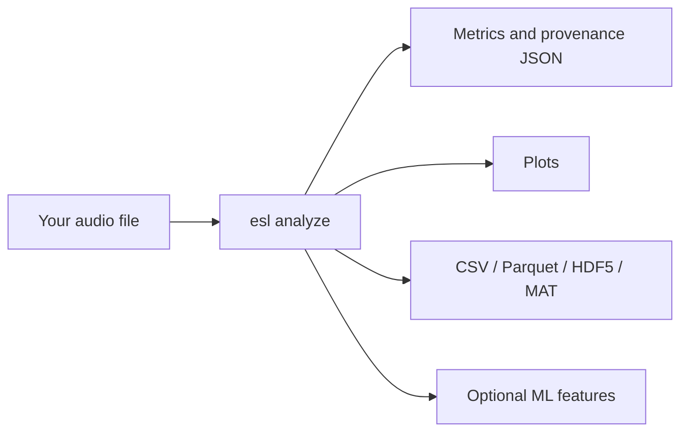

Plain English: one command can give you a readable report now and structured
data later. You do not need to decide your entire research program before
looking at the first graph.

## 2. What This Is and Is Not

### The short version

`esl` is a command-line toolkit for making a durable, inspectable statement
about an audio recording. It can answer questions such as: *when did the
recording change? which interval is worth listening to? how does this room
response decay? which files resemble this example? what did the recorder,
decoder, calibration profile, and analysis configuration contribute to this
number?* It is designed to return both a convenient answer and the context
needed to challenge that answer later.

It is not a black box that converts a WAV file into truth. Audio analysis is a
chain of choices: microphone, placement, gain, format, decoder, channel order,
window, feature, normalization, threshold, aggregation, and interpretation.
`esl` makes those choices explicit wherever it can. That is the point. A
smaller result with stated assumptions is more useful than a dramatic result
with no path back to the audio.

### What `esl` is

#### A reproducible measurement workbench

Use `esl` when you need an analysis result that can travel with its method.
`esl analyze` records resolved configuration, selected metrics, library
versions, decoder provenance, channel information, validity flags, calibration
state, and a `pipeline_hash`. The JSON is not merely an export format. It is a
compact measurement record that tells a collaborator what was actually run.

For a simple file, that may feel excessive. For a set of recordings collected
over months, a room-simulation comparison, or an ML training corpus, it is the
difference between a result that can be checked and one that can only be
remembered. The first useful habit is therefore simple: keep the command,
configuration, output JSON, and source identifier together.

#### A multichannel-first audio analysis toolkit

`esl` accepts one channel through larger arrays without silently treating every
recording as mono. It preserves per-channel results, labels aggregate values,
and exposes the downmix or pooling policy used by a metric. This matters when a
bird call is visible only on one microphone, when an array has a failed channel,
when left and right differ, or when an architectural render carries separate
receiver signals.

For Ambisonics and spatial material, `esl` can use declared metadata such as
channel order, normalization, and labels. It can also use a sidecar when a
filename is not enough. It does not infer a spatial convention from optimism.
If the recording says four channels but does not say whether they are ACN/SN3D,
FuMa, WXYZ, or something else, the correct response is to retain the
uncertainty until you supply defensible metadata.

#### A tool for finding, reviewing, and exporting moments

Long recordings are usually not hard because they contain too little sound.
They are hard because they contain too much unreviewed sound. `esl moments
extract` converts a ranking policy into timestamped candidate clips and a CSV
review record. You can request one candidate with `--single`, a shortlist with
`--top-k`, or all detected candidates. You can set pre-event and post-event
context so the exported WAV does not begin in the middle of the thing you need
to understand.

Novelty, level, spectral change, or an anomaly score can prioritize review. A
score is not a label. The highest-ranked clip may be a bird phrase, a door,
wind on a microphone, a gain change, or the beginning of a useful question.
`esl` helps make that review bounded and reproducible; it does not remove the
need to listen, inspect a plot, or record a human decision.

#### A bridge between acoustic domains

The same recording can matter to different people for different reasons. An
ecologist may need a band-energy contrast and a time series. An acoustic
consultant may need an impulse-response decay estimate, clarity values, and
variant comparison. An engineer may need clipping, level, spectral features,
and a CSV suitable for a measurement workflow. An ML practitioner may need a
FrameTable, a tensor layout, and a dataset manifest that does not leak adjacent
audio between train and evaluation splits.

`esl` provides a common analysis substrate for those workflows while keeping
their assumptions visible. A metric does not become ecological merely because
it was calculated outdoors, architectural merely because the file was called
`room.wav`, or ML-ready merely because it was saved as an array. The surrounding
metadata and validation practice determine what the value can support.

#### A long-archive and batch-processing tool

`esl` is designed to stream, chunk, shard, and summarize audio that cannot be
comfortably loaded as one giant array. A multi-day RF64 file, a directory of
daily recordings, or a calendar-aware shard manifest can be processed as an
ordered archive. This lets you find candidate moments, make trends, retrieve
similar intervals, and write appendable feature data without pretending that
years of audio belong in RAM.

Large-file support is not a promise that every operation is cheap. A full
self-similarity matrix grows rapidly with the number of frames, and dense
feature output can be larger than expected. `esl` exposes chunk and shard
controls so you can choose an appropriate time scale and storage strategy. Read
[RF64 and Large Files](RF64_AND_LARGE_FILES.md) before starting an analysis
whose duration is measured in days, years, or alarming quantities of GB.

#### A transparent, inspectable implementation

An audio-analysis tool earns trust by showing its work. For that reason, `esl`
tries to put the ordinary but decisive details in the result: which decoder
opened the file, which channel count and sample rate it observed, which metric
versions ran, whether calibration was applied, which validity flags were
raised, and which resolved settings formed the `pipeline_hash`. A result should
remain intelligible after the terminal scrollback is gone and after the person
who ran the command has moved on to another project.

That does not mean every number is equally certain. A clipped signal can still
have a peak value, but the clipping flag matters. An SNR estimate can still be
useful, but it should travel with its confidence and method. An impulse-response
fit can still report RT60, but its fit quality and detection state tell you
whether that value deserves weight. `esl` is designed to preserve these
distinctions in the data model rather than hiding them behind a single,
overconfident summary score.

Open source is part of this contract, not a decorative label. You can inspect
metric implementations, tests, formulas, attribution, and cited methods in the
repository. You can also decide that a metric's assumptions do not match your
question and select another one. The toolkit is intended to make disagreement
productive: compare configurations, rerun a fixture, examine a plot, and say
precisely where two workflows differ.

#### A command-line tool with optional visual evidence

The command line is the primary interface because a command can be copied into
a lab notebook, a shell script, a batch job, or a methods section. It also
means `esl` does not require an account, a browser tab, a remote control plane,
or an always-running graphical application before you can inspect one WAV.
Commands produce files that remain yours: JSON, CSV, Parquet, HDF5, MAT, WAV
clips, and static or interactive plots.

That command-line choice is not a demand that users stare at text all day.
Plots are evidence, not an afterthought. Spectrograms, level trends, novelty
curves, similarity matrices, decay curves, and batch exports support the
question that comes after a number: *does this claim look plausible in the
audio itself?* Run with plotting options, open the generated artifact, and
listen to the corresponding interval. A plot can expose a bad channel, a
decoder surprise, a gain step, or a meaningless threshold much faster than a
column of decimals.

The interface therefore favors a simple progression. Type one command for a
first answer. Add an output directory when you need durable artifacts. Add a
calibration file, channel metadata sidecar, shards, or ML export only when the
question demands them. The beginner path and the research path should share a
method, not require two unrelated products.

#### A composable SDK, not a locked analysis service

`esl` is meant to work inside a wider practice. A field team can use it after a
deployment. A consultant can use it after a room simulator exports receiver
signals. A researcher can call its Python APIs from a notebook. A data engineer
can build a scheduled batch workflow around its manifests and appendable
FrameTables. The same output contract is intended to support all of those
uses, so a quick command-line inspection does not paint a project into a corner
when it grows.

This also means the toolkit should be conservative about ownership. It does not
claim your recordings, prescribe a cloud platform, or insist that every
workflow use its database. It aims to interoperate through documented files,
schemas, and explicit metadata. If another tool is better at annotation,
curation, statistical modeling, listening, or reporting, use that tool and
retain the `esl` provenance beside the handoff. A healthy pipeline is usually a
chain of specialized tools, not one application pretending to be all of them.

The practical payoff is freedom to begin with a single file and still retain a
route to batch processing, peer review, or model training. The discipline is
the same at every scale: preserve the source identity, declare the
configuration, retain the output, and state what the result does and does not
mean.

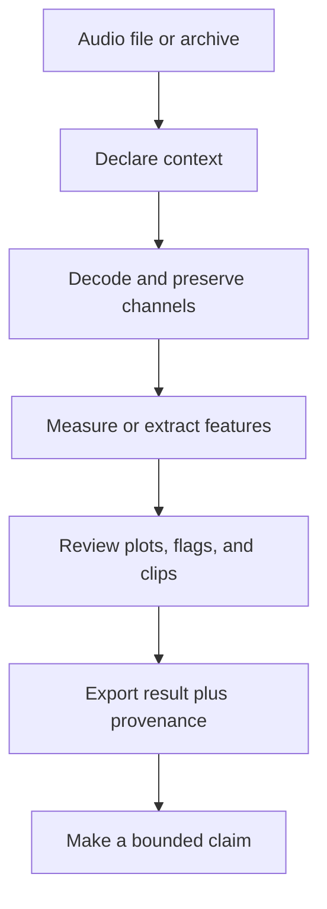

Plain English: `esl` is built to move from an audio file to a reviewable
analysis package, not from an audio file to an unexplained verdict.

### What `esl` is not

#### Not an audio editor or a digital audio workstation

`esl` analyzes, exports, and extracts clips. It is not intended to replace a
DAW, waveform editor, non-linear video editor, or live performance tool. Use a
dedicated editor when your primary job is arranging, cutting by hand, mixing,
restoring a performance, or producing a finished soundtrack. Use `esl` when
your primary job is measuring, ranking, comparing, documenting, or preparing
audio for a reproducible downstream workflow.

This boundary is useful rather than limiting. A DAW is excellent at helping a
person shape sound. `esl` is excellent at helping a person state what an
analysis did to sound. You can use both: export a candidate clip with `esl`,
review it in an editor, then place the human annotation back beside the CSV and
provenance record.

#### Not a replacement for field instrumentation or a measurement protocol

`esl` can report dBFS from decoded samples without a physical calibration. SPL,
dBA, dBC, and pressure-chain results require a documented calibration model.
Entering `0 dBFS = 94 dBA` is an assumption supplied by a user; it is not a
property discovered inside an arbitrary recording. Microphone sensitivity,
preamp gain, ADC range, weighting, reference tone, recorder gain state, and
deployment practice all matter when a result will be interpreted as a physical
level.

Use a calibrated sound level meter, calibrator, microphone documentation, and a
field or laboratory procedure when the question requires them. `esl` can carry
the resulting assumptions and help verify a calibration tone workflow. It
cannot repair an unknown microphone position, recover a gain setting that was
never recorded, or turn clipped audio into a compliant measurement.

#### Not a universal sound recognizer

`esl` can produce features, similarity rankings, novelty curves, anomaly
scores, and model-ready tensors. None of those automatically names a source.
To recognize species, machines, instruments, spoken words, or acoustic events,
you need an appropriate model, representative labeled data, a stated
evaluation split, and a validation protocol that matches the deployment.

Similarity is especially easy to overread. A query result means that one file
is close to another under the selected representation and distance function. It
does not mean the recordings share a source, cause, location, or ecological
meaning. Use the ranking to reduce review time, then listen and inspect the
evidence. See [Similarity Search](SIMILARITY_SEARCH.md) and
[ML Features](ML_FEATURES.md) for the contracts behind those outputs.

#### Not a standards-certification engine

Some `esl` metrics are implementation-aligned measurements, some are research
features, and some are explicitly labeled proxies. A proxy can be useful for
comparison, screening, and hypothesis generation without being a certified
substitute for a regulated procedure. RT60, clarity, loudness, and soundscape
metrics all depend on signal conditions, definitions, bandwidth, fit range,
calibration, and standards context.

If a project requires compliance, legal defensibility, occupational exposure
assessment, building-code sign-off, or a standards-specific procedure, identify
the governing standard and use a complete validated workflow. `esl` can be one
component of that workflow when its output, inputs, and limitations match the
requirement. It should not be presented as a certificate generator because it
printed a number with three decimal places.

#### Not a substitute for human interpretation

Plots can reveal structure, and metrics can make comparisons repeatable, but
they do not know your study question. A novelty peak does not know whether it
is scientifically important. An NDSI value does not know whether a local band
choice makes ecological sense. A room metric does not know which listener,
source, or use case matters. A model score does not know whether its labels
were biased or its evaluation split leaked time-adjacent audio.

Use `esl` to make the numerical and procedural part of a decision explicit.
Then bring listening, domain knowledge, field notes, drawings, annotations,
ground truth, and skeptical review to the interpretation. The right outcome is
often a narrower claim, a better next measurement, or an honest statement that
the current audio cannot answer the question alone.

### A practical decision guide

Choose `esl` when you can complete the sentence: “I have this audio, I want to
measure or compare this property, and I am willing to retain the assumptions
that make the result interpretable.” Start with `esl simple` or `esl analyze`
for one file; use `esl moments extract` for reviewable candidate clips; use
`esl similar` for retrieval; use `esl shard` for ordered archives; and use the
FrameTable export when the next stage is ML.

Pause before using `esl` alone when the sentence is instead: “I need a legal
certificate,” “I need to know the species without labels,” “I need to repair a
bad recording,” “I need to mix this album,” or “I need a physical measurement
but know nothing about the recording chain.” Those are different problems.
They may still use audio analysis, but they require other instruments, tools,
evidence, or people.

When a result depends on calibration, decoder choice, channel convention, or a
proxy assumption, `esl` records that context in the output JSON. See
[Schema](SCHEMA.md) for the exact contract and [Metrics Reference](METRICS_REFERENCE.md)
for what each metric declares about units, aggregation, calibration, and
streamability.

## 3. Five Things You Can Do Today

### Analyze one recording

```bash
esl simple forest_morning.wav
esl analyze forest_morning.wav --out-dir out --plot --ml-export
```

Use `simple` when you want a short answer. Use `analyze` when you want durable
JSON, plots, and exports.

### Find the single most interesting moment

```bash
esl moments extract forest_morning.wav \
  --out out/moments --single --rank-metric novelty_curve --event-window 12
```

The output includes a clipped WAV and a CSV row with its timestamp. Change
`--event-window`, or use `--window-before` and `--window-after`, to decide how
much context travels with the event.

### Find several unusual moments

```bash
esl moments extract forest_morning.wav \
  --out out/top_moments --top-k 20 --rank-metric novelty_curve \
  --window-before 5 --window-after 15
```

### Find files that sound like a query

```bash
esl similar query_frog_call.wav recordings/ \
  --out out/similar --top-k 10 --feature-set all
```

### Make similarity and novelty plots

```bash
esl analyze input.wav --out-dir out --plot --similarity-matrix --novelty-matrix
```

For exact terminology and defaults, see [Novelty and Anomaly](NOVELTY_ANOMALY.md)
and [Similarity Search](SIMILARITY_SEARCH.md).

## 4. Read the Results Without Guessing

The analysis JSON contains four ideas:

- `metadata`: the file, decoder, channel layout, calibration, device, and
  assumptions
- `metrics`: values, time series, units, confidence, and metric definitions
- `artifacts`: paths to larger sidecars such as FrameTables
- `pipeline_hash`: a compact fingerprint of the resolved configuration,
  metrics, and runtime library versions

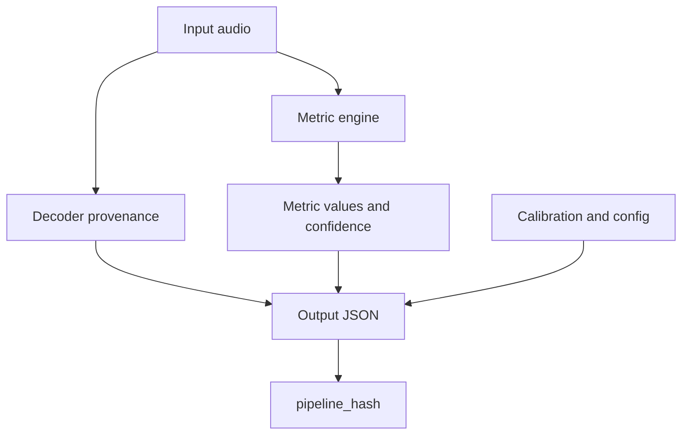

`pipeline_hash` is built deterministically from the resolved configuration,
metric list, window/hop settings, and library versions:

$$
H = \operatorname{hash}(C, M, W, L)
$$

where $C$ is the resolved configuration, $M$ is the selected metric list, $W$
is the frame/hop configuration, and $L$ is the library-version map.

Plain English: if the hash changes, something important about the processing
recipe changed. “I think we used the same settings” is not a reproducibility
method.

### Units matter

- `dBFS`: level relative to digital full scale; this needs no physical
  calibration.
- `SPL`, `dBA`, `dBC`: physical or weighted acoustic levels; these need an
  explicit calibration assumption.
- `ratio`, `Hz`, `s`, `ms`, `deg`: feature units, not sound-pressure levels.

Do not compare `dBFS` from two unrelated recorders as though it were a field
measurement. Calibrate first.

## 5. Calibration: From Digital Samples to Useful Level Data

The minimum calibration mapping is simple:

```yaml
dbfs_reference: 0.0
spl_reference_db: 94.0
weighting: A
```

Then run:

```bash
esl analyze recorder.wav --calibration calibration.yaml --out-dir out --json out/analysis.json
```

For a pressure-chain conversion, add microphone sensitivity, preamp gain, and
ADC full-scale voltage. Validate the setup with a known tone:

```bash
esl calibrate check calibration_tone.wav --calibration calibration.yaml --out out/calibration_check.json
esl calibrate verify
```

The basic mapping is:

$$
L_{\mathrm{SPL}} = L_{\mathrm{dBFS}} + \left(L_{\mathrm{ref}} - L_{\mathrm{dBFS,ref}}\right)
$$

where $L_{\mathrm{ref}}$ is the known physical reference level and
$L_{\mathrm{dBFS,ref}}$ is its measured digital level.

Plain English: calibration establishes the offset between what the recorder
stores and what the microphone experienced. Keep the profile with the project.

Read [Schema](SCHEMA.md) and [Metrics Reference](METRICS_REFERENCE.md) before
claiming a calibrated result in a report or publication.

## 6. Multi-Channel, Ambisonics, and Spatial Metadata

`esl` preserves channels rather than silently forcing a downmix. Outputs state
how aggregate values were made, and spatial metrics declare their assumptions.

For an Ambisonics or array recording whose filename is not enough to identify
the convention, use a sidecar:

```json
{
  "layout_family": "ambisonic",
  "layout_hint": "ambisonic_b_format",
  "channel_labels": ["W", "Y", "Z", "X"],
  "ambisonics": {
    "order": 1,
    "component_order": "ACN",
    "normalization": "SN3D"
  }
}
```

```bash
esl analyze field_array.wav --spatial-metadata-sidecar field_array.spatial.json
```

The sidecar can clarify channel labels, Ambisonics order, channel order,
normalization, layout, and geometry. It cannot change the number of channels
the decoder actually found. That is intentional.

For terminology and full sidecar behavior, see [Shard Workflows](SHARD_WORKFLOWS.md#spatial-and-ambisonics-sidecars).

## 7. Architectural and Impulse-Response Work

For an impulse response, request the architectural metrics explicitly:

```bash
esl analyze room_ir.wav --out-dir out --json out/room_ir.json \
  --metrics rt60_s,edt_s,clarity_c50_db,clarity_c80_db,definition_d50
```

Typical questions:

- How long does sound persist? Use `rt60_s` and `edt_s`.
- Is speech likely to retain early energy? Use `clarity_c50_db` and `definition_d50`.
- Is music detail likely to remain distinct? Use `clarity_c80_db`.

The decay model is commonly summarized as:

$$
E(t) \approx E_0 10^{-3t/T_{60}}
$$

where $E(t)$ is decay energy at time $t$, $E_0$ is initial energy, and $T_{60}$
is the 60 dB decay time.

Plain English: the metric estimates how quickly a room response fades. Inspect
the fit quality and validity flags, especially if the tail has weak SNR.

See [Metrics Reference](METRICS_REFERENCE.md#architectural-acoustics-metrics)
for definitions and limitations.

## 8. Long Files, RF64, and Shards

Do not load a multi-day or multi-year recording just because the filename ends
in `.wav`. Use chunking for one large file:

```bash
esl analyze daylong.rf64 --out-dir out \
  --chunk-hours 1 --streamable-only --summary-only \
  --frame-table-csv out/frame_table.csv \
  --checkpoint-dir out/checkpoints --resume
```

If the deployment already produces hourly or daily files, make a shard manifest:

```bash
esl shard index archive/ --out out/archive_manifest.json \
  --calendar-start 2026-01-01T00:00:00Z \
  --calendar-timezone America/New_York

esl shard analyze out/archive_manifest.json --out out/archive_analysis \
  --chunk-hours 1 --streamable-only --summary-only \
  --frame-table-dir out/frame_tables --resume
```

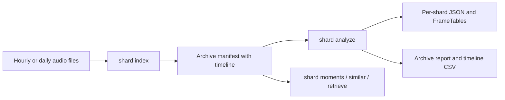

Use `esl shard moments` to find the most novel events across the full archive,
and `esl shard retrieve` to find query-like time windows. For a representative
performance check before a huge spatial query, run:

```bash
esl shard profile-retrieve out/archive_manifest.json query.wav \
  --out out/spatial_profile --max-shards 100 --spatial-mode append
```

Read [RF64 and Large Files](RF64_AND_LARGE_FILES.md) and
[Shard Workflows](SHARD_WORKFLOWS.md) before planning a multi-year run.

## 9. FrameTables and ML Exports

Use `--ml-export` for a single analysis product, or FrameTable sidecars for
long runs:

```bash
esl analyze input.wav --out-dir out --ml-export

esl shard dataset out/archive_analysis/shard_analysis_report.json \
  --out out/archive_dataset_manifest.json --split-ratios 0.8,0.1,0.1
```

The canonical tensor layout is:

$$
\mathbf{T} \in \mathbb{R}^{C \times F \times K}
$$

where $C$ is channel count, $F$ is frame count, and $K$ is the number of
feature columns.

Plain English: tabular exports give classical ML one row per frame; tensor
exports give deep-learning systems a declared channel, frame, feature layout.
Do not infer array axes from whatever shape happened to arrive in NumPy.

See [ML Features](ML_FEATURES.md) for naming rules, split semantics, and large
archive guidance.

## 10. Input Formats, Decoders, and Preparing Audio

### What files can `esl` open?

Native decoding through SoundFile covers WAV, RF64, FLAC, AIFF/AIF, and CAF.
When a format needs it, `esl` uses FFmpeg/FFprobe for MP3, AAC, OGG, Opus, WMA,
ALAC, M4A, and related container variants. SOFA impulse responses are supported
when the required HDF5 dependency is installed.

| You have | Recommended action | Important note |
| --- | --- | --- |
| ordinary WAV or FLAC | run `esl analyze` directly | SoundFile is normally used |
| MP3, AAC, M4A, or Opus | run `esl doctor input.ext` first | install FFmpeg if decoding fails |
| a WAV approaching 4 GB | use RF64 for future captures | classic RIFF WAV has a size limit |
| many hours in separate files | make a shard manifest | do not concatenate just to analyze |
| SOFA spatial IR | run analysis with the SOFA file | inspect channel and spatial metadata |

Use this before a difficult first run:

```bash
esl doctor input.wav
```

The doctor output tells you the available decoder path, sample rate, channels,
duration, file size, and common long-file risks. Its purpose is not to judge
your audio. It is to stop a 12-hour analysis from failing 11 hours and 58
minutes in because FFmpeg was missing.

### Sample rate, bit depth, and channels

Sample rate tells you the time grid; bit depth or floating point encoding tells
you how samples are represented. Channel count tells you how many simultaneous
signals exist. They are different facts, and confusing them makes troubleshooting
unnecessarily theatrical.

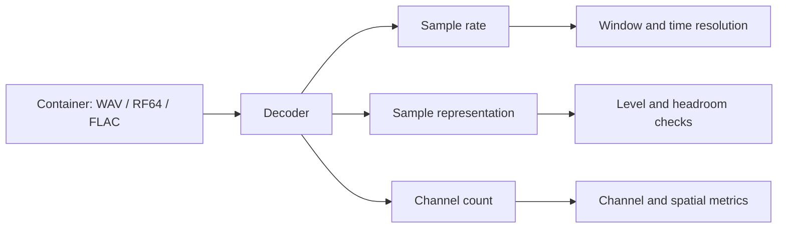

`esl` stores decoder provenance in output JSON. If a compressed file passes
through FFmpeg, the result records the FFmpeg version and FFprobe stream summary.
That is useful when two machines disagree about an awkward legacy file.

### Resampling deliberately

Use `--sample-rate` only when you want a target processing rate:

```bash
esl analyze input_96k.wav --sample-rate 48000 --out-dir out --plot
```

Resampling can save storage and processing time, but it removes information
above the new Nyquist frequency. If ultrasonic content, high-frequency insect
calls, or source localization cues matter, select the rate as a scientific
decision, not a convenience flag.

## 11. Metrics: Ask a Small Question First

The metric catalog is intentionally broad. Start with the question, then choose
the metric family instead of collecting every number because storage is cheap.

| Question | Useful first metrics | What they describe |
| --- | --- | --- |
| Is the file loud or clipped? | `rms_dbfs`, `peak_dbfs`, `crest_factor`, `dc_offset` | digital level, headroom, and signal-health clues |
| Is there useful signal above background? | `snr_db`, `noise_floor_dbfs` | a level contrast estimate and confidence |
| What frequencies dominate? | spectral centroid, bandwidth, rolloff, flatness | spectral balance and texture |
| Is something changing? | `novelty_curve`, spectral flux, change detection | frame-to-frame difference |
| Is an ecosystem soundscape diverse? | NDSI and ecoacoustic indices | band-energy balance and temporal structure |
| Does a room response decay well? | RT60, EDT, C50, C80, D50 | reflection and decay behavior |
| Does a multichannel scene differ spatially? | IACC, ILD, ITD, coherence | channel relationship proxies |

For the authoritative definition, formula, units, aggregation rule, calibration
dependency, and streamability of every metric, use [Metrics Reference](METRICS_REFERENCE.md).

### A reliable level example

For a sample sequence $x[n]$ with $N$ samples, RMS is:

$$
x_{\mathrm{RMS}} = \sqrt{\frac{1}{N}\sum_{n=0}^{N-1}x[n]^2}
$$

where $x[n]$ is the sample at index $n$ and $N$ is the number of samples in the
measurement window.

The corresponding dBFS value is:

$$
L_{\mathrm{RMS,dBFS}} = 20\log_{10}\left(\max\left(x_{\mathrm{RMS}}, \epsilon\right)\right)
$$

where $\epsilon$ is a very small positive floor that keeps silence finite.

Plain English: RMS is a stable estimate of average signal strength. Peak tells
you the tallest instant. Crest factor compares the two. None of them becomes SPL
until you supply a physical calibration relationship.

### Confidence and validity flags are not decoration

Some metrics can be uncertain because the signal is too quiet, the tail is too
short, a fit is poor, or a required calibration assumption is missing. Check:

- `metadata.validity_flags`
- each metric's `confidence`
- warnings in `metadata.warnings`
- IR fit-quality details for room metrics

If a metric has a low confidence, do not discard it automatically. Use it as a
signal to inspect the waveform, spectrogram, SNR, and assumptions before making
a claim.

## 12. Windows, Hops, and Time Resolution

Most time-varying features are calculated on overlapping frames. `--frame-size`
controls how much audio each calculation sees; `--hop-size` controls how often
the calculation moves forward.

```bash
esl analyze input.wav --frame-size 4096 --hop-size 1024 --out-dir out
```

At sample rate $f_s$, frame duration and hop duration are:

$$
T_{\mathrm{frame}} = \frac{N_{\mathrm{frame}}}{f_s}, \qquad
T_{\mathrm{hop}} = \frac{N_{\mathrm{hop}}}{f_s}
$$

where $N_{\mathrm{frame}}$ and $N_{\mathrm{hop}}$ are frame and hop sizes in
samples, and $f_s$ is sample rate in Hz.

Plain English: a longer frame gives more frequency detail but blurs rapid events;
a shorter frame tracks quicker changes but gives coarser frequency detail.

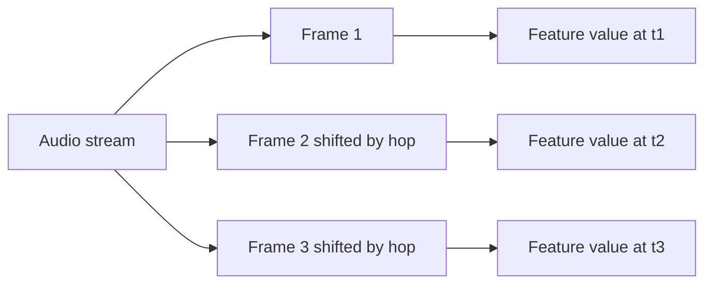

Practical starting points:

| Material | Frame / hop starting point | Why |
| --- | --- | --- |
| speech, general soundscape | 2048 / 512 samples | balanced default |
| transient-rich events | 1024 / 256 samples | quicker time response |
| slow level trends | 4096 / 1024 samples | smoother summaries |
| very long archive reporting | chunks in minutes or hours, frames in samples | memory-safe processing with normal feature resolution |

For minute-, hour-, or day-scale analysis chunks, use `--chunk-minutes`,
`--chunk-hours`, or `--chunk-days`. A chunk is a memory-management unit; it is
not necessarily the same thing as a feature frame. See [Signal and Window Visual Guide](SIGNAL_WINDOWS_VISUAL_GUIDE.md).

## 13. Novelty, Anomaly, and Interesting Moments

Novelty is a measure of change relative to nearby audio. It is not a universal
definition of importance. A quiet rare bird call can be important and have a
modest novelty score; a slammed door can be very novel and scientifically boring.
The right workflow combines ranking with listening and context.

### The standard first pass

```bash
esl analyze input.wav --out-dir out --plot --novelty-matrix
esl moments extract input.wav --out out/moments --top-k 10 --rank-metric novelty_curve
```

The novelty curve begins with a feature representation, compares nearby frames,
rectifies or normalizes the result, and can use peak picking to nominate events.

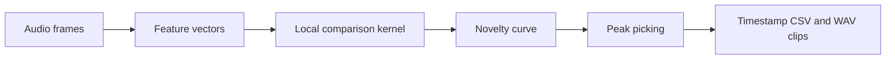

A simple spectral-change form is:

$$
v[t] = \sum_k \max\left(0, X[k,t] - X[k,t-1]\right)
$$

where $X[k,t]$ is a nonnegative feature value at frequency or feature index $k$
and frame $t$.

Plain English: this counts positive upward changes from one frame to the next.
Different novelty methods use richer features and kernels, but the intuition is
the same: find moments that differ from their local neighborhood.

### Similarity matrix versus novelty matrix

- A similarity matrix compares every selected frame to every other selected
  frame. Repeated scenes become blocks or diagonal patterns.
- A novelty matrix applies a local contrast operation to self-similarity,
  emphasizing boundaries between sections or acoustic states.

Use a similarity matrix when you ask “when does this sound recur?” Use a novelty
matrix when you ask “where does the scene change?” Read [Novelty and Anomaly](NOVELTY_ANOMALY.md)
for kernel, normalization, and peak-picking defaults.

### Do not over-interpret an anomaly score

An anomaly or isolation-forest score is a ranking signal, not a species label,
incident report, or causal explanation. Export the scores, inspect the selected
clips, and preserve the configuration hash so another analyst can reproduce the
candidate list.

## 14. Plots That Help You Decide What to Do Next

Use `--plot` for static PNGs. Use `--interactive` when a Plotly output helps you
inspect a long time series. Add `--show` only when you want the operating system
to open generated files automatically.

```bash
esl analyze input.wav --out-dir out --plot --interactive \
  --plot-metrics rms_dbfs,spl_a_db,novelty_curve,snr_db
```

| Plot | Good first question | What to look for |
| --- | --- | --- |
| waveform | is there clipping or silence? | flat tops, DC drift, recording gaps |
| spectrogram | what occupies the spectrum over time? | bands, impulses, periodic calls, machinery |
| mel spectrogram | what changes perceptually? | broad energy patterns and repeated texture |
| LTSA | what dominates over a long period? | persistent tonal or broadband energy |
| SPL/dBFS over time | when did level change? | activity cycles and obvious artifacts |
| SNR over time | when is analysis trustworthy? | low-confidence segments |
| novelty curve | where should I listen? | isolated peaks and sustained transitions |
| RT60 decay | is an IR fit plausible? | usable decay range and fit quality |

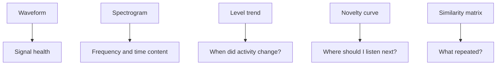

When a graph surprises you, export the surrounding audio rather than adjusting
parameters until the graph agrees with your expectation. The audio is allowed
to have the last word.

## 15. Batch Analysis, Projects, and Design Variants

Use `batch` for independent files such as a corpus. Use `shard analyze` for
ordered pieces of one deployment. This distinction matters because an archive
has a timeline and a corpus does not.

```bash
esl batch recordings/ --out out/batch --csv --parquet --hdf5 --plot
```

For architectural design variants or a named study, retain context with project
and variant values:

```bash
esl analyze restaurant_design_A.wav --project restaurant_design --variant A --out-dir out/A
esl analyze restaurant_design_B.wav --project restaurant_design --variant B --out-dir out/B
esl project compare --project restaurant_design --root out --baseline A
```

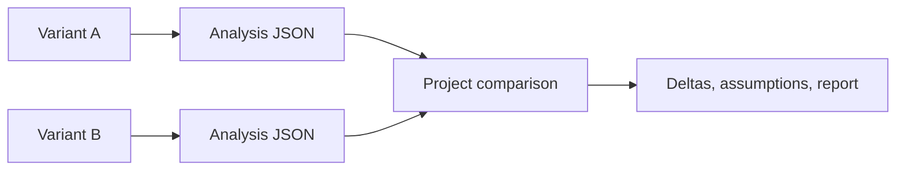

Keep every variant's source audio, calibration profile, metrics, and window
settings aligned. A difference between A and B is only useful if the workflow
behind the difference stayed comparable.

## 16. Interoperability and Export Choices

`esl` can emit JSON, CSV, Parquet, HDF5, MATLAB `.mat`, and compatibility-style
CSV outputs for measurement workflows. Choose the file type based on how it will
be used next.

| Format | Choose it when | Avoid it when |
| --- | --- | --- |
| JSON | provenance, nested metadata, a single analysis report | you need millions of frame rows |
| CSV | a person needs to inspect or import a small table | data types or scale matter |
| Parquet | analytics, dataframes, long FrameTables | the recipient only has a spreadsheet |
| HDF5 | appendable numeric arrays and scientific tooling | a plain-text review is needed |
| MAT | MATLAB workflows | a language-neutral archive is required |

Example:

```bash
esl analyze input.wav --out-dir out \
  --json out/analysis.json --csv out/summary.csv \
  --parquet out/summary.parquet --hdf5 out/analysis.h5 --mat out/analysis.mat
```

The output schema records weighting curves, level definitions, configuration,
and provenance. Compatibility CSV is an exchange starting point, not a claim
that every vendor application has identical hidden assumptions. Document your
window duration, weighting, calibration mapping, and channel aggregation when
cross-checking with another system.

## 17. Environmental Acoustic Monitoring Workflows

Environmental audio projects are strongest when they treat recordings as
measurements with context, not just files with evocative names. Keep a small
deployment record beside the audio that states:

- recorder model, microphone, gain, and channel mapping
- site identifier and coordinates at the precision appropriate for the project
- deployment start/end time and time zone
- sample rate, bit depth, and recording schedule
- calibration method and reference tone details
- weather, maintenance, and known disturbances

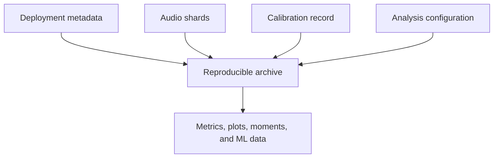

### A practical field workflow

```bash
# 1. Index an hourly or daily deployment with a real archive clock.
esl shard index deployment_audio/ --out out/manifest.json \
  --calendar-start 2026-04-01T00:00:00Z --calendar-timezone America/New_York

# 2. Run a streaming-safe archive pass with FrameTable sidecars.
esl shard analyze out/manifest.json --out out/analysis \
  --chunk-hours 1 --streamable-only --summary-only \
  --frame-table-parquet-dir out/frame_tables --checkpoint-dir out/checkpoints --resume

# 3. Find candidate moments for listening and annotation.
esl shard moments out/manifest.json --out out/moments --top-k 50 \
  --rank-metric novelty_curve --window-before 10 --window-after 20

# 4. Summarize archive-level change and calmness proxies.
esl shard insights scene out/analysis/shard_analysis_report.json --out out/scene
esl shard insights calmness out/analysis/shard_analysis_report.json --out out/calmness.json
```

Use ecoacoustic indices as *summaries to compare with context*, not as a
substitute for listening or annotation. An index can reveal a seasonal shift,
equipment fault, human disturbance, or microphone wind artifact. It cannot
decide which of those stories is true by itself.

### Diversity, calmness, and soundscape change

`esl` provides soundscape-oriented features and archive insights that can help
organize large deployments. Their most defensible use is comparative:

- compare a site to itself across time with the same capture chain
- compare treatment and control only after aligning calibration and schedule
- use visual trends to choose intervals for listening or annotation
- report the metric version, time scale, and exclusions

For a categorical frame-energy distribution $p_i$, entropy-style diversity has
the familiar form:

$$
H = -\sum_i p_i \log(p_i)
$$

where $p_i$ is the normalized share of energy or observations in category $i$.

Plain English: diversity measures how evenly a representation is spread. It does
not mean “ecosystem health” unless the study validates that relationship in its
own setting. See [Metrics Reference](METRICS_REFERENCE.md) and [References](REFERENCES.md).

## 18. Reproducibility, Review, and Research Handoff

Every serious analysis should be reviewable by someone who was not present when
you ran it, including future you. `esl` writes the materials needed for that
handoff directly into its outputs.

| Keep | Why it matters |
| --- | --- |
| original audio or immutable archive reference | lets others verify the source |
| analysis JSON | preserves metrics, metadata, warnings, and confidence |
| calibration profile | explains physical-level mapping |
| configuration and pipeline hash | identifies the exact processing recipe |
| FrameTable sidecars | supports later statistics and ML without rerunning audio |
| moments CSV and clips | makes candidate event review auditable |
| README or lab notebook | explains the study question and exclusions |

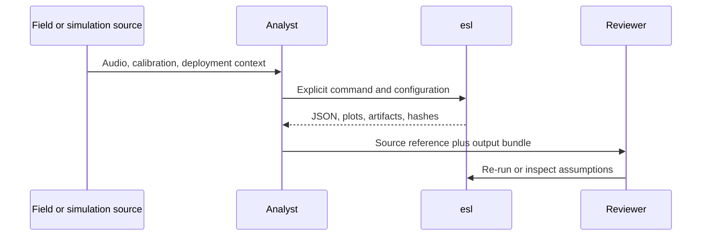

### Deterministic defaults are necessary, not sufficient

Fixed seeds and configuration hashes prevent accidental drift. They do not
repair an unclear question, a bad microphone placement, or a train/test split
that lets near-identical time periods leak into both sides. Good reproducibility
combines deterministic software with an explicit study design.

For ML work, consider holding out sites, devices, or time blocks rather than
randomly shuffling adjacent frames. The correct split follows the claim you want
to make. A model tested on another minute of the same recorder day is answering
a much easier question than a model tested on another season or site.

## 19. Common Workflows

| Goal | Start here |
| --- | --- |
| “What is in this file?” | `esl simple input.wav` |
| “Make a full report and plots.” | `esl analyze input.wav --out-dir out --plot` |
| “Find the weirdest bit.” | `esl moments extract input.wav --out out/moments --single` |
| “Find 33 unusual archive events.” | `esl shard moments manifest.json --out out/moments --top-k 33` |
| “Find recordings like this one.” | `esl similar query.wav corpus/ --out out/similar` |
| “Find matching moments inside an archive.” | `esl shard retrieve manifest.json query.wav --out out/retrieve` |
| “Export ML-ready data.” | `esl analyze input.wav --out-dir out --ml-export` |
| “Work safely on a huge file.” | `esl analyze input.rf64 --chunk-hours 1 --streamable-only --summary-only` |

More examples live in [Task Recipes](TASK_RECIPES.md) and the
[easy-script catalog](../scripts/easy/README.md).

## 20. When Something Goes Wrong

Start with the smallest diagnostic that can tell you something useful:

```bash
esl doctor input.wav
esl schema
esl --help
```

Common fixes:

- Compressed formats fail: install FFmpeg and make sure `ffprobe` is on `PATH`.
- `esl` is not found: activate your environment or run `python -m esl`.
- Huge file work fails: use RF64 where appropriate, chunking, FrameTable
  sidecars, checkpoints, and shards.
- SPL looks suspicious: check the calibration reference and verify a known tone.
- Spatial result looks wrong: supply a sidecar; do not rely on a filename guess.
- ML output is enormous: keep frame data as appendable CSV/Parquet/HDF5 and
  batch it downstream.

The full [Troubleshooting Guide](TROUBLESHOOTING.md) is deliberately more
detailed. Audio has many ways to be politely uncooperative.

## 21. Where to Go Next

- [Getting Started](GETTING_STARTED.md): first commands and common failure modes
- [Task Recipes](TASK_RECIPES.md): copy-paste workflows by goal
- [Metrics Reference](METRICS_REFERENCE.md): formulas, units, and assumptions
- [Novelty and Anomaly](NOVELTY_ANOMALY.md): novelty curves and matrices
- [Moments Extraction](MOMENTS_EXTRACTION.md): event selection and clips
- [Similarity Search](SIMILARITY_SEARCH.md): file and feature-vector comparison
- [Shard Workflows](SHARD_WORKFLOWS.md): long archives and calendar timelines
- [ML Features](ML_FEATURES.md): FrameTable and tensor contracts
- [References](REFERENCES.md): papers, standards, and implementation context

The detailed documentation is there when you need it. The first command is
still just:

```bash
esl analyze input.wav --out-dir out --plot
```

## Appendix: One-Page Command Card

Use this as the "I know what I want, just remind me of the command" page.

| Need | Command |
| --- | --- |
| Check installation or a file | `esl doctor [input.wav]` |
| Get a short summary | `esl simple input.wav` |
| Analyze and plot | `esl analyze input.wav --out-dir out --plot` |
| Extract one novel event | `esl moments extract input.wav --out out/moments --single` |
| Extract several events | `esl moments extract input.wav --out out/moments --top-k 20` |
| Compare a query to a folder | `esl similar query.wav corpus/ --out out/similar` |
| Index an archive folder | `esl shard index archive/ --out out/manifest.json` |
| Analyze a shard archive | `esl shard analyze out/manifest.json --out out/archive_analysis` |
| Find archive moments | `esl shard moments out/manifest.json --out out/moments --top-k 33` |
| Export ML features | `esl analyze input.wav --out-dir out --ml-export` |
| Check calibration | `esl calibrate check tone.wav --calibration calibration.yaml --out out/check.json` |
| View the output schema | `esl schema` |

If you want the exact flags, run `esl <command> --help`. If you want an
explanation of a result, start with the corresponding linked chapter above.
